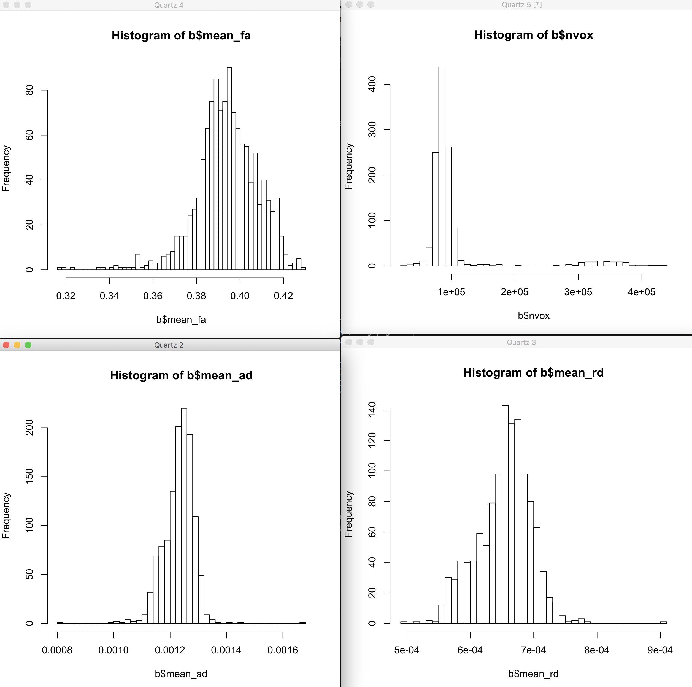

# 2019-02-14 09:12:45

Let's keep track of how we're running the FDT pipeline on our own data. First,
let's do it only for the people that have genotype data, as they'l likely be
used for gene expression project.

First, copy everything to the cluster so we can batch convert the data. We can
create a Globus script for that, getting the DICOM folders straight from the
README file to avoid any interactions with the previous DTI preprocessing.

First, start Globus on caterpie:

```bash
/usr/local/neuro/globusconnectpersonal-2.3.3/globusconnectpersonal -start \
    -restrict-paths r/mnt/shaw/MR_data_by_maskid
```

I need to run this in the same computer where globus connect personal is
running, because the same network path used to get directory names goes in the
Globus input file!

```bash
maskid_file=~/tmp/prs_dti.txt
out_dir=/scratch/sudregp/
net_dir=/mnt/shaw/

hpc=e2620047-6d04-11e5-ba46-22000b92c6ec
caterpie=74b32b98-a3aa-11e7-adbf-22000a92523b
myfile=~/tmp/dti_dcm_transfers.dat

ssh -qt helix.nih.gov "if [ ! -d ${out_dir}/dcm_dti ]; then mkdir ${out_dir}/dcm_dti/; fi";

rm -rf $myfile
for m in `cat $maskid_file`; do
    echo Copying $m
    ssh -qt helix.nih.gov "if [ ! -d ${out_dir}/dcm_dti/${m} ]; then mkdir ${out_dir}/dcm_dti/${m}; fi";
    scp -q ${net_dir}/MR_data_by_maskid/${m}/E*/cdi* helix:${out_dir}/dcm_dti/${m}/;

    # find name of date folders
    ls -1 $net_dir/MR_data_by_maskid/${m}/ | grep -e ^20 > ~/tmp/date_dirs;

    # for each date folder, check for dti scans
    cnt=1
    while read d; do
        grep dti $net_dir/MR_data_by_maskid/${m}/${d}/*README* > ~/tmp/dti;
        awk '{for(i=1;i<=NF;i++) {if ($i ~ /Series/) print $i}}' ~/tmp/dti | sed "s/Series://g" > ~/tmp/dti_clean
        while read line; do
            mr_dir=`echo $line | sed "s/,//g"`;
            echo "--recursive ${net_dir}/MR_data_by_maskid/${m}/${d}/${mr_dir}/ ${out_dir}/dcm_dti/${m}/${mr_dir}/" >> $myfile;
            let cnt=$cnt+1;
        done < ~/tmp/dti_clean;
    done < ~/tmp/date_dirs;
done;

# assuming globus cli is installed as in:
# pip2.7 install --upgrade --user globus-cli
~/.local/bin/globus transfer $caterpie $hpc --batch --label "dti copy" < $myfile
```

Next thing is to start converting them.

```bash
for m in `cat ~/tmp/prs_dti.txt`; do
    echo "bash ~/research_code/dti/convert_ncr_to_nii.sh /scratch/sudregp/dcm_dti/$m" >> swarm.ncr
done
swarm -t 2 --job-name ncr2nii --time 15:00 -f swarm.ncr --partition quick \
    --logdir trash_ncr2nii -m TORTOISE,afni
```

That matched exactly what I got from opening the .list file in DIFFCALC and
exporting the raw DWI (edti.list) to FSL UNSORTED format.

After this, it's just the exact same thing as the PNC pipeline, with probably
some changed in the bedpostx to only fit one orientation. In fact, I could do
that for the PNC as well, just so we don't have two different options.

# 2019-02-17 18:55:03

For the next step, we need to check who converted correctly. Maybe just check
the number of vectors in the gradient file against the number of converted
volumes in the NIFTI?

```bash
res_file=~/tmp/ncr_conversion.csv
echo mask.id,expected,converted,nii > $res_file;
cd /scratch/sudregp/dcm_dti
for m in `cat ~/tmp/prs_dti.txt`; do
    nvol=`cat ${m}/dwi_comb_cvec.dat | wc -l`;
    gradient_file=`/bin/ls -1 ${m}/ | /bin/grep cdi | tail -1`;
    nexp=`cat ${m}/${gradient_file} | wc -l`;
    let nexp=$nexp-1;  # removing first line
    if [ -e ${m}/dwi_comb.nii.gz ]; then
        nii='y';
    else
        nii='n';
    fi;
    echo $m,$nexp,$nvol,$nii >> $res_file;
done
```

Just noticed it'll be a bitch to get the sl_spec file for our data... we'll need
to run dcm2niix individually, then add to the sequence to offset the acquisiton
of 20 volumes that were later combined. Finally, we need to find a way to
combine in the 99 sequence... I sent an e-mail to Joelle to see if she can help.

# 2019-02-20 11:11:33

Joelle said that the temporal order for the slices in the diffusion protocol
will be interleaved, being a first pass through the volume to acquire the odd
slices then the next pass for the even slices.  This seems to be what is
reflected in the my-slspec.txt file.

So, I'll just go ahead and use the same slspec file that I created for the PNC
data, adjusting for the total number of slices. But that's the trick, as the
number of slices varies for each scan!!! OK, so we'll have to construct the
slices file on the fly.

## Copying data to NCR_SBRB

The problem of having this in scratch is that I'm the only one who can process
it. Also, it expires. So, let's copy the converted files to the shared space.
But we only copy the successful stuff, and the converted files. We can keep on
dealing with the rest of the DCMs later.

```bash
mkdir /data/NCR_SBRB/dti_fdt
for m in `cat ~/tmp/mylist.txt`; do
    mkdir /data/NCR_SBRB/dti_fdt/$m;
    echo $m;
    cd /scratch/sudregp/dcm_dti/${m};
    cp -r dwi_comb* /data/NCR_SBRB/dti_fdt/$m/;
    chgrp -R NCR_SBRB /data/NCR_SBRB/dti_fdt/$m;
    chmod -R 770 /data/NCR_SBRB/dti_fdt/$m;
done
```

Then, it's easy to do:

```bash
cd /data/NCR_SBRB/dti_fdt
for m in `cat list1`; do
    echo "bash ~/research_code/dti/fdt_ncr_eddy.sh /data/NCR_SBRB/dti_fdt/${m}" >> swarm.fdt;
done;
split -l 310 swarm.fdt
swarm -g 4 --job-name fdt --time 4:00:00 -f xaa --partition gpu \
    --logdir trash_fdt --gres=gpu:k80:2
```

I'm having to redo some of the conversions manually. Here's how I'm approaching
that:

```bash
cd ../0545; rm -rf QC __* dwi_comb* *proc mr_dirs.txt grad*; ls
bash ~/research_code/dti/convert_ncr_to_nii.sh /scratch/sudregp/dcm_dti/0545
fslinfo dwi_comb | grep -e "^dim4" && wc -l dwi_comb_cvec.dat && wc -l cdiflist0*
```

# 2019-02-22 10:04:30

Let's start running the first part of autoPtx for the IDs that finished eddy.
Note that here I'll need to change the assumptions because we have two different
bvals, as described in https://fsl.fmrib.ox.ac.uk/fsl/fslwiki/FDT/UserGuide.

I'm following the same steps I did for PNC, except that in that case I didn't
run model=2!

```bash
# run in helix so we don't overload BW filesystem
for m in `cat /data/NCR_SBRB/dti_fdt/autoptx1`; do
    if [ ! -e /data/NCR_SBRB/dti_fdt/${m}/eddy_s2v_unwarped_images.nii.gz ]; then
        echo $m;
    fi;
done
```

```bash
# run in helix so we don't overload BW filesystem
for m in `cat /data/NCR_SBRB/dti_fdt/done_eddy2.txt`; do
    echo Copying $m;
    cd /data/NCR_SBRB/dti_fdt/${m};
    cp eddy_s2v_unwarped_images.nii.gz data.nii.gz;
    cp dwi_comb_bval.dat bvals;
    cp eddy_s2v_unwarped_images.eddy_rotated_bvecs bvecs;
    cp b0_brain_mask.nii.gz nodif_brain_mask.nii.gz;
    chgrp NCR_SBRB data.nii.gz bvals bvecs nodif_brain_mask.nii.gz;
    chmod 770 data.nii.gz bvals bvecs nodif_brain_mask.nii.gz;
done
```

Then it's time to run autoPtx.

We can split it by users because it adds everything to the
same directory, and just increments the final subject list.

Run it a long interactive session, because even though it schedules bedpostx, it
still runs all kinds of registrations through FSL, so biowulf headnode won't cut
it! Also, it takes a while to load new scans because it does the processing in
between. So, it *might* be alright to do 400 or so scans at the same time. While
the scan is processing in the interactive node, it gives time for the ones
queued up to be evaluated. This way the queue doesn't get clogged up.

```bash
data='';
for m in `cat xab`; do
    data=$data' '${m}/data.nii.gz;
done
/data/NCR_SBRB/software/autoPtx/autoPtx_1_preproc $data;
```

And of course we still need part 2 when we're done.

# 2019-02-28 08:19:32

Let's start running part 2 while we wait on some manual conversions.

And we also need to figure out which IDs had the set_slice error, which might
indicate outliers from eddy:

```bash
for f in `grep -l set_slice trash_fdt/*o`; do
    head -n 2 $f | tail -n -1 | cut -d" " -f 5 | cut -d"/" -f 5 >> ~/tmp/set_slice.txt;
done
```

# 2019-03-01 15:14:28

Now that eddy is ran for all IDs, time to copy over the brain masks. When
autoptx1 is done, we can copy over the rest of the QC.

```bash
mkdir /data/NCR_SBRB/dti_fdt/summary_QC
cd /data/NCR_SBRB/dti_fdt/summary_QC/
mkdir brainmask
mkdir transform
mkdir DEC
mkdir SSE
for m in `cat ~/tmp/myids.txt`; do
    echo ${m}
    cp ../${m}/QC/brain_mask.axi.png brainmask/${m}.axi.png
    cp ../${m}/QC/brain_mask.sag.png brainmask/${m}.sag.png
    cp ../${m}/QC/brain_mask.cor.png brainmask/${m}.cor.png
done
```

Some IDs didn't have brain mask QC ready for some reason...

```bash
for s in `cat ~/tmp/myids.txt`; do
    if [ ! -e /data/NCR_SBRB/dti_fdt/${s}/QC/brain_mask.axi.png ]; then
        cd /data/NCR_SBRB/dti_fdt/${s};
        mkdir QC;
        @chauffeur_afni                             \
            -ulay  dwi_comb.nii.gz[0]                         \
            -olay  b0_brain_mask.nii.gz                        \
            -opacity 4                              \
            -prefix   QC/brain_mask              \
            -montx 6 -monty 6                       \
            -set_xhairs OFF                         \
            -label_mode 1 -label_size 3             \
            -do_clean
    fi;
done
```

Even though autoPtx is not done for all IDs yet, we can run our mean props
estimate just to see if we are getting that weird binormal distribution again...

```bash
mydir=/lscratch/${SLURM_JOBID}/
mean_props=~/tmp/mean_props.csv;
echo "id,mean_fa,mean_ad,mean_rd,nvox" > $mean_props;
for m in `cat ~/tmp/myids.txt`; do
    echo $m;
    cd /data/NCR_SBRB/dti_fdt/preproc/$m &&
    if [ -e dti_FA.nii.gz ]; then
        3dcalc -a dti_FA.nii.gz -expr "step(a-.2)" -prefix ${mydir}/my_mask.nii 2>/dev/null &&
        fa=`3dmaskave -q -mask ${mydir}/my_mask.nii dti_FA.nii.gz 2>/dev/null` &&
        ad=`3dmaskave -q -mask ${mydir}/my_mask.nii dti_L1.nii.gz 2>/dev/null` &&
        3dcalc -a dti_L2.nii.gz -b dti_L3.nii.gz -expr "(a + b) / 2" \
            -prefix ${mydir}/RD.nii 2>/dev/null &&
        rd=`3dmaskave -q -mask ${mydir}/my_mask.nii ${mydir}/RD.nii 2>/dev/null` &&
        nvox=`3dBrickStat -count -non-zero ${mydir}/my_mask.nii 2>/dev/null` &&
        echo ${m},${fa},${ad},${rd},${nvox} >> $mean_props;
        rm ${mydir}/*nii;
    else
        echo ${m},NA,NA,NA,NA >> $mean_props;
    fi
done
```

Our data looks a bit noisier than PNC, but at least we don't have the binormal
pattern anymore!



And there are some bad masks there as well, along with other bad DTI estimates
like PNC, so it will likely get better.

Let's also grab the movement variables:

```bash
out_fname=~/tmp/mvmt_report.csv;
echo "id,Noutliers,PROPoutliers,NoutVolumes,norm.trans,norm.rot,RMS1stVol,RMSprevVol" > $out_fname;
for m in `cat ~/tmp/myids.txt`; do
    echo 'Collecting metrics for' $m;
    if [ -e ${m}/eddy_s2v_unwarped_images.eddy_outlier_report ]; then
        noutliers=`cat ${m}/eddy_s2v_unwarped_images.eddy_outlier_report | wc -l`;
        # figuring out the percetnage of total slices the outliers represent
        nslices=`tail ${m}/eddy_s2v_unwarped_images.eddy_outlier_map | awk '{ print NF; exit } '`;
        nvol=`cat ${m}/dwi_comb_cvec.dat | wc -l`;
        let totalSlices=$nslices*$nvol;
        pctOutliers=`echo "scale=4; $noutliers / $totalSlices" | bc`;
        # figuring out how many volumes were completely removed (row of 1s)
        awk '{sum=0; for(i=1; i<=NF; i++){sum+=$i}; sum/=NF; print sum}' \
            ${m}/eddy_s2v_unwarped_images.eddy_outlier_map > outlier_avg.txt;
        nOutVols=`grep -c -e "^1$" outlier_avg.txt`;
        1d_tool.py -infile ${m}/eddy_s2v_unwarped_images.eddy_movement_over_time \
            -select_cols '0..2' -collapse_cols euclidean_norm -overwrite \
            -write trans_norm.1D;
        trans=`1d_tool.py -infile trans_norm.1D -show_mmms | \
            tail -n -1 | awk '{ print $8 }' | sed 's/,//'`;
        1d_tool.py -infile ${m}/eddy_s2v_unwarped_images.eddy_movement_over_time \
            -select_cols '3..5' -collapse_cols euclidean_norm -overwrite \
            -write rot_norm.1D;
        rot=`1d_tool.py -infile rot_norm.1D -show_mmms | \
            tail -n -1 | awk '{ print $8 }' | sed 's/,//'`;
        1d_tool.py -infile ${m}/eddy_s2v_unwarped_images.eddy_movement_rms \
            -show_mmms > mean_rms.txt;
        vol1=`head -n +2 mean_rms.txt | awk '{ print $8 }' | sed 's/,//'`;
        pvol=`tail -n -1 mean_rms.txt | awk '{ print $8 }' | sed 's/,//'`;
    else
        echo "Could not find outlier report for $m"
        noutliers='NA';
        pctOutliers='NA';
        nOutVols='NA';
        trans='NA';
        rot='NA';
        vol1='NA';
        pvol='NA';
    fi;
    echo $m, $noutliers, $pctOutliers, $nOutVols, $trans, $rot, $vol1, $pvol >> $out_fname;
done
```

# 2019-03-04 10:07:45

Time fit autoPtx2... I'm guessing we'll have many fails, but it's worth running
everything and then just checking for errors:

xaa: g
xab: p
xac: j
xad: g
xae: p
xaf: j
xag: g
xah: p
xai: j
xaj: g
xak: g
xal: p
xam: j
xan: p

And while we wait on that, let's go ahead and make the QC images:

```bash
for m in `cat xab`; do
    bash ~/research_code/dti/fdt_TBSS_and_QC.sh /data/NCR_SBRB/dti_fdt/preproc/${m};
done
```

And we make sure everything ran:

```bash
for m in `cat ~/tmp/myids.txt`; do 
    if [ ! -e preproc/${m}/QC/sse.sag.png ]; then
        echo $m;
    fi;
done
```

Now, we just need to copy everything:

```bash
cd /data/NCR_SBRB/dti_fdt/summary_QC/
for m in `cat ../myids.txt`; do
    echo $m;
    cp ../preproc/${m}/QC/FA_transform.axi.png transform/${m}.axi.png
    cp ../preproc/${m}/QC/FA_transform.sag.png transform/${m}.sag.png
    cp ../preproc/${m}/QC/FA_transform.cor.png transform/${m}.cor.png

    cp ../preproc/${m}/QC/DEC_qc_dec_sca07.axi.png DEC/${m}.axi.png
    cp ../preproc/${m}/QC/DEC_qc_dec_sca07.sag.png DEC/${m}.sag.png
    cp ../preproc/${m}/QC/DEC_qc_dec_sca07.cor.png DEC/${m}.cor.png

    cp ../preproc/${m}/QC/sse.axi.png SSE/${m}.axi.png
    cp ../preproc/${m}/QC/sse.cor.png SSE/${m}.cor.png
    cp ../preproc/${m}/QC/sse.sag.png SSE/${m}.sag.png
done
```

# 2019-03-07 09:24:34

Let's make sure everything ran fine:

```bash
cd /data/NCR_SBRB/dti_fdt/tracts
for s in `cat ~/tmp/myids.txt`; do
    if [ ! -e ${s}/fmi/tracts/tractsNorm.nii.gz ]; then
        echo $s;
    fi;
done
```

Then, it should just be a matter of weighting the property maps by tractNorm:

```bash
mydir=/lscratch/${SLURM_JOBID}/
weighted_tracts=~/tmp/ncr_weighted_tracts.csv;
row="id";
for t in `cut -d" " -f 1 /data/NCR_SBRB/software/autoPtx/structureList`; do
    for m in fa ad rd; do
        row=${row}','${t}_${m};
    done
done
echo $row > $weighted_tracts;
for m in `cat ~/tmp/myids.txt`; do
    echo $m;
    row="${m}";
    cd /data/NCR_SBRB/dti_fdt/preproc/$m &&
    for t in `cut -d" " -f 1 /data/NCR_SBRB/software/autoPtx/structureList`; do
        if [ -e ../../tracts/${m}/${t}/tracts/tractsNorm.nii.gz ]; then
            # tract mask is higher dimension!
            3dresample -master dti_FA.nii.gz -prefix ${mydir}/mask.nii \
                -inset ../../tracts/${m}/${t}/tracts/tractsNorm.nii.gz \
                -rmode NN -overwrite &&
            fa=`3dmaskave -q -mask ${mydir}/mask.nii dti_FA.nii.gz 2>/dev/null` &&
            ad=`3dmaskave -q -mask ${mydir}/mask.nii dti_L1.nii.gz 2>/dev/null` &&
            3dcalc -a dti_L2.nii.gz -b dti_L3.nii.gz -expr "(a + b) / 2" \
                -prefix ${mydir}/RD.nii 2>/dev/null &&
            rd=`3dmaskave -q -mask ${mydir}/mask.nii ${mydir}/RD.nii 2>/dev/null` &&
            row=${row}','${fa}','${ad}','${rd};
            rm ${mydir}/*nii;
        else
            row=${row}',NA,NA,NA';
        fi;
    done
    echo $row >> $weighted_tracts;
done
```

# 2019-03-28 10:32:15

I discovered that our data needs not only the standard flip from FSL, but also a flip_x, based on looking at the vectors. So, let's redo it:

```bash
for s in `cat converted.txt`; do
    cd /data/NCR_SBRB/dti_fdt/${s};
    rm -rf *eddy* FA DEC* origdata dti*;
done

cd /data/NCR_SBRB/dti_fdt
rm -rf swarm.fdt;
for m in `cat xak xal xam xan xao`; do
    echo "bash ~/research_code/dti/fdt_ncr_eddy.sh /data/NCR_SBRB/dti_fdt/${m}" >> swarm.fdt;
done;
swarm -g 4 --job-name fdt --time 4:00:00 -f swarm.fdt --partition gpu \
    --logdir trash_fdt --gres=gpu:k80:2

data='';
for m in `cat xan xao`; do
    data=$data' '${m}/data.nii.gz;
done
/data/NCR_SBRB/software/autoPtx/autoPtx_1_preproc $data;
```

eddy
g: a, b, c, d, e
p: f, g, h, i, j
j: k, l, m, n, o

# 2019-04-03 15:18:06

CIT were freaking out about autoPtx2 accessing the network so often. So, I
created a version that runs the entire scan locally and then copies it back to
the network. Let's see how it will work out. The idea here is that all tracts
for the same scan run in different cores of the same machine, so we only have to
copy the preproc data for a single scan once. So, we'll need to request the same
number of cores as tracts (27 + some change), for the maximum amount of time the
longest tract takes (8h for fmi/fma, according to the struct file). Also, the
maximum amount of memory I monitored the script to take was 45.2Gb, taking about
2Gb in the local disk. So, let's call a swarm with those parameters:

```bash
cd /data/NCR_SBRB/dti_fdt
for l in k l m n o; do
    rm swarm.track
    echo $l;
    for m in `cat xa${l}`; do 
        echo "bash ~/research_code/dti/run_trackSubjectStruct.sh $m" >> swarm.track;
    done
    swarm -t 29 -g 52 -f swarm.track --job-name track${l} --time 8:00:00 \
        --logdir trash_track -m fsl --gres=lscratch:10;
done
```

While this is running, let's regenerate the QC and TBSS files. Let's run it
locally so CIT doesn't freak out:

```bash
module load afni
cd /lscratch/${SLURM_JOBID}
for m in `cat /data/NCR_SBRB/dti_fdt/converted.txt`; do
    echo $m;
    mkdir ${m};
    cp /data/NCR_SBRB/dti_fdt/${m}/dwi_comb.nii.gz \
        /data/NCR_SBRB/dti_fdt/${m}/b0_brain_mask.nii.gz ${m};
done

for m in `cat /data/NCR_SBRB/dti_fdt/converted.txt`; do
    cd /lscratch/${SLURM_JOBID}/${m}
    mkdir QC
    @chauffeur_afni                             \
        -ulay  dwi_comb.nii.gz[0]                         \
        -olay  b0_brain_mask.nii.gz                        \
        -opacity 4                              \
        -prefix   QC/brain_mask              \
        -montx 6 -monty 6                       \
        -set_xhairs OFF                         \
        -label_mode 1 -label_size 3             \
        -do_clean;
    cp -r QC /data/NCR_SBRB/dti_fdt/${m}/;
done
```

Now, for the other QC images:

```bash
cd /lscratch/${SLURM_JOBID}
for m in `cat /data/NCR_SBRB/dti_fdt/converted.txt`; do
    echo $m;
    mkdir ${m};
    cp /data/NCR_SBRB/dti_fdt/preproc/${m}/dti* \
        /data/NCR_SBRB/dti_fdt/preproc/${m}/data.nii.gz \
        /data/NCR_SBRB/dti_fdt/preproc/${m}/*mask* \
        /data/NCR_SBRB/dti_fdt/preproc/${m}/*warp* ${m};
done

cd /lscratch/${SLURM_JOBID}
for m in `cat /data/NCR_SBRB/dti_fdt/converted.txt`; do
    echo "==== $m ====";
    bash ~/research_code/dti/fdt_TBSS_and_QC.sh /lscratch/${SLURM_JOBID}/${m};
    cp -r ${m}/* /data/NCR_SBRB/dti_fdt/preproc/${m}/;
done
```

There were lots of errors, likely because eddy didn't finish properly for all of
them. Need to check on that. But for now, the script above runs.

Let's then figure out who is complete, so Philip can start playing with those
while we try to fix the other ones:

```bash
cd /data/NCR_SBRB/dti_fdt
rm complete.txt errors.txt
for s in `cat converted.txt`; do
    ndone=`grep ^ tracts/$s/*/tracts/waytotal | wc -l`;
    if [ $ndone == 27 ]; then
        echo $s >> complete.txt
    else
        echo $s >> errors.txt
    fi
done
```

# 2019-04-05 09:15:01

OK, let's compile movement and the tracts again, for the IDs we have just
finished. In the meanwhile, I can check on those errors.

```bash
cd /data/NCR_SBRB/dti_fdt
out_fname=~/tmp/ncr_mvmt_report.csv;
echo "id,Noutliers,PROPoutliers,NoutVolumes,norm.trans,norm.rot,RMS1stVol,RMSprevVol" > $out_fname;
for m in `cat /data/NCR_SBRB/dti_fdt/complete2.txt`; do
    echo 'Collecting metrics for' $m;
    if [ -e ${m}/eddy_s2v_unwarped_images.eddy_outlier_report ]; then
        noutliers=`cat ${m}/eddy_s2v_unwarped_images.eddy_outlier_report | wc -l`;
        # figuring out the percetnage of total slices the outliers represent
        nslices=`tail ${m}/eddy_s2v_unwarped_images.eddy_outlier_map | awk '{ print NF; exit } '`;
        nvol=`cat ${m}/dwi_comb_cvec.dat | wc -l`;
        let totalSlices=$nslices*$nvol;
        pctOutliers=`echo "scale=4; $noutliers / $totalSlices" | bc`;
        # figuring out how many volumes were completely removed (row of 1s)
        awk '{sum=0; for(i=1; i<=NF; i++){sum+=$i}; sum/=NF; print sum}' \
            ${m}/eddy_s2v_unwarped_images.eddy_outlier_map > outlier_avg.txt;
        nOutVols=`grep -c -e "^1$" outlier_avg.txt`;
        1d_tool.py -infile ${m}/eddy_s2v_unwarped_images.eddy_movement_over_time \
            -select_cols '0..2' -collapse_cols euclidean_norm -overwrite \
            -write trans_norm.1D;
        trans=`1d_tool.py -infile trans_norm.1D -show_mmms | \
            tail -n -1 | awk '{ print $8 }' | sed 's/,//'`;
        1d_tool.py -infile ${m}/eddy_s2v_unwarped_images.eddy_movement_over_time \
            -select_cols '3..5' -collapse_cols euclidean_norm -overwrite \
            -write rot_norm.1D;
        rot=`1d_tool.py -infile rot_norm.1D -show_mmms | \
            tail -n -1 | awk '{ print $8 }' | sed 's/,//'`;
        1d_tool.py -infile ${m}/eddy_s2v_unwarped_images.eddy_movement_rms \
            -show_mmms > mean_rms.txt;
        vol1=`head -n +2 mean_rms.txt | awk '{ print $8 }' | sed 's/,//'`;
        pvol=`tail -n -1 mean_rms.txt | awk '{ print $8 }' | sed 's/,//'`;
    else
        echo "Could not find outlier report for $m"
        noutliers='NA';
        pctOutliers='NA';
        nOutVols='NA';
        trans='NA';
        rot='NA';
        vol1='NA';
        pvol='NA';
    fi;
    echo $m, $noutliers, $pctOutliers, $nOutVols, $trans, $rot, $vol1, $pvol >> $out_fname;
done
```

```bash
mydir=/lscratch/${SLURM_JOBID}/
weighted_tracts=~/tmp/ncr_weighted_tracts.csv;
row="id";
for t in `cut -d" " -f 1 /data/NCR_SBRB/software/autoPtx/structureList`; do
    for m in fa ad rd; do
        row=${row}','${t}_${m};
    done
done
echo $row > $weighted_tracts;
for m in `head /data/NCR_SBRB/dti_fdt/complete2.txt`; do
    echo $m;
    row="${m}";
    cd /data/NCR_SBRB/dti_fdt/preproc/$m &&
    for t in `cut -d" " -f 1 /data/NCR_SBRB/software/autoPtx/structureList`; do
        if [ -e ../../tracts/${m}/${t}/tracts/tractsNorm.nii.gz ]; then
            # tract mask is higher dimension!
            3dresample -master dti_FA.nii.gz -prefix ${mydir}/mask.nii \
                -inset ../../tracts/${m}/${t}/tracts/tractsNorm.nii.gz \
                -rmode NN -overwrite &&
            nvox=`3dBrickStat -count -non-zero ${mydir}/mask.nii 2>/dev/null` &&
            if [ $nvox -gt 0 ]; then
                fa=`3dmaskave -q -mask ${mydir}/mask.nii dti_FA.nii.gz 2>/dev/null` &&
                # had to increment lines piecewise because of some racing condition
                row=${row}','${fa};
                ad=`3dmaskave -q -mask ${mydir}/mask.nii dti_L1.nii.gz 2>/dev/null` &&
                row=${row}','${ad};
                3dcalc -a dti_L2.nii.gz -b dti_L3.nii.gz -expr "(a + b) / 2" \
                    -prefix ${mydir}/RD.nii 2>/dev/null &&
                rd=`3dmaskave -q -mask ${mydir}/mask.nii ${mydir}/RD.nii 2>/dev/null` &&
                row=${row}','${rd};
            else
                echo "No nonzero voxels in mask for $t" &&
                row=${row}',NA,NA,NA';
            fi;
        else
            echo "No tractsNorm for $t" &&
            row=${row}',NA,NA,NA';
        fi;
    done
    echo $row >> $weighted_tracts;
done
```

For the errors, let's see who's missing eddy:

```bash
cd /data/NCR_SBRB/dti_fdt
for m in `cat errors.txt`; do
    if [ ! -e ${m}/eddy_s2v_unwarped_images.nii.gz ]; then
        echo $m >> need_eddy.txt;
    fi;
done

# do some cleanup
for m in `cat need_eddy.txt`; do
    echo "bash ~/research_code/dti/fdt_ncr_eddy.sh /data/NCR_SBRB/dti_fdt/${m}" >> swarm.eddy2;
done;
swarm -g 4 --job-name eddy2 --time 4:00:00 -f swarm.eddy2 --partition gpu \
    --logdir trash_fdt --gres=gpu:k80:2
```

While I'm waiting on eddy, let's re-run our version of autoPtx2 just to see if
any of the errors were due to the process being interrupted.

```bash
cd /data/NCR_SBRB/dti_fdt
rm swarm.track
for m in `cat errors2.txt`; do 
    echo "bash ~/research_code/dti/run_trackSubjectStruct.sh $m" >> swarm.track;
done
swarm -t 29 -g 52 -f swarm.track --job-name track --time 8:00:00 \
        --logdir trash_track -m fsl --gres=lscratch:10;
```

The next step is check who is missing bedpostX:

```bash
cd /data/NCR_SBRB/dti_fdt
for m in `cat errors.txt`; do
    if [ ! -e preproc/${m}.bedpostX/mean_f1samples.nii.gz ]; then
        echo $m >> need_bedpost.txt;
    fi;
done
```

Let's then try autoPtx again to see if this solves some of the issues. I had
several issues running my version of autoPtx2 and the output of bedpostX, but
it's hard to tell if it's just that the run was interrupted by CIT, or if there
was something wrong while running bedpostX. So, let's just bring everyone to the
point that they have the bedpostX output files, and we can check on their sanity
later.

# 2019-04-08 06:20:41

I decided to just rerun our version of autoPtx2 to see if that would fix some of
the errors. It actually did, for 24 IDs.

```bash
cd /data/NCR_SBRB/dti_fdt
rm complete2.txt errors2.txt
for s in `cat converted.txt`; do
    ndone=`grep ^ tracts/$s/*/tracts/waytotal | wc -l`;
    if [ $ndone == 27 ]; then
        echo $s >> complete2.txt
    else
        echo $s >> errors2.txt
    fi
done
```

I'm going to re-run the compiling scripts just for those, because I'm not sure
when bedpost will finish for the other ones.

# 2019-04-09 06:11:12

```bash
cd /data/NCR_SBRB/dti_fdt
rm complete3.txt errors3.txt
for s in `cat converted.txt`; do
    ndone=`grep ^ tracts/$s/*/tracts/waytotal | wc -l`;
    if [ $ndone == 27 ]; then
        echo $s >> complete3.txt
    else
        echo $s >> errors3.txt
    fi
done
```

```bash
cd /data/NCR_SBRB/dti_fdt
rm complete4.txt errors4.txt
for s in `cat converted.txt`; do
    ndone=`grep ^ tracts/$s/*/tracts/waytotal | wc -l`;
    if [ $ndone == 27 ]; then
        echo $s >> complete4.txt
    else
        echo $s >> errors4.txt
    fi
done
```

```bash
mydir=/lscratch/${SLURM_JOBID}/
weighted_tracts=~/tmp/ncr_weighted_tracts.csv;
row="id";
for t in `cut -d" " -f 1 /data/NCR_SBRB/software/autoPtx/structureList`; do
    for m in fa ad rd; do
        row=${row}','${t}_${m};
    done
done
echo $row > $weighted_tracts;
for m in `cat /data/NCR_SBRB/dti_fdt/complete4.txt`; do
    echo $m;
    row="${m}";
    cd /data/NCR_SBRB/dti_fdt/preproc/$m &&
    for t in `cut -d" " -f 1 /data/NCR_SBRB/software/autoPtx/structureList`; do
        if [ -e ../../tracts/${m}/${t}/tracts/tractsNorm.nii.gz ]; then
            # tract mask is higher dimension!
            3dresample -master dti_FA.nii.gz -prefix ${mydir}/mask.nii \
                -inset ../../tracts/${m}/${t}/tracts/tractsNorm.nii.gz \
                -rmode NN -overwrite &&
            nvox=`3dBrickStat -count -non-zero ${mydir}/mask.nii 2>/dev/null` &&
            if [ $nvox -gt 0 ]; then
                if [ -e dti_FA.nii.gz ]; then
                    fa=`3dmaskave -q -mask ${mydir}/mask.nii dti_FA.nii.gz 2>/dev/null`;
                else
                    fa='NA';
                fi;
                # had to increment lines piecewise because of some racing condition
                row=${row}','${fa};
                if [ -e dti_L1.nii.gz ]; then
                    ad=`3dmaskave -q -mask ${mydir}/mask.nii dti_L1.nii.gz 2>/dev/null`;
                else
                    ad='NA'
                fi;
                row=${row}','${ad};
                if [ -e dti_L2.nii.gz ] && [ -e dti_L3.nii.gz ]; then
                    3dcalc -a dti_L2.nii.gz -b dti_L3.nii.gz -expr "(a + b) / 2" \
                        -prefix ${mydir}/RD.nii -overwrite 2>/dev/null &&
                    rd=`3dmaskave -q -mask ${mydir}/mask.nii ${mydir}/RD.nii 2>/dev/null`;
                else
                    rd='NA';
                fi;
                row=${row}','${rd};
            else
                echo "No nonzero voxels in mask for $t" &&
                row=${row}',NA,NA,NA';
            fi;
        else
            echo "No tractsNorm for $t" &&
            row=${row}',NA,NA,NA';
        fi;
    done
    echo $row >> $weighted_tracts;
done
```

```bash
cd /data/NCR_SBRB/dti_fdt
out_fname=~/tmp/ncr_mvmt_report.csv;
echo "id,Noutliers,PROPoutliers,NoutVolumes,norm.trans,norm.rot,RMS1stVol,RMSprevVol" > $out_fname;
for m in `cat /data/NCR_SBRB/dti_fdt/complete4.txt`; do
    echo 'Collecting metrics for' $m;
    if [ -e ${m}/eddy_s2v_unwarped_images.eddy_outlier_report ]; then
        noutliers=`cat ${m}/eddy_s2v_unwarped_images.eddy_outlier_report | wc -l`;
        # figuring out the percetnage of total slices the outliers represent
        nslices=`tail ${m}/eddy_s2v_unwarped_images.eddy_outlier_map | awk '{ print NF; exit } '`;
        nvol=`cat ${m}/dwi_comb_cvec.dat | wc -l`;
        let totalSlices=$nslices*$nvol;
        pctOutliers=`echo "scale=4; $noutliers / $totalSlices" | bc`;
        # figuring out how many volumes were completely removed (row of 1s)
        awk '{sum=0; for(i=1; i<=NF; i++){sum+=$i}; sum/=NF; print sum}' \
            ${m}/eddy_s2v_unwarped_images.eddy_outlier_map > outlier_avg.txt;
        nOutVols=`grep -c -e "^1$" outlier_avg.txt`;
        1d_tool.py -infile ${m}/eddy_s2v_unwarped_images.eddy_movement_over_time \
            -select_cols '0..2' -collapse_cols euclidean_norm -overwrite \
            -write trans_norm.1D;
        trans=`1d_tool.py -infile trans_norm.1D -show_mmms | \
            tail -n -1 | awk '{ print $8 }' | sed 's/,//'`;
        1d_tool.py -infile ${m}/eddy_s2v_unwarped_images.eddy_movement_over_time \
            -select_cols '3..5' -collapse_cols euclidean_norm -overwrite \
            -write rot_norm.1D;
        rot=`1d_tool.py -infile rot_norm.1D -show_mmms | \
            tail -n -1 | awk '{ print $8 }' | sed 's/,//'`;
        1d_tool.py -infile ${m}/eddy_s2v_unwarped_images.eddy_movement_rms \
            -show_mmms > mean_rms.txt;
        vol1=`head -n +2 mean_rms.txt | awk '{ print $8 }' | sed 's/,//'`;
        pvol=`tail -n -1 mean_rms.txt | awk '{ print $8 }' | sed 's/,//'`;
    else
        echo "Could not find outlier report for $m"
        noutliers='NA';
        pctOutliers='NA';
        nOutVols='NA';
        trans='NA';
        rot='NA';
        vol1='NA';
        pvol='NA';
    fi;
    echo $m, $noutliers, $pctOutliers, $nOutVols, $trans, $rot, $vol1, $pvol >> $out_fname;
done
```

# 2019-04-22 16:48:21

Let's process some additional NCR scans, just to complete the list Aman needs
for the methylation project. So, in caterpie that's already running Globus:

```bash
exec /usr/bin/ssh-agent $SHELL
ssh-add ~/.ssh/id_rsa

maskid_file=~/tmp/aman.txt
out_dir=/scratch/sudregp/
net_dir=/mnt/shaw/

hpc=e2620047-6d04-11e5-ba46-22000b92c6ec
caterpie=74b32b98-a3aa-11e7-adbf-22000a92523b
myfile=~/tmp/dti_dcm_transfers.dat

ssh -qt helix.nih.gov "if [ ! -d ${out_dir}/dcm_dti ]; then mkdir ${out_dir}/dcm_dti/; fi";

rm -rf $myfile
for m in `cat $maskid_file`; do
    echo Copying $m
    ssh -qt helix.nih.gov "if [ ! -d ${out_dir}/dcm_dti/${m} ]; then mkdir ${out_dir}/dcm_dti/${m}; fi";
    scp -q ${net_dir}/MR_data_by_maskid/${m}/E*/cdi* helix:${out_dir}/dcm_dti/${m}/;

    # find name of date folders
    ls -1 $net_dir/MR_data_by_maskid/${m}/ | grep -e ^20 > ~/tmp/date_dirs;

    # for each date folder, check for dti scans
    cnt=1
    while read d; do
        grep dti $net_dir/MR_data_by_maskid/${m}/${d}/*README* > ~/tmp/dti;
        awk '{for(i=1;i<=NF;i++) {if ($i ~ /Series/) print $i}}' ~/tmp/dti | sed "s/Series://g" > ~/tmp/dti_clean
        while read line; do
            mr_dir=`echo $line | sed "s/,//g"`;
            echo "--recursive ${net_dir}/MR_data_by_maskid/${m}/${d}/${mr_dir}/ ${out_dir}/dcm_dti/${m}/${mr_dir}/" >> $myfile;
            let cnt=$cnt+1;
        done < ~/tmp/dti_clean;
    done < ~/tmp/date_dirs;
done;

# assuming globus cli is installed as in:
# pip2.7 install --upgrade --user globus-cli
~/.local/bin/globus transfer $caterpie $hpc --batch --label "dti copy" < $myfile
```

Next thing is to start converting them.

```bash
rm swarm.ncr
cd /data/NCR_SBRB/dti_fdt
for m in `cat ~/tmp/aman.txt`; do
    echo "bash ~/research_code/dti/convert_ncr_to_nii.sh /scratch/sudregp/dcm_dti/$m" >> swarm.ncr
done
swarm -t 2 --job-name ncr2nii --time 15:00 -f swarm.ncr --partition quick \
    --logdir trash_ncr2nii -m TORTOISE,afni
```

# 2019-04-24 15:51:28

Now we copy it to NCR_SBRB:

```bash
for m in `cat ~/tmp/aman.txt`; do
    mkdir /data/NCR_SBRB/dti_fdt/$m;
    echo $m;
    cd /scratch/sudregp/dcm_dti/${m};
    cp -r dwi_comb* /data/NCR_SBRB/dti_fdt/$m/;
    chgrp -R NCR_SBRB /data/NCR_SBRB/dti_fdt/$m;
    chmod -R 770 /data/NCR_SBRB/dti_fdt/$m;
done
```

But many of them didn't copy properly. Will need to check them individually to
see what conversion errors we got.

# 2019-04-26 18:51:22

Then, it's easy to do:

```bash
cd /data/NCR_SBRB/dti_fdt
rm swarm.fdt
for m in `cat aman_converted.txt`; do
    echo "bash ~/research_code/dti/fdt_ncr_eddy.sh /data/NCR_SBRB/dti_fdt/${m}" >> swarm.fdt;
done;
swarm -g 4 --job-name fdt --time 6:00:00 -f swarm.fdt --partition gpu \
    --logdir trash_fdt --gres=gpu:k80:2
```

And let's go ahead and start processing the remaining IDs as well:

```bash
exec /usr/bin/ssh-agent $SHELL
ssh-add ~/.ssh/id_rsa

maskid_file=~/tmp/remaining.txt
out_dir=/scratch/sudregp/
net_dir=/mnt/shaw/

hpc=e2620047-6d04-11e5-ba46-22000b92c6ec
caterpie=74b32b98-a3aa-11e7-adbf-22000a92523b
myfile=~/tmp/dti_dcm_transfers.dat

ssh -qt helix.nih.gov "if [ ! -d ${out_dir}/dcm_dti ]; then mkdir ${out_dir}/dcm_dti/; fi";

rm -rf $myfile
for m in `cat $maskid_file`; do
    echo Copying $m
    ssh -qt helix.nih.gov "if [ ! -d ${out_dir}/dcm_dti/${m} ]; then mkdir ${out_dir}/dcm_dti/${m}; fi";
    scp -q ${net_dir}/MR_data_by_maskid/${m}/E*/cdi* helix:${out_dir}/dcm_dti/${m}/;

    # find name of date folders
    ls -1 $net_dir/MR_data_by_maskid/${m}/ | grep -e ^20 > ~/tmp/date_dirs;

    # for each date folder, check for dti scans
    cnt=1
    while read d; do
        grep dti $net_dir/MR_data_by_maskid/${m}/${d}/*README* > ~/tmp/dti;
        awk '{for(i=1;i<=NF;i++) {if ($i ~ /Series/) print $i}}' ~/tmp/dti | sed "s/Series://g" > ~/tmp/dti_clean
        while read line; do
            mr_dir=`echo $line | sed "s/,//g"`;
            echo "--recursive ${net_dir}/MR_data_by_maskid/${m}/${d}/${mr_dir}/ ${out_dir}/dcm_dti/${m}/${mr_dir}/" >> $myfile;
            let cnt=$cnt+1;
        done < ~/tmp/dti_clean;
    done < ~/tmp/date_dirs;
done;

# assuming globus cli is installed as in:
# pip2.7 install --upgrade --user globus-cli
~/.local/bin/globus transfer $caterpie $hpc --batch --label "dti copy" < $myfile
```

# 2019-04-29 10:18:07

Going back to Aman's data, here's the bedpost stage:

```bash
data='';
for m in `cat need_bedpost.txt`; do
    data=$data' '${m}/data.nii.gz;
done
/data/NCR_SBRB/software/autoPtx/autoPtx_1_preproc $data;
```

And then run the tracts:


```bash
cd /data/NCR_SBRB/dti_fdt
for m in `cat need_bedpost.txt`; do
    if [ -e preproc/${m}.bedpostX/mean_f1samples.nii.gz ]; then
        echo $m >> need_track.txt;
    fi;
done

rm swarm.track
for m in `cat need_track.txt`; do 
    echo "bash ~/research_code/dti/run_trackSubjectStruct.sh $m" >> swarm.track;
done
swarm -t 29 -g 52 -f swarm.track --job-name track --time 8:00:00 \
        --logdir trash_track -m fsl --gres=lscratch:10;
```

And as the other IDs finish copying, it's time to start converting them as well:

```bash
rm swarm.ncr
cd /data/NCR_SBRB/dti_fdt
for m in `cat remaining.txt`; do
    echo "bash ~/research_code/dti/convert_ncr_to_nii.sh /scratch/sudregp/dcm_dti/$m" >> swarm.ncr
done
swarm -t 2 --job-name ncr2nii --time 30:00 -f swarm.ncr --partition quick \
    --logdir trash_ncr2nii -m TORTOISE,afni
```

# 2019-04-30 12:56:02

Dealing with the conversions of the remaining sample:

```bash
for m in `cat /data/NCR_SBRB/dti_fdt/remaining.txt`; do
    echo $m;
    if [ -e /scratch/sudregp/dcm_dti/$m/dwi_comb.nii.gz ]; then
        mkdir /data/NCR_SBRB/dti_fdt/$m;
        cd /scratch/sudregp/dcm_dti/${m};
        cp -r dwi_comb* /data/NCR_SBRB/dti_fdt/$m/;
        chgrp -R NCR_SBRB /data/NCR_SBRB/dti_fdt/$m;
        chmod -R 770 /data/NCR_SBRB/dti_fdt/$m;
        echo $m >> /data/NCR_SBRB/dti_fdt/need_eddy1.txt
    else
        echo $m >> /data/NCR_SBRB/dti_fdt/error_convert1.txt
    fi
done
```

```bash
cd /data/NCR_SBRB/dti_fdt
rm swarm.fdt
for m in `cat need_eddy1.txt`; do
    echo "bash ~/research_code/dti/fdt_ncr_eddy.sh /data/NCR_SBRB/dti_fdt/${m}" >> swarm.fdt;
done;
swarm -g 4 --job-name fdt --time 6:00:00 -f swarm.fdt --partition gpu \
    --logdir trash_fdt --gres=gpu:k80:2
```

Then, a bit more:

```bash
for m in `cat /data/NCR_SBRB/dti_fdt/need_eddy2.txt`; do
    echo $m;
    mkdir /data/NCR_SBRB/dti_fdt/$m;
    cd /scratch/sudregp/dcm_dti/${m};
    cp -r dwi_comb* /data/NCR_SBRB/dti_fdt/$m/;
    chgrp -R NCR_SBRB /data/NCR_SBRB/dti_fdt/$m;
    chmod -R 770 /data/NCR_SBRB/dti_fdt/$m;
done

cd /data/NCR_SBRB/dti_fdt
rm swarm.fdt
for m in `cat need_eddy2.txt`; do
    echo "bash ~/research_code/dti/fdt_ncr_eddy.sh /data/NCR_SBRB/dti_fdt/${m}" >> swarm.fdt;
done;
swarm -g 4 --job-name fdt2 --time 6:00:00 -f swarm.fdt --partition gpu \
    --logdir trash_fdt --gres=gpu:k80:2
```

And I think I can recover some of the IDs that have failed before... so let's
put them back in the cluster, under again.txt, which are the same 116 in the
second_chance tab in the QC spreadsheet.

```bash
exec /usr/bin/ssh-agent $SHELL
ssh-add ~/.ssh/id_rsa

maskid_file=~/tmp/again.txt
out_dir=/scratch/sudregp/
net_dir=/mnt/shaw/

hpc=e2620047-6d04-11e5-ba46-22000b92c6ec
caterpie=74b32b98-a3aa-11e7-adbf-22000a92523b
myfile=~/tmp/dti_dcm_transfers.dat

ssh -qt helix.nih.gov "if [ ! -d ${out_dir}/dcm_dti ]; then mkdir ${out_dir}/dcm_dti/; fi";

rm -rf $myfile
for m in `cat $maskid_file`; do
    echo Copying $m
    ssh -qt helix.nih.gov "if [ ! -d ${out_dir}/dcm_dti/${m} ]; then mkdir ${out_dir}/dcm_dti/${m}; fi";
    scp -q ${net_dir}/MR_data_by_maskid/${m}/E*/cdi* helix:${out_dir}/dcm_dti/${m}/;

    # find name of date folders
    ls -1 $net_dir/MR_data_by_maskid/${m}/ | grep -e ^20 > ~/tmp/date_dirs;

    # for each date folder, check for dti scans
    cnt=1
    while read d; do
        grep dti $net_dir/MR_data_by_maskid/${m}/${d}/*README* > ~/tmp/dti;
        awk '{for(i=1;i<=NF;i++) {if ($i ~ /Series/) print $i}}' ~/tmp/dti | sed "s/Series://g" > ~/tmp/dti_clean
        while read line; do
            mr_dir=`echo $line | sed "s/,//g"`;
            echo "--recursive ${net_dir}/MR_data_by_maskid/${m}/${d}/${mr_dir}/ ${out_dir}/dcm_dti/${m}/${mr_dir}/" >> $myfile;
            let cnt=$cnt+1;
        done < ~/tmp/dti_clean;
    done < ~/tmp/date_dirs;
done;

# assuming globus cli is installed as in:
# pip2.7 install --upgrade --user globus-cli
~/.local/bin/globus transfer $caterpie $hpc --batch --label "dti secon chance copy" < $myfile
```

# 2019-05-02 10:22:12

So, I just found out that eddy_cuda8.0 is a new version of eddy, not just using
different CUDA libraries. So, I might be running our data with two different
versions of eddy, which is not good. It could also be a reason why we got some
many failures about outliers now, that I didn't use to get.

So, let's make sure I'm running fsl/6.0.0, which has eddy_cuda, and re-run
everything starting with Aman's IDs. Just so we don't have to wait on all eddy
to finished, I'll split the IDs into batches, and as soon as one batch is done,
I can start bedpost on that.

```bash
cd /data/NCR_SBRB/dti_fdt
for m in `cat redo_eddy.txt`; do
    echo $m;
    rm ${m}/eddy* ${m}/index.txt ${m}/my_s* ${m}/old_bvecs;
    cp /scratch/sudregp/dcm_dti/${m}/dwi_comb* $m/;
done;

split -l 100 redo_eddy.txt
rm swarm.fdt
for m in `cat xae`; do
    echo "bash ~/research_code/dti/fdt_ncr_eddy.sh /data/NCR_SBRB/dti_fdt/${m}" >> swarm.fdt;
done;
swarm -g 10 --logdir trash_fdt --gres=gpu:k80:1 --time 6:00:00 -f swarm.fdt \
    --partition gpu --job-name fdt5
```

I'll need to wait until a whole batch is done before running bedpost because it
looks for the data.nii.gz file right in the first call, and if they're not all
ready, then it won't run bedpost later.

Also note that I won't check if eddy was successful. I'll do a big check later,
but my goal now is to get bedpost running. If eddy wasn't successful, it'll just
fail for that ID.

```bash
module load fsl/6.0.0
cd /data/NCR_SBRB/dti_fdt
data='';
for m in `cat xaa`; do
    data=$data' '${m}/data.nii.gz;
done
/data/NCR_SBRB/software/autoPtx/autoPtx_1_preproc $data;
```

# 2019-05-03 09:42:14

I had to modify this because SLURM wasn't running fast enough. Let's try this
again, this time cleaning up old runs that failed and re-starting the files
bedpostx will need.

```bash
module load fsl/6.0.0
cd /data/NCR_SBRB/dti_fdt
data='';
for m in `cat xac`; do
    if [ ! -e ${m}/eddy_s2v_unwarped_images.nii.gz ]; then
            echo "No eddy output for $m";
    else
        if [ ! -e preproc/${m}.bedpostX/mean_f1samples.nii.gz ]; then
            rm -rf preproc/${m}*;
            cd $m;
            cp eddy_s2v_unwarped_images.nii.gz data.nii.gz;
            cp bvecs old_bvecs
            cp dwi_comb_bval.dat bvals;
            cp eddy_s2v_unwarped_images.eddy_rotated_bvecs bvecs;
            cp b0_brain_mask.nii.gz nodif_brain_mask.nii.gz;
            cd ..;
            data=$data' '${m}/data.nii.gz;
        fi;
    fi;
done
/data/NCR_SBRB/software/autoPtx/autoPtx_1_preproc $data;
```

from xac:
No eddy output for 0977
No eddy output for 0992
No eddy output for 1031
No eddy output for 1069
No eddy output for 1134
No eddy output for 1140
No eddy output for 1141
No eddy output for 1179
No eddy output for 1190
No eddy output for 1209
No eddy output for 1215
No eddy output for 1280
No eddy output for 1294
No eddy output for 1330
No eddy output for 1386
No eddy output for 1393
No eddy output for 1396
No eddy output for 1504
No eddy output for 1550
No eddy output for 1553
No eddy output for 1578
No eddy output for 1592
No eddy output for 1613
No eddy output for 1644

from xad:

No eddy output for 1723
No eddy output for 1731
No eddy output for 1768
No eddy output for 1771
No eddy output for 1793
No eddy output for 1816
No eddy output for 1826
No eddy output for 1832
No eddy output for 1937
No eddy output for 1942
No eddy output for 1944
No eddy output for 1987
No eddy output for 1989
No eddy output for 2036
No eddy output for 2061
No eddy output for 2067
No eddy output for 2071
No eddy output for 2074
No eddy output for 2094
No eddy output for 2097
No eddy output for 2103
No eddy output for 2110
No eddy output for 2112
No eddy output for 2119
No eddy output for 2121
No eddy output for 2123
No eddy output for 2125
No eddy output for 2141
No eddy output for 2143
No eddy output for 2166
No eddy output for 2169

from xae:

No eddy output for 2174
No eddy output for 2176
No eddy output for 2178
No eddy output for 2192
No eddy output for 2217
No eddy output for 2220
No eddy output for 2223
No eddy output for 2229
No eddy output for 2231
No eddy output for 2241
No eddy output for 2245
No eddy output for 2256
No eddy output for 2272
No eddy output for 2274
No eddy output for 2289
No eddy output for 2290
No eddy output for 2299
No eddy output for 2324
No eddy output for 2354
No eddy output for 2375
No eddy output for 2405
No eddy output for 2447
No eddy output for 2461
No eddy output for 2527

# 2019-05-06 09:44:02

Since I finshed the first try on all of them, let me redo a run where I try
everyone just in case... nothing. But I output the list fo who didn't have eddy
to no_eddy.txt.

```bash
for m in `cat xa?`; do
    if [ ! -e ${m}/eddy_s2v_unwarped_images.nii.gz ]; then
            echo $m >> no_eddy.txt
    fi;
done
```

We have 144 out of the 500 under that condition.

```bash
cd /data/NCR_SBRB/dti_fdt
rm swarm.track
for m in `cat xa?`; do
    if [ -e preproc/${m}.bedpostX/mean_f1samples.nii.gz ]; then
        echo "bash ~/research_code/dti/run_trackSubjectStruct.sh $m" >> swarm.track;
    fi;
done
swarm -t 29 -g 52 -f swarm.track --job-name track --time 8:00:00 \
        --logdir trash_track -m fsl/6.0.0 --gres=lscratch:10;
```

And while that's running, let's go ahead and generate the QC images as well:

While this is running, let's regenerate the QC and TBSS files. Let's run it
locally so CIT doesn't freak out:

```bash
module load afni
cd /lscratch/${SLURM_JOBID}
for m in `cat /data/NCR_SBRB/dti_fdt/xa?`; do
    echo $m;
    mkdir ${m};
    cp /data/NCR_SBRB/dti_fdt/${m}/dwi_comb.nii.gz \
        /data/NCR_SBRB/dti_fdt/${m}/b0_brain_mask.nii.gz ${m};
done

for m in `cat /data/NCR_SBRB/dti_fdt/xa?`; do
    cd /lscratch/${SLURM_JOBID}/${m}
    mkdir QC
    @chauffeur_afni                             \
        -ulay  dwi_comb.nii.gz[0]                         \
        -olay  b0_brain_mask.nii.gz                        \
        -opacity 4                              \
        -prefix   QC/brain_mask              \
        -montx 6 -monty 6                       \
        -set_xhairs OFF                         \
        -label_mode 1 -label_size 3             \
        -do_clean;
    cp -r QC /data/NCR_SBRB/dti_fdt/${m}/;
done
```

Now, for the other QC images:

```bash
cd /data/NCR_SBRB/dti_fdt/
for m in `cat xa?`; do
    if [ -e preproc/${m}.bedpostX/mean_f1samples.nii.gz ]; then
        echo $m;
        mkdir /lscratch/${SLURM_JOBID}/${m};
        cp /data/NCR_SBRB/dti_fdt/preproc/${m}/dti* \
            /data/NCR_SBRB/dti_fdt/preproc/${m}/data.nii.gz \
            /data/NCR_SBRB/dti_fdt/preproc/${m}/*mask* \
            /data/NCR_SBRB/dti_fdt/preproc/${m}/*warp* /lscratch/${SLURM_JOBID}/${m};
    fi;
done

module load afni
module load fsl/6.0.0
cd /lscratch/${SLURM_JOBID}
for m in `cat /data/NCR_SBRB/dti_fdt/xa?`; do
    if [ -e /data/NCR_SBRB/dti_fdt/preproc/${m}.bedpostX/mean_f1samples.nii.gz ]; then
        echo "==== $m ====";
        bash ~/research_code/dti/fdt_TBSS_and_QC.sh /lscratch/${SLURM_JOBID}/${m};
        cp -r ${m}/* /data/NCR_SBRB/dti_fdt/preproc/${m}/;
        rm -rf ${m}
    fi;
done
```

# 2019-05-07 13:56:49

I'll now go back to the redo_eddy.txt file and check why some of them failed
eddy to update the QC spreadsheet.

Let's go ahead and collect movement and tract variables.

```bash
cd /data/NCR_SBRB/dti_fdt/
for m in `cat xa?`; do
    if [ -e preproc/${m}.bedpostX/mean_f1samples.nii.gz ]; then
        echo $m;
        ndone=`grep ^ tracts/$m/*/tracts/waytotal | wc -l`;
        if [ $ndone == 27 ]; then
            echo $m >> complete.txt
        else
            echo $m >> errors.txt
        fi
    fi;
done

mydir=/lscratch/${SLURM_JOBID}/
weighted_tracts=~/tmp/ncr_weighted_tracts.csv;
row="id";
for t in `cut -d" " -f 1 /data/NCR_SBRB/software/autoPtx/structureList`; do
    for m in fa ad rd; do
        row=${row}','${t}_${m};
    done
done
echo $row > $weighted_tracts;
for m in `cat /data/NCR_SBRB/dti_fdt/complete4.txt`; do
    echo $m;
    row="${m}";
    cd /data/NCR_SBRB/dti_fdt/preproc/$m &&
    for t in `cut -d" " -f 1 /data/NCR_SBRB/software/autoPtx/structureList`; do
        if [ -e ../../tracts/${m}/${t}/tracts/tractsNorm.nii.gz ]; then
            # tract mask is higher dimension!
            3dresample -master dti_FA.nii.gz -prefix ${mydir}/mask.nii \
                -inset ../../tracts/${m}/${t}/tracts/tractsNorm.nii.gz \
                -rmode NN -overwrite &&
            nvox=`3dBrickStat -count -non-zero ${mydir}/mask.nii 2>/dev/null` &&
            if [ $nvox -gt 0 ]; then
                if [ -e dti_FA.nii.gz ]; then
                    fa=`3dmaskave -q -mask ${mydir}/mask.nii dti_FA.nii.gz 2>/dev/null`;
                else
                    fa='NA';
                fi;
                # had to increment lines piecewise because of some racing condition
                row=${row}','${fa};
                if [ -e dti_L1.nii.gz ]; then
                    ad=`3dmaskave -q -mask ${mydir}/mask.nii dti_L1.nii.gz 2>/dev/null`;
                else
                    ad='NA'
                fi;
                row=${row}','${ad};
                if [ -e dti_L2.nii.gz ] && [ -e dti_L3.nii.gz ]; then
                    3dcalc -a dti_L2.nii.gz -b dti_L3.nii.gz -expr "(a + b) / 2" \
                        -prefix ${mydir}/RD.nii -overwrite 2>/dev/null &&
                    rd=`3dmaskave -q -mask ${mydir}/mask.nii ${mydir}/RD.nii 2>/dev/null`;
                else
                    rd='NA';
                fi;
                row=${row}','${rd};
            else
                echo "No nonzero voxels in mask for $t" &&
                row=${row}',NA,NA,NA';
            fi;
        else
            echo "No tractsNorm for $t" &&
            row=${row}',NA,NA,NA';
        fi;
    done
    echo $row >> $weighted_tracts;
done
```

```bash
cd /data/NCR_SBRB/dti_fdt
out_fname=~/tmp/ncr_mvmt_report.csv;
echo "id,Noutliers,PROPoutliers,NoutVolumes,norm.trans,norm.rot,RMS1stVol,RMSprevVol" > $out_fname;
for m in `cat /data/NCR_SBRB/dti_fdt/complete4.txt`; do
    echo 'Collecting metrics for' $m;
    if [ -e ${m}/eddy_s2v_unwarped_images.eddy_outlier_report ]; then
        noutliers=`cat ${m}/eddy_s2v_unwarped_images.eddy_outlier_report | wc -l`;
        # figuring out the percetnage of total slices the outliers represent
        nslices=`tail ${m}/eddy_s2v_unwarped_images.eddy_outlier_map | awk '{ print NF; exit } '`;
        nvol=`cat ${m}/dwi_comb_cvec.dat | wc -l`;
        let totalSlices=$nslices*$nvol;
        pctOutliers=`echo "scale=4; $noutliers / $totalSlices" | bc`;
        # figuring out how many volumes were completely removed (row of 1s)
        awk '{sum=0; for(i=1; i<=NF; i++){sum+=$i}; sum/=NF; print sum}' \
            ${m}/eddy_s2v_unwarped_images.eddy_outlier_map > outlier_avg.txt;
        nOutVols=`grep -c -e "^1$" outlier_avg.txt`;
        1d_tool.py -infile ${m}/eddy_s2v_unwarped_images.eddy_movement_over_time \
            -select_cols '0..2' -collapse_cols euclidean_norm -overwrite \
            -write trans_norm.1D;
        trans=`1d_tool.py -infile trans_norm.1D -show_mmms | \
            tail -n -1 | awk '{ print $8 }' | sed 's/,//'`;
        1d_tool.py -infile ${m}/eddy_s2v_unwarped_images.eddy_movement_over_time \
            -select_cols '3..5' -collapse_cols euclidean_norm -overwrite \
            -write rot_norm.1D;
        rot=`1d_tool.py -infile rot_norm.1D -show_mmms | \
            tail -n -1 | awk '{ print $8 }' | sed 's/,//'`;
        1d_tool.py -infile ${m}/eddy_s2v_unwarped_images.eddy_movement_rms \
            -show_mmms > mean_rms.txt;
        vol1=`head -n +2 mean_rms.txt | awk '{ print $8 }' | sed 's/,//'`;
        pvol=`tail -n -1 mean_rms.txt | awk '{ print $8 }' | sed 's/,//'`;
    else
        echo "Could not find outlier report for $m"
        noutliers='NA';
        pctOutliers='NA';
        nOutVols='NA';
        trans='NA';
        rot='NA';
        vol1='NA';
        pvol='NA';
    fi;
    echo $m, $noutliers, $pctOutliers, $nOutVols, $trans, $rot, $vol1, $pvol >> $out_fname;
done
```

# 2019-05-16 16:18:24

Apparently the files I prepared for Aman summarizing movement and tract weights
had lots of NA. I kinda lost track of the pre-processing, so I started a new QC
file today keeping better track of everything. 

Also, I figured I should trim the subjects that have more than 60 or 80 volumes,
to better match the TORTOISE pre-processing. Also, I'm not sure we should be
double-sampling some of the vectors.

Let's reconvert some of them. Primarily, the ones that I didn't transfer the
dwi_comb file.

```bash
#caterpie
exec /usr/bin/ssh-agent $SHELL
ssh-add ~/.ssh/id_rsa

maskid_file=~/tmp/id3
out_dir=/scratch/sudregp/
net_dir=/mnt/shaw/

hpc=e2620047-6d04-11e5-ba46-22000b92c6ec
caterpie=74b32b98-a3aa-11e7-adbf-22000a92523b
myfile=~/tmp/dti_dcm_transfers.dat

ssh -qt helix.nih.gov "if [ ! -d ${out_dir}/dcm_dti ]; then mkdir ${out_dir}/dcm_dti/; fi";

rm -rf $myfile
for m in `cat $maskid_file`; do
    echo Copying $m
    ssh -qt helix.nih.gov "if [ ! -d ${out_dir}/dcm_dti/${m} ]; then mkdir ${out_dir}/dcm_dti/${m}; fi";
    scp -q ${net_dir}/MR_data_by_maskid/${m}/E*/cdi* helix:${out_dir}/dcm_dti/${m}/;

    # find name of date folders
    ls -1 $net_dir/MR_data_by_maskid/${m}/ | grep -e ^20 > ~/tmp/date_dirs;

    # for each date folder, check for dti scans
    cnt=1
    while read d; do
        grep dti $net_dir/MR_data_by_maskid/${m}/${d}/*README* > ~/tmp/dti;
        awk '{for(i=1;i<=NF;i++) {if ($i ~ /Series/) print $i}}' ~/tmp/dti | sed "s/Series://g" > ~/tmp/dti_clean
        while read line; do
            mr_dir=`echo $line | sed "s/,//g"`;
            echo "--recursive ${net_dir}/MR_data_by_maskid/${m}/${d}/${mr_dir}/ ${out_dir}/dcm_dti/${m}/${mr_dir}/" >> $myfile;
            let cnt=$cnt+1;
        done < ~/tmp/dti_clean;
    done < ~/tmp/date_dirs;
done;

# assuming globus cli is installed as in:
# pip2.7 install --upgrade --user globus-cli
~/.local/bin/globus transfer $caterpie $hpc --batch --label "dti redo" < $myfile
```

While we wait for these to copy, let's run some eddy again:

```bash
#caterpie
for m in `cat ~/tmp/id5`; do
    echo $m;
    scp -qr /mnt/shaw/NCR_DTI_FDT/0330 helix:/data/NCR_SBRB/dti_fdt/;
done
```

```bash
# bw
cd /data/NCR_SBRB/dti_fdt
rm swarm.fdt
for m in `cat ~/tmp/id5`; do
    echo $m;
    rm -rf ${m}/eddy* ${m}/index.txt ${m}/my_s* ${m}/QC;
    echo "bash ~/research_code/dti/fdt_ncr_eddy.sh /data/NCR_SBRB/dti_fdt/${m}" >> swarm.fdt;
done;
swarm -g 10 --logdir trash_fdt --gres=gpu:k80:1 --time 6:00:00 -f swarm.fdt \
    --partition gpu --job-name fdt
```

In order to check if autoPtx ran ok, there are several things to check:

```bash
res_file=~/tmp/tracts.csv;
rm $res_file;
for m in `cat ~/tmp/id8`; do
    echo $m;
    grep ^ /mnt/shaw/NCR_DTI_FDT/tracts/$m/*/tracts/waytotal > ~/tmp/waytotal;
    ndone=`cat ~/tmp/waytotal | wc -l`;
    if [ $ndone == 27 ]; then
        nempty=`grep "waytotal:$" ~/tmp/waytotal | wc -l`;
        if [ $nempty == 0 ]; then
            nzeros=`grep "waytotal:0" ~/tmp/waytotal | wc -l`;
            if [ $nzeros -lt 3 ]; then
                echo "$m,TRUE," >> $res_file;
            else
                echo "$m,FALSE,more than 2 tracts are zero" >> $res_file
            fi
        else
            echo "$m,FALSE,empty tracts" >> $res_file;
        fi
    else
        echo "$m,FALSE,not enough tracts" >> $res_file;
    fi;
done
```

# 2019-05-17 09:47:53

Let's reconvert the pending list:

```bash
rm swarm.ncr
cd /data/NCR_SBRB/dti_fdt
for m in `cat ~/tmp/id2 ~/tmp/id3`; do
    echo "bash ~/research_code/dti/convert_ncr_to_nii.sh /scratch/sudregp/dcm_dti/$m" >> swarm.ncr
done
swarm -t 2 --job-name ncr2nii --time 30:00 -f swarm.ncr --partition quick \
    --logdir trash_ncr2nii -m TORTOISE,afni
```

And we need to redo the tracts for a few other ones:

```bash
rm swarm.track
for m in `cat ~/tmp/id10`; do 
    echo "bash ~/research_code/dti/run_trackSubjectStruct.sh $m" >> swarm.track;
done
swarm -t 29 -g 52 -f swarm.track --job-name track --time 8:00:00 \
        --logdir trash_track -m fsl/6.0.0 --gres=lscratch:10;
```

And redo some more eddy:

```bash
cd /data/NCR_SBRB/dti_fdt
for m in `cat ~/tmp/id14`; do
    echo $m;
    mkdir $m;
    cp /scratch/sudregp/dcm_dti/${m}/dwi_comb* $m/;
done;

rm swarm.fdt
for m in `cat ~/tmp/id14`; do
    echo "bash ~/research_code/dti/fdt_ncr_eddy.sh /data/NCR_SBRB/dti_fdt/${m}" >> swarm.fdt;
done;
swarm -g 10 --logdir trash_fdt --gres=gpu:k80:1 --time 6:00:00 -f swarm.fdt \
    --partition gpu --job-name fdt4
```

In re-importing some of the scans manually, I do something like this:

```bash
cd /scratch/sudregp/dcm_dti/0593
rm -rf dwi_comb* grads? mr_dirs.txt s?_proc
for d in `ls | grep ^mr_`; do echo $d; ls -1 $d | wc -l; ls -1 $d | head -n 1; done
rm -rf mr_0013
for i in {1241..2480}; do rm mr_0012/edti_cdiflist09_g02-0${i}.dcm; done
for d in `ls | grep ^mr_`; do echo $d; ls -1 $d | wc -l; ls -1 $d | head -n 1; done
bash ~/research_code/dti/convert_ncr_to_nii.sh `pwd`
```

# 2019-05-23 16:11:07

We can get information on the volumes that were re-acquired running:

```bash
for m in `cat ~/tmp/rm.txt`; do
    v=`grep Volume ../../$m/E*/directionsReplayedInfo.txt | awk '{IFS=" "; print $3 }' | sed "s/://g"`;
    echo $m,$v >> ~/tmp/rm_me.csv;
done
```

But several IDs didn't have the directions file. How were therey imported? It's
likely that they didn't have 99 then, and the extra volumes are just an error in
importing. Let's re-import them manually.

# 2019-05-24 10:29:31

Let's grab the volume removal file again:

```bash
data_dir=/Volumes/Shaw/MR_data_by_maskid/;
fdt_dir=/Volumes/Shaw/NCR_DTI_FDT/;
for m in `cat ~/tmp/id16`; do
    grep Volume $data_dir/$m/E*/directionsReplayedInfo.txt | \
        awk '{IFS=" "; print $3 }' | sed "s/://g" > ~/tmp/${m}_bad_vols.txt
    nvols=`fslinfo $fdt_dir/${m}/dwi_comb.nii | grep -e "^dim4" | awk '{ print $2 }'`;
    keep_str='';
    for v in `seq 1 $nvols`; do
        if ! grep -q "^$v$" ~/tmp/${m}_bad_vols.txt; then
            # afni needs 0-based volumes
            keep_str=${keep_str}','$(($v-1));
        fi;
    done
    # remove leading comma
    echo $keep_str | sed "s/^,//" > ~/tmp/${m}_keep_str.txt;
    fat_proc_filter_dwis                                 \
        -in_dwi        $fdt_dir/${m}/dwi_comb.nii.gz       \
        -in_row_vec     $fdt_dir/${m}/dwi_comb_rvec.dat     \
        -in_bvals       $fdt_dir/${m}/dwi_comb_bval.dat  \
        -select_file   ~/tmp/${m}_keep_str.txt             \
        -prefix        $fdt_dir/${m}/dwi_cropped \
        -no_qc_view
done
```

I then ran this to make sure the final number of volumes was either 61 or 81
(the extra b0 is needed):

```bash
fdt_dir=/Volumes/Shaw/NCR_DTI_FDT/;
for m in `cat ~/tmp/id16`; do
    nvols=`fslinfo $fdt_dir/${m}/dwi_cropped | grep -e "^dim4" | awk '{ print $2 }'`;
    echo $m, $nvols >> ~/tmp/removed.csv;
done
```


