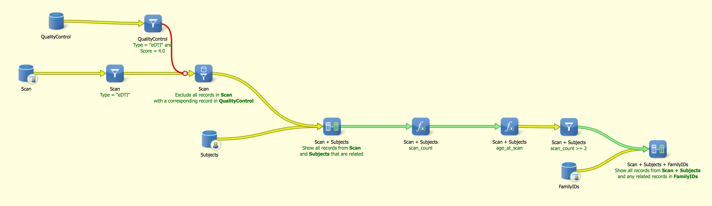
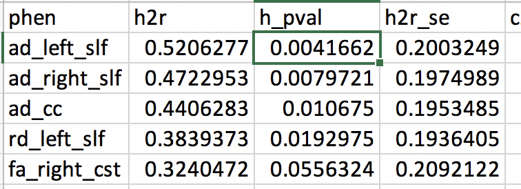

# 2019-03-07 09:41:37

Some quick analysis ot check if the change in tract is heritable within
families. We'll start with tract, but if there is a sniff of result there we can
quickly move to anatomy and resting state.

Because it's a quick analysis, I'll start with our usual TORTOISE pipeline. We
can always re-run this later with the new FDT pipeline. So, I started with a
Labmatrix query that exclude everyone that had errors importing and bad data. 
I'm also dealing only with scans that have already gone through
DTI-TK, because we cannot wait for more preprocessing.

So, the result is not_failed_tortoise_DTI.xlsx, which shows 283 individuals from
196 nuclear families (25 extended within that), in a total of 694 scans.

But we need to first cut out any families made up of single individuals, and
individual with only one scan

```r
m = read.csv('~/data/heritability_change/dti_tracts_qc.csv')
m = m[!is.na(m$norm.trans), ]
keep_me = c()
for (s in unique(m$Medical.Record...MRN)) {
    if (sum(m$Medical.Record...MRN == s) > 1) {
        keep_me = c(keep_me, which(m$Medical.Record...MRN == s))
    }
}
m = m[keep_me, ]
```

I noticed that one of the mask IDs had NAs for movement QC. Likely the RPd files
weren't transferred... I won't worry about it as this will unlikely be our final
pipeline, and just remove the mask ID.

So, we go from 693 scans to 647. Next, cut based on families:

```r
keep_me = c()
for (s in unique(m$Nuclear.ID)) {
    fam_mrns = m[m$Nuclear.ID == s, "Medical.Record...MRN"]
    if (length(unique(fam_mrns)) > 1) {
        keep_me = c(keep_me, which(m$Nuclear.ID == s))
    }
}
for (s in unique(m$Extended.ID)) {
    fam_mrns = m[m$Extended.ID == s, "Medical.Record...MRN"]
    if (length(unique(fam_mrns)) > 1) {
        keep_me = c(keep_me, which(m$Extended.ID == s))
    }
}
m = m[unique(keep_me), ]
```

OK, now we're down to 316 scans, for 125 individuals, in 68 nuclear families (21
extended).

Within that, we can finally pick the two first good time points to avoid any
sort of outcome analysis.

Let's take a look at the distributions first:


They look quite normal, so our mu+-3Sd thresholds should be fine:

```r
for (p in c('mean_fa', 'mean_ad', 'mean_rd')) {
    mu=mean(m[, p])
    s = sd(m[, p])
    print(p)
    print(mu - 3 * s)
    print(mu + 3 * s)
}
```

```
[1] "mean_fa"
[1] 0.3326389
[1] 0.4107519
[1] "mean_ad"
[1] 1.096487
[1] 1.292673
[1] "mean_rd"
[1] 0.5669469
[1] 0.7447344
```

I don't want to normalize the other metrics because it doesn't make much sense
to have both tails discarded. We can also do it by eye. So, our final thresholds
were:

```r
m = m[!is.na(m$norm.trans), ]
idx = (m$mean_fa < 0.4107519 & m$mean_fa > 0.3326389 &
       m$mean_ad < 1.292673 & m$mean_ad > 1.096487 &
       m$mean_rd < 0.7447344 & m$mean_rd > 0.5669469) # &
    #    m$norm.trans < 2.5 & m$norm.rot < 0.04 & m$missingVolumes < 4)
m = m[idx,]
```

That leaves us with 309 out of the 316 scans. Even worse if I include the other
QC thresholds, so maybe use them as covariates later. Now we just need to select the
first two for each person:

```r
keep_me = c()
for (s in unique(m$Medical.Record...MRN)) {
    subj_scans = m[m$Medical.Record...MRN==s, ]
    dates = as.Date(as.character(subj_scans$"record.date.collected...Scan"),
                                 format="%m/%d/%Y")
    if (length(dates) >= 2) {
        sdates = sort(dates)  # not sure why index.return is not working...
        # make sure there is at least 6 months between scans
        next_scan = 2
        while (((sdates[next_scan] - sdates[1]) < 180) && (next_scan < length(sdates))) {
            next_scan = next_scan + 1
        }
        dob = as.Date(as.character(m$Date.of.Birth), format="%m/%d/%Y")
        first_scan_age = (sdates[1] - dob)/365.25
        if (((sdates[next_scan] - sdates[1]) >= 180) && (first_scan_age < 26)) {
            idx1 = which(dates == sdates[1])
            keep_me = c(keep_me, which(m$Mask.ID == subj_scans[idx1, 'Mask.ID']))
            idx2 = which(dates == sdates[next_scan])
            keep_me = c(keep_me, which(m$Mask.ID == subj_scans[idx2, 'Mask.ID']))
        }
    }
}
m2 = m[keep_me, ]
```

So, with clean scans we have 122 people (244 scans). Then, we also need to
remove people who are by themselves, after cleaning.

```r
> table(m2$Extended.ID)
9000 9002 9003 9005 9007 9008 9010 9011 9014 9016 9019 9022 9025 9028
   2    2    4    4    2    4    4    2    2    2    2    2    2    6
> sum(table(m2$Nuclear.ID)>2)
[1] 17
```

So, in the end we need either extended ID >= 4 (2 people * 2 scans), or the same
for nuclear ID.

```r
good_nuclear = names(table(m2$Nuclear.ID))[table(m2$Nuclear.ID) >= 4]
good_extended = names(table(m2$Extended.ID))[table(m2$Extended.ID) >= 4]
keep_me = c()
for (f in good_nuclear) {
    keep_me = c(keep_me, which(m2$Nuclear.ID == f))
}
for (f in good_extended) {
    keep_me = c(keep_me, which(m2$Extended.ID == f))
}
m3 = m2[unique(keep_me), ]
```

Oh wow, now we're down to only 224 scans, on 122 people (67 nuclear families)!
Not sure we can go through with it... but let's try it anyways.

# 2019-03-08 09:48:34

First step is to calculate the tracts for each of the scans.

```bash
sed "s/$/_tensor_diffeo\.nii/g" ids224.txt > tensors224.txt
cd /Volumes/Shaw/dti_robust_tsa/analysis_may2017/
export DTITK_ROOT=/Applications/dtitk-2.3.3-Darwin-x86_64/
/Applications/dtitk-2.3.3-Darwin-x86_64/scripts/tsa_sampling ~/data/heritability_change/tensors224.txt ../ixi_aging_template_v3.0/tsa/ mean
# edit them first
python ~/research_code/lab_mgmt/convert_dti_sampling.py
Rscript ~/research_code/dti/compile_tract_table.R
```

Then, we residualize the brain before computing the slope on that:

```r
a = read.csv('~/data/heritability_change/dti_tracts_qc_clean.csv')
b = read.csv('~/data/heritability_change/dti_mean_phenotype_224.csv')
m = merge(a, b, by.x='Mask.ID', by.y='file')
tract_names = colnames(b)[2:ncol(b)]
dob = as.Date(as.character(m$Date.of.Birth), format="%m/%d/%Y")
date_scan = as.Date(as.character(m$record.date.collected...Scan), format="%m/%d/%Y")
m$age_at_scan = as.numeric((date_scan - dob)/365.25)
mres = m
library(MASS)
for (t in tract_names) {
    print(t)
    fm_str = sprintf('%s ~', t)
    fm_str = paste(fm_str, 'Sex +',
                   'norm.rot + I(norm.rot^2) + norm.trans + I(norm.trans^2) +',
                   'missingVolumes')
    res.lm <- lm(as.formula(fm_str), data = m)
    step <- stepAIC(res.lm, direction = "both", trace = F)
    mres[, t] = residuals(step)
}
write.csv(mres, file='~/data/heritability_change/dti_tracts_qc_clean_resids.csv',
          row.names=F)
```

Note that I don't want to use the familial relationships at this point yet (i.e.
not use lme for residuals)... not sure if it'd bias the residuals in sending to
SOLAR later. Also, we don't want to residualize on age but we do need to do it for
QC.

Now, calculating some slopes:

```r
b = read.csv('~/data/heritability_change/dti_mean_phenotype_224.csv')
tract_names = colnames(b)[2:ncol(b)]
mres = read.csv('~/data/heritability_change/dti_tracts_qc_clean_resids.csv')
res = c()
for (s in unique(mres$Medical.Record...MRN)) {
    idx = mres$Medical.Record...MRN == s
    row = c(s)
    for (t in tract_names) {
        fm_str = sprintf('%s ~ age_at_scan', t)
        fit = lm(as.formula(fm_str), data=mres[idx, ])
        row = c(row, coefficients(fit)[2])
    }
    res = rbind(res, row)
}
colnames(res) = c('ID', tract_names)
write.csv(res, file='~/data/heritability_change/dti_tracts_resid_OLS_224.csv',
          row.names=F, quote=F)
```

## Removing twins and 5th generation character

I ran some analysis, but the results looked a bit funky... maybe if I remove the
twin pair and the 5th generation person from the get-go would help?

```
solar> relatives all

    NPairs  Relationship
  ========  ========================
       112  Self
         1  Identical sib pair
        57  Siblings
        23  3rd degree
         1  5th degree
```

So, that meant removing families 1979 and 9016. So, let's redo the analysis
above:

```r
m = read.csv('~/data/heritability_change/dti_tracts_qc_noTwinsNor5th.csv')
m = m[!is.na(m$norm.trans), ]
keep_me = c()
for (s in unique(m$Medical.Record...MRN)) {
    if (sum(m$Medical.Record...MRN == s) > 1) {
        keep_me = c(keep_me, which(m$Medical.Record...MRN == s))
    }
}
m = m[keep_me, ]
```

Now we go from 684 to 637 scans left after keeping only subjects with more than
one scan.

```r
keep_me = c()
for (s in unique(m$Nuclear.ID)) {
    fam_mrns = m[m$Nuclear.ID == s, "Medical.Record...MRN"]
    if (length(unique(fam_mrns)) > 1) {
        keep_me = c(keep_me, which(m$Nuclear.ID == s))
    }
}
for (s in unique(m$Extended.ID)) {
    fam_mrns = m[m$Extended.ID == s, "Medical.Record...MRN"]
    if (length(unique(fam_mrns)) > 1) {
        keep_me = c(keep_me, which(m$Extended.ID == s))
    }
}
m = m[unique(keep_me), ]
```

And only 306 scans after keeping only subjects from families with 2 or more
people.

```r
m = m[!is.na(m$norm.trans), ]
idx = (m$mean_fa < (mean(m$mean_fa)+3*sd(m$mean_fa)) &
       m$mean_fa > (mean(m$mean_fa)-3*sd(m$mean_fa)) &
       m$mean_ad < (mean(m$mean_ad)+3*sd(m$mean_ad)) &
       m$mean_ad > (mean(m$mean_ad)-3*sd(m$mean_ad)) &
       m$mean_rd < (mean(m$mean_rd)+3*sd(m$mean_rd)) &
       m$mean_rd > (mean(m$mean_rd)-3*sd(m$mean_rd)))
m = m[idx,]
```

And we still have 300 scans after the QC thresholds.

```r
keep_me = c()
for (s in unique(m$Medical.Record...MRN)) {
    subj_scans = m[m$Medical.Record...MRN==s, ]
    dates = as.Date(as.character(subj_scans$"record.date.collected...Scan"),
                                 format="%m/%d/%Y")
    if (length(dates) >= 2) {
        sdates = sort(dates)  # not sure why index.return is not working...
        # make sure there is at least 6 months between scans
        next_scan = 2
        while (((sdates[next_scan] - sdates[1]) < 180) && (next_scan < length(sdates))) {
            next_scan = next_scan + 1
        }
        dob = as.Date(as.character(m$Date.of.Birth), format="%m/%d/%Y")
        first_scan_age = (sdates[1] - dob)/365.25
        if (((sdates[next_scan] - sdates[1]) >= 180) && (first_scan_age < 26)) {
            idx1 = which(dates == sdates[1])
            keep_me = c(keep_me, which(m$Mask.ID == subj_scans[idx1, 'Mask.ID']))
            idx2 = which(dates == sdates[next_scan])
            keep_me = c(keep_me, which(m$Mask.ID == subj_scans[idx2, 'Mask.ID']))
        }
    }
}
m2 = m[keep_me, ]
```

We get down to 236 after selecting the first 2 o each person.

```r
good_nuclear = names(table(m2$Nuclear.ID))[table(m2$Nuclear.ID) >= 4]
good_extended = names(table(m2$Extended.ID))[table(m2$Extended.ID) >= 4]
keep_me = c()
for (f in good_nuclear) {
    keep_me = c(keep_me, which(m2$Nuclear.ID == f))
}
for (f in good_extended) {
    keep_me = c(keep_me, which(m2$Extended.ID == f))
}
m3 = m2[unique(keep_me), ]
```

And 216 after making sure every family has at least 2 people (108 people, 54
nuclear families). Let's go ahead, residualize it, and compute the slopes:

```r
a = m3
b = read.csv('~/data/heritability_change/dti_mean_phenotype_224.csv')
m = merge(a, b, by.x='Mask.ID', by.y='file')
tract_names = colnames(b)[2:ncol(b)]
dob = as.Date(as.character(m$Date.of.Birth), format="%m/%d/%Y")
date_scan = as.Date(as.character(m$record.date.collected...Scan), format="%m/%d/%Y")
m$age_at_scan = as.numeric((date_scan - dob)/365.25)
mres = m
library(MASS)
for (t in tract_names) {
    print(t)
    fm_str = sprintf('%s ~', t)
    fm_str = paste(fm_str, 'Sex +',
                   'norm.rot + I(norm.rot^2) + norm.trans + I(norm.trans^2) +',
                   'missingVolumes')
    res.lm <- lm(as.formula(fm_str), data = m)
    step <- stepAIC(res.lm, direction = "both", trace = F)
    mres[, t] = residuals(step)
}
res = c()
for (s in unique(mres$Medical.Record...MRN)) {
    idx = mres$Medical.Record...MRN == s
    row = c(s)
    for (t in tract_names) {
        fm_str = sprintf('%s ~ age_at_scan', t)
        fit = lm(as.formula(fm_str), data=mres[idx, ])
        row = c(row, coefficients(fit)[2])
    }
    res = rbind(res, row)
}
colnames(res) = c('ID', tract_names)
write.csv(res, file='~/data/heritability_change/dti_tracts_resid_OLS_216.csv',
          row.names=F, quote=F)
```

Now, this is much better:

```
solar> relpairs
                                                                        
    NPairs  Relationship
  ========  ===========================================
       108  Self
        57  Siblings
        23  1st cousins
```

What if I don't remove sex as a covariate here, only in SOLAR?

```r
a = m3
b = read.csv('~/data/heritability_change/dti_mean_phenotype_224.csv')
m = merge(a, b, by.x='Mask.ID', by.y='file')
tract_names = colnames(b)[2:ncol(b)]
dob = as.Date(as.character(m$Date.of.Birth), format="%m/%d/%Y")
date_scan = as.Date(as.character(m$record.date.collected...Scan), format="%m/%d/%Y")
m$age_at_scan = as.numeric((date_scan - dob)/365.25)
mres = m
library(MASS)
for (t in tract_names) {
    print(t)
    fm_str = sprintf('%s ~', t)
    fm_str = paste(fm_str, 'norm.rot + I(norm.rot^2) + norm.trans + I(norm.trans^2) +',
                   'missingVolumes')
    res.lm <- lm(as.formula(fm_str), data = m)
    step <- stepAIC(res.lm, direction = "both", trace = F)
    mres[, t] = residuals(step)
}
res = c()
for (s in unique(mres$Medical.Record...MRN)) {
    idx = mres$Medical.Record...MRN == s
    row = c(s, unique(mres[mres$Medical.Record...MRN == s, 'Sex']))
    for (t in tract_names) {
        fm_str = sprintf('%s ~ age_at_scan', t)
        fit = lm(as.formula(fm_str), data=mres[idx, ])
        row = c(row, coefficients(fit)[2])
    }
    res = rbind(res, row)
}
colnames(res) = c('ID', 'sex', tract_names)
write.csv(res, file='~/data/heritability_change/dti_tracts_residNoSex_OLS_216.csv',
          row.names=F, quote=F)
```

## Stricter QC

Now, let's see what we get if we use stricter QC thresholds:

```r
m = read.csv('~/data/heritability_change/dti_tracts_qc_noTwinsNor5th.csv')
m = m[!is.na(m$norm.trans), ]

# keep only subjects with more than one scan
keep_me = c()
for (s in unique(m$Medical.Record...MRN)) {
    if (sum(m$Medical.Record...MRN == s) > 1) {
        keep_me = c(keep_me, which(m$Medical.Record...MRN == s))
    }
}
m = m[keep_me, ]

# keep only subjects from families with two or more people
keep_me = c()
for (s in unique(m$Nuclear.ID)) {
    fam_mrns = m[m$Nuclear.ID == s, "Medical.Record...MRN"]
    if (length(unique(fam_mrns)) > 1) {
        keep_me = c(keep_me, which(m$Nuclear.ID == s))
    }
}
for (s in unique(m$Extended.ID)) {
    fam_mrns = m[m$Extended.ID == s, "Medical.Record...MRN"]
    if (length(unique(fam_mrns)) > 1) {
        keep_me = c(keep_me, which(m$Extended.ID == s))
    }
}
m = m[unique(keep_me), ]

# restrict based on QC
m = m[!is.na(m$norm.trans), ]
idx = (m$mean_fa < (mean(m$mean_fa)+3*sd(m$mean_fa)) &
       m$mean_fa > (mean(m$mean_fa)-3*sd(m$mean_fa)) &
       m$mean_ad < (mean(m$mean_ad)+3*sd(m$mean_ad)) &
       m$mean_ad > (mean(m$mean_ad)-3*sd(m$mean_ad)) &
       m$mean_rd < (mean(m$mean_rd)+3*sd(m$mean_rd)) &
       m$mean_rd > (mean(m$mean_rd)-3*sd(m$mean_rd)))
idx = idx & m$norm.trans < 4 & m$norm.rot < 0.04 & m$missingVolumes < 4
m = m[idx,]
```

And now we're down to 195 scans after the QC thresholds.

```r
# select only the first two for each person (younger than 26 y.o.) 
keep_me = c()
for (s in unique(m$Medical.Record...MRN)) {
    subj_scans = m[m$Medical.Record...MRN==s, ]
    dates = as.Date(as.character(subj_scans$"record.date.collected...Scan"),
                                 format="%m/%d/%Y")
    if (length(dates) >= 2) {
        sdates = sort(dates)  # not sure why index.return is not working...
        # make sure there is at least 6 months between scans
        next_scan = 2
        while (((sdates[next_scan] - sdates[1]) < 180) && (next_scan < length(sdates))) {
            next_scan = next_scan + 1
        }
        dob = as.Date(as.character(m$Date.of.Birth), format="%m/%d/%Y")
        first_scan_age = (sdates[1] - dob)/365.25
        if (((sdates[next_scan] - sdates[1]) >= 180) && (first_scan_age < 26)) {
            idx1 = which(dates == sdates[1])
            keep_me = c(keep_me, which(m$Mask.ID == subj_scans[idx1, 'Mask.ID']))
            idx2 = which(dates == sdates[next_scan])
            keep_me = c(keep_me, which(m$Mask.ID == subj_scans[idx2, 'Mask.ID']))
        }
    }
}
m2 = m[keep_me, ]

# and make sure eveyr family has at least two people
good_nuclear = names(table(m2$Nuclear.ID))[table(m2$Nuclear.ID) >= 4]
good_extended = names(table(m2$Extended.ID))[table(m2$Extended.ID) >= 4]
keep_me = c()
for (f in good_nuclear) {
    keep_me = c(keep_me, which(m2$Nuclear.ID == f))
}
for (f in good_extended) {
    keep_me = c(keep_me, which(m2$Extended.ID == f))
}
m3 = m2[unique(keep_me), ]
```

And only 80 after making sure every family has at least 2 people (40 people).
Let's go ahead, residualize it, and compute the slopes:

```r
a = m3
b = read.csv('~/data/heritability_change/dti_mean_phenotype_694.csv')
m = merge(a, b, by.x='Mask.ID', by.y='file')
tract_names = colnames(b)[2:ncol(b)]
dob = as.Date(as.character(m$Date.of.Birth), format="%m/%d/%Y")
date_scan = as.Date(as.character(m$record.date.collected...Scan), format="%m/%d/%Y")
m$age_at_scan = as.numeric((date_scan - dob)/365.25)
mres = m
library(MASS)
for (t in tract_names) {
    print(t)
    fm_str = sprintf('%s ~', t)
    fm_str = paste(fm_str, 'Sex +',
                   'norm.rot + I(norm.rot^2) + norm.trans + I(norm.trans^2) +',
                   'missingVolumes')
    res.lm <- lm(as.formula(fm_str), data = m)
    step <- stepAIC(res.lm, direction = "both", trace = F)
    mres[, t] = residuals(step)
}
res = c()
for (s in unique(mres$Medical.Record...MRN)) {
    idx = mres$Medical.Record...MRN == s
    row = c(s)
    for (t in tract_names) {
        fm_str = sprintf('%s ~ age_at_scan', t)
        fit = lm(as.formula(fm_str), data=mres[idx, ])
        row = c(row, coefficients(fit)[2])
    }
    res = rbind(res, row)
}
colnames(res) = c('ID', tract_names)
write.csv(res, file='~/data/heritability_change/dti_tracts_resid_OLS_80.csv',
          row.names=F, quote=F)
```

That didn't quite work... what if we don't residualize it?

```r
a = m3
b = read.csv('~/data/heritability_change/dti_mean_phenotype_694.csv')
m = merge(a, b, by.x='Mask.ID', by.y='file')
tract_names = colnames(b)[2:ncol(b)]
dob = as.Date(as.character(m$Date.of.Birth), format="%m/%d/%Y")
date_scan = as.Date(as.character(m$record.date.collected...Scan), format="%m/%d/%Y")
m$age_at_scan = as.numeric((date_scan - dob)/365.25)
mres = m
res = c()
for (s in unique(mres$Medical.Record...MRN)) {
    idx = mres$Medical.Record...MRN == s
    row = c(s, unique(mres[mres$Medical.Record...MRN == s, 'Sex']))
    for (t in tract_names) {
        fm_str = sprintf('%s ~ age_at_scan', t)
        fit = lm(as.formula(fm_str), data=mres[idx, ])
        row = c(row, coefficients(fit)[2])
    }
    res = rbind(res, row)
}
colnames(res) = c('ID', 'sex', tract_names)
write.csv(res, file='~/data/heritability_change/dti_tracts_OLS_80.csv',
          row.names=F, quote=F)
```

Also didn't work. Well, it's clear that 40 people is not enough. Let's see if we
can find some common ground:

```r
m = read.csv('~/data/heritability_change/dti_tracts_qc_noTwinsNor5th.csv')
m = m[!is.na(m$norm.trans), ]

# keep only subjects with more than one scan
keep_me = c()
for (s in unique(m$Medical.Record...MRN)) {
    if (sum(m$Medical.Record...MRN == s) > 1) {
        keep_me = c(keep_me, which(m$Medical.Record...MRN == s))
    }
}
m = m[keep_me, ]

# keep only subjects from families with two or more people
keep_me = c()
for (s in unique(m$Nuclear.ID)) {
    fam_mrns = m[m$Nuclear.ID == s, "Medical.Record...MRN"]
    if (length(unique(fam_mrns)) > 1) {
        keep_me = c(keep_me, which(m$Nuclear.ID == s))
    }
}
for (s in unique(m$Extended.ID)) {
    fam_mrns = m[m$Extended.ID == s, "Medical.Record...MRN"]
    if (length(unique(fam_mrns)) > 1) {
        keep_me = c(keep_me, which(m$Extended.ID == s))
    }
}
m = m[unique(keep_me), ]

# restrict based on QC
m = m[!is.na(m$norm.trans), ]
idx = (m$mean_fa < (mean(m$mean_fa)+3*sd(m$mean_fa)) &
       m$mean_fa > (mean(m$mean_fa)-3*sd(m$mean_fa)) &
       m$mean_ad < (mean(m$mean_ad)+3*sd(m$mean_ad)) &
       m$mean_ad > (mean(m$mean_ad)-3*sd(m$mean_ad)) &
       m$mean_rd < (mean(m$mean_rd)+3*sd(m$mean_rd)) &
       m$mean_rd > (mean(m$mean_rd)-3*sd(m$mean_rd)))
idx = idx & m$missingVolumes < 4
m = m[idx,]
```

If we just use the missing volumes criteria we're back up to 204 scans.

```r
# select only the first two for each person (younger than 26 y.o.) 
keep_me = c()
for (s in unique(m$Medical.Record...MRN)) {
    subj_scans = m[m$Medical.Record...MRN==s, ]
    dates = as.Date(as.character(subj_scans$"record.date.collected...Scan"),
                                 format="%m/%d/%Y")
    if (length(dates) >= 2) {
        sdates = sort(dates)  # not sure why index.return is not working...
        # make sure there is at least 6 months between scans
        next_scan = 2
        while (((sdates[next_scan] - sdates[1]) < 180) && (next_scan < length(sdates))) {
            next_scan = next_scan + 1
        }
        dob = as.Date(as.character(m$Date.of.Birth), format="%m/%d/%Y")
        first_scan_age = (sdates[1] - dob)/365.25
        if (((sdates[next_scan] - sdates[1]) >= 180) && (first_scan_age < 26)) {
            idx1 = which(dates == sdates[1])
            keep_me = c(keep_me, which(m$Mask.ID == subj_scans[idx1, 'Mask.ID']))
            idx2 = which(dates == sdates[next_scan])
            keep_me = c(keep_me, which(m$Mask.ID == subj_scans[idx2, 'Mask.ID']))
        }
    }
}
m2 = m[keep_me, ]

# and make sure eveyr family has at least two people
good_nuclear = names(table(m2$Nuclear.ID))[table(m2$Nuclear.ID) >= 4]
good_extended = names(table(m2$Extended.ID))[table(m2$Extended.ID) >= 4]
keep_me = c()
for (f in good_nuclear) {
    keep_me = c(keep_me, which(m2$Nuclear.ID == f))
}
for (f in good_extended) {
    keep_me = c(keep_me, which(m2$Extended.ID == f))
}
m3 = m2[unique(keep_me), ]
```

And only 92 after making sure every family has at least 2 people. What if we
only use those quality QCs, and not the brain itself?

```r
m = read.csv('~/data/heritability_change/dti_tracts_qc_noTwinsNor5th.csv')
m = m[!is.na(m$norm.trans), ]

# keep only subjects with more than one scan
keep_me = c()
for (s in unique(m$Medical.Record...MRN)) {
    if (sum(m$Medical.Record...MRN == s) > 1) {
        keep_me = c(keep_me, which(m$Medical.Record...MRN == s))
    }
}
m = m[keep_me, ]

# keep only subjects from families with two or more people
keep_me = c()
for (s in unique(m$Nuclear.ID)) {
    fam_mrns = m[m$Nuclear.ID == s, "Medical.Record...MRN"]
    if (length(unique(fam_mrns)) > 1) {
        keep_me = c(keep_me, which(m$Nuclear.ID == s))
    }
}
for (s in unique(m$Extended.ID)) {
    fam_mrns = m[m$Extended.ID == s, "Medical.Record...MRN"]
    if (length(unique(fam_mrns)) > 1) {
        keep_me = c(keep_me, which(m$Extended.ID == s))
    }
}
m = m[unique(keep_me), ]

# restrict based on QC
m = m[!is.na(m$norm.trans), ]
idx = m$norm.trans < 4 & m$norm.rot < 0.04 & m$missingVolumes < 4
m = m[idx,]
```

Well, that's the kicker... I only retain 200 scans. Maybe we're being too strict
here. 

```r
m = read.csv('~/data/heritability_change/dti_tracts_qc_noTwinsNor5th.csv')
m = m[!is.na(m$norm.trans), ]

# keep only subjects with more than one scan
keep_me = c()
for (s in unique(m$Medical.Record...MRN)) {
    if (sum(m$Medical.Record...MRN == s) > 1) {
        keep_me = c(keep_me, which(m$Medical.Record...MRN == s))
    }
}
m = m[keep_me, ]

# keep only subjects from families with two or more people
keep_me = c()
for (s in unique(m$Nuclear.ID)) {
    fam_mrns = m[m$Nuclear.ID == s, "Medical.Record...MRN"]
    if (length(unique(fam_mrns)) > 1) {
        keep_me = c(keep_me, which(m$Nuclear.ID == s))
    }
}
for (s in unique(m$Extended.ID)) {
    fam_mrns = m[m$Extended.ID == s, "Medical.Record...MRN"]
    if (length(unique(fam_mrns)) > 1) {
        keep_me = c(keep_me, which(m$Extended.ID == s))
    }
}
m = m[unique(keep_me), ]

# at this point we have 306 scans...

# restrict based on QC
idx = m$norm.trans < 5 & m$norm.rot < 0.05 & m$missingVolumes < 10
m = m[idx,]
```

That gives me 252 scans left.

```r
# select only the first two for each person (younger than 26 y.o.) 
keep_me = c()
for (s in unique(m$Medical.Record...MRN)) {
    subj_scans = m[m$Medical.Record...MRN==s, ]
    dates = as.Date(as.character(subj_scans$"record.date.collected...Scan"),
                                 format="%m/%d/%Y")
    if (length(dates) >= 2) {
        sdates = sort(dates)  # not sure why index.return is not working...
        # make sure there is at least 6 months between scans
        next_scan = 2
        while (((sdates[next_scan] - sdates[1]) < 180) && (next_scan < length(sdates))) {
            next_scan = next_scan + 1
        }
        dob = as.Date(as.character(m$Date.of.Birth), format="%m/%d/%Y")
        first_scan_age = (sdates[1] - dob)/365.25
        if (((sdates[next_scan] - sdates[1]) >= 180) && (first_scan_age < 26)) {
            idx1 = which(dates == sdates[1])
            keep_me = c(keep_me, which(m$Mask.ID == subj_scans[idx1, 'Mask.ID']))
            idx2 = which(dates == sdates[next_scan])
            keep_me = c(keep_me, which(m$Mask.ID == subj_scans[idx2, 'Mask.ID']))
        }
    }
}
m2 = m[keep_me, ]

# and make sure eveyr family has at least two people
good_nuclear = names(table(m2$Nuclear.ID))[table(m2$Nuclear.ID) >= 4]
good_extended = names(table(m2$Extended.ID))[table(m2$Extended.ID) >= 4]
keep_me = c()
for (f in good_nuclear) {
    keep_me = c(keep_me, which(m2$Nuclear.ID == f))
}
for (f in good_extended) {
    keep_me = c(keep_me, which(m2$Extended.ID == f))
}
m3 = m2[unique(keep_me), ]
```

After all this filtering, I get 148 scans (74 people). Let's see if anything
comes out of it.

```r
a = m3
b = read.csv('~/data/heritability_change/dti_mean_phenotype_694.csv')
m = merge(a, b, by.x='Mask.ID', by.y='file')
tract_names = colnames(b)[2:ncol(b)]
dob = as.Date(as.character(m$Date.of.Birth), format="%m/%d/%Y")
date_scan = as.Date(as.character(m$record.date.collected...Scan), format="%m/%d/%Y")
m$age_at_scan = as.numeric((date_scan - dob)/365.25)
mres = m
library(MASS)
for (t in tract_names) {
    print(t)
    fm_str = sprintf('%s ~', t)
    fm_str = paste(fm_str, 'Sex +',
                   'norm.rot + I(norm.rot^2) + norm.trans + I(norm.trans^2) +',
                   'missingVolumes')
    res.lm <- lm(as.formula(fm_str), data = m)
    step <- stepAIC(res.lm, direction = "both", trace = F)
    mres[, t] = residuals(step)
}
res = c()
for (s in unique(mres$Medical.Record...MRN)) {
    idx = mres$Medical.Record...MRN == s
    row = c(s)
    for (t in tract_names) {
        fm_str = sprintf('%s ~ age_at_scan', t)
        fit = lm(as.formula(fm_str), data=mres[idx, ])
        row = c(row, coefficients(fit)[2])
    }
    res = rbind(res, row)
}
colnames(res) = c('ID', tract_names)
write.csv(res, file='~/data/heritability_change/dti_tracts_resid_OLS_148.csv',
          row.names=F, quote=F)
```

Not good either... let me try without residuals.

```r
a = m3
b = read.csv('~/data/heritability_change/dti_mean_phenotype_694.csv')
m = merge(a, b, by.x='Mask.ID', by.y='file')
tract_names = colnames(b)[2:ncol(b)]
dob = as.Date(as.character(m$Date.of.Birth), format="%m/%d/%Y")
date_scan = as.Date(as.character(m$record.date.collected...Scan), format="%m/%d/%Y")
m$age_at_scan = as.numeric((date_scan - dob)/365.25)
mres = m
res = c()
for (s in unique(mres$Medical.Record...MRN)) {
    idx = mres$Medical.Record...MRN == s
    row = c(s, unique(mres[mres$Medical.Record...MRN == s, 'Sex']))
    for (t in tract_names) {
        fm_str = sprintf('%s ~ age_at_scan', t)
        fit = lm(as.formula(fm_str), data=mres[idx, ])
        row = c(row, coefficients(fit)[2])
    }
    res = rbind(res, row)
}
colnames(res) = c('ID', 'sex', tract_names)
write.csv(res, file='~/data/heritability_change/dti_tracts_OLS_148.csv',
          row.names=F, quote=F)
```

Nope, still nothing. What if I try showing correlation (or lack of) between the
dti metrics and movement?

```r
m = read.csv('~/data/heritability_change/dti_tracts_qc_noTwinsNor5th.csv')
m = m[!is.na(m$norm.trans), ]

# keep only subjects with more than one scan
keep_me = c()
for (s in unique(m$Medical.Record...MRN)) {
    if (sum(m$Medical.Record...MRN == s) > 1) {
        keep_me = c(keep_me, which(m$Medical.Record...MRN == s))
    }
}
m = m[keep_me, ]

# keep only subjects from families with two or more people
keep_me = c()
for (s in unique(m$Nuclear.ID)) {
    fam_mrns = m[m$Nuclear.ID == s, "Medical.Record...MRN"]
    if (length(unique(fam_mrns)) > 1) {
        keep_me = c(keep_me, which(m$Nuclear.ID == s))
    }
}
for (s in unique(m$Extended.ID)) {
    fam_mrns = m[m$Extended.ID == s, "Medical.Record...MRN"]
    if (length(unique(fam_mrns)) > 1) {
        keep_me = c(keep_me, which(m$Extended.ID == s))
    }
}
m = m[unique(keep_me), ]

# restrict based on QC
m = m[!is.na(m$norm.trans), ]
idx = (m$mean_fa < (mean(m$mean_fa)+3*sd(m$mean_fa)) &
       m$mean_fa > (mean(m$mean_fa)-3*sd(m$mean_fa)) &
       m$mean_ad < (mean(m$mean_ad)+3*sd(m$mean_ad)) &
       m$mean_ad > (mean(m$mean_ad)-3*sd(m$mean_ad)) &
       m$mean_rd < (mean(m$mean_rd)+3*sd(m$mean_rd)) &
       m$mean_rd > (mean(m$mean_rd)-3*sd(m$mean_rd)))
m = m[idx,]

# select only the first two for each person (younger than 26 y.o.) 
keep_me = c()
for (s in unique(m$Medical.Record...MRN)) {
    subj_scans = m[m$Medical.Record...MRN==s, ]
    dates = as.Date(as.character(subj_scans$"record.date.collected...Scan"),
                                 format="%m/%d/%Y")
    if (length(dates) >= 2) {
        sdates = sort(dates)  # not sure why index.return is not working...
        # make sure there is at least 6 months between scans
        next_scan = 2
        while (((sdates[next_scan] - sdates[1]) < 180) && (next_scan < length(sdates))) {
            next_scan = next_scan + 1
        }
        dob = as.Date(as.character(m$Date.of.Birth), format="%m/%d/%Y")
        first_scan_age = (sdates[1] - dob)/365.25
        if (((sdates[next_scan] - sdates[1]) >= 180) && (first_scan_age < 26)) {
            idx1 = which(dates == sdates[1])
            keep_me = c(keep_me, which(m$Mask.ID == subj_scans[idx1, 'Mask.ID']))
            idx2 = which(dates == sdates[next_scan])
            keep_me = c(keep_me, which(m$Mask.ID == subj_scans[idx2, 'Mask.ID']))
        }
    }
}
m2 = m[keep_me, ]

# and make sure eveyr family has at least two people
good_nuclear = names(table(m2$Nuclear.ID))[table(m2$Nuclear.ID) >= 4]
good_extended = names(table(m2$Extended.ID))[table(m2$Extended.ID) >= 4]
keep_me = c()
for (f in good_nuclear) {
    keep_me = c(keep_me, which(m2$Nuclear.ID == f))
}
for (f in good_extended) {
    keep_me = c(keep_me, which(m2$Extended.ID == f))
}
m3 = m2[unique(keep_me), ]
```

So, we're back with out 216 scans dataset. Is there correlation between norm.rot
and any of the metrics?

```r
a = m3
b = read.csv('~/data/heritability_change/dti_mean_phenotype_694.csv')
m = merge(a, b, by.x='Mask.ID', by.y='file')
tract_names = colnames(b)[2:ncol(b)]
dob = as.Date(as.character(m$Date.of.Birth), format="%m/%d/%Y")
date_scan = as.Date(as.character(m$record.date.collected...Scan), format="%m/%d/%Y")
m$age_at_scan = as.numeric((date_scan - dob)/365.25)
mres = m
res = c()
for (s in unique(mres$Medical.Record...MRN)) {
    idx = mres$Medical.Record...MRN == s
    row = c(s, unique(mres[mres$Medical.Record...MRN == s, 'Sex']))
    for (t in tract_names) {
        fm_str = sprintf('%s ~ age_at_scan', t)
        fit = lm(as.formula(fm_str), data=mres[idx, ])
        row = c(row, coefficients(fit)[2])
    }
    res = rbind(res, row)
}
colnames(res) = c('ID', 'sex', tract_names)
write.csv(res, file='~/data/heritability_change/dti_tracts_OLS_148.csv',
          row.names=F, quote=F)
```

Yes... in the very first one FA_cc, I see it. Let's try to boost up our number
then.

Out of curiosity, if all our 1041 scans for longitudinal kids were good, how
many could actually be candidates for the analysis?

```r
m = read.csv('~/data/heritability_change/dti_tracts_all.csv')

# keep only subjects with more than one scan
keep_me = c()
for (s in unique(m$Medical.Record...MRN)) {
    if (sum(m$Medical.Record...MRN == s) > 1) {
        keep_me = c(keep_me, which(m$Medical.Record...MRN == s))
    }
}
m = m[keep_me, ]

# keep only subjects from families with two or more people
keep_me = c()
for (s in unique(m$Nuclear.ID)) {
    fam_mrns = m[m$Nuclear.ID == s, "Medical.Record...MRN"]
    if (length(unique(fam_mrns)) > 1) {
        keep_me = c(keep_me, which(m$Nuclear.ID == s))
    }
}
for (s in unique(m$Extended.ID)) {
    fam_mrns = m[m$Extended.ID == s, "Medical.Record...MRN"]
    if (length(unique(fam_mrns)) > 1) {
        keep_me = c(keep_me, which(m$Extended.ID == s))
    }
}
m = m[unique(keep_me), ]
```

OK, so in an ideal world we'd start with 634 scans (197 subjects, 99 nuclear
families). Our best results had 108 subjects, so there's a oubling potential.
Lets see how much work we need to get this going.

# 2019-03-11 10:03:54

So, now that we have DTI-TK for more people, let's redo the resampling and see
if we need more people:

```bash
# acess to the share drive was quit eslow, so using ncrshell01
cut -d"," -f 1 dti_tracts_all.csv > ids1041.txt
for f in `cat ids1041.txt`; do
    if [ -e /mnt/shaw/sudregp/dti_robust_tsa/analysis_may2017/${f}_tensor_diffeo.nii.gz ]; then
        echo $f >> dtitk_ids.txt;
    fi;
done
sed "s/$/_tensor_diffeo\.nii/g" dtitk_ids.txt > tensors863.txt
cd /mnt/shaw/sudregp/dti_robust_tsa/analysis_may2017/
export DTITK_ROOT=/usr/local/neuro/dti-tk/dtitk-2.3.1-Linux-x86_64/
/usr/local/neuro/dti-tk/dtitk-2.3.1-Linux-x86_64/scripts/tsa_sampling ~/tmp/tensors863.txt ../ixi_aging_template_v3.0/tsa/ mean
# edit them first
python ~/research_code/lab_mgmt/convert_dti_sampling.py
Rscript ~/research_code/dti/compile_tract_table.R
```

Just to make sure I'm taking everyone, I re-ran the Labmatrix query:



which I also saved as DTI heritability change. Then, in Excel I eliminated
everyone whose nuclear or extended fmaily had less than 4 scans, and also any
people that contributed with all scans for that family. That gave us 541 scans
for QC, and 57 for Esteban to QC if needed. So, once we start doing QC on those
541 (people that have 2 or more scans that also have someone else in their
extended or nuclear family with longitudinal scans, and have been processed in
DTIK), how much do we lose?

Then, it's just a matter of running the metric from above again:

```r
a = read.csv('~/data/heritability_change/dti_mean_phenotype_863.csv')
b = read.csv('/Volumes/Shaw/MasterQC/master_qc_20190308.csv')
m = merge(a, b, by.x='file', by.y='Mask.ID', all.x=F)
d = read.csv('~/data/heritability_change/demo541.csv')
m = merge(d, m, by.y='file', by.x='Mask.ID...Scan')
```

```r
# keep only subjects with more than one scan processed in DTITK
keep_me = c()
for (s in unique(m$Medical.Record...MRN)) {
    if (sum(m$Medical.Record...MRN == s) > 1) {
        keep_me = c(keep_me, which(m$Medical.Record...MRN == s))
    }
}
m = m[keep_me, ]
# down to 523

# keep only subjects from families with two or more people
keep_me = c()
for (s in unique(m$Nuclear.ID)) {
    fam_mrns = m[m$Nuclear.ID == s, "Medical.Record...MRN...Subjects"]
    if (length(unique(fam_mrns)) > 1) {
        keep_me = c(keep_me, which(m$Nuclear.ID == s))
    }
}
for (s in unique(m$Extended.ID)) {
    fam_mrns = m[m$Extended.ID == s, "Medical.Record...MRN...Subjects"]
    if (length(unique(fam_mrns)) > 1) {
        keep_me = c(keep_me, which(m$Extended.ID == s))
    }
}
m = m[unique(keep_me), ]
# down to 507

# restrict based on QC
m = m[!is.na(m$norm.trans), ]
idx = (m$mean_fa < (mean(m$mean_fa)+3*sd(m$mean_fa)) &
       m$mean_fa > (mean(m$mean_fa)-3*sd(m$mean_fa)) &
       m$mean_ad < (mean(m$mean_ad)+3*sd(m$mean_ad)) &
       m$mean_ad > (mean(m$mean_ad)-3*sd(m$mean_ad)) &
       m$mean_rd < (mean(m$mean_rd)+3*sd(m$mean_rd)) &
       m$mean_rd > (mean(m$mean_rd)-3*sd(m$mean_rd)))
m = m[idx,]
# down to 500

# select only the first two for each person (younger than 26 y.o.) 
keep_me = c()
for (s in unique(m$Medical.Record...MRN...Subjects)) {
    subj_scans = m[m$Medical.Record...MRN...Subjects==s, ]
    dates = as.Date(as.character(subj_scans$"record.date.collected...Scan"),
                                 format="%m/%d/%Y")
    if (length(dates) >= 2) {
        sdates = sort(dates)  # not sure why index.return is not working...
        # make sure there is at least 6 months between scans
        next_scan = 2
        while (((sdates[next_scan] - sdates[1]) < 180) && (next_scan < length(sdates))) {
            next_scan = next_scan + 1
        }
        first_scan_age = subj_scans[dates==sdates[1], 'age_at_scan...Scan...Subjects']
        if (((sdates[next_scan] - sdates[1]) >= 180) && (first_scan_age < 26)) {
            idx1 = which(dates == sdates[1])
            keep_me = c(keep_me, which(m$Mask.ID...Scan == subj_scans[idx1, 'Mask.ID...Scan']))
            idx2 = which(dates == sdates[next_scan])
            keep_me = c(keep_me, which(m$Mask.ID...Scan == subj_scans[idx2, 'Mask.ID...Scan']))
        }
    }
}
m2 = m[keep_me, ]
# down to 312

# remove left alone subject
m2 = m2[m2$Medical.Record...MRN...Subjects!=7221745, ]

# and make sure every family has at least two people
good_nuclear = names(table(m2$Nuclear.ID))[table(m2$Nuclear.ID) >= 4]
good_extended = names(table(m2$Extended.ID))[table(m2$Extended.ID) >= 4]
keep_me = c()
for (f in good_nuclear) {
    keep_me = c(keep_me, which(m2$Nuclear.ID == f))
}
for (f in good_extended) {
    keep_me = c(keep_me, which(m2$Extended.ID == f))
}
m3 = m2[unique(keep_me), ]
```

We end up with 304 scans, for 152 subjects, 72 nuclear families. Let's see what
SOLAR thinks of that.

```r
b = read.csv('~/data/heritability_change/dti_mean_phenotype_694.csv')
tract_names = colnames(b)[2:ncol(b)]
m = m3

dob = as.Date(as.character(m$Date.of.Birth...Subjects), format="%m/%d/%Y")
date_scan = as.Date(as.character(m$record.date.collected...Scan), format="%m/%d/%Y")
m$age_at_scan = as.numeric((date_scan - dob)/365.25)
mres = m
library(MASS)
for (t in tract_names) {
    print(t)
    fm_str = sprintf('%s ~', t)
    fm_str = paste(fm_str,
                   'norm.rot + I(norm.rot^2) + norm.trans + I(norm.trans^2) +',
                   'missingVolumes')
    res.lm <- lm(as.formula(fm_str), data = m)
    step <- stepAIC(res.lm, direction = "both", trace = F)
    mres[, t] = residuals(step)
}
res = c()
for (s in unique(mres$Medical.Record...MRN)) {
    idx = mres$Medical.Record...MRN == s
    row = c(s, unique(mres[mres$Medical.Record...MRN == s, 'Sex...Subjects']))
    for (t in tract_names) {
        fm_str = sprintf('%s ~ age_at_scan', t)
        fit = lm(as.formula(fm_str), data=mres[idx, ])
        row = c(row, coefficients(fit)[2])
    }
    res = rbind(res, row)
}
colnames(res) = c('ID', 'sex', tract_names)
write.csv(res, file='~/data/heritability_change/dti_tracts_residNoSex_OLS_152.csv',
          row.names=F, quote=F)
```

OK, we still have some results:



And the family structural is alright:

```
solar> relpairs
                                                                        
    NPairs  Relationship
  ========  ===========================================
       152  Self
         1  Identical sib pair
        94  Siblings
        24  1st cousins
         1  2nd cousins
```

Let's see if there is any relationship between those tracts and DX, base SX, or
even SX slope. If yes, we can see if it holds with a more strict QC:

```r
clin = read.csv('~/data/heritability_change/clinical_09112018.csv')
df3 = mergeOnClosestDate(m3, clin, unique(m3$Medical.Record...MRN...Subjects),
                         x.date='record.date.collected...Scan',
                         x.id='Medical.Record...MRN...Subjects')
# using res from above
dx = read.csv('~/data/heritability_change/dti304_with_SX.csv')
res2 = merge(res, dx[,c('Medical.Record...MRN...Subjects', 'DX')],
             by.x='ID', by.y='Medical.Record...MRN...Subjects')
res2$sex = as.factor(res2$sex)
res2$DX2 = res2$DX
res2$DX2[res2$DX=='ADHDNOS'] = 'ADHD'
res2$DX2 = as.factor(as.character(res2$DX2))
for (t in c('AD_left_slf', 'AD_right_slf', 'AD_cc' ,'RD_left_slf')) {
    print(t.test(res2[res2$DX2=='ADHD', t], res2[res2$DX2=='NV', t]))
}
for (t in c('AD_left_slf', 'AD_right_slf', 'AD_cc' ,'RD_left_slf')) {
    print(wilcox.test(res2[res2$DX2=='ADHD', t], res2[res2$DX2=='NV', t]))
}
res2$DX2 = res2$DX
res2$DX2[res2$DX=='ADHDNOS'] = 'NV'
res2$DX2 = as.factor(as.character(res2$DX2))
for (t in c('AD_left_slf', 'AD_right_slf', 'AD_cc' ,'RD_left_slf')) {
    print(t.test(res2[res2$DX2=='ADHD', t], res2[res2$DX2=='NV', t]))
}
for (t in c('AD_left_slf', 'AD_right_slf', 'AD_cc' ,'RD_left_slf')) {
    print(wilcox.test(res2[res2$DX2=='ADHD', t], res2[res2$DX2=='NV', t]))
}
```

Nothing worked... what if we use SX_baseline or even the slope? What if we
remove Sex as a covariate?

<!-- ```r
b = read.csv('~/data/heritability_change/dti_mean_phenotype_694.csv')
tract_names = colnames(b)[2:ncol(b)]
m = read.csv('~/data/heritability_change/dti304_with_SX.csv')

dob = as.Date(as.character(m$Date.of.Birth...Subjects), format="%m/%d/%Y")
date_scan = as.Date(as.character(m$record.date.collected...Scan), format="%m/%d/%Y")
m$age_at_scan = as.numeric((date_scan - dob)/365.25)
mres = m
library(MASS)
for (t in tract_names) {
    print(t)
    fm_str = sprintf('%s ~', t)
    fm_str = paste(fm_str,
                   'norm.rot + I(norm.rot^2) + norm.trans + I(norm.trans^2) +',
                   'missingVolumes')
    res.lm <- lm(as.formula(fm_str), data = m)
    step <- stepAIC(res.lm, direction = "both", trace = F)
    mres[, t] = residuals(step)
}
res = c()
for (s in unique(mres$Medical.Record...MRN)) {
    idx = mres$Medical.Record...MRN == s
    row = c(s, unique(mres[mres$Medical.Record...MRN == s, 'Sex...Subjects']))
    for (t in tract_names) {
        fm_str = sprintf('%s ~ age_at_scan', t)
        fit = lm(as.formula(fm_str), data=mres[idx, ])
        row = c(row, coefficients(fit)[2])
    }
    res = rbind(res, row)
}
colnames(res) = c('ID', 'sex', tract_names)
Now, let's be a bit more strict with QC and see if we still get anything:

Finally, let's see if there is any relationship between DX (or baseline SX, or
even slope SX) and those heritable tracts. -->

