# 2019-03-13 09:19:01

This is a complement to the 005 note, but here we're using the entire cohort to
get tract associations... let's see if it helps.

First, let's run through DTI-TK anyone that we can and would potentially help
the analysis.

```r
b = read.csv('/Volumes/Shaw/MasterQC/master_qc_20190308.csv')
a = read.csv('~/data/heritability_change/ready_1045.csv')
m = merge(a, b, by.y='Mask.ID', by.x='Mask.ID...Scan', all.x=F)

# keep only subjects with more than one scan processed in DTITK
keep_me = c()
for (s in unique(m$Medical.Record...MRN)) {
    if (sum(m$Medical.Record...MRN == s) > 1) {
        keep_me = c(keep_me, which(m$Medical.Record...MRN == s))
    }
}
m = m[keep_me, ]
# down to 1021 because not all 1045 had two scans ready form TORTOISE 

# restrict based on QC
m = m[!is.na(m$norm.trans), ]
idx = (m$mean_fa < (mean(m$mean_fa)+3*sd(m$mean_fa)) &
       m$mean_fa > (mean(m$mean_fa)-3*sd(m$mean_fa)) &
       m$mean_ad < (mean(m$mean_ad)+3*sd(m$mean_ad)) &
       m$mean_ad > (mean(m$mean_ad)-3*sd(m$mean_ad)) &
       m$mean_rd < (mean(m$mean_rd)+3*sd(m$mean_rd)) &
       m$mean_rd > (mean(m$mean_rd)-3*sd(m$mean_rd)))
m = m[idx,]
# down to 1009

# select only the first two for each person (younger than 26 y.o.)
keep_me = c()
for (s in unique(m$Medical.Record...MRN...Subjects)) {
    subj_scans = m[m$Medical.Record...MRN...Subjects==s, ]
    dates = as.Date(as.character(subj_scans$"record.date.collected...Scan"),
                                 format="%m/%d/%Y")
    if (length(dates) >= 2) {
        sdates = sort(dates)  # not sure why index.return is not working...
        # make sure there is at least 6 months between scans
        next_scan = 2
        while (((sdates[next_scan] - sdates[1]) < 180) && (next_scan < length(sdates))) {
            next_scan = next_scan + 1
        }
        first_scan_age = subj_scans[dates==sdates[1], 'age_at_scan...Scan...Subjects']
        if (((sdates[next_scan] - sdates[1]) >= 180) && (first_scan_age < 26)) {
            idx1 = which(dates == sdates[1])
            keep_me = c(keep_me, which(m$Mask.ID...Scan == subj_scans[idx1, 'Mask.ID...Scan']))
            idx2 = which(dates == sdates[next_scan])
            keep_me = c(keep_me, which(m$Mask.ID...Scan == subj_scans[idx2, 'Mask.ID...Scan']))
        }
    }
}
m2 = m[keep_me, ]
# down to 624 scans
```

Now we need to merge those good scans with their clinical data:

```r
clin = read.csv('~/data/heritability_change/clinical_03132019.csv')
df = mergeOnClosestDate(m2, clin, unique(m2$Medical.Record...MRN...Subjects),
                         x.date='record.date.collected...Scan',
                         x.id='Medical.Record...MRN...Subjects')
b = read.csv('~/data/heritability_change/dti_mean_phenotype_624.csv')
tract_names = colnames(b)[2:ncol(b)]
df2 = merge(df, b, by.x='Mask.ID...Scan', by.y='file')
```

Time to residualize the data and compute the slopes, including SX slopes.

```r
library(MASS)
mres = df2
mres$SX_HI = as.numeric(as.character(mres$SX_hi))
mres$SX_inatt = as.numeric(as.character(mres$SX_inatt))
for (t in tract_names) {
    print(t)
    fm_str = sprintf('%s ~', t)
    fm_str = paste(fm_str,
                   'norm.rot + I(norm.rot^2) + norm.trans + I(norm.trans^2) +',
                   'missingVolumes')
    res.lm <- lm(as.formula(fm_str), data = mres)
    step <- stepAIC(res.lm, direction = "both", trace = F)
    mres[, t] = residuals(step)
}
res = c()
for (s in unique(mres$Medical.Record...MRN...Subjects)) {
    idx = which(mres$Medical.Record...MRN...Subjects == s)
    row = c(s, unique(mres[idx, 'Sex...Subjects']))
    for (t in tract_names) {
        fm_str = sprintf('%s ~ age_at_scan...Scan...Subjects', t)
        fit = lm(as.formula(fm_str), data=mres[idx, ])
        row = c(row, coefficients(fit)[2])
    }
    for (t in c('SX_inatt', 'SX_HI')) {
        fm_str = sprintf('%s ~ age_at_scan...Scan...Subjects', t)
        fit = lm(as.formula(fm_str), data=mres[idx, ])
        row = c(row, coefficients(fit)[2])
    }
    # grabbing inatt and HI at baseline
    base_DOA = which.min(mres[idx, 'age_at_scan...Scan...Subjects'])
    row = c(row, mres[idx[base_DOA], 'SX_inatt'])
    row = c(row, mres[idx[base_DOA], 'SX_HI'])
    # DX1 is DSMV definition, DX2 will make SX >=4 as ADHD
    if (mres[idx[base_DOA], 'age_at_scan...Scan...Subjects'] < 16) {
        if ((row[length(row)] >= 6) || (row[length(row)-1] >= 6)) {
            DX = 'ADHD'
        } else {
            DX = 'NV'
        }
    } else {
        if ((row[length(row)] >= 5) || (row[length(row)-1] >= 5)) {
            DX = 'ADHD'
        } else {
            DX = 'NV'
        }
    }
    if ((row[length(row)] >= 4) || (row[length(row)-1] >= 4)) {
        DX2 = 'ADHD'
    } else {
        DX2 = 'NV'
    }
    row = c(row, DX)
    row = c(row, DX2)
    res = rbind(res, row)
}
colnames(res) = c('ID', 'sex', tract_names, c('SX_inatt', 'SX_HI',
                                              'inatt_baseline',
                                              'HI_baseline', 'DX', 'DX2'))
write.csv(res, file='~/data/heritability_change/dti_tracts_residNoSex_OLS_312.csv',
          row.names=F, quote=F)
```

OK, time to run some regressions now. Note that we need to remove Sex here as
well, similar to what we do later in SOLAR, so that it has no affect in the
association results!

```r
data = read.csv('~/data/heritability_change/dti_tracts_residNoSex_OLS_312.csv')
data$sex = as.factor(data$sex)
b = read.csv('~/data/heritability_change/dti_mean_phenotype_624.csv')
tract_names = colnames(b)[2:ncol(b)]

out_fname = '~/data/heritability_change/assoc.csv'
predictors = c('SX_inatt', 'SX_HI', 'inatt_baseline', 'HI_baseline', 'DX', 'DX2')
targets = tract_names

hold=NULL
for (i in targets) {
    for (j in predictors) {
        fm_str = sprintf('%s ~ %s + sex', i, j)
        model1<-lm(as.formula(fm_str), data, na.action=na.omit)
        temp<-summary(model1)$coefficients
        a<-as.data.frame(temp)
        a$formula<-fm_str
        a$target = i
        a$predictor = j
        a$term = rownames(temp)
        hold=rbind(hold,a)
    }
}

write.csv(hold, out_fname, row.names=F)
```

Let's try it with the DSM-V ADHDs only:

```r
data2 = data[data$DX=='ADHD', ]
out_fname = '~/data/heritability_change/assoc_dx1.csv'
predictors = c('SX_inatt', 'SX_HI', 'inatt_baseline', 'HI_baseline')
targets = tract_names
hold=NULL
for (i in targets) {
    for (j in predictors) {
        fm_str = sprintf('%s ~ %s + sex', i, j)
        model1<-lm(as.formula(fm_str), data2, na.action=na.omit)
        temp<-summary(model1)$coefficients
        a<-as.data.frame(temp)
        a$formula<-fm_str
        a$target = i
        a$predictor = j
        a$term = rownames(temp)
        hold=rbind(hold,a)
    }
}
write.csv(hold, out_fname, row.names=F)
```

And we could also try the ADHDNOS subset:

```r
data2 = data[data$DX2=='ADHD', ]
out_fname = '~/data/heritability_change/assoc_dx2.csv'
predictors = c('SX_inatt', 'SX_HI', 'inatt_baseline', 'HI_baseline')
targets = tract_names
hold=NULL
for (i in targets) {
    for (j in predictors) {
        fm_str = sprintf('%s ~ %s + sex', i, j)
        model1<-lm(as.formula(fm_str), data2, na.action=na.omit)
        temp<-summary(model1)$coefficients
        a<-as.data.frame(temp)
        a$formula<-fm_str
        a$target = i
        a$predictor = j
        a$term = rownames(temp)
        hold=rbind(hold,a)
    }
}
write.csv(hold, out_fname, row.names=F)
```

Interesting... I do get some results. Let's see if those same tracts come up as
significant in SOLAR.

# 2019-03-14 08:58:56

So, it doesn't look like RD_left_slf is correlated with any of the 3 movement
metrics, which is good. A couple more tests I want to run:

1) Do these results survive when I add some other QC thresholds?
2) How does the heritability results change if I don't use the entire dataset?

## Redoing previous analysis

Let's start with the same data as before. I noticed that 1961 and 2234
went into the analysis, even though 1961 had to be re-exported and 2234 failed
DTI-TK. And they were driving the mean_fa estimates.

```r
b = read.csv('/Volumes/Shaw/MasterQC/master_qc_20190314.csv')
a = read.csv('~/data/heritability_change/ready_1020.csv')
m = merge(a, b, by.y='Mask.ID', by.x='Mask.ID...Scan', all.x=F)

# keep only subjects with more than one scan processed in DTITK
keep_me = c()
for (s in unique(m$Medical.Record...MRN)) {
    if (sum(m$Medical.Record...MRN == s) > 1) {
        keep_me = c(keep_me, which(m$Medical.Record...MRN == s))
    }
}
m = m[keep_me, ]
# still have 1020 because I only kept subjects with 2 or more scans in the list
```

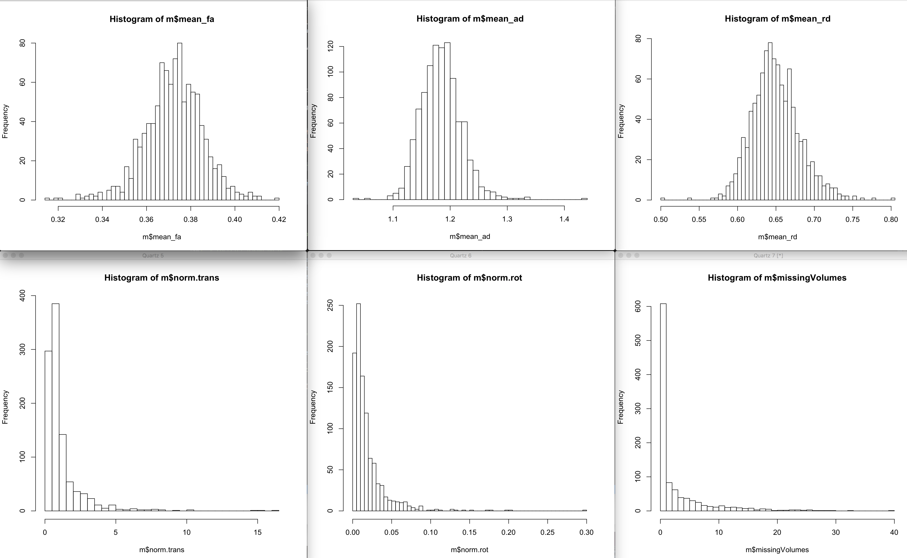

Those were the distributions using the 1020 scans. 

```r
for (p in c('mean_fa', 'mean_ad', 'mean_rd')) {
    mu=mean(m[, p])
    s = sd(m[, p])
    print(p)
    print(mu - 3 * s)
    print(mu + 3 * s)
}
```

```
[1] "mean_fa"
[1] 0.3328474
[1] 0.4117941
[1] "mean_ad"
[1] 1.076913
[1] 1.291822
[1] "mean_rd"
[1] 0.5556166
[1] 0.7444887
```

Those sound reasonable.

```r
# restrict based on QC
idx = (m$mean_fa < (mean(m$mean_fa)+3*sd(m$mean_fa)) &
       m$mean_fa > (mean(m$mean_fa)-3*sd(m$mean_fa)) &
       m$mean_ad < (mean(m$mean_ad)+3*sd(m$mean_ad)) &
       m$mean_ad > (mean(m$mean_ad)-3*sd(m$mean_ad)) &
       m$mean_rd < (mean(m$mean_rd)+3*sd(m$mean_rd)) &
       m$mean_rd > (mean(m$mean_rd)-3*sd(m$mean_rd)))
m = m[idx,]
# down to 1005

# select only the first two for each person (younger than 26 y.o.)
keep_me = c()
for (s in unique(m$Medical.Record...MRN...Subjects)) {
    subj_scans = m[m$Medical.Record...MRN...Subjects==s, ]
    dates = as.Date(as.character(subj_scans$"record.date.collected...Scan"),
                                 format="%m/%d/%Y")
    if (length(dates) >= 2) {
        sdates = sort(dates)  # not sure why index.return is not working...
        # make sure there is at least 6 months between scans
        next_scan = 2
        while (((sdates[next_scan] - sdates[1]) < 180) && (next_scan < length(sdates))) {
            next_scan = next_scan + 1
        }
        first_scan_age = subj_scans[dates==sdates[1], 'age_at_scan...Scan...Subjects']
        if (((sdates[next_scan] - sdates[1]) >= 180) && (first_scan_age < 26)) {
            idx1 = which(dates == sdates[1])
            keep_me = c(keep_me, which(m$Mask.ID...Scan == subj_scans[idx1, 'Mask.ID...Scan']))
            idx2 = which(dates == sdates[next_scan])
            keep_me = c(keep_me, which(m$Mask.ID...Scan == subj_scans[idx2, 'Mask.ID...Scan']))
        }
    }
}
m2 = m[keep_me, ]
# down to 620 scans
```

Now we need to merge those good scans with their clinical data:

```r
clin = read.csv('~/data/heritability_change/clinical_03132019.csv')
df = mergeOnClosestDate(m2, clin, unique(m2$Medical.Record...MRN...Subjects),
                         x.date='record.date.collected...Scan',
                         x.id='Medical.Record...MRN...Subjects')
b = read.csv('~/data/heritability_change/dti_mean_phenotype_1020.csv')
tract_names = colnames(b)[2:ncol(b)]
df2 = merge(df, b, by.x='Mask.ID...Scan', by.y='file')
```

Time to residualize the data and compute the slopes, including SX slopes.

```r
library(MASS)
mres = df2
mres$SX_HI = as.numeric(as.character(mres$SX_hi))
mres$SX_inatt = as.numeric(as.character(mres$SX_inatt))
for (t in tract_names) {
    print(t)
    fm_str = sprintf('%s ~', t)
    fm_str = paste(fm_str,
                   'norm.rot + I(norm.rot^2) + norm.trans + I(norm.trans^2) +',
                   'missingVolumes')
    res.lm <- lm(as.formula(fm_str), data = mres)
    step <- stepAIC(res.lm, direction = "both", trace = F)
    mres[, t] = residuals(step)
}
res = c()
for (s in unique(mres$Medical.Record...MRN...Subjects)) {
    idx = which(mres$Medical.Record...MRN...Subjects == s)
    row = c(s, unique(mres[idx, 'Sex...Subjects']))
    for (t in tract_names) {
        fm_str = sprintf('%s ~ age_at_scan...Scan...Subjects', t)
        fit = lm(as.formula(fm_str), data=mres[idx, ])
        row = c(row, coefficients(fit)[2])
    }
    for (t in c('SX_inatt', 'SX_HI')) {
        fm_str = sprintf('%s ~ age_at_scan...Scan...Subjects', t)
        fit = lm(as.formula(fm_str), data=mres[idx, ])
        row = c(row, coefficients(fit)[2])
    }
    # grabbing inatt and HI at baseline
    base_DOA = which.min(mres[idx, 'age_at_scan...Scan...Subjects'])
    row = c(row, mres[idx[base_DOA], 'SX_inatt'])
    row = c(row, mres[idx[base_DOA], 'SX_HI'])
    # DX1 is DSMV definition, DX2 will make SX >=4 as ADHD
    if (mres[idx[base_DOA], 'age_at_scan...Scan...Subjects'] < 16) {
        if ((row[length(row)] >= 6) || (row[length(row)-1] >= 6)) {
            DX = 'ADHD'
        } else {
            DX = 'NV'
        }
    } else {
        if ((row[length(row)] >= 5) || (row[length(row)-1] >= 5)) {
            DX = 'ADHD'
        } else {
            DX = 'NV'
        }
    }
    if ((row[length(row)] >= 4) || (row[length(row)-1] >= 4)) {
        DX2 = 'ADHD'
    } else {
        DX2 = 'NV'
    }
    row = c(row, DX)
    row = c(row, DX2)
    res = rbind(res, row)
}
colnames(res) = c('ID', 'sex', tract_names, c('SX_inatt', 'SX_HI',
                                              'inatt_baseline',
                                              'HI_baseline', 'DX', 'DX2'))
write.csv(res, file='~/data/heritability_change/dti_tracts_residNoSex_OLS_310.csv',
          row.names=F, quote=F)
```

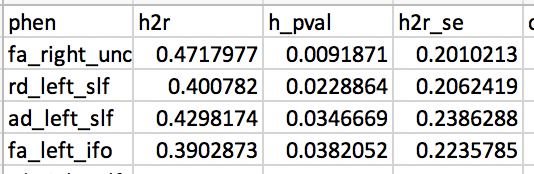

Heritability results still held.

OK, time to run some regressions now. Note that we need to remove Sex here as
well, similar to what we do later in SOLAR, so that it has no affect in the
association results!

```r
data = read.csv('~/data/heritability_change/dti_tracts_residNoSex_OLS_310.csv')
data$sex = as.factor(data$sex)
b = read.csv('~/data/heritability_change/dti_mean_phenotype_1020.csv')
tract_names = colnames(b)[2:ncol(b)]

out_fname = '~/data/heritability_change/assoc310.csv'
predictors = c('SX_inatt', 'SX_HI', 'inatt_baseline', 'HI_baseline', 'DX', 'DX2')
targets = tract_names

hold=NULL
for (i in targets) {
    for (j in predictors) {
        fm_str = sprintf('%s ~ %s + sex', i, j)
        model1<-lm(as.formula(fm_str), data, na.action=na.omit)
        temp<-summary(model1)$coefficients
        a<-as.data.frame(temp)
        a$formula<-fm_str
        a$target = i
        a$predictor = j
        a$term = rownames(temp)
        hold=rbind(hold,a)
    }
}

write.csv(hold, out_fname, row.names=F)
```

Let's try it with the DSM-V ADHDs only:

```r
data2 = data[data$DX=='ADHD', ]
out_fname = '~/data/heritability_change/assoc310_dx1.csv'
predictors = c('SX_inatt', 'SX_HI', 'inatt_baseline', 'HI_baseline')
targets = tract_names
hold=NULL
for (i in targets) {
    for (j in predictors) {
        fm_str = sprintf('%s ~ %s + sex', i, j)
        model1<-lm(as.formula(fm_str), data2, na.action=na.omit)
        temp<-summary(model1)$coefficients
        a<-as.data.frame(temp)
        a$formula<-fm_str
        a$target = i
        a$predictor = j
        a$term = rownames(temp)
        hold=rbind(hold,a)
    }
}
write.csv(hold, out_fname, row.names=F)
```

And we could also try the ADHDNOS subset:

```r
data2 = data[data$DX2=='ADHD', ]
out_fname = '~/data/heritability_change/assoc310_dx2.csv'
predictors = c('SX_inatt', 'SX_HI', 'inatt_baseline', 'HI_baseline')
targets = tract_names
hold=NULL
for (i in targets) {
    for (j in predictors) {
        fm_str = sprintf('%s ~ %s + sex', i, j)
        model1<-lm(as.formula(fm_str), data2, na.action=na.omit)
        temp<-summary(model1)$coefficients
        a<-as.data.frame(temp)
        a$formula<-fm_str
        a$target = i
        a$predictor = j
        a$term = rownames(temp)
        hold=rbind(hold,a)
    }
}
write.csv(hold, out_fname, row.names=F)
```

RD_left_slf is still significant for HI_baseline within ADHDs in DX1 and DX2.

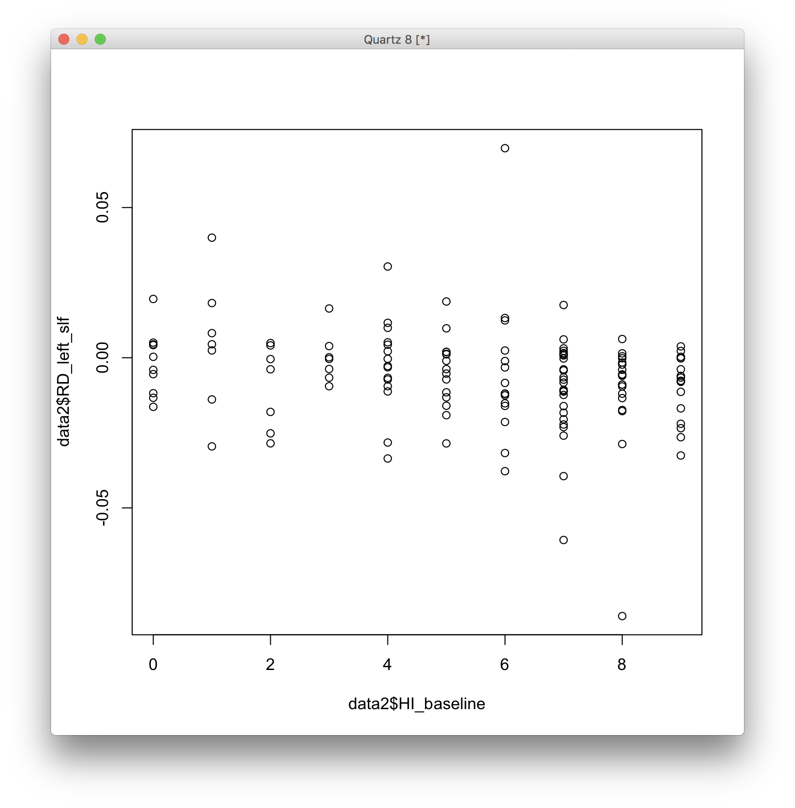

I can see a trend there, but I'm a bit concerned about those outliers. Let's see
if cleaning up the data further makes life better. We could also try doing the
DTI QC within tracts, instead of using whole brain.

## Stricter QC

What if we QC only on movement and proportion of data left? Then, we can decide
to keep all data or not for individual tracts.

```r
b = read.csv('/Volumes/Shaw/MasterQC/master_qc_20190314.csv')
a = read.csv('~/data/heritability_change/ready_1020.csv')
m = merge(a, b, by.y='Mask.ID', by.x='Mask.ID...Scan', all.x=F)
```

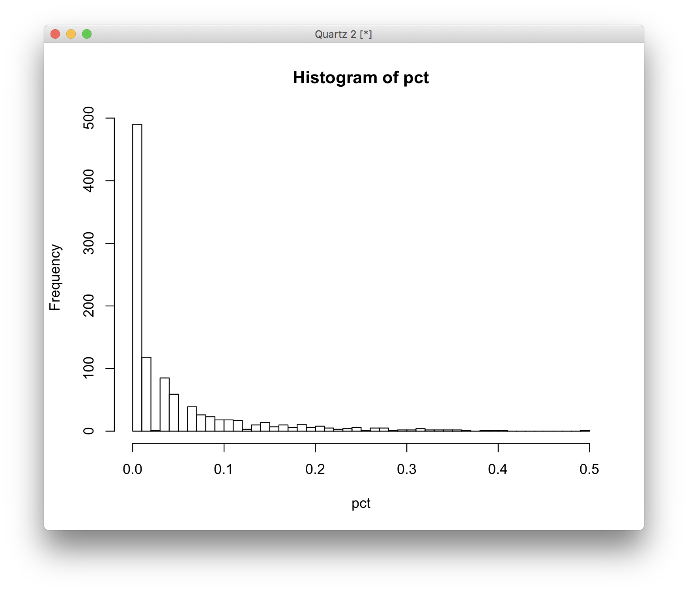

```r
# restrict based on QC
pct = m$missingVolumes / m$numVolumes
idx = m$norm.trans < 4 & m$norm.rot < .075 & pct < .1
m = m[idx,]
# down to 835 scans
keep_me = c()
for (s in unique(m$Medical.Record...MRN...Subjects)) {
    subj_scans = m[m$Medical.Record...MRN...Subjects==s, ]
    dates = as.Date(as.character(subj_scans$"record.date.collected...Scan"),
                                 format="%m/%d/%Y")
    if (length(dates) >= 2) {
        sdates = sort(dates)  # not sure why index.return is not working...
        # make sure there is at least 6 months between scans
        next_scan = 2
        while (((sdates[next_scan] - sdates[1]) < 180) && (next_scan < length(sdates))) {
            next_scan = next_scan + 1
        }
        first_scan_age = subj_scans[dates==sdates[1], 'age_at_scan...Scan...Subjects']
        if (((sdates[next_scan] - sdates[1]) >= 180) && (first_scan_age < 26)) {
            idx1 = which(dates == sdates[1])
            keep_me = c(keep_me, which(m$Mask.ID...Scan == subj_scans[idx1, 'Mask.ID...Scan']))
            idx2 = which(dates == sdates[next_scan])
            keep_me = c(keep_me, which(m$Mask.ID...Scan == subj_scans[idx2, 'Mask.ID...Scan']))
        }
    }
}
m2 = m[keep_me, ]
# down to 532 scans
```

Now we need to merge those good scans with their clinical data:

```r
clin = read.csv('~/data/heritability_change/clinical_03132019.csv')
df = mergeOnClosestDate(m2, clin, unique(m2$Medical.Record...MRN...Subjects),
                         x.date='record.date.collected...Scan',
                         x.id='Medical.Record...MRN...Subjects')
b = read.csv('~/data/heritability_change/dti_mean_phenotype_1020.csv')
tract_names = colnames(b)[2:ncol(b)]
df2 = merge(df, b, by.x='Mask.ID...Scan', by.y='file')
```

Time to residualize the data and compute the slopes, including SX slopes.

```r
library(MASS)
mres = df2
mres$SX_HI = as.numeric(as.character(mres$SX_hi))
mres$SX_inatt = as.numeric(as.character(mres$SX_inatt))
for (t in tract_names) {
    print(t)
    fm_str = sprintf('%s ~', t)
    fm_str = paste(fm_str,
                   'norm.rot + I(norm.rot^2) + norm.trans + I(norm.trans^2) +',
                   'missingVolumes')
    res.lm <- lm(as.formula(fm_str), data = mres)
    step <- stepAIC(res.lm, direction = "both", trace = F)
    mres[, t] = residuals(step)
}
res = c()
for (s in unique(mres$Medical.Record...MRN...Subjects)) {
    idx = which(mres$Medical.Record...MRN...Subjects == s)
    row = c(s, unique(mres[idx, 'Sex...Subjects']))
    for (t in tract_names) {
        fm_str = sprintf('%s ~ age_at_scan...Scan...Subjects', t)
        fit = lm(as.formula(fm_str), data=mres[idx, ])
        row = c(row, coefficients(fit)[2])
    }
    for (t in c('SX_inatt', 'SX_HI')) {
        fm_str = sprintf('%s ~ age_at_scan...Scan...Subjects', t)
        fit = lm(as.formula(fm_str), data=mres[idx, ])
        row = c(row, coefficients(fit)[2])
    }
    # grabbing inatt and HI at baseline
    base_DOA = which.min(mres[idx, 'age_at_scan...Scan...Subjects'])
    row = c(row, mres[idx[base_DOA], 'SX_inatt'])
    row = c(row, mres[idx[base_DOA], 'SX_HI'])
    # DX1 is DSMV definition, DX2 will make SX >=4 as ADHD
    if (mres[idx[base_DOA], 'age_at_scan...Scan...Subjects'] < 16) {
        if ((row[length(row)] >= 6) || (row[length(row)-1] >= 6)) {
            DX = 'ADHD'
        } else {
            DX = 'NV'
        }
    } else {
        if ((row[length(row)] >= 5) || (row[length(row)-1] >= 5)) {
            DX = 'ADHD'
        } else {
            DX = 'NV'
        }
    }
    if ((row[length(row)] >= 4) || (row[length(row)-1] >= 4)) {
        DX2 = 'ADHD'
    } else {
        DX2 = 'NV'
    }
    row = c(row, DX)
    row = c(row, DX2)
    res = rbind(res, row)
}
colnames(res) = c('ID', 'sex', tract_names, c('SX_inatt', 'SX_HI',
                                              'inatt_baseline',
                                              'HI_baseline', 'DX', 'DX2'))
write.csv(res, file='~/data/heritability_change/dti_tracts_residNoSex_OLS_266.csv',
          row.names=F, quote=F)
```

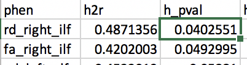

Heritability results are not as good anymore, but maybe they'll still change if
I include only people within families? Let's check association first.

```r
data = read.csv('~/data/heritability_change/dti_tracts_residNoSex_OLS_266.csv')
data$sex = as.factor(data$sex)
b = read.csv('~/data/heritability_change/dti_mean_phenotype_1020.csv')
tract_names = colnames(b)[2:ncol(b)]

out_fname = '~/data/heritability_change/assoc266.csv'
predictors = c('SX_inatt', 'SX_HI', 'inatt_baseline', 'HI_baseline', 'DX', 'DX2')
targets = tract_names

hold=NULL
for (i in targets) {
    for (j in predictors) {
        fm_str = sprintf('%s ~ %s + sex', i, j)
        model1<-lm(as.formula(fm_str), data, na.action=na.omit)
        temp<-summary(model1)$coefficients
        a<-as.data.frame(temp)
        a$formula<-fm_str
        a$target = i
        a$predictor = j
        a$term = rownames(temp)
        hold=rbind(hold,a)
    }
}

write.csv(hold, out_fname, row.names=F)

data2 = data[data$DX=='ADHD', ]
out_fname = '~/data/heritability_change/assoc266dx1.csv'
predictors = c('SX_inatt', 'SX_HI', 'inatt_baseline', 'HI_baseline')
targets = tract_names
hold=NULL
for (i in targets) {
    for (j in predictors) {
        fm_str = sprintf('%s ~ %s + sex', i, j)
        model1<-lm(as.formula(fm_str), data2, na.action=na.omit)
        temp<-summary(model1)$coefficients
        a<-as.data.frame(temp)
        a$formula<-fm_str
        a$target = i
        a$predictor = j
        a$term = rownames(temp)
        hold=rbind(hold,a)
    }
}
write.csv(hold, out_fname, row.names=F)

data2 = data[data$DX2=='ADHD', ]
out_fname = '~/data/heritability_change/assoc266_dx2.csv'
predictors = c('SX_inatt', 'SX_HI', 'inatt_baseline', 'HI_baseline')
targets = tract_names
hold=NULL
for (i in targets) {
    for (j in predictors) {
        fm_str = sprintf('%s ~ %s + sex', i, j)
        model1<-lm(as.formula(fm_str), data2, na.action=na.omit)
        temp<-summary(model1)$coefficients
        a<-as.data.frame(temp)
        a$formula<-fm_str
        a$target = i
        a$predictor = j
        a$term = rownames(temp)
        hold=rbind(hold,a)
    }
}
write.csv(hold, out_fname, row.names=F)
```

We get a lot more significant results now. That's fine, but heritability is not
great yet. Let's see first if it looks better with just the family individuals:

```r
# and make sure every family has at least two people
good_nuclear = names(table(m2$Nuclear.ID...FamilyIDs))[table(m2$Nuclear.ID...FamilyIDs) >= 4]
good_extended = names(table(m2$Extended.ID...FamilyIDs))[table(m2$Extended.ID...FamilyIDs) >= 4]
keep_me = c()
for (f in good_nuclear) {
    keep_me = c(keep_me, m2[which(m2$Nuclear.ID...FamilyIDs == f),
                            'Medical.Record...MRN...Subjects'])
}
for (f in good_extended) {
    keep_me = c(keep_me, m2[which(m2$Extended.ID...FamilyIDs == f),
                            'Medical.Record...MRN...Subjects'])
}
keep_me = unique(keep_me)

fam_subjs = c()
for (s in keep_me) {
    fam_subjs = c(fam_subjs, which(res[, 'ID'] == s))
}
res2 = res[fam_subjs, ]
write.csv(res2, file='~/data/heritability_change/dti_tracts_residNoSex_OLS_121.csv',
          row.names=F, quote=F)
```

So, we're down to 121 subjects. Let's see what happens to heritability.

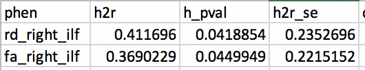

As expected, the results don't change drastically. The FA_right_ILF is still
there, which is good. That result is highly significant for SX_HI slope, even if
we filter only for ADHDs.

But the results look quite driven by outliers...

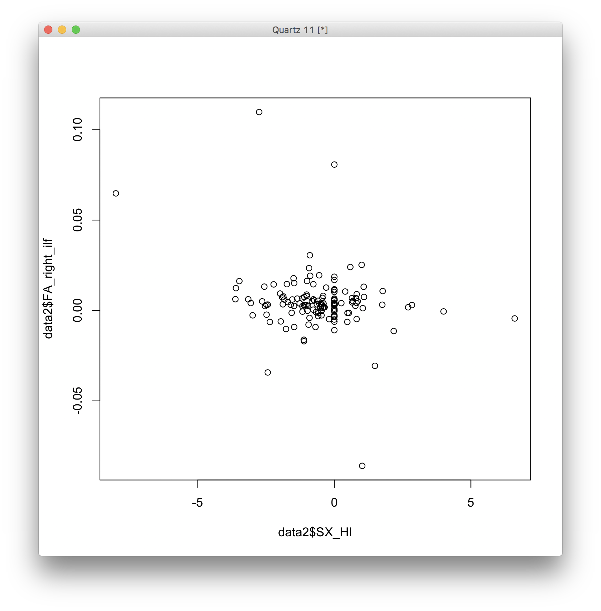

## Removing within-tract outliers

Now, the question is whether I should remove slope outliers, or tract outliers.
My initial aproach is to do it for tracts, as our QC was all done in
scan-metrics, so it makes sense to remove tract values that way as well.

```r
b = read.csv('/Volumes/Shaw/MasterQC/master_qc_20190314.csv')
a = read.csv('~/data/heritability_change/ready_1020.csv')
m = merge(a, b, by.y='Mask.ID', by.x='Mask.ID...Scan', all.x=F)

# restrict based on QC
pct = m$missingVolumes / m$numVolumes
idx = m$norm.trans < 4 & m$norm.rot < .075 & pct < .1
m = m[idx,]
# down to 835 scans
keep_me = c()
for (s in unique(m$Medical.Record...MRN...Subjects)) {
    subj_scans = m[m$Medical.Record...MRN...Subjects==s, ]
    dates = as.Date(as.character(subj_scans$"record.date.collected...Scan"),
                                 format="%m/%d/%Y")
    if (length(dates) >= 2) {
        sdates = sort(dates)  # not sure why index.return is not working...
        # make sure there is at least 6 months between scans
        next_scan = 2
        while (((sdates[next_scan] - sdates[1]) < 180) && (next_scan < length(sdates))) {
            next_scan = next_scan + 1
        }
        first_scan_age = subj_scans[dates==sdates[1], 'age_at_scan...Scan...Subjects']
        if (((sdates[next_scan] - sdates[1]) >= 180) && (first_scan_age < 26)) {
            idx1 = which(dates == sdates[1])
            keep_me = c(keep_me, which(m$Mask.ID...Scan == subj_scans[idx1, 'Mask.ID...Scan']))
            idx2 = which(dates == sdates[next_scan])
            keep_me = c(keep_me, which(m$Mask.ID...Scan == subj_scans[idx2, 'Mask.ID...Scan']))
        }
    }
}
m2 = m[keep_me, ]
# down to 532 scans
```

Merging with clinicals and cleaned up data:

```r
clin = read.csv('~/data/heritability_change/clinical_03132019.csv')
df = mergeOnClosestDate(m2, clin, unique(m2$Medical.Record...MRN...Subjects),
                         x.date='record.date.collected...Scan',
                         x.id='Medical.Record...MRN...Subjects')
b = read.csv('~/data/heritability_change/dti_mean_phenotype_1020_cleanedWithinTract3sd.csv')
tract_names = colnames(b)[2:ncol(b)]
df2 = merge(df, b, by.x='Mask.ID...Scan', by.y='file')
```

Time to residualize the data and compute the slopes, including SX slopes.

```r
library(MASS)
mres = df2
mres$SX_HI = as.numeric(as.character(mres$SX_hi))
mres$SX_inatt = as.numeric(as.character(mres$SX_inatt))
for (t in tract_names) {
    print(t)
    fm_str = sprintf('%s ~', t)
    fm_str = paste(fm_str,
                   'norm.rot + I(norm.rot^2) + norm.trans + I(norm.trans^2) +',
                   'missingVolumes')
    res.lm <- lm(as.formula(fm_str), data = mres, na.action=na.exclude)
    step <- stepAIC(res.lm, direction = "both", trace = F)
    mres[, t] = residuals(step)
}
res = c()
for (s in unique(mres$Medical.Record...MRN...Subjects)) {
    idx = which(mres$Medical.Record...MRN...Subjects == s)
    row = c(s, unique(mres[idx, 'Sex...Subjects']))
    for (t in tract_names) {
        if (sum(is.na(mres[idx, t])) > 0) {
            # if any of the tract values is NA, make the slope NA
            row = c(row, NA)
        } else {
            fm_str = sprintf('%s ~ age_at_scan...Scan...Subjects', t)
           fit = lm(as.formula(fm_str), data=mres[idx, ], na.action=na.exclude)
           row = c(row, coefficients(fit)[2])
        }
    }
    for (t in c('SX_inatt', 'SX_HI')) {
        fm_str = sprintf('%s ~ age_at_scan...Scan...Subjects', t)
        fit = lm(as.formula(fm_str), data=mres[idx, ], na.action=na.exclude)
        row = c(row, coefficients(fit)[2])
    }
    # grabbing inatt and HI at baseline
    base_DOA = which.min(mres[idx, 'age_at_scan...Scan...Subjects'])
    row = c(row, mres[idx[base_DOA], 'SX_inatt'])
    row = c(row, mres[idx[base_DOA], 'SX_HI'])
    # DX1 is DSMV definition, DX2 will make SX >=4 as ADHD
    if (mres[idx[base_DOA], 'age_at_scan...Scan...Subjects'] < 16) {
        if ((row[length(row)] >= 6) || (row[length(row)-1] >= 6)) {
            DX = 'ADHD'
        } else {
            DX = 'NV'
        }
    } else {
        if ((row[length(row)] >= 5) || (row[length(row)-1] >= 5)) {
            DX = 'ADHD'
        } else {
            DX = 'NV'
        }
    }
    if ((row[length(row)] >= 4) || (row[length(row)-1] >= 4)) {
        DX2 = 'ADHD'
    } else {
        DX2 = 'NV'
    }
    row = c(row, DX)
    row = c(row, DX2)
    res = rbind(res, row)
}
colnames(res) = c('ID', 'sex', tract_names, c('SX_inatt', 'SX_HI',
                                              'inatt_baseline',
                                              'HI_baseline', 'DX', 'DX2'))
write.csv(res, file='~/data/heritability_change/dti_tracts_residNoSex_OLS_na266.csv',
          row.names=F, na='', quote=F)
```

Note that now the n for heritability in each tract changes! But now nothing is
significant anymore... any changes if we include only the family people?

```r
# and make sure every family has at least two people
good_nuclear = names(table(m2$Nuclear.ID...FamilyIDs))[table(m2$Nuclear.ID...FamilyIDs) >= 4]
good_extended = names(table(m2$Extended.ID...FamilyIDs))[table(m2$Extended.ID...FamilyIDs) >= 4]
keep_me = c()
for (f in good_nuclear) {
    keep_me = c(keep_me, m2[which(m2$Nuclear.ID...FamilyIDs == f),
                            'Medical.Record...MRN...Subjects'])
}
for (f in good_extended) {
    keep_me = c(keep_me, m2[which(m2$Extended.ID...FamilyIDs == f),
                            'Medical.Record...MRN...Subjects'])
}
keep_me = unique(keep_me)

fam_subjs = c()
for (s in keep_me) {
    fam_subjs = c(fam_subjs, which(res[, 'ID'] == s))
}
res2 = res[fam_subjs, ]
write.csv(res2, file='~/data/heritability_change/dti_tracts_residNoSex_OLS_na121.csv',
          row.names=F, na='', quote=F)
```

Nope... even worse.

Maybe we're being too stringent with our QC? Let's allow a few more scans go in:

```r
b = read.csv('/Volumes/Shaw/MasterQC/master_qc_20190314.csv')
a = read.csv('~/data/heritability_change/ready_1020.csv')
m = merge(a, b, by.y='Mask.ID', by.x='Mask.ID...Scan', all.x=F)

# restrict based on QC
pct = m$missingVolumes / m$numVolumes
idx = m$norm.trans < 5 & m$norm.rot < .1 & pct < .15
m = m[idx,]
# down to 902 scans
keep_me = c()
for (s in unique(m$Medical.Record...MRN...Subjects)) {
    subj_scans = m[m$Medical.Record...MRN...Subjects==s, ]
    dates = as.Date(as.character(subj_scans$"record.date.collected...Scan"),
                                 format="%m/%d/%Y")
    if (length(dates) >= 2) {
        sdates = sort(dates)  # not sure why index.return is not working...
        # make sure there is at least 6 months between scans
        next_scan = 2
        while (((sdates[next_scan] - sdates[1]) < 180) && (next_scan < length(sdates))) {
            next_scan = next_scan + 1
        }
        first_scan_age = subj_scans[dates==sdates[1], 'age_at_scan...Scan...Subjects']
        if (((sdates[next_scan] - sdates[1]) >= 180) && (first_scan_age < 26)) {
            idx1 = which(dates == sdates[1])
            keep_me = c(keep_me, which(m$Mask.ID...Scan == subj_scans[idx1, 'Mask.ID...Scan']))
            idx2 = which(dates == sdates[next_scan])
            keep_me = c(keep_me, which(m$Mask.ID...Scan == subj_scans[idx2, 'Mask.ID...Scan']))
        }
    }
}
m2 = m[keep_me, ]
# down to 566 scans
```

Merging with clinicals and cleaned up data:

```r
clin = read.csv('~/data/heritability_change/clinical_03132019.csv')
df = mergeOnClosestDate(m2, clin, unique(m2$Medical.Record...MRN...Subjects),
                         x.date='record.date.collected...Scan',
                         x.id='Medical.Record...MRN...Subjects')
b = read.csv('~/data/heritability_change/dti_mean_phenotype_1020_cleanedWithinTract3sd.csv')
tract_names = colnames(b)[2:ncol(b)]
df2 = merge(df, b, by.x='Mask.ID...Scan', by.y='file')

library(MASS)
mres = df2
mres$SX_HI = as.numeric(as.character(mres$SX_hi))
mres$SX_inatt = as.numeric(as.character(mres$SX_inatt))
for (t in tract_names) {
    print(t)
    fm_str = sprintf('%s ~', t)
    fm_str = paste(fm_str,
                   'norm.rot + I(norm.rot^2) + norm.trans + I(norm.trans^2) +',
                   'missingVolumes')
    res.lm <- lm(as.formula(fm_str), data = mres, na.action=na.exclude)
    step <- stepAIC(res.lm, direction = "both", trace = F)
    mres[, t] = residuals(step)
}
res = c()
for (s in unique(mres$Medical.Record...MRN...Subjects)) {
    idx = which(mres$Medical.Record...MRN...Subjects == s)
    row = c(s, unique(mres[idx, 'Sex...Subjects']))
    for (t in tract_names) {
        if (sum(is.na(mres[idx, t])) > 0) {
            # if any of the tract values is NA, make the slope NA
            row = c(row, NA)
        } else {
            fm_str = sprintf('%s ~ age_at_scan...Scan...Subjects', t)
           fit = lm(as.formula(fm_str), data=mres[idx, ], na.action=na.exclude)
           row = c(row, coefficients(fit)[2])
        }
    }
    for (t in c('SX_inatt', 'SX_HI')) {
        fm_str = sprintf('%s ~ age_at_scan...Scan...Subjects', t)
        fit = lm(as.formula(fm_str), data=mres[idx, ], na.action=na.exclude)
        row = c(row, coefficients(fit)[2])
    }
    # grabbing inatt and HI at baseline
    base_DOA = which.min(mres[idx, 'age_at_scan...Scan...Subjects'])
    row = c(row, mres[idx[base_DOA], 'SX_inatt'])
    row = c(row, mres[idx[base_DOA], 'SX_HI'])
    # DX1 is DSMV definition, DX2 will make SX >=4 as ADHD
    if (mres[idx[base_DOA], 'age_at_scan...Scan...Subjects'] < 16) {
        if ((row[length(row)] >= 6) || (row[length(row)-1] >= 6)) {
            DX = 'ADHD'
        } else {
            DX = 'NV'
        }
    } else {
        if ((row[length(row)] >= 5) || (row[length(row)-1] >= 5)) {
            DX = 'ADHD'
        } else {
            DX = 'NV'
        }
    }
    if ((row[length(row)] >= 4) || (row[length(row)-1] >= 4)) {
        DX2 = 'ADHD'
    } else {
        DX2 = 'NV'
    }
    row = c(row, DX)
    row = c(row, DX2)
    res = rbind(res, row)
}
colnames(res) = c('ID', 'sex', tract_names, c('SX_inatt', 'SX_HI',
                                              'inatt_baseline',
                                              'HI_baseline', 'DX', 'DX2'))
write.csv(res, file='~/data/heritability_change/dti_tracts_residNoSex_OLS_na283.csv',
          row.names=F, na='', quote=F)
```

This gets me one results back, ad_left_slf. Is it associated with anything?

```r
data = read.csv('~/data/heritability_change/dti_tracts_residNoSex_OLS_na283.csv')
data$sex = as.factor(data$sex)
b = read.csv('~/data/heritability_change/dti_mean_phenotype_1020.csv')
tract_names = colnames(b)[2:ncol(b)]
out_fname = '~/data/heritability_change/assoc_na283.csv'
predictors = c('SX_inatt', 'SX_HI', 'inatt_baseline', 'HI_baseline', 'DX', 'DX2')
targets = tract_names
hold=NULL
for (i in targets) {
    for (j in predictors) {
        fm_str = sprintf('%s ~ %s + sex', i, j)
        model1<-lm(as.formula(fm_str), data, na.action=na.omit)
        temp<-summary(model1)$coefficients
        a<-as.data.frame(temp)
        a$formula<-fm_str
        a$target = i
        a$predictor = j
        a$term = rownames(temp)
        hold=rbind(hold,a)
    }
}
write.csv(hold, out_fname, row.names=F)

data2 = data[data$DX=='ADHD', ]
out_fname = '~/data/heritability_change/assoc_na283dx1.csv'
predictors = c('SX_inatt', 'SX_HI', 'inatt_baseline', 'HI_baseline')
targets = tract_names
hold=NULL
for (i in targets) {
    for (j in predictors) {
        fm_str = sprintf('%s ~ %s + sex', i, j)
        model1<-lm(as.formula(fm_str), data2, na.action=na.omit)
        temp<-summary(model1)$coefficients
        a<-as.data.frame(temp)
        a$formula<-fm_str
        a$target = i
        a$predictor = j
        a$term = rownames(temp)
        hold=rbind(hold,a)
    }
}
write.csv(hold, out_fname, row.names=F)

data2 = data[data$DX2=='ADHD', ]
out_fname = '~/data/heritability_change/assoc_na283_dx2.csv'
predictors = c('SX_inatt', 'SX_HI', 'inatt_baseline', 'HI_baseline')
targets = tract_names
hold=NULL
for (i in targets) {
    for (j in predictors) {
        fm_str = sprintf('%s ~ %s + sex', i, j)
        model1<-lm(as.formula(fm_str), data2, na.action=na.omit)
        temp<-summary(model1)$coefficients
        a<-as.data.frame(temp)
        a$formula<-fm_str
        a$target = i
        a$predictor = j
        a$term = rownames(temp)
        hold=rbind(hold,a)
    }
}
write.csv(hold, out_fname, row.names=F)
```

Very few results, and they still seem to be driven by outliers... Maybe the best
approach will be to handle outliers after taking the slope.

```r
b = read.csv('/Volumes/Shaw/MasterQC/master_qc_20190314.csv')
a = read.csv('~/data/heritability_change/ready_1020.csv')
m = merge(a, b, by.y='Mask.ID', by.x='Mask.ID...Scan', all.x=F)

# restrict based on QC
pct = m$missingVolumes / m$numVolumes
idx = m$norm.trans < 5 & m$norm.rot < .1 & pct < .15
m = m[idx,]
# down to 902 scans
keep_me = c()
for (s in unique(m$Medical.Record...MRN...Subjects)) {
    subj_scans = m[m$Medical.Record...MRN...Subjects==s, ]
    dates = as.Date(as.character(subj_scans$"record.date.collected...Scan"),
                                 format="%m/%d/%Y")
    if (length(dates) >= 2) {
        sdates = sort(dates)  # not sure why index.return is not working...
        # make sure there is at least 6 months between scans
        next_scan = 2
        while (((sdates[next_scan] - sdates[1]) < 180) && (next_scan < length(sdates))) {
            next_scan = next_scan + 1
        }
        first_scan_age = subj_scans[dates==sdates[1], 'age_at_scan...Scan...Subjects']
        if (((sdates[next_scan] - sdates[1]) >= 180) && (first_scan_age < 26)) {
            idx1 = which(dates == sdates[1])
            keep_me = c(keep_me, which(m$Mask.ID...Scan == subj_scans[idx1, 'Mask.ID...Scan']))
            idx2 = which(dates == sdates[next_scan])
            keep_me = c(keep_me, which(m$Mask.ID...Scan == subj_scans[idx2, 'Mask.ID...Scan']))
        }
    }
}
m2 = m[keep_me, ]
# down to 566 scans
```

```r
clin = read.csv('~/data/heritability_change/clinical_03132019.csv')
df = mergeOnClosestDate(m2, clin, unique(m2$Medical.Record...MRN...Subjects),
                         x.date='record.date.collected...Scan',
                         x.id='Medical.Record...MRN...Subjects')
b = read.csv('~/data/heritability_change/dti_mean_phenotype_1020.csv')
tract_names = colnames(b)[2:ncol(b)]
df2 = merge(df, b, by.x='Mask.ID...Scan', by.y='file')

library(MASS)
mres = df2
mres$SX_HI = as.numeric(as.character(mres$SX_hi))
mres$SX_inatt = as.numeric(as.character(mres$SX_inatt))
for (t in tract_names) {
    print(t)
    fm_str = sprintf('%s ~', t)
    fm_str = paste(fm_str,
                   'norm.rot + I(norm.rot^2) + norm.trans + I(norm.trans^2) +',
                   'missingVolumes')
    res.lm <- lm(as.formula(fm_str), data = mres, na.action=na.exclude)
    step <- stepAIC(res.lm, direction = "both", trace = F)
    mres[, t] = residuals(step)
}
res = c()
for (s in unique(mres$Medical.Record...MRN...Subjects)) {
    idx = which(mres$Medical.Record...MRN...Subjects == s)
    row = c(s, unique(mres[idx, 'Sex...Subjects']))
    for (t in tract_names) {
        if (sum(is.na(mres[idx, t])) > 0) {
            # if any of the tract values is NA, make the slope NA
            row = c(row, NA)
        } else {
            fm_str = sprintf('%s ~ age_at_scan...Scan...Subjects', t)
           fit = lm(as.formula(fm_str), data=mres[idx, ], na.action=na.exclude)
           row = c(row, coefficients(fit)[2])
        }
    }
    for (t in c('SX_inatt', 'SX_HI')) {
        fm_str = sprintf('%s ~ age_at_scan...Scan...Subjects', t)
        fit = lm(as.formula(fm_str), data=mres[idx, ], na.action=na.exclude)
        row = c(row, coefficients(fit)[2])
    }
    # grabbing inatt and HI at baseline
    base_DOA = which.min(mres[idx, 'age_at_scan...Scan...Subjects'])
    row = c(row, mres[idx[base_DOA], 'SX_inatt'])
    row = c(row, mres[idx[base_DOA], 'SX_HI'])
    # DX1 is DSMV definition, DX2 will make SX >=4 as ADHD
    if (mres[idx[base_DOA], 'age_at_scan...Scan...Subjects'] < 16) {
        if ((row[length(row)] >= 6) || (row[length(row)-1] >= 6)) {
            DX = 'ADHD'
        } else {
            DX = 'NV'
        }
    } else {
        if ((row[length(row)] >= 5) || (row[length(row)-1] >= 5)) {
            DX = 'ADHD'
        } else {
            DX = 'NV'
        }
    }
    if ((row[length(row)] >= 4) || (row[length(row)-1] >= 4)) {
        DX2 = 'ADHD'
    } else {
        DX2 = 'NV'
    }
    row = c(row, DX)
    row = c(row, DX2)
    res = rbind(res, row)
}
colnames(res) = c('ID', 'sex', tract_names, c('SX_inatt', 'SX_HI',
                                              'inatt_baseline',
                                              'HI_baseline', 'DX', 'DX2'))

# and remove outliers
for (t in tract_names) {
    mydata = as.numeric(res[, t])
    # identifying outliers
    ul = mean(mydata) + 3 * sd(mydata)
    ll = mean(mydata) - 3 * sd(mydata)
    bad_subjs = c(which(mydata < ll), which(mydata > ul))

    # remove within-tract outliers
    res[bad_subjs, t] = NA
}
write.csv(res, file='~/data/heritability_change/dti_tracts_residNoSex_OLS_naSlopes283.csv',
          row.names=F, na='', quote=F)
```

AD_left_slf is still significant at .009, but that's the only one. Is it at all
significantly associated? And does it show any outliers? It shouldn't...

```r
data = read.csv('~/data/heritability_change/dti_tracts_residNoSex_OLS_naSlopes283.csv')
data$sex = as.factor(data$sex)
b = read.csv('~/data/heritability_change/dti_mean_phenotype_1020.csv')
tract_names = colnames(b)[2:ncol(b)]
out_fname = '~/data/heritability_change/assoc_naSlopes283.csv'
predictors = c('SX_inatt', 'SX_HI', 'inatt_baseline', 'HI_baseline', 'DX', 'DX2')
targets = tract_names
hold=NULL
for (i in targets) {
    for (j in predictors) {
        fm_str = sprintf('%s ~ %s + sex', i, j)
        model1<-lm(as.formula(fm_str), data, na.action=na.omit)
        temp<-summary(model1)$coefficients
        a<-as.data.frame(temp)
        a$formula<-fm_str
        a$target = i
        a$predictor = j
        a$term = rownames(temp)
        hold=rbind(hold,a)
    }
}
write.csv(hold, out_fname, row.names=F)

data2 = data[data$DX=='ADHD', ]
out_fname = '~/data/heritability_change/assoc_naSlopes283dx1.csv'
predictors = c('SX_inatt', 'SX_HI', 'inatt_baseline', 'HI_baseline')
targets = tract_names
hold=NULL
for (i in targets) {
    for (j in predictors) {
        fm_str = sprintf('%s ~ %s + sex', i, j)
        model1<-lm(as.formula(fm_str), data2, na.action=na.omit)
        temp<-summary(model1)$coefficients
        a<-as.data.frame(temp)
        a$formula<-fm_str
        a$target = i
        a$predictor = j
        a$term = rownames(temp)
        hold=rbind(hold,a)
    }
}
write.csv(hold, out_fname, row.names=F)

data2 = data[data$DX2=='ADHD', ]
out_fname = '~/data/heritability_change/assoc_naSlopes283_dx2.csv'
predictors = c('SX_inatt', 'SX_HI', 'inatt_baseline', 'HI_baseline')
targets = tract_names
hold=NULL
for (i in targets) {
    for (j in predictors) {
        fm_str = sprintf('%s ~ %s + sex', i, j)
        model1<-lm(as.formula(fm_str), data2, na.action=na.omit)
        temp<-summary(model1)$coefficients
        a<-as.data.frame(temp)
        a$formula<-fm_str
        a$target = i
        a$predictor = j
        a$term = rownames(temp)
        hold=rbind(hold,a)
    }
}
write.csv(hold, out_fname, row.names=F)
```

It's still highly significant for HI_baseline within ADHD DX1, DX2.


Well, it's not impressive, but it's significant.

Just for completeness, let's see the heritability results in the family only
sample:

```r
# and make sure every family has at least two people
good_nuclear = names(table(m2$Nuclear.ID...FamilyIDs))[table(m2$Nuclear.ID...FamilyIDs) >= 4]
good_extended = names(table(m2$Extended.ID...FamilyIDs))[table(m2$Extended.ID...FamilyIDs) >= 4]
keep_me = c()
for (f in good_nuclear) {
    keep_me = c(keep_me, m2[which(m2$Nuclear.ID...FamilyIDs == f),
                            'Medical.Record...MRN...Subjects'])
}
for (f in good_extended) {
    keep_me = c(keep_me, m2[which(m2$Extended.ID...FamilyIDs == f),
                            'Medical.Record...MRN...Subjects'])
}
keep_me = unique(keep_me)

fam_subjs = c()
for (s in keep_me) {
    fam_subjs = c(fam_subjs, which(res[, 'ID'] == s))
}
res2 = res[fam_subjs, ]
write.csv(res2, file='~/data/heritability_change/dti_tracts_residNoSex_OLS_naSlopes134.csv',
          row.names=F, na='', quote=F)
```

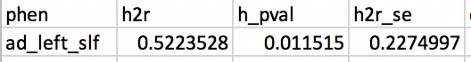

OK, still significant!

# 2019-03-15 12:52:23

Philip suggested that I should just average over the JHU labels and see if any of that is signitifcant. OK, let's give it a try:

```bash
mydir=~/data/heritability_change/
DTITK_ROOT=/Applications/dtitk-2.3.3-Darwin-x86_64/bin/
weighted_tracts=jhu_tracts.csv;
# copying everything locally first to avoid racing conditions
cd $mydir
row="id";
for t in `seq 1 20`; do
    for m in fa ad rd; do
        row=${row}','${m}_${t};
    done
done
echo $row > $weighted_tracts;
for m in `cat ids1020.txt`; do
    echo ${m}
    ${DTITK_ROOT}/TVtool -in nii/${m}_tensor_diffeo.nii.gz -fa \
        -out nii/${m}_fa.nii >/dev/null 2>&1;
    ${DTITK_ROOT}/TVtool -in nii/${m}_tensor_diffeo.nii.gz -ad \
        -out nii/${m}_ad.nii >/dev/null 2>&1;
    ${DTITK_ROOT}/TVtool -in nii/${m}_tensor_diffeo.nii.gz -rd \
        -out nii/${m}_rd.nii >/dev/null 2>&1;
    3dresample -master nii/${m}_fa.nii.gz -prefix ./rois.nii \
                -inset ../JHU_ICBM_tractsThr25_inAging.nii.gz \
                -rmode NN -overwrite 2>/dev/null &&
    row="${m}";
    for t in `seq 1 20`; do
        3dcalc -a rois.nii -expr "amongst(a, $t)" -prefix mask.nii \
            -overwrite 2>/dev/null &&
        fa=`3dmaskave -q -mask mask.nii nii/${m}_fa.nii 2>/dev/null` &&
        ad=`3dmaskave -q -mask mask.nii nii/${m}_ad.nii 2>/dev/null`;
        rd=`3dmaskave -q -mask mask.nii nii/${m}_rd.nii 2>/dev/null`;
        row=${row}','${fa}','${ad}','${rd};
    done
    echo $row >> $weighted_tracts;
done
```

Then, because all _mod files are done, I can just run this for the other labels:

```bash
mydir=~/data/heritability_change/
DTITK_ROOT=/Applications/dtitk-2.3.3-Darwin-x86_64/bin/
weighted_tracts=jhu_labels.csv;
# copying everything locally first to avoid racing conditions
cd $mydir
row="id";
for t in `seq 1 48`; do
    for m in fa ad rd; do
        row=${row}','${m}_${t};
    done
done
echo $row > $weighted_tracts;
for m in `cat ids1020.txt`; do
    echo ${m}
    3dresample -master nii/${m}_fa.nii.gz -prefix ./rois2.nii \
                -inset ../JHU_ICBM_labels_inAging.nii.gz \
                -rmode NN -overwrite 2>/dev/null &&
    row="${m}";
    for t in `seq 1 48`; do
        3dcalc -a rois2.nii -expr "amongst(a, $t)" -prefix mask2.nii \
            -overwrite 2>/dev/null &&
        fa=`3dmaskave -q -mask mask2.nii nii/${m}_fa.nii 2>/dev/null` &&
        ad=`3dmaskave -q -mask mask2.nii nii/${m}_ad.nii 2>/dev/null`;
        rd=`3dmaskave -q -mask mask2.nii nii/${m}_rd.nii 2>/dev/null`;
        row=${row}','${fa}','${ad}','${rd};
    done
    echo $row >> $weighted_tracts;
done
```

## JHU tracts

The second one is taking longer, but let's see what we can get with the first one:

```r
b = read.csv('/Volumes/Shaw/MasterQC/master_qc_20190314.csv')
a = read.csv('~/data/heritability_change/ready_1020.csv')
m = merge(a, b, by.y='Mask.ID', by.x='Mask.ID...Scan', all.x=F)

# restrict based on QC
pct = m$missingVolumes / m$numVolumes
idx = m$norm.trans < 5 & m$norm.rot < .1 & pct < .15
m = m[idx,]
# down to 902 scans
keep_me = c()
for (s in unique(m$Medical.Record...MRN...Subjects)) {
    subj_scans = m[m$Medical.Record...MRN...Subjects==s, ]
    dates = as.Date(as.character(subj_scans$"record.date.collected...Scan"),
                                 format="%m/%d/%Y")
    if (length(dates) >= 2) {
        sdates = sort(dates)  # not sure why index.return is not working...
        # make sure there is at least 6 months between scans
        next_scan = 2
        while (((sdates[next_scan] - sdates[1]) < 180) && (next_scan < length(sdates))) {
            next_scan = next_scan + 1
        }
        first_scan_age = subj_scans[dates==sdates[1], 'age_at_scan...Scan...Subjects']
        if (((sdates[next_scan] - sdates[1]) >= 180) && (first_scan_age < 26)) {
            idx1 = which(dates == sdates[1])
            keep_me = c(keep_me, which(m$Mask.ID...Scan == subj_scans[idx1, 'Mask.ID...Scan']))
            idx2 = which(dates == sdates[next_scan])
            keep_me = c(keep_me, which(m$Mask.ID...Scan == subj_scans[idx2, 'Mask.ID...Scan']))
        }
    }
}
m2 = m[keep_me, ]
# down to 566 scans, as we're not using tract data at this point
```

```r
clin = read.csv('~/data/heritability_change/clinical_03132019.csv')
df = mergeOnClosestDate(m2, clin, unique(m2$Medical.Record...MRN...Subjects),
                         x.date='record.date.collected...Scan',
                         x.id='Medical.Record...MRN...Subjects')
b = read.csv('~/data/heritability_change/jhu_tracts_1020.csv')
tract_names = colnames(b)[2:ncol(b)]
df2 = merge(df, b, by.x='Mask.ID...Scan', by.y='id')

library(MASS)
mres = df2
mres$SX_HI = as.numeric(as.character(mres$SX_hi))
mres$SX_inatt = as.numeric(as.character(mres$SX_inatt))
for (t in tract_names) {
    print(t)
    fm_str = sprintf('%s ~', t)
    fm_str = paste(fm_str,
                   'norm.rot + I(norm.rot^2) + norm.trans + I(norm.trans^2) +',
                   'missingVolumes')
    res.lm <- lm(as.formula(fm_str), data = mres, na.action=na.exclude)
    step <- stepAIC(res.lm, direction = "both", trace = F)
    mres[, t] = residuals(step)
}
res = c()
for (s in unique(mres$Medical.Record...MRN...Subjects)) {
    idx = which(mres$Medical.Record...MRN...Subjects == s)
    row = c(s, unique(mres[idx, 'Sex...Subjects']))
    for (t in tract_names) {
        if (sum(is.na(mres[idx, t])) > 0) {
            # if any of the tract values is NA, make the slope NA
            row = c(row, NA)
        } else {
            fm_str = sprintf('%s ~ age_at_scan...Scan...Subjects', t)
           fit = lm(as.formula(fm_str), data=mres[idx, ], na.action=na.exclude)
           row = c(row, coefficients(fit)[2])
        }
    }
    for (t in c('SX_inatt', 'SX_HI')) {
        fm_str = sprintf('%s ~ age_at_scan...Scan...Subjects', t)
        fit = lm(as.formula(fm_str), data=mres[idx, ], na.action=na.exclude)
        row = c(row, coefficients(fit)[2])
    }
    # grabbing inatt and HI at baseline
    base_DOA = which.min(mres[idx, 'age_at_scan...Scan...Subjects'])
    row = c(row, mres[idx[base_DOA], 'SX_inatt'])
    row = c(row, mres[idx[base_DOA], 'SX_HI'])
    # DX1 is DSMV definition, DX2 will make SX >=4 as ADHD
    if (mres[idx[base_DOA], 'age_at_scan...Scan...Subjects'] < 16) {
        if ((row[length(row)] >= 6) || (row[length(row)-1] >= 6)) {
            DX = 'ADHD'
        } else {
            DX = 'NV'
        }
    } else {
        if ((row[length(row)] >= 5) || (row[length(row)-1] >= 5)) {
            DX = 'ADHD'
        } else {
            DX = 'NV'
        }
    }
    if ((row[length(row)] >= 4) || (row[length(row)-1] >= 4)) {
        DX2 = 'ADHD'
    } else {
        DX2 = 'NV'
    }
    row = c(row, DX)
    row = c(row, DX2)
    res = rbind(res, row)
}
colnames(res) = c('ID', 'sex', tract_names, c('SX_inatt', 'SX_HI',
                                              'inatt_baseline',
                                              'HI_baseline', 'DX', 'DX2'))

# and remove outliers
for (t in tract_names) {
    mydata = as.numeric(res[, t])
    # identifying outliers
    ul = mean(mydata) + 3 * sd(mydata)
    ll = mean(mydata) - 3 * sd(mydata)
    bad_subjs = c(which(mydata < ll), which(mydata > ul))

    # remove within-tract outliers
    res[bad_subjs, t] = NA
}
write.csv(res, file='~/data/heritability_change/dti_JHUtracts_residNoSex_OLS_naSlopes283.csv',
          row.names=F, na='', quote=F)
```

There are some heritable tracts:

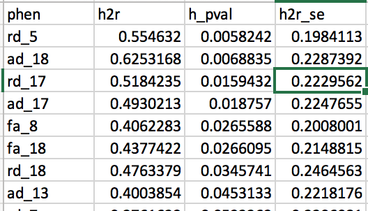

And similarly, we run the association analysis:

```r
data = read.csv('~/data/heritability_change/dti_JHUtracts_residNoSex_OLS_naSlopes283.csv')
data$sex = as.factor(data$sex)
b = read.csv('~/data/heritability_change/jhu_tracts_1020.csv')
tract_names = colnames(b)[2:ncol(b)]
out_fname = '~/data/heritability_change/assoc_JHUtracts_naSlopes283.csv'
predictors = c('SX_inatt', 'SX_HI', 'inatt_baseline', 'HI_baseline', 'DX', 'DX2')
targets = tract_names
hold=NULL
for (i in targets) {
    for (j in predictors) {
        fm_str = sprintf('%s ~ %s + sex', i, j)
        model1<-lm(as.formula(fm_str), data, na.action=na.omit)
        temp<-summary(model1)$coefficients
        a<-as.data.frame(temp)
        a$formula<-fm_str
        a$target = i
        a$predictor = j
        a$term = rownames(temp)
        hold=rbind(hold,a)
    }
}
write.csv(hold, out_fname, row.names=F)

data2 = data[data$DX=='ADHD', ]
out_fname = '~/data/heritability_change/assoc_JHUtracts_naSlopes283dx1.csv'
predictors = c('SX_inatt', 'SX_HI', 'inatt_baseline', 'HI_baseline')
targets = tract_names
hold=NULL
for (i in targets) {
    for (j in predictors) {
        fm_str = sprintf('%s ~ %s + sex', i, j)
        model1<-lm(as.formula(fm_str), data2, na.action=na.omit)
        temp<-summary(model1)$coefficients
        a<-as.data.frame(temp)
        a$formula<-fm_str
        a$target = i
        a$predictor = j
        a$term = rownames(temp)
        hold=rbind(hold,a)
    }
}
write.csv(hold, out_fname, row.names=F)

data2 = data[data$DX2=='ADHD', ]
out_fname = '~/data/heritability_change/assoc_JHUtracts_naSlopes283_dx2.csv'
predictors = c('SX_inatt', 'SX_HI', 'inatt_baseline', 'HI_baseline')
targets = tract_names
hold=NULL
for (i in targets) {
    for (j in predictors) {
        fm_str = sprintf('%s ~ %s + sex', i, j)
        model1<-lm(as.formula(fm_str), data2, na.action=na.omit)
        temp<-summary(model1)$coefficients
        a<-as.data.frame(temp)
        a$formula<-fm_str
        a$target = i
        a$predictor = j
        a$term = rownames(temp)
        hold=rbind(hold,a)
    }
}
write.csv(hold, out_fname, row.names=F)
```

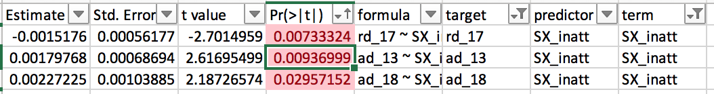

A few significant association hits among heritable tracts when using the whole cohort. However, nothing significant for DX1 within the heritable ones. But still some hit on DX 2:

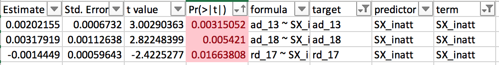

So, let's then unveal their identities:

## JHU labels

```r
b = read.csv('/Volumes/Shaw/MasterQC/master_qc_20190314.csv')
a = read.csv('~/data/heritability_change/ready_1020.csv')
m = merge(a, b, by.y='Mask.ID', by.x='Mask.ID...Scan', all.x=F)

# restrict based on QC
pct = m$missingVolumes / m$numVolumes
idx = m$norm.trans < 5 & m$norm.rot < .1 & pct < .15
m = m[idx,]
# down to 902 scans
keep_me = c()
for (s in unique(m$Medical.Record...MRN...Subjects)) {
    subj_scans = m[m$Medical.Record...MRN...Subjects==s, ]
    dates = as.Date(as.character(subj_scans$"record.date.collected...Scan"),
                                 format="%m/%d/%Y")
    if (length(dates) >= 2) {
        sdates = sort(dates)  # not sure why index.return is not working...
        # make sure there is at least 6 months between scans
        next_scan = 2
        while (((sdates[next_scan] - sdates[1]) < 180) && (next_scan < length(sdates))) {
            next_scan = next_scan + 1
        }
        first_scan_age = subj_scans[dates==sdates[1], 'age_at_scan...Scan...Subjects']
        if (((sdates[next_scan] - sdates[1]) >= 180) && (first_scan_age < 26)) {
            idx1 = which(dates == sdates[1])
            keep_me = c(keep_me, which(m$Mask.ID...Scan == subj_scans[idx1, 'Mask.ID...Scan']))
            idx2 = which(dates == sdates[next_scan])
            keep_me = c(keep_me, which(m$Mask.ID...Scan == subj_scans[idx2, 'Mask.ID...Scan']))
        }
    }
}
m2 = m[keep_me, ]
# down to 566 scans, as we're not using tract data at this point
```

```r
clin = read.csv('~/data/heritability_change/clinical_03132019.csv')
df = mergeOnClosestDate(m2, clin, unique(m2$Medical.Record...MRN...Subjects),
                         x.date='record.date.collected...Scan',
                         x.id='Medical.Record...MRN...Subjects')
b = read.csv('~/data/heritability_change/jhu_labels_1020.csv')
tract_names = colnames(b)[2:ncol(b)]
df2 = merge(df, b, by.x='Mask.ID...Scan', by.y='id')

library(MASS)
mres = df2
mres$SX_HI = as.numeric(as.character(mres$SX_hi))
mres$SX_inatt = as.numeric(as.character(mres$SX_inatt))
for (t in tract_names) {
    print(t)
    fm_str = sprintf('%s ~', t)
    fm_str = paste(fm_str,
                   'norm.rot + I(norm.rot^2) + norm.trans + I(norm.trans^2) +',
                   'missingVolumes')
    res.lm <- lm(as.formula(fm_str), data = mres, na.action=na.exclude)
    step <- stepAIC(res.lm, direction = "both", trace = F)
    mres[, t] = residuals(step)
}
res = c()
for (s in unique(mres$Medical.Record...MRN...Subjects)) {
    idx = which(mres$Medical.Record...MRN...Subjects == s)
    row = c(s, unique(mres[idx, 'Sex...Subjects']))
    for (t in tract_names) {
        if (sum(is.na(mres[idx, t])) > 0) {
            # if any of the tract values is NA, make the slope NA
            row = c(row, NA)
        } else {
            fm_str = sprintf('%s ~ age_at_scan...Scan...Subjects', t)
           fit = lm(as.formula(fm_str), data=mres[idx, ], na.action=na.exclude)
           row = c(row, coefficients(fit)[2])
        }
    }
    for (t in c('SX_inatt', 'SX_HI')) {
        fm_str = sprintf('%s ~ age_at_scan...Scan...Subjects', t)
        fit = lm(as.formula(fm_str), data=mres[idx, ], na.action=na.exclude)
        row = c(row, coefficients(fit)[2])
    }
    # grabbing inatt and HI at baseline
    base_DOA = which.min(mres[idx, 'age_at_scan...Scan...Subjects'])
    row = c(row, mres[idx[base_DOA], 'SX_inatt'])
    row = c(row, mres[idx[base_DOA], 'SX_HI'])
    # DX1 is DSMV definition, DX2 will make SX >=4 as ADHD
    if (mres[idx[base_DOA], 'age_at_scan...Scan...Subjects'] < 16) {
        if ((row[length(row)] >= 6) || (row[length(row)-1] >= 6)) {
            DX = 'ADHD'
        } else {
            DX = 'NV'
        }
    } else {
        if ((row[length(row)] >= 5) || (row[length(row)-1] >= 5)) {
            DX = 'ADHD'
        } else {
            DX = 'NV'
        }
    }
    if ((row[length(row)] >= 4) || (row[length(row)-1] >= 4)) {
        DX2 = 'ADHD'
    } else {
        DX2 = 'NV'
    }
    row = c(row, DX)
    row = c(row, DX2)
    res = rbind(res, row)
}
colnames(res) = c('ID', 'sex', tract_names, c('SX_inatt', 'SX_HI',
                                              'inatt_baseline',
                                              'HI_baseline', 'DX', 'DX2'))

# and remove outliers
for (t in tract_names) {
    mydata = as.numeric(res[, t])
    # identifying outliers
    ul = mean(mydata) + 3 * sd(mydata)
    ll = mean(mydata) - 3 * sd(mydata)
    bad_subjs = c(which(mydata < ll), which(mydata > ul))

    # remove within-tract outliers
    res[bad_subjs, t] = NA
}
write.csv(res, file='~/data/heritability_change/dti_JHUlabels_residNoSex_OLS_naSlopes283.csv',
          row.names=F, na='', quote=F)
```


There are some heritable tracts:


And similarly, we run the association analysis:

```r
data = read.csv('~/data/heritability_change/dti_JHUtracts_residNoSex_OLS_naSlopes283.csv')
data$sex = as.factor(data$sex)
b = read.csv('~/data/heritability_change/jhu_tracts_1020.csv')
tract_names = colnames(b)[2:ncol(b)]
out_fname = '~/data/heritability_change/assoc_JHUtracts_naSlopes283.csv'
predictors = c('SX_inatt', 'SX_HI', 'inatt_baseline', 'HI_baseline', 'DX', 'DX2')
targets = tract_names
hold=NULL
for (i in targets) {
    for (j in predictors) {
        fm_str = sprintf('%s ~ %s + sex', i, j)
        model1<-lm(as.formula(fm_str), data, na.action=na.omit)
        temp<-summary(model1)$coefficients
        a<-as.data.frame(temp)
        a$formula<-fm_str
        a$target = i
        a$predictor = j
        a$term = rownames(temp)
        hold=rbind(hold,a)
    }
}
write.csv(hold, out_fname, row.names=F)

data2 = data[data$DX=='ADHD', ]
out_fname = '~/data/heritability_change/assoc_JHUtracts_naSlopes283dx1.csv'
predictors = c('SX_inatt', 'SX_HI', 'inatt_baseline', 'HI_baseline')
targets = tract_names
hold=NULL
for (i in targets) {
    for (j in predictors) {
        fm_str = sprintf('%s ~ %s + sex', i, j)
        model1<-lm(as.formula(fm_str), data2, na.action=na.omit)
        temp<-summary(model1)$coefficients
        a<-as.data.frame(temp)
        a$formula<-fm_str
        a$target = i
        a$predictor = j
        a$term = rownames(temp)
        hold=rbind(hold,a)
    }
}
write.csv(hold, out_fname, row.names=F)

data2 = data[data$DX2=='ADHD', ]
out_fname = '~/data/heritability_change/assoc_JHUtracts_naSlopes283_dx2.csv'
predictors = c('SX_inatt', 'SX_HI', 'inatt_baseline', 'HI_baseline')
targets = tract_names
hold=NULL
for (i in targets) {
    for (j in predictors) {
        fm_str = sprintf('%s ~ %s + sex', i, j)
        model1<-lm(as.formula(fm_str), data2, na.action=na.omit)
        temp<-summary(model1)$coefficients
        a<-as.data.frame(temp)
        a$formula<-fm_str
        a$target = i
        a$predictor = j
        a$term = rownames(temp)
        hold=rbind(hold,a)
    }
}
write.csv(hold, out_fname, row.names=F)
```

# TODO