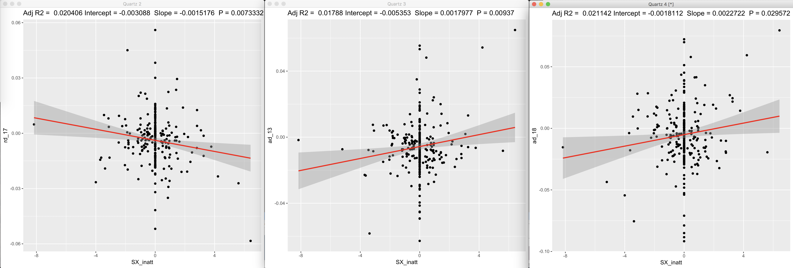
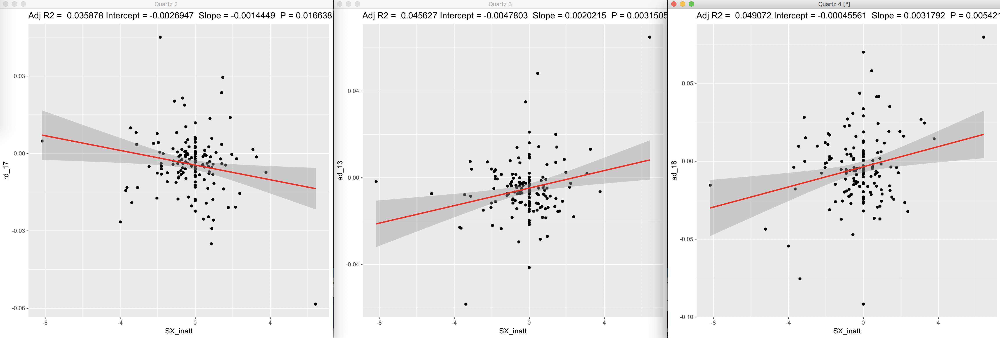
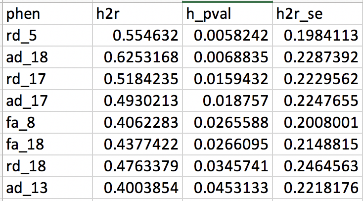
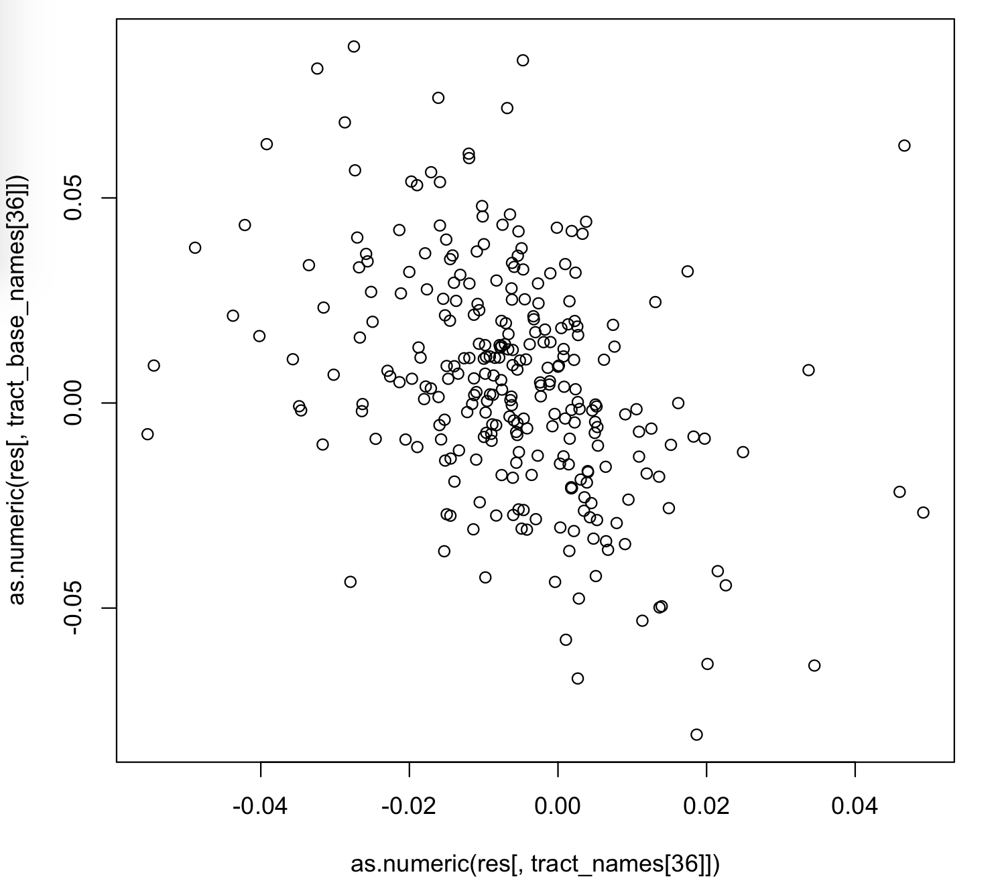
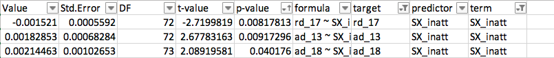
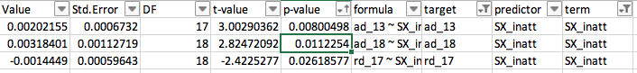
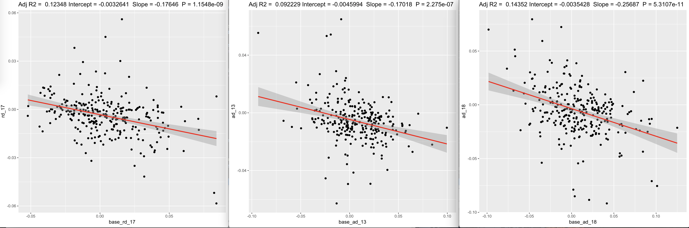
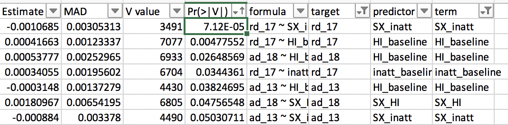
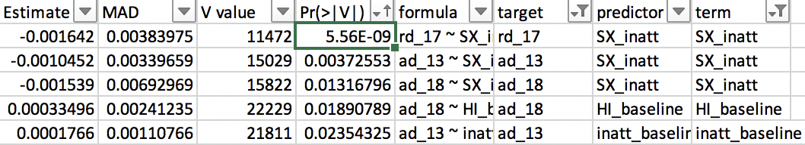
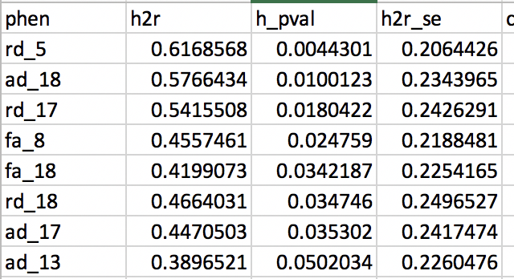

# 2019-03-18 10:59:57

Let's try to add some more information in the analysis we showed in 007.

* Are there any outliers in the results?
* What's the direction of the interactions?

Those two will likely be solved with a few simple plots.

Then, what's the degree of bivariate heritability between the heritable
developing tract properties and their properties at baseline.  Philip thinks
that there should be some  shared heritability- but not complete (which would
strengthen the argument for looking at both as we've done).

The current version of the abstract is written based on the 20 tract result, so
let's stick with that.

## Regression plots

```r
source('~/research_code/baseline_prediction/aux_functions.R')
ggplotRegression(lm('rd_17 ~ SX_inatt + sex', data, na.action=na.omit))
...
```



Those were the results using the entire dataset, but it looks funky with all the
NVs there, as the SX slope is zero. If we use the less conservative DX2 set, we
get:



The results are actually a bit better within this set. In any case, the more
worse the subject gets (positive SX_inatt values), there is a decrease in RD,
but increase in AD.

# Bivariate heritability

The first step is to also output the baseline values for each tract:

```r
b = read.csv('/Volumes/Shaw/MasterQC/master_qc_20190314.csv')
a = read.csv('~/data/heritability_change/ready_1020.csv')
m = merge(a, b, by.y='Mask.ID', by.x='Mask.ID...Scan', all.x=F)

# restrict based on QC
pct = m$missingVolumes / m$numVolumes
idx = m$norm.trans < 5 & m$norm.rot < .1 & pct < .15
m = m[idx,]
# down to 902 scans
keep_me = c()
for (s in unique(m$Medical.Record...MRN...Subjects)) {
    subj_scans = m[m$Medical.Record...MRN...Subjects==s, ]
    dates = as.Date(as.character(subj_scans$"record.date.collected...Scan"),
                                 format="%m/%d/%Y")
    if (length(dates) >= 2) {
        sdates = sort(dates)  # not sure why index.return is not working...
        # make sure there is at least 6 months between scans
        next_scan = 2
        while (((sdates[next_scan] - sdates[1]) < 180) && (next_scan < length(sdates))) {
            next_scan = next_scan + 1
        }
        first_scan_age = subj_scans[dates==sdates[1], 'age_at_scan...Scan...Subjects']
        if (((sdates[next_scan] - sdates[1]) >= 180) && (first_scan_age < 26)) {
            idx1 = which(dates == sdates[1])
            keep_me = c(keep_me, which(m$Mask.ID...Scan == subj_scans[idx1, 'Mask.ID...Scan']))
            idx2 = which(dates == sdates[next_scan])
            keep_me = c(keep_me, which(m$Mask.ID...Scan == subj_scans[idx2, 'Mask.ID...Scan']))
        }
    }
}
m2 = m[keep_me, ]
# down to 566 scans, as we're not using tract data at this point

clin = read.csv('~/data/heritability_change/clinical_03132019.csv')
df = mergeOnClosestDate(m2, clin, unique(m2$Medical.Record...MRN...Subjects),
                         x.date='record.date.collected...Scan',
                         x.id='Medical.Record...MRN...Subjects')
b = read.csv('~/data/heritability_change/jhu_tracts_1020.csv')
tract_names = colnames(b)[2:ncol(b)]
df2 = merge(df, b, by.x='Mask.ID...Scan', by.y='id')

library(MASS)
mres = df2
mres$SX_HI = as.numeric(as.character(mres$SX_hi))
mres$SX_inatt = as.numeric(as.character(mres$SX_inatt))
for (t in tract_names) {
    print(t)
    fm_str = sprintf('%s ~', t)
    fm_str = paste(fm_str,
                   'norm.rot + I(norm.rot^2) + norm.trans + I(norm.trans^2) +',
                   'missingVolumes')
    res.lm <- lm(as.formula(fm_str), data = mres, na.action=na.exclude)
    step <- stepAIC(res.lm, direction = "both", trace = F)
    mres[, t] = residuals(step)
}
res = c()
for (s in unique(mres$Medical.Record...MRN...Subjects)) {
    idx = which(mres$Medical.Record...MRN...Subjects == s)
    row = c(s, unique(mres[idx, 'Sex...Subjects']))
    for (t in tract_names) {
        if (sum(is.na(mres[idx, t])) > 0) {
            # if any of the tract values is NA, make the slope NA
            row = c(row, NA)
        } else {
            fm_str = sprintf('%s ~ age_at_scan...Scan...Subjects', t)
           fit = lm(as.formula(fm_str), data=mres[idx, ], na.action=na.exclude)
           row = c(row, coefficients(fit)[2])
        }
    }
    for (t in c('SX_inatt', 'SX_HI')) {
        fm_str = sprintf('%s ~ age_at_scan...Scan...Subjects', t)
        fit = lm(as.formula(fm_str), data=mres[idx, ], na.action=na.exclude)
        row = c(row, coefficients(fit)[2])
    }
    # grabbing inatt and HI at baseline
    base_DOA = which.min(mres[idx, 'age_at_scan...Scan...Subjects'])
    row = c(row, mres[idx[base_DOA], 'SX_inatt'])
    row = c(row, mres[idx[base_DOA], 'SX_HI'])
    # DX1 is DSMV definition, DX2 will make SX >=4 as ADHD
    if (mres[idx[base_DOA], 'age_at_scan...Scan...Subjects'] < 16) {
        if ((row[length(row)] >= 6) || (row[length(row)-1] >= 6)) {
            DX = 'ADHD'
        } else {
            DX = 'NV'
        }
    } else {
        if ((row[length(row)] >= 5) || (row[length(row)-1] >= 5)) {
            DX = 'ADHD'
        } else {
            DX = 'NV'
        }
    }
    if ((row[length(row)] >= 4) || (row[length(row)-1] >= 4)) {
        DX2 = 'ADHD'
    } else {
        DX2 = 'NV'
    }
    row = c(row, DX)
    row = c(row, DX2)
    for (t in tract_names) {
        row = c(row, mres[idx[base_DOA], t])
    }
    if (is.na(mres[idx[base_DOA], 'Extended.ID...FamilyIDs'])) {
        row = c(row, mres[idx[base_DOA], 'Nuclear.ID...FamilyIDs'])
    } else {
        row = c(row, mres[idx[base_DOA], 'Extended.ID...FamilyIDs'])
    }
    res = rbind(res, row)
}
tract_base_names = as.character(sapply(tract_names,
                                       function(x) sprintf('base_%s', x)))
colnames(res) = c('ID', 'sex', tract_names, c('SX_inatt', 'SX_HI',
                                              'inatt_baseline',
                                              'HI_baseline', 'DX', 'DX2'),
                  tract_base_names, 'famID')

# and remove outliers
for (t in c(tract_names, tract_base_names)) {
    mydata = as.numeric(res[, t])
    # identifying outliers
    ul = mean(mydata) + 3 * sd(mydata)
    ll = mean(mydata) - 3 * sd(mydata)
    bad_subjs = c(which(mydata < ll), which(mydata > ul))

    # remove within-tract outliers
    res[bad_subjs, t] = NA
}
write.csv(res, file='~/data/heritability_change/dti_JHUtracts_residNoSex_OLS_naSlopesAndBaseline283.csv',
          row.names=F, na='', quote=F)
```

I wasn't sure whether Philip wanted to check the heritability of baseline values
on their own, or the genetic correlation between baseline and slope. Let's do
both:



So, it looks like those tracts are highly significant at baseline as well. Let's
look at their genetic correlation... I didn't see much in terms of genetic
correlation, at least not between tract slope and baseline values. How about
just a plain phenotypical correlation?

```r
> ps = c()
> for (p in 1:length(tract_names)) { pres = cor.test(as.numeric(res[, tract_names[p]]), as.numeric(res[, tract_base_names[p]])); ps = c(ps, pres$p.value) }
> ps
 [1] 3.015535e-03 2.792883e-04 6.102710e-07 6.652182e-07 2.241424e-07
 [6] 2.176739e-04 3.981211e-12 1.113481e-10 7.667659e-20 1.310551e-13
[11] 2.039673e-05 8.198492e-09 8.901634e-05 3.293581e-06 1.220409e-06
[16] 2.224713e-10 2.654115e-09 6.805027e-11 1.092553e-07 6.768836e-08
[21] 9.393742e-08 2.059400e-06 8.067164e-13 6.150077e-07 1.021311e-12
[26] 2.085967e-03 8.624285e-07 1.024870e-10 4.198478e-10 5.478128e-08
[31] 7.378899e-10 7.456021e-05 2.123424e-09 6.047288e-13 1.000362e-08
[36] 1.065640e-11 1.327286e-09 2.274956e-07 1.699778e-10 4.589334e-14
[41] 8.982056e-11 6.482895e-09 1.327241e-07 2.250955e-12 5.588042e-13
[46] 6.226872e-11 1.119559e-09 8.490743e-12 1.237553e-12 7.467672e-09
[51] 1.154840e-09 1.239568e-11 5.310689e-11 2.047140e-18 1.988867e-03
[56] 2.230829e-15 1.839507e-04 1.294880e-05 1.053859e-04 9.323663e-10
```

Hum... not sure what's going on here. Basically, every tract slope is highly
significant with its baseline value? Why would that make sense?


```r
> rs = c()
> for (p in 1:length(tract_names)) { pres = cor.test(as.numeric(res[, tract_names[p]]), as.numeric(res[, tract_base_names[p]])); rs = c(rs, pres$estimate) }
> rs
       cor        cor        cor        cor        cor        cor        cor 
-0.1802057 -0.2178782 -0.2959099 -0.2970620 -0.3071928 -0.2216077 -0.4044235 
       cor        cor        cor        cor        cor        cor        cor 
-0.3795492 -0.5127610 -0.4305123 -0.2556745 -0.3388103 -0.2349227 -0.2772615 
       cor        cor        cor        cor        cor        cor        cor 
-0.2882117 -0.3718623 -0.3503389 -0.3790315 -0.3135581 -0.3184041 -0.3134639 
       cor        cor        cor        cor        cor        cor        cor 
-0.2832476 -0.4161998 -0.2942768 -0.4144886 -0.1855034 -0.2915835 -0.3795768 
       cor        cor        cor        cor        cor        cor        cor 
-0.3646243 -0.3210767 -0.3622768 -0.2386875 -0.3505299 -0.4189831 -0.3387080 
       cor        cor        cor        cor        cor        cor        cor 
-0.3935899 -0.3565188 -0.3092189 -0.3728309 -0.4362588 -0.3800048 -0.3398209 
       cor        cor        cor        cor        cor        cor        cor 
-0.3143144 -0.4100723 -0.4174426 -0.3836394 -0.3574007 -0.3946666 -0.4117013 
       cor        cor        cor        cor        cor        cor        cor 
-0.3414505 -0.3559073 -0.3950824 -0.3829580 -0.4943522 -0.1856699 -0.4530998 
       cor        cor        cor        cor 
-0.2236906 -0.2610262 -0.2321226 -0.3596179 
```

And it's always negative too... oh, I see...



Given that the X axis is slope, it basically means that bigger baseline values
go down (negative slope) but smaller baseline values go up (positive slope). But
that's interesting... basically, some tract properties are going up for a few
subejcts, and down for others. I'd have expected something more like a global
process, like cortical thinning, for everyone... Also, note that the baseline
values CAN be negative, as they're residuals after regressing out QC parameters.

Gonna have to talk to Philip about it... not sure if it makes sense.

## LME

I was curious to whether I'd still have any results if I used lme instead of lm
for the regressions...

```r
library(nlme)
data = read.csv('~/data/heritability_change/dti_JHUtracts_residNoSex_OLS_naSlopesAndBaseline283.csv')
data$sex = as.factor(data$sex)
b = read.csv('~/data/heritability_change/jhu_tracts_1020.csv')
tract_names = colnames(b)[2:ncol(b)]
out_fname = '~/data/heritability_change/assoc_LME_JHUtracts_naSlopes283.csv'
predictors = c('SX_inatt', 'SX_HI', 'inatt_baseline', 'HI_baseline', 'DX', 'DX2')
targets = tract_names
hold=NULL
for (i in targets) {
    for (j in predictors) {
        fm_str = sprintf('%s ~ %s + sex', i, j)
        model1<-try(lme(as.formula(fm_str), data, ~1|famID, na.action=na.omit))
        if (length(model1) > 1) {
            temp<-summary(model1)$tTable
            a<-as.data.frame(temp)
            a$formula<-fm_str
            a$target = i
            a$predictor = j
            a$term = rownames(temp)
            hold=rbind(hold,a)
        } else {
            hold=rbind(hold, NA)
        }
    }
}
write.csv(hold, out_fname, row.names=F)

data2 = data[data$DX=='ADHD', ]
out_fname = '~/data/heritability_change/assoc_LME_JHUtracts_naSlopes283_dx1.csv'
predictors = c('SX_inatt', 'SX_HI', 'inatt_baseline', 'HI_baseline')
targets = tract_names
hold=NULL
for (i in targets) {
    for (j in predictors) {
        fm_str = sprintf('%s ~ %s + sex', i, j)
        model1<-try(lme(as.formula(fm_str), data2, ~1|famID, na.action=na.omit))
        if (length(model1) > 1) {
            temp<-summary(model1)$tTable
            a<-as.data.frame(temp)
            a$formula<-fm_str
            a$target = i
            a$predictor = j
            a$term = rownames(temp)
            hold=rbind(hold,a)
        } else {
            hold=rbind(hold, NA)
        }
    }
}
write.csv(hold, out_fname, row.names=F)

data2 = data[data$DX2=='ADHD', ]
out_fname = '~/data/heritability_change/assoc_LME_JHUtracts_naSlopes283_dx2.csv'
predictors = c('SX_inatt', 'SX_HI', 'inatt_baseline', 'HI_baseline')
targets = tract_names
hold=NULL
for (i in targets) {
    for (j in predictors) {
        fm_str = sprintf('%s ~ %s + sex', i, j)
        model1<-try(lme(as.formula(fm_str), data2, ~1|famID, na.action=na.omit))
        if (length(model1) > 1) {
            temp<-summary(model1)$tTable
            a<-as.data.frame(temp)
            a$formula<-fm_str
            a$target = i
            a$predictor = j
            a$term = rownames(temp)
            hold=rbind(hold,a)
        } else {
            hold=rbind(hold, NA)
        }
    }
}
write.csv(hold, out_fname, row.names=F)
```

Yeah, things seem to hold up for the entire cohort:



and for DX2:



## Numbers for abstract

```r
mres = df2
age_base = c()
age_fu = c()
for (s in unique(mres$Medical.Record...MRN...Subjects)) {
    idx = which(mres$Medical.Record...MRN...Subjects == s)
    base_DOA = which.min(mres[idx, 'age_at_scan...Scan...Subjects'])
    fu_DOA = which.max(mres[idx, 'age_at_scan...Scan...Subjects'])
    age_base = c(age_base, mres[idx[base_DOA],
                                'age_at_scan...Scan...Subjects'])
    age_fu = c(age_fu, mres[idx[fu_DOA],
                                'age_at_scan...Scan...Subjects'])
}
print(sprintf('base: %.2f +- %.2f', mean(age_base), sd(age_base)))
print(sprintf('FU: %.2f +- %.2f', mean(age_fu), sd(age_fu)))
```

## No residualizing

Let's see what the results look like without residualizing by QC:

```r
b = read.csv('/Volumes/Shaw/MasterQC/master_qc_20190314.csv')
a = read.csv('~/data/heritability_change/ready_1020.csv')
m = merge(a, b, by.y='Mask.ID', by.x='Mask.ID...Scan', all.x=F)

# restrict based on QC
pct = m$missingVolumes / m$numVolumes
idx = m$norm.trans < 5 & m$norm.rot < .1 & pct < .15
m = m[idx,]
# down to 902 scans
keep_me = c()
for (s in unique(m$Medical.Record...MRN...Subjects)) {
    subj_scans = m[m$Medical.Record...MRN...Subjects==s, ]
    dates = as.Date(as.character(subj_scans$"record.date.collected...Scan"),
                                 format="%m/%d/%Y")
    if (length(dates) >= 2) {
        sdates = sort(dates)  # not sure why index.return is not working...
        # make sure there is at least 6 months between scans
        next_scan = 2
        while (((sdates[next_scan] - sdates[1]) < 180) && (next_scan < length(sdates))) {
            next_scan = next_scan + 1
        }
        first_scan_age = subj_scans[dates==sdates[1], 'age_at_scan...Scan...Subjects']
        if (((sdates[next_scan] - sdates[1]) >= 180) && (first_scan_age < 26)) {
            idx1 = which(dates == sdates[1])
            keep_me = c(keep_me, which(m$Mask.ID...Scan == subj_scans[idx1, 'Mask.ID...Scan']))
            idx2 = which(dates == sdates[next_scan])
            keep_me = c(keep_me, which(m$Mask.ID...Scan == subj_scans[idx2, 'Mask.ID...Scan']))
        }
    }
}
m2 = m[keep_me, ]
# down to 566 scans, as we're not using tract data at this point

clin = read.csv('~/data/heritability_change/clinical_03132019.csv')
df = mergeOnClosestDate(m2, clin, unique(m2$Medical.Record...MRN...Subjects),
                         x.date='record.date.collected...Scan',
                         x.id='Medical.Record...MRN...Subjects')
b = read.csv('~/data/heritability_change/jhu_tracts_1020.csv')
tract_names = colnames(b)[2:ncol(b)]
df2 = merge(df, b, by.x='Mask.ID...Scan', by.y='id')

library(MASS)
mres = df2
mres$SX_HI = as.numeric(as.character(mres$SX_hi))
mres$SX_inatt = as.numeric(as.character(mres$SX_inatt))
res = c()
for (s in unique(mres$Medical.Record...MRN...Subjects)) {
    idx = which(mres$Medical.Record...MRN...Subjects == s)
    row = c(s, unique(mres[idx, 'Sex...Subjects']))
    for (t in tract_names) {
        if (sum(is.na(mres[idx, t])) > 0) {
            # if any of the tract values is NA, make the slope NA
            row = c(row, NA)
        } else {
            fm_str = sprintf('%s ~ age_at_scan...Scan...Subjects', t)
           fit = lm(as.formula(fm_str), data=mres[idx, ], na.action=na.exclude)
           row = c(row, coefficients(fit)[2])
        }
    }
    for (t in c('SX_inatt', 'SX_HI')) {
        fm_str = sprintf('%s ~ age_at_scan...Scan...Subjects', t)
        fit = lm(as.formula(fm_str), data=mres[idx, ], na.action=na.exclude)
        row = c(row, coefficients(fit)[2])
    }
    # grabbing inatt and HI at baseline
    base_DOA = which.min(mres[idx, 'age_at_scan...Scan...Subjects'])
    row = c(row, mres[idx[base_DOA], 'SX_inatt'])
    row = c(row, mres[idx[base_DOA], 'SX_HI'])
    # DX1 is DSMV definition, DX2 will make SX >=4 as ADHD
    if (mres[idx[base_DOA], 'age_at_scan...Scan...Subjects'] < 16) {
        if ((row[length(row)] >= 6) || (row[length(row)-1] >= 6)) {
            DX = 'ADHD'
        } else {
            DX = 'NV'
        }
    } else {
        if ((row[length(row)] >= 5) || (row[length(row)-1] >= 5)) {
            DX = 'ADHD'
        } else {
            DX = 'NV'
        }
    }
    if ((row[length(row)] >= 4) || (row[length(row)-1] >= 4)) {
        DX2 = 'ADHD'
    } else {
        DX2 = 'NV'
    }
    row = c(row, DX)
    row = c(row, DX2)
    for (t in tract_names) {
        row = c(row, mres[idx[base_DOA], t])
    }
    if (is.na(mres[idx[base_DOA], 'Extended.ID...FamilyIDs'])) {
        row = c(row, mres[idx[base_DOA], 'Nuclear.ID...FamilyIDs'])
    } else {
        row = c(row, mres[idx[base_DOA], 'Extended.ID...FamilyIDs'])
    }
    res = rbind(res, row)
}
tract_base_names = as.character(sapply(tract_names,
                                       function(x) sprintf('base_%s', x)))
colnames(res) = c('ID', 'sex', tract_names, c('SX_inatt', 'SX_HI',
                                              'inatt_baseline',
                                              'HI_baseline', 'DX', 'DX2'),
                  tract_base_names, 'famID')

# and remove outliers
for (t in c(tract_names, tract_base_names)) {
    mydata = as.numeric(res[, t])
    # identifying outliers
    ul = mean(mydata) + 3 * sd(mydata)
    ll = mean(mydata) - 3 * sd(mydata)
    bad_subjs = c(which(mydata < ll), which(mydata > ul))

    # remove within-tract outliers
    res[bad_subjs, t] = NA
}
write.csv(res, file='~/data/heritability_change/dti_JHUtracts_OLS_naSlopesAndBaseline283.csv',
          row.names=F, na='', quote=F)
```

And let's check LME because the code was right above

```r
library(nlme)
data = read.csv('~/data/heritability_change/dti_JHUtracts_OLS_naSlopesAndBaseline283.csv')
data$sex = as.factor(data$sex)
b = read.csv('~/data/heritability_change/jhu_tracts_1020.csv')
tract_names = colnames(b)[2:ncol(b)]
out_fname = '~/data/heritability_change/assoc_LMEraw_JHUtracts_naSlopes283.csv'
predictors = c('SX_inatt', 'SX_HI', 'inatt_baseline', 'HI_baseline', 'DX', 'DX2')
targets = tract_names
hold=NULL
for (i in targets) {
    for (j in predictors) {
        fm_str = sprintf('%s ~ %s + sex', i, j)
        model1<-try(lme(as.formula(fm_str), data, ~1|famID, na.action=na.omit))
        if (length(model1) > 1) {
            temp<-summary(model1)$tTable
            a<-as.data.frame(temp)
            a$formula<-fm_str
            a$target = i
            a$predictor = j
            a$term = rownames(temp)
            hold=rbind(hold,a)
        } else {
            hold=rbind(hold, NA)
        }
    }
}
write.csv(hold, out_fname, row.names=F)

data2 = data[data$DX=='ADHD', ]
out_fname = '~/data/heritability_change/assoc_LMEraw_JHUtracts_naSlopes283_dx1.csv'
predictors = c('SX_inatt', 'SX_HI', 'inatt_baseline', 'HI_baseline')
targets = tract_names
hold=NULL
for (i in targets) {
    for (j in predictors) {
        fm_str = sprintf('%s ~ %s + sex', i, j)
        model1<-try(lme(as.formula(fm_str), data2, ~1|famID, na.action=na.omit))
        if (length(model1) > 1) {
            temp<-summary(model1)$tTable
            a<-as.data.frame(temp)
            a$formula<-fm_str
            a$target = i
            a$predictor = j
            a$term = rownames(temp)
            hold=rbind(hold,a)
        } else {
            hold=rbind(hold, NA)
        }
    }
}
write.csv(hold, out_fname, row.names=F)

data2 = data[data$DX2=='ADHD', ]
out_fname = '~/data/heritability_change/assoc_LMEraw_JHUtracts_naSlopes283_dx2.csv'
predictors = c('SX_inatt', 'SX_HI', 'inatt_baseline', 'HI_baseline')
targets = tract_names
hold=NULL
for (i in targets) {
    for (j in predictors) {
        fm_str = sprintf('%s ~ %s + sex', i, j)
        model1<-try(lme(as.formula(fm_str), data2, ~1|famID, na.action=na.omit))
        if (length(model1) > 1) {
            temp<-summary(model1)$tTable
            a<-as.data.frame(temp)
            a$formula<-fm_str
            a$target = i
            a$predictor = j
            a$term = rownames(temp)
            hold=rbind(hold,a)
        } else {
            hold=rbind(hold, NA)
        }
    }
}
write.csv(hold, out_fname, row.names=F)
```

That killed the associations, but the correlation between slopes and baseline
values is still there. So, it's not the residualizing procedure that's causing
the correlations and it could be argued that we need to residualize to be able
to see the associations (i.e. clean the data). Not sure how the residualization
would be biasing the data towards the associations but the correlation between
slopes and baseline values is still puzzling.

## non-parametric regressions

Let's see if the associations survive when using no-parametric regressions, just
because osme of the scatterplots were a tiny bit concerning:

```r
library(mblm)
data = read.csv('~/data/heritability_change/dti_JHUtracts_residNoSex_OLS_naSlopesAndBaseline283.csv')
data$sex = as.factor(data$sex)
b = read.csv('~/data/heritability_change/jhu_tracts_1020.csv')
tract_names = colnames(b)[2:ncol(b)]
out_fname = '~/data/heritability_change/assoc_NP_JHUtracts_naSlopes283.csv'
predictors = c('SX_inatt', 'SX_HI', 'inatt_baseline', 'HI_baseline')
targets = tract_names
hold=NULL
for (i in targets) {
    for (j in predictors) {
        idx = !is.na(data[, i])
        fm_str = sprintf('%s ~ %s', i, j)
        model1 = mblm(as.formula(fm_str), data=data[idx,])
        temp<-summary(model1)$coefficients
        a<-as.data.frame(temp)
        a$formula<-fm_str
        a$target = i
        a$predictor = j
        a$term = rownames(temp)
        hold=rbind(hold,a)
    }
}
write.csv(hold, out_fname, row.names=F)

data2 = data[data$DX=='ADHD', ]
out_fname = '~/data/heritability_change/assoc_NP_JHUtracts_naSlopes283_dx1.csv'
predictors = c('SX_inatt', 'SX_HI', 'inatt_baseline', 'HI_baseline')
targets = tract_names
hold=NULL
for (i in targets) {
    for (j in predictors) {
        idx = !is.na(data2[, i])
        fm_str = sprintf('%s ~ %s', i, j)
        model1 = mblm(as.formula(fm_str), data=data2[idx,])
        temp<-summary(model1)$coefficients
        a<-as.data.frame(temp)
        a$formula<-fm_str
        a$target = i
        a$predictor = j
        a$term = rownames(temp)
        hold=rbind(hold,a)
    }
}
write.csv(hold, out_fname, row.names=F)

data2 = data[data$DX2=='ADHD', ]
out_fname = '~/data/heritability_change/assoc_NP_JHUtracts_naSlopes283_dx2.csv'
predictors = c('SX_inatt', 'SX_HI', 'inatt_baseline', 'HI_baseline')
targets = tract_names
hold=NULL
for (i in targets) {
    for (j in predictors) {
        idx = !is.na(data2[, i])
        fm_str = sprintf('%s ~ %s', i, j)
        model1 = mblm(as.formula(fm_str), data=data2[idx,])
        temp<-summary(model1)$coefficients
        a<-as.data.frame(temp)
        a$formula<-fm_str
        a$target = i
        a$predictor = j
        a$term = rownames(temp)
        hold=rbind(hold,a)
    }
}
write.csv(hold, out_fname, row.names=F)
```

CHECK OUT THE RESULTS FROM ABOVE!

Now I need to residualize sex out first, because this function only takes one
independent variable.

# 2019-03-19 08:24:59

Let's check if there is any correlation between tract rate and scan interval:

```r
ps = c()
for (p in 1:length(tract_names)) {
    pres = cor.test(as.numeric(res[, tract_names[p]]),
                    age_fu - age_base)
    ps = c(ps, pres$p.value)
}
```

No correlation... or, is the inter-scan interval associated with the age of
first scan?

```r
ps = c()
for (p in 1:length(tract_names)) {
    pres = cor.test(age_base, age_fu - age_base)
    ps = c(ps, pres$p.value)
}
```

Also no.

What do the plots of raw baseline against rate look like?



They all look pretty much the same: the bigger at baseline, the higher the
reduction (more negative slopes).

Finally, let's just complete the non-parametric analysis from yesterday.



The only result that didn't survive the non-parametric test was ad_18 in the DX2
set. 

But it's all good when using the entire dataset:



....

## Cleaning up heritability results

For the JHU tracts heritability, I want to clean up the 2 unrelated subjects.
Looking at the family trees, it was just one subject in 9003 that turned out not
to be related to the other ones in the extended family, given the remaining scans:

```r
b = read.csv('/Volumes/Shaw/MasterQC/master_qc_20190314.csv')
a = read.csv('~/data/heritability_change/ready_1020.csv')
m = merge(a, b, by.y='Mask.ID', by.x='Mask.ID...Scan', all.x=F)

# restrict based on QC
pct = m$missingVolumes / m$numVolumes
idx = m$norm.trans < 5 & m$norm.rot < .1 & pct < .15
m = m[idx,]
# down to 902 scans
keep_me = c()
for (s in unique(m$Medical.Record...MRN...Subjects)) {
    subj_scans = m[m$Medical.Record...MRN...Subjects==s, ]
    dates = as.Date(as.character(subj_scans$"record.date.collected...Scan"),
                                 format="%m/%d/%Y")
    if (length(dates) >= 2) {
        sdates = sort(dates)  # not sure why index.return is not working...
        # make sure there is at least 6 months between scans
        next_scan = 2
        while (((sdates[next_scan] - sdates[1]) < 180) && (next_scan < length(sdates))) {
            next_scan = next_scan + 1
        }
        first_scan_age = subj_scans[dates==sdates[1], 'age_at_scan...Scan...Subjects']
        if (((sdates[next_scan] - sdates[1]) >= 180) && (first_scan_age < 26)) {
            idx1 = which(dates == sdates[1])
            keep_me = c(keep_me, which(m$Mask.ID...Scan == subj_scans[idx1, 'Mask.ID...Scan']))
            idx2 = which(dates == sdates[next_scan])
            keep_me = c(keep_me, which(m$Mask.ID...Scan == subj_scans[idx2, 'Mask.ID...Scan']))
        }
    }
}
m2 = m[keep_me, ]
# down to 566 scans, as we're not using tract data at this point

clin = read.csv('~/data/heritability_change/clinical_03132019.csv')
df = mergeOnClosestDate(m2, clin, unique(m2$Medical.Record...MRN...Subjects),
                         x.date='record.date.collected...Scan',
                         x.id='Medical.Record...MRN...Subjects')
b = read.csv('~/data/heritability_change/jhu_tracts_1020.csv')
tract_names = colnames(b)[2:ncol(b)]
df2 = merge(df, b, by.x='Mask.ID...Scan', by.y='id')

library(MASS)
mres = df2
mres$SX_HI = as.numeric(as.character(mres$SX_hi))
mres$SX_inatt = as.numeric(as.character(mres$SX_inatt))
for (t in tract_names) {
    print(t)
    fm_str = sprintf('%s ~', t)
    fm_str = paste(fm_str,
                   'norm.rot + I(norm.rot^2) + norm.trans + I(norm.trans^2) +',
                   'missingVolumes')
    res.lm <- lm(as.formula(fm_str), data = mres, na.action=na.exclude)
    step <- stepAIC(res.lm, direction = "both", trace = F)
    mres[, t] = residuals(step)
}
res = c()
for (s in unique(mres$Medical.Record...MRN...Subjects)) {
    idx = which(mres$Medical.Record...MRN...Subjects == s)
    row = c(s, unique(mres[idx, 'Sex...Subjects']))
    for (t in tract_names) {
        if (sum(is.na(mres[idx, t])) > 0) {
            # if any of the tract values is NA, make the slope NA
            row = c(row, NA)
        } else {
            fm_str = sprintf('%s ~ age_at_scan...Scan...Subjects', t)
           fit = lm(as.formula(fm_str), data=mres[idx, ], na.action=na.exclude)
           row = c(row, coefficients(fit)[2])
        }
    }
    for (t in c('SX_inatt', 'SX_HI')) {
        fm_str = sprintf('%s ~ age_at_scan...Scan...Subjects', t)
        fit = lm(as.formula(fm_str), data=mres[idx, ], na.action=na.exclude)
        row = c(row, coefficients(fit)[2])
    }
    # grabbing inatt and HI at baseline
    base_DOA = which.min(mres[idx, 'age_at_scan...Scan...Subjects'])
    row = c(row, mres[idx[base_DOA], 'SX_inatt'])
    row = c(row, mres[idx[base_DOA], 'SX_HI'])
    # DX1 is DSMV definition, DX2 will make SX >=4 as ADHD
    if (mres[idx[base_DOA], 'age_at_scan...Scan...Subjects'] < 16) {
        if ((row[length(row)] >= 6) || (row[length(row)-1] >= 6)) {
            DX = 'ADHD'
        } else {
            DX = 'NV'
        }
    } else {
        if ((row[length(row)] >= 5) || (row[length(row)-1] >= 5)) {
            DX = 'ADHD'
        } else {
            DX = 'NV'
        }
    }
    if ((row[length(row)] >= 4) || (row[length(row)-1] >= 4)) {
        DX2 = 'ADHD'
    } else {
        DX2 = 'NV'
    }
    row = c(row, DX)
    row = c(row, DX2)
    res = rbind(res, row)
}
colnames(res) = c('ID', 'sex', tract_names, c('SX_inatt', 'SX_HI',
                                              'inatt_baseline',
                                              'HI_baseline', 'DX', 'DX2'))

# and remove outliers
for (t in tract_names) {
    mydata = as.numeric(res[, t])
    # identifying outliers
    ul = mean(mydata) + 3 * sd(mydata)
    ll = mean(mydata) - 3 * sd(mydata)
    bad_subjs = c(which(mydata < ll), which(mydata > ul))

    # remove within-tract outliers
    res[bad_subjs, t] = NA
}

# and make sure every family has at least two people
good_nuclear = names(table(m2$Nuclear.ID...FamilyIDs))[table(m2$Nuclear.ID...FamilyIDs) >= 4]
good_extended = names(table(m2$Extended.ID...FamilyIDs))[table(m2$Extended.ID...FamilyIDs) >= 4]
keep_me = c()
for (f in good_nuclear) {
    keep_me = c(keep_me, m2[which(m2$Nuclear.ID...FamilyIDs == f),
                            'Medical.Record...MRN...Subjects'])
}
for (f in good_extended) {
    keep_me = c(keep_me, m2[which(m2$Extended.ID...FamilyIDs == f),
                            'Medical.Record...MRN...Subjects'])
    # print(f)
    # print(m2[which(m2$Extended.ID...FamilyIDs == f),
    #                         'Medical.Record...MRN...Subjects'])
}
keep_me = unique(keep_me)

fam_subjs = c()
for (s in keep_me) {
    fam_subjs = c(fam_subjs, which(res[, 'ID'] == s))
}
res2 = res[fam_subjs, ]

res2 = res2[res2[, 'ID'] != 7221745, ]
write.csv(res2, file='~/data/heritability_change/dti_JHUtracts_residNoSex_OLS_naSlopes133.csv',
          row.names=F, na='', quote=F)
```

With that, the new heritability values in the 133 set become:



# 2019-03-21 11:25:30

Let's then report on these 133 characters, and we need to add the variables
we're interested for each of them:

```r
nuc_fam_ids = c()
ext_fam_ids = c()
age133_base = c()
age133_fu = c()
for (s in res2[, 'ID']) {
    idx = m2[, 'Medical.Record...MRN...Subjects'] == s
    nuc_fam_ids = c(nuc_fam_ids, unique(m2[idx, 'Nuclear.ID...FamilyIDs']))
    ext_fam_ids = c(ext_fam_ids, unique(m2[idx, 'Extended.ID...FamilyIDs']))
    base_DOA = which.min(m2[idx, 'age_at_scan...Scan...Subjects'])
    fu_DOA = which.max(m2[idx, 'age_at_scan...Scan...Subjects'])
    age133_base = c(age133_base, m2[which(idx)[base_DOA],
                                'age_at_scan...Scan...Subjects'])
    age133_fu = c(age133_fu, m2[which(idx)[fu_DOA],
                                'age_at_scan...Scan...Subjects'])
}
fid = c()
for (f in 1:133) {
    if (is.na(ext_fam_ids[f])) {
        fid = c(fid, nuc_fam_ids[f])
    } else {
        fid = c(fid, ext_fam_ids[f])
    }
}
```

# 2019-04-26 09:51:42

Some code for the poster:

```r
library(ggplot2)
data = read.csv('~/Documents/dti_siteVisit.csv')
ggplot(data, aes(fill=type, y=h2r, x=phen)) + 
    geom_bar(position="dodge", stat="identity")
ggplot(data, aes(y=Heritability, x=Tract, color=Tract, fill=Tract)) + 
    geom_bar(stat="identity") + 
    # geom_errorbar(aes(ymin = Heritability - h2r_se, ymax = Heritability + h2r_se), width=0.2) + 
    facet_wrap(~type) + theme(
  axis.text.x = element_blank(),
  axis.ticks.x = element_blank()) +
geom_hline(yintercept=0.3896521, linetype='dashed', color='black', size=1)

data = read.csv('~/data/heritability_change/dti_JHUtracts_residNoSex_OLS_naSlopesAndBaseline283.csv')
idx = data$DX2=='ADHD'
fit=lm(as.formula('rd_17 ~ SX_inatt + sex'), data[idx,], na.action=na.omit)
fit2=lme(as.formula('rd_17 ~ SX_inatt + sex'), data[idx,], ~1|famID, na.action=na.omit)
ggplot(fit$model, aes_string(x = names(fit$model)[2], y = names(fit$model)[1])) + 
    geom_point() +
    stat_smooth(method = "lm", col = "red") +
    labs(title = sprintf("Left uncinate (t = %.3f, p < %.3f)",
                         coef(summary(fit2))[2,4], coef(summary(fit2))[2,5]),
            y='Change in RD', x='Change in inattention symptoms') +
    theme(plot.title = element_text(hjust = 0.5))
fit=lm(as.formula('ad_18 ~ SX_inatt + sex'), data[idx,], na.action=na.omit)
fit2=lme(as.formula('ad_18 ~ SX_inatt + sex'), data[idx,], ~1|famID, na.action=na.omit)
ggplot(fit$model, aes_string(x = names(fit$model)[2], y = names(fit$model)[1])) + 
    geom_point() +
    stat_smooth(method = "lm", col = "red") +
    labs(title = sprintf("Right uncinate (t = %.3f, p < %.3f)",
                         coef(summary(fit2))[2,4], coef(summary(fit2))[2,5]),
            y='Change in AD', x='Change in inattention symptoms') +
    theme(plot.title = element_text(hjust = 0.5))
```
# TODO

* What's going on with the correlation between baseline values and slopes?