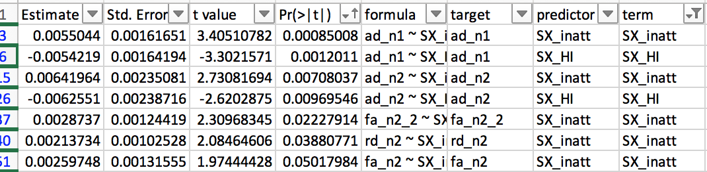
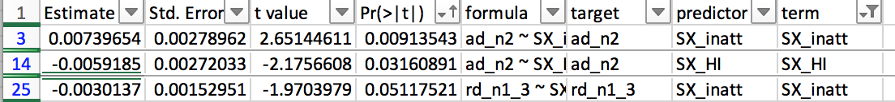
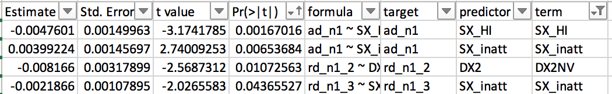
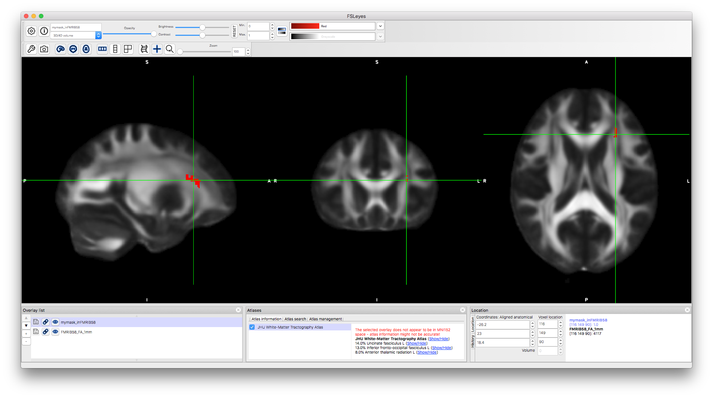

# 2019-05-02 15:29:04

I'm following the guidelines form a previous note in Evernote. The main script
to call is run_solar_voxel, and we need to make sure the solar directories ar
eproperly set up in the cluster.

But we also need to create a CSV that has voxelwise data. I don't want to fuss
with QC for now, maybe later. So, let's just take the 133 scans that gave the
tract result, and export those. Actually, we'll need the 566 scans fo get 283
slopes used in the association analysis. I can get a mask from that later, then.

Then, it's just a matter of dumping the data for all our IDs. But we first need
to save the IDs that will be used, especially because we'll need to calculate
the slopes for each voxel!

```r
b = read.csv('/Volumes/Shaw/MasterQC/master_qc_20190314.csv')
a = read.csv('~/data/heritability_change/ready_1020.csv')
m = merge(a, b, by.y='Mask.ID', by.x='Mask.ID...Scan', all.x=F)

# restrict based on QC
pct = m$missingVolumes / m$numVolumes
idx = m$norm.trans < 5 & m$norm.rot < .1 & pct < .15
m = m[idx,]
# down to 902 scans
keep_me = c()
for (s in unique(m$Medical.Record...MRN...Subjects)) {
    subj_scans = m[m$Medical.Record...MRN...Subjects==s, ]
    dates = as.Date(as.character(subj_scans$"record.date.collected...Scan"),
                                 format="%m/%d/%Y")
    if (length(dates) >= 2) {
        sdates = sort(dates)  # not sure why index.return is not working...
        # make sure there is at least 6 months between scans
        next_scan = 2
        while (((sdates[next_scan] - sdates[1]) < 180) && (next_scan < length(sdates))) {
            next_scan = next_scan + 1
        }
        first_scan_age = subj_scans[dates==sdates[1], 'age_at_scan...Scan...Subjects']
        if (((sdates[next_scan] - sdates[1]) >= 180) && (first_scan_age < 26)) {
            idx1 = which(dates == sdates[1])
            keep_me = c(keep_me, which(m$Mask.ID...Scan == subj_scans[idx1, 'Mask.ID...Scan']))
            idx2 = which(dates == sdates[next_scan])
            keep_me = c(keep_me, which(m$Mask.ID...Scan == subj_scans[idx2, 'Mask.ID...Scan']))
        }
    }
}
m2 = m[keep_me, ]
# down to 566 scans, as we're not using tract data at this point
write.table(sort(m2$Mask.ID...Scan), file='~/data/heritability_change/maskids_566.txt',
    col.names=F, row.names=F)
```

Those are the scans that will generate the slopes later. I then added a few
zeros manually.

As I copy them to the cluster, let's go ahead and get started on the mask:

```bash
sed "s/$/_tensor_diffeo.nii.gz/" maskids_566.txt > subjs_tensor.txt;
sed "s/^/..\/analysis_may2017\//" subjs_tensor.txt > subjs_tensor2.txt;
TVMean -in subjs_tensor2.txt -out mean_final_high_res.nii.gz
TVtool -in mean_final_high_res.nii.gz -fa
tbss_skeleton -i mean_final_high_res -o mean_fa_skeleton
3dcalc -a mean_fa_skeleton.nii.gz -prefix mean_566_fa_skeleton_mask.nii.gz \
    -expr 'step(a-.2)'
dti_dir=/mnt/shaw/dti_robust_tsa/analysis_may2017/
mkdir dti_voxels
for maskid in `cat maskids_566.txt`; do
     3dmaskdump -mask mean_566_fa_skeleton_mask.nii.gz -o dti_voxels/${maskid}_fa.txt ${dti_dir}/${maskid}_tensor_diffeo_fa.nii.gz;
     3dmaskdump -mask mean_566_fa_skeleton_mask.nii.gz -o dti_voxels/${maskid}_ad.txt ${dti_dir}/${maskid}_tensor_diffeo_ad.nii.gz;
     3dmaskdump -mask mean_566_fa_skeleton_mask.nii.gz -o dti_voxels/${maskid}_rd.txt ${dti_dir}/${maskid}_tensor_diffeo_rd.nii.gz;
done
```

# 2019-05-03 10:07:04

The mask that was created had way too many voxels. Over 30K! That's because it
was using lots of peripheral voxels. Can we just transport the FA
skeleton from TBSS to our space? Let's transform the FSL FA image to our group
image, and then use that transformation to transform the skeleton:

```bash
flirt -in /usr/local/neuro/fsl/data/standard/FMRIB58_FA_1mm.nii.gz \
    -ref mean_final_high_res_fa.nii.gz \
    -out FMRIB58_FA_IN_groupTemplate.nii.gz -omat FMRIB58_to_group.mat \
    -bins 256 -cost corratio -searchrx -90 90 -searchry -90 90 \
    -searchrz -90 90 -dof 12 -interp trilinear

flirt -in /usr/local/neuro/fsl/data/standard/FMRIB58_FA-skeleton_1mm.nii.gz \
    -ref mean_final_high_res_fa.nii.gz \
    -out FMRIB58_FA-skeleton_inGroup.nii.gz -applyxfm \
    -init FMRIB58_to_group.mat -interp nearestneighbour

3dcalc -a FMRIB58_FA-skeleton_inGroup.nii.gz -prefix fa_skeleton_mask.nii.gz \
    -expr 'step(a-.2)'

dti_dir=/mnt/shaw/dti_robust_tsa/analysis_may2017/
mkdir dti_voxels
for maskid in `cat maskids_566.txt`; do
     3dmaskdump -mask fa_skeleton_mask.nii.gz -o dti_voxels/${maskid}_fa.txt ${dti_dir}/${maskid}_tensor_diffeo_fa.nii.gz;
     3dmaskdump -mask fa_skeleton_mask.nii.gz -o dti_voxels/${maskid}_ad.txt ${dti_dir}/${maskid}_tensor_diffeo_ad.nii.gz;
     3dmaskdump -mask fa_skeleton_mask.nii.gz -o dti_voxels/${maskid}_rd.txt ${dti_dir}/${maskid}_tensor_diffeo_rd.nii.gz;
done
```

Then we construct the data files in R:

```r
maskids = read.table('/mnt/shaw/dti_robust_tsa/heritability/maskids_566.txt')[, 1]
nvox=14681
for (m in c('fa', 'ad', 'rd')) {
     print(m)
     dti_data = matrix(nrow=length(maskids), ncol=nvox)
     for (s in 1:nrow(dti_data)) {
          a = read.table(sprintf('/mnt/shaw/dti_robust_tsa/heritability/dti_voxels/%04d_%s.txt',
                                 maskids[s], m))
          dti_data[s, ] = a[,4]
     }
     dti_data = cbind(maskids, dti_data)
     cnames = c('mask.id', sapply(1:nvox, function(d) sprintf('v%05d', d)))
     colnames(dti_data) = cnames
     write.csv(dti_data, file=sprintf('/mnt/shaw/dti_robust_tsa/heritability/dti_%s_voxelwise_n566_03052019.csv', m), row.names=F)
}
```

Now we have to run the exact same code we ran for tracts, but for the voxels:

```r
b = read.csv('/Volumes/Shaw/MasterQC/master_qc_20190314.csv')
a = read.csv('~/data/heritability_change/ready_1020.csv')
m = merge(a, b, by.y='Mask.ID', by.x='Mask.ID...Scan', all.x=F)

# restrict based on QC
pct = m$missingVolumes / m$numVolumes
idx = m$norm.trans < 5 & m$norm.rot < .1 & pct < .15
m = m[idx,]
# down to 902 scans
keep_me = c()
for (s in unique(m$Medical.Record...MRN...Subjects)) {
    subj_scans = m[m$Medical.Record...MRN...Subjects==s, ]
    dates = as.Date(as.character(subj_scans$"record.date.collected...Scan"),
                                 format="%m/%d/%Y")
    if (length(dates) >= 2) {
        sdates = sort(dates)  # not sure why index.return is not working...
        # make sure there is at least 6 months between scans
        next_scan = 2
        while (((sdates[next_scan] - sdates[1]) < 180) && (next_scan < length(sdates))) {
            next_scan = next_scan + 1
        }
        first_scan_age = subj_scans[dates==sdates[1], 'age_at_scan...Scan...Subjects']
        if (((sdates[next_scan] - sdates[1]) >= 180) && (first_scan_age < 26)) {
            idx1 = which(dates == sdates[1])
            keep_me = c(keep_me, which(m$Mask.ID...Scan == subj_scans[idx1, 'Mask.ID...Scan']))
            idx2 = which(dates == sdates[next_scan])
            keep_me = c(keep_me, which(m$Mask.ID...Scan == subj_scans[idx2, 'Mask.ID...Scan']))
        }
    }
}
m2 = m[keep_me, ]

source('~/research_code/lab_mgmt/merge_on_closest_date.R')

clin = read.csv('~/data/heritability_change/clinical_03132019.csv')
df = mergeOnClosestDate(m2, clin, unique(m2$Medical.Record...MRN...Subjects),
                         x.date='record.date.collected...Scan',
                         x.id='Medical.Record...MRN...Subjects')
b = read.csv('/Volumes/Shaw/dti_robust_tsa/heritability/dti_fa_voxelwise_n566_03052019.csv')
tract_names = colnames(b)[2:ncol(b)]
df2 = merge(df, b, by.x='Mask.ID...Scan', by.y='mask.id')

library(MASS)
mres = df2
mres$SX_HI = as.numeric(as.character(mres$SX_hi))
mres$SX_inatt = as.numeric(as.character(mres$SX_inatt))
for (t in tract_names) {
    print(t)
    fm_str = sprintf('%s ~', t)
    fm_str = paste(fm_str,
                   'norm.rot + I(norm.rot^2) + norm.trans + I(norm.trans^2) +',
                   'missingVolumes')
    res.lm <- lm(as.formula(fm_str), data = mres, na.action=na.exclude)
    step <- stepAIC(res.lm, direction = "both", trace = F)
    mres[, t] = residuals(step)
}
```

I had to make some changes here because it was taking too long to calculate the
slopes. So, let's do it in a more direct way:

```r
res = c()
for (s in unique(mres$Medical.Record...MRN...Subjects)) {
    idx = which(mres$Medical.Record...MRN...Subjects == s)
    row = c(s, unique(mres[idx, 'Sex...Subjects']))
    y = mres[idx[2], tract_names] - mres[idx[1], tract_names]
    x = mres[idx[2], 'age_at_scan...Scan...Subjects'] - mres[idx[1], 'age_at_scan...Scan...Subjects']
    slopes = y / x
    row = c(row, slopes)
    for (t in c('SX_inatt', 'SX_HI')) {
        fm_str = sprintf('%s ~ age_at_scan...Scan...Subjects', t)
        fit = lm(as.formula(fm_str), data=mres[idx, ], na.action=na.exclude)
        row = c(row, coefficients(fit)[2])
    }
    # grabbing inatt and HI at baseline
    base_DOA = which.min(mres[idx, 'age_at_scan...Scan...Subjects'])
    row = c(row, mres[idx[base_DOA], 'SX_inatt'])
    row = c(row, mres[idx[base_DOA], 'SX_HI'])
    # DX1 is DSMV definition, DX2 will make SX >=4 as ADHD
    if (mres[idx[base_DOA], 'age_at_scan...Scan...Subjects'] < 16) {
        if ((row[length(row)] >= 6) || (row[length(row)-1] >= 6)) {
            DX = 'ADHD'
        } else {
            DX = 'NV'
        }
    } else {
        if ((row[length(row)] >= 5) || (row[length(row)-1] >= 5)) {
            DX = 'ADHD'
        } else {
            DX = 'NV'
        }
    }
    if ((row[length(row)] >= 4) || (row[length(row)-1] >= 4)) {
        DX2 = 'ADHD'
    } else {
        DX2 = 'NV'
    }
    row = c(row, DX)
    row = c(row, DX2)
    res = rbind(res, row)
    print(nrow(res))
}
colnames(res) = c('ID', 'sex', tract_names, c('SX_inatt', 'SX_HI',
                                              'inatt_baseline',
                                              'HI_baseline', 'DX', 'DX2'))
write.csv(res, file='~/data/heritability_change/dti_fa_residNoSex_OLS_naSlopes283.csv',
          row.names=F, na='', quote=F)

# and remove outliers
res_clean = res
for (t in tract_names) {
    mydata = as.numeric(res_clean[, t])
    # identifying outliers
    ul = mean(mydata) + 3 * sd(mydata)
    ll = mean(mydata) - 3 * sd(mydata)
    bad_subjs = c(which(mydata < ll), which(mydata > ul))

    # remove within-tract outliers
    res_clean[bad_subjs, t] = NA
}
write.csv(res_clean, file='~/data/heritability_change/dti_fa_residNoSex_OLS_naSlopes283Clean.csv',
          row.names=F, na='', quote=F)
```

And we need to repeat the same procedure for AD and RD.

Next step is to keep only the 133 we'll use for heritability:

```r
# make sure every family has at least two people
good_nuclear = names(table(m2$Nuclear.ID...FamilyIDs))[table(m2$Nuclear.ID...FamilyIDs) >= 4]
good_extended = names(table(m2$Extended.ID...FamilyIDs))[table(m2$Extended.ID...FamilyIDs) >= 4]
keep_me = c()
for (f in good_nuclear) {
    keep_me = c(keep_me, m2[which(m2$Nuclear.ID...FamilyIDs == f),
                            'Medical.Record...MRN...Subjects'])
}
for (f in good_extended) {
    keep_me = c(keep_me, m2[which(m2$Extended.ID...FamilyIDs == f),
                            'Medical.Record...MRN...Subjects'])
}
keep_me = unique(keep_me)

fam_subjs = c()
for (s in keep_me) {
    fam_subjs = c(fam_subjs, which(res[, 'ID'] == s))
}
res2 = res[fam_subjs, ]
res2 = res2[res2[, 'ID'] != 7221745, ]
write.csv(res2, file='~/data/heritability_change/dti_fa_residNoSex_OLS_naSlopes133.csv',
          row.names=F, na='', quote=F)
res2 = res_clean[fam_subjs, ]
res2 = res2[res2[, 'ID'] != 7221745, ]
write.csv(res2, file='~/data/heritability_change/dti_fa_residNoSex_OLS_naSlopes133Clean.csv',
          row.names=F, na='', quote=F)
```

Then, it's time to start running heritability per voxel. I have the cluster tied
up in bedpost right now, so let's see how long it'll take to just run the main
analysis in an interactive node, or even in my own laptop:

```bash
phen_file=dti_fa_residNoSex_OLS_naSlopes133Clean
tmp_dir=~/data/heritability_change
solar_dir=~/data/heritability_change
mkdir ${tmp_dir}/${phen_file}
mkdir /tmp/${phen_file}
for v in {1..14681}; do
    vox=`printf %05d $v`;
    mkdir /tmp/${phen_file}/${vox};
    cp ${solar_dir}/pedigree.csv ${solar_dir}/procs.tcl /tmp/${phen_file}/${vox}/;
    sed "s/NA//g" ${solar_dir}/${phen_file}.csv > /tmp/${phen_file}/${vox}/${phen_file}.csv;
    cd /tmp/${phen_file}/${vox}/;
    ~/Downloads/solar842/solar run_phen_var $phen_file v${vox};
    mv /tmp/${phen_file}/${vox}/i_v${vox}/polygenic.out ${tmp_dir}/${phen_file}/v${vox}_polygenic.out;
done
```

Then, we run the nonClean version for comparison, and both for AD and RD.

I'm running it in my laptop, but let's see if I can do it in the cluster as
well...

```bash
jname=faClean
fname=${jname}.swarm;
for i in {1..14681}; do
    echo "bash ~/research_code/run_solar_voxel.sh dti_fa_residNoSex_OLS_naSlopes133Clean ${i}" >> $fname;
done;
swarm --gres=lscratch:1 -f ${fname} --module solar -g 1 -t 1 \
            --logdir=${jname} --job-name ${jname} -p 2 --partition quick \
            --time=1 -b 120;
```

And before we can compile the results, we need to create an ijk file:

```bash
cut -d " " -f 1,2,3 \
    /Volumes/Shaw/dti_robust_tsa/heritability/dti_voxels/0901_fa.txt > \
    ~/data/heritability_change/fa_skeleton_mask_ijk.txt
```

We compile using:

```bash
python ~/research_code/dti/compile_solar_voxel_results.py dti_rd_residNoSex_OLS_naSlopes133Clean
3dclust -1Dformat -nosum -1dindex 0 -1tindex 1 -1thresh 0.95 -NN3 5 polygen_results_dti_rd_residNoSex_OLS_naSlopes133Clean.nii 
```

OK, let's see if any of these results have some association to ADHD. Wrote
individual masks in AFNI. Then:

```bash
cd /mnt/shaw/dti_robust_tsa/heritability
for n in 1 2 3; do
    for m in fa ad rd; do
        echo $m $n
        3dcopy ${m}_n${n}_mask_0001+orig mymask.nii -overwrite;
        echo maskid,val > ${m}_n${n}.csv;
        while read s; do
            val1=`3dmaskave -q -mask mymask.nii ../analysis_may2017/${s}_tensor_diffeo_${m}.nii.gz 2>/dev/null`;
            echo ${s},${val1} >> ${m}_n${n}.csv;
        done < maskids_566.txt;
    done;
done
```

And then repeat for the cl2 of rd and fa, that had ties as the top cluster, with
the hopes it'll be significant. 

Note that both in AD and RD, the n2 and n3 clusters are the same! We'd probably
only pick N anyways, but at least we can do either n1 or n2, ad n3 won't add
much (at least not for those 2 modalities).

Now, let's compute the slopes and see if it's at
all related to ADHD:

```r
b = read.csv('/Volumes/Shaw/MasterQC/master_qc_20190314.csv')
a = read.csv('~/data/heritability_change/ready_1020.csv')
m = merge(a, b, by.y='Mask.ID', by.x='Mask.ID...Scan', all.x=F)

# restrict based on QC
pct = m$missingVolumes / m$numVolumes
idx = m$norm.trans < 5 & m$norm.rot < .1 & pct < .15
m = m[idx,]
# down to 902 scans
keep_me = c()
for (s in unique(m$Medical.Record...MRN...Subjects)) {
    subj_scans = m[m$Medical.Record...MRN...Subjects==s, ]
    dates = as.Date(as.character(subj_scans$"record.date.collected...Scan"),
                                 format="%m/%d/%Y")
    if (length(dates) >= 2) {
        sdates = sort(dates)  # not sure why index.return is not working...
        # make sure there is at least 6 months between scans
        next_scan = 2
        while (((sdates[next_scan] - sdates[1]) < 180) && (next_scan < length(sdates))) {
            next_scan = next_scan + 1
        }
        first_scan_age = subj_scans[dates==sdates[1], 'age_at_scan...Scan...Subjects']
        if (((sdates[next_scan] - sdates[1]) >= 180) && (first_scan_age < 26)) {
            idx1 = which(dates == sdates[1])
            keep_me = c(keep_me, which(m$Mask.ID...Scan == subj_scans[idx1, 'Mask.ID...Scan']))
            idx2 = which(dates == sdates[next_scan])
            keep_me = c(keep_me, which(m$Mask.ID...Scan == subj_scans[idx2, 'Mask.ID...Scan']))
        }
    }
}
m2 = m[keep_me, ]

source('~/research_code/lab_mgmt/merge_on_closest_date.R')

clin = read.csv('~/data/heritability_change/clinical_03132019.csv')
df = mergeOnClosestDate(m2, clin, unique(m2$Medical.Record...MRN...Subjects),
                         x.date='record.date.collected...Scan',
                         x.id='Medical.Record...MRN...Subjects')
clu_names = c('ad_n1', 'ad_n2', 'ad_n3',
              'rd_n1', 'rd_n1_2', 'rd_n1_3', 'rd_n2', 'rd_n3',
              'fa_n1', 'fa_n2', 'fa_n2_2', 'fa_n3')
b = c()
for (cl in clu_names) {
    fname = sprintf('/Volumes/Shaw/dti_robust_tsa/heritability/%s.csv', cl)
    b2 = read.csv(fname)
    b = cbind(b, b2[, 2])
}
b = cbind(b2[, 1], b)
colnames(b) = c('mask.id', clu_names)
tract_names = colnames(b)[2:ncol(b)]

df2 = merge(df, b, by.x='Mask.ID...Scan', by.y='mask.id')

library(MASS)
mres = df2
mres$SX_HI = as.numeric(as.character(mres$SX_hi))
mres$SX_inatt = as.numeric(as.character(mres$SX_inatt))
for (t in tract_names) {
    print(t)
    fm_str = sprintf('%s ~', t)
    fm_str = paste(fm_str,
                   'norm.rot + I(norm.rot^2) + norm.trans + I(norm.trans^2) +',
                   'missingVolumes')
    res.lm <- lm(as.formula(fm_str), data = mres, na.action=na.exclude)
    step <- stepAIC(res.lm, direction = "both", trace = F)
    mres[, t] = residuals(step)
}

res = c()
for (s in unique(mres$Medical.Record...MRN...Subjects)) {
    idx = which(mres$Medical.Record...MRN...Subjects == s)
    row = c(s, unique(mres[idx, 'Sex...Subjects']))
    y = mres[idx[2], tract_names] - mres[idx[1], tract_names]
    x = mres[idx[2], 'age_at_scan...Scan...Subjects'] - mres[idx[1], 'age_at_scan...Scan...Subjects']
    slopes = y / x
    row = c(row, slopes)
    for (t in c('SX_inatt', 'SX_HI')) {
        fm_str = sprintf('%s ~ age_at_scan...Scan...Subjects', t)
        fit = lm(as.formula(fm_str), data=mres[idx, ], na.action=na.exclude)
        row = c(row, coefficients(fit)[2])
    }
    # grabbing inatt and HI at baseline
    base_DOA = which.min(mres[idx, 'age_at_scan...Scan...Subjects'])
    row = c(row, mres[idx[base_DOA], 'SX_inatt'])
    row = c(row, mres[idx[base_DOA], 'SX_HI'])
    # DX1 is DSMV definition, DX2 will make SX >=4 as ADHD
    if (mres[idx[base_DOA], 'age_at_scan...Scan...Subjects'] < 16) {
        if ((row[length(row)] >= 6) || (row[length(row)-1] >= 6)) {
            DX = 'ADHD'
        } else {
            DX = 'NV'
        }
    } else {
        if ((row[length(row)] >= 5) || (row[length(row)-1] >= 5)) {
            DX = 'ADHD'
        } else {
            DX = 'NV'
        }
    }
    if ((row[length(row)] >= 4) || (row[length(row)-1] >= 4)) {
        DX2 = 'ADHD'
    } else {
        DX2 = 'NV'
    }
    row = c(row, DX)
    row = c(row, DX2)
    res = rbind(res, row)
    print(nrow(res))
}
colnames(res) = c('ID', 'sex', tract_names, c('SX_inatt', 'SX_HI',
                                              'inatt_baseline',
                                              'HI_baseline', 'DX', 'DX2'))
write.csv(res, file='~/data/heritability_change/dti_clusters_residNoSex_OLS_naSlopes283.csv',
          row.names=F, na='', quote=F)

# and remove outliers
res_clean = res
for (t in tract_names) {
    mydata = as.numeric(res_clean[, t])
    # identifying outliers
    ul = mean(mydata) + 3 * sd(mydata)
    ll = mean(mydata) - 3 * sd(mydata)
    bad_subjs = c(which(mydata < ll), which(mydata > ul))

    # remove within-tract outliers
    res_clean[bad_subjs, t] = NA
}
write.csv(res_clean, file='~/data/heritability_change/dti_clusters_residNoSex_OLS_naSlopes283Clean.csv',
          row.names=F, na='', quote=F)
```

```r
data = read.csv('~/data/heritability_change/dti_clusters_residNoSex_OLS_naSlopes283.csv')
data$sex = as.factor(data$sex)
tract_names = clu_names
out_fname = '~/data/heritability_change/assoc_clu_naSlopes283.csv'
predictors = c('SX_inatt', 'SX_HI', 'inatt_baseline', 'HI_baseline', 'DX', 'DX2')
targets = tract_names
hold=NULL
for (i in targets) {
    for (j in predictors) {
        fm_str = sprintf('%s ~ %s + sex', i, j)
        model1<-lm(as.formula(fm_str), data, na.action=na.omit)
        temp<-summary(model1)$coefficients
        a<-as.data.frame(temp)
        a$formula<-fm_str
        a$target = i
        a$predictor = j
        a$term = rownames(temp)
        hold=rbind(hold,a)
    }
}
write.csv(hold, out_fname, row.names=F)

data2 = data[data$DX=='ADHD', ]
out_fname = '~/data/heritability_change/assoc_clu_naSlopes283dx1.csv'
predictors = c('SX_inatt', 'SX_HI', 'inatt_baseline', 'HI_baseline')
targets = tract_names
hold=NULL
for (i in targets) {
    for (j in predictors) {
        fm_str = sprintf('%s ~ %s + sex', i, j)
        model1<-lm(as.formula(fm_str), data2, na.action=na.omit)
        temp<-summary(model1)$coefficients
        a<-as.data.frame(temp)
        a$formula<-fm_str
        a$target = i
        a$predictor = j
        a$term = rownames(temp)
        hold=rbind(hold,a)
    }
}
write.csv(hold, out_fname, row.names=F)

data2 = data[data$DX2=='ADHD', ]
out_fname = '~/data/heritability_change/assoc_clu_naSlopes283_dx2.csv'
predictors = c('SX_inatt', 'SX_HI', 'inatt_baseline', 'HI_baseline')
targets = tract_names
hold=NULL
for (i in targets) {
    for (j in predictors) {
        fm_str = sprintf('%s ~ %s + sex', i, j)
        model1<-lm(as.formula(fm_str), data2, na.action=na.omit)
        temp<-summary(model1)$coefficients
        a<-as.data.frame(temp)
        a$formula<-fm_str
        a$target = i
        a$predictor = j
        a$term = rownames(temp)
        hold=rbind(hold,a)
    }
}
write.csv(hold, out_fname, row.names=F)
```

Oh well, I think this is working... let's double check everything to make sure
it's kosher, and get some anatomical positions. Also, need to check the results
survive multiple comparisons...

Results are still good. Not showing the N3 results because they're duplicate of
N2 for AD and RD, but here's DX2:



Then DX1:



And the entire group:



OK, now we just need to figure out if those clusters are indeed significant, and
where they're located!

Maybe the easiest thing to do here is to put the clusters in fMRIB58 space. It
worked before, so we just invert it:

```bash
flirt -in mean_final_high_res_fa.nii.gz \
    -ref /usr/local/neuro/fsl/data/standard/FMRIB58_FA_1mm.nii.gz \
    -out mean_group_IN_FMRIB58_FA.nii.gz -omat group_to_FMRIB58.mat \
    -bins 256 -cost corratio -searchrx -90 90 -searchry -90 90 \
    -searchrz -90 90 -dof 12 -interp trilinear

flirt -in mymask.nii \
    -ref /usr/local/neuro/fsl/data/standard/FMRIB58_FA_1mm.nii.gz \
    -out mymask_inFMRIB58.nii.gz -applyxfm \
    -init group_to_FMRIB58.mat -interp nearestneighbour

3dclust -1Dformat -nosum -orient LPI -NN1 5 mymask_inFMRIB58.nii.gz
```

So, as expected, the COM of ad_n1 is between left uncinate and IFO:



The other ones should be easy to check as well. Now, we just need to do some
permutations. First, we create the permutation files for SOLAR:

```r
m = 'ad'
nperms = 500
d = read.csv(sprintf('~/data/heritability_change/dti_%s_residNoSex_OLS_naSlopes133Clean.csv', m))
vcols = c(which(grepl("v",colnames(d))), which(grepl("sex",colnames(d))))
d2 = d
for (p in 1:nperms) {
    print(p)
    d2[, vcols] = d[sample(nrow(d)), vcols]
    fname = sprintf('~/data/heritability_change/perms/dti_%s_residNoSex_OLS_naSlopes133Clean_p%04d_sexAndBrainShuffled.csv', m, p)
    write.csv(d2, file=fname, row.names=F, quote=F)
}
```

And for swarms, we'll do something like:

```bash
cd ~/data

m=ad
nperms=500
fname=`printf %s_p%04d $m 0`.swarm;
# generate voxel file for the first perm
for i in {1..14681}; do
    echo "bash ~/research_code/run_solar_voxel.sh dti_${m}_residNoSex_OLS_naSlopes133Clean_p0000_sexAndBrainShuffled ${i}" >> $fname;
done;
# just copy it and rename IC and perm for the other ones
for n in `seq 1 $nperms`; do
    perm=`printf %04d $n`;
    cur_fname=`printf %s_p%04d $m $n`.swarm;
    cp $fname $cur_fname;
    sed -i -- "s/p0000/p${perm}/g" $cur_fname;
done

# runs all swarms, but wait until we can do it
for n in `seq 1 $nperms`; do
    jname=`printf %s_p%04d $m $n`;
    echo "ERROR" > swarm_wait_${m}
    while grep -q ERROR swarm_wait_${m}; do
        echo "Trying $jname"
        swarm --gres=lscratch:1 -f ${jname}.swarm --module solar -g 1 -t 1 \
            --logdir=${jname} --job-name ${jname} -p 2 --partition quick \
            --time=1 -b 120 2> swarm_wait_${m};
        if grep -q ERROR swarm_wait_${m}; then
            echo -e "\tError, sleeping..."
            sleep 10m;
        fi;
    done;
done
```