# 2019-05-14 15:55:57

OK, let's see if there is anything heritable in the MELODIC ICs. We start by
defining some masks:

```bash
# caterpie
cd /mnt/shaw/Gustavo/desktop_backup/data/heritability_change/
cut -d"," -f 1 fmri_corr_tables/pearson_3min_n462_power.csv | tail -n +2 > 3min_mni.txt
for maskid in `cat 3min_mni.txt`; do
    m=`printf %04d $maskid`;
    3dAutomask -prefix masks/${m}_automask.nii fmri_same_space/epi/${m}_epi_NL_inMNI.nii;
done
cd masks
3dmask_tool -input ????_automask.nii -prefix ../group_epi_mask_union.nii -frac 0
3dmask_tool -input ????_automask.nii -prefix ../group_epi_mask_inter.nii -frac 1
3dmask_tool -input ????_automask.nii -prefix ../group_epi_mask_fancy.nii \
    -dilate_input 5 -5 -frac 0.7 -fill_holes
```

# 2019-05-15 09:21:19

Let's then run melodic. But we'll need to send the data to BW first:

```bash
# caterpie
cd /mnt/shaw/Gustavo/desktop_backup/data/heritability_change/
for maskid in `cat 3min_mni.txt`; do
    m=`printf %04d $maskid`;
    echo ${m}_epi_NL_inMNI.nii >> fmri_same_space/epi/3min_mni_epi.txt;
done
scp fmri_same_space/epi/3min_mni_epi.txt bw:~/data/heritability_change/fmri_same_space/epi/;

# bw
module load fsl/6.0.0
cd ~/data/heritability_change/fmri_same_space/epi/;
melodic -i 3min_mni_epi.txt -o groupmelodic_union.ica -v --nobet -m ../group_epi_mask_union.nii --tr=2.5 --report --Oall -a concat;
melodic -i 3min_mni_epi.txt -o groupmelodic_fancy.ica -v --nobet -m ../group_epi_mask_fancy.nii --tr=2.5 --report --Oall -a concat;
melodic -i 3min_mni_epi.txt -o groupmelodic_inter.ica -v --nobet -m ../group_epi_mask_inter.nii --tr=2.5 --report --Oall -a concat;
```

Now we performt the dual regression to get each subject's values for the ICs:

```bash
pipe='inter';
cd ~/data/heritability_change/fmri_same_space/epi/groupmelodic_${pipe}.ica
mkdir dual
while read m; do
    s=`printf %04d $m`;
    echo ${pipe} $s;
    $FSLDIR/bin/fsl_glm -i ../${s}_epi_NL_inMNI.nii -d melodic_IC \
        -o dual/dr_stage1_${s}.txt --demean -m ../../group_epi_mask_${pipe}.nii;
    $FSLDIR/bin/fsl_glm -i ../${s}_epi_NL_inMNI.nii -d dual/dr_stage1_${s}.txt \
        -o dual/dr_stage2_$s --demean -m ../../group_epi_mask_${pipe}.nii --des_norm \
        --out_z=dual/dr_stage2_${s}_Z;
done < ../../../3min_mni.txt
```

# 2019-05-16 10:57:18

We are already in MNI space, like the Yeo networks. So, let's go with that:

```bash
#bw
cd ~/data/heritability_change/fmri_same_space/epi/;
for i in {1..7}; do
    3dcalc -prefix Yeo_liberal_inMNI_net${i}.nii \
        -a /data/NCR_SBRB/software/Yeo_JNeurophysiol11_MNI152/Yeo2011_7Networks_MNI152_FreeSurferConformed1mm_LiberalMask.nii.gz -expr "amongst(a,${i})";
done
3dTcat -prefix Yeo_liberal_inMNI_combined.nii Yeo_liberal_inMNI_net1.nii \
    Yeo_liberal_inMNI_net2.nii Yeo_liberal_inMNI_net3.nii \
    Yeo_liberal_inMNI_net4.nii Yeo_liberal_inMNI_net5.nii \
    Yeo_liberal_inMNI_net6.nii Yeo_liberal_inMNI_net7.nii
3dresample -master groupmelodic_inter.ica/melodic_IC.nii.gz \
    -prefix Yeo_nets.nii -inset Yeo_liberal_inMNI_combined.nii \
    -rmode NN -overwrite
```

So, let's figure out what are the best matching networks for each mask:

```bash
#bw
cd ~/data/heritability_change/fmri_same_space/epi/groupmelodic_inter.ica/
3dMatch -inset melodic_IC.nii.gz -refset ../Yeo_nets.nii \
    -mask ../../group_epi_mask_inter.nii -prefix matches -overwrite
cat matches_REF_coeff.vals
```

Keep in mind that the code is:

```
0: visual
1: somatomotor
2: DAN
3: VAN
4: limbic
5: cognitive (frontoparietal)
6: DMN
```

inter:

```
0               41              0.173           0.251
1               48              0.240           0.144
2               35              0.325           0.083
3               23              0.214           0.170
4               214             0.261           0.025
5               228             0.174           0.191
6               0               0.179           0.296
```

I didn't like the DMN component in inter.

fancy:

```
0               60              0.364           0.138
1               15              0.344           0.122
2               2               0.381           0.097
3               8               0.365           0.086
4               62              0.413           0.074
5               5               0.350           0.122
6               0               0.322           0.181
```

The one from fancy looks much better:

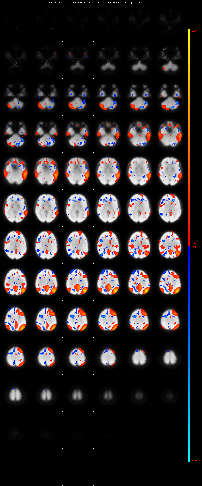

And this is cognitive:

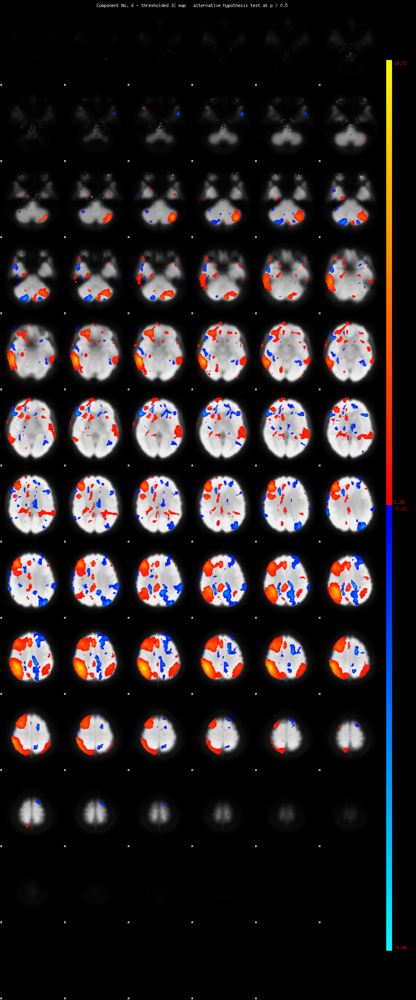

Let's go with fancy for now.

union:

```
0               107             0.340           0.054
1               138             0.295           0.048
2               70              0.310           0.038
3               34              0.310           0.033
4               67              0.405           0.029
5               98              0.256           0.048
6               48              0.267           0.073
```

Union mask has too much crap...

```bash
pipe=fancy;
cd ~/data/heritability_change/fmri_same_space/epi/groupmelodic_${pipe}.ica/dual
mkdir dumps
for m in `cat ../../../../3min_mni.txt`; do
    maskid=`printf %04d $m`;
    echo $maskid;
    rm dumps/${maskid}_*.txt
    for i in 60 15 2 8 62 5 0; do  # fancy
        3dmaskdump -mask ../../../group_epi_mask_${pipe}.nii \
            -o dumps/${maskid}_IC${i}_Z.txt dr_stage2_${maskid}_Z.nii.gz[${i}];
    done;
done
```

Then, we collect our results in R:

```r
maskids = read.table('~/data/heritability_change/3min_mni.txt')[, 1]
nvox=154058
for (m in c(60, 15, 2, 8, 62, 5, 0)) {
    print(m)
    brain_data = matrix(nrow=length(maskids), ncol=nvox)
    for (s in 1:nrow(brain_data)) {
        fname = sprintf('~/data/heritability_change/fmri_same_space/epi/groupmelodic_fancy.ica/dual/dumps/%04d_IC%d_Z.txt', maskids[s], m)
        a = read.table(fname)
        brain_data[s, ] = a[,4]
     }
     brain_data = cbind(maskids, brain_data)
     cnames = c('mask.id', sapply(1:nvox, function(d) sprintf('v%06d', d)))
     colnames(brain_data) = cnames
     fname = sprintf('~/data/heritability_change/fmri_same_space/melodic_fancy_IC%d.RData', m)
     save(brain_data, file=fname)
}
```

Now that the data is into CSV, we need to assign MRNs, calculate slopes, and
prepare it for SOLAR voxelwise.

**Note that I won' be removing movement here! Mostly because since we're using
ICA, the movement components should have been isolated already. But we can
always check any results later against correlation to movement.
**

```r
source('~/research_code/lab_mgmt/merge_on_closest_date.R')
m2 = read.csv('~/data/heritability_change/rsfmri_3min_assoc_n462.csv')
clin = read.csv('~/data/heritability_change/clinical_03132019.csv')
df = mergeOnClosestDate(m2, clin, unique(m2$Medical.Record...MRN),
                         x.date='record.date.collected...Scan',
                         x.id='Medical.Record...MRN')
load('~/data/heritability_change/fmri_same_space/melodic_fancy_IC0.RData')
b = brain_data
var_names = colnames(b)[2:ncol(b)]
df2 = merge(df, b, by.x='Mask.ID', by.y='mask.id', all.x=F)

# make sure we still have two scans for everyone
rm_subjs = names(which(table(df2$Medical.Record...MRN)<2))
rm_me = df2$Medical.Record...MRN %in% rm_subjs
df2 = df2[!rm_me, ]

mres = df2
mres$SX_HI = as.numeric(as.character(mres$SX_hi))
mres$SX_inatt = as.numeric(as.character(mres$SX_inatt))

res = c()
for (s in unique(mres$Medical.Record...MRN)) {
    idx = which(mres$Medical.Record...MRN == s)
    row = c(s, unique(mres[idx, 'Sex']))
    y = mres[idx[2], var_names] - mres[idx[1], var_names]
    x = mres[idx[2], 'age_at_scan'] - mres[idx[1], 'age_at_scan']
    slopes = y / x
    row = c(row, slopes)
    for (t in c('SX_inatt', 'SX_HI')) {
        fm_str = sprintf('%s ~ age_at_scan', t)
        fit = lm(as.formula(fm_str), data=mres[idx, ], na.action=na.exclude)
        row = c(row, coefficients(fit)[2])
    }
    # grabbing inatt and HI at baseline
    base_DOA = which.min(mres[idx, 'age_at_scan'])
    row = c(row, mres[idx[base_DOA], 'SX_inatt'])
    row = c(row, mres[idx[base_DOA], 'SX_HI'])
    # DX1 is DSMV definition, DX2 will make SX >=4 as ADHD
    if (mres[idx[base_DOA], 'age_at_scan'] < 16) {
        if ((row[length(row)] >= 6) || (row[length(row)-1] >= 6)) {
            DX = 'ADHD'
        } else {
            DX = 'NV'
        }
    } else {
        if ((row[length(row)] >= 5) || (row[length(row)-1] >= 5)) {
            DX = 'ADHD'
        } else {
            DX = 'NV'
        }
    }
    if ((row[length(row)] >= 4) || (row[length(row)-1] >= 4)) {
        DX2 = 'ADHD'
    } else {
        DX2 = 'NV'
    }
    row = c(row, DX)
    row = c(row, DX2)
    res = rbind(res, row)
    print(nrow(res))
}
colnames(res) = c('ID', 'sex', var_names, c('SX_inatt', 'SX_HI',
                                              'inatt_baseline',
                                              'HI_baseline', 'DX', 'DX2'))
# we only open this in R, so it's OK to be RData to load faster
save(res, file='~/data/heritability_change/fmri_same_space/melodic_fancy_slopes_IC0.RData')

# and remove outliers
res_clean = res
for (t in var_names) {
    mydata = as.numeric(res_clean[, t])
    # identifying outliers
    ul = mean(mydata) + 3 * sd(mydata)
    ll = mean(mydata) - 3 * sd(mydata)
    bad_subjs = c(which(mydata < ll), which(mydata > ul))

    # remove within-variable outliers
    res_clean[bad_subjs, t] = NA
}
save(res_clean, file='~/data/heritability_change/fmri_same_space/melodic_fancy_slopesClean_IC0.RData')

# and make sure every family has at least two people
good_nuclear = names(table(m2$Nuclear.ID...FamilyIDs))[table(m2$Nuclear.ID...FamilyIDs) >= 4]
good_extended = names(table(m2$Extended.ID...FamilyIDs))[table(m2$Extended.ID...FamilyIDs) >= 4]
keep_me = c()
for (f in good_nuclear) {
    keep_me = c(keep_me, m2[which(m2$Nuclear.ID...FamilyIDs == f),
                            'Medical.Record...MRN'])
}
for (f in good_extended) {
    keep_me = c(keep_me, m2[which(m2$Extended.ID...FamilyIDs == f),
                            'Medical.Record...MRN'])
}
keep_me = unique(keep_me)

fam_subjs = c()
for (s in keep_me) {
    fam_subjs = c(fam_subjs, which(res[, 'ID'] == s))
}
res2 = res[fam_subjs, ]
res2_clean = res_clean[fam_subjs, ]

write.csv(res2, file='~/data/heritability_change/fmri_same_space/melodic_fancy_slopes_n111_IC0.csv', row.names=F, na='', quote=F)
write.csv(res2_clean, file='~/data/heritability_change/fmri_same_space/melodic_fancy_slopesClean_n111_IC0.csv', row.names=F, na='', quote=F)
```

And of course, redo all of the above for all 6 ICs.

# 2019-05-17 10:14:19

Now that we have all files, let's set it up to run voxelwise SOLAR:

```bash
cd ~/data/heritability_change/fmri_same_space/
jname=ic0Clean
fname=${jname}.swarm;
for i in {1..154058}; do
    echo "bash ~/research_code/run_solar_voxel.sh melodic_fancy_slopesClean_n111_IC0 ${i}" >> $fname;
done;
swarm --gres=lscratch:1 -f ${fname} --module solar -g 1 -t 1 \
            --logdir=${jname} --job-name ${jname} -p 2 --partition quick \
            --time=1 -b 240;
```

And of course, do the same for 60, 15, 2, 8, 62, and 5.

Time to compile the voxel results. First, create an ijk file:

```bash
cd ~/data/heritability_change/fmri_same_space/
cut -d " " -f 1,2,3 \
    epi/groupmelodic_fancy.ica/dual/dumps/0901_IC0_Z.txt > ../group_mask_fancy_ijk.txt
```

We compile using:

```bash
python ~/research_code/fmri/compile_solar_voxel_results.py melodic_fancy_slopesClean_n111_IC0
3dclust -1Dformat -nosum -1dindex 0 -1tindex 1 -1thresh 0.95 -NN1 15 \
    ~/data/tmp/polygen_results_melodic_fancy_slopesClean_n111_IC0.nii
```

And since we have a weekend tomorrow, let's leave some of the permutations
running. At least for DMN and FP. On Monday we can check which networks actually
have clusters that are also associated with ADHD:

```bash
cd /lscratch/$SLURM_JOBID
cp ~/data/heritability_change/melodic_fancy_slopesClean_n111_IC0.csv .
```

```r
# start it from lscratch
m = 0
nperms = 250
library(data.table)
dread = fread(sprintf('~/data/heritability_change/melodic_fancy_slopesClean_n111_IC%d.csv', m), header = T, sep = ',')
d = as.data.frame(dread)  # just so we can index them a bit easier
vcols = c(which(grepl("v",colnames(d))), which(grepl("sex",colnames(d))))
d2 = d
for (p in seq(1, nperms, 2)) {
    d2[, vcols] = d[sample(nrow(d)), vcols]
    fname = sprintf('~/data/heritability_change/perms/melodic_fancy_slopesClean_n111_IC%d_p%04d_sexAndBrainShuffled.csv', m, p)
    print(fname)
    fwrite(d2, file=fname, row.names=F, quote=F)
}
```

Also do the above, but +1 so we can do it in parallel.

Unfortunately that's taking too long. Maybe do something like this? 
https://howto.lintel.in/shuffle-lines-file-linux/ using shuf()?


And we need to be careful to only submit the swarms when we can:

```bash
cd ~/data/heritability_change/fmri_same_space/
ic=0;
nperms=250;
fname=`printf net%d_p%04d $ic 0`.swarm;
# generate voxel file for the first perm
for i in {1..154058}; do
    echo "bash ~/research_code/run_solar_voxel.sh melodic_fancy_slopesClean_n111_IC0_p0000_sexAndBrainShuffled ${i}" >> $fname;
done;
# just copy it and rename IC and perm for the other ones
for n in `seq 1 $nperms`; do
    perm=`printf %04d $n`;
    cp $fname `printf net%d_p%04d $ic $n`.swarm;
    sed -i -- "s/p0000/p${perm}/g" `printf net%d_p%04d $ic $n`.swarm;
done

# runs all swarms, but wait until we can do it
for n in `seq 1 $nperms`; do
    jname=`printf net%d_p%04d $ic $n`;
    echo "ERROR" > swarm_wait_${ic}
    while grep -q ERROR swarm_wait_${ic}; do
        echo "Trying $jname"
        swarm --gres=lscratch:1 -f ${jname}.swarm --module solar -g 1 -t 1 \
            --logdir=${jname} --job-name ${jname} -p 2 --partition quick \
            --time=1 -b 240 2> swarm_wait_${ic};
        if grep -q ERROR swarm_wait_${ic}; then
            echo -e "\tError, sleeping..."
            sleep 10m;
        fi;
    done;
done
```

# 2019-05-20 11:47:23

I started running into trouble in BW because I was going over the file number
limit. Not in size, but in number. I'm not too worried because I delete the
text-wise voxels after they're compiled, but I do have to put a cap in my
swarms. Either that, or put a conditional job there that either compresses or
compiles the files right away after the particular job is done.

For now, I don't want to mess with it, so I'll just do 50 at a time, and compile
 / clean-up as I go (I run into trouble in BW at around 106).

Another option is to leave something like this running in helix:

```bash
ic=0;
cur_perm=2;
cd ~/data/tmp
while true; do
    p=`printf %04d $cur_perm`;
    echo "Checking perm $p";
    fname=melodic_fancy_slopesClean_n111_IC${ic}_p${p}_sexAndBrainShuffled;
    nvox=`ls -1 ${fname}/ | wc -l`;
    if [ $nvox == 154058 ]; then
        echo "Compressing $fname";
        tar -zcf ${fname}.tar.gz ${fname} && rm -rf ${fname};
        let cur_perm=${cur_perm}+1;
    else
        echo "$fname not ready... sleeping";
        sleep 10m;
    fi;
done;
```

That saves in space and file numbers. Then, when compiling the results, I can do
everything in lscratch.

# 2019-05-21 10:00:50

I left some more permutations running, but before going nuts on it again, let's
see if at least the biggest clusters in each network have some relationship with
ADHD:

```bash
# desktop
for i in 0 5 62 8 2 15 60; do
    3dclust -1Dformat -nosum -1dindex 0 -1tindex 1 -1thresh 0.95 -NN1 10 \
        -savemask cluster_NN1gt10_ic${i}.nii -overwrite \
        polygen_results_melodic_fancy_slopesClean_n111_IC${i}.nii;
done

for i in 0 5 62 8 2 15 60; do
    for n in 1 2 3; do
        echo $i $n
        3dcalc -a cluster_NN1gt10_ic${i}.nii -prefix mymask.nii -overwrite \
            -expr "amongst(a, $n)";
        echo maskid,val > ic${i}_cl${n}.csv;
        while read s; do
            m=`printf %04d $s`;
            val1=`3dmaskave -q -mask mymask.nii ~/data/heritability_change/fmri_same_space/epi/groupmelodic_fancy.ica/dual/dr_stage2_${m}_Z.nii.gz[${i}].nii.gz 2>/dev/null`;
            echo ${m},${val1} >> ic${i}_cl${n}.csv;
        done < ~/data/heritability_change/3min_mni.txt;
    done;
done
```

```r
source('~/research_code/lab_mgmt/merge_on_closest_date.R')
m2 = read.csv('~/data/heritability_change/rsfmri_3min_assoc_n462.csv')
clin = read.csv('~/data/heritability_change/clinical_03132019.csv')
df = mergeOnClosestDate(m2, clin, unique(m2$Medical.Record...MRN),
                         x.date='record.date.collected...Scan',
                         x.id='Medical.Record...MRN')
clu_names = c()
for (i in c(0, 5, 62, 8, 2, 15, 60)) {
    for (n in 1:3) {
        clu_names = c(clu_names, sprintf('ic%d_cl%d', i, n))
    }
}
b = c()
for (cl in clu_names) {
    fname = sprintf('~/data/heritability_change/%s.csv', cl)
    b2 = read.csv(fname)
    b = cbind(b, b2[, 2])
}
b = cbind(b2[, 1], b)
colnames(b) = c('mask.id', clu_names)
var_names = colnames(b)[2:ncol(b)]

df2 = merge(df, b, by.x='Mask.ID', by.y='mask.id', all.x=F)

# make sure we still have two scans for everyone
rm_subjs = names(which(table(df2$Medical.Record...MRN)<2))
rm_me = df2$Medical.Record...MRN %in% rm_subjs
df2 = df2[!rm_me, ]

mres = df2
mres$SX_HI = as.numeric(as.character(mres$SX_hi))
mres$SX_inatt = as.numeric(as.character(mres$SX_inatt))

res = c()
for (s in unique(mres$Medical.Record...MRN)) {
    idx = which(mres$Medical.Record...MRN == s)
    row = c(s, unique(mres[idx, 'Sex']))
    y = mres[idx[2], var_names] - mres[idx[1], var_names]
    x = mres[idx[2], 'age_at_scan'] - mres[idx[1], 'age_at_scan']
    slopes = y / x
    row = c(row, slopes)
    for (t in c('SX_inatt', 'SX_HI')) {
        fm_str = sprintf('%s ~ age_at_scan', t)
        fit = lm(as.formula(fm_str), data=mres[idx, ], na.action=na.exclude)
        row = c(row, coefficients(fit)[2])
    }
    # grabbing inatt and HI at baseline
    base_DOA = which.min(mres[idx, 'age_at_scan'])
    row = c(row, mres[idx[base_DOA], 'SX_inatt'])
    row = c(row, mres[idx[base_DOA], 'SX_HI'])
    # DX1 is DSMV definition, DX2 will make SX >=4 as ADHD
    if (mres[idx[base_DOA], 'age_at_scan'] < 16) {
        if ((row[length(row)] >= 6) || (row[length(row)-1] >= 6)) {
            DX = 'ADHD'
        } else {
            DX = 'NV'
        }
    } else {
        if ((row[length(row)] >= 5) || (row[length(row)-1] >= 5)) {
            DX = 'ADHD'
        } else {
            DX = 'NV'
        }
    }
    if ((row[length(row)] >= 4) || (row[length(row)-1] >= 4)) {
        DX2 = 'ADHD'
    } else {
        DX2 = 'NV'
    }
    row = c(row, DX)
    row = c(row, DX2)
    res = rbind(res, row)
    print(nrow(res))
}
colnames(res) = c('ID', 'sex', var_names, c('SX_inatt', 'SX_HI',
                                              'inatt_baseline',
                                              'HI_baseline', 'DX', 'DX2'))
write.csv(res, file='~/data/heritability_change/fmri_same_space/melodic_fancy_clusterSlopes.csv', row.names=F, na='', quote=F)

# and remove outliers
res_clean = res
for (t in var_names) {
    mydata = as.numeric(res_clean[, t])
    # identifying outliers
    ul = mean(mydata) + 3 * sd(mydata)
    ll = mean(mydata) - 3 * sd(mydata)
    bad_subjs = c(which(mydata < ll), which(mydata > ul))

    # remove within-variable outliers
    res_clean[bad_subjs, t] = NA
}
write.csv(res_clean, file='~/data/heritability_change/fmri_same_space/melodic_fancy_clusterSlopesClean.csv', row.names=F, na='', quote=F)

# and make sure every family has at least two people
good_nuclear = names(table(m2$Nuclear.ID...FamilyIDs))[table(m2$Nuclear.ID...FamilyIDs) >= 4]
good_extended = names(table(m2$Extended.ID...FamilyIDs))[table(m2$Extended.ID...FamilyIDs) >= 4]
keep_me = c()
for (f in good_nuclear) {
    keep_me = c(keep_me, m2[which(m2$Nuclear.ID...FamilyIDs == f),
                            'Medical.Record...MRN'])
}
for (f in good_extended) {
    keep_me = c(keep_me, m2[which(m2$Extended.ID...FamilyIDs == f),
                            'Medical.Record...MRN'])
}
keep_me = unique(keep_me)

fam_subjs = c()
for (s in keep_me) {
    fam_subjs = c(fam_subjs, which(res[, 'ID'] == s))
}
res2 = res[fam_subjs, ]
res2_clean = res_clean[fam_subjs, ]

write.csv(res2, file='~/data/heritability_change/fmri_same_space/melodic_fancy_clusterSlopes_n111.csv', row.names=F, na='', quote=F)
write.csv(res2_clean, file='~/data/heritability_change/fmri_same_space/melodic_fancy_clusterSlopesClean_n111.csv', row.names=F, na='', quote=F)
```

# 2019-05-22 12:08:16

I started running into lots of trouble in BW because of the swarms. After
talking to Susan, one of the approaches is to use a bigger bundle factor and use
the norm partition. Let's ry that for now.

```bash
nperms=99
# runs all swarms, but wait until we can do it
for n in `seq 90 $nperms`; do
    jname=`printf net%d_p%04d $ic $n`;
    echo "ERROR" > swarm_wait_${ic}
    while grep -q ERROR swarm_wait_${ic}; do
        echo "Trying $jname"
        swarm --gres=lscratch:1 -f ${jname}.swarm --module solar -g 1 -t 1 \
            --logdir=${jname} --job-name ${jname} -p 2 --partition norm \
            --time=1 -b 1000 2> swarm_wait_${ic};
        if grep -q ERROR swarm_wait_${ic}; then
            echo -e "\tError, sleeping..."
            sleep 1h;
        fi;
    done;
done
```

OK, let's run the regressions on the clusters:

```r
library(nlme)
res = read.csv('~/data/heritability_change/fmri_same_space/melodic_fancy_clusterSlopes.csv')
clu_names = c()
for (i in c(0, 5, 62, 8, 2, 15, 60)) {
    for (n in 1:3) {
        clu_names = c(clu_names, sprintf('ic%d_cl%d', i, n))
    }
}
tract_names = clu_names
m2 = read.csv('~/data/heritability_change/rsfmri_3min_assoc_n462.csv')
m2$famID = m2$Extended.ID...FamilyIDs
idx = is.na(m2$famID)
m2[idx, ]$famID = m2[idx, ]$Nuclear.ID...FamilyIDs

m3 = m2[, c('Medical.Record...MRN', 'famID')]
m4 = unique(m3)
data = merge(res, m4, all.x=T, all.y=F, by.x='ID', by.y='Medical.Record...MRN')
data$sex = as.factor(data$sex)

out_fname = '~/data/heritability_change/assoc_LME_rsfmriClusters_naSlopes227.csv'
predictors = c('SX_inatt', 'SX_HI', 'inatt_baseline', 'HI_baseline', 'DX', 'DX2')
targets = tract_names
hold=NULL
for (i in targets) {
    for (j in predictors) {
        fm_str = sprintf('%s ~ %s + sex', i, j)
        model1<-try(lme(as.formula(fm_str), data, ~1|famID, na.action=na.omit))
        if (length(model1) > 1) {
            temp<-summary(model1)$tTable
            a<-as.data.frame(temp)
            a$formula<-fm_str
            a$target = i
            a$predictor = j
            a$term = rownames(temp)
            hold=rbind(hold,a)
        } else {
            hold=rbind(hold, NA)
        }
    }
}
write.csv(hold, out_fname, row.names=F)

data2 = data[data$DX=='ADHD', ]
out_fname = '~/data/heritability_change/assoc_LME_rsfmriClusters_naSlopes227_dx1.csv'
predictors = c('SX_inatt', 'SX_HI', 'inatt_baseline', 'HI_baseline')
targets = tract_names
hold=NULL
for (i in targets) {
    for (j in predictors) {
        fm_str = sprintf('%s ~ %s + sex', i, j)
        model1<-try(lme(as.formula(fm_str), data2, ~1|famID, na.action=na.omit))
        if (length(model1) > 1) {
            temp<-summary(model1)$tTable
            a<-as.data.frame(temp)
            a$formula<-fm_str
            a$target = i
            a$predictor = j
            a$term = rownames(temp)
            hold=rbind(hold,a)
        } else {
            hold=rbind(hold, NA)
        }
    }
}
write.csv(hold, out_fname, row.names=F)

data2 = data[data$DX2=='ADHD', ]
out_fname = '~/data/heritability_change/assoc_LME_rsfmriClusters_naSlopes227_dx2.csv'
predictors = c('SX_inatt', 'SX_HI', 'inatt_baseline', 'HI_baseline')
targets = tract_names
hold=NULL
for (i in targets) {
    for (j in predictors) {
        fm_str = sprintf('%s ~ %s + sex', i, j)
        model1<-try(lme(as.formula(fm_str), data2, ~1|famID, na.action=na.omit))
        if (length(model1) > 1) {
            temp<-summary(model1)$tTable
            a<-as.data.frame(temp)
            a$formula<-fm_str
            a$target = i
            a$predictor = j
            a$term = rownames(temp)
            hold=rbind(hold,a)
        } else {
            hold=rbind(hold, NA)
        }
    }
}
write.csv(hold, out_fname, row.names=F)
```

Well, it looks like we have some results. But they're mostly in clu2 of
different networks, so it'll depend on how significantly heritable those
clusters are... For the entire sample:

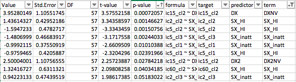

If we use only ADHD_NOS:

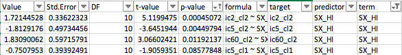

And ADHD only:

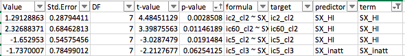

But note that none of the results are in DMN... 5 is cognitive, 2 is DAN, but 60
is visual :( ... 15 is motor... maybe the latter two won't come up as heritable?
Let's see.

But before we go nuts on more permutations, let's see if the results are still
there in regular LM and also non-parametric regressions:

```r
library(nlme)
res = read.csv('~/data/heritability_change/fmri_same_space/melodic_fancy_clusterSlopes.csv')
clu_names = c()
for (i in c(0, 5, 62, 8, 2, 15, 60)) {
    for (n in 1:3) {
        clu_names = c(clu_names, sprintf('ic%d_cl%d', i, n))
    }
}
tract_names = clu_names
m2 = read.csv('~/data/heritability_change/rsfmri_3min_assoc_n462.csv')
m2$famID = m2$Extended.ID...FamilyIDs
idx = is.na(m2$famID)
m2[idx, ]$famID = m2[idx, ]$Nuclear.ID...FamilyIDs

m3 = m2[, c('Medical.Record...MRN', 'famID')]
m4 = unique(m3)
data = merge(res, m4, all.x=T, all.y=F, by.x='ID', by.y='Medical.Record...MRN')
data$sex = as.factor(data$sex)

out_fname = '~/data/heritability_change/assoc_rsfmriClusters_naSlopes227.csv'
predictors = c('SX_inatt', 'SX_HI', 'inatt_baseline', 'HI_baseline', 'DX', 'DX2')
targets = tract_names
hold=NULL
for (i in targets) {
    for (j in predictors) {
        fm_str = sprintf('%s ~ %s + sex', i, j)
        model1<-lm(as.formula(fm_str), data, na.action=na.omit)
        temp<-summary(model1)$coefficients
        a<-as.data.frame(temp)
        a$formula<-fm_str
        a$target = i
        a$predictor = j
        a$term = rownames(temp)
        hold=rbind(hold,a)
    }
}
write.csv(hold, out_fname, row.names=F)

data2 = data[data$DX=='ADHD', ]
out_fname = '~/data/heritability_change/assoc_rsfmriClusters_naSlopes227_dx1.csv'
predictors = c('SX_inatt', 'SX_HI', 'inatt_baseline', 'HI_baseline')
targets = tract_names
hold=NULL
for (i in targets) {
    for (j in predictors) {
        fm_str = sprintf('%s ~ %s + sex', i, j)
        model1<-lm(as.formula(fm_str), data2, na.action=na.omit)
        temp<-summary(model1)$coefficients
        a<-as.data.frame(temp)
        a$formula<-fm_str
        a$target = i
        a$predictor = j
        a$term = rownames(temp)
        hold=rbind(hold,a)
    }
}
write.csv(hold, out_fname, row.names=F)

data2 = data[data$DX2=='ADHD', ]
out_fname = '~/data/heritability_change/assoc_rsfmriClusters_naSlopes227_dx2.csv'
predictors = c('SX_inatt', 'SX_HI', 'inatt_baseline', 'HI_baseline')
targets = tract_names
hold=NULL
for (i in targets) {
    for (j in predictors) {
        fm_str = sprintf('%s ~ %s + sex', i, j)
        model1<-lm(as.formula(fm_str), data2, na.action=na.omit)
        temp<-summary(model1)$coefficients
        a<-as.data.frame(temp)
        a$formula<-fm_str
        a$target = i
        a$predictor = j
        a$term = rownames(temp)
        hold=rbind(hold,a)
    }
}
write.csv(hold, out_fname, row.names=F)
```

Most of the results hold, if not even stronger, with LM:

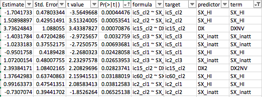

And using ADHDNOS only:

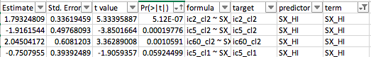

Finally, ADHD DX only:

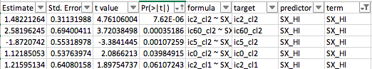

Interesting, pretty much all these results are related to HI, so we'll
definitely need to show it's not correlated to movement variables!

But before we do that, let's check on non-parametric tests. Note that here I'll
remove sex firstm because we cannot use covariates in the other package:

```r
library(mblm)
res = read.csv('~/data/heritability_change/fmri_same_space/melodic_fancy_clusterSlopes.csv')
clu_names = c()
for (i in c(0, 5, 62, 8, 2, 15, 60)) {
    for (n in 1:3) {
        clu_names = c(clu_names, sprintf('ic%d_cl%d', i, n))
    }
}
tract_names = clu_names
m2 = read.csv('~/data/heritability_change/rsfmri_3min_assoc_n462.csv')
m2$famID = m2$Extended.ID...FamilyIDs
idx = is.na(m2$famID)
m2[idx, ]$famID = m2[idx, ]$Nuclear.ID...FamilyIDs

m3 = m2[, c('Medical.Record...MRN', 'famID')]
m4 = unique(m3)
data = merge(res, m4, all.x=T, all.y=F, by.x='ID', by.y='Medical.Record...MRN')
data$sex = as.factor(data$sex)

for (t in tract_names) {
    print(t)
    fm_str = sprintf('%s ~ sex', t)
    res.lm <- lm(as.formula(fm_str), data=data)
    data[, t] = residuals(res.lm)
}

out_fname = '~/data/heritability_change/assoc_NP_rsfmriClusters_naSlopes227.csv'
predictors = c('SX_inatt', 'SX_HI', 'inatt_baseline', 'HI_baseline')
targets = tract_names
hold=NULL
for (i in targets) {
    for (j in predictors) {
        idx = !is.na(data[, i])
        fm_str = sprintf('%s ~ %s', i, j)
        model1 = mblm(as.formula(fm_str), data=data[idx,])
        temp<-summary(model1)$coefficients
        a<-as.data.frame(temp)
        a$formula<-fm_str
        a$target = i
        a$predictor = j
        a$term = rownames(temp)
        hold=rbind(hold,a)
    }
}
write.csv(hold, out_fname, row.names=F)

data2 = data[data$DX=='ADHD', ]
out_fname = '~/data/heritability_change/assoc_NP_rsfmriClusters_naSlopes227_dx1.csv'
predictors = c('SX_inatt', 'SX_HI', 'inatt_baseline', 'HI_baseline')
targets = tract_names
hold=NULL
for (i in targets) {
    for (j in predictors) {
        idx = !is.na(data2[, i])
        fm_str = sprintf('%s ~ %s', i, j)
        model1 = mblm(as.formula(fm_str), data=data2[idx,])
        temp<-summary(model1)$coefficients
        a<-as.data.frame(temp)
        a$formula<-fm_str
        a$target = i
        a$predictor = j
        a$term = rownames(temp)
        hold=rbind(hold,a)
    }
}
write.csv(hold, out_fname, row.names=F)

data2 = data[data$DX2=='ADHD', ]
out_fname = '~/data/heritability_change/assoc_NP_rsfmriClusters_naSlopes227_dx2.csv'
predictors = c('SX_inatt', 'SX_HI', 'inatt_baseline', 'HI_baseline')
targets = tract_names
hold=NULL
for (i in targets) {
    for (j in predictors) {
        idx = !is.na(data2[, i])
        fm_str = sprintf('%s ~ %s', i, j)
        model1 = mblm(as.formula(fm_str), data=data2[idx,])
        temp<-summary(model1)$coefficients
        a<-as.data.frame(temp)
        a$formula<-fm_str
        a$target = i
        a$predictor = j
        a$term = rownames(temp)
        hold=rbind(hold,a)
    }
}
write.csv(hold, out_fname, row.names=F)
```

As usual, non-parametric is all kinds of significant. Maybe I'll need to run
some correlations later? Not sure if I'm trusting this MBLM package that much.

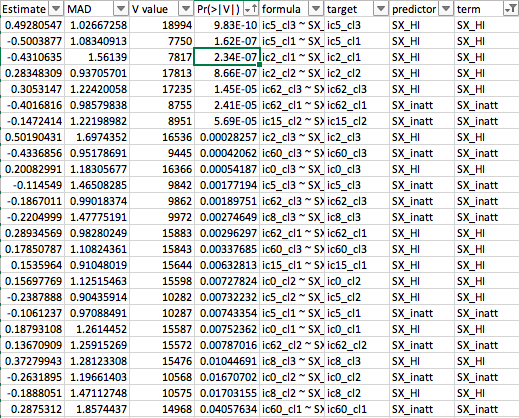

ADHDNOS:

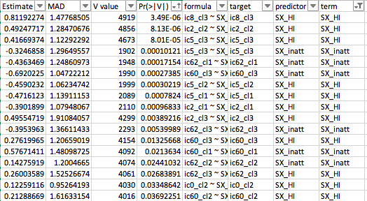

ADHD-only:

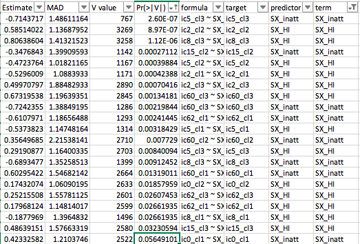

Let's do it using non-parametric correlations, then:

```r
res = read.csv('~/data/heritability_change/fmri_same_space/melodic_fancy_clusterSlopes.csv')
clu_names = c()
for (i in c(0, 5, 62, 8, 2, 15, 60)) {
    for (n in 1:3) {
        clu_names = c(clu_names, sprintf('ic%d_cl%d', i, n))
    }
}
tract_names = clu_names
m2 = read.csv('~/data/heritability_change/rsfmri_3min_assoc_n462.csv')
m2$famID = m2$Extended.ID...FamilyIDs
idx = is.na(m2$famID)
m2[idx, ]$famID = m2[idx, ]$Nuclear.ID...FamilyIDs

m3 = m2[, c('Medical.Record...MRN', 'famID')]
m4 = unique(m3)
data = merge(res, m4, all.x=T, all.y=F, by.x='ID', by.y='Medical.Record...MRN')
data$sex = as.factor(data$sex)

for (t in tract_names) {
    print(t)
    fm_str = sprintf('%s ~ sex', t)
    res.lm <- lm(as.formula(fm_str), data=data)
    data[, t] = residuals(res.lm)
}

out_fname = '~/data/heritability_change/assoc_kendall_rsfmriClusters_naSlopes227.csv'
predictors = c('SX_inatt', 'SX_HI', 'inatt_baseline', 'HI_baseline')
targets = tract_names
hold=NULL
for (i in targets) {
    for (j in predictors) {
        model1 = cor.test(data[, i], data[, j], method='kendall')
        a<-as.vector(model1)
        a$target = i
        a$predictor = j
        hold=rbind(hold,a)
    }
}
write.csv(hold, out_fname, row.names=F)

data2 = data[data$DX=='ADHD', ]
out_fname = '~/data/heritability_change/assoc_kendall_rsfmriClusters_naSlopes227_dx1.csv'
predictors = c('SX_inatt', 'SX_HI', 'inatt_baseline', 'HI_baseline')
targets = tract_names
hold=NULL
for (i in targets) {
    for (j in predictors) {
        model1 = cor.test(data2[, i], data2[, j], method='kendall')
        a<-as.vector(model1)
        a$target = i
        a$predictor = j
        hold=rbind(hold,a)
    }
}
write.csv(hold, out_fname, row.names=F)

data2 = data[data$DX2=='ADHD', ]
out_fname = '~/data/heritability_change/assoc_kendall_rsfmriClusters_naSlopes227_dx2.csv'
predictors = c('SX_inatt', 'SX_HI', 'inatt_baseline', 'HI_baseline')
targets = tract_names
hold=NULL
for (i in targets) {
    for (j in predictors) {
        model1 = cor.test(data2[, i], data2[, j], method='kendall')
        a<-as.vector(model1)
        a$target = i
        a$predictor = j
        hold=rbind(hold,a)
    }
}
write.csv(hold, out_fname, row.names=F)
```

These are much more believable. Still good, though:

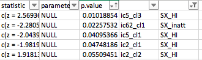

ADHD_NOS:

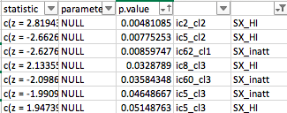

ADHD-only:

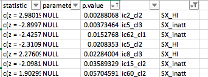

If anything, I can tell I need to run permutations for ICs 5 and 2. I've
constructed the files for IC5 already, so it's just running that, and then IC2.

I'm also working on a run_solar_voxel_range.sh script, which might make
permutations run quite a bit faster...

# 2019-05-23 11:36:18

So, the range script seems to work a bit better. Let's run the IC2 permutations
that way... actually, I ran the IC5 permutations wrong. So, we'll need to start
with those.

When I ran interactivelly, 100 voxels took a little over 20-22min. So, let's see if
we do 30 just to be in the safe side.

```bash
cd ~/data/heritability_change/fmri_same_space/
ic=5;
nperms=200;
nvox=154058;
fname=`printf net%d_p%04d $ic 0`.swarm;
bundle=100;
# generate voxel file for the first perm
cur_vox=1;
while [ $cur_vox -lt $nvox ]; do
    let last_vox=${cur_vox}+${bundle}-1;
    # gets the min
    last_vox=$(($last_vox<$nvox?$last_vox:$nvox))
    echo "bash ~/research_code/run_solar_voxel_range.sh melodic_fancy_slopesClean_n111_IC${ic}_p0000_sexAndBrainShuffled ${cur_vox} ${last_vox}" >> $fname;
    let cur_vox=${last_vox}+1;
done;
# just copy it and rename IC and perm for the other ones
for n in `seq 1 $nperms`; do
    perm=`printf %04d $n`;
    cp $fname `printf net%d_p%04d $ic $n`.swarm;
    sed -i -- "s/p0000/p${perm}/g" `printf net%d_p%04d $ic $n`.swarm;
done

# runs all swarms, but wait until we can do it
for n in `seq 1 $nperms`; do
    jname=`printf net%d_p%04d $ic $n`;
    echo "ERROR" > swarm_wait_${ic}
    while grep -q ERROR swarm_wait_${ic}; do
        echo "Trying $jname"
        swarm --gres=lscratch:1 -f ${jname}.swarm --module solar -g 1 -t 1 \
            --logdir=${jname} --job-name ${jname} -p 2 --partition quick \
            --time=30:00 -b 8 --maxrunning 5 --merge-output 2> swarm_wait_${ic};
        if grep -q ERROR swarm_wait_${ic}; then
            echo -e "\tError, sleeping..."
            sleep 10m;
        fi;
    done;
done
```

# 2019-05-24 09:20:01

With the range script, I need to do a better way of getting local disk space.
With 10 voxels, the directory size was 287Mb. But most of it is the original file.
For 20 voxels it's still 287Mb, as I'm deleting the temporary directories. So, I
estimate about for 100 voxels it'll stay the same now.

Let's use Wolfgang's suggestions and increase the local range:

```bash
cd ~/data/heritability_change/fmri_same_space/
ic=5;
nperms=200;
nvox=154058;
fname=`printf net%d_p%04d $ic 0`.swarm;
bundle=5000;
# generate voxel file for the first perm
cur_vox=1;
while [ $cur_vox -lt $nvox ]; do
    let last_vox=${cur_vox}+${bundle}-1;
    # gets the min
    last_vox=$(($last_vox<$nvox?$last_vox:$nvox))
    echo "bash ~/research_code/run_solar_voxel_range.sh melodic_fancy_slopesClean_n111_IC${ic}_p0000_sexAndBrainShuffled ${cur_vox} ${last_vox}" >> $fname;
    let cur_vox=${last_vox}+1;
done;
# just copy it and rename IC and perm for the other ones
for n in `seq 1 $nperms`; do
    perm=`printf %04d $n`;
    cp $fname `printf net%d_p%04d $ic $n`.swarm;
    sed -i -- "s/p0000/p${perm}/g" `printf net%d_p%04d $ic $n`.swarm;
done

n=1;
jname=`printf net%d_p%04d $ic $n`;
swarm --gres=lscratch:1 -f ${jname}.swarm --module solar -g 1 -t 1 \
    --logdir=${jname} --job-name ${jname} -p 2 \
    --time=36:00:00 --merge-output;
```

And they asked me to set up the jobs with dependencies. So, let's do the next 5
depending on the first one complete:

```bash
ic=5;
cur_id=27364175;
for n in {3..13}; do
    jname=`printf net%d_p%04d $ic $n`;
    job_id=$(swarm --gres=lscratch:1 -f ${jname}.swarm --module solar -g 1 -t 1 \
        --logdir=${jname} --job-name ${jname} -p 2 \
        --time=25:00:00 --merge-output --dependency afterany:$cur_id);
    echo $job_id;
    cur_id=$job_id;
done
```

And same thing for the next one. This way I keep it to only running two at the
same time (for now), but don't waste time over the long weekend:

```bash
ic=5;
cur_id=27364178;
for n in {14..24}; do
    jname=`printf net%d_p%04d $ic $n`;
    job_id=$(swarm --gres=lscratch:1 -f ${jname}.swarm --module solar -g 1 -t 1 \
        --logdir=${jname} --job-name ${jname} -p 2 \
        --time=36:00:00 --merge-output --dependency afterany:$cur_id);
    echo $job_id;
    cur_id=$job_id;
done
```

# 2019-05-28 11:04:16

Under this new way of running voxels in a range, and saving them in individual
tarballs, I ned to change how I'm compiling everything. Basically, instead of
sending the phenotype name to the compilation script, I can send the entire
directory, and do the untarring in lscratch.

```bash
cd /lscratch/${SLURM_JOBID}
i=1;
p=`printf %04d $i`;
phen=melodic_fancy_slopesClean_n111_IC5_p${p}_sexAndBrainShuffled;
mkdir $phen;
cd $phen;
cp ~/data/tmp/$phen/*.out ~/data/tmp/${phen}/*gz .;
tar -zxf *gz;
python ~/research_code/fmri/compile_solar_voxel_results.py \
    /lscratch/${SLURM_JOBID}/ $phen;

for i in {1..50}; do
    p=`printf %04d $i`;
    phen=melodic_fancy_slopesClean_n111_IC5_p${p}_sexAndBrainShuffled
    nzips=`ls -1 ~/data/tmp/$phen/*gz | wc -l`;
    echo $phen $nzips;
done

```

And Wolfgang said I can try 8 concurrent swarms. Let's see how it goes:

```bash
cd ~/data/heritability_change/fmri_same_space/
ic=5;
n=71;
jname=`printf net%d_p%04d $ic $n`;
cur_id=$(swarm --gres=lscratch:1 -f ${jname}.swarm --module solar -g 1 -t 1 \
    --logdir=${jname} --job-name ${jname} -p 2 --time=36:00:00 --merge-output);
for n in {72..75}; do
    jname=`printf net%d_p%04d $ic $n`;
    job_id=$(swarm --gres=lscratch:1 -f ${jname}.swarm --module solar -g 1 -t 1 \
        --logdir=${jname} --job-name ${jname} -p 2 \
        --time=36:00:00 --merge-output --dependency afterany:$cur_id);
    echo $job_id;
    cur_id=$job_id;
done
```

And if we want to run a few more:

```bash
cd ~/data/heritability_change/fmri_same_space/
ic=5;
jstart=100;  # permutation to start with
jdeps=5;  # number of dependent jobs in each swarm
nswarms=4;  # number of independent swarms
for n in `seq 1 $nswarms`; do
    jname=`printf net%d_p%04d $ic $jstart`;
    cur_id=$(swarm --gres=lscratch:1 -f ${jname}.swarm --module solar -g 1 -t 1 \
        --logdir=${jname} --job-name ${jname} -p 2 --time=36:00:00 --merge-output);
    echo "Active swarm: ${jname} (${cur_id})"
    for d in `seq 1 $jdeps`; do
        let jstart=${jstart}+1;
        jname=`printf net%d_p%04d $ic $jstart`;
        job_id=$(swarm --gres=lscratch:1 -f ${jname}.swarm --module solar -g 1 -t 1 \
            --logdir=${jname} --job-name ${jname} -p 2 \
            --time=36:00:00 --merge-output --dependency afterany:$cur_id);
        echo "Dependent swarm: ${jname} (${job_id}, on ${cur_id})"
        cur_id=$job_id;
    done;
    let jstart=${jstart}+1;
done
```

# TODO

* If results are good, make sure there is no correlation between clusters and movement!
* Where are those goos clusters?