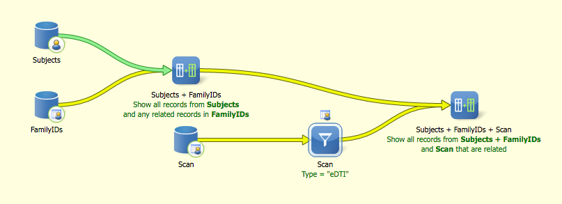

# 2019-05-15 13:34:09

These are the data for Martine. We couldn't send the matching DTI data to the
structural data Philip had sent her before because that data was mostly 1.5T.
So, let's choose based on DTI and then pick the matching Freesurfer to those.

Philip said we can send anyone under 35 y.o., but only cross sectional and one
per family. I think the easiest thing will be to get all our DTI and family IDs,
and take the oldest per family, which will hopefully also be the best quality.
Here, I'll consider only one per extended family as well. So, I start with this
search in Labmatrix:



Note that I decided to go with the TORTOISE pre-processing for this because
we've used more often in previous work. I'm still playing a bit with the FDT
pipeline, especially the failed scans, so we should hold off in using them for
now.

The first thing I did was to figure out who had bene processed already. Esteban
is still working on some of them, which means these are not necessarily the
oldest or the best we'll have. But at the moment, that's true.

So, we end up with a list of 512 mask ids (have_tortoise tab in
dti_for_enigma.xlsx). Now, let's extract the data ENIGMA wants based on the
protocol in their webpage, and then attach the Freesurfer data to that.

First, I'm following the steps from here:
http://enigma.ini.usc.edu/wp-content/uploads/DTI_Protocols/ENIGMA_TBSS_protocol_USC.pdf

Note that I'm not running DTI-TK, because one of the steps in the ENIGMA steps
will be to transform everything into their templates. This way we can go from
subject native space directly to that.

```bash
#caterpie
maskidDir=/mnt/shaw/MR_data_by_maskid/
cd /mnt/shaw/dti_robust_tsa/enigma
for m in `cat ids512.txt`; do
    tensorDir=${maskidDir}/${m}/edti_proc/edti_DMC_DR_R1_SAVE_DTITK/;
    if [ ! -d $tensorDir ]; then
        tensorDir=${maskidDir}/${m}/edti_proc/edti_DMC_R1_SAVE_DTITK/;
        tensorFile=edti_DMC_R1_tensor.nii;
    else
        tensorFile=edti_DMC_DR_R1_tensor.nii;
    fi;
    if [ ! -d $tensorDir ]; then
        echo $tensorDir "does not exist. Skipping..."
    else
        TVtool -in ${tensorDir}/${tensorFile} -fa -out ./${m}_fa.nii;
    fi;
done
```

# 2019-05-16 10:17:31

It turns out that 3 IDs weren't really processed. So, I'm replacing those ids.
They were:

```
2135
2080
2232
2251
```

```bash
#caterpie
cd /mnt/shaw/dti_robust_tsa/enigma
source activate python2
tbss_1_preproc *.nii
tbss_2_reg -t enigmaDTI/ENIGMA_DTI_FA.nii.gz
tbss_3_postreg -S
```

Except that the last command didn't finish running. But at least it applies the
registrations to create the .nii files we need.

Now we need to check registrations. I'll make some pics using my AFNI scripts,
to make life easier.

```bash
# desktop
cd /Volumes/Shaw/dti_robust_tsa/enigma
# make transformation QC figure: the template is the edges! Note that the ENIGMA documentation states that the template might be a big bigger than the actual images.
for m in `cat ids512.txt`; do
    @snapshot_volreg FA/${m}_fa_FA_to_target.nii.gz enigmaDTI/ENIGMA_DTI_FA.nii.gz QC/${m};
done
```

When checking the transformations, I noticed that ids 1025, 2218, 2228, and 2234
were quite poor. So, let's try to replace them by something else when possible.

* 1025 was the only one for that subject
* 2218 became 0743
* 2228 became 0794
* 2234 became 1639

And I re-processed those 3 IDs in caterpie. I'll keep 1025 for now.

I'll follow the recommendations from the documentation and create our own mask:

```bash
#bw
module load fsl
cd /scratch/sudregp/enigma
fslmerge -t ./all_FA_QC ./FA/*FA_to_target.nii.gz;
fslmaths ./all_FA_QC -bin -Tmean -thr 0.9 mean_FA_mask.nii.gz
fslmaths ./enigmaDTI/ENIGMA_DTI_FA.nii.gz -mas ./mean_FA_mask.nii.gz ./mean_FA.nii.gz
fslmaths ./enigmaDTI/ENIGMA_DTI_FA_skeleton.nii.gz -mas ./mean_FA_mask.nii.gz ./mean_FA_skeleton.nii.gz
tbss_4_prestats -0.049
```

Now, the subject by subject step:

```bash
#bw
cd /scratch/sudregp/enigma
for subj in `cat ids512.txt`; do
    echo $subj;
    mkdir -p ./FA_individ/${subj}/stats/;
    mkdir -p ./FA_individ/${subj}/FA/;
    cp ./FA/${subj}_*.nii.gz ./FA_individ/${subj}/FA/;
    fslmaths ./FA_individ/${subj}/FA/${subj}_*FA_to_target.nii.gz \
        -mas ./mean_FA_mask.nii.gz ./FA_individ/${subj}/FA/${subj}_masked_FA.nii.gz
done

for subj in `cat ids512.txt`; do
    echo $subj;
    tbss_skeleton -i ./FA_individ/${subj}/FA/${subj}_masked_FA.nii.gz \
        -p 0.049 ./mean_FA_skeleton_mask_dst \
        ${FSLDIR}/data/standard/LowerCingulum_1mm.nii.gz \
        ./FA_individ/${subj}/FA/${subj}_masked_FA.nii.gz \
        ./FA_individ/${subj}/stats/${subj}_masked_FAskel.nii.gz \
        -s ./mean_FA_skeleton_mask.nii.gz;
done
```

ENIGMA also provided the following script to check the projection distances.
Check the output for outliers!

```bash
# bw
cd /lscratch/$SLURM_JOBID
cp -r /scratch/sudregp/enigma .
cd enigma

# run in a new directory eg. Proj_Dist/
# create a text file containing paths to your masked FA maps
# output in Proj_Dist.txt
# make sure you have FSL5!!!
###### USER INPUTS ###############
## insert main folder where you ran TBSS
## just above "stats/" and "FA/"
maindir="/lscratch/$SLURM_JOBID/enigma/"
list=`find $maindir -wholename "*/FA/*_masked_FA.nii.gz"`

## insert full path to mean_FA, skeleton mask and distance map
mean_FA="/lscratch/$SLURM_JOBID/enigma/mean_FA_mask.nii.gz"
mask="/lscratch/$SLURM_JOBID/enigma/mean_FA_skeleton_mask.nii.gz"
dst_map="/lscratch/$SLURM_JOBID/enigma/mean_FA_skeleton_mask_dst.nii.gz"

##############
### from here it should be working without further adjustments
rm Proj_Dist.txt
echo "ID" "Mean_Squared" "Max_Squared" >> Proj_Dist.txt

## for each FA map
for FAmap in ${list}; do
	base=`echo $FAmap | awk 'BEGIN {FS="/"}; {print $NF}' | awk 'BEGIN {FS="_"}; {print $1}'`
    dst_out="dst_vals_"$base""
 
	# get Proj Dist images
    tbss_skeleton -d -i $mean_FA -p 0.2 $dst_map $FSLDIR/data/standard/LowerCingulum_1mm $FAmap $dst_out
 
	#X direction
	Xout=""squared_X_"$base"
	file=""$dst_out"_search_X.nii.gz"
	fslmaths $file -mul $file $Xout
 
	#Y direction
	Yout=""squared_Y_"$base"
	file=""$dst_out"_search_Y.nii.gz"
	fslmaths $file -mul $file $Yout
 
	#Z direction
    Zout=""squared_Z_"$base"
    file=""$dst_out"_search_Z.nii.gz"
	fslmaths $file -mul $file $Zout
 
	#Overall displacement
	Tout="Total_ProjDist_"$base""
	fslmaths $Xout -add $Yout -add $Zout $Tout
 
	# store extracted distances
	mean=`fslstats -t $Tout -k $mask -m`  
	max=`fslstats -t $Tout -R | awk '{print $2}'`
    echo "$base $mean $max" >> Proj_Dist.txt

    # remove X Y Z images
    ## comment out for debugging
    rm ./dst_vals_*.nii.gz
    rm ./squared_*.nii.gz
 
	echo "file $Tout done"
done
```

Now, we follow the tutotial to extract ROI values:

http://enigma.ini.usc.edu/wp-content/uploads/DTI_Protocols/ENIGMA_ROI_protocol_USC.pdf

```bash
#bw
cd /lscratch/$SLURM_JOBID
cp -r /scratch/sudregp/enigma .
cd enigma
#part 1 - loop through all subjects to create a subject ROI file
mkdir ENIGMA_ROI_part1
cd ROIextraction_info
dirO1=../ENIGMA_ROI_part1/

for subject in `cat ../ids512.txt`; do
    ./singleSubjROI_exe ENIGMA_look_up_table.txt ../mean_FA_skeleton.nii.gz \
        JHU-WhiteMatter-labels-1mm.nii.gz ${dirO1}/${subject}_ROIout \
        ../FA_individ/${subject}/stats/${subject}_masked_FAskel.nii.gz
done

#part 2 - loop through all subjects to create ROI file removing ROIs not of interest and averaging others
#make an output directory for all files
mkdir ../ENIGMA_ROI_part2
dirO2=../ENIGMA_ROI_part2/

rm ./subjectList.csv

for subject in `cat ../ids512.txt`; do
    ./averageSubjectTracts_exe ${dirO1}/${subject}_ROIout.csv ${dirO2}/${subject}_ROIout_avg.csv
    echo ${subject},${dirO2}/${subject}_ROIout_avg.csv >> ./subjectList.csv
done
```

# 2019-06-14 10:30:07

I finally updated the Excel spreadsheet to contain only the 512 IDs we're
sending (dti_sent tab). So, now we can run the last part of the script!

But before we do that, I didn't save all the files I needed from scratch, so
let's make sure we ran it correctly, this time locally:

```bash
# desktop
cd ~/tmp/enigma
# copy all original _fa.nii files here from /Volumes/Labs/dti_robust_tsa/enigma/origdata/, then...
tbss_1_preproc *.nii
tbss_2_reg -t enigmaDTI/ENIGMA_DTI_FA.nii.gz
tbss_3_postreg -S

fslmerge -t ./all_FA_QC ./FA/*FA_to_target.nii.gz;
fslmaths ./all_FA_QC -bin -Tmean -thr 0.9 mean_FA_mask.nii.gz
fslmaths ./enigmaDTI/ENIGMA_DTI_FA.nii.gz -mas ./mean_FA_mask.nii.gz ./mean_FA.nii.gz
fslmaths ./enigmaDTI/ENIGMA_DTI_FA_skeleton.nii.gz -mas ./mean_FA_mask.nii.gz ./mean_FA_skeleton.nii.gz
tbss_4_prestats -0.049
```

Now, the subject by subject step:

```bash
cd ~/tmp/enigma
for subj in `cat ids512.txt`; do
    echo $subj;
    mkdir -p ./FA_individ/${subj}/stats/;
    mkdir -p ./FA_individ/${subj}/FA/;
    cp ./FA/${subj}_*.nii.gz ./FA_individ/${subj}/FA/;
    fslmaths ./FA_individ/${subj}/FA/${subj}_*FA_to_target.nii.gz \
        -mas ./mean_FA_mask.nii.gz ./FA_individ/${subj}/FA/${subj}_masked_FA.nii.gz
done

for subj in `cat ids512.txt`; do
    echo $subj;
    tbss_skeleton -i ./FA_individ/${subj}/FA/${subj}_masked_FA.nii.gz \
        -p 0.049 ./stats/mean_FA_skeleton_mask_dst \
        ${FSLDIR}/data/standard/LowerCingulum_1mm.nii.gz \
        ./FA_individ/${subj}/FA/${subj}_masked_FA.nii.gz \
        ./FA_individ/${subj}/stats/${subj}_masked_FAskel.nii.gz \
        -s ./stats/mean_FA_skeleton_mask.nii.gz;
done
```

And the ROI step too:

```bash
# has to run in Linux!

cd /mnt/shaw/enigma_dti_share
#part 1 - loop through all subjects to create a subject ROI file
mkdir ENIGMA_ROI_part1
cd ROIextraction_info
dirO1=../ENIGMA_ROI_part1/

for subject in `cat ../dti.txt`; do
    ./singleSubjROI_exe ENIGMA_look_up_table.txt ../mean_FA_skeleton.nii.gz \
        JHU-WhiteMatter-labels-1mm.nii.gz ${dirO1}/${subject}_ROIout \
        ../FA_individ/${subject}/stats/${subject}_masked_FAskel.nii.gz
done

#part 2 - loop through all subjects to create ROI file removing ROIs not of interest and averaging others
#make an output directory for all files
mkdir ../ENIGMA_ROI_part2
dirO2=../ENIGMA_ROI_part2/

rm ./subjectList.csv

for subject in `cat ../dti.txt`; do
    ./averageSubjectTracts_exe ${dirO1}/${subject}_ROIout.csv ${dirO2}/${subject}_ROIout_avg.csv
    echo ${subject},${dirO2}/${subject}_ROIout_avg.csv >> ./subjectList.csv
done

## part 3 - combine all 
#######
Table=../subject_info.csv
subjectIDcol=SubjectID
subjectList=./subjectList.csv
outTable=./combinedROItable.csv
Ncov=2
covariates="Age;Sex"
Nroi="all" #2
rois="all" #IC;EC"

# back in Desktop
cd /Volumes/Labs/enigma_dti_share/ROIextraction_info
#Run the R code
# Rscript --vanilla --no-save --slave --args ${Table} ${subjectIDcol} ${subjectList} ${outTable} ${Ncov} ${covariates} ${Nroi} ${rois} <  ./combine_subject_tables.R 
# I ended up running just the script after hard coding the variables:
Rscript --vanilla ./combine_subject_tables.R 
```

The final file is FULL_ROItable.csv in
/Volumes/Labs/enigma_dti_share/ROIextraction_info

And let's run the ProjDist part again, because it didn't finish running last
time:

```bash
# bw
cd ~/tmp/enigma

## insert main folder where you ran TBSS
## just above "stats/" and "FA/"
maindir="/Users/sudregp/tmp/enigma/"
list=`find $maindir -wholename "*/FA/*_masked_FA.nii.gz"`

## insert full path to mean_FA, skeleton mask and distance map
mean_FA="$maindir/mean_FA_mask.nii.gz"
mask="$maindir/stats/mean_FA_skeleton_mask.nii.gz"
dst_map="/$maindir/stats/mean_FA_skeleton_mask_dst.nii.gz"

##############
### from here it should be working without further adjustments
rm Proj_Dist.txt
echo "ID" "Mean_Squared" "Max_Squared" >> Proj_Dist.txt

## for each FA map
for FAmap in ${list}; do
	base=`echo $FAmap | awk 'BEGIN {FS="/"}; {print $NF}' | awk 'BEGIN {FS="_"}; {print $1}'`
    dst_out="dst_vals_"$base""
 
	# get Proj Dist images
    tbss_skeleton -d -i $mean_FA -p 0.2 $dst_map $FSLDIR/data/standard/LowerCingulum_1mm $FAmap $dst_out
 
	#X direction
	Xout=""squared_X_"$base"
	file=""$dst_out"_search_X.nii.gz"
	fslmaths $file -mul $file $Xout
 
	#Y direction
	Yout=""squared_Y_"$base"
	file=""$dst_out"_search_Y.nii.gz"
	fslmaths $file -mul $file $Yout
 
	#Z direction
    Zout=""squared_Z_"$base"
    file=""$dst_out"_search_Z.nii.gz"
	fslmaths $file -mul $file $Zout
 
	#Overall displacement
	Tout="Total_ProjDist_"$base""
	fslmaths $Xout -add $Yout -add $Zout $Tout
 
	# store extracted distances
	mean=`fslstats -t $Tout -k $mask -m`  
	max=`fslstats -t $Tout -R | awk '{print $2}'`
    echo "$base $mean $max" >> Proj_Dist.txt

    # remove X Y Z images
    ## comment out for debugging
    rm ./dst_vals_*.nii.gz
    rm ./squared_*.nii.gz
 
	echo "file $Tout done"
done
```

## Structural

I also told Martine I'd send her the structural values for these same scans.
Hare we go, following the ENIGMA pipeline.

```bash
out_file=~/tmp/enigma/LandRvolumes.csv
cd /Volumes/Labs/freesurfer5.3_subjects/
echo "SubjID,Lthal,Rthal,Lcaud,Rcaud,Lput,Rput,Lpal,Rpal,Lhippo,Rhippo,Lamyg,Ramyg,Laccumb,Raccumb,ICV" > $out_file
for subj_id in `cat ~/tmp/enigma/fs.txt`; do
    echo $subj_id
    printf "%s,"  "${subj_id}" >> $out_file
    for x in Left-Thalamus-Proper Right-Thalamus-Proper Left-Caudate Right-Caudate Left-Putamen Right-Putamen Left-Pallidum Right-Pallidum Left-Hippocampus Right-Hippocampus Left-Amygdala Right-Amygdala Left-Accumbens-area Right-Accumbens-area; do
        printf "%g," `grep  ${x} ${subj_id}/stats/aseg.stats | awk '{print $4}'` >> $out_file
    done
    printf "%g" `cat ${subj_id}/stats/aseg.stats | grep IntraCranialVol | awk -F, '{print $4}'` >> $out_file
    echo "" >> $out_file
done

# change the script from the enigma website to loop through IDs in our list
bash ~/tmp/enigma/extract.sh
mv CorticalMeasuresENIGMA_SurfAvg.csv CorticalMeasuresENIGMA_ThickAvg.csv \
    ~/tmp/enigma/
 ```

# 2019-08-01 14:12:21

I asked Sam to help out figuring out who can be sent.

Now we just need to trim the DTI and Freesurfer files to include only the IDs we
can send, and then maybe add DX?

# 2019-08-06 16:42:35

Merging everything after Sam helped out grabbing the neuropsych data:

```r
# all in shaw/enigma_dti_share
mrn2enigma = read.table('mrn2enigma.txt', header=1)
maskid2mrn = read.table('mrn2maskid.txt', header=1)
fs = read.csv('CorticalMeasuresENIGMA_SurfAvg.csv')
m = merge(maskid2mrn, fs, by.x='maskid_fs', by.y='SubjID', all.y=F)
m = merge(mrn2enigma, m, by.x='MRN', by.y='MRN', all.y=F)
write.csv(m, file='enigma_CorticalMeasuresENIGMA_SurfAvg.csv', row.names=F)

fs = read.csv('CorticalMeasuresENIGMA_ThickAvg.csv')
m = merge(maskid2mrn, fs, by.x='maskid_fs', by.y='SubjID', all.y=F)
m = merge(mrn2enigma, m, by.x='MRN', by.y='MRN', all.y=F)
write.csv(m, file='enigma_CorticalMeasuresENIGMA_ThickAvg.csv', row.names=F)

proj = read.table('Proj_Dist.txt', header=1)
rois = read.csv('ROIextraction_info/FULL_ROItable.csv')
dti = merge(proj, rois, by.x='ID', by.y='subjectID')
m = merge(maskid2mrn, dti, by.x='maskid_dti', by.y='ID', all.y=F)
m = merge(mrn2enigma, m, by.x='MRN', by.y='MRN', all.y=F)
write.csv(m, file='enigma_DTI_ROIsAndProjDists.csv', row.names=F)
# then remove all superfluous columns manually!
```

# 2020-09-04 10:52:14

Finally getting back to this, let's run the other DTI properties for Martine,
following
http://enigma.ini.usc.edu/protocols/dti-protocols/enigma-dti-diffusivity-protocol/:

