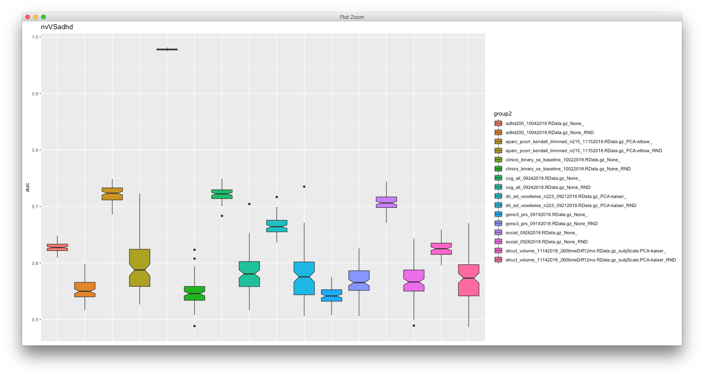
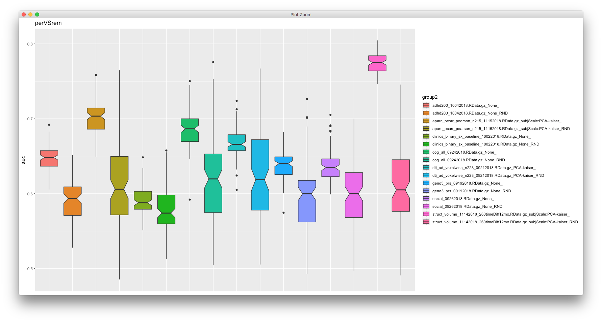
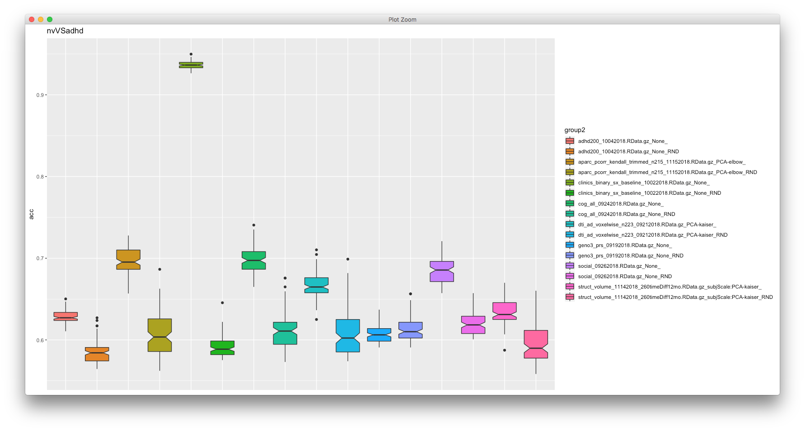
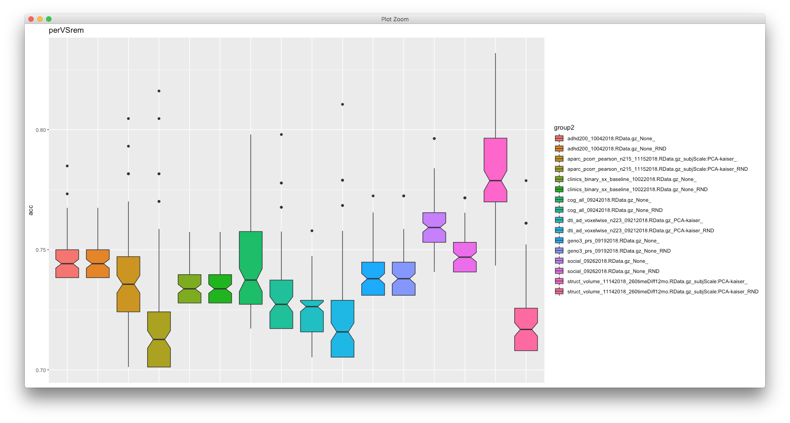

# 2019-03-19 15:46:57

Just summarizing our previous ML results. The overall approach after much trial
and error, was to use the cross-validation results for the leaderboard (i.e.
ranking the different models). This also allows us to do some data transforms in
the entire dataset, such as PCA, and the goal was to test the model in a complete
separate dataset anyways. But even the current results are quite pure in terms of
validation:

As for methods, although I had started by evaluating all the options in H2O
autoML module, it became clear fairly quickly that the deep network results were
way better than the others. So, I focused on those instead. I also turned off
stacked learners, as they were often not outperforming the single models.

Both volume and DTI data are single-voxel, and rsFMRI is a ROI-to-RO correlation
matrix. All other domains have their individual variables listed (i.e. no other
transformations).

The best results I could find had been previously summarized in these AUC pictures:

And now we do accuracy as well:

Each pair of consecutive bar in the plots show a data domain and its
corresponding results using random data. We can see that in most cases we do
considerably better using the actual data, which is good.

For these boxplots (from ggplot's documentation): The lower and upper hinges
correspond to the first and third quartiles (the 25th and 75th percentiles). The
whiskers extend from the hinge to the largest/smallest value no further than
1.5*IQR from the hinge (where IQR is the inter-quartile range, or distance
between the first and third quartiles). Data beyond the end of the whiskers are
called "outlying" points and are plotted individually. The notches extend
1.58*IQR / sqrt(n). This gives a roughly 95% confidence interval for comparing
medians. If notches don't overlap, it suggests that the medians are
significantly different.

A few things to point out in the bar plots:

* each dataset has a different number of subjects, as there was no imputation
  and results combining data across domains weren't great.
* adhd200 uses the variables that did best in the challenge (age, sex, IQ, and handedness)
* it makes sense that the baseline binary symptoms would have nearly perfect
  nvVSadhd classification, but poor perVSrem.
* we do get some decent AUC values for nvVSadhd besides that, such as rsFMRI
  (aparc), neuropsych (cog), and social/demographic metrics (social), all above
  .7
* for perVSrem we also get some interesting results, especially for rsFMRI and volume.

There is **A TON** of things that we can do to improve these results, and I have
lots of notes on things we discussed on it. Let me know if it's helpful for the
document and I'll summarize them here.

# 2019-03-21 13:02:47

Philip said he's only interest on methods. So, here's the idea:

We will start by developing models within data-domains. Specifically, separate
models will be trained to predict ADHD-related variables (e.g. diagnosis,
symptoms) within structural brain images, white-matter anatomical estimates, and
functional connectivity (resting state) data. There will also be separate models
to predict ADHD-related variables from SNP data, neurocognitive behavioral
tests, and socio-economic variables. This approach gives us an idea of the
predictive power of each data domain. Domain-specific predictions will be
combined using a weighted majority voting scheme.

We will employ two different types of models in this analysis: linear and
nonlinear. For prediction of continuous variables, we will use elastic nets and
a gradient boosting regressor. For dichotomous classification, we will use a
linear support vector machine and a gradient boosting classifier. This approach
allows for testing whether more complex (nonlinear) models can derive useful
relationships in the data.

In order to produce generalizable models that are not
overfit to our data, for each data domain we will first split the dataset into training and
validation set. We will perform feature selection and model hyperparameter
tuning through cross-validation inside the training set only. The validation set
will be used solely to provide an estimate of the accuracy of the predictions of
the best trained model.
