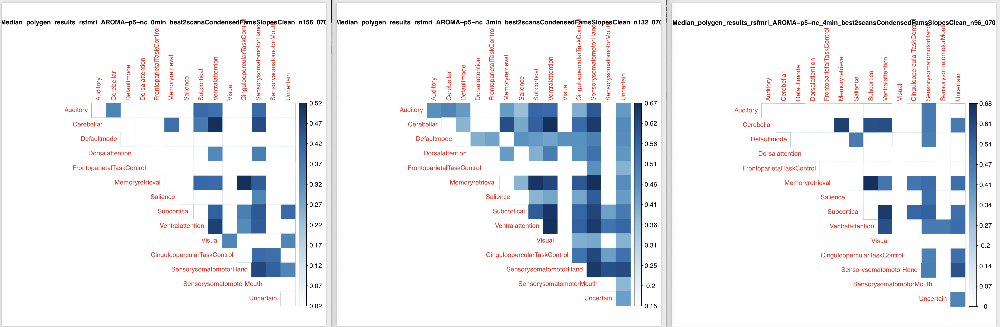
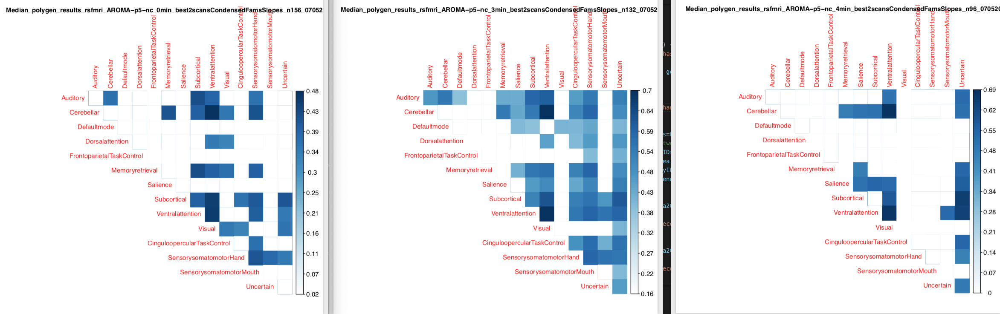
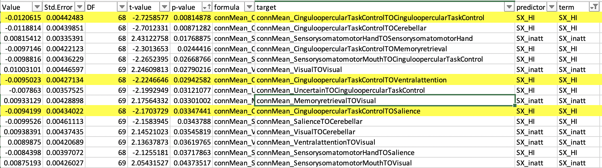
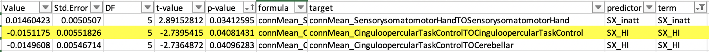
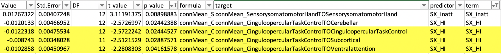

# 2019-06-21 10:08:51

Let's give the first try with the AROMA pipelines in predicting heritability of
change. Luke and I ran regular AROMA and also AROMA+GSR for no threshold, then
.25 and .5mm, so we have a total of 6 pipelines to test. I'll start with the
actual connectivity matrix in the Power atlas, and then try other metrics, like
Luke's metrics or even MELODIC later. The data already comes out in the same
space, and it would be a nice parallel to the DTI voxelwise work.

Philip suggested doing the 2 best timepoints for each subject, and keep it the
same across pipelines. This way we don't deal with the issue of age change
across pipelines. To do that, we first need to compile a metric of how good the
scan is. I'll go with the percentage of spikes in the most stringent threshold
(.25) for now.

In other words, for all scans processed, grab the longitudinal ones, remove
anything with people >= 26, and pick the 2 best with at least 6 months between
them.

```r
a = read.csv('~/data/heritability_change/resting_demo_06212019.csv')
# remove adults and subjects with a single scan. This way we make sure everything for this study was processed
a = a[a$age_at_scan < 18, ]
idx = which(table(a$Medical.Record...MRN)>1)
long_subjs = names(table(a$Medical.Record...MRN))[idx]
keep_me = c()
for (m in 1:nrow(a)) {
    if (a[m, ]$Medical.Record...MRN %in% long_subjs) {
        keep_me = c(keep_me, m)
    }
}
a = a[keep_me,]
a = a[a$processed_AROMA == 'TRUE', ]

outliers = c()
# reading quality metric for all scans
for (m in a$Mask.ID) {
    fname = sprintf('/data/NCR_SBRB/tmp/p25/sub-%04d/sub-%04d_quality.csv', m, m)
    qual = read.csv(fname)
    outliers = c(outliers, qual$pctSpikesFD)
}
a$outliers = outliers

# we should also determine whether we're keeping only scans with a certain amount of time...
#
#

# keeping only subjects with two or more scans, at least 6 months in between scans
keep_me = c()
for (s in unique(a$Medical.Record...MRN)) {
    subj_scans = a[a$Medical.Record...MRN==s, ]
    dates = as.Date(as.character(subj_scans$"record.date.collected...Scan"),
                                 format="%m/%d/%Y")
    if (length(dates) >= 2) {
        best_scans = sort(subj_scans$outliers, index.return=T)
        # make sure there is at least 6 months between scans
        next_scan = 2
        while ((abs(dates[best_scans$ix[next_scan]] - dates[best_scans$ix[1]]) < 180) &&
                (next_scan < length(dates))) {
            next_scan = next_scan + 1
        }
        if (abs(dates[best_scans$ix[next_scan]] - dates[best_scans$ix[1]]) > 180) {
            idx1 = best_scans$ix[1]
            keep_me = c(keep_me, which(a$Mask.ID == subj_scans[idx1, 'Mask.ID']))
            idx2 = best_scans$ix[next_scan]
            keep_me = c(keep_me, which(a$Mask.ID == subj_scans[idx2, 'Mask.ID']))
        }
    }
}
a2 = a[keep_me, ]
print(sprintf('From %d to %d scans', nrow(a), nrow(a2)))
```

So, that's the people with 2 scans, but now let's see how many are in the same
families so we can run heritability:

```r
# make sure every family has at least two people
good_nuclear = names(table(a2$Nuclear.ID...FamilyIDs))[table(a2$Nuclear.ID...FamilyIDs) >= 4]
good_extended = names(table(a2$Extended.ID...FamilyIDs))[table(a2$Extended.ID...FamilyIDs) >= 4]
keep_me = c()
for (f in good_nuclear) {
    keep_me = c(keep_me, a2[which(a2$Nuclear.ID...FamilyIDs == f),
                            'Medical.Record...MRN'])
}
for (f in good_extended) {
    keep_me = c(keep_me, a2[which(a2$Extended.ID...FamilyIDs == f),
                            'Medical.Record...MRN'])
}
keep_me = unique(keep_me)

fam_subjs = c()
for (s in keep_me) {
    fam_subjs = c(fam_subjs, which(a2[, 'Medical.Record...MRN'] == s))
}
a3 = a2[fam_subjs, ]

# write.csv(a3, file='~/data/heritability_change/rsfmri_3min_assoc_n462.csv',
#           row.names=F)
```

OK, so we're down to 326 scans (163 subjects). But it's likely that not all
scans finished properly for a given scrubbing. So, we'll need to remove anyone
that didn't properly finish.

For association, we're at 612 scans (306 kids).

We start by collecting the fMRI correlation tables:

```r
nconn = 34716
data = matrix(nrow=nrow(a2), ncol=nconn)
for (m in 1:nrow(data)) {
    fname = sprintf('/data/NCR_SBRB/tmp/p25/sub-%04d/fcon/power264/sub-%04d_power264_network.txt',
                    a2[m,]$Mask.ID, a2[m,]$Mask.ID)
    if (file.exists(fname)) {
        data[m, ] = read.table(fname)[,1]
    }
}
data = cbind(a2$Mask.ID, data)
na_conns = rowSums(is.na(data))
data = data[na_conns < nconn, ]
colnames(data) = c('Mask.ID', sapply(1:nconn, function(x) sprintf('conn%d', x)))
# merge the data so that we can again only keep subjects that have 2 scans
m = merge(a2, data, by='Mask.ID', all.x=F)
idx = which(table(m$Medical.Record...MRN)>1)
long_subjs = names(table(m$Medical.Record...MRN))[idx]
keep_me = c()
mymrns = m$Medical.Record...MRN
for (i in 1:nrow(m)) {
    if (mymrns[i] %in% long_subjs) {
        keep_me = c(keep_me, i)
    }
}
m = m[keep_me,]
```

But we should also impose time thresholds for all scans, like 3min and 4min.
Let's see what our numbers look like then:

```r
pipelines = c('', '_p5', '_p25', '-GSR', '-GSR_p5', '-GSR_p25')
at_least_mins = c(0, 3, 4)  # needs to have at least these minutes of data

a = read.csv('~/data/heritability_change/resting_demo_06262019.csv')
cat(sprintf('Starting from %d scans\n', nrow(a)))
# remove adults and subjects with a single scan. This way we make sure everything for this study was processed
a = a[a$age_at_scan < 18, ]
cat(sprintf('Down to %d to keep < 18 only\n', nrow(a)))
a = a[a$processed_AROMA == 'TRUE', ]
cat(sprintf('Down to %d to keep only scans that have been processed\n', nrow(a)))
idx = which(table(a$Medical.Record...MRN)>1)
long_subjs = names(table(a$Medical.Record...MRN))[idx]
keep_me = c()
for (m in 1:nrow(a)) {
    if (a[m, ]$Medical.Record...MRN %in% long_subjs) {
        keep_me = c(keep_me, m)
    }
}
a = a[keep_me,]
cat(sprintf('Down to %d to keep only subjects with more than 1 scan\n', nrow(a)))
for (p in pipelines) {
    pipe_dir = sprintf('/data/NCR_SBRB/xcpengine_output_AROMA%s/', p)
    cat(sprintf('Reading quality data from %s\n', pipe_dir))
    outliers = c()
    goodness = c()
    # reading quality metric for all scans
    for (m in a$Mask.ID) {
        fname = sprintf('%s/sub-%04d/sub-%04d_quality.csv', pipe_dir, m, m)
        qual = read.csv(fname)
        if (sum(names(qual)=='nVolCensored') == 0) {
            outliers = c(outliers, 0)
        }
        else {
            outliers = c(outliers, qual$nVolCensored)
        }
        # need to use a quality metric that works in all pipelines, regardless of censoring!
        if (sum(names(qual)=='relMeanRMSMotion') == 0) {
            cat(sprintf('WARNING!!! No relMeanRMSMotion for scan %04d!\n', m))
            goodness = c(goodness, 1000)
        }
        else {
            goodness = c(goodness, qual$relMeanRMSMotion)
        }
    }
    a$outliers = outliers
    a$goodness = goodness

    cat('Loading connectivity data...\n')
    nconn = 34716
    data = matrix(nrow=nrow(a), ncol=nconn)
    for (m in 1:nrow(data)) {
        fname = sprintf('%s/sub-%04d/fcon/power264/sub-%04d_power264_network.txt',
                        pipe_dir, a[m,]$Mask.ID, a[m,]$Mask.ID)
        if (file.exists(fname)) {
            data[m, ] = read.table(fname)[,1]
        }
    }
    data = cbind(a$Mask.ID, data)
    # remove scans that are NAs for all connections
    na_conns = rowSums(is.na(data))
    colnames(data) = c('Mask.ID', sapply(1:nconn, function(x) sprintf('conn%d', x)))

    data = data[na_conns < nconn, ]
    # only keep scans with at least some amount of time
    for (min_time in at_least_mins) {
        uncensored_time = (125 - a$outliers) * 2.5 / 60
        aGood = a[uncensored_time > min_time, ]
        cat(sprintf('\tDown to %d scans with good %d minutes\n', nrow(aGood),
                                                                 min_time))

        # merge the data so we can remove subjects with not enough time DOF
        m = merge(aGood, data, by='Mask.ID', all.x=T)
        cat(sprintf('\t\tDown to %d scans with connectivity data\n', nrow(m)))

        # keeping only the two best scans for each subject, at least 6 months apart
        keep_me = c()
        for (s in unique(m$Medical.Record...MRN)) {
            subj_scans = m[m$Medical.Record...MRN==s, ]
            dates = as.Date(as.character(subj_scans$"record.date.collected...Scan"),
                                        format="%m/%d/%Y")
            if (length(dates) >= 2) {
                best_scans = sort(subj_scans$goodness, index.return=T)
                # make sure there is at least 6 months between scans
                next_scan = 2
                while ((abs(dates[best_scans$ix[next_scan]] - dates[best_scans$ix[1]]) < 180) &&
                        (next_scan < length(dates))) {
                    next_scan = next_scan + 1
                }
                if (abs(dates[best_scans$ix[next_scan]] - dates[best_scans$ix[1]]) > 180) {
                    idx1 = best_scans$ix[1]
                    keep_me = c(keep_me, which(m$Mask.ID == subj_scans[idx1, 'Mask.ID']))
                    idx2 = best_scans$ix[next_scan]
                    keep_me = c(keep_me, which(m$Mask.ID == subj_scans[idx2, 'Mask.ID']))
                }
            }
        }
        a2Good = m[keep_me, ]
        cat(sprintf('\t\tDown to %d scans only keeping two best ones 6-mo apart\n',
                    nrow(a2Good)))

        good_na_conns = rowSums(is.na(a2Good))
        for (sc in which(good_na_conns > 1500)) {
            cat(sprintf('WARNING!!! Scan %04d has %d uncovered connections (%.2f %%)\n',
                        a2Good[sc, 'Mask.ID'], good_na_conns[sc], good_na_conns[sc]/nconn*100))
        }

        fname = sprintf('~/data/heritability_change/rsfmri_AROMA%s_%dmin_best2scans.csv',
                        p, min_time)
        write.csv(a2Good, file=fname, row.names=F, na='', quote=F)
        # make sure every family has at least two people
        idx = table(a2Good$Nuclear.ID...FamilyIDs) >= 4
        good_nuclear = names(table(a2Good$Nuclear.ID...FamilyIDs))[idx]
        idx = table(a2Good$Extended.ID...FamilyIDs) >= 4
        good_extended = names(table(a2Good$Extended.ID...FamilyIDs))[idx]
        keep_me = c()
        for (f in good_nuclear) {
            keep_me = c(keep_me, a2Good[which(a2Good$Nuclear.ID...FamilyIDs == f),
                                    'Medical.Record...MRN'])
        }
        for (f in good_extended) {
            keep_me = c(keep_me, a2Good[which(a2Good$Extended.ID...FamilyIDs == f),
                                    'Medical.Record...MRN'])
        }
        keep_me = unique(keep_me)

        fam_subjs = c()
        for (s in keep_me) {
            fam_subjs = c(fam_subjs, which(a2Good[, 'Medical.Record...MRN'] == s))
        }
        a2GoodFam = a2Good[fam_subjs, ]
        cat(sprintf('\t\tDown to %d scans only keeping families\n',
                    nrow(a2GoodFam)))
        fname = sprintf('~/data/heritability_change/rsfmri_AROMA%s_%dmin_best2scansFams.csv',
                        p, min_time)
        write.csv(a2GoodFam, file=fname, row.names=F, na='', quote=F)
    }
}
```

# 2019-06-26 13:48:45

Let's compute the deltas and start running some heritability stuff, at least
with the non-scrubbed data.

```r
source('~/research_code/lab_mgmt/merge_on_closest_date.R')
m = read.csv('~/data/heritability_change/rsfmri_AROMA_0min_best2scans.csv')
df_var_names = colnames(m)[!grepl(colnames(m), pattern="conn")]
clin = read.csv('~/data/heritability_change/clinical_06262019.csv')
df = mergeOnClosestDate(m[, df_var_names], clin, unique(m$Medical.Record...MRN),
                         x.date='record.date.collected...Scan',
                         x.id='Medical.Record...MRN')
brain_var_names = colnames(m)[grepl(colnames(m), pattern="conn")]
df2 = merge(df, m[, c('Mask.ID', brain_var_names)], by='Mask.ID', all.x=F)

# make sure we still have two scans for everyone
rm_subjs = names(which(table(df2$Medical.Record...MRN)<2))
rm_me = df2$Medical.Record...MRN %in% rm_subjs
df2 = df2[!rm_me, ]

mres = df2
mres$SX_HI = as.numeric(as.character(mres$SX_hi))
mres$SX_inatt = as.numeric(as.character(mres$SX_inatt))

res = c()
for (s in unique(mres$Medical.Record...MRN)) {
    idx = which(mres$Medical.Record...MRN == s)
    row = c(s, unique(mres[idx, 'Sex']))
    phen_cols = c(brain_var_names, 'SX_inatt', 'SX_HI')
    y = mres[idx[2], phen_cols] - mres[idx[1], phen_cols]
    x = mres[idx[2], 'age_at_scan'] - mres[idx[1], 'age_at_scan']
    slopes = y / x
    row = c(row, slopes)

    # grabbing inatt and HI at baseline
    base_DOA = which.min(mres[idx, 'age_at_scan'])
    row = c(row, mres[idx[base_DOA], 'SX_inatt'])
    row = c(row, mres[idx[base_DOA], 'SX_HI'])
    # DX1 is DSMV definition, DX2 will make SX >=4 as ADHD
    if (mres[idx[base_DOA], 'age_at_scan'] < 16) {
        if ((row[length(row)] >= 6) || (row[length(row)-1] >= 6)) {
            DX = 'ADHD'
        } else {
            DX = 'NV'
        }
    } else {
        if ((row[length(row)] >= 5) || (row[length(row)-1] >= 5)) {
            DX = 'ADHD'
        } else {
            DX = 'NV'
        }
    }
    if ((row[length(row)] >= 4) || (row[length(row)-1] >= 4)) {
        DX2 = 'ADHD'
    } else {
        DX2 = 'NV'
    }
    row = c(row, DX)
    row = c(row, DX2)
    res = rbind(res, row)
    print(nrow(res))
}
colnames(res) = c('ID', 'sex', brain_var_names, c('SX_inatt', 'SX_HI',
                                              'inatt_baseline',
                                              'HI_baseline', 'DX', 'DX2'))
# we only open this in R, so it's OK to be RData to load faster
fname = sprintf('~/data/heritability_change/rsfmri_AROMA%s_%dmin_best2scansSlopes_n%d.RData',
                        p, min_time, nrow(res))
save(res, file=fname)

# and remove outliers
res_clean = res
for (t in brain_var_names) {
    mydata = as.numeric(res_clean[, t])
    # identifying outliers
    ul = mean(mydata) + 3 * sd(mydata)
    ll = mean(mydata) - 3 * sd(mydata)
    bad_subjs = c(which(mydata < ll), which(mydata > ul))

    # remove within-variable outliers
    res_clean[bad_subjs, t] = NA
}
fname = sprintf('~/data/heritability_change/rsfmri_AROMA%s_%dmin_best2scansSlopesClean_n%d.RData',
                        p, min_time, nrow(res_clean))
save(res_clean, file=fname)

# and make sure every family has at least two people
good_nuclear = names(table(m$Nuclear.ID...FamilyIDs))[table(m$Nuclear.ID...FamilyIDs) >= 4]
good_extended = names(table(m$Extended.ID...FamilyIDs))[table(m$Extended.ID...FamilyIDs) >= 4]
keep_me = c()
for (f in good_nuclear) {
    keep_me = c(keep_me, m[which(m$Nuclear.ID...FamilyIDs == f),
                            'Medical.Record...MRN'])
}
for (f in good_extended) {
    keep_me = c(keep_me, m[which(m$Extended.ID...FamilyIDs == f),
                            'Medical.Record...MRN'])
}
keep_me = unique(keep_me)

fam_subjs = c()
for (s in keep_me) {
    fam_subjs = c(fam_subjs, which(res[, 'ID'] == s))
}
res2 = res[fam_subjs, ]
res2_clean = res_clean[fam_subjs, ]

fname = sprintf('~/data/heritability_change/rsfmri_AROMA%s_%dmin_best2scansFamsSlopes_n%d.csv',
                        p, min_time, nrow(res2))
write.csv(res2, file=fname, row.names=F, na='', quote=F)
fname = sprintf('~/data/heritability_change/rsfmri_AROMA%s_%dmin_best2scansFamsSlopesClean_n%d.csv',
                        p, min_time, nrow(res2_clean))
write.csv(res2_clean, file=fname, row.names=F, na='', quote=F)

# just need to run this once...
write.table(brain_var_names, file='~/data/heritability_change/power264_conns.txt',
            col.names=F, row.names=F, quote=F)
```

Then, I need to run the same thing for GSR and the other pipelines...

Finally, we do some SOLAR analysis just to see what's going on.

```bash
# bw interactive
module load solar
bash ~/research_code/run_solar_parallel.sh \
    rsfmri_AROMA_0min_best2scansFamsSlopesClean_n163_06262019 \
    ~/data/heritability_change/power264_conns.txt
```

# 2019-06-27 10:21:51

And we can run it somewhat smoothly if we batch it:

```bash
cd ~/data/heritability_change/
rm swarm.aroma
for f in `/bin/ls *best2scansFamsSlopes*csv`; do
    phen=`echo $f | sed "s/\.csv//"`;
    echo "bash ~/research_code/run_solar_parallel.sh $phen " \
        "~/data/heritability_change/power264_conns.txt" >> swarm.aroma;
done
swarm --gres=lscratch:10 -f swarm.aroma --module solar -g 10 -t 32 \
    --logdir=trash_solaroma --job-name solaroma --time=8:00:00 --merge-output
```

The script to filter down the scan was getting too cumbersome, so I created
~/research_code/fmri/filter_aroma_scans.R and also
~/research_code/fmri/create_aroma_slopes.R.

# 2019-06-28 09:46:53

So, to create all AROMA slope files at the same time, after doing the filter, we
can just do:

```bash
# bw
module load R 
for t in 0 3 4; do
    for p in '' -gsr -gsr-p25 -gsr-p5 -p25 -p5 -gsr-p25-nc -gsr-p5-nc -p25-nc -p5-nc; do
        Rscript ~/research_code/fmri/create_aroma_slopes.R $p $t &
        done;
done
```

Then, for collecting everything in a loop, we can do something similar:

```bash
# do it for clean and not clean!
cd ~/data/tmp;
for t in 0 3 4; do
    for p in -gsr-p25 -gsr-p5 -p25 -p5 -gsr-p25-nc -gsr-p5-nc -p25-nc -p5-nc; do
        pmask=rsfmri_AROMA${p}_${t}min_best2scansFamsSlopes;
        pheno=`ls | grep ^${pmask}_n`;
        echo "Working on $pheno";
        cd $pheno;
        tar -zxf *tgz;
        echo "  Compiling...";
        python ~/research_code/compile_solar_multivar_results.py $pheno;
        echo "  Cleaning up...";
        rm conn*;
        cd ..;
    done;
done
# then, repeat for the unscrubbed pipelines
for c in '' 'Clean'; do
    for p in '' '-GSR'; do
        pmask=rsfmri_AROMA${p}_0min_best2scansFamsSlopes${c};
        pheno=`ls | grep ^${pmask}_n`;
        echo "Working on $pheno";
        cd $pheno;
        tar -zxf *tgz;
        echo "  Compiling...";
        python ~/research_code/compile_solar_multivar_results.py $pheno;
        echo "  Cleaning up...";
        rm conn*;
        cd ..;
    done;
done
```

And let's give it a try plotting the compiled solar results. Looking at files
like
/data/NCR_SBRB/xcpengine_output_AROMA/sub-2547/fcon/power264/sub-2547_power264.net,
I can see that the connections start as 1-2, 1-3... all the way to 1-264, then
we have 2-3, 2-4..., then 3-4, 3-5... etc. So:

```r
nverts = 264
mydir = '~/data/heritability_change/'
nets = read.csv('~/research_code/fmri/Neuron_consensus_264.csv')
library(corrplot)

fnames = list.files(mydir, pattern='polygen_results*')
for (fname in fnames) {
    vals = matrix(nrow=nverts, ncol=nverts)
    stats = matrix(nrow=nverts, ncol=nverts)

    # read in the results
    cat(sprintf('Reading in %s\n', fname))
    res = read.csv(sprintf('%s/%s', mydir, fname))
    cnt = 1
    for (i in 1:(nverts-1)) {
        for (j in (i+1):nverts) {
            conn = sprintf('conn%d', cnt)
            idx = res$phen == conn
            vals[i, j] = res[idx, 'h2r']
            stats[i, j] = res[idx, 'h_pval']
            vals[j, i] = res[idx, 'h2r']
            stats[j, i] = res[idx, 'h_pval']
            cnt = cnt + 1
        }
    }

    # constructing naming vector and sorting it
    mynames = sapply(1:nverts, function(x) { sprintf('%s', nets[x, 'system']) } )
    net_order = sort(mynames, index.return=T)

    # sorting the tables so that all network vertices are together
    vals = vals[net_order$ix, ]
    vals = vals[, net_order$ix]
    stats = stats[net_order$ix, ]
    stats = stats[, net_order$ix]

    # erasing duplicate names
    mynames = net_order$x
    for (cnt in 2:nverts) {
        if (net_order$x[cnt] == net_order$x[cnt-1]) {
            mynames[cnt] = ''
        }
    }
    colnames(vals) = mynames
    rownames(vals) = mynames
    colnames(stats) = mynames
    rownames(stats) = mynames

    # plotting
    junk = strsplit(strtrim(fname, nchar(fname)-4), '/')[[1]]
    phen = junk[length(junk)]
    pdf(sprintf('~/tmp/%s.pdf', phen))
    corrplot(vals, type="upper", method='color', diag=F,
            p.mat = stats, sig.level = .05, insig = "blank", is.corr=F, tl.cex=.8)
    title(phen)
    dev.off()
}
```

# 2019-07-05 11:48:28

The previous results were a bit too hard to interpret. So, let's collapse the
matrices using median, mean, and max, and see if it gets any better. Of course,
we can do that before or after running SOLAR. But since we have a new dataset as
well, let's re-run the entire thing for now.

I now have the function to create the condensed version, so let's go ahead and
run that:

```bash
# bw
module load R 
for t in 0 3 4; do
    for p in '' -gsr -gsr-p25 -gsr-p5 -p25 -p5 -gsr-p25-nc -gsr-p5-nc -p25-nc -p5-nc; do
        fname=~/data/heritability_change/rsfmri_AROMA${p}_${t}min_best2scans.csv;
        Rscript ~/research_code/fmri/condense_power_atlas_matrix.R $fname &
    done;
done
```

Then, we need to create the slopes, which goes much faster with the condensed
files:

```bash
# bw
module load R 
for t in 0 3 4; do
    for p in '' -gsr -gsr-p25 -gsr-p5 -p25 -p5 -gsr-p25-nc -gsr-p5-nc -p25-nc -p5-nc; do
        fname=~/data/heritability_change/rsfmri_AROMA${p}_${t}min_best2scansCondensed.csv;
        Rscript ~/research_code/fmri/create_aroma_slopes.R $fname &
    done;
done
```

Finally, we give SOLAR another try, for the condensed version but also the
original one:

```bash
cd ~/data/heritability_change/
rm swarm.aroma
for f in `/bin/ls *best2scansFamsSlopes*07052019.csv`; do
    phen=`echo $f | sed "s/\.csv//"`;
    echo "bash ~/research_code/run_solar_parallel.sh $phen " \
        "~/data/heritability_change/power264_conns.txt" >> swarm.aroma;
done
swarm --gres=lscratch:10 -f swarm.aroma --module solar -g 10 -t 32 \
    --logdir=trash_solaroma --job-name solaroma --time=8:00:00 --merge-output

rm swarm.aroma
for f in `/bin/ls *best2scansCondensedFamsSlopes*07052019.csv`; do
    phen=`echo $f | sed "s/\.csv//"`;
    echo "bash ~/research_code/run_solar_parallel.sh $phen " \
        "~/data/heritability_change/condensed_power264_conns.txt" >> swarm.aroma;
done
# these run quite fast, so I can just run it all here:
bash swarm.aroma
```

And collect everything:

```bash
# do it for clean and not clean!
cd ~/data/tmp;
for c in '' 'Clean'; do
    for t in 0 3 4; do
        for p in '' -gsr -gsr-p25 -gsr-p5 -p25 -p5 -gsr-p25-nc -gsr-p5-nc -p25-nc -p5-nc; do
            pmask=rsfmri_AROMA${p}_${t}min_best2scansCondensedFamsSlopes${c};
            pheno=`ls | grep ^${pmask}_n`;
            echo "Working on $pheno";
            cd $pheno;
            tar -zxf *tgz;
            echo "  Compiling...";
            python ~/research_code/compile_solar_multivar_results.py $pheno;
            echo "  Cleaning up...";
            rm conn*;
            cd ..;
        done;
    done;
done
```

# 2019-07-08 10:26:34

Let me also compile the results with the entire set of connections.

```bash
# do it for clean and not clean!
cd ~/data/tmp;
for c in '' 'Clean'; do
    for t in 0 3 4; do
        for p in '' -gsr -gsr-p25 -gsr-p5 -p25 -p5 -gsr-p25-nc -gsr-p5-nc -p25-nc -p5-nc; do
            pmask=rsfmri_AROMA${p}_${t}min_best2scansFamsSlopes${c};
            pheno=`ls | grep ^${pmask}_n | grep 07052019`;
            echo "Working on $pheno";
            cd $pheno;
            tar -zxf *tgz;
            echo "  Compiling...";
            python ~/research_code/compile_solar_multivar_results.py $pheno;
            echo "  Cleaning up...";
            rm conn*;
            cd ..;
        done;
    done;
done
```

And let's plot the condensed results:

```r
nverts = 14
mydir = '~/data/heritability_change/'
library(corrplot)

fnames = list.files(mydir, pattern='polygen_results.*Condensed.*\\.csv')
for (fname in fnames) {
    # read in the results
    cat(sprintf('Reading in %s\n', fname))
    res = read.csv(sprintf('%s/%s', mydir, fname))
    # figuring out possible connections
    conns = sapply(as.character(res$phen), function(x) strsplit(x, '_')[[1]][2])
    conns = unique(conns)
    vert_names = unique(unlist(lapply(conns, function(x) strsplit(x, 'TO')[[1]])))
    for (m in c('Max', 'Mean', 'Median')) {
        vals = matrix(nrow=nverts, ncol=nverts, dimnames=list(vert_names,
                                                              vert_names))
        stats = matrix(nrow=nverts, ncol=nverts, dimnames=list(vert_names,
                                                               vert_names))
        mres = res[grepl(res$phen, pattern=sprintf('conn%s', m)), ]
        for (r in 1:nrow(mres)) {
            junk = gsub(sprintf('conn%s_', m), x=mres$phen[r], '')
            ij = strsplit(junk, 'TO')[[1]]
            vals[ij[1], ij[2]] = mres[r, 'h2r']
            stats[ij[1], ij[2]] = mres[r, 'h_pval']
            vals[ij[2], ij[1]] = mres[r, 'h2r']
            stats[ij[2], ij[1]] = mres[r, 'h_pval']
        }
        # plotting
        junk = strsplit(strtrim(fname, nchar(fname)-4), '/')[[1]]
        phen = sprintf('%s_%s', m, junk[length(junk)])
        pdf(sprintf('~/tmp/%s.pdf', phen))
        corrplot(vals, type="upper", method='color', diag=T,
                p.mat = stats, sig.level = .05, insig = "blank", is.corr=F, tl.cex=.8)
        title(phen, cex.main=.8)
        dev.off()
    }
}
```

I still need to summzrize the SOLAR results in the entire connection matrix. But
for now I seem to have some interesting results in the p5-nc pipeline. 



or this, if not using the clean version:



We should later check if it's not just movement correlation, but for now let's
check if there is any relationship to ADHD change as well.

```r
library(nlme)
load('~/data/heritability_change/rsfmri_AROMA-p5-nc_3min_best2scansCondensedSlopesClean_n254_07052019.RData')
dd = as.data.frame(matrix(unlist(res_clean), nrow=nrow(res_clean)))
colnames(dd) = colnames(res_clean)
dd$Medical.Record...MRN = as.numeric(as.character(dd$ID))

# to get famID
tmp = read.csv('~/data/heritability_change/resting_demo_07032019.csv')
tmp$famID = sapply(1:nrow(tmp), function(x)
                                if (is.na(tmp$Extended.ID...FamilyIDs[x])) {
                                    tmp$Nuclear.ID...FamilyIDs[x]
                                }
                                else {
                                    tmp$Extended.ID...FamilyIDs[x]
                                }
                  )
tmp2 = tmp[, c('Medical.Record...MRN', 'famID')]
tmp3 = tmp2[!duplicated(tmp2[, 'Medical.Record...MRN']), ]
data = merge(dd, tmp3, by='Medical.Record...MRN', all.x=T, all.y=F)
m = 'Mean'
targets = colnames(data)[grepl(colnames(data), pattern=sprintf('conn%s', m))]
for (t in targets) {
    data[, t] = as.numeric(as.character(data[, t]))
}
predictors = c('SX_inatt', 'SX_HI', 'inatt_baseline', 'HI_baseline' )
for (t in predictors) {
    data[, t] = as.numeric(as.character(data[, t]))
}
out_fname = '~/data/heritability_change/assoc_LME_aroma.csv'
predictors = c('SX_inatt', 'SX_HI', 'inatt_baseline', 'HI_baseline', 'DX',
               'DX2')
hold=NULL
for (i in targets) {
    cat(sprintf('%s\n', i))
    for (j in predictors) {
        fm_str = sprintf('%s ~ %s + sex', i, j)
        model1<-try(lme(as.formula(fm_str), data, ~1|famID, na.action=na.omit))
        if (length(model1) > 1) {
            temp<-summary(model1)$tTable
            a<-as.data.frame(temp)
            a$formula<-fm_str
            a$target = i
            a$predictor = j
            a$term = rownames(temp)
            hold=rbind(hold,a)
        } else {
            hold=rbind(hold, NA)
        }
    }
}
write.csv(hold, out_fname, row.names=F)

data2 = data[data$DX=='ADHD', ]
out_fname = '~/data/heritability_change/assoc_LME_aroma_dx1.csv'
predictors = c('SX_inatt', 'SX_HI', 'inatt_baseline', 'HI_baseline' )
hold=NULL
for (i in targets) {
    cat(sprintf('%s\n', i))
    for (j in predictors) {
        fm_str = sprintf('%s ~ %s + sex', i, j)
        model1<-try(lme(as.formula(fm_str), data2, ~1|famID, na.action=na.omit))
        if (length(model1) > 1) {
            temp<-summary(model1)$tTable
            a<-as.data.frame(temp)
            a$formula<-fm_str
            a$target = i
            a$predictor = j
            a$term = rownames(temp)
            hold=rbind(hold,a)
        } else {
            hold=rbind(hold, NA)
        }
    }
}
write.csv(hold, out_fname, row.names=F)

data2 = data[data$DX2=='ADHD', ]
out_fname = '~/data/heritability_change/assoc_LME_aroma_dx2.csv'
hold=NULL
for (i in targets) {
    cat(sprintf('%s\n', i))
    for (j in predictors) {
        fm_str = sprintf('%s ~ %s + sex', i, j)
        model1<-try(lme(as.formula(fm_str), data2, ~1|famID, na.action=na.omit))
        if (length(model1) > 1) {
            temp<-summary(model1)$tTable
            a<-as.data.frame(temp)
            a$formula<-fm_str
            a$target = i
            a$predictor = j
            a$term = rownames(temp)
            hold=rbind(hold,a)
        } else {
            hold=rbind(hold, NA)
        }
    }
}
write.csv(hold, out_fname, row.names=F)
```

Well, the code is working for now. But let's clean up our heritability results a
bit, and remove some of the crappy networks. Then, instead of making new
pictures, let's go ahead and flag which ones survive FDR:

```r
drop_me = c('Visual', 'Auditory', 'Uncertain', 'SensorysomatomotorMouth',
            'Cerebellar', 'Memoryretrieval')
nverts = 14
mydir = '~/data/heritability_change/'
library(corrplot)

fnames = list.files(mydir, pattern='polygen_results.*Condensed.*\\.csv')
map_names = c()
sig_conns = c()
for (fname in fnames) {
    # read in the results
    res = read.csv(sprintf('%s/%s', mydir, fname))
    # figuring out possible connections
    conns = sapply(as.character(res$phen), function(x) strsplit(x, '_')[[1]][2])
    conns = unique(conns)
    vert_names = unique(unlist(lapply(conns, function(x) strsplit(x, 'TO')[[1]])))
    for (m in c('Max', 'Mean', 'Median')) {
        vals = matrix(nrow=nverts, ncol=nverts, dimnames=list(vert_names,
                                                              vert_names))
        stats = matrix(nrow=nverts, ncol=nverts, dimnames=list(vert_names,
                                                               vert_names))
        mres = res[grepl(res$phen, pattern=sprintf('conn%s', m)), ]
        for (r in 1:nrow(mres)) {
            junk = gsub(sprintf('conn%s_', m), x=mres$phen[r], '')
            ij = strsplit(junk, 'TO')[[1]]
            vals[ij[1], ij[2]] = mres[r, 'h2r']
            stats[ij[1], ij[2]] = mres[r, 'h_pval']
            vals[ij[2], ij[1]] = mres[r, 'h2r']
            stats[ij[2], ij[1]] = mres[r, 'h_pval']
        }
        drop_idx = sapply(drop_me, function(x) which(vert_names==x))
        stats = stats[-drop_idx, ]
        stats = stats[, -drop_idx]
        vals = vals[-drop_idx, ]
        vals = vals[, -drop_idx]

        myps = stats[upper.tri(stats, diag=T)]
        p2 = p.adjust(myps, method='fdr')
        junk = strsplit(strtrim(fname, nchar(fname)-4), '/')[[1]]
        phen = sprintf('%s_%s', m, junk[length(junk)])
        sig_conns = c(sig_conns, sum(p2 < .05))
        map_names = c(map_names, phen)
    }
}
s = sort(sig_conns, index.return=T, decreasing=T)
for (i in 1:10) {
    cat(sprintf('%s: %d\n', map_names[s$ix[i]], s$x[i]))
}
```

The only ones that were different than zero were:

```
Max_polygen_results_rsfmri_AROMA-p5-nc_3min_best2scansCondensedFamsSlopesClean_n132_07052019: 26
Mean_polygen_results_rsfmri_AROMA-p5-nc_3min_best2scansCondensedFamsSlopesClean_n132_07052019: 23
Max_polygen_results_rsfmri_AROMA-p5-nc_3min_best2scansCondensedFamsSlopes_n132_07052019: 13
Mean_polygen_results_rsfmri_AROMA-p5-nc_3min_best2scansCondensedFamsSlopes_n132_07052019: 11
Median_polygen_results_rsfmri_AROMA-p5-nc_3min_best2scansCondensedFamsSlopesClean_n132_07052019: 1
```

So, we were in the right track before. Let's rerun the association for max and
mean just to be safe here.

Using mean, we are getting some consistent results for dx1, dx2, and the whole
sample. For example:

all:


dx1:


dx2:


Let's make a scatterplot just to make sure it's not driven by outliers, but just
to be safe, we should also check that those connections are not correlated to
movement...

# 2019-07-17 11:08:18

Luke and I noticed that there was something funky with the FD reported in
xcpengine, so I wrote a script to compute it based only in the non-censored TRs:

```r
source('~/research_code/fmri/compute_xcp_movement.R')
```

Now, I need to change the function that selects best scans as well. We should do
it based on the most conservative pipeline, and then go from there...

# 2019-07-19 10:13:03

Let's go back to selecting based on overall FD, as it makes more sense that way.
For example, say we choose scan X based on the most strict pipeline, and it has
76 TRs left. It's better than another scan Y that has fewer TRs than that left,
but it has 50 TRs removed regardless.

```r
source('~/research_code/fmri/select_xcp_best_scans_FD.R')
```

I also created a function to plot the QC-FC metrics. Before I do that, it'll go
faster if we copy just the functional connectivity data locally:

```bash
for d in `ls | grep xcpengine_output_AROMA-p`; do
    echo $d;
    mkdir ~/data/AROMA_ICA/connectivity/$d;
    cp $d/*/fcon/power264/*_power264_network.txt ~/data/AROMA_ICA/connectivity/$d/;
done
```

Then, we can just do:


# TODO
 * check that we're not using same DOA for two different scans!
 * check for no correlation with movement!
 * check that all scans being used passed visual QC!
 * check data sanity for a given connection!
 * try other XCP metrics for heritability, like Luke's segregation, allf and reho
 * tyr using ztor transform instead of just pearson scores
 * try MELODIC


