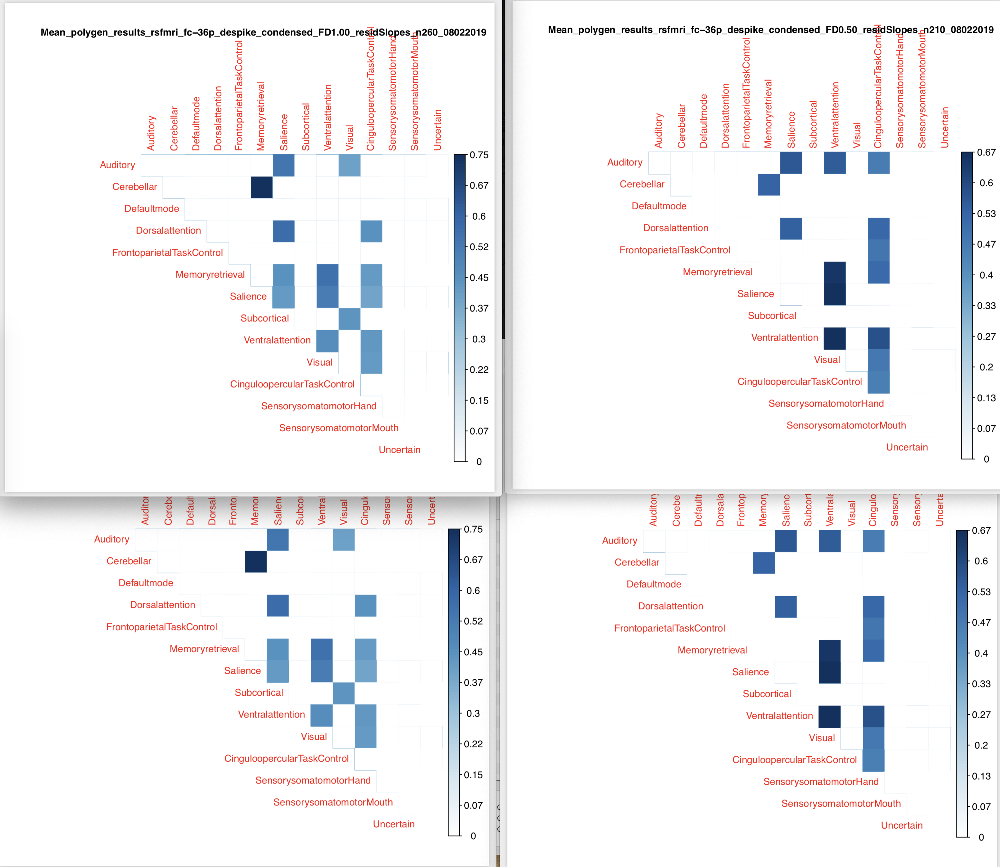

# 2019-07-25 11:24:52

Il'll take a short detour here and see if the 36P designs do a bit better as far
as removing movement. Because the cluster is down, I'll keep it to the regular
pipeline first, but we can always do the other ones later if it looks promising.

```r
scans_file = '/Volumes/Labs/AROMA_ICA/filtered_minFD_2scans.csv'
scans = read.csv(scans_file)
subjs = unique(as.character(scans$subj))
scans_file = '/Volumes/Labs/AROMA_ICA/filtered_minFD_3scans.csv'
scans = read.csv(scans_file)
subjs = unique(c(subjs, unique(as.character(scans$subj))))
write.table(subjs, file='~/data/36P/maskids_23.txt', row.names=F, col.names=F, quote=F)
```

```bash
# desktop
cd ~/data/36P
TMPDIR=`pwd`;
mkdir -p $TMPDIR/out $TMPDIR/work;
for s in `cat maskids_23.txt`; do
    echo id0,img > ${TMPDIR}/${s}.csv;
    echo ${s},${s}/fmriprep/${s}/func/${s}_task-rest_run-1_space-MNI152NLin2009cAsym_desc-preproc_bold.nii.gz >> ${TMPDIR}/${s}.csv;
    xcpengine-docker -c $TMPDIR/${s}.csv -d /xcpEngine/designs/fc-36p.dsn \
        -i $TMPDIR/work -o $TMPDIR/out \
        -r /Volumes/Labs/AROMA_ICA/fMRIprep_output/;
done
```

# 2019-07-26 11:25:59

The worry then is 2-fold:

1) remove crappy scans; then
2) make sure changes in movement are not driving the results in change of connectivity

So, we start with the best 2 or 3 scans per person. Here, we measured best based
on mean FD, but it could even be a ranked combination of FD and RMS. Then, it's
a matter of removing any scans.

# 2019-07-29 16:10:29

My initial tests showed the vanilla 36P pipeline to remove the bivariate
distribution we were seeing across the board with AROMA. Let's see what we get
when we run it in the cluster, now that it's back in business:

```bash
pipe='fc-36p';
cd /data/NCR_SBRB/
rm xcpengine.swarm;
outdir=/data/NCR_SBRB/xcpengine_output_${pipe}/
mkdir $outdir;
for m in `cat /data/NCR_SBRB/maskids_23.txt`; do
    echo 'export TMPDIR=/lscratch/$SLURM_JOBID; ' \
        'mkdir -p $TMPDIR/out $TMPDIR/work; ' \
        'echo id0,img > ${TMPDIR}/'${m}'.csv; ' \
        'cp /data/NCR_SBRB/'${pipe}'.dsn $TMPDIR/; ' \
        'echo sub-'${m}',sub-'${m}'/fmriprep/sub-'${m}'/func/sub-'${m}'_task-rest_run-1_space-MNI152NLin2009cAsym_desc-preproc_bold.nii.gz >> ${TMPDIR}/'${m}'.csv; ' \
        'xcpEngine -c $TMPDIR/'${m}'.csv ' \
        '-d $TMPDIR/'${pipe}'.dsn -i $TMPDIR/work -o $TMPDIR/out ' \
        '-r /data/NCR_SBRB/fmriprep_output/;' \
        'mv $TMPDIR/out/sub-'"${m} $outdir;">> xcpengine.swarm;
done
swarm -f xcpengine.swarm --gres=lscratch:10 -g 10 -t 16 --module xcpengine/1.0rc1 \
     --time=30:00 --merge-output --logdir=trash_xcpengine_${pipe} \
     --job-name xcp${pipe} --partition quick,norm
```

# 2019-08-02 12:14:27

So, while I'm running the MELODIC pipeline in the 030 note, let's keep on going
with the general power264 connectivity framework here. The 36p_deskpike pipeline
is looking solid, so let's go with that:

```R
source('~/research_code/fmri/make_aroma_condensed_data_FD.R')
```

And it looks like residualizing the connections before taking the slope takes
care of all associations with FD:

```r
a = read.csv('~/data/heritability_change/rsfmri_fc-36p_despike_condensed_posOnly_FD0.25_slopes_n146_08022019.csv')
mycols = colnames(a)[grepl(colnames(a), pattern='connMedian')]
ar = read.csv('~/data/heritability_change/rsfmri_fc-36p_despike_condensed_posOnly_FD0.25_residSlopes_n146_08022019.csv')
> ps = sapply(mycols, function(x) cor.test(a$qc, a[, x])$p.value)
> sum(ps<.05)
[1] 105
> ps2 = p.adjust(ps, method='fdr')
> sum(ps2<.05)
[1] 105
> ps = sapply(mycols, function(x) cor.test(ar$qc, ar[, x])$p.value)
> sum(ps<.05)
[1] 36
> ps2 = p.adjust(ps, method='fdr')
> sum(ps2<.05)
[1] 0
```

And that was also tru if we were more lenient at FD1.0:

```r
> a = read.csv('~/data/heritability_change/rsfmri_fc-36p_despike_condensed_posOnly_FD1.00_slopes_n260_08022019.csv')
> ar = read.csv('~/data/heritability_change/rsfmri_fc-36p_despike_condensed_posOnly_FD1.00_residSlopes_n260_08022019.csv')
> ps = sapply(mycols, function(x) cor.test(a$qc, a[, x])$p.value)
> sum(ps<.05)
[1] 104
> ps2 = p.adjust(ps, method='fdr')
> sum(ps2<.05)
[1] 104
> ps = sapply(mycols, function(x) cor.test(ar$qc, ar[, x])$p.value)
> sum(ps<.05)
[1] 14
> ps2 = p.adjust(ps, method='fdr')
> sum(ps2<.05)
[1] 0
```

Sure, that's using all 105 connections, so once I trim them to only the networks
we care about things might look slightly different. Still, I think we should be
good to go here. Now it's a matter of checking whether the results look good.

```r
library(nlme)
dd = read.csv('~/data/heritability_change/rsfmri_fc-36p_despike_condensed_posOnly_FD0.25_residSlopes_n146_08022019.csv')
dd$Medical.Record...MRN = as.numeric(as.character(dd$ID))

# to get famID
tmp = read.csv('~/data/heritability_change/resting_demo_07032019.csv')
tmp$famID = sapply(1:nrow(tmp), function(x)
                                if (is.na(tmp$Extended.ID...FamilyIDs[x])) {
                                    tmp$Nuclear.ID...FamilyIDs[x]
                                }
                                else {
                                    tmp$Extended.ID...FamilyIDs[x]
                                }
                  )
tmp2 = tmp[, c('Medical.Record...MRN', 'famID')]
tmp3 = tmp2[!duplicated(tmp2[, 'Medical.Record...MRN']), ]
data = merge(dd, tmp3, by='Medical.Record...MRN', all.x=T, all.y=F)

m = 'Median'
targets = colnames(data)[grepl(colnames(data), pattern=sprintf('conn%s', m))]
for (t in targets) {
    data[, t] = as.numeric(as.character(data[, t]))
}
predictors = c('SX_inatt', 'SX_HI', 'inatt_baseline', 'HI_baseline' )
for (t in predictors) {
    data[, t] = as.numeric(as.character(data[, t]))
}

out_fname = '~/data/heritability_change/assoc_LME_36p_despike_FD0.25.csv'
predictors = c('SX_inatt', 'SX_HI', 'inatt_baseline', 'HI_baseline', 'DX',
               'DX2')
hold=NULL
for (i in targets) {
    cat(sprintf('%s\n', i))
    for (j in predictors) {
        fm_str = sprintf('%s ~ %s + sex', i, j)
        model1<-try(lme(as.formula(fm_str), data, ~1|famID, na.action=na.omit))
        if (length(model1) > 1) {
            temp<-summary(model1)$tTable
            a<-as.data.frame(temp)
            a$formula<-fm_str
            a$target = i
            a$predictor = j
            a$term = rownames(temp)
            hold=rbind(hold,a)
        } else {
            hold=rbind(hold, NA)
        }
    }
}
write.csv(hold, out_fname, row.names=F)

data2 = data[data$DX=='ADHD', ]
out_fname = gsub('.csv', x=out_fname, '_dx1.csv')
predictors = c('SX_inatt', 'SX_HI', 'inatt_baseline', 'HI_baseline' )
hold=NULL
for (i in targets) {
    cat(sprintf('%s\n', i))
    for (j in predictors) {
        fm_str = sprintf('%s ~ %s + sex', i, j)
        model1<-try(lme(as.formula(fm_str), data2, ~1|famID, na.action=na.omit))
        if (length(model1) > 1) {
            temp<-summary(model1)$tTable
            a<-as.data.frame(temp)
            a$formula<-fm_str
            a$target = i
            a$predictor = j
            a$term = rownames(temp)
            hold=rbind(hold,a)
        } else {
            hold=rbind(hold, NA)
        }
    }
}
write.csv(hold, out_fname, row.names=F)

data2 = data[data$DX2=='ADHD', ]
out_fname = gsub('dx1', x=out_fname, 'dx2')
hold=NULL
for (i in targets) {
    cat(sprintf('%s\n', i))
    for (j in predictors) {
        fm_str = sprintf('%s ~ %s + sex', i, j)
        model1<-try(lme(as.formula(fm_str), data2, ~1|famID, na.action=na.omit))
        if (length(model1) > 1) {
            temp<-summary(model1)$tTable
            a<-as.data.frame(temp)
            a$formula<-fm_str
            a$target = i
            a$predictor = j
            a$term = rownames(temp)
            hold=rbind(hold,a)
        } else {
            hold=rbind(hold, NA)
        }
    }
}
write.csv(hold, out_fname, row.names=F)
```

The DX1 results didn't run, likely because of lack of subject (less than 50),
but the others did. We have some hits, but let's see if there is any
heritability which is the crux of the paper. We might also need to increase our
FD threshold just to make heritability work... let's see.

# 2019-08-06 13:07:22

Going back to this to see if there is any heritability in the condensed
matrices.

First, remove the double quotes from the files otherwise SOLAR can't run:

```bash
# desktop
cd ~/data/heritability_change/
for f in `/bin/ls rsfmri_fc-36p_despike_condensed*08022019.csv`; do
    sed -i -e "s/\"//g" $f;
done
```

```bash
cd ~/data/heritability_change/
rm swarm.p36
for f in `/bin/ls rsfmri_fc-36p_despike_condensed*lopes*08022019.csv`; do
    phen=`echo $f | sed "s/\.csv//"`;
    echo "bash ~/research_code/run_solar_parallel.sh $phen " \
        "~/data/heritability_change/condensed_power264_conns.txt" >> swarm.p36;
done
# these run quite fast, so I can just run it all here:
bash swarm.p36
```

And collect everything:

```bash
cd ~/data/tmp;
for f in `/bin/ls ~/data/heritability_change/rsfmri_fc-36p_despike_condensed*lopes*08022019.csv`; do
    pheno=`echo $f | sed "s/\.csv//" | cut -d"/" -f 6`;
    echo "Working on $pheno";
    cd $pheno;
    tar -zxf *tgz;
    echo "  Compiling...";
    python ~/research_code/compile_solar_multivar_results.py $pheno;
    echo "  Cleaning up...";
    rm conn*;
    cd ..;
done
```

Now it's a matter of checking the figures for heritable connections like before.
Or we could maybe rank all figures just so we have an idea of the best ones
first:

```r
drop_me = c('Visual', 'Auditory', 'Uncertain', 'SensorysomatomotorMouth',
            'Cerebellar', 'Memoryretrieval')
nverts = 14
mydir = '~/data/tmp/'

fnames = list.files(mydir, pattern='polygen_results_rsfmri_fc-36p_despike_condensed.*lopes.*\\.csv')
map_names = c()
sig_conns = c()
for (fname in fnames) {
    # read in the results
    res = read.csv(sprintf('%s/%s', mydir, fname))
    # figuring out possible connections
    conns = sapply(as.character(res$phen), function(x) strsplit(x, '_')[[1]][2])
    conns = unique(conns)
    vert_names = unique(unlist(lapply(conns, function(x) strsplit(x, 'TO')[[1]])))
    for (m in c('Max', 'Mean', 'Median')) {
        vals = matrix(nrow=nverts, ncol=nverts, dimnames=list(vert_names,
                                                              vert_names))
        stats = matrix(nrow=nverts, ncol=nverts, dimnames=list(vert_names,
                                                               vert_names))
        mres = res[grepl(res$phen, pattern=sprintf('conn%s', m)), ]
        for (r in 1:nrow(mres)) {
            junk = gsub(sprintf('conn%s_', m), x=mres$phen[r], '')
            ij = strsplit(junk, 'TO')[[1]]
            vals[ij[1], ij[2]] = mres[r, 'h2r']
            stats[ij[1], ij[2]] = mres[r, 'h_pval']
            vals[ij[2], ij[1]] = mres[r, 'h2r']
            stats[ij[2], ij[1]] = mres[r, 'h_pval']
        }
        drop_idx = sapply(drop_me, function(x) which(vert_names==x))
        stats = stats[-drop_idx, ]
        stats = stats[, -drop_idx]
        vals = vals[-drop_idx, ]
        vals = vals[, -drop_idx]

        myps = stats[upper.tri(stats, diag=T)]
        p2 = p.adjust(myps, method='fdr')
        junk = strsplit(strtrim(fname, nchar(fname)-4), '/')[[1]]
        phen = sprintf('%s_%s', m, junk[length(junk)])
        # sig_conns = c(sig_conns, sum(p2 < .05))
        sig_conns = c(sig_conns, sum(myps < .05))
        map_names = c(map_names, phen)
    }
}
s = sort(sig_conns, index.return=T, decreasing=T)
for (i in 1:10) {
    cat(sprintf('%s: %d\n', map_names[s$ix[i]], s$x[i]))
}
```

Nothing significant using FDR, so I might have to remove some extra connections.
But this is what comes up when I use nominal ps:

```
Mean_polygen_results_rsfmri_fc-36p_despike_condensed_FD10.00_residSlopes_n304_08022019: 10
Mean_polygen_results_rsfmri_fc-36p_despike_condensed_FD10.00_slopes_n304_08022019: 10
Mean_polygen_results_rsfmri_fc-36p_despike_condensed_posOnly_FD10.00_slopes_n304_08022019: 10
Mean_polygen_results_rsfmri_fc-36p_despike_condensed_posOnly_FD0.50_residSlopes_n210_08022019: 9
Mean_polygen_results_rsfmri_fc-36p_despike_condensed_FD0.50_residSlopes_n210_08022019: 7
Mean_polygen_results_rsfmri_fc-36p_despike_condensed_FD0.50_slopes_n210_08022019: 7
Mean_polygen_results_rsfmri_fc-36p_despike_condensed_FD1.00_residSlopes_n260_08022019: 7
Mean_polygen_results_rsfmri_fc-36p_despike_condensed_FD1.00_slopes_n260_08022019: 7
Mean_polygen_results_rsfmri_fc-36p_despike_condensed_posOnly_FD0.50_slopes_n210_08022019: 7
Mean_polygen_results_rsfmri_fc-36p_despike_condensed_posOnly_FD1.00_slopes_n260_08022019: 7
```

Let's make a few plots then, so we can check out what's going on. In particular,
I'm interested in what's going on for FD1 and FD.5:

```r
#desktop
nverts = 14
mydir = '~/data/heritability_change/'
library(corrplot)

fnames = list.files(mydir, pattern='polygen_results_rsfmri_fc-36p_despike_condensed.*lopes.*\\.csv')
for (fname in fnames) {
    # read in the results
    cat(sprintf('Reading in %s\n', fname))
    res = read.csv(sprintf('%s/%s', mydir, fname))
    # figuring out possible connections
    conns = sapply(as.character(res$phen), function(x) strsplit(x, '_')[[1]][2])
    conns = unique(conns)
    vert_names = unique(unlist(lapply(conns, function(x) strsplit(x, 'TO')[[1]])))
    for (m in c('Max', 'Mean', 'Median')) {
        vals = matrix(nrow=nverts, ncol=nverts, dimnames=list(vert_names,
                                                              vert_names))
        stats = matrix(nrow=nverts, ncol=nverts, dimnames=list(vert_names,
                                                               vert_names))
        mres = res[grepl(res$phen, pattern=sprintf('conn%s', m)), ]
        for (r in 1:nrow(mres)) {
            junk = gsub(sprintf('conn%s_', m), x=mres$phen[r], '')
            ij = strsplit(junk, 'TO')[[1]]
            vals[ij[1], ij[2]] = mres[r, 'h2r']
            stats[ij[1], ij[2]] = mres[r, 'h_pval']
            vals[ij[2], ij[1]] = mres[r, 'h2r']
            stats[ij[2], ij[1]] = mres[r, 'h_pval']
        }
        # plotting
        junk = strsplit(strtrim(fname, nchar(fname)-4), '/')[[1]]
        phen = sprintf('%s_%s', m, junk[length(junk)])
        pdf(sprintf('~/tmp/%s.pdf', phen))
        corrplot(vals, type="upper", method='color', diag=T,
                p.mat = stats, sig.level = .05, insig = "blank", is.corr=F, tl.cex=.8)
        title(phen, cex.main=.8)
        dev.off()
    }
}
```

There is some interesting stuff there. For example:



There we have residualized plots on the top and raw on the bottom. Both are all
average (i.e. including negatives and positives), and left is FD1, right is
FD.5. Now we need to do some sanity checks, like whether any of those are also
related to ADHD. Also, we might need to do some creative trimming there to make
those values significant. They're not when doing FDR after removing the networks
we normally remove. But that's not to say that removing some other combination
wouldn't make it work...

```r
library(nlme)
mydir = '~/data/heritability_change/'
phenos = c('rsfmri_fc-36p_despike_condensed_FD1.00_residSlopes_n260_08022019',
           'rsfmri_fc-36p_despike_condensed_FD1.00_slopes_n260_08022019',
           'rsfmri_fc-36p_despike_condensed_FD0.50_residSlopes_n210_08022019',
           'rsfmri_fc-36p_despike_condensed_FD0.50_slopes_n210_08022019')
for (p in phenos) {
   dd = read.csv(sprintf('%s/%s.csv', mydir, p))
   dd$Medical.Record...MRN = as.numeric(as.character(dd$ID))

   # to get famID
   tmp = read.csv('~/data/heritability_change/resting_demo_07032019.csv')
   tmp$famID = sapply(1:nrow(tmp), function(x)
                                   if (is.na(tmp$Extended.ID...FamilyIDs[x])) {
                                       tmp$Nuclear.ID...FamilyIDs[x]
                                   }
                                   else {
                                       tmp$Extended.ID...FamilyIDs[x]
                                   }
                     )
   tmp2 = tmp[, c('Medical.Record...MRN', 'famID')]
   tmp3 = tmp2[!duplicated(tmp2[, 'Medical.Record...MRN']), ]
   data = merge(dd, tmp3, by='Medical.Record...MRN', all.x=T, all.y=F)

   m = 'Mean'
   targets = colnames(data)[grepl(colnames(data), pattern=sprintf('conn%s', m))]
   for (t in targets) {
       data[, t] = as.numeric(as.character(data[, t]))
   }
   predictors = c('SX_inatt', 'SX_HI', 'inatt_baseline', 'HI_baseline' )
   for (t in predictors) {
       data[, t] = as.numeric(as.character(data[, t]))
   }

   out_fname = sprintf('%s/assoc_LME_%s.csv', mydir, p)
   predictors = c('SX_inatt', 'SX_HI', 'inatt_baseline', 'HI_baseline', 'DX',
                  'DX2')
   hold=NULL
   for (i in targets) {
       cat(sprintf('%s\n', i))
       for (j in predictors) {
           fm_str = sprintf('%s ~ %s + sex', i, j)
           model1<-try(lme(as.formula(fm_str), data, ~1|famID, na.action=na.omit))
           if (length(model1) > 1) {
               temp<-summary(model1)$tTable
               a<-as.data.frame(temp)
               a$formula<-fm_str
               a$target = i
               a$predictor = j
               a$term = rownames(temp)
               hold=rbind(hold,a)
           } else {
               hold=rbind(hold, NA)
           }
       }
   }
   write.csv(hold, out_fname, row.names=F)

   data2 = data[data$DX=='ADHD', ]
   out_fname = gsub('.csv', x=out_fname, '_dx1.csv')
   predictors = c('SX_inatt', 'SX_HI', 'inatt_baseline', 'HI_baseline' )
   hold=NULL
   for (i in targets) {
       cat(sprintf('%s\n', i))
       for (j in predictors) {
           fm_str = sprintf('%s ~ %s + sex', i, j)
           model1<-try(lme(as.formula(fm_str), data2, ~1|famID, na.action=na.omit))
           if (length(model1) > 1) {
               temp<-summary(model1)$tTable
               a<-as.data.frame(temp)
               a$formula<-fm_str
               a$target = i
               a$predictor = j
               a$term = rownames(temp)
               hold=rbind(hold,a)
           } else {
               hold=rbind(hold, NA)
           }
       }
   }
   write.csv(hold, out_fname, row.names=F)

   data2 = data[data$DX2=='ADHD', ]
   out_fname = gsub('dx1', x=out_fname, 'dx2')
   hold=NULL
   for (i in targets) {
       cat(sprintf('%s\n', i))
       for (j in predictors) {
           fm_str = sprintf('%s ~ %s + sex', i, j)
           model1<-try(lme(as.formula(fm_str), data2, ~1|famID, na.action=na.omit))
           if (length(model1) > 1) {
               temp<-summary(model1)$tTable
               a<-as.data.frame(temp)
               a$formula<-fm_str
               a$target = i
               a$predictor = j
               a$term = rownames(temp)
               hold=rbind(hold,a)
           } else {
               hold=rbind(hold, NA)
           }
       }
   }
   write.csv(hold, out_fname, row.names=F)
}
```

It looks like we have nothing... in other words, we do have some nominal
significantly heritable connections, but almost nothing (heritable or not) that
is related to symptom change.

We should still make the data sanity plots (slopes) we discussed with Philip,
just to make sure the data going into SOLAR looks fine.

# TODO
* slope plots for data sanity