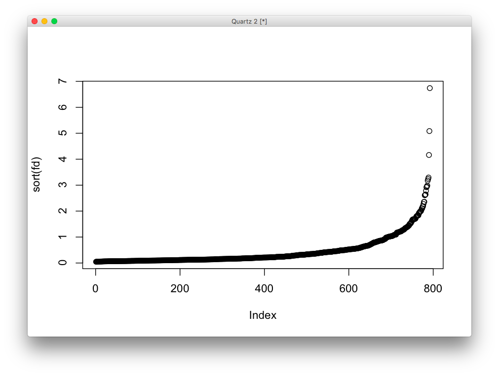

# 2019-08-01 16:26:50

The 36P-despike pipeline seems to keep all 126 TRs, and it does a decent job
removing movement correlation overall. According to its paper
(https://jamanetwork.com/journals/jamapsychiatry/fullarticle/2734860):

```
"Task-free functional images were processed using a top-performing pipeline for removal of motion-related artifact.25 Preprocessing steps included (1) correction for distortions induced by magnetic field inhomogeneities using FSL’s FUGUE utility, (2) removal of the 4 initial volumes of each acquisition, (3) realignment of all volumes to a selected reference volume using MCFLIRT16 (4) removal of and interpolation over intensity outliers in each voxel’s time series using AFNI’s 3DDESPIKE utility, (5) demeaning and removal of any linear or quadratic trends, and (6) co-registration of functional data to the high-resolution structural image using boundary-based registration.26 The artifactual variance in the data was modelled using a total of 36 parameters, including the 6 framewise estimates of motion, the mean signal extracted from eroded white matter and cerebrospinal fluid compartments, the mean signal extracted from the entire brain, the derivatives of each of these 9 parameters, and quadratic terms of each of the 9 parameters and their derivatives. Both the BOLD-weighted time series and the artifactual model time series were temporally filtered using a first-order Butterworth filter with a passband between 0.01 and 0.08 Hz. Subjects included in this analysis had low motion as measured by mean frame wise displacement, specifically mean relative frame wise displacement less then 2.5 mm."
```

So, it's almost the same as 36P, but it does step 4. I actually think 2.5mm will
be too lenient in our dataset. Let's see:



That's the plot of all the mean FD across the best 2 scans of every kid. I think
we can even get away with 1mm. Let's run both then. For the MELODIC analysis,
all we need is to know the IDs of the two scans we'll be including. 

```bash
Rscript ~/research_code/fmri/make_aroma_condensed_data_FD.R
```

# 2019-08-02 10:36:29

I just noticed that the recommendation of one of the papers is to remove anyone
with mFD above .2. So, clearly there is no consensus in the field. Let's just
pick one that makes sense with our data (1), and then we can test later if
results hold with more stringent threshold (if necessary).


```bash
# desktop
cd ~/data/heritability_change/
mkdir xcp-36p_despike
cd xcp-36p_despike
mkdir masks;
mydir=/Volumes/Labs/rsfmri_36p/xcpengine_output_fc-36p_despike/
fname=rsfmri_fc-36p_despike_condensed_posOnly_FD1.00_scans520_08022019.csv;
awk '{FS=","; print $1}' ../$fname | tail -n +2 > ids_1.txt;
for maskid in `cat ids_1.txt`; do
    m=`printf %04d $maskid`;
    # this file is the target of the sub-???.nii.gz symlink
    3dAutomask -prefix masks/${m}_automask.nii \
        $mydir/sub-${m}/norm/sub-${m}_std.nii.gz;
done
cd masks
3dmask_tool -input ????_automask.nii -prefix ../group_epi_mask_inter.nii -frac 1
3dmask_tool -input ????_automask.nii -prefix ../group_epi_mask_fancy.nii \
    -dilate_input 5 -5 -frac 0.7 -fill_holes
```

Let's then run melodic. But we'll need to send the data to BW first:

```bash
cd ~/data/heritability_change/xcp-36p_despike
for maskid in `cat ids_1.txt`; do
    m=`printf %04d $maskid`;
    echo $mydir/sub-${m}/norm/sub-${m}_std.nii.gz >> fd1_epi.txt;
done

melodic -i fd1_epi.txt -o groupmelodic_fancy.ica -v --nobet -m group_epi_mask_fancy.nii --tr=2.5 --report --Oall -a concat;

melodic -i fd1_epi.txt -o groupmelodic_inter.ica -v --nobet -m group_epi_mask_inter.nii --tr=2.5 --report --Oall -a concat;
```

Now we performt the dual regression to get each subject's values for the ICs:

```bash
pipe='inter';
cd ~/data/heritability_change/xcp-36p_despike/groupmelodic_${pipe}.ica
mkdir dual
while read maskid; do
    s=`printf %04d $m`;
    m=`printf %04d $maskid`;
    echo ${pipe} $m;
    $FSLDIR/bin/fsl_glm -i $mydir/sub-${m}/norm/sub-${m}_std.nii.gz -d melodic_IC \
        -o dual/dr_stage1_${m}.txt --demean -m ../../group_epi_mask_${pipe}.nii;
    $FSLDIR/bin/fsl_glm -i $mydir/sub-${m}/norm/sub-${m}_std.nii.gz -d dual/dr_stage1_${m}.txt \
        -o dual/dr_stage2_${m} --demean -m ../../group_epi_mask_${pipe}.nii --des_norm \
        --out_z=dual/dr_stage2_${m}_Z;
done < ../ids_1.txt
```
