# 2019-08-01 16:26:50

The 36P-despike pipeline seems to keep all 126 TRs, and it does a decent job
removing movement correlation overall. According to its paper
(https://jamanetwork.com/journals/jamapsychiatry/fullarticle/2734860):

```
"Task-free functional images were processed using a top-performing pipeline for removal of motion-related artifact.25 Preprocessing steps included (1) correction for distortions induced by magnetic field inhomogeneities using FSL’s FUGUE utility, (2) removal of the 4 initial volumes of each acquisition, (3) realignment of all volumes to a selected reference volume using MCFLIRT16 (4) removal of and interpolation over intensity outliers in each voxel’s time series using AFNI’s 3DDESPIKE utility, (5) demeaning and removal of any linear or quadratic trends, and (6) co-registration of functional data to the high-resolution structural image using boundary-based registration.26 The artifactual variance in the data was modelled using a total of 36 parameters, including the 6 framewise estimates of motion, the mean signal extracted from eroded white matter and cerebrospinal fluid compartments, the mean signal extracted from the entire brain, the derivatives of each of these 9 parameters, and quadratic terms of each of the 9 parameters and their derivatives. Both the BOLD-weighted time series and the artifactual model time series were temporally filtered using a first-order Butterworth filter with a passband between 0.01 and 0.08 Hz. Subjects included in this analysis had low motion as measured by mean frame wise displacement, specifically mean relative frame wise displacement less then 2.5 mm."
```

So, it's almost the same as 36P, but it does step 4. I actually think 2.5mm will
be too lenient in our dataset. Let's see:


That's the plot of all the mean FD across the best 2 scans of every kid. I think
we can even get away with 1mm. Let's run both then. For the MELODIC analysis,
all we need is to know the IDs of the two scans we'll be including. 

```bash
Rscript ~/research_code/fmri/make_aroma_condensed_data_FD.R
```

# 2019-08-02 10:36:29

I just noticed that the recommendation of one of the papers is to remove anyone
with mFD above .2. So, clearly there is no consensus in the field. Let's just
pick one that makes sense with our data (1), and then we can test later if
results hold with more stringent threshold (if necessary).


```bash
# desktop
cd ~/data/heritability_change/
mkdir xcp-36p_despike
cd xcp-36p_despike
mkdir masks;
mydir=/Volumes/Labs/rsfmri_36p/xcpengine_output_fc-36p_despike/
fname=rsfmri_fc-36p_despike_condensed_posOnly_FD1.00_scans520_08022019.csv;
awk '{FS=","; print $1}' ../$fname | tail -n +2 > ids_1.txt;
for maskid in `cat ids_1.txt`; do
    m=`printf %04d $maskid`;
    # this file is the target of the sub-???.nii.gz symlink
    3dAutomask -prefix masks/${m}_automask.nii \
        $mydir/sub-${m}/norm/sub-${m}_std.nii.gz;
done
cd masks
3dmask_tool -input ????_automask.nii -prefix ../group_epi_mask_inter.nii -frac 1
3dmask_tool -input ????_automask.nii -prefix ../group_epi_mask_fancy.nii \
    -dilate_input 5 -5 -frac 0.7 -fill_holes
```

Let's then run melodic, which we can do locally:

```bash
cd ~/data/heritability_change/xcp-36p_despike
for maskid in `cat ids_1.txt`; do
    m=`printf %04d $maskid`;
    echo $mydir/sub-${m}/norm/sub-${m}_std.nii.gz >> fd1_epi.txt;
done

melodic -i fd1_epi.txt -o groupmelodic_fancy.ica -v --nobet -m group_epi_mask_fancy.nii --tr=2.5 --report --Oall -a concat;

melodic -i fd1_epi.txt -o groupmelodic_inter.ica -v --nobet -m group_epi_mask_inter.nii --tr=2.5 --report --Oall -a concat;
```

Now we performt the dual regression to get each subject's values for the ICs:

```bash
pipe='fancy';
cd ~/data/heritability_change/xcp-36p_despike/groupmelodic_${pipe}.ica
mkdir dual
while read maskid; do
    m=`printf %04d $maskid`;
    echo ${pipe} $m;
    $FSLDIR/bin/fsl_glm -i $mydir/sub-${m}/norm/sub-${m}_std.nii.gz -d melodic_IC \
        -o dual/dr_stage1_${m}.txt --demean -m ../group_epi_mask_${pipe}.nii;
    $FSLDIR/bin/fsl_glm -i $mydir/sub-${m}/norm/sub-${m}_std.nii.gz -d dual/dr_stage1_${m}.txt \
        -o dual/dr_stage2_${m} --demean -m ../group_epi_mask_${pipe}.nii --des_norm \
        --out_z=dual/dr_stage2_${m}_Z;
done < ../ids_1.txt
```

Now, it's time to figure out which ICs we are going to use.

# 2019-08-05 10:52:29


We are already in MNI space, like the Yeo networks (I checke dit visually). But
the inter mask looked a bit funky, so I'll stay with the fancy mask for now.

```bash
cd ~/data/heritability_change/xcp-36p_despike
for i in {1..7}; do
    3dcalc -prefix Yeo_liberal_net${i}.nii \
        -a ~/data/Yeo_JNeurophysiol11_MNI152/Yeo2011_7Networks_MNI152_FreeSurferConformed1mm_LiberalMask.nii.gz -expr "amongst(a,${i})";
done
3dTcat -prefix Yeo_liberal_combined.nii Yeo_liberal_net1.nii \
    Yeo_liberal_net2.nii Yeo_liberal_net3.nii \
    Yeo_liberal_net4.nii Yeo_liberal_net5.nii \
    Yeo_liberal_net6.nii Yeo_liberal_net7.nii
3dresample -master groupmelodic_inter.ica/melodic_IC.nii.gz \
    -prefix Yeo_nets.nii -inset Yeo_liberal_combined.nii \
    -rmode NN -overwrite
```

So, let's figure out what are the best matching networks for each mask:

```bash
cd ~/data/heritability_change/xcp-36p_despike/groupmelodic_fancy.ica/
3dMatch -inset melodic_IC.nii.gz -refset ../Yeo_nets.nii \
    -mask ../group_epi_mask_fancy.nii -prefix matches -overwrite
cat matches_REF_coeff.vals
```

Keep in mind that the code is:

```
0: visual
1: somatomotor
2: DAN
3: VAN
4: limbic
5: cognitive (frontoparietal)
6: DMN
```

```
0               3               0.386           0.176
1               22              0.335           0.155
2               18              0.294           0.123
3               1               0.441           0.111
4               39              0.394           0.078
5               27              0.281           0.153
6               10              0.313           0.229
```

The maps are not great, but at least it's data-driven. Another idea is to use
the actual network maps for the dual regression:

```bash
cd ~/data/heritability_change/xcp-36p_despike/yeo_masks
mydir=/Volumes/Labs/rsfmri_36p/xcpengine_output_fc-36p_despike/
mkdir dual
while read maskid; do
    m=`printf %04d $maskid`;
    echo yeo_masks $m;
    $FSLDIR/bin/fsl_glm -i $mydir/sub-${m}/norm/sub-${m}_std.nii.gz -d ../Yeo_nets.nii \
        -o dual/dr_stage1_${m}.txt --demean -m ../group_epi_mask_fancy.nii;
    $FSLDIR/bin/fsl_glm -i $mydir/sub-${m}/norm/sub-${m}_std.nii.gz -d dual/dr_stage1_${m}.txt \
        -o dual/dr_stage2_${m} --demean -m ../group_epi_mask_fancy.nii --des_norm \
        --out_z=dual/dr_stage2_${m}_Z;
done < ../ids_1.txt
```

Time to dump to R:

```bash
cd ~/data/heritability_change/xcp-36p_despike/groupmelodic_fancy.ica/
mkdir dumps
for m in `cat ../ids_1.txt`; do
    maskid=`printf %04d $m`;
    echo $maskid;
    rm dumps/${maskid}_*.txt
    for i in 3 22 18 1 39 27 10; do
        3dmaskdump -mask ../group_epi_mask_fancy.nii \
            -o dumps/${maskid}_IC${i}_Z.txt dual/dr_stage2_${maskid}_Z.nii.gz[${i}];
    done;
done
```

```bash
cd ~/data/heritability_change/xcp-36p_despike/yeo_masks/
mkdir dumps
for m in `cat ../ids_1.txt`; do
    maskid=`printf %04d $m`;
    echo $maskid;
    rm dumps/${maskid}_*.txt
    for i in {0..6}; do
        3dmaskdump -mask ../group_epi_mask_fancy.nii \
            -o dumps/${maskid}_net${i}_Z.txt dual/dr_stage2_${maskid}_Z.nii.gz[${i}];
    done;
done
```

Then, we collect our results in R:

```r
maskids = read.table('~/data/heritability_change/xcp-36p_despike/ids_1.txt')[, 1]
nvox=231015
for (m in c(3, 22, 18, 1, 39, 27, 10)) {
    print(m)
    brain_data = matrix(nrow=length(maskids), ncol=nvox)
    for (s in 1:nrow(brain_data)) {
        fname = sprintf('~/data/heritability_change/xcp-36p_despike/groupmelodic_fancy.ica/dumps/%04d_IC%d_Z.txt', maskids[s], m)
        a = read.table(fname)
        brain_data[s, ] = a[,4]
     }
     brain_data = cbind(maskids, brain_data)
     cnames = c('mask.id', sapply(1:nvox, function(d) sprintf('v%06d', d)))
     colnames(brain_data) = cnames
     fname = sprintf('~/data/heritability_change/xcp-36p_despike/melodic_fancy_IC%d.RData.gz', m)
     save(brain_data, file=fname, compress=T)
}
```

Then, repeat the same for the yeo_masks dual regression.

```r
maskids = read.table('~/data/heritability_change/xcp-36p_despike/ids_1.txt')[, 1]
nvox=231015
for (m in 0:6) {
    print(m)
    brain_data = matrix(nrow=length(maskids), ncol=nvox)
    for (s in 1:nrow(brain_data)) {
        fname = sprintf('~/data/heritability_change/xcp-36p_despike/yeo_masks/dumps/%04d_net%d_Z.txt', maskids[s], m)
        a = read.table(fname)
        brain_data[s, ] = a[,4]
     }
     brain_data = cbind(maskids, brain_data)
     cnames = c('mask.id', sapply(1:nvox, function(d) sprintf('v%06d', d)))
     colnames(brain_data) = cnames
     fname = sprintf('~/data/heritability_change/xcp-36p_despike/yeo_masks_fancy_net%d.RData.gz', m)
     save(brain_data, file=fname, compress=T)
}
```

The downside of not using MELODIC, but the Yeo masks instead is that hopefully
ICA would also get rid of movement. So, let's see if doing ICA in the FD.25
group gives better results:

```bash
mydir=/Volumes/Labs/rsfmri_36p/xcpengine_output_fc-36p_despike/
cd ~/data/heritability_change/xcp-36p_despike
fname=rsfmri_fc-36p_despike_condensed_posOnly_FD0.25_scans292_08022019.csv;
awk '{FS=","; print $1}' ../$fname | tail -n +2 > ids_p25.txt;
for maskid in `cat ids_p25.txt`; do
    m=`printf %04d $maskid`;
    echo $mydir/sub-${m}/norm/sub-${m}_std.nii.gz >> fdp25_epi.txt;
done

melodic -i fdp25_epi.txt -o groupmelodic_fancyp25.ica -v --nobet \
    -m group_epi_mask_fancy.nii --tr=2.5 --report --Oall -a concat;

cd groupmelodic_fancyp25.ica
3dMatch -inset melodic_IC.nii.gz -refset ../Yeo_nets.nii \
    -mask ../group_epi_mask_fancy.nii -prefix matches -overwrite
cat matches_REF_coeff.vals
```

Keep in mind that the code is:

```
0: visual
1: somatomotor
2: DAN
3: VAN
4: limbic
5: cognitive (frontoparietal)
6: DMN
```

```
0               2               0.375           0.176
1               27              0.361           0.155
2               10              0.428           0.123
3               4               0.447           0.111
4               31              0.415           0.078
5               29              0.305           0.153
6               7               0.328           0.229
```

Yeah, it does look better in the p25 sample. So, maybe we should run that as
well.

```bash
cd ~/data/heritability_change/xcp-36p_despike/groupmelodic_fancyp25.ica
mkdir dual
while read maskid; do
    m=`printf %04d $maskid`;
    echo ${pipe} $m;
    $FSLDIR/bin/fsl_glm -i $mydir/sub-${m}/norm/sub-${m}_std.nii.gz -d melodic_IC \
        -o dual/dr_stage1_${m}.txt --demean -m ../group_epi_mask_${pipe}.nii;
    $FSLDIR/bin/fsl_glm -i $mydir/sub-${m}/norm/sub-${m}_std.nii.gz -d dual/dr_stage1_${m}.txt \
        -o dual/dr_stage2_${m} --demean -m ../group_epi_mask_${pipe}.nii --des_norm
        --out_z=dual/dr_stage2_${m}_Z;
done < ../ids_p25.txt

mkdir dumps
for m in `cat ../ids_p25.txt`; do
    maskid=`printf %04d $m`;
    echo $maskid;
    rm dumps/${maskid}_*.txt
    for i in 2 27 10 4 31 29 7; do
        3dmaskdump -mask ../group_epi_mask_fancy.nii \
            -o dumps/${maskid}_IC${i}_Z.txt dual/dr_stage2_${maskid}_Z.nii.gz[${i}];
    done;
done
```

```r
maskids = read.table('~/data/heritability_change/xcp-36p_despike/ids_p25.txt')[, 1]
nvox=231015
for (m in c(2, 27, 10, 4, 31, 29, 7)) {
    print(m)
    brain_data = matrix(nrow=length(maskids), ncol=nvox)
    for (s in 1:nrow(brain_data)) {
        fname = sprintf('~/data/heritability_change/xcp-36p_despike/groupmelodic_fancyp25.ica/dumps/%04d_IC%d_Z.txt', maskids[s], m)
        a = read.table(fname)
        brain_data[s, ] = a[,4]
     }
     brain_data = cbind(maskids, brain_data)
     cnames = c('mask.id', sapply(1:nvox, function(d) sprintf('v%06d', d)))
     colnames(brain_data) = cnames
     fname = sprintf('~/data/heritability_change/xcp-36p_despike/melodic_fancyp25_IC%d.RData.gz', m)
     save(brain_data, file=fname, compress=T)
}
```

Now it's just a matter of assigning MRNs, calculate slopes, and
prepare it for SOLAR voxelwise.

```r
source('~/research_code/lab_mgmt/merge_on_closest_date.R')
df = read.csv('~/data/heritability_change/rsfmri_fc-36p_despike_condensed_posOnly_FD1.00_scans520_08022019.csv')
mydir='~/data/heritability_change/xcp-36p_despike/'
for (ic in c(3, 22, 18, 1, 39, 27, 10)) {
    fname = sprintf('%s/melodic_fancy_IC%d.RData.gz', mydir, ic)
    load(fname)
    b = brain_data
    var_names = colnames(b)[2:ncol(b)]
    df2 = merge(df, b, by.x='Mask.ID', by.y='mask.id', all.x=F)

    # make sure we still have two scans for everyone
    rm_subjs = names(which(table(df2$Medical.Record...MRN)<2))
    rm_me = df2$Medical.Record...MRN %in% rm_subjs
    df2 = df2[!rm_me, ]

    mres = df2
    mres$SX_HI = as.numeric(as.character(mres$SX_hi))
    mres$SX_inatt = as.numeric(as.character(mres$SX_inatt))

    res = c()
    for (s in unique(mres$Medical.Record...MRN)) {
        idx = which(mres$Medical.Record...MRN == s)
        row = c(s, unique(mres[idx, 'Sex']))
        y = mres[idx[2], var_names] - mres[idx[1], var_names]
        x = mres[idx[2], 'age_at_scan'] - mres[idx[1], 'age_at_scan']
        slopes = y / x
        row = c(row, slopes)
        for (t in c('SX_inatt', 'SX_HI', 'qc')) {
            fm_str = sprintf('%s ~ age_at_scan', t)
            fit = lm(as.formula(fm_str), data=mres[idx, ], na.action=na.exclude)
            row = c(row, coefficients(fit)[2])
        }
        # grabbing inatt and HI at baseline
        base_DOA = which.min(mres[idx, 'age_at_scan'])
        row = c(row, mres[idx[base_DOA], 'SX_inatt'])
        row = c(row, mres[idx[base_DOA], 'SX_HI'])
        # DX1 is DSMV definition, DX2 will make SX >=4 as ADHD
        if (mres[idx[base_DOA], 'age_at_scan'] < 16) {
            if ((row[length(row)] >= 6) || (row[length(row)-1] >= 6)) {
                DX = 'ADHD'
            } else {
                DX = 'NV'
            }
        } else {
            if ((row[length(row)] >= 5) || (row[length(row)-1] >= 5)) {
                DX = 'ADHD'
            } else {
                DX = 'NV'
            }
        }
        if ((row[length(row)] >= 4) || (row[length(row)-1] >= 4)) {
            DX2 = 'ADHD'
        } else {
            DX2 = 'NV'
        }
        row = c(row, DX)
        row = c(row, DX2)
        res = rbind(res, row)
        print(nrow(res))
    }
    colnames(res) = c('ID', 'sex', var_names, c('SX_inatt', 'SX_HI', 'qc',
                                                'inatt_baseline',
                                                'HI_baseline', 'DX', 'DX2'))
    # we only open this in R, so it's OK to be RData to load faster
    fname = sprintf('%s/melodic_fancy_slopes_IC%d.rds', mydir, ic)
    saveRDS(res, file=fname)

    # and remove outliers
    res_clean = res
    for (t in var_names) {
        mydata = as.numeric(res_clean[, t])
        # identifying outliers
        ul = mean(mydata) + 3 * sd(mydata)
        ll = mean(mydata) - 3 * sd(mydata)
        bad_subjs = c(which(mydata < ll), which(mydata > ul))

        # remove within-variable outliers
        res_clean[bad_subjs, t] = NA
    }
    fname = sprintf('%s/melodic_fancy_slopesClean_IC%d.rds', mydir, ic)
    saveRDS(res_clean, file=fname)

    # and make sure every family has at least two people
    good_nuclear = names(table(df2$Nuclear.ID...FamilyIDs))[table(df2$Nuclear.ID...FamilyIDs) >= 4]
    good_extended = names(table(df2$Extended.ID...FamilyIDs))[table(df2$Extended.ID...FamilyIDs) >= 4]
    keep_me = c()
    for (f in good_nuclear) {
        keep_me = c(keep_me, df2[which(df2$Nuclear.ID...FamilyIDs == f),
                                'Medical.Record...MRN'])
    }
    for (f in good_extended) {
        keep_me = c(keep_me, df2[which(df2$Extended.ID...FamilyIDs == f),
                                'Medical.Record...MRN'])
    }
    keep_me = unique(keep_me)

    fam_subjs = c()
    for (s in keep_me) {
        fam_subjs = c(fam_subjs, which(res[, 'ID'] == s))
    }
    res2 = res[fam_subjs, ]
    res2_clean = res_clean[fam_subjs, ]

    fname = sprintf('%s/melodic_fancy_slopesFam_IC%d.csv', mydir, ic)
    write.csv(res2, file=fname, row.names=F, na='', quote=F)
    fname = sprintf('%s/melodic_fancy_slopesCleanFam_IC%d.csv', mydir, ic)
    write.csv(res2_clean, file=fname, row.names=F, na='', quote=F)
}
```

And for the Yeo masks:

```r
source('~/research_code/lab_mgmt/merge_on_closest_date.R')
df = read.csv('~/data/heritability_change/rsfmri_fc-36p_despike_condensed_posOnly_FD1.00_scans520_08022019.csv')
mydir='~/data/heritability_change/xcp-36p_despike/'
for (ic in 0:6) {
    fname = sprintf('%s/yeo_masks_fancy_net%d.RData.gz', mydir, ic)
    load(fname)
    b = brain_data
    var_names = colnames(b)[2:ncol(b)]
    df2 = merge(df, b, by.x='Mask.ID', by.y='mask.id', all.x=F)

    # make sure we still have two scans for everyone
    rm_subjs = names(which(table(df2$Medical.Record...MRN)<2))
    rm_me = df2$Medical.Record...MRN %in% rm_subjs
    df2 = df2[!rm_me, ]

    mres = df2
    mres$SX_HI = as.numeric(as.character(mres$SX_hi))
    mres$SX_inatt = as.numeric(as.character(mres$SX_inatt))

    res = c()
    for (s in unique(mres$Medical.Record...MRN)) {
        idx = which(mres$Medical.Record...MRN == s)
        row = c(s, unique(mres[idx, 'Sex']))
        y = mres[idx[2], var_names] - mres[idx[1], var_names]
        x = mres[idx[2], 'age_at_scan'] - mres[idx[1], 'age_at_scan']
        slopes = y / x
        row = c(row, slopes)
        for (t in c('SX_inatt', 'SX_HI', 'qc')) {
            fm_str = sprintf('%s ~ age_at_scan', t)
            fit = lm(as.formula(fm_str), data=mres[idx, ], na.action=na.exclude)
            row = c(row, coefficients(fit)[2])
        }
        # grabbing inatt and HI at baseline
        base_DOA = which.min(mres[idx, 'age_at_scan'])
        row = c(row, mres[idx[base_DOA], 'SX_inatt'])
        row = c(row, mres[idx[base_DOA], 'SX_HI'])
        # DX1 is DSMV definition, DX2 will make SX >=4 as ADHD
        if (mres[idx[base_DOA], 'age_at_scan'] < 16) {
            if ((row[length(row)] >= 6) || (row[length(row)-1] >= 6)) {
                DX = 'ADHD'
            } else {
                DX = 'NV'
            }
        } else {
            if ((row[length(row)] >= 5) || (row[length(row)-1] >= 5)) {
                DX = 'ADHD'
            } else {
                DX = 'NV'
            }
        }
        if ((row[length(row)] >= 4) || (row[length(row)-1] >= 4)) {
            DX2 = 'ADHD'
        } else {
            DX2 = 'NV'
        }
        row = c(row, DX)
        row = c(row, DX2)
        res = rbind(res, row)
        print(nrow(res))
    }
    colnames(res) = c('ID', 'sex', var_names, c('SX_inatt', 'SX_HI', 'qc',
                                                'inatt_baseline',
                                                'HI_baseline', 'DX', 'DX2'))
    # we only open this in R, so it's OK to be RData to load faster
    fname = sprintf('%s/yeo_masks_fancy_slopes_net%d.rds', mydir, ic)
    saveRDS(res, file=fname)

    # and remove outliers
    res_clean = res
    for (t in var_names) {
        mydata = as.numeric(res_clean[, t])
        # identifying outliers
        ul = mean(mydata) + 3 * sd(mydata)
        ll = mean(mydata) - 3 * sd(mydata)
        bad_subjs = c(which(mydata < ll), which(mydata > ul))

        # remove within-variable outliers
        res_clean[bad_subjs, t] = NA
    }
    fname = sprintf('%s/yeo_masks_fancy_slopesClean_net%d.rds', mydir, ic)
    saveRDS(res_clean, file=fname)

    # and make sure every family has at least two people
    good_nuclear = names(table(df2$Nuclear.ID...FamilyIDs))[table(df2$Nuclear.ID...FamilyIDs) >= 4]
    good_extended = names(table(df2$Extended.ID...FamilyIDs))[table(df2$Extended.ID...FamilyIDs) >= 4]
    keep_me = c()
    for (f in good_nuclear) {
        keep_me = c(keep_me, df2[which(df2$Nuclear.ID...FamilyIDs == f),
                                'Medical.Record...MRN'])
    }
    for (f in good_extended) {
        keep_me = c(keep_me, df2[which(df2$Extended.ID...FamilyIDs == f),
                                'Medical.Record...MRN'])
    }
    keep_me = unique(keep_me)

    fam_subjs = c()
    for (s in keep_me) {
        fam_subjs = c(fam_subjs, which(res[, 'ID'] == s))
    }
    res2 = res[fam_subjs, ]
    res2_clean = res_clean[fam_subjs, ]

    fname = sprintf('%s/yeo_masks_fancy_slopesFam_net%d.csv', mydir, ic)
    write.csv(res2, file=fname, row.names=F, na='', quote=F)
    fname = sprintf('%s/yeo_masks_fancy_slopesCleanFam_net%d.csv', mydir, ic)
    write.csv(res2_clean, file=fname, row.names=F, na='', quote=F)
}
```

**Note that I won' be removing movement here! Mostly because since we're using
ICA, the movement components should have been isolated already. But we can
always check any results later against correlation to movement.
**

# 2019-08-06 09:46:43

As the CSV files are getting ready, let's dig out the commands to run the
voxelwise SOLAR:

```bash
cd ~/data/heritability_change/xcp-36p_despike
# create master list of voxels
nvox=231015;
for i in `seq 1 $nvox`; do
    echo $i >> voxel_list.txt;
done
# our previous experiments had chunks of 5K voxels
split -da 2 -l 5000 voxel_list.txt vlist --additional-suffix=".txt";
```

Now we set up the swarm:

```bash
cd ~/data/heritability_change/xcp-36p_despike;
phen_file=melodic_fancyp25_slopesCleanFam_IC2;
jname=fancyp25_2c;
swarm_file=swarm.${jname};

rm -f $swarm_file;
for vlist in `ls $PWD/vlist*txt`; do  # getting full path to files
    echo "bash ~/research_code/run_solar_voxel_parallel.sh $phen_file $vlist" >> $swarm_file;
done;
swarm --gres=lscratch:100 -f $swarm_file --module solar -t 32 -g 20 \
        --logdir=trash_${jname} --job-name ${jname} --time=2:00:00 --merge-output \
        --partition quick,norm
```

For fancyp25 I ran 1000 voxels in a 32core node in 13 min. So, if I'm doing
bundles of 5000, I think I'll be safe to do allocate 2h for each. And even with
32 cores it's only taking 2.5Gb of RAM.

The swarms actually completed in about 1h, so 2h is quite conservative indeed. I
wonder if we can go to 16 cores (to get machines more quickly)? And cap it to 4h
just to stay conservative and still fit into the quick partititon, even though I
think we can probably do it in 3h... keep in mind this is the p25 set, so maybe
the bigger set will take longer.

It's taking about 2.5h in a 16 core node, which is pretty good and should be ok
for the FD1 sample as well?

# 2019-08-07 08:40:50

```bash
cd ~/data/heritability_change/xcp-36p_despike;
for i in 2 27 10 4 31 29 7; do
    phen_file=melodic_fancyp25_slopesCleanFam_IC${i};
    jname=fancyp25_${i}c;
    swarm_file=swarm.${jname};

    rm -f $swarm_file;
    for vlist in `ls $PWD/vlist*txt`; do  # getting full path to files
        echo "bash ~/research_code/run_solar_voxel_parallel.sh $phen_file $vlist" >> $swarm_file;
    done;
    swarm --gres=lscratch:10 -f $swarm_file --module solar -t 16 -g 5 \
            --logdir=trash_${jname} --job-name ${jname} --time=4:00:00 --merge-output \
            --partition quick,norm
done
```

To compile, we do something like this:

```bash
#desktop
cd ~/data/heritability_change/xcp-36p_despike/
cut -d " " -f 1,2,3 \
    groupmelodic_fancy.ica/dumps/1351_IC3_Z.txt > group_mask_fancy_ijk.txt
```

```bash
module load afni

cd /lscratch/${SLURM_JOBID}
for i in 2 27 10 4 31 29 7; do
    phen=melodic_fancyp25_slopesFam_IC${i};
    mkdir $phen;
    cd $phen;
    cp ~/data/tmp/$phen/*.out ~/data/tmp/${phen}/*gz .;
    for f in `/bin/ls *gz`; do tar -zxf $f; done
    cd ..
    python ~/research_code/fmri/compile_solar_voxel_results.py \
        /lscratch/${SLURM_JOBID}/ $phen \
        ~/data/heritability_change/xcp-36p_despike/group_epi_mask_fancy.nii;
done
```

For FD1, we do:

```bash
cd ~/data/heritability_change/xcp-36p_despike;
for i in 18 22 3 1 39 27 10; do
    phen_file=melodic_fancy_slopesCleanFam_IC${i};
    jname=fancy_${i}c;
    swarm_file=swarm.${jname};

    rm -f $swarm_file;
    for vlist in `ls $PWD/vlist*txt`; do  # getting full path to files
        echo "bash ~/research_code/run_solar_voxel_parallel.sh $phen_file $vlist" >> $swarm_file;
    done;
    swarm --gres=lscratch:10 -f $swarm_file --module solar -t 16 -g 5 \
            --logdir=trash_${jname} --job-name ${jname} --time=4:00:00 --merge-output \
            --partition quick,norm
done
```

And Yeo masks:

```bash
cd ~/data/heritability_change/xcp-36p_despike;
for i in {0..6}; do
    phen_file=yeo_masks_fancy_slopesCleanFam_net${i};
    jname=yeo_${i}c;
    swarm_file=swarm.${jname};

    rm -f $swarm_file;
    for vlist in `ls $PWD/vlist*txt`; do  # getting full path to files
        echo "bash ~/research_code/run_solar_voxel_parallel.sh $phen_file $vlist" >> $swarm_file;
    done;
    swarm --gres=lscratch:10 -f $swarm_file --module solar -t 16 -g 5 \
            --logdir=trash_${jname} --job-name ${jname} --time=4:00:00 --merge-output \
            --partition quick,norm
done
```

As usual, do it for clean and nonClean, just for kicks...

# 2019-08-08 10:03:53

Good to know: some of the FD1 sets are not finishing... might need to increase
the time? Or run in 32 cores? Even the ones that completed took 3h:45min, so
that's cutting close. We either do more time and forgo the quick partition, or
increase it to 32 cores...

Let's check some of the results we already have:

```bash
#desktop
cd ~/data/heritability_change/xcp-36p_despike
rm fancyp25_clean_clusters.txt;
for f in `/bin/ls polygen_results_melodic_fancyp25_slopesCleanFam_IC*.nii`; do
    3dclust -1Dformat -nosum -1dindex 0 -1tindex 1 -1thresh 0.95 \
        -NN1 30 $f >> fancyp25_clean_clusters.txt;
done
rm fancyp25_clusters.txt;
for f in `/bin/ls polygen_results_melodic_fancyp25_slopesFam_IC*.nii`; do
    3dclust -1Dformat -nosum -1dindex 0 -1tindex 1 -1thresh 0.95 \
        -NN1 30 $f >> fancyp25_clusters.txt;
done
```

The unClean results look stronger... but now it's the chicken/egg situation. Run
permutations first or look at results? Since we have the cluster empty, let's
run some permutations bundled so we don't crush it. But first, let's generate
some permutations, for the more interesting networks first:

```r
# start it from lscratch
# 2 27 10 4 31 29 7
m = 7
nperms = 100
library(data.table)
dread = fread(sprintf('~/data/heritability_change/melodic_fancyp25_slopesFam_IC%d.csv', m), header = T, sep = ',')
d = as.data.frame(dread)  # just so we can index them a bit easier
vcols = c(which(grepl("v",colnames(d))), which(grepl("sex",colnames(d))))
d2 = d
for (p in seq(1, nperms, 2)) {
    d2[, vcols] = d[sample(nrow(d)), vcols]
    fname = sprintf('~/data/heritability_change/melodic_fancyp25_slopesFam_IC%d_p%03d.csv', m, p)
    print(fname)
    fwrite(d2, file=fname, row.names=F, quote=F)
}
```

<!-- while [ $cur_vox -lt $nvox ]; do
    let last_vox=${cur_vox}+${bundle}-1;
    # gets the min
    last_vox=$(($last_vox<$nvox?$last_vox:$nvox))
    echo "bash ~/research_code/run_solar_voxel_range.sh melodic_fancy_slopesClean_n111_IC${ic}_p0000_sexAndBrainShuffled ${cur_vox} ${last_vox}" >> $fname;
    let cur_vox=${last_vox}+1;
done;
# just copy it and rename IC and perm for the other ones
for n in `seq 1 $nperms`; do
    perm=`printf %04d $n`;
    cp $fname `printf net%d_p%04d $ic $n`.swarm;
    sed -i -- "s/p0000/p${perm}/g" `printf net%d_p%04d $ic $n`.swarm;
done

cd ~/data/heritability_change/fmri_same_space/
ic=5;
jstart=124;  # permutation to start with
jdeps=4;  # number of dependent jobs in each swarm
nswarms=16;  # number of independent swarms
for n in `seq 1 $nswarms`; do
    jname=`printf net%d_p%04d $ic $jstart`;
    cur_id=$(swarm --gres=lscratch:1 -f ${jname}.swarm --module solar -g 1 -t 1 \
        --logdir=${jname} --job-name ${jname} -p 2 --time=36:00:00 --merge-output);
    echo "Active swarm: ${jname} (${cur_id})"
    for d in `seq 1 $jdeps`; do
        let jstart=${jstart}+1;
        jname=`printf net%d_p%04d $ic $jstart`;
        job_id=$(swarm --gres=lscratch:1 -f ${jname}.swarm --module solar -g 1 -t 1 \
            --logdir=${jname} --job-name ${jname} -p 2 \
            --time=36:00:00 --merge-output --dependency afterany:$cur_id);
        echo "Dependent swarm: ${jname} (${job_id}, on ${cur_id})"
        cur_id=$job_id;
    done;
    let jstart=${jstart}+1;
done-->

While that's being generated, let's see if the current clusters look nice. Going
backwards to start with DMN:

```bash
#desktop
3dclust -1Dformat -nosum -1dindex 0 -1tindex 1 -1thresh 0.95 -orient LPI \
    -savemask mymask.nii -NN1 60 \
    polygen_results_melodic_fancyp25_slopesFam_IC7.nii
```

IC7 (DMN) doesn't look that great, mostly sensory cortex? It does have 2
clusters above 60 (whatever that means, as we don't have significance thresholds
yet), and the second one is in IFG.

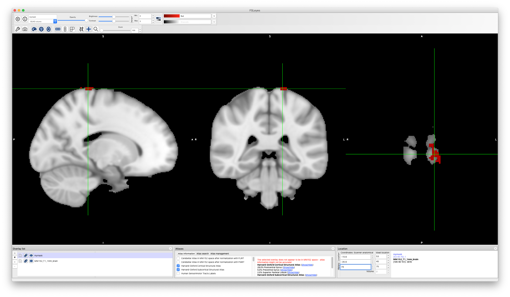
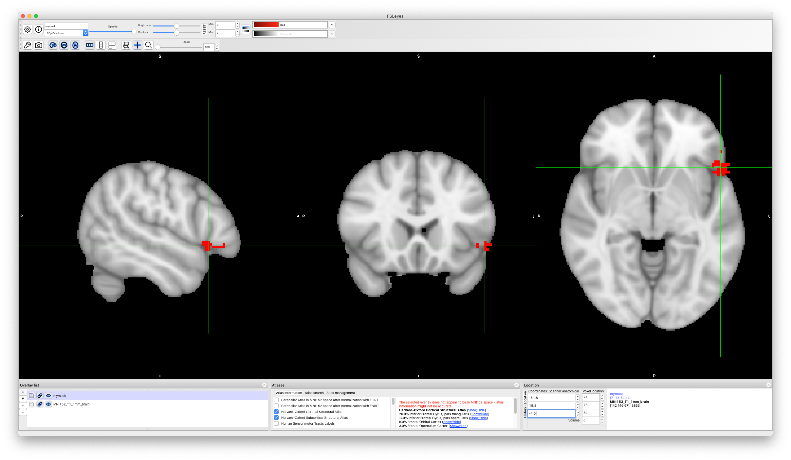

The only cluster for cognitive control was in the inferior temporal gyrus, and
it's only 50 voxels:

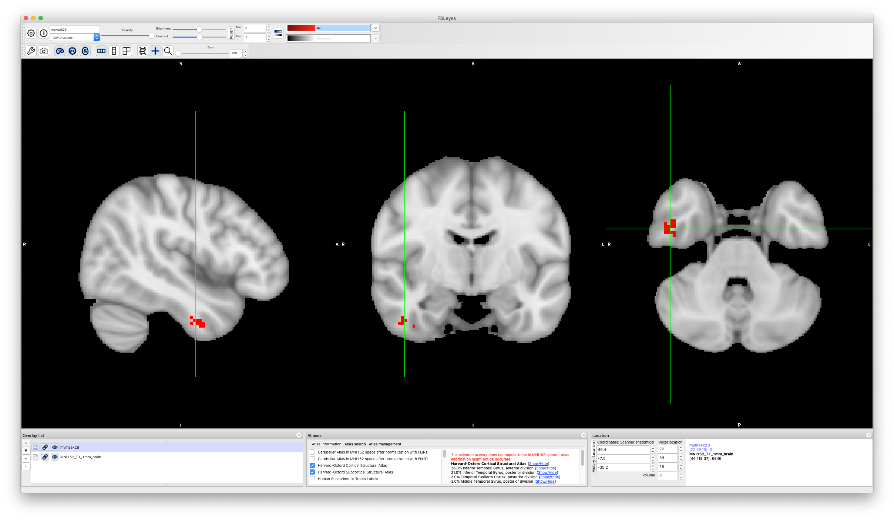

For affective we had a 61 cluster (postcentral), and a 58 cluster (postcentral too):

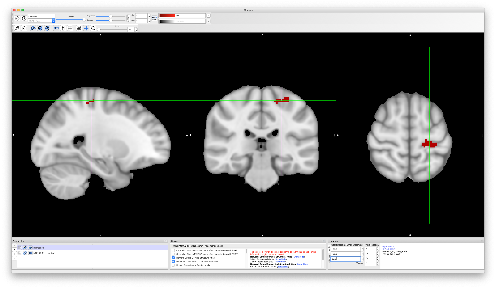
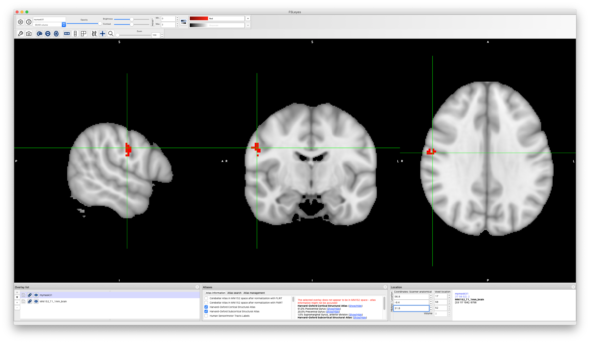

For VAN (4), we got 3 clusters above 60: SFG, lingual, and the last one looks to
be in a ventricle... never good.

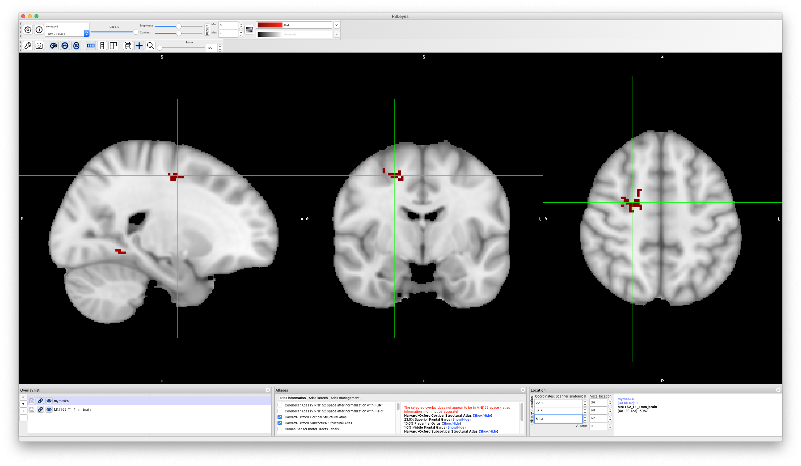
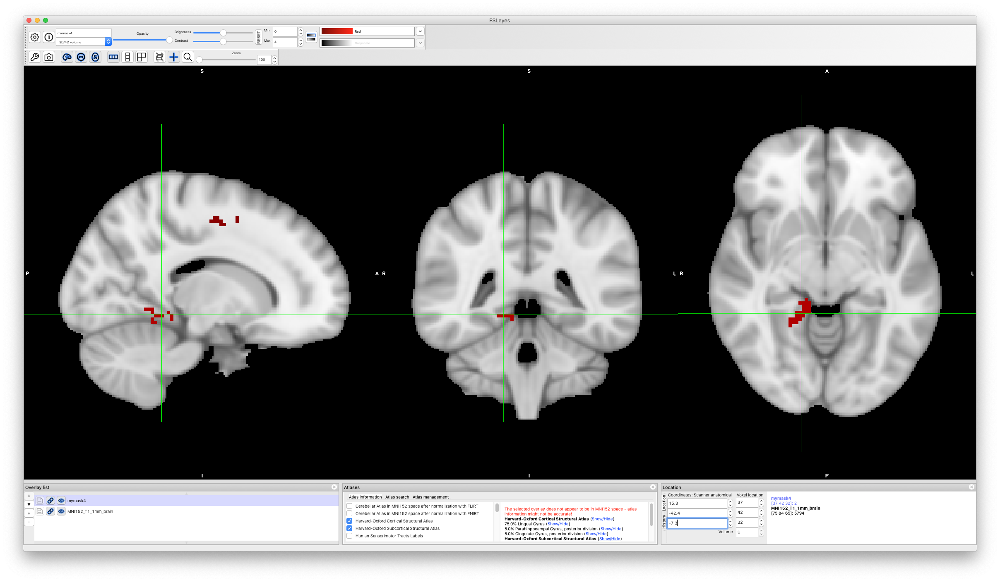
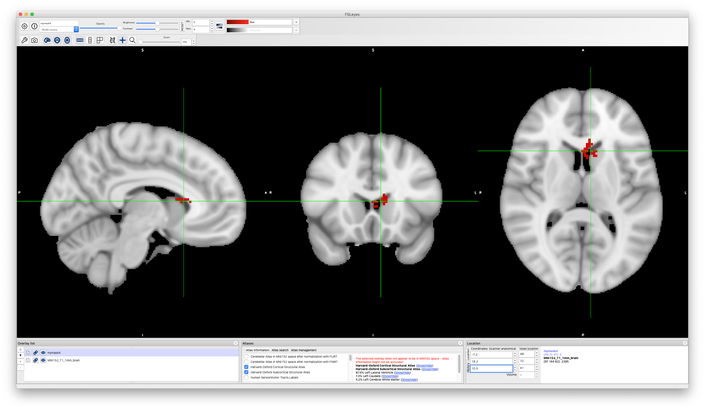

Finally, for DAN (10) only saw a single cluster above 50, and it's falling in
the white matter too... not good:

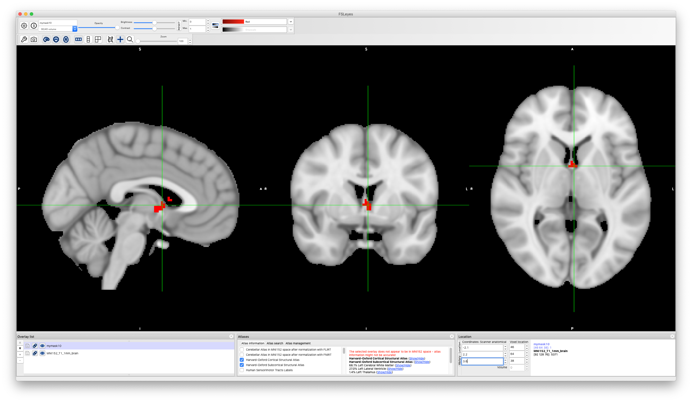

I'm not too excited about these results, so I stopped the p25 permutations.
Let's see if the FD1 or ye-Masks results are better.

# 2019-08-09 09:54:47

Let's then investigate the Yeo mask results and the MELODIC FD1 to see if
anything looks interesting. 

```bash
#desktop
cd ~/data/heritability_change/xcp-36p_despike
rm ym_clean_clusters.txt;
for f in `/bin/ls polygen_results_yeo_masks_fancy_slopesCleanFam_net*.nii`; do
    3dclust -1Dformat -nosum -1dindex 0 -1tindex 1 -1thresh 0.95 \
        -NN1 100 $f >> ym_clean_clusters.txt;
done
rm ym_clusters.txt;
for f in `/bin/ls polygen_results_yeo_masks_fancy_slopesFam_net*.nii`; do
    3dclust -1Dformat -nosum -1dindex 0 -1tindex 1 -1thresh 0.95 \
        -NN1 100 $f >> ym_clusters.txt;
done
```

I got some huge clusters, especially compared to what I was seeing for p25.
Maybe it'll be different for FD1... This is how I compare just the top 3
clusters:

```bash
for f in `/bin/ls polygen_results_yeo_masks_fancy_slopesFam_net*.nii`; do
    echo $f;
    3dclust -1Dformat -nosum -1dindex 0 -1tindex 1 -1thresh 0.95 \
        -NN1 100 $f 2>/dev/null | tail -n +13 | head -n 3;
done
```

```
polygen_results_yeo_masks_fancy_slopesFam_net0.nii
    475   -2.2   79.9   19.5  -18.0   18.0   62.0  102.0    4.0   34.0   0.5166   0.0052   0.9782    8.0   72.0   24.0 
    334  -52.5    5.1   28.3  -64.0  -38.0  -18.0   28.0   12.0   44.0   0.5066   0.0055   0.8823  -54.0   -8.0   20.0 
    130  -56.1   50.5   15.2  -68.0  -46.0   36.0   60.0    8.0   20.0   0.4603   0.0073   0.7217  -50.0   58.0   16.0 
polygen_results_yeo_masks_fancy_slopesFam_net1.nii
    168    8.9   -6.8   17.7   -2.0   16.0  -18.0    6.0    8.0   28.0   0.5072   0.0077   0.8768   12.0    0.0   16.0 
    164   41.8  -47.3   -5.0   32.0   56.0  -60.0  -36.0  -14.0    0.0   0.4857   0.0075   0.8831   36.0  -48.0   -6.0 
    161    4.5   72.4   24.4  -14.0   22.0   62.0   84.0   18.0   32.0   0.5076   0.0085   0.9145    8.0   72.0   22.0 
polygen_results_yeo_masks_fancy_slopesFam_net2.nii
    306  -51.1   60.9   33.1  -64.0  -40.0   50.0   72.0   22.0   48.0   0.4834   0.0053   0.7995  -52.0   70.0   34.0 
    180   47.3  -35.5   10.7   38.0   56.0  -48.0  -26.0    0.0   18.0   0.4989    0.008        1   54.0  -36.0   16.0 
    136   54.2   41.2   29.3   42.0   64.0   32.0   54.0   22.0   36.0   0.5249   0.0098   0.8864   54.0   38.0   30.0 
polygen_results_yeo_masks_fancy_slopesFam_net3.nii
    192  -35.6   72.8  -46.0  -44.0  -20.0   58.0   82.0  -52.0  -34.0    0.524   0.0094   0.9533  -36.0   76.0  -48.0 
    178  -28.3  -42.2   18.6  -44.0  -14.0  -54.0  -32.0    8.0   24.0   0.4857   0.0077    0.861  -30.0  -46.0   20.0 
    156   -9.1  -54.3   21.2  -28.0    4.0  -66.0  -42.0   14.0   34.0   0.4602   0.0066   0.7665    0.0  -60.0   20.0 
polygen_results_yeo_masks_fancy_slopesFam_net4.nii
    240  -42.2   58.2   -8.6  -54.0  -26.0   42.0   74.0  -18.0    6.0   0.5262   0.0073   0.9154  -40.0   54.0  -14.0 
    189   55.4   40.3   -3.6   46.0   68.0   22.0   56.0  -10.0    2.0   0.5152   0.0087        1   52.0   26.0   -2.0 
    163   10.8   68.0   16.2    0.0   24.0   50.0   80.0    4.0   26.0   0.4795   0.0073   0.8529    6.0   60.0   20.0 
polygen_results_yeo_masks_fancy_slopesFam_net5.nii
    191   42.8  -17.2    4.1   28.0   60.0  -32.0   -8.0   -8.0   18.0    0.504   0.0064   0.8476   34.0  -18.0   10.0 
    163   13.1  -48.4   15.4    0.0   34.0  -60.0  -40.0    6.0   22.0   0.5292   0.0085   0.9227   12.0  -48.0   14.0 
    135    9.4   72.4   26.0   -4.0   18.0   58.0   82.0   20.0   34.0   0.4964   0.0094   0.8721   10.0   74.0   32.0 
polygen_results_yeo_masks_fancy_slopesFam_net6.nii
    187   48.4  -18.3   30.8   38.0   56.0  -32.0   -8.0   20.0   38.0   0.5052   0.0073   0.8148   54.0  -16.0   28.0 
    181  -52.9   45.4   -0.7  -64.0  -44.0   30.0   64.0   -8.0   10.0   0.5049   0.0071   0.8025  -52.0   42.0   -2.0 
    129  -50.2   51.1   29.0  -64.0  -34.0   38.0   62.0   26.0   34.0   0.4761   0.0079    0.757  -46.0   58.0   28.0 
```

```
polygen_results_yeo_masks_fancy_slopesCleanFam_net0.nii
    424   -1.1   77.9   20.0  -18.0   18.0   62.0   92.0    6.0   30.0   0.5321   0.0056   0.9805    2.0   88.0   26.0 
    220  -52.6    7.1   30.7  -64.0  -40.0   -4.0   20.0   20.0   44.0   0.5144    0.007   0.8464  -58.0    2.0   32.0 
    120   25.2  -35.0   15.6   14.0   36.0  -44.0  -24.0    8.0   26.0   0.5389   0.0117   0.9237   28.0  -40.0   12.0 
polygen_results_yeo_masks_fancy_slopesCleanFam_net1.nii
    221    9.8   -7.8   12.6   -4.0   20.0  -18.0    6.0   -2.0   24.0   0.5266   0.0083   0.9665   12.0    0.0   16.0 
    155    3.6   73.4   25.3  -16.0   22.0   62.0   84.0   18.0   38.0   0.5128   0.0092    0.896    8.0   72.0   22.0 
    103   51.8  -35.6   14.3   46.0   56.0  -44.0  -28.0    6.0   24.0   0.5688   0.0106   0.8544   54.0  -34.0   20.0 
polygen_results_yeo_masks_fancy_slopesCleanFam_net2.nii
    158  -49.2   64.6   31.1  -58.0  -40.0   54.0   74.0   22.0   38.0   0.5108   0.0079   0.8822  -44.0   64.0   32.0 
    135   45.0  -34.2   11.0   30.0   54.0  -42.0  -26.0    2.0   20.0   0.4892   0.0083   0.9279   54.0  -36.0   16.0 
    106  -28.1   -1.2   53.7  -36.0  -16.0  -10.0    8.0   46.0   62.0   0.5072   0.0084   0.7839  -30.0   -8.0   52.0 
polygen_results_yeo_masks_fancy_slopesCleanFam_net3.nii
    148  -30.3  -50.0   18.8  -46.0  -16.0  -58.0  -40.0   14.0   24.0   0.5129   0.0088   0.8807  -28.0  -48.0   20.0 
    110  -35.2   75.1  -48.7  -44.0  -20.0   68.0   82.0  -52.0  -44.0    0.545   0.0124   0.9078  -28.0   76.0  -50.0 
    101    9.5   78.1   25.0   -8.0   18.0   68.0   88.0   20.0   32.0   0.5262   0.0101   0.8686    0.0   70.0   22.0 
polygen_results_yeo_masks_fancy_slopesCleanFam_net4.nii
    204  -41.7   58.4   -8.7  -56.0  -26.0   44.0   74.0  -18.0    4.0   0.5249   0.0078   0.8995  -40.0   54.0  -14.0 
    125    8.1  -44.7    2.6   -4.0   20.0  -52.0  -34.0   -6.0   10.0   0.5344   0.0098   0.7745   16.0  -48.0   -2.0 
polygen_results_yeo_masks_fancy_slopesCleanFam_net5.nii
    126   48.5  -17.0    1.0   36.0   60.0  -30.0   -8.0   -6.0    8.0   0.5156   0.0083   0.8868   54.0  -22.0    0.0 
    112   11.6   71.0   26.4    0.0   20.0   58.0   78.0   20.0   34.0   0.5259   0.0107   0.8721   10.0   74.0   32.0 
    111   12.9  -48.4   16.1    2.0   28.0  -58.0  -42.0   10.0   24.0   0.5396     0.01    0.871   10.0  -50.0   14.0 
polygen_results_yeo_masks_fancy_slopesCleanFam_net6.nii
    171  -53.0   44.4   -1.1  -64.0  -44.0   26.0   64.0   -8.0   12.0   0.5185   0.0076   0.8131  -54.0   40.0   -2.0 
    147  -26.6   79.5  -34.6  -40.0  -18.0   62.0   88.0  -42.0  -28.0   0.5217   0.0096        1  -26.0   86.0  -34.0 
    113    2.2   17.0   18.7  -10.0   16.0    8.0   26.0   12.0   24.0   0.5328   0.0093   0.8569    8.0   16.0   20.0 
```

Again, in general, the unClean results were better. Let's check where they are:

```bash
cd ~/data/heritability_change/xcp-36p_despike
for i in {0..6}; do
    3dclust -1Dformat -nosum -1dindex 0 -1tindex 1 -1thresh 0.95 -orient LPI \
        -savemask yeomask${i}.nii -NN1 125 \
        polygen_results_yeo_masks_fancy_slopesFam_net${i}.nii
done
```

I'll just report the top 2, mostly because I have no idea what will be
significant:

**0: visual**

First cluster is quite split, but mostly visual:
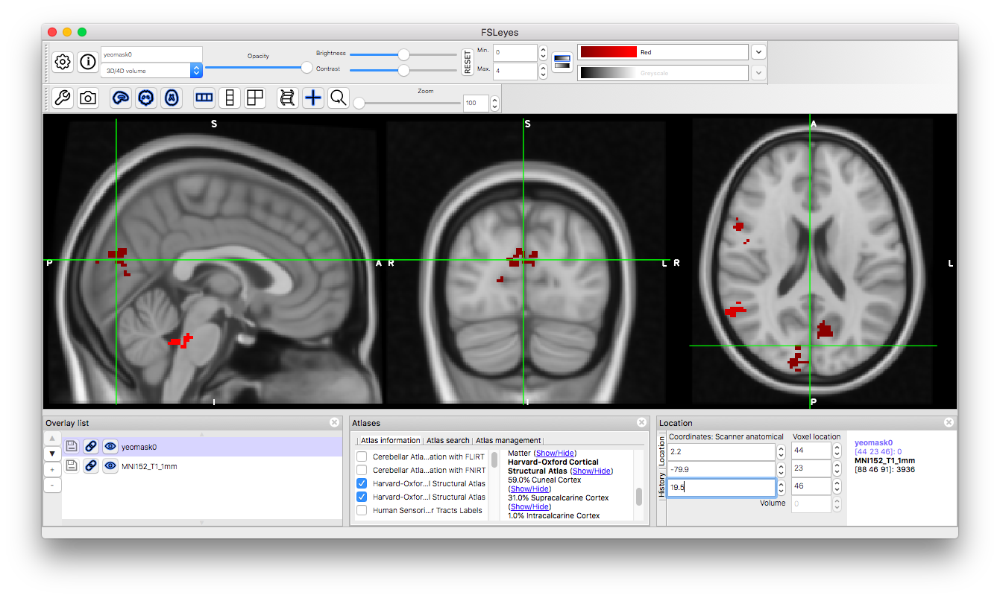

Second is somewhat somatosensory... correlated to movement?
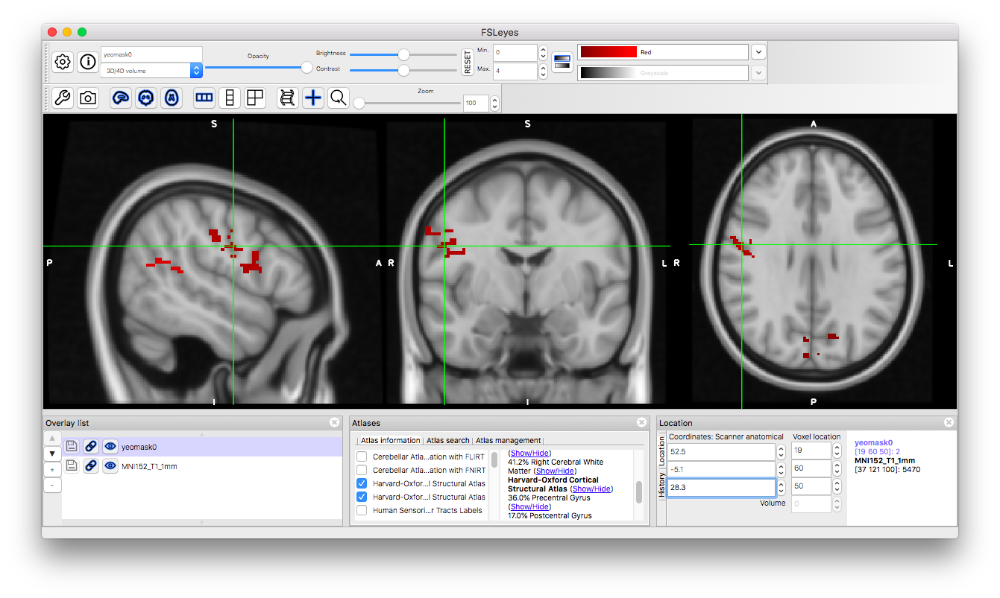

These big clusters (> 200) seem to be split clusters... need to see how
important that actually is...

**1: somatomotor**

I'll skip this one, not really important... should have skipped visual too for
that matter.

**2: DAN**
**3: VAN**
**4: limbic**
**5: cognitive (frontoparietal)**

This is one of those split clusters again... maybe it'll be better if I do NN3?

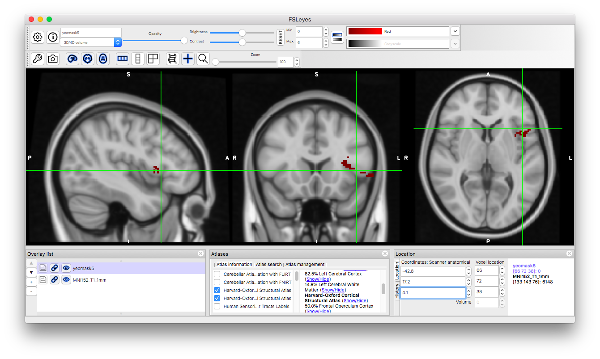

The second cluster is somewhat cingular, so that looks interesting too:

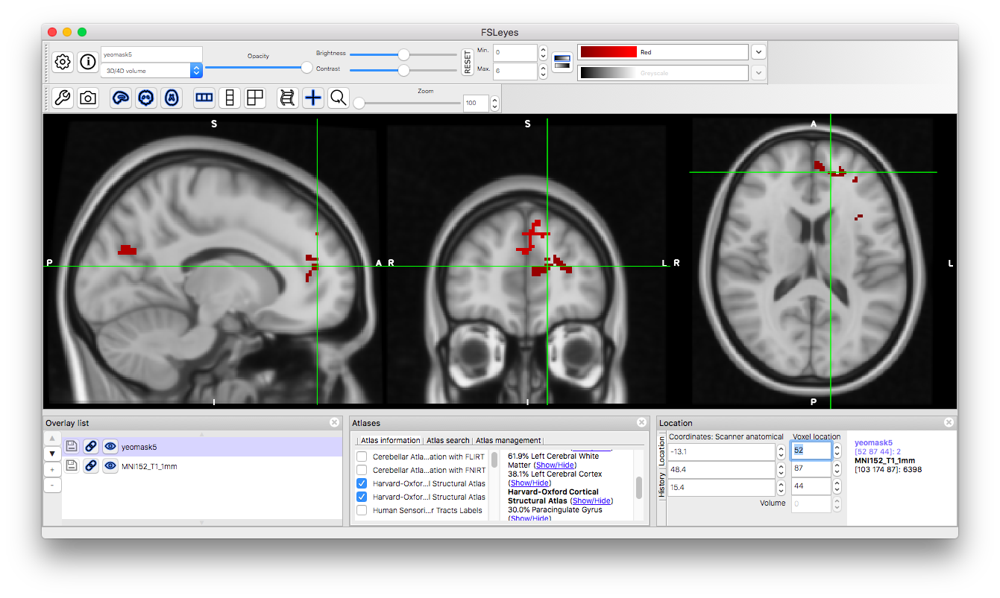

**6: DMN**

Nice MFG cluster... hopefully it's not related to movement!

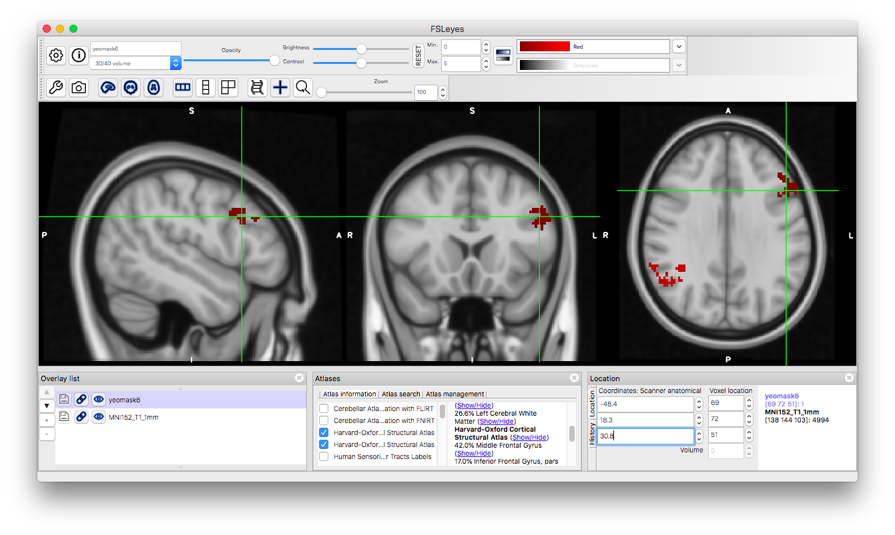

Some MTG slope is heritable as well:

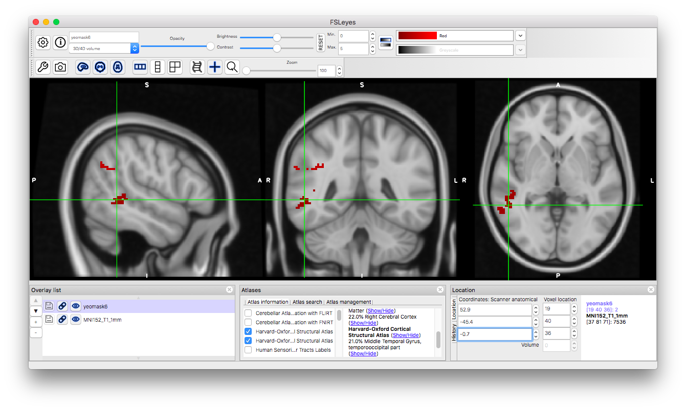

Because I'm getting a few split clusters, let me check how these clusters look
at NN3:

**6: DMN**

The first DMN cluster is a bit more generous, precuneus:

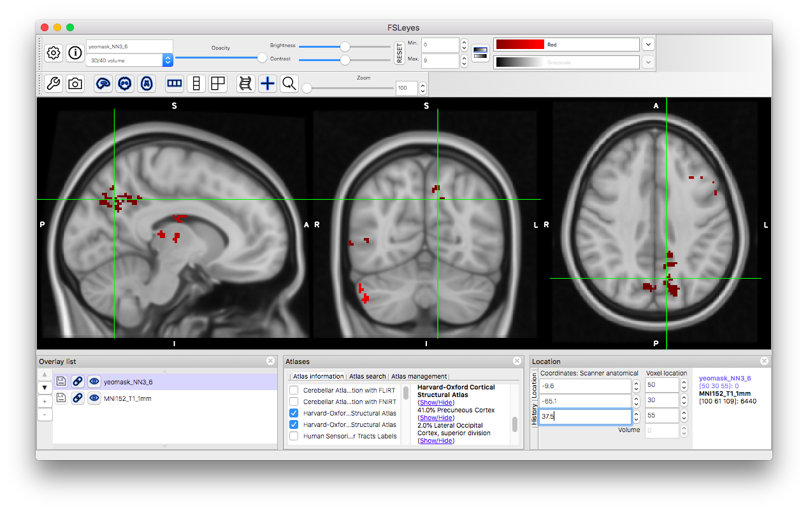

Then we get a nice and strong MTG cluster again:

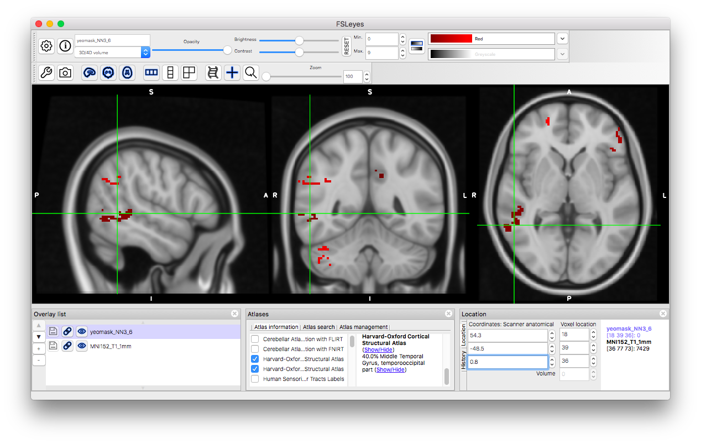

And not too far behind, we have the MFG cluster:

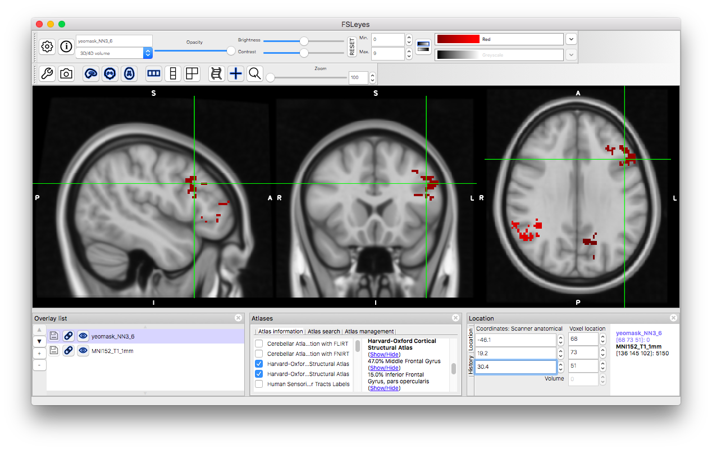

OK, these look quie interesting. Let's average them and see if there is any sort
of correlation with movement, or even better, association with ADHD. If it all
looks great, we can run some permutations.

```bash
cd ~/data/heritability_change/xcp-36p_despike/yeo_masks
3dmaskdump -mask ../group_epi_mask_fancy.nii -o yeomask_NN3_6.txt \
    ../yeomask_NN3_6.nii;
```

```r
clusters = read.table('~/data/heritability_change/xcp-36p_despike/yeo_masks/yeomask_NN3_6.txt')[, 4]
nvox = length(clusters)
cnames = sapply(1:nvox, function(d) sprintf('v%06d', d))
library(data.table)
dread = fread('~/data/heritability_change/yeo_masks_fancy_slopesFam_net6.csv',
              header = T, sep = ',')
d = as.data.frame(dread)  # just so we can index them a bit easier
cdata = d$ID
header = c()
for (myc in 1:3) {
    keep_vox = cnames[which(clusters == myc)]
    cdata = cbind(cdata, rowMeans(d[, keep_vox]))
    header = c(header, sprintf('cl%d', myc))
}
colnames(cdata) = c('ID', header)
cdata = cbind(cdata, d[, c('sex', 'SX_inatt', 'SX_HI', 'qc', 'inatt_baseline',
                                                'HI_baseline', 'DX', 'DX2')])
write.csv(cdata, row.names=F,
          file='~/data/heritability_change/xcp-36p_despike/yeo_masks/cluster_means_NN3_net6.csv')
```

```r
library(nlme)
mydir = '~/data/heritability_change/xcp-36p_despike/yeo_masks/'
p = 'cluster_means_NN3_net6'

dd = read.csv(sprintf('%s/cluster_means_NN3_net6.csv', mydir))

# to get famID
tmp = read.csv('~/data/heritability_change/resting_demo_07032019.csv')
tmp$famID = sapply(1:nrow(tmp), function(x)
                                if (is.na(tmp$Extended.ID...FamilyIDs[x])) {
                                    tmp$Nuclear.ID...FamilyIDs[x]
                                }
                                else {
                                    tmp$Extended.ID...FamilyIDs[x]
                                }
                    )
tmp2 = tmp[, c('Medical.Record...MRN', 'famID')]
tmp3 = tmp2[!duplicated(tmp2[, 'Medical.Record...MRN']), ]
data = merge(dd, tmp3, by.x='ID', by.y='Medical.Record...MRN', all.x=T, all.y=F)

targets = colnames(data)[grepl(colnames(data), pattern='cl')]
for (t in targets) {
    data[, t] = as.numeric(as.character(data[, t]))
}
predictors = c('SX_inatt', 'SX_HI', 'inatt_baseline', 'HI_baseline' )
for (t in predictors) {
    data[, t] = as.numeric(as.character(data[, t]))
}

out_fname = sprintf('%s/assoc_LME_%s.csv', mydir, p)
predictors = c('SX_inatt', 'SX_HI', 'inatt_baseline', 'HI_baseline', 'DX',
                'DX2')
hold=NULL
for (i in targets) {
    cat(sprintf('%s\n', i))
    for (j in predictors) {
        fm_str = sprintf('%s ~ %s + sex', i, j)
        model1<-try(lme(as.formula(fm_str), data, ~1|famID, na.action=na.omit))
        if (length(model1) > 1) {
            temp<-summary(model1)$tTable
            a<-as.data.frame(temp)
            a$formula<-fm_str
            a$target = i
            a$predictor = j
            a$term = rownames(temp)
            hold=rbind(hold,a)
        } else {
            hold=rbind(hold, NA)
        }
    }
}
write.csv(hold, out_fname, row.names=F)

data2 = data[data$DX=='ADHD', ]
out_fname = gsub('.csv', x=out_fname, '_dx1.csv')
predictors = c('SX_inatt', 'SX_HI', 'inatt_baseline', 'HI_baseline' )
hold=NULL
for (i in targets) {
    cat(sprintf('%s\n', i))
    for (j in predictors) {
        fm_str = sprintf('%s ~ %s + sex', i, j)
        model1<-try(lme(as.formula(fm_str), data2, ~1|famID, na.action=na.omit))
        if (length(model1) > 1) {
            temp<-summary(model1)$tTable
            a<-as.data.frame(temp)
            a$formula<-fm_str
            a$target = i
            a$predictor = j
            a$term = rownames(temp)
            hold=rbind(hold,a)
        } else {
            hold=rbind(hold, NA)
        }
    }
}
write.csv(hold, out_fname, row.names=F)

data2 = data[data$DX2=='ADHD', ]
out_fname = gsub('dx1', x=out_fname, 'dx2')
hold=NULL
for (i in targets) {
    cat(sprintf('%s\n', i))
    for (j in predictors) {
        fm_str = sprintf('%s ~ %s + sex', i, j)
        model1<-try(lme(as.formula(fm_str), data2, ~1|famID, na.action=na.omit))
        if (length(model1) > 1) {
            temp<-summary(model1)$tTable
            a<-as.data.frame(temp)
            a$formula<-fm_str
            a$target = i
            a$predictor = j
            a$term = rownames(temp)
            hold=rbind(hold,a)
        } else {
            hold=rbind(hold, NA)
        }
    }
}
write.csv(hold, out_fname, row.names=F)
```

This is an interesting results for cluster 1, NN3, dx2:

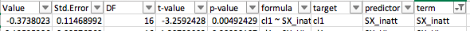

It's not there for DX or DX1. And I had already showed that it's not correlated
with movement:

```
> cor.test(data$qc, data$cl1)

        Pearson's product-moment correlation

data:  data$qc and data$cl1
t = 0.79795, df = 137, p-value = 0.4263
alternative hypothesis: true correlation is not equal to 0
95 percent confidence interval:
 -0.09961322  0.23189040
sample estimates:
       cor 
0.06801567 
```

Now, this is definitely worth running some permutations!!! Even though the other
ones are not associated, it'll be cool if they're significantly heritable.

```r
m = 6
start=1
nperms = 100
step=10

library(data.table)
dread = fread(sprintf('~/data/heritability_change/yeo_masks_fancy_slopesFam_net%d.csv', m),
              header = T, sep = ',')
d = as.data.frame(dread)  # just so we can index them a bit easier
vcols = c(which(grepl("v",colnames(d))), which(grepl("sex",colnames(d))))
d2 = d
for (p in seq(start, nperms, step)) {
    d2[, vcols] = d[sample(nrow(d)), vcols]
    fname = sprintf('~/data/heritability_change/yeo_masks_fancy_slopesFam_net%d_p%03d.csv', m, p)
    print(fname)
    fwrite(d2, file=fname, row.names=F, quote=F)
}
```

```bash
cd ~/data/heritability_change/xcp-36p_despike;
i=6
for p in {1..100}; do
    perm=`printf %03d $p`;
    phen_file=yeo_masks_fancy_slopesFam_net${i}_p${perm};
    swarm_file=swarm.yeo${i}p${perm};

    for vlist in `ls $PWD/vlist*txt`; do  # getting full path to files
        echo "bash ~/research_code/run_solar_voxel_parallel.sh $phen_file $vlist" >> $swarm_file;
    done;
done

for p in {5..100}; do
    perm=`printf %03d $p`;
    jname=yeo${i}p${perm};
    swarm_file=swarm.${jname};
    echo "ERROR" > swarm_wait;
    while grep -q ERROR swarm_wait; do
        echo "Trying $jname"
        swarm --gres=lscratch:10 -f $swarm_file --module solar -t 32 -g 10 \
                --logdir=trash_${jname} --job-name ${jname} --time=4:00:00 --merge-output \
                --partition quick,norm 2> swarm_wait;
        if grep -q ERROR swarm_wait; then
            echo -e "\tError, sleeping..."
            sleep 30m;
        fi;
    done;
done
```

Let this running in the cluster during the weekend...


Now, since we had a moderate success with DMN, why not look at the other
interesting networks? Let's just look at top 3, and then we can always narrow it
down (or go nuts) based on permutation results of any interesting networks:

```bash
cd ~/data/heritability_change/xcp-36p_despike/
for i in 2 3 4 5; do
    3dclust -1Dformat -nosum -1dindex 0 -1tindex 1 -1thresh 0.95 -orient LPI \
        -savemask yeomask_NN3_${i}.nii -NN3 125 \
        polygen_results_yeo_masks_fancy_slopesFam_net${i}.nii
done

cd yeo_masks
for i in 2 3 4 5; do
    3dmaskdump -mask ../group_epi_mask_fancy.nii -o yeomask_NN3_${i}.txt \
        ../yeomask_NN3_${i}.nii;
done
```

**Note that I haven't really visualized these NN3 clusters yet. So, they might be
a bust to begin with!**

```r
for (i in c(2, 3, 4, 5)) {
    fname=sprintf('~/data/heritability_change/xcp-36p_despike/yeo_masks/yeomask_NN3_%d.txt', i)
    clusters = read.table(fname)[, 4]
    nvox = length(clusters)
    cnames = sapply(1:nvox, function(d) sprintf('v%06d', d))
    library(data.table)
    fname = sprintf('~/data/heritability_change/yeo_masks_fancy_slopesFam_net%d.csv', i)
    dread = fread(fname, header = T, sep = ',')
    d = as.data.frame(dread)  # just so we can index them a bit easier
    cdata = d$ID
    header = c()
    for (myc in 1:3) {
        keep_vox = cnames[which(clusters == myc)]
        cdata = cbind(cdata, rowMeans(d[, keep_vox]))
        header = c(header, sprintf('cl%d', myc))
    }
    colnames(cdata) = c('ID', header)
    cdata = cbind(cdata, d[, c('sex', 'SX_inatt', 'SX_HI', 'qc', 'inatt_baseline',
                                                    'HI_baseline', 'DX', 'DX2')])
    fname = sprintf('~/data/heritability_change/xcp-36p_despike/yeo_masks/cluster_means_NN3_net%d.csv', i)
    write.csv(cdata, row.names=F,
            file=fname)
}
```

# 2019-08-12 10:01:44

```r
source('~/research_code/baseline_prediction/aux_functions.R')
mydir = '~/data/heritability_change/xcp-36p_despike/yeo_masks/'
data = read.csv(sprintf('%s/cluster_means_NN3_net6.csv', mydir))
data2 = data[data$DX2=='ADHD', ]
ggplotRegression(lm('cl1 ~ SX_inatt + sex', data2, na.action=na.omit))
```

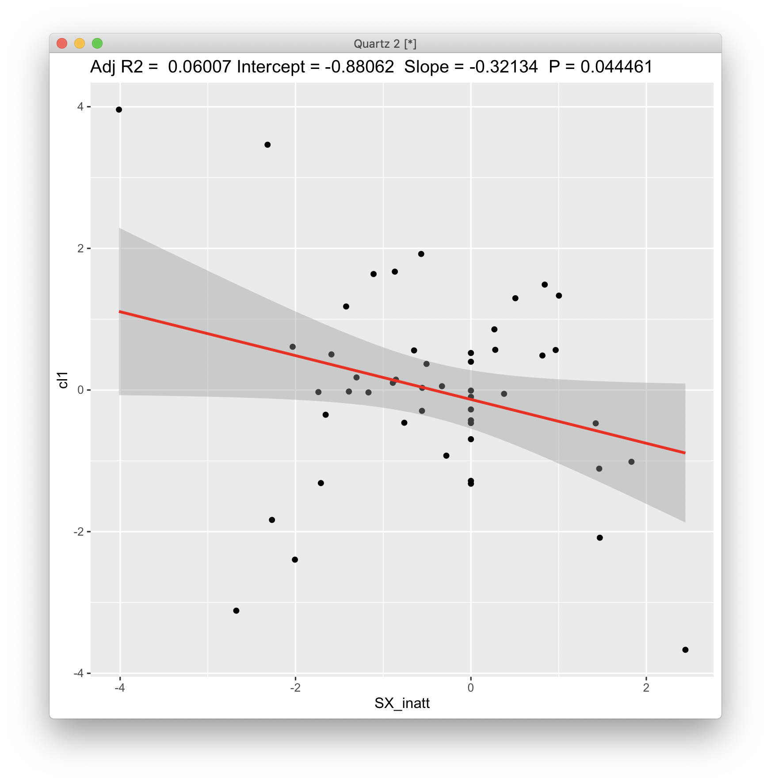

It looks OK, but we should probably check whether it survives non-parametric
tests. That's also LM and not LME, so that's why the values are different.

I'll also try to run the non-Z values, as recommended by the FSL folks (note
33).

Now, let's see how significant the cluster actually is. 

```bash
module load afni

cd /lscratch/${SLURM_JOBID}
net=6;
for i in {1..100}; do
    perm=`printf %03d ${i}`;
    phen=yeo_masks_fancy_slopesFam_net${net}_p${perm};
    mkdir $phen;
    cd $phen;
    cp ~/data/tmp/$phen/*.out ~/data/tmp/${phen}/*gz .;
    for f in `/bin/ls *gz`; do tar -zxf $f; done
    cd ..
    python ~/research_code/fmri/compile_solar_voxel_results.py \
        /lscratch/${SLURM_JOBID}/ $phen \
        ~/data/heritability_change/xcp-36p_despike/group_epi_mask_fancy.nii;
    rm -rf $phen;
done
```

While that's compiling, let's see if there is any other significant relationship
for nets 2:5. 

```r
library(nlme)
mydir = '~/data/heritability_change/xcp-36p_despike/yeo_masks/'
for (i in 2:5) {
    p = sprintf('cluster_means_NN3_net%d', i)

    dd = read.csv(sprintf('%s/cluster_means_NN3_net%d.csv', mydir, i))

    # to get famID
    tmp = read.csv('~/data/heritability_change/resting_demo_07032019.csv')
    tmp$famID = sapply(1:nrow(tmp), function(x)
                                    if (is.na(tmp$Extended.ID...FamilyIDs[x])) {
                                        tmp$Nuclear.ID...FamilyIDs[x]
                                    }
                                    else {
                                        tmp$Extended.ID...FamilyIDs[x]
                                    }
                        )
    tmp2 = tmp[, c('Medical.Record...MRN', 'famID')]
    tmp3 = tmp2[!duplicated(tmp2[, 'Medical.Record...MRN']), ]
    data = merge(dd, tmp3, by.x='ID', by.y='Medical.Record...MRN', all.x=T, all.y=F)

    targets = colnames(data)[grepl(colnames(data), pattern='cl')]
    for (t in targets) {
        data[, t] = as.numeric(as.character(data[, t]))
    }
    predictors = c('SX_inatt', 'SX_HI', 'inatt_baseline', 'HI_baseline' )
    for (t in predictors) {
        data[, t] = as.numeric(as.character(data[, t]))
    }

    out_fname = sprintf('%s/assoc_LME_%s.csv', mydir, p)
    predictors = c('SX_inatt', 'SX_HI', 'inatt_baseline', 'HI_baseline', 'DX',
                    'DX2')
    hold=NULL
    for (i in targets) {
        cat(sprintf('%s\n', i))
        for (j in predictors) {
            fm_str = sprintf('%s ~ %s + sex', i, j)
            model1<-try(lme(as.formula(fm_str), data, ~1|famID, na.action=na.omit))
            if (length(model1) > 1) {
                temp<-summary(model1)$tTable
                a<-as.data.frame(temp)
                a$formula<-fm_str
                a$target = i
                a$predictor = j
                a$term = rownames(temp)
                hold=rbind(hold,a)
            } else {
                hold=rbind(hold, NA)
            }
        }
    }
    write.csv(hold, out_fname, row.names=F)

    data2 = data[data$DX=='ADHD', ]
    out_fname = gsub('.csv', x=out_fname, '_dx1.csv')
    predictors = c('SX_inatt', 'SX_HI', 'inatt_baseline', 'HI_baseline' )
    hold=NULL
    for (i in targets) {
        cat(sprintf('%s\n', i))
        for (j in predictors) {
            fm_str = sprintf('%s ~ %s + sex', i, j)
            model1<-try(lme(as.formula(fm_str), data2, ~1|famID, na.action=na.omit))
            if (length(model1) > 1) {
                temp<-summary(model1)$tTable
                a<-as.data.frame(temp)
                a$formula<-fm_str
                a$target = i
                a$predictor = j
                a$term = rownames(temp)
                hold=rbind(hold,a)
            } else {
                hold=rbind(hold, NA)
            }
        }
    }
    write.csv(hold, out_fname, row.names=F)

    data2 = data[data$DX2=='ADHD', ]
    out_fname = gsub('dx1', x=out_fname, 'dx2')
    hold=NULL
    for (i in targets) {
        cat(sprintf('%s\n', i))
        for (j in predictors) {
            fm_str = sprintf('%s ~ %s + sex', i, j)
            model1<-try(lme(as.formula(fm_str), data2, ~1|famID, na.action=na.omit))
            if (length(model1) > 1) {
                temp<-summary(model1)$tTable
                a<-as.data.frame(temp)
                a$formula<-fm_str
                a$target = i
                a$predictor = j
                a$term = rownames(temp)
                hold=rbind(hold,a)
            } else {
                hold=rbind(hold, NA)
            }
        }
    }
    write.csv(hold, out_fname, row.names=F)
}
```

There was something for NN3 cluster 2 in limbic:

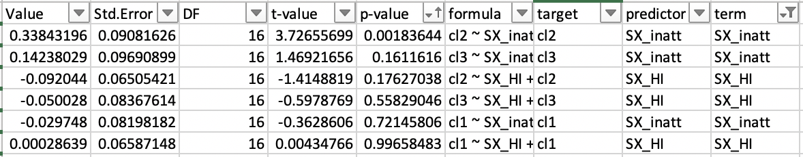

And for NN3 cluster 3 in cognitive:

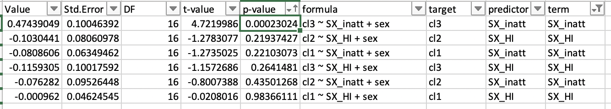

Nothing for DAN or VAN. These could also be outliers, or won't survive
permutations later... but it's something. Those are all DX2 results, so let's
see if there is anything else... yep. Both results are still there when looking
at DX1 only. Let's see where those results are:

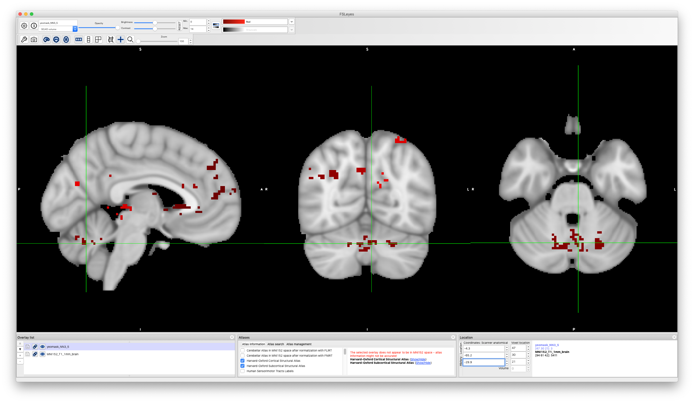

I'm getting a cerebellar cluster for cognitive, but it's only 205 voxels... not
sure if it's big enough. 

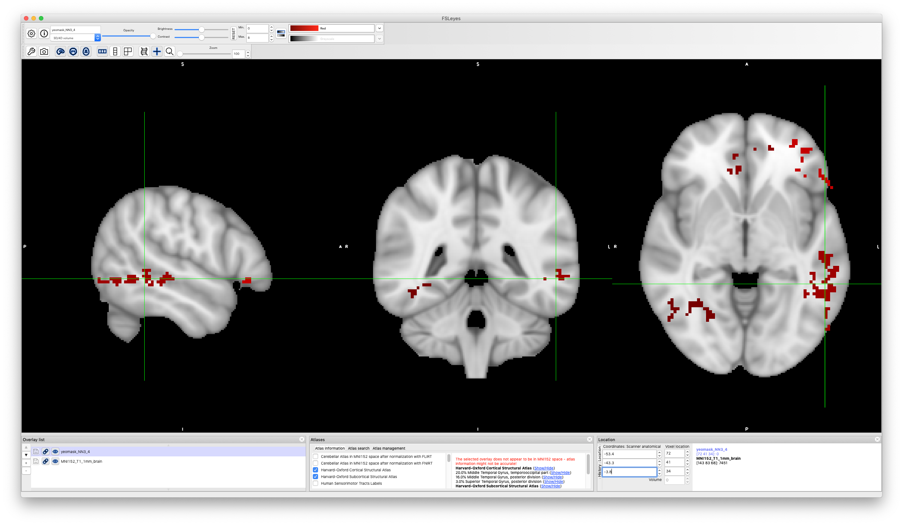

For limbic cluster 2 is 276 voxels big and it's located in MTG, so not bad.

Just because the cluster will be idle while the noZ slopes are computing, I'm
going to start permutations for cognitive and maybe limbic, using the code from
above.

And now that the DMN results are compiled, let's see how good our current
clusters actually are:

```bash
cd ~/data/heritability_change/xcp-36p_despike/perms
res=`3dclust -1Dformat -nosum -1dindex 0 -1tindex 1 -1thresh 0.95 -NN3 200 \
    -quiet polygen_results_yeo_masks_fancy_slopesFam_net6_p*.nii | grep CLUSTERS | wc -l`
nperms=`ls -1 polygen_results_yeo_masks_fancy_slopesFam_net6_p*.nii | wc -l`;
p=$(bc <<<"scale=3;($nperms - $res)/$nperms")
echo negatives=${res}, perms=${nperms}, pval=$p
```

Oh wow, for NN3 even 300 voxel clusters are not even close to significance. LEt
me see what I get for NN1 and NN2... no luck. Oh well... WAIT! ARE ALL MY RANDOM
FILES DIFFERENT? Maybe when I created them in individual R sessions, they all
got the same seed? Good try... but no, they're all different :(

I still have the cognitive network permutations running. But I can also try the
nonZ data files when they are done being created, and also play a bit with ALFF
and reho. 

# TODO
