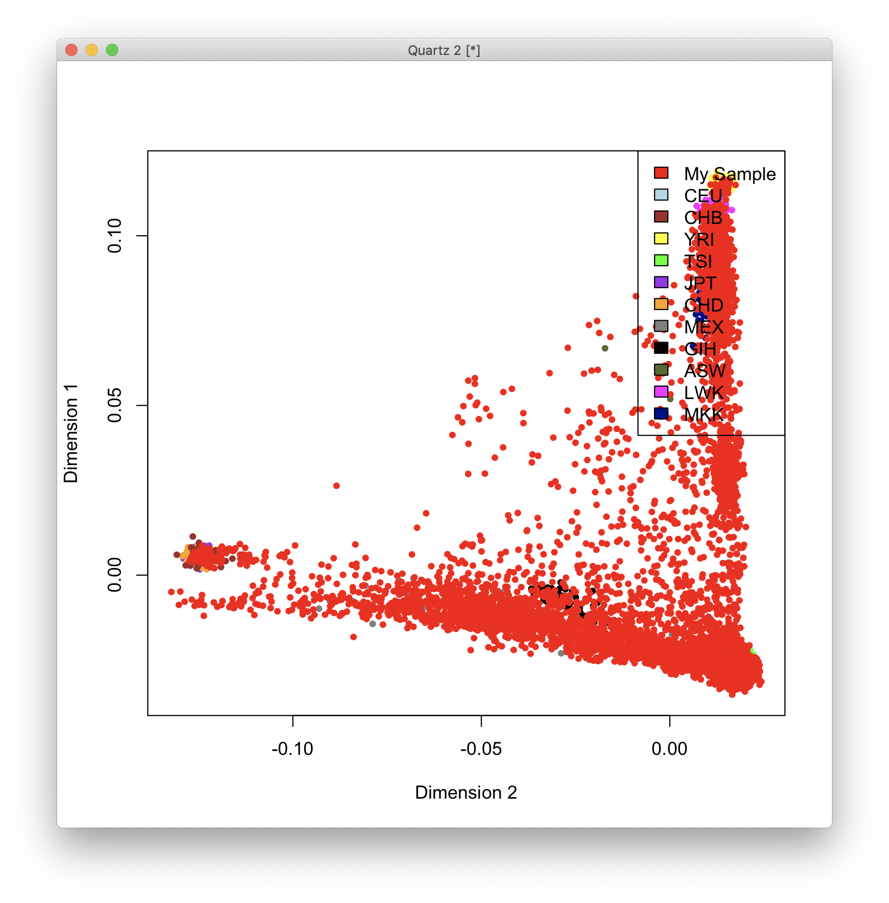
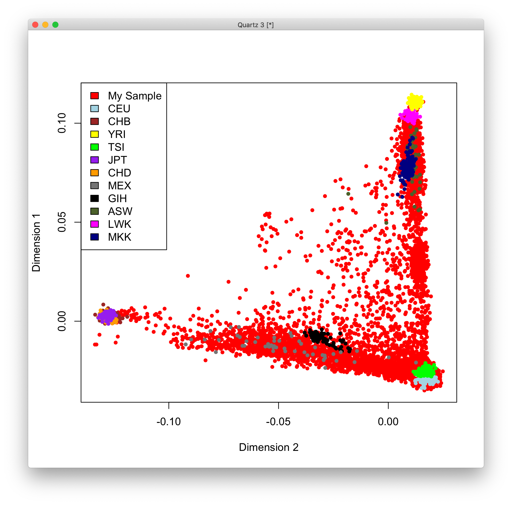
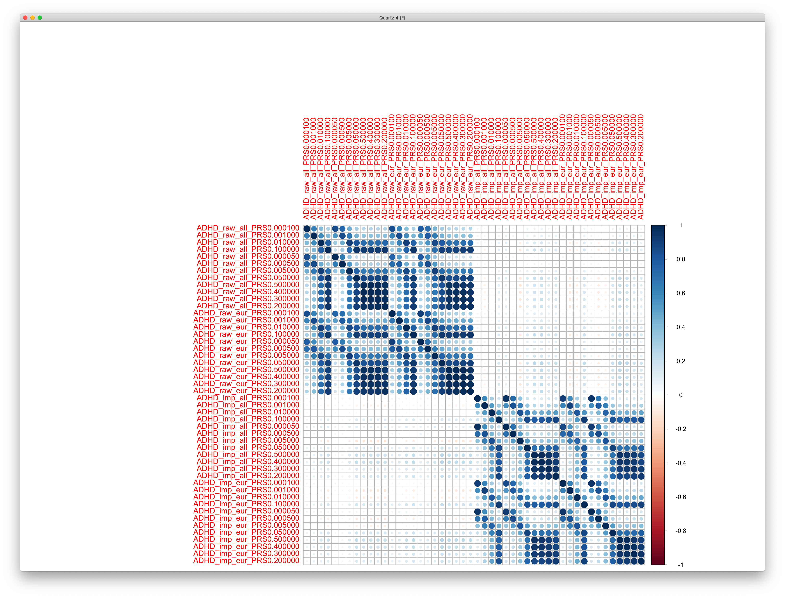
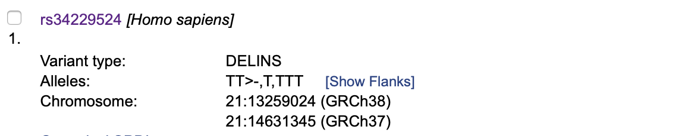

# 2019-08-02 11:09:53

Philip asked me to generate PRS for the ABCD data we downloaded. Because we ran
our PRS on the imputed data, let's go ahead and merge that into PLINK format to
make things run faster.

```bash
# bw
module load plink
cd /data/NCR_SBRB/ABCD/imputed_1KG/
for c in {1..22}; do
    plink --vcf chr${c}.dose.vcf.gz --biallelic-only strict \
        --double-id --make-bed --out chr${c};
done
for c in {2..22}; do
    echo chr${c} >> merge_list.txt;
done
plink --bfile chr1 --merge-list merge_list.txt  --make-bed --out merged_1KG
```

I'm actually not sure if I can load all this data into memory, so I might need
to split into chuncks of 1K subjects and then just concatenate them later...
let's see.

But it was actually taking a long time just to convert from dosage files to
bim/bam. So, let's do this without imputation first:


```bash
cd /data/NCR_SBRB/ABCD/
mkdir prs_pgc2017
module load R
R --file=${HOME}/PRSice_v1.25/PRSice_v1.25.R -q --args  \
  plink  ${HOME}/PRSice_v1.25/plink_1.9_linux_160914 \
  base ~/pgc2017/adhd_jun2017  \
  target ../ABCD_release_2_genomics_smokescreen/ABCD_release_2.0_r2 \
  report.individual.scores T \
  wd ./prs_pgc2017 \
  cleanup F \
  report.best.score.only F \
  covary F \
  fastscore T \
  barchart.levels 1e-5,1e-4,1e-3,1e-2,1e-1,5e-5,5e-4,5e-3,5e-2,2e-1,3e-1,4e-1,5e-1
  
Rscript ~/research_code/lab_mgmt/collect_PRS.R
```

# 2019-08-05 12:21:59

This didn't quite work, and I'll need to reduce the files to see what's going
on:

```bash
# bw
cd /data/NCR_SBRB/ABCD/ABCD_release_2_genomics_smokescreen
head -n 100 ABCD_release_2.0_r2.fam > first100.txt
module load plink
plink -bfile ABCD_release_2.0_r2 --keep first100.txt --make-bed --out ABCD_release_2.0_r2_first100
module load R

cd /data/NCR_SBRB/ABCD/
R --file=${HOME}/PRSice_v1.25/PRSice_v1.25.R -q --args  \
  plink  ${HOME}/PRSice_v1.25/plink_1.9_linux_160914 \
  base ~/pgc2017/adhd_jun2017_fast  \
  target ../ABCD_release_2_genomics_smokescreen/ABCD_release_2.0_r2_first100 \
  report.individual.scores T \
  wd ./prs_pgc2017 \
  cleanup F \
  report.best.score.only F \
  covary F \
  fastscore T \
  barchart.levels 1e-5,1e-4,1e-3,1e-2,1e-1,5e-5,5e-4,5e-3,5e-2,2e-1,3e-1,4e-1,5e-1
```

But since we're doing this from scratch, let's use the new version of PRSice
from http://www.prsice.info:

```bash
cd /data/NCR_SBRB/ABCD/
Rscript /data/NCR_SBRB/software/PRSice_2.2.5/PRSice.R  \
    --prsice /data/NCR_SBRB/software/PRSice_2.2.5/PRSice_linux \
    --base ~/pgc2017/adhd_jun2017_fast  \
    --target /data/NCR_SBRB/ABCD/ABCD_release_2_genomics_smokescreen/ABCD_release_2.0_r2_first100 \
    --all-score \
    --lower 5e-08 --upper .5 --interval 5e-05 \
    --no-regress
```

Note that in this new version we get all the values in .all.score file that are
specified between lower and upper. The bar-levels variable is only there for
plotting!

So, now we should be able to run the entire thing:

```bash
cd /data/NCR_SBRB/ABCD/
Rscript /data/NCR_SBRB/software/PRSice_2.2.5/PRSice.R  \
    --prsice /data/NCR_SBRB/software/PRSice_2.2.5/PRSice_linux \
    --base ~/pgc2017/adhd_jun2017  \
    --target /data/NCR_SBRB/ABCD/ABCD_release_2_genomics_smokescreen/ABCD_release_2.0_r2 \
    --all-score \
    --lower 5e-08 --upper .5 --interval 5e-05 \
    --no-regress \
    --out ABCD_rel2_PRS_adhd_jun2017
```

Since we're here, we might as well compute the PRS for SCZ and ASD using rps.txt
and daner_AUT_meta14_WW_all.hg19.Mar2016_info_0.60_maf_0.05_release_Jun2017.tsv
(respectively), following the original Evernote note. Note that I used --stat OR
to make the ASD file run, as it had both BETA and OR columns.

I also did the PRS for WNH only, using adhd_eur_jun2017.

Then, we compute the usual population components (MDS, actually) using KING:

```bash
#bw
cd /data/NCR_SBRB/ABCD/
/data/NCR_SBRB/software/KING/king --mds --cpus 30 \
    -b /data/NCR_SBRB/ABCD/ABCD_release_2_genomics_smokescreen/ABCD_release_2.0_r2.bed
```

*This took 8h for the SVD step!!!*

Finally, merge everything:

```r
# this takes a while because we're reading in TXT files!
a = read.table('/data/NCR_SBRB/ABCD/ABCD_rel2_PRS_adhd_jun2017.all.score', header=1)
b = read.table('/data/NCR_SBRB/ABCD/ABCD_rel2_PRS_adhd_eur_jun2017.all.score', header=1)
s = read.table('/data/NCR_SBRB/ABCD/SCZ.all.score', header=1)
d = read.table('/data/NCR_SBRB/ABCD/ASD.all.score', header=1)
pcs = read.table('/data/NCR_SBRB/ABCD/kingpc.ped')

# keep only some of the PRs columns that were created
mycols = c('IID', 'X0.00010005', 'X0.00100005', 'X0.01', 'X0.1',
            'X5.005e.05', 'X0.00050005', 'X0.00500005', 'X0.0500001',
            'X0.5', 'X0.4', 'X0.3', 'X0.2')
new_names = c('IID', sapply(c(.0001, .001, .01, .1, .00005, .0005, .005, .05,
                              .5, .4, .3, .2),
                            function(x) sprintf('ADHD_PRS%f', x)))
af = a[, mycols]
colnames(af) = new_names
bf = b[, mycols]
new_names = gsub('ADHD', x=new_names, 'ADHDeur')
colnames(bf) = new_names
df = d[, mycols]
new_names = gsub('ADHDeur', x=new_names, 'ASD')
colnames(df) = new_names
mycols = c('IID', 'X0.00010005', 'X0.00100005', 'X0.01', 'X0.1',
            'X5.005e.05', 'X0.00050005', 'X0.00500005', 'X0.0500001',
            'X0.5', 'X0.4001', 'X0.3002', 'X0.2002')
sf = s[,mycols]
new_names = gsub('ASD', x=new_names, 'SCZ')
colnames(sf) = new_names

m = merge(af, bf, by='IID')
m = merge(m, df, by='IID')
m = merge(m, sf, by='IID')

pcsf = pcs[, c(2, 7:26)]
new_names = c('IID', sapply(1:20, function(x) sprintf('PC%.2d', x)))
colnames(pcsf) = new_names
m = merge(m, pcsf, by='IID')

m = merge(pcs[, 1:2], m, by.x='V2', by.y='IID')
colnames(m)[1:2] = c('IID', 'FID')
write.csv(m, file='/data/NCR_SBRB/ABCD/merged_PRS_08062019.csv', row.names=F)
```

# 2019-09-13 13:08:02

Sam is having issues defining the ethnic groups based on the MDS components. So,
I'm running the pca through KING as well, just in case:

I'm also running MDS through plink, following the ENIGMA pipeline, to see if we
get anything better:

http://enigma.ini.usc.edu/wp-content/uploads/2012/07/ENIGMA2_1KGP_cookbook_v3.pdf

So, it goes like this:

```bash
cd /data/NCR_SBRB/ABCD/
wget "http://enigma.ini.usc.edu/wp-content/uploads/2012/07/HM3.bed.gz"
wget "http://enigma.ini.usc.edu/wp-content/uploads/2012/07/HM3.bim.gz"
wget "http://enigma.ini.usc.edu/wp-content/uploads/2012/07/HM3.fam.gz"
export datafileraw=/data/NCR_SBRB/ABCD/ABCD_release_2_genomics_smokescreen/ABCD_release_2.0_r2
plink --bfile $datafileraw --hwe 1e-6 --geno 0.05 --maf 0.01 --noweb --make-bed --out ${datafileraw}_filtered
gunzip HM3*.gz
export datafile=${datafileraw}_filtered
awk '{print $2}' HM3.bim > HM3.snplist.txt
plink --bfile ${datafile} --extract HM3.snplist.txt --make-bed --noweb --out local
awk '{ if (($5=="T" && $6=="A")||($5=="A" && $6=="T")||($5=="C" && $6=="G")||($5=="G" && $6=="C")) print $2, "ambig" ; else print $2 ;}' $datafile.bim | grep -v ambig > local.snplist.txt
plink --bfile HM3 --extract local.snplist.txt --make-bed --noweb --out external
plink --bfile local --bmerge external.bed external.bim external.fam --make-bed --noweb --out HM3merge
plink --bfile local --flip HM3merge-merge.missnp --make-bed --noweb --out flipped
plink --bfile flipped --bmerge external.bed external.bim external.fam --make-bed --noweb --out HM3merge
plink --bfile HM3merge --cluster --mind .05 --mds-plot 10 --extract local.snplist.txt --noweb --out HM3mds
```

BTW, using straight up PCA in KING is not converging, even after 24h.

# 2019-09-18 10:26:38

Philip asked to join the PNC and our cohort with the ABCD data before generating
the MDS components according to the ENIGMA paradigm. First, we need to figure
out what's going on with PNC genomics. The most recent version of the dbGap link is this one:
https://www.ncbi.nlm.nih.gov/projects/gap/cgi-bin/study.cgi?study_id=phs000607.v3.p2,
, according to the original PNC paper:
https://www.sciencedirect.com/science/article/pii/S1053811915002529?via%3Dihub#s0015

I downloaded the data a while ago, and it looks like all samples the first
version are in the second version. 

```bash
HG-02113362-DM4:GenotypeFiles sudregp$ wc -l */_*
    8715 phg000381.v2.NIMH_NeurodevelopmentalGenomics.sample-info.MULTI/_fam_sub_mot_fat_sam_sex_con_file_7removed
    9269 phg000661.v1.NIMH_NeurodevelopmentalGenomics_v2.sample-info.MULTI/_fam_sub_mot_fat_sam_sex_con_use-nosra
   17984 total
HG-02113362-DM4:GenotypeFiles sudregp$ head phg000381.v2.NIMH_NeurodevelopmentalGenomics.sample-info.MULTI/_fam_sub_mot_fat_sam_sex_con_file_7removed
600001676724    600001676724    0       0       600001676724    2       1       GO_Affy60
600003245643    600003245643    0       0       600003245643    1       1       GO_Affy60
600004963801    600004963801    0       0       600004963801    2       1       GO_Affy60
600005394890    600005394890    0       0       600005394890    1       1       GO_Affy60
600005726384    600005726384    0       0       600005726384    1       1       GO_Affy60
600008688531    600008688531    0       0       600008688531    1       1       GO_Affy60
600009963128    600009963128    0       0       600009963128    2       1       GO_Affy60
600010814166    600010814166    0       0       600010814166    2       1       GO_Affy60
600012815174    600012815174    0       0       600012815174    1       1       GO_Affy60
600013511285    600013511285    0       0       600013511285    1       1       GO_Affy60
HG-02113362-DM4:GenotypeFiles sudregp$ grep 600001676724 phg000661.v1.NIMH_NeurodevelopmentalGenomics_v2.sample-info.MULTI/_fam_sub_mot_fat_sam_sex_con_use-nosra
0       600001676724    0       0       600001676724    2       1       Array_SNP
HG-02113362-DM4:GenotypeFiles sudregp$ grep 600010814166 phg000661.v1.NIMH_NeurodevelopmentalGenomics_v2.sample-info.MULTI/_fam_sub_mot_fat_sam_sex_con_use-nosra
0       600010814166    0       0       600010814166    2       1       Array_SNP
```

I didn't test all of them, but the numbers are somewhat indicative, and the 9269
number is a closer match to what the wbesite says they have. Also, closer to 500
or so subjects they say they added from version 1 to 2.

Now, we just need to get the PLINK files and start playing. But it does seem
like there were many different genotyping arrays, which will make things quite
interesting in merging the datasets.

```
HG-02113362-DM4:GenotypeFiles sudregp$ wc -l */*fam
     722 phg000381.v2.NIMH_NeurodevelopmentalGenomics.genotype-calls-matrixfmt.Axiom.c1.GRU-NPU/GO_Axiom.fam
      66 phg000381.v2.NIMH_NeurodevelopmentalGenomics.genotype-calls-matrixfmt.Genome-Wide_Human_SNP_Array_6.0.c1.GRU-NPU/GO_Affy60.fam
    3802 phg000381.v2.NIMH_NeurodevelopmentalGenomics.genotype-calls-matrixfmt.Human610-Quadv1_B.c1.GRU-NPU/GO_Quad_5removed.fam
     555 phg000381.v2.NIMH_NeurodevelopmentalGenomics.genotype-calls-matrixfmt.HumanHap550_v1.c1.GRU-NPU/GO_v1_1removed.fam
    1913 phg000381.v2.NIMH_NeurodevelopmentalGenomics.genotype-calls-matrixfmt.HumanHap550_v3.c1.GRU-NPU/GO_v3_1removed.fam
    1657 phg000381.v2.NIMH_NeurodevelopmentalGenomics.genotype-calls-matrixfmt.HumanOmniExpress.c1.GRU-NPU/GO_Omni.fam
     225 phg000661.v1.NIMH_NeurodevelopmentalGenomics_v2.genotype-calls-matrixfmt.Axiom.c1.GRU-NPU/GO_AxiomTx.fam
      40 phg000661.v1.NIMH_NeurodevelopmentalGenomics_v2.genotype-calls-matrixfmt.Axiom.c1.GRU-NPU/GO_Axiom_set2.fam
      17 phg000661.v1.NIMH_NeurodevelopmentalGenomics_v2.genotype-calls-matrixfmt.BDCHP-1X10-HUMANHAP550.c1.GRU-NPU/GO_v1set2.fam
     141 phg000661.v1.NIMH_NeurodevelopmentalGenomics_v2.genotype-calls-matrixfmt.Human1M-Duov3_B.c1.GRU-NPU/GO_1MDuo.fam
      40 phg000661.v1.NIMH_NeurodevelopmentalGenomics_v2.genotype-calls-matrixfmt.Human610-Quadv1_B.c1.GRU-NPU/GO_Quadset2.fam
      31 phg000661.v1.NIMH_NeurodevelopmentalGenomics_v2.genotype-calls-matrixfmt.HumanHap550_v3.c1.GRU-NPU/GO_v3set2.fam
      37 phg000661.v1.NIMH_NeurodevelopmentalGenomics_v2.genotype-calls-matrixfmt.HumanOmniExpress-12v1_A.c1.GRU-NPU/GO_Omniset2.fam
      18 phg000661.v1.NIMH_NeurodevelopmentalGenomics_v2.genotype-calls-matrixfmt.HumanOmniExpress-12v1_B.c1.GRU-NPU/GO_OMNI12v11.fam
       3 phg000661.v1.NIMH_NeurodevelopmentalGenomics_v2.genotype-calls-matrixfmt.HumanOmniExpressExome-8v1_A.c1.GRU-NPU/GO_OEE.fam
    9267 total
```

My plan is to modify the ENIGMA protocol slightly to account for the different
datasets. HEre, they will be ours, ABCD, and all of PNC. I'll extract just the
HM3 SNPS from each of them, and merge only afterwards.

http://enigma.ini.usc.edu/wp-content/uploads/2012/07/ENIGMA2_1KGP_cookbook_v3.pdf

```bash
# interactive
cd /data/NCR_SBRB/combined_genetics
module load plink

[sudregp@cn1741 combined_genetics]$ ls -1 *bed
ABCD_release_2.0_r2.bed
CIDR_1to22.bed
GO_1MDuo.bed
GO_Affy60.bed
GO_Axiom.bed
GO_Axiom_set2.bed
GO_AxiomTx.bed
GO_OEE.bed
GO_OMNI12v11.bed
GO_Omni.bed
GO_Omniset2.bed
GO_Quad_5removed.bed
GO_Quadset2.bed
GO_v1_1removed.bed
GO_v1set2.bed
GO_v3_1removed.bed
GO_v3set2.bed
HM3.bed
Shaw01_2017_1to22.bed
Shaw02_2017_1to22.bed
Shaw03_1to22.bed
Shaw03_2017_1to22.bed
Shaw04_1to22.bed
Shaw04_2017_1to22.bed
Shaw05_2017_1to22.bed
Shaw06_2017_1to22.bed
Shaw07_2017_1to22.bed
twins_1to22.bed

awk '{print $2}' HM3.bim > HM3.snplist.txt;
for data in `ls *bed`; do
    datafileraw=`basename -s .bed $data`;
    if [ $datafileraw != 'HM3' ]; then
        plink --bfile $datafileraw --hwe 1e-6 --geno 0.05 --maf 0.01 --noweb \
            --make-bed --out ${datafileraw}_filtered
        datafile=${datafileraw}_filtered;
        plink --bfile ${datafile} --extract HM3.snplist.txt --make-bed --noweb --out ${datafile}_local;
        awk '{ if (($5=="T" && $6=="A")||($5=="A" && $6=="T")||($5=="C" && $6=="G")||($5=="G" && $6=="C")) print $2, "ambig" ; else print $2 ;}' ${datafile}.bim | grep -v ambig > ${datafile}_local.snplist.txt;
    fi;
done
[sudregp@cn1741 combined_genetics]$ wc -l *local.snplist.txt
   334195 ABCD_release_2.0_r2_filtered_local.snplist.txt
   673148 CIDR_1to22_filtered_local.snplist.txt
  1029421 GO_1MDuo_filtered_local.snplist.txt
   705032 GO_Affy60_filtered_local.snplist.txt
   459738 GO_Axiom_filtered_local.snplist.txt
   330049 GO_Axiom_set2_filtered_local.snplist.txt
   549524 GO_AxiomTx_filtered_local.snplist.txt
   511493 GO_OEE_filtered_local.snplist.txt
   628580 GO_OMNI12v11_filtered_local.snplist.txt
   653198 GO_Omni_filtered_local.snplist.txt
   687381 GO_Omniset2_filtered_local.snplist.txt
   459395 GO_Quad_5removed_filtered_local.snplist.txt
   577678 GO_Quadset2_filtered_local.snplist.txt
   516440 GO_v1_1removed_filtered_local.snplist.txt
   517539 GO_v1set2_filtered_local.snplist.txt
   475132 GO_v3_1removed_filtered_local.snplist.txt
   539374 GO_v3set2_filtered_local.snplist.txt
   680975 Shaw01_2017_1to22_filtered_local.snplist.txt
   637883 Shaw02_2017_1to22_filtered_local.snplist.txt
   633280 Shaw03_1to22_filtered_local.snplist.txt
   675513 Shaw03_2017_1to22_filtered_local.snplist.txt
   694192 Shaw04_1to22_filtered_local.snplist.txt
   676186 Shaw04_2017_1to22_filtered_local.snplist.txt
   661454 Shaw05_2017_1to22_filtered_local.snplist.txt
   421349 Shaw06_2017_1to22_filtered_local.snplist.txt
   666876 Shaw07_2017_1to22_filtered_local.snplist.txt
   645735 twins_1to22_filtered_local.snplist.txt

```

There's lots of variability in the number of SNPs in each dataset, even after
extracting only the ones that are in HM3. So, let's grab only the intersection
of the lists, and then re-extract everything, including HM3.

```bash
cp ABCD_release_2.0_r2_filtered_local.snplist.txt intersect.snplist.txt
for f in `ls *_filtered_local.snplist.txt`; do 
    echo $f;
    # combine the two files, sort them, and then display only the lines that appear more than once: that is, the ones that appear in both files.
    sort intersect.snplist.txt $f | uniq -d > junk.txt;
    cp junk.txt intersect.snplist.txt;
    wc -l intersect.snplist.txt;
done
```

```
ABCD_release_2.0_r2_filtered_local.snplist.txt
331992 intersect.snplist.txt
CIDR_1to22_filtered_local.snplist.txt
68279 intersect.snplist.txt
GO_1MDuo_filtered_local.snplist.txt
57286 intersect.snplist.txt
GO_Affy60_filtered_local.snplist.txt
22407 intersect.snplist.txt
GO_Axiom_filtered_local.snplist.txt
10295 intersect.snplist.txt
GO_Axiom_set2_filtered_local.snplist.txt
7729 intersect.snplist.txt
GO_AxiomTx_filtered_local.snplist.txt
6028 intersect.snplist.txt
GO_OEE_filtered_local.snplist.txt
4383 intersect.snplist.txt
GO_OMNI12v11_filtered_local.snplist.txt
4302 intersect.snplist.txt
GO_Omni_filtered_local.snplist.txt
4297 intersect.snplist.txt
GO_Omniset2_filtered_local.snplist.txt
4269 intersect.snplist.txt
GO_Quad_5removed_filtered_local.snplist.txt
2792 intersect.snplist.txt
GO_Quadset2_filtered_local.snplist.txt
2788 intersect.snplist.txt
GO_v1_1removed_filtered_local.snplist.txt
2625 intersect.snplist.txt
GO_v1set2_filtered_local.snplist.txt
2549 intersect.snplist.txt
GO_v3_1removed_filtered_local.snplist.txt
2523 intersect.snplist.txt
GO_v3set2_filtered_local.snplist.txt
2497 intersect.snplist.txt
Shaw01_2017_1to22_filtered_local.snplist.txt
2481 intersect.snplist.txt
Shaw02_2017_1to22_filtered_local.snplist.txt
2476 intersect.snplist.txt
Shaw03_1to22_filtered_local.snplist.txt
2470 intersect.snplist.txt
Shaw03_2017_1to22_filtered_local.snplist.txt
2469 intersect.snplist.txt
Shaw04_1to22_filtered_local.snplist.txt
2465 intersect.snplist.txt
Shaw04_2017_1to22_filtered_local.snplist.txt
2463 intersect.snplist.txt
Shaw05_2017_1to22_filtered_local.snplist.txt
2406 intersect.snplist.txt
Shaw06_2017_1to22_filtered_local.snplist.txt
1533 intersect.snplist.txt
Shaw07_2017_1to22_filtered_local.snplist.txt
1528 intersect.snplist.txt
twins_1to22_filtered_local.snplist.txt
1528 intersect.snplist.txt
```

The number of SNPs went down really fast. Not sure if we can run anything with
this... but let's see.

```bash
for data in `ls *_filtered_local.bed`; do
    datafile=`basename -s .bed $data`;
    plink --bfile ${datafile} --extract intersect.snplist.txt --make-bed --noweb --out ${datafile}_tiny;
    echo "${datafile}_tiny.bed ${datafile}_tiny.bim ${datafile}_tiny.fam" >> merge_list.txt
done
plink --bfile HM3 --extract intersect.snplist.txt --make-bed --noweb --out HM3_tiny;
```

I'm running into several issues of flipping variants, so I'll have to merge them
slowly...

```
datafile=ABCD_release_2.0_r2_filtered_local_tiny;
cnt=1;
plink --bfile HM3_tiny -bmerge ${datafile}.bed ${datafile}.bim ${datafile}.fam --make-bed --noweb --out HM3merge${cnt};

datafile=CIDR_1to22_filtered_local_tiny;
plink --bfile HM3merge${cnt} -bmerge ${datafile}.bed ${datafile}.bim ${datafile}.fam --make-bed --noweb --out HM3merge$(( cnt + 1))
plink --bfile $datafile --flip HM3merge$(( cnt + 1))-merge.missnp --make-bed --noweb --out ${datafile}_flipped
plink --bfile HM3merge${cnt} -bmerge ${datafile}_flipped.bed ${datafile}_flipped.bim ${datafile}_flipped.fam --make-bed --noweb --out HM3merge$(( cnt + 1))
let cnt=$cnt+1;

datafile=GO_1MDuo_filtered_local_tiny;
plink --bfile HM3merge${cnt} -bmerge ${datafile}.bed ${datafile}.bim ${datafile}.fam --make-bed --noweb --out HM3merge$(( cnt + 1))
plink --bfile $datafile --flip HM3merge$(( cnt + 1))-merge.missnp --make-bed --noweb --out ${datafile}_flipped
plink --bfile HM3merge${cnt} -bmerge ${datafile}_flipped.bed ${datafile}_flipped.bim ${datafile}_flipped.fam --make-bed --noweb --out HM3merge$(( cnt + 1))
let cnt=$cnt+1;

```

I don't like where this is going... maybe the best approach will be to do the
intersection of each one with HM3?

At least for within PNC, I'll need to find a way to merge them. I could impute
each one first, and then merge? That would take care of the flipping. What's the
intersection of just PNC?

```bash
cd /data/NCR_SBRB/PNC_genetics
for f in `ls *bim`; do
    fname=`basename -s .bim $f`;
    awk '{print $2}' $f > $fname.snplist.txt;
done
cp GO_1MDuo.snplist.txt intersect.snplist.txt;
for f in `ls *.snplist.txt`; do
    echo $f;
    # combine the two files, sort them, and then display only the lines that appear more than once: that is, the ones that appear in both files.
    sort intersect.snplist.txt $f | uniq -d > junk.txt;
    cp junk.txt intersect.snplist.txt;
    wc -l intersect.snplist.txt;
done
```

```
GO_1MDuo.snplist.txt
1199187 intersect.snplist.txt
GO_Affy60.snplist.txt
308753 intersect.snplist.txt
GO_Axiom_set2.snplist.txt
92294 intersect.snplist.txt
GO_Axiom.snplist.txt
92294 intersect.snplist.txt
GO_AxiomTx.snplist.txt
23952 intersect.snplist.txt
GO_OEE.snplist.txt
16221 intersect.snplist.txt
GO_OMNI12v11.snplist.txt
16056 intersect.snplist.txt
GO_Omniset2.snplist.txt
16056 intersect.snplist.txt
GO_Omni.snplist.txt
16056 intersect.snplist.txt
GO_Quad_5removed.snplist.txt
10547 intersect.snplist.txt
GO_Quadset2.snplist.txt
10547 intersect.snplist.txt
GO_v1_1removed.snplist.txt
10061 intersect.snplist.txt
GO_v1set2.snplist.txt
10061 intersect.snplist.txt
GO_v3_1removed.snplist.txt
10059 intersect.snplist.txt
GO_v3set2.snplist.txt
10059 intersect.snplist.txt
```

Even within PNC we're losing lots of SNPs. I'll go ahead and run the ENIGMA
protocol just on these, and we can see what we get in the end. Merging will be a
nightmare, but let's give it a try. 

```bash
cd /data/NCR_SBRB/PNC_genetics
cp ../ABCD/HM3.??? .
awk '{print $2}' HM3.bim > HM3.snplist.txt;
for data in `ls *bed`; do
    datafileraw=`basename -s .bed $data`;
    if [ $datafileraw != 'HM3' ]; then
        plink --bfile $datafileraw --hwe 1e-6 --geno 0.05 --maf 0.01 --noweb \
            --make-bed --out ${datafileraw}_filtered
        datafile=${datafileraw}_filtered;
        plink --bfile ${datafile} --extract HM3.snplist.txt --make-bed --noweb --out ${datafile}_local;
        awk '{ if (($5=="T" && $6=="A")||($5=="A" && $6=="T")||($5=="C" && $6=="G")||($5=="G" && $6=="C")) print $2, "ambig" ; else print $2 ;}' ${datafile}.bim | grep -v ambig > ${datafile}_local.snplist.txt;
    fi;
done

cp GO_1MDuo_filtered_local.snplist.txt intersect.snplist.txt
for f in `ls *_filtered_local.snplist.txt`; do
    echo $f;
    # combine the two files, sort them, and then display only the lines that appear more than once: that is, the ones that appear in both files.
    sort intersect.snplist.txt $f | uniq -d > junk.txt;
    cp junk.txt intersect.snplist.txt;
    wc -l intersect.snplist.txt;
done
```

```
GO_1MDuo_filtered_local.snplist.txt
1029421 intersect.snplist.txt
GO_Affy60_filtered_local.snplist.txt
264439 intersect.snplist.txt
GO_Axiom_filtered_local.snplist.txt
75443 intersect.snplist.txt
GO_Axiom_set2_filtered_local.snplist.txt
53395 intersect.snplist.txt
GO_AxiomTx_filtered_local.snplist.txt
15144 intersect.snplist.txt
GO_OEE_filtered_local.snplist.txt
8051 intersect.snplist.txt
GO_OMNI12v11_filtered_local.snplist.txt
7793 intersect.snplist.txt
GO_Omni_filtered_local.snplist.txt
7721 intersect.snplist.txt
GO_Omniset2_filtered_local.snplist.txt
7672 intersect.snplist.txt
GO_Quad_5removed_filtered_local.snplist.txt
4324 intersect.snplist.txt
GO_Quadset2_filtered_local.snplist.txt
4319 intersect.snplist.txt
GO_v1_1removed_filtered_local.snplist.txt
4081 intersect.snplist.txt
GO_v1set2_filtered_local.snplist.txt
3964 intersect.snplist.txt
GO_v3_1removed_filtered_local.snplist.txt
3909 intersect.snplist.txt
GO_v3set2_filtered_local.snplist.txt
3873 intersect.snplist.txt
```

Again, not much overlap. Actually mirroring what we had when combining all
datasets. I actually re-ran the numbers and without any filtering the
intersection between PNC and HM# goes from 10: to 8K SNPs. So, the other 5K we
are losing above is because of QC. But I'm not sure if using QC in those small
sets is really that fair. So, let's merge the datasets first, 

OK, let's do this slowly then:

```bash
[sudregp@cn1741 PNC_genetics]$ ls -1 *bim
GO_1MDuo.bim
GO_Affy60.bim
GO_Axiom.bim
GO_Axiom_set2.bim
GO_AxiomTx.bim
GO_OEE.bim
GO_OMNI12v11.bim
GO_Omni.bim
GO_Omniset2.bim
GO_Quad_5removed.bim
GO_Quadset2.bim
GO_v1_1removed.bim
GO_v1set2.bim
GO_v3_1removed.bim
GO_v3set2.bim
```

```bash
#starting with Illumina arrays
plink --bfile GO_Omni -bmerge GO_Omniset2.bed GO_Omniset2.bim GO_Omniset2.fam --make-bed --noweb --out mergeOmni
plink --bfile GO_v1_1removed -bmerge GO_v1set2.bed GO_v1set2.bim GO_v1set2.fam --make-bed --noweb --out mergev1
plink --bfile GO_v3_1removed -bmerge GO_v3set2.bed GO_v3set2.bim GO_v3set2.fam --make-bed --noweb --out mergev3
plink --bfile GO_Quad_5removed -bmerge GO_Quadset2.bed GO_Quadset2.bim GO_Quadset2.fam --make-bed --noweb --out mergeQuad
plink --bfile mergeQuad -bmerge mergeOmni.bed mergeOmni.bim mergeOmni.fam --make-bed --noweb --out merge1
plink --bfile merge1 -bmerge mergev1.bed mergev1.bim mergev1.fam --make-bed --noweb --out merge2
plink --bfile merge2 -bmerge GO_OMNI12v11.bed GO_OMNI12v11.bim GO_OMNI12v11.fam --make-bed --noweb --out merge3
plink --bfile merge3 -bmerge GO_OEE.bed GO_OEE.bim GO_OEE.fam --make-bed --noweb --out merge4
plink --bfile merge4 -bmerge GO_1MDuo.bed GO_1MDuo.bim GO_1MDuo.fam --make-bed --noweb --out merge5
plink --bfile merge5 -bmerge mergev3.bed mergev3.bim mergev3.fam --make-bed --noweb --out merge6

# this takes care of all Illumina datasets from what I can see... now, to Affymetrix
plink --bfile GO_Axiom -bmerge GO_Axiom_set2.bed GO_Axiom_set2.bim GO_Axiom_set2.fam --make-bed --noweb --out mergeAxiom
plink --bfile mergeAxiom -bmerge GO_Affy60.bed GO_Affy60.bim GO_Affy60.fam --make-bed --noweb --out merge7
plink --bfile merge7 -bmerge GO_AxiomTx.bed GO_AxiomTx.bim GO_AxiomTx.fam --make-bed --noweb --out merge8
plink --bfile merge7 --flip merge8-merge.missnp --make-bed --noweb --out merge7_flipped
plink --bfile merge7_flipped -bmerge GO_AxiomTx.bed GO_AxiomTx.bim GO_AxiomTx.fam --make-bed --noweb --out merge8

# the big merge across platforms
plink --bfile merge8 -bmerge merge6.bed merge6.bim merge6.fam --make-bed --noweb --out merged
plink --bfile merge8 --flip merged-merge.missnp --make-bed --noweb --out merge8_flipped
plink --bfile merge8_flipped -bmerge merge6.bed merge6.bim merge6.fam --make-bed --noweb --out merged
```

The big merge still didn't work... maybe if I do the HM3 part first?

```bash
cd /data/NCR_SBRB/PNC_genetics
cp ../ABCD/HM3.??? .
awk '{print $2}' HM3.bim > HM3.snplist.txt;

export datafileraw=merge6
plink --bfile $datafileraw --hwe 1e-6 --geno 0.05 --maf 0.01 --noweb --make-bed --out ${datafileraw}_filtered
export datafile=${datafileraw}_filtered
plink --bfile ${datafile} --extract HM3.snplist.txt --make-bed --noweb --out illumina_local
awk '{ if (($5=="T" && $6=="A")||($5=="A" && $6=="T")||($5=="C" && $6=="G")||($5=="G" && $6=="C")) print $2, "ambig" ; else print $2 ;}' $datafile.bim | grep -v ambig > illumina_local.snplist.txt

export datafileraw=merge8
plink --bfile $datafileraw --hwe 1e-6 --geno 0.05 --maf 0.01 --noweb --make-bed --out ${datafileraw}_filtered
export datafile=${datafileraw}_filtered
plink --bfile ${datafile} --extract HM3.snplist.txt --make-bed --noweb --out affy_local
awk '{ if (($5=="T" && $6=="A")||($5=="A" && $6=="T")||($5=="C" && $6=="G")||($5=="G" && $6=="C")) print $2, "ambig" ; else print $2 ;}' $datafile.bim | grep -v ambig > affy_local.snplist.txt

plink --bfile HM3 --extract illumina_local.snplist.txt --make-bed --noweb --out external_illumina
plink --bfile illumina_local --bmerge external_illumina.bed external_illumina.bim external_illumina.fam --make-bed --noweb --out HM3merge1
plink --bfile illumina_local --flip HM3merge1-merge.missnp --make-bed --noweb --out illumina_flipped
plink --bfile illumina_flipped --bmerge external_illumina.bed external_illumina.bim external_illumina.fam --make-bed --noweb --out HM3merge1
plink --bfile HM3merge --cluster --mind .05 --mds-plot 10 --extract local.snplist.txt --noweb --out HM3mds
```

Having problems here again. I think the best solution would be to impute within
platform, and then do this. But for now we'll just use Veera's PCs for PNC, and
I'll recompute ours, doing age restriction.

```bash
cd /data/NCR_SBRB/NCR_genetics
cp -v ~/data/prs/geno3/*_1to22.??? .
[sudregp@cn1741 NCR_genetics]$ ls -1 *_1to22.bed
CIDR_1to22.bed
Shaw01_2017_1to22.bed
Shaw02_2017_1to22.bed
Shaw03_1to22.bed
Shaw03_2017_1to22.bed
Shaw04_1to22.bed
Shaw04_2017_1to22.bed
Shaw05_2017_1to22.bed
Shaw06_2017_1to22.bed
Shaw07_2017_1to22.bed
twins_1to22.bed
```

```bash
plink --bfile Shaw01_2017_1to22 -bmerge Shaw02_2017_1to22.bed Shaw02_2017_1to22.bim Shaw02_2017_1to22.fam --make-bed --noweb --out mergeShaw2017_1
plink --bfile mergeShaw2017_1 -bmerge Shaw03_2017_1to22.bed Shaw03_2017_1to22.bim Shaw03_2017_1to22.fam --make-bed --noweb --out mergeShaw2017_2
plink --bfile mergeShaw2017_2 -bmerge Shaw04_2017_1to22.bed Shaw04_2017_1to22.bim Shaw04_2017_1to22.fam --make-bed --noweb --out mergeShaw2017_3
plink --bfile mergeShaw2017_3 -bmerge Shaw05_2017_1to22.bed Shaw05_2017_1to22.bim Shaw05_2017_1to22.fam --make-bed --noweb --out mergeShaw2017_4
plink --bfile mergeShaw2017_4 -bmerge Shaw06_2017_1to22.bed Shaw06_2017_1to22.bim Shaw06_2017_1to22.fam --make-bed --noweb --out mergeShaw2017_5
plink --bfile mergeShaw2017_5 -bmerge Shaw07_2017_1to22.bed Shaw07_2017_1to22.bim Shaw07_2017_1to22.fam --make-bed --noweb --out mergeShaw2017_6
plink --bfile Shaw04_1to22 -bmerge Shaw03_1to22.bed Shaw03_1to22.bim Shaw03_1to22.fam --make-bed --noweb --out mergeShaw
plink --bfile mergeShaw -bmerge mergeShaw2017_6.bed mergeShaw2017_6.bim mergeShaw2017_6.fam --make-bed --noweb --out merge1
plink --bfile merge1 -bmerge twins_1to22.bed twins_1to22.bim twins_1to22.fam --make-bed --noweb --out merge2
plink --bfile merge2 -bmerge CIDR_1to22.bed CIDR_1to22.bim CIDR_1to22.fam --make-bed --noweb --out merged

export datafileraw=merged
plink --bfile $datafileraw --hwe 1e-6 --geno 0.05 --maf 0.01 --noweb --make-bed --out ${datafileraw}_filtered
cp ../ABCD/HM3.??? .
export datafile=${datafileraw}_filtered
awk '{print $2}' HM3.bim > HM3.snplist.txt
plink --bfile ${datafile} --extract HM3.snplist.txt --make-bed --noweb --out local
awk '{ if (($5=="T" && $6=="A")||($5=="A" && $6=="T")||($5=="C" && $6=="G")||($5=="G" && $6=="C")) print $2, "ambig" ; else print $2 ;}' $datafile.bim | grep -v ambig > local.snplist.txt
plink --bfile HM3 --extract local.snplist.txt --make-bed --noweb --out external
plink --bfile local --bmerge external.bed external.bim external.fam --make-bed --noweb --out HM3merge
plink --bfile local --flip HM3merge-merge.missnp --make-bed --noweb --out flipped
plink --bfile flipped --bmerge external.bed external.bim external.fam --make-bed --noweb --out HM3merge

# at this stage I have everyone in H3merge. Now it's just a matter of removing any NSBs for people with age above 22
plink --bfile HM3merge --keep keep_younger_22.txt --make-bed --out HM3merge_LT22yo
plink --bfile HM3merge_LT22yo --cluster --mind .05 --mds-plot 20 --extract local.snplist.txt --noweb --out HM3_LT22yo_mds
plink --bfile HM3merge --keep keep_younger_22_noDups.txt --make-bed --out HM3merge_LT22yo_noDups
plink --bfile HM3merge_LT22yo_noDups --cluster --mind .05 --mds-plot 20 --extract local.snplist.txt --noweb --out HM3_LT22yo_noDups_mds
```

# 2019-10-17 15:17:53

Generating similar file for Kathryn's analysis, but here we can just pick up
from where we left off in Sam's analysis:

```bash
module load plink
cd /data/NCR_SBRB/NCR_genetics

plink --bfile HM3merge --keep keep_younger_22.txt --make-bed --out HM3merge_LT22yo
plink --bfile HM3merge_LT22yo --cluster --mind .05 --mds-plot 20 --extract local.snplist.txt --noweb --out HM3_LT22yo_mds
plink --bfile HM3merge --keep keep_younger_22_noDups.txt --make-bed --out HM3merge_LT22yo_noDups
plink --bfile HM3merge_LT22yo_noDups --cluster --mind .05 --mds-plot 20 --extract local.snplist.txt --noweb --out HM3_LT22yo_noDups_mds
```

# 2019-11-27 20:09:30

Going back to this issue with PNC, I'll clearly have to understand a bit more
about how Illumina and Affymetrix data are coding their alleles, before solving
this. For example, here I continued the analysis from above, but tried matching
only the SNPs that were common to both platforms:

```bash
# interactive
cd /data/NCR_SBRB/PNC_genetics
plink --bfile merge6 --write-snplist
plink --bfile merge8 --extract plink.snplist --make-bed --out merge8_filtered
plink --bfile merge8 --write-snplist
plink --bfile merge6 --extract plink.snplist --make-bed --out merge6_filtered
plink --bfile merge8_filtered -bmerge merge6_filtered.bed merge6_filtered.bim merge6_filtered.fam --make-bed --noweb --out merged
```

Doing the --flip version didn't help either, so that's not it. For example,
here's the output:

```
596900 markers loaded from merge8_filtered.bim.
596900 markers to be merged from merge6_filtered.bim.
Of these, 0 are new, while 596900 are present in the base dataset.
102929 more multiple-position warnings: see log file.
Error: 595116 variants with 3+ alleles present.
```

So, almost all SNPs are coded wrong. For example:

```
[sudregp@cn1864 PNC_genetics]$ head merged-merge.missnp 
rs1000002
rs1000003
rs10000037
rs10000041
rs10000042
rs10000073
rs10000081
rs10000085
rs10000091
rs10000092
[sudregp@cn1864 PNC_genetics]$ grep rs10000037 merge6_filtered.bim
4       rs10000037      0       38600725        1       2
[sudregp@cn1864 PNC_genetics]$ grep rs10000037 merge8_filtered.bim
4       rs10000037      0       38600725        A       G
```

But it's not just an issue of numbers vs letters, because if I try converting it
using --aleleACGT they don't match either. Need to read more about it.

# 2019-12-18 15:22:33

I downloaded the new ABCD data, so let's impute and run PRS again on it. Before
we do any of that, let's check on sgender assignments of this new dataset, and
take the usual ShapeIt steps:

```bash
# sinteractive
[sudregp@cn2167 v201]$ pwd
/data/NCR_SBRB/ABCD/v201
[sudregp@cn2167 v201]$ wc -l ABCD_release_2.0.1_r1.fam
10627 ABCD_release_2.0.1_r1.fam
```

OK, doing good in terms of using the correct file, based on the README for
release 2.0.1. Now, we need to update sex and remove problematic IDs. In fact,
let's just go ahead and use the exact same pipeline we used for our own data, in
note 59:

```bash
# used abcddemo01.txt to create the update file
plink --bfile ABCD_release_2.0.1_r1 --update-sex update_sex.txt --make-bed \
  --out ABCD_2.0.1_sex;
plink --bfile ABCD_2.0.1_sex --check-sex;
```

PLINK found problems determining the sex of 216 samples.  Since I cannot tell
where the error actually is, I'll just go ahead and remove those IDs. 

```bash
grep "PROBLEM" plink.sexcheck | awk '{print $1, $2}' >> failed_sex_check.txt;
plink --bfile ABCD_2.0.1_sex --remove failed_sex_check.txt --make-bed \
  --out ABCD_2.0.1_sexClean;
```

Time to check for identical samples. Here I'll need further investigation to see
if they're indeed twins, as I don't expect subjects to have more than one
sample. In any case, whether we'll use twins later will depend on the analysis.

```bash
plink --bfile ABCD_2.0.1_sexClean --genome
awk '{if ($10 > .95) print $1, $2, $3, $4}' plink.genome | wc -l
```

**OK, so there are 364 pairs of identical samples. Yes, they could just be twins,
so we'll need to be careful when doing further analysis.**

From now on, it's just a matter of following the ENIGMA imputation protocol. But
I'll just go ahead and copy what I did in note 59 because ShapeIt seems to be
quite necessary for the alignment.

```bash
wget "http://genepi.qimr.edu.au/staff/sarahMe/enigma/MDS/HM3_b37.bed.gz"
wget "http://genepi.qimr.edu.au/staff/sarahMe/enigma/MDS/HM3_b37.bim.gz"
wget "http://genepi.qimr.edu.au/staff/sarahMe/enigma/MDS/HM3_b37.fam.gz"
# Filter SNPs out from your dataset which do not meet Quality Control criteria
# (Minor Allele Frequency < 0.01; Genotype Call Rate < 95%; Hardy­Weinberg
# Equilibrium < 1x10­6)
export datafileraw=ABCD_2.0.1_sexClean
plink --bfile $datafileraw --hwe 1e-6 --geno 0.05 --maf 0.01 --noweb \
      --make-bed --out ${datafileraw}_filtered
# Unzip the HM3 genotypes. Prepare the HM3 and the raw genotype data by
# extracting only snps that are in common between the two genotype data sets
# this avoids exhausting the system memory. We are also removing the strand
# ambiguous snps from the genotyped data set to avoid strand mismatch among
# these snps. Your genotype files should be filtered to remove markers which
# do not satisfy the quality control criteria above.
gunzip HM3_b37*.gz
export datafile=${datafileraw}_filtered
awk '{print $2}' HM3_b37.bim > HM3_b37.snplist.txt
plink --bfile ${datafile} --extract HM3_b37.snplist.txt --make-bed --noweb --out local
awk '{ if (($5=="T" && $6=="A")||($5=="A" && $6=="T")||($5=="C" && $6=="G")||($5=="G" && $6=="C")) print $2, "ambig" ; else print $2 ;}' $datafile.bim | grep -v ambig > local.snplist.txt
plink --bfile HM3_b37 --extract local.snplist.txt --make-bed --noweb --out external
# Merge the two sets of plink files. In merging the two files plink will check
# for strand differences. If any strand differences are found plink will crash
# with the following error (ERROR: Stopping due to mis­matching SNPs - check +/­
# strand?). Ignore warnings regarding different physical positions
plink --bfile local --bmerge external.bed external.bim external.fam \
  --make-bed --noweb --out HM3_b37merge
# got the error
plink --bfile local --flip HM3_b37merge-merge.missnp --make-bed --noweb \
  --out flipped
plink --bfile flipped --bmerge external.bed external.bim external.fam \
  --make-bed --noweb --out HM3_b37merge
# running MDS analysis... switching to 10 dimensions to conform to old analysis
plink --bfile HM3_b37merge --cluster --mind .05 --mds-plot 10 \
  --extract local.snplist.txt --noweb --out HM3_b37mds
# making the MDS plot
awk 'BEGIN{OFS=","};{print $1, $2, $3, $4, $5, $6, $7}' HM3_b37mds.mds >> HM3_b37mds2R.mds.csv
```

# 2019-12-19 09:28:10

Then, I made the plot locally:

```R
library(calibrate)
mds.cluster = read.csv("~/tmp/HM3_b37mds2R.mds.csv", header=T);
colors=rep("red",length(mds.cluster$C1));
colors[which(mds.cluster$FID == "CEU")] <- "lightblue";
colors[which(mds.cluster$FID == "CHB")] <- "brown";
colors[which(mds.cluster$FID == "YRI")] <- "yellow";
colors[which(mds.cluster$FID == "TSI")] <- "green";
colors[which(mds.cluster$FID == "JPT")] <- "purple";
colors[which(mds.cluster$FID == "CHD")] <- "orange";
colors[which(mds.cluster$FID == "MEX")] <- "grey50";
colors[which(mds.cluster$FID == "GIH")] <- "black";
colors[which(mds.cluster$FID == "ASW")] <- "darkolivegreen";
colors[which(mds.cluster$FID == "LWK")] <- "magenta";
colors[which(mds.cluster$FID == "MKK")] <- "darkblue";
# pdf(file="mdsplot.pdf",width=7,height=7)
plot(rev(mds.cluster$C2), rev(mds.cluster$C1), col=rev(colors),
         ylab="Dimension 1", xlab="Dimension 2",pch=20)
legend("topright", c("My Sample", "CEU", "CHB", "YRI", "TSI", "JPT", "CHD",
                     "MEX", "GIH", "ASW","LWK", "MKK"),
       fill=c("red", "lightblue", "brown", "yellow", "green", "purple",
              "orange", "grey50", "black", "darkolivegreen", "magenta",
              "darkblue"))
# if you want to know the subject ID label of each sample on the graph,
# uncomment the value below
# FIDlabels <- c("CEU", "CHB", "YRI", "TSI", "JPT", "CHD", "MEX", "GIH", "ASW",
#                "LWK", "MKK");
# textxy(mds.cluster[which(!(mds.cluster$FID %in% FIDlabels)), "C2"],
#        mds.cluster[which(!(mds.cluster$FID %in% FIDlabels)), "C1"],
#        mds.cluster[which(!(mds.cluster$FID %in% FIDlabels)), "IID"])
# dev.off();
```



Now, for the imputation:

```bash
awk '{ if (($5=="T" && $6=="A")||($5=="A" && $6=="T")||($5=="C" && $6=="G")||($5=="G" && $6=="C")) print $2, "ambig" ; else print $2 ;}' $datafile.bim | grep ambig | awk '{print $1}' > ambig.list;
# there are also many SNPs in the form *MT_Physical.Position*, so let's get rid of those too
grep Physical.Position $datafile.bim | awk '{print $2}' >> ambig.list;
plink --bfile $datafile --exclude ambig.list --make-founders --out lastQC \
    --maf 0.01 --hwe 0.000001 --make-bed --noweb
awk '{print $2, $1":"$4}' lastQC.bim > updateSNPs.txt
plink --bfile lastQC --update-name updateSNPs.txt --make-bed --out lastQCb37 \
    --noweb --list-duplicate-vars
plink --bfile lastQCb37 --exclude lastQCb37.dupvar --out lastQCb37_noduplicates \
    --make-bed --noweb
module load vcftools
for i in {1..22}; do
    plink --bfile lastQCb37_noduplicates --chr $i --recode vcf --out ABCD_chr"$i";
    vcf-sort ABCD_chr"$i".vcf | bgzip -c > ABCD_chr"$i".vcf.gz
done
```

Let's now check the strand using shape it before uploading.

```bash
module load shapeit/2.r904
refdir=/fdb/impute2/1000Genomes_Phase3_integrated_haplotypes_Oct2014/1000GP_Phase3/
for c in {1..22}; do
    shapeit -check -T 16 -V ABCD_chr${c}.vcf.gz \
        --input-ref $refdir/1000GP_Phase3_chr${c}.hap.gz \
        $refdir/1000GP_Phase3_chr${c}.legend.gz $refdir/1000GP_Phase3.sample \
        --output-log chr${c}.alignments;
done
# format the files:
for c in {1..22}; do
    grep Strand chr${c}.alignments.snp.strand | cut -f 4 | sort | uniq >> flip_snps.txt;
    grep Missing chr${c}.alignments.snp.strand | cut -f 4 | sort | uniq >> missing_snps.txt;
done
# I'm having some issues with duplicate ID that even the list-duplicate command
# in ENIGMA's protocol is not finding, because they have different alleles. So,
# let's remove them completely from the analysis, before we flip it using ShapeIt results:
module load plink
plink --bfile lastQCb37 --write-snplist --out all_snps
cat all_snps.snplist | sort | uniq -d > duplicated_snps.snplist
plink --bfile lastQCb37 --exclude duplicated_snps.snplist --make-bed --out lastQCb37_noduplicates
# flip and remove all bad ids
plink --bfile lastQCb37_noduplicates --flip flip_snps.txt \
    --exclude missing_snps.txt --make-bed --out lastQCb37_noduplicates_flipped
#reconstruct the VCFs as above to send it to the imputation server.
module load vcftools
for i in {1..22}; do
    plink --bfile lastQCb37_noduplicates_flipped --chr ${i} --recode-vcf \
        --out ABCD_chr${i}_flipped;
    vcf-sort ABCD_chr"$i"_flipped.vcf | bgzip -c > ABCD_chr"$i"_flipped.vcf.gz
done
```

And then we try the imputation server again.

# 2021-06-14 19:27:14

Let's create the exact same stuff, but for ABCD release v3. They are now
releasing an imputed version too. For the populaion analysis, let's just use the
regular genotype data though.

I looked at our first two SNPs, and we get:

```
[sudregp@cn3617 genotype_QCed]$ head ABCD_release_3.0_QCed.bim
1       rs3131972       0.008   752721  A       G
1       rs3131962       0.008   756604  A       G
```

So, according to dbSNP, we're using GRCh37.

```bash
# interactive
conda activate base
cd /data/NCR_SBRB/ABCD_genomics/v3/genotype_QCed
module load plink/1.9.0-beta4.4
# used acspsw03.txt to create the update file (it also has FAMIDs). It's the same info in pdem02.txt, and there are the same NAs in both.
# split-x did not work because dataset already has XY region
plink --bfile ABCD_release_3.0_QCed --update-sex update_sex.txt \
    --make-bed --out ABCD_sex;
plink --bfile ABCD_sex --check-sex;
```

PLINK found problems, but they were mostly related to the samples without
pre-dtermined sex. Let's impute it from the genotype data:

```bash
plink --bfile ABCD_sex --impute-sex --make-bed --out ABCD_imputedSex;
plink --bfile ABCD_imputedSex --check-sex;
```

There was only one remaining problem NDAR_INV874HFG94, but it was so close to
the .2 threshold (0.2033), that I manually changed the .fam to F (2).

I know from acspsw03.txt that there are many twins and other familial
relationships. I won't need the IBD data for now, so let's just go ahead and
compute the PCs according to the ENIGMA pipeline:

```bash
wget "http://genepi.qimr.edu.au/staff/sarahMe/enigma/MDS/HM3_b37.bed.gz"
wget "http://genepi.qimr.edu.au/staff/sarahMe/enigma/MDS/HM3_b37.bim.gz"
wget "http://genepi.qimr.edu.au/staff/sarahMe/enigma/MDS/HM3_b37.fam.gz"
# Filter SNPs out from your dataset which do not meet Quality Control criteria
# (Minor Allele Frequency < 0.01; Genotype Call Rate < 95%; Hardy­Weinberg
# Equilibrium < 1x10­6)
export datafileraw=ABCD_imputedSex
plink --bfile $datafileraw --hwe 1e-6 --geno 0.05 --maf 0.01 --noweb \
      --make-bed --out ${datafileraw}_filtered
# Unzip the HM3 genotypes. Prepare the HM3 and the raw genotype data by
# extracting only snps that are in common between the two genotype data sets
# this avoids exhausting the system memory. We are also removing the strand
# ambiguous snps from the genotyped data set to avoid strand mismatch among
# these snps. Your genotype files should be filtered to remove markers which
# do not satisfy the quality control criteria above.
gunzip HM3_b37*.gz
export datafile=${datafileraw}_filtered
awk '{print $2}' HM3_b37.bim > HM3_b37.snplist.txt
plink --bfile ${datafile} --extract HM3_b37.snplist.txt --make-bed --noweb --out local
awk '{ if (($5=="T" && $6=="A")||($5=="A" && $6=="T")||($5=="C" && $6=="G")||($5=="G" && $6=="C")) print $2, "ambig" ; else print $2 ;}' $datafile.bim | grep -v ambig > local.snplist.txt
plink --bfile HM3_b37 --extract local.snplist.txt --make-bed --noweb --out external
# Merge the two sets of plink files. In merging the two files plink will check
# for strand differences. If any strand differences are found plink will crash
# with the following error (ERROR: Stopping due to mis­matching SNPs - check +/­
# strand?). Ignore warnings regarding different physical positions
plink --bfile local --bmerge external.bed external.bim external.fam \
  --make-bed --noweb --out HM3_b37merge
# got the error
plink --bfile local --flip HM3_b37merge-merge.missnp --make-bed --noweb \
  --out flipped
plink --bfile flipped --bmerge external.bed external.bim external.fam \
  --make-bed --noweb --out HM3_b37merge
# running MDS analysis... switching to 10 dimensions to conform to old analysis
plink --bfile HM3_b37merge --cluster --mind .05 --mds-plot 10 \
  --extract local.snplist.txt --noweb --out HM3_b37mds
# making the MDS plot
awk 'BEGIN{OFS=","};{print $1, $2, $3, $4, $5, $6, $7}' HM3_b37mds.mds >> HM3_b37mds2R.mds.csv
```

Then, I made the plot locally:

```R
library(calibrate)
mds.cluster = read.csv("~/tmp/HM3_b37mds2R.mds.csv", header=T);
colors=rep("red",length(mds.cluster$C1));
colors[which(mds.cluster$FID == "CEU")] <- "lightblue";
colors[which(mds.cluster$FID == "CHB")] <- "brown";
colors[which(mds.cluster$FID == "YRI")] <- "yellow";
colors[which(mds.cluster$FID == "TSI")] <- "green";
colors[which(mds.cluster$FID == "JPT")] <- "purple";
colors[which(mds.cluster$FID == "CHD")] <- "orange";
colors[which(mds.cluster$FID == "MEX")] <- "grey50";
colors[which(mds.cluster$FID == "GIH")] <- "black";
colors[which(mds.cluster$FID == "ASW")] <- "darkolivegreen";
colors[which(mds.cluster$FID == "LWK")] <- "magenta";
colors[which(mds.cluster$FID == "MKK")] <- "darkblue";
# pdf(file="mdsplot.pdf",width=7,height=7)
plot(mds.cluster$C2, mds.cluster$C1, col=colors,
         ylab="Dimension 1", xlab="Dimension 2",pch=20)
legend("topleft", c("My Sample", "CEU", "CHB", "YRI", "TSI", "JPT", "CHD",
                     "MEX", "GIH", "ASW","LWK", "MKK"),
       fill=c("red", "lightblue", "brown", "yellow", "green", "purple",
              "orange", "grey50", "black", "darkolivegreen", "magenta",
              "darkblue"))
# if you want to know the subject ID label of each sample on the graph,
# uncomment the value below
# FIDlabels <- c("CEU", "CHB", "YRI", "TSI", "JPT", "CHD", "MEX", "GIH", "ASW",
#                "LWK", "MKK");
# textxy(mds.cluster[which(!(mds.cluster$FID %in% FIDlabels)), "C2"],
#        mds.cluster[which(!(mds.cluster$FID %in% FIDlabels)), "C1"],
#        mds.cluster[which(!(mds.cluster$FID %in% FIDlabels)), "IID"])
# dev.off();
```



The dimensions are certainly not as clear cut as with our data. We might need to
use the proportions from the acspsw03.txt file as main cut-offs, and then just
use the PCs for covariates.

Let's see if running MDs through KING makes any difference (I see in my notes
above that PCA won't work in KING):

```bash
#bw
/data/NCR_SBRB/software/KING/king --mds --cpus 30 -b ABCD_imputedSex.bed
```

Wow... this took over 26h!

Then, before we run PRSice we need to convert them to PLINK binary. 

```bash
# bw
conda activate base
module load plink/1.9.0-beta4.4
cd /data/NCR_SBRB/ABCD_genomics/v3/imputed/
for c in {1..22}; do echo $c >> chr_list.txt; done
cat chr_list.txt | parallel -j $SLURM_CPUS_PER_TASK --max-args=1 \
    plink --vcf chr{}.dose.vcf.gz --biallelic-only strict \
        --double-id --make-bed --out chr{};
```

It only uses one core, so it makes sense to parallelize it this way.

```bash
module load R
cd /data/NCR_SBRB/ABCD_genomics/v3/imputed/
Rscript /data/NCR_SBRB/software/PRSice_2.3.3/PRSice.R  \
    --prsice /data/NCR_SBRB/software/PRSice_2.3.3/PRSice_linux \
    --base ~/data/post_mortem/MAGMA/adhd_jul2017  \
    --target chr# \
    --all-score \
    --lower 5e-08 --upper .5 --interval 5e-05 \
    --no-regress \
    --out ABCD_v3_PRS_adhd_jul2017
```

These are the default options it runs with:

```
PRSice 2.3.3 (2020-08-05) 
https://github.com/choishingwan/PRSice
(C) 2016-2020 Shing Wan (Sam) Choi and Paul F. O'Reilly
GNU General Public License v3
If you use PRSice in any published work, please cite:
Choi SW, O'Reilly PF.
PRSice-2: Polygenic Risk Score Software for Biobank-Scale Data.
GigaScience 8, no. 7 (July 1, 2019)
2021-06-15 19:46:11
/data/NCR_SBRB/software/PRSice_2.3.3/PRSice_linux \
    --a1 A1 \
    --a2 A2 \
    --all-score  \
    --bar-levels 0.001,0.05,0.1,0.2,0.3,0.4,0.5,1 \
    --base /home/sudregp/data/post_mortem/MAGMA/adhd_jul2017 \
    --base-info INFO:0.9 \
    --binary-target T \
    --bp BP \
    --chr CHR \
    --clump-kb 250kb \
    --clump-p 1.000000 \
    --clump-r2 0.100000 \
    --interval 5e-05 \
    --lower 5e-08 \
    --no-regress  \
    --num-auto 22 \
    --out ABCD_v3_PRS_adhd_jul2017 \
    --pvalue P \
    --seed 176381405 \
    --snp SNP \
    --stat BETA \
    --target chr# \
    --thread 1 \
    --upper 0.5
```

I might need to renames the SNPs in the base file:

```bash
awk '{print "chr"$1":"$3":"$4":"$5}' ~/data/post_mortem/MAGMA/adhd_jul2017 > new_rsids.txt
paste ~/data/post_mortem/MAGMA/adhd_jul2017 new_rsids.txt > adhd_mod.txt
```

I then changed the last header to newid.

```bash
Rscript /data/NCR_SBRB/software/PRSice_2.3.3/PRSice.R  \
    --prsice /data/NCR_SBRB/software/PRSice_2.3.3/PRSice_linux \
    --base adhd_mod.txt  \
    --target chr# \
    --all-score \
    --lower 5e-08 --upper .5 --interval 5e-05 \
    --no-regress --snp newid \
    --out ABCD_v3_PRS_adhd_jul2017
```

PRSice didn't like some of the SNPs because they were ambiguous. Let's extract
just the good ones then:

```bash
rm -rf chr_list.txt;
for c in {1..22}; do echo $c >> chr_list.txt; done
cat chr_list.txt | parallel -j $SLURM_CPUS_PER_TASK --max-args=1 \
    plink --bfile chr{} --extract ABCD_v3_PRS_adhd_jul2017.valid \
        --make-bed --out chr{}_valid;
```

```bash
Rscript /data/NCR_SBRB/software/PRSice_2.3.3/PRSice.R  \
    --prsice /data/NCR_SBRB/software/PRSice_2.3.3/PRSice_linux \
    --base adhd_mod.txt  \
    --target chr#_valid \
    --all-score \
    --lower 5e-08 --upper .5 --interval 5e-05 \
    --no-regress --snp newid \
    --out ABCD_v3_PRS_adhd_jul2017
```

NOT SURE IF THE NAMING OF THE RSIDS IS CORRECT... MAYBE TRY THE OTHER ALLELE
ORDER AROUND, OR EVEN REPLACE BY ACTUA RSIDS? OR, SHOULD I JUST USE THE
NON-INPUTED DATA?

# 2021-06-16 05:59:53

For now, let's just run the non-imputed data. I'll figure out how to run the
imputed in the meanwhile:


```bash
cd /data/NCR_SBRB/ABCD_genomics/v3/genotype_QCed
Rscript /data/NCR_SBRB/software/PRSice_2.3.3/PRSice.R  \
    --prsice /data/NCR_SBRB/software/PRSice_2.3.3/PRSice_linux \
    --base ~/data/post_mortem/MAGMA/adhd_jul2017  \
    --target ABCD_release_3.0_QCed \
    --all-score \
    --lower 5e-08 --upper .5 --interval 5e-05 \
    --no-regress \
    --out ABCD_v3_PRS_adhd_jul2017
```

While we wait for PRS on the genotype data, let's go back to the imputed one. Let's use the HRC variables just for renaming, as I can't find a similar file
for 1KG.

```bash
wget ftp://ngs.sanger.ac.uk/production/hrc/HRC.r1-1/HRC.r1-1.GRCh37.wgs.mac5.sites.tab.gz
gunzip HRC.r1-1.GRCh37.wgs.mac5.sites.tab.gz
awk '{print $1 ":" $2 " " $3}' HRC.r1-1.GRCh37.wgs.mac5.sites.tab | tail -n +2 > rename_ids.txt 
cat rename_ids.txt | sort -u -k 1,1 | uniq > unique_rename_ids.txt
# remove the variant from the name column
for c in {1..22}; do
    echo $c;
    # filtering on MAF and rs
    zcat chr${c}.info.gz | awk '{ print $1,$5,$7 }' - >> r2s.txt;
    awk '$2 > .01 && $3 > .9 { print }' \
        r2s.txt > chr${c}_rsids_MAFbtp01_rsbtp9.txt;
    plink --bfile chr${c} --extract chr${c}_rsids_MAFbtp01_rsbtp9.txt \
        --geno .05 --make-bed --out tmp;
    # grab just the variant name
    cut -f 2 tmp.bim > tmp_name.txt;
    # grab only chr and position, remove chr
    cut -d":" -f 1,2 tmp_name.txt > tmp_name2.txt;
    sed -i -e "s/chr//g" tmp_name2.txt;
    # create file to map between variant with alleles and just chr:pos 
    paste tmp_name.txt tmp_name2.txt > update_snps1.txt;
    plink --bfile tmp --update-name update_snps1.txt \
        --make-bed --out tmp2;
    plink --bfile tmp2 --write-snplist --out all_snps;
    # remove any duplicated SNPs
    cat all_snps.snplist | sort | uniq -d > duplicated_snps.snplist;
    plink --bfile tmp2 --exclude duplicated_snps.snplist --out tmp_nodups \
        --make-bed --noweb;
    # then remove positional to rs ids
    plink --bfile tmp_nodups --update-name unique_rename_ids.txt \
        --make-bed --out chr${c}_genop05MAFbtp01rsbtp9_renamed;
done
```

And let's see if this runs in PRSice:

```bash
Rscript /data/NCR_SBRB/software/PRSice_2.3.3/PRSice.R  \
    --prsice /data/NCR_SBRB/software/PRSice_2.3.3/PRSice_linux \
    --base adhd_mod.txt  \
    --target chr#_genop05MAFbtp01rsbtp9_renamed \
    --all-score \
    --lower 5e-08 --upper .5 --interval 5e-05 \
    --no-regress \
    --out ABCD_v3_renamed_PRS_adhd_jul2017
```

```
9926406 variant(s) not found in previous data 
9133 variant(s) with mismatch information 
48398 variant(s) included 

Start performing clumping 

Clumping Progress: 100.00%
Number of variant(s) after clumping : 11325 
```

I could also just rename based on chr and pos, and forget the allele order.

```bash
for c in {1..22}; do
    echo $c;
    # filtering on MAF and rs
    zcat chr${c}.info.gz | awk '{ print $1,$5,$7 }' - >> r2s.txt;
    awk '$2 > .01 && $3 > .9 { print }' \
        r2s.txt > chr${c}_rsids_MAFbtp01_rsbtp9.txt;
    plink --bfile chr${c} --extract chr${c}_rsids_MAFbtp01_rsbtp9.txt \
        --geno .05 --make-bed --out tmp;
    # grab just the variant name
    cut -f 2 tmp.bim > tmp_name.txt;
    # grab only chr and position, remove chr
    cut -d":" -f 1,2 tmp_name.txt > tmp_name2.txt;
    sed -i -e "s/chr//g" tmp_name2.txt;
    # create file to map between variant with alleles and just chr:pos 
    paste tmp_name.txt tmp_name2.txt > update_snps1.txt;
    plink --bfile tmp --update-name update_snps1.txt \
        --make-bed --out tmp2;
    plink --bfile tmp2 --write-snplist --out all_snps;
    # remove any duplicated SNPs
    cat all_snps.snplist | sort | uniq -d > duplicated_snps.snplist;
    plink --bfile tmp2 --exclude duplicated_snps.snplist \
        --out chr${c}_rsids_MAFbtp01_rsbtp9_nodups \
        --make-bed --noweb;
done
```

```bash
awk '{print $1":"$3}' ~/data/post_mortem/MAGMA/adhd_jul2017 > new_rsids.txt;
paste ~/data/post_mortem/MAGMA/adhd_jul2017 new_rsids.txt > adhd_mod2.txt;
sed -i -e "s/CHR:BP/newid/" adhd_mod2.txt;
```

And run PRSice like this:

```bash
Rscript /data/NCR_SBRB/software/PRSice_2.3.3/PRSice.R  \
    --prsice /data/NCR_SBRB/software/PRSice_2.3.3/PRSice_linux \
    --base adhd_mod2.txt  \
    --target chr#_rsids_MAFbtp01_rsbtp9_nodups \
    --all-score \
    --lower 5e-08 --upper .5 --interval 5e-05 \
    --no-regress --snp newid\
    --out ABCD_v3_nodups_PRS_adhd_jul2017 \
    --extract ABCD_v3_nodups_PRS_adhd_jul2017.valid
```

I had to run it once to get the .valid list, and then use the extract flag.

```
Reading 100.00%
8047420 variant(s) observed in base file, with: 
1775597 variant(s) excluded based on user input 
6271823 total variant(s) included from base file 

Loading Genotype info from target 
================================================== 

11101 people (0 male(s), 0 female(s)) observed 
11101 founder(s) included 

9916299 variant(s) not found in previous data 
13098 variant(s) with mismatch information 
54540 variant(s) included 

Start performing clumping 
Clumping Progress: 100.00%
Number of variant(s) after clumping : 12175 
```

Now that this is working, let's run the European only sample too:

```bash
cd /data/NCR_SBRB/ABCD_genomics/v3/genotype_QCed
Rscript /data/NCR_SBRB/software/PRSice_2.3.3/PRSice.R  \
    --prsice /data/NCR_SBRB/software/PRSice_2.3.3/PRSice_linux \
    --base ~/data/post_mortem/MAGMA/adhd_eur_jun2017  \
    --target ABCD_release_3.0_QCed \
    --all-score \
    --lower 5e-08 --upper .5 --interval 5e-05 \
    --no-regress \
    --out ABCD_v3_PRS_adhd_eur_jun2017
```

```
Reading 100.00%
8094094 variant(s) observed in base file, with: 
737677 variant(s) with INFO score less than 0.900000 
1029756 ambiguous variant(s) excluded 
6326661 total variant(s) included from base file 

Loading Genotype info from target 
================================================== 

11099 people (0 male(s), 0 female(s)) observed 
11099 founder(s) included 

Warning: Currently not support haploid chromosome and sex 
         chromosomes 

212441 variant(s) not found in previous data 
3167 variant(s) with mismatch information 
288248 variant(s) included 

Start performing clumping 

Clumping Progress: 100.00%
Number of variant(s) after clumping : 82860 
```

And do the same for the imputed data:

```bash
awk '{print $1":"$3}' ~/data/post_mortem/MAGMA/adhd_eur_jun2017 > new_rsids.txt;
paste ~/data/post_mortem/MAGMA/adhd_eur_jun2017 new_rsids.txt > adhd_mod3.txt;
sed -i -e "s/CHR:BP/newid/" adhd_mod3.txt;

module load R
cd /data/NCR_SBRB/ABCD_genomics/v3/imputed/
Rscript /data/NCR_SBRB/software/PRSice_2.3.3/PRSice.R  \
    --prsice /data/NCR_SBRB/software/PRSice_2.3.3/PRSice_linux \
    --base adhd_mod3.txt  \
    --target chr#_rsids_MAFbtp01_rsbtp9_nodups \
    --all-score \
    --lower 5e-08 --upper .5 --interval 5e-05 \
    --no-regress --snp newid\
    --out ABCD_v3_nodups_PRS_adhd_eur_jun2017 \
    --extract ABCD_v3_nodups_PRS_adhd_eur_jun2017.valid
```

Finally, merge everything:

```r
library(data.table)
# this takes a while because we're reading in TXT files!
raw.eur = fread('/data/NCR_SBRB/ABCD_genomics/v3/genotype_QCed/ABCD_v3_PRS_adhd_eur_jun2017.all_score', header=T, sep=' ')
raw.all = fread('/data/NCR_SBRB/ABCD_genomics/v3/genotype_QCed/ABCD_v3_PRS_adhd_jul2017.all_score', header=T, sep=' ')
imp.eur = fread('/data/NCR_SBRB/ABCD_genomics/v3/imputed/ABCD_v3_nodups_PRS_adhd_eur_jun2017.all_score', header=T, sep=' ')
imp.all = fread('/data/NCR_SBRB/ABCD_genomics/v3/imputed/ABCD_v3_nodups_PRS_adhd_jul2017.all_score', header=T, sep=' ')
pcs.king = fread('/data/NCR_SBRB/ABCD_genomics/v3/genotype_QCed/kingpc.ped',
                 header=F, sep=' ')
pcs.plink = fread('/data/NCR_SBRB/ABCD_genomics/v3/genotype_QCed/HM3_b37mds.mds', header=T, sep=' ')

# keep only some of the PRs columns that were created
mycols = c('IID', 'Pt_0.00010005', 'Pt_0.00100005', 'Pt_0.01', 'Pt_0.1',
            'Pt_5.005e-05', 'Pt_0.00050005', 'Pt_0.00500005', 'Pt_0.0500001',
            'Pt_0.5', 'Pt_0.4', 'Pt_0.3', 'Pt_0.2')
new_names = c('IID', sapply(c(.0001, .001, .01, .1, .00005, .0005, .005, .05,
                              .5, .4, .3, .2),
                            function(x) sprintf('ADHD_raw_all_PRS%f', x)))
raw.all.filt = as.data.frame(raw.all)[, mycols]
colnames(raw.all.filt) = new_names
new_names = gsub('all', x=new_names, 'eur')
raw.eur.filt = as.data.frame(raw.eur)[, mycols]
colnames(raw.eur.filt) = new_names

mycols = c('IID', 'Pt_0.00010005', 'Pt_0.00100005', 'Pt_0.01', 'Pt_0.1',
            'Pt_5.005e-05', 'Pt_0.00050005', 'Pt_0.00500005', 'Pt_0.0500001',
            'Pt_0.5', 'Pt_0.4', 'Pt_0.3001', 'Pt_0.2001')
new_names = gsub('raw', x=new_names, 'imp')
imp.eur.filt = as.data.frame(imp.eur)[, mycols]
colnames(imp.eur.filt) = new_names
mycols = c('IID', 'Pt_0.00010005', 'Pt_0.00100005', 'Pt_0.01', 'Pt_0.1',
            'Pt_5.005e-05', 'Pt_0.00050005', 'Pt_0.00500005', 'Pt_0.0500001',
            'Pt_0.4998', 'Pt_0.4', 'Pt_0.3001', 'Pt_0.2')
new_names = gsub('eur', x=new_names, 'all')
imp.all.filt = as.data.frame(imp.all)[, mycols]
colnames(imp.all.filt) = new_names

# remove the two bad subjects in the imputed files (from SUBJ_QC_BAD.txt)
rm_me = which(grepl('NDAR_INVA7RNTEHU', x=imp.all.filt$IID))
imp.all.filt = imp.all.filt[-rm_me, ]
imp.eur.filt = imp.eur.filt[-rm_me, ]
rm_me = which(grepl('NDAR_INVV7NEVHLK', x=imp.all.filt$IID))
imp.all.filt = imp.all.filt[-rm_me, ]
imp.eur.filt = imp.eur.filt[-rm_me, ]
# remove first part of imp IID so we can merge everything
imp.all.filt$IID2 = sapply(imp.all.filt$IID,
                           function(x) paste0(strsplit(x, '_')[[1]][2:3],
                                              collapse='_'))
imp.eur.filt$IID2 = sapply(imp.eur.filt$IID,
                           function(x) paste0(strsplit(x, '_')[[1]][2:3],
                                              collapse='_'))

m = merge(raw.all.filt, raw.eur.filt, by='IID')
m = merge(m, imp.all.filt, by.x='IID', by.y='IID2', all.x=T, all.y=T)
m$IID.y = NULL
m = merge(m, imp.eur.filt, by='IID', by.y='IID2', all.x=T, all.y=T)
m$IID.y = NULL

pcs.king.filt = pcs.king[, c(2, 7:26)]
new_names = c('IID', sapply(1:20, function(x) sprintf('kingPC%.2d', x)))
colnames(pcs.king.filt) = new_names
m = merge(m, pcs.king.filt, by='IID', all.x=T, all.y=T)

pcs.plink.filt = pcs.plink[, c(2, 4:13)]
new_names = c('IID', sapply(1:10, function(x) sprintf('plinkPC%.2d', x)))
colnames(pcs.plink.filt) = new_names
# don't include the ENIGMA reference population subjects
m = merge(m, pcs.plink.filt, by='IID', all.x=T, all.y=F)

write.csv(m, file='/data/NCR_SBRB/ABCD_genomics/v3/ABCD_v3_PRS_06172021.csv',
          row.names=F)
```

I'm interested to check out the correlation between the different PRS
profiles...

```r
#local
library(corrplot)
df = read.csv('/Volumes/Shaw/ABCD/ABCD_v3_PRS_06172021.csv')
M <- cor(df[, 2:49], use='na.or.complete')
quartz()
corrplot(M, method = "circle")
```



Interesting... I was expecting a lot more correlation between raw and imp. It's
also weird that the non-imputed data used way more variants than the imputed
data. Non-imputed: 289K included, 83K after clumping. Imputed: 54K included, 12K
after clumping. I'd expect it to use more variants on the imputed data,
especially before clumping... let's see what's going on.

Let's try not filtering the imputed data:

```bash
for c in {1..22}; do
    echo $c;
    # grab just the variant name
    cut -f 2 chr${c}.bim > tmp_name.txt;
    # grab only chr and position, remove chr
    cut -d":" -f 1,2 tmp_name.txt > tmp_name2.txt;
    sed -i -e "s/chr//g" tmp_name2.txt;
    # create file to map between variant with alleles and just chr:pos 
    paste tmp_name.txt tmp_name2.txt > update_snps1.txt;
    plink --bfile chr${c} --update-name update_snps1.txt \
        --make-bed --out tmp2;
    plink --bfile tmp2 --write-snplist --out all_snps;
    # remove any duplicated SNPs
    cat all_snps.snplist | sort | uniq -d > duplicated_snps.snplist;
    plink --bfile tmp2 --exclude duplicated_snps.snplist \
        --out chr${c}_ren_nodups --make-bed --noweb;
done

Rscript /data/NCR_SBRB/software/PRSice_2.3.3/PRSice.R  \
    --prsice /data/NCR_SBRB/software/PRSice_2.3.3/PRSice_linux \
    --base adhd_mod2.txt  \
    --target chr#_ren_nodups \
    --all-score \
    --lower 5e-08 --upper .5 --interval 5e-05 \
    --no-regress --snp newid\
    --out ABCD_v3_ren_nodups_PRS_adhd_jul2017 \
    --extract ABCD_v3_ren_nodups_PRS_adhd_jul2017.valid
```

# 2021-06-21 17:03:28

So, this is using 11977 variants before clumping, and the raw data used 288898.
That's already a bit weird. I think part of it is that our .valid file removes
7869443 out of the 8047420, leaving only 177977 to begin with. So, let's focus
on that step then.

... Actually, I just read that the TOPMED database that ABCD is imputed to is
aligned to GRCh38! Oh well, that's probably the issue then. 

https://www.nhlbiwgs.org/topmed-whole-genome-sequencing-methods-freeze-9

So, now I need to liftover either the imputed data or the GWAS. Maybe the GWAS will be easier?

```bash
awk '{print "chr"$1":"$3"-"$3}' ~/data/post_mortem/MAGMA/adhd_jul2017 | tail -n +2 > chr_pos_hg19.txt;
module load ucsc
liftOver -positions chr_pos_hg19.txt hg19ToHg38.over.chain.gz chr_pos_hg38.txt unmapped.txt
```

Now we do some sourcery to remove only the unmapped lines from the GWAS file. I
tried doing it in the command line but it was taking forever. So, let's just do
it in R:

```bash
awk '{{print "chr"$1":"$3"-"$3}}' ~/data/post_mortem/MAGMA/adhd_jul2017 > new_rsids.txt;
paste ~/data/post_mortem/MAGMA/adhd_jul2017 new_rsids.txt > adhd_hg19.txt;
# filter out comments
grep -v \# unmapped.txt > unmapped_clean.txt;
```

```r
library(data.table)
gwas = data.frame(fread('adhd_hg19.txt', header=T, sep='\t'))
unmapped = read.table('unmapped_clean.txt')[, 1]
idx = gwas[, ncol(gwas)] %in% unmapped
gwas.clean = gwas[!idx,]

newids = read.table('chr_pos_hg38.txt')[, 1]
# clean up the new ids to remove chr and the ending position, so they match the
# .bim
newids2 = gsub(newids, pattern='chr', replacement='')
newids3 = sapply(newids2, function(x) strsplit(x, '-')[[1]][1])
gwas.clean = cbind(gwas.clean, newids3)
colnames(gwas.clean)[ncol(gwas.clean)] = 'newids'
write.table(gwas.clean, file='adhd_hg38.txt', row.names=F, quote=F,
            sep='\t')
```

```bash
Rscript /data/NCR_SBRB/software/PRSice_2.3.3/PRSice.R  \
    --prsice /data/NCR_SBRB/software/PRSice_2.3.3/PRSice_linux \
    --base adhd_hg38.txt  \
    --target chr#_ren_nodups \
    --all-score \
    --lower 5e-08 --upper .5 --interval 5e-05 \
    --no-regress --snp newids\
    --out ABCD_v3_ren_nodups_hg38_PRS_adhd_jul2017 \
    --extract ABCD_v3_ren_nodups_hg38_PRS_adhd_jul2017.valid
```

Not sure what's going on here... it's still only reading in about 40K SNPs...


# 2021-06-22 07:11:19

Let me try using only the SNPs that were well-imputed, in case there's something
wrong with loading all these data at the same time:

```bash
Rscript /data/NCR_SBRB/software/PRSice_2.3.3/PRSice.R  \
    --prsice /data/NCR_SBRB/software/PRSice_2.3.3/PRSice_linux \
    --base adhd_hg38.txt  \
    --target chr#_rsids_MAFbtp01_rsbtp9_nodups \
    --all-score \
    --lower 5e-08 --upper .5 --interval 5e-05 \
    --no-regress --snp newids\
    --out ABCD_v3_rsids_MAFbtp01_rsbtp9_nodups_hg38_PRS_adhd_jul2017 \
    --extract ABCD_v3_rsids_MAFbtp01_rsbtp9_nodups_hg38_PRS_adhd_jul2017.valid
```

Still not working. So, I concatenated all the ren_nodups, and I get 262191773
variants. Of those, 66954818 are duplicated. 

When I lookd at the dbSNP website, I think it'd make sense to map everything
based on rsids. But I do need to find a map of all the rsids in the topmed data.
The HRC file I have is for hg19. 

What I think is going on is that all SNVs in the GWAS file are mapped correctly.
However, all INS or DELs are off by one base! Also, some SNPs exist in the raw
data, but not in the imputed. For example:

```
(radian) [sudregp@cn3529 imputed]$ grep rs3131962 adhd_hg38.txt 1       rs3131962       756604  A       G       0.885   1.03448 0.0212  0.1102  chr1:756604-756604      1:821224
(radian) [sudregp@cn3529 imputed]$ grep 756604 ../genotype_QCed/ABCD_release_3.0_QCed.bim
1       rs3131962       0.008   756604  A       G
8       rs75660473      0.61    42533305        G       T
18      rs8094613       0.4     13756604        T       C
18      rs75660435      1.092   72927293        A       G
22      rs55756604      0.379   33945338        G       A
(radian) [sudregp@cn3529 imputed]$ grep 1:821224: chr1.bim(radian) [sudregp@cn3529 imputed]$ 
```

Not sure why PRSice is only finding 40K either... I see almost a 5.4M overlap:

```
r$> library(data.table)
data.table 1.14.0 using 16 threads (see ?getDTthreads).  Latest news: r-datatable.com

r$> gwas = data.frame(fread('adhd_hg38.txt', header=T, sep='\t'))
|--------------------------------------------------|
|==================================================|

r$> unmapped = data.frame(fread('vars_ren_nodups.txt', header=F))
$> sum(duplicated(unmapped)  

[1] 66954819

r$> dim(unmapped)                                             
[1] 262191773         1

r$> unmapped2 = unmapped[!duplicated(unmapped), 1]    

r$> length(unmapped2)                                       
[1] 195236954

r$> dim(gwas)                                                       
[1] 8043301      11

r$> sum(gwas$newids %in% unmapped2)                                            
[1] 5423537

r$> gwas.clean = gwas[!duplicated(gwas$newids), ]        

r$> dim(gwas.clean)                         
[1] 8007260      11

r$> sum(gwas.clean$newids %in% unmapped2)           
[1] 5417659

```

Kwangmi suggested I could try flipping the strand in PLINK. Let's try that.
Maybe there's something to how I'm creating the plink files? Let's play with
chromosome 21 because it's tiny. First, using our default encoding:

```bash
Rscript /data/NCR_SBRB/software/PRSice_2.3.3/PRSice.R  \
    --prsice /data/NCR_SBRB/software/PRSice_2.3.3/PRSice_linux \
    --base adhd_hg38.txt  \
    --target chr21_ren_nodups \
    --all-score \
    --lower 5e-08 --upper .5 --interval 5e-05 \
    --no-regress --snp newids\
    --out test_chr21_ren_nodups --extract test_chr21_ren_nodups.valid
```

I know that chr21_ren_nodups has 3477133 variants. PRSice did its usual trimming of
our GWAS file. It starts with 8043301, removes 686209 because of low INFO score,
and 1025908 for ambiguity. The remaining test_chr21_ren_nodups.valid has 6268710
variants. So, when we re-run it extracting those valid variants, PRSice did not
find 3402029 and the remaining 75104 had mismatched information.

I then imported using --keep-allele-order.

This does not solve the issue that all INS/DEL are shifted by 1 in the GWAS
data. For example:



My gwas file, which is in hg19, has it as:

```
rs34229524m     14631344        CTT     C
```

So, off by one position. My imputed data is correct (in hg38): 

```
chr21:13259024:TTTA:T   0       13259024        T       TTTA
```

So, it looks like I'll have to add one to the position of all the non-SNV in my
gwas file... this wasn't an issue when I used the raw data because they were
indexed by rsids, so even if the position was off, it still worked. I guess the
other option would be to convert all my imputed data to rsid as well.

```bash
c=21;
cut -f 2 chr_${c}_rev.bim > tmp_name.txt;
# grab only chr and position, remove chr
cut -d":" -f 1,2 tmp_name.txt > tmp_name2.txt;
sed -i -e "s/chr//g" tmp_name2.txt;
# create file to map between variant with alleles and just chr:pos 
paste tmp_name.txt tmp_name2.txt > update_snps1.txt;
plink --bfile chr_${c}_rev --update-name update_snps1.txt \
    --make-bed --out tmp2;
plink --bfile tmp2 --write-snplist --out all_snps;
# remove any duplicated SNPs
cat all_snps.snplist | sort | uniq -d > duplicated_snps.snplist;
plink --bfile tmp2 --exclude duplicated_snps.snplist \
    --out chr${c}_rev_ren_nodups --make-bed --noweb;
```

I also tried using snpflip (https://github.com/biocore-ntnu/snpflip) but nothing
came up as reverse... lots of ambiguous ones, about 55K, but that's out of 3.8M.
chr21_rev_ren_nodups has the same number of variants. Do their alleles differ?
Nope... exactly the same. Let's try --real-ref-alleles instead. Also, not
difference... well, let's see if there is any way we can do this in R, when I
attach rsids.

```r
library(biomaRt)
snpMart = useEnsembl(biomart = "snps", dataset='hsapiens_snp')  # hg38 
SNP_M <- data.frame(CHR = c(1,1,21), START = c(10020, 10039,13259024), END = c(10020
    , 10039,13259024))
coords <- apply(SNP_M, 1, paste, collapse = ":")
getBM(attributes = c('refsnp_id', 'chr_name', 'chrom_start', 'chrom_end', 'allele'),

          filters = c('chromosomal_region'), 
          values = coords, 
          mart = snpMart)

library(data.table)
bim = data.frame(fread('chr21.bim', header=F, sep='\t'))
bed = data.frame(fread('bed_chr_21.bed', header=F, sep='\t', skip=1))
bed$ID = sapply(bed[, 2], function(x) sprintf('%d:%d', chr, x))
bim$ID = apply(bim[, c(1,4)], 1, paste, collapse = ":")
# let's make the merge go a bit faster by only considering rsids we have
bed.clean = bed[bed$ID %in% bim$ID, ]
bed.clean = bed.clean[!duplicated(bed.clean$ID), c('ID', 'V4')]
colnames(bed.clean)[2] = 'rsid'
m = merge(bim, bed.clean, by='ID', all.x=T, all.y=F, sort=F)
# make sure we're in the same order as the bim
m = m[match(bim$ID, m$ID),]
idx = which(is.na(m$rsid))
m$aux = sapply(m$ID, function(x) sprintf('chr%s', x))
m[idx, 'rsid'] = m[idx, 'aux']
write.table(m[, c('V1', 'rsid', 'V3', 'V4', 'V5', 'V6')],
            file='chr21_annot.bim', row.names=F, col.names=F, quote=F, sep='\t')
```

Now, let's see if anything changes in my PRSice call:

```bash
Rscript /data/NCR_SBRB/software/PRSice_2.3.3/PRSice.R  \
    --prsice /data/NCR_SBRB/software/PRSice_2.3.3/PRSice_linux \
    --base adhd_hg38.txt  \
    --target chr21 \
    --all-score \
    --lower 5e-08 --upper .5 --interval 5e-05 \
    --no-regress
    --out test_chr21 --extract test_chr21.valid
```

This helped. I'm still getting a whole bunch of variants with mismatched
information. What does that even mean?

For now, let's fix the position of the other SNPs that don't have rsid so they
are in hg38 space. Also, I was reading that PRSice checks BP as well, so that's
likely what's going on. Let's add a new BP column too.

```r
library(data.table)
gwas = data.frame(fread('adhd_hg19.txt', header=T, sep='\t'))
unmapped = read.table('unmapped_clean.txt')[, 1]
# remove gwas entries we couldn't find mapping in hg38
idx = gwas[, ncol(gwas)] %in% unmapped
gwas.clean = gwas[!idx,]

newids = read.table('chr_pos_hg38.txt')[, 1]
# clean up the new ids to remove the ending position, so they match the
# .bim
newids = gsub(newids, pattern='chr', replacement='')
newids2 = sapply(newids, function(x) strsplit(x, '-')[[1]][1])
bp2 = sapply(newids2, function(x) strsplit(x, ':')[[1]][2])
gwas.clean = cbind(gwas.clean, newids2)
colnames(gwas.clean)[ncol(gwas.clean)] = 'newids'
gwas.clean = cbind(gwas.clean, bp2)
colnames(gwas.clean)[ncol(gwas.clean)] = 'BP2'

# we only need new ids for variants without rsid
use_rsid = which(grepl(gwas.clean$SNP, pattern='^rs'))
gwas.clean[use_rsid, 'newids'] = gwas.clean[use_rsid, 'SNP']
write.table(gwas.clean, file='adhd_hg38_rsids.txt', row.names=F, quote=F,
            sep='\t')
```

So, now we have a file that keeps all the mapped positions between hg19 and hg38
(only 4K out of 8M weren't). Then, if it had an rsid in the original GWAS file,
it keeps that rsid as its new id, and BP2 has the position in hg38. If it didn't
have an rsid, its new id is chr:hg38Pos, to match the identifiers in
chr#_ren_nodups.

Finally, we need to change the .bims to use rsid as well, or chr:pos when it
doesn't have a match. First, download everything:

```bash
cd /scratch/sudregp
for c in {1..22}; do
    wget https://ftp.ncbi.nih.gov/snp/organisms/human_9606_b151_GRCh38p7/BED/bed_chr_${c}.bed.gz;
done
```

```r
library(data.table)
gwas = data.frame(fread('adhd_hg38_rsids.txt'))
# unmapped = read.table('unmapped_clean.txt')[, 1]
# newids = read.table('chr_pos_hg38.txt')[, 1]
for (chr in 1:22) {
    cat('Opening BED for chr', chr, '\n')
    bed = data.frame(fread(sprintf('/scratch/sudregp/bed_chr_%d.bed.gz', chr),
                    header=F, sep='\t', skip=1))
    # let's make the merge go a bit faster by only considering rsids we have
    cat('cleaning...\n')
    bed.clean = bed[bed$V4 %in% gwas$SNP, ]
    bed.clean = bed.clean[!duplicated(bed.clean$V4), 1:4]
    colnames(bed.clean) = c('CHR', 'START', 'STOP', 'SNP')

    # have to use nodups so there's no merging errors
    cat('Opening BIM for chr', chr, '\n')
    bim = data.frame(fread(sprintf('chr%d_ren_nodups.bim', chr),
                     header=F, sep='\t'))
    cat('creating merge IDs...\n')
    bed.clean$ID = sapply(bed.clean[, 2], function(x) sprintf('%d:%d', chr, x))
    bed.clean = bed.clean[!duplicated(bed.clean$ID), ]
    colnames(bim)[2] = 'ID'
    cat('merging BIM and BED...\n')
    m = merge(bim, bed.clean, by='ID', all.x=T, all.y=F, sort=F)
    # make sure we're in the same order as the bim
    m = m[match(bim$ID, m$ID),]
    idx = which(is.na(m$SNP))
    m[idx, 'SNP'] = m[idx, 'ID']
    write.table(m[, c('V1', 'SNP', 'V3', 'V4', 'V5', 'V6')],
                file=sprintf('chr%d_annot.bim', chr),
                row.names=F, col.names=F, quote=F, sep='\t')
}
```

Then we just need to replace the original bims by the ones we just made:

```bash
cd /data/NCR_SBRB/ABCD_genomics/v3/imputed
for chr in {1..22}; do
    cp chr${chr}_ren_nodups.bim chr${chr}_ren_nodups.bim_old;
    cp chr${chr}_annot.bim chr${chr}_ren_nodups.bim;
done
```

Now, let's try PRSice again:

```bash
Rscript /data/NCR_SBRB/software/PRSice_2.3.3/PRSice.R  \
    --prsice /data/NCR_SBRB/software/PRSice_2.3.3/PRSice_linux \
    --base adhd_hg38_rsids.txt  \
    --target chr#_ren_nodups \
    --all-score \
    --lower 5e-08 --upper .5 --interval 5e-05 \
    --no-regress --snp newids --bp BP2 \
    --out ABCD_v3_rsids_hg38_PRS_adhd_jul2017 \
    --extract ABCD_v3_rsids_hg38_PRS_adhd_jul2017.valid
```

This is better... I'm now at 165K before clumping, but it's still way below the
288K used in the raw data. Let's see what happens, if I disable the matching
like suggested in https://github.com/choishingwan/PRSice/issues/30:

```bash
Rscript /data/NCR_SBRB/software/PRSice_2.3.3/PRSice.R  \
    --prsice /data/NCR_SBRB/software/PRSice_2.3.3/PRSice_linux \
    --base adhd_hg38_rsids.txt  \
    --target chr#_ren_nodups \
    --all-score \
    --lower 5e-08 --upper .5 --interval 5e-05 \
    --no-regress --snp newids --bp X1 --A2 X2 --chr X3 \
    --out ABCD_v3_rsids_hg38_PRS_adhd_jul2017 \
    --extract ABCD_v3_rsids_hg38_PRS_adhd_jul2017.valid
```

OK, now we have 846385 input SNPs, which is much better.

```
Reading 100.00%
8043301 variant(s) observed in base file, with:
7202518 variant(s) excluded based on user input
840783 total variant(s) included from base file

Loading Genotype info from target
==================================================

11101 people (0 male(s), 0 female(s)) observed
11101 founder(s) included

261350990 variant(s) not found in previous data
840783 variant(s) included
Start performing clumping

Clumping Progress: 100.00%
Number of variant(s) after clumping : 697422

Start calculating the scores
```

Not as many as I would have thought, but it is considerably more after clumping, since the raw data only used 83K.
Let's take a deeper dive to see why not more variants are being pulled in the
initial screening.

```bash
cut -f 2 chr*_ren_nodups.bim > vars_ren_nodups.txt
```

```
r$> gwas = data.frame(fread('adhd_hg38_rsids.txt', header=T, sep='\t'))
|--------------------------------------------------|
|==================================================|

r$> bims = data.frame(fread('vars_ren_nodups.txt', header=F))
|--------------------------------------------------|
|==================================================|

r$> bims2 = bims[!duplicated(bims), 1] 

r$> gwas2 = gwas[!duplicated(gwas$newids), ]

r$> length(bims2)                                          
[1] 195617348

r$> dim(gwas2)                                                
[1] 8039583      12

r$> sum(gwas2$newids %in% bims2)                        
[1] 1053991
```

So, the overlap is not that much bigger... 

The PRSice flow of operations is described here:
https://groups.google.com/g/prsice/c/RLOZ2lUf1aU 

# WNH GWAS

Re-generate ren_nodups from scratch:

```bash
for c in {1..22}; do
    echo $c;
    # grab just the variant name
    cut -f 2 chr${c}.bim > tmp_name.txt;
    # grab only chr and position, remove chr
    cut -d":" -f 1,2 tmp_name.txt > tmp_name2.txt;
    sed -i -e "s/chr//g" tmp_name2.txt;
    # create file to map between variant with alleles and just chr:pos 
    paste tmp_name.txt tmp_name2.txt > update_snps1.txt;
    plink --bfile chr${c} --update-name update_snps1.txt \
        --make-bed --out tmp2;
    plink --bfile tmp2 --write-snplist --out all_snps;
    # remove any duplicated SNPs
    cat all_snps.snplist | sort | uniq -d > duplicated_snps.snplist;
    plink --bfile tmp2 --exclude duplicated_snps.snplist \
        --out chr${c}_ren_nodups --make-bed --noweb;
done

# liftOver WNH GWAS
module load ucsc
awk '{print "chr"$1":"$3"-"$3}' ~/data/post_mortem/MAGMA/adhd_eur_jun2017 | tail -n +2 > chr_eur_pos_hg19.txt;
liftOver -positions chr_eur_pos_hg19.txt hg19ToHg38.over.chain.gz \
    chr_eur_pos_hg38.txt eur_unmapped.txt

# add chr:pos to GWAS file
awk '{{print "chr"$1":"$3"-"$3}}' ~/data/post_mortem/MAGMA/adhd_eur_jun2017 > new_rsids.txt;
paste ~/data/post_mortem/MAGMA/adhd_eur_jun2017 new_rsids.txt > adhd_eur_hg19.txt;
# filter out comments
grep -v \# eur_unmapped.txt > eur_unmapped_clean.txt;
```

Add hg38 ids to the GWAS file:

```r
library(data.table)
gwas = data.frame(fread('adhd_eur_hg19.txt', header=T, sep='\t'))
unmapped = read.table('eur_unmapped_clean.txt')[, 1]
# remove gwas entries we couldn't find mapping in hg38
idx = gwas[, ncol(gwas)] %in% unmapped
gwas.clean = gwas[!idx,]

newids = read.table('chr_eur_pos_hg38.txt')[, 1]
# clean up the new ids to remove the ending position, so they match the
# .bim
newids = gsub(newids, pattern='chr', replacement='')
newids2 = sapply(newids, function(x) strsplit(x, '-')[[1]][1])
bp2 = sapply(newids2, function(x) strsplit(x, ':')[[1]][2])
gwas.clean = cbind(gwas.clean, newids2)
colnames(gwas.clean)[ncol(gwas.clean)] = 'newids'
gwas.clean = cbind(gwas.clean, bp2)
colnames(gwas.clean)[ncol(gwas.clean)] = 'BP2'

# we only need new ids for variants without rsid
use_rsid = which(grepl(gwas.clean$SNP, pattern='^rs'))
gwas.clean[use_rsid, 'newids'] = gwas.clean[use_rsid, 'SNP']
write.table(gwas.clean, file='adhd_eur_hg38_rsids.txt', row.names=F, quote=F,
            sep='\t')

#################################
# create the annotated .bim files
library(data.table)
gwas = data.frame(fread('adhd_eur_hg38_rsids.txt'))
# unmapped = read.table('unmapped_clean.txt')[, 1]
# newids = read.table('chr_pos_hg38.txt')[, 1]
for (chr in 1:22) {
    cat('Opening BED for chr', chr, '\n')
    bed = data.frame(fread(sprintf('/scratch/sudregp/bed_chr_%d.bed.gz', chr),
                    header=F, sep='\t', skip=1))
    # let's make the merge go a bit faster by only considering rsids we have
    cat('cleaning...\n')
    bed.clean = bed[bed$V4 %in% gwas$SNP, ]
    bed.clean = bed.clean[!duplicated(bed.clean$V4), 1:4]
    colnames(bed.clean) = c('CHR', 'START', 'STOP', 'SNP')

    # have to use nodups so there's no merging errors
    cat('Opening BIM for chr', chr, '\n')
    bim = data.frame(fread(sprintf('chr%d_ren_nodups.bim', chr),
                     header=F, sep='\t'))
    cat('creating merge IDs...\n')
    bed.clean$ID = sapply(bed.clean[, 2], function(x) sprintf('%d:%d', chr, x))
    bed.clean = bed.clean[!duplicated(bed.clean$ID), ]
    colnames(bim)[2] = 'ID'
    cat('merging BIM and BED...\n')
    m = merge(bim, bed.clean, by='ID', all.x=T, all.y=F, sort=F)
    # make sure we're in the same order as the bim
    m = m[match(bim$ID, m$ID),]
    idx = which(is.na(m$SNP))
    m[idx, 'SNP'] = m[idx, 'ID']
    write.table(m[, c('V1', 'SNP', 'V3', 'V4', 'V5', 'V6')],
                file=sprintf('chr%d_eur_annot.bim', chr),
                row.names=F, col.names=F, quote=F, sep='\t')
}
```

Now, we rename the files and run PRSice:


```bash
cd /data/NCR_SBRB/ABCD_genomics/v3/imputed
for chr in {1..22}; do
    cp chr${chr}_ren_nodups.bim chr${chr}_ren_nodups.bim_old;
    cp chr${chr}_eur_annot.bim chr${chr}_ren_nodups.bim;
done
```

Now, let's try PRSice again:

```bash
Rscript /data/NCR_SBRB/software/PRSice_2.3.3/PRSice.R  \
    --prsice /data/NCR_SBRB/software/PRSice_2.3.3/PRSice_linux \
    --base adhd_eur_hg38_rsids.txt  \
    --target chr#_ren_nodups \
    --all-score \
    --lower 5e-08 --upper .5 --interval 5e-05 \
    --no-regress --snp newids --bp BP2 \
    --out ABCD_v3_rsids_hg38_PRS_adhd_eur_jun2017 \
    --extract ABCD_v3_rsids_hg38_PRS_adhd_eur_jun2017.valid
```

For the european cohort we're using:

```
Reading 100.00%
8089943 variant(s) observed in base file, with: 
7867957 variant(s) excluded based on user input 
221986 total variant(s) included from base file 

Loading Genotype info from target 
================================================== 

11101 people (0 male(s), 0 female(s)) observed 
11101 founder(s) included 

269210186 variant(s) not found in previous data 
221986 variant(s) included 
Start performing clumping

Clumping Progress: 100.00%
Number of variant(s) after clumping : 68956

```

Hum... this didn't work again. Using the raw data, I got:

```
212441 variant(s) not found in previous data 
3167 variant(s) with mismatch information 
288248 variant(s) included 

Start performing clumping 

Number of variant(s) after clumping : 82860
```

So, once again I'm getting less variants with the imputed data than with the
raw. Why's that? I did the same overlap analysis in R. vars_eur_ren_nodups.txt
starts with 272M variants. The GWAS itself has 8M. 

```r
gwas = data.frame(fread('adhd_eur_hg38_rsids.txt', header=T, sep='\t'))
bims = data.frame(fread('vars_eur_ren_nodups.txt', header=F))
bims2 = bims[!duplicated(bims), 1] 
gwas2 = gwas[!duplicated(gwas$newids), ]
print(length(bims2))
print(dim(gwas2))                                                
print(sum(gwas2$newids %in% bims2))
``` 

```
[1] 266890792
[1] 8086149      12
[1] 1442351
```

So, we don't lose much after removing duplicates, but still the overlap is only
1/8 of the gwas... interesting.

Here's something else: 7958717 of the 8089944 (98.3%) of the SNPs in the EUR
GWAS have rsids. Why don't I just use rsids and tell PRSice not to check
anything? I already have rsids for all the PLINK files anyways... that's weird
though. Only 1403094 of the 272909305 variants in my PLINK files have rsids...
maybe something funky there? I wouldn't expect all of the 272M variants to have
rsids, but at least something comparable to what's in the GWAS already?

I can do the same approach I always do with HRC. But first I'll need to lift
over the sites, but that shouldn't be hard.

```bash
wget ftp://ngs.sanger.ac.uk/production/hrc/HRC.r1-1/HRC.r1-1.GRCh37.wgs.mac5.sites.tab.gz
gunzip HRC.r1-1.GRCh37.wgs.mac5.sites.tab.gz
module load ucsc
awk '{print "chr"$1":"$2"-"$2,$3}' HRC.r1-1.GRCh37.wgs.mac5.sites.tab | \
    tail -n +2 > HRC_chrpos_hg19.txt;
# about 6M out of the 40M don't have a rsid
grep rs HRC_chrpos_hg19.txt | cut -d" " -f 1 > HRC_chrpos_hg19_posOnly.txt;
grep rs HRC_chrpos_hg19.txt > HRC_chrpos_hg19_clean.txt;
liftOver -positions HRC_chrpos_hg19_posOnly.txt hg19ToHg38.over.chain.gz \
    HRC_chrpos_hg38.txt HRC_unmapped.txt
```

Now we remove the unmapped in R, because it goes faster than in command line:

```r
library(data.table)
rsids = data.frame(fread('HRC_chrpos_hg19_clean.txt', header=F, sep=' '))
unmapped = read.table('HRC_unmapped.txt')[, 1]
idx = rsids[, 1] %in% unmapped
rsids.clean = rsids[!idx,]

# concatenate hg38 positions to rsids, but first remove the end location
hg38 = data.frame(fread('HRC_chrpos_hg38.txt', header=F, sep=' '))
hg38.clean = sapply(hg38, function(x) strsplit(x, '-')[[1]][1])
hg38.rsids = cbind(hg38.clean, rsids.clean[, 2])
write.table(hg38.rsids, file='HRC_chrpos_hg38_rsid.txt',
            row.names=F, col.names=F, quote=F, sep=' ')
```

Now we go back to renaming the plink files:

```bash
for chr in {1..22}; do
    echo $chr;
    # filtering on MAF and rs
    zcat chr${chr}.info.gz | awk '{ print $1,$5,$7 }' - > r2s.txt;
    awk '$2 > .01 && $3 > .9 { print }' \
        r2s.txt > chr${chr}_rsids_MAFbtp01_rsbtp9.txt;
    plink --bfile chr${chr} --extract chr${chr}_rsids_MAFbtp01_rsbtp9.txt \
        --geno .05 --make-bed --out tmp;
    # grab just the variant name
    cut -f 2 tmp.bim > tmp_name.txt;
    # grab only chr and position
    cut -d":" -f 1,2 tmp_name.txt > tmp_name2.txt;
    # create file to map between variant with alleles and just chr:pos 
    paste tmp_name.txt tmp_name2.txt > update_snps1.txt;
    plink --bfile tmp --update-name update_snps1.txt \
        --make-bed --write-snplist --out tmp2;
    # remove any duplicated SNPs
    cat all_snps.snplist | sort | uniq -d > duplicated_snps.snplist;
    plink --bfile tmp2 --exclude duplicated_snps.snplist --out tmp_nodups \
        --make-bed --noweb;
    # update chr:pos to rsid
    plink --bfile tmp_nodups --update-name HRC_chrpos_hg38_rsid.txt \
        --make-bed --out chr${c}_genop05MAFbtp01rsbtp9_renamed;
done
```


# TODO:
