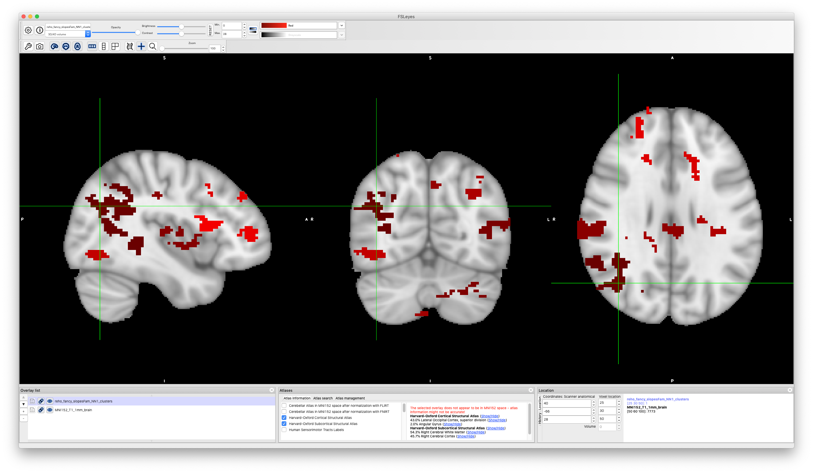

# 2019-08-08 12:53:51

Let's give it a try with ReHo and ALFF. We could play with smoothed and
non-smoothed, as it's not taking that long to run things in the cluster based on
the MELODIC results.

```bash
#desktop
mydir=/Volumes/Labs/rsfmri_36p/xcpengine_output_fc-36p_despike/
cd ~/data/heritability_change/xcp-36p_despike
mkdir reho
for maskid in `cat ids_1.txt`; do
    m=`printf %04d $maskid`;
    echo $m;
    for s in '' '_sm6' 'Z' 'Z_sm6'; do
        3dmaskdump -mask group_epi_mask_fancy.nii \
            -o reho/${m}${s}.txt $mydir/sub-${m}/norm/sub-${m}_reho${s}Std.nii.gz;
    done;
done
```

```bash
#desktop
mydir=/Volumes/Labs/rsfmri_36p/xcpengine_output_fc-36p_despike/
cd ~/data/heritability_change/xcp-36p_despike
mkdir alff
for maskid in `cat ids_1.txt`; do
    m=`printf %04d $maskid`;
    echo $m;
    for s in '' '_sm6' 'Z' 'Z_sm6'; do
        3dmaskdump -mask group_epi_mask_fancy.nii \
            -o alff/${m}${s}.txt $mydir/sub-${m}/norm/sub-${m}_alff${s}Std.nii.gz;
    done;
done
```

Then, we collect our results in R:

```r
maskids = read.table('~/data/heritability_change/xcp-36p_despike/ids_1.txt')[, 1]
nvox=231015
conn='reho'
for (m in c('', 'Z', '_sm6', 'Z_sm6')) {
    print(m)
    brain_data = matrix(nrow=length(maskids), ncol=nvox)
    for (s in 1:nrow(brain_data)) {
        fname = sprintf('~/data/heritability_change/xcp-36p_despike/%s/%04d%s.txt', conn, maskids[s], m)
        a = read.table(fname)
        brain_data[s, ] = a[,4]
     }
     brain_data = cbind(maskids, brain_data)
     cnames = c('mask.id', sapply(1:nvox, function(d) sprintf('v%06d', d)))
     colnames(brain_data) = cnames
     fname = sprintf('~/data/heritability_change/xcp-36p_despike/%s%s.RData.gz', conn, m)
     save(brain_data, file=fname, compress=T)
}
```

And calculate slopes:

```r
source('~/research_code/lab_mgmt/merge_on_closest_date.R')
df = read.csv('~/data/heritability_change/rsfmri_fc-36p_despike_condensed_posOnly_FD1.00_scans520_08022019.csv')
mydir='~/data/heritability_change/xcp-36p_despike/'
# don't use a loop so we can get them all done in parallel in BW
conn = 'reho'
suf = ''

fname = sprintf('%s/%s%s.RData.gz', mydir, conn, suf)
load(fname)
b = brain_data
var_names = colnames(b)[2:ncol(b)]
df2 = merge(df, b, by.x='Mask.ID', by.y='mask.id', all.x=F)

# make sure we still have two scans for everyone
rm_subjs = names(which(table(df2$Medical.Record...MRN)<2))
rm_me = df2$Medical.Record...MRN %in% rm_subjs
df2 = df2[!rm_me, ]

mres = df2
mres$SX_HI = as.numeric(as.character(mres$SX_hi))
mres$SX_inatt = as.numeric(as.character(mres$SX_inatt))

res = c()
for (s in unique(mres$Medical.Record...MRN)) {
    idx = which(mres$Medical.Record...MRN == s)
    row = c(s, unique(mres[idx, 'Sex']))
    y = mres[idx[2], var_names] - mres[idx[1], var_names]
    x = mres[idx[2], 'age_at_scan'] - mres[idx[1], 'age_at_scan']
    slopes = y / x
    row = c(row, slopes)
    for (t in c('SX_inatt', 'SX_HI', 'qc')) {
        fm_str = sprintf('%s ~ age_at_scan', t)
        fit = lm(as.formula(fm_str), data=mres[idx, ], na.action=na.exclude)
        row = c(row, coefficients(fit)[2])
    }
    # grabbing inatt and HI at baseline
    base_DOA = which.min(mres[idx, 'age_at_scan'])
    row = c(row, mres[idx[base_DOA], 'SX_inatt'])
    row = c(row, mres[idx[base_DOA], 'SX_HI'])
    # DX1 is DSMV definition, DX2 will make SX >=4 as ADHD
    if (mres[idx[base_DOA], 'age_at_scan'] < 16) {
        if ((row[length(row)] >= 6) || (row[length(row)-1] >= 6)) {
            DX = 'ADHD'
        } else {
            DX = 'NV'
        }
    } else {
        if ((row[length(row)] >= 5) || (row[length(row)-1] >= 5)) {
            DX = 'ADHD'
        } else {
            DX = 'NV'
        }
    }
    if ((row[length(row)] >= 4) || (row[length(row)-1] >= 4)) {
        DX2 = 'ADHD'
    } else {
        DX2 = 'NV'
    }
    row = c(row, DX)
    row = c(row, DX2)
    res = rbind(res, row)
    print(nrow(res))
}
colnames(res) = c('ID', 'sex', var_names, c('SX_inatt', 'SX_HI', 'qc',
                                            'inatt_baseline',
                                            'HI_baseline', 'DX', 'DX2'))
# we only open this in R, so it's OK to be RData to load faster
fname = sprintf('%s/%s_fancy_slopes%s.rds', mydir, conn, suf)
saveRDS(res, file=fname)

# and remove outliers
res_clean = res
for (t in var_names) {
    mydata = as.numeric(res_clean[, t])
    # identifying outliers
    ul = mean(mydata) + 3 * sd(mydata)
    ll = mean(mydata) - 3 * sd(mydata)
    bad_subjs = c(which(mydata < ll), which(mydata > ul))

    # remove within-variable outliers
    res_clean[bad_subjs, t] = NA
}
fname = sprintf('%s/%s_fancy_slopesClean%s.rds', mydir, conn, suf)
saveRDS(res_clean, file=fname)

# and make sure every family has at least two people
good_nuclear = names(table(df2$Nuclear.ID...FamilyIDs))[table(df2$Nuclear.ID...FamilyIDs) >= 4]
good_extended = names(table(df2$Extended.ID...FamilyIDs))[table(df2$Extended.ID...FamilyIDs) >= 4]
keep_me = c()
for (f in good_nuclear) {
    keep_me = c(keep_me, df2[which(df2$Nuclear.ID...FamilyIDs == f),
                            'Medical.Record...MRN'])
}
for (f in good_extended) {
    keep_me = c(keep_me, df2[which(df2$Extended.ID...FamilyIDs == f),
                            'Medical.Record...MRN'])
}
keep_me = unique(keep_me)

fam_subjs = c()
for (s in keep_me) {
    fam_subjs = c(fam_subjs, which(res[, 'ID'] == s))
}
res2 = res[fam_subjs, ]
res2_clean = res_clean[fam_subjs, ]

fname = sprintf('%s/%s_fancy_slopesFam%s.csv', mydir, conn, suf)
write.csv(res2, file=fname, row.names=F, na='', quote=F)
fname = sprintf('%s/%s_fancy_slopesCleanFam%s.csv', mydir, conn, suf)
write.csv(res2_clean, file=fname, row.names=F, na='', quote=F)
```

We can later to p25 FD threshold if we get somewhat decent results.

# 2019-08-09 09:27:22

Finally, set up the swarms:

```bash
cd ~/data/heritability_change/xcp-36p_despike;
for m in reho alff; do
    for s in '' '_sm6' 'Z' 'Z_sm6'; do
        phen_file=${m}_fancy_slopesFam${s};
        jname=${m}${s};
        swarm_file=swarm.${jname};

        rm -f $swarm_file;
        for vlist in `ls $PWD/vlist*txt`; do  # getting full path to files
            echo "bash ~/research_code/run_solar_voxel_parallel.sh $phen_file $vlist" >> $swarm_file;
        done;
        swarm --gres=lscratch:10 -f $swarm_file --module solar -t 32 -g 10 \
                --logdir=trash_${jname} --job-name ${jname} --time=4:00:00 --merge-output \
                --partition quick,norm
    done;
done
```

# 2019-08-12 14:43:04

Let's go back to these results, for compiling and clustering:

```bash
module load afni

cd /lscratch/${SLURM_JOBID}
for m in reho alff; do
    for s in '' '_sm6' 'Z' 'Z_sm6'; do
        phen=${m}_fancy_slopesFam${s};
        mkdir $phen;
        cd $phen;
        cp ~/data/tmp/${phen}/*gz .;
        for f in `/bin/ls *gz`; do tar -zxf $f; done
        cd ..
        python ~/research_code/fmri/compile_solar_voxel_results.py \
            /lscratch/${SLURM_JOBID}/ $phen \
            ~/data/heritability_change/xcp-36p_despike/group_epi_mask_fancy.nii;
        rm -rf $phen;
    done;
done
```

```bash
cd ~/data/heritability_change/xcp-36p_despike/
for m in reho alff; do
    for s in '' '_sm6' 'Z' 'Z_sm6'; do
        phen=${m}_fancy_slopesFam${s};
        3dclust -1Dformat -nosum -1dindex 0 -1tindex 1 -1thresh 0.95 -orient LPI \
            -savemask ${phen}_NN1_clusters.nii -NN1 125 \
            polygen_results_${phen}.nii >> NN1_results.txt;
    done
done
```

So, we do have some interesting clusters here. Let's then check if they are at
all correlated to movement:

```bash
for m in reho alff; do
    cd ~/data/heritability_change/xcp-36p_despike/$m
    for s in '' '_sm6' 'Z' 'Z_sm6'; do
        phen=${m}_fancy_slopesFam${s};
        3dmaskdump -mask ../group_epi_mask_fancy.nii -o ${phen}_NN1_cluster1.txt \
            ../${phen}_NN1_clusters.nii;
    done;
done
```

I named the files wrong.... even though they are called cluster1, they have all
top clusters there... each has its own integer!

```r
for (m in c('reho', 'alff')) {
    for (s in c('', '_sm6', 'Z', 'Z_sm6')) {
        fname=sprintf('~/data/heritability_change/xcp-36p_despike/%s/%s_fancy_slopesFam%s_NN1_cluster1.txt', m, m, s)
        clusters = read.table(fname)[, 4]
        nvox = length(clusters)
        cnames = sapply(1:nvox, function(d) sprintf('v%06d', d))
        library(data.table)
        fname = sprintf('~/data/heritability_change/%s_fancy_slopesFam%s.csv', m, s)
        dread = fread(fname, header = T, sep = ',')
        d = as.data.frame(dread)  # just so we can index them a bit easier
        cdata = d$ID
        header = c()
        for (myc in 1:3) {
            keep_vox = cnames[which(clusters == myc)]
            cdata = cbind(cdata, rowMeans(d[, keep_vox]))
            header = c(header, sprintf('cl%d', myc))
        }
        colnames(cdata) = c('ID', header)
        cdata = cbind(cdata, d[, c('sex', 'SX_inatt', 'SX_HI', 'qc', 'inatt_baseline',
                                                        'HI_baseline', 'DX', 'DX2')])
        fname = sprintf('~/data/heritability_change/xcp-36p_despike/%s/cluster_means_NN1%s.csv', m, s)
        write.csv(cdata, row.names=F,
                file=fname)
    }
}
```

OK, let's check on correlation to movement then:

```r
for (m in c('reho', 'alff')) {
    for (s in c('', '_sm6', 'Z', 'Z_sm6')) {
        fname = sprintf('~/data/heritability_change/xcp-36p_despike/%s/cluster_means_NN1%s.csv', m, s)
        df = read.csv(fname)
        for (myc in 1:3) {
            print(fname)
            print(myc)
            print(cor.test(df[,'qc'], df[, sprintf('cl%d', myc)]))
        }
    }
}
```

reho isn't correlated, at least not the first cluster (or the 3rd). Also, the
results without Z seem better than with it, and of course the clusters after
smoothing are bigger. But alff is extremely correlated. We'll definitely need to
re-run SOLAR again removing qc as well, if we want to calculate heritability
properly. Or, the other option is to show that heritability is still there even
after removing qc from the average of the cluster. Before we run permutation for
the reho cluster, let's see where it is:



It looks parietal/angular, even though the atlas is saying visual in the white
matter. That's not great, but maybe we should just go ahead and use a
grey-matter atlas? This way there is no risk of falling in white matter again...

I checked and the template.nii.gz file used for all xcpengine processing is the
same as the one in FSL. Basically, just a MNI 2x2x2 brain. Now, I just need to
find a grey matter mask for that brain, so we don't keep falling in white
matter, right? 

I could use the grey mask Luke sent (Slack), but I'd lose anything that's cerebellar.
Given that some subjects don't even have that covered, it might not be a bad
idea. Let's generate that, then:

```bash
#desktop
mydir=/Volumes/Labs/rsfmri_36p/xcpengine_output_fc-36p_despike/
cd ~/data/heritability_change/xcp-36p_despike
mkdir reho_gray
for maskid in `cat ids_1.txt`; do
    m=`printf %04d $maskid`;
    echo $m;
    for s in '' '_sm6' 'Z' 'Z_sm6'; do
        3dmaskdump -mask gray_matter_mask.nii \
            -o reho_gray/${m}${s}.txt $mydir/sub-${m}/norm/sub-${m}_reho${s}Std.nii.gz;
    done;
done

mkdir alff_gray
for maskid in `cat ids_1.txt`; do
    m=`printf %04d $maskid`;
    echo $m;
    for s in '' '_sm6' 'Z' 'Z_sm6'; do
        3dmaskdump -mask gray_matter_mask.nii \
            -o alff_gray/${m}${s}.txt $mydir/sub-${m}/norm/sub-${m}_alff${s}Std.nii.gz;
    done;
done
```

# 2019-08-13 09:36:14

Then, we collect our results in R:

```r
maskids = read.table('~/data/heritability_change/xcp-36p_despike/ids_1.txt')[, 1]
nvox=155301
conn='reho_gray'
for (m in c('', 'Z', '_sm6', 'Z_sm6')) {
    print(m)
    brain_data = matrix(nrow=length(maskids), ncol=nvox)
    for (s in 1:nrow(brain_data)) {
        fname = sprintf('~/data/heritability_change/xcp-36p_despike/%s/%04d%s.txt', conn, maskids[s], m)
        a = read.table(fname)
        brain_data[s, ] = a[,4]
     }
     brain_data = cbind(maskids, brain_data)
     cnames = c('mask.id', sapply(1:nvox, function(d) sprintf('v%06d', d)))
     colnames(brain_data) = cnames
     fname = sprintf('~/data/heritability_change/xcp-36p_despike/%s%s.rds', conn, m)
     saveRDS(brain_data, file=fname)
}
```

And calculate slopes, outside the loop so we can do it in parallel:

```r
source('~/research_code/lab_mgmt/merge_on_closest_date.R')
df = read.csv('~/data/heritability_change/rsfmri_fc-36p_despike_condensed_posOnly_FD1.00_scans520_08022019.csv')
mydir='~/data/heritability_change/xcp-36p_despike/'
# don't use a loop so we can get them all done in parallel in BW
conn = 'alff_gray'
suf = ''

fname = sprintf('%s/%s%s.rds', mydir, conn, suf)
b = readRDS(fname)
var_names = colnames(b)[2:ncol(b)]
df2 = merge(df, b, by.x='Mask.ID', by.y='mask.id', all.x=F)

# make sure we still have two scans for everyone
rm_subjs = names(which(table(df2$Medical.Record...MRN)<2))
rm_me = df2$Medical.Record...MRN %in% rm_subjs
df2 = df2[!rm_me, ]

mres = df2
mres$SX_HI = as.numeric(as.character(mres$SX_hi))
mres$SX_inatt = as.numeric(as.character(mres$SX_inatt))

res = c()
for (s in unique(mres$Medical.Record...MRN)) {
    idx = which(mres$Medical.Record...MRN == s)
    row = c(s, unique(mres[idx, 'Sex']))
    y = mres[idx[2], var_names] - mres[idx[1], var_names]
    x = mres[idx[2], 'age_at_scan'] - mres[idx[1], 'age_at_scan']
    slopes = y / x
    row = c(row, slopes)
    for (t in c('SX_inatt', 'SX_HI', 'qc')) {
        fm_str = sprintf('%s ~ age_at_scan', t)
        fit = lm(as.formula(fm_str), data=mres[idx, ], na.action=na.exclude)
        row = c(row, coefficients(fit)[2])
    }
    # grabbing inatt and HI at baseline
    base_DOA = which.min(mres[idx, 'age_at_scan'])
    row = c(row, mres[idx[base_DOA], 'SX_inatt'])
    row = c(row, mres[idx[base_DOA], 'SX_HI'])
    # DX1 is DSMV definition, DX2 will make SX >=4 as ADHD
    if (mres[idx[base_DOA], 'age_at_scan'] < 16) {
        if ((row[length(row)] >= 6) || (row[length(row)-1] >= 6)) {
            DX = 'ADHD'
        } else {
            DX = 'NV'
        }
    } else {
        if ((row[length(row)] >= 5) || (row[length(row)-1] >= 5)) {
            DX = 'ADHD'
        } else {
            DX = 'NV'
        }
    }
    if ((row[length(row)] >= 4) || (row[length(row)-1] >= 4)) {
        DX2 = 'ADHD'
    } else {
        DX2 = 'NV'
    }
    row = c(row, DX)
    row = c(row, DX2)
    res = rbind(res, row)
    print(nrow(res))
}
colnames(res) = c('ID', 'sex', var_names, c('SX_inatt', 'SX_HI', 'qc',
                                            'inatt_baseline',
                                            'HI_baseline', 'DX', 'DX2'))
# we only open this in R, so it's OK to be RData to load faster
fname = sprintf('%s/%s_slopes%s.rds', mydir, conn, suf)
saveRDS(res, file=fname)

# and remove outliers
res_clean = res
for (t in var_names) {
    mydata = as.numeric(res_clean[, t])
    # identifying outliers
    ul = mean(mydata) + 3 * sd(mydata)
    ll = mean(mydata) - 3 * sd(mydata)
    bad_subjs = c(which(mydata < ll), which(mydata > ul))

    # remove within-variable outliers
    res_clean[bad_subjs, t] = NA
}
fname = sprintf('%s/%s_slopesClean%s.rds', mydir, conn, suf)
saveRDS(res_clean, file=fname)

# and make sure every family has at least two people
good_nuclear = names(table(df2$Nuclear.ID...FamilyIDs))[table(df2$Nuclear.ID...FamilyIDs) >= 4]
good_extended = names(table(df2$Extended.ID...FamilyIDs))[table(df2$Extended.ID...FamilyIDs) >= 4]
keep_me = c()
for (f in good_nuclear) {
    keep_me = c(keep_me, df2[which(df2$Nuclear.ID...FamilyIDs == f),
                            'Medical.Record...MRN'])
}
for (f in good_extended) {
    keep_me = c(keep_me, df2[which(df2$Extended.ID...FamilyIDs == f),
                            'Medical.Record...MRN'])
}
keep_me = unique(keep_me)

fam_subjs = c()
for (s in keep_me) {
    fam_subjs = c(fam_subjs, which(res[, 'ID'] == s))
}
res2 = res[fam_subjs, ]
res2_clean = res_clean[fam_subjs, ]

fname = sprintf('%s/%s_slopesFam%s.csv', mydir, conn, suf)
write.csv(res2, file=fname, row.names=F, na='', quote=F)
fname = sprintf('%s/%s_slopesCleanFam%s.csv', mydir, conn, suf)
write.csv(res2_clean, file=fname, row.names=F, na='', quote=F)
```

Finally, set up the swarms:

```bash
cd ~/data/heritability_change/xcp-36p_despike
# create master list of voxels
nvox=155301;
for i in `seq 1 $nvox`; do
    echo $i >> voxel_list_gray.txt;
done
# our previous experiments had chunks of 5K voxels
split -da 2 -l 5000 voxel_list_gray.txt vlistg --additional-suffix=".txt";

cd ~/data/heritability_change/xcp-36p_despike;
for m in reho_gray alff_gray; do
    for s in '' '_sm6' 'Z' 'Z_sm6'; do
        phen_file=${m}_slopesFam${s};
        jname=${m}${s};
        swarm_file=swarm.${jname};

        rm -f $swarm_file;
        for vlist in `ls $PWD/vlistg*txt`; do  # getting full path to files
            echo "bash ~/research_code/run_solar_voxel_parallel.sh $phen_file $vlist" >> $swarm_file;
        done;
        swarm --gres=lscratch:10 -f $swarm_file --module solar -t 32 -g 10 \
                --logdir=trash_${jname} --job-name ${jname} --time=4:00:00 --merge-output \
                --partition quick,norm
    done;
done
```

# 2019-08-14 09:30:32

Let's compile these gray matter results:

```bash
#desktop
cd ~/data/heritability_change/xcp-36p_despike/
cut -d " " -f 1,2,3 \
    groupmelodic_gray.ica/dumps/1351_IC8_Z.txt > gray_matter_mask_ijk.txt
```

```bash
module load afni

cd /lscratch/${SLURM_JOBID}
for m in reho alff; do
    for s in '' '_sm6' 'Z' 'Z_sm6'; do
        phen=${m}_gray_slopesFam${s};
        mkdir $phen;
        cd $phen;
        cp ~/data/tmp/${phen}/*gz .;
        for f in `/bin/ls *gz`; do tar -zxf $f; done
        cd ..
        python ~/research_code/fmri/compile_solar_voxel_results.py \
            /lscratch/${SLURM_JOBID}/ $phen \
            ~/data/heritability_change/xcp-36p_despike/gray_matter_mask.nii;
        rm -rf $phen;
    done;
done
```

```bash
cd ~/data/heritability_change/xcp-36p_despike/
for m in reho alff; do
    for s in '' '_sm6' 'Z' 'Z_sm6'; do
        phen=${m}_gray_slopesFam${s};
        3dclust -1Dformat -nosum -1dindex 0 -1tindex 1 -1thresh 0.95 -orient LPI \
            -savemask ${phen}_NN1_clusters.nii -NN1 300 \
            polygen_results_${phen}.nii >> NN1_gray_results.txt;
    done
done
```

Of course, sm6 clusters are bigger. But nonZ results are a bit bigger as well.
ALFF clusters were also not very big, especially not when compared to REHO. But
maybe they'll survive on permutations?

I already removed movement from SOLAR, so there is not need to check for
correlation with movement now. But before we get excited about the results like
before, let's run a few permutations. Let's try reho and alff for now, but maybe
smoothed later.

```r
m = 'reho'
start=1
nperms = 100
step=10

library(data.table)
set.seed( as.integer((as.double(Sys.time())*1000+Sys.getpid()) %% 2^31) )
dread = fread(sprintf('~/data/heritability_change/%s_gray_slopesFam.csv', m),
              header = T, sep = ',')
d = as.data.frame(dread)  # just so we can index them a bit easier
vcols = c(which(grepl("v",colnames(d))), which(grepl("sex",colnames(d))),
          which(grepl("qc",colnames(d))))
d2 = d
for (p in seq(start, nperms, step)) {
    d2[, vcols] = d[sample(nrow(d)), vcols]
    fname = sprintf('~/data/heritability_change/%s_gray_slopesFam_p%03d.csv', m, p)
    print(fname)
    fwrite(d2, file=fname, row.names=F, quote=F)
}
```

# 2019-08-15 11:40:29

Let's now compile the reho permutations and see what we get:

```bash
module load afni

cd /lscratch/${SLURM_JOBID}
m='reho';
suf='';
for p in {1..100}; do
    phen=`printf ${m}_gray_slopesFam${suf}_p%03d $p`;
    mkdir $phen;
    cd $phen;
    cp ~/data/tmp/${phen}/*gz .;
    for f in `/bin/ls *gz`; do tar -zxf $f; done
    cd ..
    python ~/research_code/fmri/compile_solar_voxel_results.py \
        /lscratch/${SLURM_JOBID}/ $phen \
        ~/data/heritability_change/xcp-36p_despike/gray_matter_mask.nii;
    rm -rf $phen;
done
```

```bash
cd ~/data/heritability_change/xcp-36p_despike/perms
res=`3dclust -1Dformat -nosum -1dindex 0 -1tindex 1 -1thresh 0.95 -NN1 796 \
    -quiet polygen_results_reho_gray_slopesFam_p*.nii | grep CLUSTERS | wc -l`
nperms=`ls -1 polygen_results_reho_gray_slopesFam_p*.nii | wc -l`;
p=$(bc <<<"scale=3;($nperms - $res)/$nperms")
echo negatives=${res}, perms=${nperms}, pval=$p
```

Hum, not even the 796 result is good enough... only p=.2. The NN2 cluster is
p=.08, and same for NN3. Maybe check sm6?

```r
m = 'reho'
start=1
nperms = 25
step=1

library(data.table)
set.seed( as.integer((as.double(Sys.time())*1000+Sys.getpid()) %% 2^31) )
dread = fread(sprintf('~/data/heritability_change/%s_gray_slopesFam_sm6.csv', m),
              header = T, sep = ',')
d = as.data.frame(dread)  # just so we can index them a bit easier
vcols = c(which(grepl("v",colnames(d))), which(grepl("sex",colnames(d))),
          which(grepl("qc",colnames(d))))
d2 = d
for (p in seq(start, nperms, step)) {
    d2[, vcols] = d[sample(nrow(d)), vcols]
    fname = sprintf('~/data/heritability_change/%s_gray_slopesFam_sm6_p%03d.csv', m, p)
    print(fname)
    fwrite(d2, file=fname, row.names=F, quote=F)
}
```

```bash
cd ~/data/heritability_change/xcp-36p_despike;
for p in {1..25}; do
    perm=`printf %03d $p`;
    phen_file=reho_gray_slopesFam_sm6_p${perm};
    swarm_file=swarm.rsm6_p${perm};

    for vlist in `ls $PWD/vlistg*txt`; do  # getting full path to files
        echo "bash ~/research_code/run_solar_voxel_parallel.sh $phen_file $vlist" >> $swarm_file;
    done;
done

for p in {1..25}; do
    perm=`printf %03d $p`;
    jname=rsm6_p${perm};
    swarm_file=swarm.${jname};
    echo "ERROR" > swarm_wait;
    while grep -q ERROR swarm_wait; do
        echo "Trying $jname"
        swarm --gres=lscratch:10 -f $swarm_file --module solar -t 32 -g 10 \
                --logdir=trash_${jname} --job-name ${jname} --time=4:00:00 --merge-output \
                --partition quick,norm 2> swarm_wait;
        if grep -q ERROR swarm_wait; then
            echo -e "\tError, sleeping..."
            sleep 30m;
        fi;
    done;
done;
```

# TODO:
* try running permutations for smoothed reho... second cluster was quite close,
  so maybe smoothed data will make it also significant?
* I could try running only 25 perms, just to test the waters? That gives me .04
  if a single perm goes bad, but it could be indicative of good thresholds?

  