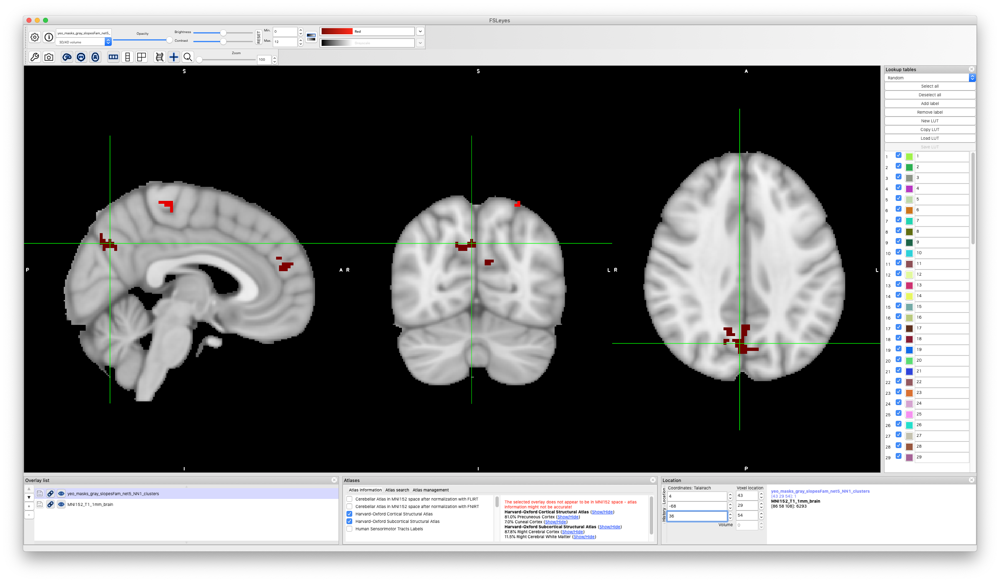

# 2019-08-12 16:44:41

It's possible that my MELODIC results are not so good because my mask is taking
into considerationt oo much stuff that's not grey matter. So, let's repeat the
results using a better grey matter mask, and see how they look. I'll also redo
the yeo results just for kicks, but stick to FD1.0 for now.

And, since we're at it, why not compute everything for Z and noZ?

```bash
cd ~/data/heritability_change/xcp-36p_despike
melodic -i fd1_epi.txt -o groupmelodic_gray.ica -v --nobet -m gray_matter_mask.nii --tr=2.5 --report --Oall -a concat;
```

# 2019-08-13 09:32:14

Now we perform the dual regression to get each subject's values for the ICs:

```bash
pipe='gray';
mydir=/Volumes/Labs/rsfmri_36p/xcpengine_output_fc-36p_despike/
cd ~/data/heritability_change/xcp-36p_despike/groupmelodic_${pipe}.ica
mkdir dual
while read maskid; do
    m=`printf %04d $maskid`;
    echo ${pipe} $m;
    $FSLDIR/bin/fsl_glm -i $mydir/sub-${m}/norm/sub-${m}_std.nii.gz -d melodic_IC \
        -o dual/dr_stage1_${m}.txt --demean -m ../gray_matter_mask.nii;
    $FSLDIR/bin/fsl_glm -i $mydir/sub-${m}/norm/sub-${m}_std.nii.gz -d dual/dr_stage1_${m}.txt \
        -o dual/dr_stage2_${m} --demean -m ../gray_matter_mask.nii --des_norm \
        --out_z=dual/dr_stage2_${m}_Z;
done < ../ids_1.txt
```

Now, it's time to figure out which ICs we are going to use.

```bash
cd ~/data/heritability_change/xcp-36p_despike/groupmelodic_gray.ica/
3dMatch -inset melodic_IC.nii.gz -refset ../Yeo_nets.nii \
    -mask ../gray_matter_mask.nii -prefix matches -overwrite
cat matches_REF_coeff.vals
```

Keep in mind that the code is:

```
0: visual
1: somatomotor
2: DAN
3: VAN
4: limbic
5: cognitive (frontoparietal)
6: DMN
```

```
0               1               0.367           0.214
1               33              0.331           0.214
2               10              0.283           0.165
3               6               0.372           0.147
4               27              0.368           0.109
5               9               0.264           0.212
6               8               0.300           0.310
```

DMN doesn't look great, but let's go with it for now. Since we're doing Yeo
masks as well, I won't be too picky for now.

```bash
cd ~/data/heritability_change/xcp-36p_despike/yeo_masks_gray
mydir=/Volumes/Labs/rsfmri_36p/xcpengine_output_fc-36p_despike/
mkdir dual
while read maskid; do
    m=`printf %04d $maskid`;
    echo yeo_masks_gray $m;
    $FSLDIR/bin/fsl_glm -i $mydir/sub-${m}/norm/sub-${m}_std.nii.gz -d ../Yeo_nets.nii \
        -o dual/dr_stage1_${m}.txt --demean -m ../gray_matter_mask.nii;
    $FSLDIR/bin/fsl_glm -i $mydir/sub-${m}/norm/sub-${m}_std.nii.gz -d dual/dr_stage1_${m}.txt \
        -o dual/dr_stage2_${m} --demean -m ../gray_matter_mask.nii --des_norm \
        --out_z=dual/dr_stage2_${m}_Z;
done < ../ids_1.txt
```

Time to dump to R:

```bash
cd ~/data/heritability_change/xcp-36p_despike/groupmelodic_gray.ica/
mkdir dumps
for m in `cat ../ids_1.txt`; do
    maskid=`printf %04d $m`;
    echo $maskid;
    rm dumps/${maskid}_*.txt
    for i in 1 33 10 6 27 9 8; do
        3dmaskdump -mask ../gray_matter_mask.nii \
            -o dumps/${maskid}_IC${i}_Z.txt dual/dr_stage2_${maskid}_Z.nii.gz[${i}];
        3dmaskdump -mask ../gray_matter_mask.nii \
            -o dumps/${maskid}_IC${i}.txt dual/dr_stage2_${maskid}.nii.gz[${i}];
    done;
done
```

```bash
cd ~/data/heritability_change/xcp-36p_despike/yeo_masks_gray/
mkdir dumps
for m in `cat ../ids_1.txt`; do
    maskid=`printf %04d $m`;
    echo $maskid;
    rm dumps/${maskid}_*.txt
    for i in {0..6}; do
        3dmaskdump -mask ../gray_matter_mask.nii \
            -o dumps/${maskid}_net${i}_Z.txt dual/dr_stage2_${maskid}_Z.nii.gz[${i}];
        3dmaskdump -mask ../gray_matter_mask.nii \
            -o dumps/${maskid}_net${i}.txt dual/dr_stage2_${maskid}.nii.gz[${i}];
    done;
done
```

Then, we collect our results in R:

```r
maskids = read.table('~/data/heritability_change/xcp-36p_despike/ids_1.txt')[, 1]
nvox=155301
for (m in c(1, 33, 10, 6, 27, 9, 8)) {
    for (suf in c('', '_Z')) {
        print(m)
        print(suf)
        brain_data = matrix(nrow=length(maskids), ncol=nvox)
        for (s in 1:nrow(brain_data)) {
            fname = sprintf('~/data/heritability_change/xcp-36p_despike/groupmelodic_gray.ica/dumps/%04d_IC%d%s.txt', maskids[s], m, suf)
            a = read.table(fname)
            brain_data[s, ] = a[,4]
        }
        brain_data = cbind(maskids, brain_data)
        cnames = c('mask.id', sapply(1:nvox, function(d) sprintf('v%06d', d)))
        colnames(brain_data) = cnames
        fname = sprintf('~/data/heritability_change/xcp-36p_despike/melodic_gray_IC%d%s.rds', m, suf)
        saveRDS(brain_data, file=fname)
    }
}
```

Then, repeat the same for the yeo_masks dual regression.

```r
maskids = read.table('~/data/heritability_change/xcp-36p_despike/ids_1.txt')[, 1]
nvox=155301
for (m in 0:6) {
    for (suf in c('', '_Z')) {
        print(m)
        print(suf)
        brain_data = matrix(nrow=length(maskids), ncol=nvox)
        for (s in 1:nrow(brain_data)) {
            fname = sprintf('~/data/heritability_change/xcp-36p_despike/yeo_masks_gray/dumps/%04d_net%d%s.txt', maskids[s], m, suf)
            a = read.table(fname)
            brain_data[s, ] = a[,4]
        }
        brain_data = cbind(maskids, brain_data)
        cnames = c('mask.id', sapply(1:nvox, function(d) sprintf('v%06d', d)))
        colnames(brain_data) = cnames
        fname = sprintf('~/data/heritability_change/xcp-36p_despike/yeo_masks_gray_net%d%s.rds', m, suf)
        saveRDS(brain_data, file=fname)
    }
}
```

Finally, make the slopes:

```r
source('~/research_code/lab_mgmt/merge_on_closest_date.R')
df = read.csv('~/data/heritability_change/rsfmri_fc-36p_despike_condensed_posOnly_FD1.00_scans520_08022019.csv')
mydir='~/data/heritability_change/xcp-36p_despike/'
ic = 1
suf = ''

fname = sprintf('%s/melodic_gray_IC%d%s.rds', mydir, ic, suf)
b = readRDS(fname)
var_names = colnames(b)[2:ncol(b)]
df2 = merge(df, b, by.x='Mask.ID', by.y='mask.id', all.x=F)

# make sure we still have two scans for everyone
rm_subjs = names(which(table(df2$Medical.Record...MRN)<2))
rm_me = df2$Medical.Record...MRN %in% rm_subjs
df2 = df2[!rm_me, ]

mres = df2
mres$SX_HI = as.numeric(as.character(mres$SX_hi))
mres$SX_inatt = as.numeric(as.character(mres$SX_inatt))

res = c()
for (s in unique(mres$Medical.Record...MRN)) {
    idx = which(mres$Medical.Record...MRN == s)
    row = c(s, unique(mres[idx, 'Sex']))
    y = mres[idx[2], var_names] - mres[idx[1], var_names]
    x = mres[idx[2], 'age_at_scan'] - mres[idx[1], 'age_at_scan']
    slopes = y / x
    row = c(row, slopes)
    for (t in c('SX_inatt', 'SX_HI', 'qc')) {
        fm_str = sprintf('%s ~ age_at_scan', t)
        fit = lm(as.formula(fm_str), data=mres[idx, ], na.action=na.exclude)
        row = c(row, coefficients(fit)[2])
    }
    # grabbing inatt and HI at baseline
    base_DOA = which.min(mres[idx, 'age_at_scan'])
    row = c(row, mres[idx[base_DOA], 'SX_inatt'])
    row = c(row, mres[idx[base_DOA], 'SX_HI'])
    # DX1 is DSMV definition, DX2 will make SX >=4 as ADHD
    if (mres[idx[base_DOA], 'age_at_scan'] < 16) {
        if ((row[length(row)] >= 6) || (row[length(row)-1] >= 6)) {
            DX = 'ADHD'
        } else {
            DX = 'NV'
        }
    } else {
        if ((row[length(row)] >= 5) || (row[length(row)-1] >= 5)) {
            DX = 'ADHD'
        } else {
            DX = 'NV'
        }
    }
    if ((row[length(row)] >= 4) || (row[length(row)-1] >= 4)) {
        DX2 = 'ADHD'
    } else {
        DX2 = 'NV'
    }
    row = c(row, DX)
    row = c(row, DX2)
    res = rbind(res, row)
    print(nrow(res))
}
colnames(res) = c('ID', 'sex', var_names, c('SX_inatt', 'SX_HI', 'qc',
                                            'inatt_baseline',
                                            'HI_baseline', 'DX', 'DX2'))
# we only open this in R, so it's OK to be RData to load faster
fname = sprintf('%s/melodic_gray_slopes_IC%d%s.rds', mydir, ic, suf)
saveRDS(res, file=fname)

# and remove outliers
res_clean = res
for (t in var_names) {
    mydata = as.numeric(res_clean[, t])
    # identifying outliers
    ul = mean(mydata) + 3 * sd(mydata)
    ll = mean(mydata) - 3 * sd(mydata)
    bad_subjs = c(which(mydata < ll), which(mydata > ul))

    # remove within-variable outliers
    res_clean[bad_subjs, t] = NA
}
fname = sprintf('%s/melodic_gray_slopesClean_IC%d%s.rds', mydir, ic, suf)
saveRDS(res_clean, file=fname)

# and make sure every family has at least two people
good_nuclear = names(table(df2$Nuclear.ID...FamilyIDs))[table(df2$Nuclear.ID...FamilyIDs) >= 4]
good_extended = names(table(df2$Extended.ID...FamilyIDs))[table(df2$Extended.ID...FamilyIDs) >= 4]
keep_me = c()
for (f in good_nuclear) {
    keep_me = c(keep_me, df2[which(df2$Nuclear.ID...FamilyIDs == f),
                            'Medical.Record...MRN'])
}
for (f in good_extended) {
    keep_me = c(keep_me, df2[which(df2$Extended.ID...FamilyIDs == f),
                            'Medical.Record...MRN'])
}
keep_me = unique(keep_me)

fam_subjs = c()
for (s in keep_me) {
    fam_subjs = c(fam_subjs, which(res[, 'ID'] == s))
}
res2 = res[fam_subjs, ]
res2_clean = res_clean[fam_subjs, ]

fname = sprintf('%s/melodic_gray_slopesFam_IC%d%s.csv', mydir, ic, suf)
write.csv(res2, file=fname, row.names=F, na='', quote=F)
fname = sprintf('%s/melodic_gray_slopesCleanFam_IC%d%s.csv', mydir, ic, suf)
write.csv(res2_clean, file=fname, row.names=F, na='', quote=F)
```

And for the Yeo masks:

```r
source('~/research_code/lab_mgmt/merge_on_closest_date.R')
df = read.csv('~/data/heritability_change/rsfmri_fc-36p_despike_condensed_posOnly_FD1.00_scans520_08022019.csv')
mydir='~/data/heritability_change/xcp-36p_despike/'
ic = 0
suf = ''

fname = sprintf('%s/yeo_masks_gray_net%d%s.rds', mydir, ic, suf)
b = readRDS(fname)
var_names = colnames(b)[2:ncol(b)]
df2 = merge(df, b, by.x='Mask.ID', by.y='mask.id', all.x=F)

# make sure we still have two scans for everyone
rm_subjs = names(which(table(df2$Medical.Record...MRN)<2))
rm_me = df2$Medical.Record...MRN %in% rm_subjs
df2 = df2[!rm_me, ]

mres = df2
mres$SX_HI = as.numeric(as.character(mres$SX_hi))
mres$SX_inatt = as.numeric(as.character(mres$SX_inatt))

res = c()
for (s in unique(mres$Medical.Record...MRN)) {
    idx = which(mres$Medical.Record...MRN == s)
    row = c(s, unique(mres[idx, 'Sex']))
    y = mres[idx[2], var_names] - mres[idx[1], var_names]
    x = mres[idx[2], 'age_at_scan'] - mres[idx[1], 'age_at_scan']
    slopes = y / x
    row = c(row, slopes)
    for (t in c('SX_inatt', 'SX_HI', 'qc')) {
        fm_str = sprintf('%s ~ age_at_scan', t)
        fit = lm(as.formula(fm_str), data=mres[idx, ], na.action=na.exclude)
        row = c(row, coefficients(fit)[2])
    }
    # grabbing inatt and HI at baseline
    base_DOA = which.min(mres[idx, 'age_at_scan'])
    row = c(row, mres[idx[base_DOA], 'SX_inatt'])
    row = c(row, mres[idx[base_DOA], 'SX_HI'])
    # DX1 is DSMV definition, DX2 will make SX >=4 as ADHD
    if (mres[idx[base_DOA], 'age_at_scan'] < 16) {
        if ((row[length(row)] >= 6) || (row[length(row)-1] >= 6)) {
            DX = 'ADHD'
        } else {
            DX = 'NV'
        }
    } else {
        if ((row[length(row)] >= 5) || (row[length(row)-1] >= 5)) {
            DX = 'ADHD'
        } else {
            DX = 'NV'
        }
    }
    if ((row[length(row)] >= 4) || (row[length(row)-1] >= 4)) {
        DX2 = 'ADHD'
    } else {
        DX2 = 'NV'
    }
    row = c(row, DX)
    row = c(row, DX2)
    res = rbind(res, row)
    print(nrow(res))
}
colnames(res) = c('ID', 'sex', var_names, c('SX_inatt', 'SX_HI', 'qc',
                                            'inatt_baseline',
                                            'HI_baseline', 'DX', 'DX2'))
# we only open this in R, so it's OK to be RData to load faster
fname = sprintf('%s/yeo_masks_gray_slopes_net%d%s.rds', mydir, ic, suf)
saveRDS(res, file=fname)

# and remove outliers
res_clean = res
for (t in var_names) {
    mydata = as.numeric(res_clean[, t])
    # identifying outliers
    ul = mean(mydata) + 3 * sd(mydata)
    ll = mean(mydata) - 3 * sd(mydata)
    bad_subjs = c(which(mydata < ll), which(mydata > ul))

    # remove within-variable outliers
    res_clean[bad_subjs, t] = NA
}
fname = sprintf('%s/yeo_masks_gray_slopesClean_net%d%s.rds', mydir, ic, suf)
saveRDS(res_clean, file=fname)

# and make sure every family has at least two people
good_nuclear = names(table(df2$Nuclear.ID...FamilyIDs))[table(df2$Nuclear.ID...FamilyIDs) >= 4]
good_extended = names(table(df2$Extended.ID...FamilyIDs))[table(df2$Extended.ID...FamilyIDs) >= 4]
keep_me = c()
for (f in good_nuclear) {
    keep_me = c(keep_me, df2[which(df2$Nuclear.ID...FamilyIDs == f),
                            'Medical.Record...MRN'])
}
for (f in good_extended) {
    keep_me = c(keep_me, df2[which(df2$Extended.ID...FamilyIDs == f),
                            'Medical.Record...MRN'])
}
keep_me = unique(keep_me)

fam_subjs = c()
for (s in keep_me) {
    fam_subjs = c(fam_subjs, which(res[, 'ID'] == s))
}
res2 = res[fam_subjs, ]
res2_clean = res_clean[fam_subjs, ]

fname = sprintf('%s/yeo_masks_gray_slopesFam_net%d%s.csv', mydir, ic, suf)
write.csv(res2, file=fname, row.names=F, na='', quote=F)
fname = sprintf('%s/yeo_masks_gray_slopesCleanFam_net%d%s.csv', mydir, ic, suf)
write.csv(res2_clean, file=fname, row.names=F, na='', quote=F)
```

# 2019-08-14 09:13:31

Let's get started with running SOLAR on the ICs for gray masks:

```bash
cd ~/data/heritability_change/xcp-36p_despike;
for i in 1 33 10 6 27 9 8; do
    for suf in '' '_Z'; do
        phen_file=melodic_gray_slopesFam_IC${i}${suf};
        jname=gray_${i}${suf};
        swarm_file=swarm.${jname};

        rm -f $swarm_file;
        for vlist in `ls $PWD/vlistg*txt`; do  # getting full path to files
            echo "bash ~/research_code/run_solar_voxel_parallel.sh $phen_file $vlist" >> $swarm_file;
        done;
        swarm --gres=lscratch:10 -f $swarm_file --module solar -t 32 -g 10 \
                --logdir=trash_${jname} --job-name ${jname} --time=4:00:00 \
                --merge-output --partition quick,norm
    done;
done
```

And of course, same thing for Yeo masks:

```bash
cd ~/data/heritability_change/xcp-36p_despike;
for i in {0..6}; do
    for suf in '' '_Z'; do
        phen_file=yeo_masks_gray_slopesFam_net${i}${suf};
        jname=ym_${i}${suf};
        swarm_file=swarm.${jname};

        rm -f $swarm_file;
        for vlist in `ls $PWD/vlistg*txt`; do  # getting full path to files
            echo "bash ~/research_code/run_solar_voxel_parallel.sh $phen_file $vlist" >> $swarm_file;
        done;
        swarm --gres=lscratch:10 -f $swarm_file --module solar -t 32 -g 10 \
                --logdir=trash_${jname} --job-name ${jname} --time=4:00:00 \
                --merge-output --partition quick,norm
    done;
done
```

# 2019-08-15 11:53:09

Let's see if we get any sort of results for the ICs with grey matter mask.
First, we need to compile them:

```bash
module load afni

cd /lscratch/${SLURM_JOBID}
for i in 1 33 10 6 27 9 8; do
    for suf in '' '_Z'; do
        phen=melodic_gray_slopesFam_IC${i}${suf};
        mkdir $phen;
        cd $phen;
        cp ~/data/tmp/${phen}/*gz .;
        for f in `/bin/ls *gz`; do tar -zxf $f; done
        cd ..
        python ~/research_code/fmri/compile_solar_voxel_results.py \
            /lscratch/${SLURM_JOBID}/ $phen \
            ~/data/heritability_change/xcp-36p_despike/gray_matter_mask.nii;
        rm -rf $phen;
    done;
done
```

Let's first check if the _Z results are better than regular ones. 

```bash
cd ~/data/heritability_change/xcp-36p_despike/
for i in 1 33 10 6 27 9 8; do
    for suf in '' '_Z'; do
        phen=melodic_gray_slopesFam_IC${i}${suf};
        3dclust -1Dformat -nosum -1dindex 0 -1tindex 1 -1thresh 0.95 -orient LPI \
            -savemask ${phen}_NN1_clusters.nii -NN1 50 \
            polygen_results_${phen}.nii >> NN1_melodic_gray_results.txt;
    done
done
```

There was no clear winner. Cluster weren't even in the same place... 

Why don't we run 25 perms just for kicks and to get a flavor of what's actually
significant? I'll do it for the suffix with biggest cluster, and only for the
interesting networks:

```r
m = 'melodic'
suf = '10_Z'
start=1
nperms = 25
step=1

library(data.table)
set.seed( as.integer((as.double(Sys.time())*1000+Sys.getpid()) %% 2^31) )
dread = fread(sprintf('~/data/heritability_change/%s_gray_slopesFam_IC%s.csv', m, suf),
              header = T, sep = ',')
d = as.data.frame(dread)  # just so we can index them a bit easier
vcols = c(which(grepl("v",colnames(d))), which(grepl("sex",colnames(d))),
          which(grepl("qc",colnames(d))))
d2 = d
for (p in seq(start, nperms, step)) {
    d2[, vcols] = d[sample(nrow(d)), vcols]
    fname = sprintf('~/data/heritability_change/%s_gray_slopesFam_IC%s_p%03d.csv', m, suf, p)
    print(fname)
    fwrite(d2, file=fname, row.names=F, quote=F)
}
```

```bash
cd ~/data/heritability_change/xcp-36p_despike;
for i in '8' '9_Z' '27' '6_Z' '10_Z'; do
    for p in {1..25}; do
        perm=`printf %03d $p`;
        phen_file=melodic_gray_slopesFam_IC${i}_p${perm};
        swarm_file=swarm.m${i}_p${perm};

        for vlist in `ls $PWD/vlistg*txt`; do  # getting full path to files
            echo "bash ~/research_code/run_solar_voxel_parallel.sh $phen_file $vlist" >> $swarm_file;
        done;
    done;
done

for i in '8' '9_Z' '27' '6_Z' '10_Z'; do
    for p in {1..25}; do
        perm=`printf %03d $p`;
        jname=m${i}_p${perm};
        swarm_file=swarm.${jname};
        echo "ERROR" > swarm_wait;
        while grep -q ERROR swarm_wait; do
            echo "Trying $jname"
            swarm --gres=lscratch:10 -f $swarm_file --module solar -t 32 -g 10 \
                    --logdir=trash_${jname} --job-name ${jname} --time=4:00:00 --merge-output \
                    --partition quick,norm 2> swarm_wait;
            if grep -q ERROR swarm_wait; then
                echo -e "\tError, sleeping..."
                sleep 30m;
            fi;
        done;
    done;
done
```

# 2019-08-16 11:30:03

While the perms for melodic are running, let's take a look at the yeo mask
results. Are they worth checking on through the small permutation approach? Are
Z results better than regular?

```bash
module load afni

cd /lscratch/${SLURM_JOBID}
for i in {0..6}; do
    for suf in '' '_Z'; do
        phen=yeo_masks_gray_slopesFam_net${i}${suf};
        mkdir $phen;
        cd $phen;
        cp ~/data/tmp/${phen}/*gz .;
        for f in `/bin/ls *gz`; do tar -zxf $f; done
        cd ..
        python ~/research_code/fmri/compile_solar_voxel_results.py \
            /lscratch/${SLURM_JOBID}/ $phen \
            ~/data/heritability_change/xcp-36p_despike/gray_matter_mask.nii;
        rm -rf $phen;
    done;
done
cp polygen*yeo_masks_gray_slopesFam_net*nii ~/data/heritability_change/xcp-36p_despike/

cd ~/data/heritability_change/xcp-36p_despike/
for i in {0..6}; do
    for suf in '' '_Z'; do
        phen=yeo_masks_gray_slopesFam_net${i}${suf};
        3dclust -1Dformat -nosum -1dindex 0 -1tindex 1 -1thresh 0.95 -orient LPI \
            -savemask ${phen}_NN1_clusters.nii -NN1 50 \
            polygen_results_${phen}.nii >> NN1_yeo_masks_gray_results.txt;
    done
done
```

The difference wasn't huge, for for most of the ICs that matter the best result
was with the nonZ results. Let's make a few figures to see if they are worth
exploring, as we cannot submit much new stuff in the queue at this moment
anyways. I'm centering my figures for now on max intensity, because the clusters
are looking better this way, compared to using COM.

cognitive:

That's a very nice precuneus hit, which is normally associated with DMN. That
seems to be the second hit for _Z. There, the first hit is quite frontal.

DMN: 
got a hit on frontal pole... could be interesting if it survives
permutations

Note that the best cluster for DMN_Z is in mFG/iFG, so that could potentially be
more interesting...


But let's not get too excited about these results. It'll be cool if they
survive, but let's run some perms before we do much else:

```r
m = 'yeo_masks'
suf = '10_Z'
start=1
nperms = 25
step=1

library(data.table)
set.seed( as.integer((as.double(Sys.time())*1000+Sys.getpid()) %% 2^31) )
dread = fread(sprintf('~/data/heritability_change/%s_gray_slopesFam_net%s.csv', m, suf),
              header = T, sep = ',')
d = as.data.frame(dread)  # just so we can index them a bit easier
vcols = c(which(grepl("v",colnames(d))), which(grepl("sex",colnames(d))),
          which(grepl("qc",colnames(d))))
d2 = d
for (p in seq(start, nperms, step)) {
    d2[, vcols] = d[sample(nrow(d)), vcols]
    fname = sprintf('~/data/heritability_change/%s_gray_slopesFam_net%s_p%03d.csv', m, suf, p)
    print(fname)
    fwrite(d2, file=fname, row.names=F, quote=F)
}
```

```bash
cd ~/data/heritability_change/xcp-36p_despike;
for i in '6' '6_Z' '5' '5_Z' '2' '3' '4'; do
    for p in {1..25}; do
        perm=`printf %03d $p`;
        phen_file=yeo_masks_gray_slopesFam_net${i}_p${perm};
        swarm_file=swarm.ymg${i}_p${perm};

        for vlist in `ls $PWD/vlistg*txt`; do  # getting full path to files
            echo "bash ~/research_code/run_solar_voxel_parallel.sh $phen_file $vlist" >> $swarm_file;
        done;
    done;
done

for i in '6' '6_Z' '5' '5_Z' '2' '3' '4'; do
    for p in {1..25}; do
        perm=`printf %03d $p`;
        jname=ymg${i}_p${perm};
        swarm_file=swarm.${jname};
        echo "ERROR" > swarm_wait;
        while grep -q ERROR swarm_wait; do
            echo "Trying $jname"
            swarm --gres=lscratch:10 -f $swarm_file --module solar -t 32 -g 10 \
                    --logdir=trash_${jname} --job-name ${jname} --time=4:00:00 --merge-output \
                    --partition quick,norm 2> swarm_wait;
            if grep -q ERROR swarm_wait; then
                echo -e "\tError, sleeping..."
                sleep 30m;
            fi;
        done;
    done;
done
```

# 2019-08-19 10:01:45

Let's compile all permutations we've been waiting on:

```bash
module load afni

cd /lscratch/${SLURM_JOBID}
for i in '6' '6_Z' '5' '5_Z' '2' '3' '4'; do
    for p in {1..25}; do
        perm=`printf %03d $p`;
        phen=yeo_masks_gray_slopesFam_net${i}_p${perm};
        mkdir $phen;
        cd $phen;
        cp ~/data/tmp/${phen}/*gz .;
        for f in `/bin/ls *gz`; do tar -zxf $f; done
        cd ..
        python ~/research_code/fmri/compile_solar_voxel_results.py \
            /lscratch/${SLURM_JOBID}/ $phen \
            ~/data/heritability_change/xcp-36p_despike/gray_matter_mask.nii;
        rm -rf $phen;
    done;
done
```

```bash
module load afni

cd /lscratch/${SLURM_JOBID}
for i in '8' '9_Z' '27' '6_Z' '10_Z'; do
    for p in {1..25}; do
        perm=`printf %03d $p`;
        phen=melodic_gray_slopesFam_IC${i}_p${perm};
        mkdir $phen;
        cd $phen;
        cp ~/data/tmp/${phen}/*gz .;
        for f in `/bin/ls *gz`; do tar -zxf $f; done
        cd ..
        python ~/research_code/fmri/compile_solar_voxel_results.py \
            /lscratch/${SLURM_JOBID}/ $phen \
            ~/data/heritability_change/xcp-36p_despike/gray_matter_mask.nii;
        rm -rf $phen;
    done;
done
```

Because we have many different combinations, I don't want to use the loop code
to figure out optimal cluster size. Also, with only 25 permutations it won't
tell me much. I much rather just check the chances of our buggest cluster and
see what I get:

```bash
cd ~/data/heritability_change/xcp-36p_despike/perms
froot=polygen_results_yeo_masks_gray_slopesFam_net6
csize=145;
res=`3dclust -1Dformat -nosum -1dindex 0 -1tindex 1 -1thresh 0.95 -NN1 $csize \
    -quiet ${froot}_p*.nii | grep CLUSTERS | wc -l`
nperms=`ls -1 ${froot}_p*.nii | wc -l`;
p=$(bc <<<"scale=3;($nperms - $res)/$nperms")
echo negatives=${res}, perms=${nperms}, pval=$p
```

melodic:
'8': 78 (p=.24)
'9_Z': 80 (p=.24)
'27': 77 (p=.24)
'6_Z': 72 (p=.24)
'10_Z': 53 ...

yeo
'6': 145 (p = .434)
'6_Z': 149 (p=.56)
'5': 233 (p=.08)
'5_Z': 166 (p=.28)
'2': 193 (p=.28)
'3': 114 ...
'4': 188 ...

Again, these are using only 25 perms. But they don't look too promising. Yeo 5
might work out, but it will be though. And that's just one too...

The IC results look weird. Probably an error somewhere, but not promising enough
to look into it. 
