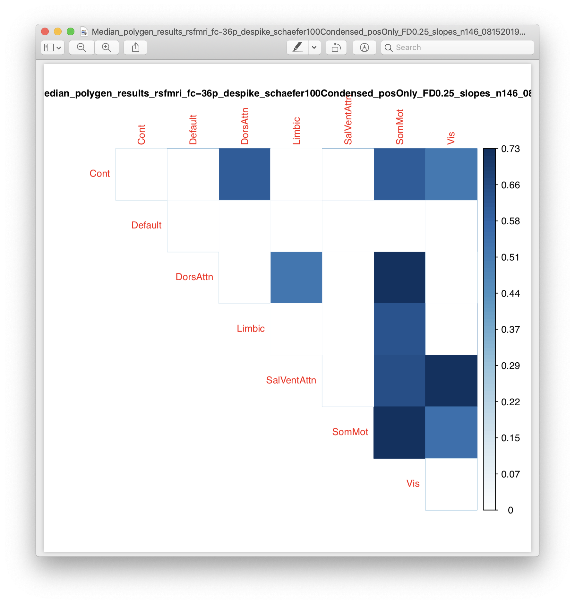

# 2019-08-15 15:57:32

Using the design files for 36P gave us a few other functional connectivity
atlases as a bonus. One of them is the Schaefer 2018 atlas, which comes form the
same Yeo lab. So, it has a nice many-to-one match to Yeo networks. Let's
consense it that way, which gives less comparisons and it's a bit more similar
to our previous work.

https://github.com/ThomasYeoLab/CBIG/tree/master/stable_projects/brain_parcellation/Schaefer2018_LocalGlobal

So, let's condense the network, starting with 100 nodes because it goes faster
that way:

```R
source('~/research_code/fmri/make_schaefer_condensed_data_FD.R')
```

# 2019-08-16 11:18:26

And let's make sure that residualizing the connections before taking the slope takes
care of all associations with FD:

```r
a = read.csv('~/data/heritability_change/rsfmri_fc-36p_despike_schaefer100Condensed_posOnly_FD0.25_slopes_n146_08152019.csv')
mycols = colnames(a)[grepl(colnames(a), pattern='connMedian')]
ar = read.csv('~/data/heritability_change/rsfmri_fc-36p_despike_schaefer100Condensed_posOnly_FD0.25_residSlopes_n146_08152019.csv')
ps = sapply(mycols, function(x) cor.test(a$qc, a[, x], method='spearman')$p.value)
sum(ps<.05)
[1] 28
ps2 = p.adjust(ps, method='fdr')
sum(ps2<.05)
[1] 28
ps = sapply(mycols, function(x) cor.test(ar$qc, ar[, x], method='spearman')$p.value)
sum(ps<.05)
[1] 0
idx = grepl(colnames(ar), pattern='conn')
write.table(colnames(ar)[idx],
            file='~/data/heritability_change/condensed_schaefer100_conns.txt',
            col.names=F, row.names=F, quote=F)
```

OK, let's see if there is any heritability in the condensed matrices.

```bash
# desktop
# remove the double quotes from the files otherwise SOLAR can't run
cd ~/data/heritability_change/
for f in `/bin/ls rsfmri_fc-36p_despike_schaefer100Condensed*08152019.csv`; do
    sed -i -e "s/\"//g" $f;
done
```

This should take too long to run, so we can do it in the desktop or even
interactively:

```bash
cd ~/data/heritability_change/
rm swarm.sch100c
for f in `/bin/ls rsfmri_fc-36p_despike_schaefer100Condensed*081?2019.csv`; do
    phen=`echo $f | sed "s/\.csv//"`;
    echo "bash ~/research_code/run_solar_parallel.sh $phen " \
        "~/data/heritability_change/condensed_schaefer100_conns.txt" >> swarm.sch100c;
done
# these run quite fast, so I can just run it all here:
bash swarm.sch100c
```

And collect everything:

```bash
cd ~/data/tmp;
for f in `/bin/ls ~/data/heritability_change/rsfmri_fc-36p_despike_schaefer100Condensed*081?2019.csv`; do
    pheno=`echo $f | sed "s/\.csv//" | cut -d"/" -f 6`;
    echo "Working on $pheno";
    cd $pheno;
    tar -zxf *tgz;
    echo "  Compiling...";
    python ~/research_code/compile_solar_multivar_results.py $pheno;
    echo "  Cleaning up...";
    rm conn*;
    cd ..;
done
```

Now it's a matter of checking the figures for heritable connections like before.
Or we could maybe rank all figures just so we have an idea of the best ones
first:

```r
nverts = 7
mydir = '~/data/heritability_change/'

fnames = list.files(mydir, pattern='polygen_results_rsfmri_fc-36p_despike_schaefer100C.*lopes.*\\.csv')
map_names = c()
sig_conns = c()
for (fname in fnames) {
    # read in the results
    res = read.csv(sprintf('%s/%s', mydir, fname))
    # figuring out possible connections
    conns = sapply(as.character(res$phen), function(x) strsplit(x, '_')[[1]][2])
    conns = unique(conns)
    vert_names = unique(unlist(lapply(conns, function(x) strsplit(x, 'TO')[[1]])))
    for (m in c('Max', 'Mean', 'Median')) {
        vals = matrix(nrow=nverts, ncol=nverts, dimnames=list(vert_names,
                                                              vert_names))
        stats = matrix(nrow=nverts, ncol=nverts, dimnames=list(vert_names,
                                                               vert_names))
        mres = res[grepl(res$phen, pattern=sprintf('conn%s', m)), ]
        for (r in 1:nrow(mres)) {
            junk = gsub(sprintf('conn%s_', m), x=mres$phen[r], '')
            ij = strsplit(junk, 'TO')[[1]]
            vals[ij[1], ij[2]] = mres[r, 'h2r']
            stats[ij[1], ij[2]] = mres[r, 'h_pval']
            vals[ij[2], ij[1]] = mres[r, 'h2r']
            stats[ij[2], ij[1]] = mres[r, 'h_pval']
        }

        myps = stats[upper.tri(stats, diag=T)]
        p2 = p.adjust(myps, method='fdr')
        junk = strsplit(strtrim(fname, nchar(fname)-4), '/')[[1]]
        phen = sprintf('%s_%s', m, junk[length(junk)])
        # sig_conns = c(sig_conns, sum(p2 < .05))
        sig_conns = c(sig_conns, sum(myps < .05))
        map_names = c(map_names, phen)
    }
}
s = sort(sig_conns, index.return=T, decreasing=T)
for (i in 1:10) {
    cat(sprintf('%s: %d\n', map_names[s$ix[i]], s$x[i]))
}
```

Nothing significant using FDR, but this is what comes up when I use nominal ps:

```
Median_polygen_results_rsfmri_fc-36p_despike_schaefer100Condensed_posOnly_FD0.25_slopes_n146_08152019: 10
Median_polygen_results_rsfmri_fc-36p_despike_schaefer100Condensed_posOnly_FD0.25_residSlopes_n146_08152019: 9
Mean_polygen_results_rsfmri_fc-36p_despike_schaefer100Condensed_posOnly_FD0.25_residSlopes_n146_08152019: 6
Mean_polygen_results_rsfmri_fc-36p_despike_schaefer100Condensed_posOnly_FD0.25_slopes_n146_08152019: 6
Max_polygen_results_rsfmri_fc-36p_despike_schaefer100Condensed_FD2.50_residSlopes_n296_08162019: 3
Max_polygen_results_rsfmri_fc-36p_despike_schaefer100Condensed_FD2.50_slopes_n296_08162019: 3
Max_polygen_results_rsfmri_fc-36p_despike_schaefer100Condensed_posOnly_FD2.50_residSlopes_n296_08152019: 3
Max_polygen_results_rsfmri_fc-36p_despike_schaefer100Condensed_posOnly_FD2.50_slopes_n296_08152019: 3
Max_polygen_results_rsfmri_fc-36p_despike_schaefer100Condensed_FD1.00_residSlopes_n260_08162019: 2
Max_polygen_results_rsfmri_fc-36p_despike_schaefer100Condensed_FD1.00_slopes_n260_08162019: 2
```

OK, so let's check how the pictures look:

```r
#desktop
nverts = 7
mydir = '~/data/heritability_change/'
library(corrplot)

fnames = list.files(mydir, pattern='polygen_results_rsfmri_fc-36p_despike_schaefer100C.*lopes.*\\.csv')
for (fname in fnames) {
    # read in the results
    cat(sprintf('Reading in %s\n', fname))
    res = read.csv(sprintf('%s/%s', mydir, fname))
    # figuring out possible connections
    conns = sapply(as.character(res$phen), function(x) strsplit(x, '_')[[1]][2])
    conns = unique(conns)
    vert_names = unique(unlist(lapply(conns, function(x) strsplit(x, 'TO')[[1]])))
    for (m in c('Max', 'Mean', 'Median')) {
        vals = matrix(nrow=nverts, ncol=nverts, dimnames=list(vert_names,
                                                              vert_names))
        stats = matrix(nrow=nverts, ncol=nverts, dimnames=list(vert_names,
                                                               vert_names))
        mres = res[grepl(res$phen, pattern=sprintf('conn%s', m)), ]
        for (r in 1:nrow(mres)) {
            junk = gsub(sprintf('conn%s_', m), x=mres$phen[r], '')
            ij = strsplit(junk, 'TO')[[1]]
            vals[ij[1], ij[2]] = mres[r, 'h2r']
            stats[ij[1], ij[2]] = mres[r, 'h_pval']
            vals[ij[2], ij[1]] = mres[r, 'h2r']
            stats[ij[2], ij[1]] = mres[r, 'h_pval']
        }
        # plotting
        junk = strsplit(strtrim(fname, nchar(fname)-4), '/')[[1]]
        phen = sprintf('%s_%s', m, junk[length(junk)])
        pdf(sprintf('~/tmp/%s.pdf', phen))
        corrplot(vals, type="upper", method='color', diag=T,
                p.mat = stats, sig.level = .05, insig = "blank", is.corr=F, tl.cex=.8)
        title(phen, cex.main=.8)
        dev.off()
    }
}
```

No, unfortunately it's all like this:



So, somatomotor dominating everything, even thought I have removed QC slope
already. Maybe it's real, just not that interesting. 

## Single region connectivity?

What if I used the 400 schaefer parcellation and calculated overall connectivity
for each region? Maybe that would survive FDR? Then we could go stepwise to
check what regions are connected to a particular node.

```R
source('~/research_code/fmri/make_schaefer_collapsed_data_FD.R')
```

# 2019-08-19 11:13:01

OK, let's see then if any of these overall connections is heritable:

```bash
# desktop
# remove the double quotes from the files otherwise SOLAR can't run
cd ~/data/heritability_change/
for f in `/bin/ls rsfmri_fc-36p_despike_schaefer100Collapsed*08192019.csv`; do
    sed -i -e "s/\"//g" $f;
done
```

This should take too long to run, so we can do it in the desktop or even
interactively:

```bash
cd ~/data/heritability_change/
rm swarm.sch100col
for f in `/bin/ls rsfmri_fc-36p_despike_schaefer100Collapsed*08192019.csv`; do
    phen=`echo $f | sed "s/\.csv//"`;
    echo "bash ~/research_code/run_solar_parallel.sh $phen " \
        "~/data/heritability_change/collapsed_schaefer100_conns.txt" >> swarm.sch100col;
done
# these run quite fast, so I can just run it all here:
module load solar
bash swarm.sch100col
```

And collect everything:

<!-- ```bash
cd ~/data/tmp;
for f in `/bin/ls ~/data/heritability_change/rsfmri_fc-36p_despike_schaefer100Condensed*081?2019.csv`; do
    pheno=`echo $f | sed "s/\.csv//" | cut -d"/" -f 6`;
    echo "Working on $pheno";
    cd $pheno;
    tar -zxf *tgz;
    echo "  Compiling...";
    python ~/research_code/compile_solar_multivar_results.py $pheno;
    echo "  Cleaning up...";
    rm conn*;
    cd ..;
done
``` -->

Now it's a matter of checking the figures for heritable connections like before.
Or we could maybe rank all figures just so we have an idea of the best ones
first:

```r
nverts = 7
mydir = '~/data/heritability_change/'

fnames = list.files(mydir, pattern='polygen_results_rsfmri_fc-36p_despike_schaefer100C.*lopes.*\\.csv')
map_names = c()
sig_conns = c()
for (fname in fnames) {
    # read in the results
    res = read.csv(sprintf('%s/%s', mydir, fname))
    # figuring out possible connections
    conns = sapply(as.character(res$phen), function(x) strsplit(x, '_')[[1]][2])
    conns = unique(conns)
    vert_names = unique(unlist(lapply(conns, function(x) strsplit(x, 'TO')[[1]])))
    for (m in c('Max', 'Mean', 'Median')) {
        vals = matrix(nrow=nverts, ncol=nverts, dimnames=list(vert_names,
                                                              vert_names))
        stats = matrix(nrow=nverts, ncol=nverts, dimnames=list(vert_names,
                                                               vert_names))
        mres = res[grepl(res$phen, pattern=sprintf('conn%s', m)), ]
        for (r in 1:nrow(mres)) {
            junk = gsub(sprintf('conn%s_', m), x=mres$phen[r], '')
            ij = strsplit(junk, 'TO')[[1]]
            vals[ij[1], ij[2]] = mres[r, 'h2r']
            stats[ij[1], ij[2]] = mres[r, 'h_pval']
            vals[ij[2], ij[1]] = mres[r, 'h2r']
            stats[ij[2], ij[1]] = mres[r, 'h_pval']
        }

        myps = stats[upper.tri(stats, diag=T)]
        p2 = p.adjust(myps, method='fdr')
        junk = strsplit(strtrim(fname, nchar(fname)-4), '/')[[1]]
        phen = sprintf('%s_%s', m, junk[length(junk)])
        # sig_conns = c(sig_conns, sum(p2 < .05))
        sig_conns = c(sig_conns, sum(myps < .05))
        map_names = c(map_names, phen)
    }
}
s = sort(sig_conns, index.return=T, decreasing=T)
for (i in 1:10) {
    cat(sprintf('%s: %d\n', map_names[s$ix[i]], s$x[i]))
}
```

Nothing significant using FDR, but this is what comes up when I use nominal ps:

```
Median_polygen_results_rsfmri_fc-36p_despike_schaefer100Condensed_posOnly_FD0.25_slopes_n146_08152019: 10
Median_polygen_results_rsfmri_fc-36p_despike_schaefer100Condensed_posOnly_FD0.25_residSlopes_n146_08152019: 9
Mean_polygen_results_rsfmri_fc-36p_despike_schaefer100Condensed_posOnly_FD0.25_residSlopes_n146_08152019: 6
Mean_polygen_results_rsfmri_fc-36p_despike_schaefer100Condensed_posOnly_FD0.25_slopes_n146_08152019: 6
Max_polygen_results_rsfmri_fc-36p_despike_schaefer100Condensed_FD2.50_residSlopes_n296_08162019: 3
Max_polygen_results_rsfmri_fc-36p_despike_schaefer100Condensed_FD2.50_slopes_n296_08162019: 3
Max_polygen_results_rsfmri_fc-36p_despike_schaefer100Condensed_posOnly_FD2.50_residSlopes_n296_08152019: 3
Max_polygen_results_rsfmri_fc-36p_despike_schaefer100Condensed_posOnly_FD2.50_slopes_n296_08152019: 3
Max_polygen_results_rsfmri_fc-36p_despike_schaefer100Condensed_FD1.00_residSlopes_n260_08162019: 2
Max_polygen_results_rsfmri_fc-36p_despike_schaefer100Condensed_FD1.00_slopes_n260_08162019: 2
``` -->


# TODO:

* try the single region connectivity idea
* how about connectivity of each of the 400 to each of the networks? e.g. 400x
  14 or 400 by 7 matrix?