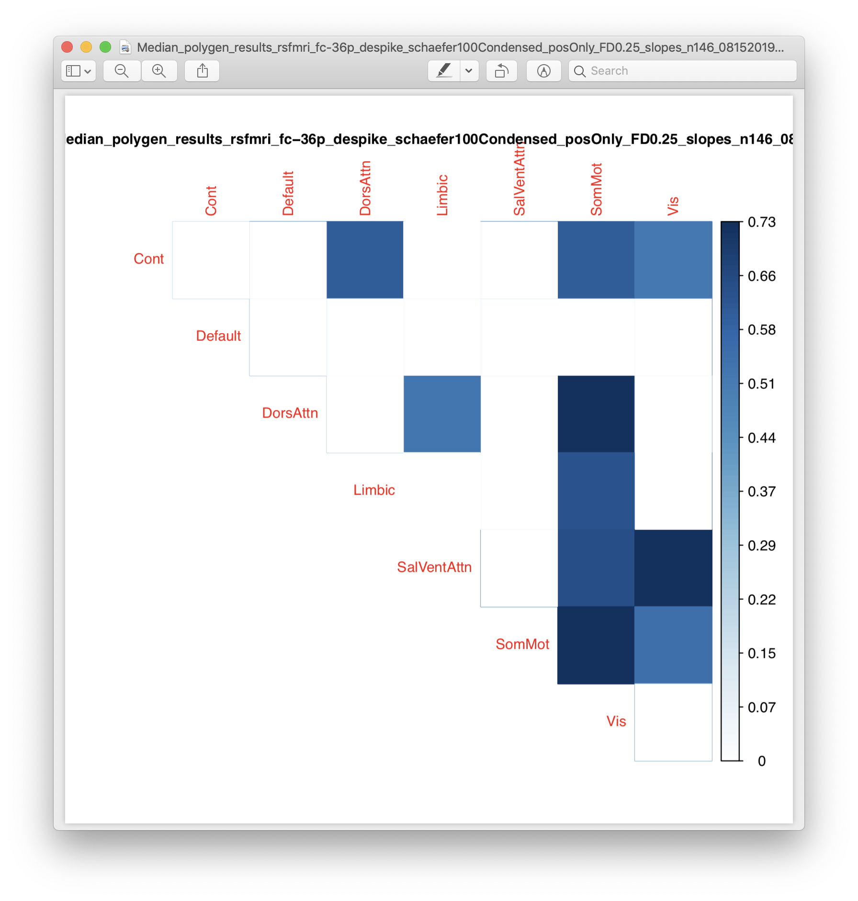

# 2019-08-30 16:11:55

As I mentioned in note 36, let me see how goo the results are if I use a ROI to
netowkr matrix. I'll try 100 and 400 ROIs, just for starters.

```R
source('~/research_code/fmri/make_schaefer_roi2nets_data_FD.R')
```

# 2019-09-05 13:06:34

Now that we have those CSV files, let's run SOLAR to see if anything is
heritable. First:

 ```bash
# desktop
# remove the double quotes from the files otherwise SOLAR can't run
cd ~/data/heritability_change/
for f in `/bin/ls rsfmri_fc-36p_despike_schaefer100roi2nets_*_09052019.csv`; do
    sed -i -e "s/\"//g" $f;
done
```

```bash
#sin
cd ~/data/heritability_change/
sfile=swarm.roi2nets100;
rm $sfile
for f in `/bin/ls rsfmri_fc-36p_despike_schaefer100roi2nets_*_09052019.csv`; do
    phen=`echo $f | sed "s/\.csv//"`;
    echo "bash ~/research_code/run_solar_parallel.sh $phen " \
        "~/data/heritability_change/roi2nets100_conns.txt" >> $sfile;
done
bash $sfile
```

And collect everything:

```bash
cd ~/data/tmp;
for f in `/bin/ls ~/data/heritability_change/rsfmri_fc-36p_despike_schaefer100roi2nets_*_09052019.csv`; do
    pheno=`echo $f | sed "s/\.csv//" | cut -d"/" -f 6`;
    echo "Working on $pheno";
    cd $pheno;
    tar -zxf *tgz;
    echo "  Compiling...";
    python ~/research_code/compile_solar_multivar_results.py $pheno;
    echo "  Cleaning up...";
    rm *.out;
    cd ..;
done
```

I can make several pictures, but for now let's just spit out how many nominally
significant connections each file has:

```r
mydir = '~/data/heritability_change/'
nnets = 7
nrois = 100
fnames = list.files(mydir, pattern='polygen_results_rsfmri_fc-36p_despike_schaefer100roi2nets_.*s.*\\.csv')
roi_names = sapply(1:nrois, function(x) sprintf('roi%03d', x))
map_names = c()
sig_conns = c()
for (fname in fnames) {
    # read in the results
    res = read.csv(sprintf('%s/%s', mydir, fname))
    # figuring out possible connections
    nets = sapply(as.character(res$phen), function(x) strsplit(x, 'TO')[[1]][1])
    nets = unique(nets)        
    vals = matrix(nrow=nrois, ncol=nnets, dimnames=list(roi_names, nets))
    stats = matrix(nrow=nrois, ncol=nnets, dimnames=list(roi_names, nets))
    for (r in 1:nrow(res)) {
        ij = strsplit(as.character(res$phen[r]), 'TO')[[1]]
        rname = sprintf('roi%s', ij[2])
        cname = ij[1]
        vals[rname, cname] = res[r, 'h2r']
        stats[rname, cname] = res[r, 'h_pval']
    }
    p2 = p.adjust(stats, method='fdr')
    phen = strsplit(strtrim(fname, nchar(fname)-4), '/')[[1]]
    # sig_conns = c(sig_conns, sum(p2 < .1, na.rm=T))
    sig_conns = c(sig_conns, sum(stats < .05, na.rm=T))
    map_names = c(map_names, phen)
}
s = sort(sig_conns, index.return=T, decreasing=T)
for (i in 1:10) {
    cat(sprintf('%s: %d\n', map_names[s$ix[i]], s$x[i]))
}
```

```
polygen_results_rsfmri_fc-36p_despike_schaefer100roi2nets_posOnly_FD1.00_slopes_n260_09052019: 188
polygen_results_rsfmri_fc-36p_despike_schaefer100roi2nets_posOnly_FD0.75_slopes_n238_09052019: 153
polygen_results_rsfmri_fc-36p_despike_schaefer100roi2nets_posOnly_FD0.50_slopes_n210_09052019: 136
polygen_results_rsfmri_fc-36p_despike_schaefer100roi2nets_posOnly_FD2.50_slopes_n296_09052019: 134
polygen_results_rsfmri_fc-36p_despike_schaefer100roi2nets_posOnly_FD0.25_slopes_n146_09052019: 130
polygen_results_rsfmri_fc-36p_despike_schaefer100roi2nets_FD0.25_residSlopes_n146_09052019: 64
polygen_results_rsfmri_fc-36p_despike_schaefer100roi2nets_FD0.25_slopes_n146_09052019: 61
polygen_results_rsfmri_fc-36p_despike_schaefer100roi2nets_posOnly_FD0.25_residSlopes_n146_09052019: 44
polygen_results_rsfmri_fc-36p_despike_schaefer100roi2nets_posOnly_FD0.50_residSlopes_n210_09052019: 32
polygen_results_rsfmri_fc-36p_despike_schaefer100roi2nets_posOnly_FD0.75_residSlopes_n238_09052019: 30
```

OK, so this is what we see for nominal p-values, out of possible 700. 

## Everything

That's a
little under 10%, and similar to what we're seeing with the voxel results, the
.25 results seem a bit more robust. Let's plot them and see if there is any sort
of interesting pattern going on.

```r
mydir = '~/data/heritability_change/'
nnets = 7
nrois = 100
fname = 'polygen_results_rsfmri_fc-36p_despike_schaefer100roi2nets_FD0.25_residSlopes_n146_09052019.csv'
res = read.csv(sprintf('%s/%s', mydir, fname))
roi_names = sapply(1:nrois, function(x) sprintf('roi%03d', x))
nets = sapply(as.character(res$phen), function(x) strsplit(x, 'TO')[[1]][1])
nets = unique(nets)        
vals = matrix(nrow=nrois, ncol=nnets, dimnames=list(roi_names, nets))
stats = matrix(nrow=nrois, ncol=nnets, dimnames=list(roi_names, nets))
for (r in 1:nrow(res)) {
    ij = strsplit(as.character(res$phen[r]), 'TO')[[1]]
    rname = sprintf('roi%s', ij[2])
    cname = ij[1]
    vals[rname, cname] = res[r, 'h2r']
    stats[rname, cname] = res[r, 'h_pval']
}
p2 = p.adjust(stats, method='fdr')
phen = strsplit(strtrim(fname, nchar(fname)-4), '/')[[1]]
# sig_conns = c(sig_conns, sum(p2 < .1, na.rm=T))
sig_conns = c(sig_conns, sum(stats < .05, na.rm=T))
map_names = c(map_names, phen)
library(corrplot)
corrplot(vals, method='color', p.mat = stats, sig.level = .05,
        insig = "blank", is.corr=F, tl.cex=.8)
title(phen, cex.main=.8)
```


Well, kinda hard to see... what if we do some filtering?

```r
keep_rows = which(rowSums(stats < .05) > 0)
vals2 = vals[keep_rows, ]
stats2 = stats[keep_rows, ]
corrplot(vals2, method='color', p.mat = stats2, sig.level = .05,
        insig = "blank", is.corr=F, tl.cex=.8)
```


Maybe... we'll see. If anything, it'd be good to remove SomMot and Vis, even
though they might actually be helping with the overall distribution. We could
also keep it to only connections that all subjects have, and try Meff?

```r
corrplot(vals2[, 1:5], method='color',
         p.mat = stats2[, 1:5], sig.level = .05,
        insig = "blank", is.corr=F, tl.cex=.8)
```


OK, so let's figure out the rois that are not represented in everyone, and then
calculate Meff:

```r
df = readRDS('~/data/heritability_change/rsfmri_fc-36p_despike_schaefer100roi2nets_FD0.25_scans292_09052019.rds')
pipe_dir = '/Volumes/Shaw/rsfmri_36P/xcpengine_output_fc-36p_despike/'
nrois = 100
cat(sprintf('Reading connectivity data from %s\n', pipe_dir))
for (s in df$Mask.ID) {
    subj = sprintf('sub-%04d', s)
    fname = sprintf('%s/%s/fcon/schaefer%d/%s_schaefer%d.net',
                                pipe_dir, subj, nrois, subj, nrois)
    data = read.table(fname, skip=2)
    b = matrix(nrow=nrois, ncol=nrois)
    for (r in 1:nrow(data)) {
        b[data[r,1], data[r,2]] = data[r,3]
        b[data[r,2], data[r,1]] = data[r,3]
    }
    print(which(rowSums(is.na(b)) > 1))
}
```

Apparently, no connections were NA... that sucks. I guess the 100 Yeo ROIs are
big enough to always get a bit of the brain. Well, let's look into Meff then.

```r
fname = '~/data/heritability_change/rsfmri_fc-36p_despike_schaefer100roi2nets_FD0.25_residSlopes_n146_09052019.csv'
data = read.csv(fname)
cnames = colnames(data)[grepl(colnames(data), pattern='TO')]
cc = cor(data[, cnames])
svd = eigen(cc)
absev = abs(svd$values)
meff = (sum(sqrt(absev))^2)/sum(absev)
cat(sprintf('Galwey Meff = %.2f\n', meff))
```

So, if we include all 700 variables, we're looking at 65.22 (p = .05/65.22 =
0.000766581). If we ignore the visual and somatomotor networks (500 variables
only), we get 61.63 (p = 0.0008112449). Only one connection survives that
threshold, and it's in somatomotor anyways...

## Positive correlation only

Those results are **MUCH** stronger. 

```r
mydir = '~/data/heritability_change/'
nnets = 7
nrois = 100
fname = 'polygen_results_rsfmri_fc-36p_despike_schaefer100roi2nets_posOnly_FD1.00_slopes_n260_09052019.csv'
res = read.csv(sprintf('%s/%s', mydir, fname))
roi_names = sapply(1:nrois, function(x) sprintf('roi%03d', x))
nets = sapply(as.character(res$phen), function(x) strsplit(x, 'TO')[[1]][1])
nets = unique(nets)        
vals = matrix(nrow=nrois, ncol=nnets, dimnames=list(roi_names, nets))
stats = matrix(nrow=nrois, ncol=nnets, dimnames=list(roi_names, nets))
for (r in 1:nrow(res)) {
    ij = strsplit(as.character(res$phen[r]), 'TO')[[1]]
    rname = sprintf('roi%s', ij[2])
    cname = ij[1]
    vals[rname, cname] = res[r, 'h2r']
    stats[rname, cname] = res[r, 'h_pval']
}
p2 = p.adjust(stats, method='fdr')
phen = strsplit(strtrim(fname, nchar(fname)-4), '/')[[1]]
# sig_conns = c(sig_conns, sum(p2 < .1, na.rm=T))
sig_conns = c(sig_conns, sum(stats < .05, na.rm=T))
map_names = c(map_names, phen)
library(corrplot)
corrplot(vals, method='color', p.mat = stats, sig.level = .05,
        insig = "blank", is.corr=F, tl.cex=.8)
title(phen, cex.main=.8)
```


Lots of NAs as expected because of the negative connections, but I think I have
something in FDR???

```
> sum(p2 < .05, na.rm=T)
[1] 160
```

Interesting... let's see what they are...


# TODO
* Try the 400 rois dataset just for kicks...

<!-- # 2019-08-16 11:18:26

And let's make sure that residualizing the connections before taking the slope takes
care of all associations with FD:

```r
a = read.csv('~/data/heritability_change/rsfmri_fc-36p_despike_schaefer100Condensed_posOnly_FD0.25_slopes_n146_08152019.csv')
mycols = colnames(a)[grepl(colnames(a), pattern='connMedian')]
ar = read.csv('~/data/heritability_change/rsfmri_fc-36p_despike_schaefer100Condensed_posOnly_FD0.25_residSlopes_n146_08152019.csv')
ps = sapply(mycols, function(x) cor.test(a$qc, a[, x], method='spearman')$p.value)
sum(ps<.05)
[1] 28
ps2 = p.adjust(ps, method='fdr')
sum(ps2<.05)
[1] 28
ps = sapply(mycols, function(x) cor.test(ar$qc, ar[, x], method='spearman')$p.value)
sum(ps<.05)
[1] 0
idx = grepl(colnames(ar), pattern='conn')
write.table(colnames(ar)[idx],
            file='~/data/heritability_change/condensed_schaefer100_conns.txt',
            col.names=F, row.names=F, quote=F)
```

OK, let's see if there is any heritability in the condensed matrices.

```bash
# desktop
# remove the double quotes from the files otherwise SOLAR can't run
cd ~/data/heritability_change/
for f in `/bin/ls rsfmri_fc-36p_despike_schaefer100Condensed*08152019.csv`; do
    sed -i -e "s/\"//g" $f;
done
```

This should take too long to run, so we can do it in the desktop or even
interactively:

```bash
cd ~/data/heritability_change/
rm swarm.sch100c
for f in `/bin/ls rsfmri_fc-36p_despike_schaefer100Condensed*081?2019.csv`; do
    phen=`echo $f | sed "s/\.csv//"`;
    echo "bash ~/research_code/run_solar_parallel.sh $phen " \
        "~/data/heritability_change/condensed_schaefer100_conns.txt" >> swarm.sch100c;
done
# these run quite fast, so I can just run it all here:
bash swarm.sch100c
```

And collect everything:

```bash
cd ~/data/tmp;
for f in `/bin/ls ~/data/heritability_change/rsfmri_fc-36p_despike_schaefer100Condensed*081?2019.csv`; do
    pheno=`echo $f | sed "s/\.csv//" | cut -d"/" -f 6`;
    echo "Working on $pheno";
    cd $pheno;
    tar -zxf *tgz;
    echo "  Compiling...";
    python ~/research_code/compile_solar_multivar_results.py $pheno;
    echo "  Cleaning up...";
    rm conn*;
    cd ..;
done
```

Now it's a matter of checking the figures for heritable connections like before.
Or we could maybe rank all figures just so we have an idea of the best ones
first:

```r
nverts = 7
mydir = '~/data/heritability_change/'

fnames = list.files(mydir, pattern='polygen_results_rsfmri_fc-36p_despike_schaefer100C.*lopes.*\\.csv')
map_names = c()
sig_conns = c()
for (fname in fnames) {
    # read in the results
    res = read.csv(sprintf('%s/%s', mydir, fname))
    # figuring out possible connections
    conns = sapply(as.character(res$phen), function(x) strsplit(x, '_')[[1]][2])
    conns = unique(conns)
    vert_names = unique(unlist(lapply(conns, function(x) strsplit(x, 'TO')[[1]])))
    for (m in c('Max', 'Mean', 'Median')) {
        vals = matrix(nrow=nverts, ncol=nverts, dimnames=list(vert_names,
                                                              vert_names))
        stats = matrix(nrow=nverts, ncol=nverts, dimnames=list(vert_names,
                                                               vert_names))
        mres = res[grepl(res$phen, pattern=sprintf('conn%s', m)), ]
        for (r in 1:nrow(mres)) {
            junk = gsub(sprintf('conn%s_', m), x=mres$phen[r], '')
            ij = strsplit(junk, 'TO')[[1]]
            vals[ij[1], ij[2]] = mres[r, 'h2r']
            stats[ij[1], ij[2]] = mres[r, 'h_pval']
            vals[ij[2], ij[1]] = mres[r, 'h2r']
            stats[ij[2], ij[1]] = mres[r, 'h_pval']
        }

        myps = stats[upper.tri(stats, diag=T)]
        p2 = p.adjust(myps, method='fdr')
        junk = strsplit(strtrim(fname, nchar(fname)-4), '/')[[1]]
        phen = sprintf('%s_%s', m, junk[length(junk)])
        # sig_conns = c(sig_conns, sum(p2 < .05))
        sig_conns = c(sig_conns, sum(myps < .05))
        map_names = c(map_names, phen)
    }
}
s = sort(sig_conns, index.return=T, decreasing=T)
for (i in 1:10) {
    cat(sprintf('%s: %d\n', map_names[s$ix[i]], s$x[i]))
}
```

Nothing significant using FDR, but this is what comes up when I use nominal ps:

```
Median_polygen_results_rsfmri_fc-36p_despike_schaefer100Condensed_posOnly_FD0.25_slopes_n146_08152019: 10
Median_polygen_results_rsfmri_fc-36p_despike_schaefer100Condensed_posOnly_FD0.25_residSlopes_n146_08152019: 9
Mean_polygen_results_rsfmri_fc-36p_despike_schaefer100Condensed_posOnly_FD0.25_residSlopes_n146_08152019: 6
Mean_polygen_results_rsfmri_fc-36p_despike_schaefer100Condensed_posOnly_FD0.25_slopes_n146_08152019: 6
Max_polygen_results_rsfmri_fc-36p_despike_schaefer100Condensed_FD2.50_residSlopes_n296_08162019: 3
Max_polygen_results_rsfmri_fc-36p_despike_schaefer100Condensed_FD2.50_slopes_n296_08162019: 3
Max_polygen_results_rsfmri_fc-36p_despike_schaefer100Condensed_posOnly_FD2.50_residSlopes_n296_08152019: 3
Max_polygen_results_rsfmri_fc-36p_despike_schaefer100Condensed_posOnly_FD2.50_slopes_n296_08152019: 3
Max_polygen_results_rsfmri_fc-36p_despike_schaefer100Condensed_FD1.00_residSlopes_n260_08162019: 2
Max_polygen_results_rsfmri_fc-36p_despike_schaefer100Condensed_FD1.00_slopes_n260_08162019: 2
```

OK, so let's check how the pictures look:

```r
#desktop
nverts = 7
mydir = '~/data/heritability_change/'
library(corrplot)

fnames = list.files(mydir, pattern='polygen_results_rsfmri_fc-36p_despike_schaefer100C.*lopes.*\\.csv')
for (fname in fnames) {
    # read in the results
    cat(sprintf('Reading in %s\n', fname))
    res = read.csv(sprintf('%s/%s', mydir, fname))
    # figuring out possible connections
    conns = sapply(as.character(res$phen), function(x) strsplit(x, '_')[[1]][2])
    conns = unique(conns)
    vert_names = unique(unlist(lapply(conns, function(x) strsplit(x, 'TO')[[1]])))
    for (m in c('Max', 'Mean', 'Median')) {
        vals = matrix(nrow=nverts, ncol=nverts, dimnames=list(vert_names,
                                                              vert_names))
        stats = matrix(nrow=nverts, ncol=nverts, dimnames=list(vert_names,
                                                               vert_names))
        mres = res[grepl(res$phen, pattern=sprintf('conn%s', m)), ]
        for (r in 1:nrow(mres)) {
            junk = gsub(sprintf('conn%s_', m), x=mres$phen[r], '')
            ij = strsplit(junk, 'TO')[[1]]
            vals[ij[1], ij[2]] = mres[r, 'h2r']
            stats[ij[1], ij[2]] = mres[r, 'h_pval']
            vals[ij[2], ij[1]] = mres[r, 'h2r']
            stats[ij[2], ij[1]] = mres[r, 'h_pval']
        }
        # plotting
        junk = strsplit(strtrim(fname, nchar(fname)-4), '/')[[1]]
        phen = sprintf('%s_%s', m, junk[length(junk)])
        pdf(sprintf('~/tmp/%s.pdf', phen))
        corrplot(vals, type="upper", method='color', diag=T,
                p.mat = stats, sig.level = .05, insig = "blank", is.corr=F, tl.cex=.8)
        title(phen, cex.main=.8)
        dev.off()
    }
}
```

No, unfortunately it's all like this:



So, somatomotor dominating everything, even thought I have removed QC slope
already. Maybe it's real, just not that interesting. 

## Single region connectivity?

What if I used the 400 schaefer parcellation and calculated overall connectivity
for each region? Maybe that would survive FDR? Then we could go stepwise to
check what regions are connected to a particular node.

```R
source('~/research_code/fmri/make_schaefer_collapsed_data_FD.R')
```

# 2019-08-19 11:13:01

OK, let's see then if any of these overall connections is heritable:

```bash
# desktop
# remove the double quotes from the files otherwise SOLAR can't run
cd ~/data/heritability_change/
for f in `/bin/ls rsfmri_fc-36p_despike_schaefer100Collapsed*08192019.csv`; do
    sed -i -e "s/\"//g" $f;
done
```

This should take too long to run, so we can do it in the desktop or even
interactively:

```bash
cd ~/data/heritability_change/
rm swarm.sch100col
for f in `/bin/ls rsfmri_fc-36p_despike_schaefer100Collapsed*08192019.csv`; do
    phen=`echo $f | sed "s/\.csv//"`;
    echo "bash ~/research_code/run_solar_parallel.sh $phen " \
        "~/data/heritability_change/collapsed_schaefer100_conns.txt" >> swarm.sch100col;
done
# these run quite fast, so I can just run it all here:
module load solar
bash swarm.sch100col
```

And collect everything:

<!-- ```bash
cd ~/data/tmp;
for f in `/bin/ls ~/data/heritability_change/rsfmri_fc-36p_despike_schaefer100Condensed*081?2019.csv`; do
    pheno=`echo $f | sed "s/\.csv//" | cut -d"/" -f 6`;
    echo "Working on $pheno";
    cd $pheno;
    tar -zxf *tgz;
    echo "  Compiling...";
    python ~/research_code/compile_solar_multivar_results.py $pheno;
    echo "  Cleaning up...";
    rm conn*;
    cd ..;
done
``` -->

Now it's a matter of checking the figures for heritable connections like before.
Or we could maybe rank all figures just so we have an idea of the best ones
first:

```r
nverts = 7
mydir = '~/data/heritability_change/'

fnames = list.files(mydir, pattern='polygen_results_rsfmri_fc-36p_despike_schaefer100C.*lopes.*\\.csv')
map_names = c()
sig_conns = c()
for (fname in fnames) {
    # read in the results
    res = read.csv(sprintf('%s/%s', mydir, fname))
    # figuring out possible connections
    conns = sapply(as.character(res$phen), function(x) strsplit(x, '_')[[1]][2])
    conns = unique(conns)
    vert_names = unique(unlist(lapply(conns, function(x) strsplit(x, 'TO')[[1]])))
    for (m in c('Max', 'Mean', 'Median')) {
        vals = matrix(nrow=nverts, ncol=nverts, dimnames=list(vert_names,
                                                              vert_names))
        stats = matrix(nrow=nverts, ncol=nverts, dimnames=list(vert_names,
                                                               vert_names))
        mres = res[grepl(res$phen, pattern=sprintf('conn%s', m)), ]
        for (r in 1:nrow(mres)) {
            junk = gsub(sprintf('conn%s_', m), x=mres$phen[r], '')
            ij = strsplit(junk, 'TO')[[1]]
            vals[ij[1], ij[2]] = mres[r, 'h2r']
            stats[ij[1], ij[2]] = mres[r, 'h_pval']
            vals[ij[2], ij[1]] = mres[r, 'h2r']
            stats[ij[2], ij[1]] = mres[r, 'h_pval']
        }

        myps = stats[upper.tri(stats, diag=T)]
        p2 = p.adjust(myps, method='fdr')
        junk = strsplit(strtrim(fname, nchar(fname)-4), '/')[[1]]
        phen = sprintf('%s_%s', m, junk[length(junk)])
        # sig_conns = c(sig_conns, sum(p2 < .05))
        sig_conns = c(sig_conns, sum(myps < .05))
        map_names = c(map_names, phen)
    }
}
s = sort(sig_conns, index.return=T, decreasing=T)
for (i in 1:10) {
    cat(sprintf('%s: %d\n', map_names[s$ix[i]], s$x[i]))
}
```

Nothing significant using FDR, but this is what comes up when I use nominal ps:

```
Median_polygen_results_rsfmri_fc-36p_despike_schaefer100Condensed_posOnly_FD0.25_slopes_n146_08152019: 10
Median_polygen_results_rsfmri_fc-36p_despike_schaefer100Condensed_posOnly_FD0.25_residSlopes_n146_08152019: 9
Mean_polygen_results_rsfmri_fc-36p_despike_schaefer100Condensed_posOnly_FD0.25_residSlopes_n146_08152019: 6
Mean_polygen_results_rsfmri_fc-36p_despike_schaefer100Condensed_posOnly_FD0.25_slopes_n146_08152019: 6
Max_polygen_results_rsfmri_fc-36p_despike_schaefer100Condensed_FD2.50_residSlopes_n296_08162019: 3
Max_polygen_results_rsfmri_fc-36p_despike_schaefer100Condensed_FD2.50_slopes_n296_08162019: 3
Max_polygen_results_rsfmri_fc-36p_despike_schaefer100Condensed_posOnly_FD2.50_residSlopes_n296_08152019: 3
Max_polygen_results_rsfmri_fc-36p_despike_schaefer100Condensed_posOnly_FD2.50_slopes_n296_08152019: 3
Max_polygen_results_rsfmri_fc-36p_despike_schaefer100Condensed_FD1.00_residSlopes_n260_08162019: 2
Max_polygen_results_rsfmri_fc-36p_despike_schaefer100Condensed_FD1.00_slopes_n260_08162019: 2
``` -->


# TODO:

* try the single region connectivity idea
* how about connectivity of each of the 400 to each of the networks? e.g. 400x
  14 or 400 by 7 matrix? -->