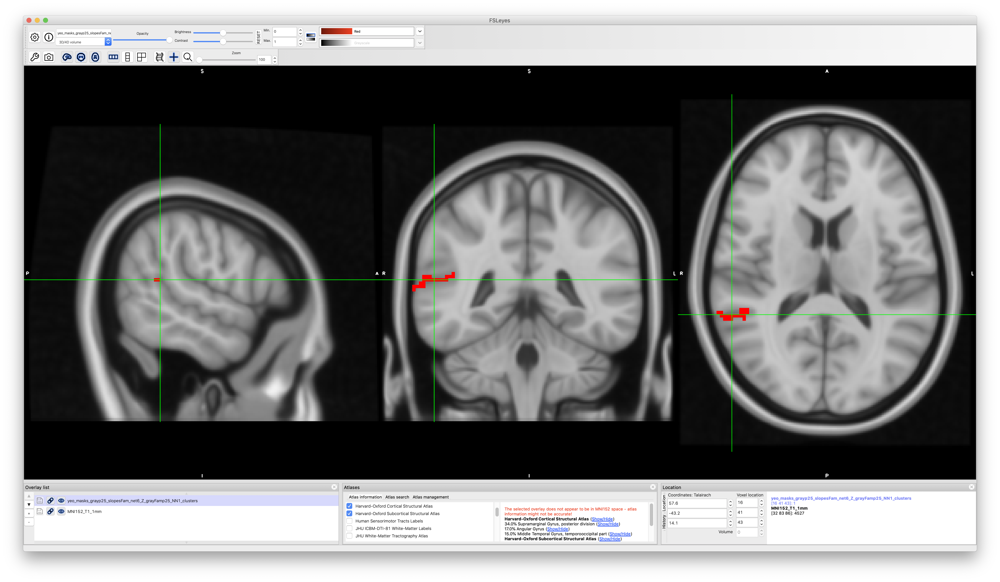
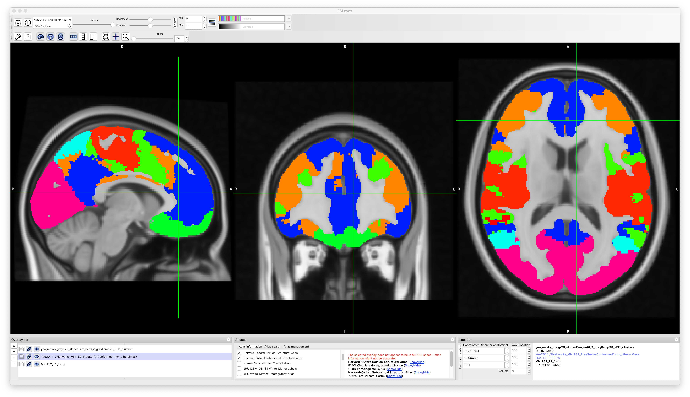

# 2019-09-13 09:24:14

Now that I have some decent results using the Yeo mask in the DMN (p25 FD
threshold, see note 37), let me try to make it a bit better. For starters, I
noticed while playing with the roi2nets analysis that we were missing some
subjects in the pedigree file. So, I added them. Let's first check that our
cluster is still there and, if yes, if it still survives permutations. Note here
that I'll need to run all 250 perms again, because of the new pedigree file.
Still, we have a weekend coming up, so it should be an issue.

```bash
cd ~/data/heritability_change/xcp-36p_despike;
phen_file=yeo_masks_grayp25_slopesFam_net6_Z;
jname=dmn;
swarm_file=swarm.${jname};

rm -f $swarm_file;
for vlist in `ls $PWD/vlistg*txt`; do  # getting full path to files
    echo "bash ~/research_code/run_solar_voxel_parallel.sh $phen_file $vlist" >> $swarm_file;
done;
swarm --gres=lscratch:10 -f $swarm_file --module solar -t 32 -g 10 \
        --logdir=trash_${jname} --job-name ${jname} --time=4:00:00 \
        --merge-output --partition quick,norm
```

Quick note that we only have 67 subjects in the Fam dataset... 

Because the change was just in the pedigree file, I can reuse the previous
random files, and just make new ones starting at 100.

```r
start=101
suf = '6_Z'
m = 'yeo_masks'
nperms = 250
step=10

library(data.table)
set.seed( as.integer((as.double(Sys.time())*1000+Sys.getpid()) %% 2^31) )
dread = fread(sprintf('~/data/heritability_change/%s_grayp25_slopesFam_net%s.csv', m, suf),
              header = T, sep = ',')
d = as.data.frame(dread)  # just so we can index them a bit easier
vcols = c(which(grepl("v",colnames(d))), which(grepl("sex",colnames(d))),
          which(grepl("qc",colnames(d))))
d2 = d
for (p in seq(start, nperms, step)) {
    d2[, vcols] = d[sample(nrow(d)), vcols]
    fname = sprintf('~/data/heritability_change/%s_grayp25_slopesFam_net%s_p%03d.csv', m, suf, p)
    print(fname)
    fwrite(d2, file=fname, row.names=F, quote=F)
}
```

SOLAR now sees all 67 subjects. Let's fire-up the permutation swarms:

```bash
cd ~/data/heritability_change/xcp-36p_despike;
for p in {1..250}; do
    perm=`printf %03d $p`;
    phen_file=yeo_masks_grayp25_slopesFam_net6_Z_p${perm};
    swarm_file=swarm.dmn_p${perm};

    for vlist in `ls $PWD/vlistg*txt`; do  # getting full path to files
        echo "bash ~/research_code/run_solar_voxel_parallel.sh $phen_file $vlist" >> $swarm_file;
    done;
done

for p in {1..250}; do
    perm=`printf %03d $p`;
    jname=dmn_p${perm};
    swarm_file=swarm.${jname};
    echo "ERROR" > swarm_wait;
    while grep -q ERROR swarm_wait; do
        echo "Trying $jname"
        swarm --gres=lscratch:10 -f $swarm_file --module solar -t 32 -g 10 \
                --logdir=trash_${jname} --job-name ${jname} --time=4:00:00 --merge-output \
                --partition quick,norm 2> swarm_wait;
        if grep -q ERROR swarm_wait; then
            echo -e "\tError, sleeping..."
            sleep 30m;
        fi;
    done;
done
```

And we can check if the result is still there:

```bash
module load afni

cd /lscratch/${SLURM_JOBID}
phen=yeo_masks_grayp25_slopesFam_net6_Z;
mkdir $phen;
cd $phen;
cp ~/data/tmp/${phen}/*gz .;
for f in `/bin/ls *gz`; do tar -zxf $f; done
cd ..
python ~/research_code/fmri/compile_solar_voxel_results.py \
    /lscratch/${SLURM_JOBID}/ $phen \
    ~/data/heritability_change/xcp-36p_despike/gray_matter_mask.nii;
rm -rf $phen;

cp polygen_results_${phen}.nii ~/data/heritability_change/xcp-36p_despike/

cd ~/data/heritability_change/xcp-36p_despike/
3dclust -1Dformat -nosum -1dindex 0 -1tindex 1 -1thresh 0.99 -orient LPI \
    -savemask ${phen}_grayp25_NN1_clusters.nii -NN1 40 \
    polygen_results_${phen}.nii;
```

```
++ 3dclust: AFNI version=AFNI_19.2.23 (Sep  6 2019) [64-bit]
++ Authored by: RW Cox et alii
#
#Cluster report for file polygen_results_yeo_masks_grayp25_slopesFam_net6_Z.nii 
#[Connectivity radius = 1.11 mm  Volume threshold = 320.00 ]
#[Single voxel volume = 8.0 (microliters) ]
#[Voxel datum type    = float ]
#[Voxel dimensions    = 2.000 mm X 2.000 mm X 2.000 mm ]
#[Coordinates Order   = LPI ]
#[Fake voxel dimen    = 1.000 mm X 1.000 mm X 1.000 mm ]
#Mean and SEM based on Absolute Value of voxel intensities: 
#
#Volume  CM LR  CM PA  CM IS  minLR  maxLR  minPA  maxPA  minIS  maxIS    Mean     SEM    Max Int  MI LR  MI PA  MI IS
#------  -----  -----  -----  -----  -----  -----  -----  -----  -----  -------  -------  -------  -----  -----  -----
++ Output dataset ./yeo_masks_grayp25_slopesFam_net6_Z_grayp25_NN1_clusters.nii
     56  -51.3   15.3   34.3  -56.0  -48.0    8.0   28.0   28.0   38.0   0.9167   0.0099        1  -50.0   16.0   34.0 
     48  -58.2  -37.4    2.9  -64.0  -54.0  -40.0  -32.0   -2.0    8.0   0.8955   0.0116        1  -62.0  -38.0    0.0 
```

OK, it went down in size... hopefully it still survives permutations... it's not
in the same location either.


REDO THIS BECAUSE SO FAR WE ONLY HAVE 30 REPS!

```bash
module load afni

cd /lscratch/${SLURM_JOBID}
for p in {1..30}; do
    perm=`printf %03d $p`;
    phen=yeo_masks_grayp25_slopesFam_net6_Z_p${perm};
    mkdir $phen;
    cd $phen;
    cp ~/data/tmp/${phen}/*gz .;
    for f in `/bin/ls *gz`; do tar -zxf $f; done
    cd ..
    python ~/research_code/fmri/compile_solar_voxel_results.py \
        /lscratch/${SLURM_JOBID}/ $phen \
        ~/data/heritability_change/xcp-36p_despike/gray_matter_mask.nii;
    rm -rf $phen;
done;
cp -v polygen*yeo_masks_grayp25_slopes*_net6_Z_p*nii ~/data/heritability_change/xcp-36p_despike/

cd ~/data/heritability_change/xcp-36p_despike/perms
froot=polygen_results_yeo_masks_grayp25_slopes${i}_net6_Z
csize=59;
res=`3dclust -1Dformat -nosum -1dindex 0 -1tindex 1 -1thresh 0.99 -NN1 $csize \
    -quiet ${froot}_p*.nii | grep CLUSTERS | wc -l`
nperms=`ls -1 ${froot}_p*.nii | wc -l`;
p=$(bc <<<"scale=3;($nperms - $res)/$nperms")
echo negatives=${res}, perms=${nperms}, pval=$p
```

CHECK FOR SX CORRELATION
CHECK CORRELATION OF SLOPE OF CONNECTIVITY AND SLOPE OF MOVEMENT


<!-- Then, while that's running, let's set up a few situations with cleaner data.
Because this is not MELODIC, we don't need to recalculate masks.

Keep in mind that the code is:

```
0: visual
1: somatomotor
2: DAN
3: VAN
4: limbic
5: cognitive (frontoparietal)
6: DMN
```

Because we have already dumped everyone with FD < 1, we just need to collect the
best ones in R:

```r
maskids = read.table('~/data/heritability_change/xcp-36p_despike/ids_p25.txt')[, 1]
nvox=155301
for (m in 0:6) {
    for (suf in c('', '_Z')) {
        print(m)
        print(suf)
        brain_data = matrix(nrow=length(maskids), ncol=nvox)
        for (s in 1:nrow(brain_data)) {
            fname = sprintf('~/data/heritability_change/xcp-36p_despike/yeo_masks_gray/dumps/%04d_net%d%s.txt', maskids[s], m, suf)
            a = read.table(fname)
            brain_data[s, ] = a[,4]
        }
        brain_data = cbind(maskids, brain_data)
        cnames = c('mask.id', sapply(1:nvox, function(d) sprintf('v%06d', d)))
        colnames(brain_data) = cnames
        fname = sprintf('~/data/heritability_change/xcp-36p_despike/yeo_masks_grayp25_net%d%s.rds', m, suf)
        saveRDS(brain_data, file=fname)
    }
}
```

Finally, make the slopes:

```r
source('~/research_code/lab_mgmt/merge_on_closest_date.R')
df = read.csv('~/data/heritability_change/rsfmri_fc-36p_despike_condensed_posOnly_FD1.00_scans520_08022019.csv')
mydir='~/data/heritability_change/xcp-36p_despike/'
ic = 5
suf = ''

fname = sprintf('%s/yeo_masks_grayp25_net%d%s.rds', mydir, ic, suf)
b = readRDS(fname)
var_names = colnames(b)[2:ncol(b)]
df2 = merge(df, b, by.x='Mask.ID', by.y='mask.id', all.x=F)

# make sure we still have two scans for everyone
rm_subjs = names(which(table(df2$Medical.Record...MRN)<2))
rm_me = df2$Medical.Record...MRN %in% rm_subjs
df2 = df2[!rm_me, ]

mres = df2
mres$SX_HI = as.numeric(as.character(mres$SX_hi))
mres$SX_inatt = as.numeric(as.character(mres$SX_inatt))

res = c()
for (s in unique(mres$Medical.Record...MRN)) {
    idx = which(mres$Medical.Record...MRN == s)
    row = c(s, unique(mres[idx, 'Sex']))
    y = mres[idx[2], var_names] - mres[idx[1], var_names]
    x = mres[idx[2], 'age_at_scan'] - mres[idx[1], 'age_at_scan']
    slopes = y / x
    row = c(row, slopes)
    for (t in c('SX_inatt', 'SX_HI', 'qc')) {
        fm_str = sprintf('%s ~ age_at_scan', t)
        fit = lm(as.formula(fm_str), data=mres[idx, ], na.action=na.exclude)
        row = c(row, coefficients(fit)[2])
    }
    # grabbing inatt and HI at baseline
    base_DOA = which.min(mres[idx, 'age_at_scan'])
    row = c(row, mres[idx[base_DOA], 'SX_inatt'])
    row = c(row, mres[idx[base_DOA], 'SX_HI'])
    # DX1 is DSMV definition, DX2 will make SX >=4 as ADHD
    if (mres[idx[base_DOA], 'age_at_scan'] < 16) {
        if ((row[length(row)] >= 6) || (row[length(row)-1] >= 6)) {
            DX = 'ADHD'
        } else {
            DX = 'NV'
        }
    } else {
        if ((row[length(row)] >= 5) || (row[length(row)-1] >= 5)) {
            DX = 'ADHD'
        } else {
            DX = 'NV'
        }
    }
    if ((row[length(row)] >= 4) || (row[length(row)-1] >= 4)) {
        DX2 = 'ADHD'
    } else {
        DX2 = 'NV'
    }
    row = c(row, DX)
    row = c(row, DX2)
    res = rbind(res, row)
    print(nrow(res))
}
colnames(res) = c('ID', 'sex', var_names, c('SX_inatt', 'SX_HI', 'qc',
                                            'inatt_baseline',
                                            'HI_baseline', 'DX', 'DX2'))
fname = sprintf('%s/yeo_masks_grayp25_slopes_net%d%s.rds', mydir, ic, suf)
saveRDS(res, file=fname)
# in case we want to run everyone, not just family through solar
fname = sprintf('%s/yeo_masks_grayp25_slopes_net%d%s.csv', mydir, ic, suf)
write.csv(res, file=fname, row.names=F, na='', quote=F)

# and make sure every family has at least two people
good_nuclear = names(table(df2$Nuclear.ID...FamilyIDs))[table(df2$Nuclear.ID...FamilyIDs) >= 4]
good_extended = names(table(df2$Extended.ID...FamilyIDs))[table(df2$Extended.ID...FamilyIDs) >= 4]
keep_me = c()
for (f in good_nuclear) {
    keep_me = c(keep_me, df2[which(df2$Nuclear.ID...FamilyIDs == f),
                            'Medical.Record...MRN'])
}
for (f in good_extended) {
    keep_me = c(keep_me, df2[which(df2$Extended.ID...FamilyIDs == f),
                            'Medical.Record...MRN'])
}
keep_me = unique(keep_me)

fam_subjs = c()
for (s in keep_me) {
    fam_subjs = c(fam_subjs, which(res[, 'ID'] == s))
}
res2 = res[fam_subjs, ]

fname = sprintf('%s/yeo_masks_grayp25_slopesFam_net%d%s.csv', mydir, ic, suf)
write.csv(res2, file=fname, row.names=F, na='', quote=F)
```

And as usual, we set up the swarms:

```bash
cd ~/data/heritability_change/xcp-36p_despike;
for i in {0..6}; do
    for suf in '' '_Z'; do
        for f in '' 'Fam'; do
            phen_file=yeo_masks_grayp25_slopes${f}_net${i}${suf};
            jname=ym${f}p25_${i}${suf};
            swarm_file=swarm.${jname};

            rm -f $swarm_file;
            for vlist in `ls $PWD/vlistg*txt`; do  # getting full path to files
                echo "bash ~/research_code/run_solar_voxel_parallel.sh $phen_file $vlist" >> $swarm_file;
            done;
            echo "ERROR" > swarm_wait;
            while grep -q ERROR swarm_wait; do
                echo "Trying $jname"
                swarm --gres=lscratch:10 -f $swarm_file --module solar -t 32 -g 10 \
                        --logdir=trash_${jname} --job-name ${jname} --time=4:00:00 --merge-output \
                        --partition quick,norm 2> swarm_wait;
                if grep -q ERROR swarm_wait; then
                    echo -e "\tError, sleeping..."
                    sleep 30m;
                fi;
            done;
        done;
    done;
done
```

And while we wait for SOLAR to run, let's go ahead and generate the perms, for
the non-Fam cases, and then for p25:

```r
suf = '0'
m = 'yeo_masks'
start=1
nperms = 25
step=1

library(data.table)
set.seed( as.integer((as.double(Sys.time())*1000+Sys.getpid()) %% 2^31) )
dread = fread(sprintf('~/data/heritability_change/%s_grayp25_slopes_net%s.csv', m, suf),
              header = T, sep = ',')
d = as.data.frame(dread)  # just so we can index them a bit easier
vcols = c(which(grepl("v",colnames(d))), which(grepl("sex",colnames(d))),
          which(grepl("qc",colnames(d))))
d2 = d
for (p in seq(start, nperms, step)) {
    d2[, vcols] = d[sample(nrow(d)), vcols]
    fname = sprintf('~/data/heritability_change/%s_grayp25_slopes_net%s_p%03d.csv', m, suf, p)
    print(fname)
    fwrite(d2, file=fname, row.names=F, quote=F)
}
```

OK, let's see if the clusters are any bigger using this bigger sample:


There wasn't again a clear difference between Z and non-Z, but the size of the
clusters wasn't much different, as expected based on how SOLAR works:

yeo
'6': 56 (before 60)
'2': 61 (before 57)
'4': 50 (before 59)

And I don't think the perms will make much difference here, so I won't even run
them. Let's put our eggs in the p25 basket for now.

# 2019-09-04 08:34:33

Time to compile the p25 results.

```bash
module load afni

cd /lscratch/${SLURM_JOBID}
for i in {0..6}; do
    for suf in '' '_Z'; do
        phen=yeo_masks_grayp25_slopesFam_net${i}${suf};
        mkdir $phen;
        cd $phen;
        cp ~/data/tmp/${phen}/*gz .;
        for f in `/bin/ls *gz`; do tar -zxf $f; done
        cd ..
        python ~/research_code/fmri/compile_solar_voxel_results.py \
            /lscratch/${SLURM_JOBID}/ $phen \
            ~/data/heritability_change/xcp-36p_despike/gray_matter_mask.nii;
        rm -rf $phen;
    done;
done
cp polygen*yeo_masks_grayp25_slopesFam_net*nii ~/data/heritability_change/xcp-36p_despike/

cd ~/data/heritability_change/xcp-36p_despike/
for i in {0..6}; do
    for suf in '' '_Z'; do
        phen=yeo_masks_grayp25_slopesFam_net${i}${suf};
        3dclust -1Dformat -nosum -1dindex 0 -1tindex 1 -1thresh 0.99 -orient LPI \
            -savemask ${phen}_grayFamp25_NN1_clusters.nii -NN1 40 \
            polygen_results_${phen}.nii >> NN1_yeo_masks_grayFamp25_results.txt;
    done
done
```

All: ('' / '_Z')
0: 69 / 72
1: 0 / 0
2: 0 / 0 
3: 42 / 0
4: 54 / 54
5: 0 / 45
6: 54 / 59

Fam: ('' / '_Z')
0: 68 / 43
1: 0 / 0
2: 0 / 0
3: 0 / 0
4: 0 / 60
5: 0 / 0
6: 0 / 59

In general, the _Z results were a tiny bit betetr. Then, comparing Fam and all
results, All was better (bigger clusters). But nothing Earth-shattering. We
could potentially do this just for DMN and see if it looks good? I didn't run any perms for these, and they might work
especially because they're at about the same range as the other ones. It's a
smaller sample so we will need perms again. Let's do perms just for DMN as see
how big of a cluster we need, both in Fam and in All:


# 2019-09-05 09:35:26

Now let's compile:


Well, that's good. I got 0 times for a cluster size 59 or more... let's bump it
up to 100 perms to see if it gets better:

```r
start=26
suf = '6_Z'
m = 'yeo_masks'
nperms = 100
step=5

library(data.table)
set.seed( as.integer((as.double(Sys.time())*1000+Sys.getpid()) %% 2^31) )
dread = fread(sprintf('~/data/heritability_change/%s_grayp25_slopesFam_net%s.csv', m, suf),
              header = T, sep = ',')
d = as.data.frame(dread)  # just so we can index them a bit easier
vcols = c(which(grepl("v",colnames(d))), which(grepl("sex",colnames(d))),
          which(grepl("qc",colnames(d))))
d2 = d
for (p in seq(start, nperms, step)) {
    d2[, vcols] = d[sample(nrow(d)), vcols]
    fname = sprintf('~/data/heritability_change/%s_grayp25_slopesFam_net%s_p%03d.csv', m, suf, p)
    print(fname)
    fwrite(d2, file=fname, row.names=F, quote=F)
}
```

And when that's done running, we fire up the remaining perms:

```bash
cd ~/data/heritability_change/xcp-36p_despike;
for i in '' 'Fam'; do
    for p in {26..100}; do
        perm=`printf %03d $p`;
        phen_file=yeo_masks_grayp25_slopes${i}_net6_Z_p${perm};
        swarm_file=swarm.ymgp256${i}_p${perm};

        for vlist in `ls $PWD/vlistg*txt`; do  # getting full path to files
            echo "bash ~/research_code/run_solar_voxel_parallel.sh $phen_file $vlist" >> $swarm_file;
        done;
    done;
done

for i in '' 'Fam'; do
    for p in {26..100}; do
        perm=`printf %03d $p`;
        jname=ymgp256${i}_p${perm};
        swarm_file=swarm.${jname};
        echo "ERROR" > swarm_wait;
        while grep -q ERROR swarm_wait; do
            echo "Trying $jname"
            swarm --gres=lscratch:10 -f $swarm_file --module solar -t 32 -g 10 \
                    --logdir=trash_${jname} --job-name ${jname} --time=4:00:00 --merge-output \
                    --partition quick,norm 2> swarm_wait;
            if grep -q ERROR swarm_wait; then
                echo -e "\tError, sleeping..."
                sleep 30m;
            fi;
        done;
    done;
done
```

# 2019-09-12 10:47:19

Now let's compile:

```bash
module load afni

cd /lscratch/${SLURM_JOBID}
for i in '' 'Fam'; do
    for p in {26..100}; do
        perm=`printf %03d $p`;
        phen=yeo_masks_grayp25_slopes${i}_net6_Z_p${perm};
        mkdir $phen;
        cd $phen;
        cp ~/data/tmp/${phen}/*gz .;
        for f in `/bin/ls *gz`; do tar -zxf $f; done
        cd ..
        python ~/research_code/fmri/compile_solar_voxel_results.py \
            /lscratch/${SLURM_JOBID}/ $phen \
            ~/data/heritability_change/xcp-36p_despike/gray_matter_mask.nii;
        rm -rf $phen;
    done;
done
cp -v polygen*yeo_masks_grayp25_slopes*_net6_Z_p*nii ~/data/heritability_change/xcp-36p_despike/perms/

cd ~/data/heritability_change/xcp-36p_despike/perms
froot=polygen_results_yeo_masks_grayp25_slopes${i}_net6_Z
csize=59;
res=`3dclust -1Dformat -nosum -1dindex 0 -1tindex 1 -1thresh 0.99 -NN1 $csize \
    -quiet ${froot}_p*.nii | grep CLUSTERS | wc -l`
nperms=`ls -1 ${froot}_p*.nii | wc -l`;
p=$(bc <<<"scale=3;($nperms - $res)/$nperms")
echo $froot, negatives=${res}, perms=${nperms}, pval=$p
```

It survived for Fam, but not using everyone. Using Fam, we are at .01 for a
cluster of size 59. 

```
polygen_results_yeo_masks_grayp25_slopes_net6_Z, negatives=87, perms=100, pval=.130
polygen_results_yeo_masks_grayp25_slopesFam_net6_Z, negatives=99, perms=100, pval=.010
```

OK, so let's investigate that Fam cluster then. It was the only one at NN1, but
at NN2 I have 67 and 43, and 67, 44, 40 at NN3. Do they survive?

NN2 67 survives at .02, but not 43. I don't think 44 will either for NN3. What
if we go for voxelwise .05? We have 213, 165 and 140 for NN1, 402, 318 and 173
for NN2, and 632, 424, and 241 for NN3. Only NN2 402 survived at .04, but based
on location it seems like it's the same as the .01 cluster. In NN3 we get 632 at
.01. So, let's go with our original result then.

Let's see where this DMN cluster is located:

```
-bash-4.2$ 3dclust -1Dformat -nosum -1dindex 0 -1tindex 1 -1thresh 0.99 -orient LPI -NN1 40 polygen_results_${phen}.nii
++ 3dclust: AFNI version=AFNI_19.2.23 (Sep  6 2019) [64-bit]
++ Authored by: RW Cox et alii
#
#Cluster report for file polygen_results_yeo_masks_grayp25_slopesFam_net6_Z.nii
#[Connectivity radius = 1.11 mm  Volume threshold = 320.00 ]
#[Single voxel volume = 8.0 (microliters) ]
#[Voxel datum type    = float ]
#[Voxel dimensions    = 2.000 mm X 2.000 mm X 2.000 mm ]
#[Coordinates Order   = LPI ]
#[Fake voxel dimen    = 1.000 mm X 1.000 mm X 1.000 mm ]
#Mean and SEM based on Absolute Value of voxel intensities:
#
#Volume  CM LR  CM PA  CM IS  minLR  maxLR  minPA  maxPA  minIS  maxIS    Mean     SEM    Max Int  MI LR  MI PA  MI IS
#------  -----  -----  -----  -----  -----  -----  -----  -----  -----  -------  -------  -------  -----  -----  -----
     59   57.6  -43.2   14.1   44.0   70.0  -48.0  -38.0    8.0   18.0   0.9381   0.0088        1   70.0  -42.0    8.0
```

 



OK, the change in connectivity (slope) between the red blob (supramarginal gyrus
/ angular gyrus / mtg) and the DMN is heritable (voxelwise p < .01, clusterwise
p = .01). If we make this into a "voxelwise connectivity to the DMN" analysis,
then we don't need correct across networks It's resting data, so I don't think
it's too far fetched to do it that way. The blob itself is almost entirely
contained in VAN, according to Yeo atlas.

Now we do some more tests on this blob... how does it look like? If we include
everyone, is it correlated to SX?
 -->
