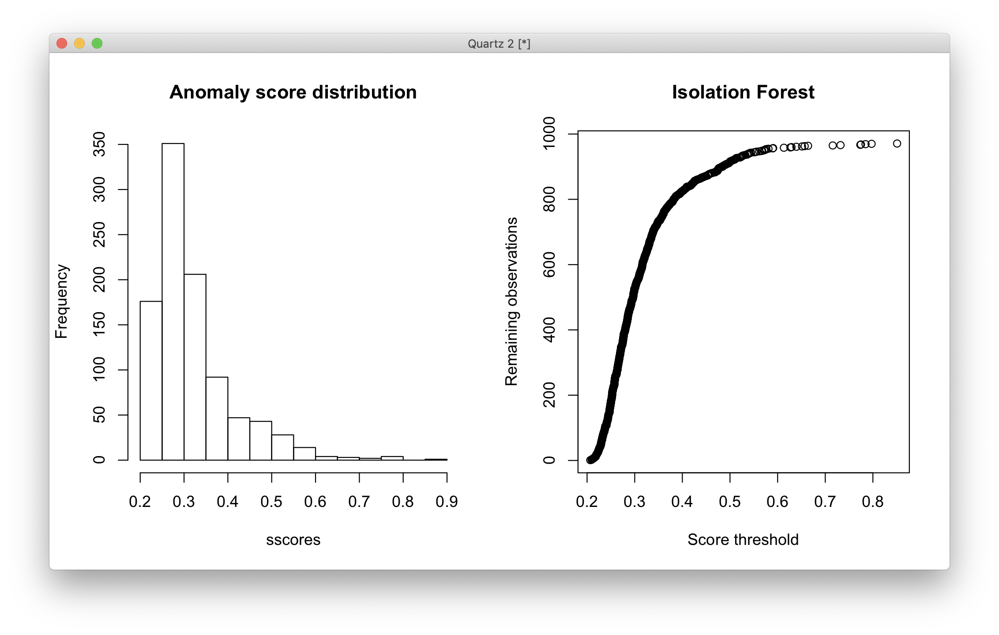
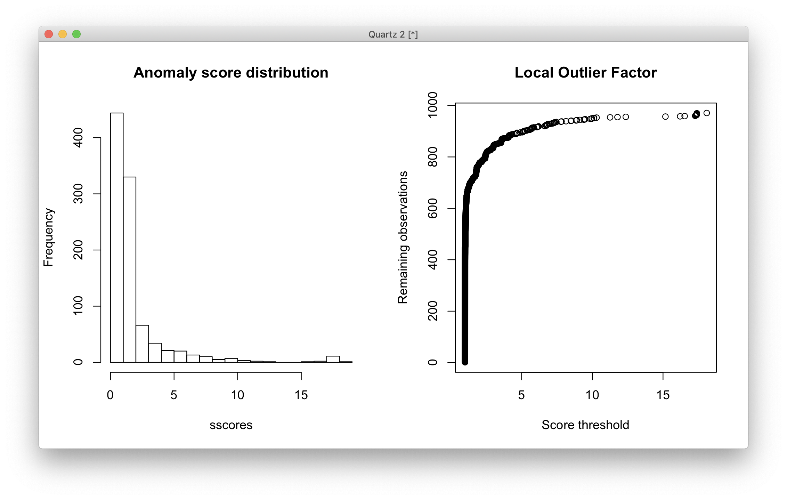
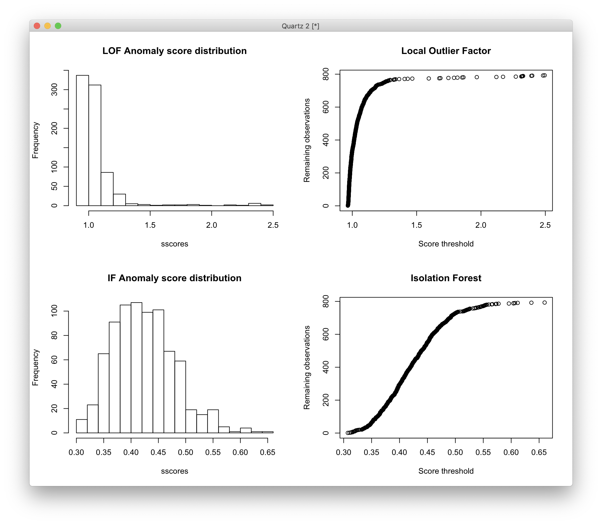
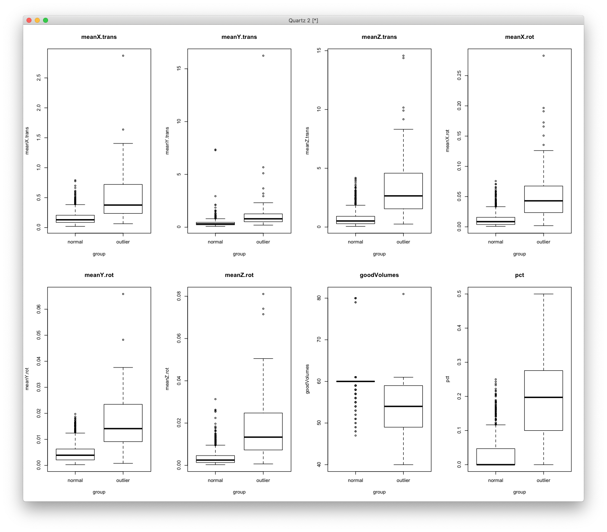
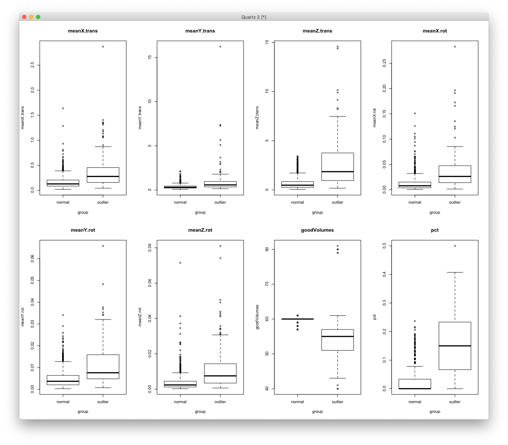

# 2019-09-13 15:08:06

I'm doing some testing with new outlier detection methods. The reasoning here is
that if it's a linear relationship, we'll be removing it when we covary the
metric in the models. If it's not, then thresholding the data based on when the
correlation goes away is not a good metric anyways. Unless we use non-arametric
correlation. But still, which metric to use to evaluate the correlation? All of
them?

So, let's see if using some anomaly detection method would help here. I'll try
Isolation Forest and Local Outlier Factor, which are both not too hard to
understand. They each give scores of the likelihood of the sample being an
outlier, and we can threshold the data based on that.

We should do this based on the metadata, but also on the data themselves, for
extra cleansing. Some cuts will need to be done prior to cleaning, such as age
cut, as kids will likely move more than adults. But we could keep people with
a single scan, as they would also inform the normal distribution.

```r
b = read.csv('/Volumes/Shaw/MasterQC/master_qc_20190314.csv')
a = read.csv('~/data/heritability_change/ready_1020.csv')
m = merge(a, b, by.y='Mask.ID', by.x='Mask.ID...Scan', all.x=F)

# restrict based on QC
m$pct = m$missingVolumes / m$numVolumes

qc_vars = c("meanX.trans", "meanY.trans", "meanZ.trans",
            "meanX.rot", "meanY.rot", "meanZ.rot",
            "goodVolumes", "pct")

m = m[m$"age_at_scan...Scan...Subjects" < 18, ]

library(solitude)
iso <- isolationForest$new()
iso$fit(m[, qc_vars])
scores_if = as.matrix(iso$scores)[,3]
```

The scores for IF are informative, as the original paper suggest that scores
closer to 1 are likely outliers, but if the distribution is hovering around .5
for all samples than there shouldn't be many outliers. We could then make a
histogram of those scores, and also a plot to show us what score to use
depending on how much data we want to keep:

```r
par(mfrow=c(1,2))
sscores = sort(scores_if)
hist(sscores, breaks=20, main='Anomaly score distribution')
plot(sscores, 1:length(sscores), ylab='Remaining observations',
     xlab='Score threshold', main='Isolation Forest')
```



I think we can be conservative here and stick with .45, which gets to be about
the elbow of the cumulative distribution and still gives us about 900 scans to
play with. Or, we can go for .6 to just get those outliers. 

Let's see how it looks for LOF:

```r
library(dbscan)
# here I set the number of neighbors to a percentage of the total data
scores_lof = lof(m[, qc_vars], k = round(.5 * nrow(m)))
par(mfrow=c(1,2))
sscores = sort(scores_lof)
hist(sscores, breaks=20, main='Anomaly score distribution')
plot(sscores, 1:length(sscores), ylab='Remaining observations',
     xlab='Score threshold', main='Local Outlier Factor')
```



For LOF I think about 2.5 looks alright. So, maybe an agreement between both
methods should be OK?

From that starting point, let's use the same approach for the entire data. Here'
it will depend on whether we're using voxels or tracts. Let's do tracts first.

```r
idx = scores_lof < 2.5 & scores_if < .45
tracts = read.csv('~/data/heritability_change/dti_mean_phenotype_1020.csv')
# somehow I have two entries for 1418?
x = duplicated(tracts$file)
data = merge(m[idx, ], tracts[!x, ], by.x='Mask.ID...Scan', by.y='file')
tract_names = colnames(tracts)[2:ncol(tracts)]

iso <- isolationForest$new()
iso$fit(data[, tract_names])
scores_if = as.matrix(iso$scores)[,3]
scores_lof = lof(data[, tract_names], k = round(.5 * nrow(data)))

par(mfrow=c(2,2))
sscores = sort(scores_lof)
hist(sscores, breaks=20, main='LOF Anomaly score distribution')
plot(sscores, 1:length(sscores), ylab='Remaining observations',
     xlab='Score threshold', main='Local Outlier Factor')
sscores = sort(scores_if)
hist(sscores, breaks=20, main='IF Anomaly score distribution')
plot(sscores, 1:length(sscores), ylab='Remaining observations',
     xlab='Score threshold', main='Isolation Forest')
```



I think a fair threshold for LOF is 1.2 and for IF is .525. Now, let's see how
many scans we end up with:

```r
idx = scores_lof < 1.2 & scores_if < .525
```

We are still at 720 scans, coming from initial 971 kiddie scans. So, a 26%
reduction. What happens when we keep the best two scans of each kid that has 2
or more scans? And here we'll define as "best" as just the LOF score, which is a
bit easier to interpret and it doesn't look like a normal distribution.

```r
num_scans = 2  # number of scans to select
data$scores = scores_lof
a = data[idx, ]
# removing people with less than num_scans scans
idx = which(table(a$Medical.Record...MRN)>=num_scans)
long_subjs = names(table(a$Medical.Record...MRN))[idx]
keep_me = c()
for (m in 1:nrow(a)) {
    if (a[m, ]$Medical.Record...MRN %in% long_subjs) {
        keep_me = c(keep_me, m)
    }
}
a = a[keep_me,]
cat(sprintf('Down to %d to keep only subjects with more than %d scans\n',
            nrow(a), num_scans))
keep_me = c()
for (s in unique(a$Medical.Record...MRN)) {
    found = F
    subj_idx = which(a$Medical.Record...MRN==s)
    subj_scans = a[subj_idx, ]
    dates = as.Date(as.character(subj_scans$"record.date.collected...Scan"),
                                    format="%m/%d/%Y")
    best_scans = sort(subj_scans$scores, index.return=T)
    # make sure they are at least 6 months apart. This is the idea:
    # grab the best X scans. Check the time difference between them.
    # Any time the time difference is not enough, remove the worse
    # scan and replace by the next in line. Keep doing this until
    # the time difference is enough between all scans, or we run out
    # of scans
    cur_scan = 1
    last_scan = num_scans
    cur_choice = best_scans$ix[cur_scan:last_scan]
    while (!found && last_scan <= nrow(subj_scans)) {
        time_diffs = abs(diff(dates[cur_choice]))
        if (all(time_diffs > 180)) {
            found = TRUE
        } else {
            # figure out which scan to remove. If there is more than one
            # to be removed, it will be taken care in the next iteration
            bad_diff = which.min(time_diffs)
            if (subj_scans$scores[cur_choice[bad_diff]] >
                subj_scans$scores[cur_choice[bad_diff + 1]]) {
                rm_scan = cur_choice[bad_diff]
            } else {
                rm_scan = cur_choice[bad_diff + 1]
            }
            last_scan = last_scan + 1
            if (last_scan <= nrow(subj_scans)) {
                cur_choice[cur_choice == rm_scan] = best_scans$ix[last_scan]
            }
        }
    }
    if (found) {
        keep_me = c(keep_me, subj_idx[cur_choice])
    }
}
filtered_data = a[keep_me, ]
```

So, in the end we still have 456 scans, which is much more than what we had
before. Let's try using that for heritability and also for association (just to
simplify the analysis), and let's see what we get.

# 2019-09-16 10:02:29

Time to compute slopes. Let's re-use the code and keep some baseline metrics in
there as well:

```r
source('~/research_code/lab_mgmt/merge_on_closest_date.R')

qc_vars = c("meanX.trans", "meanY.trans", "meanZ.trans",
            "meanX.rot", "meanY.rot", "meanZ.rot",
            "goodVolumes", "pct")
clin = read.csv('~/data/heritability_change/clinical_03132019.csv')
df = mergeOnClosestDate(filtered_data, clin,
                        unique(filtered_data$Medical.Record...MRN...Subjects),
                         x.date='record.date.collected...Scan',
                         x.id='Medical.Record...MRN...Subjects')
library(MASS)
mres = df
mres$SX_HI = as.numeric(as.character(mres$SX_hi))
mres$SX_inatt = as.numeric(as.character(mres$SX_inatt))

res = c()
for (s in unique(mres$Medical.Record...MRN...Subjects)) {
    idx = which(mres$Medical.Record...MRN...Subjects == s)
    row = c(s, unique(mres[idx, 'Sex...Subjects']))
    y = mres[idx[2], c(tract_names, qc_vars)] - mres[idx[1], c(tract_names, qc_vars)]
    x = mres[idx[2], 'age_at_scan...Scan...Subjects'] - mres[idx[1], 'age_at_scan...Scan...Subjects']
    slopes = y / x
    row = c(row, slopes)
    for (t in c('SX_inatt', 'SX_HI')) {
        fm_str = sprintf('%s ~ age_at_scan...Scan...Subjects', t)
        fit = lm(as.formula(fm_str), data=mres[idx, ], na.action=na.exclude)
        row = c(row, coefficients(fit)[2])
    }
    # grabbing inatt and HI at baseline
    base_DOA = which.min(mres[idx, 'age_at_scan...Scan...Subjects'])
    row = c(row, mres[idx[base_DOA], 'SX_inatt'])
    row = c(row, mres[idx[base_DOA], 'SX_HI'])
    row = c(row, mres[idx[base_DOA], tract_names])
    # DX1 is DSMV definition, DX2 will make SX >=4 as ADHD
    if (mres[idx[base_DOA], 'age_at_scan...Scan...Subjects'] < 16) {
        if ((row[length(row)] >= 6) || (row[length(row)-1] >= 6)) {
            DX = 'ADHD'
        } else {
            DX = 'NV'
        }
    } else {
        if ((row[length(row)] >= 5) || (row[length(row)-1] >= 5)) {
            DX = 'ADHD'
        } else {
            DX = 'NV'
        }
    }
    if ((row[length(row)] >= 4) || (row[length(row)-1] >= 4)) {
        DX2 = 'ADHD'
    } else {
        DX2 = 'NV'
    }
    row = c(row, DX)
    row = c(row, DX2)
    res = rbind(res, row)
    print(nrow(res))
}
tract_base = sapply(tract_names, function(x) sprintf('%s_baseline', x))
colnames(res) = c('ID', 'sex', tract_names, qc_vars, c('SX_inatt', 'SX_HI',
                                              'inatt_baseline',
                                              'HI_baseline', tract_base,
                                              'DX', 'DX2'))
write.csv(res, file='~/data/heritability_change/dti_tracts_OD.csv',
          row.names=F, na='', quote=F)
```

Philip suggested that I should make a few plots showing the quality metrics for
the bad scans and the good scans. Just as a sanity check that the method is
doing what it's supposed to. So, let's try it:

```r
b = read.csv('/Volumes/Shaw/MasterQC/master_qc_20190314.csv')
a = read.csv('~/data/heritability_change/ready_1020.csv')
m = merge(a, b, by.y='Mask.ID', by.x='Mask.ID...Scan', all.x=F)

# restrict based on QC
m$pct = m$missingVolumes / m$numVolumes

qc_vars = c("meanX.trans", "meanY.trans", "meanZ.trans",
            "meanX.rot", "meanY.rot", "meanZ.rot",
            "goodVolumes", "pct")

m = m[m$"age_at_scan...Scan...Subjects" < 18, ]

library(solitude)
iso <- isolationForest$new()
iso$fit(m[, qc_vars])
scores_if = as.matrix(iso$scores)[,3]

idx_good = which(scores_if < .45)
m$group = 'outlier'
m[idx_good,]$group = 'normal'

par(mfrow=c(2,4))
for (v in qc_vars) {
    fm_str = sprintf('%s ~ group', v)
    boxplot(as.formula(fm_str), data=m, main=v)
}

```



This seems to be doing what we expect. Let's just make sure LOF is also looking
good:

```r
b = read.csv('/Volumes/Shaw/MasterQC/master_qc_20190314.csv')
a = read.csv('~/data/heritability_change/ready_1020.csv')
m = merge(a, b, by.y='Mask.ID', by.x='Mask.ID...Scan', all.x=F)

# restrict based on QC
m$pct = m$missingVolumes / m$numVolumes

qc_vars = c("meanX.trans", "meanY.trans", "meanZ.trans",
            "meanX.rot", "meanY.rot", "meanZ.rot",
            "goodVolumes", "pct")

m = m[m$"age_at_scan...Scan...Subjects" < 18, ]

library(dbscan)
scores_lof = lof(m[, qc_vars], k = round(.5 * nrow(m)))

idx_good = which(scores_lof < 2.5)
m$group = 'outlier'
m[idx_good,]$group = 'normal'

par(mfrow=c(2,4))
for (v in qc_vars) {
    fm_str = sprintf('%s ~ group', v)
    boxplot(as.formula(fm_str), data=m, main=v)
}
```



OK, let's take some SOLAR metrics on this new sample size. I wrote a special
function in SOLAR because I didn't residualize it in the scan space, as I didn't
want to corrupt the data to much. It'll need to be dealt with if slopes are
correlated, but only then. So, the SOLAR function deals with that, and I'll need
to deal with that in the regression cases as well.

```bash
# interactive
for m in fa ad rd; do
    for t in left_cst left_ifo left_ilf left_slf left_unc right_cst right_ifo \
        right_ilf right_slf right_unc cc; do
        solar run_phen_var_OD_tracts dti_tracts_OD ${m}_${t};
    done;
done;
```


