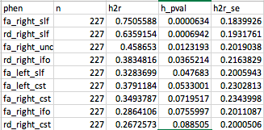
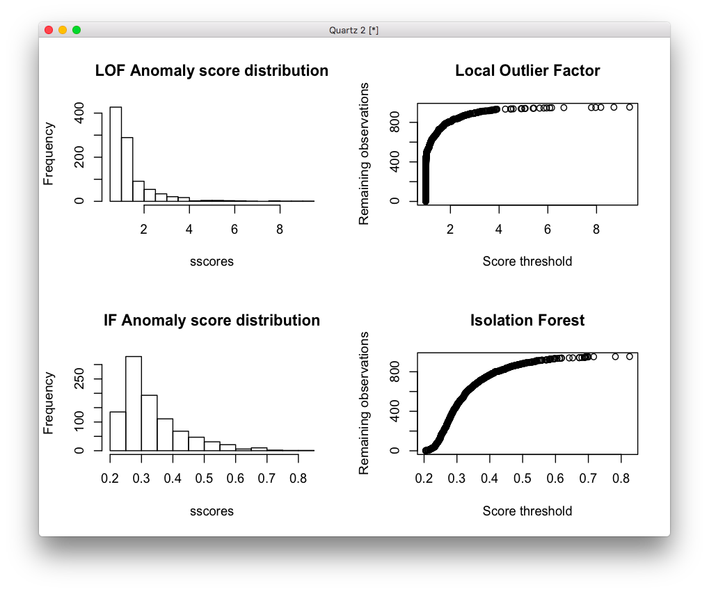
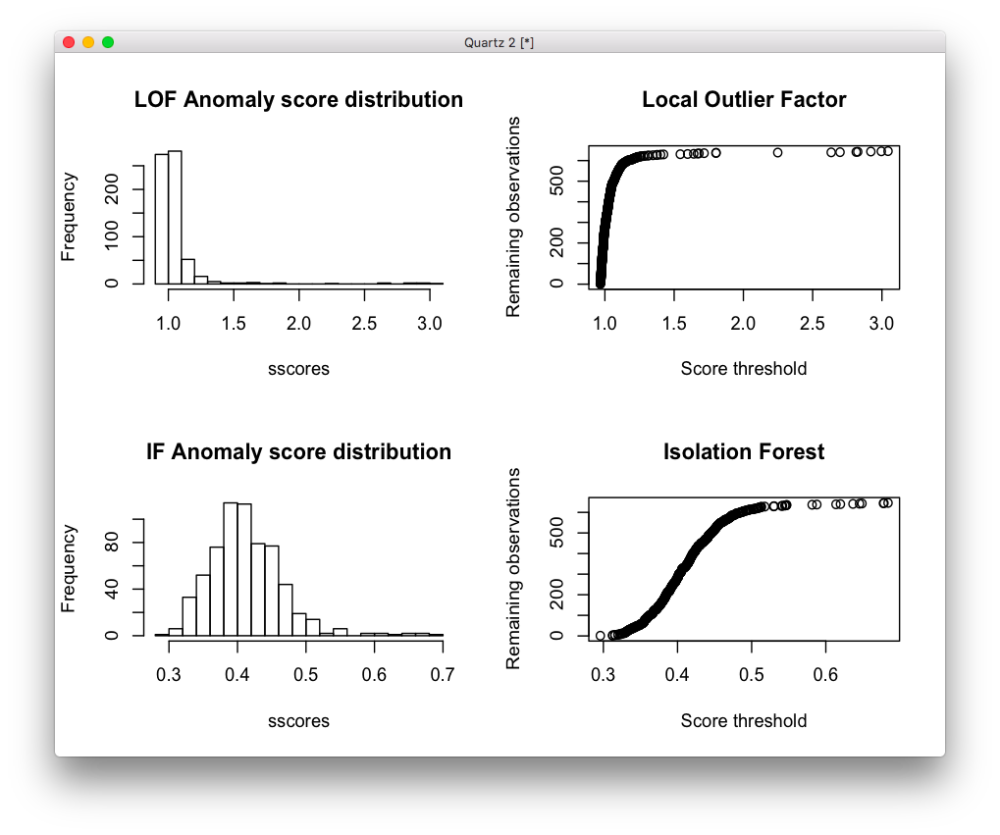

# 2019-09-17 11:01:42

Following the work from note 040, let's create a Fam dataset to see if it makes
a difference, and then also explore the tracts as defined in the FSL atlas.
Potentially, we could look at voxelwise as well.

We start with the thresholds we established in note 040, and then the other
thresholds will depend on the phenotype we're using:

```r
b = read.csv('/Volumes/Shaw/MasterQC/master_qc_20190314.csv')
a = read.csv('~/data/heritability_change/ready_1020.csv')
m = merge(a, b, by.y='Mask.ID', by.x='Mask.ID...Scan', all.x=F)

# restrict based on QC
m$pct = m$missingVolumes / m$numVolumes

qc_vars = c("meanX.trans", "meanY.trans", "meanZ.trans",
            "meanX.rot", "meanY.rot", "meanZ.rot",
            "goodVolumes", "pct")

m = m[m$"age_at_scan...Scan...Subjects" < 18, ]

library(solitude)
iso <- isolationForest$new()
iso$fit(m[, qc_vars])
scores_if = as.matrix(iso$scores)[,3]
library(dbscan)
# here I set the number of neighbors to a percentage of the total data
scores_lof = lof(m[, qc_vars], k = round(.5 * nrow(m)))
idx = scores_lof < 2.5 & scores_if < .45

tracts = read.csv('~/data/heritability_change/dti_mean_phenotype_1020.csv')
# somehow I have two entries for 1418?
x = duplicated(tracts$file)
data = merge(m[idx, ], tracts[!x, ], by.x='Mask.ID...Scan', by.y='file')
tract_names = colnames(tracts)[2:ncol(tracts)]

iso <- isolationForest$new()
iso$fit(data[, tract_names])
scores_if = as.matrix(iso$scores)[,3]
scores_lof = lof(data[, tract_names], k = round(.5 * nrow(data)))
idx = scores_lof < 1.2 & scores_if < .525

num_scans = 2  # number of scans to select
data$scores = scores_lof
a = data[idx, ]
# removing people with less than num_scans scans
idx = which(table(a$Medical.Record...MRN)>=num_scans)
long_subjs = names(table(a$Medical.Record...MRN))[idx]
keep_me = c()
for (m in 1:nrow(a)) {
    if (a[m, ]$Medical.Record...MRN %in% long_subjs) {
        keep_me = c(keep_me, m)
    }
}
a = a[keep_me,]
cat(sprintf('Down to %d to keep only subjects with more than %d scans\n',
            nrow(a), num_scans))
keep_me = c()
for (s in unique(a$Medical.Record...MRN)) {
    found = F
    subj_idx = which(a$Medical.Record...MRN==s)
    subj_scans = a[subj_idx, ]
    dates = as.Date(as.character(subj_scans$"record.date.collected...Scan"),
                                    format="%m/%d/%Y")
    best_scans = sort(subj_scans$scores, index.return=T)
    # make sure they are at least 6 months apart. This is the idea:
    # grab the best X scans. Check the time difference between them.
    # Any time the time difference is not enough, remove the worse
    # scan and replace by the next in line. Keep doing this until
    # the time difference is enough between all scans, or we run out
    # of scans
    cur_scan = 1
    last_scan = num_scans
    cur_choice = best_scans$ix[cur_scan:last_scan]
    while (!found && last_scan <= nrow(subj_scans)) {
        time_diffs = abs(diff(dates[cur_choice]))
        if (all(time_diffs > 180)) {
            found = TRUE
        } else {
            # figure out which scan to remove. If there is more than one
            # to be removed, it will be taken care in the next iteration
            bad_diff = which.min(time_diffs)
            if (subj_scans$scores[cur_choice[bad_diff]] >
                subj_scans$scores[cur_choice[bad_diff + 1]]) {
                rm_scan = cur_choice[bad_diff]
            } else {
                rm_scan = cur_choice[bad_diff + 1]
            }
            last_scan = last_scan + 1
            if (last_scan <= nrow(subj_scans)) {
                cur_choice[cur_choice == rm_scan] = best_scans$ix[last_scan]
            }
        }
    }
    if (found) {
        keep_me = c(keep_me, subj_idx[cur_choice])
    }
}
filtered_data = a[keep_me, ]
```

I just repeated the code to make sure we still had 456 scans in the end. Let's
compute the slopes and keep only the family ones for this test. But note that
relpairs (SOLAR 8.3.1) only shows 1 unrelated sample... maybe we just remove
that one?

```r
res = read.csv('~/data/heritability_change/dti_tracts_OD.csv')
res2 = res[res$ID != 7221745, ]
write.csv(res2, file='~/data/heritability_change/dti_tracts_OD_Fam.csv',
          row.names=F, na='', quote=F)
```

That seems to have worked...

```
solar> relpairs
                                                                        
    NPairs  Relationship
  ========  ===========================================
       227  Self
        64  Siblings
        12  1st cousins

Mean f is 2.105

This table also written to dti_tracts_OD_Fam/rd_cc/relatives.out
```

So, let's re-run our heritability estimates:

```bash
# interactive
cd ~/data/heritability_change
for m in fa ad rd; do
    for t in left_cst left_ifo left_ilf left_slf left_unc right_cst right_ifo \
        right_ilf right_slf right_unc cc; do
        solar run_phen_var_OD_tracts dti_tracts_OD_Fam ${m}_${t};
    done;
done;
mv dti_tracts_OD_Fam ~/data/tmp/
cd ~/data/tmp/dti_tracts_OD_Fam/
for p in `/bin/ls`; do cp $p/polygenic.out ${p}_polygenic.out; done
python ~/research_code/compile_solar_multivar_results.py dti_tracts_OD_Fam
```



Not much change. It survives Bonferroni if we do FA only, and there might be
even more if we do Meff.

How about relationship to ADHD?

```r
library(nlme)
data = read.csv('~/data/heritability_change/dti_tracts_OD_Fam.csv')
# to get famID
tmp = read.csv('~/data/heritability_change/ready_1020.csv')
tmp$famID = sapply(1:nrow(tmp), function(x)
                                if (is.na(tmp$Extended.ID...FamilyIDs[x])) {
                                    tmp$Nuclear.ID...FamilyIDs[x]
                                }
                                else {
                                    tmp$Extended.ID...FamilyIDs[x]
                                }
                    )
tmp2 = tmp[, c('Medical.Record...MRN...Subjects', 'famID')]
tmp3 = tmp2[!duplicated(tmp2[, 'Medical.Record...MRN...Subjects']), ]
data = merge(data, tmp3, by.x='ID', by.y='Medical.Record...MRN...Subjects', all.x=T, all.y=F)

tract_names = colnames(data)[3:35]

# let's run just the residuals after stepwise regression
mres = data
library(MASS)
for (t in tract_names) {
    print(t)
    fm_str = sprintf('%s ~', t)
    fm_str = paste(fm_str, 'sex + meanX.trans + meanY.trans + meanZ.trans + meanX.rot + meanY.rot + meanZ.rot + goodVolumes + pct')
    res.lm <- lm(as.formula(fm_str), data = data)
    step <- stepAIC(res.lm, direction = "both", trace = F)
    mres[, t] = residuals(step)
}

out_fname = '~/data/heritability_change/assoc_LME_tracts_OD_Fam.csv'
predictors = c('SX_inatt', 'SX_HI', 'inatt_baseline', 'HI_baseline', 'DX', 'DX2')
targets = tract_names
hold=NULL
for (i in targets) {
    for (j in predictors) {
        fm_str = sprintf('%s ~ %s', i, j)
        model1<-try(lme(as.formula(fm_str), mres, ~1|famID, na.action=na.omit))
        if (length(model1) > 1) {
            temp<-summary(model1)$tTable
            a<-as.data.frame(temp)
            a$formula<-fm_str
            a$target = i
            a$predictor = j
            a$term = rownames(temp)
            hold=rbind(hold,a)
        } else {
            hold=rbind(hold, NA)
        }
    }
}
write.csv(hold, out_fname, row.names=F)

data2 = mres[mres$DX=='ADHD', ]
out_fname = gsub(x=out_fname, pattern='.csv', '_dx1.csv')
predictors = c('SX_inatt', 'SX_HI', 'inatt_baseline', 'HI_baseline')
targets = tract_names
hold=NULL
for (i in targets) {
    for (j in predictors) {
        fm_str = sprintf('%s ~ %s', i, j)
        model1<-try(lme(as.formula(fm_str), data2, ~1|famID, na.action=na.omit))
        if (length(model1) > 1) {
            temp<-summary(model1)$tTable
            a<-as.data.frame(temp)
            a$formula<-fm_str
            a$target = i
            a$predictor = j
            a$term = rownames(temp)
            hold=rbind(hold,a)
        } else {
            hold=rbind(hold, NA)
        }
    }
}
write.csv(hold, out_fname, row.names=F)

data2 = mres[mres$DX2=='ADHD', ]
out_fname = gsub(x=out_fname, pattern='dx1', 'dx2')
predictors = c('SX_inatt', 'SX_HI', 'inatt_baseline', 'HI_baseline')
targets = tract_names
hold=NULL
for (i in targets) {
    for (j in predictors) {
        fm_str = sprintf('%s ~ %s', i, j)
        model1<-try(lme(as.formula(fm_str), data2, ~1|famID, na.action=na.omit))
        if (length(model1) > 1) {
            temp<-summary(model1)$tTable
            a<-as.data.frame(temp)
            a$formula<-fm_str
            a$target = i
            a$predictor = j
            a$term = rownames(temp)
            hold=rbind(hold,a)
        } else {
            hold=rbind(hold, NA)
        }
    }
}
write.csv(hold, out_fname, row.names=F)
```

There seems to be interesting stuff here... I don't even think I need to go into
the JHU tracts. At least not for now. Let's spend some time in an analogous fMRI
analysis.

# 2019-09-18 13:44:04

Philip suggested we should remove scans that have 80 directions, and any
correlated metrics. That makes sense. In fact, why don't we do a PCA and remove
the PCs instead? Let's see how it looks.

```r
b = read.csv('/Volumes/Shaw/MasterQC/master_qc_20190314.csv')
a = read.csv('~/data/heritability_change/ready_1020.csv')
m = merge(a, b, by.y='Mask.ID', by.x='Mask.ID...Scan', all.x=F)

# restrict based on QC
qc_vars = c("meanX.trans", "meanY.trans", "meanZ.trans",
            "meanX.rot", "meanY.rot", "meanZ.rot",
            "goodVolumes")
m = m[m$"age_at_scan...Scan...Subjects" < 18, ]
m = m[m$"goodVolumes" <= 61, ]
m = m[m$"numVolumes" < 80, ]

# let's see if we need to worry about hyper-correlated variables:
cor(m[, qc_vars])
```
```
            meanX.trans meanY.trans meanZ.trans  meanX.rot  meanY.rot
meanX.trans   1.0000000   0.4576888   0.5154652  0.4129908  0.5008800
meanY.trans   0.4576888   1.0000000   0.4739654  0.4559549  0.3069900
meanZ.trans   0.5154652   0.4739654   1.0000000  0.4693148  0.4118194
meanX.rot     0.4129908   0.4559549   0.4693148  1.0000000  0.6218197
meanY.rot     0.5008800   0.3069900   0.4118194  0.6218197  1.0000000
meanZ.rot     0.5464797   0.3520729   0.4811988  0.5412620  0.5724864
goodVolumes  -0.3529125  -0.2437465  -0.4082551 -0.4805990 -0.4157516
             meanZ.rot goodVolumes
meanX.trans  0.5464797  -0.3529125
meanY.trans  0.3520729  -0.2437465
meanZ.trans  0.4811988  -0.4082551
meanX.rot    0.5412620  -0.4805990
meanY.rot    0.5724864  -0.4157516
meanZ.rot    1.0000000  -0.3902444
goodVolumes -0.3902444   1.0000000
```

Doesn't look like it, at least not for DTI.

```r
> summary(cor(m[, qc_vars])[upper.tri(cor(m[, qc_vars]))])
   Min. 1st Qu.  Median    Mean 3rd Qu.    Max. 
-0.4806 -0.2437  0.4560  0.2299  0.5009  0.6218 
```

But I think I did remove a few scans, didn't I? Let's double check. If anything,
I have one less variable to correlate out. Why don't we go ahead with the PC
idea? At least this way we won't have to worry about correlated covariates in the stepwise
regression part. How many to use for outliers can be as simple as min(qc_vars,
nrow).

```r
# quick hack to use na.action on prcomp
fm_str = sprintf('~ %s', paste0(qc_vars, collapse='+ ', sep=' '))
sdata = as.data.frame(scale(m[, qc_vars]))
pca = prcomp(as.formula(fm_str), sdata, scale=T, na.action=na.exclude)
df_pca = data.frame(pca$x)
colnames(df_pca) = sapply(1:ncol(df_pca), function(x) { sprintf('qcPC%d', x)})

library(solitude)
iso <- isolationForest$new()
iso$fit(df_pca)
scores_if = as.matrix(iso$scores)[,3]
library(dbscan)
# here I set the number of neighbors to a percentage of the total data
scores_lof = lof(df_pca, k = round(.5 * nrow(df_pca)))

par(mfrow=c(2,2))
sscores = sort(scores_lof)
hist(sscores, breaks=20, main='LOF Anomaly score distribution')
plot(sscores, 1:length(sscores), ylab='Remaining observations',
     xlab='Score threshold', main='Local Outlier Factor')
sscores = sort(scores_if)
hist(sscores, breaks=20, main='IF Anomaly score distribution')
plot(sscores, 1:length(sscores), ylab='Remaining observations',
     xlab='Score threshold', main='Isolation Forest')
```



My thresholds before were scores_lof < 2.5 & scores_if < .45. I think I'll go
even stricter now, and try LOF < 1.5 and IF < .35. Let's see what happens:

```r
idx = scores_lof < 1.5 & scores_if < .35
tracts = read.csv('~/data/heritability_change/dti_mean_phenotype_1020.csv')
# somehow I have two entries for 1418?
x = duplicated(tracts$file)
m = cbind(m, df_pca)
data = merge(m[idx, ], tracts[!x, ], by.x='Mask.ID...Scan', by.y='file')
tract_names = colnames(tracts)[2:ncol(tracts)]

fm_str = sprintf('~ %s', paste0(tract_names, collapse='+ ', sep=' '))
sdata = as.data.frame(scale(data[, tract_names]))
pca = prcomp(as.formula(fm_str), sdata, scale=T, na.action=na.exclude)
df_pca = data.frame(pca$x)

iso <- isolationForest$new()
iso$fit(df_pca)
scores_if = as.matrix(iso$scores)[,3]
scores_lof = lof(df_pca, k = round(.5 * nrow(data)))

par(mfrow=c(2,2))
sscores = sort(scores_lof)
hist(sscores, breaks=20, main='LOF Anomaly score distribution')
plot(sscores, 1:length(sscores), ylab='Remaining observations',
     xlab='Score threshold', main='Local Outlier Factor')
sscores = sort(scores_if)
hist(sscores, breaks=20, main='IF Anomaly score distribution')
plot(sscores, 1:length(sscores), ylab='Remaining observations',
     xlab='Score threshold', main='Isolation Forest')
```



For the data, I'll go with scores_lof < 1.25 & scores_if < .5. Now, let's see
how much data is left:

```r
idx = scores_lof < 1.25 & scores_if < .5
```

We are still at 602 scans, coming from initial 971 kiddie scans. So, a 39%
reduction. What happens when we keep the best two scans of each kid that has 2
or more scans? And here we'll define as "best" as just the LOF score, which is a
bit easier to interpret and it doesn't look like a normal distribution.

```r
num_scans = 2  # number of scans to select
data$scores = scores_lof
a = data[idx, ]
# removing people with less than num_scans scans
idx = which(table(a$Medical.Record...MRN)>=num_scans)
long_subjs = names(table(a$Medical.Record...MRN))[idx]
keep_me = c()
for (m in 1:nrow(a)) {
    if (a[m, ]$Medical.Record...MRN %in% long_subjs) {
        keep_me = c(keep_me, m)
    }
}
a = a[keep_me,]
cat(sprintf('Down to %d to keep only subjects with more than %d scans\n',
            nrow(a), num_scans))
keep_me = c()
for (s in unique(a$Medical.Record...MRN)) {
    found = F
    subj_idx = which(a$Medical.Record...MRN==s)
    subj_scans = a[subj_idx, ]
    dates = as.Date(as.character(subj_scans$"record.date.collected...Scan"),
                                    format="%m/%d/%Y")
    best_scans = sort(subj_scans$scores, index.return=T)
    # make sure they are at least 6 months apart. This is the idea:
    # grab the best X scans. Check the time difference between them.
    # Any time the time difference is not enough, remove the worse
    # scan and replace by the next in line. Keep doing this until
    # the time difference is enough between all scans, or we run out
    # of scans
    cur_scan = 1
    last_scan = num_scans
    cur_choice = best_scans$ix[cur_scan:last_scan]
    while (!found && last_scan <= nrow(subj_scans)) {
        time_diffs = abs(diff(dates[cur_choice]))
        if (all(time_diffs > 180)) {
            found = TRUE
        } else {
            # figure out which scan to remove. If there is more than one
            # to be removed, it will be taken care in the next iteration
            bad_diff = which.min(time_diffs)
            if (subj_scans$scores[cur_choice[bad_diff]] >
                subj_scans$scores[cur_choice[bad_diff + 1]]) {
                rm_scan = cur_choice[bad_diff]
            } else {
                rm_scan = cur_choice[bad_diff + 1]
            }
            last_scan = last_scan + 1
            if (last_scan <= nrow(subj_scans)) {
                cur_choice[cur_choice == rm_scan] = best_scans$ix[last_scan]
            }
        }
    }
    if (found) {
        keep_me = c(keep_me, subj_idx[cur_choice])
    }
}
filtered_data = a[keep_me, ]
```

So, in the end we still have 366 (183 people) scans, which is still more than what we had
before. Let's try using that for heritability and also for association (just to
simplify the analysis), and let's see what we get.

Time to compute slopes. Let's re-use the code and keep some baseline metrics in
there as well:

```r
source('~/research_code/lab_mgmt/merge_on_closest_date.R')

clin = read.csv('~/data/heritability_change/clinical_09182019.csv')
df = mergeOnClosestDate(filtered_data, clin,
                        unique(filtered_data$Medical.Record...MRN...Subjects),
                         x.date='record.date.collected...Scan',
                         x.id='Medical.Record...MRN...Subjects')
mres = df
mres$SX_HI = as.numeric(as.character(mres$SX_hi))
mres$SX_inatt = as.numeric(as.character(mres$SX_inatt))

qc_vars = colnames(df)[grepl(colnames(df), pattern='^qcPC')]
res = c()
for (s in unique(mres$Medical.Record...MRN...Subjects)) {
    idx = which(mres$Medical.Record...MRN...Subjects == s)
    row = c(s, unique(mres[idx, 'Sex...Subjects']))
    y = mres[idx[2], c(tract_names, qc_vars)] - mres[idx[1], c(tract_names, qc_vars)]
    x = mres[idx[2], 'age_at_scan...Scan...Subjects'] - mres[idx[1], 'age_at_scan...Scan...Subjects']
    slopes = y / x
    row = c(row, slopes)
    for (t in c('SX_inatt', 'SX_HI')) {
        fm_str = sprintf('%s ~ age_at_scan...Scan...Subjects', t)
        fit = lm(as.formula(fm_str), data=mres[idx, ], na.action=na.exclude)
        row = c(row, coefficients(fit)[2])
    }
    # grabbing inatt and HI at baseline
    base_DOA = which.min(mres[idx, 'age_at_scan...Scan...Subjects'])
    row = c(row, mres[idx[base_DOA], tract_names])
    row = c(row, mres[idx[base_DOA], 'SX_inatt'])
    row = c(row, mres[idx[base_DOA], 'SX_HI'])
    # DX1 is DSMV definition, DX2 will make SX >=4 as ADHD
    if (mres[idx[base_DOA], 'age_at_scan...Scan...Subjects'] < 16) {
        if ((row[length(row)] >= 6) || (row[length(row)-1] >= 6)) {
            DX = 'ADHD'
        } else {
            DX = 'NV'
        }
    } else {
        if ((row[length(row)] >= 5) || (row[length(row)-1] >= 5)) {
            DX = 'ADHD'
        } else {
            DX = 'NV'
        }
    }
    if ((row[length(row)] >= 4) || (row[length(row)-1] >= 4)) {
        DX2 = 'ADHD'
    } else {
        DX2 = 'NV'
    }
    row = c(row, DX)
    row = c(row, DX2)
    res = rbind(res, row)
    print(nrow(res))
}
tract_base = sapply(tract_names, function(x) sprintf('%s_baseline', x))
colnames(res) = c('ID', 'sex', tract_names, qc_vars, c('SX_inatt', 'SX_HI',
                                              tract_base,
                                              'inatt_baseline',
                                              'HI_baseline',
                                              'DX', 'DX2'))
write.csv(res, file='~/data/heritability_change/dti_tracts_OD_qcPC.csv',
          row.names=F, na='', quote=F)
```

And SOLAR seems to have found unrelated people. Let's clean them up:

```r
res = read.csv('~/data/heritability_change/dti_tracts_OD_qcPC.csv')
res2 = res[res$ID != 7221745, ]
write.csv(res2, file='~/data/heritability_change/dti_tracts_OD_qcPC_Fam.csv',
          row.names=F, na='', quote=F)
```

OK, let's re-run heritability then:

```bash
# interactive
cd ~/data/heritability_change
for m in fa ad rd; do
    for t in left_cst left_ifo left_ilf left_slf left_unc right_cst right_ifo \
        right_ilf right_slf right_unc cc; do
        solar run_phen_var_OD_tracts_qcPC dti_tracts_OD_qcPC_Fam ${m}_${t};
    done;
done;
mv dti_tracts_OD_qcPC_Fam ~/data/tmp/
cd ~/data/tmp/dti_tracts_OD_qcPC_Fam/
for p in `/bin/ls`; do cp $p/polygenic.out ${p}_polygenic.out; done
python ~/research_code/compile_solar_multivar_results.py dti_tracts_OD_qcPC_Fam
```

So, fa_right_slf is still significant at:

fa_right_slf,182,0.4292612,0.0185944,0.2129009,,,0

But that's the only thing. Good to know the main result is significant under
more stringent thresholds. But I'll likely need to use more people to get a
stronger result. Let's revise our thresholds then.


# TODO
* JHU tracts?

