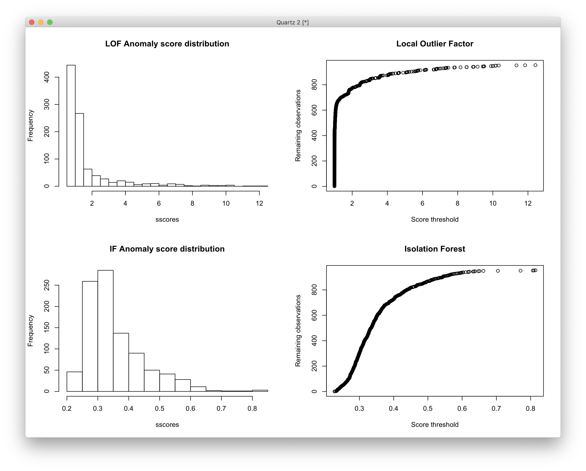
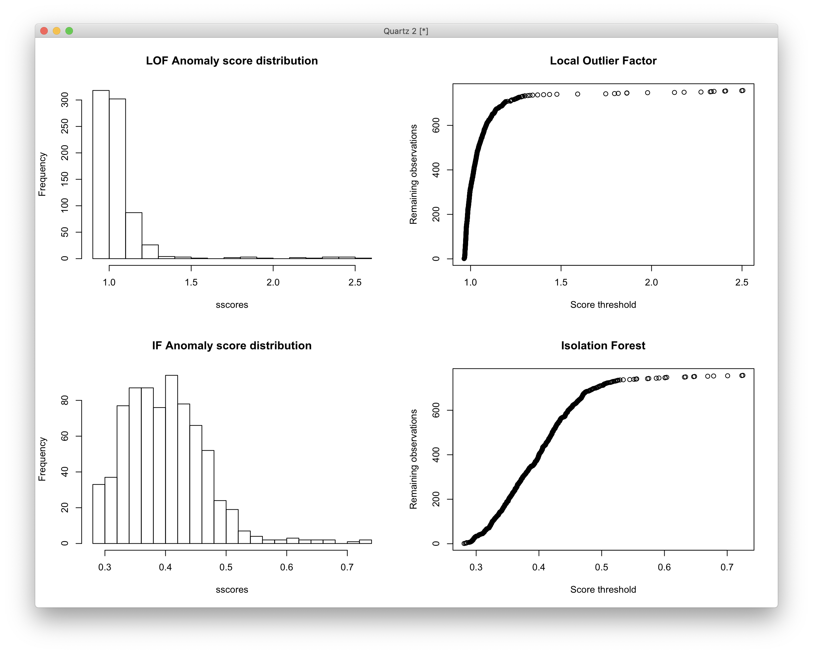
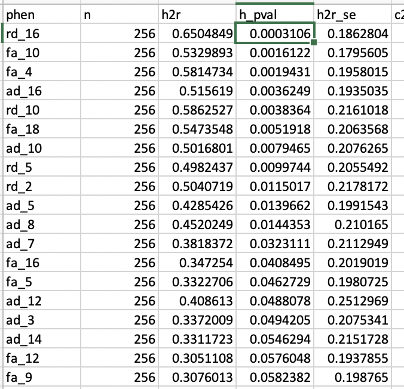
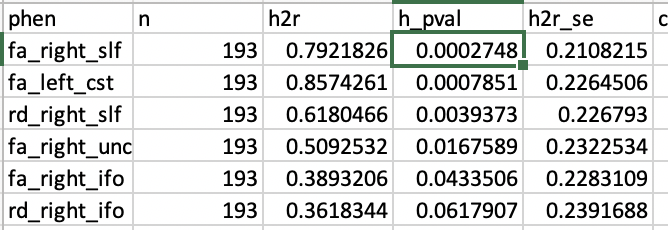
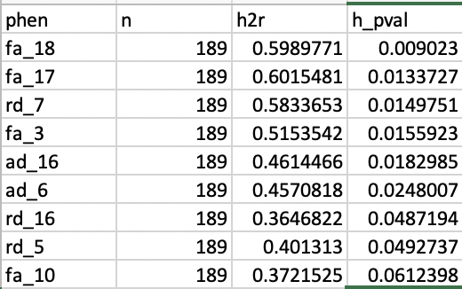
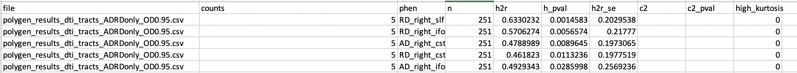
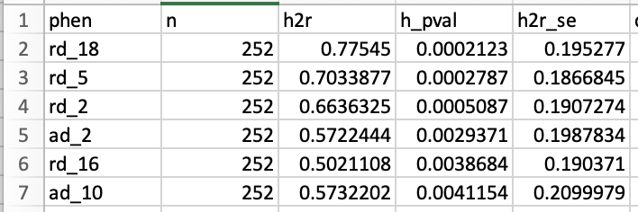
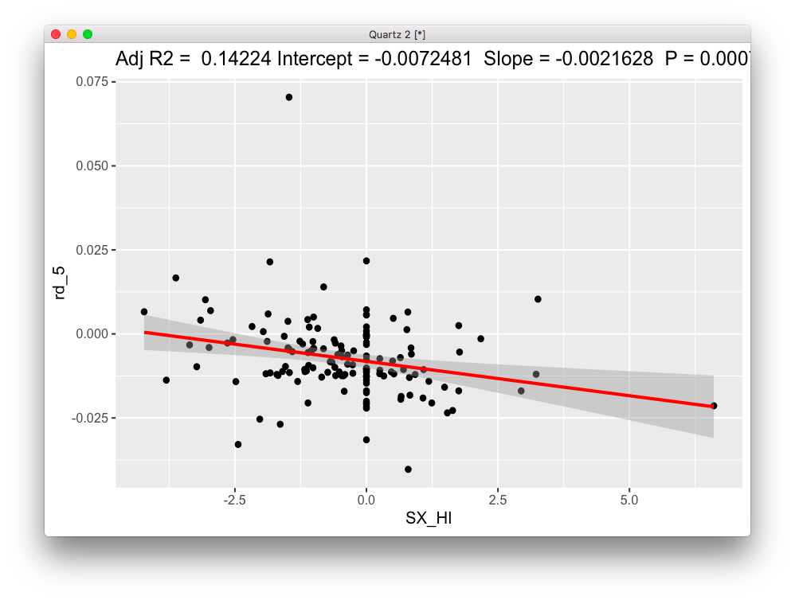
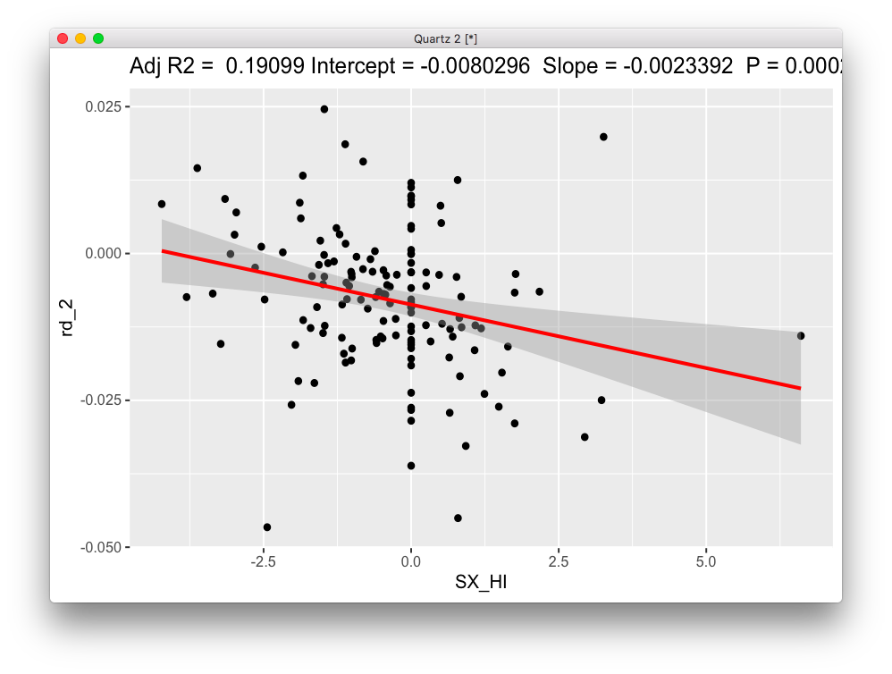
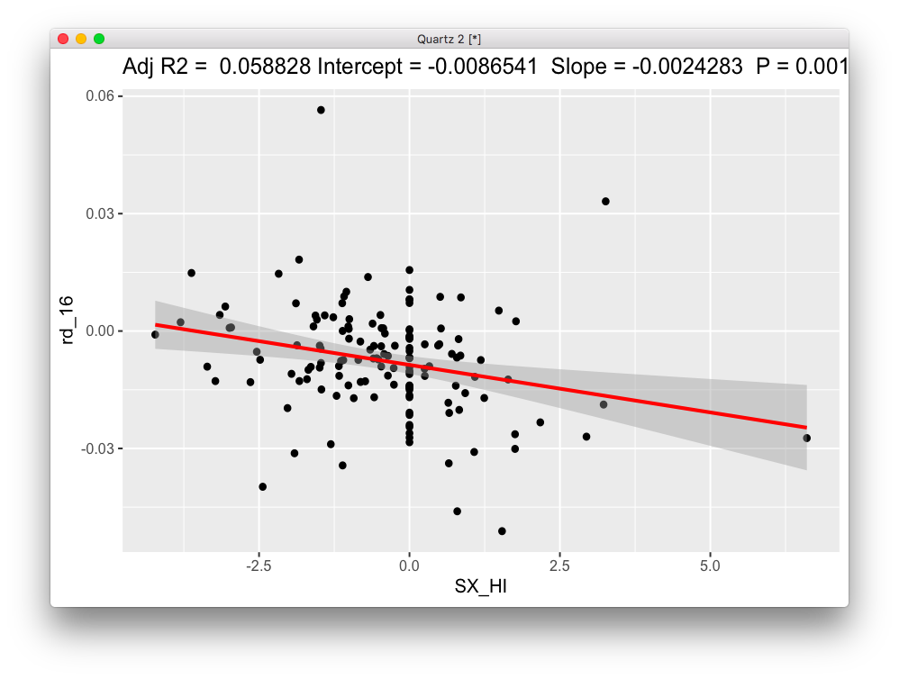

# 2019-09-17 11:01:42

Following the work from note 040, let's create a Fam dataset to see if it makes
a difference, and then also explore the tracts as defined in the FSL atlas.
Potentially, we could look at voxelwise as well.

We start with the thresholds we established in note 040, and then the other
thresholds will depend on the phenotype we're using:

```r
b = read.csv('/Volumes/Shaw/MasterQC/master_qc_20190314.csv')
a = read.csv('~/data/heritability_change/ready_1020.csv')
m = merge(a, b, by.y='Mask.ID', by.x='Mask.ID...Scan', all.x=F)

# restrict based on QC
m$pct = m$missingVolumes / m$numVolumes

qc_vars = c("meanX.trans", "meanY.trans", "meanZ.trans",
            "meanX.rot", "meanY.rot", "meanZ.rot",
            "goodVolumes", "pct")

m = m[m$"age_at_scan...Scan...Subjects" < 18, ]

library(solitude)
iso <- isolationForest$new()
iso$fit(m[, qc_vars])
scores_if = as.matrix(iso$scores)[,3]
library(dbscan)
# here I set the number of neighbors to a percentage of the total data
scores_lof = lof(m[, qc_vars], k = round(.5 * nrow(m)))
idx = scores_lof < 2.5 & scores_if < .45

tracts = read.csv('~/data/heritability_change/dti_mean_phenotype_1020.csv')
# somehow I have two entries for 1418?
x = duplicated(tracts$file)
data = merge(m[idx, ], tracts[!x, ], by.x='Mask.ID...Scan', by.y='file')
tract_names = colnames(tracts)[2:ncol(tracts)]

iso <- isolationForest$new()
iso$fit(data[, tract_names])
scores_if = as.matrix(iso$scores)[,3]
scores_lof = lof(data[, tract_names], k = round(.5 * nrow(data)))
idx = scores_lof < 1.2 & scores_if < .525

num_scans = 2  # number of scans to select
data$scores = scores_lof
a = data[idx, ]
# removing people with less than num_scans scans
idx = which(table(a$Medical.Record...MRN)>=num_scans)
long_subjs = names(table(a$Medical.Record...MRN))[idx]
keep_me = c()
for (m in 1:nrow(a)) {
    if (a[m, ]$Medical.Record...MRN %in% long_subjs) {
        keep_me = c(keep_me, m)
    }
}
a = a[keep_me,]
cat(sprintf('Down to %d to keep only subjects with more than %d scans\n',
            nrow(a), num_scans))
keep_me = c()
for (s in unique(a$Medical.Record...MRN)) {
    found = F
    subj_idx = which(a$Medical.Record...MRN==s)
    subj_scans = a[subj_idx, ]
    dates = as.Date(as.character(subj_scans$"record.date.collected...Scan"),
                                    format="%m/%d/%Y")
    best_scans = sort(subj_scans$scores, index.return=T)
    # make sure they are at least 6 months apart. This is the idea:
    # grab the best X scans. Check the time difference between them.
    # Any time the time difference is not enough, remove the worse
    # scan and replace by the next in line. Keep doing this until
    # the time difference is enough between all scans, or we run out
    # of scans
    cur_scan = 1
    last_scan = num_scans
    cur_choice = best_scans$ix[cur_scan:last_scan]
    while (!found && last_scan <= nrow(subj_scans)) {
        time_diffs = abs(diff(dates[cur_choice]))
        if (all(time_diffs > 180)) {
            found = TRUE
        } else {
            # figure out which scan to remove. If there is more than one
            # to be removed, it will be taken care in the next iteration
            bad_diff = which.min(time_diffs)
            if (subj_scans$scores[cur_choice[bad_diff]] >
                subj_scans$scores[cur_choice[bad_diff + 1]]) {
                rm_scan = cur_choice[bad_diff]
            } else {
                rm_scan = cur_choice[bad_diff + 1]
            }
            last_scan = last_scan + 1
            if (last_scan <= nrow(subj_scans)) {
                cur_choice[cur_choice == rm_scan] = best_scans$ix[last_scan]
            }
        }
    }
    if (found) {
        keep_me = c(keep_me, subj_idx[cur_choice])
    }
}
filtered_data = a[keep_me, ]
```

I just repeated the code to make sure we still had 456 scans in the end. Let's
compute the slopes and keep only the family ones for this test. But note that
relpairs (SOLAR 8.3.1) only shows 1 unrelated sample... maybe we just remove
that one?

```r
res = read.csv('~/data/heritability_change/dti_tracts_OD.csv')
res2 = res[res$ID != 7221745, ]
write.csv(res2, file='~/data/heritability_change/dti_tracts_OD_Fam.csv',
          row.names=F, na='', quote=F)
```

That seems to have worked...

```
solar> relpairs
                                                                        
    NPairs  Relationship
  ========  ===========================================
       227  Self
        64  Siblings
        12  1st cousins

Mean f is 2.105

This table also written to dti_tracts_OD_Fam/rd_cc/relatives.out
```

So, let's re-run our heritability estimates:

```bash
# interactive
cd ~/data/heritability_change
for m in fa ad rd; do
    for t in left_cst left_ifo left_ilf left_slf left_unc right_cst right_ifo \
        right_ilf right_slf right_unc cc; do
        solar run_phen_var_OD_tracts dti_tracts_OD_Fam ${m}_${t};
    done;
done;
mv dti_tracts_OD_Fam ~/data/tmp/
cd ~/data/tmp/dti_tracts_OD_Fam/
for p in `/bin/ls`; do cp $p/polygenic.out ${p}_polygenic.out; done
python ~/research_code/compile_solar_multivar_results.py dti_tracts_OD_Fam
```


Not much change. It survives Bonferroni if we do FA only, and there might be
even more if we do Meff.

How about relationship to ADHD?

```r
library(nlme)
data = read.csv('~/data/heritability_change/dti_tracts_OD_Fam.csv')
# to get famID
tmp = read.csv('~/data/heritability_change/ready_1020.csv')
tmp$famID = sapply(1:nrow(tmp), function(x)
                                if (is.na(tmp$Extended.ID...FamilyIDs[x])) {
                                    tmp$Nuclear.ID...FamilyIDs[x]
                                }
                                else {
                                    tmp$Extended.ID...FamilyIDs[x]
                                }
                    )
tmp2 = tmp[, c('Medical.Record...MRN...Subjects', 'famID')]
tmp3 = tmp2[!duplicated(tmp2[, 'Medical.Record...MRN...Subjects']), ]
data = merge(data, tmp3, by.x='ID', by.y='Medical.Record...MRN...Subjects', all.x=T, all.y=F)

tract_names = colnames(data)[3:35]

# let's run just the residuals after stepwise regression
mres = data
library(MASS)
for (t in tract_names) {
    print(t)
    fm_str = sprintf('%s ~', t)
    fm_str = paste(fm_str, 'sex + meanX.trans + meanY.trans + meanZ.trans + meanX.rot + meanY.rot + meanZ.rot + goodVolumes + pct')
    res.lm <- lm(as.formula(fm_str), data = data)
    step <- stepAIC(res.lm, direction = "both", trace = F)
    mres[, t] = residuals(step)
}

out_fname = '~/data/heritability_change/assoc_LME_tracts_OD_Fam.csv'
predictors = c('SX_inatt', 'SX_HI', 'inatt_baseline', 'HI_baseline', 'DX', 'DX2')
targets = tract_names
hold=NULL
for (i in targets) {
    for (j in predictors) {
        fm_str = sprintf('%s ~ %s', i, j)
        model1<-try(lme(as.formula(fm_str), mres, ~1|famID, na.action=na.omit))
        if (length(model1) > 1) {
            temp<-summary(model1)$tTable
            a<-as.data.frame(temp)
            a$formula<-fm_str
            a$target = i
            a$predictor = j
            a$term = rownames(temp)
            hold=rbind(hold,a)
        } else {
            hold=rbind(hold, NA)
        }
    }
}
write.csv(hold, out_fname, row.names=F)

data2 = mres[mres$DX=='ADHD', ]
out_fname = gsub(x=out_fname, pattern='.csv', '_dx1.csv')
predictors = c('SX_inatt', 'SX_HI', 'inatt_baseline', 'HI_baseline')
targets = tract_names
hold=NULL
for (i in targets) {
    for (j in predictors) {
        fm_str = sprintf('%s ~ %s', i, j)
        model1<-try(lme(as.formula(fm_str), data2, ~1|famID, na.action=na.omit))
        if (length(model1) > 1) {
            temp<-summary(model1)$tTable
            a<-as.data.frame(temp)
            a$formula<-fm_str
            a$target = i
            a$predictor = j
            a$term = rownames(temp)
            hold=rbind(hold,a)
        } else {
            hold=rbind(hold, NA)
        }
    }
}
write.csv(hold, out_fname, row.names=F)

data2 = mres[mres$DX2=='ADHD', ]
out_fname = gsub(x=out_fname, pattern='dx1', 'dx2')
predictors = c('SX_inatt', 'SX_HI', 'inatt_baseline', 'HI_baseline')
targets = tract_names
hold=NULL
for (i in targets) {
    for (j in predictors) {
        fm_str = sprintf('%s ~ %s', i, j)
        model1<-try(lme(as.formula(fm_str), data2, ~1|famID, na.action=na.omit))
        if (length(model1) > 1) {
            temp<-summary(model1)$tTable
            a<-as.data.frame(temp)
            a$formula<-fm_str
            a$target = i
            a$predictor = j
            a$term = rownames(temp)
            hold=rbind(hold,a)
        } else {
            hold=rbind(hold, NA)
        }
    }
}
write.csv(hold, out_fname, row.names=F)
```

There seems to be interesting stuff here... I don't even think I need to go into
the JHU tracts. At least not for now. Let's spend some time in an analogous fMRI
analysis.

# 2019-09-18 13:44:04

Philip suggested we should remove scans that have 80 directions, and any
correlated metrics. That makes sense. In fact, why don't we do a PCA and remove
the PCs instead? Let's see how it looks.

```r
b = read.csv('/Volumes/Shaw/MasterQC/master_qc_20190314.csv')
a = read.csv('~/data/heritability_change/ready_1020.csv')
m = merge(a, b, by.y='Mask.ID', by.x='Mask.ID...Scan', all.x=F)

# restrict based on QC
qc_vars = c("meanX.trans", "meanY.trans", "meanZ.trans",
            "meanX.rot", "meanY.rot", "meanZ.rot",
            "goodVolumes")
m = m[m$"age_at_scan...Scan...Subjects" < 18, ]
m = m[m$"goodVolumes" <= 61, ]
m = m[m$"numVolumes" < 80, ]

# let's see if we need to worry about hyper-correlated variables:
cor(m[, qc_vars])
```
```
            meanX.trans meanY.trans meanZ.trans  meanX.rot  meanY.rot
meanX.trans   1.0000000   0.4576888   0.5154652  0.4129908  0.5008800
meanY.trans   0.4576888   1.0000000   0.4739654  0.4559549  0.3069900
meanZ.trans   0.5154652   0.4739654   1.0000000  0.4693148  0.4118194
meanX.rot     0.4129908   0.4559549   0.4693148  1.0000000  0.6218197
meanY.rot     0.5008800   0.3069900   0.4118194  0.6218197  1.0000000
meanZ.rot     0.5464797   0.3520729   0.4811988  0.5412620  0.5724864
goodVolumes  -0.3529125  -0.2437465  -0.4082551 -0.4805990 -0.4157516
             meanZ.rot goodVolumes
meanX.trans  0.5464797  -0.3529125
meanY.trans  0.3520729  -0.2437465
meanZ.trans  0.4811988  -0.4082551
meanX.rot    0.5412620  -0.4805990
meanY.rot    0.5724864  -0.4157516
meanZ.rot    1.0000000  -0.3902444
goodVolumes -0.3902444   1.0000000
```

Doesn't look like it, at least not for DTI.

```r
> summary(cor(m[, qc_vars])[upper.tri(cor(m[, qc_vars]))])
   Min. 1st Qu.  Median    Mean 3rd Qu.    Max. 
-0.4806 -0.2437  0.4560  0.2299  0.5009  0.6218 
```

But I think I did remove a few scans, didn't I? Let's double check. If anything,
I have one less variable to correlate out. Why don't we go ahead with the PC
idea? At least this way we won't have to worry about correlated covariates in the stepwise
regression part. How many to use for outliers can be as simple as min(qc_vars,
nrow).

```r
# quick hack to use na.action on prcomp
fm_str = sprintf('~ %s', paste0(qc_vars, collapse='+ ', sep=' '))
sdata = as.data.frame(scale(m[, qc_vars]))
pca = prcomp(as.formula(fm_str), sdata, scale=T, na.action=na.exclude)
df_pca = data.frame(pca$x)
colnames(df_pca) = sapply(1:ncol(df_pca), function(x) { sprintf('qcPC%d', x)})

library(solitude)
iso <- isolationForest$new()
iso$fit(df_pca)
scores_if = as.matrix(iso$scores)[,3]
library(dbscan)
# here I set the number of neighbors to a percentage of the total data
scores_lof = lof(df_pca, k = round(.5 * nrow(df_pca)))

par(mfrow=c(2,2))
sscores = sort(scores_lof)
hist(sscores, breaks=20, main='LOF Anomaly score distribution')
plot(sscores, 1:length(sscores), ylab='Remaining observations',
     xlab='Score threshold', main='Local Outlier Factor')
sscores = sort(scores_if)
hist(sscores, breaks=20, main='IF Anomaly score distribution')
plot(sscores, 1:length(sscores), ylab='Remaining observations',
     xlab='Score threshold', main='Isolation Forest')
```


My thresholds before were scores_lof < 2.5 & scores_if < .45. I think I'll go
even stricter now, and try LOF < 1.5 and IF < .35. Let's see what happens:

```r
idx = scores_lof < 1.5 & scores_if < .35
tracts = read.csv('~/data/heritability_change/dti_mean_phenotype_1020.csv')
# somehow I have two entries for 1418?
x = duplicated(tracts$file)
m = cbind(m, df_pca)
data = merge(m[idx, ], tracts[!x, ], by.x='Mask.ID...Scan', by.y='file')
tract_names = colnames(tracts)[2:ncol(tracts)]

fm_str = sprintf('~ %s', paste0(tract_names, collapse='+ ', sep=' '))
sdata = as.data.frame(scale(data[, tract_names]))
pca = prcomp(as.formula(fm_str), sdata, scale=T, na.action=na.exclude)
df_pca = data.frame(pca$x)

iso <- isolationForest$new()
iso$fit(df_pca)
scores_if = as.matrix(iso$scores)[,3]
scores_lof = lof(df_pca, k = round(.5 * nrow(data)))

par(mfrow=c(2,2))
sscores = sort(scores_lof)
hist(sscores, breaks=20, main='LOF Anomaly score distribution')
plot(sscores, 1:length(sscores), ylab='Remaining observations',
     xlab='Score threshold', main='Local Outlier Factor')
sscores = sort(scores_if)
hist(sscores, breaks=20, main='IF Anomaly score distribution')
plot(sscores, 1:length(sscores), ylab='Remaining observations',
     xlab='Score threshold', main='Isolation Forest')
```


For the data, I'll go with scores_lof < 1.25 & scores_if < .5. Now, let's see
how much data is left:

```r
idx = scores_lof < 1.25 & scores_if < .5
```

We are still at 602 scans, coming from initial 971 kiddie scans. So, a 39%
reduction. What happens when we keep the best two scans of each kid that has 2
or more scans? And here we'll define as "best" as just the LOF score, which is a
bit easier to interpret and it doesn't look like a normal distribution.

```r
num_scans = 2  # number of scans to select
data$scores = scores_lof
a = data[idx, ]
# removing people with less than num_scans scans
idx = which(table(a$Medical.Record...MRN)>=num_scans)
long_subjs = names(table(a$Medical.Record...MRN))[idx]
keep_me = c()
for (m in 1:nrow(a)) {
    if (a[m, ]$Medical.Record...MRN %in% long_subjs) {
        keep_me = c(keep_me, m)
    }
}
a = a[keep_me,]
cat(sprintf('Down to %d to keep only subjects with more than %d scans\n',
            nrow(a), num_scans))
keep_me = c()
for (s in unique(a$Medical.Record...MRN)) {
    found = F
    subj_idx = which(a$Medical.Record...MRN==s)
    subj_scans = a[subj_idx, ]
    dates = as.Date(as.character(subj_scans$"record.date.collected...Scan"),
                                    format="%m/%d/%Y")
    best_scans = sort(subj_scans$scores, index.return=T)
    # make sure they are at least 6 months apart. This is the idea:
    # grab the best X scans. Check the time difference between them.
    # Any time the time difference is not enough, remove the worse
    # scan and replace by the next in line. Keep doing this until
    # the time difference is enough between all scans, or we run out
    # of scans
    cur_scan = 1
    last_scan = num_scans
    cur_choice = best_scans$ix[cur_scan:last_scan]
    while (!found && last_scan <= nrow(subj_scans)) {
        time_diffs = abs(diff(dates[cur_choice]))
        if (all(time_diffs > 180)) {
            found = TRUE
        } else {
            # figure out which scan to remove. If there is more than one
            # to be removed, it will be taken care in the next iteration
            bad_diff = which.min(time_diffs)
            if (subj_scans$scores[cur_choice[bad_diff]] >
                subj_scans$scores[cur_choice[bad_diff + 1]]) {
                rm_scan = cur_choice[bad_diff]
            } else {
                rm_scan = cur_choice[bad_diff + 1]
            }
            last_scan = last_scan + 1
            if (last_scan <= nrow(subj_scans)) {
                cur_choice[cur_choice == rm_scan] = best_scans$ix[last_scan]
            }
        }
    }
    if (found) {
        keep_me = c(keep_me, subj_idx[cur_choice])
    }
}
filtered_data = a[keep_me, ]
```

So, in the end we still have 366 (183 people) scans, which is still more than what we had
before. Let's try using that for heritability and also for association (just to
simplify the analysis), and let's see what we get.

Time to compute slopes. Let's re-use the code and keep some baseline metrics in
there as well:

```r
source('~/research_code/lab_mgmt/merge_on_closest_date.R')

clin = read.csv('~/data/heritability_change/clinical_09182019.csv')
df = mergeOnClosestDate(filtered_data, clin,
                        unique(filtered_data$Medical.Record...MRN...Subjects),
                         x.date='record.date.collected...Scan',
                         x.id='Medical.Record...MRN...Subjects')
mres = df
mres$SX_HI = as.numeric(as.character(mres$SX_hi))
mres$SX_inatt = as.numeric(as.character(mres$SX_inatt))

qc_vars = colnames(df)[grepl(colnames(df), pattern='^qcPC')]
res = c()
for (s in unique(mres$Medical.Record...MRN...Subjects)) {
    idx = which(mres$Medical.Record...MRN...Subjects == s)
    row = c(s, unique(mres[idx, 'Sex...Subjects']))
    y = mres[idx[2], c(tract_names, qc_vars)] - mres[idx[1], c(tract_names, qc_vars)]
    x = mres[idx[2], 'age_at_scan...Scan...Subjects'] - mres[idx[1], 'age_at_scan...Scan...Subjects']
    slopes = y / x
    row = c(row, slopes)
    for (t in c('SX_inatt', 'SX_HI')) {
        fm_str = sprintf('%s ~ age_at_scan...Scan...Subjects', t)
        fit = lm(as.formula(fm_str), data=mres[idx, ], na.action=na.exclude)
        row = c(row, coefficients(fit)[2])
    }
    # grabbing inatt and HI at baseline
    base_DOA = which.min(mres[idx, 'age_at_scan...Scan...Subjects'])
    row = c(row, mres[idx[base_DOA], tract_names])
    row = c(row, mres[idx[base_DOA], 'SX_inatt'])
    row = c(row, mres[idx[base_DOA], 'SX_HI'])
    # DX1 is DSMV definition, DX2 will make SX >=4 as ADHD
    if (mres[idx[base_DOA], 'age_at_scan...Scan...Subjects'] < 16) {
        if ((row[length(row)] >= 6) || (row[length(row)-1] >= 6)) {
            DX = 'ADHD'
        } else {
            DX = 'NV'
        }
    } else {
        if ((row[length(row)] >= 5) || (row[length(row)-1] >= 5)) {
            DX = 'ADHD'
        } else {
            DX = 'NV'
        }
    }
    if ((row[length(row)] >= 4) || (row[length(row)-1] >= 4)) {
        DX2 = 'ADHD'
    } else {
        DX2 = 'NV'
    }
    row = c(row, DX)
    row = c(row, DX2)
    res = rbind(res, row)
    print(nrow(res))
}
tract_base = sapply(tract_names, function(x) sprintf('%s_baseline', x))
colnames(res) = c('ID', 'sex', tract_names, qc_vars, c('SX_inatt', 'SX_HI',
                                              tract_base,
                                              'inatt_baseline',
                                              'HI_baseline',
                                              'DX', 'DX2'))
write.csv(res, file='~/data/heritability_change/dti_tracts_OD_qcPC.csv',
          row.names=F, na='', quote=F)
```

And SOLAR seems to have found unrelated people. Let's clean them up:

```r
res = read.csv('~/data/heritability_change/dti_tracts_OD_qcPC.csv')
res2 = res[res$ID != 7221745, ]
write.csv(res2, file='~/data/heritability_change/dti_tracts_OD_qcPC_Fam.csv',
          row.names=F, na='', quote=F)
```

OK, let's re-run heritability then:

```bash
# interactive
cd ~/data/heritability_change
for m in fa ad rd; do
    for t in left_cst left_ifo left_ilf left_slf left_unc right_cst right_ifo \
        right_ilf right_slf right_unc cc; do
        solar run_phen_var_OD_tracts_qcPC dti_tracts_OD_qcPC_Fam ${m}_${t};
    done;
done;
mv dti_tracts_OD_qcPC_Fam ~/data/tmp/
cd ~/data/tmp/dti_tracts_OD_qcPC_Fam/
for p in `/bin/ls`; do cp $p/polygenic.out ${p}_polygenic.out; done
python ~/research_code/compile_solar_multivar_results.py dti_tracts_OD_qcPC_Fam
```

So, fa_right_slf is still significant at:

fa_right_slf,182,0.4292612,0.0185944,0.2129009,,,0

But that's the only thing. Good to know the main result is significant under
more stringent thresholds. But I'll likely need to use more people to get a
stronger result. Let's revise our thresholds then.

# 2019-09-19 09:06:39

Since the correlation between variables is not that high, let's go ahead and
redo the whole analysis, but this time removing the extra scans and pct.

```r
b = read.csv('/Volumes/Shaw/MasterQC/master_qc_20190314.csv')
a = read.csv('~/data/heritability_change/ready_1020.csv')
m = merge(a, b, by.y='Mask.ID', by.x='Mask.ID...Scan', all.x=F)

# restrict based on QC
qc_vars = c("meanX.trans", "meanY.trans", "meanZ.trans",
            "meanX.rot", "meanY.rot", "meanZ.rot",
            "goodVolumes")
m = m[m$"age_at_scan...Scan...Subjects" < 18, ]
m = m[m$"goodVolumes" <= 61, ]
m = m[m$"numVolumes" < 80, ]

library(solitude)
iso <- isolationForest$new()
iso$fit(m[, qc_vars])
scores_if = as.matrix(iso$scores)[,3]
library(dbscan)
# here I set the number of neighbors to a percentage of the total data
scores_lof = lof(m[, qc_vars], k = round(.5 * nrow(m)))

par(mfrow=c(2,2))
sscores = sort(scores_lof)
hist(sscores, breaks=20, main='LOF Anomaly score distribution')
plot(sscores, 1:length(sscores), ylab='Remaining observations',
     xlab='Score threshold', main='Local Outlier Factor')
sscores = sort(scores_if)
hist(sscores, breaks=20, main='IF Anomaly score distribution')
plot(sscores, 1:length(sscores), ylab='Remaining observations',
     xlab='Score threshold', main='Isolation Forest')
```



I'll go with 2 for LOF and .5 for IF:

```r
idx = scores_lof < 2 & scores_if < .5
tracts = read.csv('~/data/heritability_change/dti_mean_phenotype_1020.csv')
# somehow I have two entries for 1418?
x = duplicated(tracts$file)
data = merge(m[idx, ], tracts[!x, ], by.x='Mask.ID...Scan', by.y='file')
tract_names = colnames(tracts)[2:ncol(tracts)]

iso <- isolationForest$new()
iso$fit(data[, tract_names])
scores_if = as.matrix(iso$scores)[,3]
scores_lof = lof(data[, tract_names], k = round(.5 * nrow(data)))

par(mfrow=c(2,2))
sscores = sort(scores_lof)
hist(sscores, breaks=20, main='LOF Anomaly score distribution')
plot(sscores, 1:length(sscores), ylab='Remaining observations',
     xlab='Score threshold', main='Local Outlier Factor')
sscores = sort(scores_if)
hist(sscores, breaks=20, main='IF Anomaly score distribution')
plot(sscores, 1:length(sscores), ylab='Remaining observations',
     xlab='Score threshold', main='Isolation Forest')
```


I think 1.25 and .5 are again good thresholds. That gives us 700 out of the
initial 971 kids, so a 28% reduction. Now, let's grab the best two scans for
each person:

```r
idx = scores_lof < 1.25 & scores_if < .5
num_scans = 2  # number of scans to select
data$scores = scores_lof
a = data[idx, ]
# removing people with less than num_scans scans
idx = which(table(a$Medical.Record...MRN)>=num_scans)
long_subjs = names(table(a$Medical.Record...MRN))[idx]
keep_me = c()
for (m in 1:nrow(a)) {
    if (a[m, ]$Medical.Record...MRN %in% long_subjs) {
        keep_me = c(keep_me, m)
    }
}
a = a[keep_me,]
cat(sprintf('Down to %d to keep only subjects with more than %d scans\n',
            nrow(a), num_scans))
keep_me = c()
for (s in unique(a$Medical.Record...MRN)) {
    found = F
    subj_idx = which(a$Medical.Record...MRN==s)
    subj_scans = a[subj_idx, ]
    dates = as.Date(as.character(subj_scans$"record.date.collected...Scan"),
                                    format="%m/%d/%Y")
    best_scans = sort(subj_scans$scores, index.return=T)
    # make sure they are at least 6 months apart. This is the idea:
    # grab the best X scans. Check the time difference between them.
    # Any time the time difference is not enough, remove the worse
    # scan and replace by the next in line. Keep doing this until
    # the time difference is enough between all scans, or we run out
    # of scans
    cur_scan = 1
    last_scan = num_scans
    cur_choice = best_scans$ix[cur_scan:last_scan]
    while (!found && last_scan <= nrow(subj_scans)) {
        time_diffs = abs(diff(dates[cur_choice]))
        if (all(time_diffs > 180)) {
            found = TRUE
        } else {
            # figure out which scan to remove. If there is more than one
            # to be removed, it will be taken care in the next iteration
            bad_diff = which.min(time_diffs)
            if (subj_scans$scores[cur_choice[bad_diff]] >
                subj_scans$scores[cur_choice[bad_diff + 1]]) {
                rm_scan = cur_choice[bad_diff]
            } else {
                rm_scan = cur_choice[bad_diff + 1]
            }
            last_scan = last_scan + 1
            if (last_scan <= nrow(subj_scans)) {
                cur_choice[cur_choice == rm_scan] = best_scans$ix[last_scan]
            }
        }
    }
    if (found) {
        keep_me = c(keep_me, subj_idx[cur_choice])
    }
}
filtered_data = a[keep_me, ]
```

I now have 226 people, which is quite similar to the dataset I had my initial
results (227). Don't expect many surprises here.

```r
source('~/research_code/lab_mgmt/merge_on_closest_date.R')

clin = read.csv('~/data/heritability_change/clinical_09182019.csv')
df = mergeOnClosestDate(filtered_data, clin,
                        unique(filtered_data$Medical.Record...MRN...Subjects),
                         x.date='record.date.collected...Scan',
                         x.id='Medical.Record...MRN...Subjects')
mres = df
mres$SX_HI = as.numeric(as.character(mres$SX_hi))
mres$SX_inatt = as.numeric(as.character(mres$SX_inatt))

res = c()
for (s in unique(mres$Medical.Record...MRN...Subjects)) {
    idx = which(mres$Medical.Record...MRN...Subjects == s)
    row = c(s, unique(mres[idx, 'Sex...Subjects']))
    y = mres[idx[2], c(tract_names, qc_vars)] - mres[idx[1], c(tract_names, qc_vars)]
    x = mres[idx[2], 'age_at_scan...Scan...Subjects'] - mres[idx[1], 'age_at_scan...Scan...Subjects']
    slopes = y / x
    row = c(row, slopes)
    for (t in c('SX_inatt', 'SX_HI')) {
        fm_str = sprintf('%s ~ age_at_scan...Scan...Subjects', t)
        fit = lm(as.formula(fm_str), data=mres[idx, ], na.action=na.exclude)
        row = c(row, coefficients(fit)[2])
    }
    # grabbing inatt and HI at baseline
    base_DOA = which.min(mres[idx, 'age_at_scan...Scan...Subjects'])
    row = c(row, mres[idx[base_DOA], tract_names])
    row = c(row, mres[idx[base_DOA], 'SX_inatt'])
    row = c(row, mres[idx[base_DOA], 'SX_HI'])
    # DX1 is DSMV definition, DX2 will make SX >=4 as ADHD
    if (mres[idx[base_DOA], 'age_at_scan...Scan...Subjects'] < 16) {
        if ((row[length(row)] >= 6) || (row[length(row)-1] >= 6)) {
            DX = 'ADHD'
        } else {
            DX = 'NV'
        }
    } else {
        if ((row[length(row)] >= 5) || (row[length(row)-1] >= 5)) {
            DX = 'ADHD'
        } else {
            DX = 'NV'
        }
    }
    if ((row[length(row)] >= 4) || (row[length(row)-1] >= 4)) {
        DX2 = 'ADHD'
    } else {
        DX2 = 'NV'
    }
    row = c(row, DX)
    row = c(row, DX2)
    res = rbind(res, row)
    print(nrow(res))
}
tract_base = sapply(tract_names, function(x) sprintf('%s_baseline', x))
colnames(res) = c('ID', 'sex', tract_names, qc_vars, c('SX_inatt', 'SX_HI',
                                              tract_base,
                                              'inatt_baseline',
                                              'HI_baseline',
                                              'DX', 'DX2'))
write.csv(res, file='~/data/heritability_change/dti_tracts_OD_n226.csv',
          row.names=F, na='', quote=F)
```

SOLAR found one unrelated cae, so let's remove our usual suspect:

```r
res = read.csv('~/data/heritability_change/dti_tracts_OD_n226.csv')
res2 = res[res$ID != 7221745, ]
write.csv(res2, file='~/data/heritability_change/dti_tracts_OD_n226_Fam.csv',
          row.names=F, na='', quote=F)
```

And run for everyone:

```bash
# interactive
cd ~/data/heritability_change
for m in fa ad rd; do
    for t in left_cst left_ifo left_ilf left_slf left_unc right_cst right_ifo \
        right_ilf right_slf right_unc cc; do
        solar run_phen_var_OD_tracts dti_tracts_OD_n226_Fam ${m}_${t};
    done;
done;
mv dti_tracts_OD_n226_Fam ~/data/tmp/
cd ~/data/tmp/dti_tracts_OD_n226_Fam/
for p in `/bin/ls`; do cp $p/polygenic.out ${p}_polygenic.out; done
python ~/research_code/compile_solar_multivar_results.py dti_tracts_OD_n226_Fam
```

We might need to run Meff to make it survive. But what about the JHU tracts?
Would it looks better there?

```r
b = read.csv('/Volumes/Shaw/MasterQC/master_qc_20190314.csv')
a = read.csv('~/data/heritability_change/ready_1020.csv')
m = merge(a, b, by.y='Mask.ID', by.x='Mask.ID...Scan', all.x=F)

# restrict based on QC
qc_vars = c("meanX.trans", "meanY.trans", "meanZ.trans",
            "meanX.rot", "meanY.rot", "meanZ.rot",
            "goodVolumes")
m = m[m$"age_at_scan...Scan...Subjects" < 18, ]
m = m[m$"goodVolumes" <= 61, ]
m = m[m$"numVolumes" < 80, ]
idx = scores_lof < 2 & scores_if < .5
m = m[idx, ]

tracts = read.csv('~/data/heritability_change/jhu_tracts_1020.csv')
# somehow I have two entries for 1418?
x = duplicated(tracts$id)
data = merge(m, tracts[!x, ], by.x='Mask.ID...Scan', by.y='id')
tract_names = colnames(tracts)[2:ncol(tracts)]

iso <- isolationForest$new()
iso$fit(data[, tract_names])
scores_if = as.matrix(iso$scores)[,3]
scores_lof = lof(data[, tract_names], k = round(.5 * nrow(data)))

par(mfrow=c(2,2))
sscores = sort(scores_lof)
hist(sscores, breaks=20, main='LOF Anomaly score distribution')
plot(sscores, 1:length(sscores), ylab='Remaining observations',
     xlab='Score threshold', main='Local Outlier Factor')
sscores = sort(scores_if)
hist(sscores, breaks=20, main='IF Anomaly score distribution')
plot(sscores, 1:length(sscores), ylab='Remaining observations',
     xlab='Score threshold', main='Isolation Forest')
```



I think the previous thresholds should still be safe to use here.

```r
idx = scores_lof < 1.25 & scores_if < .5
num_scans = 2  # number of scans to select
data$scores = scores_lof
a = data[idx, ]
# removing people with less than num_scans scans
idx = which(table(a$Medical.Record...MRN)>=num_scans)
long_subjs = names(table(a$Medical.Record...MRN))[idx]
keep_me = c()
for (m in 1:nrow(a)) {
    if (a[m, ]$Medical.Record...MRN %in% long_subjs) {
        keep_me = c(keep_me, m)
    }
}
a = a[keep_me,]
cat(sprintf('Down to %d to keep only subjects with more than %d scans\n',
            nrow(a), num_scans))
keep_me = c()
for (s in unique(a$Medical.Record...MRN)) {
    found = F
    subj_idx = which(a$Medical.Record...MRN==s)
    subj_scans = a[subj_idx, ]
    dates = as.Date(as.character(subj_scans$"record.date.collected...Scan"),
                                    format="%m/%d/%Y")
    best_scans = sort(subj_scans$scores, index.return=T)
    # make sure they are at least 6 months apart. This is the idea:
    # grab the best X scans. Check the time difference between them.
    # Any time the time difference is not enough, remove the worse
    # scan and replace by the next in line. Keep doing this until
    # the time difference is enough between all scans, or we run out
    # of scans
    cur_scan = 1
    last_scan = num_scans
    cur_choice = best_scans$ix[cur_scan:last_scan]
    while (!found && last_scan <= nrow(subj_scans)) {
        time_diffs = abs(diff(dates[cur_choice]))
        if (all(time_diffs > 180)) {
            found = TRUE
        } else {
            # figure out which scan to remove. If there is more than one
            # to be removed, it will be taken care in the next iteration
            bad_diff = which.min(time_diffs)
            if (subj_scans$scores[cur_choice[bad_diff]] >
                subj_scans$scores[cur_choice[bad_diff + 1]]) {
                rm_scan = cur_choice[bad_diff]
            } else {
                rm_scan = cur_choice[bad_diff + 1]
            }
            last_scan = last_scan + 1
            if (last_scan <= nrow(subj_scans)) {
                cur_choice[cur_choice == rm_scan] = best_scans$ix[last_scan]
            }
        }
    }
    if (found) {
        keep_me = c(keep_me, subj_idx[cur_choice])
    }
}
filtered_data = a[keep_me, ]

source('~/research_code/lab_mgmt/merge_on_closest_date.R')

clin = read.csv('~/data/heritability_change/clinical_09182019.csv')
df = mergeOnClosestDate(filtered_data, clin,
                        unique(filtered_data$Medical.Record...MRN...Subjects),
                         x.date='record.date.collected...Scan',
                         x.id='Medical.Record...MRN...Subjects')
mres = df
mres$SX_HI = as.numeric(as.character(mres$SX_hi))
mres$SX_inatt = as.numeric(as.character(mres$SX_inatt))

res = c()
for (s in unique(mres$Medical.Record...MRN...Subjects)) {
    idx = which(mres$Medical.Record...MRN...Subjects == s)
    row = c(s, unique(mres[idx, 'Sex...Subjects']))
    y = mres[idx[2], c(tract_names, qc_vars)] - mres[idx[1], c(tract_names, qc_vars)]
    x = mres[idx[2], 'age_at_scan...Scan...Subjects'] - mres[idx[1], 'age_at_scan...Scan...Subjects']
    slopes = y / x
    row = c(row, slopes)
    for (t in c('SX_inatt', 'SX_HI')) {
        fm_str = sprintf('%s ~ age_at_scan...Scan...Subjects', t)
        fit = lm(as.formula(fm_str), data=mres[idx, ], na.action=na.exclude)
        row = c(row, coefficients(fit)[2])
    }
    # grabbing inatt and HI at baseline
    base_DOA = which.min(mres[idx, 'age_at_scan...Scan...Subjects'])
    row = c(row, mres[idx[base_DOA], tract_names])
    row = c(row, mres[idx[base_DOA], 'SX_inatt'])
    row = c(row, mres[idx[base_DOA], 'SX_HI'])
    # DX1 is DSMV definition, DX2 will make SX >=4 as ADHD
    if (mres[idx[base_DOA], 'age_at_scan...Scan...Subjects'] < 16) {
        if ((row[length(row)] >= 6) || (row[length(row)-1] >= 6)) {
            DX = 'ADHD'
        } else {
            DX = 'NV'
        }
    } else {
        if ((row[length(row)] >= 5) || (row[length(row)-1] >= 5)) {
            DX = 'ADHD'
        } else {
            DX = 'NV'
        }
    }
    if ((row[length(row)] >= 4) || (row[length(row)-1] >= 4)) {
        DX2 = 'ADHD'
    } else {
        DX2 = 'NV'
    }
    row = c(row, DX)
    row = c(row, DX2)
    res = rbind(res, row)
    print(nrow(res))
}
tract_base = sapply(tract_names, function(x) sprintf('%s_baseline', x))
colnames(res) = c('ID', 'sex', tract_names, qc_vars, c('SX_inatt', 'SX_HI',
                                              tract_base,
                                              'inatt_baseline',
                                              'HI_baseline',
                                              'DX', 'DX2'))
write.csv(res, file='~/data/heritability_change/dti_JHUtracts_OD_n256.csv',
          row.names=F, na='', quote=F)
```

SOLAR didn't see any unrelated people in these 256, only a pair of second
cousins. Let's keep everyone then.

```bash
# interactive
cd ~/data/heritability_change
for m in fa ad rd; do
    for t in {1..20}; do
        solar run_phen_var_OD_tracts dti_JHUtracts_OD_n256 ${m}_${t};
    done;
done;
mv dti_JHUtracts_OD_n256 ~/data/tmp/
cd ~/data/tmp/dti_JHUtracts_OD_n256/
for p in `/bin/ls`; do cp $p/polygenic.out ${p}_polygenic.out; done
python ~/research_code/compile_solar_multivar_results.py dti_JHUtracts_OD_n256
```



But I just noticed that SOLAR's output of relpairs is not reliably showing
unrelated subjects... let's do it the old way then:

```r
data = read.csv('~/data/heritability_change/dti_JHUtracts_OD_n256.csv')
# to get famID
tmp = read.csv('~/data/heritability_change/pedigree.csv')
data = merge(data, tmp[, c('ID', 'FAMID')], by='ID', all.x=T, all.y=F)

# and make sure every family has at least two people
related = names(table(data$FAMID))[table(data$FAMID) >= 2]
keep_me = data$FAMID %in% related
data2 = data[keep_me, ]
write.csv(data2, file='~/data/heritability_change/dti_JHUtracts_OD_n256_Fam_n122.csv',
          row.names=F, na='', quote=F)
```

Do the results change much?

```bash
# interactive
cd ~/data/heritability_change
for m in fa ad rd; do
    for t in {1..20}; do
        solar run_phen_var_OD_tracts dti_JHUtracts_OD_n256_Fam_n122 ${m}_${t};
    done;
done;
mv dti_JHUtracts_OD_n256_Fam_n122 ~/data/tmp/
cd ~/data/tmp/dti_JHUtracts_OD_n256_Fam_n122/
for p in `/bin/ls`; do cp $p/polygenic.out ${p}_polygenic.out; done
python ~/research_code/compile_solar_multivar_results.py dti_JHUtracts_OD_n256_Fam_n122
```

Somewhat. Everything that was nominally significant in the entire dataset is
still significant in the Fam dataset. But not everything significant in the Fam
dataset is significant in the entire dataset. So, let's see if we get
association to ADHD in the Fam dataset.

Let's calculate the association to ADHD:

```r
library(nlme)
data = read.csv('~/data/heritability_change/dti_JHUtracts_OD_n256_Fam_n122.csv')

tract_names = colnames(data)[3:62]

# let's run just the residuals after stepwise regression
mres = data
library(MASS)
for (t in tract_names) {
    print(t)
    fm_str = sprintf('%s ~', t)
    fm_str = paste(fm_str, 'sex + meanX.trans + meanY.trans + meanZ.trans + meanX.rot + meanY.rot + meanZ.rot + goodVolumes')
    res.lm <- lm(as.formula(fm_str), data = data)
    step <- stepAIC(res.lm, direction = "both", trace = F)
    mres[, t] = residuals(step)
}

out_fname = '~/data/heritability_change/assoc_LME_JHUtracts_OD_n256_Fam_n122.csv'
predictors = c('SX_inatt', 'SX_HI', 'inatt_baseline', 'HI_baseline', 'DX', 'DX2')
targets = tract_names
hold=NULL
for (i in targets) {
    for (j in predictors) {
        fm_str = sprintf('%s ~ %s', i, j)
        model1<-try(lme(as.formula(fm_str), mres, ~1|FAMID, na.action=na.omit))
        if (length(model1) > 1) {
            temp<-summary(model1)$tTable
            a<-as.data.frame(temp)
            a$formula<-fm_str
            a$target = i
            a$predictor = j
            a$term = rownames(temp)
            hold=rbind(hold,a)
        } else {
            hold=rbind(hold, NA)
        }
    }
}
write.csv(hold, out_fname, row.names=F)

data2 = mres[mres$DX=='ADHD', ]
out_fname = gsub(x=out_fname, pattern='.csv', '_dx1.csv')
predictors = c('SX_inatt', 'SX_HI', 'inatt_baseline', 'HI_baseline')
targets = tract_names
hold=NULL
for (i in targets) {
    for (j in predictors) {
        fm_str = sprintf('%s ~ %s', i, j)
        model1<-try(lme(as.formula(fm_str), data2, ~1|FAMID, na.action=na.omit))
        if (length(model1) > 1) {
            temp<-summary(model1)$tTable
            a<-as.data.frame(temp)
            a$formula<-fm_str
            a$target = i
            a$predictor = j
            a$term = rownames(temp)
            hold=rbind(hold,a)
        } else {
            hold=rbind(hold, NA)
        }
    }
}
write.csv(hold, out_fname, row.names=F)

data2 = mres[mres$DX2=='ADHD', ]
out_fname = gsub(x=out_fname, pattern='dx1', 'dx2')
predictors = c('SX_inatt', 'SX_HI', 'inatt_baseline', 'HI_baseline')
targets = tract_names
hold=NULL
for (i in targets) {
    for (j in predictors) {
        fm_str = sprintf('%s ~ %s', i, j)
        model1<-try(lme(as.formula(fm_str), data2, ~1|FAMID, na.action=na.omit))
        if (length(model1) > 1) {
            temp<-summary(model1)$tTable
            a<-as.data.frame(temp)
            a$formula<-fm_str
            a$target = i
            a$predictor = j
            a$term = rownames(temp)
            hold=rbind(hold,a)
        } else {
            hold=rbind(hold, NA)
        }
    }
}
write.csv(hold, out_fname, row.names=F)
```

Yep, we have results there. I'm going to keep on investigating the fMRI side
just o see if anything exciting comes up in that side.

# 2019-09-24 16:05:38

Let's follow the fMRI idea and do the OD thresholding based on pctiles. Does it
wipe out our results? Also, we're using all the data there for heritability, so
let's follow that example here as well.

```r
b = read.csv('/Volumes/Shaw/MasterQC/master_qc_20190314.csv')
a = read.csv('~/data/heritability_change/ready_1020.csv')
m = merge(a, b, by.y='Mask.ID', by.x='Mask.ID...Scan', all.x=F)

# restrict based on QC
qc_vars = c("meanX.trans", "meanY.trans", "meanZ.trans",
            "meanX.rot", "meanY.rot", "meanZ.rot",
            "goodVolumes")
m = m[m$"age_at_scan...Scan...Subjects" < 18, ]
m = m[m$"goodVolumes" <= 61, ]
m = m[m$"numVolumes" < 80, ]

library(solitude)
iso <- isolationForest$new()
iso$fit(m[, qc_vars])
scores_if = as.matrix(iso$scores)[,3]
library(dbscan)
# here I set the number of neighbors to a percentage of the total data
scores_lof = lof(m[, qc_vars], k = round(.5 * nrow(m)))

qtile=.85
thresh_lof = quantile(scores_lof, qtile)
thresh_if = quantile(scores_if, qtile)
idx = scores_lof < thresh_lof & scores_if < thresh_if

tracts = read.csv('~/data/heritability_change/dti_mean_phenotype_1020.csv')
# somehow I have two entries for 1418?
x = duplicated(tracts$file)
data = merge(m[idx, ], tracts[!x, ], by.x='Mask.ID...Scan', by.y='file')
tract_names = colnames(tracts)[2:ncol(tracts)]

iso <- isolationForest$new()
iso$fit(data[, tract_names])
scores_if = as.matrix(iso$scores)[,3]
scores_lof = lof(data[, tract_names], k = round(.5 * nrow(data)))

thresh_lof = quantile(scores_lof, qtile)
thresh_if = quantile(scores_if, qtile)
idx = scores_lof < thresh_lof & scores_if < thresh_if

num_scans = 2  # number of scans to select
data$scores = scores_lof
a = data[idx, ]
# removing people with less than num_scans scans
idx = which(table(a$Medical.Record...MRN)>=num_scans)
long_subjs = names(table(a$Medical.Record...MRN))[idx]
keep_me = c()
for (m in 1:nrow(a)) {
    if (a[m, ]$Medical.Record...MRN %in% long_subjs) {
        keep_me = c(keep_me, m)
    }
}
a = a[keep_me,]
cat(sprintf('Down to %d to keep only subjects with more than %d scans\n',
            nrow(a), num_scans))
keep_me = c()
for (s in unique(a$Medical.Record...MRN)) {
    found = F
    subj_idx = which(a$Medical.Record...MRN==s)
    subj_scans = a[subj_idx, ]
    dates = as.Date(as.character(subj_scans$"record.date.collected...Scan"),
                                    format="%m/%d/%Y")
    best_scans = sort(subj_scans$scores, index.return=T)
    # make sure they are at least 6 months apart. This is the idea:
    # grab the best X scans. Check the time difference between them.
    # Any time the time difference is not enough, remove the worse
    # scan and replace by the next in line. Keep doing this until
    # the time difference is enough between all scans, or we run out
    # of scans
    cur_scan = 1
    last_scan = num_scans
    cur_choice = best_scans$ix[cur_scan:last_scan]
    while (!found && last_scan <= nrow(subj_scans)) {
        time_diffs = abs(diff(dates[cur_choice]))
        if (all(time_diffs > 180)) {
            found = TRUE
        } else {
            # figure out which scan to remove. If there is more than one
            # to be removed, it will be taken care in the next iteration
            bad_diff = which.min(time_diffs)
            if (subj_scans$scores[cur_choice[bad_diff]] >
                subj_scans$scores[cur_choice[bad_diff + 1]]) {
                rm_scan = cur_choice[bad_diff]
            } else {
                rm_scan = cur_choice[bad_diff + 1]
            }
            last_scan = last_scan + 1
            if (last_scan <= nrow(subj_scans)) {
                cur_choice[cur_choice == rm_scan] = best_scans$ix[last_scan]
            }
        }
    }
    if (found) {
        keep_me = c(keep_me, subj_idx[cur_choice])
    }
}
filtered_data = a[keep_me, ]
```

I now have 193 people.

```r
source('~/research_code/lab_mgmt/merge_on_closest_date.R')

clin = read.csv('~/data/heritability_change/clinical_09182019.csv')
df = mergeOnClosestDate(filtered_data, clin,
                        unique(filtered_data$Medical.Record...MRN...Subjects),
                         x.date='record.date.collected...Scan',
                         x.id='Medical.Record...MRN...Subjects')
mres = df
mres$SX_HI = as.numeric(as.character(mres$SX_hi))
mres$SX_inatt = as.numeric(as.character(mres$SX_inatt))

res = c()
for (s in unique(mres$Medical.Record...MRN...Subjects)) {
    idx = which(mres$Medical.Record...MRN...Subjects == s)
    row = c(s, unique(mres[idx, 'Sex...Subjects']))
    y = mres[idx[2], c(tract_names, qc_vars)] - mres[idx[1], c(tract_names, qc_vars)]
    x = mres[idx[2], 'age_at_scan...Scan...Subjects'] - mres[idx[1], 'age_at_scan...Scan...Subjects']
    slopes = y / x
    row = c(row, slopes)
    for (t in c('SX_inatt', 'SX_HI')) {
        fm_str = sprintf('%s ~ age_at_scan...Scan...Subjects', t)
        fit = lm(as.formula(fm_str), data=mres[idx, ], na.action=na.exclude)
        row = c(row, coefficients(fit)[2])
    }
    # grabbing inatt and HI at baseline
    base_DOA = which.min(mres[idx, 'age_at_scan...Scan...Subjects'])
    row = c(row, mres[idx[base_DOA], tract_names])
    row = c(row, mres[idx[base_DOA], 'SX_inatt'])
    row = c(row, mres[idx[base_DOA], 'SX_HI'])
    # DX1 is DSMV definition, DX2 will make SX >=4 as ADHD
    if (mres[idx[base_DOA], 'age_at_scan...Scan...Subjects'] < 16) {
        if ((row[length(row)] >= 6) || (row[length(row)-1] >= 6)) {
            DX = 'ADHD'
        } else {
            DX = 'NV'
        }
    } else {
        if ((row[length(row)] >= 5) || (row[length(row)-1] >= 5)) {
            DX = 'ADHD'
        } else {
            DX = 'NV'
        }
    }
    if ((row[length(row)] >= 4) || (row[length(row)-1] >= 4)) {
        DX2 = 'ADHD'
    } else {
        DX2 = 'NV'
    }
    row = c(row, DX)
    row = c(row, DX2)
    res = rbind(res, row)
    print(nrow(res))
}
tract_base = sapply(tract_names, function(x) sprintf('%s_baseline', x))
colnames(res) = c('ID', 'sex', tract_names, qc_vars, c('SX_inatt', 'SX_HI',
                                              tract_base,
                                              'inatt_baseline',
                                              'HI_baseline',
                                              'DX', 'DX2'))
write.csv(res, file=sprintf('~/data/heritability_change/dti_tracts_OD%.2f.csv', qtile),
          row.names=F, na='', quote=F)
```

And run for everyone:

```bash
# interactive
phen=dti_tracts_OD0.85
cd ~/data/heritability_change
for m in fa ad rd; do
    for t in left_cst left_ifo left_ilf left_slf left_unc right_cst right_ifo \
        right_ilf right_slf right_unc cc; do
        solar run_phen_var_OD_tracts $phen ${m}_${t};
    done;
done;
mv $phen ~/data/tmp/
cd ~/data/tmp/$phen
for p in `/bin/ls`; do cp $p/polygenic.out ${p}_polygenic.out; done
python ~/research_code/compile_solar_multivar_results.py $phen
```

While it's running, why don't we check the the JHU tracts?

```r
b = read.csv('/Volumes/Shaw/MasterQC/master_qc_20190314.csv')
a = read.csv('~/data/heritability_change/ready_1020.csv')
m = merge(a, b, by.y='Mask.ID', by.x='Mask.ID...Scan', all.x=F)

# restrict based on QC
qc_vars = c("meanX.trans", "meanY.trans", "meanZ.trans",
            "meanX.rot", "meanY.rot", "meanZ.rot",
            "goodVolumes")
m = m[m$"age_at_scan...Scan...Subjects" < 18, ]
m = m[m$"goodVolumes" <= 61, ]
m = m[m$"numVolumes" < 80, ]

library(solitude)
iso <- isolationForest$new()
iso$fit(m[, qc_vars])
scores_if = as.matrix(iso$scores)[,3]
library(dbscan)
# here I set the number of neighbors to a percentage of the total data
scores_lof = lof(m[, qc_vars], k = round(.5 * nrow(m)))

qtile=.85
thresh_lof = quantile(scores_lof, qtile)
thresh_if = quantile(scores_if, qtile)
idx = scores_lof < thresh_lof & scores_if < thresh_if

tracts = read.csv('~/data/heritability_change/jhu_tracts_1020.csv')
# somehow I have two entries for 1418?
x = duplicated(tracts$id)
data = merge(m[idx,], tracts[!x, ], by.x='Mask.ID...Scan', by.y='id')
tract_names = colnames(tracts)[2:ncol(tracts)]

iso <- isolationForest$new()
iso$fit(data[, tract_names])
scores_if = as.matrix(iso$scores)[,3]
scores_lof = lof(data[, tract_names], k = round(.5 * nrow(data)))

thresh_lof = quantile(scores_lof, qtile)
thresh_if = quantile(scores_if, qtile)
idx = scores_lof < thresh_lof & scores_if < thresh_if

num_scans = 2  # number of scans to select
data$scores = scores_lof
a = data[idx, ]
# removing people with less than num_scans scans
idx = which(table(a$Medical.Record...MRN)>=num_scans)
long_subjs = names(table(a$Medical.Record...MRN))[idx]
keep_me = c()
for (m in 1:nrow(a)) {
    if (a[m, ]$Medical.Record...MRN %in% long_subjs) {
        keep_me = c(keep_me, m)
    }
}
a = a[keep_me,]
cat(sprintf('Down to %d to keep only subjects with more than %d scans\n',
            nrow(a), num_scans))
keep_me = c()
for (s in unique(a$Medical.Record...MRN)) {
    found = F
    subj_idx = which(a$Medical.Record...MRN==s)
    subj_scans = a[subj_idx, ]
    dates = as.Date(as.character(subj_scans$"record.date.collected...Scan"),
                                    format="%m/%d/%Y")
    best_scans = sort(subj_scans$scores, index.return=T)
    # make sure they are at least 6 months apart. This is the idea:
    # grab the best X scans. Check the time difference between them.
    # Any time the time difference is not enough, remove the worse
    # scan and replace by the next in line. Keep doing this until
    # the time difference is enough between all scans, or we run out
    # of scans
    cur_scan = 1
    last_scan = num_scans
    cur_choice = best_scans$ix[cur_scan:last_scan]
    while (!found && last_scan <= nrow(subj_scans)) {
        time_diffs = abs(diff(dates[cur_choice]))
        if (all(time_diffs > 180)) {
            found = TRUE
        } else {
            # figure out which scan to remove. If there is more than one
            # to be removed, it will be taken care in the next iteration
            bad_diff = which.min(time_diffs)
            if (subj_scans$scores[cur_choice[bad_diff]] >
                subj_scans$scores[cur_choice[bad_diff + 1]]) {
                rm_scan = cur_choice[bad_diff]
            } else {
                rm_scan = cur_choice[bad_diff + 1]
            }
            last_scan = last_scan + 1
            if (last_scan <= nrow(subj_scans)) {
                cur_choice[cur_choice == rm_scan] = best_scans$ix[last_scan]
            }
        }
    }
    if (found) {
        keep_me = c(keep_me, subj_idx[cur_choice])
    }
}
filtered_data = a[keep_me, ]

source('~/research_code/lab_mgmt/merge_on_closest_date.R')

clin = read.csv('~/data/heritability_change/clinical_09182019.csv')
df = mergeOnClosestDate(filtered_data, clin,
                        unique(filtered_data$Medical.Record...MRN...Subjects),
                         x.date='record.date.collected...Scan',
                         x.id='Medical.Record...MRN...Subjects')
mres = df
mres$SX_HI = as.numeric(as.character(mres$SX_hi))
mres$SX_inatt = as.numeric(as.character(mres$SX_inatt))

res = c()
for (s in unique(mres$Medical.Record...MRN...Subjects)) {
    idx = which(mres$Medical.Record...MRN...Subjects == s)
    row = c(s, unique(mres[idx, 'Sex...Subjects']))
    y = mres[idx[2], c(tract_names, qc_vars)] - mres[idx[1], c(tract_names, qc_vars)]
    x = mres[idx[2], 'age_at_scan...Scan...Subjects'] - mres[idx[1], 'age_at_scan...Scan...Subjects']
    slopes = y / x
    row = c(row, slopes)
    for (t in c('SX_inatt', 'SX_HI')) {
        fm_str = sprintf('%s ~ age_at_scan...Scan...Subjects', t)
        fit = lm(as.formula(fm_str), data=mres[idx, ], na.action=na.exclude)
        row = c(row, coefficients(fit)[2])
    }
    # grabbing inatt and HI at baseline
    base_DOA = which.min(mres[idx, 'age_at_scan...Scan...Subjects'])
    row = c(row, mres[idx[base_DOA], tract_names])
    row = c(row, mres[idx[base_DOA], 'SX_inatt'])
    row = c(row, mres[idx[base_DOA], 'SX_HI'])
    # DX1 is DSMV definition, DX2 will make SX >=4 as ADHD
    if (mres[idx[base_DOA], 'age_at_scan...Scan...Subjects'] < 16) {
        if ((row[length(row)] >= 6) || (row[length(row)-1] >= 6)) {
            DX = 'ADHD'
        } else {
            DX = 'NV'
        }
    } else {
        if ((row[length(row)] >= 5) || (row[length(row)-1] >= 5)) {
            DX = 'ADHD'
        } else {
            DX = 'NV'
        }
    }
    if ((row[length(row)] >= 4) || (row[length(row)-1] >= 4)) {
        DX2 = 'ADHD'
    } else {
        DX2 = 'NV'
    }
    row = c(row, DX)
    row = c(row, DX2)
    res = rbind(res, row)
    print(nrow(res))
}
tract_base = sapply(tract_names, function(x) sprintf('%s_baseline', x))
colnames(res) = c('ID', 'sex', tract_names, qc_vars, c('SX_inatt', 'SX_HI',
                                              tract_base,
                                              'inatt_baseline',
                                              'HI_baseline',
                                              'DX', 'DX2'))
write.csv(res, file=sprintf('~/data/heritability_change/dti_JHUtracts_OD%.2f.csv', qtile),
          row.names=F, na='', quote=F)
```

Time to run SOLAR:

```bash
# interactive
phen=dti_JHUtracts_OD0.85
cd ~/data/heritability_change
for m in fa ad rd; do
    for t in {1..20}; do
        solar run_phen_var_OD_tracts $phen ${m}_${t};
    done;
done;
mv $phen ~/data/tmp/
cd ~/data/tmp/$phen
for p in `/bin/ls`; do cp $p/polygenic.out ${p}_polygenic.out; done
python ~/research_code/compile_solar_multivar_results.py $phen
```

Now, let's see if our results are still there, both for DTITK and JHU tracts.





If we look at FA only results they might survive? But in that case we'll need to
redo OD, so that it's only on FA!

So yeah, first 2 in DTITK do survive FDR for FA only (fa_right_slf and
fa_left_cst). Nonthing survives even at q < .1 for JHU tracts. But before we go
any further, let's redo the DTI OD using only FA. Maybe we could further probe
significant results for AD/RD.

# 2019-09-25 09:54:05

```r
b = read.csv('/Volumes/Shaw/MasterQC/master_qc_20190314.csv')
a = read.csv('~/data/heritability_change/ready_1020.csv')
m = merge(a, b, by.y='Mask.ID', by.x='Mask.ID...Scan', all.x=F)

# restrict based on QC
qc_vars = c("meanX.trans", "meanY.trans", "meanZ.trans",
            "meanX.rot", "meanY.rot", "meanZ.rot",
            "goodVolumes")
m = m[m$"age_at_scan...Scan...Subjects" < 18, ]
m = m[m$"goodVolumes" <= 61, ]
m = m[m$"numVolumes" < 80, ]

library(solitude)
iso <- isolationForest$new()
iso$fit(m[, qc_vars])
scores_if = as.matrix(iso$scores)[,3]
library(dbscan)
# here I set the number of neighbors to a percentage of the total data
scores_lof = lof(m[, qc_vars], k = round(.5 * nrow(m)))

qtile=.85
thresh_lof = quantile(scores_lof, qtile)
thresh_if = quantile(scores_if, qtile)
idx = scores_lof < thresh_lof & scores_if < thresh_if

tracts = read.csv('~/data/heritability_change/dti_mean_phenotype_1020.csv')
# somehow I have two entries for 1418?
x = duplicated(tracts$file)
data = merge(m[idx, ], tracts[!x, ], by.x='Mask.ID...Scan', by.y='file')
tract_names = colnames(tracts)[grepl(colnames(tracts), pattern="^FA")]

iso <- isolationForest$new()
iso$fit(data[, tract_names])
scores_if = as.matrix(iso$scores)[,3]
scores_lof = lof(data[, tract_names], k = round(.5 * nrow(data)))

thresh_lof = quantile(scores_lof, qtile)
thresh_if = quantile(scores_if, qtile)
idx = scores_lof < thresh_lof & scores_if < thresh_if

num_scans = 2  # number of scans to select
data$scores = scores_lof
a = data[idx, ]
# removing people with less than num_scans scans
idx = which(table(a$Medical.Record...MRN)>=num_scans)
long_subjs = names(table(a$Medical.Record...MRN))[idx]
keep_me = c()
for (m in 1:nrow(a)) {
    if (a[m, ]$Medical.Record...MRN %in% long_subjs) {
        keep_me = c(keep_me, m)
    }
}
a = a[keep_me,]
cat(sprintf('Down to %d to keep only subjects with more than %d scans\n',
            nrow(a), num_scans))
keep_me = c()
for (s in unique(a$Medical.Record...MRN)) {
    found = F
    subj_idx = which(a$Medical.Record...MRN==s)
    subj_scans = a[subj_idx, ]
    dates = as.Date(as.character(subj_scans$"record.date.collected...Scan"),
                                    format="%m/%d/%Y")
    best_scans = sort(subj_scans$scores, index.return=T)
    # make sure they are at least 6 months apart. This is the idea:
    # grab the best X scans. Check the time difference between them.
    # Any time the time difference is not enough, remove the worse
    # scan and replace by the next in line. Keep doing this until
    # the time difference is enough between all scans, or we run out
    # of scans
    cur_scan = 1
    last_scan = num_scans
    cur_choice = best_scans$ix[cur_scan:last_scan]
    while (!found && last_scan <= nrow(subj_scans)) {
        time_diffs = abs(diff(dates[cur_choice]))
        if (all(time_diffs > 180)) {
            found = TRUE
        } else {
            # figure out which scan to remove. If there is more than one
            # to be removed, it will be taken care in the next iteration
            bad_diff = which.min(time_diffs)
            if (subj_scans$scores[cur_choice[bad_diff]] >
                subj_scans$scores[cur_choice[bad_diff + 1]]) {
                rm_scan = cur_choice[bad_diff]
            } else {
                rm_scan = cur_choice[bad_diff + 1]
            }
            last_scan = last_scan + 1
            if (last_scan <= nrow(subj_scans)) {
                cur_choice[cur_choice == rm_scan] = best_scans$ix[last_scan]
            }
        }
    }
    if (found) {
        keep_me = c(keep_me, subj_idx[cur_choice])
    }
}
filtered_data = a[keep_me, ]
```

I now have 196 people, 3 more than when doing data QC with all 3 properties.

```r
source('~/research_code/lab_mgmt/merge_on_closest_date.R')

clin = read.csv('~/data/heritability_change/clinical_09182019.csv')
df = mergeOnClosestDate(filtered_data, clin,
                        unique(filtered_data$Medical.Record...MRN...Subjects),
                         x.date='record.date.collected...Scan',
                         x.id='Medical.Record...MRN...Subjects')
mres = df
mres$SX_HI = as.numeric(as.character(mres$SX_hi))
mres$SX_inatt = as.numeric(as.character(mres$SX_inatt))

res = c()
for (s in unique(mres$Medical.Record...MRN...Subjects)) {
    idx = which(mres$Medical.Record...MRN...Subjects == s)
    row = c(s, unique(mres[idx, 'Sex...Subjects']))
    y = mres[idx[2], c(tract_names, qc_vars)] - mres[idx[1], c(tract_names, qc_vars)]
    x = mres[idx[2], 'age_at_scan...Scan...Subjects'] - mres[idx[1], 'age_at_scan...Scan...Subjects']
    slopes = y / x
    row = c(row, slopes)
    for (t in c('SX_inatt', 'SX_HI')) {
        fm_str = sprintf('%s ~ age_at_scan...Scan...Subjects', t)
        fit = lm(as.formula(fm_str), data=mres[idx, ], na.action=na.exclude)
        row = c(row, coefficients(fit)[2])
    }
    # grabbing inatt and HI at baseline
    base_DOA = which.min(mres[idx, 'age_at_scan...Scan...Subjects'])
    row = c(row, mres[idx[base_DOA], tract_names])
    row = c(row, mres[idx[base_DOA], 'SX_inatt'])
    row = c(row, mres[idx[base_DOA], 'SX_HI'])
    # DX1 is DSMV definition, DX2 will make SX >=4 as ADHD
    if (mres[idx[base_DOA], 'age_at_scan...Scan...Subjects'] < 16) {
        if ((row[length(row)] >= 6) || (row[length(row)-1] >= 6)) {
            DX = 'ADHD'
        } else {
            DX = 'NV'
        }
    } else {
        if ((row[length(row)] >= 5) || (row[length(row)-1] >= 5)) {
            DX = 'ADHD'
        } else {
            DX = 'NV'
        }
    }
    if ((row[length(row)] >= 4) || (row[length(row)-1] >= 4)) {
        DX2 = 'ADHD'
    } else {
        DX2 = 'NV'
    }
    row = c(row, DX)
    row = c(row, DX2)
    res = rbind(res, row)
    print(nrow(res))
}
tract_base = sapply(tract_names, function(x) sprintf('%s_baseline', x))
colnames(res) = c('ID', 'sex', tract_names, qc_vars, c('SX_inatt', 'SX_HI',
                                              tract_base,
                                              'inatt_baseline',
                                              'HI_baseline',
                                              'DX', 'DX2'))
write.csv(res, file=sprintf('~/data/heritability_change/dti_tracts_FAonly_OD%.2f.csv', qtile),
          row.names=F, na='', quote=F)
```

And run for everyone:

```bash
# interactive
phen=dti_tracts_FAonly_OD0.85
cd ~/data/heritability_change
m=fa;
for t in left_cst left_ifo left_ilf left_slf left_unc right_cst right_ifo \
    right_ilf right_slf right_unc cc; do
    solar run_phen_var_OD_tracts $phen ${m}_${t};
done;
mv $phen ~/data/tmp/
cd ~/data/tmp/$phen
for p in `/bin/ls`; do cp $p/polygenic.out ${p}_polygenic.out; done
python ~/research_code/compile_solar_multivar_results.py $phen
```

While it's running, why don't we check the the JHU tracts?

```r
b = read.csv('/Volumes/Shaw/MasterQC/master_qc_20190314.csv')
a = read.csv('~/data/heritability_change/ready_1020.csv')
m = merge(a, b, by.y='Mask.ID', by.x='Mask.ID...Scan', all.x=F)

# restrict based on QC
qc_vars = c("meanX.trans", "meanY.trans", "meanZ.trans",
            "meanX.rot", "meanY.rot", "meanZ.rot",
            "goodVolumes")
m = m[m$"age_at_scan...Scan...Subjects" < 18, ]
m = m[m$"goodVolumes" <= 61, ]
m = m[m$"numVolumes" < 80, ]

library(solitude)
iso <- isolationForest$new()
iso$fit(m[, qc_vars])
scores_if = as.matrix(iso$scores)[,3]
library(dbscan)
# here I set the number of neighbors to a percentage of the total data
scores_lof = lof(m[, qc_vars], k = round(.5 * nrow(m)))

qtile=.85
thresh_lof = quantile(scores_lof, qtile)
thresh_if = quantile(scores_if, qtile)
idx = scores_lof < thresh_lof & scores_if < thresh_if

tracts = read.csv('~/data/heritability_change/jhu_tracts_1020.csv')
# somehow I have two entries for 1418?
x = duplicated(tracts$id)
data = merge(m[idx,], tracts[!x, ], by.x='Mask.ID...Scan', by.y='id')
tract_names = colnames(tracts)[grepl(colnames(tracts), pattern="^fa")]

iso <- isolationForest$new()
iso$fit(data[, tract_names])
scores_if = as.matrix(iso$scores)[,3]
scores_lof = lof(data[, tract_names], k = round(.5 * nrow(data)))

thresh_lof = quantile(scores_lof, qtile)
thresh_if = quantile(scores_if, qtile)
idx = scores_lof < thresh_lof & scores_if < thresh_if

num_scans = 2  # number of scans to select
data$scores = scores_lof
a = data[idx, ]
# removing people with less than num_scans scans
idx = which(table(a$Medical.Record...MRN)>=num_scans)
long_subjs = names(table(a$Medical.Record...MRN))[idx]
keep_me = c()
for (m in 1:nrow(a)) {
    if (a[m, ]$Medical.Record...MRN %in% long_subjs) {
        keep_me = c(keep_me, m)
    }
}
a = a[keep_me,]
cat(sprintf('Down to %d to keep only subjects with more than %d scans\n',
            nrow(a), num_scans))
keep_me = c()
for (s in unique(a$Medical.Record...MRN)) {
    found = F
    subj_idx = which(a$Medical.Record...MRN==s)
    subj_scans = a[subj_idx, ]
    dates = as.Date(as.character(subj_scans$"record.date.collected...Scan"),
                                    format="%m/%d/%Y")
    best_scans = sort(subj_scans$scores, index.return=T)
    # make sure they are at least 6 months apart. This is the idea:
    # grab the best X scans. Check the time difference between them.
    # Any time the time difference is not enough, remove the worse
    # scan and replace by the next in line. Keep doing this until
    # the time difference is enough between all scans, or we run out
    # of scans
    cur_scan = 1
    last_scan = num_scans
    cur_choice = best_scans$ix[cur_scan:last_scan]
    while (!found && last_scan <= nrow(subj_scans)) {
        time_diffs = abs(diff(dates[cur_choice]))
        if (all(time_diffs > 180)) {
            found = TRUE
        } else {
            # figure out which scan to remove. If there is more than one
            # to be removed, it will be taken care in the next iteration
            bad_diff = which.min(time_diffs)
            if (subj_scans$scores[cur_choice[bad_diff]] >
                subj_scans$scores[cur_choice[bad_diff + 1]]) {
                rm_scan = cur_choice[bad_diff]
            } else {
                rm_scan = cur_choice[bad_diff + 1]
            }
            last_scan = last_scan + 1
            if (last_scan <= nrow(subj_scans)) {
                cur_choice[cur_choice == rm_scan] = best_scans$ix[last_scan]
            }
        }
    }
    if (found) {
        keep_me = c(keep_me, subj_idx[cur_choice])
    }
}
filtered_data = a[keep_me, ]

source('~/research_code/lab_mgmt/merge_on_closest_date.R')

clin = read.csv('~/data/heritability_change/clinical_09182019.csv')
df = mergeOnClosestDate(filtered_data, clin,
                        unique(filtered_data$Medical.Record...MRN...Subjects),
                         x.date='record.date.collected...Scan',
                         x.id='Medical.Record...MRN...Subjects')
mres = df
mres$SX_HI = as.numeric(as.character(mres$SX_hi))
mres$SX_inatt = as.numeric(as.character(mres$SX_inatt))

res = c()
for (s in unique(mres$Medical.Record...MRN...Subjects)) {
    idx = which(mres$Medical.Record...MRN...Subjects == s)
    row = c(s, unique(mres[idx, 'Sex...Subjects']))
    y = mres[idx[2], c(tract_names, qc_vars)] - mres[idx[1], c(tract_names, qc_vars)]
    x = mres[idx[2], 'age_at_scan...Scan...Subjects'] - mres[idx[1], 'age_at_scan...Scan...Subjects']
    slopes = y / x
    row = c(row, slopes)
    for (t in c('SX_inatt', 'SX_HI')) {
        fm_str = sprintf('%s ~ age_at_scan...Scan...Subjects', t)
        fit = lm(as.formula(fm_str), data=mres[idx, ], na.action=na.exclude)
        row = c(row, coefficients(fit)[2])
    }
    # grabbing inatt and HI at baseline
    base_DOA = which.min(mres[idx, 'age_at_scan...Scan...Subjects'])
    row = c(row, mres[idx[base_DOA], tract_names])
    row = c(row, mres[idx[base_DOA], 'SX_inatt'])
    row = c(row, mres[idx[base_DOA], 'SX_HI'])
    # DX1 is DSMV definition, DX2 will make SX >=4 as ADHD
    if (mres[idx[base_DOA], 'age_at_scan...Scan...Subjects'] < 16) {
        if ((row[length(row)] >= 6) || (row[length(row)-1] >= 6)) {
            DX = 'ADHD'
        } else {
            DX = 'NV'
        }
    } else {
        if ((row[length(row)] >= 5) || (row[length(row)-1] >= 5)) {
            DX = 'ADHD'
        } else {
            DX = 'NV'
        }
    }
    if ((row[length(row)] >= 4) || (row[length(row)-1] >= 4)) {
        DX2 = 'ADHD'
    } else {
        DX2 = 'NV'
    }
    row = c(row, DX)
    row = c(row, DX2)
    res = rbind(res, row)
    print(nrow(res))
}
tract_base = sapply(tract_names, function(x) sprintf('%s_baseline', x))
colnames(res) = c('ID', 'sex', tract_names, qc_vars, c('SX_inatt', 'SX_HI',
                                              tract_base,
                                              'inatt_baseline',
                                              'HI_baseline',
                                              'DX', 'DX2'))
write.csv(res, file=sprintf('~/data/heritability_change/dti_JHUtracts_FAonly_OD%.2f.csv', qtile),
          row.names=F, na='', quote=F)
```

Time to run SOLAR:

```bash
# interactive
phen=dti_JHUtracts_FAonly_OD0.85
cd ~/data/heritability_change
m=fa;
for t in {1..20}; do
    solar run_phen_var_OD_tracts $phen ${m}_${t};
done;
mv $phen ~/data/tmp/
cd ~/data/tmp/$phen
for p in `/bin/ls`; do cp $p/polygenic.out ${p}_polygenic.out; done
python ~/research_code/compile_solar_multivar_results.py $phen
```

Hum, the results changed quite a bit... not sure what happened there, given that
it's no more than 3 subjects give or take in each approach. Maybe if I do the
residualizing in R, using stepAIC for both heritability and regressions, things
will be more stable?

```r
data = read.csv('~/data/heritability_change/dti_tracts_FAonly_OD0.85.csv')

tract_names = colnames(data)[grepl(colnames(data), pattern="^FA")]
data$sex = as.factor(data$sex)
# let's run just the residuals after stepwise regression
mres = data
library(MASS)
for (t in tract_names) {
    print(t)
    fm_str = sprintf('%s ~', t)
    fm_str = paste(fm_str, 'sex + meanX.trans + meanY.trans + meanZ.trans + meanX.rot + meanY.rot + meanZ.rot + goodVolumes')
    res.lm <- lm(as.formula(fm_str), data = data)
    step <- stepAIC(res.lm, direction = "both", trace = F)
    mres[, t] = residuals(step)
}
write.csv(mres, file='~/data/heritability_change/dti_tracts_FAonly_OD0.85_resid.csv',
          row.names=F, na='', quote=F)
```

And now we have to use a function in SOLAR that doesn't use covariates:

```bash
# interactive
phen=dti_tracts_FAonly_OD0.85_resid
cd ~/data/heritability_change
m=fa;
for t in left_cst left_ifo left_ilf left_slf left_unc right_cst right_ifo \
    right_ilf right_slf right_unc cc; do
    solar run_phen_var_resid $phen ${m}_${t};
done;
mv $phen ~/data/tmp/
cd ~/data/tmp/$phen
for p in `/bin/ls`; do cp $p/polygenic.out ${p}_polygenic.out; done
python ~/research_code/compile_solar_multivar_results.py $phen
```

Oh wow, that completely wipes out everything... let's see if there's anything
for AD and RD.

```r
b = read.csv('/Volumes/Shaw/MasterQC/master_qc_20190314.csv')
a = read.csv('~/data/heritability_change/ready_1020.csv')
m = merge(a, b, by.y='Mask.ID', by.x='Mask.ID...Scan', all.x=F)

# restrict based on QC
qc_vars = c("meanX.trans", "meanY.trans", "meanZ.trans",
            "meanX.rot", "meanY.rot", "meanZ.rot",
            "goodVolumes")
m = m[m$"age_at_scan...Scan...Subjects" < 18, ]
m = m[m$"goodVolumes" <= 61, ]
m = m[m$"numVolumes" < 80, ]

library(solitude)
iso <- isolationForest$new()
iso$fit(m[, qc_vars])
scores_if = as.matrix(iso$scores)[,3]
library(dbscan)
# here I set the number of neighbors to a percentage of the total data
scores_lof = lof(m[, qc_vars], k = round(.5 * nrow(m)))

qtile=.85
thresh_lof = quantile(scores_lof, qtile)
thresh_if = quantile(scores_if, qtile)
idx = scores_lof < thresh_lof & scores_if < thresh_if

tracts = read.csv('~/data/heritability_change/dti_mean_phenotype_1020.csv')
# somehow I have two entries for 1418?
x = duplicated(tracts$file)
data = merge(m[idx, ], tracts[!x, ], by.x='Mask.ID...Scan', by.y='file')
tract_names = colnames(tracts)[grepl(colnames(tracts), pattern="^AD") |
                                grepl(colnames(tracts), pattern="^RD")]

iso <- isolationForest$new()
iso$fit(data[, tract_names])
scores_if = as.matrix(iso$scores)[,3]
scores_lof = lof(data[, tract_names], k = round(.5 * nrow(data)))

thresh_lof = quantile(scores_lof, qtile)
thresh_if = quantile(scores_if, qtile)
idx = scores_lof < thresh_lof & scores_if < thresh_if

num_scans = 2  # number of scans to select
data$scores = scores_lof
a = data[idx, ]
# removing people with less than num_scans scans
idx = which(table(a$Medical.Record...MRN)>=num_scans)
long_subjs = names(table(a$Medical.Record...MRN))[idx]
keep_me = c()
for (m in 1:nrow(a)) {
    if (a[m, ]$Medical.Record...MRN %in% long_subjs) {
        keep_me = c(keep_me, m)
    }
}
a = a[keep_me,]
cat(sprintf('Down to %d to keep only subjects with more than %d scans\n',
            nrow(a), num_scans))
keep_me = c()
for (s in unique(a$Medical.Record...MRN)) {
    found = F
    subj_idx = which(a$Medical.Record...MRN==s)
    subj_scans = a[subj_idx, ]
    dates = as.Date(as.character(subj_scans$"record.date.collected...Scan"),
                                    format="%m/%d/%Y")
    best_scans = sort(subj_scans$scores, index.return=T)
    # make sure they are at least 6 months apart. This is the idea:
    # grab the best X scans. Check the time difference between them.
    # Any time the time difference is not enough, remove the worse
    # scan and replace by the next in line. Keep doing this until
    # the time difference is enough between all scans, or we run out
    # of scans
    cur_scan = 1
    last_scan = num_scans
    cur_choice = best_scans$ix[cur_scan:last_scan]
    while (!found && last_scan <= nrow(subj_scans)) {
        time_diffs = abs(diff(dates[cur_choice]))
        if (all(time_diffs > 180)) {
            found = TRUE
        } else {
            # figure out which scan to remove. If there is more than one
            # to be removed, it will be taken care in the next iteration
            bad_diff = which.min(time_diffs)
            if (subj_scans$scores[cur_choice[bad_diff]] >
                subj_scans$scores[cur_choice[bad_diff + 1]]) {
                rm_scan = cur_choice[bad_diff]
            } else {
                rm_scan = cur_choice[bad_diff + 1]
            }
            last_scan = last_scan + 1
            if (last_scan <= nrow(subj_scans)) {
                cur_choice[cur_choice == rm_scan] = best_scans$ix[last_scan]
            }
        }
    }
    if (found) {
        keep_me = c(keep_me, subj_idx[cur_choice])
    }
}
filtered_data = a[keep_me, ]

source('~/research_code/lab_mgmt/merge_on_closest_date.R')

clin = read.csv('~/data/heritability_change/clinical_09182019.csv')
df = mergeOnClosestDate(filtered_data, clin,
                        unique(filtered_data$Medical.Record...MRN...Subjects),
                         x.date='record.date.collected...Scan',
                         x.id='Medical.Record...MRN...Subjects')
mres = df
mres$SX_HI = as.numeric(as.character(mres$SX_hi))
mres$SX_inatt = as.numeric(as.character(mres$SX_inatt))

res = c()
for (s in unique(mres$Medical.Record...MRN...Subjects)) {
    idx = which(mres$Medical.Record...MRN...Subjects == s)
    row = c(s, unique(mres[idx, 'Sex...Subjects']))
    y = mres[idx[2], c(tract_names, qc_vars)] - mres[idx[1], c(tract_names, qc_vars)]
    x = mres[idx[2], 'age_at_scan...Scan...Subjects'] - mres[idx[1], 'age_at_scan...Scan...Subjects']
    slopes = y / x
    row = c(row, slopes)
    for (t in c('SX_inatt', 'SX_HI')) {
        fm_str = sprintf('%s ~ age_at_scan...Scan...Subjects', t)
        fit = lm(as.formula(fm_str), data=mres[idx, ], na.action=na.exclude)
        row = c(row, coefficients(fit)[2])
    }
    # grabbing inatt and HI at baseline
    base_DOA = which.min(mres[idx, 'age_at_scan...Scan...Subjects'])
    row = c(row, mres[idx[base_DOA], tract_names])
    row = c(row, mres[idx[base_DOA], 'SX_inatt'])
    row = c(row, mres[idx[base_DOA], 'SX_HI'])
    # DX1 is DSMV definition, DX2 will make SX >=4 as ADHD
    if (mres[idx[base_DOA], 'age_at_scan...Scan...Subjects'] < 16) {
        if ((row[length(row)] >= 6) || (row[length(row)-1] >= 6)) {
            DX = 'ADHD'
        } else {
            DX = 'NV'
        }
    } else {
        if ((row[length(row)] >= 5) || (row[length(row)-1] >= 5)) {
            DX = 'ADHD'
        } else {
            DX = 'NV'
        }
    }
    if ((row[length(row)] >= 4) || (row[length(row)-1] >= 4)) {
        DX2 = 'ADHD'
    } else {
        DX2 = 'NV'
    }
    row = c(row, DX)
    row = c(row, DX2)
    res = rbind(res, row)
    print(nrow(res))
}
tract_base = sapply(tract_names, function(x) sprintf('%s_baseline', x))
colnames(res) = c('ID', 'sex', tract_names, qc_vars, c('SX_inatt', 'SX_HI',
                                              tract_base,
                                              'inatt_baseline',
                                              'HI_baseline',
                                              'DX', 'DX2'))
write.csv(res, file=sprintf('~/data/heritability_change/dti_tracts_ADRDonly_OD%.2f.csv', qtile),
          row.names=F, na='', quote=F)
```

```r
data = read.csv('~/data/heritability_change/dti_tracts_ADRDonly_OD0.85.csv')

tract_names = colnames(data)[grepl(colnames(data), pattern="^AD") |
                                grepl(colnames(data), pattern="^RD")]
tract_names = tract_names[!grepl(tract_names, pattern="baseline$")]
data$sex = as.factor(data$sex)
# let's run just the residuals after stepwise regression
mres = data
library(MASS)
for (t in tract_names) {
    print(t)
    fm_str = sprintf('%s ~', t)
    fm_str = paste(fm_str, 'sex + meanX.trans + meanY.trans + meanZ.trans + meanX.rot + meanY.rot + meanZ.rot + goodVolumes')
    res.lm <- lm(as.formula(fm_str), data = data)
    step <- stepAIC(res.lm, direction = "both", trace = F)
    mres[, t] = residuals(step)
}
write.csv(mres, file='~/data/heritability_change/dti_tracts_ADRDonly_OD0.85_resid.csv',
          row.names=F, na='', quote=F)
```

```bash
# interactive
phen=dti_tracts_ADRDonly_OD0.85_resid
cd ~/data/heritability_change
for m in ad rd; do
    for t in left_cst left_ifo left_ilf left_slf left_unc right_cst right_ifo \
        right_ilf right_slf right_unc cc; do
        solar run_phen_var_resid $phen ${m}_${t};
    done;
done
mv $phen ~/data/tmp/
cd ~/data/tmp/$phen
for p in `/bin/ls`; do cp $p/polygenic.out ${p}_polygenic.out; done
python ~/research_code/compile_solar_multivar_results.py $phen
```

Now I only have rd_right_slf at p< .024... let me see if JHU has better results:

```r
b = read.csv('/Volumes/Shaw/MasterQC/master_qc_20190314.csv')
a = read.csv('~/data/heritability_change/ready_1020.csv')
m = merge(a, b, by.y='Mask.ID', by.x='Mask.ID...Scan', all.x=F)

# restrict based on QC
qc_vars = c("meanX.trans", "meanY.trans", "meanZ.trans",
            "meanX.rot", "meanY.rot", "meanZ.rot",
            "goodVolumes")
m = m[m$"age_at_scan...Scan...Subjects" < 18, ]
m = m[m$"goodVolumes" <= 61, ]
m = m[m$"numVolumes" < 80, ]

library(solitude)
iso <- isolationForest$new()
iso$fit(m[, qc_vars])
scores_if = as.matrix(iso$scores)[,3]
library(dbscan)
# here I set the number of neighbors to a percentage of the total data
scores_lof = lof(m[, qc_vars], k = round(.5 * nrow(m)))

qtile=.85
thresh_lof = quantile(scores_lof, qtile)
thresh_if = quantile(scores_if, qtile)
idx = scores_lof < thresh_lof & scores_if < thresh_if

tracts = read.csv('~/data/heritability_change/jhu_tracts_1020.csv')
# somehow I have two entries for 1418?
x = duplicated(tracts$id)
data = merge(m[idx,], tracts[!x, ], by.x='Mask.ID...Scan', by.y='id')
tract_names = colnames(tracts)[grepl(colnames(tracts), pattern="^ad") | 
                                grepl(colnames(tracts), pattern="^rd")]

iso <- isolationForest$new()
iso$fit(data[, tract_names])
scores_if = as.matrix(iso$scores)[,3]
scores_lof = lof(data[, tract_names], k = round(.5 * nrow(data)))

thresh_lof = quantile(scores_lof, qtile)
thresh_if = quantile(scores_if, qtile)
idx = scores_lof < thresh_lof & scores_if < thresh_if

num_scans = 2  # number of scans to select
data$scores = scores_lof
a = data[idx, ]
# removing people with less than num_scans scans
idx = which(table(a$Medical.Record...MRN)>=num_scans)
long_subjs = names(table(a$Medical.Record...MRN))[idx]
keep_me = c()
for (m in 1:nrow(a)) {
    if (a[m, ]$Medical.Record...MRN %in% long_subjs) {
        keep_me = c(keep_me, m)
    }
}
a = a[keep_me,]
cat(sprintf('Down to %d to keep only subjects with more than %d scans\n',
            nrow(a), num_scans))
keep_me = c()
for (s in unique(a$Medical.Record...MRN)) {
    found = F
    subj_idx = which(a$Medical.Record...MRN==s)
    subj_scans = a[subj_idx, ]
    dates = as.Date(as.character(subj_scans$"record.date.collected...Scan"),
                                    format="%m/%d/%Y")
    best_scans = sort(subj_scans$scores, index.return=T)
    # make sure they are at least 6 months apart. This is the idea:
    # grab the best X scans. Check the time difference between them.
    # Any time the time difference is not enough, remove the worse
    # scan and replace by the next in line. Keep doing this until
    # the time difference is enough between all scans, or we run out
    # of scans
    cur_scan = 1
    last_scan = num_scans
    cur_choice = best_scans$ix[cur_scan:last_scan]
    while (!found && last_scan <= nrow(subj_scans)) {
        time_diffs = abs(diff(dates[cur_choice]))
        if (all(time_diffs > 180)) {
            found = TRUE
        } else {
            # figure out which scan to remove. If there is more than one
            # to be removed, it will be taken care in the next iteration
            bad_diff = which.min(time_diffs)
            if (subj_scans$scores[cur_choice[bad_diff]] >
                subj_scans$scores[cur_choice[bad_diff + 1]]) {
                rm_scan = cur_choice[bad_diff]
            } else {
                rm_scan = cur_choice[bad_diff + 1]
            }
            last_scan = last_scan + 1
            if (last_scan <= nrow(subj_scans)) {
                cur_choice[cur_choice == rm_scan] = best_scans$ix[last_scan]
            }
        }
    }
    if (found) {
        keep_me = c(keep_me, subj_idx[cur_choice])
    }
}
filtered_data = a[keep_me, ]

source('~/research_code/lab_mgmt/merge_on_closest_date.R')

clin = read.csv('~/data/heritability_change/clinical_09182019.csv')
df = mergeOnClosestDate(filtered_data, clin,
                        unique(filtered_data$Medical.Record...MRN...Subjects),
                         x.date='record.date.collected...Scan',
                         x.id='Medical.Record...MRN...Subjects')
mres = df
mres$SX_HI = as.numeric(as.character(mres$SX_hi))
mres$SX_inatt = as.numeric(as.character(mres$SX_inatt))

res = c()
for (s in unique(mres$Medical.Record...MRN...Subjects)) {
    idx = which(mres$Medical.Record...MRN...Subjects == s)
    row = c(s, unique(mres[idx, 'Sex...Subjects']))
    y = mres[idx[2], c(tract_names, qc_vars)] - mres[idx[1], c(tract_names, qc_vars)]
    x = mres[idx[2], 'age_at_scan...Scan...Subjects'] - mres[idx[1], 'age_at_scan...Scan...Subjects']
    slopes = y / x
    row = c(row, slopes)
    for (t in c('SX_inatt', 'SX_HI')) {
        fm_str = sprintf('%s ~ age_at_scan...Scan...Subjects', t)
        fit = lm(as.formula(fm_str), data=mres[idx, ], na.action=na.exclude)
        row = c(row, coefficients(fit)[2])
    }
    # grabbing inatt and HI at baseline
    base_DOA = which.min(mres[idx, 'age_at_scan...Scan...Subjects'])
    row = c(row, mres[idx[base_DOA], tract_names])
    row = c(row, mres[idx[base_DOA], 'SX_inatt'])
    row = c(row, mres[idx[base_DOA], 'SX_HI'])
    # DX1 is DSMV definition, DX2 will make SX >=4 as ADHD
    if (mres[idx[base_DOA], 'age_at_scan...Scan...Subjects'] < 16) {
        if ((row[length(row)] >= 6) || (row[length(row)-1] >= 6)) {
            DX = 'ADHD'
        } else {
            DX = 'NV'
        }
    } else {
        if ((row[length(row)] >= 5) || (row[length(row)-1] >= 5)) {
            DX = 'ADHD'
        } else {
            DX = 'NV'
        }
    }
    if ((row[length(row)] >= 4) || (row[length(row)-1] >= 4)) {
        DX2 = 'ADHD'
    } else {
        DX2 = 'NV'
    }
    row = c(row, DX)
    row = c(row, DX2)
    res = rbind(res, row)
    print(nrow(res))
}
tract_base = sapply(tract_names, function(x) sprintf('%s_baseline', x))
colnames(res) = c('ID', 'sex', tract_names, qc_vars, c('SX_inatt', 'SX_HI',
                                              tract_base,
                                              'inatt_baseline',
                                              'HI_baseline',
                                              'DX', 'DX2'))
write.csv(res, file=sprintf('~/data/heritability_change/dti_JHUtracts_ADRDonly_OD%.2f.csv', qtile),
          row.names=F, na='', quote=F)
```

```r
data = read.csv('~/data/heritability_change/dti_JHUtracts_ADRDonly_OD0.85.csv')

tract_names = colnames(data)[grepl(colnames(data), pattern="^ad") |
                                grepl(colnames(data), pattern="^rd")]
tract_names = tract_names[!grepl(tract_names, pattern="baseline$")]
data$sex = as.factor(data$sex)
# let's run just the residuals after stepwise regression
mres = data
library(MASS)
for (t in tract_names) {
    print(t)
    fm_str = sprintf('%s ~', t)
    fm_str = paste(fm_str, 'sex + meanX.trans + meanY.trans + meanZ.trans + meanX.rot + meanY.rot + meanZ.rot + goodVolumes')
    res.lm <- lm(as.formula(fm_str), data = data)
    step <- stepAIC(res.lm, direction = "both", trace = F)
    mres[, t] = residuals(step)
}
write.csv(mres, file='~/data/heritability_change/dti_JHUtracts_ADRDonly_OD0.85_resid.csv',
          row.names=F, na='', quote=F)
```

```bash
# interactive
phen=dti_JHUtracts_ADRDonly_OD0.85_resid
cd ~/data/heritability_change
for m in ad rd; do
    for t in {1..20}; do
        solar run_phen_var_resid $phen ${m}_${t};
    done;
done
mv $phen ~/data/tmp/
cd ~/data/tmp/$phen
for p in `/bin/ls`; do cp $p/polygenic.out ${p}_polygenic.out; done
python ~/research_code/compile_solar_multivar_results.py $phen
```

This is not helping much. I should just figure out why the DTITK result cleaning
just based on FA is so different than cleaning on all 3 properties! It turns out
that there is only a 174 people overlap between the datasets. It's big, but it's
not just +- 3 subjects.

Also, after chatting with Philip I decided to just covariate out the same
variables SOLAR did. I can check the logs to cigure out which ones they were,
and there won't be too many regressions to run anyways.

OK, let me see then what happens with the regular ADRD results:

```bash
# interactive
phen=dti_tracts_ADRDonly_OD0.85
cd ~/data/heritability_change
for m in AD RD; do
    for t in left_cst left_ifo left_ilf left_slf left_unc right_cst right_ifo \
        right_ilf right_slf right_unc cc; do
        solar run_phen_var_OD_tracts $phen ${m}_${t};
    done;
done;
mv $phen ~/data/tmp/
cd ~/data/tmp/$phen
for p in `/bin/ls`; do cp $p/polygenic.out ${p}_polygenic.out; done
python ~/research_code/compile_solar_multivar_results.py $phen
```

```bash
# interactive
phen=dti_JHUtracts_ADRDonly_OD0.85
cd ~/data/heritability_change
for m in ad rd; do
    for t in {1..20}; do
        solar run_phen_var_OD_tracts $phen ${m}_${t};
    done;
done
mv $phen ~/data/tmp/
cd ~/data/tmp/$phen
for p in `/bin/ls`; do cp $p/polygenic.out ${p}_polygenic.out; done
python ~/research_code/compile_solar_multivar_results.py $phen
```

Also didn't work. Maybe the solution is to use a DTI-based threshold, instead of
just copying fMRI's. To do that, I created make_outlier_detection_slopes.R for
dti.

Now we need to run the for loop:

```bash
# interactive
for od in 80 85 90 95; do
    phen=dti_JHUtracts_FAonly_OD0.${od};
    cd ~/data/heritability_change
    for m in fa; do
        for t in {1..20}; do
            solar run_phen_var_OD_tracts $phen ${m}_${t};
        done;
    done
    mv $phen ~/data/tmp/
    cd ~/data/tmp/$phen
    for p in `/bin/ls`; do cp $p/polygenic.out ${p}_polygenic.out; done
    python ~/research_code/compile_solar_multivar_results.py $phen

    phen=dti_tracts_FAonly_OD0.${od}
    cd ~/data/heritability_change
    for m in FA; do
        for t in left_cst left_ifo left_ilf left_slf left_unc right_cst right_ifo \
            right_ilf right_slf right_unc cc; do
            solar run_phen_var_OD_tracts $phen ${m}_${t};
        done;
    done;
    mv $phen ~/data/tmp/
    cd ~/data/tmp/$phen
    for p in `/bin/ls`; do cp $p/polygenic.out ${p}_polygenic.out; done
    python ~/research_code/compile_solar_multivar_results.py $phen
done
```

```bash
cd ~/data/tmp
echo "file,phen,n,h2r,h_pval,h2r_se,c2,c2_pval,high_kurtosis" > dti_JHUtracts_output.csv;
for f in `ls polygen_results_dti_JHUtracts*_OD*.csv`; do
    # skip header
    for line in `tail -n +2 $f`; do
        echo $f,$line >> dti_JHUtracts_output.csv;
    done
done
```

Looking at the outputs, I think I should be able to use
polygen_results_dti_tracts_ADRDonly_OD0.95.csv, which gives me:



The top one survives Bonferroni, so maybe more would survive Meff?

Or I couod just go with the JHU tracts in
polygen_results_dti_JHUtracts_ADRDonly_OD0.95.csv, which give me:


Surviving Bonferroni as well. Now, does it survive FDR, so that we can do the
same thing we did for fMRI? Yep, it does. The first 6:



```
rd_18
rd_5
rd_2
ad_2
rd_16
ad_10
```

# 2019-09-27 10:28:40

Let's run the regressions:

```
[sudregp@cn3312 dti_JHUtracts_ADRDonly_OD0.95]$ grep "(Significant)" rd_18_polygenic.out 
                         H2r is 0.7754500  p = 0.0002123  (Significant)
                                meanX.rot  p = 0.0540338  (Significant)
                              goodVolumes  p = 0.0545743  (Significant)
[sudregp@cn3312 dti_JHUtracts_ADRDonly_OD0.95]$ grep "(Significant)" rd_5_polygenic.out 
                         H2r is 0.7033877  p = 0.0002787  (Significant)
                              meanY.trans  p = 0.0447516  (Significant)
                              meanZ.trans  p = 0.0746282  (Significant)
                                meanY.rot  p = 0.0979063  (Significant)
[sudregp@cn3312 dti_JHUtracts_ADRDonly_OD0.95]$ grep "(Significant)" rd_2_polygenic.out 
                         H2r is 0.6636325  p = 0.0005087  (Significant)
                              meanY.trans  p = 0.0141529  (Significant)
                                meanY.rot  p = 0.0984348  (Significant)
                              goodVolumes  p = 0.0643761  (Significant)
[sudregp@cn3312 dti_JHUtracts_ADRDonly_OD0.95]$ grep "(Significant)" ad_2_polygenic.out 
                         H2r is 0.5722444  p = 0.0029371  (Significant)
                                meanX.rot  p = 0.0636402  (Significant)
                              goodVolumes  p = 0.0041727  (Significant)
[sudregp@cn3312 dti_JHUtracts_ADRDonly_OD0.95]$ grep "(Significant)" rd_16_polygenic.out 
                         H2r is 0.5021108  p = 0.0038684  (Significant)
[sudregp@cn3312 dti_JHUtracts_ADRDonly_OD0.95]$ grep "(Significant)" ad_10_polygenic.out 
                         H2r is 0.5732202  p = 0.0041154  (Significant)
                                meanX.rot  p = 0.0100211  (Significant)
                              goodVolumes  p = 0.0118174  (Significant)
```

```r
library(nlme)
data = read.csv('~/data/heritability_change/dti_JHUtracts_ADRDonly_OD0.95.csv')
tmp = read.csv('~/data/heritability_change/pedigree.csv')
data = merge(data, tmp[, c('ID', 'FAMID')], by='ID', all.x=T, all.y=F)

i = 'rd_18'
fm_root = '%s ~ %s + meanX.rot + goodVolumes'
i = 'rd_5'
fm_root = '%s ~ %s + meanY.trans + meanZ.trans + meanY.rot'
i = 'rd_2'
fm_root = '%s ~ %s + meanY.trans + goodVolumes + meanY.rot'
i = 'ad_2'
fm_root = '%s ~ %s + meanX.rot + goodVolumes'
i = 'rd_16'
fm_root = '%s ~ %s'
i = 'ad_10'
fm_root = '%s ~ %s + meanX.rot + goodVolumes'

out_fname = sprintf('~/data/heritability_change/assoc_%s.csv', i)
predictors = c('SX_inatt', 'SX_HI', 'inatt_baseline', 'HI_baseline', 'DX', 'DX2')
hold=NULL
for (j in predictors) {
    fm_str = sprintf(fm_root, i, j)
    model1<-try(lme(as.formula(fm_str), data, ~1|FAMID, na.action=na.omit))
    if (length(model1) > 1) {
        temp<-summary(model1)$tTable
        a<-as.data.frame(temp)
        a$formula<-fm_str
        a$target = i
        a$predictor = j
        a$term = rownames(temp)
        hold=rbind(hold,a)
    } else {
        hold=rbind(hold, NA)
    }
}
write.csv(hold, out_fname, row.names=F)

data2 = data[data$DX=='ADHD', ]
out_fname = gsub(x=out_fname, pattern='.csv', '_dx1.csv')
predictors = c('SX_inatt', 'SX_HI', 'inatt_baseline', 'HI_baseline')
hold=NULL
for (j in predictors) {
    fm_str = sprintf(fm_root, i, j)
    model1<-try(lme(as.formula(fm_str), data2, ~1|FAMID, na.action=na.omit))
    if (length(model1) > 1) {
        temp<-summary(model1)$tTable
        a<-as.data.frame(temp)
        a$formula<-fm_str
        a$target = i
        a$predictor = j
        a$term = rownames(temp)
        hold=rbind(hold,a)
    } else {
        hold=rbind(hold, NA)
    }
}
write.csv(hold, out_fname, row.names=F)

data2 = data[data$DX2=='ADHD', ]
out_fname = gsub(x=out_fname, pattern='dx1', 'dx2')
predictors = c('SX_inatt', 'SX_HI', 'inatt_baseline', 'HI_baseline')
hold=NULL
for (j in predictors) {
    fm_str = sprintf(fm_root, i, j)
    model1<-try(lme(as.formula(fm_str), data2, ~1|FAMID, na.action=na.omit))
    if (length(model1) > 1) {
        temp<-summary(model1)$tTable
        a<-as.data.frame(temp)
        a$formula<-fm_str
        a$target = i
        a$predictor = j
        a$term = rownames(temp)
        hold=rbind(hold,a)
    } else {
        hold=rbind(hold, NA)
    }
}
write.csv(hold, out_fname, row.names=F)
```

rd_18 is associated with SX_HI in the full dataset, SX_HI (and HI baseline) in
DX1 and SX_HI in DX2. Note that we have 252 subjects in the full dataset, 145 in
DX2 and 110 for DX1.

rd_5 is associated with SX_HI in the full dataset, in DX1 and DX2. Also with
inatt_baseline in DX2.

rd_2 is associated with SX_HI in the full dataset, in DX1 and DX2. 

ad_2 is associated with SX_HI in the full dataset, and DX2 (DX1 misses it by a
tiny bit). 

rd_16 is the first one associated with both SX_HI and SX_inatt in the full
dataset, but it's SX_HI only in dx1 and dx2 (SX_inatt is very close in DX2).

ad_10 is associated with SX_HI in the full dataset, and DX2 (DX1 misses it by a
tiny bit).

For reference, this is the key for the JHU tracts:

```
<label index="0" x="98" y="117" z="75">Anterior thalamic radiation L</label>
<label index="1" x="83" y="117" z="76">Anterior thalamic radiation R</label>
<label index="2" x="96" y="99" z="36">Corticospinal tract L</label>
<label index="3" x="69" y="98" z="130">Corticospinal tract R</label>
<label index="4" x="99" y="156" z="90">Cingulum (cingulate gyrus) L</label>
<label index="5" x="80" y="89" z="104">Cingulum (cingulate gyrus) R</label>
<label index="6" x="115" y="106" z="46">Cingulum (hippocampus) L</label>
<label index="7" x="65" y="111" z="43">Cingulum (hippocampus) R</label>
<label index="8" x="62" y="69" z="85">Forceps major</label>
<label index="9" x="89" y="153" z="79">Forceps minor</label>
<label index="10" x="118" y="54" z="70">Inferior fronto-occipital fasciculus L</label>
<label index="11" x="61" y="164" z="75">Inferior fronto-occipital fasciculus R</label>
<label index="12" x="120" y="57" z="69">Inferior longitudinal fasciculus L</label>
<label index="13" x="59" y="57" z="69">Inferior longitudinal fasciculus R</label>
<label index="14" x="129" y="112" z="102">Superior longitudinal fasciculus L</label>
<label index="15" x="40" y="121" z="99">Superior longitudinal fasciculus R</label>
<label index="16" x="129" y="125" z="52">Uncinate fasciculus L</label>
<label index="17" x="63" y="139" z="65">Uncinate fasciculus R</label>
<label index="18" x="140" y="89" z="61">Superior longitudinal fasciculus (temporal part) L</label>
<label index="19" x="52" y="116" z="103">Superior longitudinal fasciculus (temporal part) R</label>
```

But we have to add 1 to the labels. So, our results are:

* rd_18: Uncinate fasciculus R
* rd_5: Cingulum (cingulate gyrus) L
* rd_2: Anterior thalamic radiation R
* ad_2: Anterior thalamic radiation R
* rd_16: Superior longitudinal fasciculus R
* ad_10: Forceps minor

Let's make a few figures then. I'll only make DX2 figures so we can have an idea
of the data. The full dataset gets quite polluted in the 0 line, and DX1 is not
always significant.

```r
source('~/research_code/baseline_prediction/aux_functions.R')
ggplotRegression(lm('rd_18 ~ SX_HI + meanX.rot + goodVolumes', data2, na.action=na.omit))
ggplotRegression(lm('rd_5 ~ SX_HI + meanY.trans + meanZ.trans + meanY.rot', data2, na.action=na.omit))
ggplotRegression(lm('rd_2 ~ SX_HI + meanY.trans + goodVolumes + meanY.rot', data2, na.action=na.omit))
ggplotRegression(lm('ad_2 ~ SX_HI + meanX.rot + goodVolumes', data2, na.action=na.omit))
ggplotRegression(lm('rd_16 ~ SX_HI', data2, na.action=na.omit))
ggplotRegression(lm('ad_10 ~ SX_HI + meanX.rot + goodVolumes', data2, na.action=na.omit))
```


Hum... there's someone with a rate of more than 5 SX per year??? Well, there are
no errors according to the scripts. So, unless the DICA spreadsheet is wrong, he
is a real outlier. He's also in the DX1 dataset. But it doesn't look like that
data point is driving all the results, though.









# 2019-09-30 10:27:11

The last step before robustness is the bivariate heritability analysis.

```bash
phen=dti_JHUtracts_ADRDonly_OD0.95;
cd ~/data/heritability_change
for m in ad rd; do
    for t in {1..20}; do
        solar dti_tracts_base_slope_correlation $phen ${m}_${t};
    done;
done
mv gencor_$phen ~/data/tmp/
cd ~/data/tmp/gencor_$phen
grep -r RhoG */polygenic.out > rhog.txt
grep zero rhog.txt
```

And we have some good results...

```
ad_19_AND_basead_19/polygenic.out:             RhoG different from zero  p = 0.0434073
ad_3_AND_basead_3/polygenic.out:               RhoG different from zero  p = 0.0365814
rd_16_AND_baserd_16/polygenic.out:             RhoG different from zero  p = 0.0456463
rd_7_AND_baserd_7/polygenic.out:               RhoG different from zero  p = 0.0053420
```

But I doubt they'd survive multiple comparisons. Within our heritable tracts:
  
```
ad_10_AND_basead_10/polygenic.out:             RhoG different from zero  p = 0.1037891
ad_2_AND_basead_2/polygenic.out:               RhoG different from zero  p = 0.1859708
rd_16_AND_baserd_16/polygenic.out:             RhoG different from zero  p = 0.0456463
rd_18_AND_baserd_18/polygenic.out:             RhoG different from zero  p = 0.9400611
rd_2_AND_baserd_2/polygenic.out:               RhoG different from zero  p = 0.2966024
rd_5_AND_baserd_5/polygenic.out:               RhoG different from zero  p = 0.7710474
```

So, rd_16: Superior longitudinal fasciculus R is there, but wouldn't survive...
interesting nominal result though.

I then changed the make_outlier_detection_slopes.R script to save the
intermediate script with the two time points, so we can calculate proportion of
time in the study under medication.

# TODO
