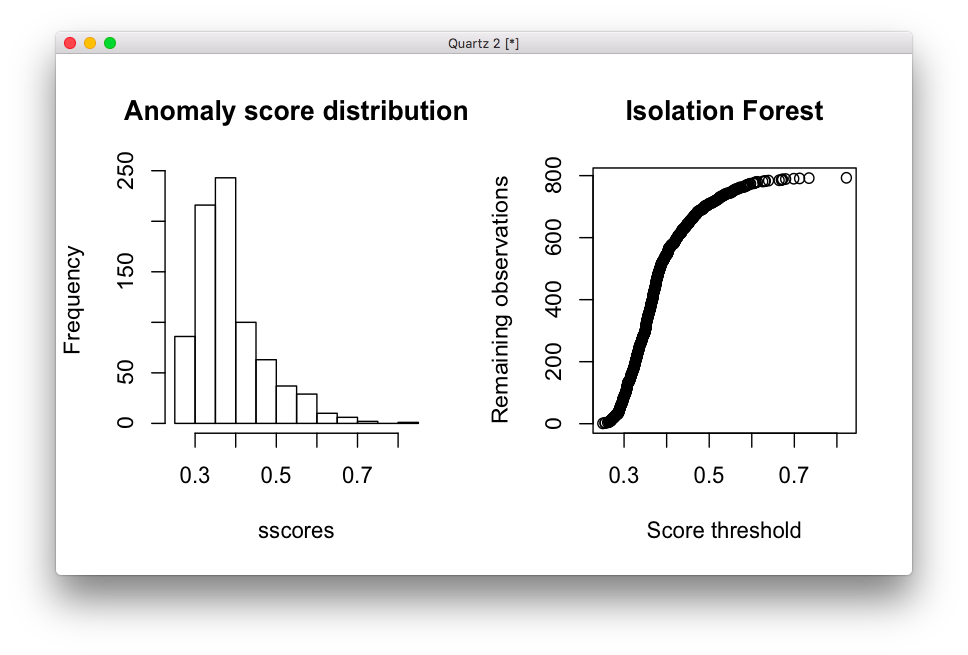

# 2019-09-17 12:15:23

We'll do something similar to what we did for note 040, but this time for fMRI.

```r
a = read.csv('~/data/heritability_change/resting_demo_07032019.csv')
cat(sprintf('Starting from %d scans\n', nrow(a)))

# keeping it to kids only to make sure everyone has been processed
a = a[a$age_at_scan < 18, ]
cat(sprintf('Down to %d to keep < 18 only\n', nrow(a)))

# let's grab QC metrics on everyone
# note that this only works for non-censoring pipelines!
mydir = '/Volumes/Shaw/rsfmri_36P/xcpengine_output_fc-36p_despike/'
data = c()
for (s in a$Mask.ID) {
    subj = sprintf('sub-%04d', s)
    # if it processed all the way
    std_fname = sprintf('%s/%s/norm/%s_std.nii.gz', mydir, subj, subj)
    if (file.exists(std_fname)) {
        subj_data = read.csv(sprintf('%s/%s/%s_quality.csv', mydir, subj, subj))
        data = rbind(data, subj_data)
    }
}
```

So, we started with 1783 scans, and went down to 1306 to keep only kids. Then,
only 793 were processed all the way to the end in the fc-36p_despike pipeline. 

```r
# column names that are not constant
qc_vars = names(which(apply(data[,2:ncol(data)], 2, var, na.rm=TRUE)!=0))

library(solitude)
iso <- isolationForest$new()
iso$fit(data[, qc_vars])
scores_if = as.matrix(iso$scores)[,3]

par(mfrow=c(1,2))
sscores = sort(scores_if)
hist(sscores, breaks=20, main='Anomaly score distribution')
plot(sscores, 1:length(sscores), ylab='Remaining observations',
     xlab='Score threshold', main='Isolation Forest')
```



I think .5 seems like a reasonable threshold for IF.

Let's see how it looks for LOF:

```r
library(dbscan)
# here I set the number of neighbors to a percentage of the total data
scores_lof = lof(data[, qc_vars], k = round(.5 * nrow(data)))
par(mfrow=c(1,2))
sscores = sort(scores_lof)
hist(sscores, breaks=20, main='Anomaly score distribution')
plot(sscores, 1:length(sscores), ylab='Remaining observations',
     xlab='Score threshold', main='Local Outlier Factor')
```


For LOF it wasn't as clear. Maybe 1.5, and let the intersection with IF, and the
actual data remove the rest?

Now, we need to decide which dataset to use. I like the roi2net idea. Let's see
if there is anything interesting there. We can try other condensed/collapsed
datasets later, or even voxelwise if nothing comes out of this. 

```r
idx = scores_lof < 1.5 & scores_if < .55
nrois = 100

fname = sprintf('~/research_code/fmri/Schaefer2018_%dParcels_7Networks_order.txt',
                nrois)
nets = read.table(fname)
all_net_names = sapply(as.character(unique(nets[,2])),
                       function(y) strsplit(x=y, split='_')[[1]][3])
net_names = unique(all_net_names)
nnets = length(net_names)

data2 = data[idx, ]
fc = c()
for (s in data2$id0) {
    fname = sprintf('%s/%s/fcon/schaefer%d/%s_schaefer%d.net',
                        mydir, s, nrois, s, nrois)
    subj_data = read.table(fname, skip=2)
    b = matrix(nrow=nrois, ncol=nrois)
    for (r in 1:nrow(data)) {
        b[subj_data[r,1], subj_data[r,2]] = subj_data[r,3]
        b[subj_data[r,2], subj_data[r,1]] = subj_data[r,3]
    }
    # at this point we have a nrois by nrois mirror matrix for the
    # subject. All we need to do is average within each network
    roi_conn = c()
    for (n in 1:nnets) {
        net_idx = all_net_names==net_names[n]
        roi_conn = c(roi_conn, rowMeans(b[, net_idx], na.rm=T))
    }
    fc = rbind(fc, roi_conn)
}
```

Now we perform outlier detection on the actual data... it turns out that I
cannot have more variables than observations. I could PCAit, but let's do a
network to network approach first, just to see if this is at all promising.

```r
idx = scores_lof < 1.5 & scores_if < .55
nrois = 100

fname = sprintf('~/research_code/fmri/Schaefer2018_%dParcels_7Networks_order.txt',
                nrois)
nets = read.table(fname)
all_net_names = sapply(as.character(unique(nets[,2])),
                       function(y) strsplit(x=y, split='_')[[1]][3])
net_names = unique(all_net_names)
nnets = length(net_names)

# figure out which connection goes to which network
cat('Creating connection map...\n')
nverts = nrow(nets)
cnt = 1
conn_map = c()
for (i in 1:(nverts-1)) {
    for (j in (i+1):nverts) {
        conn = sprintf('conn%d', cnt)
        conn_map = rbind(conn_map, c(conn, all_net_names[i], all_net_names[j]))
        cnt = cnt + 1
    }
}

data2 = data[idx, ]
fc = c()
for (s in data2$id0) {
    fname = sprintf('%s/%s/fcon/schaefer%d/%s_schaefer%d_network.txt',
                                mydir, s, nrois, s, nrois)
    subj_data = read.table(fname)[, 1]
    fc = cbind(fc, subj_data)
}
fc = t(fc)
var_names = sapply(1:ncol(fc), function(x) sprintf('conn%d', x))
colnames(fc) = var_names
net_data = c()
header = c()
for (i in 1:nnets) {
    for (j in i:nnets) {
        cat(sprintf('Evaluating connections from %s to %s\n',
                    net_names[i], net_names[j]))
        idx = (conn_map[,2]==net_names[i] | conn_map[,2]==net_names[j] |
            conn_map[,3]==net_names[i] | conn_map[,3]==net_names[j])
        res = apply(fc[, var_names[idx]], 1, mean, na.rm=T)
        net_data = cbind(net_data, res)
        header = c(header, sprintf('conn_%sTO%s', net_names[i],
                                                net_names[j]))
    }
}
colnames(net_data) = header
rownames(net_data) = data2$id0
```

Now, time to see how the outlier plots look like:

```r
iso <- isolationForest$new()
iso$fit(as.data.frame(net_data))
scores_if = as.matrix(iso$scores)[,3]
scores_lof = lof(net_data, k = round(.5 * nrow(net_data)))

par(mfrow=c(2,2))
sscores = sort(scores_lof)
hist(sscores, breaks=20, main='LOF Anomaly score distribution')
plot(sscores, 1:length(sscores), ylab='Remaining observations',
     xlab='Score threshold', main='Local Outlier Factor')
sscores = sort(scores_if)
hist(sscores, breaks=20, main='IF Anomaly score distribution')
plot(sscores, 1:length(sscores), ylab='Remaining observations',
     xlab='Score threshold', main='Isolation Forest')
```


I think a fair threshold for LOF is 1.25 and for IF is .5. Now, let's see how
many scans we end up with:

```r
idx = scores_lof < 1.25 & scores_if < .5
```

We are still at 543 scans, coming from initial 793 kiddie scans. So, a 32%
reduction. What happens when we keep the best two scans of each kid that has 2
or more scans? And here we'll define as "best" as just the LOF score, which is a
bit easier to interpret and it doesn't look like a normal distribution.

First, let's add our qc metrics:

```r
data3 = cbind(data2, net_data)
data3 = data3[idx, ]

data3$mask.id = as.numeric(gsub(data3$id0, pattern='sub-', replacement=''))

df = merge(data3, a, by.x='mask.id', by.y='Mask.ID', all.x=T, all.y=F)

num_scans = 2  # number of scans to select
df$scores = scores_lof[idx]

# removing people with less than num_scans scans
idx = which(table(df$Medical.Record...MRN)>=num_scans)
long_subjs = names(table(df$Medical.Record...MRN))[idx]
keep_me = c()
for (m in 1:nrow(df)) {
    if (df[m, ]$Medical.Record...MRN %in% long_subjs) {
        keep_me = c(keep_me, m)
    }
}
df = df[keep_me,]
cat(sprintf('Down to %d to keep only subjects with more than %d scans\n',
            nrow(df), num_scans))
keep_me = c()
for (s in unique(df$Medical.Record...MRN)) {
    found = F
    subj_idx = which(df$Medical.Record...MRN==s)
    subj_scans = df[subj_idx, ]
    dates = as.Date(as.character(subj_scans$"record.date.collected...Scan"),
                                    format="%m/%d/%Y")
    best_scans = sort(subj_scans$scores, index.return=T)
    # make sure they are at least 6 months apart. This is the idea:
    # grab the best X scans. Check the time difference between them.
    # Any time the time difference is not enough, remove the worse
    # scan and replace by the next in line. Keep doing this until
    # the time difference is enough between all scans, or we run out
    # of scans
    cur_scan = 1
    last_scan = num_scans
    cur_choice = best_scans$ix[cur_scan:last_scan]
    while (!found && last_scan <= nrow(subj_scans)) {
        time_diffs = abs(diff(dates[cur_choice]))
        if (all(time_diffs > 180)) {
            found = TRUE
        } else {
            # figure out which scan to remove. If there is more than one
            # to be removed, it will be taken care in the next iteration
            bad_diff = which.min(time_diffs)
            if (subj_scans$scores[cur_choice[bad_diff]] >
                subj_scans$scores[cur_choice[bad_diff + 1]]) {
                rm_scan = cur_choice[bad_diff]
            } else {
                rm_scan = cur_choice[bad_diff + 1]
            }
            last_scan = last_scan + 1
            if (last_scan <= nrow(subj_scans)) {
                cur_choice[cur_choice == rm_scan] = best_scans$ix[last_scan]
            }
        }
    }
    if (found) {
        keep_me = c(keep_me, subj_idx[cur_choice])
    }
}
filtered_data = df[keep_me, ]
```

So, in the end we still have 394 scans, which is much more than what we had
before. Let's try using that for heritability and also for association (just to
simplify the analysis), and let's see what we get.

Time to compute slopes. Let's re-use the code and keep some baseline metrics in
there as well:

NEED TO FIGURE OUT WHAT'S GOING ON HERE! JUST CLEAN UP CLINICAL FILE, OR
CONSTRUCT A MORE RECENT ONE. THEN, USE IT FOR BOTH DTI AND FMRI!

```r
source('~/research_code/lab_mgmt/merge_on_closest_date.R')
clin = read.csv('~/data/heritability_change/clinical_06262019.csv')
df = mergeOnClosestDate(filtered_data, clin,
                        unique(filtered_data$Medical.Record...MRN),
                         x.date='record.date.collected...Scan',
                         x.id='Medical.Record...MRN')
mres = df
mres$SX_HI = as.numeric(as.character(mres$SX_hi))
mres$SX_inatt = as.numeric(as.character(mres$SX_inatt))

res = c()
for (s in unique(mres$Medical.Record...MRN...Subjects)) {
    idx = which(mres$Medical.Record...MRN...Subjects == s)
    row = c(s, unique(mres[idx, 'Sex...Subjects']))
    y = mres[idx[2], c(tract_names, qc_vars)] - mres[idx[1], c(tract_names, qc_vars)]
    x = mres[idx[2], 'age_at_scan...Scan...Subjects'] - mres[idx[1], 'age_at_scan...Scan...Subjects']
    slopes = y / x
    row = c(row, slopes)
    for (t in c('SX_inatt', 'SX_HI')) {
        fm_str = sprintf('%s ~ age_at_scan...Scan...Subjects', t)
        fit = lm(as.formula(fm_str), data=mres[idx, ], na.action=na.exclude)
        row = c(row, coefficients(fit)[2])
    }
    # grabbing inatt and HI at baseline
    base_DOA = which.min(mres[idx, 'age_at_scan...Scan...Subjects'])
    row = c(row, mres[idx[base_DOA], tract_names])
    row = c(row, mres[idx[base_DOA], 'SX_inatt'])
    row = c(row, mres[idx[base_DOA], 'SX_HI'])
    # DX1 is DSMV definition, DX2 will make SX >=4 as ADHD
    if (mres[idx[base_DOA], 'age_at_scan...Scan...Subjects'] < 16) {
        if ((row[length(row)] >= 6) || (row[length(row)-1] >= 6)) {
            DX = 'ADHD'
        } else {
            DX = 'NV'
        }
    } else {
        if ((row[length(row)] >= 5) || (row[length(row)-1] >= 5)) {
            DX = 'ADHD'
        } else {
            DX = 'NV'
        }
    }
    if ((row[length(row)] >= 4) || (row[length(row)-1] >= 4)) {
        DX2 = 'ADHD'
    } else {
        DX2 = 'NV'
    }
    row = c(row, DX)
    row = c(row, DX2)
    res = rbind(res, row)
    print(nrow(res))
}
tract_base = sapply(tract_names, function(x) sprintf('%s_baseline', x))
colnames(res) = c('ID', 'sex', tract_names, qc_vars, c('SX_inatt', 'SX_HI',
                                              tract_base,
                                              'inatt_baseline',
                                              'HI_baseline',
                                              'DX', 'DX2'))
write.csv(res, file='~/data/heritability_change/dti_tracts_OD.csv',
          row.names=F, na='', quote=F)
```

Philip suggested that I should make a few plots showing the quality metrics for
the bad scans and the good scans. Just as a sanity check that the method is
doing what it's supposed to. So, let's try it:

```r
b = read.csv('/Volumes/Shaw/MasterQC/master_qc_20190314.csv')
a = read.csv('~/data/heritability_change/ready_1020.csv')
m = merge(a, b, by.y='Mask.ID', by.x='Mask.ID...Scan', all.x=F)

# restrict based on QC
m$pct = m$missingVolumes / m$numVolumes

qc_vars = c("meanX.trans", "meanY.trans", "meanZ.trans",
            "meanX.rot", "meanY.rot", "meanZ.rot",
            "goodVolumes", "pct")

m = m[m$"age_at_scan...Scan...Subjects" < 18, ]

library(solitude)
iso <- isolationForest$new()
iso$fit(m[, qc_vars])
scores_if = as.matrix(iso$scores)[,3]

idx_good = which(scores_if < .45)
m$group = 'outlier'
m[idx_good,]$group = 'normal'

par(mfrow=c(2,4))
for (v in qc_vars) {
    fm_str = sprintf('%s ~ group', v)
    boxplot(as.formula(fm_str), data=m, main=v)
}

```


This seems to be doing what we expect. Let's just make sure LOF is also looking
good:

```r
b = read.csv('/Volumes/Shaw/MasterQC/master_qc_20190314.csv')
a = read.csv('~/data/heritability_change/ready_1020.csv')
m = merge(a, b, by.y='Mask.ID', by.x='Mask.ID...Scan', all.x=F)

# restrict based on QC
m$pct = m$missingVolumes / m$numVolumes

qc_vars = c("meanX.trans", "meanY.trans", "meanZ.trans",
            "meanX.rot", "meanY.rot", "meanZ.rot",
            "goodVolumes", "pct")

m = m[m$"age_at_scan...Scan...Subjects" < 18, ]

library(dbscan)
scores_lof = lof(m[, qc_vars], k = round(.5 * nrow(m)))

idx_good = which(scores_lof < 2.5)
m$group = 'outlier'
m[idx_good,]$group = 'normal'

par(mfrow=c(2,4))
for (v in qc_vars) {
    fm_str = sprintf('%s ~ group', v)
    boxplot(as.formula(fm_str), data=m, main=v)
}
```


OK, let's take some SOLAR metrics on this new sample size. I wrote a special
function in SOLAR because I didn't residualize it in the scan space, as I didn't
want to corrupt the data to much. It'll need to be dealt with if slopes are
correlated, but only then. So, the SOLAR function deals with that, and I'll need
to deal with that in the regression cases as well.

```bash
# interactive
cd ~/data/heritability_change
for m in fa ad rd; do
    for t in left_cst left_ifo left_ilf left_slf left_unc right_cst right_ifo \
        right_ilf right_slf right_unc cc; do
        solar run_phen_var_OD_tracts dti_tracts_OD ${m}_${t};
    done;
done;
mv dti_tracts_OD ~/data/tmp/
cd ~/data/tmp/dti_tracts_OD/
for p in `/bin/ls`; do cp $p/polygenic.out ${p}_polygenic.out; done
python ~/research_code/compile_solar_multivar_results.py dti_tracts_OD
```


Well, this seem to work. Especially if we focus on FA only. Let's make a new
note so we can explore this with other phenotypes.


