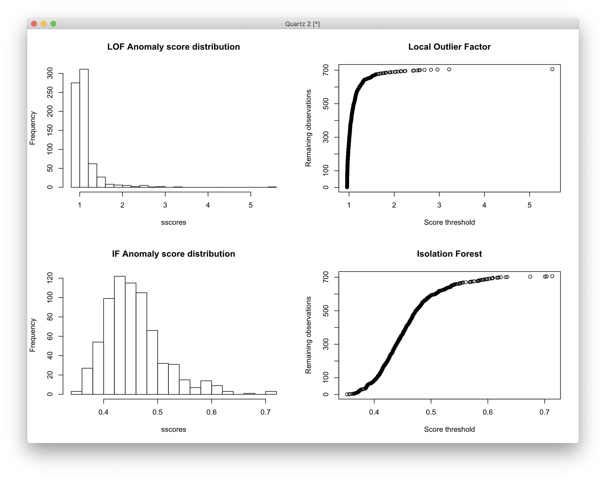

# 2019-09-17 12:15:23

We'll do something similar to what we did for note 040, but this time for fMRI.

```r
demo = read.csv('~/data/heritability_change/resting_demo_07032019.csv')
cat(sprintf('Starting from %d scans\n', nrow(demo)))

# keeping it to kids only to make sure everyone has been processed
demo = demo[a$age_at_scan < 18, ]
cat(sprintf('Down to %d to keep < 18 only\n', nrow(demo)))

# let's grab QC metrics on everyone
# note that this only works for non-censoring pipelines!
mydir = '/Volumes/Shaw/rsfmri_36P/xcpengine_output_fc-36p_despike/'
qc_data = c()
for (s in demo$Mask.ID) {
    subj = sprintf('sub-%04d', s)
    # if it processed all the way
    std_fname = sprintf('%s/%s/norm/%s_std.nii.gz', mydir, subj, subj)
    if (file.exists(std_fname)) {
        subj_data = read.csv(sprintf('%s/%s/%s_quality.csv', mydir, subj, subj))
        qc_data = rbind(qc_data, subj_data)
    }
}
```

So, we started with 1783 scans, and went down to 1306 to keep only kids. Then,
only 793 were processed all the way to the end in the fc-36p_despike pipeline. 

```r
# # column names that are not constant
# qc_vars = names(which(apply(qc_data[,2:ncol(data)], 2, var, na.rm=TRUE)!=0))

# have some higly correlated qc variables, so let's remove the worse offenders (anything above abs(.8))
qc_vars = c('normCoverage', 'meanDV', 'pctSpikesDV',
            'motionDVCorrInit',
            'motionDVCorrFinal', "pctSpikesRMS", "relMeanRMSMotion")

library(solitude)
iso <- isolationForest$new()
iso$fit(qc_data[, qc_vars])
scores_if = as.matrix(iso$scores)[,3]

library(dbscan)
# here I set the number of neighbors to a percentage of the total data
scores_lof = lof(qc_data[, qc_vars], k = round(.5 * nrow(qc_data)))

par(mfrow=c(2,2))
sscores = sort(scores_lof)
hist(sscores, breaks=20, main='Anomaly score distribution')
plot(sscores, 1:length(sscores), ylab='Remaining observations',
     xlab='Score threshold', main='Local Outlier Factor')
sscores = sort(scores_if)
hist(sscores, breaks=20, main='Anomaly score distribution')
plot(sscores, 1:length(sscores), ylab='Remaining observations',
     xlab='Score threshold', main='Isolation Forest')
```


I think .5 seems like a reasonable threshold for IF, and 2 for LOF.

Now, we need to decide which dataset to use. I'll expand slowly, starting with
7x7, then 17x17, then roix7, and finally roix17. For each I can make posOnly as
well as everything, and I should also compute Fam datasets, since SOLAR seems to
be screwing that up.

```r
idx = scores_lof < 2 & scores_if < .5
nrois = 100

fname = sprintf('~/research_code/fmri/Schaefer2018_%dParcels_7Networks_order.txt',
                nrois)
nets = read.table(fname)
all_net_names = sapply(as.character(unique(nets[,2])),
                       function(y) strsplit(x=y, split='_')[[1]][3])
net_names = unique(all_net_names)
nnets = length(net_names)

# figure out which connection goes to which network
cat('Creating connection map...\n')
nverts = nrow(nets)
cnt = 1
conn_map = c()
for (i in 1:(nverts-1)) {
    for (j in (i+1):nverts) {
        conn = sprintf('conn%d', cnt)
        conn_map = rbind(conn_map, c(conn, all_net_names[i], all_net_names[j]))
        cnt = cnt + 1
    }
}

qc_data_clean = qc_data[idx, ]
fc = c()
for (s in qc_data_clean$id0) {
    fname = sprintf('%s/%s/fcon/schaefer%d/%s_schaefer%d_network.txt',
                                mydir, s, nrois, s, nrois)
    subj_data = read.table(fname)[, 1]
    fc = cbind(fc, subj_data)
}
fc = t(fc)
var_names = sapply(1:ncol(fc), function(x) sprintf('conn%d', x))
colnames(fc) = var_names
fcP = fc
fcP[fc<0] = NA

net_data = c()
net_dataP = c()
header = c()
for (i in 1:nnets) {
    for (j in i:nnets) {
        cat(sprintf('Evaluating connections from %s to %s\n',
                    net_names[i], net_names[j]))
        idx = (conn_map[,2]==net_names[i] | conn_map[,2]==net_names[j] |
            conn_map[,3]==net_names[i] | conn_map[,3]==net_names[j])
        res = apply(fc[, var_names[idx]], 1, mean, na.rm=T)
        net_data = cbind(net_data, res)
        res = apply(fcP[, var_names[idx]], 1, mean, na.rm=T)
        net_dataP = cbind(net_dataP, res)
        header = c(header, sprintf('conn_%sTO%s', net_names[i],
                                                net_names[j]))
    }
}
colnames(net_data) = header
rownames(net_data) = qc_data_clean$id0
colnames(net_dataP) = header
rownames(net_dataP) = qc_data_clean$id0
```

So we don't get confused, let's do the whole thing for the whole data, then we
redo it for positive only:

```r
iso <- isolationForest$new()
iso$fit(as.data.frame(net_data))
scores_if = as.matrix(iso$scores)[,3]
scores_lof = lof(net_data, k = round(.5 * nrow(net_data)))

par(mfrow=c(2,2))
sscores = sort(scores_lof)
hist(sscores, breaks=20, main='LOF Anomaly score distribution')
plot(sscores, 1:length(sscores), ylab='Remaining observations',
     xlab='Score threshold', main='Local Outlier Factor')
sscores = sort(scores_if)
hist(sscores, breaks=20, main='IF Anomaly score distribution')
plot(sscores, 1:length(sscores), ylab='Remaining observations',
     xlab='Score threshold', main='Isolation Forest')
```


I'll go with 1.25 for LOF and .55 for IF:

```r
idx = scores_lof < 1.25 & scores_if < .55
data = cbind(qc_data_clean[, c('id0', qc_vars)], net_data)
data = data[idx, ]

data$mask.id = as.numeric(gsub(data$id0, pattern='sub-', replacement=''))

df = merge(data, demo, by.x='mask.id', by.y='Mask.ID', all.x=T, all.y=F)

num_scans = 2  # number of scans to select
df$scores = scores_lof[idx]

# removing people with less than num_scans scans
idx = which(table(df$Medical.Record...MRN)>=num_scans)
long_subjs = names(table(df$Medical.Record...MRN))[idx]
keep_me = c()
for (m in 1:nrow(df)) {
    if (df[m, ]$Medical.Record...MRN %in% long_subjs) {
        keep_me = c(keep_me, m)
    }
}
df = df[keep_me,]
cat(sprintf('Down to %d to keep only subjects with more than %d scans\n',
            nrow(df), num_scans))
keep_me = c()
for (s in unique(df$Medical.Record...MRN)) {
    found = F
    subj_idx = which(df$Medical.Record...MRN==s)
    subj_scans = df[subj_idx, ]
    dates = as.Date(as.character(subj_scans$"record.date.collected...Scan"),
                                    format="%m/%d/%Y")
    best_scans = sort(subj_scans$scores, index.return=T)
    # make sure they are at least 6 months apart. This is the idea:
    # grab the best X scans. Check the time difference between them.
    # Any time the time difference is not enough, remove the worse
    # scan and replace by the next in line. Keep doing this until
    # the time difference is enough between all scans, or we run out
    # of scans
    cur_scan = 1
    last_scan = num_scans
    cur_choice = best_scans$ix[cur_scan:last_scan]
    while (!found && last_scan <= nrow(subj_scans)) {
        time_diffs = abs(diff(dates[cur_choice]))
        if (all(time_diffs > 180)) {
            found = TRUE
        } else {
            # figure out which scan to remove. If there is more than one
            # to be removed, it will be taken care in the next iteration
            bad_diff = which.min(time_diffs)
            if (subj_scans$scores[cur_choice[bad_diff]] >
                subj_scans$scores[cur_choice[bad_diff + 1]]) {
                rm_scan = cur_choice[bad_diff]
            } else {
                rm_scan = cur_choice[bad_diff + 1]
            }
            last_scan = last_scan + 1
            if (last_scan <= nrow(subj_scans)) {
                cur_choice[cur_choice == rm_scan] = best_scans$ix[last_scan]
            }
        }
    }
    if (found) {
        keep_me = c(keep_me, subj_idx[cur_choice])
    }
}
filtered_data = df[keep_me, ]
```

So, in the end we still have 448 scans, which is much more than what we had
before. Let's try using that for heritability and also for association (just to
simplify the analysis), and let's see what we get.

Time to compute slopes. Let's re-use the code and keep some baseline metrics in
there as well:

```r
source('~/research_code/lab_mgmt/merge_on_closest_date.R')
clin = read.csv('~/data/heritability_change/clinical_09182019.csv')
df = mergeOnClosestDate(filtered_data, clin,
                        unique(filtered_data$Medical.Record...MRN),
                         x.date='record.date.collected...Scan',
                         x.id='Medical.Record...MRN')
mres = df
mres$SX_HI = as.numeric(as.character(mres$SX_hi))
mres$SX_inatt = as.numeric(as.character(mres$SX_inatt))
tract_names = header

res = c()
for (s in unique(mres$Medical.Record...MRN)) {
    idx = which(mres$Medical.Record...MRN == s)
    row = c(s, unique(mres[idx, 'Sex']))
    y = mres[idx[2], c(tract_names, qc_vars)] - mres[idx[1], c(tract_names, qc_vars)]
    x = mres[idx[2], 'age_at_scan'] - mres[idx[1], 'age_at_scan']
    slopes = y / x
    row = c(row, slopes)
    for (t in c('SX_inatt', 'SX_HI')) {
        fm_str = sprintf('%s ~ age_at_scan', t)
        fit = lm(as.formula(fm_str), data=mres[idx, ], na.action=na.exclude)
        row = c(row, coefficients(fit)[2])
    }
    # grabbing inatt and HI at baseline
    base_DOA = which.min(mres[idx, 'age_at_scan'])
    row = c(row, mres[idx[base_DOA], tract_names])
    row = c(row, mres[idx[base_DOA], 'SX_inatt'])
    row = c(row, mres[idx[base_DOA], 'SX_HI'])
    # DX1 is DSMV definition, DX2 will make SX >=4 as ADHD
    if (mres[idx[base_DOA], 'age_at_scan'] < 16) {
        if ((row[length(row)] >= 6) || (row[length(row)-1] >= 6)) {
            DX = 'ADHD'
        } else {
            DX = 'NV'
        }
    } else {
        if ((row[length(row)] >= 5) || (row[length(row)-1] >= 5)) {
            DX = 'ADHD'
        } else {
            DX = 'NV'
        }
    }
    if ((row[length(row)] >= 4) || (row[length(row)-1] >= 4)) {
        DX2 = 'ADHD'
    } else {
        DX2 = 'NV'
    }
    row = c(row, DX)
    row = c(row, DX2)
    res = rbind(res, row)
    print(nrow(res))
}
tract_base = sapply(tract_names, function(x) sprintf('%s_baseline', x))
colnames(res) = c('ID', 'sex', tract_names, qc_vars, c('SX_inatt', 'SX_HI',
                                              tract_base,
                                              'inatt_baseline',
                                              'HI_baseline',
                                              'DX', 'DX2'))
write.csv(res, file='~/data/heritability_change/rsfmri_7by7from100_OD_n224.csv',
          row.names=F, na='', quote=F)

junk = read.csv('~/data/heritability_change/rsfmri_7by7from100_OD_n224.csv')
tmp = read.csv('~/data/heritability_change/pedigree.csv')
tmp2 = merge(junk, tmp[, c('ID', 'FAMID')], by='ID', all.x=T, all.y=F)
related = names(table(tmp2$FAMID))[table(tmp2$FAMID) >= 2]
keep_me = tmp2$FAMID %in% related
res2 = junk[keep_me, ]
write.csv(res2, file='~/data/heritability_change/rsfmri_7by7from100_OD_n224_Fam_n112.csv',
          row.names=F, na='', quote=F)
```

Let me run these through SOLAR, before I check the positive only dataset:

```bash
# interactive
cd ~/data/heritability_change
for t in "conn_VisTOVis" "conn_VisTOSomMot" "conn_VisTODorsAttn" \
    "conn_VisTOSalVentAttn" "conn_VisTOLimbic" "conn_VisTOCont" \
    "conn_VisTODefault" "conn_SomMotTOSomMot" "conn_SomMotTODorsAttn" \
    "conn_SomMotTOSalVentAttn" "conn_SomMotTOLimbic" "conn_SomMotTOCont" \
    "conn_SomMotTODefault" "conn_DorsAttnTODorsAttn" \
    "conn_DorsAttnTOSalVentAttn" "conn_DorsAttnTOLimbic" "conn_DorsAttnTOCont" \
    "conn_DorsAttnTODefault" "conn_SalVentAttnTOSalVentAttn" \
    "conn_SalVentAttnTOLimbic" "conn_SalVentAttnTOCont" \
    "conn_SalVentAttnTODefault" "conn_LimbicTOLimbic" "conn_LimbicTOCont" \
    "conn_LimbicTODefault" "conn_ContTOCont" "conn_ContTODefault" \
    "conn_DefaultTODefault"; do
        solar run_phen_var_OD_xcp rsfmri_7by7from100_OD_n224_Fam_n112 ${t};
done;
mv rsfmri_7by7from100_OD_n224_Fam_n112 ~/data/tmp/
cd ~/data/tmp/rsfmri_7by7from100_OD_n224_Fam_n112/
for p in `/bin/ls`; do cp $p/polygenic.out ${p}_polygenic.out; done
python ~/research_code/compile_solar_multivar_results.py rsfmri_7by7from100_OD_n224_Fam_n112
```

Not much there at all. Let's try the positive-only dataset as well:

```r
iso <- isolationForest$new()
iso$fit(as.data.frame(net_dataP))
scores_if = as.matrix(iso$scores)[,3]
scores_lof = lof(net_dataP, k = round(.5 * nrow(net_data)))

par(mfrow=c(2,2))
sscores = sort(scores_lof)
hist(sscores, breaks=20, main='LOF Anomaly score distribution')
plot(sscores, 1:length(sscores), ylab='Remaining observations',
     xlab='Score threshold', main='Local Outlier Factor')
sscores = sort(scores_if)
hist(sscores, breaks=20, main='IF Anomaly score distribution')
plot(sscores, 1:length(sscores), ylab='Remaining observations',
     xlab='Score threshold', main='Isolation Forest')
```



```r
idx = scores_lof < 1.2 & scores_if < .55
data = cbind(qc_data_clean[, c('id0', qc_vars)], net_dataP)
data = data[idx, ]

data$mask.id = as.numeric(gsub(data$id0, pattern='sub-', replacement=''))

df = merge(data, demo, by.x='mask.id', by.y='Mask.ID', all.x=T, all.y=F)

num_scans = 2  # number of scans to select
df$scores = scores_lof[idx]

# removing people with less than num_scans scans
idx = which(table(df$Medical.Record...MRN)>=num_scans)
long_subjs = names(table(df$Medical.Record...MRN))[idx]
keep_me = c()
for (m in 1:nrow(df)) {
    if (df[m, ]$Medical.Record...MRN %in% long_subjs) {
        keep_me = c(keep_me, m)
    }
}
df = df[keep_me,]
cat(sprintf('Down to %d to keep only subjects with more than %d scans\n',
            nrow(df), num_scans))
keep_me = c()
for (s in unique(df$Medical.Record...MRN)) {
    found = F
    subj_idx = which(df$Medical.Record...MRN==s)
    subj_scans = df[subj_idx, ]
    dates = as.Date(as.character(subj_scans$"record.date.collected...Scan"),
                                    format="%m/%d/%Y")
    best_scans = sort(subj_scans$scores, index.return=T)
    # make sure they are at least 6 months apart. This is the idea:
    # grab the best X scans. Check the time difference between them.
    # Any time the time difference is not enough, remove the worse
    # scan and replace by the next in line. Keep doing this until
    # the time difference is enough between all scans, or we run out
    # of scans
    cur_scan = 1
    last_scan = num_scans
    cur_choice = best_scans$ix[cur_scan:last_scan]
    while (!found && last_scan <= nrow(subj_scans)) {
        time_diffs = abs(diff(dates[cur_choice]))
        if (all(time_diffs > 180)) {
            found = TRUE
        } else {
            # figure out which scan to remove. If there is more than one
            # to be removed, it will be taken care in the next iteration
            bad_diff = which.min(time_diffs)
            if (subj_scans$scores[cur_choice[bad_diff]] >
                subj_scans$scores[cur_choice[bad_diff + 1]]) {
                rm_scan = cur_choice[bad_diff]
            } else {
                rm_scan = cur_choice[bad_diff + 1]
            }
            last_scan = last_scan + 1
            if (last_scan <= nrow(subj_scans)) {
                cur_choice[cur_choice == rm_scan] = best_scans$ix[last_scan]
            }
        }
    }
    if (found) {
        keep_me = c(keep_me, subj_idx[cur_choice])
    }
}
filtered_data = df[keep_me, ]

source('~/research_code/lab_mgmt/merge_on_closest_date.R')
clin = read.csv('~/data/heritability_change/clinical_09182019.csv')
df = mergeOnClosestDate(filtered_data, clin,
                        unique(filtered_data$Medical.Record...MRN),
                         x.date='record.date.collected...Scan',
                         x.id='Medical.Record...MRN')
mres = df
mres$SX_HI = as.numeric(as.character(mres$SX_hi))
mres$SX_inatt = as.numeric(as.character(mres$SX_inatt))
tract_names = header

res = c()
for (s in unique(mres$Medical.Record...MRN)) {
    idx = which(mres$Medical.Record...MRN == s)
    row = c(s, unique(mres[idx, 'Sex']))
    y = mres[idx[2], c(tract_names, qc_vars)] - mres[idx[1], c(tract_names, qc_vars)]
    x = mres[idx[2], 'age_at_scan'] - mres[idx[1], 'age_at_scan']
    slopes = y / x
    row = c(row, slopes)
    for (t in c('SX_inatt', 'SX_HI')) {
        fm_str = sprintf('%s ~ age_at_scan', t)
        fit = lm(as.formula(fm_str), data=mres[idx, ], na.action=na.exclude)
        row = c(row, coefficients(fit)[2])
    }
    # grabbing inatt and HI at baseline
    base_DOA = which.min(mres[idx, 'age_at_scan'])
    row = c(row, mres[idx[base_DOA], tract_names])
    row = c(row, mres[idx[base_DOA], 'SX_inatt'])
    row = c(row, mres[idx[base_DOA], 'SX_HI'])
    # DX1 is DSMV definition, DX2 will make SX >=4 as ADHD
    if (mres[idx[base_DOA], 'age_at_scan'] < 16) {
        if ((row[length(row)] >= 6) || (row[length(row)-1] >= 6)) {
            DX = 'ADHD'
        } else {
            DX = 'NV'
        }
    } else {
        if ((row[length(row)] >= 5) || (row[length(row)-1] >= 5)) {
            DX = 'ADHD'
        } else {
            DX = 'NV'
        }
    }
    if ((row[length(row)] >= 4) || (row[length(row)-1] >= 4)) {
        DX2 = 'ADHD'
    } else {
        DX2 = 'NV'
    }
    row = c(row, DX)
    row = c(row, DX2)
    res = rbind(res, row)
    print(nrow(res))
}
tract_base = sapply(tract_names, function(x) sprintf('%s_baseline', x))
colnames(res) = c('ID', 'sex', tract_names, qc_vars, c('SX_inatt', 'SX_HI',
                                              tract_base,
                                              'inatt_baseline',
                                              'HI_baseline',
                                              'DX', 'DX2'))
write.csv(res, file='~/data/heritability_change/rsfmri_7by7from100_OD_posOnly_n200.csv',
          row.names=F, na='', quote=F)

data = read.csv('~/data/heritability_change/rsfmri_7by7from100_OD_posOnly_n200.csv')
tmp = read.csv('~/data/heritability_change/pedigree.csv')
data = merge(data, tmp[, c('ID', 'FAMID')], by='ID', all.x=T, all.y=F)
related = names(table(data$FAMID))[table(data$FAMID) >= 2]
keep_me = data$FAMID %in% related
data2 = data[keep_me, ]
write.csv(data2, file='~/data/heritability_change/rsfmri_7by7from100_OD_posOnly_n200_Fam_n100.csv',
          row.names=F, na='', quote=F)
```

```bash
# interactive
cd ~/data/heritability_change
for t in "conn_VisTOVis" "conn_VisTOSomMot" "conn_VisTODorsAttn" \
    "conn_VisTOSalVentAttn" "conn_VisTOLimbic" "conn_VisTOCont" \
    "conn_VisTODefault" "conn_SomMotTOSomMot" "conn_SomMotTODorsAttn" \
    "conn_SomMotTOSalVentAttn" "conn_SomMotTOLimbic" "conn_SomMotTOCont" \
    "conn_SomMotTODefault" "conn_DorsAttnTODorsAttn" \
    "conn_DorsAttnTOSalVentAttn" "conn_DorsAttnTOLimbic" "conn_DorsAttnTOCont" \
    "conn_DorsAttnTODefault" "conn_SalVentAttnTOSalVentAttn" \
    "conn_SalVentAttnTOLimbic" "conn_SalVentAttnTOCont" \
    "conn_SalVentAttnTODefault" "conn_LimbicTOLimbic" "conn_LimbicTOCont" \
    "conn_LimbicTODefault" "conn_ContTOCont" "conn_ContTODefault" \
    "conn_DefaultTODefault"; do
        solar run_phen_var_OD_xcp rsfmri_7by7from100_OD_posOnly_n200_Fam_n100 ${t};
done;
mv rsfmri_7by7from100_OD_posOnly_n200_Fam_n100 ~/data/tmp/
cd ~/data/tmp/rsfmri_7by7from100_OD_posOnly_n200_Fam_n100/
for p in `/bin/ls`; do cp $p/polygenic.out ${p}_polygenic.out; done
python ~/research_code/compile_solar_multivar_results.py rsfmri_7by7from100_OD_posOnly_n200_Fam_n100
```

The posOnly results are a bit better, but still nothing that good. We get
nominal significance from VAN to DMN and Limbic, and also from DAN to limbic,
but nothing that would survive.

Let's try the 17x17 approach:

```r
nrois = 100

fname = sprintf('~/research_code/fmri/Schaefer2018_%dParcels_17Networks_order.txt',
                nrois)
nets = read.table(fname)
all_net_names = sapply(as.character(unique(nets[,2])),
                       function(y) strsplit(x=y, split='_')[[1]][3])
net_names = unique(all_net_names)
nnets = length(net_names)

# figure out which connection goes to which network
cat('Creating connection map...\n')
nverts = nrow(nets)
cnt = 1
conn_map = c()
for (i in 1:(nverts-1)) {
    for (j in (i+1):nverts) {
        conn = sprintf('conn%d', cnt)
        conn_map = rbind(conn_map, c(conn, all_net_names[i], all_net_names[j]))
        cnt = cnt + 1
    }
}

net_data2 = c()
net_data2P = c()
header = c()
for (i in 1:nnets) {
    for (j in i:nnets) {
        cat(sprintf('Evaluating connections from %s to %s\n',
                    net_names[i], net_names[j]))
        idx = (conn_map[,2]==net_names[i] | conn_map[,2]==net_names[j] |
            conn_map[,3]==net_names[i] | conn_map[,3]==net_names[j])
        res = apply(fc[, var_names[idx]], 1, mean, na.rm=T)
        net_data2 = cbind(net_data2, res)
        res = apply(fcP[, var_names[idx]], 1, mean, na.rm=T)
        net_data2P = cbind(net_data2P, res)
        header = c(header, sprintf('conn_%sTO%s', net_names[i],
                                                net_names[j]))
    }
}
colnames(net_data2) = header
rownames(net_data2) = qc_data_clean$id0
colnames(net_data2P) = header
rownames(net_data2P) = qc_data_clean$id0
```

The same way we approached this before, let's start with everything, then we
jump into positive-only.

```r
iso <- isolationForest$new()
iso$fit(as.data.frame(net_data2))
scores_if = as.matrix(iso$scores)[,3]
scores_lof = lof(net_data2, k = round(.5 * nrow(net_data2)))

par(mfrow=c(2,2))
sscores = sort(scores_lof)
hist(sscores, breaks=20, main='LOF Anomaly score distribution')
plot(sscores, 1:length(sscores), ylab='Remaining observations',
     xlab='Score threshold', main='Local Outlier Factor')
sscores = sort(scores_if)
hist(sscores, breaks=20, main='IF Anomaly score distribution')
plot(sscores, 1:length(sscores), ylab='Remaining observations',
     xlab='Score threshold', main='Isolation Forest')
```


I'll go with 1.25 for LOF and .55 for IF:

```r
idx = scores_lof < 1.25 & scores_if < .55
data = cbind(qc_data_clean[, c('id0', qc_vars)], net_data2)
data = data[idx, ]

data$mask.id = as.numeric(gsub(data$id0, pattern='sub-', replacement=''))

df = merge(data, demo, by.x='mask.id', by.y='Mask.ID', all.x=T, all.y=F)

num_scans = 2  # number of scans to select
df$scores = scores_lof[idx]

# removing people with less than num_scans scans
idx = which(table(df$Medical.Record...MRN)>=num_scans)
long_subjs = names(table(df$Medical.Record...MRN))[idx]
keep_me = c()
for (m in 1:nrow(df)) {
    if (df[m, ]$Medical.Record...MRN %in% long_subjs) {
        keep_me = c(keep_me, m)
    }
}
df = df[keep_me,]
cat(sprintf('Down to %d to keep only subjects with more than %d scans\n',
            nrow(df), num_scans))
keep_me = c()
for (s in unique(df$Medical.Record...MRN)) {
    found = F
    subj_idx = which(df$Medical.Record...MRN==s)
    subj_scans = df[subj_idx, ]
    dates = as.Date(as.character(subj_scans$"record.date.collected...Scan"),
                                    format="%m/%d/%Y")
    best_scans = sort(subj_scans$scores, index.return=T)
    # make sure they are at least 6 months apart. This is the idea:
    # grab the best X scans. Check the time difference between them.
    # Any time the time difference is not enough, remove the worse
    # scan and replace by the next in line. Keep doing this until
    # the time difference is enough between all scans, or we run out
    # of scans
    cur_scan = 1
    last_scan = num_scans
    cur_choice = best_scans$ix[cur_scan:last_scan]
    while (!found && last_scan <= nrow(subj_scans)) {
        time_diffs = abs(diff(dates[cur_choice]))
        if (all(time_diffs > 180)) {
            found = TRUE
        } else {
            # figure out which scan to remove. If there is more than one
            # to be removed, it will be taken care in the next iteration
            bad_diff = which.min(time_diffs)
            if (subj_scans$scores[cur_choice[bad_diff]] >
                subj_scans$scores[cur_choice[bad_diff + 1]]) {
                rm_scan = cur_choice[bad_diff]
            } else {
                rm_scan = cur_choice[bad_diff + 1]
            }
            last_scan = last_scan + 1
            if (last_scan <= nrow(subj_scans)) {
                cur_choice[cur_choice == rm_scan] = best_scans$ix[last_scan]
            }
        }
    }
    if (found) {
        keep_me = c(keep_me, subj_idx[cur_choice])
    }
}
filtered_data = df[keep_me, ]

source('~/research_code/lab_mgmt/merge_on_closest_date.R')
clin = read.csv('~/data/heritability_change/clinical_09182019.csv')
df = mergeOnClosestDate(filtered_data, clin,
                        unique(filtered_data$Medical.Record...MRN),
                         x.date='record.date.collected...Scan',
                         x.id='Medical.Record...MRN')
mres = df
mres$SX_HI = as.numeric(as.character(mres$SX_hi))
mres$SX_inatt = as.numeric(as.character(mres$SX_inatt))
tract_names = header

res = c()
for (s in unique(mres$Medical.Record...MRN)) {
    idx = which(mres$Medical.Record...MRN == s)
    row = c(s, unique(mres[idx, 'Sex']))
    y = mres[idx[2], c(tract_names, qc_vars)] - mres[idx[1], c(tract_names, qc_vars)]
    x = mres[idx[2], 'age_at_scan'] - mres[idx[1], 'age_at_scan']
    slopes = y / x
    row = c(row, slopes)
    for (t in c('SX_inatt', 'SX_HI')) {
        fm_str = sprintf('%s ~ age_at_scan', t)
        fit = lm(as.formula(fm_str), data=mres[idx, ], na.action=na.exclude)
        row = c(row, coefficients(fit)[2])
    }
    # grabbing inatt and HI at baseline
    base_DOA = which.min(mres[idx, 'age_at_scan'])
    row = c(row, mres[idx[base_DOA], tract_names])
    row = c(row, mres[idx[base_DOA], 'SX_inatt'])
    row = c(row, mres[idx[base_DOA], 'SX_HI'])
    # DX1 is DSMV definition, DX2 will make SX >=4 as ADHD
    if (mres[idx[base_DOA], 'age_at_scan'] < 16) {
        if ((row[length(row)] >= 6) || (row[length(row)-1] >= 6)) {
            DX = 'ADHD'
        } else {
            DX = 'NV'
        }
    } else {
        if ((row[length(row)] >= 5) || (row[length(row)-1] >= 5)) {
            DX = 'ADHD'
        } else {
            DX = 'NV'
        }
    }
    if ((row[length(row)] >= 4) || (row[length(row)-1] >= 4)) {
        DX2 = 'ADHD'
    } else {
        DX2 = 'NV'
    }
    row = c(row, DX)
    row = c(row, DX2)
    res = rbind(res, row)
    print(nrow(res))
}
tract_base = sapply(tract_names, function(x) sprintf('%s_baseline', x))
colnames(res) = c('ID', 'sex', tract_names, qc_vars, c('SX_inatt', 'SX_HI',
                                              tract_base,
                                              'inatt_baseline',
                                              'HI_baseline',
                                              'DX', 'DX2'))
write.csv(res, file='~/data/heritability_change/rsfmri_17by17from100_OD_n230.csv',
          row.names=F, na='', quote=F)

junk = read.csv('~/data/heritability_change/rsfmri_17by17from100_OD_n230.csv')
tmp = read.csv('~/data/heritability_change/pedigree.csv')
tmp2 = merge(junk, tmp[, c('ID', 'FAMID')], by='ID', all.x=T, all.y=F)
related = names(table(tmp2$FAMID))[table(tmp2$FAMID) >= 2]
keep_me = tmp2$FAMID %in% related
res2 = junk[keep_me, ]
write.csv(res2, file='~/data/heritability_change/rsfmri_17by17from100_OD_n230_Fam_n120.csv',
          row.names=F, na='', quote=F)
```

```bash
# interactive
cd ~/data/heritability_change
for t in `cat ~/data/heritability_change/tract_names_17x17.txt`; do
        solar run_phen_var_OD_xcp rsfmri_17by17from100_OD_n230_Fam_n120 ${t};
done;
mv rsfmri_17by17from100_OD_n230_Fam_n120 ~/data/tmp/
cd ~/data/tmp/rsfmri_17by17from100_OD_n230_Fam_n120/
for p in `/bin/ls`; do cp $p/polygenic.out ${p}_polygenic.out; done
python ~/research_code/compile_solar_multivar_results.py rsfmri_17by17from100_OD_n230_Fam_n120
```


We started getting some weird, too high heritability values again...

And as usual we check the positive-only as well:

```r
iso <- isolationForest$new()
iso$fit(as.data.frame(net_data2P))
scores_if = as.matrix(iso$scores)[,3]
scores_lof = lof(net_data2P, k = round(.5 * nrow(net_data2P)))

par(mfrow=c(2,2))
sscores = sort(scores_lof)
hist(sscores, breaks=20, main='LOF Anomaly score distribution')
plot(sscores, 1:length(sscores), ylab='Remaining observations',
     xlab='Score threshold', main='Local Outlier Factor')
sscores = sort(scores_if)
hist(sscores, breaks=20, main='IF Anomaly score distribution')
plot(sscores, 1:length(sscores), ylab='Remaining observations',
     xlab='Score threshold', main='Isolation Forest')
```


```r
idx = scores_lof < 1.25 & scores_if < .55
data = cbind(qc_data_clean[, c('id0', qc_vars)], net_data2P)
data = data[idx, ]

data$mask.id = as.numeric(gsub(data$id0, pattern='sub-', replacement=''))

df = merge(data, demo, by.x='mask.id', by.y='Mask.ID', all.x=T, all.y=F)

num_scans = 2  # number of scans to select
df$scores = scores_lof[idx]

# removing people with less than num_scans scans
idx = which(table(df$Medical.Record...MRN)>=num_scans)
long_subjs = names(table(df$Medical.Record...MRN))[idx]
keep_me = c()
for (m in 1:nrow(df)) {
    if (df[m, ]$Medical.Record...MRN %in% long_subjs) {
        keep_me = c(keep_me, m)
    }
}
df = df[keep_me,]
cat(sprintf('Down to %d to keep only subjects with more than %d scans\n',
            nrow(df), num_scans))
keep_me = c()
for (s in unique(df$Medical.Record...MRN)) {
    found = F
    subj_idx = which(df$Medical.Record...MRN==s)
    subj_scans = df[subj_idx, ]
    dates = as.Date(as.character(subj_scans$"record.date.collected...Scan"),
                                    format="%m/%d/%Y")
    best_scans = sort(subj_scans$scores, index.return=T)
    # make sure they are at least 6 months apart. This is the idea:
    # grab the best X scans. Check the time difference between them.
    # Any time the time difference is not enough, remove the worse
    # scan and replace by the next in line. Keep doing this until
    # the time difference is enough between all scans, or we run out
    # of scans
    cur_scan = 1
    last_scan = num_scans
    cur_choice = best_scans$ix[cur_scan:last_scan]
    while (!found && last_scan <= nrow(subj_scans)) {
        time_diffs = abs(diff(dates[cur_choice]))
        if (all(time_diffs > 180)) {
            found = TRUE
        } else {
            # figure out which scan to remove. If there is more than one
            # to be removed, it will be taken care in the next iteration
            bad_diff = which.min(time_diffs)
            if (subj_scans$scores[cur_choice[bad_diff]] >
                subj_scans$scores[cur_choice[bad_diff + 1]]) {
                rm_scan = cur_choice[bad_diff]
            } else {
                rm_scan = cur_choice[bad_diff + 1]
            }
            last_scan = last_scan + 1
            if (last_scan <= nrow(subj_scans)) {
                cur_choice[cur_choice == rm_scan] = best_scans$ix[last_scan]
            }
        }
    }
    if (found) {
        keep_me = c(keep_me, subj_idx[cur_choice])
    }
}
filtered_data = df[keep_me, ]

source('~/research_code/lab_mgmt/merge_on_closest_date.R')
clin = read.csv('~/data/heritability_change/clinical_09182019.csv')
df = mergeOnClosestDate(filtered_data, clin,
                        unique(filtered_data$Medical.Record...MRN),
                         x.date='record.date.collected...Scan',
                         x.id='Medical.Record...MRN')
mres = df
mres$SX_HI = as.numeric(as.character(mres$SX_hi))
mres$SX_inatt = as.numeric(as.character(mres$SX_inatt))
tract_names = header

res = c()
for (s in unique(mres$Medical.Record...MRN)) {
    idx = which(mres$Medical.Record...MRN == s)
    row = c(s, unique(mres[idx, 'Sex']))
    y = mres[idx[2], c(tract_names, qc_vars)] - mres[idx[1], c(tract_names, qc_vars)]
    x = mres[idx[2], 'age_at_scan'] - mres[idx[1], 'age_at_scan']
    slopes = y / x
    row = c(row, slopes)
    for (t in c('SX_inatt', 'SX_HI')) {
        fm_str = sprintf('%s ~ age_at_scan', t)
        fit = lm(as.formula(fm_str), data=mres[idx, ], na.action=na.exclude)
        row = c(row, coefficients(fit)[2])
    }
    # grabbing inatt and HI at baseline
    base_DOA = which.min(mres[idx, 'age_at_scan'])
    row = c(row, mres[idx[base_DOA], tract_names])
    row = c(row, mres[idx[base_DOA], 'SX_inatt'])
    row = c(row, mres[idx[base_DOA], 'SX_HI'])
    # DX1 is DSMV definition, DX2 will make SX >=4 as ADHD
    if (mres[idx[base_DOA], 'age_at_scan'] < 16) {
        if ((row[length(row)] >= 6) || (row[length(row)-1] >= 6)) {
            DX = 'ADHD'
        } else {
            DX = 'NV'
        }
    } else {
        if ((row[length(row)] >= 5) || (row[length(row)-1] >= 5)) {
            DX = 'ADHD'
        } else {
            DX = 'NV'
        }
    }
    if ((row[length(row)] >= 4) || (row[length(row)-1] >= 4)) {
        DX2 = 'ADHD'
    } else {
        DX2 = 'NV'
    }
    row = c(row, DX)
    row = c(row, DX2)
    res = rbind(res, row)
    print(nrow(res))
}
tract_base = sapply(tract_names, function(x) sprintf('%s_baseline', x))
colnames(res) = c('ID', 'sex', tract_names, qc_vars, c('SX_inatt', 'SX_HI',
                                              tract_base,
                                              'inatt_baseline',
                                              'HI_baseline',
                                              'DX', 'DX2'))
write.csv(res, file='~/data/heritability_change/rsfmri_17by17from100_OD_posOnly_n231.csv',
          row.names=F, na='', quote=F)

junk = read.csv('~/data/heritability_change/rsfmri_17by17from100_OD_posOnly_n231.csv')
tmp = read.csv('~/data/heritability_change/pedigree.csv')
tmp2 = merge(junk, tmp[, c('ID', 'FAMID')], by='ID', all.x=T, all.y=F)
related = names(table(tmp2$FAMID))[table(tmp2$FAMID) >= 2]
keep_me = tmp2$FAMID %in% related
res2 = junk[keep_me, ]
write.csv(res2, file='~/data/heritability_change/rsfmri_17by17from100_OD_posOnly_n231_Fam_n124.csv',
          row.names=F, na='', quote=F)
write.table(tract_names, file='~/data/heritability_change/tract_names_17x17.txt',
            row.names=F, col.names=F, quote=F)
```

```bash
# interactive
cd ~/data/heritability_change
for t in `cat ~/data/heritability_change/tract_names_17x17.txt`; do
        solar run_phen_var_OD_xcp rsfmri_17by17from100_OD_posOnly_n231_Fam_n124 ${t};
done;
mv rsfmri_17by17from100_OD_posOnly_n231_Fam_n124 ~/data/tmp/
cd ~/data/tmp/rsfmri_17by17from100_OD_posOnly_n231_Fam_n124/
for p in `/bin/ls`; do cp $p/polygenic.out ${p}_polygenic.out; done
python ~/research_code/compile_solar_multivar_results.py rsfmri_17by17from100_OD_posOnly_n231_Fam_n124
```

I'm getting those weird values again... not sure what's causing it. Maybe I need
to clean the data within phenotype? Or run the entire cohort instead?

```bash
# interactive
cd ~/data/heritability_change
phen=rsfmri_7by7from100_OD_n224;
for t in "conn_VisTOVis" "conn_VisTOSomMot" "conn_VisTODorsAttn" \
    "conn_VisTOSalVentAttn" "conn_VisTOLimbic" "conn_VisTOCont" \
    "conn_VisTODefault" "conn_SomMotTOSomMot" "conn_SomMotTODorsAttn" \
    "conn_SomMotTOSalVentAttn" "conn_SomMotTOLimbic" "conn_SomMotTOCont" \
    "conn_SomMotTODefault" "conn_DorsAttnTODorsAttn" \
    "conn_DorsAttnTOSalVentAttn" "conn_DorsAttnTOLimbic" "conn_DorsAttnTOCont" \
    "conn_DorsAttnTODefault" "conn_SalVentAttnTOSalVentAttn" \
    "conn_SalVentAttnTOLimbic" "conn_SalVentAttnTOCont" \
    "conn_SalVentAttnTODefault" "conn_LimbicTOLimbic" "conn_LimbicTOCont" \
    "conn_LimbicTODefault" "conn_ContTOCont" "conn_ContTODefault" \
    "conn_DefaultTODefault"; do
        solar run_phen_var_OD_xcp ${phen} ${t};
done;
mv ${phen} ~/data/tmp/
cd ~/data/tmp/${phen}
for p in `/bin/ls`; do cp $p/polygenic.out ${p}_polygenic.out; done
python ~/research_code/compile_solar_multivar_results.py ${phen}
```

```bash
# interactive
cd ~/data/heritability_change
phen=rsfmri_7by7from100_OD_posOnly_n200;
for t in "conn_VisTOVis" "conn_VisTOSomMot" "conn_VisTODorsAttn" \
    "conn_VisTOSalVentAttn" "conn_VisTOLimbic" "conn_VisTOCont" \
    "conn_VisTODefault" "conn_SomMotTOSomMot" "conn_SomMotTODorsAttn" \
    "conn_SomMotTOSalVentAttn" "conn_SomMotTOLimbic" "conn_SomMotTOCont" \
    "conn_SomMotTODefault" "conn_DorsAttnTODorsAttn" \
    "conn_DorsAttnTOSalVentAttn" "conn_DorsAttnTOLimbic" "conn_DorsAttnTOCont" \
    "conn_DorsAttnTODefault" "conn_SalVentAttnTOSalVentAttn" \
    "conn_SalVentAttnTOLimbic" "conn_SalVentAttnTOCont" \
    "conn_SalVentAttnTODefault" "conn_LimbicTOLimbic" "conn_LimbicTOCont" \
    "conn_LimbicTODefault" "conn_ContTOCont" "conn_ContTODefault" \
    "conn_DefaultTODefault"; do
        solar run_phen_var_OD_xcp ${phen} ${t};
done;
mv ${phen} ~/data/tmp/
cd ~/data/tmp/${phen}
for p in `/bin/ls`; do cp $p/polygenic.out ${p}_polygenic.out; done
python ~/research_code/compile_solar_multivar_results.py ${phen}
```

```bash
# interactive
cd ~/data/heritability_change
phen=rsfmri_17by17from100_OD_n230;
for t in `cat ~/data/heritability_change/tract_names_17x17.txt`; do
        solar run_phen_var_OD_xcp ${phen} ${t};
done;
mv ${phen} ~/data/tmp/
cd ~/data/tmp/${phen}
for p in `/bin/ls`; do cp $p/polygenic.out ${p}_polygenic.out; done
python ~/research_code/compile_solar_multivar_results.py ${phen}
```

```bash
# interactive
cd ~/data/heritability_change
phen=rsfmri_17by17from100_OD_posOnly_n231;
for t in `cat ~/data/heritability_change/tract_names_17x17.txt`; do
        solar run_phen_var_OD_xcp ${phen} ${t};
done;
mv ${phen} ~/data/tmp/
cd ~/data/tmp/${phen}
for p in `/bin/ls`; do cp $p/polygenic.out ${p}_polygenic.out; done
python ~/research_code/compile_solar_multivar_results.py ${phen}
```

If looking at positive only, we do have some results. At least the numbers are
not going crazy high anymore. And the DTI results using the entire cohort are
also decent. First, for 7by7:


Then 17 by 17:


I'm just not sure what to do to keep these results after corrections... maybe
FDR? Or even Meff?


The last resort is to try the roi2net idea.

```r
idx = scores_lof < 2 & scores_if < .5
nrois = 100

fname = sprintf('~/research_code/fmri/Schaefer2018_%dParcels_7Networks_order.txt',
                nrois)
nets = read.table(fname)
all_net_names = sapply(as.character(unique(nets[,2])),
                       function(y) strsplit(x=y, split='_')[[1]][3])
net_names = unique(all_net_names)
nnets = length(net_names)

data2 = data[idx, ]
fc = c()
for (s in data2$id0) {
    fname = sprintf('%s/%s/fcon/schaefer%d/%s_schaefer%d.net',
                        mydir, s, nrois, s, nrois)
    subj_data = read.table(fname, skip=2)
    b = matrix(nrow=nrois, ncol=nrois)
    for (r in 1:nrow(subj_data)) {
        b[subj_data[r,1], subj_data[r,2]] = subj_data[r,3]
        b[subj_data[r,2], subj_data[r,1]] = subj_data[r,3]
    }
    # at this point we have a nrois by nrois mirror matrix for the
    # subject. All we need to do is average within each network
    roi_conn = c()
    for (n in 1:nnets) {
        net_idx = all_net_names==net_names[n]
        roi_conn = c(roi_conn, rowMeans(b[, net_idx], na.rm=T))
    }
    fc = rbind(fc, roi_conn)
}
iso <- isolationForest$new()
iso$fit(as.data.frame(fc))
scores_if = as.matrix(iso$scores)[,3]
scores_lof = lof(fc, k = round(.5 * nrow(fc)))

par(mfrow=c(2,2))
sscores = sort(scores_lof)
hist(sscores, breaks=20, main='Anomaly score distribution')
plot(sscores, 1:length(sscores), ylab='Remaining observations',
     xlab='Score threshold', main='Local Outlier Factor')
sscores = sort(scores_if)
hist(sscores, breaks=20, main='Anomaly score distribution')
plot(sscores, 1:length(sscores), ylab='Remaining observations',
     xlab='Score threshold', main='Isolation Forest')
```


Here I'll go with 1.1 for LOF and .5 for IF. Now we add our qc metrics:


Now, time to see how the outlier plots look like:


I think a fair threshold for LOF is 1.25 and for IF is .5. Now, let's see how
many scans we end up with:

```r
idx = scores_lof < 1.25 & scores_if < .5
```

We are still at 543 scans, coming from initial 793 kiddie scans. So, a 32%
reduction. What happens when we keep the best two scans of each kid that has 2
or more scans? And here we'll define as "best" as just the LOF score, which is a
bit easier to interpret and it doesn't look like a normal distribution.

First, let's add our qc metrics:

```r
data3 = cbind(data2, net_data)
data3 = data3[idx, ]

data3$mask.id = as.numeric(gsub(data3$id0, pattern='sub-', replacement=''))

df = merge(data3, a, by.x='mask.id', by.y='Mask.ID', all.x=T, all.y=F)

num_scans = 2  # number of scans to select
df$scores = scores_lof[idx]

# removing people with less than num_scans scans
idx = which(table(df$Medical.Record...MRN)>=num_scans)
long_subjs = names(table(df$Medical.Record...MRN))[idx]
keep_me = c()
for (m in 1:nrow(df)) {
    if (df[m, ]$Medical.Record...MRN %in% long_subjs) {
        keep_me = c(keep_me, m)
    }
}
df = df[keep_me,]
cat(sprintf('Down to %d to keep only subjects with more than %d scans\n',
            nrow(df), num_scans))
keep_me = c()
for (s in unique(df$Medical.Record...MRN)) {
    found = F
    subj_idx = which(df$Medical.Record...MRN==s)
    subj_scans = df[subj_idx, ]
    dates = as.Date(as.character(subj_scans$"record.date.collected...Scan"),
                                    format="%m/%d/%Y")
    best_scans = sort(subj_scans$scores, index.return=T)
    # make sure they are at least 6 months apart. This is the idea:
    # grab the best X scans. Check the time difference between them.
    # Any time the time difference is not enough, remove the worse
    # scan and replace by the next in line. Keep doing this until
    # the time difference is enough between all scans, or we run out
    # of scans
    cur_scan = 1
    last_scan = num_scans
    cur_choice = best_scans$ix[cur_scan:last_scan]
    while (!found && last_scan <= nrow(subj_scans)) {
        time_diffs = abs(diff(dates[cur_choice]))
        if (all(time_diffs > 180)) {
            found = TRUE
        } else {
            # figure out which scan to remove. If there is more than one
            # to be removed, it will be taken care in the next iteration
            bad_diff = which.min(time_diffs)
            if (subj_scans$scores[cur_choice[bad_diff]] >
                subj_scans$scores[cur_choice[bad_diff + 1]]) {
                rm_scan = cur_choice[bad_diff]
            } else {
                rm_scan = cur_choice[bad_diff + 1]
            }
            last_scan = last_scan + 1
            if (last_scan <= nrow(subj_scans)) {
                cur_choice[cur_choice == rm_scan] = best_scans$ix[last_scan]
            }
        }
    }
    if (found) {
        keep_me = c(keep_me, subj_idx[cur_choice])
    }
}
filtered_data = df[keep_me, ]
```

So, in the end we still have 394 scans, which is much more than what we had
before. Let's try using that for heritability and also for association (just to
simplify the analysis), and let's see what we get.

# 2019-09-18 11:00:25

Time to compute slopes. Let's re-use the code and keep some baseline metrics in
there as well:

```r
source('~/research_code/lab_mgmt/merge_on_closest_date.R')
clin = read.csv('~/data/heritability_change/clinical_09182019.csv')
df = mergeOnClosestDate(filtered_data, clin,
                        unique(filtered_data$Medical.Record...MRN),
                         x.date='record.date.collected...Scan',
                         x.id='Medical.Record...MRN')
mres = df
mres$SX_HI = as.numeric(as.character(mres$SX_hi))
mres$SX_inatt = as.numeric(as.character(mres$SX_inatt))
tract_names = header

res = c()
for (s in unique(mres$Medical.Record...MRN)) {
    idx = which(mres$Medical.Record...MRN == s)
    row = c(s, unique(mres[idx, 'Sex']))
    y = mres[idx[2], c(tract_names, qc_vars)] - mres[idx[1], c(tract_names, qc_vars)]
    x = mres[idx[2], 'age_at_scan'] - mres[idx[1], 'age_at_scan']
    slopes = y / x
    row = c(row, slopes)
    for (t in c('SX_inatt', 'SX_HI')) {
        fm_str = sprintf('%s ~ age_at_scan', t)
        fit = lm(as.formula(fm_str), data=mres[idx, ], na.action=na.exclude)
        row = c(row, coefficients(fit)[2])
    }
    # grabbing inatt and HI at baseline
    base_DOA = which.min(mres[idx, 'age_at_scan'])
    row = c(row, mres[idx[base_DOA], tract_names])
    row = c(row, mres[idx[base_DOA], 'SX_inatt'])
    row = c(row, mres[idx[base_DOA], 'SX_HI'])
    # DX1 is DSMV definition, DX2 will make SX >=4 as ADHD
    if (mres[idx[base_DOA], 'age_at_scan'] < 16) {
        if ((row[length(row)] >= 6) || (row[length(row)-1] >= 6)) {
            DX = 'ADHD'
        } else {
            DX = 'NV'
        }
    } else {
        if ((row[length(row)] >= 5) || (row[length(row)-1] >= 5)) {
            DX = 'ADHD'
        } else {
            DX = 'NV'
        }
    }
    if ((row[length(row)] >= 4) || (row[length(row)-1] >= 4)) {
        DX2 = 'ADHD'
    } else {
        DX2 = 'NV'
    }
    row = c(row, DX)
    row = c(row, DX2)
    res = rbind(res, row)
    print(nrow(res))
}
tract_base = sapply(tract_names, function(x) sprintf('%s_baseline', x))
colnames(res) = c('ID', 'sex', tract_names, qc_vars, c('SX_inatt', 'SX_HI',
                                              tract_base,
                                              'inatt_baseline',
                                              'HI_baseline',
                                              'DX', 'DX2'))
write.csv(res, file='~/data/heritability_change/rsfmri_7by7from100_OD.csv',
          row.names=F, na='', quote=F)
```

Let's see how many unrelated subjects SOLAR finds, so we can create a Fam file
for rsfmri as well.

```
    NPairs  Relationship
  ========  ===========================================
       197  Self
        46  Siblings
         3  1st cousins
         1  2nd cousins
```

If we tolerate 2nd cousins, then we should be ok... that does look a bit weird
though. I'll double check it later when I create familyID for regressions. For
now, let's check if there is any sort of heritability.


That ran, but the majority of the connection broke solar. That's interesting.
Let's make a positive-only dataset, and also do a 17x17 version of the
phenotype.

Note that in all 3 cases we'll need to re-calculate the thresholds to remove
outliers!


