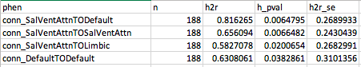
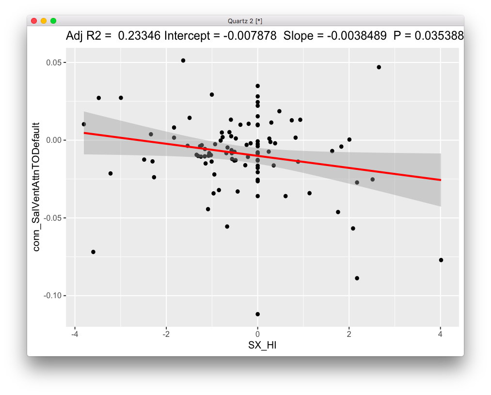
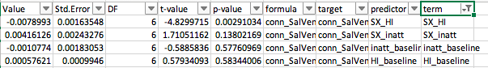
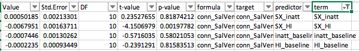
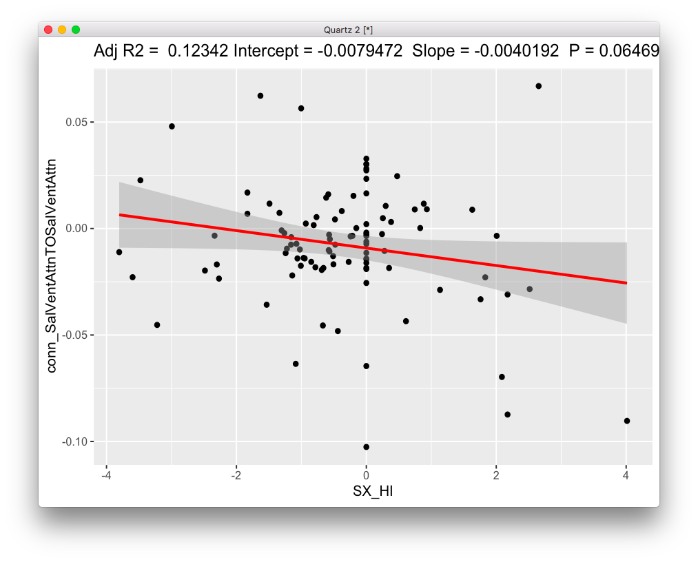
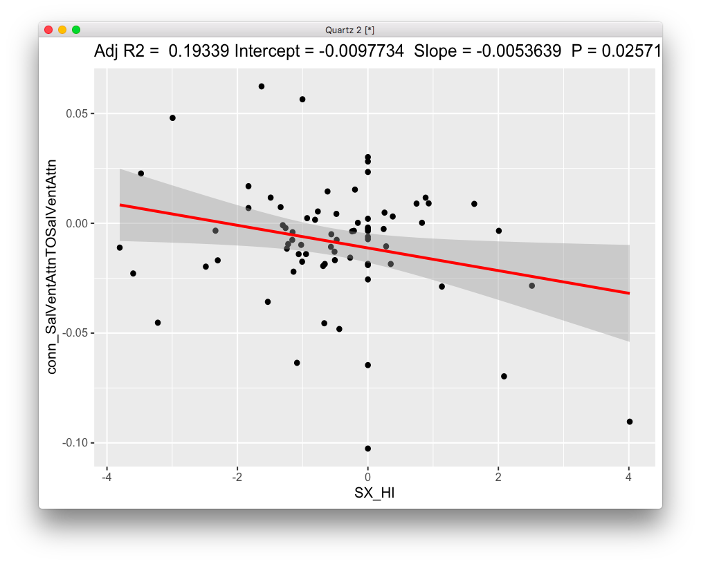

# 2019-09-27 11:45:04

This is a summary of the best results in the heritability of change analysis.

## Overall QC approach

We start with a set of kid scans by only analyzing scans under 18 years old.
Then, we define a set of QC variables, and use two methods to determine whether
a particular scan is an outlier: Local Outlier Factor and Isolation Forests. If
a scan is thought to be an outlier in either approach, it's thrown out. 

The next step uses the actual brain data for each scan. We employ the same two methods
for outlier detection above, and if any of the scans that survived the previous
QC step is thought to be an outlier, in either of the two methods, it's thrown
out.

The threshold used in each method varied by imaging modality. For DTI I used
95th percentile of data based on the anomaly score, and for fMRI I used 90th
percentile. Those thresholds were chosen to maximize number of subjects so that
SOLAR wouldn't spit out unreasonable values, but at the same time clean the data
as much as possible.

That leaves us with a set of (possibly multiple) clean scans for each subject.
On the next step we select the best two scans for each subject such that there
are at least 6 months between scans.

That last step results in two clean scans per subject. The final step is to
compute the slope for each brain metric and symptom count. That's simply
calculated as (y2-y1)/(t2-t1).

### DTI QC

The QC variables used were:

```r
qc_vars = c("meanX.trans", "meanY.trans", "meanZ.trans",
            "meanX.rot", "meanY.rot", "meanZ.rot",
            "goodVolumes")
```

I also removed any scans that mistakenly used the 80-volume sequence. None of
the QC variables were correlated above abs(.65).

The brain variables used for QC and later heritability and association analysis were the 20 JHU
atlas tracts, AD and RD for each (for a total of 40 variables).

So, we started with 954 kiddie scans, and ended up with 780 after the QC steps.
After reducing it to only two scans per subject, we end up with 504 (252 subjects, 110
ADHD, 145 if including ADHD NOS). Through the results, I refer to the ADHD-only
set as DX1 and ADHD+ADHDNOS as DX2.

### rsFMRI QC

The QC variables used were:

```r
qc_vars = c('normCoverage', 'meanDV', 'pctSpikesDV',
            'motionDVCorrInit',
            'motionDVCorrFinal', "pctSpikesRMS", "relMeanRMSMotion")
```

They're a subset of all variables that fmriprep spits out. Several variables
were removed to avoid high correlations, simple normalizations of other
variables, etc. None of the QC variables left were correlated above abs(.65).

The brain variables used for QC and later heritability and association analysis
were median postivie connectivity (as measured by Pearson correlation within and
across the following networks: DAN, VAN, DMN, Cognitive, and Limbic. That totals
15 variables. The actual connectivity is computed using a 100 x 100 ROI
connectivity matrix, and each ROI is assigned to a single network. So, the
median positive connectivity is simply collapsing that 100 x 100 matrix across
columns and rows.

So, we started with 764 kiddie scans, and ended up with 521 after the QC steps.
After reducing it to only two scans per subject, we end up with 376 (188 subjects, 75
ADHD, 100 if including ADHD NOS).

## Results

I used FDR to correct over the SOLAR heritability p-values, and then ran
association to SX change for those significant tracts (q<.05). In SOLAR, I used
the same QC variables as covariates. SOLAR does its own screening of variables
for the final model, using any variables in the final model that correlate at
p<.1 with the phenotype. I used the same variables SOLAR chose as covariates
when running the associations. In other words, the variables used as covariates
change for the differnet phenotypes. I used LME for associations, with FAMID as
random term.

### DTI results


The first 6 survive FDR:


rd_18 is associated with SX_HI in the full dataset, SX_HI (and HI baseline) in
DX1 and SX_HI in DX2.

rd_5 is associated with SX_HI in the full dataset, in DX1 and DX2. Also with
inatt_baseline in DX2.

rd_2 is associated with SX_HI in the full dataset, in DX1 and DX2. 

ad_2 is associated with SX_HI in the full dataset, and DX2 (DX1 misses it by a
tiny bit). 

rd_16 is the first one associated with both SX_HI and SX_inatt in the full
dataset, but it's SX_HI only in DX! and DX2 (SX_inatt is very close in DX2).

ad_10 is associated with SX_HI in the full dataset, and DX2 (DX1 misses it by a
tiny bit).

* rd_18: Uncinate fasciculus R
* rd_5: Cingulum (cingulate gyrus) L
* rd_2: Anterior thalamic radiation R
* ad_2: Anterior thalamic radiation R
* rd_16: Superior longitudinal fasciculus R
* ad_10: Forceps minor

Let's make a few figures then. I'll only make DX2 figures so we can have an idea
of the data. The full dataset gets quite polluted in the 0 SX slope line because
of NVs, and DX1 is not
always significant.


Hum... there's someone with a rate of more than 5 SX per year??? Well, there are
no errors according to the scripts. So, unless the DICA spreadsheet is wrong, he
is a real outlier. He's also in the DX1 dataset. But it doesn't look like that
data point is driving all the results, though.


### rsFMRI results



The first 2 survive at FDR .05. Let's fly with these results then. 

conn_SalVentAttnTODefault
conn_SalVentAttnTOSalVentAttn


Interesting result with SX_HI in dX2... maybe outlier related?


Still there even for DX1...

Let's plot it then.




First picture is DX1, second is DX2 (includes ADHDNOS).

How about the intra-network connectivity?



Also associated with SX_HI in DX1



and DX2. 





Top figure is DX2 (note that it was significant using LME), and bottom is DX1.

