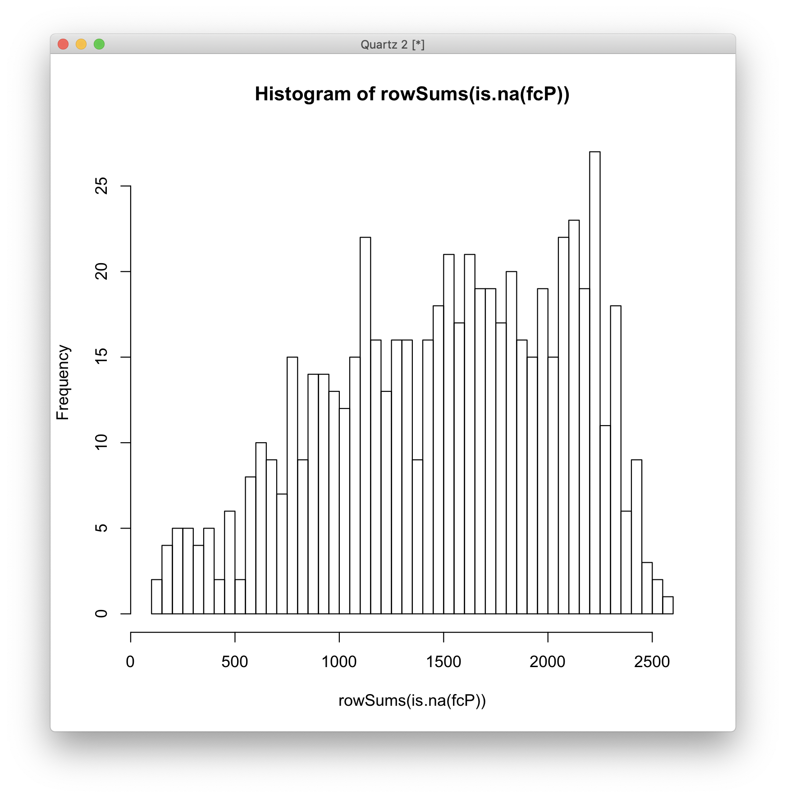

# 2019-10-01 11:00:23

Let's conduct some extra analysis for the heritability paper.

## Slopes and age

Similar to the Jalmar Teeuw Neuroimage 2019 paper, can we show that FC within
networks increases with age whereas FC between networks decreases with age?

```r
data = read.csv('~/data/heritability_change/rsfmri_7by7from100_5nets_OD0.90_posOnly_median.csv')
idx1 = grepl(colnames(data), pattern='^conn')
idx2 = grepl(colnames(data), pattern='_baseline$')
idx3 = grepl(colnames(data), pattern='SomMot')
idx4 = grepl(colnames(data), pattern='Vis')
mynets = colnames(data[idx1 & !idx2 & !idx3 & !idx4])
res = c()
for (net in mynets) {
    tmp = t.test(data[, net])
    res = rbind(res, c(net, tmp$statistic, tmp$p.value, tmp$estimate))
}
colnames(res) = c('net', 'tstat', 'pval', 'mean')
write.csv(res, file='~/data/heritability_change/inter_intra.csv', quote=F, row.names=F)
```

## Cross-modal genetic correlation

Start by merging the data across modalities. Then, it should just be a matter of
creating the right procedure in SOLAR.

```r
fmri = read.csv('~/data/heritability_change/rsfmri_7by7from100_5nets_OD0.90_posOnly_median.csv')
dti = read.csv('~/data/heritability_change/dti_JHUtracts_ADRDonly_OD0.95.csv')
both = merge(fmri, dti, by='ID', all.x=F, all.y=F)
# 156 participants with both datasets... not bad
write.csv(both, file='~/data/heritability_change/both_fmri_dti.csv', row.names=F, quote=F)
```

```bash
module load solar
cd ~/data/heritability_change/
solar dti_rsfmri_slope_correlation both_fmri_dti
cd gencor_both_fmri_dti
grep -r RhoG */polygenic.out > rhog.txt
grep zero rhog.txt | cut -d "/" -f 1 > nets.txt
grep zero rhog.txt | cut -d "=" -f 2 > ps.txt
paste nets.txt ps.txt > cross_modal_rhog_pvals.txt
```

## Degree centrality

First step is to check if Luke processed all our candidates:

```r
demo = read.csv('~/data/heritability_change/resting_demo_07032019.csv')

# keeping it to kids only to make sure everyone has been processed
demo = demo[demo$age_at_scan < 18, ]
cat(sprintf('Down to %d to keep < 18 only\n', nrow(demo)))

# let's grab QC metrics on everyone
# note that this only works for non-censoring pipelines!
mydir = '/Volumes/Shaw/rsfmri_36P/xcpengine_output_fc-36p_despike/'
qc_data = c()
for (s in demo$Mask.ID) {
    subj = sprintf('sub-%04d', s)
    # if it processed all the way
    std_fname = sprintf('%s/%s/norm/%s_std.nii.gz', mydir, subj, subj)
    if (file.exists(std_fname)) {
        subj_data = read.csv(sprintf('%s/%s/%s_quality.csv', mydir, subj, subj))
        qc_data = rbind(qc_data, subj_data)
    }
}
```

So, we start with 764 scans in qc_data.

```r
missing = c()
for (s in qc_data$id0) {
    subj = gsub(x=s, pattern='-', replacement='')
    dc_fname = sprintf('/Volumes/Shaw/Functional_derivatives_RS36_despiked/smoothed/sdc_weighted/sDegreeCentrality_PositiveWeightedSumBrainMap_%s.nii', subj)
    if (!file.exists(dc_fname)) {
        missing = c(missing, subj)
    }
}
```

There are 359 scans missing, so I asked Luke for them. They're likely scans with
bad motion or not longitudinal, but I need them in my analysis to figure out
outliers. Luke's working on it.

Actually, it'd take a long time to calculate it using the software he used. It's
quite finicky. I'd do it myself for one mask id, and then compare to his
results. Basically, for every voxel in the gray mask, calculate Pearson
correlation to everything else, threshold at .25 (positive), compute degree centrality
on the surviving edges. Spit it out to a .nii and then smooth out the results.

# 2019-10-04 16:59:22

It's getting too time consuming to re-code this. Let me see if removing some of
the bad scans we can reduce the list we'd need Luke to run. I'll go with 95th
pctile just to get as broad as a brush we can:

```r
demo = read.csv('~/data/heritability_change/resting_demo_07032019.csv')

# keeping it to kids only to make sure everyone has been processed
demo = demo[demo$age_at_scan < 18, ]
cat(sprintf('Down to %d to keep < 18 only\n', nrow(demo)))

# let's grab QC metrics on everyone
# note that this only works for non-censoring pipelines!
mydir = '/Volumes/Shaw/rsfmri_36P/xcpengine_output_fc-36p_despike/'
qc_data = c()
for (s in demo$Mask.ID) {
    subj = sprintf('sub-%04d', s)
    # if it processed all the way
    std_fname = sprintf('%s/%s/norm/%s_std.nii.gz', mydir, subj, subj)
    if (file.exists(std_fname)) {
        subj_data = read.csv(sprintf('%s/%s/%s_quality.csv', mydir, subj, subj))
        qc_data = rbind(qc_data, subj_data)
    }
}
# have some higly correlated qc variables, so let's remove the worse offenders (anything above abs(.8))
qc_vars = c('normCoverage', 'meanDV', 'pctSpikesDV',
            'motionDVCorrInit',
            'motionDVCorrFinal', "pctSpikesRMS", "relMeanRMSMotion")

qtile=.95
library(solitude)
iso <- isolationForest$new()
iso$fit(qc_data[, qc_vars])
scores_if = as.matrix(iso$scores)[,3]

library(dbscan)
scores_lof = lof(qc_data[, qc_vars], k = round(.5 * nrow(qc_data)))

thresh_lof = quantile(scores_lof, qtile)
thresh_if = quantile(scores_if, qtile)

idx = scores_lof < thresh_lof & scores_if < thresh_if
```

So, we start with 696 scans in qc_data.

```r
missing = c()
for (s in qc_data[idx,]$id0) {
    dc_fname = sprintf('/Volumes/Shaw/Functional_derivatives_RS36_despiked/smoothed/sdc_weighted/sDegreeCentrality_PositiveWeightedSumBrainMap_%s.nii', s)
    if (!file.exists(dc_fname)) {
        missing = c(missing, s)
    }
}
```

Still missing 298... Luke will run them for me. Let's get the code ready to run.
First, extract the values:

```bash
# desktop
outdir=~/data/heritability_change/szdc_weighted
mkdir -p $outdir;
cd /Volumes/Shaw/Functional_derivatives_RS36_despiked/smoothed/szdc_weighted/;
for f in `ls *nii`; do
    fout=`basename $f .nii`.txt;
    if [ ! -e $outdir/$fout ]; then
        3dmaskdump -mask ~/data/heritability_change/xcp-36p_despike/gray_matter_mask.nii \
            -o ${outdir}/${fout} $f;
    fi;
done;
```

I did the above for sdc_weighted and szdc_weighted, even though Luke says he's
using the latter. Then, I created fmri/make_outlier_detection_slopes_DC.R to
deal with that data. Then, when Luke's done processing those scans, the R
function is ready to go.

# 2019-10-07 09:19:21

Let's see how the phenotypic correlation looks across modalities:

```bash
#bw
cd ~/data/heritability_change/
cd gencor_both_fmri_dti
grep -r RhoP */polygenic.out > rhop.txt
sed " s/ is /=/g" rhop.txt | cut -d "=" -f 2 > ests.txt
paste nets.txt ests.txt > cross_modal_rhop_estimates.txt
```

But SOLAR didn't compute the p-values, so I'll have to do that manually in R,
taking into consideration that we have 156 individuals for all pairs.

```r
n=156
df = read.table('~/data/heritability_change/gencor_both_fmri_dti/cross_modal_rhop_estimates.txt')
df$t = df$V2/sqrt((1-df$V2**2)/(n-2))
df$p = 2*pt(-abs(df$t),df=n-1)
colnames(df)[1:2] = c('traits', 'rhoP')
write.csv(df, file='~/data/heritability_change/cross_rhop.csv', row.names=F)
```

## Medication robustness

Next step is to try to break the heritability results by adding the medication
data as covariates. I received FINAL_SUBJECTS_EITHER_MODALITY_wide_form from
Philip, so I just cleaned it up to keep only the columns I needed. He added the
columns: Prop_on_psychostim, Med_class, Med_exclusion, exclude_due_to_comorbid;
in a per-subject basis, so that's all I need in order to merge. So, I created
subj_meds.csv that contain only those. I also removed two subjects that had
questions marks for prop.

So, let's try to break the results in two different ways:

1) remove comorbid==yes, run each column separately, then all 3 together
2) run all 4 columns together, then all 4 separately

So, we'll need two different files for fMRI and DTI:

```r
meds = read.csv('~/data/heritability_change/subj_meds.csv')
fmri = read.csv('~/data/heritability_change/rsfmri_7by7from100_5nets_OD0.90_posOnly_median.csv')
fmri2 = merge(fmri, meds, by.x='ID', by.y='Medical.Record...MRN...Subjects_A', all.x=F, all.y=F)
write.csv(fmri2, file='~/data/heritability_change/rsfmri_7by7from100_5nets_OD0.90_posOnly_median_meds.csv', row.names=F, quote=F)
fmri2 = fmri2[fmri2$exclude_due_to_comorbid=='no',]
write.csv(fmri2, file='~/data/heritability_change/rsfmri_7by7from100_5nets_OD0.90_posOnly_median_meds_nocomorbid.csv', row.names=F, quote=F)
dti = read.csv('~/data/heritability_change/dti_JHUtracts_ADRDonly_OD0.95.csv')
dti2 = merge(dti, meds, by.x='ID', by.y='Medical.Record...MRN...Subjects_A', all.x=F, all.y=F)
write.csv(dti2, file='~/data/heritability_change/dti_JHUtracts_ADRDonly_OD0.95_meds.csv', row.names=F, quote=F)
dti2 = dti2[dti2$exclude_due_to_comorbid=='no',]
write.csv(dti2, file='~/data/heritability_change/dti_JHUtracts_ADRDonly_OD0.95_meds_nocomorbid.csv', row.names=F, quote=F)
```

Actually, gonna have to redo this. SOLAR cannot handle 3 differnet categories...
Philip said to combine 2s and 3s. Will do.

```bash
module load solar
cd ~/data/heritability_change/;
for p in rd_18 rd_5 rd_2 ad_2 rd_16 ad_10; do
    for c in Prop_on_psychostim Med_class Med_exclusion exclude_due_to_comorbid; do
        solar run_phen_var_OD_tracts_meds dti_JHUtracts_ADRDonly_OD0.95_meds $p $c;
     done;
     solar run_phen_var_OD_tracts_meds_comb4 dti_JHUtracts_ADRDonly_OD0.95_meds $p;
done
for p in rd_18 rd_5 rd_2 ad_2 rd_16 ad_10; do
    for c in Prop_on_psychostim Med_class Med_exclusion; do
        solar run_phen_var_OD_tracts_meds dti_JHUtracts_ADRDonly_OD0.95_meds_nocomorbid $p $c;
     done;
     solar run_phen_var_OD_tracts dti_JHUtracts_ADRDonly_OD0.95_meds_nocomorbid ${p}
     solar run_phen_var_OD_tracts_meds_comb3 dti_JHUtracts_ADRDonly_OD0.95_meds_nocomorbid $p;
done

for p in conn_SalVentAttnTODefault conn_SalVentAttnTOSalVentAttn; do
    for c in Prop_on_psychostim Med_class Med_exclusion exclude_due_to_comorbid; do
        solar run_phen_var_OD_xcp_meds rsfmri_7by7from100_5nets_OD0.90_posOnly_median_meds $p $c;
     done;
     solar run_phen_var_OD_xcp_meds_comb4 rsfmri_7by7from100_5nets_OD0.90_posOnly_median_meds $p;
done
for p in conn_SalVentAttnTODefault conn_SalVentAttnTOSalVentAttn; do
    for c in Prop_on_psychostim Med_class Med_exclusion; do
        solar run_phen_var_OD_xcp_meds rsfmri_7by7from100_5nets_OD0.90_posOnly_median_meds_nocomorbid $p $c;
     done;
     solar run_phen_var_OD_xcp rsfmri_7by7from100_5nets_OD0.90_posOnly_median_meds_nocomorbid ${p}
     solar run_phen_var_OD_xcp_meds_comb3 rsfmri_7by7from100_5nets_OD0.90_posOnly_median_meds_nocomorbid $p;
done
```

We should now check if our heritability values from before are still there.
Hand-copied the results to medication_results.xlsx. Note that I had to rename
the categories in Med_Exclusion because they were breaking SOLAR.


## Degree centrality

Now that the voxel .csv files are ready, let's givem them a try:

```bash
cd ~/data/heritability_change/xcp-36p_despike;
phen_file=rsfmri_szdcweighted_OD0.95;
jname=sz95;
swarm_file=swarm.${jname};

rm -f $swarm_file;
for vlist in `ls $PWD/vlistg*txt`; do  # getting full path to files
    echo "bash ~/research_code/run_solar_voxel_parallel.sh $phen_file $vlist" >> $swarm_file;
done;
swarm --gres=lscratch:10 -f $swarm_file --module solar -t 32 -g 10 \
        --logdir=trash_${jname} --job-name ${jname} --time=4:00:00 \
        --merge-output --partition quick,norm
```

And of course I ran it for .9, .95, sz and s.

Note that I'm only covarying sex from the voxels. In fact, I'm
forcing it across all voxels, just because I want to try for an uniform result.
Depending on what clusters I get, I'll try to break it later by adding the
covariates.

# 2019-10-08 10:36:47

```bash
module load afni

cd /lscratch/${SLURM_JOBID}
phen=rsfmri_szdcweighted_OD0.90;
mkdir $phen;
cd $phen;
cp ~/data/tmp/${phen}/*gz .;
for f in `/bin/ls *gz`; do tar -zxf $f; done
cd ..
python ~/research_code/fmri/compile_solar_voxel_results.py \
    /lscratch/${SLURM_JOBID}/ $phen \
    ~/data/heritability_change/xcp-36p_despike/gray_matter_mask.nii;
rm -rf $phen;

cp polygen_results_${phen}.nii ~/data/heritability_change/xcp-36p_despike/

cd ~/data/heritability_change/xcp-36p_despike/
3dclust -1Dformat -nosum -1dindex 0 -1tindex 1 -1thresh 0.99 -orient LPI \
    -savemask ${phen}_NN1_clusters.nii -NN1 40 \
    polygen_results_${phen}.nii;
```

I'm gonna leave some permutations running in the background while I try to break
the results by adding covariates.

```r
start=1
nperms=50
step=5

library(data.table)
set.seed( as.integer((as.double(Sys.time())*1000+Sys.getpid()) %% 2^31) )
dread = fread('~/data/heritability_change/rsfmri_szdcweighted_OD0.90.csv',
              header = T, sep = ',')
d = as.data.frame(dread)  # just so we can index them a bit easier
vcols = c(which(grepl("v",colnames(d))), which(grepl("sex",colnames(d))))
d2 = d
for (p in seq(start, nperms, step)) {
    d2[, vcols] = d[sample(nrow(d)), vcols]
    fname = sprintf('~/data/heritability_change/rsfmri_szdcweighted_OD0.90_p%03d.csv', p)
    print(fname)
    fwrite(d2, file=fname, row.names=F, quote=F)
}
```

So, there are some clusters that would likely survive after permutations, but
Philip and I agreed that the intra and inter network analysis makses more sense
for heritability, so we'll stick with those. I can finish this analysis later if
someone asks about it. The next steps would be to check if the covariates we
used for the intra-inter analysis break the average result in the clusters, and
run permutations.

# 2019-10-08 11:20:25

Philip asked for baseline heritability for the tracts and fmri metrics.

```bash
# interactive
phen=dti_JHUtracts_ADRDonly_OD0.95
cd ~/data/heritability_change
for m in ad rd; do
    for t in {1..20}; do
        solar run_phen_var_OD_tracts $phen ${m}_${t};
        solar run_phen_var_OD_tracts $phen ${m}_${t}_baseline;
    done;
done
mv $phen ~/data/tmp/${phen}_with_base
cd ~/data/tmp/${phen}_with_base
for p in `/bin/ls`; do cp $p/polygenic.out ${p}_polygenic.out; done
python ~/research_code/compile_solar_multivar_results.py ${phen}_with_base
```

```bash
# interactive
phen=rsfmri_7by7from100_5nets_OD0.90_posOnly_median
cd ~/data/heritability_change
for t in "conn_DorsAttnTODorsAttn" \
                "conn_DorsAttnTOSalVentAttn" "conn_DorsAttnTOLimbic" "conn_DorsAttnTOCont" \
                "conn_DorsAttnTODefault" "conn_SalVentAttnTOSalVentAttn" \
                "conn_SalVentAttnTOLimbic" "conn_SalVentAttnTOCont" \
                "conn_SalVentAttnTODefault" "conn_LimbicTOLimbic" "conn_LimbicTOCont" \
                "conn_LimbicTODefault" "conn_ContTOCont" "conn_ContTODefault" \
                "conn_DefaultTODefault"; do
     solar run_phen_var_OD_xcp $phen ${t};
     solar run_phen_var_OD_xcp $phen ${t}_baseline;
done;
mv $phen ~/data/tmp/${phen}_with_base
cd ~/data/tmp/${phen}_with_base
for p in `/bin/ls`; do cp $p/polygenic.out ${p}_polygenic.out; done
python ~/research_code/compile_solar_multivar_results.py ${phen}_with_base
```

Then, I'll compile rhoP and rhoG within modality in the ame spreadsheet:

```bash
#bw
phen=dti_JHUtracts_ADRDonly_OD0.95
cd ~/data/tmp/gencor_$phen
grep -r RhoP */polygenic.out > rhop.txt
sed "s/ is /=/g" rhop.txt | cut -d "=" -f 2 > rhop_ests.txt
grep -r "RhoG is " */polygenic.out > rhog.txt
sed "s/ is /=/g" rhog.txt | cut -d "=" -f 2 > rhog_ests.txt
grep -r "RhoG different from zero  p = " */polygenic.out > rhog.txt
sed "s/= /=/g" rhog.txt | cut -d "=" -f 2 > rhog_pvals.txt
cut -d"/" -f 1 rhog.txt > phen.txt
paste phen.txt rhog_ests.txt rhog_pvals.txt rhop_ests.txt > rhog_rhop_${phen}.txt
```

But SOLAR didn't compute the p-values, so I'll have to do that manually in R,
taking into consideration the number of individuals we have in each modality:

```r
n=188
phen='rsfmri_7by7from100_5nets_OD0.90_posOnly_median'

n=252
phen='dti_JHUtracts_ADRDonly_OD0.95'

df = read.table(sprintf('~/data/tmp/gencor_%s/rhog_rhop_%s.txt', phen, phen))
colnames(df) = c('traits', 'rhoG', 'rhoG_pval', 'rhoP')
df$t = df$rhoP/sqrt((1-df$rhoP**2)/(n-2))
df$rhoP_pval = 2*pt(-abs(df$t),df=n-1)

write.csv(df, file=sprintf('~/data/heritability_change/rhos_%s.csv', phen), row.names=F)
```

# 2019-10-09 11:59:54

Philip also asked for the association analysis for all possible slopes. So,
let's run that:

```r
library(nlme)
data = read.csv('~/data/heritability_change/dti_JHUtracts_ADRDonly_OD0.95.csv')
tmp = read.csv('~/data/heritability_change/pedigree.csv')
data = merge(data, tmp[, c('ID', 'FAMID')], by='ID', all.x=T, all.y=F)

# MANUALLY grabbing significant covariates form SOLAR results
formulas = c()
formulas = rbind(formulas, c('ad_10', '%s ~ %s + meanX.rot + goodVolumes'))
formulas = rbind(formulas, c('ad_11', '%s ~ %s + goodVolumes'))
formulas = rbind(formulas, c('ad_12', '%s ~ %s + meanX.rot + goodVolumes'))
formulas = rbind(formulas, c('ad_13', '%s ~ %s + meanX.rot + goodVolumes'))
formulas = rbind(formulas, c('ad_14', '%s ~ %s + meanX.rot'))
formulas = rbind(formulas, c('ad_15', '%s ~ %s'))
formulas = rbind(formulas, c('ad_16', '%s ~ %s'))
formulas = rbind(formulas, c('ad_17', '%s ~ %s + meanX.rot + goodVolumes'))
formulas = rbind(formulas, c('ad_18', '%s ~ %s + goodVolumes'))
formulas = rbind(formulas, c('ad_19', '%s ~ %s + meanX.trans + meanX.rot + goodVolumes'))
formulas = rbind(formulas, c('ad_1', '%s ~ %s + meanX.rot + goodVolumes'))
formulas = rbind(formulas, c('ad_20', '%s ~ %s + meanX.trans + goodVolumes'))
formulas = rbind(formulas, c('ad_2', '%s ~ %s + meanX.rot + goodVolumes'))
formulas = rbind(formulas, c('ad_3', '%s ~ %s + goodVolumes'))
formulas = rbind(formulas, c('ad_4', '%s ~ %s + meanY.trans + goodVolumes'))
formulas = rbind(formulas, c('ad_5', '%s ~ %s'))
formulas = rbind(formulas, c('ad_6', '%s ~ %s + goodVolumes'))
formulas = rbind(formulas, c('ad_7', '%s ~ %s + meanX.rot + goodVolumes'))
formulas = rbind(formulas, c('ad_8', '%s ~ %s + meanX.trans'))
formulas = rbind(formulas, c('ad_9', '%s ~ %s'))
formulas = rbind(formulas, c('rd_10', '%s ~ %s + meanZ.trans'))
formulas = rbind(formulas, c('rd_11', '%s ~ %s + meanY.trans'))
formulas = rbind(formulas, c('rd_12', '%s ~ %s + meanY.trans'))
formulas = rbind(formulas, c('rd_13', '%s ~ %s + meanX.rot'))
formulas = rbind(formulas, c('rd_14', '%s ~ %s + meanX.rot'))
formulas = rbind(formulas, c('rd_15', '%s ~ %s'))
formulas = rbind(formulas, c('rd_16', '%s ~ %s'))
formulas = rbind(formulas, c('rd_17', '%s ~ %s + meanZ.rot'))
formulas = rbind(formulas, c('rd_18', '%s ~ %s + meanX.rot + goodVolumes'))
formulas = rbind(formulas, c('rd_19', '%s ~ %s + meanX.trans + meanY.rot'))
formulas = rbind(formulas, c('rd_1', '%s ~ %s'))
formulas = rbind(formulas, c('rd_20', '%s ~ %s'))
formulas = rbind(formulas, c('rd_2', '%s ~ %s + meanY.trans + meanY.rot + goodVolumes'))
formulas = rbind(formulas, c('rd_3', '%s ~ %s'))
formulas = rbind(formulas, c('rd_4', '%s ~ %s + meanY.trans + meanY.rot + goodVolumes'))
formulas = rbind(formulas, c('rd_5', '%s ~ %s + meanY.trans + meanZ.trans + meanY.rot'))
formulas = rbind(formulas, c('rd_6', '%s ~ %s + meanY.trans'))
formulas = rbind(formulas, c('rd_7', '%s ~ %s'))
formulas = rbind(formulas, c('rd_8', '%s ~ %s + meanX.trans + meanX.rot'))
formulas = rbind(formulas, c('rd_9', '%s ~ %s + meanX.trans + meanY.rot'))

out_fname = '~/data/heritability_change/assoc_all_dti_JHUtracts.csv'
hold=NULL
for (r in 1:nrow(formulas)) {
   i = formulas[r, 1]
   fm_root = formulas[r, 2]
   predictors = c('SX_inatt', 'SX_HI', 'inatt_baseline', 'HI_baseline', 'DX', 'DX2')
   for (j in predictors) {
       fm_str = sprintf(fm_root, i, j)
       model1<-try(lme(as.formula(fm_str), data, ~1|FAMID, na.action=na.omit))
       if (length(model1) > 1) {
           temp<-summary(model1)$tTable
           a<-as.data.frame(temp)
           a$formula<-fm_str
           a$target = i
           a$predictor = j
           a$term = rownames(temp)
           hold=rbind(hold,a)
       } else {
           hold=rbind(hold, NA)
       }
   }
}
write.csv(hold, out_fname, row.names=F)

data2 = data[data$DX=='ADHD', ]
out_fname = gsub(x=out_fname, pattern='.csv', '_dx1.csv')
predictors = c('SX_inatt', 'SX_HI', 'inatt_baseline', 'HI_baseline')
hold=NULL
for (r in 1:nrow(formulas)) {
   i = formulas[r, 1]
   fm_root = formulas[r, 2]
   for (j in predictors) {
       fm_str = sprintf(fm_root, i, j)
       model1<-try(lme(as.formula(fm_str), data2, ~1|FAMID, na.action=na.omit))
       if (length(model1) > 1) {
           temp<-summary(model1)$tTable
           a<-as.data.frame(temp)
           a$formula<-fm_str
           a$target = i
           a$predictor = j
           a$term = rownames(temp)
           hold=rbind(hold,a)
       } else {
           hold=rbind(hold, NA)
       }
   }
}
write.csv(hold, out_fname, row.names=F)

data2 = data[data$DX2=='ADHD', ]
out_fname = gsub(x=out_fname, pattern='dx1', 'dx2')
predictors = c('SX_inatt', 'SX_HI', 'inatt_baseline', 'HI_baseline')
hold=NULL
for (r in 1:nrow(formulas)) {
   i = formulas[r, 1]
   fm_root = formulas[r, 2]
   for (j in predictors) {
       fm_str = sprintf(fm_root, i, j)
       model1<-try(lme(as.formula(fm_str), data2, ~1|FAMID, na.action=na.omit))
       if (length(model1) > 1) {
           temp<-summary(model1)$tTable
           a<-as.data.frame(temp)
           a$formula<-fm_str
           a$target = i
           a$predictor = j
           a$term = rownames(temp)
           hold=rbind(hold,a)
       } else {
           hold=rbind(hold, NA)
       }
   }
}
write.csv(hold, out_fname, row.names=F)
```

And similarly, we work on fMRI:

```r
library(nlme)
data = read.csv('~/data/heritability_change/rsfmri_7by7from100_5nets_OD0.90_posOnly_median.csv')
tmp = read.csv('~/data/heritability_change/pedigree.csv')
data = merge(data, tmp[, c('ID', 'FAMID')], by='ID', all.x=T, all.y=F)

# MANUALLY grabbing significant covariates form SOLAR results
formulas = c()
formulas = rbind(formulas, c('conn_ContTOCont', '%s ~ %s + normCoverage + meanDV + pctSpikesDV'))
formulas = rbind(formulas, c('conn_ContTODefault', '%s ~ %s + normCoverage + pctSpikesDV + pctSpikesRMS'))
formulas = rbind(formulas, c('conn_DefaultTODefault', '%s ~ %s + normCoverage + pctSpikesDV + motionDVCorrFinal + pctSpikesRMS'))
formulas = rbind(formulas, c('conn_DorsAttnTOCont', '%s ~ %s + normCoverage + pctSpikesDV + pctSpikesRMS'))
formulas = rbind(formulas, c('conn_DorsAttnTODefault', '%s ~ %s + normCoverage + pctSpikesDV + pctSpikesRMS'))
formulas = rbind(formulas, c('conn_DorsAttnTODorsAttn', '%s ~ %s + normCoverage + pctSpikesDV'))
formulas = rbind(formulas, c('conn_DorsAttnTOLimbic', '%s ~ %s + normCoverage + pctSpikesDV'))
formulas = rbind(formulas, c('conn_DorsAttnTOSalVentAttn', '%s ~ %s + normCoverage + pctSpikesDV + pctSpikesRMS'))
formulas = rbind(formulas, c('conn_LimbicTOCont', '%s ~ %s + normCoverage + pctSpikesDV'))
formulas = rbind(formulas, c('conn_LimbicTODefault', '%s ~ %s + normCoverage + pctSpikesDV + motionDVCorrFinal + pctSpikesRMS'))
formulas = rbind(formulas, c('conn_LimbicTOLimbic', '%s ~ %s + normCoverage + pctSpikesDV'))
formulas = rbind(formulas, c('conn_SalVentAttnTOCont', '%s ~ %s + sex + normCoverage + pctSpikesDV + pctSpikesRMS'))
formulas = rbind(formulas, c('conn_SalVentAttnTODefault', '%s ~ %s + normCoverage + pctSpikesDV + motionDVCorrFinal +  pctSpikesRMS'))
formulas = rbind(formulas, c('conn_SalVentAttnTOLimbic', '%s ~ %s + normCoverage + pctSpikesDV + pctSpikesRMS'))
formulas = rbind(formulas, c('conn_SalVentAttnTOSalVentAttn', '%s ~ %s + pctSpikesDV + pctSpikesRMS'))

out_fname = '~/data/heritability_change/assoc_al_rsfmri_7x7_5nets.csv'
predictors = c('SX_inatt', 'SX_HI', 'inatt_baseline', 'HI_baseline', 'DX', 'DX2')
hold=NULL
for (r in 1:nrow(formulas)) {
   i = formulas[r, 1]
   fm_root = formulas[r, 2]
   for (j in predictors) {
       fm_str = sprintf(fm_root, i, j)
       model1<-try(lme(as.formula(fm_str), data, ~1|FAMID, na.action=na.omit))
       if (length(model1) > 1) {
           temp<-summary(model1)$tTable
           a<-as.data.frame(temp)
           a$formula<-fm_str
           a$target = i
           a$predictor = j
           a$term = rownames(temp)
           hold=rbind(hold,a)
       } else {
           hold=rbind(hold, NA)
       }
   }
}
write.csv(hold, out_fname, row.names=F)

data2 = data[data$DX=='ADHD', ]
out_fname = gsub(x=out_fname, pattern='.csv', '_dx1.csv')
predictors = c('SX_inatt', 'SX_HI', 'inatt_baseline', 'HI_baseline')
hold=NULL
for (r in 1:nrow(formulas)) {
   i = formulas[r, 1]
   fm_root = formulas[r, 2]
   for (j in predictors) {
       fm_str = sprintf(fm_root, i, j)
       model1<-try(lme(as.formula(fm_str), data2, ~1|FAMID, na.action=na.omit))
       if (length(model1) > 1) {
           temp<-summary(model1)$tTable
           a<-as.data.frame(temp)
           a$formula<-fm_str
           a$target = i
           a$predictor = j
           a$term = rownames(temp)
           hold=rbind(hold,a)
       } else {
           hold=rbind(hold, NA)
       }
   }
}
write.csv(hold, out_fname, row.names=F)

data2 = data[data$DX2=='ADHD', ]
out_fname = gsub(x=out_fname, pattern='dx1', 'dx2')
predictors = c('SX_inatt', 'SX_HI', 'inatt_baseline', 'HI_baseline')
hold=NULL
for (r in 1:nrow(formulas)) {
   i = formulas[r, 1]
   fm_root = formulas[r, 2]
   for (j in predictors) {
       fm_str = sprintf(fm_root, i, j)
       model1<-try(lme(as.formula(fm_str), data2, ~1|FAMID, na.action=na.omit))
       if (length(model1) > 1) {
           temp<-summary(model1)$tTable
           a<-as.data.frame(temp)
           a$formula<-fm_str
           a$target = i
           a$predictor = j
           a$term = rownames(temp)
           hold=rbind(hold,a)
       } else {
           hold=rbind(hold, NA)
       }
   }
}
write.csv(hold, out_fname, row.names=F)
```

## Proportion of good connections

Let's also check that that are no subjects that have an outlier number of
positive connections, which could be messing up the results.

```r
qtile = .9

demo = read.csv('~/data/heritability_change/resting_demo_07032019.csv')
cat(sprintf('Starting from %d scans\n', nrow(demo)))

# keeping it to kids only to make sure everyone has been processed
demo = demo[demo$age_at_scan < 18, ]
cat(sprintf('Down to %d to keep < 18 only\n', nrow(demo)))

# let's grab QC metrics on everyone
# note that this only works for non-censoring pipelines!
mydir = '/Volumes/Shaw/rsfmri_36P/xcpengine_output_fc-36p_despike/'
qc_data = c()
for (s in demo$Mask.ID) {
    subj = sprintf('sub-%04d', s)
    # if it processed all the way
    std_fname = sprintf('%s/%s/norm/%s_std.nii.gz', mydir, subj, subj)
    if (file.exists(std_fname)) {
        subj_data = read.csv(sprintf('%s/%s/%s_quality.csv', mydir, subj, subj))
        qc_data = rbind(qc_data, subj_data)
    }
}

# have some higly correlated qc variables, so let's remove the worse offenders (anything above abs(.8))
qc_vars = c('normCoverage', 'meanDV', 'pctSpikesDV',
            'motionDVCorrInit',
            'motionDVCorrFinal', "pctSpikesRMS", "relMeanRMSMotion")

library(solitude)
iso <- isolationForest$new()
iso$fit(qc_data[, qc_vars])
scores_if = as.matrix(iso$scores)[,3]

library(dbscan)
# here I set the number of neighbors to a percentage of the total data
scores_lof = lof(qc_data[, qc_vars], k = round(.5 * nrow(qc_data)))

thresh_lof = quantile(scores_lof, qtile)
thresh_if = quantile(scores_if, qtile)

idx = scores_lof < thresh_lof & scores_if < thresh_if
nrois = 100

fname = sprintf('~/research_code/fmri/Schaefer2018_%dParcels_7Networks_order.txt',
                nrois)
nets = read.table(fname)
all_net_names = sapply(as.character(unique(nets[,2])),
                       function(y) strsplit(x=y, split='_')[[1]][3])
net_names = unique(all_net_names)
nnets = length(net_names)

# figure out which connection goes to which network
cat('Creating connection map...\n')
nverts = nrow(nets)
cnt = 1
conn_map = c()
for (i in 1:(nverts-1)) {
    for (j in (i+1):nverts) {
        conn = sprintf('conn%d', cnt)
        conn_map = rbind(conn_map, c(conn, all_net_names[i], all_net_names[j]))
        cnt = cnt + 1
    }
}

qc_data_clean = qc_data[idx, ]
fc = c()
for (s in qc_data_clean$id0) {
    fname = sprintf('%s/%s/fcon/schaefer%d/%s_schaefer%d_network.txt',
                                mydir, s, nrois, s, nrois)
    subj_data = read.table(fname)[, 1]
    fc = cbind(fc, subj_data)
}
fc = t(fc)
var_names = sapply(1:ncol(fc), function(x) sprintf('conn%d', x))
colnames(fc) = var_names
fcP = fc
fcP[fc<0] = NA
hist(rowSums(is.na(fcP)), breaks=50)
```



Numbers don't look too worrisome. Basically, horizontal axis is out of 4950
connections. So, the plot looks somewhat Gaussian, and I wouldn't expect that
it's unevenly distributed, or even correlated, with any of the metrics we're
studying.

# 2019-10-11 09:17:05

Philip asked me to see if there is any bivariate heritability between the change
in tracts/rsfMRI and change in symptoms (particularly HI). So, let's create
special solar function for those.

```bash
# interactive
phen=dti_JHUtracts_ADRDonly_OD0.95
cd ~/data/heritability_change
for m in ad rd; do
    for t in {1..20}; do
        solar dti_tracts_SX_slope_correlation $phen ${m}_${t} SX_inatt;
        solar dti_tracts_SX_slope_correlation $phen ${m}_${t} SX_HI;
    done;
done
```

```bash
# interactive
phen=rsfmri_7by7from100_5nets_OD0.90_posOnly_median
cd ~/data/heritability_change
for t in "conn_DorsAttnTODorsAttn" \
                "conn_DorsAttnTOSalVentAttn" "conn_DorsAttnTOLimbic" "conn_DorsAttnTOCont" \
                "conn_DorsAttnTODefault" "conn_SalVentAttnTOSalVentAttn" \
                "conn_SalVentAttnTOLimbic" "conn_SalVentAttnTOCont" \
                "conn_SalVentAttnTODefault" "conn_LimbicTOLimbic" "conn_LimbicTOCont" \
                "conn_LimbicTODefault" "conn_ContTOCont" "conn_ContTODefault" \
                "conn_DefaultTODefault"; do
     solar rsfmri_xcp_SX_slope_correlation $phen ${t} SX_inatt;
     solar rsfmri_xcp_SX_slope_correlation $phen ${t} SX_HI;
done;
```

Then, I'll compile rhoG within modality in the same spreadsheet:

```bash
#bw
phen=dti_JHUtracts_ADRDonly_OD0.95
cd ~/data/heritability_change/gencorSX_$phen
grep -r "RhoG is " */polygenic.out > rhog.txt
sed "s/ is /=/g" rhog.txt | cut -d "=" -f 2 > rhog_ests.txt
grep -r "RhoG different from zero  p = " */polygenic.out > rhog.txt
sed "s/= /=/g" rhog.txt | cut -d "=" -f 2 > rhog_pvals.txt
cut -d"/" -f 1 rhog.txt > phen.txt
paste phen.txt rhog_ests.txt rhog_pvals.txt > rhog_SX_${phen}.txt
```

Some results looked quite extreme, so let me see if keeping it to DX2 only it
will look a bit nicer:

```r
phen_fname = '~/data/heritability_change/rsfmri_7by7from100_5nets_OD0.90_posOnly_median.csv'
data = read.csv(phen_fname)
data2 = data[data$DX2=='ADHD', ]
out_fname = gsub(x=phen_fname, pattern='.csv', '_dx2.csv')
write.csv(data2, out_fname, row.names=F, na='', quote=F)

phen_fname = '~/data/heritability_change/dti_JHUtracts_ADRDonly_OD0.95.csv'
data = read.csv(phen_fname)
data2 = data[data$DX2=='ADHD', ]
out_fname = gsub(x=phen_fname, pattern='.csv', '_dx2.csv')
write.csv(data2, out_fname, row.names=F, na='', quote=F)
```

And re-run the stuff above with these new phenotype files.

# 2019-10-28 14:38:27

Philip asked to run the results with baseline age as a covariate, to check for
developmental effects. The issue is that I didn't save age of baseline in the
phenotype file. But I do have it in the _twoTimePoints.csv files, so let's merge
them:

```r
df = read.csv('dti_JHUtracts_ADRDonly_OD0.95_twoTimePoints_noOtherDX.csv')
mrns=c();
age_baseline = c();
for (i in seq(1,nrow(df),2)) { 
    mrns=c(mrns, df$Medical.Record...MRN...Subjects[i]);
    age_baseline=c(age_baseline, min(df[i:(i+1),]$age_at_scan...Scan...Subjects))
}
ages = data.frame(ID=mrns, base_age=age_baseline)
data = read.csv('dti_JHUtracts_ADRDonly_OD0.95.csv')
m = merge(data, ages, by='ID')
write.csv(m, 'dti_JHUtracts_ADRDonly_OD0.95_withBaseAge.csv', row.names=F, na='', quote=F)

df = read.csv('rsfmri_7by7from100_5nets_OD0.90_posOnly_median_twoTimePoints_noOtherDX.csv')
mrns=c();
age_baseline = c();
for (i in seq(1,nrow(df),2)) { 
    mrns=c(mrns, df$Medical.Record...MRN[i]);
    age_baseline=c(age_baseline, min(df[i:(i+1),]$age_at_scan))
}
ages = data.frame(ID=mrns, base_age=age_baseline)
data = read.csv('rsfmri_7by7from100_5nets_OD0.90_posOnly_median.csv')
m = merge(data, ages, by='ID')
write.csv(m, 'rsfmri_7by7from100_5nets_OD0.90_posOnly_median_withBaseAge.csv', row.names=F, na='', quote=F)
```

```bash
# interactive
phen=dti_JHUtracts_ADRDonly_OD0.95_withBaseAge
cd ~/data/heritability_change
for m in ad rd; do
    for t in {1..20}; do
        solar run_phen_var_OD_baseAgeCov_tracts $phen ${m}_${t};
    done;
done
mv ${phen} ~/data/tmp/
cd ~/data/tmp/${phen}
for p in `/bin/ls`; do cp $p/polygenic.out ${p}_polygenic.out; done
python ~/research_code/compile_solar_multivar_results.py ${phen}
```

```bash
# interactive
phen=rsfmri_7by7from100_5nets_OD0.90_posOnly_median_withBaseAge
cd ~/data/heritability_change
for t in "conn_DorsAttnTODorsAttn" \
                "conn_DorsAttnTOSalVentAttn" "conn_DorsAttnTOLimbic" "conn_DorsAttnTOCont" \
                "conn_DorsAttnTODefault" "conn_SalVentAttnTOSalVentAttn" \
                "conn_SalVentAttnTOLimbic" "conn_SalVentAttnTOCont" \
                "conn_SalVentAttnTODefault" "conn_LimbicTOLimbic" "conn_LimbicTOCont" \
                "conn_LimbicTODefault" "conn_ContTOCont" "conn_ContTODefault" \
                "conn_DefaultTODefault"; do
     solar run_phen_var_OD_baseAgeCov_xcp $phen ${t};
done;
mv ${phen} ~/data/tmp/
cd ~/data/tmp/${phen}
for p in `/bin/ls`; do cp $p/polygenic.out ${p}_polygenic.out; done
python ~/research_code/compile_solar_multivar_results.py ${phen}
```

How about the regressions? I'll just repeat the results from above, and hardcode
the age in the formulas:

```r
library(nlme)
data = read.csv('~/data/heritability_change/dti_JHUtracts_ADRDonly_OD0.95_withBaseAge.csv')
tmp = read.csv('~/data/heritability_change/pedigree.csv')
data = merge(data, tmp[, c('ID', 'FAMID')], by='ID', all.x=T, all.y=F)

# MANUALLY grabbing significant covariates form SOLAR results
formulas = c()
formulas = rbind(formulas, c('ad_10', '%s ~ %s + base_age + meanX.rot + goodVolumes'))
formulas = rbind(formulas, c('ad_11', '%s ~ %s + base_age + goodVolumes'))
formulas = rbind(formulas, c('ad_12', '%s ~ %s + base_age + meanX.rot + goodVolumes'))
formulas = rbind(formulas, c('ad_13', '%s ~ %s + base_age + meanX.rot + goodVolumes'))
formulas = rbind(formulas, c('ad_14', '%s ~ %s + base_age + meanX.rot'))
formulas = rbind(formulas, c('ad_15', '%s ~ %s + base_age'))
formulas = rbind(formulas, c('ad_16', '%s ~ %s + base_age'))
formulas = rbind(formulas, c('ad_17', '%s ~ %s + base_age + meanX.rot + goodVolumes'))
formulas = rbind(formulas, c('ad_18', '%s ~ %s + base_age + goodVolumes'))
formulas = rbind(formulas, c('ad_19', '%s ~ %s + base_age + meanX.trans + meanX.rot + goodVolumes'))
formulas = rbind(formulas, c('ad_1', '%s ~ %s + base_age + meanX.rot + goodVolumes'))
formulas = rbind(formulas, c('ad_20', '%s ~ %s + base_age + meanX.trans + goodVolumes'))
formulas = rbind(formulas, c('ad_2', '%s ~ %s + base_age + meanX.rot + goodVolumes'))
formulas = rbind(formulas, c('ad_3', '%s ~ %s + base_age + goodVolumes'))
formulas = rbind(formulas, c('ad_4', '%s ~ %s + base_age + meanY.trans + goodVolumes'))
formulas = rbind(formulas, c('ad_5', '%s ~ %s + base_age'))
formulas = rbind(formulas, c('ad_6', '%s ~ %s + base_age + goodVolumes'))
formulas = rbind(formulas, c('ad_7', '%s ~ %s + base_age + meanX.rot + goodVolumes'))
formulas = rbind(formulas, c('ad_8', '%s ~ %s + base_age + meanX.trans'))
formulas = rbind(formulas, c('ad_9', '%s ~ %s + base_age'))
formulas = rbind(formulas, c('rd_10', '%s ~ %s + base_age + meanZ.trans'))
formulas = rbind(formulas, c('rd_11', '%s ~ %s + base_age + meanY.trans'))
formulas = rbind(formulas, c('rd_12', '%s ~ %s + base_age + meanY.trans'))
formulas = rbind(formulas, c('rd_13', '%s ~ %s + base_age + meanX.rot'))
formulas = rbind(formulas, c('rd_14', '%s ~ %s + base_age + meanX.rot'))
formulas = rbind(formulas, c('rd_15', '%s ~ %s + base_age'))
formulas = rbind(formulas, c('rd_16', '%s ~ %s + base_age'))
formulas = rbind(formulas, c('rd_17', '%s ~ %s + base_age + meanZ.rot'))
formulas = rbind(formulas, c('rd_18', '%s ~ %s + base_age + meanX.rot + goodVolumes'))
formulas = rbind(formulas, c('rd_19', '%s ~ %s + base_age + meanX.trans + meanY.rot'))
formulas = rbind(formulas, c('rd_1', '%s ~ %s + base_age'))
formulas = rbind(formulas, c('rd_20', '%s ~ %s + base_age'))
formulas = rbind(formulas, c('rd_2', '%s ~ %s + base_age + meanY.trans + meanY.rot + goodVolumes'))
formulas = rbind(formulas, c('rd_3', '%s ~ %s + base_age'))
formulas = rbind(formulas, c('rd_4', '%s ~ %s + base_age + meanY.trans + meanY.rot + goodVolumes'))
formulas = rbind(formulas, c('rd_5', '%s ~ %s + base_age + meanY.trans + meanZ.trans + meanY.rot'))
formulas = rbind(formulas, c('rd_6', '%s ~ %s + base_age + meanY.trans'))
formulas = rbind(formulas, c('rd_7', '%s ~ %s + base_age'))
formulas = rbind(formulas, c('rd_8', '%s ~ %s + base_age + meanX.trans + meanX.rot'))
formulas = rbind(formulas, c('rd_9', '%s ~ %s + base_age + meanX.trans + meanY.rot'))

out_fname = '~/data/heritability_change/assoc_all_baseAgeCov_dti_JHUtracts.csv'
hold=NULL
for (r in 1:nrow(formulas)) {
   i = formulas[r, 1]
   fm_root = formulas[r, 2]
   predictors = c('SX_inatt', 'SX_HI', 'inatt_baseline', 'HI_baseline', 'DX', 'DX2')
   for (j in predictors) {
       fm_str = sprintf(fm_root, i, j)
       model1<-try(lme(as.formula(fm_str), data, ~1|FAMID, na.action=na.omit))
       if (length(model1) > 1) {
           temp<-summary(model1)$tTable
           a<-as.data.frame(temp)
           a$formula<-fm_str
           a$target = i
           a$predictor = j
           a$term = rownames(temp)
           hold=rbind(hold,a)
       } else {
           hold=rbind(hold, NA)
       }
   }
}
write.csv(hold, out_fname, row.names=F)

data2 = data[data$DX=='ADHD', ]
out_fname = gsub(x=out_fname, pattern='.csv', '_dx1.csv')
predictors = c('SX_inatt', 'SX_HI', 'inatt_baseline', 'HI_baseline')
hold=NULL
for (r in 1:nrow(formulas)) {
   i = formulas[r, 1]
   fm_root = formulas[r, 2]
   for (j in predictors) {
       fm_str = sprintf(fm_root, i, j)
       model1<-try(lme(as.formula(fm_str), data2, ~1|FAMID, na.action=na.omit))
       if (length(model1) > 1) {
           temp<-summary(model1)$tTable
           a<-as.data.frame(temp)
           a$formula<-fm_str
           a$target = i
           a$predictor = j
           a$term = rownames(temp)
           hold=rbind(hold,a)
       } else {
           hold=rbind(hold, NA)
       }
   }
}
write.csv(hold, out_fname, row.names=F)

data2 = data[data$DX2=='ADHD', ]
out_fname = gsub(x=out_fname, pattern='dx1', 'dx2')
predictors = c('SX_inatt', 'SX_HI', 'inatt_baseline', 'HI_baseline')
hold=NULL
for (r in 1:nrow(formulas)) {
   i = formulas[r, 1]
   fm_root = formulas[r, 2]
   for (j in predictors) {
       fm_str = sprintf(fm_root, i, j)
       model1<-try(lme(as.formula(fm_str), data2, ~1|FAMID, na.action=na.omit))
       if (length(model1) > 1) {
           temp<-summary(model1)$tTable
           a<-as.data.frame(temp)
           a$formula<-fm_str
           a$target = i
           a$predictor = j
           a$term = rownames(temp)
           hold=rbind(hold,a)
       } else {
           hold=rbind(hold, NA)
       }
   }
}
write.csv(hold, out_fname, row.names=F)
```

And similarly, we work on fMRI:

```r
library(nlme)
data = read.csv('~/data/heritability_change/rsfmri_7by7from100_5nets_OD0.90_posOnly_median_withBaseAge.csv')
tmp = read.csv('~/data/heritability_change/pedigree.csv')
data = merge(data, tmp[, c('ID', 'FAMID')], by='ID', all.x=T, all.y=F)

# MANUALLY grabbing significant covariates form SOLAR results
formulas = c()
formulas = rbind(formulas, c('conn_ContTOCont', '%s ~ %s + base_age + normCoverage + meanDV + pctSpikesDV'))
formulas = rbind(formulas, c('conn_ContTODefault', '%s ~ %s + base_age + normCoverage + pctSpikesDV + pctSpikesRMS'))
formulas = rbind(formulas, c('conn_DefaultTODefault', '%s ~ %s + base_age + normCoverage + pctSpikesDV + motionDVCorrFinal + pctSpikesRMS'))
formulas = rbind(formulas, c('conn_DorsAttnTOCont', '%s ~ %s + base_age + normCoverage + pctSpikesDV + pctSpikesRMS'))
formulas = rbind(formulas, c('conn_DorsAttnTODefault', '%s ~ %s + base_age + normCoverage + pctSpikesDV + pctSpikesRMS'))
formulas = rbind(formulas, c('conn_DorsAttnTODorsAttn', '%s ~ %s + base_age + normCoverage + pctSpikesDV'))
formulas = rbind(formulas, c('conn_DorsAttnTOLimbic', '%s ~ %s + base_age + normCoverage + pctSpikesDV'))
formulas = rbind(formulas, c('conn_DorsAttnTOSalVentAttn', '%s ~ %s + base_age + normCoverage + pctSpikesDV + pctSpikesRMS'))
formulas = rbind(formulas, c('conn_LimbicTOCont', '%s ~ %s + base_age + normCoverage + pctSpikesDV'))
formulas = rbind(formulas, c('conn_LimbicTODefault', '%s ~ %s + base_age + normCoverage + pctSpikesDV + motionDVCorrFinal + pctSpikesRMS'))
formulas = rbind(formulas, c('conn_LimbicTOLimbic', '%s ~ %s + base_age + normCoverage + pctSpikesDV'))
formulas = rbind(formulas, c('conn_SalVentAttnTOCont', '%s ~ %s + base_age + sex + normCoverage + pctSpikesDV + pctSpikesRMS'))
formulas = rbind(formulas, c('conn_SalVentAttnTODefault', '%s ~ %s + base_age + normCoverage + pctSpikesDV + motionDVCorrFinal +  pctSpikesRMS'))
formulas = rbind(formulas, c('conn_SalVentAttnTOLimbic', '%s ~ %s + base_age + normCoverage + pctSpikesDV + pctSpikesRMS'))
formulas = rbind(formulas, c('conn_SalVentAttnTOSalVentAttn', '%s ~ %s + base_age + pctSpikesDV + pctSpikesRMS'))

out_fname = '~/data/heritability_change/assoc_all_baseAgeCov_rsfmri_7x7_5nets.csv'
predictors = c('SX_inatt', 'SX_HI', 'inatt_baseline', 'HI_baseline', 'DX', 'DX2')
hold=NULL
for (r in 1:nrow(formulas)) {
   i = formulas[r, 1]
   fm_root = formulas[r, 2]
   for (j in predictors) {
       fm_str = sprintf(fm_root, i, j)
       model1<-try(lme(as.formula(fm_str), data, ~1|FAMID, na.action=na.omit))
       if (length(model1) > 1) {
           temp<-summary(model1)$tTable
           a<-as.data.frame(temp)
           a$formula<-fm_str
           a$target = i
           a$predictor = j
           a$term = rownames(temp)
           hold=rbind(hold,a)
       } else {
           hold=rbind(hold, NA)
       }
   }
}
write.csv(hold, out_fname, row.names=F)

data2 = data[data$DX=='ADHD', ]
out_fname = gsub(x=out_fname, pattern='.csv', '_dx1.csv')
predictors = c('SX_inatt', 'SX_HI', 'inatt_baseline', 'HI_baseline')
hold=NULL
for (r in 1:nrow(formulas)) {
   i = formulas[r, 1]
   fm_root = formulas[r, 2]
   for (j in predictors) {
       fm_str = sprintf(fm_root, i, j)
       model1<-try(lme(as.formula(fm_str), data2, ~1|FAMID, na.action=na.omit))
       if (length(model1) > 1) {
           temp<-summary(model1)$tTable
           a<-as.data.frame(temp)
           a$formula<-fm_str
           a$target = i
           a$predictor = j
           a$term = rownames(temp)
           hold=rbind(hold,a)
       } else {
           hold=rbind(hold, NA)
       }
   }
}
write.csv(hold, out_fname, row.names=F)

data2 = data[data$DX2=='ADHD', ]
out_fname = gsub(x=out_fname, pattern='dx1', 'dx2')
predictors = c('SX_inatt', 'SX_HI', 'inatt_baseline', 'HI_baseline')
hold=NULL
for (r in 1:nrow(formulas)) {
   i = formulas[r, 1]
   fm_root = formulas[r, 2]
   for (j in predictors) {
       fm_str = sprintf(fm_root, i, j)
       model1<-try(lme(as.formula(fm_str), data2, ~1|FAMID, na.action=na.omit))
       if (length(model1) > 1) {
           temp<-summary(model1)$tTable
           a<-as.data.frame(temp)
           a$formula<-fm_str
           a$target = i
           a$predictor = j
           a$term = rownames(temp)
           hold=rbind(hold,a)
       } else {
           hold=rbind(hold, NA)
       }
   }
}
write.csv(hold, out_fname, row.names=F)
```


# TODO
