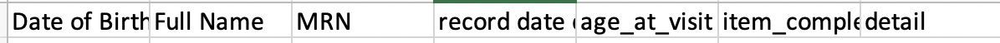
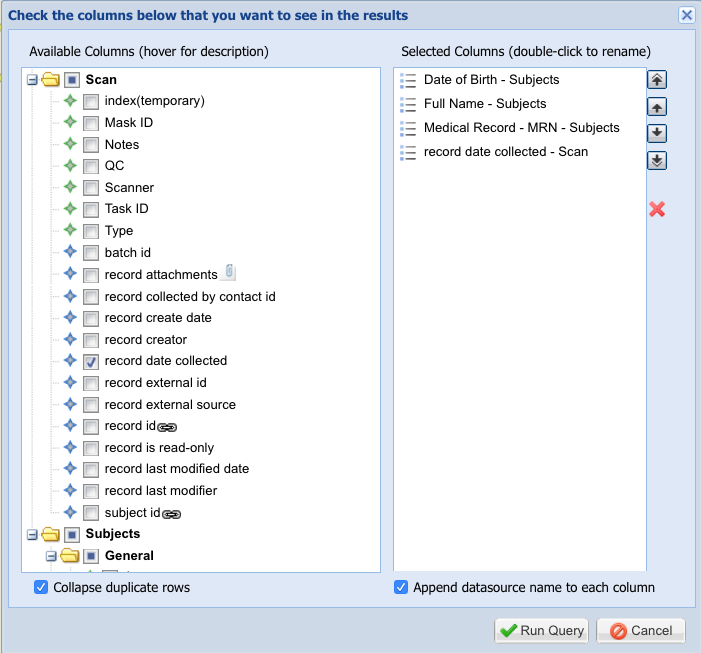

# 2019-10-02 16:13:39

I wrote a script to show what each subject did in each day. I start with a big
CSV that has the following columns:



I did that by running individual searches in Labmatrix, then just concatenating
the rows manually. It's not too hard if we use the filling_holes search I saved,
and then just add the data-specific record collected date.




So, the goal is to create a matrix of subject, visit, and then put an X in the
columns representing whether the task was accomplished.

```r
data = read.csv('~/tmp/items_completed.csv')
subjs = as.character(unique(data$MRN))
tests = as.character(unique(data$item_completed))
df = c()
for (s in subjs) {
    subj_dates = unique(as.character(data[which(data$MRN==s), ]$record.date.collected))
    for (d in subj_dates) {
        idx = which(data$MRN==s & data$record.date.collected==d)
        mydata = c(s, as.character(data[idx[1], 'Full.Name']), d,
                   as.character(data[idx[1], 'age_at_visit']), '')
        header = c('MRN', 'name', 'visit', 'age', 'study')
        for (t in tests) {
            header = c(header, t)
            if (sum(data[idx, ] == t) > 0) {
                mydata = c(mydata, 'X')
            } else {
                mydata = c(mydata, '')
            }
        }
        df = rbind(df, mydata)
    }
}
colnames(df) = header
write.csv(df, file='~/tmp/holes.csv', row.names=F, quote=F)
```

# 2019-10-10 16:39:49

I'll actually start with BTRIS as the main source. First, pull demographics on
everyone. Then, I created separate reports on everyone, without demographics
included, from 01/01/2007 to now. And copied only MRN and date.

 * Radiology: filtered to the 3 MRI brain exams
 * Laboratories: filtered order name by Pregnancy test
 * Diagnosis and procedures: removed NIAD problem and Rare disease
 * Clinical documents - discrete: everything (but unique values only)
 * Clinical document - full: everything (but unique values only)

Then, after binding by rows in all_BTRIS_10102019.xlsx, I removed duplicates on
MRN and date. Note, to extract the day from a datetime: 

=datevalue(MONTH(A2) & "/" & DAY(A2) & "/" & YEAR(A2))

Then, I sorted on MRN and date to check date differences, and flagged anything
with date difference under 2 months.

=IF(A2=A1,C2-C1,"NA")

**Philip said I should just stick with the numbers I got from Labmatrix...
stopping here** 