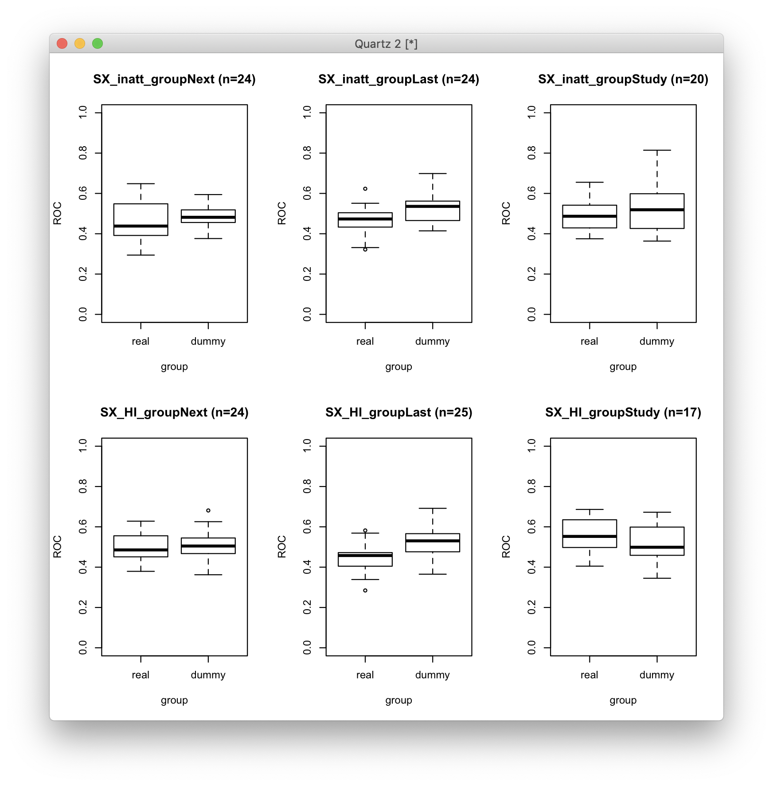
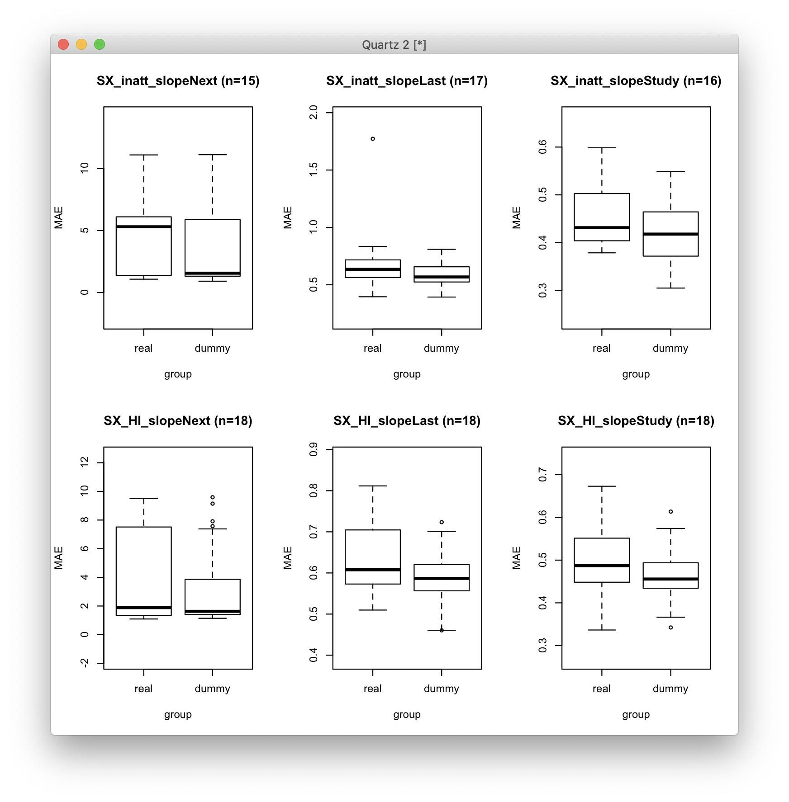
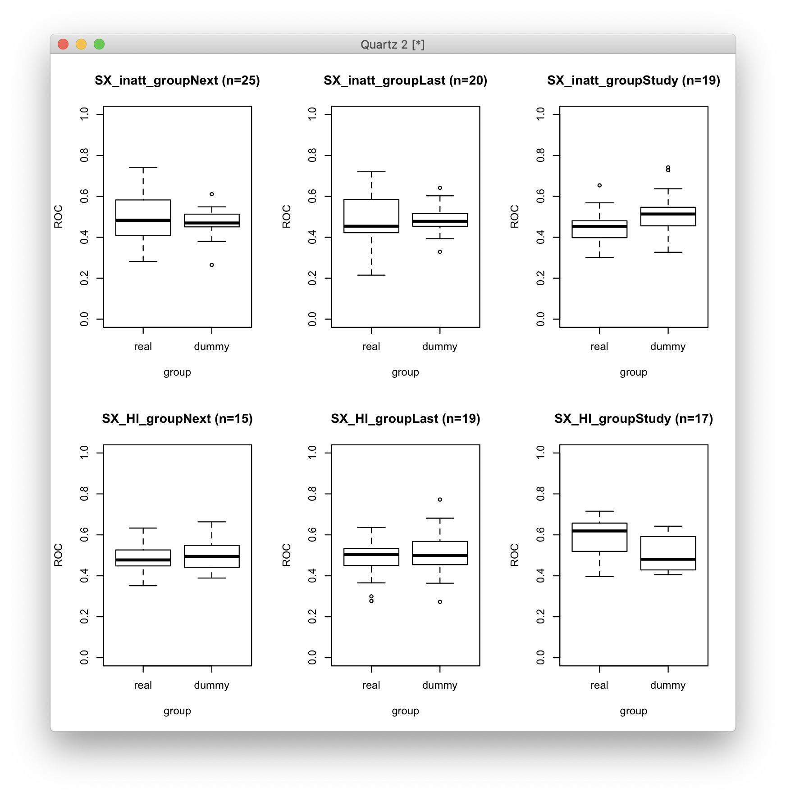
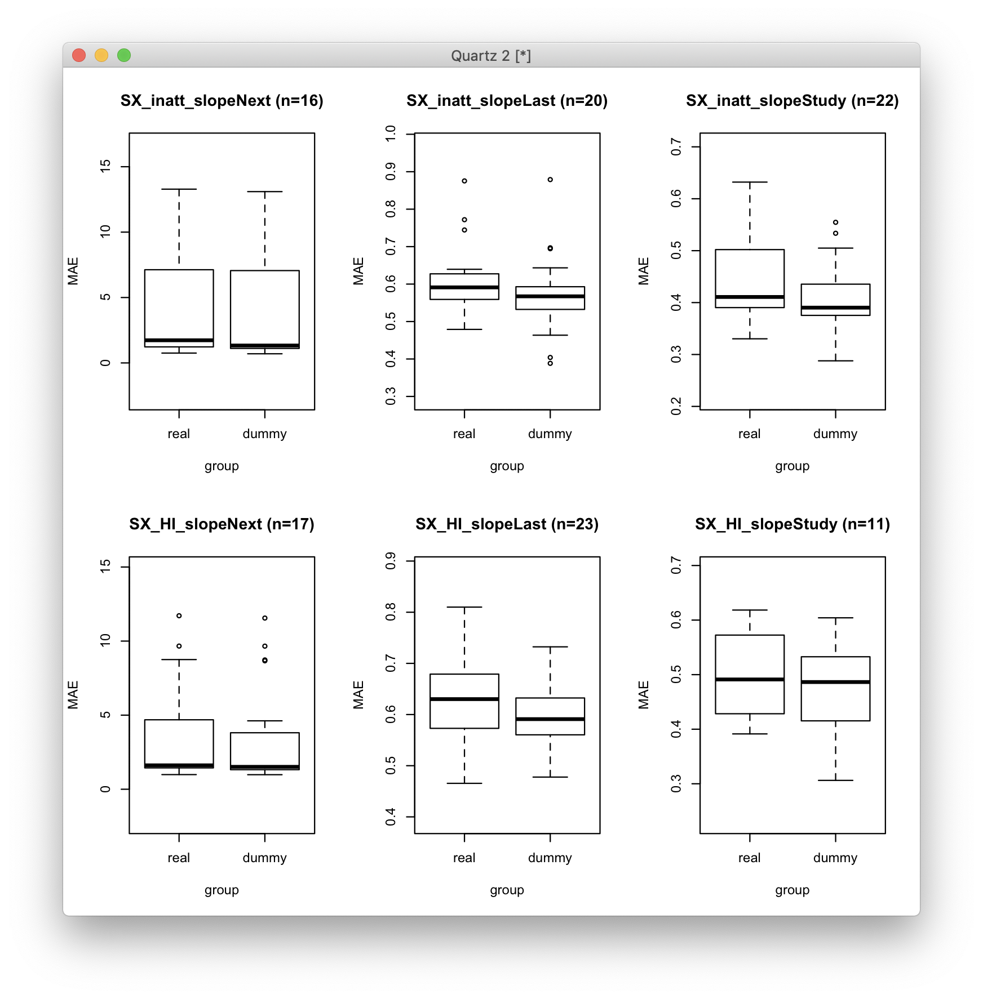
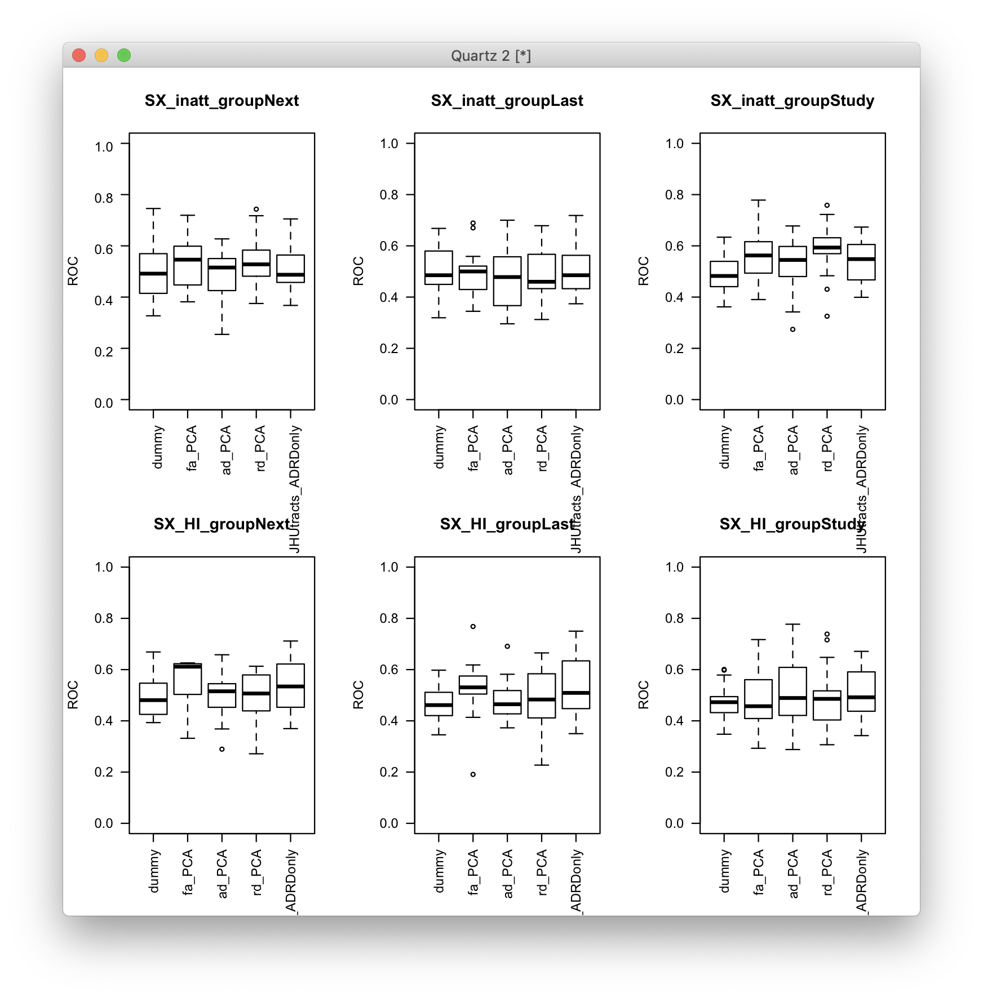
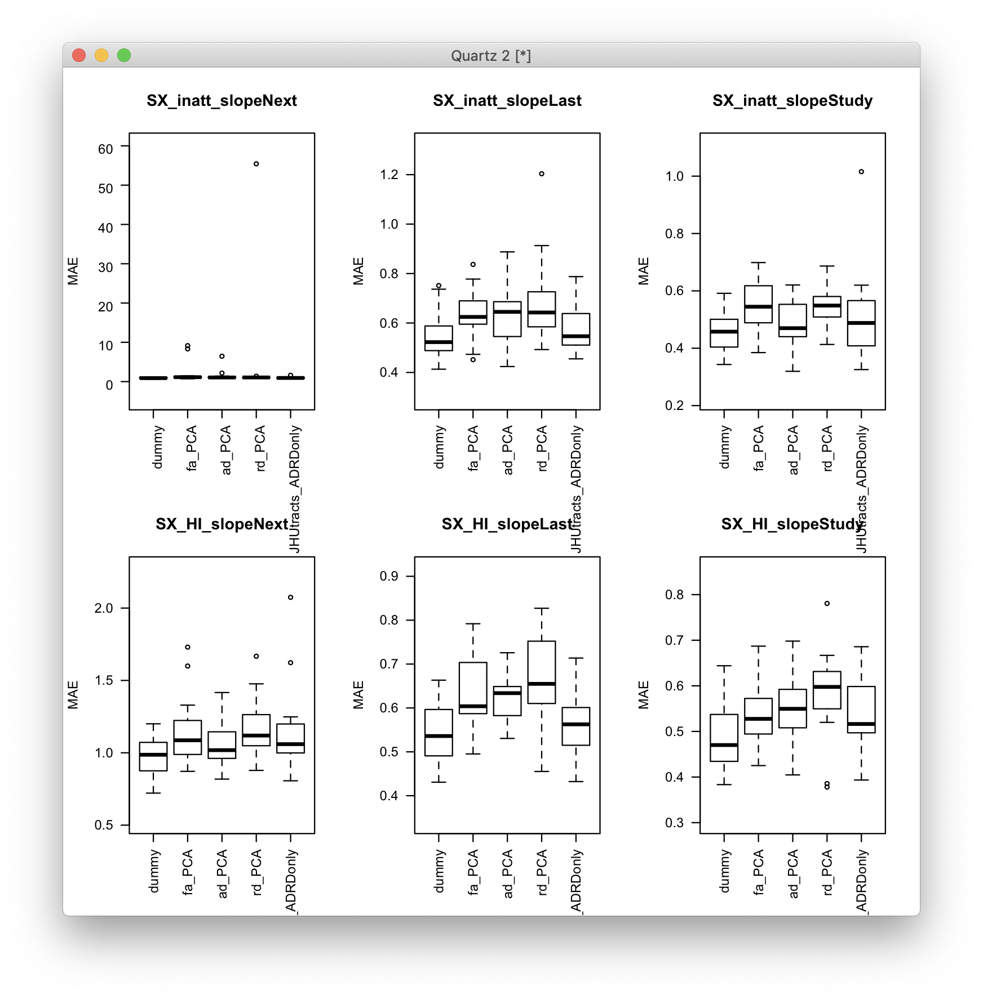
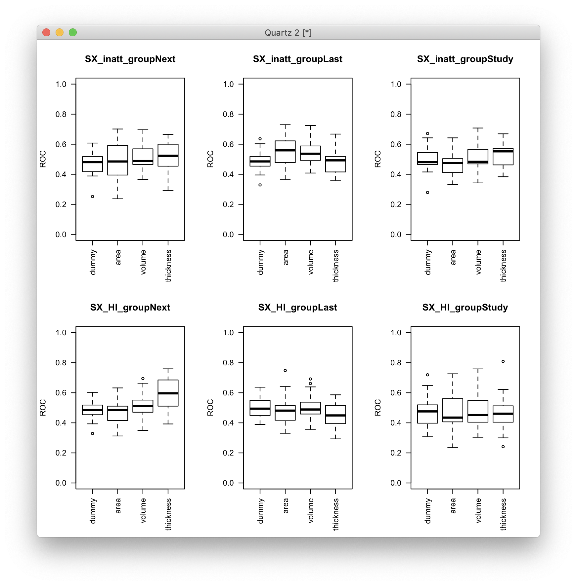
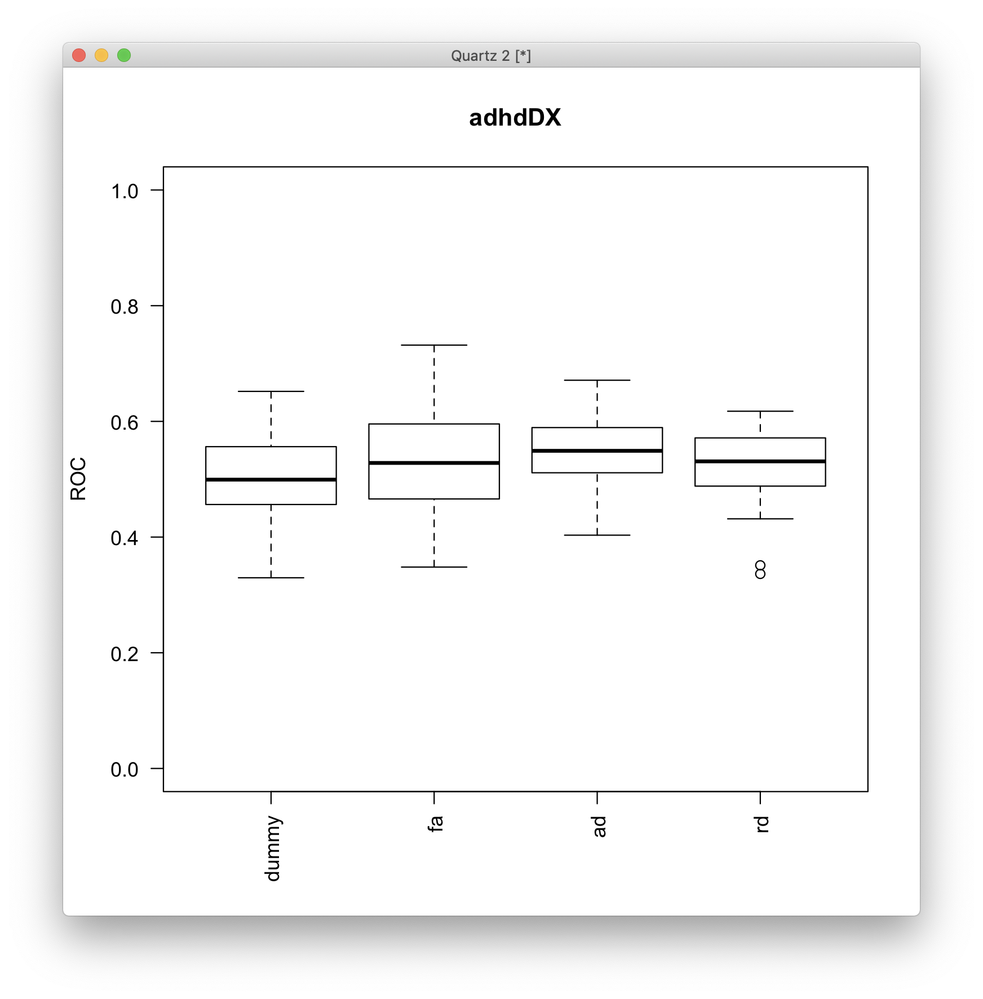
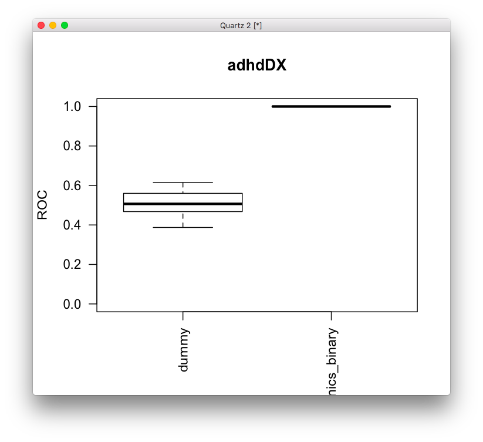

# 2019-10-11 13:54:04

After all the heritability work, I have a few new ideas for baseline prediction.
I think it makes sense to start with a clinical application, basically with only
people who have ADHD at baseline. We can do this regardless of whether they have
a second clinical assessment or not, as we'll use it just to get a normative
distribution of ADHD scans. 

Then, we'll do the two-step outlier detection QC, and finally get the earliest
good scan for each subject. We'll then keep only people that have one or more
clinical assessments after the earliest good scan, and compute the slope to the
next assessment, and also the last assessment. We can also binarize them into
improvers and non-improvers, and give a probability of getting better score. So,
in the end we'd have 4 different outcomes (2 continuous, 2 binary).

For sanity check, we should keep the QC variables in the dataset and check if
they provide a better accuracy than the actual data.

When scripts are all working, we could play with the OD threshold.

The trick here will be combining the datasets. How do we merge across domains,
if the slope is calculated with respect to the modality? I think in that
situation I'll need to re-run the QC using all modalities simultaneously,
fixating on dates that have all 3 modalities. Then we can simply merge the
closest neuropsych to it.

I'll start with DTI just to get the scripts ready...

```r
source('~/research_code/baseline_prediction/prep_dti_JHUtracts_data.R')
```

# 2019-10-29 12:33:51

I should try the classification with and without adding age and sex to the
features, and then just checking how good our age and sex predictions can get by
themselves. For now, I'll play a bit with TPOT just to see how good this can
get.

Of course, by following the examples on the website, we should have multiple
validation sets, so that we can have a distribution. But maybe we can just set
the seeds, and go from there? Like, a list of seeds (starting with 42)?

For now, let's make sure a minimal example using TPOT is working. Then we can
start tweaking it a bit and running different seeds.

```python
from tpot import TPOTClassifier, config
from sklearn.model_selection import train_test_split
import pandas as pd
import numpy as np
from dask.distributed import Client
client = Client(n_workers=32, threads_per_worker=1)
myseed=1234

data = pd.read_csv('~/data/baseline_prediction/dti_JHUtracts_ADRDonly_OD0.95.csv')
data.rename(columns={'SX_HI_groupStudy': 'class'}, inplace=True)
data['class'] = data['class'].map({'improvers': 1, 'nonimprovers': -1})
print(data['class'].value_counts())

feature_names = [fname for fname in data.columns if fname[:2] in ['ad', 'rd']]
target_class = data['class'].values
training_indices, validation_indices = train_test_split(data.index,
														stratify = target_class, train_size=0.75,
														test_size=0.25,
														random_state=myseed)

# removing some warnings by hard coding parameters in the dictionary
my_config = config.classifier_config_dict
my_config['sklearn.linear_model.LogisticRegression']['solver'] = 'lbfgs'
preproc = [v for v in my_config.keys() if v.find('preprocessing') > 0]
for p in preproc:
	my_config[p]['validate'] = [False]

tpot = TPOTClassifier(n_jobs=-1, random_state=myseed, verbosity=2,
						config_dict=my_config, use_dask=True, scoring='roc_auc')

X = data[feature_names].values
tpot.fit(X[training_indices], target_class[training_indices])

### after
tpot.export('tpot_adrd_pipeline.py')
tpot.score(X[validation_indices], data.loc[validation_indices, 'class'].values)
```

I'm not going to worry too much about the warnings for now. Let's just make sure
we can save our best models for testing and go from there.

Now let's see if we can run this in Biowulf. I had to create a tpot environment
so make sure all packages were setup properly.

```bash
source /data/$USER/conda/etc/profile.d/conda.sh
conda activate tpot
export OMP_NUM_THREADS=1
```

I removed xgboost package from conda to check whether it was repsonsible for
some of the pipelines breaking. There were some inconsistencies in DASK about
output parameters it received from CV results, so I'm checking whether that can
be originating from xgb... it turns out that I got the error even without XGB,
so I can put it back if I think it works, and the time doesn't increase too
much. But I still don't know what's causing the error. It's only happening once
in a while, so it could be a DASK thing.

So, the code above finished. Now it's just a matter of scripting it. First, set
up a file with the phenotype variables:

```bash
cd ~/data/baseline_prediction
for m in ad rd; do
 for t in {1..20}; do
		echo "${m}_${t}" >> ad_rd_vars.txt;
	done
done
```

```bash
#bw
python ~/research_code/baseline_prediction/tpot_classify.py ~/data/baseline_prediction/dti_JHUtracts_ADRDonly_OD0.95.csv SX_HI_groupStudy ~/data/baseline_prediction/ad_rd_vars.txt ~/data/tmp/ 42
```

# 2019-10-30 10:56:48

I was having lots of problems with DASK yesterday and today, especially with
putting it into a script (instead of running in jupyter notebooks), and also
struggling with using dask-ml implementation of joblib. So, I reverted to the
normal joblib backend and not using DASK at all in TPOT. Let's see if this
works...

The function seems to be working. So, now we just need to make sure we load the
environment correctly before we swarm it, so that all variables can be sent with
the swarm. First, let's create a set of random seeds:

```bash
cd ~/data/baseline_prediction
echo 42 > random25.txt;
echo 1234 >> random25.txt;
for i in {1..23}; do echo $RANDOM >> random25.txt; done
```

```bash
# bw
source /data/$USER/conda/etc/profile.d/conda.sh
conda activate tpot
export OMP_NUM_THREADS=1
cd ~/data/baseline_prediction/tpot_swarms

jname=cDTIjhu;
swarm_file=swarm.${jname};
rm -f $swarm_file;
code=~/research_code/baseline_prediction/tpot_classify.py;
phen=~/data/baseline_prediction/dti_JHUtracts_ADRDonly_OD0.95.csv;
vars=~/data/baseline_prediction/ad_rd_vars.txt
res=~/data/baseline_prediction/tpot_results
for i in Next Last Study; do
    for j in SX_inatt SX_HI; do
        for s in `cat ../random25.txt`; do
            echo "python $code $phen ${j}_group${i} $vars $res $s" >> $swarm_file;
        done;
    done;
done;

swarm --gres=lscratch:10 -f $swarm_file -t 32 -g 20 --logdir=trash_${jname} \
    --job-name ${jname} --time=4:00:00 --merge-output --partition quick,norm
```

While I wait for that to run, I can make a quite similar script for regression.

```bash
# bw
source /data/$USER/conda/etc/profile.d/conda.sh
conda activate tpot
export OMP_NUM_THREADS=1
cd ~/data/baseline_prediction/tpot_swarms

jname=rDTIjhu;
swarm_file=swarm.${jname};
rm -f $swarm_file;
code=~/research_code/baseline_prediction/tpot_regress.py;
phen=~/data/baseline_prediction/dti_JHUtracts_ADRDonly_OD0.95.csv;
vars=~/data/baseline_prediction/ad_rd_vars.txt
res=~/data/baseline_prediction/tpot_results
for i in Next Last Study; do
    for j in SX_inatt SX_HI; do
        for s in `cat ../random25.txt`; do
            echo "python $code $phen ${j}_slope${i} $vars $res $s" >> $swarm_file;
        done;
    done;
done;

swarm --gres=lscratch:10 -f $swarm_file -t 32 -g 20 --logdir=trash_${jname} \
    --job-name ${jname} --time=4:00:00 --merge-output --partition quick,norm
```

The random distribution runs quite fast, so we don't need to swarm it:

```bash
# interactive
source /data/$USER/conda/etc/profile.d/conda.sh
conda activate tpot
export OMP_NUM_THREADS=1
cd ~/data/baseline_prediction/tpot_results

code=~/research_code/baseline_prediction/dummy_classifier.py;
phen=~/data/baseline_prediction/dti_JHUtracts_ADRDonly_OD0.95.csv;
vars=~/data/baseline_prediction/ad_rd_vars.txt
res=~/data/baseline_prediction/tpot_results
for i in Next Last Study; do
    for j in SX_inatt SX_HI; do
        for s in `cat ../random25.txt`; do
            python $code $phen ${j}_group${i} $vars $res $s;
        done;
    done;
done;
```

And do the same thing for regression:

```bash
# interactive
source /data/$USER/conda/etc/profile.d/conda.sh
conda activate tpot
export OMP_NUM_THREADS=1
cd ~/data/baseline_prediction/tpot_results

code=~/research_code/baseline_prediction/dummy_regressor.py;
phen=~/data/baseline_prediction/dti_JHUtracts_ADRDonly_OD0.95.csv;
vars=~/data/baseline_prediction/ad_rd_vars.txt
res=~/data/baseline_prediction/tpot_results
for i in Next Last Study; do
    for j in SX_inatt SX_HI; do
        for s in `cat ../random25.txt`; do
            python $code $phen ${j}_slope${i} $vars $res $s;
        done;
    done;
done;
```

For plotting, I'm thinking of one row for inatt and one for HI, and the columns
being the different study targets. We can do three boxplots per cell, with real
results and random side by side.

```r
data = read.csv('classification_p75_dti_JHUtracts_ADRDonly_OD0.95.csv', header=0)
dummy = read.csv('classification_dummy_results.csv', header=0)
par(mfrow=c(2, 3))
for (j in c('SX_inatt', 'SX_HI')) {
    for (i in c('Next', 'Last', 'Study')) {
        target = sprintf('%s_group%s', j, i)
        res_rows = which(grepl(data$V1, pattern=target))
        dumb_rows = which(grepl(dummy$V1, pattern=target))
        roc = data.frame(group='real', val=data[res_rows, 'V3'])
        roc = rbind(roc, data.frame(group='dummy', val=dummy[dumb_rows, 'V3']))
        mytitle = sprintf('%s (n=%d)', target, length(res_rows))
        boxplot(as.formula('val ~ group'), data=roc, main=mytitle, ylim=c(0,1), ylab='ROC')
    }
}
```



Not looking very promising... but at least the framework is working. Maybe the
idea is to go back to the features that worked before, and start from there. I
don't expect to repeat the results, because datasets and targets will be
different. Still, it's a good place to start.

Before we do that, let's plot the regression results as well.

```r
data = read.csv('regression_p75_dti_JHUtracts_ADRDonly_OD0.95.csv', header=0)
dummy = read.csv('regression_dummy_results.csv', header=0)
data$V3 = -data$V3
dummy$V3 = -dummy$V3
par(mfrow=c(2, 3))
for (j in c('SX_inatt', 'SX_HI')) {
    for (i in c('Next', 'Last', 'Study')) {
        target = sprintf('%s_slope%s', j, i)
        res_rows = which(grepl(data$V1, pattern=target))
        dumb_rows = which(grepl(dummy$V1, pattern=target))
        tmp = data.frame(group='real', val=data[res_rows, 'V3'])
        tmp = rbind(tmp, data.frame(group='dummy', val=dummy[dumb_rows, 'V3']))
        ul = max(tmp$val) + sd(tmp$val)
        ll = min(tmp$val) - sd(tmp$val)
        mytitle = sprintf('%s (n=%d)', target, length(res_rows))
        boxplot(as.formula('val ~ group'), data=tmp, main=mytitle, ylim=c(ll,ul), ylab='MAE')
    }
}
```



Also not great, as we want MAE to be smaller in the real data than dummy,
differently than for ROC. But at least scripts are ready.

Let me just go ahead and run .8 split to see if it makes any difference.

While that's running, I'll play a bit with other modalities. First, make sure we
have all the possible DTI data we'll need:

```bash
dti_dir=/Volumes/Shaw/dti_robust_tsa/analysis_may2017/
cd ~/data/baseline_prediction/;
for m in `tail -n +2 ~/data/heritability_change/ready_1020.csv | cut -d"," -f 1 -`; do
    # just using some random mask from before
    if [ ! -e dti_voxels/${m}_fa.txt ]; then
        if [ ! -e ${dti_dir}/${m}_tensor_diffeo_fa.nii.gz ]; then
            /Applications/dtitk-2.3.3-Darwin-x86_64/bin/TVtool -in ${dti_dir}/${m}_tensor_diffeo.nii.gz -fa;
            /Applications/dtitk-2.3.3-Darwin-x86_64/bin/TVtool -in ${dti_dir}/${m}_tensor_diffeo.nii.gz -ad;
            /Applications/dtitk-2.3.3-Darwin-x86_64/bin/TVtool -in ${dti_dir}/${m}_tensor_diffeo.nii.gz -rd;
        fi;
        3dmaskdump -mask mean_272_fa_skeleton_mask.nii.gz -o dti_voxels/${m}_fa.txt ${dti_dir}/${m}_tensor_diffeo_fa.nii.gz;
        3dmaskdump -mask mean_272_fa_skeleton_mask.nii.gz -o dti_voxels/${m}_ad.txt ${dti_dir}/${m}_tensor_diffeo_ad.nii.gz;
        3dmaskdump -mask mean_272_fa_skeleton_mask.nii.gz -o dti_voxels/${m}_rd.txt ${dti_dir}/${m}_tensor_diffeo_rd.nii.gz;
    fi;
done

# changing between fa, ad, and rd in the script
Rscript ~/research_code/baseline_prediction/prep_dti_voxel_PCA_data.R
```

# 2019-10-31 10:17:47

Let's see if there is any difference with the 80/20 split:





Not really... I'll just leave it that way though.

And let's do some voxelwise decoding:

```bash
for i in {1..48}; do echo PC${i} >> dti_fa_PCA_vars.txt; done
for i in {1..49}; do echo PC${i} >> dti_ad_PCA_vars.txt; done
for i in {1..39}; do echo PC${i} >> dti_rd_PCA_vars.txt; done
```

```bash
# bw
source /data/$USER/conda/etc/profile.d/conda.sh
conda activate tpot
export OMP_NUM_THREADS=1
cd ~/data/baseline_prediction/tpot_swarms

jname=cDTIvox;
swarm_file=swarm.${jname};
rm -f $swarm_file;
code=~/research_code/baseline_prediction/tpot_classify.py;
res=~/data/baseline_prediction/tpot_results;
for p in fa ad rd; do
    phen=~/data/baseline_prediction/dti_${p}_PCA_OD0.95.csv;
    vars=~/data/baseline_prediction/dti_${p}_PCA_vars.txt;
    for i in Next Last Study; do
        for j in SX_inatt SX_HI; do
            for s in `cat ../random25.txt`; do
                echo "python $code $phen ${j}_group${i} $vars $res $s" >> $swarm_file;
            done;
        done;
    done;
done;
swarm --gres=lscratch:10 -f $swarm_file -t 32 -g 20 --logdir=trash_${jname} \
    --job-name ${jname} --time=4:00:00 --merge-output --partition quick,norm
```

While I wait for that to run, I can make a quite similar script for regression.

```bash
# bw
source /data/$USER/conda/etc/profile.d/conda.sh
conda activate tpot
export OMP_NUM_THREADS=1
cd ~/data/baseline_prediction/tpot_swarms

jname=rDTIvox;
swarm_file=swarm.${jname};
rm -f $swarm_file;
code=~/research_code/baseline_prediction/tpot_regress.py;
res=~/data/baseline_prediction/tpot_results;
for p in fa ad rd; do
    phen=~/data/baseline_prediction/dti_${p}_PCA_OD0.95.csv;
    vars=~/data/baseline_prediction/dti_${p}_PCA_vars.txt;
    for i in Next Last Study; do
        for j in SX_inatt SX_HI; do
            for s in `cat ../random25.txt`; do
                echo "python $code $phen ${j}_slope${i} $vars $res $s" >> $swarm_file;
            done;
        done;
    done;
done;
swarm --gres=lscratch:10 -f $swarm_file -t 32 -g 20 --logdir=trash_${jname} \
    --job-name ${jname} --time=4:00:00 --merge-output --partition quick,norm
```

In the past we had some success using structural voxelwise data. Let's see if we
can do as well now.

I'm not going to run Freesurfer for this, but I need to make sure I have all QC
variables for that, and I'll need their ages.

```bash
cd ~/data/baseline_prediction
/bin/ls -1 /Volumes/Shaw/freesurfer5.3_subjects/ > struct_ids.txt
# added some demographics from Labmatrix
# and for Euler
res_file=~/data/baseline_prediction/euler_numbers.csv
echo subjid,euler_LH,euler_RH,mean_euler > $res_file;
for s in `cat ~/data/baseline_prediction/struct_ids.txt`; do
    euler_lh=`grep -A 1 "Computing euler" /Volumes/Shaw/freesurfer5.3_subjects/${s}/scripts/recon-all.log | tail -1 | awk '{ print $4 }' | sed "s/,//"`;
    euler_rh=`grep -A 1 "Computing euler" /Volumes/Shaw/freesurfer5.3_subjects/${s}/scripts/recon-all.log | tail -1 | awk '{ print $7 }' | sed "s/,//"`;
    mean_euler=`echo "( $euler_lh + $euler_rh ) / 2" | bc`;
    echo $s,$euler_lh,$euler_rh,$mean_euler >> $res_file;
done
```

```r
demo = read.csv('~/data/baseline_prediction/struct_demo.csv')
mriqc = read.table('~/data/baseline_prediction/group_T1w.txt', header=1)
mriqc$maskid = sapply(gsub(pattern='sub-', x=mriqc$bids_name, replacement=''),
                      function(x) substr(x, 1, 4))
m = merge(demo, mriqc, by='maskid', all.x=F, all.y=F)
eu = read.csv('~/data/baseline_prediction/euler_numbers.csv')
m = merge(m, eu, by.x='maskid', by.y='subjid', all.x=F, all.y=F)
write.csv(m, file='~/data/baseline_prediction/struct_demo_withQC.csv', row.names=F)
```

Then it's just a matter of running the usual prep script:

```r
source('~/research_code/baseline_prediction/prep_struct_voxel_PCA_data.R')
```

# 2019-11-01 10:13:23

Just finished that script, so now it's time to leave it running while I compile
the results for DTI:

```bash
for i in {1..48}; do echo PC${i} >> struct_area_PCA_vars.txt; done
for i in {1..55}; do echo PC${i} >> struct_thickness_PCA_vars.txt; done
for i in {1..57}; do echo PC${i} >> struct_volume_PCA_vars.txt; done
```

```bash
# bw
source /data/$USER/conda/etc/profile.d/conda.sh
conda activate tpot
export OMP_NUM_THREADS=1
cd ~/data/baseline_prediction/tpot_swarms

jname=cStructVox;
swarm_file=swarm.${jname};
rm -f $swarm_file;
code=~/research_code/baseline_prediction/tpot_classify.py;
res=~/data/baseline_prediction/tpot_results;
for p in area thickness volume; do
    phen=~/data/baseline_prediction/struct_${p}_PCA_OD0.95.csv;
    vars=~/data/baseline_prediction/struct_${p}_PCA_vars.txt;
    for i in Next Last Study; do
        for j in SX_inatt SX_HI; do
            for s in `cat ../random25.txt`; do
                echo "python $code $phen ${j}_group${i} $vars $res $s" >> $swarm_file;
            done;
        done;
    done;
done;
swarm --gres=lscratch:10 -f $swarm_file -t 32 -g 20 --logdir=trash_${jname} \
    --job-name ${jname} --time=4:00:00 --merge-output --partition quick,norm
```

While I wait for that to run, I can make a quite similar script for regression.

```bash
# bw
source /data/$USER/conda/etc/profile.d/conda.sh
conda activate tpot
export OMP_NUM_THREADS=1
cd ~/data/baseline_prediction/tpot_swarms

jname=rStructVox;
swarm_file=swarm.${jname};
rm -f $swarm_file;
code=~/research_code/baseline_prediction/tpot_regress.py;
res=~/data/baseline_prediction/tpot_results;
for p in area thickness volume; do
    phen=~/data/baseline_prediction/struct_${p}_PCA_OD0.95.csv;
    vars=~/data/baseline_prediction/struct_${p}_PCA_vars.txt;
    for i in Next Last Study; do
        for j in SX_inatt SX_HI; do
            for s in `cat ../random25.txt`; do
                echo "python $code $phen ${j}_slope${i} $vars $res $s" >> $swarm_file;
            done;
        done;
    done;
done;
swarm --gres=lscratch:10 -f $swarm_file -t 32 -g 20 --logdir=trash_${jname} \
    --job-name ${jname} --time=4:00:00 --merge-output --partition quick,norm
```

And these are the latest DTI results, using the improved file naming and 80/20
splits:

```r
dummy = read.csv('classification_dummy_results_dti_JHUtracts_ADRDonly_OD0.95.csv', header=0)
par(mfrow=c(2, 3))
for (j in c('SX_inatt', 'SX_HI')) {
    for (i in c('Next', 'Last', 'Study')) {
        target = sprintf('%s_group%s', j, i)
        dumb_rows = which(grepl(dummy$V1, pattern=target))
        tmp = data.frame(group='dummy', val=dummy[dumb_rows, 'V3'])
        for (phen in c('fa_PCA', 'ad_PCA', 'rd_PCA', 'JHUtracts_ADRDonly')) {
            data = read.csv(sprintf('classification_results_dti_%s_OD0.95.csv', phen), header=0)
            res_rows = which(grepl(data$V1, pattern=target))
            tmp = rbind(tmp, data.frame(group=phen, val=data[res_rows, 'V3']))
        }
        mytitle = sprintf('%s', target)
        boxplot(as.formula('val ~ group'), data=tmp, main=mytitle, ylim=c(0,1), ylab='ROC', las=2, xlab='')
    }
}
```



There might be something there for fa_PCA. 

```r
dummy = read.csv('regression_dummy_results_dti_JHUtracts_ADRDonly_OD0.95.csv', header=0)
dummy$V3 = -dummy$V3
par(mfrow=c(2, 3))
for (j in c('SX_inatt', 'SX_HI')) {
    for (i in c('Next', 'Last', 'Study')) {
        target = sprintf('%s_slope%s', j, i)
        dumb_rows = which(grepl(dummy$V1, pattern=target))
        tmp = data.frame(group='dummy', val=dummy[dumb_rows, 'V3'])
        for (phen in c('fa_PCA', 'ad_PCA', 'rd_PCA', 'JHUtracts_ADRDonly')) {
            data = read.csv(sprintf('regression_results_dti_%s_OD0.95.csv', phen), header=0)
            data$V3 = -data$V3
            res_rows = which(grepl(data$V1, pattern=target))
            tmp = rbind(tmp, data.frame(group=phen, val=data[res_rows, 'V3']))
        }
        ul = max(tmp$val) + sd(tmp$val)
        ll = min(tmp$val) - sd(tmp$val)
        mytitle = sprintf('%s', target)
        boxplot(as.formula('val ~ group'), data=tmp, main=mytitle, ylim=c(ll,ul), ylab='MAE', las=2, xlab='')
    }
}
```



Regression is clearly not looking good. Maybe I should just abandon that for now
to save time. Let's see if we can go back to the old results, using strictly
DSM5 labels and doing ADHD vs NV as well. 

```r
source('~/research_code/baseline_prediction/prep_dti_voxel_PCA_data_baseDX.R')
source('~/research_code/baseline_prediction/prep_struct_voxel_PCA_data_baseDX.R')
```

And to run the DX it should be simple:

```bash
for i in {1..76}; do echo PC${i} >> dti_fa_PCA_baseDX_vars.txt; done
for i in {1..78}; do echo PC${i} >> dti_ad_PCA_baseDX_vars.txt; done
for i in {1..61}; do echo PC${i} >> dti_rd_PCA_baseDX_vars.txt; done
```

```bash
# bw
source /data/$USER/conda/etc/profile.d/conda.sh
conda activate tpot
export OMP_NUM_THREADS=1
cd ~/data/baseline_prediction/tpot_swarms

jname=DTIvoxDX;
swarm_file=swarm.${jname};
rm -f $swarm_file;
code=~/research_code/baseline_prediction/tpot_classify.py;
res=~/data/baseline_prediction/tpot_results;
for p in fa ad rd; do
    phen=~/data/baseline_prediction/dti_${p}_PCA_OD0.95_baseDX.csv;
    vars=~/data/baseline_prediction/dti_${p}_PCA_baseDX_vars.txt;
    for s in `cat ../random25.txt`; do
        echo "python $code $phen adhdDX $vars $res $s" >> $swarm_file;
    done;
done;
swarm --gres=lscratch:10 -f $swarm_file -t 32 -g 20 --logdir=trash_${jname} \
    --job-name ${jname} --time=4:00:00 --merge-output --partition quick,norm
```

```bash
for i in {1..97}; do echo PC${i} >> struct_volume_PCA_baseDX_vars.txt; done
for i in {1..78}; do echo PC${i} >> struct_area_PCA_baseDX_vars.txt; done
for i in {1..32}; do echo PC${i} >> struct_volume_PCA_baseDX_vars.txt; done
```

I did this a bit differently because it was taking forever to compute the
decimated version of the structural data with all subjects.

```bash
# bw
source /data/$USER/conda/etc/profile.d/conda.sh
conda activate tpot
export OMP_NUM_THREADS=1
cd ~/data/baseline_prediction/tpot_swarms

p=area;
jname=DX${p};
swarm_file=swarm.${jname};
rm -f $swarm_file;
code=~/research_code/baseline_prediction/tpot_classify.py;
res=~/data/baseline_prediction/tpot_results;
phen=~/data/baseline_prediction/struct_${p}_PCA_OD0.95_baseDX.csv;
vars=~/data/baseline_prediction/struct_${p}_PCA_baseDX_vars.txt;
for s in `cat ../random25.txt`; do
    echo "python $code $phen adhdDX $vars $res $s" >> $swarm_file;
done;
swarm --gres=lscratch:10 -f $swarm_file -t 32 -g 20 --logdir=trash_${jname} \
    --job-name ${jname} --time=4:00:00 --merge-output --partition quick,norm
```

I'm now waiting for Freesurfer decimation to finish running, and my queue is
quite long in the cluster. So, it makes sense to run a binaryClinical dataset
just to work as a benchmark for the algorithms. Based on definition, and on the
previous results, we should be almost perfect using that.

I'll go ahead and use the same binary file I was using in the past
(clinics_binary_sx_baseline_10022018.RData.gz), as it took a while to construct
and I'm only using baseline data anyways here. I'll probably massage it a bit
and transform it to CSV.

```bash
# bw
source /data/$USER/conda/etc/profile.d/conda.sh
conda activate tpot
export OMP_NUM_THREADS=1
cd ~/data/baseline_prediction/tpot_swarms

jname=clinBinDX;
swarm_file=swarm.${jname};
rm -f $swarm_file;
code=~/research_code/baseline_prediction/tpot_classify.py;
res=~/data/baseline_prediction/tpot_results;
phen=~/data/baseline_prediction/clinics_binary_baseDX.csv;
vars=~/data/baseline_prediction/clinics_binary_vars.txt;
for s in `cat ../random25.txt`; do
    echo "python $code $phen adhdDX $vars $res $s" >> $swarm_file;
done;
swarm --gres=lscratch:10 -f $swarm_file -t 32 -g 20 --logdir=trash_${jname} \
    --job-name ${jname} --time=4:00:00 --merge-output --partition quick,norm
```

Next step is to do the DSM-5 perVSrem comparison as well.

```r
source('~/research_code/baseline_prediction/prep_dti_voxel_PCA_data_DSM5Outcome.R')
source('~/research_code/baseline_prediction/prep_struct_voxel_PCA_data_DSM5Outcome.R')
```

```bash
for i in {1..40}; do echo PC${i} >> dti_fa_PCA_DSM5Outcome_vars.txt; done
for i in {1..40}; do echo PC${i} >> dti_ad_PCA_DSM5Outcome_vars.txt; done
for i in {1..32}; do echo PC${i} >> dti_rd_PCA_DSM5Outcome_vars.txt; done
```

```bash
# bw
source /data/$USER/conda/etc/profile.d/conda.sh
conda activate tpot
export OMP_NUM_THREADS=1
cd ~/data/baseline_prediction/tpot_swarms

jname=DTIvoxOutcome;
swarm_file=swarm.${jname};
rm -f $swarm_file;
code=~/research_code/baseline_prediction/tpot_classify.py;
res=~/data/baseline_prediction/tpot_results;
for p in fa ad rd; do
    phen=~/data/baseline_prediction/dti_${p}_PCA_OD0.95_DSM5Outcome.csv;
    vars=~/data/baseline_prediction/dti_${p}_PCA_DSM5Outcome_vars.txt;
    for s in `cat ../random25.txt`; do
        echo "python $code $phen lastPersistent $vars $res $s" >> $swarm_file;
    done;
done;
swarm --gres=lscratch:10 -f $swarm_file -t 32 -g 20 --logdir=trash_${jname} \
    --job-name ${jname} --time=4:00:00 --merge-output --partition quick,norm
```

```bash
for i in {1..46}; do echo PC${i} >> struct_volume_PCA_DSM5Outcome_vars.txt; done
for i in {1..39}; do echo PC${i} >> struct_area_PCA_DSM5Outcome_vars.txt; done
for i in {1..32}; do echo PC${i} >> struct_volume_PCA_DSM5Outcome_vars.txt; done
```

```bash
# bw
source /data/$USER/conda/etc/profile.d/conda.sh
conda activate tpot
export OMP_NUM_THREADS=1
cd ~/data/baseline_prediction/tpot_swarms

p=area;
jname=OUT${p};
swarm_file=swarm.${jname};
rm -f $swarm_file;
code=~/research_code/baseline_prediction/tpot_classify.py;
res=~/data/baseline_prediction/tpot_results;
phen=~/data/baseline_prediction/struct_${p}_PCA_OD0.95_DSM5Outcome.csv;
vars=~/data/baseline_prediction/struct_${p}_PCA_DSM5Outcome_vars.txt;
for s in `cat ../random25.txt`; do
    echo "python $code $phen lastPersistent $vars $res $s" >> $swarm_file;
done;
swarm --gres=lscratch:10 -f $swarm_file -t 32 -g 20 --logdir=trash_${jname} \
    --job-name ${jname} --time=4:00:00 --merge-output --partition quick,norm
```

Now that the results are starting to come in, let's do some plotting. Before
thatm we need another dummy set:

```bash
# interactive
source /data/$USER/conda/etc/profile.d/conda.sh
conda activate tpot
export OMP_NUM_THREADS=1

code=~/research_code/baseline_prediction/dummy_classifier.py;
phen=~/data/baseline_prediction/struct_volume_PCA_OD0.95.csv;
vars=~/data/baseline_prediction/struct_volume_PCA_vars.txt;
res=~/data/baseline_prediction/tpot_results;
for i in Next Last Study; do
    for j in SX_inatt SX_HI; do
        for s in `cat random25.txt`; do
            python $code $phen ${j}_group${i} $vars $res $s;
        done;
    done;
done

code=~/research_code/baseline_prediction/dummy_regressor.py;
phen=~/data/baseline_prediction/struct_volume_PCA_OD0.95.csv;
vars=~/data/baseline_prediction/struct_volume_PCA_vars.txt;
res=~/data/baseline_prediction/tpot_results;
for i in Next Last Study; do
    for j in SX_inatt SX_HI; do
        for s in `cat random25.txt`; do
            python $code $phen ${j}_slope${i} $vars $res $s;
        done;
    done;
done
```

And we plot the results for structural data:

```r
dummy = read.csv('classification_dummy_results_struct_volume_PCA_OD0.95.csv', header=0)
par(mfrow=c(2, 3))
for (j in c('SX_inatt', 'SX_HI')) {
    for (i in c('Next', 'Last', 'Study')) {
        target = sprintf('%s_group%s', j, i)
        dumb_rows = which(grepl(dummy$V1, pattern=target))
        tmp = data.frame(group='dummy', val=dummy[dumb_rows, 'V3'])
        for (phen in c('area', 'volume', 'thickness')) {
            data = read.csv(sprintf('classification_results_struct_%s_PCA_OD0.95.csv', phen), header=0)
            res_rows = which(grepl(data$V1, pattern=target))
            tmp = rbind(tmp, data.frame(group=phen, val=data[res_rows, 'V3']))
        }
        mytitle = sprintf('%s', target)
        boxplot(as.formula('val ~ group'), data=tmp, main=mytitle, ylim=c(0,1), ylab='ROC', las=2, xlab='')
    }
}
```



A potentially interesting result for thickness, predicting HI group in the next
visit.

```r
dummy = read.csv('regression_dummy_results_struct_volume_PCA_OD0.95.csv', header=0)
dummy$V3 = -dummy$V3
par(mfrow=c(2, 3))
for (j in c('SX_inatt', 'SX_HI')) {
    for (i in c('Next', 'Last', 'Study')) {
        target = sprintf('%s_slope%s', j, i)
        dumb_rows = which(grepl(dummy$V1, pattern=target))
        tmp = data.frame(group='dummy', val=dummy[dumb_rows, 'V3'])
        for (phen in c('area', 'volume', 'thickness')) {
            data = read.csv(sprintf('regression_results_struct_%s_PCA_OD0.95.csv', phen), header=0)
            data$V3 = -data$V3
            res_rows = which(grepl(data$V1, pattern=target))
            tmp = rbind(tmp, data.frame(group=phen, val=data[res_rows, 'V3']))
        }
        ul = max(tmp$val) + sd(tmp$val)
        ll = min(tmp$val) - sd(tmp$val)
        mytitle = sprintf('%s', target)
        boxplot(as.formula('val ~ group'), data=tmp, main=mytitle, ylim=c(ll,ul), ylab='MAE', las=2, xlab='')
    }
}
```

Now we look at the baseDX results. Again, we need another dummy set:

```bash
# interactive
source /data/$USER/conda/etc/profile.d/conda.sh
conda activate tpot
export OMP_NUM_THREADS=1

code=~/research_code/baseline_prediction/dummy_classifier.py;
phen=~/data/baseline_prediction/dti_fa_PCA_OD0.95_baseDX.csv;
vars=~/data/baseline_prediction/dti_fa_PCA_baseDX_vars.txt
res=~/data/baseline_prediction/tpot_results
for s in `cat random25.txt`; do
    python $code $phen adhdDX $vars $res $s;
done;
```

```r
dummy = read.csv('classification_dummy_results_dti_fa_PCA_OD0.95_baseDX.csv', header=0)
target = 'adhdDX'
dumb_rows = which(grepl(dummy$V1, pattern=target))
tmp = data.frame(group='dummy', val=dummy[dumb_rows, 'V3'])
for (phen in c('fa', 'ad', 'rd')) {
    data = read.csv(sprintf('classification_results_dti_%s_PCA_OD0.95_baseDX.csv', phen), header=0)
    res_rows = which(grepl(data$V1, pattern=target))
    tmp = rbind(tmp, data.frame(group=phen, val=data[res_rows, 'V3']))
}
mytitle = sprintf('%s', target)
boxplot(as.formula('val ~ group'), data=tmp, main=mytitle, ylim=c(0,1), ylab='ROC', las=2, xlab='')
```



So, there's definitely something wrong here. The results from before were easily
around .65.

Finally, we look at the outcome results, with its appropriate dummy set:

```bash
# interactive
source /data/$USER/conda/etc/profile.d/conda.sh
conda activate tpot
export OMP_NUM_THREADS=1

code=~/research_code/baseline_prediction/dummy_classifier.py;
phen=~/data/baseline_prediction/dti_fa_PCA_OD0.95_DSM5Outcome.csv;
vars=~/data/baseline_prediction/dti_fa_PCA_DSM5Outcome_vars.txt
res=~/data/baseline_prediction/tpot_results
for s in `cat random25.txt`; do
    python $code $phen lastPersistent $vars $res $s;
done;
```

```r
dummy = read.csv('classification_dummy_results_dti_fa_PCA_OD0.95_DSM5Outcome.csv', header=0)
target = 'lastPersistent'
dumb_rows = which(grepl(dummy$V1, pattern=target))
tmp = data.frame(group='dummy', val=dummy[dumb_rows, 'V3'])
for (phen in c('fa', 'ad', 'rd')) {
    data = read.csv(sprintf('classification_results_dti_%s_PCA_OD0.95_DSM5Outcome.csv', phen), header=0)
    res_rows = which(grepl(data$V1, pattern=target))
    tmp = rbind(tmp, data.frame(group=phen, val=data[res_rows, 'V3']))
}
mytitle = sprintf('%s', target)
boxplot(as.formula('val ~ group'), data=tmp, main=mytitle, ylim=c(0,1), ylab='ROC', las=2, xlab='')
```

Just for kicks, let's plot clinBin as well:

```bash
# interactive
source /data/$USER/conda/etc/profile.d/conda.sh
conda activate tpot
export OMP_NUM_THREADS=1

code=~/research_code/baseline_prediction/dummy_classifier.py;
phen=~/data/baseline_prediction/clinics_binary_baseDX.csv;
vars=~/data/baseline_prediction/clinics_binary_vars.txt
res=~/data/baseline_prediction/tpot_results
for s in `cat random25.txt`; do
    python $code $phen adhdDX $vars $res $s;
done;
```

```r
dummy = read.csv('classification_dummy_results_clinics_binary_baseDX.csv', header=0)
target = 'adhdDX'
dumb_rows = which(grepl(dummy$V1, pattern=target))
tmp = data.frame(group='dummy', val=dummy[dumb_rows, 'V3'])
for (phen in c('clinics_binary')) {
    data = read.csv(sprintf('classification_results_%s_baseDX.csv', phen), header=0)
    res_rows = which(grepl(data$V1, pattern=target))
    tmp = rbind(tmp, data.frame(group=phen, val=data[res_rows, 'V3']))
}
mytitle = sprintf('%s', target)
boxplot(as.formula('val ~ group'), data=tmp, main=mytitle, ylim=c(0,1), ylab='ROC', las=2, xlab='')
```



So, the code is working fine. We are just not able to capture anything in the
data that's not obvious, like clinics_binary.

ALSO, IT DOESN'T LOOK LIKE IT FINISHED RUNNING THE DOWNSAMPLING FOR THICKNESS,
BECAUSE NCRSHELL01 WAS REBOOTED. NEED TO REDO IT LATER

What I think might be happening is that we don't have much data, so we can't get
too fancy. Let's try the pseudo neuroscience idea and see what we get.

# TODO
* play with OD threshold
* Philip would like to see the NV vs ADHD classification as well. Also, the 3
  way for persistent and remitted
* Try another task within ADHD group for very strict ADHD DSM thresholds
* Try restricting only first scan to under 13, and not the rest.
* Try restricting only the first scan under 16, not the rest.
* try other domains individually
* find new subjects to re-interview
* try the classification with and without adding age and sex to the
features, and then just checking how good our age and sex predictions can get by
themselves. Same thing by adding QC_variables.
* try a pseudo-neuroscience analysis method inside a cross validation framework.
  How about separate train and test. Then, within train, do a 5-fold CV. With 4
  folds, do bootstraps to rank the features that do best univariately. Get a
  score for each feature. Train LinearSVM with a combination of paramters and
  features. Do this to select the model, then finally test it in testing set. Do
  multiple seeds to evaluate variablity of test set. We could try KNN, SVC, or
  Ensembles as well, instead of LinearSVM. We will see. 