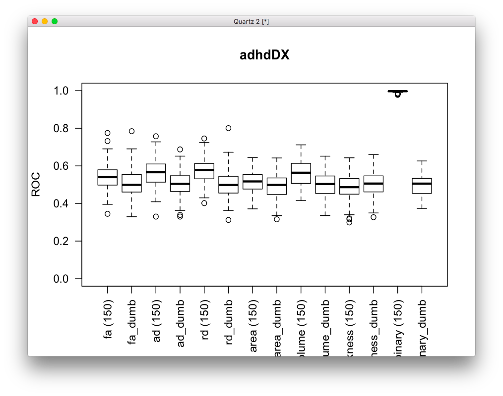
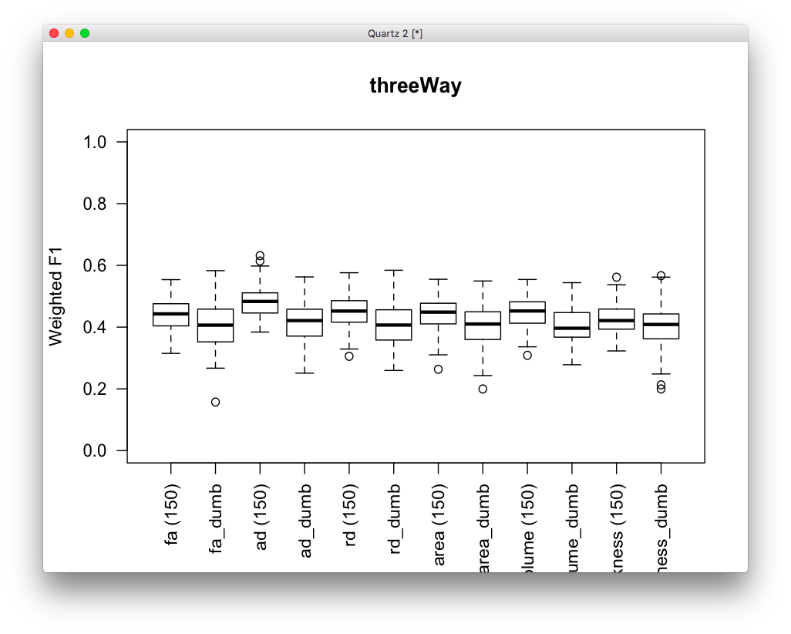

# 2019-11-04 14:45:06

Let's then explore the univariate filter idea for baseline prediction. If
anything, it'll better resemble usual neuroimaging papers.

Teh idea is that we'll split the data into training, validation, and testing. We
will pick univariately inside training, and do multiple combinations of
linearSVC, SVC, or Ensembles with the top X features.

# 2019-11-05 09:21:28

Her eI'm doing PCA, then univariate:

```bash
# locally for now
code=~/research_code/baseline_prediction/univariate_classifier.py;
phen=~/data/baseline_prediction/dti_JHUtracts_ADRDonly_OD0.95.csv;
vars=~/data/baseline_prediction/ad_rd_vars.txt;
res=~/data/tmp/;
for i in Next Last Study; do
    for j in SX_inatt SX_HI; do
        for s in `cat random25.txt`; do
            python3 $code $phen ${j}_group${i} $vars $res $s;
        done;
    done;
done;
```

And of course it might be the case that other data domains will do better. So,
let's try them in the cluster. But first, let's try to do the PCA oin the
training set only.

I made a few changes to the pipeline. Now we get the variable names
automatically, and do the PCA after univariate selection, to try to disembiguate
clusters of significance. I also only had 56 paremeters to optimize, so I went
for a grid search instead of randomized. Let's see how that goes:

```bash
# bw
export OMP_NUM_THREADS=1
code=~/research_code/baseline_prediction/univariate_classifier.py;
phen=~/data/baseline_prediction/dti_rd_OD0.95_11052019.csv;
res=~/data/tmp/;
for i in Next Last Study; do
    for j in SX_inatt SX_HI; do
        for s in `cat random25.txt`; do
            python3 $code $phen ${j}_group${i} $res $s;
        done;
    done;
done;
```

I also needed new functions:

```bash
Rscript ~/research_code/baseline_prediction/prep_dti_voxel_data.R
Rscript ~/research_code/baseline_prediction/prep_dti_voxel_data_DSM5Outcome.R
Rscript ~/research_code/baseline_prediction/prep_struct_voxel_data.R
Rscript ~/research_code/baseline_prediction/prep_struct_voxel_data_DSM5Outcome.R
```

Each run of DTI voxel is taking about 2min in the cluster. So, say 5min to be
safe. Which means we can fit 48 in 4h. We can do it all using:

```bash
# bw
export OMP_NUM_THREADS=4
cd ~/data/baseline_prediction/manual_swarms

jname=dti;
swarm_file=swarm.${jname};
rm -f $swarm_file;
code=~/research_code/baseline_prediction/univariate_classifier.py;
res=~/data/baseline_prediction/manual_results;
for p in fa ad rd JHUtracts_ADRDonly; do
    phen=~/data/baseline_prediction/dti_${p}_OD0.95_11052019.csv;
    for s in `cat ../random25.txt`; do
        for i in Next Last Study; do
            for j in SX_inatt SX_HI; do
                echo "python3 $code $phen ${j}_group${i} $res $s" >> $swarm_file;
            done;
        done;
        phen2=~/data/baseline_prediction/dti_${p}_OD0.95_DSM5Outcome_11052019.csv;
        echo "python3 $code $phen2 lastPersistent $res $s" >> $swarm_file;
    done;
done;
swarm --gres=lscratch:10 -f $swarm_file -t 32 -g 20 -b 48 --logdir=trash_${jname} \
    --job-name ${jname} --time=5:00 --merge-output --partition quick,norm
```

And for structural we run something similar:

```bash
# bw
export OMP_NUM_THREADS=4
cd ~/data/baseline_prediction/manual_swarms

jname=struct;
swarm_file=swarm.${jname};
rm -f $swarm_file;
code=~/research_code/baseline_prediction/univariate_classifier.py;
res=~/data/baseline_prediction/manual_results;
for p in area volume thickness; do
    phen=~/data/baseline_prediction/struct_${p}_OD0.95_11052019.csv;
    for s in `cat ../random25.txt`; do
        for i in Next Last Study; do
            for j in SX_inatt SX_HI; do
                echo "python3 $code $phen ${j}_group${i} $res $s" >> $swarm_file;
            done;
        done;
        phen2=~/data/baseline_prediction/struct_${p}_OD0.95_DSM5Outcome_11052019.csv;
        echo "python3 $code $phen2 lastPersistent $res $s" >> $swarm_file;
    done;
done;
swarm --gres=lscratch:10 -f $swarm_file -t 32 -g 20 -b 48 --logdir=trash_${jname} \
    --job-name ${jname} --time=5:00 --merge-output --partition quick,norm
```

I'm also trying an RFE classifier. Let's see what we get there:

```bash
# local
code=~/research_code/baseline_prediction/rfe_classifier.py;
res=~/data/baseline_prediction/manual_results;
for p in area volume thickness; do
    phen=~/data/baseline_prediction/struct_${p}_OD0.95_11052019.csv;
    for s in `cat random25.txt`; do
        for i in Next Last Study; do
            for j in SX_inatt SX_HI; do
                python3 $code $phen ${j}_group${i} $res $s;
            done;
        done;
        phen2=~/data/baseline_prediction/struct_${p}_OD0.95_DSM5Outcome_11052019.csv;
        python3 $code $phen2 lastPersistent $res $s;
    done;
done;
```

```bash
# bw
export OMP_NUM_THREADS=4
cd ~/data/baseline_prediction/manual_swarms

jname=dtiFPR;
swarm_file=swarm.${jname};
rm -f $swarm_file;
code=~/research_code/baseline_prediction/univariate_fpr_classifier.py;
res=~/data/baseline_prediction/manual_results;
for p in fa ad rd JHUtracts_ADRDonly; do
    phen=~/data/baseline_prediction/dti_${p}_OD0.95_11052019.csv;
    for s in `cat ../random25.txt`; do
        for i in Next Last Study; do
            for j in SX_inatt SX_HI; do
                echo "python3 $code $phen ${j}_group${i} $res $s" >> $swarm_file;
            done;
        done;
        phen2=~/data/baseline_prediction/dti_${p}_OD0.95_DSM5Outcome_11052019.csv;
        echo "python3 $code $phen2 lastPersistent $res $s" >> $swarm_file;
    done;
done;
swarm --gres=lscratch:10 -f $swarm_file -t 32 -g 20 -b 48 --logdir=trash_${jname} \
    --job-name ${jname} --time=5:00 --merge-output --partition quick,norm
```

And for structural we run something similar:

```bash
# bw
export OMP_NUM_THREADS=4
cd ~/data/baseline_prediction/manual_swarms

jname=structFPR;
swarm_file=swarm.${jname};
rm -f $swarm_file;
code=~/research_code/baseline_prediction/univariate_fpr_classifier.py;
res=~/data/baseline_prediction/manual_results;
for p in area volume thickness; do
    phen=~/data/baseline_prediction/struct_${p}_OD0.95_11052019.csv;
    for s in `cat ../random25.txt`; do
        for i in Next Last Study; do
            for j in SX_inatt SX_HI; do
                echo "python3 $code $phen ${j}_group${i} $res $s" >> $swarm_file;
            done;
        done;
        phen2=~/data/baseline_prediction/struct_${p}_OD0.95_DSM5Outcome_11052019.csv;
        echo "python3 $code $phen2 lastPersistent $res $s" >> $swarm_file;
    done;
done;
swarm --gres=lscratch:10 -f $swarm_file -t 32 -g 20 -b 48 --logdir=trash_${jname} \
    --job-name ${jname} --time=5:00 --merge-output --partition quick,norm
```

```bash
# interactive
export OMP_NUM_THREADS=4
cd ~/data/baseline_prediction/manual_swarms

jname=dtiRFE;
swarm_file=swarm.${jname};
rm -f $swarm_file;
code=~/research_code/baseline_prediction/rfe_classifier.py;
res=~/data/baseline_prediction/manual_results;
for p in fa ad rd JHUtracts_ADRDonly; do
    phen=~/data/baseline_prediction/dti_${p}_OD0.95_11052019.csv;
    for s in `cat ../random25.txt`; do
        for i in Next Last Study; do
            for j in SX_inatt SX_HI; do
                echo "python3 $code $phen ${j}_group${i} $res $s" >> $swarm_file;
            done;
        done;
        phen2=~/data/baseline_prediction/dti_${p}_OD0.95_DSM5Outcome_11052019.csv;
        echo "python3 $code $phen2 lastPersistent $res $s" >> $swarm_file;
    done;
done;
swarm --gres=lscratch:10 -f $swarm_file -t 32 -g 20 -b 48 --logdir=trash_${jname} \
    --job-name ${jname} --time=5:00 --merge-output --partition quick,norm
```

# 2019-11-06 12:17:39

Let's plot all our results so far, using this manual approach.

```r
mydir='~/data/baseline_prediction/manual_results'
par(mfrow=c(2, 3))
for (j in c('SX_inatt', 'SX_HI')) {
    for (i in c('Next', 'Last', 'Study')) {
        target = sprintf('%s_group%s', j, i)
        tmp = c()
        for (phen in c('dti_fa', 'dti_ad', 'dti_rd', 'struct_area',
                       'struct_volume', 'struct_thickness')) {
            data = read.csv(sprintf('%s/classification_results_RFE_%s_OD0.95_11052019.csv',
                                    mydir, phen), header=0)
            res_rows = which(grepl(data$V1, pattern=target))
            tmp = rbind(tmp, data.frame(group=phen, val=data[res_rows, 'V3']))
            tmp = rbind(tmp, data.frame(group=sprintf('%s_dumb', phen),
                                        val=data[res_rows, 'V5']))
        }
        mytitle = sprintf('%s', target)
        boxplot(as.formula('val ~ group'), data=tmp, main=mytitle, ylim=c(0,1),
                ylab='ROC', las=2, xlab='')
    }
}
```


Those were the results for our first attempt using the manual approach. It uses
these parameters:

```python
    params = {"clf__kernel": ['linear', 'rbf'],
            'clf__C': [.001, .01, .1, 1, 10, 100, 1000],
            'selector__percentile': [5, 10, 15, 20]}
    
    estimators = [('some_variace', VarianceThreshold(threshold=0)),
                  ('unit_variance', StandardScaler()),
                  ('selector', SelectPercentile(f_classif)),
                  ('reduce_dim', PCA()),
                  ('clf', SVC(gamma='scale'))]
```

There seems to be something there, especially in RD. Worth running a few more
seeds, if anything. As usual, there was nothing outstanding, just better than
random.


The results above use our FPR framework:

```python
    params = {"clf__kernel": ['linear', 'rbf'],
            'clf__C': [.001, .01, .1, 1, 10, 100, 1000],
            # 'selector__percentile': [5, 10, 15, 20],
            'selector__alpha': np.arange(.01, .11, .02)}
    
    estimators = [('some_variace', VarianceThreshold(threshold=0)),
                  ('unit_variance', StandardScaler()),
                #   ('selector', SelectPercentile(f_classif)),
                    ('selector', SelectFpr(f_classif)),
                #   ('reduce_dim', PCA()),
                  ('clf', SVC(gamma='scale'))]
```

We can go up to .7 with RD, so that's exciting. Certainly worth running more
seeds there. 

Finally, this is what I get using RFECV:


This is tricky, because it has many good results for HI_group_study. Worth
running more seeds as well, but I wonder if there could be some sort of
overfitting? Worth running with negative seeds as well just to double check...

Let's check just the phenotypes, no dummy results. Then we can look at outcome
results. We'll also change the limits to better appreciate the differences.

```r
mydir='~/data/baseline_prediction/manual_results'
par(mfrow=c(2, 3))
for (j in c('SX_inatt', 'SX_HI')) {
    for (i in c('Next', 'Last', 'Study')) {
        target = sprintf('%s_group%s', j, i)
        tmp = c()
        for (phen in c('dti_fa', 'dti_ad', 'dti_rd', 'struct_area',
                       'struct_volume', 'struct_thickness')) {
            for (pipe in c('', '_RFE', '_FPR')) {
                data = read.csv(sprintf('%s/classification_results%s_%s_OD0.95_11052019.csv',
                                mydir, pipe, phen), header=0)
                res_rows = which(grepl(data$V1, pattern=target))
                tmp = rbind(tmp, data.frame(group=sprintf('%s_%s', phen, pipe),
                                            val=data[res_rows, 'V3']))
            }
        }
        mytitle = sprintf('%s', target)
        boxplot(as.formula('val ~ group'), data=tmp, main=mytitle, ylim=c(0.2,.9),
                ylab='ROC', las=2, xlab='')
    }
}
```

There wasn't a striking difference, but it seems like RFE is doing best,
followed by FPR. FPR is certainly better for RD, but I think that's the only
one... why dont we run a few more seeds for FPR and RFE, just for groupStudy?
Before that, let's look at outcome:

```r
mydir='~/data/baseline_prediction/manual_results'
target = 'lastPersistent'
tmp = c()
for (phen in c('dti_fa', 'dti_ad', 'dti_rd', 'struct_area',
                'struct_volume', 'struct_thickness')) {
    for (pipe in c('', '_RFE', '_FPR')) {
        data = read.csv(sprintf('%s/classification_results%s_%s_OD0.95_DSM5Outcome_11052019.csv',
                        mydir, pipe, phen), header=0)
        res_rows = which(grepl(data$V1, pattern=target))
        tmp = rbind(tmp, data.frame(group=sprintf('%s_%s (%d)', phen, pipe, length(res_rows)),
                                    val=data[res_rows, 'V3']))
    }
}
mytitle = sprintf('%s', target)
boxplot(as.formula('val ~ group'), data=tmp, main=mytitle, ylim=c(0.2,.9),
        ylab='ROC', las=2, xlab='')
```


RFE does better as well, but those distributions look funky. They all have 25
seeds, so I'm not sure what the deal is. Worth running more seeds, though.

```bash
# bw
export OMP_NUM_THREADS=4
cd ~/data/baseline_prediction/manual_swarms

jname=moreFPR;
swarm_file=swarm.${jname};
rm -f $swarm_file;
code=~/research_code/baseline_prediction/univariate_fpr_classifier.py;
res=~/data/baseline_prediction/manual_results;
for p in dti_fa dti_ad dti_rd struct_area struct_volume struct_thickness; do
    phen=~/data/baseline_prediction/${p}_OD0.95_11052019.csv;
    for s in `cat ../random125.txt`; do
        for i in Next Last Study; do
            for j in SX_inatt SX_HI; do
                echo "python3 $code $phen ${j}_group${i} $res $s" >> $swarm_file;
            done;
        done;
        phen2=~/data/baseline_prediction/${p}_OD0.95_DSM5Outcome_11052019.csv;
        echo "python3 $code $phen2 lastPersistent $res $s" >> $swarm_file;
    done;
done;
swarm --gres=lscratch:10 -f $swarm_file -t 32 -g 20 -b 48 --logdir=trash_${jname} \
    --job-name ${jname} --time=5:00 --merge-output --partition quick,norm
```

```bash
# bw
export OMP_NUM_THREADS=4
cd ~/data/baseline_prediction/manual_swarms

jname=moreRFE;
swarm_file=swarm.${jname};
rm -f $swarm_file;
code=~/research_code/baseline_prediction/rfe_classifier.py;
res=~/data/baseline_prediction/manual_results;
for p in dti_fa dti_ad dti_rd struct_area struct_volume struct_thickness; do
    phen=~/data/baseline_prediction/${p}_OD0.95_11052019.csv;
    for s in `cat ../random125.txt`; do
        for i in Next Last Study; do
            for j in SX_inatt SX_HI; do
                echo "python3 $code $phen ${j}_group${i} $res $s" >> $swarm_file;
            done;
        done;
        phen2=~/data/baseline_prediction/${p}_OD0.95_DSM5Outcome_11052019.csv;
        echo "python3 $code $phen2 lastPersistent $res $s" >> $swarm_file;
    done;
done;
swarm --gres=lscratch:10 -f $swarm_file -t 32 -g 20 -b 48 --logdir=trash_${jname} \
    --job-name ${jname} --time=5:00 --merge-output --partition quick,norm
```

And let me run RFE with random data just to see if I get those weird
distributions as well.

```bash
# bw
export OMP_NUM_THREADS=4
cd ~/data/baseline_prediction/manual_swarms

jname=rndRFE;
swarm_file=swarm.${jname};
rm -f $swarm_file;
code=~/research_code/baseline_prediction/rfe_classifier.py;
res=~/data/baseline_prediction/manual_results;
for p in dti_fa dti_ad dti_rd struct_area struct_volume struct_thickness; do
    phen=~/data/baseline_prediction/${p}_OD0.95_11052019.csv;
    for s in `cat ../random25.txt ../random125.txt`; do
        i=Study;
        for j in SX_inatt SX_HI; do
            echo "python3 $code $phen ${j}_group${i} $res -$s" >> $swarm_file;
        done;
        phen2=~/data/baseline_prediction/${p}_OD0.95_DSM5Outcome_11052019.csv;
        echo "python3 $code $phen2 lastPersistent $res -$s" >> $swarm_file;
    done;
done;
# swarm --gres=lscratch:10 -f $swarm_file -t 32 -g 20 -b 48 --logdir=trash_${jname} \
#     --job-name ${jname} --time=5:00 --merge-output --partition quick,norm
```

Let's also run just 25 seeds to see if adding the QC variables helps the
results:

```bash
# bw
export OMP_NUM_THREADS=4
cd ~/data/baseline_prediction/manual_swarms

jname=qcRFE;
swarm_file=swarm.${jname};
rm -f $swarm_file;
code=~/research_code/baseline_prediction/rfe_classifier.py;
res=~/data/baseline_prediction/manual_results;
for p in dti_fa dti_ad dti_rd struct_area struct_volume struct_thickness; do
    phen=~/data/baseline_prediction/${p}_OD0.95_withQC_11062019.csv;
    for s in `cat ../random25.txt`; do
        for i in Next Last Study; do
            for j in SX_inatt SX_HI; do
                echo "python3 $code $phen ${j}_group${i} $res $s" >> $swarm_file;
            done;
        done;
        phen2=~/data/baseline_prediction/${p}_OD0.95_DSM5Outcome_withQC_11062019.csv;
        echo "python3 $code $phen2 lastPersistent $res $s" >> $swarm_file;
    done;
done;
swarm --gres=lscratch:10 -f $swarm_file -t 32 -g 20 -b 48 --logdir=trash_${jname} \
    --job-name ${jname} --time=5:00 --merge-output --partition quick,norm
```

```bash
# bw
export OMP_NUM_THREADS=4
cd ~/data/baseline_prediction/manual_swarms

jname=qcFPR;
swarm_file=swarm.${jname};
rm -f $swarm_file;
code=~/research_code/baseline_prediction/univariate_fpr_classifier.py;
res=~/data/baseline_prediction/manual_results;
for p in dti_fa dti_ad dti_rd struct_area struct_volume struct_thickness; do
    phen=~/data/baseline_prediction/${p}_OD0.95_withQC_11062019.csv;
    for s in `cat ../random25.txt`; do
        for i in Next Last Study; do
            for j in SX_inatt SX_HI; do
                echo "python3 $code $phen ${j}_group${i} $res $s" >> $swarm_file;
            done;
        done;
        phen2=~/data/baseline_prediction/${p}_OD0.95_DSM5Outcome_withQC_11062019.csv;
        echo "python3 $code $phen2 lastPersistent $res $s" >> $swarm_file;
    done;
done;
swarm --gres=lscratch:10 -f $swarm_file -t 32 -g 20 -b 48 --logdir=trash_${jname} \
    --job-name ${jname} --time=5:00 --merge-output --partition quick,norm
```

# 2019-11-07 08:49:41

Let's see if our current idea of the situation changes now that we should have
close to 150 seeds run:

```r
mydir='~/tmp/baseline_results'
par(mfrow=c(2, 3))
for (j in c('SX_inatt', 'SX_HI')) {
    for (i in c('Next', 'Last', 'Study')) {
        target = sprintf('%s_group%s', j, i)
        tmp = c()
        for (phen in c('dti_fa', 'dti_ad', 'dti_rd', 'struct_area',
                       'struct_volume', 'struct_thickness')) {
            data = read.csv(sprintf('%s/classification_results_RFE_%s_OD0.95_11052019.csv',
                                    mydir, phen), header=0)
            res_rows = which(grepl(data$V1, pattern=target))
            tmp = rbind(tmp, data.frame(group=sprintf('%s (%d)', phen, length(res_rows)),
                                        val=data[res_rows, 'V3']))
            tmp = rbind(tmp, data.frame(group=sprintf('%s_dumb', phen),
                                        val=data[res_rows, 'V5']))
        }
        mytitle = sprintf('%s', target)
        boxplot(as.formula('val ~ group'), data=tmp, main=mytitle, ylim=c(0,1),
                ylab='ROC', las=2, xlab='')
    }
}
```

First is FPR, then RFE:


Now we have more like a distribution going on for RFE, which is nice. But the
overall flavors of the results from before hold. I'm still a bit concerned with
the random results for RFE, which I'm still waiting to finish running. But maybe
I should run those for FPR as well?

First, let's check the outcome results:

```r
mydir='~/tmp/baseline_results'
target = 'lastPersistent'
tmp = c()
for (phen in c('dti_fa', 'dti_ad', 'dti_rd', 'struct_area',
                'struct_volume', 'struct_thickness')) {
    for (pipe in c('_RFE', '_FPR')) {
        data = read.csv(sprintf('%s/classification_results%s_%s_OD0.95_DSM5Outcome_11052019.csv',
                        mydir, pipe, phen), header=0)
        res_rows = which(grepl(data$V1, pattern=target))
        tmp = rbind(tmp, data.frame(group=sprintf('%s_%s (%d)', phen, pipe, length(res_rows)),
                                    val=data[res_rows, 'V3']))
    }
}
mytitle = sprintf('%s', target)
boxplot(as.formula('val ~ group'), data=tmp, main=mytitle, ylim=c(0.2,.9),
        ylab='ROC', las=2, xlab='')
```


Again, RFE does better, but the distribution is funky.

Then, the idea is to see if the qc variables helped results at all:

```r
mydir='~/tmp/baseline_results'
par(mfrow=c(2, 3))
for (j in c('SX_inatt', 'SX_HI')) {
    for (i in c('Next', 'Last', 'Study')) {
        target = sprintf('%s_group%s', j, i)
        tmp = c()
        for (phen in c('dti_fa', 'dti_ad', 'dti_rd')) {
            for (pipe in c('_RFE', '_FPR')) {
                data = read.csv(sprintf('%s/classification_results%s_%s_OD0.95_11052019.csv',
                                mydir, pipe, phen), header=0)
                res_rows = which(grepl(data$V1, pattern=target))
                tmp = rbind(tmp, data.frame(group=sprintf('%s_%s (%d)', phen, pipe, length(res_rows)),
                                            val=data[res_rows, 'V3']))
                data = read.csv(sprintf('%s/classification_results%s_%s_OD0.95_withQC_11062019.csv',
                                mydir, pipe, phen), header=0)
                res_rows = which(grepl(data$V1, pattern=target))
                tmp = rbind(tmp, data.frame(group=sprintf('%s_%s_QC (%d)', phen, pipe, length(res_rows)),
                                            val=data[res_rows, 'V3']))
            }
        }
        mytitle = sprintf('%s', target)
        boxplot(as.formula('val ~ group'), data=tmp, main=mytitle, ylim=c(0.2,.9),
                ylab='ROC', las=2, xlab='')
    }
}
```


For some reason the structural results didn't run. But at least for DTI the QC
variables didn't seem to help the decoding, which is nice. They didn't run
because of NAs, which are now being removed. So, not a real conern, as they were
introduced by the standardization. I won't re-run it, maybe in the future.

And let's try the random data again:

```bash
# bw
export OMP_NUM_THREADS=4
cd ~/data/baseline_prediction/manual_swarms

jname=rndRFE;
swarm_file=swarm.${jname};
rm -f $swarm_file;
code=~/research_code/baseline_prediction/rfe_classifier.py;
res=~/data/baseline_prediction/manual_results;
for p in dti_fa dti_ad dti_rd struct_area struct_volume struct_thickness; do
    phen=~/data/baseline_prediction/${p}_OD0.95_11052019.csv;
    for s in `cat ../random25.txt ../random125.txt`; do
        i=Study;
        for j in SX_inatt SX_HI; do
            echo "python3 $code $phen ${j}_group${i} $res -$s" >> $swarm_file;
        done;
        phen2=~/data/baseline_prediction/${p}_OD0.95_DSM5Outcome_11052019.csv;
        echo "python3 $code $phen2 lastPersistent $res -$s" >> $swarm_file;
    done;
done;
swarm --gres=lscratch:10 -f $swarm_file -t 32 -g 20 -b 48 --logdir=trash_${jname} \
    --job-name ${jname} --time=5:00 --merge-output --partition quick,norm
```

```bash
# bw
export OMP_NUM_THREADS=4
cd ~/data/baseline_prediction/manual_swarms

jname=rndFPR;
swarm_file=swarm.${jname};
rm -f $swarm_file;
code=~/research_code/baseline_prediction/univariate_fpr_classifier.py;
res=~/data/baseline_prediction/manual_results;
for p in dti_fa dti_ad dti_rd struct_area struct_volume struct_thickness; do
    phen=~/data/baseline_prediction/${p}_OD0.95_11052019.csv;
    for s in `cat ../random25.txt ../random125.txt`; do
        i=Study;
        for j in SX_inatt SX_HI; do
            echo "python3 $code $phen ${j}_group${i} $res -$s" >> $swarm_file;
        done;
        phen2=~/data/baseline_prediction/${p}_OD0.95_DSM5Outcome_11052019.csv;
        echo "python3 $code $phen2 lastPersistent $res -$s" >> $swarm_file;
    done;
done;
swarm --gres=lscratch:10 -f $swarm_file -t 32 -g 20 -b 48 --logdir=trash_${jname} \
    --job-name ${jname} --time=5:00 --merge-output --partition quick,norm
```

```r
mydir='~/tmp/baseline_results'
par(mfrow=c(2, 1))
for (j in c('SX_inatt', 'SX_HI')) {
    for (i in c('Study')) {
        target = sprintf('%s_group%s', j, i)
        tmp = c()
        for (phen in c('dti_fa', 'dti_ad', 'dti_rd')) {
            for (pipe in c('_RFE', '_FPR')) {
                data = read.csv(sprintf('%s/classification_results%s_%s_OD0.95_11052019.csv',
                                mydir, pipe, phen), header=0)
                res_rows = which(grepl(data$V1, pattern=target))
                tmp = rbind(tmp, data.frame(group=sprintf('%s_%s (%d)', phen, pipe, length(res_rows)),
                                            val=data[res_rows, 'V3']))
                data = read.csv(sprintf('%s/classification_results_RND%s_%s_OD0.95_11052019.csv',
                                mydir, pipe, phen), header=0)
                res_rows = which(grepl(data$V1, pattern=target))
                tmp = rbind(tmp, data.frame(group=sprintf('%s_%s_RND (%d)', phen, pipe, length(res_rows)),
                                            val=data[res_rows, 'V3']))
            }
        }
        mytitle = sprintf('%s', target)
        boxplot(as.formula('val ~ group'), data=tmp, main=mytitle, ylim=c(0.2,.9),
                ylab='ROC', las=2, xlab='')
    }
}
```


OK, so there's clearly something going on with RFE. Results are the same for
random data and brain data, so I'm not sure how to explain that... let's stick
with FPR for now just to be safe.

## baseDX and 3 group

Just because we'll be asked about it, let's run baseline DX and also a 3-group
classification. I'll focus only on the FPR pipeline, and then maybe in the
future I'll run ensembles to compare.

I also just created clinics binary with today's date, renaming the variables.

```bash
# bw
export OMP_NUM_THREADS=4
cd ~/data/baseline_prediction/manual_swarms

jname=baseDX;
swarm_file=swarm.${jname};
rm -f $swarm_file;
code=~/research_code/baseline_prediction/univariate_fpr_classifier.py;
res=~/data/baseline_prediction/manual_results;
for s in `cat ../random25.txt ../random125.txt`; do
    for p in dti_fa dti_ad dti_rd struct_area struct_volume struct_thickness; do
        phen=~/data/baseline_prediction/${p}_OD0.95_baseDX_11072019.csv;
        echo "python3 $code $phen adhdDX $res $s" >> $swarm_file;
    done;
    phen2=~/data/baseline_prediction/clinics_binary_baseDX_11072019.csv;
    echo "python3 $code $phen2 adhdDX $res $s" >> $swarm_file;
done;
swarm --gres=lscratch:10 -f $swarm_file -t 32 -g 20 -b 48 --logdir=trash_${jname} \
    --job-name ${jname} --time=5:00 --merge-output --partition quick,norm
```

And I can use the exact same files for the 3-way comparison, because I made a
few changes to the script. I'll just make sure I have enough time to run them...
5 min might not be enough, so I'll reduce the bundle.

```bash
# bw
export OMP_NUM_THREADS=4
cd ~/data/baseline_prediction/manual_swarms

jname=threeway;
swarm_file=swarm.${jname};
rm -f $swarm_file;
code=~/research_code/baseline_prediction/univariate_fpr_classifier.py;
res=~/data/baseline_prediction/manual_results;
for s in `cat ../random25.txt ../random125.txt`; do
    for p in dti_fa dti_ad dti_rd struct_area struct_volume struct_thickness; do
        phen=~/data/baseline_prediction/${p}_OD0.95_baseDX_11072019.csv;
        echo "python3 $code $phen threeWay $res $s" >> $swarm_file;
    done;
    phen2=~/data/baseline_prediction/clinics_binary_baseDX_11072019.csv;
    echo "python3 $code $phen2 threeWay $res $s" >> $swarm_file;
done;
swarm --gres=lscratch:10 -f $swarm_file -t 32 -g 20 -b 24 --logdir=trash_${jname} \
    --job-name ${jname} --time=5:00 --merge-output --partition quick,norm
```

Note that 3way on the clinics binary file won't work for now, but I'll work on
it later. I just didn't add the variable in that file.

# 2019-11-08 16:59:10

Results are ready, so let's plot everything:

```r
mydir='~/data/baseline_prediction/manual_results'
target = 'adhdDX'
tmp = c()
for (phen in c('dti_fa_OD0.95', 'dti_ad_OD0.95', 'dti_rd_OD0.95',
               'struct_area_OD0.95', 'struct_volume_OD0.95', 'struct_thickness_OD0.95',
               'clinics_binary')) {
    data = read.csv(sprintf('%s/classification_results_FPR_%s_baseDX_11072019.csv',
                            mydir, phen), header=0)
    res_rows = which(grepl(data$V1, pattern=target))
    phen2 = strsplit(phen, '_')[[1]][2]
    tmp = rbind(tmp, data.frame(group=sprintf('%s (%d)', phen2, length(res_rows)),
                                val=data[res_rows, 'V3']))
    tmp = rbind(tmp, data.frame(group=sprintf('%s_dumb', phen2),
                                val=data[res_rows, 'V5']))
}
mytitle = sprintf('%s', target)
boxplot(as.formula('val ~ group'), data=tmp, main=mytitle, ylim=c(0,1),
        ylab='ROC', las=2, xlab='')
```



So, not much there. RD does best, but not impressive. Better than dumb
classifier, but still useless. Do 3-way result look any better? And the
algorithm seems to be working (see clinic_binary phenotype).

```r
mydir='~/data/baseline_prediction/manual_results'
target = 'threeWay'
tmp = c()
for (phen in c('dti_fa_OD0.95', 'dti_ad_OD0.95', 'dti_rd_OD0.95',
               'struct_area_OD0.95', 'struct_volume_OD0.95', 'struct_thickness_OD0.95')) {
    data = read.csv(sprintf('%s/classification_results_FPR_%s_baseDX_11072019.csv',
                            mydir, phen), header=0)
    res_rows = which(grepl(data$V1, pattern=target))
    phen2 = strsplit(phen, '_')[[1]][2]
    tmp = rbind(tmp, data.frame(group=sprintf('%s (%d)', phen2, length(res_rows)),
                                val=data[res_rows, 'V3']))
    tmp = rbind(tmp, data.frame(group=sprintf('%s_dumb', phen2),
                                val=data[res_rows, 'V5']))
}
mytitle = sprintf('%s', target)
boxplot(as.formula('val ~ group'), data=tmp, main=mytitle, ylim=c(0,1),
        ylab='Weighted F1', las=2, xlab='')
```



Also not doing so hot. It's F1, so not as easy to interpret, but not clinically
relevant.

## C2J moment

These results are not great. As usual, significantly better than chance, but not
clinically relevant. How to improve them?

* finish the other domains (PRS, cognitive, rsfmri), but I don't think our
  results will be much better, especially based on everything we have seen so far.
* maybe ensemble methods can pull out more signal from all this noise... I
  wanted to stay away from these more complex models, but looks like I'll need
  to pull out all guns now.
* combining domains might help. Even if the bump is small, that could be the
  point of the paper: single domain data is useless, but combining across
  domains helps (yay for deep phenotyping)
* maybe we could fold in slopes into this paper and hopefully show that
  prediction is better if using second dataset as well?


# TODO
* try other domains: PRS, cognitive, binary, rsfmri
* how do ensembe methods compare to our current FPR results?
* combine domains: first, just by voting. Then, potentially using a classifier
  across domains.
  https://towardsdatascience.com/automate-stacking-in-python-fc3e7834772e.
  Scikit also has a voting classifier!
  * can we use something that can handle missing values? I think RF, Adaboost,
    and GradientBoosting would help, but gotta try them. 