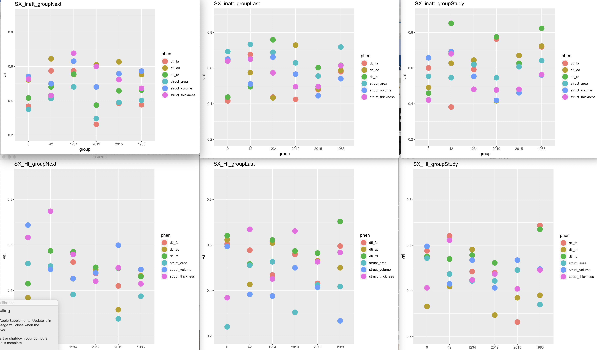
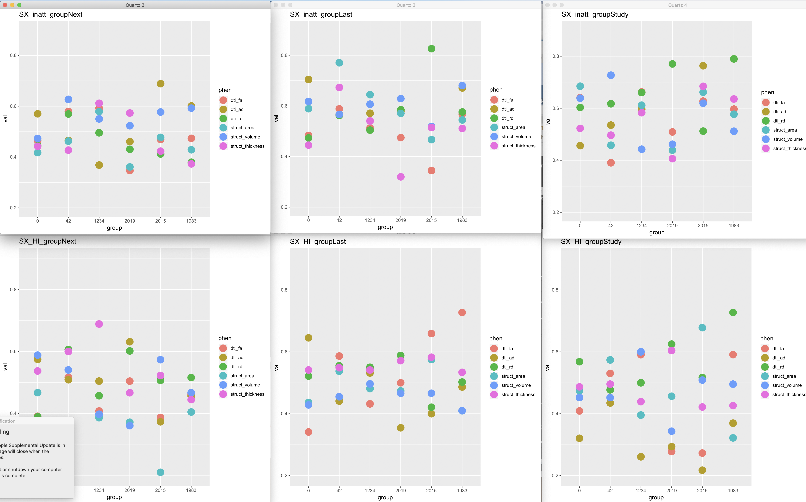
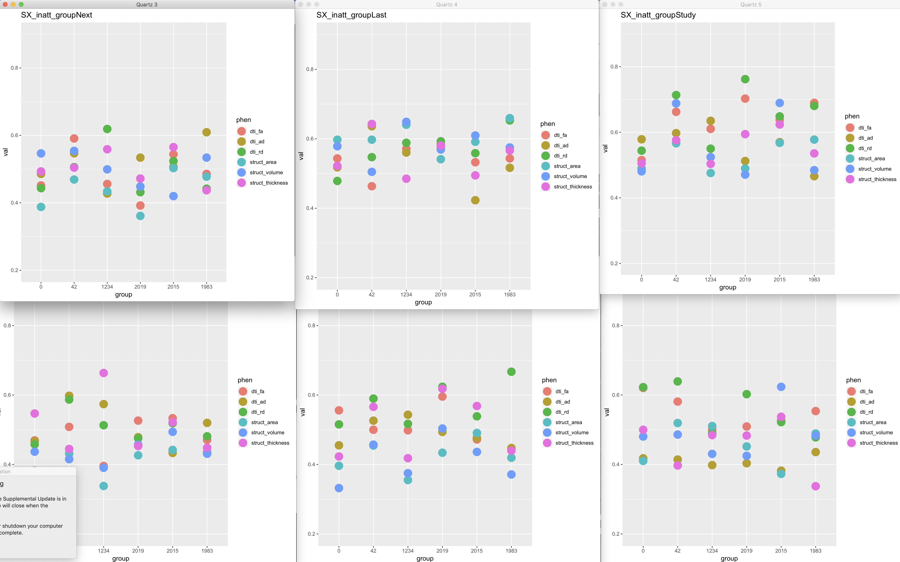
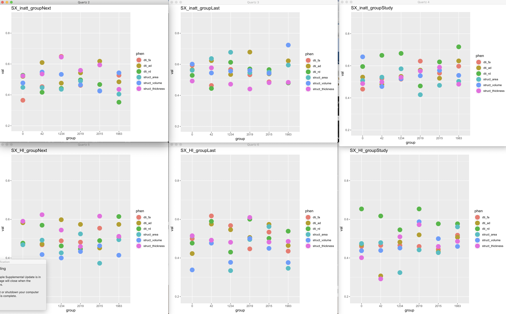
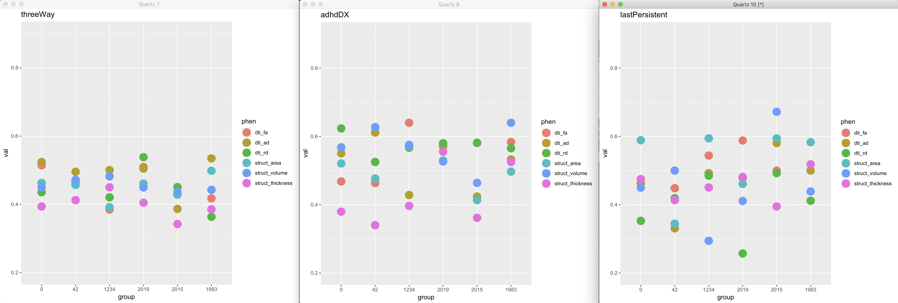
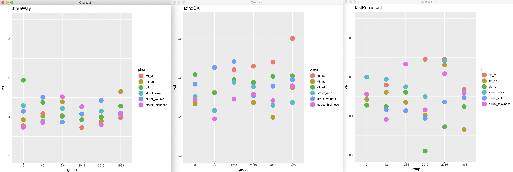
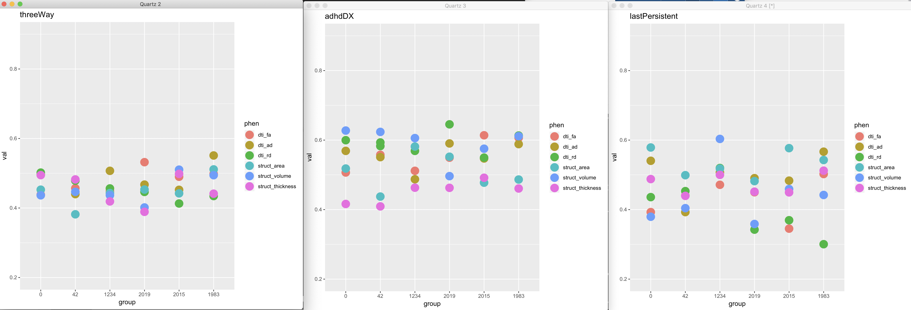
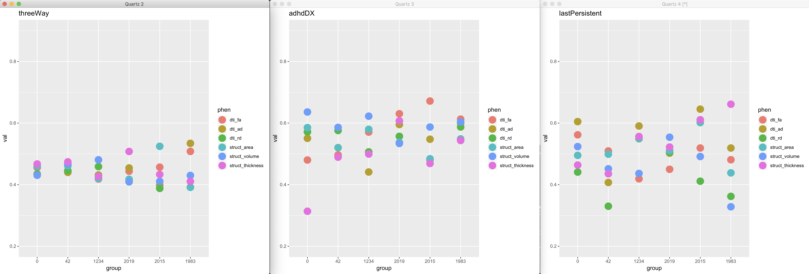
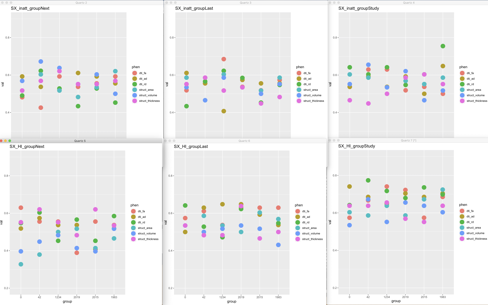

# 2019-11-14 09:05:40

OK, so let's run our results with some fixed seeds and see how that goes. I'll
also try the fixed split later.

```bash
# bw
export OMP_NUM_THREADS=4
cd ~/data/baseline_prediction/manual_swarms

jname=fpr;
swarm_file=swarm.${jname};
rm -f $swarm_file;
code=~/research_code/baseline_prediction/univariate_fpr_classifier.py;
res=~/data/baseline_prediction/manual_results;
for s in `cat ../fixed.txt`; do
    for p in dti_fa dti_ad dti_rd struct_area struct_volume struct_thickness; do
        phen=~/data/baseline_prediction/${p}_OD0.95_baseDX_11072019.csv;
        echo "python3 $code $phen threeWay $res $s" >> $swarm_file;
        echo "python3 $code $phen adhdDX $res $s" >> $swarm_file;
        phen=~/data/baseline_prediction/${p}_OD0.95_11052019.csv;
        for i in Next Last Study; do
            for j in SX_inatt SX_HI; do
                echo "python3 $code $phen ${j}_group${i} $res $s" >> $swarm_file;
            done;
        done;
        phen2=~/data/baseline_prediction/${p}_OD0.95_DSM5Outcome_11052019.csv;
        echo "python3 $code $phen2 lastPersistent $res $s" >> $swarm_file;
    done;
    phen2=~/data/baseline_prediction/clinics_binary_baseDX_11072019.csv;
    echo "python3 $code $phen2 threeWay $res $s" >> $swarm_file;
    echo "python3 $code $phen2 adhdDX $res $s" >> $swarm_file;
done;
swarm --gres=lscratch:10 -f $swarm_file -t 32 -g 20 -b 24 --logdir=trash_${jname} \
    --job-name ${jname} --time=5:00 --merge-output --partition quick,norm
```

I'll also try the ensembles, just in case:

```bash
# bw
export OMP_NUM_THREADS=1
cd ~/data/baseline_prediction/manual_swarms

jname=xgbFixed;
swarm_file=swarm.${jname};
rm -f $swarm_file;
code=~/research_code/baseline_prediction/xgb_classifier.py;
res=~/data/baseline_prediction/manual_results;
for s in `cat ../fixed.txt`; do
    for p in dti_fa dti_ad dti_rd struct_area struct_volume struct_thickness; do
        phen=~/data/baseline_prediction/${p}_OD0.95_baseDX_11072019.csv;
        echo "python3 $code $phen threeWay $res $s" >> $swarm_file;
        echo "python3 $code $phen adhdDX $res $s" >> $swarm_file;
        phen=~/data/baseline_prediction/${p}_OD0.95_11052019.csv;
        for i in Next Last Study; do
            for j in SX_inatt SX_HI; do
                echo "python3 $code $phen ${j}_group${i} $res $s" >> $swarm_file;
            done;
        done;
        phen2=~/data/baseline_prediction/${p}_OD0.95_DSM5Outcome_11052019.csv;
        echo "python3 $code $phen2 lastPersistent $res $s" >> $swarm_file;
    done;
    phen2=~/data/baseline_prediction/clinics_binary_baseDX_11072019.csv;
    echo "python3 $code $phen2 threeWay $res $s" >> $swarm_file;
    echo "python3 $code $phen2 adhdDX $res $s" >> $swarm_file;
done;
swarm --gres=lscratch:10 -f $swarm_file -t 32 -g 20 -b 48 --logdir=trash_${jname} \
    --job-name ${jname} --time=5:00 --merge-output --partition quick,norm
```

```bash
# bw
export OMP_NUM_THREADS=32
cd ~/data/baseline_prediction/manual_swarms

jname=rfFixed;
swarm_file=swarm.${jname};
rm -f $swarm_file;
code=~/research_code/baseline_prediction/rf_classifier.py;
res=~/data/baseline_prediction/manual_results;
for s in `cat ../fixed.txt`; do
    for p in dti_fa dti_ad dti_rd struct_area struct_volume struct_thickness; do
        phen=~/data/baseline_prediction/${p}_OD0.95_baseDX_11072019.csv;
        echo "python3 $code $phen threeWay $res $s" >> $swarm_file;
        echo "python3 $code $phen adhdDX $res $s" >> $swarm_file;
        phen=~/data/baseline_prediction/${p}_OD0.95_11052019.csv;
        for i in Next Last Study; do
            for j in SX_inatt SX_HI; do
                echo "python3 $code $phen ${j}_group${i} $res $s" >> $swarm_file;
            done;
        done;
        phen2=~/data/baseline_prediction/${p}_OD0.95_DSM5Outcome_11052019.csv;
        echo "python3 $code $phen2 lastPersistent $res $s" >> $swarm_file;
    done;
    phen2=~/data/baseline_prediction/clinics_binary_baseDX_11072019.csv;
    echo "python3 $code $phen2 threeWay $res $s" >> $swarm_file;
    echo "python3 $code $phen2 adhdDX $res $s" >> $swarm_file;
done;
swarm --gres=lscratch:10 -f $swarm_file -t 32 -g 20 -b 8 --logdir=trash_${jname} \
    --job-name ${jname} --time=30:00 --merge-output --partition quick,norm
```

For the fixed splits, we'll need to change the scripts a bit to take in as
arguments train and test set data. Then, it's just a matter of separating the
datasets.

Let's do that for each of our candidate datasets... actually, this is getting a
bit too complicated, because I'd need different train/test sets for different
targets, if we want to keep it stratified. Let's not do this for now, and just
check which of our seeds work best. Then we can check the other tweaks we
currently have in TODO to make it even better.

For example, we can do the above for 65-35 splits (changed it as I was running
to use the _65-35 version of the scripts).

So, let's do some plotting now. Of the 6 fixed seeds we're using, does any of
them show a clear difference?

```r
library(ggplot2)
mydir='~/data/baseline_prediction/manual_results/'
seeds = as.character(c(0, 42, 1234, 2019, 2015, 1983))
pipe = 'FPR'
for (j in c('SX_inatt', 'SX_HI')) {
    for (i in c('Next', 'Last', 'Study')) {
        target = sprintf('%s_group%s', j, i)
        tmp = c()
        dev.new()
        for (s in seeds) {
            for (phen in c('dti_fa', 'dti_ad', 'dti_rd', 'struct_area',
                            'struct_volume', 'struct_thickness')) {
                data = read.csv(sprintf('%s/classification_results_%s_%s_OD0.95_11052019.csv',
                                            mydir, pipe, phen), header=0)
                target_idx = grepl(data$V1, pattern=target)
                seed_idx = grepl(data$V1, pattern=sprintf('_%s$', s))
                res_rows = which(target_idx & seed_idx)
                tmp = rbind(tmp, data.frame(group=s, val=data[res_rows, 'V3'], phen=phen))
            }
        }
        print(ggplot(tmp, aes(x=group, y=val, color=phen)) + geom_point(size=6) + ylim(.2, .9) + ggtitle(target))
    }
}
graphics.off()
```



This is what it looks like for FPR. Either 42 or 1983 look fine. Let's see if
it's the same for other pipelines.

It doesn't look like RF finished running.



Looks like 1983 is also a fair selection for XGB (above). Let's see how these
change if we use 65-35. First, FPR then XGB:




As expected by increasing the test set and reducing the training, our spread in
test results is smaller. Seems like 42, 1983 or 2019 are still good candidates.

Let me see if all of that is still true for adhdDX, lastPersistent, and 3-way.

```r
library(ggplot2)
mydir='~/data/baseline_prediction/manual_results/'
seeds = as.character(c(0, 42, 1234, 2019, 2015, 1983))
pipe = 'FPR'
for (target in c('threeWay', 'adhdDX')) {
    tmp = c()
    dev.new()
    for (s in seeds) {
        for (phen in c('dti_fa', 'dti_ad', 'dti_rd', 'struct_area',
                        'struct_volume', 'struct_thickness')) {
            data = read.csv(sprintf('%s/classification_results_%s_%s_OD0.95_baseDX_11072019.csv',
                                            mydir, pipe, phen), header=0)
            target_idx = grepl(data$V1, pattern=target)
            seed_idx = grepl(data$V1, pattern=sprintf('_%s$', s))
            res_rows = which(target_idx & seed_idx)
            tmp = rbind(tmp, data.frame(group=s, val=data[res_rows, 'V3'], phen=phen))
        }
    }
    print(ggplot(tmp, aes(x=group, y=val, color=phen)) + geom_point(size=6) + ylim(.2, .9) + ggtitle(target))
}
tmp = c()
dev.new()
target='lastPersistent'
for (s in seeds) {
    for (phen in c('dti_fa', 'dti_ad', 'dti_rd', 'struct_area',
                    'struct_volume', 'struct_thickness')) {
        data = read.csv(sprintf('%s/classification_results_%s_%s_OD0.95_DSM5Outcome_11052019.csv',
                                        mydir, pipe, phen), header=0)
        target_idx = grepl(data$V1, pattern=target)
        seed_idx = grepl(data$V1, pattern=sprintf('_%s$', s))
        res_rows = which(target_idx & seed_idx)
        tmp = rbind(tmp, data.frame(group=s, val=data[res_rows, 'V3'], phen=phen))
    }
}
print(ggplot(tmp, aes(x=group, y=val, color=phen)) + geom_point(size=6) + ylim(.2, .9) + ggtitle(target))
graphics.off()
```



Not much difference in these FPR results. Maybe keeping 1983? LEt's see XGB:



It does feel like we can really improve on these XGB results. 1983 still does
well especially for adhdDX. How does the 65-35 split affect this?





Seems like 1983 is still doing well. Let's go with that, and try to tweak our
algorithms to do better.

Let's play a bit with XGB and LR, within the 65-35 split and 1983 seed, rd, SX_inatt_groupStudy.

XGB: regular: .564, test: .72 (alpha=.1) so, no overfitting, just lucked out on
the training set as we weren't doing especially well in training. Added
scale_pos_weight=(np.sum(y==0) / np.sum(y==1)), and got .558 and .73 in testing.
No harm no foul, so let's keep tweaking. 

```python
from scipy.stats import uniform, randint
estimators = [('some_variace', VarianceThreshold(threshold=0)),
                  ('unit_variance', StandardScaler()),
                    ('selector', SelectFpr(f_classif)),
                  ('clf', XGBClassifier(random_state=myseed,
                                        nthread=ncpus, eval_metric='auc'))]
params = {
    "clf__colsample_bytree": uniform(0.7, 0.3),
    "clf__gamma": uniform(0, 0.5),
    "clf__learning_rate": uniform(0.03, 0.3), # default 0.1 
    "clf__max_depth": randint(2, 6), # default 3
    "clf__n_estimators": randint(100, 150), # default 100
    "clf__subsample": uniform(0.6, 0.4),
    'selector__alpha': [.01, .03, .05, .07, .1, 1]
}
my_search = RandomizedSearchCV(pipe, param_distributions=params, random_state=myseed, n_iter=200, cv=3, verbose=1, n_jobs=1, return_train_score=True, iid=False)
```

With this extra tuning, I got .646 train, .7 test. I like this a bit better even
though testing went down, because it shows we're learning more from the data. Let
me see if I remove the restricitveness of the univariate classifier if it makes
it better. 

```python
params = {
    "clf__colsample_bytree": uniform(0.7, 0.3),
    "clf__gamma": uniform(0, 0.5),
    "clf__learning_rate": uniform(0.03, 0.3), # default 0.1 
    "clf__max_depth": randint(2, 6), # default 3
    "clf__n_estimators": randint(100, 150), # default 100
    "clf__subsample": uniform(0.6, 0.4),
    'selector__alpha': [1]
}
```

It gets even better, at .677 in training, and I'm at .74 in testing. So,
definitely learning something. Let's try to push it even further. Trying a
5-fold CV first, instead of 3: train: .666, test: .64. so we overfit a bit more.
Let's keep it more conservative then with cv=3. What else can we tweak? 


I'm doing the same tests above, but for LR+EN. I started with:

```
In [39]: params                                                                                                                                                                         
Out[39]: 
{'clf__l1_ratio': array([0.1, 0.2, 0.3, 0.4, 0.5, 0.6, 0.7, 0.8, 0.9]),
 'clf__C': [0.0001,
  0.000774263683,
  0.0059948425,
  0.0464158883,
  0.359381366,
  2.7825594,
  21.5443469,
  166.810054,
  1291.54967,
  10000.0],
 'selector__alpha': [0.05, 0.1, 1]}

In [40]: estimators                                                                                                                                                                     
Out[40]: 
[('some_variace', VarianceThreshold(threshold=0)),
 ('unit_variance', StandardScaler(copy=True, with_mean=True, with_std=True)),
 ('reduce_dim',
  PCA(copy=True, iterated_power='auto', n_components=None, random_state=None,
      svd_solver='auto', tol=0.0, whiten=False)),
 ('selector',
  SelectFpr(alpha=0.05, score_func=<function f_classif at 0x1357e6ae8>)),
 ('clf', LogisticRegression(C=1.0, class_weight='balanced', dual=False,
                     fit_intercept=True, intercept_scaling=1, l1_ratio=None,
                     max_iter=100, multi_class='warn', n_jobs=None,
                     penalty='elasticnet', random_state=None, solver='saga',
                     tol=0.0001, verbose=0, warm_start=False))]
```

which gives me .581 training and .74 testing. Again, seems like I'm getting luck in my split
here. Like my XGB results, I'm going to remove the univariate requirement, and
try a RandomCV:

```python
from scipy.stats import uniform, randint
estimators = [('some_variace', VarianceThreshold(threshold=0)),
                  ('unit_variance', StandardScaler()),
                  ('clf', LogisticRegression(penalty='elasticnet',
                                             solver='saga',
                                             class_weight='balanced'))]
pipe = Pipeline(estimators)
params = {
    "clf__l1_ratio": uniform(loc=0.1, scale=.89),
    "clf__C": uniform(0.0001, 10000),
}
my_search = RandomizedSearchCV(pipe, param_distributions=params, random_state=myseed, n_iter=200, cv=3, verbose=1, n_jobs=1, return_train_score=True, iid=False)
```

# 2019-11-15 09:22:53

We're back trying to tweak XGB and EL:

```python
estimators = [('clf', XGBClassifier(random_state=myseed,
                                    nthread=ncpus, eval_metric='auc',
                                    scale_pos_weight=(np.sum(y==0) / np.sum(y==1))))]
pipe = Pipeline(estimators)
params = {
    "clf__colsample_bytree": uniform(0.7, 0.3),
    "clf__gamma": uniform(0, 0.5),
    "clf__learning_rate": uniform(0.03, 0.3), # default 0.1 
    "clf__max_depth": randint(2, 6), # default 3
    "clf__n_estimators": randint(100, 150), # default 100
    "clf__subsample": uniform(0.6, 0.4),
}
my_search = RandomizedSearchCV(pipe, param_distributions=params, random_state=myseed, n_iter=200, cv=3, verbose=1, n_jobs=1, return_train_score=True, iid=False)
my_search.fit(X[training_indices], y[training_indices])
report(my_search.cv_results_, n_top=5)
val_score = my_search.score(X[testing_indices], y[testing_indices])
print('Testing: %.2f' % val_score)
```

It looks like I'm starting to overfit though... I'm getting .708 in training,
.62 in testing. Let's see if increasing from 200 to 500 iterations helps. Nope,
same thing just taking longer. Adding balanced classes again. Now we're back to
.677 in training and .74 testing. Let's see if we can go further by tweaking the
values closer to the range of the best learners:

```python
estimators = [('clf', XGBClassifier(random_state=myseed,
                                    nthread=ncpus, eval_metric='auc',
                                    scale_pos_weight=(np.sum(y==0) / np.sum(y==1))))]
pipe = Pipeline(estimators)
params = {
    "clf__colsample_bytree": uniform(0.9, 0.1),
    "clf__gamma": uniform(0, 0.5),
    "clf__learning_rate": uniform(0.1, 0.2), # default 0.1 
    "clf__max_depth": randint(3, 6), # default 3
    "clf__n_estimators": randint(100, 150), # default 100
    "clf__subsample": uniform(0.6, 0.2),
}
my_search = RandomizedSearchCV(pipe, param_distributions=params, random_state=myseed, n_iter=200, cv=3, verbose=1, n_jobs=1, return_train_score=True, iid=False)
my_search.fit(X[training_indices], y[training_indices])
report(my_search.cv_results_, n_top=5)
val_score = my_search.score(X[testing_indices], y[testing_indices])
print('Testing: %.2f' % val_score)
```

Training remoained the same, but testing went down... well, let's keep it the
previous way then. I'll go ahead and up it to 500 so we can get a good idea of
the results, and just run everyone that way.


# XGB terminal 2

```python
from scipy.stats import uniform, randint
estimators = [('selector', SelectFpr(f_classif)),
              ('clf', XGBClassifier(random_state=myseed,
                                    nthread=ncpus, eval_metric='auc',
                                    scale_pos_weight=(np.sum(y==0) / np.sum(y==1))))]
pipe = Pipeline(estimators)
params = {
    "clf__colsample_bytree": uniform(0.7, 0.3),
    "clf__gamma": uniform(0, 0.5),
    "clf__learning_rate": uniform(0.03, 0.3), # default 0.1 
    "clf__max_depth": randint(2, 6), # default 3
    "clf__n_estimators": randint(100, 150), # default 100
    "clf__subsample": uniform(0.6, 0.4),
    'selector__alpha': [.05, .1, 1],
}
my_search = RandomizedSearchCV(pipe, param_distributions=params, random_state=myseed, n_iter=200, cv=3, verbose=1, n_jobs=1, return_train_score=True, iid=False)
my_search.fit(X[training_indices], y[training_indices])
report(my_search.cv_results_, n_top=5)
val_score = my_search.score(X[testing_indices], y[testing_indices])
print('Testing: %.2f' % val_score)
```

After adding back the univariate selector, I'm up to .677 training and .66
testing. But that could just be the scale_pos parameter too, so I'll remove
univariate selection for now and keep this therminal for ELLR tuning.

I'll try a PCA after the univariate selector:

```python
from scipy.stats import uniform, randint
estimators = [('some_variace', VarianceThreshold(threshold=0)),
                  ('unit_variance', StandardScaler()),
                  ('selector', SelectFpr(f_classif)),
                   ('reduce_dim', PCA()),
                  ('clf', LogisticRegression(penalty='elasticnet',
                                             solver='saga',
                                             class_weight='balanced'))]
pipe = Pipeline(estimators)
params = {
    "clf__l1_ratio": uniform(loc=0.1, scale=.89),
    "clf__C": uniform(0.0001, 10000),
    'selector__alpha': [.01, .05, .1, 1],
}
my_search = RandomizedSearchCV(pipe, param_distributions=params, random_state=myseed, n_iter=500, cv=3, verbose=1, n_jobs=1, return_train_score=True, iid=False)
my_search.fit(X[training_indices], y[training_indices])
report(my_search.cv_results_, n_top=5)
val_score = my_search.score(X[testing_indices], y[testing_indices])
print('Testing: %.2f' % val_score)
```

We go up to .616 in training, but only .6 in testing.

## ELLR

Let's try some things first to remove correlation in features:

```python
from scipy.stats import uniform, randint
estimators = [('some_variace', VarianceThreshold(threshold=0)),
                  ('unit_variance', StandardScaler()),
                  ('selector', SelectFpr(f_classif)),
                #   ('reduce_dim', PCA()),
                  ('clf', LogisticRegression(penalty='elasticnet',
                                             solver='saga',
                                             class_weight='balanced'))]
pipe = Pipeline(estimators)
params = {
    "clf__l1_ratio": uniform(loc=0.1, scale=.89),
    "clf__C": uniform(0.0001, 10000),
    'selector__alpha': [.01, .05, .1, 1],
}
my_search = RandomizedSearchCV(pipe, param_distributions=params, random_state=myseed, n_iter=500, cv=3, verbose=1, n_jobs=1, return_train_score=True, iid=False)
my_search.fit(X[training_indices], y[training_indices])
report(my_search.cv_results_, n_top=5)
val_score = my_search.score(X[testing_indices], y[testing_indices])
print('Testing: %.2f' % val_score)
```

Using the PCA idea we get .563 in training and .7 testing... Let's try to
increase the number of iterations from 200 to 500. No, no difference. What
happens if we remove PCA? Removing PCA gained a bit in training to .574 but
removed from testing at .68. Is it better if we add a univariate selector? 

## Getting number for all domains

OK, now that we have a somewhat nice range of parameters to tune for XGB, let's
run it for all the domains:

```bash
# bw
export OMP_NUM_THREADS=1
cd ~/data/baseline_prediction/manual_swarms

jname=xgbTuned;
swarm_file=swarm.${jname};
rm -f $swarm_file;
code=~/research_code/baseline_prediction/xgb_classifier_65-35.py;
res=~/data/baseline_prediction/manual_results_xgb;
for s in `cat ../fixed.txt`; do
    for p in dti_fa dti_ad dti_rd struct_area struct_volume struct_thickness; do
        phen=~/data/baseline_prediction/${p}_OD0.95_baseDX_11072019.csv;
        echo "python3 $code $phen adhdDX $res $s" >> $swarm_file;
        phen=~/data/baseline_prediction/${p}_OD0.95_11052019.csv;
        for i in Next Last Study; do
            for j in SX_inatt SX_HI; do
                echo "python3 $code $phen ${j}_group${i} $res $s" >> $swarm_file;
            done;
        done;
        phen2=~/data/baseline_prediction/${p}_OD0.95_DSM5Outcome_11052019.csv;
        echo "python3 $code $phen2 lastPersistent $res $s" >> $swarm_file;
    done;
    phen2=~/data/baseline_prediction/clinics_binary_baseDX_11072019.csv;
    echo "python3 $code $phen2 adhdDX $res $s" >> $swarm_file;
done;
swarm --gres=lscratch:10 -f $swarm_file -t 32 -g 20 -b 8 --logdir=trash_${jname} \
    --job-name ${jname} --time=30:00 --merge-output --partition quick,norm
```

Then, to get feature importance we do something like
my_search.best_estimator_[0].feature_importances_ , but the issue is that I'm
only getting about 119 out of the 11990 features with nonzero weights. That's
not necessarily bad, but the solution is quite sparse to be displayed. We could
single out the regions where the voxels are... but would a PCA before XGB help
in any way? Then it's just be a matter of combining the maps based on their
weights...

We do take a hit, down to about .647/.68 (train/test). What if I do the PCA
outside CV? Even bigger loss. I even tried playing with the tuning values to
make sure it was well adapted to XGB, but it didn't help. 

Also, is 119 a coincidence or is it always like this (1%)? Yes, it will always
be between 100 and 150 because that's the number of trees I asked it to use
(n_estimators).
 
Before we jump into an even more complex tuning of XGB (like this
https://www.analyticsvidhya.com/blog/2016/03/complete-guide-parameter-tuning-xgboost-with-codes-python/),
let's see if our idea for seed is still good:

```r
library(ggplot2)
mydir='~/data/baseline_prediction/manual_results_xgb/'
seeds = as.character(c(0, 42, 1234, 2019, 2015, 1983))
pipe = 'XGB'
for (j in c('SX_inatt', 'SX_HI')) {
    for (i in c('Next', 'Last', 'Study')) {
        target = sprintf('%s_group%s', j, i)
        tmp = c()
        dev.new()
        for (s in seeds) {
            for (phen in c('dti_fa', 'dti_ad', 'dti_rd', 'struct_area',
                            'struct_volume', 'struct_thickness')) {
                data = read.csv(sprintf('%s/classification_results_%s_65-35_%s_OD0.95_11052019.csv',
                                            mydir, pipe, phen), header=0)
                target_idx = grepl(data$V1, pattern=target)
                seed_idx = grepl(data$V1, pattern=sprintf('_%s$', s))
                res_rows = which(target_idx & seed_idx)
                tmp = rbind(tmp, data.frame(group=s, val=data[res_rows, 'V3'], phen=phen))
            }
        }
        print(ggplot(tmp, aes(x=group, y=val, color=phen)) + geom_point(size=6) + ylim(.2, .9) + ggtitle(target))
    }
}
graphics.off()
```



It's actually a bit better now, because there isn't much of a difference
anymore, as it should be. I'm gonna stick with 42 for now because no one would
ever complain about that. Also, let's focus on groupStudy variables.   

```bash
# bw
export OMP_NUM_THREADS=1
cd ~/data/baseline_prediction/manual_swarms

jname=xgbTuned2;
swarm_file=swarm.${jname};
rm -f $swarm_file;
code=~/research_code/baseline_prediction/xgb_classifier_65-35.py;
res=~/data/baseline_prediction/manual_results_xgb_tuned;
s=42;
for p in dti_fa dti_ad dti_rd struct_area struct_volume struct_thickness; do
    phen=~/data/baseline_prediction/${p}_OD0.95_baseDX_11072019.csv;
    echo "python3 $code $phen adhdDX $res $s" >> $swarm_file;
    phen=~/data/baseline_prediction/${p}_OD0.95_11052019.csv;
    for i in Next Last Study; do
        for j in SX_inatt SX_HI; do
            echo "python3 $code $phen ${j}_group${i} $res $s" >> $swarm_file;
        done;
    done;
    phen2=~/data/baseline_prediction/${p}_OD0.95_DSM5Outcome_11052019.csv;
    echo "python3 $code $phen2 lastPersistent $res $s" >> $swarm_file;
done;
phen2=~/data/baseline_prediction/clinics_binary_baseDX_11072019.csv;
echo "python3 $code $phen2 adhdDX $res $s" >> $swarm_file;
swarm --gres=lscratch:10 -f $swarm_file -t 32 -g 20 -b 8 --logdir=trash_${jname} \
    --job-name ${jname} --time=30:00 --merge-output --partition quick,norm
```

Not sure if these computations will finish in time, but here are the results:

Now I need to derive 95% CI for each result...


# TODO
*  Keep on playing with logistic regression with elastic net penalizer, similar
   to Uher paper, or even just LassoIC for the desscriptives:
   https://scikit-learn.org/stable/modules/generated/sklearn.linear_model.LassoLarsIC.html#sklearn.linear_model.LassoLarsIC
* Try adding in rsfmri to see if things get better
* Try combining the datasets: here, it's best to first create rsfmri, cognitive,
  and PRS datasets. Then, combine everything into a mega dataset, and also as a
  version that only people with data in all domains stay. Then, that should be
  easy to manually tune in order to get a compounded classifier. For voting, I
  can train a majority voter per domain and do it that way, but using that
  dataset to make sure the same people are heldout in the different folds of CV
  and for testing.
* Final effort will be to do a descriptive paper, and then have a second part
   showing that similar methods don't work in a predictive framework 
* https://scikit-learn.org/stable/modules/generated/sklearn.linear_model.LogisticRegressionCV.html#sklearn.linear_model.LogisticRegressionCV
* Philip would like to include descriptives regardless. Run them in small set of
  features, 1 to about 10 subjects. Then, the flow could be that ML in this set
  of feature doesn't work too well, and that's why we bring in machines to be
  able to run voxels. Finally, we show combining domain results.
  * How about using image analysis feature descriptors in neuroscience? Things
    like HOG: Histogram of Oriented Gradients, SIFT: Scale Invariant Feature
    Transform, or SURF: Speeded-Up Robust Feature
    Or maybe use something like FeatureTools
    (https://www.analyticsvidhya.com/blog/2018/08/guide-automated-feature-engineering-featuretools-python/)
* Need to re-run age, QC, sex decoding again to make sure it's not drivign the results!
