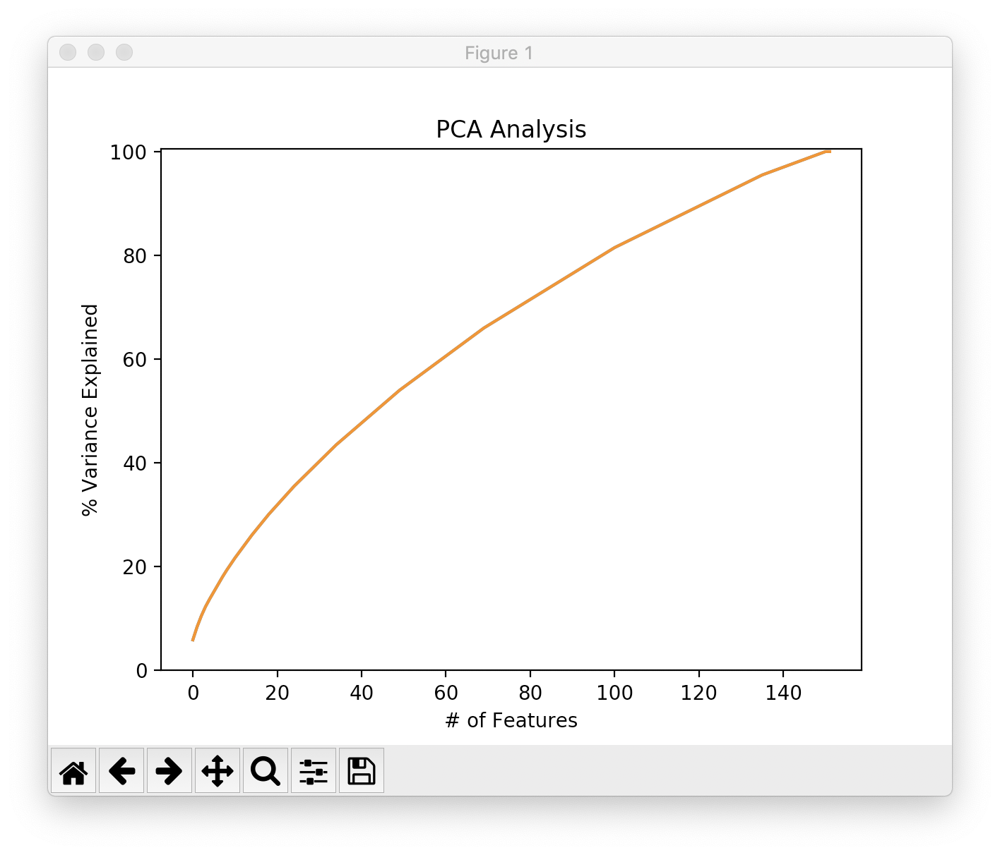

# 2019-11-20 13:27:10

Let's get started with the sdescriptives, mostly showing that there's something
there, but then the same methods fail for prediction. We'll go with Lasso and
AIC or BIC, since we're not doing cross-validation. Note that here we'll need to
use a compressed set of variables, otherwise we'll perfectly decode, right?

```python
from sklearn.linear_model import LassoLarsIC
import pandas as pd
import os


home = os.path.expanduser('~')
phen_fname = home + '/data/baseline_prediction/dti_ad_OD0.95_11052019.csv'
target = 'SX_inatt_groupStudy'
data = pd.read_csv(phen_fname)
feature_names = [f for f in data.columns if f.find('v_') == 0]
data[target] = data[target].map({'improvers': 1, 'nonimprovers': 0})

model_bic = LassoLarsIC(criterion='bic')
model_bic.fit(data[feature_names].values, data[target].values)

model_aic = LassoLarsIC(criterion='aic')
model_aic.fit(data[feature_names].values, data[target].values)
```

So, we get 0 error when scoring on the same data we trained, which makes sense.
So, we need to reduce the number of variables to a certain numer that it's <=
number of observations. The first approach is to try JHU tracts, and then we can
go for PCA up to a certain PC. Also, let's switch to a logistic regression
model, potentially even regularized, because this is a classification task, not
regression.

# 2019-11-21 10:44:23

I'm going to work with the PCA version first, because it's the same data file.

```python
from sklearn.preprocessing import scale
from sklearn.decomposition import PCA
import matplotlib.pyplot as plt


X = scale(data[feature_names].values)
pca = PCA()
Xtrans = pca.fit_transform(X)
variance = pca.explained_variance_ratio_
var=np.cumsum(np.round(pca.explained_variance_ratio_, decimals=3)*100)

plt.ylabel('% Variance Explained')
plt.xlabel('# of Features')
plt.title('PCA Analysis')
plt.ylim(0,100.5)
plt.plot(var)
```



No obvious place of where to break... and only th every last component had eigen
value < 1, so Kaiser criteria won't quite work either. So, let's use all PCs
generated, which is n-1.

```python
from sklearn.feature_selection import RFE
from sklearn.svm import LinearSVC


estimator = LinearSVC()
selector = RFE(estimator, 5, step=1)
y = data[target].values
selector = selector.fit(Xtrans, y)
```

## Clustering

I'm going to switch approaches. Philip sugested a mass model with age + sex + IQ
+ handedness + baseline DX, see how that performs. Then, add the best 6-10 brain
  variables, and see how much better it does, if at all. He also said I should
  just go ahea dan impute the data. I think we could eventually do that. For
  now, let's focus on choosing the brain variables. I'll do it within modality,
  using all subjects, and then just import the cluster. Yes, that's clearly
  double-dipping, but that's the entire descriptive analysis anyways.

Now I can do just something like:

```bash
python3 ~/research_code/baseline_prediction/univariate_descriptive.py \
    ~/data/baseline_prediction/dti_rd_OD0.95_11052019.csv SX_HI_groupStudy \
    ~/data/tmp/ ~/data/baseline_prediction/mean_272_fa_skeleton_mask.nii.gz;
3dclust -1Dformat -nosum -1dindex 0 -1tindex 1 -1thresh 0.95 -NN3 5 ~/data/tmp/dti_rd_OD0.95_11052019_SX_HI_groupStudy.nii.gz
```