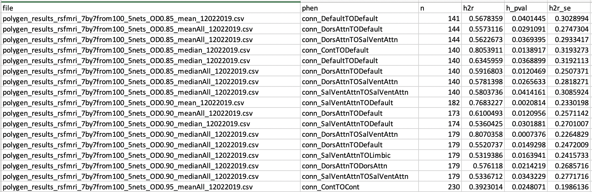
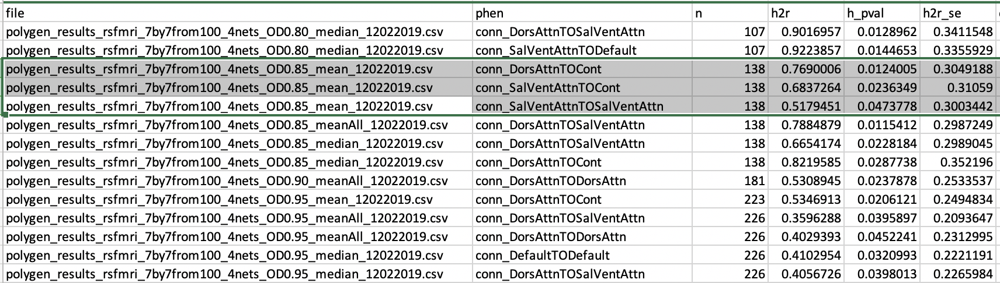
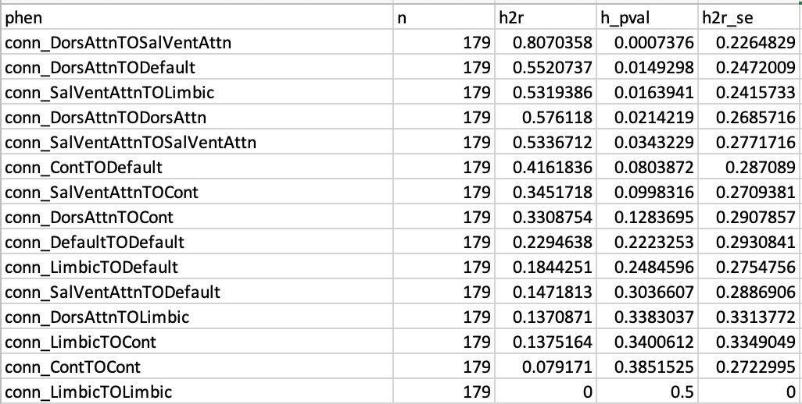
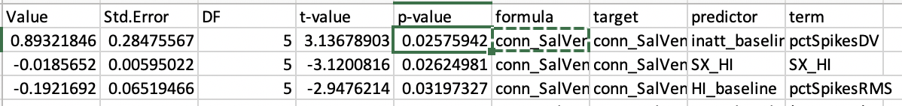

# 2019-12-02 11:05:01

I just noticed a bug in how the fmri connectivity was being calculated. So,
let's redo all the heritability estimates:

```bash
Rscript ~/research_code/fmri/make_outlier_detection_slopes.R .9
```

I ran that for the different thresholds, but only median and positive for now.

```bash
# locally
for OD in 80 85 90 95; do
    suf='median';
    p='';
    cd ~/data/heritability_change
    phen=rsfmri_7by7from100_5nets_OD0.${OD}${p}_${suf}_12022019;
    for t in "conn_DorsAttnTODorsAttn" \
        "conn_DorsAttnTOSalVentAttn" "conn_DorsAttnTOLimbic" "conn_DorsAttnTOCont" \
        "conn_DorsAttnTODefault" "conn_SalVentAttnTOSalVentAttn" \
        "conn_SalVentAttnTOLimbic" "conn_SalVentAttnTOCont" \
        "conn_SalVentAttnTODefault" "conn_LimbicTOLimbic" "conn_LimbicTOCont" \
        "conn_LimbicTODefault" "conn_ContTOCont" "conn_ContTODefault" \
        "conn_DefaultTODefault"; do
            solar run_phen_var_OD_xcp ${phen} ${t};
    done;
    mv ${phen} ~/data/tmp/
    cd ~/data/tmp/${phen}
    for p in `/bin/ls`; do cp $p/polygenic.out ${p}_polygenic.out; done
    python ~/research_code/compile_solar_multivar_results.py ${phen}
done
```

Let's glue everything together to see if there is a pattern

```bash
cd ~/data/tmp
echo "file,phen,n,h2r,h_pval,h2r_se,c2,c2_pval,high_kurtosis" > output_5nets.csv;
for f in `ls polygen_results_*5nets*.csv`; do
    # skip header
    for line in `tail -n +2 $f`; do
        echo $f,$line >> output_5nets.csv;
    done
done
```

Not much there. Let me add mean and all connections variants to see if anything
comes up.

```bash
# locally
for OD in 80 85 90 95; do
    for suf in 'median' 'mean'; do
        for p in '' 'All'; do
            cd ~/data/heritability_change
            phen=rsfmri_7by7from100_5nets_OD0.${OD}_${suf}${p}_12022019;
            for t in "conn_DorsAttnTODorsAttn" \
                "conn_DorsAttnTOSalVentAttn" "conn_DorsAttnTOLimbic" "conn_DorsAttnTOCont" \
                "conn_DorsAttnTODefault" "conn_SalVentAttnTOSalVentAttn" \
                "conn_SalVentAttnTOLimbic" "conn_SalVentAttnTOCont" \
                "conn_SalVentAttnTODefault" "conn_LimbicTOLimbic" "conn_LimbicTOCont" \
                "conn_LimbicTODefault" "conn_ContTOCont" "conn_ContTODefault" \
                "conn_DefaultTODefault"; do
                    solar run_phen_var_OD_xcp ${phen} ${t};
            done;
            mv ${phen} ~/data/tmp/
            cd ~/data/tmp/${phen}
            for p in `/bin/ls`; do cp $p/polygenic.out ${p}_polygenic.out; done
            python ~/research_code/compile_solar_multivar_results.py ${phen}
        done;
    done;
done
```

```bash
cd ~/data/tmp
echo "file,phen,n,h2r,h_pval,h2r_se,c2,c2_pval,high_kurtosis" > output_5nets.csv;
for f in `ls polygen_results_*5nets*.csv`; do
    # skip header
    for line in `tail -n +2 $f`; do
        echo $f,$line >> output_5nets.csv;
    done
done
```



It looks like if we go with
polygen_results_rsfmri_7by7from100_5nets_OD0.90_medianAll_12022019.csv we have
some interesting results. The picture shows everything < .05, then I just sorted
it on phen name. I then copied those polygen files to the main results folder
just in case. I also removed any phenotypes that had h2r=1.

I'm also going to try a version with only 4 networks too, just in case 5nets doesn't
work and I'm still waiting for SOLAR to run above as well. 

```bash
# locally
for OD in 80 85 90 95; do
    for suf in 'median' 'mean'; do
        for p in '' 'All'; do
            cd ~/data/heritability_change
            phen=rsfmri_7by7from100_4nets_OD0.${OD}_${suf}${p}_12022019;
            for t in "conn_DorsAttnTODorsAttn" \
                "conn_DorsAttnTOSalVentAttn"  "conn_DorsAttnTOCont" \
                "conn_DorsAttnTODefault" "conn_SalVentAttnTOSalVentAttn" \
                 "conn_SalVentAttnTOCont" "conn_SalVentAttnTODefault"  \
                "conn_ContTOCont" "conn_ContTODefault" "conn_DefaultTODefault"; do
                    solar run_phen_var_OD_xcp ${phen} ${t};
            done;
            mv ${phen} ~/data/tmp/
            cd ~/data/tmp/${phen}
            for p in `/bin/ls`; do cp $p/polygenic.out ${p}_polygenic.out; done
            python ~/research_code/compile_solar_multivar_results.py ${phen}
        done;
    done;
done
```

```bash
cd ~/data/tmp
echo "file,phen,n,h2r,h_pval,h2r_se,c2,c2_pval,high_kurtosis" > output_4nets.csv;
for f in `ls polygen_results_*4nets*.csv`; do
    # skip header
    for line in `tail -n +2 $f`; do
        echo $f,$line >> output_4nets.csv;
    done
done
```



Here we do slightly better using
polygen_results_rsfmri_7by7from100_4nets_OD0.85_mean_12022019.csv. I'll stick
with 5nets for now, as it gives us a bigger number of subjects. Let's just make
sure that it survives FDR, and then that there is still association.



The only one that survives FDR q < .05 (or .1) is conn_DorsAttnTOSalVentAttn.
But nothing in the 4nets situation. Let's then check whether that connection is
also associated with SX.

```
HG-02113362-DM4:rsfmri_7by7from100_5nets_OD0.90_medianAll_12022019 sudregp$ grep "(Significant)" conn_DorsAttnTOSalVentAttn_polygenic.out
                         H2r is 0.8070358  p = 0.0007376  (Significant)
                              pctSpikesDV  p = 0.0070319  (Significant)
                         motionDVCorrInit  p = 0.0626968  (Significant)
```

```r
library(nlme)
data = read.csv('~/data/heritability_change/rsfmri_7by7from100_5nets_OD0.90_medianAll_12022019.csv')
tmp = read.csv('~/data/heritability_change/pedigree.csv')
data = merge(data, tmp[, c('ID', 'FAMID')], by='ID', all.x=T, all.y=F)

i = 'conn_DorsAttnTOSalVentAttn'
fm_root = '%s ~ %s + pctSpikesDV + motionDVCorrInit'
i = 'conn_DorsAttnTODefault'
fm_root = '%s ~ %s + pctSpikesDV'
# i = 'conn_SalVentAttnTOLimbic'
# fm_root = '%s ~ %s + pctSpikesDV'
# i = 'conn_DorsAttnTODorsAttn'
# fm_root = '%s ~ %s + pctSpikesDV + normCoverage + relMeanRMSMotion'
# i = 'conn_SalVentAttnTOSalVentAttn'
# fm_root = '%s ~ %s + pctSpikesDV + motionDVCorrInit + normCoverage + motionDVCorrFinal + pctSpikesRMS'

out_fname = sprintf('~/data/heritability_change/assoc_%s.csv', i)
predictors = c('SX_inatt', 'SX_HI', 'inatt_baseline', 'HI_baseline', 'DX', 'DX2')
hold=NULL
for (j in predictors) {
    fm_str = sprintf(fm_root, i, j)
    model1<-try(lme(as.formula(fm_str), data, ~1|FAMID, na.action=na.omit))
    if (length(model1) > 1) {
        temp<-summary(model1)$tTable
        a<-as.data.frame(temp)
        a$formula<-fm_str
        a$target = i
        a$predictor = j
        a$term = rownames(temp)
        hold=rbind(hold,a)
    } else {
        hold=rbind(hold, NA)
    }
}
write.csv(hold, out_fname, row.names=F)

data2 = data[data$DX=='ADHD', ]
out_fname = gsub(x=out_fname, pattern='.csv', '_dx1.csv')
predictors = c('SX_inatt', 'SX_HI', 'inatt_baseline', 'HI_baseline')
hold=NULL
for (j in predictors) {
    fm_str = sprintf(fm_root, i, j)
    model1<-try(lme(as.formula(fm_str), data2, ~1|FAMID, na.action=na.omit))
    if (length(model1) > 1) {
        temp<-summary(model1)$tTable
        a<-as.data.frame(temp)
        a$formula<-fm_str
        a$target = i
        a$predictor = j
        a$term = rownames(temp)
        hold=rbind(hold,a)
    } else {
        hold=rbind(hold, NA)
    }
}
write.csv(hold, out_fname, row.names=F)

data2 = data[data$DX2=='ADHD', ]
out_fname = gsub(x=out_fname, pattern='dx1', 'dx2')
predictors = c('SX_inatt', 'SX_HI', 'inatt_baseline', 'HI_baseline')
hold=NULL
for (j in predictors) {
    fm_str = sprintf(fm_root, i, j)
    model1<-try(lme(as.formula(fm_str), data2, ~1|FAMID, na.action=na.omit))
    if (length(model1) > 1) {
        temp<-summary(model1)$tTable
        a<-as.data.frame(temp)
        a$formula<-fm_str
        a$target = i
        a$predictor = j
        a$term = rownames(temp)
        hold=rbind(hold,a)
    } else {
        hold=rbind(hold, NA)
    }
}
write.csv(hold, out_fname, row.names=F)
```

So, conn_DorsAttnTOSalVentAttn is not even close to significance, in none of the
3 types of regression I'm running. How about the other 4 connections that are
nominally heritable?

```
HG-02113362-DM4:rsfmri_7by7from100_5nets_OD0.90_medianAll_12022019 sudregp$ grep "(Significant)" conn_DorsAttnTODefault_polygenic.out
                         H2r is 0.5520737  p = 0.0149298  (Significant)
                              pctSpikesDV  p = 0.0349292  (Significant)
HG-02113362-DM4:rsfmri_7by7from100_5nets_OD0.90_medianAll_12022019 sudregp$ grep "(Significant)" conn_SalVentAttnTOLimbic_polygenic.out 
                         H2r is 0.5319386  p = 0.0163941  (Significant)
                              pctSpikesDV  p = 0.0031629  (Significant)
HG-02113362-DM4:rsfmri_7by7from100_5nets_OD0.90_medianAll_12022019 sudregp$ grep "(Significant)" conn_DorsAttnTODorsAttn_polygenic.out 
                         H2r is 0.5761180  p = 0.0214219  (Significant)
                             normCoverage  p = 0.0006030  (Significant)
                              pctSpikesDV  p = 0.0000139  (Significant)
                         relMeanRMSMotion  p = 0.0492652  (Significant)
HG-02113362-DM4:rsfmri_7by7from100_5nets_OD0.90_medianAll_12022019 sudregp$ grep "(Significant)" conn_SalVentAttnTOSalVentAttn_polygenic.out 
                         H2r is 0.5336712  p = 0.0343229  (Significant)
                             normCoverage  p = 0.0845580  (Significant)
                              pctSpikesDV  p = 0.0951218  (Significant)
                         motionDVCorrInit  p = 0.0001882  (Significant)
                        motionDVCorrFinal  p = 0.0420654  (Significant)
                             pctSpikesRMS  p = 0.0098802  (Significant)
```

The only one is conn_SalVentAttnTOSalVentAttn, which is associated with SX_HI at
.025, at DX2 type.



I didn't check the other types, though. But that's the only connection at DX2.

# Genetic correlation

Let's start within fmri:

The last step before robustness is the bivariate heritability analysis.

```bash
phen=rsfmri_7by7from100_5nets_OD0.90_medianAll_12022019;
cd ~/data/heritability_change
for t in "conn_DorsAttnTODorsAttn" \
                "conn_DorsAttnTOSalVentAttn" "conn_DorsAttnTOLimbic" "conn_DorsAttnTOCont" \
                "conn_DorsAttnTODefault" "conn_SalVentAttnTOSalVentAttn" \
                "conn_SalVentAttnTOLimbic" "conn_SalVentAttnTOCont" \
                "conn_SalVentAttnTODefault" "conn_LimbicTOLimbic" "conn_LimbicTOCont" \
                "conn_LimbicTODefault" "conn_ContTOCont" "conn_ContTODefault" \
                "conn_DefaultTODefault"; do
        solar rsfmri_xcp_base_slope_correlation $phen ${t};
done
cd gencor_$phen
grep -r RhoG */polygenic.out > rhog.txt
grep zero rhog.txt
grep "\-1" rhog.txt
```

Not much there for results. They're either 0 or -1, or at least not
significantly different than those.

```
HG-02113362-DM4:gencor_rsfmri_7by7from100_5nets_OD0.90_medianAll_12022019 sudregp$ grep zero rhog.txt
conn_ContTOCont_AND_baseconn_ContTOCont/polygenic.out:         RhoG different from zero  p = 0.0005589
conn_ContTODefault_AND_baseconn_ContTODefault/polygenic.out:           RhoG different from zero  p = 3.325347e-06
conn_DefaultTODefault_AND_baseconn_DefaultTODefault/polygenic.out:             RhoG different from zero  p = 0.9266462
conn_DorsAttnTOCont_AND_baseconn_DorsAttnTOCont/polygenic.out:         RhoG different from zero  p = 0.0693849
conn_DorsAttnTODefault_AND_baseconn_DorsAttnTODefault/polygenic.out:           RhoG different from zero  p = 0.0005720
conn_DorsAttnTODorsAttn_AND_baseconn_DorsAttnTODorsAttn/polygenic.out:         RhoG different from zero  p = 0.0923875
conn_DorsAttnTOLimbic_AND_baseconn_DorsAttnTOLimbic/polygenic.out:             RhoG different from zero  p = 0.1924130
conn_DorsAttnTOSalVentAttn_AND_baseconn_DorsAttnTOSalVentAttn/polygenic.out:           RhoG different from zero  p = 0.0025333
conn_LimbicTOCont_AND_baseconn_LimbicTOCont/polygenic.out:             RhoG different from zero  p = 0.7883320
conn_LimbicTODefault_AND_baseconn_LimbicTODefault/polygenic.out:               RhoG different from zero  p = 0.2135416
conn_LimbicTOLimbic_AND_baseconn_LimbicTOLimbic/polygenic.out:         RhoG different from zero  p = 1.0000000
conn_SalVentAttnTOCont_AND_baseconn_SalVentAttnTOCont/polygenic.out:           RhoG different from zero  p = 0.0320647
conn_SalVentAttnTODefault_AND_baseconn_SalVentAttnTODefault/polygenic.out:             RhoG different from zero  p = 0.4222949
conn_SalVentAttnTOLimbic_AND_baseconn_SalVentAttnTOLimbic/polygenic.out:               RhoG different from zero  p = 0.0940737
conn_SalVentAttnTOSalVentAttn_AND_baseconn_SalVentAttnTOSalVentAttn/polygenic.out:             RhoG different from zero  p = 0.2564076

HG-02113362-DM4:gencor_rsfmri_7by7from100_5nets_OD0.90_medianAll_12022019 sudregp$ grep "\-1" rhog.txt
conn_ContTOCont_AND_baseconn_ContTOCont/polygenic.out:                   RhoG is -1.0000000
conn_ContTODefault_AND_baseconn_ContTODefault/polygenic.out:                     RhoG is -1.0000000
conn_DefaultTODefault_AND_baseconn_DefaultTODefault/polygenic.out:             RhoG different from -1.0  p = 0.2370629
conn_DorsAttnTOCont_AND_baseconn_DorsAttnTOCont/polygenic.out:                   RhoG is -1.0000000
conn_DorsAttnTODefault_AND_baseconn_DorsAttnTODefault/polygenic.out:                     RhoG is -1.0000000
conn_DorsAttnTODorsAttn_AND_baseconn_DorsAttnTODorsAttn/polygenic.out:                   RhoG is -1.0000000
conn_DorsAttnTOLimbic_AND_baseconn_DorsAttnTOLimbic/polygenic.out:                       RhoG is -1.0000000
conn_DorsAttnTOSalVentAttn_AND_baseconn_DorsAttnTOSalVentAttn/polygenic.out:           RhoG different from -1.0  p = 0.1085292
conn_LimbicTOCont_AND_baseconn_LimbicTOCont/polygenic.out:                       RhoG is -1.0000000
conn_LimbicTODefault_AND_baseconn_LimbicTODefault/polygenic.out:                         RhoG is -1.0000000
conn_LimbicTOLimbic_AND_baseconn_LimbicTOLimbic/polygenic.out:         RhoG different from -1.0  p = 0.5000000
conn_SalVentAttnTOCont_AND_baseconn_SalVentAttnTOCont/polygenic.out:                     RhoG is -1.0000000
conn_SalVentAttnTODefault_AND_baseconn_SalVentAttnTODefault/polygenic.out:                       RhoG is -1.0000000
conn_SalVentAttnTOLimbic_AND_baseconn_SalVentAttnTOLimbic/polygenic.out:               RhoG different from -1.0  p = 0.0258793
conn_SalVentAttnTOSalVentAttn_AND_baseconn_SalVentAttnTOSalVentAttn/polygenic.out:             RhoG different from -1.0  p = 0.0905380
```

Now we look at inter-modality rhoG. Start by merging the data across modalities. Then, it should just be a matter of
creating the right procedure in SOLAR.

```r
fmri = read.csv('~/data/heritability_change/rsfmri_7by7from100_5nets_OD0.90_medianAll_12022019.csv')
dti = read.csv('~/data/heritability_change/dti_JHUtracts_ADRDonly_OD0.95.csv')
both = merge(fmri, dti, by='ID', all.x=F, all.y=F)
# 155 participants with both datasets... not bad
write.csv(both, file='~/data/heritability_change/both_fmri_dti_12022019.csv', row.names=F, quote=F)
```

```bash
# locally
cd ~/data/heritability_change/
solar dti_rsfmri_slope_correlation both_fmri_dti_12022019
cd gencor_both_fmri_dti_12022019
grep -r RhoG */polygenic.out > rhog.txt
grep zero rhog.txt | cut -d "/" -f 1 > nets.txt
grep zero rhog.txt | cut -d "=" -f 2 > ps.txt
paste nets.txt ps.txt > cross_modal_rhog_pvals.txt
```


And rhoP as well:


```bash
#bw
cd ~/data/heritability_change/gencor_both_fmri_dti_12022019
grep -r RhoP */polygenic.out > rhop.txt
sed " s/ is /=/g" rhop.txt | cut -d "=" -f 2 > ests.txt
paste nets.txt ests.txt > cross_modal_rhop_estimates.txt
```

But SOLAR didn't compute the p-values, so I'll have to do that manually in R,
taking into consideration that we have 156 individuals for all pairs.

```r
n=156
df = read.table('~/data/heritability_change/gencor_both_fmri_dti/cross_modal_rhop_estimates.txt')
df$t = df$V2/sqrt((1-df$V2**2)/(n-2))
df$p = 2*pt(-abs(df$t),df=n-1)
colnames(df)[1:2] = c('traits', 'rhoP')
write.csv(df, file='~/data/heritability_change/cross_rhop.csv', row.names=F)
```


# TODO
* review all numbers in the paper (and figures!)
* re-calculate rhog within and between modalities
* robustness analysis (and everything else in note 044)
* remember that fmri is .9 and dti is potentially some different OD threshold!
* recompute table that has everyone