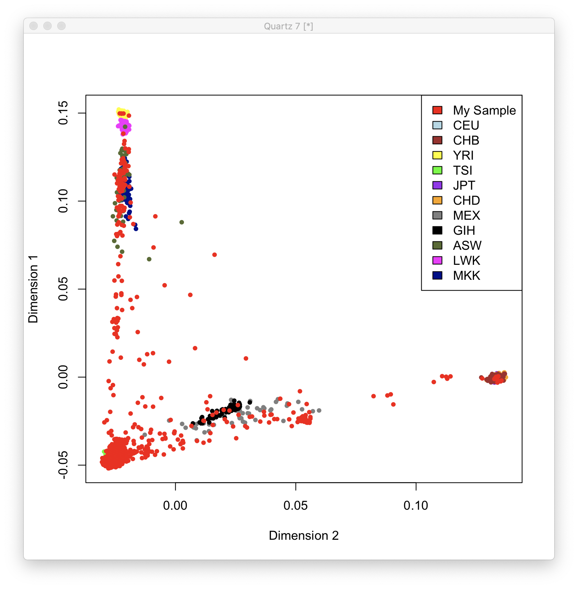
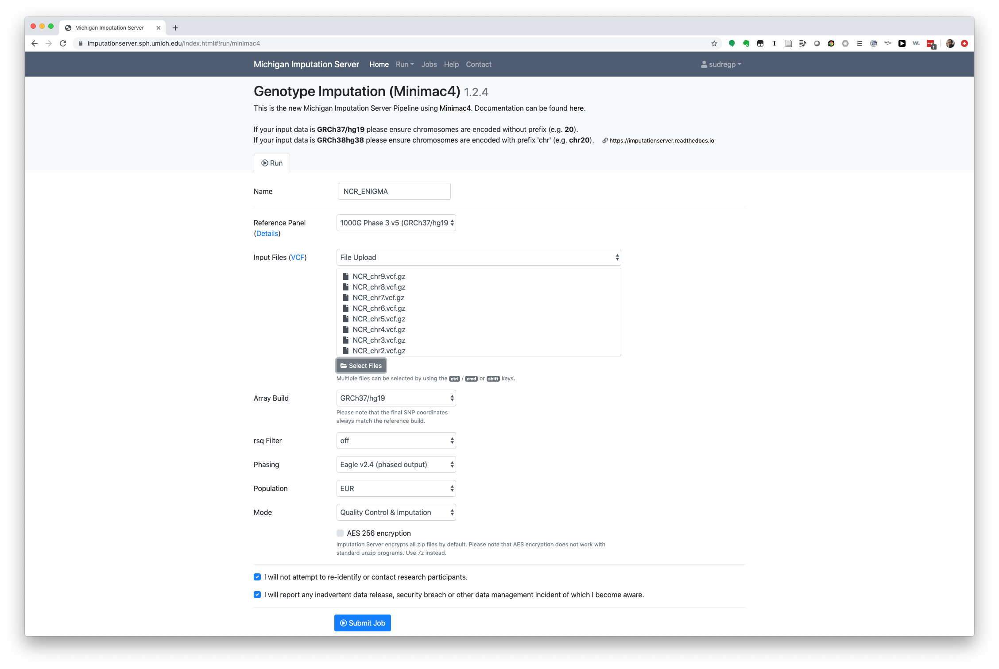
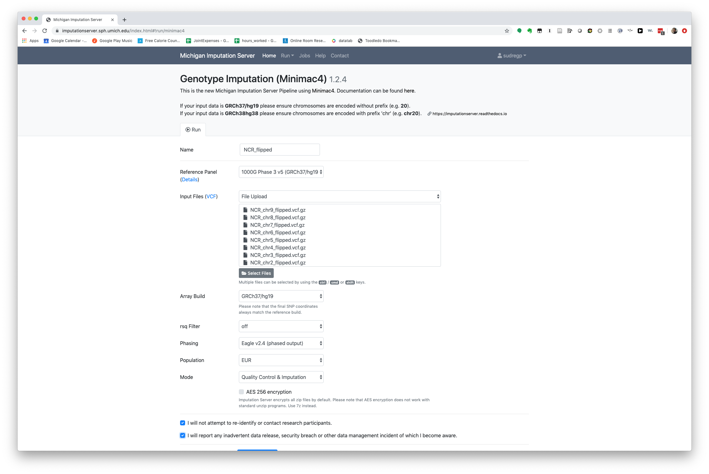
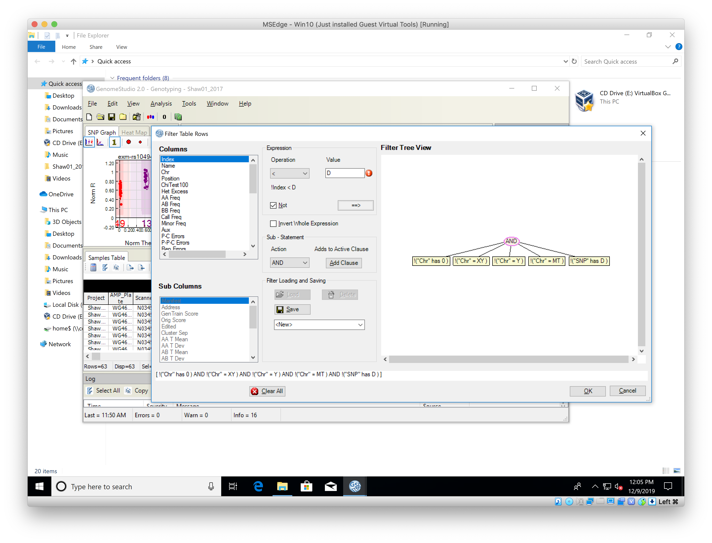

# 2019-12-04 15:00:37

Let's recompute PRS now that we have a few more arrays. We can also transcribe
the Evernote note here.

Note that I can potentially still do some further cleaning inside GenomeStudio.
For example, following this paper: 

https://www.ncbi.nlm.nih.gov/pmc/articles/PMC6171493/pdf/bbx012.pdf

But since I cannot find the raw data anymore (dealing with IT to retrieve
backups because it looks like it was moved accidentally), I'll go from PLINK
files from now. At least those look like they are still in the cluster. When I
get the raw data back I'll check if this will make any difference.

I'll do many of the same checks in PLINK anyways (like call rate, and MAF), but
I might be able to do better after fixing some clusters, for example.

```bash
cd /data/NCR_SBRB/NCR_genetics
mkdir v2
cd v2
module load plink
# converting to PLINK binary format
plink --file ~/data/prs/PLINK_160517_0102/Shaw03_2017 --out ./Shaw03_2017
plink --file ~/data/prs/PLINK_160517_0102/Shaw03_2017 --make-bed --out ./Shaw03_2017
plink --file ~/data/prs/PLINK_160517_0143/Shaw04_2017 --make-bed --out ./Shaw04_2017
plink --file ~/data/prs/PLINK_160517_0338/Shaw07_2017 --make-bed --out ./Shaw07_2017
plink --file ~/data/prs/PLINK_160517_0412/Shaw06_2017 --make-bed --out ./Shaw06_2017
plink --file ~/data/prs/PLINK_160517_0533/Shaw05_2017 --make-bed --out ./Shaw05_2017
plink --file ~/data/prs/PLINK_160517_0711/twins --make-bed --out ./twins
plink --file ~/data/prs/PLINK_160517_0852/Shaw03 --make-bed --out ./Shaw03
plink --file ~/data/prs/PLINK_160517_0953/Shaw04 --make-bed --out ./Shaw04
plink --file ~/data/prs/PLINK_160517_1052/Shaw01_2017 --make-bed --out ./Shaw01_2017
plink --file ~/data/prs/PLINK_160517_1143/Shaw02_2017 --make-bed --out ./Shaw02_2017
plink --file ~/data/prs/PLINK_220517_0838/Shaw_Final_Release_05112015 --make-bed --out ./CIDR
plink --file PLINK_231019_0742/Shaw01_2019 --make-bed --out ./Shaw01_2019
plink --file PLINK_231019_0821/Shaw02_2019 --make-bed --out ./Shaw02_2019
plink --file PLINK_231019_0905/Shaw03_2019 --make-bed --out ./Shaw03_2019
```

Maybe we can reduce this to only the SNPs present in all boxes?

```bash
merge_intersection() {
    plink --bfile $1 --write-snplist
    plink --bfile $2 --extract plink.snplist --make-bed --out ${2}_filtered
    plink --bfile $2 --write-snplist
    plink --bfile $1 --extract plink.snplist --make-bed --out ${1}_filtered
    plink --bfile $1_filtered -bmerge ${2}_filtered.bed ${2}_filtered.bim \
        ${2}_filtered.fam --make-bed --noweb --out $3
}
merge_intersection Shaw01_2017 Shaw02_2017 mergeShaw2017_inter1
merge_intersection mergeShaw2017_inter1 Shaw03_2017 mergeShaw2017_inter2
merge_intersection mergeShaw2017_inter2 Shaw04_2017 mergeShaw2017_inter3
merge_intersection mergeShaw2017_inter3 Shaw05_2017 mergeShaw2017_inter4
merge_intersection mergeShaw2017_inter4 Shaw06_2017 mergeShaw2017_inter5
merge_intersection mergeShaw2017_inter5 Shaw07_2017 mergeShaw2017_inter6

merge_intersection Shaw01_2019 Shaw02_2019 mergeShaw2019_inter1
merge_intersection mergeShaw2019_inter1 Shaw03_2019 mergeShaw2019_inter2

merge_intersection Shaw04 Shaw03 mergeShaw_inter

merge_intersection mergeShaw2019_inter2 mergeShaw2017_inter6 merge1_inter
merge_intersection merge1_inter mergeShaw_inter merge2_inter
merge_intersection merge2_inter twins merge3_inter
merge_intersection merge3_inter CIDR merged_inter
```

# 2019-12-06 13:40:56

Time to update the sex variable to be checked later in PLINK. Since the FAMID in
the current file is meaningless, let's use the same file to retrieve M or F from
Labmatrix (i.e. use merged_inter.fam as the basis).

For future sakes, here's how I extracted the NSB from the long form in Excel:

```
=NUMBERVALUE(MID(LEFT(B807,FIND("@",B807)-1),FIND("-",B807,12)+1,LEN(B807)))
```

```bash
cd /data/NCR_SBRB/NCR_genetics/v2
# remove CIDR control IDs and the one NSB we don't have records in Labmatrix
cat CIDR_ctrl.txt > remove_ids.txt; echo "33 3239" >> remove_ids.txt;
plink --bfile merged_inter --remove remove_ids.txt --make-bed \
  --out merged_inter_noCtrl;
# update sex based on Labmatrix records
plink --bfile merged_inter_noCtrl --update-sex update_sex.txt --make-bed \
  --out merged_inter_noCtrl_sex;
plink --bfile merged_inter_noCtrl_sex --check-sex;
```

PLINK found problems determining the sex of 16 samples. Either determining it,
or it's different than what we currently have in Labmatrix. 

```
[sudregp@cn1745 v2]$ grep PROBLEM plink.sexcheck 
   4                              10920            1            0      PROBLEM       0.3771
   5                              10579            2            0      PROBLEM       0.5444
  11                               8569            2            0      PROBLEM       0.2486
  13                              14043            1            2      PROBLEM        -0.16
  20                              10906            2            1      PROBLEM       0.8349
  21                              10443            2            0      PROBLEM       0.2894
  23                              13548            2            0      PROBLEM       0.2036
  27                              10855            2            0      PROBLEM       0.3515
  35                              11776            1            0      PROBLEM       0.4289
  38                              13548            2            0      PROBLEM       0.2382
  46                               8647            2            0      PROBLEM       0.4006
  47                              14304            1            2      PROBLEM      0.02998
  60                              10551            2            0      PROBLEM       0.5104
  64                               8515            2            1      PROBLEM       0.9922
 195   WG1023565-DNAA12-6031@0175460825            1            2      PROBLEM      0.02925
 271   WG1023565-DNAH05-7011@0175548883            2            1      PROBLEM       0.9969
```

In all cases where PLINK as able to make a reasonable determination (but 1), the
Sex in Labmatrix matches the one in CRIS, so I'm going to guess it's a coding
error. I'll update the sex file above, and re-run it. Then, I'll remove the
sample with errors or that PLINK couldn't determine sex (likely because of poor
quality). Maybe they will get better later with better GenomeStudio tuning...
who knows.

```bash
grep "PROBLEM" plink.sexcheck | awk '{print $1, $2}' >> failed_sex_check.txt;
plink --bfile merged_inter_noCtrl_sex --remove failed_sex_check.txt --make-bed \
  --out merged_inter_noCtrl_sexClean;
```

Time to check for identical samples. This time I'll keep the twins there, as we
might need one but not the other in some analysis based on other selection
criteria.

```bash
plink --bfile merged_inter_noCtrl_sexClean --genome
awk '{if ($10 > .95) print $1, $2, $3, $4}' plink.genome 
```

And then I'll keep putting the threshold lower and lower until I'm done
capturing the same samples and I'm only getting twins. When same sample, I'll
keep first blood entries, then newer entries. Sometimes the same NSB appears
twice, so I'm keeping the re-submission (newer) box or, when both old, I'm
removing CIDR.

I also grabbed the file and checked for duplicate NSBs, because some were
popping up even at .8 IBD, which makes sense since they were re-genotyped due to
poor sample quality.

Based on that criteria, I'll remove the following for already having a better
sample in the file:

```
385 WG1023567-DNAB01-5074@0175460769
35 10313
33 11023
34 12121
3 13232
36 11978
5 223
39 11360
37 10934
7 332
40 10990
57 13553
215 WG1023565-DNAC09-580@0175460893
329 WG1023566-DNAE04-623@0175460842
36 10585
103 WG1023564-DNAA09-678@0175548933
16 1116
17 1253
39 13580
247 WG1023565-DNAF05-1254@0175460144
37 10466
58 11268
33 WG1023563-DNAC09-2220@0175460566
99 WG1023564-DNAA05-5020@0175460785
48 WG1023563-DNAD12-2332@0175460578
397 WG1023567-DNAC01-10094@0175461097
398 WG1023567-DNAC02-2635@0175460548
51 10924
12 10912
```

```bash
plink --bfile merged_inter_noCtrl_sexClean --remove duplicate_samples.txt --make-bed \
  --out merged_inter_noCtrl_sexClean_noDups;
```

Now the number of pairs is constant from IBD thresholds from .7 all the way to
.95, which is good because it means we only have the twin left (as checked in
Labmatrix based on NSBs).

From now on, let's follow the ENIGMA protocol. Note that it's an updated version
I received from Rachel Brouwer, using the Moichigan Imputation Server. I'll copy
it to my Documents and also to the the folder in Biowulf. But, the only
difference from the protocol in:

http://enigma.ini.usc.edu/wp-content/uploads/2012/07/ENIGMA2_1KGP_cookbook_v3.pdf

is the imputation part, which we'll do before computing PRS. It also uses a
different HM3 file, for b37. Her e-mail is from 01/05/2018.

```bash
wget "http://genepi.qimr.edu.au/staff/sarahMe/enigma/MDS/HM3_b37.bed.gz"
wget "http://genepi.qimr.edu.au/staff/sarahMe/enigma/MDS/HM3_b37.bim.gz"
wget "http://genepi.qimr.edu.au/staff/sarahMe/enigma/MDS/HM3_b37.fam.gz"
# Filter SNPs out from your dataset which do not meet Quality Control criteria
# (Minor Allele Frequency < 0.01; Genotype Call Rate < 95%; Hardy­Weinberg
# Equilibrium < 1x10­6)
export datafileraw=merged_inter_noCtrl_sexClean_noDups
plink --bfile $datafileraw --hwe 1e-6 --geno 0.05 --maf 0.01 --noweb \
      --make-bed --out ${datafileraw}_filtered
# Unzip the HM3 genotypes. Prepare the HM3 and the raw genotype data by
# extracting only snps that are in common between the two genotype data sets
# this avoids exhausting the system memory. We are also removing the strand
# ambiguous snps from the genotyped data set to avoid strand mismatch among
# these snps. Your genotype files should be filtered to remove markers which
# do not satisfy the quality control criteria above.
gunzip HM3_b37*.gz
export datafile=${datafileraw}_filtered
awk '{print $2}' HM3_b37.bim > HM3_b37.snplist.txt
plink --bfile ${datafile} --extract HM3_b37.snplist.txt --make-bed --noweb --out local
awk '{ if (($5=="T" && $6=="A")||($5=="A" && $6=="T")||($5=="C" && $6=="G")||($5=="G" && $6=="C")) print $2, "ambig" ; else print $2 ;}' $datafile.bim | grep -v ambig > local.snplist.txt
plink --bfile HM3_b37 --extract local.snplist.txt --make-bed --noweb --out external
# Merge the two sets of plink files. In merging the two files plink will check
# for strand differences. If any strand differences are found plink will crash
# with the following error (ERROR: Stopping due to mis­matching SNPs - check +/­
# strand?). Ignore warnings regarding different physical positions
plink --bfile local --bmerge external.bed external.bim external.fam \
  --make-bed --noweb --out HM3_b37merge
# got the error
plink --bfile local --flip HM3_b37merge-merge.missnp --make-bed --noweb \
  --out flipped
plink --bfile flipped --bmerge external.bed external.bim external.fam \
  --make-bed --noweb --out HM3_b37merge
# running MDS analysis... switching to 10 dimensions to conform to old analysis
plink --bfile HM3_b37merge --cluster --mind .05 --mds-plot 10 \
  --extract local.snplist.txt --noweb --out HM3_b37mds
# making the MDS plot
awk 'BEGIN{OFS=","};{print $1, $2, $3, $4, $5, $6, $7}' HM3_b37mds.mds >> HM3_b37mds2R.mds.csv
```

Then, I made the plot locally:

```R
library(calibrate)
mds.cluster = read.csv("~/data/tmp/HM3_b37mds2R.mds.csv", header=T);
colors=rep("red",length(mds.cluster$C1));
colors[which(mds.cluster$FID == "CEU")] <- "lightblue";
colors[which(mds.cluster$FID == "CHB")] <- "brown";
colors[which(mds.cluster$FID == "YRI")] <- "yellow";
colors[which(mds.cluster$FID == "TSI")] <- "green";
colors[which(mds.cluster$FID == "JPT")] <- "purple";
colors[which(mds.cluster$FID == "CHD")] <- "orange";
colors[which(mds.cluster$FID == "MEX")] <- "grey50";
colors[which(mds.cluster$FID == "GIH")] <- "black";
colors[which(mds.cluster$FID == "ASW")] <- "darkolivegreen";
colors[which(mds.cluster$FID == "LWK")] <- "magenta";
colors[which(mds.cluster$FID == "MKK")] <- "darkblue";
# pdf(file="mdsplot.pdf",width=7,height=7)
plot(rev(mds.cluster$C2), rev(mds.cluster$C1), col=rev(colors),
         ylab="Dimension 1", xlab="Dimension 2",pch=20)
legend("topright", c("My Sample", "CEU", "CHB", "YRI", "TSI", "JPT", "CHD",
                     "MEX", "GIH", "ASW","LWK", "MKK"),
       fill=c("red", "lightblue", "brown", "yellow", "green", "purple",
              "orange", "grey50", "black", "darkolivegreen", "magenta",
              "darkblue"))
# if you want to know the subject ID label of each sample on the graph,
# uncomment the value below
# FIDlabels <- c("CEU", "CHB", "YRI", "TSI", "JPT", "CHD", "MEX", "GIH", "ASW",
#                "LWK", "MKK");
# textxy(mds.cluster[which(!(mds.cluster$FID %in% FIDlabels)), "C2"],
#        mds.cluster[which(!(mds.cluster$FID %in% FIDlabels)), "C1"],
#        mds.cluster[which(!(mds.cluster$FID %in% FIDlabels)), "IID"])
# dev.off();
```



Now, for the imputation:

```bash
awk '{ if (($5=="T" && $6=="A")||($5=="A" && $6=="T")||($5=="C" && $6=="G")||($5=="G" && $6=="C")) print $2, "ambig" ; else print $2 ;}' $datafile.bim | grep ambig | awk '{print $1}' > ambig.list
plink --bfile $datafile --exclude ambig.list --make-founders --out lastQC \
  --maf 0.01 --hwe 0.000001 --make-bed --noweb
awk '{print $2, $1":"$4}' lastQC.bim > updateSNPs.txt
plink --bfile lastQC --update-name updateSNPs.txt --make-bed --out lastQCb37 \
  --noweb --list-duplicate-vars
plink --bfile lastQCb37 --exclude lastQCb37.dupvar --out lastQCb37_noduplicates \
  --make-bed --noweb
module load vcftools
for i in {1..22}; do
  plink --bfile lastQCb37_noduplicates --chr $i --recode vcf --out NCR_chr"$i";
  vcf-sort NCR_chr"$i".vcf | bgzip -c > NCR_chr"$i".vcf.gz
done
```

Then, uploading to Michigan Imputation Server.




But I got an error from the imputation server:

```
Warning: 1 Chunk(s) excluded: < 3 SNPs (see chunks-excluded.txt for details).
Warning: 145 Chunk(s) excluded: at least one sample has a call rate < 50.0% (see chunks-excluded.txt for details).
Remaining chunk(s): 8
Error: More than 100 obvious strand flips have been detected. Please check strand. Imputation cannot be started!
```

# 2019-12-09 09:06:13

I certainly need to understand the strand issue a bit better. But since
imputation might take a while, for now I'll follow the steps I've taken before
to fix the strand issue, and try that:

```bash
cd /data/NCR_SBRB/NCR_genetics/v2
module load shapeit
refdir=/fdb/impute2/1000Genomes_Phase3_integrated_haplotypes_Oct2014/1000GP_Phase3/
for c in {1..22}; do
    shapeit -check -T 16 -V NCR_chr${c}.vcf.gz \
        --input-ref $refdir/1000GP_Phase3_chr${c}.hap.gz \
        $refdir/1000GP_Phase3_chr${c}.legend.gz $refdir/1000GP_Phase3.sample \
        --output-log chr${c}.alignments;
done
# format the files:
for c in {1..22}; do
    grep Strand chr${c}.alignments.snp.strand | cut -f 4 | sort | uniq >> flip_snps.txt;
    grep Missing chr${c}.alignments.snp.strand | cut -f 4 | sort | uniq >> missing_snps.txt;
done
# I'm having some issues with duplicate ID that even the list-duplicate command
# in ENIGMA's protocol is not finding, because they have different alleles. So,
# let's remove them completely from the analysis, before we flip it using ShapeIt results:
module load plink
plink --bfile lastQCb37 --write-snplist --out all_snps
cat all_snps.snplist | sort | uniq -d > duplicated_snps.snplist
plink --bfile lastQCb37 --exclude duplicated_snps.snplist --make-bed --out lastQCb37_noduplicates
# flip and remove all bad ids
plink --bfile lastQCb37_noduplicates --flip flip_snps.txt \
    --exclude missing_snps.txt --make-bed --out lastQCb37_noduplicates_flipped
#reconstruct the VCFs as above to send it to the imputation server.
module load vcftools
for i in {1..22}; do
    plink --bfile lastQCb37_noduplicates_flipped --chr ${i} --recode-vcf \
        --out NCR_chr${i}_flipped;
    vcf-sort NCR_chr"$i"_flipped.vcf | bgzip -c > NCR_chr"$i"_flipped.vcf.gz
done
```

And then we try the imputation server again.



Even though it now survives the server QC, only 8 chromossomes are working
ebcause we have a few samples with low call rate. Let's see if we can remove
that in PLINK or if we have to go back to GenomeStudio.

```bash
export datafileraw=merged_inter_noCtrl_sexClean_noDups
plink --bfile $datafileraw --hwe 1e-6 --geno 0.05 --maf 0.01 --noweb \
      --make-bed --out ${datafileraw}_filtered
export datafile=${datafileraw}_filtered
export datafile=merged_inter_noCtrl_sexClean_noDups_filtered
awk '{ if (($5=="T" && $6=="A")||($5=="A" && $6=="T")||($5=="C" && $6=="G")||($5=="G" && $6=="C")) print $2, "ambig" ; else print $2 ;}' $datafile.bim | grep ambig | awk '{print $1}' > ambig.list
plink --bfile $datafile --exclude ambig.list --make-founders --out lastQC \
    --maf 0.01 --hwe 0.000001 --mind .05 --make-bed --noweb
awk '{print $2, $1":"$4}' lastQC.bim > updateSNPs.txt
plink --bfile lastQC --update-name updateSNPs.txt --make-bed --out lastQCb37 \
    --noweb --list-duplicate-vars
plink --bfile lastQCb37 --write-snplist --out all_snps
cat all_snps.snplist | sort | uniq -d > duplicated_snps.snplist
plink --bfile lastQCb37 --exclude duplicated_snps.snplist --make-bed --out lastQCb37_noduplicates
# flip and remove all bad ids
plink --bfile lastQCb37_noduplicates --flip flip_snps.txt \
    --exclude missing_snps.txt --make-bed --out lastQCb37_noduplicates_flipped
#reconstruct the VCFs as above to send it to the imputation server.
module load vcftools
for i in {1..22}; do
    plink --bfile lastQCb37_noduplicates_flipped --chr ${i} --recode-vcf \
        --out NCR_chr${i}_flipped;
    vcf-sort NCR_chr"$i"_flipped.vcf | bgzip -c > NCR_chr"$i"_flipped.vcf.gz
done
```

That seems to be running now.

## Strands

This explanation from 23andMe is basic but easy to understand: 

```DNA consists of two strands that are complementary to each other. The DNA base "A" always pairs with "T," and "G" always pairs with "C" across these two strands. One strand is called the positive (+) strand, and the other is called the negative (-) strand.

The genotypes displayed on the 23andMe website, including in the Raw Data feature, always refer to the positive (+) strand on build 37 of the human reference genome.

Be aware that other websites or publications may sometimes refer to the negative strand when reporting genotypes.

If the possible genotypes reported by 23andMe and another source do not match, it is likely that they are referring to complementary DNA strands rather than the same strand. For example, 23andMe might report that a SNP has two versions, G and A. But other sources may report that the versions for that SNP are C and T. Both ways of reporting the SNP are correct, because the G is paired with a C on the opposite strand, and A is paired with T.
```

Each individual has two copies of each chromosome. For example:
https://www.genome.gov/sites/default/files/tg/en/illustration/single_nucleotide_polymorphism_snps.jpg.
So, when we say someone is T/C, assuming the top copy (copy 1) in the figure is
always the positive (forward) strand, then we're saying they have a T and a C in that
position. Of course, because we know that T goes to A, and C goes to G, that's
the same as saying the individual (1 in this case) is A/G, if we have as the
reference the reverse strand.

But as far as I understand, any SNP is listed in general, and if it's an issue,
it's just a bigger issue if the individual has two copies of that SNP. For
example, it'd count more in a PRS analysis. But because of that, w eneed to be
sure we're always reporting on the correct strand, both in our data storage but
also on the base GWAS we're using.

Also found this in Biostarts, a good explanation of the basics: https://www.biostars.org/p/310841/

```
major allele
"the most common allele for a given SNP"... in the cohort in question. The cohort may be just 10 people, though, or it could be 2,504 like in 1000 Genomes Phase III. In addition, the major allele, by definition, could have a frequency of 50.5%, in which case, although it is more frequent, it is only more frequent by 0.5%. The point that I want to make is that the major allele only makes sense when you understand the cohort in which it is the major allele, and also the size of that cohort.

minor allele
As above but, yes, the reverse, in that it is the less frequent allele. Also, yes, the MAF is the frequency of the minor allele and, from the MAF, one can infer the frequency of the major allele if it is a bi-allelic site (some sites understandably are tri- or quad-allelic).

On what you said about the "variation of genotypes", if a site has a very low MAF in a global cohort (i,.e. samples from various parts of the World), it may imply that the major allele is conserved and is 'fixed' in the human genome, but not necessarily. A very rare allele at such a site may, thus, be under selective pressure if it reflects positive gain of function, or it could be deleterious and more likely to be eliminated from the human lineage.

risk allele
What you said is correct. The risk allele is statistically significantly associated with risk of having a disease under study. Such an allele should have genome-wide significance and have an odds ratio > 1.0. A situation in which a major allele may be seen as the 'risk allele' is where the minor allele is found to be protective against disease by having an odds ratio < 1.0, coupled with a statistically significant p-value. However, such a situation is not usually interpreted from the context of the major allele being the risk allele.

You may have been thinking about rare and common (MAF>5%) variants. For example, it is accepted (by those who actually think) that common alleles have roles in disease. An example are the variants in the CCND1 locus, which have MAFs of ~15% in Caucasians but which confer increased risk of ER+ breast cancer. Look at Rare and common variants: twenty arguments. for further reading.

I should add that many rare variants may be functionless, but that they can still accumulate in the human genome and eventually become functional if combined with other nearby variants. For example, variants accumulated over time eventually form novel TSS sites, TF binding sites, histone binding sites, protein binding sites, etc.

------------------------------------
In relation to the above 3, you may enjoy reading a recent answer that I gave: A: SNP dataset and Z Score

effect allele
This isn't used that much. It is essentially the allele whose effects in relation to disease are being studied. The effect allele is therefore, invariably, the minor allele.

reference allele
If you hear this term, exercise caution. The best way to view it is as the allele that is in a particular reference build, e.g., GRCh37 / hg19, GRCh38 / hg38, etc. In some cases, however, the reference allele can be a risk allele. Read here for further information: A: Alternate nucleotide is more frequent than reference nucleotide. OMG I'm dizzy.

wildtype allele
Not the same as the reference allele. A wildtype allele is specific to your case-control study and is merely the allele that is present in your wild-type samples. This could feasibly be a minor allele, or anything else - it's specific to your study and what you view as the wild-type condition.

Thank you.
```

I also found an Evernote note on converting idat to vcf, coming originally from
Frank Donovan. I think I'm doing most of it, but there's a GenGen part that I
need to make sure it's being performed. Also, I'm not doing the GenomeStudio
cleaning part, but that's what Philip had said either Cristina or Qwang Mi
should do.

I think my final files sent for imputation are already corrected, given the
shape it step. But I should probably make sure it's all kosher based on Frank's
original note. Well, all besides the cleaning within GenomeStudio part.

Since I already have all files exported to PLINK, all I actually need it the SNP
table file. All the 2017 and 2019 boxes are OmniExprssExm_v1.4, so they can use
the same SNP table:

For reference, the filter I'm using is:



But I don't want to have to re-export everything, so let's just extract the
annotated SNPs from the PLINK files. Then, we can go with the usual steps.

It's just that the steps Frank outlined didn't do anything to the end .bim file.
It's the same as the original one. But we can still use GenGen to convert the
.bim file to .dbsnp...

Well, how big of an issue is this? We are all within the Ilumina platform:

```bash
HG-02113362-DM4:all_from_chandra sudregp$ for f in `/bin/ls */*Omni*ss.csv`; do echo $f; grep -A 1 Manifests $f; done
Shaw01_2017_OmniExprssExm_v1.4/Shaw01_2017_OmniExprssExm_v1.4_ss.csv
[Manifests],,,,,,,,,,,,,,,,
A,InfiniumOmniExpressExome-8v1-4_A1,,,,,,,,,,,,,,,
Shaw01_2019_OmniExprssExm_v1.4/Shaw01_2019_OmniExprssExm_v1.4_ss.csv
[Manifests],,,,,,,,,,,,,,,,
A,InfiniumOmniExpressExome-8v1-4_A1,,,,,,,,,,,,,,,
Shaw02_2017_OmniExprssExm_v1.4/Shaw02_2017_OmniExprssExm_v1.4_ss.csv
[Manifests],,,,,,,,,,,,,,,,
A,InfiniumOmniExpressExome-8v1-4_A1,,,,,,,,,,,,,,,
Shaw02_2019_OmniExprssExm_v1.4/Shaw02_2019_OmniExprssExm_v1.4_ss.csv
[Manifests],,,,,,,,,,,,,,,,
A,InfiniumOmniExpressExome-8v1-4_A1,,,,,,,,,,,,,,,
Shaw03_2017_OmniExprssExm_v1.4/Shaw03_2017_OmniExprssExm_v1.4_ss.csv
[Manifests],,,,,,,,,,,,,,,,
A,InfiniumOmniExpressExome-8v1-4_A1,,,,,,,,,,,,,,,
Shaw03_2019_OmniExprssExm_v1.4/Shaw03_2019_OmniExprssExm_v1.4_ss.csv
[Manifests],,,,,,,,,,,,,,,,
A,InfiniumOmniExpressExome-8v1-4_A1,,,,,,,,,,,,,,,
Shaw03_OmniExprssExm/Shaw03_OmniExprssExm_ss.csv
[Manifests],,,,,,,,,,,,,,,,
A,HumanOmniExpressExome-8-v1-2-B,,,,,,,,,,,,,,,
Shaw04_2017_OmniExprssExm_v1.4/Shaw04_2017_OmniExprssExm_v1.4_ss.csv
[Manifests],,,,,,,,,,,,,,,,
A,InfiniumOmniExpressExome-8v1-4_A1,,,,,,,,,,,,,,,
Shaw04_OmniExprssExm/Shaw04_OmniExprssExm_ss.csv
[Manifests],,,,,,,,,,,,,,,,
A,HumanOmniExpressExome-8-v1-2-B,,,,,,,,,,,,,,,
Shaw05_2017_OmniExprssExm_v1.4/Shaw05_2017_OmniExprssExm_v1.4_ss.csv
[Manifests],,,,,,,,,,,,,,,,
A,InfiniumOmniExpressExome-8v1-4_A1,,,,,,,,,,,,,,,
Shaw06_2017_OmniExprssExm_v1.4/Shaw06_2017_OmniExprssExm_v1.4_ss.csv
[Manifests],,,,,,,,,,,,,,,,
A,InfiniumOmniExpressExome-8v1-4_A1,,,,,,,,,,,,,,,
Shaw07_2017_resubmission_OmniExprssExm_v1.4/Shaw07_2017_resubmission_OmniExprssExm_v1.4_ss.csv
[Manifests],,,,,,,,,,,,,,,,
A,InfiniumOmniExpressExome-8v1-4_A1,,,,,,,,,,,,,,,
Shaw_twins_OmniExpressExome_080714/Shaw_twins_OmniExprssExm_080714_ss.csv
[Manifests],,,,,,,,,,,,,,,,
A,OmniExpressExome-8v1-2_A,,,,,,,,,,,,,,,
HG-02113362-DM4:all_from_chandra sudregp$ grep -A 1 Manifest /Volumes/Shaw/CIDR/complete_05282015/Pretesting_DataRelease\:\ et\ al/rawdataset_to_PI_UW/GenomeStudio_Project_and_Files/Shaw_836_Sample_Sheet.csv 
[Manifests],,,,,,,,,,,,,,,,
A,HumanOmniExpressExome-8v1-2_A,,,,,,,,,,,,,,,
```

So, I'm assuming all our exports are in the same reference frame. Maybe there
was something funky with the CIDR sample if I used the PLINK files they sent
instead of exporting my own? Not really... I exported them myself. Were there
any issue in our own analysis, before merging with ENIGMA? No, not really. OK,
so I think we just need to be careful in reporting things then. And also when
calculating PRS. That's the catch. 

I wonder if I use GenGen I will be able to get away without doing the shape it
step... let's see. I'm assuming there's no issue with our within-sample merging.
So, let's pick up from there:

```bash
# this came from GenomeStudio
cut -f 1 ~/data/tmp/SNP_Table.txt > annotated_snps.txt
plink --bfile merged_inter_noCtrl_sexClean_noDups \
    --extract annotated_snps.txt --make-bed --out tmp
perl ~/GenGen-1.0.1/convert_bim_allele.pl tmp.bim ~/data/tmp/SNP_Table.txt \
    --intype top --outtype dbsnp --outfile tmp.dbsnp -v
cp tmp.dbsnp tmp.bim;
plink --bfile tmp --hwe 1e-6 --geno 0.05 --maf 0.01 --noweb \
    --make-bed --mind .05 --out tmp_filtered
#reconstruct the VCFs as above to send it to the imputation server.
module load vcftools
for i in {1..22}; do
    plink --bfile tmp_filtered --chr ${i} --recode-vcf --out tmp_chr${i};
    vcf-sort tmp_chr"$i".vcf | bgzip -c > tmp_chr"$i".vcf.gz
done
```

Nope, didn't work either. I think the shapeit step is quite important, because
it basically checks how they should be flipped with respect to the forward
strand in the reference genome. So, in the end our flipped file is in accord
with the forward strand. At this point, NCR_chr"$i"_flipped.vcf.gz, which is
what we impute. Now, we need to grab that, filter, etc.

# 2019-12-17 15:08:24

So, I downloaded the files from the imputation server. Now, it's just a matter
of converting it back to PLINK and running PRSice. 

```bash
# sinteractive
cd /data/NCR_SBRB/NCR_genetics/v2/1KG
for f in `ls *zip`; do unzip -P asbNBUM1U8zqq $f; done
# I then copied all the uncompressed files to NCR/genotyping/imputations/1KG_20191217

```

# TODO
* mark in Labmatrix those bad samples (bad call rates, or filtered for some
  other reason)?  
* compute PRS on imputed data and non-imputed, using new version of PrSice
