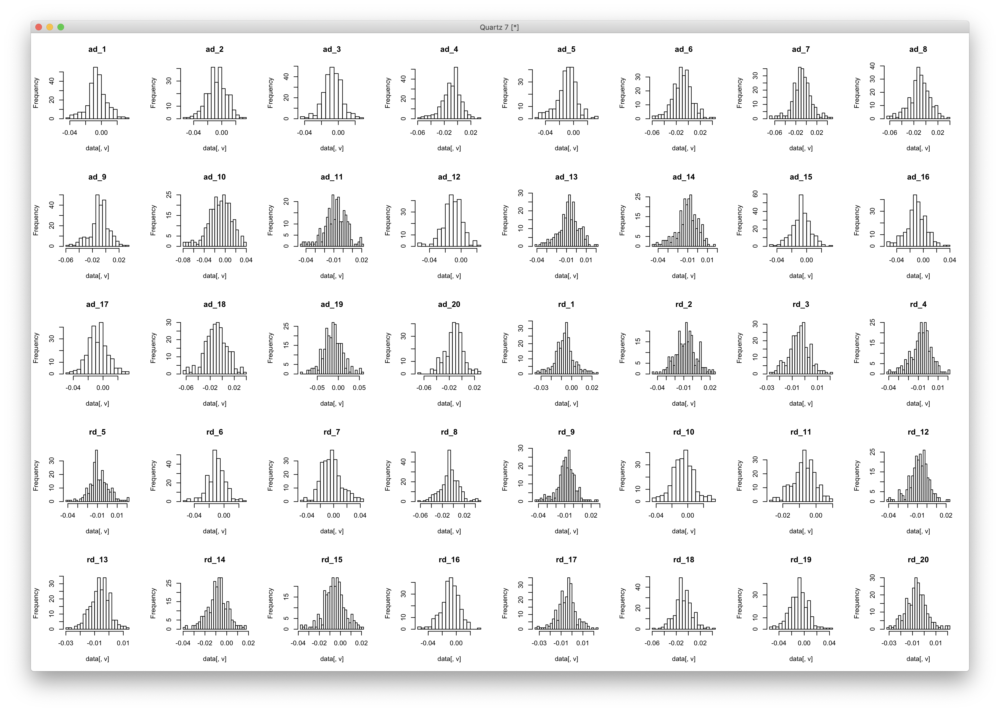
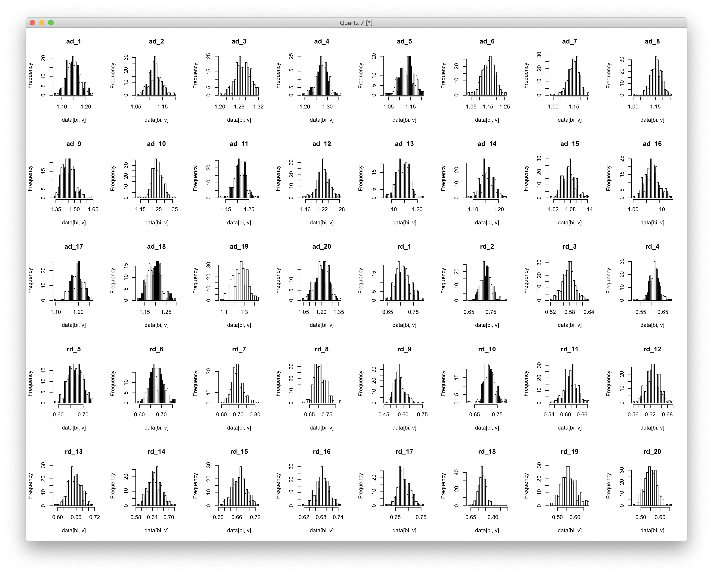
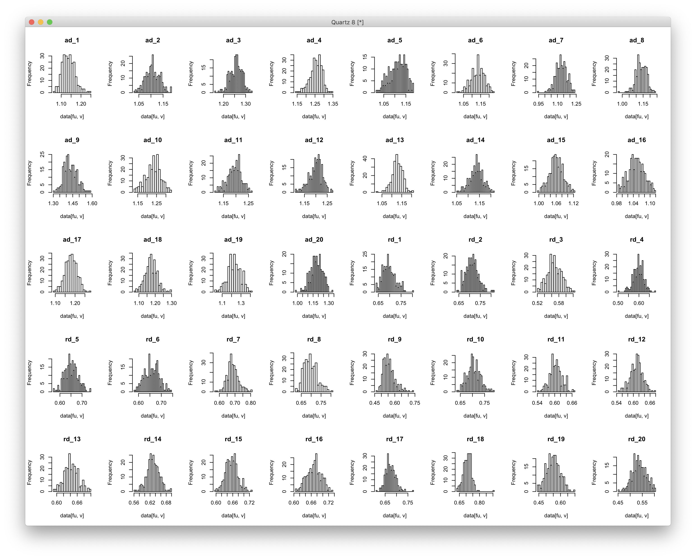
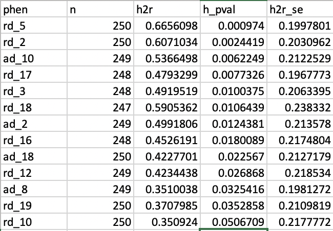

# 2019-12-06 10:18:58

Following the results from rsfmri fix (note 58), I just wanted to double check
that the DTI results still survive after doing the cleaning procedure. In fact,
let's do the histogram approach Philip suggested as well, just to make sure it's
all kosher:

```r
phen = 'dti_JHUtracts_ADRDonly_OD0.95_withBaseAge'
data = read.csv(sprintf('~/data/heritability_change/%s.csv', phen))
var_names = c(sapply(1:20, function(x) sprintf('ad_%d', x)),
              sapply(1:20, function(x) sprintf('rd_%d', x)))
for (tract in var_names) {
    tract_data = data[, tract]
    ul = mean(tract_data) + 3 * sd(tract_data)
    ll = mean(tract_data) - 3 * sd(tract_data)
    bad_subjs = c(which(tract_data<ll),which(tract_data>ul))
    if (length(bad_subjs) > 0) {
        data[bad_subjs, tract] = NA
    }
}
write.csv(data, file=sprintf('~/data/heritability_change/%s_clean.csv', phen),
        row.names=F, na='', quote=F)
```


```r
data = read.csv('~/data/heritability_change/dti_JHUtracts_ADRDonly_OD0.95_withBaseAge_clean.csv')
dev.new()
var_names = c(sapply(1:20, function(x) sprintf('ad_%d', x)),
              sapply(1:20, function(x) sprintf('rd_%d', x)))
par(mfrow=c(5, 8))
for (v in var_names) {
    hist(data[, v], breaks=25, main=v)
}
```



Yep, quite well-behaved slopes in the clean data.

```r
data = read.csv('~/data/heritability_change/dti_JHUtracts_ADRDonly_OD0.95_twoTimePoints_noOtherDX.csv')
bi = c()
for (i in seq(1,nrow(data),2)) {
    if (data$age_at_scan[i] > data$age_at_scan[i+1]) {
        bi=c(bi, i+1)
    }
    else {
        bi = c(bi, i)
    }
}
fu = setdiff(1:nrow(data), bi)
var_names = c(sapply(1:20, function(x) sprintf('ad_%d', x)),
              sapply(1:20, function(x) sprintf('rd_%d', x)))
dev.new()
par(mfrow=c(5, 8))
for (v in var_names) {
    hist(data[fu, v], breaks=25, main=v)
}
```

Baseline:



There are some outliers (e.g. ad_9 or rd_4), but nothing crazy. Also, they all
look quite normal.

FU:



Same story as baseline. OK, now for the money-shot... our results still
heritable and associated?

```bash
# local
phen=dti_JHUtracts_ADRDonly_OD0.95_withBaseAge_clean
cd ~/data/heritability_change
for m in ad rd; do
    for t in {1..20}; do
        solar run_phen_var_OD_tracts $phen ${m}_${t};
    done;
done;
mv $phen ~/data/tmp/
cd ~/data/tmp/$phen
for p in `/bin/ls`; do cp $p/polygenic.out ${p}_polygenic.out; done
python ~/research_code/compile_solar_multivar_results.py $phen
```



Yep, still good!