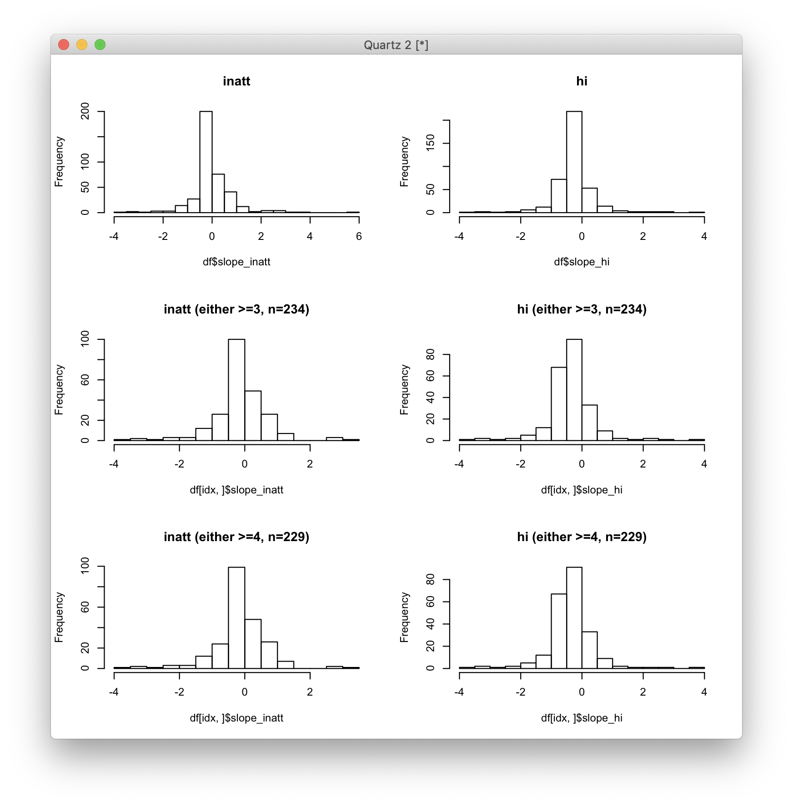
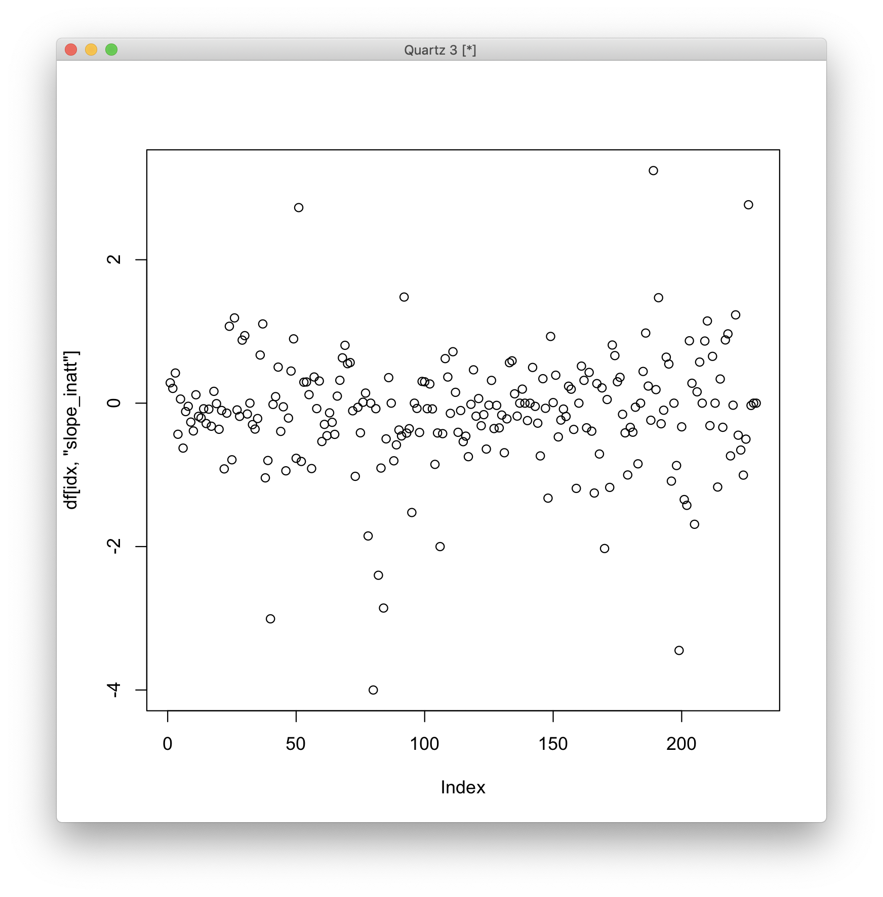

# 2020-01-06 09:55:15

Let's see if we can use the PRS for baseline prediction. We'll define the
possible group of people as only who has PRS, and go from there. We'll pick the
best PRS target (as is significant, but not necessarily clinically meaningful),
and then will try to improve it by throwing in new phenotypes.

If PRS fails from the get-go, we'll try using the phenotypes shown in prrevious
papers to be good baseline predictors. Those phenotypes are the easy ones to get
(e.g. initial symptom count, co-morbidities), and then, using the same approach,
we'll check how much our deep phenotyping adds to it.

A few things to keep in mind:

* Use DICA_on entries judiciously. Check the symptom history, whether the
  medication is making a difference, etc. 
* Philip does not want to use longitudinal data here.
* We'll need to do some data descriptives as well. 
* Need to work in the PCs and possibly do WNH-only analysis when playing with PRS.
* Might need to also add in the easy initial phenotypes to compare to PRS. The
  downside there is that those phenotypes were studied in the context off
  outcome, and our population might not be old enough to have those phenotypes
  as the best predictors to begin with.
* Might need to play with different thresholds of initial symptoms to see who to
  keep (e.g. include NVs?)

# Prepping the data

The first step is to get the symptom trajectories and subset them to the people
that have PRS. Then, we can clean up the DICA_on entries.

```r
clin = read.csv('~/data/baseline_prediction/prs_start/clinical_01062020.csv')
prs = read.csv('/Volumes/NCR/reference/merged_NCR_1KG_PRS_12192019.csv')
keep_me = clin$MRN %in% prs$MRN
clin2 = clin[keep_me, ]
long = names(table(clin2$MRN))[table(clin2$MRN)>1]
keep_me = clin2$MRN %in% long
clin3 = clin2[keep_me, ]
clin3$entry = sapply(1:nrow(clin3),
                     function(x) sprintf('%s_%s', clin3$MRN[x], clin3$DOA[x]))
clin4 = clin3[!duplicated(clin3$entry), ]
long = names(table(clin4$MRN))[table(clin4$MRN)>1]
keep_me = clin4$MRN %in% long
clin5 = clin4[keep_me, ]

write.csv(clin5,
          file='~/data/baseline_prediction/prs_start/long_clin_01062020.csv',
          row.names=F)
```

I then removed any DICA_on entries that seem to have affected either SX count,
and kept only people with baseline <= 16. Now, we need to decide if we include
everyone or just people with some SX at baseline. 

# 2020-01-14 08:37:32

Finally getting back to this. Let's define the LCMM model:

```r
setwd('~/data/baseline_prediction/prs_start/')
data = read.csv('long_clin_01062020_lt16.csv')
```

All 393 kids here have PRS!

Hum... by looking at the data I'm starting to doubt the latent model idea...
Philip also said a couple times that PRS was no good predicting it to begin
with. Let's see if we can look at slopes and maybe group based on that?

```r
df = data.frame(MRN=unique(data$MRN))
for (r in 1:nrow(df)) {
    subj_data = data[data$MRN==df$MRN[r], ]
    for (sx in c('inatt', 'hi')) {
        fit = lm(as.formula(sprintf('SX_%s ~ age', sx)), data=subj_data)
        df[r, sprintf('slope_%s', sx)] = fit$coefficients['age']
        base_row = which.min(subj_data$age)
        df[r, sprintf('base_%s', sx)] = subj_data[base_row, sprintf('SX_%s', sx)]
        last_row = which.max(subj_data$age)
        df[r, sprintf('last_%s', sx)] = subj_data[last_row, sprintf('SX_%s', sx)]
    }
}
```

Now let's make some slope plots:

```r
par(mfrow=c(3,2))
hist(df$slope_inatt, breaks=20, main='inatt')
hist(df$slope_hi, breaks=20, main='hi')
idx = df$base_inatt>=3 | df$base_hi>=3
hist(df[idx,]$slope_inatt, breaks=20,
     main=sprintf('inatt (either >=3, n=%d)', sum(idx)))
hist(df[idx,]$slope_hi, breaks=20,
     main=sprintf('hi (either >=3, n=%d)', sum(idx)))
idx = df$base_inatt>=4 | df$base_hi>=4
hist(df[idx,]$slope_inatt, breaks=20,
     main=sprintf('inatt (either >=4, n=%d)', sum(idx)))
hist(df[idx,]$slope_hi, breaks=20,
     main=sprintf('hi (either >=4, n=%d)', sum(idx)))
```



The original N is 393, so I'm removing about 150 to 160 NVs.

Let's plot >= 4 and see how it looks:



The differences are tiny. I'm almost better off winsorizing this data and trying
to predict the rate of change, because I'm not sure the improvers VS
non-improvers label will be very precise either. If anything, there are 3
classes (stable, improvers, non-improvers), and that just complicates things.

```r
winsorize = function(x, cut = 0.01){
  cut_point_top <- quantile(x, 1 - cut, na.rm = T)
  cut_point_bottom <- quantile(x, cut, na.rm = T)
  i = which(x >= cut_point_top) 
  x[i] = cut_point_top
  j = which(x <= cut_point_bottom) 
  x[j] = cut_point_bottom
  return(x)
}
junk = winsorize(df[idx, ]$slope_inatt)
par(mfrow=c(1,3))`
plot(df[idx, ]$slope_inatt, main='inatt', ylim=c(-4, 2.5))
plot(junk, main='inatt w0.01', ylim=c(-4, 2.5))
junk = winsorize(df[idx, ]$slope_inatt, cut=.05)
plot(junk, main='inatt w0.05', ylim=c(-4, 2.5))
```


OK, let's try that approach with w.05:

```r
idx = df$base_inatt>=4 | df$base_hi>=4
for (sx in c('inatt', 'hi')) {
    df[, sprintf('slope_%s_GE4_wp05', sx)] = NA
    junk = winsorize(df[idx, sprintf('slope_%s', sx)], cut=.05)
    df[idx, sprintf('slope_%s_GE4_wp05', sx)] = junk
}
prs = read.csv('/Volumes/NCR/reference/merged_NCR_1KG_PRS_12192019.csv')
data = merge(df, prs, by='MRN', all.x=F, all.y=F)
```

Let's try some predictions. I'll stick with linear models for now:

```r
var_names = colnames(data)[grepl(colnames(data), pattern='ADHD_')]
y = 'slope_inatt_GE4_wp05'
my_data = data[!is.na(data[, y]), ]
train_rows <- sample(1:nrow(my_data), .66*nrow(my_data))
x.train <- as.matrix(my_data[train_rows, var_names])
x.test <- as.matrix(my_data[-train_rows, var_names])

y.train <- my_data[train_rows, y]
y.test <- my_data[-train_rows, y]

library(glmnet)
fit.lasso <- glmnet(x.train, y.train, family="gaussian", alpha=1)
fit.ridge <- glmnet(x.train, y.train, family="gaussian", alpha=0)
fit.elnet <- glmnet(x.train, y.train, family="gaussian", alpha=.5)

# 10-fold Cross validation for each alpha = 0, 0.1, ... , 0.9, 1.0
fit.lasso.cv <- cv.glmnet(x.train, y.train, type.measure="mse", alpha=1,
                          family="gaussian")
fit.ridge.cv <- cv.glmnet(x.train, y.train, type.measure="mse", alpha=0,
                          family="gaussian")
fit.elnet.cv <- cv.glmnet(x.train, y.train, type.measure="mse", alpha=.5,
                          family="gaussian")

for (i in 0:10) {
    assign(paste("fit", i, sep=""), cv.glmnet(x.train, y.train,
                                              type.measure="mse", 
                                              alpha=i/10, family="gaussian"))
}
par(mfrow=c(3,2))
# For plotting options, type '?plot.glmnet' in R console
plot(fit.lasso, xvar="lambda")
plot(fit10, main="LASSO")

plot(fit.ridge, xvar="lambda")
plot(fit0, main="Ridge")

plot(fit.elnet, xvar="lambda")
plot(fit5, main="Elastic Net")
```


There's some improvement for smaller lambda's, but is it even measurable?

```r
yhat0 <- predict(fit0, s=fit0$lambda.1se, newx=x.test)
yhat1 <- predict(fit1, s=fit1$lambda.1se, newx=x.test)
yhat2 <- predict(fit2, s=fit2$lambda.1se, newx=x.test)
yhat3 <- predict(fit3, s=fit3$lambda.1se, newx=x.test)
yhat4 <- predict(fit4, s=fit4$lambda.1se, newx=x.test)
yhat5 <- predict(fit5, s=fit5$lambda.1se, newx=x.test)
yhat6 <- predict(fit6, s=fit6$lambda.1se, newx=x.test)
yhat7 <- predict(fit7, s=fit7$lambda.1se, newx=x.test)
yhat8 <- predict(fit8, s=fit8$lambda.1se, newx=x.test)
yhat9 <- predict(fit9, s=fit9$lambda.1se, newx=x.test)
yhat10 <- predict(fit10, s=fit10$lambda.1se, newx=x.test)

mse0 <- mean((y.test - yhat0)^2)
mse1 <- mean((y.test - yhat1)^2)
mse2 <- mean((y.test - yhat2)^2)
mse3 <- mean((y.test - yhat3)^2)
mse4 <- mean((y.test - yhat4)^2)
mse5 <- mean((y.test - yhat5)^2)
mse6 <- mean((y.test - yhat6)^2)
mse7 <- mean((y.test - yhat7)^2)
mse8 <- mean((y.test - yhat8)^2)
mse9 <- mean((y.test - yhat9)^2)
mse10 <- mean((y.test - yhat10)^2)
```

But that's a bit discouraging, because even in the training data our prediction
is not much better than just predicting the mean:

```r
> mean((y.train-mean(y.train))**2)
[1] 0.3208492
```

Let's be a bit more strict, doing only DSM-5 kiddies, and maybe even group them:

```r
idx = df$base_inatt>=6 | df$base_hi>=6
for (sx in c('inatt', 'hi')) {
    df[, sprintf('slope_%s_GE6_wp05', sx)] = NA
    junk = winsorize(df[idx, sprintf('slope_%s', sx)], cut=.05)
    df[idx, sprintf('slope_%s_GE6_wp05', sx)] = junk
}
prs = read.csv('/Volumes/NCR/reference/merged_NCR_1KG_PRS_12192019.csv')
data = merge(df, prs, by='MRN', all.x=F, all.y=F)
par(mfrow=c(2,2))
for (sx in c('inatt', 'hi')) {
    plot(data[idx, sprintf('slope_%s', sx)], main=sx, ylim=c(-4, 2.5))
    plot(data[idx, sprintf('slope_%s_GE6_wp05', sx)], main=sprintf('%s w0.05', sx),
         ylim=c(-4, 2.5)) 
}
```


Now we're down to 188 kids. Of those, 115 are improvers (slope < 0) in inatt and
128 in hi. That makes complete sense... but should I take into consideration
significant improvement? Age of first measurement? Baseline SX? Or even scale
the variables so they are all in the same range?

# 2020-01-16 09:39:38

Thinking more about this analysis, it makes sense to draw the latent groups into
something like what's in here:


From Barbara Franke's 2018 review
(https://www.sciencedirect.com/science/article/pii/S0924977X18303031)

That's mostly because I'd think PRS would map into some overall group membership
like those. If not grouping, at least probability the subject is in each group.

```r
setwd('~/data/baseline_prediction/prs_start/')
data = read.csv('long_clin_01062020_lt16.csv')
d3 <-lcmm(SX_inatt ~ age, random=~age, subject='MRN', mixture=~age, ng=3,
          idiag=TRUE, data=data, link="linear")
summary(d2)
postprob(d3)
```

```r
pdata = data
pdata$MRN <- as.character(pdata$MRN)
people3 <- as.data.frame(d3$pprob[,1:3])
pdata$group3 <- factor(people3$class[sapply(pdata$MRN,
                                            function(x) which(people3$MRN==x))])
p1 <- ggplot(pdata, aes(age, SX_inatt, group=MRN, colour=group3)) + geom_line() +
      geom_smooth(aes(group=group3), method="loess", size=2, se=F)  + 
      scale_y_continuous(limits = c(0, 9)) +
      labs(x="age", y="inatt", colour="Latent Class")
```


This is not good at all. Let's try other models. Or, let's see if SX_hi behaves
better:

```r
fit <-lcmm(SX_hi ~ age, random=~age, subject='MRN', mixture=~age, ng=3,
          idiag=TRUE, data=data, link="linear")
summary(fit)
postprob(fit)

pdata = data
pdata$MRN <- as.character(pdata$MRN)
people3 <- as.data.frame(d3$pprob[,1:3])
pdata$group3 <- factor(people3$class[sapply(pdata$MRN,
                                            function(x) which(people3$MRN==x))])
ggplot(pdata, aes(age, SX_hi, group=MRN, colour=group3)) + geom_line() +
       geom_smooth(aes(group=group3), method="loess", size=2, se=F)  + 
       scale_y_continuous(limits = c(0, 9)) +
       labs(x="age", y="hi", colour="Latent Class")
```


Also not great. There are lots of things we can try here, like the the type of
mixed model, random terms, add sex, or even center the age. Let's try them
all...

Out of curiosity, how many DSM-5 kids do we have?

```r
> hi_per = df$base_hi>=6 & df$last_hi>=6
> hi_rem = df$base_hi>=6 & df$last_hi<6
> inatt_per = df$base_inatt>=6 & df$last_inatt>=6
> inatt_rem = df$base_inatt>=6 & df$last_inatt<6
> sum(inatt_per)
[1] 91
> sum(inatt_rem)
[1] 51
> sum(hi_per)
[1] 47
> sum(hi_rem)
[1] 76
```

Can I do anything with that?

```r
for (sx in c('inatt', 'hi')) {
    df[, sprintf('outcome_%s', sx)] = NA
    df[which(eval(parse(text=sprintf('%s_per', sx)))), sprintf('outcome_%s', sx)] = 'per'
    df[which(eval(parse(text=sprintf('%s_rem', sx)))), sprintf('outcome_%s', sx)] = 'rem'
}
prs = read.csv('/Volumes/NCR/reference/merged_NCR_1KG_PRS_12192019.csv')
data = merge(df, prs, by='MRN', all.x=F, all.y=F)

var_names = colnames(data)[grepl(colnames(data), pattern='ADHD_')]
y = 'outcome_inatt'
my_data = data[!is.na(data[, y]), ]
train_rows <- sample(1:nrow(my_data), .66*nrow(my_data))
x.train <- as.matrix(my_data[train_rows, var_names])
x.test <- as.matrix(my_data[-train_rows, var_names])

y.train <- my_data[train_rows, y]
y.test <- my_data[-train_rows, y]

library(glmnet)
cvfit = cv.glmnet(x.train, y.train, family = "binomial", type.measure = "auc", nfolds=5)
```

# 2020-01-17 15:44:29

After all we've tried, let's see if there is anything else we can extract with
the PRS. 

```r
setwd('~/data/baseline_prediction/prs_start/')
data = read.csv('long_clin_01062020_lt16.csv')

df = data.frame(MRN=unique(data$MRN))
for (r in 1:nrow(df)) {
    subj_data = data[data$MRN==df$MRN[r], ]
    for (sx in c('inatt', 'hi')) {
        fit = lm(as.formula(sprintf('SX_%s ~ age', sx)), data=subj_data)
        df[r, sprintf('slope_%s', sx)] = fit$coefficients['age']
        base_row = which.min(subj_data$age)
        df[r, sprintf('base_%s', sx)] = subj_data[base_row, sprintf('SX_%s', sx)]
        last_row = which.max(subj_data$age)
        df[r, sprintf('last_%s', sx)] = subj_data[last_row, sprintf('SX_%s', sx)]
        df[r, 'base_age'] = subj_data[base_row, 'age']
        df[r, 'last_age'] = subj_data[last_row, 'age']
        df[r, 'sex'] = subj_data[last_row, 'sex']
    }
}
idx = df$base_inatt>=3 | df$base_hi>=3
for (sx in c('inatt', 'hi')) {
    df[, sprintf('slope_%s_GE3_wp05', sx)] = NA
    junk = winsorize(df[idx, sprintf('slope_%s', sx)], cut=.05)
    df[idx, sprintf('slope_%s_GE3_wp05', sx)] = junk
}
prs = read.csv('/Volumes/NCR/reference/merged_NCR_1KG_PRS_12192019.csv')
data = merge(df, prs, by='MRN', all.x=F, all.y=F)
```

Let's do some general classification using PRS:

```r
var_names = colnames(data)[grepl(colnames(data), pattern='ADHD_') |
                           grepl(colnames(data), pattern='PC')]
data$y = NA
data[which(data$slope_hi_GE3_wp05 < 0),]$y = 'imp'
data[which(data$slope_hi_GE3_wp05 >= 0),]$y = 'nonimp'
X = as.matrix(data[!is.na(data[,]$y), var_names])
Y = data[!is.na(data[,]$y), ]$y
library(glmnet)
library(pROC)
cv_lasso <- cv.glmnet(X, Y, family = "binomial", nfold = 10,
                      type.measure = "deviance", alpha = 1)
md_lasso <- glmnet(X, Y, family = "binomial", lambda = cv_lasso$lambda.1se,
                   alpha = 1)
coef(md_lasso)
roc(Y, as.numeric(predict(md_lasso, X, type = "response")))

cv_ridge <- cv.glmnet(X, Y, family = "binomial", nfold = 10,
                      type.measure = "deviance", alpha = 0)
md_ridge <- glmnet(X, Y, family = "binomial", lambda = cv_ridge$lambda.1se,
                   alpha = 0)
coef(md_ridge)
roc(Y, as.numeric(predict(md_ridge, X, type = "response")))

# elastic net
library("doParallel")
library("foreach")
a <- seq(0.1, 0.9, 0.05)
search <- foreach(i = a, .combine = rbind) %dopar% {
    cv <- cv.glmnet(X, Y, family = "binomial", nfold = 10,
                    type.measure = "deviance", alpha = i)
    data.frame(cvm = cv$cvm[cv$lambda == cv$lambda.1se],
               lambda.1se = cv$lambda.1se, alpha = i)
}
cv_enet <- search[search$cvm == min(search$cvm), ]
md_enet <- glmnet(X, Y, family = "binomial",
                  lambda = cv_enet$lambda.1se, alpha = cv_enet$alpha)
coef(md_enet)
roc(Y, as.numeric(predict(md_enet, X, type = "response")))
```

Not much here: .57 ROC. Most of it is overfitting, but I don't want to split the data
yet. Maybe we'll do better if we use a PCA so the predictors are not too
correlated. We should also add age of baseline and SX at baseline. If nothing
happens, we should go for SNPs, or play a bit with thresholding the slope.

```r
var_names = colnames(data)[grepl(colnames(data), pattern='ADHD_') |
                           grepl(colnames(data), pattern='PC')]
data$y = NA
data[which(data$slope_hi_GE3_wp05 < 0),]$y = 'imp'
data[which(data$slope_hi_GE3_wp05 >= 0),]$y = 'nonimp'
X1 = prcomp(data[!is.na(data[,]$y), var_names[1:12]])$x
colnames(X1) = sapply(1:ncol(X1), function(x) sprintf('PRSPC%02d', x))
X = cbind(X1, as.matrix(data[!is.na(data[,]$y), var_names[13:22]]))
X = scale(X)
Y = data[!is.na(data[,]$y), ]$y
cv_lasso <- cv.glmnet(X, Y, family = "binomial", nfold = 10,
                      type.measure = "deviance", alpha = 1)
md_lasso <- glmnet(X, Y, family = "binomial", lambda = cv_lasso$lambda.1se,
                   alpha = 1)
coef(md_lasso)
roc(Y, as.numeric(predict(md_lasso, X, type = "response")))
cv_ridge <- cv.glmnet(X, Y, family = "binomial", nfold = 10,
                      type.measure = "deviance", alpha = 0)
md_ridge <- glmnet(X, Y, family = "binomial", lambda = cv_ridge$lambda.1se,
                   alpha = 0)
coef(md_ridge)
roc(Y, as.numeric(predict(md_ridge, X, type = "response")))
a <- seq(0.1, 0.9, 0.05)
search <- foreach(i = a, .combine = rbind) %dopar% {
    cv <- cv.glmnet(X, Y, family = "binomial", nfold = 10,
                    type.measure = "deviance", alpha = i)
    data.frame(cvm = cv$cvm[cv$lambda == cv$lambda.1se],
               lambda.1se = cv$lambda.1se, alpha = i)
}
cv_enet <- search[search$cvm == min(search$cvm), ]
md_enet <- glmnet(X, Y, family = "binomial",
                  lambda = cv_enet$lambda.1se, alpha = cv_enet$alpha)
coef(md_enet)
roc(Y, as.numeric(predict(md_enet, X, type = "response")))
```

Up to .64 for ridge, so let's continue playing with PCA... what happens if we
add age, sex, and initial SX?

```r
var_names = colnames(data)[grepl(colnames(data), pattern='ADHD_') |
                           grepl(colnames(data), pattern='PC')]
data$y = NA
data[which(data$slope_hi_GE3_wp05 < 0),]$y = 'imp'
data[which(data$slope_hi_GE3_wp05 >= 0),]$y = 'nonimp'
use_me = !is.na(data[,]$y)
X1 = prcomp(data[use_me, var_names[1:12]])$x
colnames(X1) = sapply(1:ncol(X1), function(x) sprintf('PRSPC%02d', x))
X = cbind(X1, as.matrix(data[use_me, var_names[13:22]]),
          as.matrix(data[use_me, 'base_age']))
X = scale(X)
colnames(X)[ncol(X)] = 'base_age'
X = cbind(X, data[use_me, 'sex'])
colnames(X)[ncol(X)] = 'sex'
Y = data[use_me, ]$y
cv_lasso <- cv.glmnet(X, Y, family = "binomial", nfold = 10,
                      type.measure = "deviance", alpha = 1)
md_lasso <- glmnet(X, Y, family = "binomial", lambda = cv_lasso$lambda.1se,
                   alpha = 1)
coef(md_lasso)
roc(Y, as.numeric(predict(md_lasso, X, type = "response")))
cv_ridge <- cv.glmnet(X, Y, family = "binomial", nfold = 10,
                      type.measure = "deviance", alpha = 0)
md_ridge <- glmnet(X, Y, family = "binomial", lambda = cv_ridge$lambda.1se,
                   alpha = 0)
coef(md_ridge)
roc(Y, as.numeric(predict(md_ridge, X, type = "response")))
a <- seq(0.1, 0.9, 0.05)
search <- foreach(i = a, .combine = rbind) %dopar% {
    cv <- cv.glmnet(X, Y, family = "binomial", nfold = 10,
                    type.measure = "deviance", alpha = i)
    data.frame(cvm = cv$cvm[cv$lambda == cv$lambda.1se],
               lambda.1se = cv$lambda.1se, alpha = i)
}
cv_enet <- search[search$cvm == min(search$cvm), ]
md_enet <- glmnet(X, Y, family = "binomial",
                  lambda = cv_enet$lambda.1se, alpha = cv_enet$alpha)
coef(md_enet)
roc(Y, as.numeric(predict(md_enet, X, type = "response")))
```

Now I'm at .66 for ridge. Now, the more I add variables the better ridge will
get because of overfitting. Now it's time to start splitting the data, otherwise
I won't be able to test the raw genotyping data. I'll also test base_SX just in case.

```r
var_names = colnames(data)[grepl(colnames(data), pattern='ADHD_') |
                           grepl(colnames(data), pattern='PC')]
data$y = NA
data[which(data$slope_hi_GE3_wp05 < 0),]$y = 'imp'
data[which(data$slope_hi_GE3_wp05 >= 0),]$y = 'nonimp'
use_me = !is.na(data[,]$y)
X1 = prcomp(data[use_me, var_names[1:12]])$x
colnames(X1) = sapply(1:ncol(X1), function(x) sprintf('PRSPC%02d', x))
X = cbind(X1, as.matrix(data[use_me, var_names[13:22]]),
          as.matrix(data[use_me, c('base_age', 'base_hi')]))
X = scale(X)
colnames(X)[(ncol(X)-1):ncol(X)] = c('base_age', 'base_sx')
X = cbind(X, data[use_me, 'sex'])
colnames(X)[ncol(X)] = 'sex'
Y = data[use_me, ]$y

library(caret)
set.seed(3456)
trainIndex <- createDataPartition(Y, p = .9, list = FALSE, times = 1)
X_train <- X[ trainIndex,]
X_test  <- X[-trainIndex,]
y_train <- Y[trainIndex]
y_test  <- Y[-trainIndex]

cv_lasso <- cv.glmnet(X_train, y_train, family = "binomial", nfold = 10,
                      type.measure = "deviance", alpha = 1)
md_lasso <- glmnet(X_train, y_train, family = "binomial", lambda = cv_lasso$lambda.1se,
                   alpha = 1)
coef(md_lasso)
roc(y_test, as.numeric(predict(md_lasso, X_test, type = "response")))

cv_ridge <- cv.glmnet(X_train, y_train, family = "binomial", nfold = 10,
                      type.measure = "deviance", alpha = 0)
md_ridge <- glmnet(X_train, y_train, family = "binomial", lambda = cv_ridge$lambda.1se,
                   alpha = 0)
coef(md_ridge)
roc(y_test, as.numeric(predict(md_ridge, X_test, type = "response")))

a <- seq(0.1, 0.9, 0.05)
search <- foreach(i = a, .combine = rbind) %dopar% {
    cv <- cv.glmnet(X_train, y_train, family = "binomial", nfold = 10,
                    type.measure = "deviance", alpha = i)
    data.frame(cvm = cv$cvm[cv$lambda == cv$lambda.1se],
               lambda.1se = cv$lambda.1se, alpha = i)
}
cv_enet <- search[search$cvm == min(search$cvm), ]
md_enet <- glmnet(X_train, y_train, family = "binomial",
                  lambda = cv_enet$lambda.1se, alpha = cv_enet$alpha)
coef(md_enet)
roc(y_test, as.numeric(predict(md_enet, X_test, type = "response")))
```

Interestingly, adding base_sx bring ridge down to chance, but lasso goes up,
which makes enet go up to .67, and the model is all based on that.

Now we can play a bit more with Y, try a few other loss functions, or jump into
raw SNPs just for kicks.

## Exporting raw SNPs

Quick side note on how I did that. Starting from the data right before
imputations, I did:

```bash
cd /data/NCR_SBRB/NCR_genetics/v2
module load plink
plink --bfile lastQCb37_noduplicates_flipped --export A --out genotyped_out
```

Then, in R:

```r
library(data.table)
dread = fread('~/data/baseline_prediction/prs_start/genotyped_out.raw',
              header = T, sep = ' ')
d = as.data.frame(dread)
d = d[, c(2, 7:ncol(d))]
mrns = read.table('~/data/tmp/results.txt', skip=1)
d2 = merge(d, mrns, by.x='IID', by.y='V1', all.x=T, all.y=F)
colnames(d2)[ncol(d2)] = 'MRN'
saveRDS(d2, file='~/data/baseline_prediction/prs_start/genotype_raw.rds')
```

## back to prediction

OK, let's see if we gain anything by adding the raw genomic data, instead of the
PRS. I'll try including the population PCs later, but so far they haven't helped
much anyways...

```r
setwd('~/data/baseline_prediction/prs_start/')
data = read.csv('long_clin_01062020_lt16.csv')

winsorize = function(x, cut = 0.01){
  cut_point_top <- quantile(x, 1 - cut, na.rm = T)
  cut_point_bottom <- quantile(x, cut, na.rm = T)
  i = which(x >= cut_point_top) 
  x[i] = cut_point_top
  j = which(x <= cut_point_bottom) 
  x[j] = cut_point_bottom
  return(x)
}

df = data.frame(MRN=unique(data$MRN))
for (r in 1:nrow(df)) {
    subj_data = data[data$MRN==df$MRN[r], ]
    for (sx in c('inatt', 'hi')) {
        fit = lm(as.formula(sprintf('SX_%s ~ age', sx)), data=subj_data)
        df[r, sprintf('slope_%s', sx)] = fit$coefficients['age']
        base_row = which.min(subj_data$age)
        df[r, sprintf('base_%s', sx)] = subj_data[base_row, sprintf('SX_%s', sx)]
        last_row = which.max(subj_data$age)
        df[r, sprintf('last_%s', sx)] = subj_data[last_row, sprintf('SX_%s', sx)]
        df[r, 'base_age'] = subj_data[base_row, 'age']
        df[r, 'last_age'] = subj_data[last_row, 'age']
        df[r, 'sex'] = subj_data[last_row, 'sex']
    }
}
idx = df$base_inatt>=3 | df$base_hi>=3
for (sx in c('inatt', 'hi')) {
    df[, sprintf('slope_%s_GE3_wp05', sx)] = NA
    junk = winsorize(df[idx, sprintf('slope_%s', sx)], cut=.05)
    df[idx, sprintf('slope_%s_GE3_wp05', sx)] = junk
}
gen = readRDS('~/data/baseline_prediction/prs_start/genotype_raw.rds')
data = merge(df, gen, by='MRN', all.x=F, all.y=F)

var_names = colnames(gen)[2:(ncol(gen)-1)]
data$y = NA
data[which(data$slope_hi_GE3_wp05 < 0),]$y = 'imp'
data[which(data$slope_hi_GE3_wp05 >= 0),]$y = 'nonimp'
use_me = !is.na(data[,]$y)
X = cbind(as.matrix(data[use_me, c(var_names, 'base_age', 'base_hi', 'sex')]))
colnames(X)[ncol(X)] = 'sex'
X2 = apply(X, 2, as.numeric)
Y = data[use_me, ]$y

# remove any variables with NAs
rm_var = colSums(is.na(X2)) > 0
X = X2[, !rm_var]
var_names = var_names[!rm_var]

library(caret)
set.seed(3456)
trainIndex <- createDataPartition(Y, p = .9, list = FALSE, times = 1)
X_train <- X[ trainIndex,]
X_test  <- X[-trainIndex,]
y_train <- Y[trainIndex]
y_test  <- Y[-trainIndex]

# remove variables with zero or near zero variance
nzv <- nearZeroVar(X_train)
X_train = X_train[, -nzv]
X_test = X_test[, -nzv]

library(glmnet)
library(pROC)
cv_lasso <- cv.glmnet(X_train, y_train, family = "binomial", nfold = 10,
                      type.measure = "deviance", alpha = 1)
md_lasso <- glmnet(X_train, y_train, family = "binomial", lambda = cv_lasso$lambda.1se,
                   alpha = 1)
roc(y_test, as.numeric(predict(md_lasso, X_test, type = "response")))

cv_ridge <- cv.glmnet(X_train, y_train, family = "binomial", nfold = 10,
                      type.measure = "deviance", alpha = 0)
md_ridge <- glmnet(X_train, y_train, family = "binomial", lambda = cv_ridge$lambda.1se,
                   alpha = 0)
roc(y_test, as.numeric(predict(md_ridge, X_test, type = "response")))

a <- seq(0.1, 0.9, 0.05)
search <- foreach(i = a, .combine = rbind) %dopar% {
    cv <- cv.glmnet(X_train, y_train, family = "binomial", nfold = 10,
                    type.measure = "deviance", alpha = i)
    data.frame(cvm = cv$cvm[cv$lambda == cv$lambda.1se],
               lambda.1se = cv$lambda.1se, alpha = i)
}
cv_enet <- search[search$cvm == min(search$cvm), ]
md_enet <- glmnet(X_train, y_train, family = "binomial",
                  lambda = cv_enet$lambda.1se, alpha = cv_enet$alpha)
roc(y_test, as.numeric(predict(md_enet, X_test, type = "response")))
```

Using Lasso now I'm at .6524. 

# TODO:
* How do we add NVs to this analysis?
* Maybe do inverse normal transform (like SOLAR) instead of winsorizing? We lose
  interpretability, though... especially when considering prediciton errors.
* Try age, sex, IQ? How about handedness? Then sprinkle the rest onto it, including PRS?
* How about using PLINK raw?
* Still unsure what's best to test for Y...
* maybe try GE4?
* use something else other than deviance?