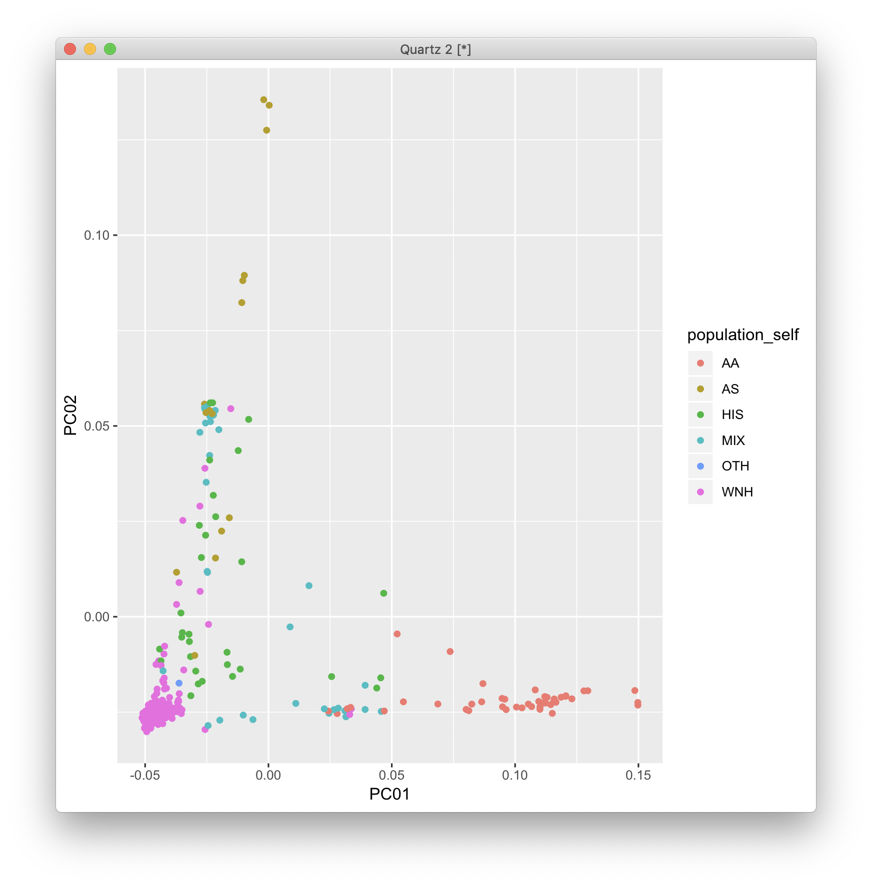
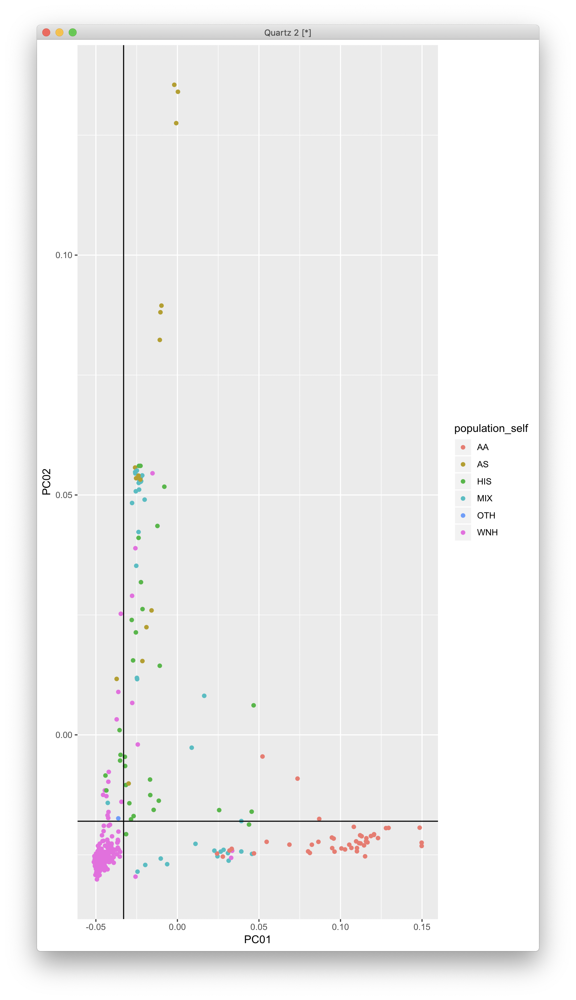
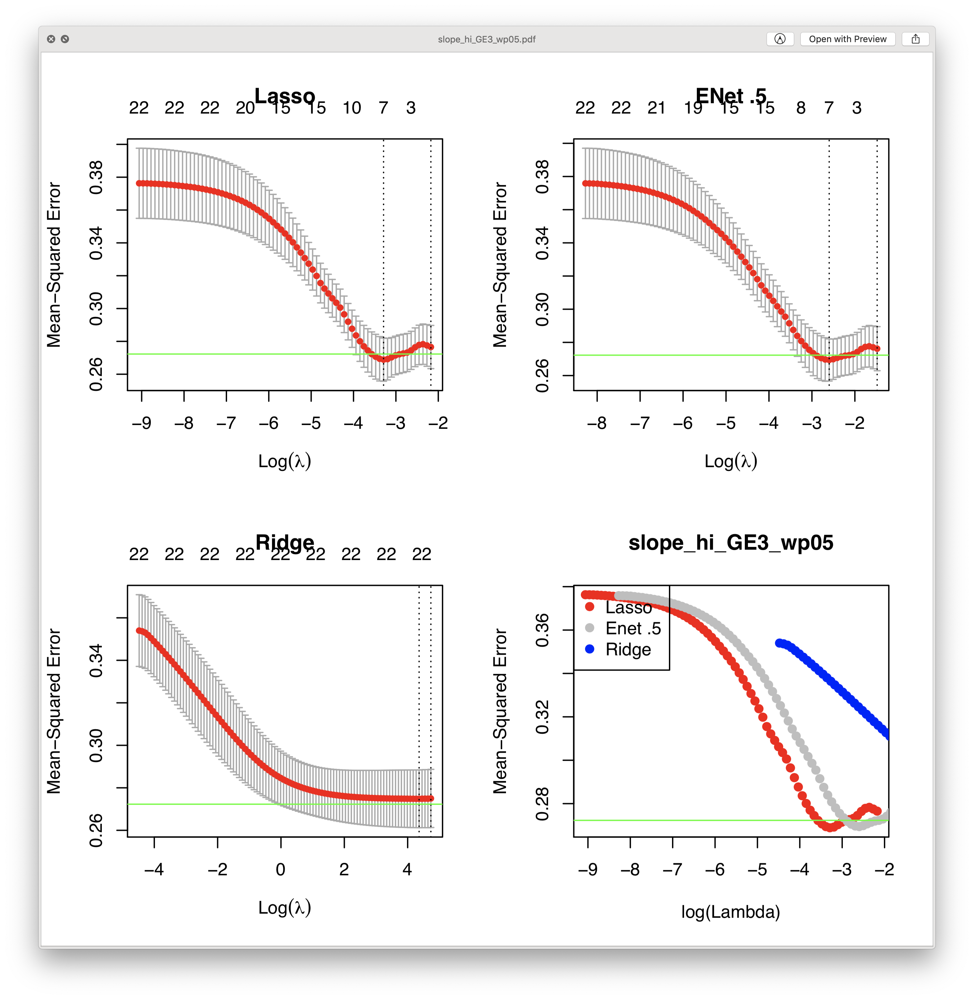
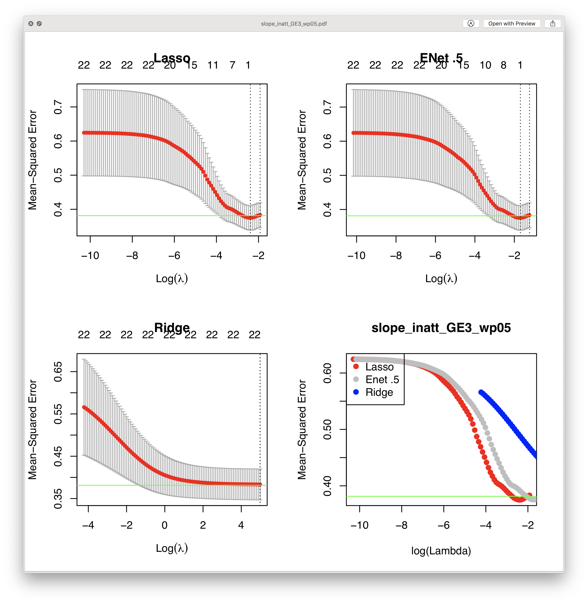
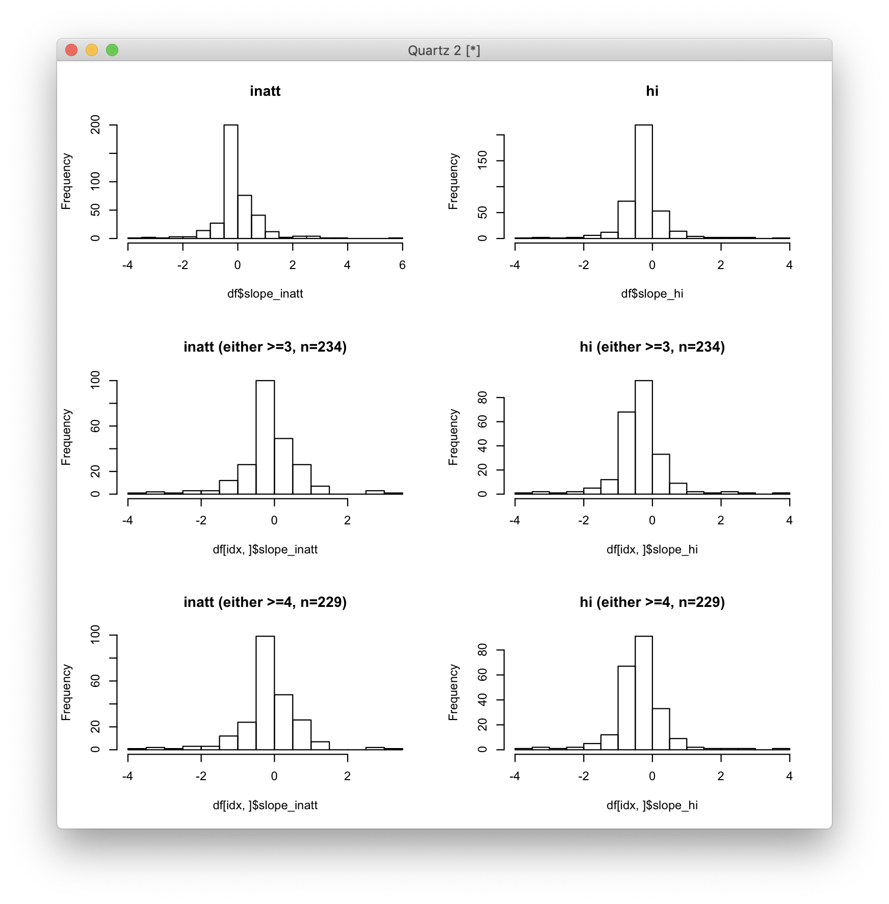
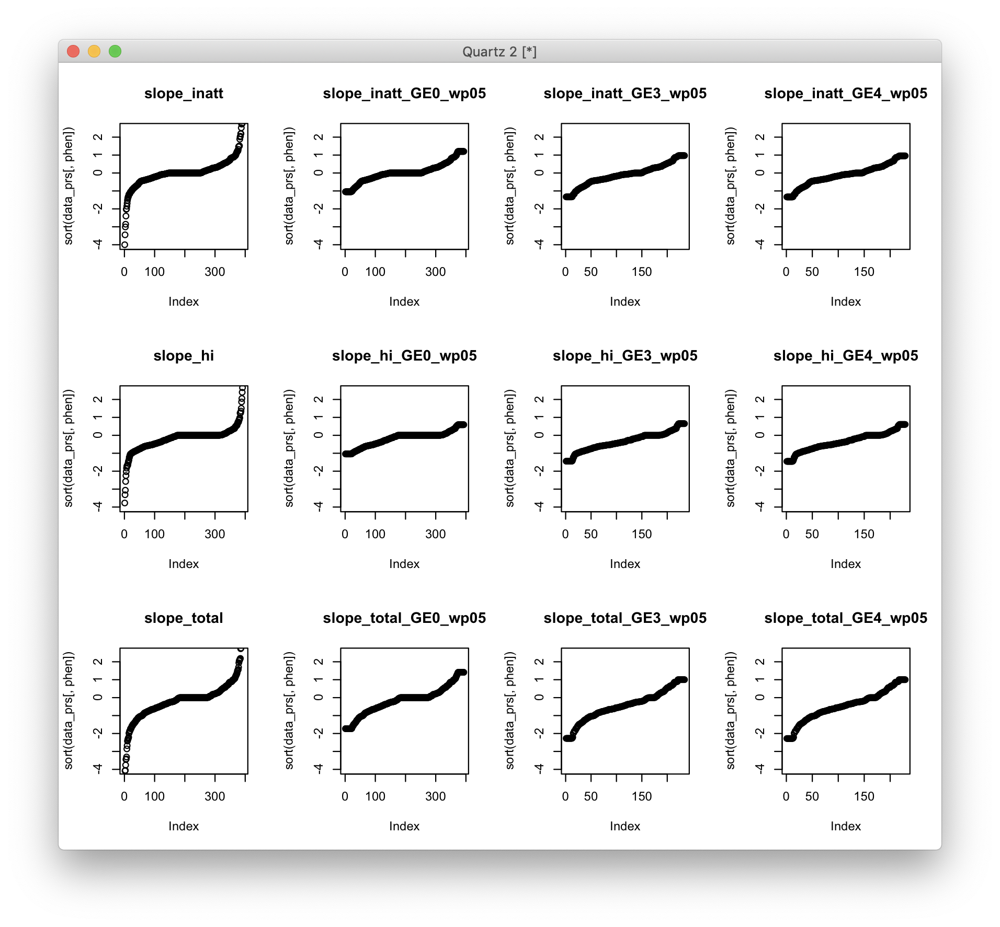

# 2020-01-22 09:23:37

Let's do some further cleaning in the data to push the boundaries for PRS
prediction.

```r
setwd('~/data/baseline_prediction/prs_start/')
clin_long = read.csv('long_clin_01062020_lt16.csv')
clin_long$SX_total = clin_long$SX_inatt + clin_long$SX_hi

winsorize = function(x, cut = 0.01){
  cut_point_top <- quantile(x, 1 - cut, na.rm = T)
  cut_point_bottom <- quantile(x, cut, na.rm = T)
  i = which(x >= cut_point_top) 
  x[i] = cut_point_top
  j = which(x <= cut_point_bottom) 
  x[j] = cut_point_bottom
  return(x)
}

df = data.frame(MRN=unique(clin_long$MRN))
for (r in 1:nrow(df)) {
    subj_data = clin_long[clin_long$MRN==df$MRN[r], ]
    for (sx in c('inatt', 'hi', 'total')) {
        fit = lm(as.formula(sprintf('SX_%s ~ age', sx)), data=subj_data)
        df[r, sprintf('slope_%s', sx)] = fit$coefficients['age']
        base_row = which.min(subj_data$age)
        df[r, sprintf('base_%s', sx)] = subj_data[base_row, sprintf('SX_%s', sx)]
        last_row = which.max(subj_data$age)
        df[r, sprintf('last_%s', sx)] = subj_data[last_row, sprintf('SX_%s', sx)]
        df[r, 'base_age'] = subj_data[base_row, 'age']
        df[r, 'last_age'] = subj_data[last_row, 'age']
        df[r, 'sex'] = subj_data[last_row, 'sex']
    }
}
for (min_sx in c(0, 3, 4, 6)) {
    idx = df$base_inatt>=min_sx | df$base_hi>=min_sx
    for (sx in c('inatt', 'hi', 'total')) {
        df[, sprintf('slope_%s_GE%d_wp05', sx, min_sx)] = NA
        junk = winsorize(df[idx, sprintf('slope_%s', sx)], cut=.05)
        df[idx, sprintf('slope_%s_GE%d_wp05', sx, min_sx)] = junk
    }
}
prs = read.csv('/Volumes/NCR/reference/merged_NCR_1KG_PRS_12192019.csv')
data_prs = merge(df, prs, by='MRN', all.x=F, all.y=F)
```

Let's merge in self-identified race and ethnicity, as well as family IDs, so
that we can define WNH:

```r
demo = read.csv('prs_demo.csv')
data_prs = merge(data_prs, demo, by='MRN', all.x=F, all.y=F)
library(ggplot2)
sp = ggplot(data_prs, aes(x=PC01, y=PC02, col=population_self)) + geom_point()
sp
```



```r
data_prs$isWNH = F
idx = data_prs$PC01 < -.033 & data_prs$PC02 < -.018
data_prs[idx,]$isWNH = T
sp + geom_hline(yintercept=-.018) + geom_vline(xintercept=-.033)
```



Let's now select a single kid per family. I was going to do it based on
neuroimage, but I think the criteria should be:

1) Biggest total slope (to increase variance)
2) Most clinical data points (better characterization of the slope)
3) Most scans (higher chances of a good scan)

```r
data_prs$bestInFamily = F
nvisits = table(clin_long$MRN)
data_prs = merge(data_prs, as.matrix(nvisits), by.x='MRN', by.y=0)
colnames(data_prs)[ncol(data_prs)] = 'nvisits'
for (f in unique(data_prs$FAMID)) {
    fam_rows = which(data_prs$FAMID == f)
    fam_data = data_prs[fam_rows,]
    if (nrow(fam_data) == 1) {
        data_prs[fam_rows,]$bestInFamily = T
    } else {
        stotal = sort(fam_data$slope_total, index.return=T, decreasing=T)
        # if there's a tie
        if (stotal$x[1] == stotal$x[2]) {
            # print(sprintf('Tie in slope for %d', f))
            svisits = sort(fam_data$nvisits, index.return=T, decreasing=T)
            if (svisits$x[1] == svisits$x[2]) {
                print(sprintf('Tie in number of visits for %d', f))
                print(fam_data[fam_data$nvisits==svisits$x[1], ]$MRN)
            } else {
                data_prs[fam_rows[svisits$ix[1]], ]$bestInFamily = T
            }
        } else {
            data_prs[fam_rows[stotal$ix[1]], ]$bestInFamily = T
        }
    }
}
```

There are only 6 ties, so I can select them manually.

```r
data_prs[data_prs$MRN==4585574, ]$bestInFamily = T
data_prs[data_prs$MRN==4925051, ]$bestInFamily = T
data_prs[data_prs$MRN==7079035, ]$bestInFamily = T
data_prs[data_prs$MRN==7378993, ]$bestInFamily = T
# chosen because of overall best MPRAGE QC
data_prs[data_prs$MRN==4640378, ]$bestInFamily = T
# chosen because of overall best MPRAGE QC
data_prs[data_prs$MRN==7218965, ]$bestInFamily = T
```

We're down to 252 subjects if we select only the best in family, 154 if keeping
WNH only (we have 247 out of the 393 as WNH). Now, let's see what PRS can help
predict. I'll start with continuous metrics:

```r
prs_var_names = colnames(data_prs)[grepl(colnames(data_prs), pattern='ADHDeur_') |
                                   grepl(colnames(data_prs), pattern='PC')]
for (sx in c('inatt', 'hi', 'total')) {
    for (min_sx in c(0, 3, 4)) {
        phen = sprintf('slope_%s_GE%d_wp05', sx, min_sx)
        pdf(sprintf('~/tmp/%s.pdf', phen))
        data_prs$y = data_prs[, phen]
        use_me = !is.na(data_prs[,]$y) & data_prs$isWNH & data_prs$bestInFamily
        X1 = prcomp(data_prs[use_me, prs_var_names[1:12]])$x
        colnames(X1) = sapply(1:ncol(X1), function(x) sprintf('PRSPC%02d', x))
        X = cbind(X1, as.matrix(data_prs[use_me, prs_var_names[13:22]]))
        X = scale(X)
        Y = data_prs[use_me, ]$y

        # trying to create future classes balanced
        library(caret)
        set.seed(3456)
        nFolds = 10
        trainIndex <- createFolds(Y, k = nFolds)
        # format understood by glmnet
        foldid = vector(length=length(Y))
        for (k in 1:nFolds) {
            foldid[trainIndex[sprintf('Fold%02d', k)][[1]]] = k
        }

        cv1 = cv.glmnet(X, Y, foldid=foldid, alpha=1)
        cv.5 = cv.glmnet(X, Y, foldid=foldid, alpha=.5)
        cv0 = cv.glmnet(X, Y, foldid=foldid,alpha=0)

        mse = mean((Y-mean(Y))**2)
        par(mfrow=c(2,2))
        plot(cv1, main='Lasso'); abline(h=mse, col='green')
        plot(cv.5, main='ENet .5'); abline(h=mse, col='green')
        plot(cv0, main='Ridge'); abline(h=mse, col='green')
        plot(log(cv1$lambda), cv1$cvm, pch=19, col="red", xlab="log(Lambda)",
                 ylab=cv1$name, main=phen)
        points(log(cv.5$lambda), cv.5$cvm, pch=19, col="grey")
        points(log(cv0$lambda), cv0$cvm,pch=19, col="blue")
        legend("topleft", legend=c('Lasso', "Enet .5", "Ridge"), pch=19,
               col=c("red", "grey", "blue"))
        abline(h=mse, col='green')
        dev.off()
    }
}
```

The only situation when we approached the mean error was when predicting HI rate
for GE3 (but GE4 is the same):



Let's see what variables were useful there (LASSO):

```r
sx = 'hi'
min_sx = 3
phen = sprintf('slope_%s_GE%d_wp05', sx, min_sx)
data_prs$y = data_prs[, phen]
use_me = !is.na(data_prs[,]$y) & data_prs$isWNH & data_prs$bestInFamily
X1 = prcomp(data_prs[use_me, prs_var_names[1:12]])$x
colnames(X1) = sapply(1:ncol(X1), function(x) sprintf('PRSPC%02d', x))
X = cbind(X1, as.matrix(data_prs[use_me, prs_var_names[13:22]]))
X = scale(X)
Y = data_prs[use_me, ]$y

# trying to create future classes balanced
library(caret)
set.seed(3456)
nFolds = 10
trainIndex <- createFolds(Y, k = nFolds)
# format understood by glmnet
foldid = vector(length=length(Y))
for (k in 1:nFolds) {
   foldid[trainIndex[sprintf('Fold%02d', k)][[1]]] = k
}

cv1 = cv.glmnet(X, Y, foldid=foldid, alpha=1)
coef(cv1, s = "lambda.min")
```

```
23 x 1 sparse Matrix of class "dgCMatrix"
                       1
(Intercept) -0.325089964
PRSPC01      .          
PRSPC02     -0.045668149
PRSPC03      .          
PRSPC04     -0.010149552
PRSPC05      .          
PRSPC06      0.019601452
PRSPC07      .          
PRSPC08      .          
PRSPC09      .          
PRSPC10      .          
PRSPC11      0.061886196
PRSPC12      .          
PC01         .          
PC02        -0.041012941
PC03         .          
PC04         .          
PC05        -0.108348517
PC06         .          
PC07         .          
PC08         0.008327589
PC09         .          
PC10         .          
```

Nothing earth-shattering. But let me also check that the things I assumed in
previous models are still correct here. First, do the PC of the PRS perform
better? Than, are the population PCs doing anything, since we're focusing on
WNH?

```r
prs_var_names = colnames(data_prs)[grepl(colnames(data_prs), pattern='ADHDeur_') |
                                   grepl(colnames(data_prs), pattern='PC')]
for (sx in c('inatt', 'hi', 'total')) {
    for (min_sx in c(0, 3, 4)) {
        phen = sprintf('slope_%s_GE%d_wp05', sx, min_sx)
        pdf(sprintf('~/tmp/%s.pdf', phen))
        data_prs$y = data_prs[, phen]
        use_me = !is.na(data_prs[,]$y) & data_prs$isWNH & data_prs$bestInFamily
        X = scale(data_prs[use_me, prs_var_names])
        Y = data_prs[use_me, ]$y

        # trying to create future classes balanced
        library(caret)
        set.seed(3456)
        nFolds = 10
        trainIndex <- createFolds(Y, k = nFolds)
        # format understood by glmnet
        foldid = vector(length=length(Y))
        for (k in 1:nFolds) {
            foldid[trainIndex[sprintf('Fold%02d', k)][[1]]] = k
        }

        cv1 = cv.glmnet(X, Y, foldid=foldid, alpha=1)
        cv.5 = cv.glmnet(X, Y, foldid=foldid, alpha=.5)
        cv0 = cv.glmnet(X, Y, foldid=foldid,alpha=0)

        mse = mean((Y-mean(Y))**2)
        par(mfrow=c(2,2))
        plot(cv1, main='Lasso'); abline(h=mse, col='green')
        plot(cv.5, main='ENet .5'); abline(h=mse, col='green')
        plot(cv0, main='Ridge'); abline(h=mse, col='green')
        plot(log(cv1$lambda), cv1$cvm, pch=19, col="red", xlab="log(Lambda)",
                 ylab=cv1$name, main=phen)
        points(log(cv.5$lambda), cv.5$cvm, pch=19, col="grey")
        points(log(cv0$lambda), cv0$cvm,pch=19, col="blue")
        legend("topleft", legend=c('Lasso', "Enet .5", "Ridge"), pch=19,
               col=c("red", "grey", "blue"))
        abline(h=mse, col='green')
        dev.off()
    }
}
```




It doesn't look as good anymore, and there's 2, maybe even just one variable
significant...

```r
sx = 'hi'
min_sx = 3
phen = sprintf('slope_%s_GE%d_wp05', sx, min_sx)
data_prs$y = data_prs[, phen]
use_me = !is.na(data_prs[,]$y) & data_prs$isWNH & data_prs$bestInFamily
X = scale(data_prs[use_me, prs_var_names])
Y = data_prs[use_me, ]$y
cv1 = cv.glmnet(X, Y, foldid=foldid, alpha=1)
coef(cv1, s = "lambda.min")
```

In fact, for HI it was only the intercept. For inatt we got intercept and
ADHDeur_PRS0.000500, so nothing fancy. Since the population PCs are not helping,
let's see if they're are detriment:

```r
prs_var_names = colnames(data_prs)[grepl(colnames(data_prs), pattern='ADHDeur_')]
for (sx in c('inatt', 'hi', 'total')) {
    for (min_sx in c(0, 3, 4)) {
        phen = sprintf('slope_%s_GE%d_wp05', sx, min_sx)
        pdf(sprintf('~/tmp/%s.pdf', phen))
        data_prs$y = data_prs[, phen]
        use_me = !is.na(data_prs[,]$y) & data_prs$isWNH & data_prs$bestInFamily
        X1 = prcomp(data_prs[use_me, prs_var_names[1:12]])$x
        colnames(X1) = sapply(1:ncol(X1), function(x) sprintf('PRSPC%02d', x))
        X = scale(X1)
        Y = data_prs[use_me, ]$y

        # trying to create future classes balanced
        library(caret)
        set.seed(3456)
        nFolds = 10
        trainIndex <- createFolds(Y, k = nFolds)
        # format understood by glmnet
        foldid = vector(length=length(Y))
        for (k in 1:nFolds) {
            foldid[trainIndex[sprintf('Fold%02d', k)][[1]]] = k
        }

        cv1 = cv.glmnet(X, Y, foldid=foldid, alpha=1)
        cv.5 = cv.glmnet(X, Y, foldid=foldid, alpha=.5)
        cv0 = cv.glmnet(X, Y, foldid=foldid,alpha=0)

        mse = mean((Y-mean(Y))**2)
        par(mfrow=c(2,2))
        plot(cv1, main='Lasso'); abline(h=mse, col='green')
        plot(cv.5, main='ENet .5'); abline(h=mse, col='green')
        plot(cv0, main='Ridge'); abline(h=mse, col='green')
        plot(log(cv1$lambda), cv1$cvm, pch=19, col="red", xlab="log(Lambda)",
                 ylab=cv1$name, main=phen)
        points(log(cv.5$lambda), cv.5$cvm, pch=19, col="grey")
        points(log(cv0$lambda), cv0$cvm,pch=19, col="blue")
        legend("topleft", legend=c('Lasso', "Enet .5", "Ridge"), pch=19,
               col=c("red", "grey", "blue"))
        abline(h=mse, col='green')
        dev.off()
    }
}
```

Nope, nothing there either... let's just make some plots to be sure out slope
variables look fine:

```r
par(mfrow=c(3,2))
hist(df$slope_inatt, breaks=20, main='inatt')
hist(df$slope_hi, breaks=20, main='hi')
idx = df$base_inatt>=3 | df$base_hi>=3
hist(df[idx,]$slope_inatt, breaks=20,
     main=sprintf('inatt (either >=3, n=%d)', sum(idx)))
hist(df[idx,]$slope_hi, breaks=20,
     main=sprintf('hi (either >=3, n=%d)', sum(idx)))
idx = df$base_inatt>=4 | df$base_hi>=4
hist(df[idx,]$slope_inatt, breaks=20,
     main=sprintf('inatt (either >=4, n=%d)', sum(idx)))
hist(df[idx,]$slope_hi, breaks=20,
     main=sprintf('hi (either >=4, n=%d)', sum(idx)))
```



They make sense... and here's how they look after winsorizing:

```r
par(mfrow=c(3, 4))
for (sx in c('inatt', 'hi', 'total')) {
    phen = sprintf('slope_%s', sx)
    plot(sort(data_prs[, phen]), main=phen, ylim=c(-4, 2.5))
    for (min_sx in c(0, 3, 4)) {
        phen = sprintf('slope_%s_GE%d_wp05', sx, min_sx)
        plot(sort(data_prs[, phen]), main=phen, ylim=c(-4, 2.5))
    }
}
```



So, winsorizing seems to be working fine too.

## Univariate

Philip suggested I should try a simple model y ~ PRS + PCs, and then maybe add
age and sex. But do each PRS individually, and see which ones are significant
related to the different outcomes. Not use all PRS together. This will make it
easier to use everyone later, if not restricting everyone to one in the family.

```r
hold = c()
prs_var_names = colnames(data_prs)[grepl(colnames(data_prs), pattern='ADHDeur_')]
covars = '+ PC01 + PC02 + PC03 + PC04 + PC05 + PC06 + PC07 + PC08 + PC09 + PC10 + base_age + sex.x'
out_fname = '~/data/baseline_prediction/prs_start/univar_prs_WNH_PCsAgeSex_lm.csv'
for (sx in c('inatt', 'hi', 'total')) {
    for (min_sx in c(0, 3, 4)) {
        phen = sprintf('slope_%s_GE%d_wp05', sx, min_sx)
        phen_res = c()
        for (prs in prs_var_names) {
            use_me = !is.na(data_prs[, phen]) & data_prs$bestInFamily & data_prs$isWNH
            fm_str = paste(phen, "~", prs, covars, sep="")
            fit = lm(as.formula(fm_str), data=data_prs[use_me, ])
            # assuming interesting variable is always first one
            temp = c(summary(fit)$coefficients[2, ], summary(fit)$r.squared,
                     summary(fit)$adj.r.squared)
            phen_res = rbind(phen_res, temp)
            rownames(phen_res)[nrow(phen_res)] = fm_str
        }
        phen_res = data.frame(phen_res)
        phen_res$formula = rownames(phen_res)
        phen_res$predictor = prs_var_names
        phen_res$outcome = phen
        hold = rbind(hold, phen_res)
    }
}
colnames(hold)[5:6] = c('R2', 'adjR2')
write.csv(hold, file=out_fname, row.names=F)
```

I tried a few variations of the code above, outputing the different CSV files,
and then copied everything into an Excel file called
prs_univariate_results.xslx.

For lme it changed a bit:

```r
library(nlme)
hold = c()
prs_var_names = colnames(data_prs)[grepl(colnames(data_prs), pattern='ADHDeur_')]
covars = ' + PC01 + PC02 + PC03 + PC04 + PC05 + PC06 + PC07 + PC08 + PC09 + PC10 + base_age + sex.x'
out_fname = '~/data/baseline_prediction/prs_start/univar_prs_WNH_PCsAgeSex_lme.csv'
for (sx in c('inatt', 'hi', 'total')) {
    for (min_sx in c(0, 3, 4)) {
        phen = sprintf('slope_%s_GE%d_wp05', sx, min_sx)
        phen_res = c()
        for (prs in prs_var_names) {
            use_me = !is.na(data_prs[, phen]) & data_prs$isWNH
            fm_str = paste(phen, "~", prs, covars, sep="")
            fit = lme(as.formula(fm_str), ~1|FAMID, data=data_prs[use_me, ],
                      control=lmeControl(tolerance=1e-100, returnObject=TRUE))
            # assuming interesting variable is always first one
            temp = c(summary(fit)$tTable[2, ], summary(fit)$BIC,
                     summary(fit)$AIC)
            phen_res = rbind(phen_res, temp)
            rownames(phen_res)[nrow(phen_res)] = fm_str
        }
        phen_res = data.frame(phen_res)
        phen_res$formula = rownames(phen_res)
        phen_res$predictor = prs_var_names
        phen_res$outcome = phen
        hold = rbind(hold, phen_res)
    }
}
colnames(hold)[6:7] = c('BIC', 'AIC')
write.csv(hold, file=out_fname, row.names=F)
```

## Binary groups

Let's see if we do any better if we binarize the data. Let's start with the
median value as the cutoff. But we could even optimize that, if the goal here is
really stacking up the deck...

We start with one per family as before. Just a quick note on defining the slope
threshold:

```
> phen_slope
[1] "slope_total_GE4_wp05"
> summary(data_prs[, phen_slope])
   Min. 1st Qu.  Median    Mean 3rd Qu.    Max.    NA's 
-2.2794 -0.9430 -0.4343 -0.4585  0.0000  1.0013     164 
> quantile(data_prs[, phen_slope], .75, na.rm=T)
         75% 
1.004859e-14 
> quantile(data_prs[, phen_slope], .25, na.rm=T)
       25% 
-0.9429821 
```

So, lower values mean stronger requirement (more negative slope) to be
considered an improver.

```r
hold = c()
prs_var_names = colnames(data_prs)[grepl(colnames(data_prs), pattern='ADHDeur_')]
covars = '+ PC01 + PC02 + PC03 + PC04 + PC05 + PC06 + PC07 + PC08 + PC09 + PC10 + base_age + sex.x'
out_fname = '~/data/baseline_prediction/prs_start/univar_prs_WNH_PCsAgeSex_glm.csv'
for (sx in c('inatt', 'hi', 'total')) {
    for (min_sx in c(3, 4, 6)) {
        for (qtile in c(.2, .25, .33, .5)) {
            phen_slope = sprintf('slope_%s_GE%d_wp05', sx, min_sx)
            phen = sprintf('bin%.2f_%s_GE%d_wp05', qtile, sx, min_sx)
            thresh = quantile(data_prs[, phen_slope], qtile, na.rm=T)
            data_prs[, phen] = NA
            data_prs[which(data_prs[, phen_slope] < thresh), phen] = 'imp'
            data_prs[which(data_prs[, phen_slope] >= thresh), phen] = 'nonimp'
            data_prs[, phen] = as.factor(data_prs[, phen])
            use_me = !is.na(data_prs[, phen]) & data_prs$bestInFamily & data_prs$isWNH

            phen_res = c()
            for (prs in prs_var_names) {
                fm_str = paste(phen, "~", prs, covars, sep="")
                fit = glm(as.formula(fm_str), data=data_prs[use_me, ],
                          family=binomial(link='logit'))
                # assuming interesting variable is always first one
                temp = c(summary(fit)$coefficients[2, ], summary(fit)$aic,
                         summary(fit)$deviance)
                phen_res = rbind(phen_res, temp)
                rownames(phen_res)[nrow(phen_res)] = fm_str
            }
            phen_res = data.frame(phen_res)
            phen_res$formula = rownames(phen_res)
            phen_res$predictor = prs_var_names
            phen_res$outcome = phen
            hold = rbind(hold, phen_res)
        }
    }
}
colnames(hold)[5:6] = c('AIC', 'deviance')
write.csv(hold, file=out_fname, row.names=F)
```

I put all results in prs_univariate_binary_results.xslx. I'm trying to get the
code below for glmer working...

For now, it'd make sense to go with binary results because we have nice hits for
inatt, hi, and total. In that, WNH results are only hi, but we could maybe use
that to pick the thresholding? Maybe 0.33 or .50 would work, but GE6 looked
best. Is it good for all as well? Yeah. In fact hi_bin0.33_GE6 is the outcome
with most associated predictors in all dataset as well. (looking at filtered_
tabs in spreadsheet). bin.33 also works for total and inatt, so we could just go
with that? 

Here are the splits using GE6: 188 in all, 133 if only best in family, 83 if WNH
only). Given the GLM results above are with 133 or 83, using .33 quantile we
have a threshold of -.24 in inatt, for 44 improvers VS 89 nonimprovers. In HI,
we have a threshold of -.53, for 44 improvers VS 89 nonimprovers (evidently, as
it's a quantile of the data as the ratios should stay the same).

The median (.5) would also work, but it doesn't have as many hits...

## Persistence PRS

Let's give it a try with the persistence PRS. I have to calculate it for the new
sample too. The Dutch also recommended using the ADHD PRS as covariates when
working with the persistence PRS.

```bash
Rscript /data/NCR_SBRB/software/PRSice_2.2.5/PRSice.R  \
    --prsice /data/NCR_SBRB/software/PRSice_2.2.5/PRSice_linux \
    --base ~/pgc2017/ToShare_fused-gwas-adult-minus-child-impact-pgc_mod.txt  \
    --target /data/NCR_SBRB/NCR_genetics/v2/1KG/NCR_1KG_genop05MAFbtp01rsbtp9_renamed \
    --all-score \
    --lower 5e-08 --upper .5 --interval 5e-05 \
    --no-regress \
    --out NCR_1KG_PRS_persistent
```

and combine it with our other PRS variables:

```r
# this takes a while because we're reading in TXT files!
a = read.table('/data/NCR_SBRB/NCR_genetics/v2/1KG/NCR_1KG_PRS_persistent.all.score', header=1)
b = read.csv('/data/NCR_SBRB/NCR_genetics/v2/1KG/merged_NCR_1KG_PRS_12192019.csv')

# keep only some of the PRs columns that were created
mycols = c('IID', 'X0.00010005', 'X0.00100005', 'X0.01', 'X0.1',
            'X5.005e.05', 'X0.00050005', 'X0.00500005', 'X0.0500001',
            'X0.5', 'X0.4', 'X0.3', 'X0.2')
new_names = c('IID', sapply(c(.0001, .001, .01, .1, .00005, .0005, .005, .05,
                              .5, .4, .3, .2),
                            function(x) sprintf('ADHDpersistent_PRS%f', x)))
af = a[, mycols]
colnames(af) = new_names

m = merge(af, b, by='IID')

write.csv(m, file='/data/NCR_SBRB/NCR_genetics/v2/1KG/merged_NCR_1KG_PRS_01232020.csv', row.names=F)
```

Now we merge it into our current data and re-run the regressions:

```r
prs_per = read.csv('/Volumes/NCR/reference/merged_NCR_1KG_PRS_01232020.csv')
per_var_names = colnames(prs_per)[grepl(colnames(prs_per), pattern='ADHDpersistent_')]
data_prs = merge(data_prs, prs_per[, c('MRN', per_var_names)], by='MRN', all.x=F, all.y=F)
```

# TODO
* try persistence PRS
* continue work on glmer model just for robustness 

<!-- And we do something similar using a mixed model:

```r
library(lme4)
hold = c()
prs_var_names = colnames(data_prs)[grepl(colnames(data_prs), pattern='ADHDeur_')]
covars = c()#apply(1:10, function(x) sprintf('PC%02d', x)))#, 'base_age')
add_sex = F
out_fname = '~/data/baseline_prediction/prs_start/univar_prs_WNH_noCovs_glmer.csv'
for (sx in c('inatt')) {#}, 'hi', 'total')) {
    for (min_sx in c(3, 4)){#}, 6)) {
        print(sprintf('%s %s', sx, min_sx))
        for (qtile in c(.2, .25)){#}, .33, .5)) {
            phen_slope = sprintf('slope_%s_GE%d_wp05', sx, min_sx)
            phen = sprintf('bin%.2f_%s_GE%d_wp05', qtile, sx, min_sx)
            thresh = quantile(data_prs[, phen_slope], qtile, na.rm=T)
            data_prs[, phen] = NA
            data_prs[which(data_prs[, phen_slope] < thresh), phen] = 'imp'
            data_prs[which(data_prs[, phen_slope] >= thresh), phen] = 'nonimp'
            data_prs[, phen] = as.factor(data_prs[, phen])
            use_me = !is.na(data_prs[, phen]) & data_prs$isWNH

            this_data = data_prs[use_me, c(phen, 'FAMID', prs_var_names,
                                           covars)]
            this_data[, 3:ncol(this_data)] = scale(this_data[, 3:ncol(this_data)])
            if (add_sex) {
                this_data$sex = data_prs[use_me, 'sex.x']
                tmp_covars = c(covars, 'sex')
            } else {
                tmp_covars = covars
            }
            phen_res = c()
            for (prs in prs_var_names) {
                fm_str = paste(phen, "~", prs, '+',
                               paste(tmp_covars, collapse='+'), '+(1|FAMID)',
                               sep="")
                fit = glmer(as.formula(fm_str), data=this_data,
                            family=binomial(link='logit'))
                if (isSingular(fit)) {
                    # assuming interesting variable is always first one
                    temp = c(summary(fit)$coefficients[2, ],
                             summary(fit)$AICtab[1:2], prs)
                    phen_res = rbind(phen_res, temp)
                    rownames(phen_res)[nrow(phen_res)] = fm_str
                }
            }
            phen_res = data.frame(phen_res)
            phen_res$formula = rownames(phen_res)
            phen_res$outcome = phen
            hold = rbind(hold, phen_res)
        }
    }
}
write.csv(hold, file=out_fname, row.names=F)
``` -->


