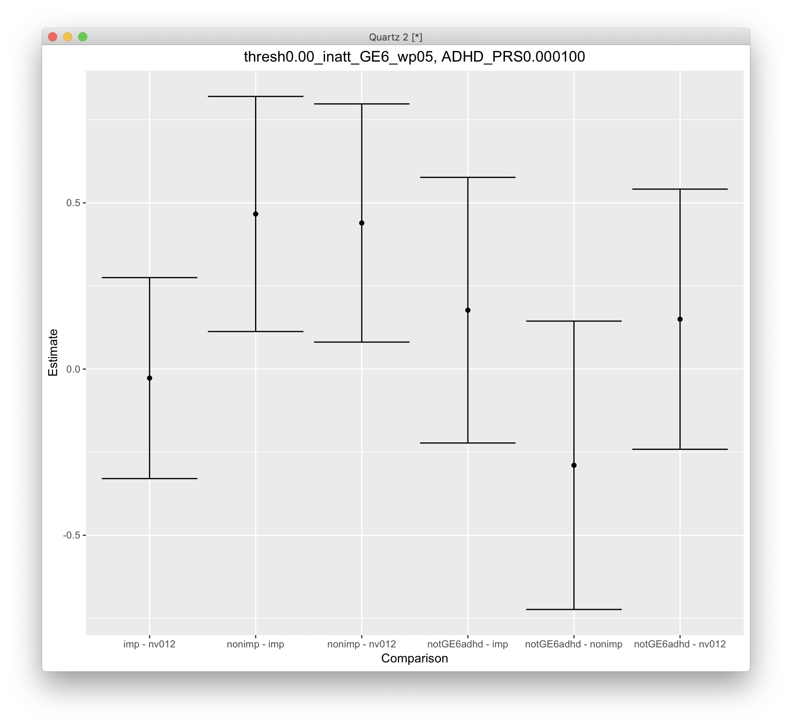
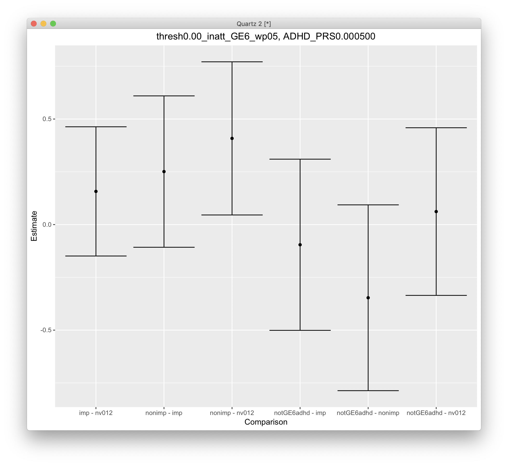
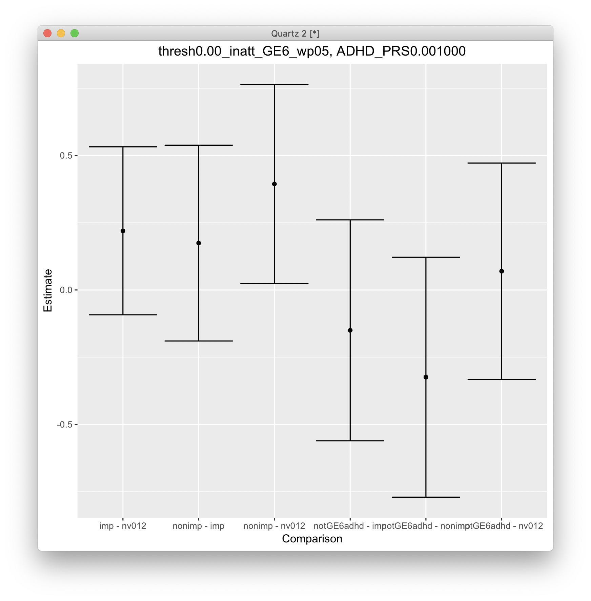
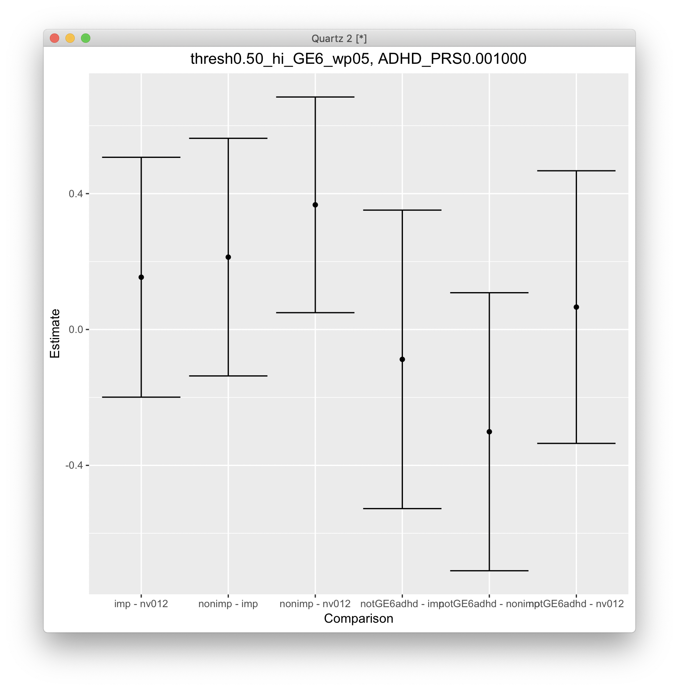
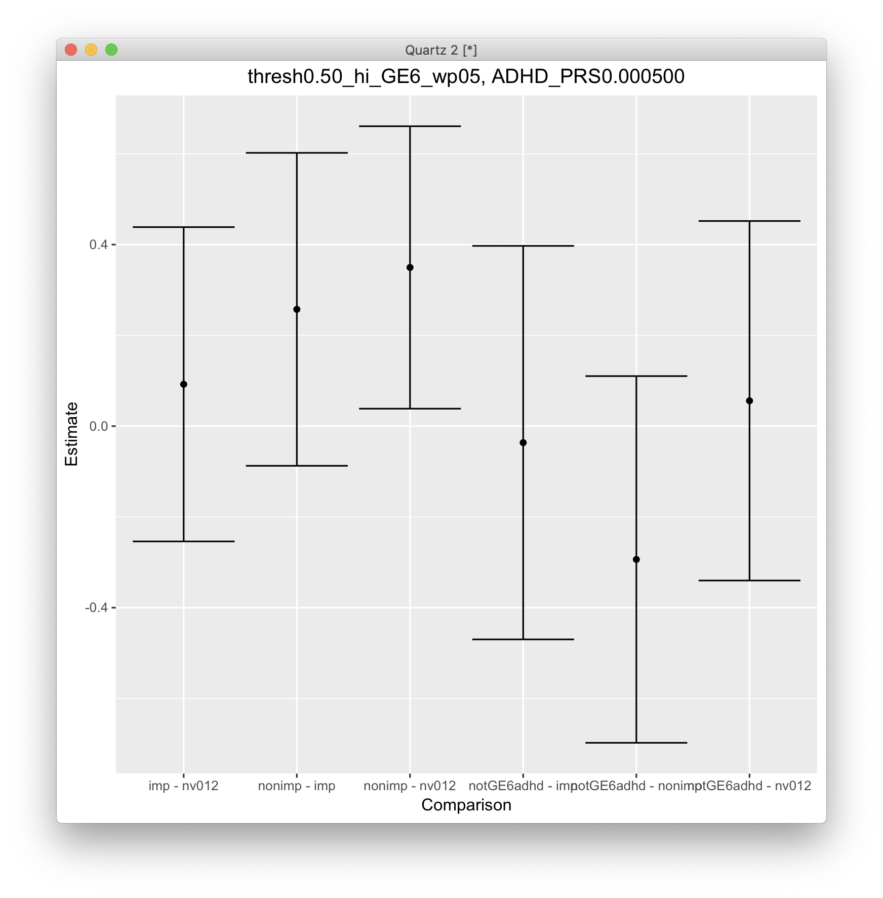
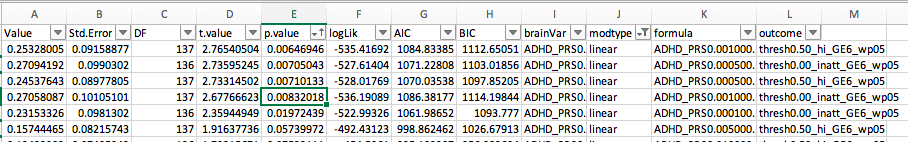

# 2020-01-24 13:02:29

Let's continue what we were doing in 067, but I'm not going to pick up from
persistence PRS. After talking to Philip, it's a better approach to see where
NVs lie on the PRS spectrum. In other ways, can we choose the best outcome
formulation by including NVs in the mix. Where are they with respect to
improvers and non-improvers?

```r
data_prs = read.csv('/Volumes/Shaw/tmp/for_philip/working_gf.csv')
phen = 'bin0.33_hi_GE6_wp05'
data_prs[, phen] = as.character(data_prs[, phen])
imnv = is.na(data_prs[, phen])
data_prs[imnv, phen] = 'nv'
use_me = data_prs$bestInFamily
data_prs[, phen] = factor(data_prs[, phen], ordered=F)
data_prs[, phen] = relevel(data_prs[, phen], ref='nv')
library("nnet")
fit = multinom(bin0.33_hi_GE6_wp05~ADHD_PRS0.000100+ PC01 + PC02 + PC03 + PC04 + PC05 + PC06 + PC07 + PC08 + PC09 + PC10 + base_age + sex.x, data=data_prs[use_me,])
z <- summary(fit)$coefficients/summary(fit)$standard.errors
p <- (1 - pnorm(abs(z), 0, 1))*2
```

The code above seems to work. So, let's loop through our possible thresholds:

```r
hold = c()
prs_var_names = colnames(data_prs)[grepl(colnames(data_prs), pattern='ADHD_')]
covars = '+ PC01 + PC02 + PC03 + PC04 + PC05 + PC06 + PC07 + PC08 + PC09 + PC10 + base_age + sex.x'
out_fname = '~/data/baseline_prediction/prs_start/univar_prs_all_PCsAgeSex_multinom.csv'
for (sx in c('inatt', 'hi', 'total')) {
    for (min_sx in c(3, 4, 6)) {
        for (qtile in c(.2, .25, .33, .5)) {
            phen_slope = sprintf('slope_%s_GE%d_wp05', sx, min_sx)
            phen = sprintf('bin%.2f_%s_GE%d_wp05', qtile, sx, min_sx)
            thresh = quantile(data_prs[, phen_slope], qtile, na.rm=T)
            data_prs[, phen] = 'nv'
            data_prs[which(data_prs[, phen_slope] < thresh), phen] = 'imp'
            data_prs[which(data_prs[, phen_slope] >= thresh), phen] = 'nonimp'
            data_prs[, phen] = factor(data_prs[, phen], ordered=F)
            data_prs[, phen] = relevel(data_prs[, phen], ref='nv')
            use_me = data_prs$bestInFamily #& data_prs$isWNH

            phen_res = c()
            for (prs in prs_var_names) {
                fm_str = paste(phen, "~", prs, covars, sep="")
                fit = multinom(as.formula(fm_str), data=data_prs[use_me,])
                z <- summary(fit)$coefficients/summary(fit)$standard.errors
                p <- (1 - pnorm(abs(z), 0, 1))*2
                temp = c(p[, 2], summary(fit)$AIC, summary(fit)$deviance)
                phen_res = rbind(phen_res, temp)
                rownames(phen_res)[nrow(phen_res)] = fm_str
            }
            phen_res = data.frame(phen_res)
            phen_res$formula = rownames(phen_res)
            phen_res$predictor = prs_var_names
            phen_res$outcome = phen
            hold = rbind(hold, phen_res)
        }
    }
}
colnames(hold)[3:4] = c('AIC', 'deviance')
write.csv(hold, file=out_fname, row.names=F)
```

This code is working, but way too many results have p-values too good to be
true. It's not an issue with the code either... it's something funky going on.
But what if we invert the model? Isn't the idea just to show that PRS is
different for the 3 different groups? Then, why not just do an ANOVA?

```r
hold = c()
prs_var_names = colnames(data_prs)[grepl(colnames(data_prs), pattern='ADHDeur_')]
covars = ''#'PC01 + PC02 + PC03 + PC04 + PC05 + PC06 + PC07 + PC08 + PC09 + PC10 + base_age + sex.x + '
out_fname = '~/data/baseline_prediction/prs_start/univar_prs_WNH_noCovs_aov.csv'
for (sx in c('inatt', 'hi', 'total')) {
    for (min_sx in c(3, 4, 6)) {
        for (qtile in c(.2, .25, .33, .5)) {
            phen_slope = sprintf('slope_%s_GE%d_wp05', sx, min_sx)
            phen = sprintf('bin%.2f_%s_GE%d_wp05', qtile, sx, min_sx)
            thresh = quantile(data_prs[, phen_slope], qtile, na.rm=T)
            data_prs[, phen] = 'nv'
            data_prs[which(data_prs[, phen_slope] < thresh), phen] = 'imp'
            data_prs[which(data_prs[, phen_slope] >= thresh), phen] = 'nonimp'
            data_prs[, phen] = factor(data_prs[, phen], ordered=F)
            data_prs[, phen] = relevel(data_prs[, phen], ref='nv')
            use_me = data_prs$bestInFamily & data_prs$isWNH

            phen_res = c()
            for (prs in prs_var_names) {
                fm_str = paste(prs, "~", covars, phen, sep="")
                fit = aov(as.formula(fm_str), data=data_prs[use_me,])
                p = summary(fit)[[1]]
                temp = c(p[nrow(p)-1, 5], p[nrow(p), 3])
                phen_res = rbind(phen_res, temp)
                rownames(phen_res)[nrow(phen_res)] = fm_str
            }
            phen_res = data.frame(phen_res)
            phen_res$formula = rownames(phen_res)
            phen_res$predictor = prs_var_names
            phen_res$outcome = phen
            hold = rbind(hold, phen_res)
        }
    }
}
colnames(hold)[1:2] = c('pval', 'residMeanSq')
write.csv(hold, file=out_fname, row.names=F)
```

Accumulated results in univariate_aov_results.xlsx. If we want to include inatt
and hi results, it seems like the best thing is to use bin.5 and GE6. That's
fine as well. We just need to make sure our ANCOVA assumptions hold in that
threshold, and that the posthoc comparisons look fine (this is a great tutorial,
http://faculty.missouri.edu/huangf/data/quantf/ancova_in_r_handout.pdf)

```r
sx = 'inatt'
min_sx = 6
qtile = .5
prs = 'ADHD_PRS0.000100'
covars = c(sapply(1:10, function(x) sprintf('PC%02d', x)), 'base_age', 'sex.x')
phen = sprintf('bin%.2f_%s_GE%d_wp05', qtile, sx, min_sx)
thresh = quantile(data_prs[, phen_slope], qtile, na.rm=T)
data_prs[, phen] = 'nv'
data_prs[which(data_prs[, phen_slope] < thresh), phen] = 'imp'
data_prs[which(data_prs[, phen_slope] >= thresh), phen] = 'nonimp'
data_prs[, phen] = factor(data_prs[, phen], ordered=F)
data_prs[, phen] = relevel(data_prs[, phen], ref='nv')
use_me = data_prs$bestInFamily

# interaction between groups and covariates
for (covar in covars) {
    fm_str = sprintf('%s ~ %s + %s + %s:%s', prs, phen, covar, phen, covar)
    fit = aov(as.formula(fm_str), data=data_prs[use_me,])
    ps = summary(fit)[[1]]
    pval = ps[nrow(ps)-1, 5]
    if (pval < .05) {
        print(sprintf('pval for %s is significant', covar))
    }
}
```

PC04 violates it for ADHD_PRS0.001000, 

# 2020-01-27 09:01:48

I was chatting with Philip and there are a few things to try:

* Focus on mixed model ANOVA so we can include everyone. Then we can do it just
one per family to confirm the results
* Use more meaningful breaks in the data, such as 0 or -.5.
* Maybe stratify NVs into squeaky clean (0 and 1), then 2, 4, 5, and then GE6.

Let's run the model as is first.

```r
library(lme4)
library(car)

hold = c()
prs_var_names = colnames(data_prs)[grepl(colnames(data_prs), pattern='ADHD_')]
covars = c(sapply(1:10, function(x) sprintf('PC%02d', x)), 'base_age')
add_sex = T
out_fname = '~/data/baseline_prediction/prs_start/univar_prs_all_PCsAgeSex_lmer.csv'
for (sx in c('inatt', 'hi', 'total')) {
    for (min_sx in c(3, 4, 6)) {
        for (qtile in c(.33, .5)) {
            phen_slope = sprintf('slope_%s_GE%d_wp05', sx, min_sx)
            phen = sprintf('bin%.2f_%s_GE%d_wp05', qtile, sx, min_sx)
            thresh = quantile(data_prs[, phen_slope], qtile, na.rm=T)
            data_prs[, phen] = 'nv'
            data_prs[which(data_prs[, phen_slope] < thresh), phen] = 'imp'
            data_prs[which(data_prs[, phen_slope] >= thresh), phen] = 'nonimp'
            data_prs[, phen] = factor(data_prs[, phen], ordered=F)
            data_prs[, phen] = relevel(data_prs[, phen], ref='nv')
            use_me = T#data_prs$isWNH
            print(sprintf('%s GE%d at %.2f = %.2f', sx, min_sx, qtile, thresh))

            this_data = data_prs[use_me, c(phen, 'FAMID', prs_var_names,
                                           covars)]
            this_data[, 3:ncol(this_data)] = scale(this_data[, 3:ncol(this_data)])
            if (add_sex) {
                this_data$sex = data_prs[use_me, 'sex.x']
                tmp_covars = c(covars, 'sex')
            } else {
                tmp_covars = covars
            }
            phen_res = c()
            for (prs in prs_var_names) {
                fm_str = paste(prs, "~", phen, '+',
                               paste(tmp_covars, collapse='+'), '+(1|FAMID)',
                               sep="")
                fit = lmer(as.formula(fm_str), data=this_data, REML = FALSE)
                p = Anova(fit)
                temp = c(p[1,3], summary(fit)$AIC[1:4])
                phen_res = rbind(phen_res, temp)
                rownames(phen_res)[nrow(phen_res)] = fm_str
            }
            phen_res = data.frame(phen_res)
            phen_res$formula = rownames(phen_res)
            phen_res$predictor = prs_var_names
            phen_res$outcome = phen
            hold = rbind(hold, phen_res)
        }
    }
}
colnames(hold)[1] = c('pval')
write.csv(hold, file=out_fname, row.names=F)
```

The thresholds don't depend on all or WNH. I get:

```
[1] "inatt GE3 at 0.33 = -0.33"
[1] "inatt GE3 at 0.50 = -0.08"
[1] "inatt GE4 at 0.33 = -0.33"
[1] "inatt GE4 at 0.50 = -0.08"
[1] "inatt GE6 at 0.33 = -0.33"
[1] "inatt GE6 at 0.50 = -0.10"
[1] "hi GE3 at 0.33 = -0.57"
[1] "hi GE3 at 0.50 = -0.36"
[1] "hi GE4 at 0.33 = -0.57"
[1] "hi GE4 at 0.50 = -0.36"
[1] "hi GE6 at 0.33 = -0.57"
[1] "hi GE6 at 0.50 = -0.38"
[1] "total GE3 at 0.33 = -0.73"
[1] "total GE3 at 0.50 = -0.44"
[1] "total GE4 at 0.33 = -0.74"
[1] "total GE4 at 0.50 = -0.43"
[1] "total GE6 at 0.33 = -0.76"
[1] "total GE6 at 0.50 = -0.48"
```

So it seems like natural thresholds for inatt would be 0 and -.3. For hi I have
-.5 and -.3. For total I have -.4 and -.8. I'll round them -.5 and -1. Let's
try those thresholds then:

```r
hold = c()
prs_var_names = colnames(data_prs)[grepl(colnames(data_prs), pattern='ADHDeur_')]
covars = c(sapply(1:10, function(x) sprintf('PC%02d', x)), 'base_age')
add_sex = T
out_fname = '~/data/baseline_prediction/prs_start/univar_prs_WNH_PCsAgeSex_lmer.csv'
for (sx in c('inatt', 'hi', 'total')) {
    for (min_sx in c(3, 4, 6)) {
        if (sx == 'inatt') {
            thresholds = c(0, -.3)
        } else if (sx == 'hi') {
            thresholds = c(-.3, -.5)
        } else {
            thresholds = c(-.5, -1)
        }
        for (thresh in thresholds) {
            phen_slope = sprintf('slope_%s_GE%d_wp05', sx, min_sx)
            phen = sprintf('thresh%.2f_%s_GE%d_wp05', abs(thresh), sx, min_sx)
            data_prs[, phen] = 'nv'
            data_prs[which(data_prs[, phen_slope] < thresh), phen] = 'imp'
            data_prs[which(data_prs[, phen_slope] >= thresh), phen] = 'nonimp'
            data_prs[, phen] = factor(data_prs[, phen], ordered=F)
            data_prs[, phen] = relevel(data_prs[, phen], ref='nv')
            use_me = data_prs$isWNH

            this_data = data_prs[use_me, c(phen, 'FAMID', prs_var_names,
                                           covars)]
            this_data[, 3:ncol(this_data)] = scale(this_data[, 3:ncol(this_data)])
            if (add_sex) {
                this_data$sex = data_prs[use_me, 'sex.x']
                tmp_covars = c(covars, 'sex')
            } else {
                tmp_covars = covars
            }
            phen_res = c()
            for (prs in prs_var_names) {
                fm_str = paste(prs, "~", phen, '+',
                               paste(tmp_covars, collapse='+'), '+(1|FAMID)',
                               sep="")
                fit = lmer(as.formula(fm_str), data=this_data, REML = FALSE)
                p = Anova(fit)
                temp = c(p[1,3], summary(fit)$AIC[1:4])
                phen_res = rbind(phen_res, temp)
                rownames(phen_res)[nrow(phen_res)] = fm_str
            }
            phen_res = data.frame(phen_res)
            phen_res$formula = rownames(phen_res)
            phen_res$predictor = prs_var_names
            phen_res$outcome = phen
            hold = rbind(hold, phen_res)
        }
    }
}
colnames(hold)[1] = c('pval')
write.csv(hold, file=out_fname, row.names=F)
```

And let's check on how it works if we split the NV groups as well:

```r
hold = c()
prs_var_names = colnames(data_prs)[grepl(colnames(data_prs), pattern='ADHD_')]
covars = c(sapply(1:10, function(x) sprintf('PC%02d', x)), 'base_age')
add_sex = T
out_fname = '~/data/baseline_prediction/prs_start/univar_prs_all_PCsAgeSex_4_groups_lmer.csv'
for (sx in c('inatt', 'hi', 'total')) {
    min_sx = 6
    if (sx == 'inatt') {
        thresholds = c(0, -.3)
    } else if (sx == 'hi') {
        thresholds = c(-.3, -.5)
    } else {
        thresholds = c(-.5, -1)
    }
    for (thresh in thresholds) {
        phen_slope = sprintf('slope_%s_GE%d_wp05', sx, min_sx)
        phen = sprintf('thresh%.2f_%s_GE%d_wp05', abs(thresh), sx, min_sx)
        data_prs[, phen] = 'notGE6adhd'
        my_nvs = which(is.na(data_prs[, phen_slope]))
        idx = data_prs[my_nvs, 'base_inatt'] <= 2 & data_prs[my_nvs, 'base_hi'] <= 2
        data_prs[my_nvs[idx], phen] = 'nv012'
        data_prs[which(data_prs[, phen_slope] < thresh), phen] = 'imp'
        data_prs[which(data_prs[, phen_slope] >= thresh), phen] = 'nonimp'
        data_prs[, phen] = factor(data_prs[, phen], ordered=F)
        data_prs[, phen] = relevel(data_prs[, phen], ref='nv012')
        use_me = T#data_prs$isWNH

        this_data = data_prs[use_me, c(phen, 'FAMID', prs_var_names,
                                       covars)]
        this_data[, 3:ncol(this_data)] = scale(this_data[, 3:ncol(this_data)])
        if (add_sex) {
            this_data$sex = data_prs[use_me, 'sex.x']
            tmp_covars = c(covars, 'sex')
        } else {
            tmp_covars = covars
        }
        phen_res = c()
        for (prs in prs_var_names) {
            fm_str = paste(prs, "~", phen, '+',
                           paste(tmp_covars, collapse='+'), '+(1|FAMID)',
                           sep="")
            fit = lmer(as.formula(fm_str), data=this_data, REML = FALSE)
            p = Anova(fit)
            temp = c(p[1,3], summary(fit)$AIC[1:4])
            phen_res = rbind(phen_res, temp)
            rownames(phen_res)[nrow(phen_res)] = fm_str
        }
        phen_res = data.frame(phen_res)
        phen_res$formula = rownames(phen_res)
        phen_res$predictor = prs_var_names
        phen_res$outcome = phen
        hold = rbind(hold, phen_res)
    }
}
colnames(hold)[1] = c('pval')
write.csv(hold, file=out_fname, row.names=F)
```

I compiled the results under univariate_lmer_results.xlsx. There were a few hits
that worked for the 4group cases, and also for all and WNH. That being the
criteria, I'l keep HI at -.5 and inatt at 0. Let's make a few plots to see what
they mean:

```r
prs_var_names = colnames(data_prs)[grepl(colnames(data_prs), pattern='ADHD_')]
covars = c(sapply(1:10, function(x) sprintf('PC%02d', x)), 'base_age')
sx = 'hi'
prs = 'ADHD_PRS0.000500'
min_sx = 6
thresh = -.5
use_me = T#data_prs$isWNH

phen_slope = sprintf('slope_%s_GE%d_wp05', sx, min_sx)
phen = sprintf('thresh%.2f_%s_GE%d_wp05', abs(thresh), sx, min_sx)
data_prs[, phen] = 'notGE6adhd'
my_nvs = which(is.na(data_prs[, phen_slope]))
idx = data_prs[my_nvs, 'base_inatt'] <= 2 & data_prs[my_nvs, 'base_hi'] <= 2
data_prs[my_nvs[idx], phen] = 'nv012'
data_prs[which(data_prs[, phen_slope] < thresh), phen] = 'imp'
data_prs[which(data_prs[, phen_slope] >= thresh), phen] = 'nonimp'
data_prs[, phen] = factor(data_prs[, phen], ordered=F)
data_prs[, phen] = relevel(data_prs[, phen], ref='nv012')
this_data = data_prs[use_me, c(phen, 'FAMID', prs_var_names,
                               covars)]
this_data[, 3:ncol(this_data)] = scale(this_data[, 3:ncol(this_data)])
this_data$sex = data_prs[use_me, 'sex.x']
tmp_covars = c(covars, 'sex')
fm_str = paste(prs, "~", phen, '+',
               paste(tmp_covars, collapse='+'), '+(1|FAMID)',
               sep="")
fit = lmer(as.formula(fm_str), data=this_data, REML = FALSE)
print(Anova(fit))

# posthoc = glht(fit, linfct=mcp(thresh0.00_inatt_GE6_wp05 = "Tukey"))
posthoc = glht(fit, linfct=mcp(thresh0.50_hi_GE6_wp05 = "Tukey"))
print(summary(posthoc))
tmp <- as.data.frame(confint(posthoc)$confint)
tmp$Comparison <- rownames(tmp)
ggplot(tmp, aes(x = Comparison, y = Estimate, ymin = lwr, ymax = upr)) +
    geom_errorbar() + geom_point() + ggtitle(sprintf('%s, %s', phen, prs)) +
    theme(plot.title = element_text(hjust = 0.5))
```



So, this is a good result in that the meaningful differences are between nonimp
and imp, and nonimp and clean nvs. But we do have many comparisons here... I
could just keep nvs as nv012, or try the 2 group result. Let me see what some of
the other 4 group results look like:









So, it looks like most of the differences are in the nonimp to clean nv group.
That's make sense, especially since our PRS comes from ADHD GWAS. The first
result had a difference between nonimp and imp, which looked interestingly. It's
up to us whether we want this comparison to be more evident though. What if we
focus on WNH, or just the 3 gorup differences?

Philip also asked me to explore ordered differences. Let me see if it makes any
differences in the current result:

```r
prs_var_names = colnames(data_prs)[grepl(colnames(data_prs), pattern='ADHD_')]
covars = c(sapply(1:10, function(x) sprintf('PC%02d', x)), 'base_age')
sx = 'hi'
prs = 'ADHD_PRS0.000500'
min_sx = 6
thresh = -0.5
use_me = T#data_prs$isWNH

phen_slope = sprintf('slope_%s_GE%d_wp05', sx, min_sx)
phen = sprintf('thresh%.2f_%s_GE%d_wp05', abs(thresh), sx, min_sx)
data_prs[, phen] = 'notGE6adhd'
my_nvs = which(is.na(data_prs[, phen_slope]))
idx = data_prs[my_nvs, 'base_inatt'] <= 2 & data_prs[my_nvs, 'base_hi'] <= 2
data_prs[my_nvs[idx], phen] = 'nv012'
data_prs[which(data_prs[, phen_slope] < thresh), phen] = 'imp'
data_prs[which(data_prs[, phen_slope] >= thresh), phen] = 'nonimp'
data_prs[, phen] = factor(data_prs[, phen], ordered=F)
data_prs[, phen] = relevel(data_prs[, phen], ref='nv012')
this_data = data_prs[use_me, c(phen, 'FAMID', prs_var_names,
                               covars)]
this_data[, 3:ncol(this_data)] = scale(this_data[, 3:ncol(this_data)])
this_data$sex = data_prs[use_me, 'sex.x']
tmp_covars = c(covars, 'sex')
fm_str = paste(prs, "~", phen, '+',
               paste(tmp_covars, collapse='+'), '+(1|FAMID)',
               sep="")
fit = lmer(as.formula(fm_str), data=this_data, REML = FALSE)
print(Anova(fit))
# posthoc = glht(fit, linfct=mcp(thresh0.00_inatt_GE6_wp05 = "Tukey"))
posthoc = glht(fit, linfct=mcp(thresh0.50_inatt_GE6_wp05 = "Tukey"))
print(summary(posthoc))

data_prs$ordered = factor(data_prs[, phen],
                          levels=c('nv012', 'notGE6adhd', 'nonimp', 'imp'),
                          ordered=T)
fmo_str = paste(prs, "~ ordered +",
               paste(tmp_covars, collapse='+'), '+(1|FAMID)',
               sep="")
fito = lmer(as.formula(fmo_str), data=this_data, REML = FALSE)
print(Anova(fito))
posthoco = glht(fito, linfct=mcp(thresh0.00_inatt_GE6_wp05 = "Tukey"))
print(summary(posthoco))
```

lmer doesn't support that. We'd have to run an ordered logistic regression, like
note 009-ordered_logistc.Rmd. Let me focus on these for now. I can always just
plot the coefficients, if I want to check where they lie in the spectrum:

```r
prs_var_names = colnames(data_prs)[grepl(colnames(data_prs), pattern='ADHD_')]
covars = c(sapply(1:10, function(x) sprintf('PC%02d', x)), 'base_age')
sx = 'hi'
prs = 'ADHD_PRS0.000500'
min_sx = 6
thresh = 0
use_me = T#data_prs$isWNH

phen_slope = sprintf('slope_%s_GE%d_wp05', sx, min_sx)
phen = sprintf('thresh%.2f_%s_GE%d_wp05', abs(thresh), sx, min_sx)
data_prs[, phen] = 'notGE6adhd'
my_nvs = which(is.na(data_prs[, phen_slope]))
idx = data_prs[my_nvs, 'base_inatt'] <= 2 & data_prs[my_nvs, 'base_hi'] <= 2
data_prs[my_nvs[idx], phen] = 'nv012'
data_prs[which(data_prs[, phen_slope] < thresh), phen] = 'imp'
data_prs[which(data_prs[, phen_slope] >= thresh), phen] = 'nonimp'
data_prs[, phen] = factor(data_prs[, phen], ordered=F)
data_prs[, phen] = relevel(data_prs[, phen], ref='nv012')
this_data = data_prs[use_me, c(phen, 'FAMID', prs_var_names,
                               covars)]
this_data[, 3:ncol(this_data)] = scale(this_data[, 3:ncol(this_data)])
this_data$sex = data_prs[use_me, 'sex.x']
tmp_covars = c(covars, 'sex')
fm_str = paste(prs, "~", phen, '+',
               paste(tmp_covars, collapse='+'), '+(1|FAMID)',
               sep="")
fit = lmer(as.formula(fm_str), data=this_data, REML = FALSE)
print(Anova(fit))
posthoc = glht(fit, linfct=mcp(thresh0.00_inatt_GE6_wp05 = "Tukey"))
print(summary(posthoc))

data_prs$ordered = factor(data_prs[, phen],
                          levels=c('nv012', 'notGE6adhd', 'nonimp', 'imp'),
                          ordered=T)
fmo_str = paste(prs, "~ ordered +",
               paste(tmp_covars, collapse='+'), '+(1|FAMID)',
               sep="")
fito = lmer(as.formula(fmo_str), data=this_data, REML = FALSE)
print(Anova(fito))
posthoco = glht(fito, linfct=mcp(thresh0.00_inatt_GE6_wp05 = "Tukey"))
print(summary(posthoco))
```

Note that the actual model doesn't have the exact same stats, but I think it
should be fine if all I'm doing is plotting the coefficients.

```r
fm0_str = paste(prs, "~ 0 +", phen, '+',
               paste(tmp_covars, collapse='+'), '+(1|FAMID)',
               sep="")
fit0 = lmer(as.formula(fm0_str), data=this_data, REML = FALSE)
print(Anova(fit0))
posthoc = glht(fit, linfct=mcp(thresh0.50_hi_GE6_wp05 = "Tukey"))
print(summary(posthoc)) + (1|experiment), data = dataset)
tmp <- as.data.frame(confint(glht(model))$confint)
tmp$Comparison <- rownames(tmp)
ggplot(tmp, aes(x = Comparison, y = Estimate, ymin = lwr, ymax = upr)) +
  geom_errorbar() + geom_point()
```

## Ordinal logistic regression

OK, let's go back to the ordinal case then. We'll need to invert the model
again, and follow
https://cran.r-project.org/web/packages/ordinal/vignettes/clmm2_tutorial.pdf

Let's run the whole shabang:

```r
library(ordinal)

hold = c()
prs_var_names = colnames(data_prs)[grepl(colnames(data_prs), pattern='ADHD_')]
covars = c(sapply(1:10, function(x) sprintf('PC%02d', x)), 'base_age')
out_fname = '~/data/baseline_prediction/prs_start/univar_prs_all_PCsAgeSex_4groups_clmm2.csv'
for (sx in c('inatt', 'hi', 'total')) {
    min_sx = 6
    if (sx == 'inatt') {
        thresholds = c(0, -.3)
    } else if (sx == 'hi') {
        thresholds = c(-.3, -.5)
    } else {
        thresholds = c(-.5, -1)
    }
    for (thresh in thresholds) {
        phen_slope = sprintf('slope_%s_GE%d_wp05', sx, min_sx)
        phen = sprintf('thresh%.2f_%s_GE%d_wp05', abs(thresh), sx, min_sx)
        data_prs[, phen] = 'notGE6adhd'
        my_nvs = which(is.na(data_prs[, phen_slope]))
        idx = data_prs[my_nvs, 'base_inatt'] <= 2 & data_prs[my_nvs, 'base_hi'] <= 2
        data_prs[my_nvs[idx], phen] = 'nv012'
        data_prs[which(data_prs[, phen_slope] < thresh), phen] = 'imp'
        data_prs[which(data_prs[, phen_slope] >= thresh), phen] = 'nonimp'
        data_prs[, phen] = factor(data_prs[, phen], ordered=F)
        data_prs[, phen] = relevel(data_prs[, phen], ref='nv012')
        use_me = T#data_prs$isWNH

        this_data = data_prs[use_me, c(phen, 'FAMID', prs_var_names,
                                       covars)]
        this_data[, 3:ncol(this_data)] = scale(this_data[, 3:ncol(this_data)])
        this_data$ordered = factor(this_data[, phen],
                                   levels=c('nv012', 'notGE6adhd', 'imp', 'nonimp'),
                                   ordered=T)
        this_data$sex = data_prs[use_me, 'sex.x']
        tmp_covars = c(covars, 'sex')
        this_data$FAMID = factor(this_data$FAMID)
        phen_res = c()
        for (prs in prs_var_names) {
            fm_str = paste("ordered ~", prs, '+',
                           paste(tmp_covars, collapse='+'),
                           sep="")
            fit = clmm2(as.formula(fm_str), random=FAMID, data=this_data, Hess=T)
            temp = c(summary(fit)$coefficients[prs, 'Pr(>|z|)'],
                     summary(fit)$logLik, summary(fit)$condHess)
            phen_res = rbind(phen_res, temp)
            rownames(phen_res)[nrow(phen_res)] = fm_str
        }
        phen_res = data.frame(phen_res)
        phen_res$formula = rownames(phen_res)
        phen_res$predictor = prs_var_names
        phen_res$outcome = phen
        hold = rbind(hold, phen_res)
    }
}
colnames(hold)[1:3] = c('pval', 'loglik', 'hessian')
write.csv(hold, file=out_fname, row.names=F)
```

Results are not very consistent here. I get two hits for inatt at 0 threshold
but only for WNH. If looking at all, there are only some mixed hits for hi and
total. Let me see what heppens if I go down to 3 levels.

```r
library(ordinal)

hold = c()
prs_var_names = colnames(data_prs)[grepl(colnames(data_prs), pattern='ADHD_')]
covars = c(sapply(1:10, function(x) sprintf('PC%02d', x)), 'base_age')
out_fname = '~/data/baseline_prediction/prs_start/univar_prs_all_PCsAgeSex_3groups_clmm2.csv'
for (sx in c('inatt', 'hi', 'total')) {
    min_sx = 6
    if (sx == 'inatt') {
        thresholds = c(0, -.3)
    } else if (sx == 'hi') {
        thresholds = c(-.3, -.5)
    } else {
        thresholds = c(-.5, -1)
    }
    for (thresh in thresholds) {
        phen_slope = sprintf('slope_%s_GE%d_wp05', sx, min_sx)
        phen = sprintf('thresh%.2f_%s_GE%d_wp05', abs(thresh), sx, min_sx)
        data_prs[, phen] = 'nv'
        data_prs[which(data_prs[, phen_slope] < thresh), phen] = 'imp'
        data_prs[which(data_prs[, phen_slope] >= thresh), phen] = 'nonimp'
        data_prs[, phen] = factor(data_prs[, phen], ordered=F)
        data_prs[, phen] = relevel(data_prs[, phen], ref='nv')
        use_me = T#data_prs$isWNH

        this_data = data_prs[use_me, c(phen, 'FAMID', prs_var_names,
                                       covars)]
        this_data[, 3:ncol(this_data)] = scale(this_data[, 3:ncol(this_data)])
        this_data$ordered = factor(this_data[, phen],
                                   levels=c('nv', 'imp', 'nonimp'),
                                   ordered=T)
        this_data$sex = data_prs[use_me, 'sex.x']
        tmp_covars = c(covars, 'sex')
        this_data$FAMID = factor(this_data$FAMID)
        phen_res = c()
        for (prs in prs_var_names) {
            fm_str = paste("ordered ~", prs, '+',
                           paste(tmp_covars, collapse='+'),
                           sep="")
            fit = clmm2(as.formula(fm_str), random=FAMID, data=this_data, Hess=T)
            temp = c(summary(fit)$coefficients[prs, 'Pr(>|z|)'],
                     summary(fit)$logLik, summary(fit)$condHess)
            phen_res = rbind(phen_res, temp)
            rownames(phen_res)[nrow(phen_res)] = fm_str
        }
        phen_res = data.frame(phen_res)
        phen_res$formula = rownames(phen_res)
        phen_res$predictor = prs_var_names
        phen_res$outcome = phen
        hold = rbind(hold, phen_res)
    }
}
colnames(hold)[1:3] = c('pval', 'loglik', 'hessian')
write.csv(hold, file=out_fname, row.names=F)
```

We get some interesting results here, so we need to start plotting them. The
results with 4 groups were actually a bit better than 3 groups. But we need to
make sure it all makes sense.

# 2020-01-28 08:20:44

Philip asked me to run the lme version of this as well, with the model inverted.
Let's see what we get:

```r
library(nlme)

hold = c()
prs_var_names = colnames(data_prs)[grepl(colnames(data_prs), pattern='ADHDeur_')]
covars = c(sapply(1:10, function(x) sprintf('PC%02d', x)), 'base_age')
out_fname = '~/data/baseline_prediction/prs_start/univar_prs_WNH_PCsAgeSex_4groups_lme.csv'
for (sx in c('inatt', 'hi', 'total')) {
    min_sx = 6
    if (sx == 'inatt') {
        thresholds = c(0, -.3)
    } else if (sx == 'hi') {
        thresholds = c(-.3, -.5)
    } else {
        thresholds = c(-.5, -1)
    }
    for (thresh in thresholds) {
        phen_slope = sprintf('slope_%s_GE%d_wp05', sx, min_sx)
        phen = sprintf('thresh%.2f_%s_GE%d_wp05', abs(thresh), sx, min_sx)
        data_prs[, phen] = 'notGE6adhd'
        my_nvs = which(is.na(data_prs[, phen_slope]))
        idx = data_prs[my_nvs, 'base_inatt'] <= 2 & data_prs[my_nvs, 'base_hi'] <= 2
        data_prs[my_nvs[idx], phen] = 'nv012'
        data_prs[which(data_prs[, phen_slope] < thresh), phen] = 'imp'
        data_prs[which(data_prs[, phen_slope] >= thresh), phen] = 'nonimp'
        data_prs[, phen] = factor(data_prs[, phen], ordered=F)
        data_prs[, phen] = relevel(data_prs[, phen], ref='nv012')
        use_me = data_prs$isWNH

        this_data = data_prs[use_me, c(phen, 'FAMID', prs_var_names,
                                       covars)]
        this_data[, 3:ncol(this_data)] = scale(this_data[, 3:ncol(this_data)])
        this_data$ordered = factor(this_data[, phen],
                                   levels=c('nv012', 'notGE6adhd', 'imp', 'nonimp'),
                                   ordered=T)
        this_data$sex = data_prs[use_me, 'sex.x']
        tmp_covars = c(covars, 'sex')
        this_data$FAMID = factor(this_data$FAMID)
        phen_res = c()
        for (prs in prs_var_names) {
            fm_str = paste(prs, " ~ ordered +",
                           paste(tmp_covars, collapse='+'),
                           sep="")
            fit = lme(as.formula(fm_str), ~1|FAMID, data=this_data)
            temp = c(summary(fit)$tTable['ordered.L', ],
                     summary(fit)$logLik, summary(fit)$AIC, summary(fit)$BIC)
            phen_res = rbind(phen_res, temp)
            rownames(phen_res)[nrow(phen_res)] = fm_str
        }
        phen_res = data.frame(phen_res)
        phen_res$formula = rownames(phen_res)
        phen_res$predictor = prs_var_names
        phen_res$outcome = phen
        hold = rbind(hold, phen_res)
    }
}
colnames(hold)[6:8] = c('loglik', 'AIC', 'BIC')
write.csv(hold, file=out_fname, row.names=F)
```

We're still doing well. It's just a matter of figuring out which model looks
nicer, how we want to plot it, etc.

## Plotting clmm2 model

I'll focus on one of the good results for clmm2 and plot it. Then we can make
plots for all good results. In the next section I'll do the same for the lme
results.

```r
library(ordinal)
prs_var_names = colnames(data_prs)[grepl(colnames(data_prs), pattern='ADHD_')]
covars = c(sapply(1:10, function(x) sprintf('PC%02d', x)), 'base_age')
sx = 'hi'
min_sx = 6
thresh = -.5
prs = 'ADHD_PRS0.001000'

phen_slope = sprintf('slope_%s_GE%d_wp05', sx, min_sx)
phen = sprintf('thresh%.2f_%s_GE%d_wp05', abs(thresh), sx, min_sx)
data_prs[, phen] = 'notGE6adhd'
my_nvs = which(is.na(data_prs[, phen_slope]))
idx = data_prs[my_nvs, 'base_inatt'] <= 2 & data_prs[my_nvs, 'base_hi'] <= 2
data_prs[my_nvs[idx], phen] = 'nv012'
data_prs[which(data_prs[, phen_slope] < thresh), phen] = 'imp'
data_prs[which(data_prs[, phen_slope] >= thresh), phen] = 'nonimp'
data_prs[, phen] = factor(data_prs[, phen], ordered=F)
data_prs[, phen] = relevel(data_prs[, phen], ref='nv012')
use_me = T#data_prs$isWNH
this_data = data_prs[use_me, c(phen, 'FAMID', prs_var_names,
                               covars)]
this_data[, 3:ncol(this_data)] = scale(this_data[, 3:ncol(this_data)])
this_data$ordered = factor(this_data[, phen],
                           levels=c('nv012', 'notGE6adhd', 'imp', 'nonimp'),
                           ordered=T)
this_data$sex = data_prs[use_me, 'sex.x']
tmp_covars = c(covars, 'sex')
this_data$FAMID = factor(this_data$FAMID)
fm_str = paste("ordered ~", prs, '+',
               paste(tmp_covars, collapse='+'),
               sep="")
fit = clmm2(as.formula(fm_str), random=FAMID, data=this_data, Hess=T)
```

Cannot really find a good way to do this... apparently the function to predict
the probability for different classes is failing... let's play with lme then.

```r
# newdat <- expand.grid(sex=unique(this_data$sex),
#                       ADHD_PRS0.001000=c(min(this_data$ADHD_PRS0.001000),
#                                          max(this_data$ADHD_PRS0.001000)),
#                       base_age=c(min(this_data$base_age), max(this_data$base_age)),
#                       PC01=c(min(this_data$PC01), max(this_data$PC01)),
#                       PC02=c(min(this_data$PC02), max(this_data$PC02)),
#                       PC03=c(min(this_data$PC03), max(this_data$PC03)),
#                       PC04=c(min(this_data$PC04), max(this_data$PC04)),
#                       PC05=c(min(this_data$PC05), max(this_data$PC05)),
#                       PC06=c(min(this_data$PC06), max(this_data$PC06)),
#                       PC07=c(min(this_data$PC07), max(this_data$PC07)),
#                       PC08=c(min(this_data$PC08), max(this_data$PC08)),
#                       PC09=c(min(this_data$PC09), max(this_data$PC09)),
#                       PC10=c(min(this_data$PC10), max(this_data$PC10)))
newdat <- expand.grid(sex=unique(this_data$sex),
                      ordered=unique(this_data$ordered),
                      FAMID=unique(this_data$FAMID),
                      base_age=c(min(this_data$base_age), max(this_data$base_age)),
                      PC01=c(min(this_data$PC01), max(this_data$PC01)),
                      PC02=c(min(this_data$PC02), max(this_data$PC02)),
                      PC03=c(min(this_data$PC03), max(this_data$PC03)),
                      PC04=c(min(this_data$PC04), max(this_data$PC04)),
                      PC05=c(min(this_data$PC05), max(this_data$PC05)),
                      PC06=c(min(this_data$PC06), max(this_data$PC06)),
                      PC07=c(min(this_data$PC07), max(this_data$PC07)),
                      PC08=c(min(this_data$PC08), max(this_data$PC08)),
                      PC09=c(min(this_data$PC09), max(this_data$PC09)),
                      PC10=c(min(this_data$PC10), max(this_data$PC10)))
library(nlme)
prs_var_names = colnames(data_prs)[grepl(colnames(data_prs), pattern='ADHD_')]
covars = c(sapply(1:10, function(x) sprintf('PC%02d', x)), 'base_age')
sx = 'hi'
min_sx = 6
thresh = -.5
prs = 'ADHD_PRS0.001000'

phen_slope = sprintf('slope_%s_GE%d_wp05', sx, min_sx)
phen = sprintf('thresh%.2f_%s_GE%d_wp05', abs(thresh), sx, min_sx)
data_prs[, phen] = 'notGE6adhd'
my_nvs = which(is.na(data_prs[, phen_slope]))
idx = data_prs[my_nvs, 'base_inatt'] <= 2 & data_prs[my_nvs, 'base_hi'] <= 2
data_prs[my_nvs[idx], phen] = 'nv012'
data_prs[which(data_prs[, phen_slope] < thresh), phen] = 'imp'
data_prs[which(data_prs[, phen_slope] >= thresh), phen] = 'nonimp'
data_prs[, phen] = factor(data_prs[, phen], ordered=F)
data_prs[, phen] = relevel(data_prs[, phen], ref='nv012')
use_me = T#data_prs$isWNH
this_data = data_prs[use_me, c(phen, 'FAMID', prs_var_names,
                               covars)]
this_data[, 3:ncol(this_data)] = scale(this_data[, 3:ncol(this_data)])
this_data$ordered = factor(this_data[, phen],
                           levels=c('nv012', 'notGE6adhd', 'imp', 'nonimp'),
                           ordered=T)
this_data$sex = data_prs[use_me, 'sex.x']
tmp_covars = c(covars, 'sex')
this_data$FAMID = factor(this_data$FAMID)
fm_str = paste(prs, " ~ ordered +",
               paste(tmp_covars, collapse='+'), sep="")
fit = lme(as.formula(fm_str), ~1|FAMID, data=this_data)
```

Let's not spend much time here. We'll worry about the plots later. Let's go for
imaging now.

Chatting with Philip, he suggested I should look into the cubic fits as well,
using the idea that remitted might have protective alleles. For the brain
analysis, we shouldn't really strict ourselves to the ordered model, as we are
not sure of what's going show. But we could say it's based on our previous
framework. So, maybe start with the regular ANOVA, then try to look for it in
ordered fashion, and finally look at the ordinal classes as the outcome.

Philip also suggested I should look at even more strict PRS thresholds, as it
sounds like our results are in that lower side.

# 2020-01-31 17:06:56

I want to check if the values output by LME are standardized or not. So, I'll
run the same code I'm running for the brain variables, just to make sure our PRS
results are still there:

```r
setwd('~/data/baseline_prediction/prs_start/')
clin_long = read.csv('long_clin_01062020_lt16.csv')
clin_long$SX_total = clin_long$SX_inatt + clin_long$SX_hi

winsorize = function(x, cut = 0.01){
  cut_point_top <- quantile(x, 1 - cut, na.rm = T)
  cut_point_bottom <- quantile(x, cut, na.rm = T)
  i = which(x >= cut_point_top) 
  x[i] = cut_point_top
  j = which(x <= cut_point_bottom) 
  x[j] = cut_point_bottom
  return(x)
}

df = data.frame(MRN=unique(clin_long$MRN))
for (r in 1:nrow(df)) {
    subj_data = clin_long[clin_long$MRN==df$MRN[r], ]
    for (sx in c('inatt', 'hi', 'total')) {
        fit = lm(as.formula(sprintf('SX_%s ~ age', sx)), data=subj_data)
        df[r, sprintf('slope_%s', sx)] = fit$coefficients['age']
        base_row = which.min(subj_data$age)
        df[r, sprintf('base_%s', sx)] = subj_data[base_row, sprintf('SX_%s', sx)]
        last_row = which.max(subj_data$age)
        df[r, sprintf('last_%s', sx)] = subj_data[last_row, sprintf('SX_%s', sx)]
        df[r, 'base_age'] = subj_data[base_row, 'age']
        df[r, 'last_age'] = subj_data[last_row, 'age']
        df[r, 'sex'] = subj_data[last_row, 'sex']
    }
}
for (min_sx in c(0, 3, 4, 6)) {
    idx = df$base_inatt>=min_sx | df$base_hi>=min_sx
    for (sx in c('inatt', 'hi', 'total')) {
        df[, sprintf('slope_%s_GE%d_wp05', sx, min_sx)] = NA
        junk = winsorize(df[idx, sprintf('slope_%s', sx)], cut=.05)
        df[idx, sprintf('slope_%s_GE%d_wp05', sx, min_sx)] = junk
    }
}

demo = read.csv('prs_demo.csv')
# just to get FAMID, sex already there
df = merge(df, subset(demo, select=-sex), by='MRN')

# selecting best kid in family
df$bestInFamily = F
nvisits = table(clin_long$MRN)
df = merge(df, as.matrix(nvisits),
                 by.x='MRN', by.y=0)
colnames(df)[ncol(df)] = 'nvisits'
for (f in unique(df$FAMID)) {
    fam_rows = which(df$FAMID == f)
    fam_data = df[fam_rows,]
    if (nrow(fam_data) == 1) {
        df[fam_rows,]$bestInFamily = T
    } else {
        stotal = sort(fam_data$slope_total, index.return=T, decreasing=T)
        # if there's a tie
        if (stotal$x[1] == stotal$x[2]) {
            # print(sprintf('Tie in slope for %d', f))
            svisits = sort(fam_data$nvisits, index.return=T, decreasing=T)
            if (svisits$x[1] == svisits$x[2]) {
                print(sprintf('Tie in number of visits for %d', f))
                print(fam_data[fam_data$nvisits==svisits$x[1], ]$MRN)
            } else {
                df[fam_rows[svisits$ix[1]], ]$bestInFamily = T
            }
        } else {
            df[fam_rows[stotal$ix[1]], ]$bestInFamily = T
        }
    }
}

df[df$MRN==4585574, ]$bestInFamily = T
df[df$MRN==4925051, ]$bestInFamily = T
df[df$MRN==7079035, ]$bestInFamily = T
df[df$MRN==7378993, ]$bestInFamily = T
# chosen because of overall best MPRAGE QC
df[df$MRN==4640378, ]$bestInFamily = T
# chosen because of overall best MPRAGE QC
df[df$MRN==7218965, ]$bestInFamily = T

prs = read.csv('/Volumes/NCR/reference/merged_NCR_1KG_PRS_12192019.csv')
data = merge(df, prs, by='MRN', all.x=F, all.y=F)
```

Now we run the model, first with the variables as is:

```r
library(nlme)
library(MASS)

brain_vars = colnames(data)[grepl(colnames(data), pattern='ADHD_')]
covars = c(sapply(1:10, function(x) sprintf('PC%02d', x)), 'base_age')
hold = c()
out_fname = '~/data/baseline_prediction/prs_start/univar_all_PRS_4groupOrdered_stepAIClme.csv'
for (sx in c('inatt', 'hi')) {
    min_sx = 6
    if (sx == 'inatt') {
        thresh = 0
    } else if (sx == 'hi') {
        thresh = -.5
    }
    phen_slope = sprintf('slope_%s_GE%d_wp05', sx, min_sx)
    phen = sprintf('thresh%.2f_%s_GE%d_wp05', abs(thresh), sx, min_sx)
    data[, phen] = 'notGE6adhd'
    my_nvs = which(is.na(data[, phen_slope]))
    idx = data[my_nvs, 'base_inatt'] <= 2 & data[my_nvs, 'base_hi'] <= 2
    data[my_nvs[idx], phen] = 'nv012'
    data[which(data[, phen_slope] < thresh), phen] = 'imp'
    data[which(data[, phen_slope] >= thresh), phen] = 'nonimp'
    data[, phen] = factor(data[, phen], ordered=F)
    data[, phen] = relevel(data[, phen], ref='nv012')
    use_me = T

    this_data = data[use_me, c(phen, 'FAMID', brain_vars, covars)]
    this_data[, 3:ncol(this_data)] = scale(this_data[, 3:ncol(this_data)])
    this_data$sex = data[use_me, 'sex']
    tmp_covars = c(covars, 'sex')
    this_data$ordered = factor(this_data[, phen],
                           levels=c('nv012', 'notGE6adhd', 'imp', 'nonimp'),
                           ordered=T)
    phen_res = c()
    for (bv in brain_vars) {
        fm_str = paste(bv, " ~ ordered +",
                           paste(tmp_covars, collapse='+'),
                           sep="")
        fit = try(lme(as.formula(fm_str), ~1|FAMID, data=this_data, method='ML'))
        if (length(fit)>1) {
            step=try(stepAIC(fit, direction='both', trace=F,
                        scope = list(lower = ~ ordered)))
            if (length(step) > 1) {
                temp = c(summary(step)$tTable['ordered.L', ],
                            summary(step)$logLik, summary(step)$AIC, summary(step)$BIC,
                            bv, 'linear')
                phen_res = rbind(phen_res, temp)
                rownames(phen_res)[nrow(phen_res)] = fm_str
                temp = c(summary(step)$tTable['ordered.Q', ],
                            summary(step)$logLik, summary(step)$AIC, summary(step)$BIC,
                            bv, 'quadratic')
                phen_res = rbind(phen_res, temp)
                rownames(phen_res)[nrow(phen_res)] = fm_str
                temp = c(summary(step)$tTable['ordered.C', ],
                            summary(step)$logLik, summary(step)$AIC, summary(step)$BIC,
                            bv, 'cubic')
                phen_res = rbind(phen_res, temp)
                rownames(phen_res)[nrow(phen_res)] = fm_str
            } else {
                # fit worked but broke stepping
                temp = c(summary(fit)$tTable['ordered.L', ],
                            summary(fit)$logLik, summary(fit)$AIC, summary(fit)$BIC,
                            bv, 'linear')
                phen_res = rbind(phen_res, temp)
                rownames(phen_res)[nrow(phen_res)] = fm_str
                temp = c(summary(fit)$tTable['ordered.Q', ],
                            summary(fit)$logLik, summary(fit)$AIC, summary(fit)$BIC,
                            bv, 'quadratic')
                phen_res = rbind(phen_res, temp)
                rownames(phen_res)[nrow(phen_res)] = fm_str
                temp = c(summary(fit)$tTable['ordered.C', ],
                            summary(fit)$logLik, summary(fit)$AIC, summary(fit)$BIC,
                            bv, 'cubic')
                phen_res = rbind(phen_res, temp)
                rownames(phen_res)[nrow(phen_res)] = fm_str
            }
        } else {
            # fit broke
            temp = rep(NA, 10)
            phen_res = rbind(phen_res, temp)
            rownames(phen_res)[nrow(phen_res)] = fm_str
        }
    }
    phen_res = data.frame(phen_res)
    phen_res$formula = rownames(phen_res)
    phen_res$outcome = phen
    hold = rbind(hold, phen_res)
}
colnames(hold)[6:10] = c('logLik', 'AIC', 'BIC', 'brainVar', 'modtype')
write.csv(hold, file=out_fname, row.names=F)
```



OK, results still there. But now, let's run the exact same model, but with the
target scaled:

```
> fm_str
[1] "ADHD_PRS0.200000 ~ ordered +PC01+PC02+PC03+PC04+PC05+PC06+PC07+PC08+PC09+PC10+base_age+sex"
> summary(step)$tTable
                  Value  Std.Error  DF    t-value      p-value
(Intercept)  0.01734858 0.05871301 251  0.2954810 7.678707e-01
ordered.L    0.03850638 0.08440602 137  0.4562042 6.489655e-01
ordered.Q   -0.03198897 0.09252862 137 -0.3457198 7.300836e-01
ordered.C    0.07295620 0.10536134 137  0.6924380 4.898343e-01
PC01         0.37304320 0.05348571 137  6.9746330 1.190376e-10
> this_data$scaled = scale(this_data$ADHD_PRS0.200000)
> fm_str = "scaled ~ ordered +PC01+PC02+PC03+PC04+PC05+PC06+PC07+PC08+PC09+PC10+base_age+sex"
> fit2 = try(lme(as.formula(fm_str), ~1|FAMID, data=this_data, method='ML'))
> step2 = try(stepAIC(fit2, direction='both', trace=F,scope = list(lower = ~ ordered)))
> summary(step2)$tTable
                  Value  Std.Error  DF    t-value      p-value
(Intercept)  0.01734858 0.05871301 251  0.2954810 7.678707e-01
ordered.L    0.03850638 0.08440602 137  0.4562042 6.489655e-01
ordered.Q   -0.03198897 0.09252862 137 -0.3457198 7.300836e-01
ordered.C    0.07295620 0.10536134 137  0.6924380 4.898343e-01
PC01         0.37304320 0.05348571 137  6.9746330 1.190376e-10
```

Yep, "Value" is the beta. Which makes sense, if it's the slope of the linear
fit.

But the betas are very different if I don't scale the predictors! T and p-values
still the same, just a different beta. But we get the same beta if we scale the
target! In other words, as long as we scale the target, we should be fine!

```r
this_data = data[use_me, c(phen, 'FAMID', brain_vars, covars)]
this_data[, 3:ncol(this_data)] = scale(this_data[, 3:ncol(this_data)])
this_data$sex = data[use_me, 'sex']
tmp_covars = c(covars, 'sex')
this_data$ordered = factor(this_data[, phen],
                           levels=c('nv012', 'notGE6adhd', 'imp', 'nonimp'),
                           ordered=T)
fm_str = "ADHD_PRS0.200000 ~ ordered +PC01+PC02+PC03+PC04+PC05+PC06+PC07+PC08+PC09+PC10+base_age+sex"
fit_TsP = try(lme(as.formula(fm_str), ~1|FAMID, data=this_data, method='ML'))
print(summary(fit_TsP)$tTable[1:3,])
this_data$scaled = scale(this_data$ADHD_PRS0.200000)
fm_str = "scaled ~ ordered +PC01+PC02+PC03+PC04+PC05+PC06+PC07+PC08+PC09+PC10+base_age+sex"
fit_sTsP = try(lme(as.formula(fm_str), ~1|FAMID, data=this_data, method='ML'))
print(summary(fit_sTsP)$tTable[1:3,])
this_data = data[use_me, c(phen, 'FAMID', brain_vars, covars)]
this_data$sex = data[use_me, 'sex']
tmp_covars = c(covars, 'sex')
this_data$ordered = factor(this_data[, phen],
                           levels=c('nv012', 'notGE6adhd', 'imp', 'nonimp'),
                           ordered=T)
fm_str = "ADHD_PRS0.200000 ~ ordered +PC01+PC02+PC03+PC04+PC05+PC06+PC07+PC08+PC09+PC10+base_age+sex"
fit_TP = try(lme(as.formula(fm_str), ~1|FAMID, data=this_data, method='ML'))
print(summary(fit_TP)$tTable[1:3,])
this_data$scaled = scale(this_data$ADHD_PRS0.200000)
fm_str = "scaled ~ ordered +PC01+PC02+PC03+PC04+PC05+PC06+PC07+PC08+PC09+PC10+base_age+sex"
fit_sTP = try(lme(as.formula(fm_str), ~1|FAMID, data=this_data, method='ML'))
print(summary(fit_sTP)$tTable[1:3,])
```

Here are the results...

```
> print(summary(fit_TsP)$tTable[1:3,])
                  Value  Std.Error  DF    t-value   p-value
(Intercept)  0.04589435 0.08758489 251  0.5239985 0.6007420
ordered.L    0.05136319 0.08691827 126  0.5909366 0.5556214
ordered.Q   -0.03036834 0.09475437 126 -0.3204953 0.7491238
> print(summary(fit_sTsP)$tTable[1:3,])
                  Value  Std.Error  DF    t-value   p-value
(Intercept)  0.04589435 0.08758489 251  0.5239985 0.6007420
ordered.L    0.05136319 0.08691827 126  0.5909366 0.5556214
ordered.Q   -0.03036834 0.09475437 126 -0.3204953 0.7491238
> print(summary(fit_TP)$tTable[1:3,])
                    Value    Std.Error  DF     t-value       p-value
(Intercept) -5.895298e-04 1.276989e-05 251 -46.1656114 1.181608e-124
ordered.L    3.522433e-06 5.960757e-06 126   0.5909372  5.556211e-01
ordered.Q   -2.082628e-06 6.498148e-06 126  -0.3204957  7.491235e-01
> print(summary(fit_sTP)$tTable[1:3,])
                  Value  Std.Error  DF    t-value   p-value
(Intercept)  0.29206137 0.18620733 251  1.5684741 0.1180303
ordered.L    0.05136319 0.08691827 126  0.5909366 0.5556214
ordered.Q   -0.03036834 0.09475437 126 -0.3204953 0.7491238
```

# TODO
* which ones can we keep? which ones don't violate the assumptions and have good
  pairwise comparisons?
* try persistence PRS
* continue work on glmer model just for robustness 