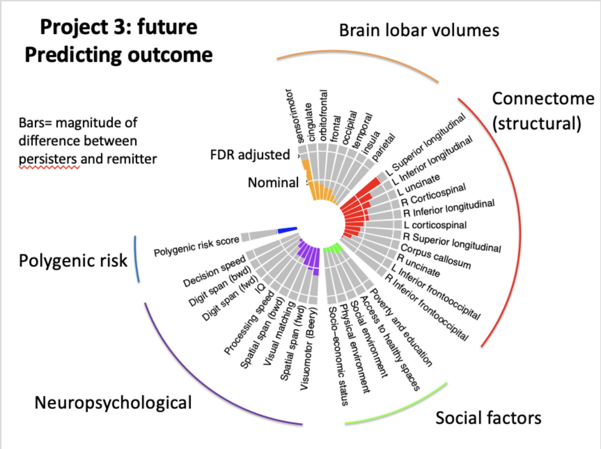

# 2020-01-28 10:50:26

I'll follow the same idea as before (068). But now I have an idea of what works
best for PRS in tems of thresholding, so I'll keep those. But the approach is to
start with an ANOVA mixed model, and then calculate where the differences are.
Then, see where the linear model works best.

First we'll need to grab the DTI data:

```r
setwd('~/data/baseline_prediction/prs_start/')
clin_long = read.csv('long_clin_01062020_lt16.csv')
clin_long$SX_total = clin_long$SX_inatt + clin_long$SX_hi

winsorize = function(x, cut = 0.01){
  cut_point_top <- quantile(x, 1 - cut, na.rm = T)
  cut_point_bottom <- quantile(x, cut, na.rm = T)
  i = which(x >= cut_point_top) 
  x[i] = cut_point_top
  j = which(x <= cut_point_bottom) 
  x[j] = cut_point_bottom
  return(x)
}

df = data.frame(MRN=unique(clin_long$MRN))
for (r in 1:nrow(df)) {
    subj_data = clin_long[clin_long$MRN==df$MRN[r], ]
    for (sx in c('inatt', 'hi', 'total')) {
        fit = lm(as.formula(sprintf('SX_%s ~ age', sx)), data=subj_data)
        df[r, sprintf('slope_%s', sx)] = fit$coefficients['age']
        base_row = which.min(subj_data$age)
        df[r, sprintf('base_%s', sx)] = subj_data[base_row, sprintf('SX_%s', sx)]
        last_row = which.max(subj_data$age)
        df[r, sprintf('last_%s', sx)] = subj_data[last_row, sprintf('SX_%s', sx)]
        df[r, 'base_age'] = subj_data[base_row, 'age']
        df[r, 'last_age'] = subj_data[last_row, 'age']
        df[r, 'sex'] = subj_data[last_row, 'sex']
    }
}
for (min_sx in c(0, 3, 4, 6)) {
    idx = df$base_inatt>=min_sx | df$base_hi>=min_sx
    for (sx in c('inatt', 'hi', 'total')) {
        df[, sprintf('slope_%s_GE%d_wp05', sx, min_sx)] = NA
        junk = winsorize(df[idx, sprintf('slope_%s', sx)], cut=.05)
        df[idx, sprintf('slope_%s_GE%d_wp05', sx, min_sx)] = junk
    }
}

b = read.csv('/Volumes/Shaw/MasterQC/master_qc_20190314.csv')
a = read.csv('~/data/heritability_change/ready_1020.csv')
# m has all 1020 processed scans
m = merge(a, b, by.y='Mask.ID', by.x='Mask.ID...Scan', all.x=F)

# dti_meta has all scans for everyone who has PRS data (954 scans)
dti_meta = merge(m, df, by.x="Medical.Record...MRN...Subjects", by.y='MRN',
          all.x=F, all.y=F)

# restrict based on QC
qc_vars = c("meanX.trans", "meanY.trans", "meanZ.trans",
            "meanX.rot", "meanY.rot", "meanZ.rot",
            "goodVolumes")
dti_meta = dti_meta[dti_meta$"age_at_scan...Scan...Subjects" < 18, ]
dti_meta = dti_meta[dti_meta$"goodVolumes" <= 61, ]
dti_meta = dti_meta[dti_meta$"numVolumes" < 80, ]

# down to 928 scans that obey criteria and have PRS
library(solitude)
iso <- isolationForest$new()
iso$fit(dti_meta[, qc_vars])
scores_if = as.matrix(iso$scores)[,3]
library(dbscan)
# here I set the number of neighbors to a percentage of the total data
scores_lof = lof(dti_meta[, qc_vars], k = round(.5 * nrow(dti_meta)))

qtile=.95
thresh_lof = quantile(scores_lof, qtile)
thresh_if = quantile(scores_if, qtile)
idx = scores_lof < thresh_lof & scores_if < thresh_if

tracts = read.csv('~/data/heritability_change/jhu_tracts_1020.csv')
# somehow I have two entries for 1418?
x = duplicated(tracts$id)
jhu_data = merge(dti_meta[idx,], tracts[!x, ], by.x='Mask.ID...Scan', by.y='id')
tract_names = c(colnames(tracts)[grepl(colnames(tracts), pattern="^ad")],
                colnames(tracts)[grepl(colnames(tracts), pattern="^rd")])

iso <- isolationForest$new()
iso$fit(jhu_data[, tract_names])
scores_if = as.matrix(iso$scores)[,3]
scores_lof = lof(jhu_data[, tract_names], k = round(.5 * nrow(jhu_data)))

thresh_lof = quantile(scores_lof, qtile)
thresh_if = quantile(scores_if, qtile)
idx = scores_lof < thresh_lof & scores_if < thresh_if

clean_jhu_data = jhu_data[idx, ]

# down to 800 scans when only scans at .95 in both criteria are used

# selecting earliest scan for each subject, regardless of score, as we're assu ing every scan now is good
keep_me = c()
for (s in unique(clean_jhu_data$Medical.Record...MRN...Subjects)) {
    subj_rows = which(clean_jhu_data$Medical.Record...MRN...Subjects == s)
    subj_data = clean_jhu_data[subj_rows, ]
    min_subj_row = which.min(subj_data$age_at_scan...Scan...Subjects)
    keep_me = c(keep_me, subj_rows[min_subj_row])
}
data_dti = clean_jhu_data[keep_me, ]
# finished with 277 scans when using baseline for each subject
demo = read.csv('prs_demo.csv')
# just to get FAMID
data_dti = merge(data_dti, demo, by.x='Medical.Record...MRN...Subjects',
                 by.y='MRN')
```

Before we add FA or MO, which will need some extra work and will also change the
scans we're using, let's run our usual models, with the thresholds we got from
PRS:

```r
library(nlme)
library(car)

hold = c()
tract_names = c(colnames(tracts)[grepl(colnames(tracts), pattern="^ad")],
                colnames(tracts)[grepl(colnames(tracts), pattern="^rd")])
qc_vars = c("meanX.trans", "meanY.trans", "meanZ.trans",
            "meanX.rot", "meanY.rot", "meanZ.rot",
            "goodVolumes")
covars = c(qc_vars, 'age_at_scan...Scan...Subjects')
out_fname = '~/data/baseline_prediction/prs_start/univar_JHUtractsADRD_all_PCsAgeSex_lme.csv'
for (sx in c('inatt', 'hi', 'total')) {
    min_sx = 6
    if (sx == 'inatt') {
        thresh = 0
    } else if (sx == 'hi') {
        thresh = -.5
    } else {
        thresholds = -1
    }
    phen_slope = sprintf('slope_%s_GE%d_wp05', sx, min_sx)
    phen = sprintf('thresh%.2f_%s_GE%d_wp05', abs(thresh), sx, min_sx)
    data_dti[, phen] = 'notGE6adhd'
    my_nvs = which(is.na(data_dti[, phen_slope]))
    idx = data_dti[my_nvs, 'base_inatt'] <= 2 & data_dti[my_nvs, 'base_hi'] <= 2
    data_dti[my_nvs[idx], phen] = 'nv012'
    data_dti[which(data_dti[, phen_slope] < thresh), phen] = 'imp'
    data_dti[which(data_dti[, phen_slope] >= thresh), phen] = 'nonimp'
    data_dti[, phen] = factor(data_dti[, phen], ordered=F)
    data_dti[, phen] = relevel(data_dti[, phen], ref='nv012')
    use_me = T#data_dti$isWNH

    this_data = data_dti[use_me, c(phen, 'FAMID', tract_names, covars)]
    this_data[, 3:ncol(this_data)] = scale(this_data[, 3:ncol(this_data)])
    this_data$sex = data_dti[use_me, 'sex.x']
    tmp_covars = c(covars, 'sex')
    phen_res = c()
    for (tract in tract_names) {
        fm_str = paste(tract, " ~ ", phen, " +",
                           paste(tmp_covars, collapse='+'),
                           sep="")
        fit = lme(as.formula(fm_str), ~1|FAMID, data=this_data)
        p = Anova(fit)
        temp = c(p[1,3], summary(fit)$logLik, summary(fit)$AIC,
                 summary(fit)$BIC)
        phen_res = rbind(phen_res, temp)
        rownames(phen_res)[nrow(phen_res)] = fm_str
    }
    phen_res = data.frame(phen_res)
    phen_res$formula = rownames(phen_res)
    phen_res$predictor = tract_names
    phen_res$outcome = phen
    hold = rbind(hold, phen_res)
}
colnames(hold)[1:4] = c('pval', 'logLik', 'AIC', 'BIC')
write.csv(hold, file=out_fname, row.names=F)
```


We do have some results, mostly hi. Maybe it'd survive some sort of comparison
correction... let's plot the results to see where the group differences lie:

```r
library(multcomp)
library(ggplot2)

sx = 'hi'
min_sx = 6
thresh = -.5
use_me = T
my_tracts = c('ad_10', 'ad_7', 'rd_18', 'ad_16', 'rd_10',
              'rd_3', 'rd_16', 'ad_8', 'ad_6', 'rd_17', 'rd_11')
# my_tracts = c('ad_12', 'ad_10', 'ad_6')

phen_slope = sprintf('slope_%s_GE%d_wp05', sx, min_sx)
phen = sprintf('thresh%.2f_%s_GE%d_wp05', abs(thresh), sx, min_sx)
data_dti[, phen] = 'notGE6adhd'
my_nvs = which(is.na(data_dti[, phen_slope]))
idx = data_dti[my_nvs, 'base_inatt'] <= 2 & data_dti[my_nvs, 'base_hi'] <= 2
data_dti[my_nvs[idx], phen] = 'nv012'
data_dti[which(data_dti[, phen_slope] < thresh), phen] = 'imp'
data_dti[which(data_dti[, phen_slope] >= thresh), phen] = 'nonimp'
data_dti[, phen] = factor(data_dti[, phen], ordered=F)
data_dti[, phen] = relevel(data_dti[, phen], ref='nv012')
use_me = T

this_data = data_dti[use_me, c(phen, 'FAMID', tract_names, covars)]
this_data[, 3:ncol(this_data)] = scale(this_data[, 3:ncol(this_data)])
this_data$sex = data_dti[use_me, 'sex.x']
tmp_covars = c(covars, 'sex')
for (tract in my_tracts) {
    fm_str = paste(tract, " ~ ", phen, " +",
                        paste(tmp_covars, collapse='+'),
                        sep="")
    fit = lme(as.formula(fm_str), ~1|FAMID, data=this_data)
    p = Anova(fit)
    posthoc = glht(fit, linfct=mcp(thresh0.00_inatt_GE6_wp05 = "Tukey"))
    # posthoc = glht(fit, linfct=mcp(thresh0.50_hi_GE6_wp05 = "Tukey"))
    sig_idx = summary(posthoc)$test$pvalues < .05
    print(sprintf('%s, %s', phen, tract))
    print(names(coef(posthoc))[sig_idx])
}
```

This is what I get:

```
[1] "thresh0.50_hi_GE6_wp05, ad_10"
[1] "imp - nv012"
[1] "thresh0.50_hi_GE6_wp05, ad_7"
[1] "imp - nv012"  "nonimp - imp"
[1] "thresh0.50_hi_GE6_wp05, rd_18"
[1] "nonimp - nv012"      "nonimp - imp"        "notGE6adhd - nonimp"
[1] "thresh0.50_hi_GE6_wp05, ad_16"
character(0)
[1] "thresh0.50_hi_GE6_wp05, rd_10"
[1] "imp - nv012"  "nonimp - imp"
[1] "thresh0.50_hi_GE6_wp05, rd_3"
[1] "nonimp - nv012"
[1] "thresh0.50_hi_GE6_wp05, rd_16"
character(0)
[1] "thresh0.50_hi_GE6_wp05, ad_8"
[1] "imp - nv012"
[1] "thresh0.50_hi_GE6_wp05, ad_6"
[1] "notGE6adhd - nv012"
[1] "thresh0.50_hi_GE6_wp05, rd_17"
[1] "nonimp - imp"
[1] "thresh0.50_hi_GE6_wp05, rd_11"
[1] "nonimp - nv012"

[1] "thresh0.00_inatt_GE6_wp05, ad_12"
[1] "notGE6adhd - imp"
[1] "thresh0.00_inatt_GE6_wp05, ad_10"
[1] "nonimp - nv012"
[1] "thresh0.00_inatt_GE6_wp05, ad_6"
[1] "notGE6adhd - nv012"
```

Very few have the direction we'd expect. Maybe it's just easier to test for
linearity, like before:

```r
hold = c()
tract_names = c(colnames(tracts)[grepl(colnames(tracts), pattern="^ad")],
                colnames(tracts)[grepl(colnames(tracts), pattern="^rd")])
qc_vars = c("meanX.trans", "meanY.trans", "meanZ.trans",
            "meanX.rot", "meanY.rot", "meanZ.rot",
            "goodVolumes")
covars = c(qc_vars, 'age_at_scan...Scan...Subjects')
out_fname = '~/data/baseline_prediction/prs_start/univar_JHUtractsADRD_all_PCsAgeSex_4groupOrdered_lme.csv'
for (sx in c('inatt', 'hi', 'total')) {
    min_sx = 6
    if (sx == 'inatt') {
        thresh = 0
    } else if (sx == 'hi') {
        thresh = -.5
    } else {
        thresholds = -1
    }
    phen_slope = sprintf('slope_%s_GE%d_wp05', sx, min_sx)
    phen = sprintf('thresh%.2f_%s_GE%d_wp05', abs(thresh), sx, min_sx)
    data_dti[, phen] = 'notGE6adhd'
    my_nvs = which(is.na(data_dti[, phen_slope]))
    idx = data_dti[my_nvs, 'base_inatt'] <= 2 & data_dti[my_nvs, 'base_hi'] <= 2
    data_dti[my_nvs[idx], phen] = 'nv012'
    data_dti[which(data_dti[, phen_slope] < thresh), phen] = 'imp'
    data_dti[which(data_dti[, phen_slope] >= thresh), phen] = 'nonimp'
    data_dti[, phen] = factor(data_dti[, phen], ordered=F)
    data_dti[, phen] = relevel(data_dti[, phen], ref='nv012')
    use_me = T#data_dti$isWNH

    this_data = data_dti[use_me, c(phen, 'FAMID', tract_names, covars)]
    this_data[, 3:ncol(this_data)] = scale(this_data[, 3:ncol(this_data)])
    this_data$sex = data_dti[use_me, 'sex.x']
    tmp_covars = c(covars, 'sex')
    this_data$ordered = factor(this_data[, phen],
                           levels=c('nv012', 'notGE6adhd', 'imp', 'nonimp'),
                           ordered=T)
    phen_res = c()
    for (tract in tract_names) {
        fm_str = paste(tract, " ~ ordered +",
                           paste(tmp_covars, collapse='+'),
                           sep="")
        fit = lme(as.formula(fm_str), ~1|FAMID, data=this_data)
        temp = c(summary(fit)$tTable['ordered.L', ],
                     summary(fit)$logLik, summary(fit)$AIC, summary(fit)$BIC)
        phen_res = rbind(phen_res, temp)
        rownames(phen_res)[nrow(phen_res)] = fm_str
    }
    phen_res = data.frame(phen_res)
    phen_res$formula = rownames(phen_res)
    phen_res$predictor = tract_names
    phen_res$outcome = phen
    hold = rbind(hold, phen_res)
}
colnames(hold)[6:8] = c('logLik', 'AIC', 'BIC')
write.csv(hold, file=out_fname, row.names=F)
```


We get the usual suspects, such as 18 and 19, which are uncinate-R and SLF-L,
respectively. For reference, _3 is CST-L and _11 is IFO-L.

Does it work the other way around as well, as we predict those classes using the
tracts?

```r
library(ordinal)
hold = c()
tract_names = c(colnames(tracts)[grepl(colnames(tracts), pattern="^ad")],
                colnames(tracts)[grepl(colnames(tracts), pattern="^rd")])
qc_vars = c("meanX.trans", "meanY.trans", "meanZ.trans",
            "meanX.rot", "meanY.rot", "meanZ.rot",
            "goodVolumes")
covars = c(qc_vars, 'age_at_scan...Scan...Subjects')
out_fname = '~/data/baseline_prediction/prs_start/univar_JHUtractsADRD_all_PCsAgeSex_4groupOrdered_clmm2.csv'
for (sx in c('inatt', 'hi', 'total')) {
    min_sx = 6
    if (sx == 'inatt') {
        thresh = 0
    } else if (sx == 'hi') {
        thresh = -.5
    } else {
        thresholds = -1
    }
    phen_slope = sprintf('slope_%s_GE%d_wp05', sx, min_sx)
    phen = sprintf('thresh%.2f_%s_GE%d_wp05', abs(thresh), sx, min_sx)
    data_dti[, phen] = 'notGE6adhd'
    my_nvs = which(is.na(data_dti[, phen_slope]))
    idx = data_dti[my_nvs, 'base_inatt'] <= 2 & data_dti[my_nvs, 'base_hi'] <= 2
    data_dti[my_nvs[idx], phen] = 'nv012'
    data_dti[which(data_dti[, phen_slope] < thresh), phen] = 'imp'
    data_dti[which(data_dti[, phen_slope] >= thresh), phen] = 'nonimp'
    data_dti[, phen] = factor(data_dti[, phen], ordered=F)
    data_dti[, phen] = relevel(data_dti[, phen], ref='nv012')
    use_me = T#data_dti$isWNH

    this_data = data_dti[use_me, c(phen, 'FAMID', tract_names, covars)]
    this_data[, 3:ncol(this_data)] = scale(this_data[, 3:ncol(this_data)])
    this_data$sex = data_dti[use_me, 'sex.x']
    tmp_covars = c(covars, 'sex')
    this_data$ordered = factor(this_data[, phen],
                           levels=c('nv012', 'notGE6adhd', 'imp', 'nonimp'),
                           ordered=T)
    this_data$FAMID = factor(this_data$FAMID)
    phen_res = c()
    for (tract in tract_names) {
        fm_str = paste("ordered ~", tract, '+',
                        paste(tmp_covars, collapse='+'),
                        sep="")
        fit = clmm2(as.formula(fm_str), random=FAMID, data=this_data, Hess=T)
        temp = c(summary(fit)$coefficients[tract, 'Pr(>|z|)'],
                    summary(fit)$logLik, summary(fit)$condHess)
        phen_res = rbind(phen_res, temp)
        rownames(phen_res)[nrow(phen_res)] = fm_str
    }
    phen_res = data.frame(phen_res)
    phen_res$formula = rownames(phen_res)
    phen_res$predictor = tract_names
    phen_res$outcome = phen
    hold = rbind(hold, phen_res)
}
colnames(hold)[1:3] = c('pval', 'loglik', 'hessian')
write.csv(hold, file=out_fname, row.names=F)
```


Yes, we get some similar hits, which is nice. Now, I wonder if I'd get better
results if I did just the multinomial logistic regression, without fixing the
group order?

My difficulty here is that we could potentially have linear, quadratic or even
cubic relationships, depending on the brain region. We could come up with
stories for any of the relationships. Let's see if some regions are captured
better than others:

```r
hold = c()
tract_names = c(colnames(tracts)[grepl(colnames(tracts), pattern="^ad")],
                colnames(tracts)[grepl(colnames(tracts), pattern="^rd")])
qc_vars = c("meanX.trans", "meanY.trans", "meanZ.trans",
            "meanX.rot", "meanY.rot", "meanZ.rot",
            "goodVolumes")
covars = c(qc_vars, 'age_at_scan...Scan...Subjects')
out_fname = '~/data/baseline_prediction/prs_start/univar_JHUtractsADRD_all_PCsAgeSex_4groupOrdered_lme_allFits.csv'
for (sx in c('inatt', 'hi', 'total')) {
    min_sx = 6
    if (sx == 'inatt') {
        thresh = 0
    } else if (sx == 'hi') {
        thresh = -.5
    } else {
        thresholds = -1
    }
    phen_slope = sprintf('slope_%s_GE%d_wp05', sx, min_sx)
    phen = sprintf('thresh%.2f_%s_GE%d_wp05', abs(thresh), sx, min_sx)
    data_dti[, phen] = 'notGE6adhd'
    my_nvs = which(is.na(data_dti[, phen_slope]))
    idx = data_dti[my_nvs, 'base_inatt'] <= 2 & data_dti[my_nvs, 'base_hi'] <= 2
    data_dti[my_nvs[idx], phen] = 'nv012'
    data_dti[which(data_dti[, phen_slope] < thresh), phen] = 'imp'
    data_dti[which(data_dti[, phen_slope] >= thresh), phen] = 'nonimp'
    data_dti[, phen] = factor(data_dti[, phen], ordered=F)
    data_dti[, phen] = relevel(data_dti[, phen], ref='nv012')
    use_me = T#data_dti$isWNH

    this_data = data_dti[use_me, c(phen, 'FAMID', tract_names, covars)]
    this_data[, 3:ncol(this_data)] = scale(this_data[, 3:ncol(this_data)])
    this_data$sex = data_dti[use_me, 'sex.x']
    tmp_covars = c(covars, 'sex')
    this_data$ordered = factor(this_data[, phen],
                           levels=c('nv012', 'notGE6adhd', 'imp', 'nonimp'),
                           ordered=T)
    phen_res = c()
    for (tract in tract_names) {
        fm_str = paste(tract, " ~ ordered +",
                           paste(tmp_covars, collapse='+'),
                           sep="")
        fit = lme(as.formula(fm_str), ~1|FAMID, data=this_data)
        temp = c(summary(fit)$tTable['ordered.L', ],
                     summary(fit)$logLik, summary(fit)$AIC, summary(fit)$BIC,
                     tract, 'linear')
        phen_res = rbind(phen_res, temp)
        rownames(phen_res)[nrow(phen_res)] = fm_str
        temp = c(summary(fit)$tTable['ordered.Q', ],
                     summary(fit)$logLik, summary(fit)$AIC, summary(fit)$BIC,
                     tract, 'quadratic')
        phen_res = rbind(phen_res, temp)
        rownames(phen_res)[nrow(phen_res)] = fm_str
        temp = c(summary(fit)$tTable['ordered.C', ],
                     summary(fit)$logLik, summary(fit)$AIC, summary(fit)$BIC,
                     tract, 'cubic')
        phen_res = rbind(phen_res, temp)
        rownames(phen_res)[nrow(phen_res)] = fm_str
    }
    phen_res = data.frame(phen_res)
    phen_res$formula = rownames(phen_res)
    phen_res$outcome = phen
    hold = rbind(hold, phen_res)
}
colnames(hold)[6:10] = c('logLik', 'AIC', 'BIC', 'tract', 'modtype')
write.csv(hold, file=out_fname, row.names=F)
```

We actually get more fits for quadratic and cubic... we will eventually get into
an issue of multiple comparisons here. 

Here's another idea. Philip's daisywheel had an inspiring title:



So, why not first filter our variables on how well they predict outcome of ADHD
(simple, not multinomial) logistic regression, and then run other models to
include the NVs, just to see where the NVs are placed in those interesting
regions?

If this approach works, I'll reproduce it for PRS...

```r
hold = c()
tract_names = c(colnames(tracts)[grepl(colnames(tracts), pattern="^ad")],
                colnames(tracts)[grepl(colnames(tracts), pattern="^rd")])
qc_vars = c("norm.trans", "norm.rot", "goodVolumes")
covars = c(qc_vars, 'age_at_scan...Scan...Subjects')
out_fname = '~/data/baseline_prediction/prs_start/univar_JHUtractsADRD_all_GE6_norm_outcomeOnly.csv'
for (sx in c('inatt', 'hi')) {
    min_sx = 6
    if (sx == 'inatt') {
        thresh = 0
    } else if (sx == 'hi') {
        thresh = -.5
    } else {
        thresh = -.48
    }
    phen_slope = sprintf('slope_%s_GE%d_wp05', sx, min_sx)
    phen = sprintf('thresh%.2f_%s_GE%d_wp05', abs(thresh), sx, min_sx)
    data_dti[, phen] = NA
    data_dti[which(data_dti[, phen_slope] < thresh), phen] = 'imp'
    data_dti[which(data_dti[, phen_slope] >= thresh), phen] = 'nonimp'
    data_dti[, phen] = factor(data_dti[, phen], ordered=F)
    data_dti[, phen] = relevel(data_dti[, phen], ref='imp')
    use_me = !is.na(data_dti[, phen]) #data_dti$isWNH

    this_data = data_dti[use_me, c(phen, 'FAMID', tract_names, covars)]
    this_data[, 3:ncol(this_data)] = scale(this_data[, 3:ncol(this_data)])
    this_data$sex = data_dti[use_me, 'sex.x']
    tmp_covars = c(covars, 'sex')
    phen_res = c()
    for (tract in tract_names) {
        fm_str = paste(phen, " ~ ", tract, ' + ',
                           paste(tmp_covars, collapse='+'), ' + (1|FAMID)',
                           sep="")
        fit = glmer(as.formula(fm_str), data=this_data,
                    family=binomial(link='logit'))
        if (isSingular(fit)) {
            temp = c(summary(fit)$coefficients[tract, ], summary(fit)$AIC[1:3])
        } else {
            temp = rep(NA, 7)
        }
        phen_res = rbind(phen_res, temp)
        rownames(phen_res)[nrow(phen_res)] = fm_str
    }
    phen_res = data.frame(phen_res)
    phen_res$formula = rownames(phen_res)
    phen_res$predictor = tract_names
    phen_res$outcome = phen
    colnames(phen_res) =  c("Estimate", "Std..Error", "z.value", "Pr...z..",
                            "AIC", "BIC", "logLik", "formula", "predictor",
                            "outcome")
    hold = rbind(hold, phen_res)
}
write.csv(hold, file=out_fname, row.names=F)
```

The models are not converging... but that's because we're leaving a whole bunch
of data on the floor by removing NVs. Using the norms for covariates didn't help
much either. I'm going to try to just use the best kid in each family to make
the models converge. If they do, we could potentially use the left out kids for
validation? Only 19 out of the 133 scans we're using (ADHD only) will be thrown
away... maybe this will work.

# 2020-01-29 09:51:45

So, let's select the best in family, and see if a regular logistic model is
still singular:

```r
data_dti$bestInFamily = F
nvisits = table(clin_long$MRN)
data_dti = merge(data_dti, as.matrix(nvisits),
                 by.x='Medical.Record...MRN...Subjects', by.y=0)
colnames(data_dti)[ncol(data_dti)] = 'nvisits'
for (f in unique(data_dti$FAMID)) {
    fam_rows = which(data_dti$FAMID == f)
    fam_data = data_dti[fam_rows,]
    if (nrow(fam_data) == 1) {
        data_dti[fam_rows,]$bestInFamily = T
    } else {
        stotal = sort(fam_data$slope_total, index.return=T, decreasing=T)
        # if there's a tie
        if (stotal$x[1] == stotal$x[2]) {
            # print(sprintf('Tie in slope for %d', f))
            svisits = sort(fam_data$nvisits, index.return=T, decreasing=T)
            if (svisits$x[1] == svisits$x[2]) {
                print(sprintf('Tie in number of visits for %d', f))
                print(fam_data[fam_data$nvisits==svisits$x[1], ]$Medical.Record...MRN...Subjects)
            } else {
                data_dti[fam_rows[svisits$ix[1]], ]$bestInFamily = T
            }
        } else {
            data_dti[fam_rows[stotal$ix[1]], ]$bestInFamily = T
        }
    }
}

data_dti[data_dti$Medical.Record...MRN...Subjects==4585574, ]$bestInFamily = T
data_dti[data_dti$Medical.Record...MRN...Subjects==4925051, ]$bestInFamily = T
data_dti[data_dti$Medical.Record...MRN...Subjects==7079035, ]$bestInFamily = T
# chosen because of overall best MPRAGE QC
data_dti[data_dti$Medical.Record...MRN...Subjects==4640378, ]$bestInFamily = T
# chosen because of overall best MPRAGE QC
data_dti[data_dti$Medical.Record...MRN...Subjects==7218965, ]$bestInFamily = T
```

OK, now we actually have 192 subjects, including NVs. Let's try the non-mixed model:

```r
hold = c()
tract_names = c(colnames(tracts)[grepl(colnames(tracts), pattern="^ad")],
                colnames(tracts)[grepl(colnames(tracts), pattern="^rd")])
qc_vars = c("norm.trans", "norm.rot", "goodVolumes")
covars = c(qc_vars, 'age_at_scan...Scan...Subjects')
out_fname = '~/data/baseline_prediction/prs_start/univar_JHUtractsADRD_all_GE6_norm_bestInFamily_outcomeOnly.csv'
for (sx in c('inatt', 'hi')) {
    min_sx = 6
    if (sx == 'inatt') {
        thresh = 0
    } else if (sx == 'hi') {
        thresh = -.5
    } else {
        thresh = -.48
    }
    phen_slope = sprintf('slope_%s_GE%d_wp05', sx, min_sx)
    phen = sprintf('thresh%.2f_%s_GE%d_wp05', abs(thresh), sx, min_sx)
    data_dti[, phen] = NA
    data_dti[which(data_dti[, phen_slope] < thresh), phen] = 'imp'
    data_dti[which(data_dti[, phen_slope] >= thresh), phen] = 'nonimp'
    data_dti[, phen] = factor(data_dti[, phen], ordered=F)
    data_dti[, phen] = relevel(data_dti[, phen], ref='imp')
    use_me = !is.na(data_dti[, phen]) & data_dti$bestInFamily #data_dti$isWNH

    this_data = data_dti[use_me, c(phen, 'FAMID', tract_names, covars)]
    this_data[, 3:ncol(this_data)] = scale(this_data[, 3:ncol(this_data)])
    this_data$sex = data_dti[use_me, 'sex.x']
    tmp_covars = c(covars, 'sex')
    phen_res = c()
    for (tract in tract_names) {
        fm_str = paste(phen, " ~ ", tract, ' + ',
                           paste(tmp_covars, collapse='+'),
                           sep="")
        fit = glm(as.formula(fm_str), data=this_data,
                          family=binomial(link='logit'))
        temp = c(summary(fit)$coefficients[tract, ], summary(fit)$aic,
                    summary(fit)$deviance)
        phen_res = rbind(phen_res, temp)
        rownames(phen_res)[nrow(phen_res)] = fm_str
    }
    phen_res = data.frame(phen_res)
    phen_res$formula = rownames(phen_res)
    phen_res$predictor = tract_names
    phen_res$outcome = phen
    hold = rbind(hold, phen_res)
}
colnames(hold)[5:6] = c('AIC', 'deviance')
write.csv(hold, file=out_fname, row.names=F)
```


Great, the models now converge. I'll check FA and MO, and then move on. We can
always see how the NVs place with respect to the good predictors later.

I want to make sure the model still works without the norm as covariates. After
re-running the code in a fresh R session, now we actually have 197 subjects,
including NVs. Not sure where 192 came from... Let's try the non-mixed model
again:

```r
hold = c()
tract_names = c(colnames(tracts)[grepl(colnames(tracts), pattern="^ad")],
                colnames(tracts)[grepl(colnames(tracts), pattern="^rd")])
covars = c(qc_vars, 'age_at_scan...Scan...Subjects')
out_fname = '~/data/baseline_prediction/prs_start/univar_JHUtractsADRD_all_GE6_bestInFamily_outcomeOnly.csv'
for (sx in c('inatt', 'hi')) {
    min_sx = 6
    if (sx == 'inatt') {
        thresh = 0
    } else if (sx == 'hi') {
        thresh = -.5
    } else {
        thresh = -.48
    }
    phen_slope = sprintf('slope_%s_GE%d_wp05', sx, min_sx)
    phen = sprintf('thresh%.2f_%s_GE%d_wp05', abs(thresh), sx, min_sx)
    data_dti[, phen] = NA
    data_dti[which(data_dti[, phen_slope] < thresh), phen] = 'imp'
    data_dti[which(data_dti[, phen_slope] >= thresh), phen] = 'nonimp'
    data_dti[, phen] = factor(data_dti[, phen], ordered=F)
    data_dti[, phen] = relevel(data_dti[, phen], ref='imp')
    use_me = !is.na(data_dti[, phen]) & data_dti$bestInFamily #data_dti$isWNH

    this_data = data_dti[use_me, c(phen, 'FAMID', tract_names, covars)]
    this_data[, 3:ncol(this_data)] = scale(this_data[, 3:ncol(this_data)])
    this_data$sex = data_dti[use_me, 'sex.x']
    tmp_covars = c(covars, 'sex')
    phen_res = c()
    for (tract in tract_names) {
        fm_str = paste(phen, " ~ ", tract, ' + ',
                           paste(tmp_covars, collapse='+'),
                           sep="")
        fit = glm(as.formula(fm_str), data=this_data,
                          family=binomial(link='logit'))
        temp = c(summary(fit)$coefficients[tract, ], summary(fit)$aic,
                    summary(fit)$deviance)
        phen_res = rbind(phen_res, temp)
        rownames(phen_res)[nrow(phen_res)] = fm_str
    }
    phen_res = data.frame(phen_res)
    phen_res$formula = rownames(phen_res)
    phen_res$predictor = tract_names
    phen_res$outcome = phen
    hold = rbind(hold, phen_res)
}
colnames(hold)[5:6] = c('AIC', 'deviance')
write.csv(hold, file=out_fname, row.names=F)
```


Yeah, results change a bit, but it makes sense. At least our strongest stuff,
for HI, is still there. Maybe I should do stepAIC and just keep the best
covariates? 

```r
library(MASS)

hold = c()
tract_names = c(colnames(tracts)[grepl(colnames(tracts), pattern="^ad")],
                colnames(tracts)[grepl(colnames(tracts), pattern="^rd")])
covars = c(qc_vars, 'age_at_scan...Scan...Subjects')
out_fname = '~/data/baseline_prediction/prs_start/univar_JHUtractsADRD_all_GE6_bestInFamily_outcomeOnly_stepAIC.csv'
for (sx in c('inatt', 'hi')) {
    min_sx = 6
    if (sx == 'inatt') {
        thresh = 0
    } else if (sx == 'hi') {
        thresh = -.5
    } else {
        thresh = -.48
    }
    phen_slope = sprintf('slope_%s_GE%d_wp05', sx, min_sx)
    phen = sprintf('thresh%.2f_%s_GE%d_wp05', abs(thresh), sx, min_sx)
    data_dti[, phen] = NA
    data_dti[which(data_dti[, phen_slope] < thresh), phen] = 'imp'
    data_dti[which(data_dti[, phen_slope] >= thresh), phen] = 'nonimp'
    data_dti[, phen] = factor(data_dti[, phen], ordered=F)
    data_dti[, phen] = relevel(data_dti[, phen], ref='imp')
    use_me = !is.na(data_dti[, phen]) & data_dti$bestInFamily #data_dti$isWNH

    this_data = data_dti[use_me, c(phen, 'FAMID', tract_names, covars)]
    this_data[, 3:ncol(this_data)] = scale(this_data[, 3:ncol(this_data)])
    this_data$sex = data_dti[use_me, 'sex.x']
    tmp_covars = c(covars, 'sex')
    phen_res = c()
    for (tract in tract_names) {
        fm_str = paste(phen, " ~ ", tract, ' + ',
                           paste(tmp_covars, collapse='+'),
                           sep="")
        fit = glm(as.formula(fm_str), data=this_data,
                          family=binomial(link='logit'))
        step=stepAIC(fit, direction='both', trace=F,
                     scope = list(lower = as.formula(sprintf('~ %s', tract))))
        temp = c(summary(step)$coefficients[tract, ], summary(step)$aic,
                 summary(step)$deviance)
        phen_res = rbind(phen_res, temp)
        rownames(phen_res)[nrow(phen_res)] = fm_str
    }
    phen_res = data.frame(phen_res)
    phen_res$formula = rownames(phen_res)
    phen_res$predictor = tract_names
    phen_res$outcome = phen
    hold = rbind(hold, phen_res)
}
colnames(hold)[5:6] = c('AIC', 'deviance')
write.csv(hold, file=out_fname, row.names=F)
```


Not much for inatt, but plenty for HI. This actually seems to be working better.

I'll do the same below for FA.

## Calculating mode

I'll need to go back to the raw data to calculate mode, because I'll need it in
voxel space:

```bash
3dcalc -a 0754_tensor_diffeo_lambda1.nii.gz \
    -b 0754_tensor_diffeo_lambda2.nii.gz \
    -c 0754_tensor_diffeo_lambda3.nii.gz \
    -prefix output_MO.nii.gz \
    -expr "((-a-b+2*c)*(2*a-b-c)*(-a+2*b-c))/2*(a^2+b^2+c^2-a*b-b*c-c*a)^(3/2)"
```

Now I need to run it for a few IDs and check if labmda 1 corresponds to AD, and
mean(lambda2, lambda3) do RD.

```bash
# bw
mydir=~/data/baseline_prediction/
DTITK_ROOT=/data/NCR_SBRB/software/dti-tk/dtitk-2.3.1-Linux-x86_64/bin/
weighted_tracts=jhu_tracts_mode.csv;
cd $mydir
row="id";
for t in `seq 1 20`; do
    # for m in ad rd myad myrd mode; do
    for m in mode; do
        row=${row}','${m}_${t};
    done
done
echo $row > $weighted_tracts;
for m in `cat ids1020.txt`; do
    echo ${m}
    ${DTITK_ROOT}/TVtool -in nii/${m}_tensor_diffeo.nii.gz -eigs >/dev/null 2>&1;
    ${DTITK_ROOT}/TVtool -in nii/${m}_tensor_diffeo.nii.gz -fa \
        -out nii/${m}_fa.nii >/dev/null 2>&1;
    # ${DTITK_ROOT}/TVtool -in nii/${m}_tensor_diffeo.nii.gz -rd \
        # -out nii/${m}_rd.nii >/dev/null 2>&1;
    3dresample -master nii/${m}_fa.nii -prefix ./rois.nii \
                -inset ../JHU_ICBM_tractsThr25_inAging.nii.gz \
                -rmode NN -overwrite 2>/dev/null &&
    row="${m}";
    for t in `seq 1 20`; do
        3dcalc -a rois.nii -expr "amongst(a, $t)" -prefix mask.nii \
            -overwrite 2>/dev/null &&
        # ad=`3dmaskave -q -mask mask.nii nii/${m}_ad.nii 2>/dev/null`;
        # rd=`3dmaskave -q -mask mask.nii nii/${m}_rd.nii 2>/dev/null`;
        # myad=`3dmaskave -q -mask mask.nii nii/${m}_tensor_diffeo_lambda1.nii.gz 2>/dev/null`;
        # 3dcalc -a nii/${m}_tensor_diffeo_lambda2.nii.gz \
        #     -b nii/${m}_tensor_diffeo_lambda3.nii.gz -overwrite \
        #     -prefix nii/myrd.nii.gz -expr "(a+b)/2"
        # myrd=`3dmaskave -q -mask mask.nii nii/myrd.nii.gz 2>/dev/null`;
        3dcalc -a nii/${m}_tensor_diffeo_lambda1.nii.gz \
            -b nii/${m}_tensor_diffeo_lambda2.nii.gz \
            -c nii/${m}_tensor_diffeo_lambda3.nii.gz \
            -overwrite -prefix nii/MO.nii.gz \
            -expr "((-a-b+2*c)*(2*a-b-c)*(-a+2*b-c))/2*(a^2+b^2+c^2-a*b-b*c-c*a)^(3/2)"
        mo=`3dmaskave -q -mask mask.nii nii/MO.nii.gz 2>/dev/null`;
        # row=${row}','${ad}','${rd}','${myad}','${myrd}','${mo};
        row=${row}','${mo};
    done
    echo $row >> $weighted_tracts;
done
```

AD and RD do match the combinations of lambda I mentioned above. OK, so I'll
just produce MO then.

## FA results

While that's running, let's go ahead and run the code for FA:

```r
# restrict based on QC
qc_vars = c("meanX.trans", "meanY.trans", "meanZ.trans",
            "meanX.rot", "meanY.rot", "meanZ.rot",
            "goodVolumes")
dti_meta = dti_meta[dti_meta$"age_at_scan...Scan...Subjects" < 18, ]
dti_meta = dti_meta[dti_meta$"goodVolumes" <= 61, ]
dti_meta = dti_meta[dti_meta$"numVolumes" < 80, ]

# down to 928 scans that obey criteria and have PRS
library(solitude)
iso <- isolationForest$new()
iso$fit(dti_meta[, qc_vars])
scores_if = as.matrix(iso$scores)[,3]
library(dbscan)
# here I set the number of neighbors to a percentage of the total data
scores_lof = lof(dti_meta[, qc_vars], k = round(.5 * nrow(dti_meta)))

qtile=.95
thresh_lof = quantile(scores_lof, qtile)
thresh_if = quantile(scores_if, qtile)
idx = scores_lof < thresh_lof & scores_if < thresh_if

tracts = read.csv('~/data/heritability_change/jhu_tracts_1020.csv')
# somehow I have two entries for 1418?
x = duplicated(tracts$id)
jhu_data = merge(dti_meta[idx,], tracts[!x, ], by.x='Mask.ID...Scan', by.y='id')
tract_names = colnames(tracts)[grepl(colnames(tracts), pattern="^fa")]

iso <- isolationForest$new()
iso$fit(jhu_data[, tract_names])
scores_if = as.matrix(iso$scores)[,3]
scores_lof = lof(jhu_data[, tract_names], k = round(.5 * nrow(jhu_data)))

thresh_lof = quantile(scores_lof, qtile)
thresh_if = quantile(scores_if, qtile)
idx = scores_lof < thresh_lof & scores_if < thresh_if

clean_jhu_data = jhu_data[idx, ]

# down to 795 scans when only scans at .95 in both criteria are used

# selecting earliest scan for each subject, regardless of score, as we're assu ing every scan now is good
keep_me = c()
for (s in unique(clean_jhu_data$Medical.Record...MRN...Subjects)) {
    subj_rows = which(clean_jhu_data$Medical.Record...MRN...Subjects == s)
    subj_data = clean_jhu_data[subj_rows, ]
    min_subj_row = which.min(subj_data$age_at_scan...Scan...Subjects)
    keep_me = c(keep_me, subj_rows[min_subj_row])
}
data_dti = clean_jhu_data[keep_me, ]
# finished with 274 scans when using baseline for each subject
demo = read.csv('prs_demo.csv')
# just to get FAMID
data_dti = merge(data_dti, demo, by.x='Medical.Record...MRN...Subjects',
                 by.y='MRN')

# selecting best kid in family
data_dti$bestInFamily = F
nvisits = table(clin_long$MRN)
data_dti = merge(data_dti, as.matrix(nvisits),
                 by.x='Medical.Record...MRN...Subjects', by.y=0)
colnames(data_dti)[ncol(data_dti)] = 'nvisits'
for (f in unique(data_dti$FAMID)) {
    fam_rows = which(data_dti$FAMID == f)
    fam_data = data_dti[fam_rows,]
    if (nrow(fam_data) == 1) {
        data_dti[fam_rows,]$bestInFamily = T
    } else {
        stotal = sort(fam_data$slope_total, index.return=T, decreasing=T)
        # if there's a tie
        if (stotal$x[1] == stotal$x[2]) {
            # print(sprintf('Tie in slope for %d', f))
            svisits = sort(fam_data$nvisits, index.return=T, decreasing=T)
            if (svisits$x[1] == svisits$x[2]) {
                print(sprintf('Tie in number of visits for %d', f))
                print(fam_data[fam_data$nvisits==svisits$x[1], ]$Medical.Record...MRN...Subjects)
            } else {
                data_dti[fam_rows[svisits$ix[1]], ]$bestInFamily = T
            }
        } else {
            data_dti[fam_rows[stotal$ix[1]], ]$bestInFamily = T
        }
    }
}

data_dti[data_dti$Medical.Record...MRN...Subjects==4585574, ]$bestInFamily = T
data_dti[data_dti$Medical.Record...MRN...Subjects==4925051, ]$bestInFamily = T
data_dti[data_dti$Medical.Record...MRN...Subjects==7079035, ]$bestInFamily = T
# chosen because of overall best MPRAGE QC
data_dti[data_dti$Medical.Record...MRN...Subjects==4640378, ]$bestInFamily = T
# chosen because of overall best MPRAGE QC
data_dti[data_dti$Medical.Record...MRN...Subjects==7218965, ]$bestInFamily = T
```

OK, now we have 193 subjects after FA cleaning, including NVs. Let's try the non-mixed model:

```r
hold = c()
tract_names = colnames(tracts)[grepl(colnames(tracts), pattern="^fa")]
covars = c(qc_vars, 'age_at_scan...Scan...Subjects')
out_fname = '~/data/baseline_prediction/prs_start/univar_JHUtractsFA_all_GE6_bestInFamily_outcomeOnly.csv'
for (sx in c('inatt', 'hi')) {
    min_sx = 6
    if (sx == 'inatt') {
        thresh = 0
    } else if (sx == 'hi') {
        thresh = -.5
    } else {
        thresh = -.48
    }
    phen_slope = sprintf('slope_%s_GE%d_wp05', sx, min_sx)
    phen = sprintf('thresh%.2f_%s_GE%d_wp05', abs(thresh), sx, min_sx)
    data_dti[, phen] = NA
    data_dti[which(data_dti[, phen_slope] < thresh), phen] = 'imp'
    data_dti[which(data_dti[, phen_slope] >= thresh), phen] = 'nonimp'
    data_dti[, phen] = factor(data_dti[, phen], ordered=F)
    data_dti[, phen] = relevel(data_dti[, phen], ref='imp')
    use_me = !is.na(data_dti[, phen]) & data_dti$bestInFamily #data_dti$isWNH

    this_data = data_dti[use_me, c(phen, 'FAMID', tract_names, covars)]
    this_data[, 3:ncol(this_data)] = scale(this_data[, 3:ncol(this_data)])
    this_data$sex = data_dti[use_me, 'sex.x']
    tmp_covars = c(covars, 'sex')
    phen_res = c()
    for (tract in tract_names) {
        fm_str = paste(phen, " ~ ", tract, ' + ',
                           paste(tmp_covars, collapse='+'),
                           sep="")
        fit = glm(as.formula(fm_str), data=this_data,
                          family=binomial(link='logit'))
        temp = c(summary(fit)$coefficients[tract, ], summary(fit)$aic,
                    summary(fit)$deviance)
        phen_res = rbind(phen_res, temp)
        rownames(phen_res)[nrow(phen_res)] = fm_str
    }
    phen_res = data.frame(phen_res)
    phen_res$formula = rownames(phen_res)
    phen_res$predictor = tract_names
    phen_res$outcome = phen
    hold = rbind(hold, phen_res)
}
colnames(hold)[5:6] = c('AIC', 'deviance')
write.csv(hold, file=out_fname, row.names=F)
```

That was a bust. I only got FA_17 at 0.041, which was most likely driven by RD
based on our previous results.

```r
hold = c()
tract_names = colnames(tracts)[grepl(colnames(tracts), pattern="^fa")]
covars = c(qc_vars, 'age_at_scan...Scan...Subjects')
out_fname = '~/data/baseline_prediction/prs_start/univar_JHUtractsFA_all_GE6_bestInFamily_outcomeOnly_step.csv'
for (sx in c('inatt', 'hi')) {
    min_sx = 6
    if (sx == 'inatt') {
        thresh = 0
    } else if (sx == 'hi') {
        thresh = -.5
    } else {
        thresh = -.48
    }
    phen_slope = sprintf('slope_%s_GE%d_wp05', sx, min_sx)
    phen = sprintf('thresh%.2f_%s_GE%d_wp05', abs(thresh), sx, min_sx)
    data_dti[, phen] = NA
    data_dti[which(data_dti[, phen_slope] < thresh), phen] = 'imp'
    data_dti[which(data_dti[, phen_slope] >= thresh), phen] = 'nonimp'
    data_dti[, phen] = factor(data_dti[, phen], ordered=F)
    data_dti[, phen] = relevel(data_dti[, phen], ref='imp')
    use_me = !is.na(data_dti[, phen]) & data_dti$bestInFamily #data_dti$isWNH

    this_data = data_dti[use_me, c(phen, 'FAMID', tract_names, covars)]
    this_data[, 3:ncol(this_data)] = scale(this_data[, 3:ncol(this_data)])
    this_data$sex = data_dti[use_me, 'sex.x']
    tmp_covars = c(covars, 'sex')
    phen_res = c()
    for (tract in tract_names) {
        fm_str = paste(phen, " ~ ", tract, ' + ',
                           paste(tmp_covars, collapse='+'),
                           sep="")
        fit = glm(as.formula(fm_str), data=this_data,
                          family=binomial(link='logit'))
        step=stepAIC(fit, direction='both', trace=F,
                     scope = list(lower = as.formula(sprintf('~ %s', tract))))
        temp = c(summary(step)$coefficients[tract, ], summary(step)$aic,
                 summary(step)$deviance)
        phen_res = rbind(phen_res, temp)
        rownames(phen_res)[nrow(phen_res)] = fm_str
    }
    phen_res = data.frame(phen_res)
    phen_res$formula = rownames(phen_res)
    phen_res$predictor = tract_names
    phen_res$outcome = phen
    hold = rbind(hold, phen_res)
}
colnames(hold)[5:6] = c('AIC', 'deviance')
write.csv(hold, file=out_fname, row.names=F)
```

Not much change. FA_17 went down to .09 and FA_13 is now at 0.04. Need to do AD
and RD, unless mode proves itself useful.

## Mode results

```r
setwd('~/data/baseline_prediction/prs_start/')
clin_long = read.csv('long_clin_01062020_lt16.csv')
clin_long$SX_total = clin_long$SX_inatt + clin_long$SX_hi

winsorize = function(x, cut = 0.01){
  cut_point_top <- quantile(x, 1 - cut, na.rm = T)
  cut_point_bottom <- quantile(x, cut, na.rm = T)
  i = which(x >= cut_point_top) 
  x[i] = cut_point_top
  j = which(x <= cut_point_bottom) 
  x[j] = cut_point_bottom
  return(x)
}

df = data.frame(MRN=unique(clin_long$MRN))
for (r in 1:nrow(df)) {
    subj_data = clin_long[clin_long$MRN==df$MRN[r], ]
    for (sx in c('inatt', 'hi', 'total')) {
        fit = lm(as.formula(sprintf('SX_%s ~ age', sx)), data=subj_data)
        df[r, sprintf('slope_%s', sx)] = fit$coefficients['age']
        base_row = which.min(subj_data$age)
        df[r, sprintf('base_%s', sx)] = subj_data[base_row, sprintf('SX_%s', sx)]
        last_row = which.max(subj_data$age)
        df[r, sprintf('last_%s', sx)] = subj_data[last_row, sprintf('SX_%s', sx)]
        df[r, 'base_age'] = subj_data[base_row, 'age']
        df[r, 'last_age'] = subj_data[last_row, 'age']
        df[r, 'sex'] = subj_data[last_row, 'sex']
    }
}
for (min_sx in c(0, 3, 4, 6)) {
    idx = df$base_inatt>=min_sx | df$base_hi>=min_sx
    for (sx in c('inatt', 'hi', 'total')) {
        df[, sprintf('slope_%s_GE%d_wp05', sx, min_sx)] = NA
        junk = winsorize(df[idx, sprintf('slope_%s', sx)], cut=.05)
        df[idx, sprintf('slope_%s_GE%d_wp05', sx, min_sx)] = junk
    }
}

demo = read.csv('prs_demo.csv')
# just to get FAMID, sex already there
df = merge(df, subset(demo, select=-sex), by='MRN')

# selecting best kid in family
df$bestInFamily = F
nvisits = table(clin_long$MRN)
df = merge(df, as.matrix(nvisits),
                 by.x='MRN', by.y=0)
colnames(df)[ncol(df)] = 'nvisits'
for (f in unique(df$FAMID)) {
    fam_rows = which(df$FAMID == f)
    fam_data = df[fam_rows,]
    if (nrow(fam_data) == 1) {
        df[fam_rows,]$bestInFamily = T
    } else {
        stotal = sort(fam_data$slope_total, index.return=T, decreasing=T)
        # if there's a tie
        if (stotal$x[1] == stotal$x[2]) {
            # print(sprintf('Tie in slope for %d', f))
            svisits = sort(fam_data$nvisits, index.return=T, decreasing=T)
            if (svisits$x[1] == svisits$x[2]) {
                print(sprintf('Tie in number of visits for %d', f))
                print(fam_data[fam_data$nvisits==svisits$x[1], ]$MRN)
            } else {
                df[fam_rows[svisits$ix[1]], ]$bestInFamily = T
            }
        } else {
            df[fam_rows[stotal$ix[1]], ]$bestInFamily = T
        }
    }
}

df[df$MRN==4585574, ]$bestInFamily = T
df[df$MRN==4925051, ]$bestInFamily = T
df[df$MRN==7079035, ]$bestInFamily = T
df[df$MRN==7378993, ]$bestInFamily = T
# chosen because of overall best MPRAGE QC
df[df$MRN==4640378, ]$bestInFamily = T
# chosen because of overall best MPRAGE QC
df[df$MRN==7218965, ]$bestInFamily = T
```

At this point we have just the df of everyone with prs (393 subjects), and the
selections for best in family. Now, let's merge in the MODE data.

```r
qc = read.csv('/Volumes/Shaw/MasterQC/master_qc_20190314.csv')
brain_demo = read.csv('~/data/heritability_change/ready_1020.csv')
# m has all 1020 processed scans
m = merge(brain_demo, qc, by.y='Mask.ID', by.x='Mask.ID...Scan', all.x=F)

brain_meta = merge(m, df, by.x="Medical.Record...MRN...Subjects", by.y='MRN',
                   all.x=F, all.y=F)
colnames(brain_meta)[1] = 'MRN'

# we have 954 DTI scans for the PRS kids

# restrict based on QC
qc_vars = c("meanX.trans", "meanY.trans", "meanZ.trans",
            "meanX.rot", "meanY.rot", "meanZ.rot",
            "goodVolumes")
brain_meta = brain_meta[brain_meta$"age_at_scan...Scan...Subjects" < 18, ]
brain_meta = brain_meta[brain_meta$"goodVolumes" <= 61, ]
brain_meta = brain_meta[brain_meta$"numVolumes" < 80, ]

# 928 DTI scans after the cutoffs above

qtile=.95
library(solitude)
iso <- isolationForest$new()
iso$fit(brain_meta[, qc_vars])
scores_if = as.matrix(iso$scores)[,3]
library(dbscan)
# here I set the number of neighbors to a percentage of the total data
scores_lof = lof(brain_meta[, qc_vars], k = round(.5 * nrow(brain_meta)))
thresh_lof = quantile(scores_lof, qtile)
thresh_if = quantile(scores_if, qtile)
idx = scores_lof < thresh_lof & scores_if < thresh_if

# 859 after OD on qc_vars
all_brain_data = read.csv('~/data/baseline_prediction/jhu_tracts_mode.csv')
# somehow I have two entries for 1418?
x = duplicated(all_brain_data$id)
brain_data = merge(brain_meta[idx,], all_brain_data[!x, ], by.x='Mask.ID...Scan',
                   by.y='id')
brain_vars = colnames(brain_data)[grepl(colnames(brain_data), pattern="^mo")]

iso <- isolationForest$new()
iso$fit(brain_data[, brain_vars])
scores_if = as.matrix(iso$scores)[,3]
scores_lof = lof(brain_data[, brain_vars], k = round(.5 * nrow(brain_data)))

thresh_lof = quantile(scores_lof, qtile)
thresh_if = quantile(scores_if, qtile)
idx = scores_lof < thresh_lof & scores_if < thresh_if

clean_brain_data = brain_data[idx, ]

# down to 784 scans when only scans at .95 in both criteria are used

# selecting earliest scan for each subject, regardless of score, as we're assuming every scan now is good
keep_me = c()
for (s in unique(clean_brain_data$MRN)) {
    subj_rows = which(clean_brain_data$MRN == s)
    subj_data = clean_brain_data[subj_rows, ]
    min_subj_row = which.min(subj_data$age_at_scan...Scan...Subjects)
    keep_me = c(keep_me, subj_rows[min_subj_row])
}
data = clean_brain_data[keep_me, ]
# finished with 272 scans when using baseline for each subject
```

Let's take a look at numbers for each category, and see how implementing the one
year from baseline rule affects the results:

```r
for (sx in c('inatt', 'hi')) {
    for (min_sx in c(3, 4, 6)) {
        if (sx == 'inatt') {
            thresh = 0
        } else if (sx == 'hi') {
            thresh = -.5
        }
        phen_slope = sprintf('slope_%s_GE%d_wp05', sx, min_sx)
        phen = sprintf('thresh%.2f_%s_GE%d_wp05', abs(thresh), sx, min_sx)
        my_nvs = is.na(data[, phen_slope])
        mid_nv = sprintf('notGE%dadhd', min_sx)
        data[, phen] = mid_nv
        idx = data[my_nvs, 'base_inatt'] <= 2 & data[my_nvs, 'base_hi'] <= 2
        data[my_nvs[idx], phen] = 'nv012'
        data[which(data[, phen_slope] < thresh), phen] = 'imp'
        data[which(data[, phen_slope] >= thresh), phen] = 'nonimp'
        data[, phen] = factor(data[, phen],
                            levels=c('nv012', mid_nv, 'imp', 'nonimp'),
                            ordered=T)
        print(phen)
        print(table(data[,phen]))
    }
}
```

```
[1] "thresh0.00_inatt_GE6_wp05"

     nv012 notGE6adhd        imp     nonimp 
        78         63         84         47 
[1] "thresh0.50_hi_GE6_wp05"

     nv012 notGE6adhd        imp     nonimp 
        78         63         59         72 
```

OK, now let's only keep the scans within one year of base_sx:

```r
keep_me = c()
for (s in unique(clean_brain_data$MRN)) {
    subj_rows = which(clean_brain_data$MRN == s)
    subj_data = clean_brain_data[subj_rows, ]
    min_subj_row = which.min(subj_data$age_at_scan...Scan...Subjects)
    if (abs(subj_data[min_subj_row, 'base_age'] -
            subj_data[min_subj_row, 'age_at_scan...Scan...Subjects'])<1) {
        keep_me = c(keep_me, subj_rows[min_subj_row])
    }
}
data = clean_brain_data[keep_me, ]
```

```
[1] "thresh0.00_inatt_GE6_wp05"

     nv012 notGE6adhd        imp     nonimp 
        51         45         44         31 
[1] "thresh0.50_hi_GE6_wp05"

     nv012 notGE6adhd        imp     nonimp 
        51         45         30         45 
```

Yeah, the numbers went down quite fast in the ADHD groups. And that's not taking
into consideration one per family. But chatting with Philip he suggested to run
everyone regardless of family ID, and then we can show that it's not meaningful
as a mixed model. The model would need to be inverted for that... let's run mode
both ways and see if there are differences. In fact, why not run it both ways
right away? LME is not converging, so I'll stick just to glm. I can always run
the same analysis later without members of the same family to see if results
hold, as I won't be able to run the glmer version because it won't converge
(same issue betweem lm and lme).

```r
library(MASS)

hold_glm = c()
covars = c(qc_vars, 'age_at_scan...Scan...Subjects')
out_fname_root = '~/data/baseline_prediction/prs_start/univar_JHUtractsMO_GE6_outcomeOnly'
for (sx in c('inatt', 'hi')) {
    min_sx = 6
    if (sx == 'inatt') {
        thresh = 0
    } else if (sx == 'hi') {
        thresh = -.5
    }
    phen_slope = sprintf('slope_%s_GE%d_wp05', sx, min_sx)
    phen = sprintf('thresh%.2f_%s_GE%d_wp05', abs(thresh), sx, min_sx)
    data[, phen] = NA
    data[which(data[, phen_slope] < thresh), phen] = 'imp'
    data[which(data[, phen_slope] >= thresh), phen] = 'nonimp'
    data[, phen] = factor(data[, phen], ordered=F)
    data[, phen] = relevel(data[, phen], ref='imp')
    use_me = !is.na(data[, phen])

    this_data = data[use_me, c(phen, 'FAMID', brain_vars, covars)]
    this_data[, 3:ncol(this_data)] = scale(this_data[, 3:ncol(this_data)])
    this_data$sex = data[use_me, 'sex']
    tmp_covars = c(covars, 'sex')

    phen_res = c()
    for (bv in brain_vars) {
        fm_str = paste(phen, " ~ ", bv, ' + ',
                           paste(tmp_covars, collapse='+'),
                           sep="")
        fit = glm(as.formula(fm_str), data=this_data,
                          family=binomial(link='logit'))
        step=stepAIC(fit, direction='both', trace=F,
                     scope = list(lower = as.formula(sprintf('~ %s', bv))))
        temp = c(summary(step)$coefficients[bv, ], summary(step)$aic,
                 summary(step)$deviance)
        phen_res = rbind(phen_res, temp)
        rownames(phen_res)[nrow(phen_res)] = fm_str
    }
    phen_res = data.frame(phen_res)
    phen_res$formula = rownames(phen_res)
    phen_res$predictor = brain_vars
    phen_res$outcome = phen
    hold_glm = rbind(hold_glm, phen_res)
}
colnames(hold_glm)[5:6] = c('AIC', 'deviance')
out_fname = sprintf('%s_glm.csv', out_fname_root)
write.csv(hold_glm, file=out_fname, row.names=F)
```


Not much for mode either... but I wonder if it's just because I dropped too many
samples. Are our AD/RD results still there?

```r
qtile=.95
library(solitude)
iso <- isolationForest$new()
iso$fit(brain_meta[, qc_vars])
scores_if = as.matrix(iso$scores)[,3]
library(dbscan)
# here I set the number of neighbors to a percentage of the total data
scores_lof = lof(brain_meta[, qc_vars], k = round(.5 * nrow(brain_meta)))
thresh_lof = quantile(scores_lof, qtile)
thresh_if = quantile(scores_if, qtile)
idx = scores_lof < thresh_lof & scores_if < thresh_if

# 859 after OD on qc_vars
all_brain_data = read.csv('~/data/heritability_change/jhu_tracts_1020.csv')
# somehow I have two entries for 1418?
x = duplicated(all_brain_data$id)
brain_data = merge(brain_meta[idx,], all_brain_data[!x, ], by.x='Mask.ID...Scan',
                   by.y='id')
brain_vars = c(colnames(brain_data)[grepl(colnames(brain_data), pattern="^ad")],
               colnames(brain_data)[grepl(colnames(brain_data), pattern="^rd")])

iso <- isolationForest$new()
iso$fit(brain_data[, brain_vars])
scores_if = as.matrix(iso$scores)[,3]
scores_lof = lof(brain_data[, brain_vars], k = round(.5 * nrow(brain_data)))

thresh_lof = quantile(scores_lof, qtile)
thresh_if = quantile(scores_if, qtile)
idx = scores_lof < thresh_lof & scores_if < thresh_if

clean_brain_data = brain_data[idx, ]

# down to 800 scans when only scans at .95 in both criteria are used

keep_me = c()
for (s in unique(clean_brain_data$MRN)) {
    subj_rows = which(clean_brain_data$MRN == s)
    subj_data = clean_brain_data[subj_rows, ]
    min_subj_row = which.min(subj_data$age_at_scan...Scan...Subjects)
    if (abs(subj_data[min_subj_row, 'base_age'] -
            subj_data[min_subj_row, 'age_at_scan...Scan...Subjects'])<1) {
        keep_me = c(keep_me, subj_rows[min_subj_row])
    }
}
data = clean_brain_data[keep_me, ]
# finished with 176 scans when using baseline close to base_age for each subject
```

And let's look at the final numbers here for comparison:

```r
for (sx in c('inatt', 'hi')) {
    for (min_sx in c(3, 4, 6)) {
        if (sx == 'inatt') {
            thresh = 0
        } else if (sx == 'hi') {
            thresh = -.5
        }
        phen_slope = sprintf('slope_%s_GE%d_wp05', sx, min_sx)
        phen = sprintf('thresh%.2f_%s_GE%d_wp05', abs(thresh), sx, min_sx)
        my_nvs = is.na(data[, phen_slope])
        mid_nv = sprintf('notGE%dadhd', min_sx)
        data[, phen] = mid_nv
        idx = data[my_nvs, 'base_inatt'] <= 2 & data[my_nvs, 'base_hi'] <= 2
        data[my_nvs[idx], phen] = 'nv012'
        data[which(data[, phen_slope] < thresh), phen] = 'imp'
        data[which(data[, phen_slope] >= thresh), phen] = 'nonimp'
        data[, phen] = factor(data[, phen],
                            levels=c('nv012', mid_nv, 'imp', 'nonimp'),
                            ordered=T)
        print(phen)
        print(table(data[,phen]))
    }
}
```

```
[1] "thresh0.00_inatt_GE3_wp05"

     nv012 notGE3adhd        imp     nonimp 
        75          0         60         41 
[1] "thresh0.00_inatt_GE4_wp05"

     nv012 notGE4adhd        imp     nonimp 
        52         24         59         41 
[1] "thresh0.00_inatt_GE6_wp05"

     nv012 notGE6adhd        imp     nonimp 
        62         39         47         28 
[1] "thresh0.50_hi_GE3_wp05"

     nv012 notGE3adhd        imp     nonimp 
        75          0         41         60 
[1] "thresh0.50_hi_GE4_wp05"

     nv012 notGE4adhd        imp     nonimp 
        52         24         41         59 
[1] "thresh0.50_hi_GE6_wp05"

     nv012 notGE6adhd        imp     nonimp 
        62         39         32         43 

```

We're in the 70s again... let's see how much that affected the results we had
before:

```r
library(MASS)

hold_glm = c()
covars = c(qc_vars, 'age_at_scan...Scan...Subjects')
out_fname_root = '~/data/baseline_prediction/prs_start/univar_JHUtractsADRD_GE6_outcomeOnly'
for (sx in c('inatt', 'hi')) {
    min_sx = 6
    if (sx == 'inatt') {
        thresh = 0
    } else if (sx == 'hi') {
        thresh = -.5
    }
    phen_slope = sprintf('slope_%s_GE%d_wp05', sx, min_sx)
    phen = sprintf('thresh%.2f_%s_GE%d_wp05', abs(thresh), sx, min_sx)
    data[, phen] = NA
    data[which(data[, phen_slope] < thresh), phen] = 'imp'
    data[which(data[, phen_slope] >= thresh), phen] = 'nonimp'
    data[, phen] = factor(data[, phen], ordered=F)
    data[, phen] = relevel(data[, phen], ref='imp')
    use_me = !is.na(data[, phen])

    this_data = data[use_me, c(phen, 'FAMID', brain_vars, covars)]
    this_data[, 3:ncol(this_data)] = scale(this_data[, 3:ncol(this_data)])
    this_data$sex = data[use_me, 'sex']
    tmp_covars = c(covars, 'sex')

    phen_res = c()
    for (bv in brain_vars) {
        fm_str = paste(phen, " ~ ", bv, ' + ',
                           paste(tmp_covars, collapse='+'),
                           sep="")
        fit = glm(as.formula(fm_str), data=this_data,
                          family=binomial(link='logit'))
        step=stepAIC(fit, direction='both', trace=F,
                     scope = list(lower = as.formula(sprintf('~ %s', bv))))
        temp = c(summary(step)$coefficients[bv, ], summary(step)$aic,
                 summary(step)$deviance)
        phen_res = rbind(phen_res, temp)
        rownames(phen_res)[nrow(phen_res)] = fm_str
    }
    phen_res = data.frame(phen_res)
    phen_res$formula = rownames(phen_res)
    phen_res$predictor = brain_vars
    phen_res$outcome = phen
    hold_glm = rbind(hold_glm, phen_res)
}
colnames(hold_glm)[5:6] = c('AIC', 'deviance')
out_fname = sprintf('%s_glm.csv', out_fname_root)
write.csv(hold_glm, file=out_fname, row.names=F)
```


Arghh... results disappeared. Probably driven by the older scans then... Let's
see if we boost the numbers up, but lose some of the clinical definitions.

```r
hold_glm = c()
covars = c(qc_vars, 'age_at_scan...Scan...Subjects')
out_fname_root = '~/data/baseline_prediction/prs_start/univar_JHUtractsADRD_GE4_outcomeOnly'
for (sx in c('inatt', 'hi')) {
    min_sx = 4
    if (sx == 'inatt') {
        thresh = 0
    } else if (sx == 'hi') {
        thresh = -.5
    }
    phen_slope = sprintf('slope_%s_GE%d_wp05', sx, min_sx)
    phen = sprintf('thresh%.2f_%s_GE%d_wp05', abs(thresh), sx, min_sx)
    data[, phen] = NA
    data[which(data[, phen_slope] < thresh), phen] = 'imp'
    data[which(data[, phen_slope] >= thresh), phen] = 'nonimp'
    data[, phen] = factor(data[, phen], ordered=F)
    data[, phen] = relevel(data[, phen], ref='imp')
    use_me = !is.na(data[, phen])

    this_data = data[use_me, c(phen, 'FAMID', brain_vars, covars)]
    this_data[, 3:ncol(this_data)] = scale(this_data[, 3:ncol(this_data)])
    this_data$sex = data[use_me, 'sex']
    tmp_covars = c(covars, 'sex')

    phen_res = c()
    for (bv in brain_vars) {
        fm_str = paste(phen, " ~ ", bv, ' + ',
                           paste(tmp_covars, collapse='+'),
                           sep="")
        fit = glm(as.formula(fm_str), data=this_data,
                          family=binomial(link='logit'))
        step=stepAIC(fit, direction='both', trace=F,
                     scope = list(lower = as.formula(sprintf('~ %s', bv))))
        temp = c(summary(step)$coefficients[bv, ], summary(step)$aic,
                 summary(step)$deviance)
        phen_res = rbind(phen_res, temp)
        rownames(phen_res)[nrow(phen_res)] = fm_str
    }
    phen_res = data.frame(phen_res)
    phen_res$formula = rownames(phen_res)
    phen_res$predictor = brain_vars
    phen_res$outcome = phen
    hold_glm = rbind(hold_glm, phen_res)
}
colnames(hold_glm)[5:6] = c('AIC', 'deviance')
out_fname = sprintf('%s_glm.csv', out_fname_root)
write.csv(hold_glm, file=out_fname, row.names=F)
```


A bit better, but nothing meaningful...

## Putting NVs back in

Let's try putitng the NVs back in... what group differences do we see (ANOVA):

```r
hold_lme = c()
covars = c(qc_vars, 'age_at_scan...Scan...Subjects')
out_fname_root = '~/data/baseline_prediction/prs_start/univar_JHUtractsADRD_GE6_4groups'
for (sx in c('inatt', 'hi')) {
    min_sx = 6
    if (sx == 'inatt') {
        thresh = 0
    } else if (sx == 'hi') {
        thresh = -.5
    }
    phen_slope = sprintf('slope_%s_GE%d_wp05', sx, min_sx)
    phen = sprintf('thresh%.2f_%s_GE%d_wp05', abs(thresh), sx, min_sx)
    my_nvs = is.na(data[, phen_slope])
    mid_nv = sprintf('notGE%dadhd', min_sx)
    data[, phen] = mid_nv
    idx = data[my_nvs, 'base_inatt'] <= 2 & data[my_nvs, 'base_hi'] <= 2
    data[my_nvs[idx], phen] = 'nv012'
    data[which(data[, phen_slope] < thresh), phen] = 'imp'
    data[which(data[, phen_slope] >= thresh), phen] = 'nonimp'
    data[, phen] = factor(data[, phen], ordered=F)
    data[, phen] = relevel(data[, phen], ref='nv012')
    use_me = T

    this_data = data[use_me, c(phen, 'FAMID', brain_vars, covars)]
    this_data[, 3:ncol(this_data)] = scale(this_data[, 3:ncol(this_data)])
    this_data$sex = data[use_me, 'sex']
    tmp_covars = c(covars, 'sex')

    phen_res = c()
    for (bv in brain_vars) {
        fm_str = paste(bv, " ~ ", phen, " +",
                       paste(tmp_covars, collapse='+'),
                       sep="")
        fit = lme(as.formula(fm_str), ~1|FAMID, data=this_data, method='ML')
        step=stepAIC(fit, direction='both', trace=F,
                     scope = list(lower = as.formula(sprintf('~ %s', phen))))
        p = Anova(step)
        temp = c(p[1,3], summary(step)$logLik, summary(step)$AIC,
                 summary(step)$BIC)
        phen_res = rbind(phen_res, temp)
        rownames(phen_res)[nrow(phen_res)] = fm_str
    }
    phen_res = data.frame(phen_res)
    phen_res$formula = rownames(phen_res)
    phen_res$predictor = brain_vars
    phen_res$outcome = phen
    hold_lme = rbind(hold_lme, phen_res)
}
colnames(hold_lme)[1:4] = c('pval', 'logLik', 'AIC', 'BIC')
out_fname = sprintf('%s_lme.csv', out_fname_root)
write.csv(hold_lme, file=out_fname, row.names=F)
```


Results are getting a bit better. Let's see what happens if we do 3 groups only:

```r
hold_lme = c()
covars = c(qc_vars, 'age_at_scan...Scan...Subjects')
out_fname_root = '~/data/baseline_prediction/prs_start/univar_JHUtractsADRD_GE6_3groups'
for (sx in c('inatt', 'hi')) {
    min_sx = 6
    if (sx == 'inatt') {
        thresh = 0
    } else if (sx == 'hi') {
        thresh = -.5
    }
    phen_slope = sprintf('slope_%s_GE%d_wp05', sx, min_sx)
    phen = sprintf('thresh%.2f_%s_GE%d_wp05', abs(thresh), sx, min_sx)
    data[, phen] = 'nv'
    data[which(data[, phen_slope] < thresh), phen] = 'imp'
    data[which(data[, phen_slope] >= thresh), phen] = 'nonimp'
    data[, phen] = factor(data[, phen], ordered=F)
    data[, phen] = relevel(data[, phen], ref='nv')
    use_me = T

    this_data = data[use_me, c(phen, 'FAMID', brain_vars, covars)]
    this_data[, 3:ncol(this_data)] = scale(this_data[, 3:ncol(this_data)])
    this_data$sex = data[use_me, 'sex']
    tmp_covars = c(covars, 'sex')

    phen_res = c()
    for (bv in brain_vars) {
        fm_str = paste(bv, " ~ ", phen, " +",
                       paste(tmp_covars, collapse='+'),
                       sep="")
        fit = try(lme(as.formula(fm_str), ~1|FAMID, data=this_data, method='ML'))
        if (length(fit) > 1) {
            step=try(stepAIC(fit, direction='both', trace=F,
                        scope = list(lower = as.formula(sprintf('~ %s', phen)))))
            if (length(step) > 1) {
                p = Anova(step)
                temp = c(p[1,3], summary(step)$logLik, summary(step)$AIC,
                         summary(step)$BIC)
            } else {
                # initial fit worked, but step failed
                p = Anova(fit)
                temp = c(p[1,3], summary(fit)$logLik, summary(fit)$AIC,
                         summary(fit)$BIC)
            }
        } else {
            temp = rep(NA, 4)
        }
        phen_res = rbind(phen_res, temp)
        rownames(phen_res)[nrow(phen_res)] = fm_str
    }
    phen_res = data.frame(phen_res)
    phen_res$formula = rownames(phen_res)
    phen_res$predictor = brain_vars
    phen_res$outcome = phen
    hold_lme = rbind(hold_lme, phen_res)
}
colnames(hold_lme)[1:4] = c('pval', 'logLik', 'AIC', 'BIC')
out_fname = sprintf('%s_lme.csv', out_fname_root)
write.csv(hold_lme, file=out_fname, row.names=F)
```

# TODO
* Does it get better with 3 groups only?
* what are the actual group differences?
* Can we just run a regular ANCOVA?

# links

https://strengejacke.github.io/ggeffects/articles/logisticmixedmodel.html
https://www.researchgate.net/post/How_to_get_P-value_associated_to_explanatory_from_binomial_glmer