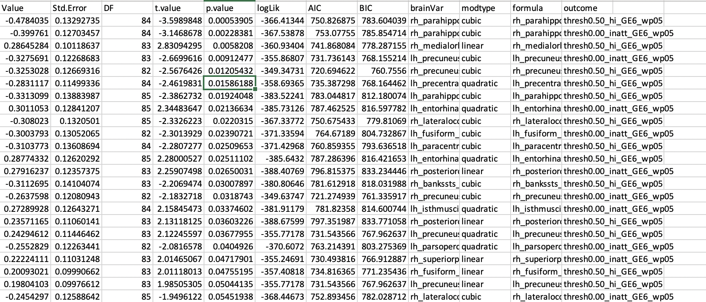
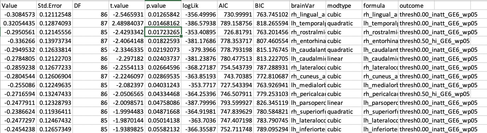
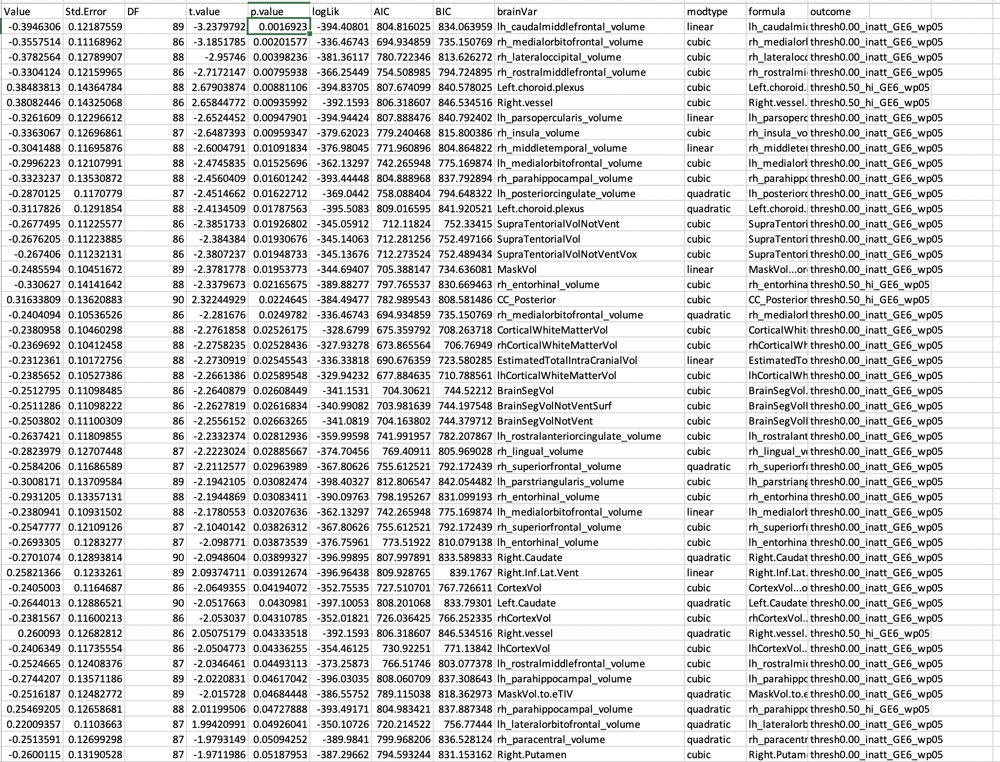

# 2020-01-29 15:24:12

While we wait for mode to compute (069), let's start from where we are in terms
of models to use, and do the same for the anatomical data. I'll use our common
QC parameters for now, but still use the OD pipeline for scan selection. 

The idea then, so far, is to use just one per family so we don't have to worry
about mixed models, and figure out the best predictors for the logistic
regression between improvers and non-improvers. Then, we check how NVs compare
to them in those good variables.

We could potentially use the data we're trhwoing away for a pseudo-validation
later. But we'll see. 

```r
setwd('~/data/baseline_prediction/prs_start/')
clin_long = read.csv('long_clin_01062020_lt16.csv')
clin_long$SX_total = clin_long$SX_inatt + clin_long$SX_hi

winsorize = function(x, cut = 0.01){
  cut_point_top <- quantile(x, 1 - cut, na.rm = T)
  cut_point_bottom <- quantile(x, cut, na.rm = T)
  i = which(x >= cut_point_top) 
  x[i] = cut_point_top
  j = which(x <= cut_point_bottom) 
  x[j] = cut_point_bottom
  return(x)
}

df = data.frame(MRN=unique(clin_long$MRN))
for (r in 1:nrow(df)) {
    subj_data = clin_long[clin_long$MRN==df$MRN[r], ]
    for (sx in c('inatt', 'hi', 'total')) {
        fit = lm(as.formula(sprintf('SX_%s ~ age', sx)), data=subj_data)
        df[r, sprintf('slope_%s', sx)] = fit$coefficients['age']
        base_row = which.min(subj_data$age)
        df[r, sprintf('base_%s', sx)] = subj_data[base_row, sprintf('SX_%s', sx)]
        last_row = which.max(subj_data$age)
        df[r, sprintf('last_%s', sx)] = subj_data[last_row, sprintf('SX_%s', sx)]
        df[r, 'base_age'] = subj_data[base_row, 'age']
        df[r, 'last_age'] = subj_data[last_row, 'age']
        df[r, 'sex'] = subj_data[last_row, 'sex']
    }
}
for (min_sx in c(0, 3, 4, 6)) {
    idx = df$base_inatt>=min_sx | df$base_hi>=min_sx
    for (sx in c('inatt', 'hi', 'total')) {
        df[, sprintf('slope_%s_GE%d_wp05', sx, min_sx)] = NA
        junk = winsorize(df[idx, sprintf('slope_%s', sx)], cut=.05)
        df[idx, sprintf('slope_%s_GE%d_wp05', sx, min_sx)] = junk
    }
}

demo = read.csv('prs_demo.csv')
# just to get FAMID, sex already there
df = merge(df, subset(demo, select=-sex), by='MRN')

# selecting best kid in family
df$bestInFamily = F
nvisits = table(clin_long$MRN)
df = merge(df, as.matrix(nvisits),
                 by.x='MRN', by.y=0)
colnames(df)[ncol(df)] = 'nvisits'
for (f in unique(df$FAMID)) {
    fam_rows = which(df$FAMID == f)
    fam_data = df[fam_rows,]
    if (nrow(fam_data) == 1) {
        df[fam_rows,]$bestInFamily = T
    } else {
        stotal = sort(fam_data$slope_total, index.return=T, decreasing=T)
        # if there's a tie
        if (stotal$x[1] == stotal$x[2]) {
            # print(sprintf('Tie in slope for %d', f))
            svisits = sort(fam_data$nvisits, index.return=T, decreasing=T)
            if (svisits$x[1] == svisits$x[2]) {
                print(sprintf('Tie in number of visits for %d', f))
                print(fam_data[fam_data$nvisits==svisits$x[1], ]$MRN)
            } else {
                df[fam_rows[svisits$ix[1]], ]$bestInFamily = T
            }
        } else {
            df[fam_rows[stotal$ix[1]], ]$bestInFamily = T
        }
    }
}

df[df$MRN==4585574, ]$bestInFamily = T
df[df$MRN==4925051, ]$bestInFamily = T
df[df$MRN==7079035, ]$bestInFamily = T
df[df$MRN==7378993, ]$bestInFamily = T
# chosen because of overall best MPRAGE QC
df[df$MRN==4640378, ]$bestInFamily = T
# chosen because of overall best MPRAGE QC
df[df$MRN==7218965, ]$bestInFamily = T
```

At this point we have just the df of everyone with prs (393 subjects), and the
selections for best in family. Now, let's merge in the anatomical data.

```r
qc = read.csv('~/data/baseline_prediction/prs_start/prs_and_mprage_qc.csv')
brain_meta = merge(df, qc, by='MRN', all.x=F, all.y=F)

# out of the 1849 scans scored, 1400 are in our prs set

# restrict based on QC
qc_vars = c("mprage_score", "ext_avg", "int_avg")
brain_meta = brain_meta[brain_meta$"age_at_scan" < 18, ]
na_scores_idx = is.na(brain_meta$mprage_score) | is.na(brain_meta$ext_avg) |
                is.na(brain_meta$int_avg)
brain_meta = brain_meta[!na_scores_idx, ]
# down to 1290 after removing adults and anyone without a score

qtile=.95
library(solitude)
iso <- isolationForest$new()
iso$fit(brain_meta[, qc_vars])
scores_if = as.matrix(iso$scores)[,3]
library(dbscan)
# here I set the number of neighbors to a percentage of the total data
scores_lof = lof(brain_meta[, qc_vars], k = round(.5 * nrow(brain_meta)))
thresh_lof = quantile(scores_lof, qtile)
thresh_if = quantile(scores_if, qtile)
idx = scores_lof < thresh_lof & scores_if < thresh_if
```

# 2020-01-30 14:36:30

Let's keep on playing with these variables:

```r
# 1198 after OD on qc_vars
all_brain_data = read.table('~/data/baseline_prediction/merged_rois.txt', header=T)
x = duplicated(all_brain_data$lh.aparc.area)
brain_data = merge(brain_meta[idx,], all_brain_data[!x, ], by.x='maskid',
                   by.y='lh.aparc.area', all.x=F, all.y=F)
brain_vars = colnames(brain_data)[grepl(colnames(brain_data), pattern="_thickness$")]

iso <- isolationForest$new()
iso$fit(brain_data[, brain_vars])
scores_if = as.matrix(iso$scores)[,3]
scores_lof = lof(brain_data[, brain_vars], k = round(.5 * nrow(brain_data)))

thresh_lof = quantile(scores_lof, qtile)
thresh_if = quantile(scores_if, qtile)
idx = scores_lof < thresh_lof & scores_if < thresh_if

clean_brain_data = brain_data[idx, ]

# down to 1115 scans when only scans at .95 in both criteria are used
keep_me = c()
for (s in unique(clean_brain_data$MRN)) {
    subj_rows = which(clean_brain_data$MRN == s)
    subj_data = clean_brain_data[subj_rows, ]
    min_subj_row = which.min(subj_data$age_at_scan)
    if (abs(subj_data[min_subj_row, 'base_age'] -
            subj_data[min_subj_row, 'age_at_scan'])<1) {
        keep_me = c(keep_me, subj_rows[min_subj_row])
    }
}
data = clean_brain_data[keep_me, ]

for (sx in c('inatt', 'hi')) {
    for (min_sx in c(3, 4, 6)) {
        if (sx == 'inatt') {
            thresh = 0
        } else if (sx == 'hi') {
            thresh = -.5
        }
        phen_slope = sprintf('slope_%s_GE%d_wp05', sx, min_sx)
        phen = sprintf('thresh%.2f_%s_GE%d_wp05', abs(thresh), sx, min_sx)
        my_nvs = is.na(data[, phen_slope])
        mid_nv = sprintf('notGE%dadhd', min_sx)
        data[, phen] = mid_nv
        idx = data[my_nvs, 'base_inatt'] <= 2 & data[my_nvs, 'base_hi'] <= 2
        data[my_nvs[idx], phen] = 'nv012'
        data[which(data[, phen_slope] < thresh), phen] = 'imp'
        data[which(data[, phen_slope] >= thresh), phen] = 'nonimp'
        data[, phen] = factor(data[, phen],
                            levels=c('nv012', mid_nv, 'imp', 'nonimp'),
                            ordered=T)
        print(phen)
        print(table(data[,phen]))
    }
}
```

The numbers are a bit larger in anatomy (thickness), but not by much:

```[1] "thresh0.00_inatt_GE3_wp05"

     nv012 notGE3adhd        imp     nonimp 
       126          0         93         63 
[1] "thresh0.00_inatt_GE4_wp05"

     nv012 notGE4adhd        imp     nonimp 
        93         35         91         63 
[1] "thresh0.00_inatt_GE6_wp05"

     nv012 notGE6adhd        imp     nonimp 
       109         53         75         45 
[1] "thresh0.50_hi_GE3_wp05"

     nv012 notGE3adhd        imp     nonimp 
       126          0         64         92 
[1] "thresh0.50_hi_GE4_wp05"

     nv012 notGE4adhd        imp     nonimp 
        93         35         64         90 
[1] "thresh0.50_hi_GE6_wp05"

     nv012 notGE6adhd        imp     nonimp 
       109         53         54         66 
```

Let's run our linear model and see what we get:

```r
library(nlme)
library(MASS)

hold = c()
covars = c(qc_vars, 'age_at_scan')
out_fname = '~/data/baseline_prediction/prs_start/univar_volume_4groupOrdered_stepAIClme.csv'
for (sx in c('inatt', 'hi')) {
    min_sx = 6
    if (sx == 'inatt') {
        thresh = 0
    } else if (sx == 'hi') {
        thresh = -.5
    }
    phen_slope = sprintf('slope_%s_GE%d_wp05', sx, min_sx)
    phen = sprintf('thresh%.2f_%s_GE%d_wp05', abs(thresh), sx, min_sx)
    data[, phen] = 'notGE6adhd'
    my_nvs = which(is.na(data[, phen_slope]))
    idx = data[my_nvs, 'base_inatt'] <= 2 & data[my_nvs, 'base_hi'] <= 2
    data[my_nvs[idx], phen] = 'nv012'
    data[which(data[, phen_slope] < thresh), phen] = 'imp'
    data[which(data[, phen_slope] >= thresh), phen] = 'nonimp'
    data[, phen] = factor(data[, phen], ordered=F)
    data[, phen] = relevel(data[, phen], ref='nv012')
    use_me = T

    this_data = data[use_me, c(phen, 'FAMID', brain_vars, covars)]
    this_data[, 3:ncol(this_data)] = scale(this_data[, 3:ncol(this_data)])
    this_data$sex = data[use_me, 'sex']
    tmp_covars = c(covars, 'sex')
    this_data$ordered = factor(this_data[, phen],
                           levels=c('nv012', 'notGE6adhd', 'imp', 'nonimp'),
                           ordered=T)
    phen_res = c()
    for (bv in brain_vars) {
        fm_str = paste(bv, " ~ ordered +",
                           paste(tmp_covars, collapse='+'),
                           sep="")
        fit = try(lme(as.formula(fm_str), ~1|FAMID, data=this_data, method='ML'))
        if (length(fit)>1) {
            step=try(stepAIC(fit, direction='both', trace=F,
                        scope = list(lower = ~ ordered)))
            if (length(step) > 1) {
                temp = c(summary(step)$tTable['ordered.L', ],
                            summary(step)$logLik, summary(step)$AIC, summary(step)$BIC,
                            bv, 'linear')
                phen_res = rbind(phen_res, temp)
                rownames(phen_res)[nrow(phen_res)] = fm_str
                temp = c(summary(step)$tTable['ordered.Q', ],
                            summary(step)$logLik, summary(step)$AIC, summary(step)$BIC,
                            bv, 'quadratic')
                phen_res = rbind(phen_res, temp)
                rownames(phen_res)[nrow(phen_res)] = fm_str
                temp = c(summary(step)$tTable['ordered.C', ],
                            summary(step)$logLik, summary(step)$AIC, summary(step)$BIC,
                            bv, 'cubic')
                phen_res = rbind(phen_res, temp)
                rownames(phen_res)[nrow(phen_res)] = fm_str
            } else {
                # fit worked but broke stepping
                temp = c(summary(fit)$tTable['ordered.L', ],
                            summary(fit)$logLik, summary(fit)$AIC, summary(fit)$BIC,
                            bv, 'linear')
                phen_res = rbind(phen_res, temp)
                rownames(phen_res)[nrow(phen_res)] = fm_str
                temp = c(summary(fit)$tTable['ordered.Q', ],
                            summary(fit)$logLik, summary(fit)$AIC, summary(fit)$BIC,
                            bv, 'quadratic')
                phen_res = rbind(phen_res, temp)
                rownames(phen_res)[nrow(phen_res)] = fm_str
                temp = c(summary(fit)$tTable['ordered.C', ],
                            summary(fit)$logLik, summary(fit)$AIC, summary(fit)$BIC,
                            bv, 'cubic')
                phen_res = rbind(phen_res, temp)
                rownames(phen_res)[nrow(phen_res)] = fm_str
            }
        } else {
            # fit broke
            temp = rep(NA, 10)
            phen_res = rbind(phen_res, temp)
            rownames(phen_res)[nrow(phen_res)] = fm_str
        }
    }
    phen_res = data.frame(phen_res)
    phen_res$formula = rownames(phen_res)
    phen_res$outcome = phen
    hold = rbind(hold, phen_res)
}
colnames(hold)[6:10] = c('logLik', 'AIC', 'BIC', 'brainVar', 'modtype')
write.csv(hold, file=out_fname, row.names=F)
```



Given the number of variables we're running (70), I was expecting a bit more.
Let's see if area or volume gives us better results. We might end up collapsing
regions here, but we'll see. I was also intrigued by how the linear contrast
doesn't do as well here, compared to DTI.

For future reference, here are our brain_vars for the other cases:

```r
brain_vars = colnames(brain_data)[grepl(colnames(brain_data), pattern="_thickness$")]
# or
brain_vars = c(colnames(brain_data)[grepl(colnames(brain_data), pattern="_volume$")],
               colnames(brain_data)[c(256:287, 295:321)])
```



Area was equally unimpressive.

How about volume?



This is muuuuch better. We still get a few crappy variables in there, but it's
just a matter of excluding them in the initial selection. We also got lots of
cubic fits... interesting.


# TODO
* Can we do QC using mriqc parameters?