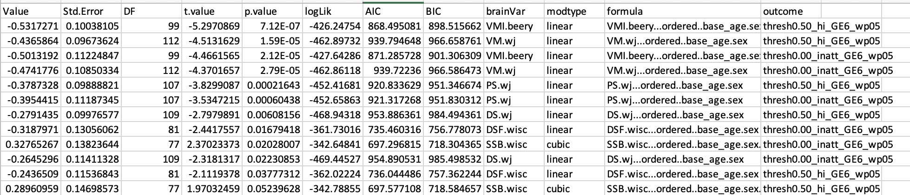
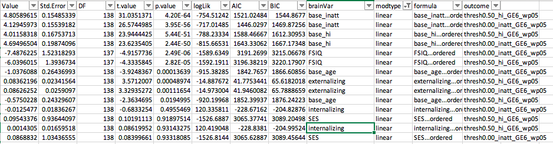
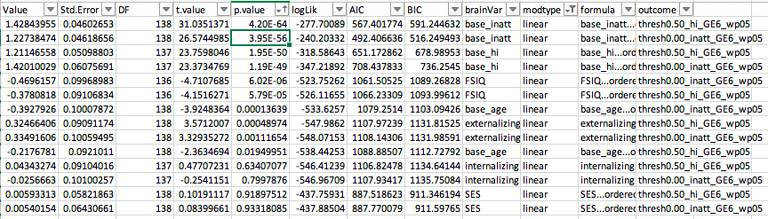

# 2020-01-31 08:53:10

Let's take a look at some of the other domains as baseline predictors. 

## Neuropsych

I'll run the usual code, but then I'll have to construct the merged neuropsych
still.

```r
setwd('~/data/baseline_prediction/prs_start/')
clin_long = read.csv('long_clin_01062020_lt16.csv')
clin_long$SX_total = clin_long$SX_inatt + clin_long$SX_hi

winsorize = function(x, cut = 0.01){
  cut_point_top <- quantile(x, 1 - cut, na.rm = T)
  cut_point_bottom <- quantile(x, cut, na.rm = T)
  i = which(x >= cut_point_top) 
  x[i] = cut_point_top
  j = which(x <= cut_point_bottom) 
  x[j] = cut_point_bottom
  return(x)
}

df = data.frame(MRN=unique(clin_long$MRN))
for (r in 1:nrow(df)) {
    subj_data = clin_long[clin_long$MRN==df$MRN[r], ]
    for (sx in c('inatt', 'hi', 'total')) {
        fit = lm(as.formula(sprintf('SX_%s ~ age', sx)), data=subj_data)
        df[r, sprintf('slope_%s', sx)] = fit$coefficients['age']
        base_row = which.min(subj_data$age)
        df[r, sprintf('base_%s', sx)] = subj_data[base_row, sprintf('SX_%s', sx)]
        last_row = which.max(subj_data$age)
        df[r, sprintf('last_%s', sx)] = subj_data[last_row, sprintf('SX_%s', sx)]
        df[r, 'base_age'] = subj_data[base_row, 'age']
        df[r, 'base_DOA'] = subj_data[base_row, 'DOA']
        df[r, 'last_age'] = subj_data[last_row, 'age']
        df[r, 'sex'] = subj_data[last_row, 'sex']
    }
}
for (min_sx in c(0, 3, 4, 6)) {
    idx = df$base_inatt>=min_sx | df$base_hi>=min_sx
    for (sx in c('inatt', 'hi', 'total')) {
        df[, sprintf('slope_%s_GE%d_wp05', sx, min_sx)] = NA
        junk = winsorize(df[idx, sprintf('slope_%s', sx)], cut=.05)
        df[idx, sprintf('slope_%s_GE%d_wp05', sx, min_sx)] = junk
    }
}

demo = read.csv('prs_demo.csv')
# just to get FAMID, sex already there
df = merge(df, subset(demo, select=-sex), by='MRN')

# selecting best kid in family
df$bestInFamily = F
nvisits = table(clin_long$MRN)
df = merge(df, as.matrix(nvisits),
                 by.x='MRN', by.y=0)
colnames(df)[ncol(df)] = 'nvisits'
for (f in unique(df$FAMID)) {
    fam_rows = which(df$FAMID == f)
    fam_data = df[fam_rows,]
    if (nrow(fam_data) == 1) {
        df[fam_rows,]$bestInFamily = T
    } else {
        stotal = sort(fam_data$slope_total, index.return=T, decreasing=T)
        # if there's a tie
        if (stotal$x[1] == stotal$x[2]) {
            # print(sprintf('Tie in slope for %d', f))
            svisits = sort(fam_data$nvisits, index.return=T, decreasing=T)
            if (svisits$x[1] == svisits$x[2]) {
                print(sprintf('Tie in number of visits for %d', f))
                print(fam_data[fam_data$nvisits==svisits$x[1], ]$MRN)
            } else {
                df[fam_rows[svisits$ix[1]], ]$bestInFamily = T
            }
        } else {
            df[fam_rows[stotal$ix[1]], ]$bestInFamily = T
        }
    }
}

df[df$MRN==4585574, ]$bestInFamily = T
df[df$MRN==4925051, ]$bestInFamily = T
df[df$MRN==7079035, ]$bestInFamily = T
df[df$MRN==7378993, ]$bestInFamily = T
# chosen because of overall best MPRAGE QC
df[df$MRN==4640378, ]$bestInFamily = T
# chosen because of overall best MPRAGE QC
df[df$MRN==7218965, ]$bestInFamily = T
```

At this point we have just the df of everyone with prs (393 subjects), and the
selections for best in family. Now, let's merge the neuropsych data.

```r
library(gdata)
source('~/research_code/lab_mgmt/merge_on_closest_date.R')
beery = read.xls('~/data/baseline_prediction/prs_start/Subjects_Beery_clean.xlsx')
colnames(beery) = c('MRN', 'DOA.beery', 'VMI.beery')
neuropsych = mergeOnClosestDate(df, beery, unique(df$MRN), x.date='base_DOA',
                                y.date='DOA.beery')
colnames(neuropsych)[ncol(neuropsych)] = 'dateDiff.beery'

wisc = read.xls('~/data/baseline_prediction/prs_start/Subjects_WISC_clean.xlsx')
colnames(wisc) = c('MRN', 'DOA.wisc', 'DS.wisc', 'DSB.wisc', 'DSF.wisc', 'SS.wisc',
                   'SSB.wisc', 'SSF.wisc')
neuropsych = mergeOnClosestDate(neuropsych, wisc, unique(df$MRN),
                                x.date='base_DOA', y.date='DOA.wisc')
colnames(neuropsych)[ncol(neuropsych)] = 'dateDiff.wisc'

wj = read.xls('~/data/baseline_prediction/prs_start/Subjects_Woodcock_Johnson_clean.xlsx')
colnames(wj) = c('MRN', 'DOA.wj', 'PS.wj', 'DS.wj', 'VM.wj')
neuropsych = mergeOnClosestDate(neuropsych, wj, unique(df$MRN),
                                x.date='base_DOA', y.date='DOA.wj')
colnames(neuropsych)[ncol(neuropsych)] = 'dateDiff.wj'

# removing scores with abs(DOA_diff) > 1 year
data = neuropsych
for (suf in c('.beery', '.wisc', '.wj')) {
    doa_col = sprintf('DOA%s', suf)
    date_diff = abs(as.Date(data[, 'base_DOA'], tryFormats='%m/%d/%Y') -
                    as.Date(data[, doa_col], tryFormats='%m/%d/%Y'))
    mycols = colnames(data)[grepl(colnames(data), pattern=sprintf('%s$', suf))]
    idx = which(date_diff > 365)
    data[idx, mycols] = NA
}
```

Let's run all models now. A difference in the code is that we'll need to
determine the people who stay per test, as some kids might have one test but not
the other.

```r
library(nlme)
library(MASS)

brain_vars = c('VMI.beery',
               'DS.wisc', 'DSB.wisc', 'DSF.wisc', 'SS.wisc', 'SSB.wisc', 'SSF.wisc',
               'PS.wj', 'DS.wj', 'VM.wj')
hold = c()
covars = c('base_age')
out_fname = '~/data/baseline_prediction/prs_start/univar_neuropsych_4groupOrdered_stepAIClme.csv'
for (sx in c('inatt', 'hi')) {
    min_sx = 6
    if (sx == 'inatt') {
        thresh = 0
    } else if (sx == 'hi') {
        thresh = -.5
    }
    phen_slope = sprintf('slope_%s_GE%d_wp05', sx, min_sx)
    phen = sprintf('thresh%.2f_%s_GE%d_wp05', abs(thresh), sx, min_sx)
    data[, phen] = 'notGE6adhd'
    my_nvs = which(is.na(data[, phen_slope]))
    idx = data[my_nvs, 'base_inatt'] <= 2 & data[my_nvs, 'base_hi'] <= 2
    data[my_nvs[idx], phen] = 'nv012'
    data[which(data[, phen_slope] < thresh), phen] = 'imp'
    data[which(data[, phen_slope] >= thresh), phen] = 'nonimp'
    data[, phen] = factor(data[, phen], ordered=F)
    data[, phen] = relevel(data[, phen], ref='nv012')
    use_me = T

    this_data = data[use_me, c(phen, 'FAMID', brain_vars, covars)]
    this_data[, 3:ncol(this_data)] = scale(this_data[, 3:ncol(this_data)])
    this_data$sex = data[use_me, 'sex']
    tmp_covars = c(covars, 'sex')
    this_data$ordered = factor(this_data[, phen],
                           levels=c('nv012', 'notGE6adhd', 'imp', 'nonimp'),
                           ordered=T)
    phen_res = c()
    for (bv in brain_vars) {
        fm_str = paste(bv, " ~ ordered +",
                           paste(tmp_covars, collapse='+'),
                           sep="")
        fit = try(lme(as.formula(fm_str), ~1|FAMID, data=this_data, method='ML',
                  na.action=na.omit))
        if (length(fit)>1) {
            step=try(stepAIC(fit, direction='both', trace=F,
                        scope = list(lower = ~ ordered)))
            if (length(step) > 1) {
                temp = c(summary(step)$tTable['ordered.L', ],
                            summary(step)$logLik, summary(step)$AIC, summary(step)$BIC,
                            bv, 'linear')
                phen_res = rbind(phen_res, temp)
                rownames(phen_res)[nrow(phen_res)] = fm_str
                temp = c(summary(step)$tTable['ordered.Q', ],
                            summary(step)$logLik, summary(step)$AIC, summary(step)$BIC,
                            bv, 'quadratic')
                phen_res = rbind(phen_res, temp)
                rownames(phen_res)[nrow(phen_res)] = fm_str
                temp = c(summary(step)$tTable['ordered.C', ],
                            summary(step)$logLik, summary(step)$AIC, summary(step)$BIC,
                            bv, 'cubic')
                phen_res = rbind(phen_res, temp)
                rownames(phen_res)[nrow(phen_res)] = fm_str
            } else {
                # fit worked but broke stepping
                temp = c(summary(fit)$tTable['ordered.L', ],
                            summary(fit)$logLik, summary(fit)$AIC, summary(fit)$BIC,
                            bv, 'linear')
                phen_res = rbind(phen_res, temp)
                rownames(phen_res)[nrow(phen_res)] = fm_str
                temp = c(summary(fit)$tTable['ordered.Q', ],
                            summary(fit)$logLik, summary(fit)$AIC, summary(fit)$BIC,
                            bv, 'quadratic')
                phen_res = rbind(phen_res, temp)
                rownames(phen_res)[nrow(phen_res)] = fm_str
                temp = c(summary(fit)$tTable['ordered.C', ],
                            summary(fit)$logLik, summary(fit)$AIC, summary(fit)$BIC,
                            bv, 'cubic')
                phen_res = rbind(phen_res, temp)
                rownames(phen_res)[nrow(phen_res)] = fm_str
            }
        } else {
            # fit broke
            temp = rep(NA, 10)
            phen_res = rbind(phen_res, temp)
            rownames(phen_res)[nrow(phen_res)] = fm_str
        }
    }
    phen_res = data.frame(phen_res)
    phen_res$formula = rownames(phen_res)
    phen_res$outcome = phen
    hold = rbind(hold, phen_res)
}
colnames(hold)[6:10] = c('logLik', 'AIC', 'BIC', 'brainVar', 'modtype')
write.csv(hold, file=out_fname, row.names=F)
```



A lot of highly significant stuff... won't need many corrections here.

## Clinical

The idea here is to use baseline age, sex, IQ, and comorbidities. I'll also plug
in base_sx, since I'm running them univariate, using a similar approach as what
I did for PRS and neuroimaging.

Picking up from after selecting the best in family, we do:

```r
iq = read.csv('~/data/baseline_prediction/basics.csv')
# no need to curb to 1 year difference
data = merge(df, iq, by='MRN', all.x=T, all.y=F)
```

Now it's just a matter of running the models:

```r
brain_vars = c('base_age', 'FSIQ', 'SES', 'externalizing',
               'internalizing', 'base_inatt', 'base_hi')
hold = c()
out_fname = '~/data/baseline_prediction/prs_start/univar_basics_4groupOrdered_stepAIClme.csv'
for (sx in c('inatt', 'hi')) {
    min_sx = 6
    if (sx == 'inatt') {
        thresh = 0
    } else if (sx == 'hi') {
        thresh = -.5
    }
    phen_slope = sprintf('slope_%s_GE%d_wp05', sx, min_sx)
    phen = sprintf('thresh%.2f_%s_GE%d_wp05', abs(thresh), sx, min_sx)
    data[, phen] = 'notGE6adhd'
    my_nvs = which(is.na(data[, phen_slope]))
    idx = data[my_nvs, 'base_inatt'] <= 2 & data[my_nvs, 'base_hi'] <= 2
    data[my_nvs[idx], phen] = 'nv012'
    data[which(data[, phen_slope] < thresh), phen] = 'imp'
    data[which(data[, phen_slope] >= thresh), phen] = 'nonimp'
    data[, phen] = factor(data[, phen], ordered=F)
    data[, phen] = relevel(data[, phen], ref='nv012')
    use_me = T

    this_data = data[use_me, c(phen, 'FAMID', brain_vars)]
    this_data$ordered = factor(this_data[, phen],
                           levels=c('nv012', 'notGE6adhd', 'imp', 'nonimp'),
                           ordered=T)
    phen_res = c()
    for (bv in brain_vars) {
        fm_str = paste(bv, " ~ ordered", sep="")
        fit = try(lme(as.formula(fm_str), ~1|FAMID, data=this_data, method='ML',
                  na.action=na.omit))
        if (length(fit)>1) {
            step=try(stepAIC(fit, direction='both', trace=F,
                        scope = list(lower = ~ ordered)))
            if (length(step) > 1) {
                temp = c(summary(step)$tTable['ordered.L', ],
                            summary(step)$logLik, summary(step)$AIC, summary(step)$BIC,
                            bv, 'linear')
                phen_res = rbind(phen_res, temp)
                rownames(phen_res)[nrow(phen_res)] = fm_str
                temp = c(summary(step)$tTable['ordered.Q', ],
                            summary(step)$logLik, summary(step)$AIC, summary(step)$BIC,
                            bv, 'quadratic')
                phen_res = rbind(phen_res, temp)
                rownames(phen_res)[nrow(phen_res)] = fm_str
                temp = c(summary(step)$tTable['ordered.C', ],
                            summary(step)$logLik, summary(step)$AIC, summary(step)$BIC,
                            bv, 'cubic')
                phen_res = rbind(phen_res, temp)
                rownames(phen_res)[nrow(phen_res)] = fm_str
            } else {
                # fit worked but broke stepping
                temp = c(summary(fit)$tTable['ordered.L', ],
                            summary(fit)$logLik, summary(fit)$AIC, summary(fit)$BIC,
                            bv, 'linear')
                phen_res = rbind(phen_res, temp)
                rownames(phen_res)[nrow(phen_res)] = fm_str
                temp = c(summary(fit)$tTable['ordered.Q', ],
                            summary(fit)$logLik, summary(fit)$AIC, summary(fit)$BIC,
                            bv, 'quadratic')
                phen_res = rbind(phen_res, temp)
                rownames(phen_res)[nrow(phen_res)] = fm_str
                temp = c(summary(fit)$tTable['ordered.C', ],
                            summary(fit)$logLik, summary(fit)$AIC, summary(fit)$BIC,
                            bv, 'cubic')
                phen_res = rbind(phen_res, temp)
                rownames(phen_res)[nrow(phen_res)] = fm_str
            }
        } else {
            # fit broke
            temp = rep(NA, 10)
            phen_res = rbind(phen_res, temp)
            rownames(phen_res)[nrow(phen_res)] = fm_str
        }
    }
    phen_res = data.frame(phen_res)
    phen_res$formula = rownames(phen_res)
    phen_res$outcome = phen
    hold = rbind(hold, phen_res)
}
colnames(hold)[6:10] = c('logLik', 'AIC', 'BIC', 'brainVar', 'modtype')
write.csv(hold, file=out_fname, row.names=F)
```



These were all expected... but still quite impressive!

I'm going to go back to covarying sex, because I'm not sure how else to use it
in this univariate way... I could do a different test, but then I'm not sure if
it's the best thing to do to change the entire framework for a single variable,
when it will for sure be included in the overall model:

```r
brain_vars = c('base_age', 'FSIQ', 'SES', 'externalizing',
               'internalizing', 'base_inatt', 'base_hi')
hold = c()
out_fname = '~/data/baseline_prediction/prs_start/univar_basics_4groupOrdered_sexCov_stepAIClme.csv'
for (sx in c('inatt', 'hi')) {
    min_sx = 6
    if (sx == 'inatt') {
        thresh = 0
    } else if (sx == 'hi') {
        thresh = -.5
    }
    phen_slope = sprintf('slope_%s_GE%d_wp05', sx, min_sx)
    phen = sprintf('thresh%.2f_%s_GE%d_wp05', abs(thresh), sx, min_sx)
    data[, phen] = 'notGE6adhd'
    my_nvs = which(is.na(data[, phen_slope]))
    idx = data[my_nvs, 'base_inatt'] <= 2 & data[my_nvs, 'base_hi'] <= 2
    data[my_nvs[idx], phen] = 'nv012'
    data[which(data[, phen_slope] < thresh), phen] = 'imp'
    data[which(data[, phen_slope] >= thresh), phen] = 'nonimp'
    data[, phen] = factor(data[, phen], ordered=F)
    data[, phen] = relevel(data[, phen], ref='nv012')
    use_me = T

    this_data = data[use_me, c(phen, 'FAMID', brain_vars)]
    this_data[, 3:ncol(this_data)] = scale(this_data[, 3:ncol(this_data)])
    this_data$sex = data[use_me, 'sex']
    this_data$ordered = factor(this_data[, phen],
                           levels=c('nv012', 'notGE6adhd', 'imp', 'nonimp'),
                           ordered=T)
    phen_res = c()
    for (bv in brain_vars) {
        fm_str = paste(bv, " ~ ordered + sex", sep="")
        fit = try(lme(as.formula(fm_str), ~1|FAMID, data=this_data, method='ML',
                      na.action=na.omit))
        if (length(fit)>1) {
            step=try(stepAIC(fit, direction='both', trace=F,
                        scope = list(lower = ~ ordered)))
            if (length(step) > 1) {
                temp = c(summary(step)$tTable['ordered.L', ],
                            summary(step)$logLik, summary(step)$AIC, summary(step)$BIC,
                            bv, 'linear')
                phen_res = rbind(phen_res, temp)
                rownames(phen_res)[nrow(phen_res)] = fm_str
                temp = c(summary(step)$tTable['ordered.Q', ],
                            summary(step)$logLik, summary(step)$AIC, summary(step)$BIC,
                            bv, 'quadratic')
                phen_res = rbind(phen_res, temp)
                rownames(phen_res)[nrow(phen_res)] = fm_str
                temp = c(summary(step)$tTable['ordered.C', ],
                            summary(step)$logLik, summary(step)$AIC, summary(step)$BIC,
                            bv, 'cubic')
                phen_res = rbind(phen_res, temp)
                rownames(phen_res)[nrow(phen_res)] = fm_str
            } else {
                # fit worked but broke stepping
                temp = c(summary(fit)$tTable['ordered.L', ],
                            summary(fit)$logLik, summary(fit)$AIC, summary(fit)$BIC,
                            bv, 'linear')
                phen_res = rbind(phen_res, temp)
                rownames(phen_res)[nrow(phen_res)] = fm_str
                temp = c(summary(fit)$tTable['ordered.Q', ],
                            summary(fit)$logLik, summary(fit)$AIC, summary(fit)$BIC,
                            bv, 'quadratic')
                phen_res = rbind(phen_res, temp)
                rownames(phen_res)[nrow(phen_res)] = fm_str
                temp = c(summary(fit)$tTable['ordered.C', ],
                            summary(fit)$logLik, summary(fit)$AIC, summary(fit)$BIC,
                            bv, 'cubic')
                phen_res = rbind(phen_res, temp)
                rownames(phen_res)[nrow(phen_res)] = fm_str
            }
        } else {
            # fit broke
            temp = rep(NA, 10)
            phen_res = rbind(phen_res, temp)
            rownames(phen_res)[nrow(phen_res)] = fm_str
        }
    }
    phen_res = data.frame(phen_res)
    phen_res$formula = rownames(phen_res)
    phen_res$outcome = phen
    hold = rbind(hold, phen_res)
}
colnames(hold)[6:10] = c('logLik', 'AIC', 'BIC', 'brainVar', 'modtype')
write.csv(hold, file=out_fname, row.names=F)
```



Not much difference...


# TODO
* should I worry about base_age as a covariate everywhere and then checking its
  predictive power?