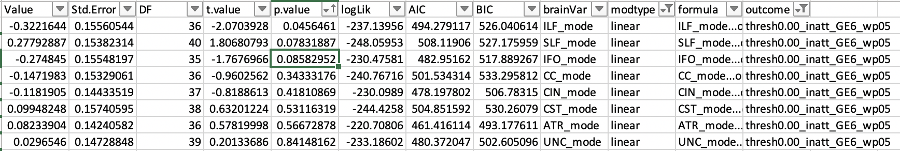

# 2020-01-31 11:03:15

Let's see what we can do to reduce some of the DTI variables. First step is to
collapse some of the variables:

```r
setwd('~/data/baseline_prediction/prs_start/')
clin_long = read.csv('long_clin_01062020_lt16.csv')
clin_long$SX_total = clin_long$SX_inatt + clin_long$SX_hi

winsorize = function(x, cut = 0.01){
  cut_point_top <- quantile(x, 1 - cut, na.rm = T)
  cut_point_bottom <- quantile(x, cut, na.rm = T)
  i = which(x >= cut_point_top) 
  x[i] = cut_point_top
  j = which(x <= cut_point_bottom) 
  x[j] = cut_point_bottom
  return(x)
}

df = data.frame(MRN=unique(clin_long$MRN))
for (r in 1:nrow(df)) {
    subj_data = clin_long[clin_long$MRN==df$MRN[r], ]
    for (sx in c('inatt', 'hi', 'total')) {
        fit = lm(as.formula(sprintf('SX_%s ~ age', sx)), data=subj_data)
        df[r, sprintf('slope_%s', sx)] = fit$coefficients['age']
        base_row = which.min(subj_data$age)
        df[r, sprintf('base_%s', sx)] = subj_data[base_row, sprintf('SX_%s', sx)]
        last_row = which.max(subj_data$age)
        df[r, sprintf('last_%s', sx)] = subj_data[last_row, sprintf('SX_%s', sx)]
        df[r, 'base_age'] = subj_data[base_row, 'age']
        df[r, 'last_age'] = subj_data[last_row, 'age']
        df[r, 'sex'] = subj_data[last_row, 'sex']
    }
}
for (min_sx in c(0, 3, 4, 6)) {
    idx = df$base_inatt>=min_sx | df$base_hi>=min_sx
    for (sx in c('inatt', 'hi', 'total')) {
        df[, sprintf('slope_%s_GE%d_wp05', sx, min_sx)] = NA
        junk = winsorize(df[idx, sprintf('slope_%s', sx)], cut=.05)
        df[idx, sprintf('slope_%s_GE%d_wp05', sx, min_sx)] = junk
    }
}

demo = read.csv('prs_demo.csv')
# just to get FAMID, sex already there
df = merge(df, subset(demo, select=-sex), by='MRN')

# selecting best kid in family
df$bestInFamily = F
nvisits = table(clin_long$MRN)
df = merge(df, as.matrix(nvisits),
                 by.x='MRN', by.y=0)
colnames(df)[ncol(df)] = 'nvisits'
for (f in unique(df$FAMID)) {
    fam_rows = which(df$FAMID == f)
    fam_data = df[fam_rows,]
    if (nrow(fam_data) == 1) {
        df[fam_rows,]$bestInFamily = T
    } else {
        stotal = sort(fam_data$slope_total, index.return=T, decreasing=T)
        # if there's a tie
        if (stotal$x[1] == stotal$x[2]) {
            # print(sprintf('Tie in slope for %d', f))
            svisits = sort(fam_data$nvisits, index.return=T, decreasing=T)
            if (svisits$x[1] == svisits$x[2]) {
                print(sprintf('Tie in number of visits for %d', f))
                print(fam_data[fam_data$nvisits==svisits$x[1], ]$MRN)
            } else {
                df[fam_rows[svisits$ix[1]], ]$bestInFamily = T
            }
        } else {
            df[fam_rows[stotal$ix[1]], ]$bestInFamily = T
        }
    }
}

df[df$MRN==4585574, ]$bestInFamily = T
df[df$MRN==4925051, ]$bestInFamily = T
df[df$MRN==7079035, ]$bestInFamily = T
df[df$MRN==7378993, ]$bestInFamily = T
# chosen because of overall best MPRAGE QC
df[df$MRN==4640378, ]$bestInFamily = T
# chosen because of overall best MPRAGE QC
df[df$MRN==7218965, ]$bestInFamily = T

qc = read.csv('/Volumes/Shaw/MasterQC/master_qc_20190314.csv')
brain_demo = read.csv('~/data/heritability_change/ready_1020.csv')
# m has all 1020 processed scans
m = merge(brain_demo, qc, by.y='Mask.ID', by.x='Mask.ID...Scan', all.x=F)

brain_meta = merge(m, df, by.x="Medical.Record...MRN...Subjects", by.y='MRN',
                   all.x=F, all.y=F)
colnames(brain_meta)[1] = 'MRN'

# we have 954 DTI scans for the PRS kids

# restrict based on QC
qc_vars = c("meanX.trans", "meanY.trans", "meanZ.trans",
            "meanX.rot", "meanY.rot", "meanZ.rot",
            "goodVolumes")
brain_meta = brain_meta[brain_meta$"age_at_scan...Scan...Subjects" < 18, ]
brain_meta = brain_meta[brain_meta$"goodVolumes" <= 61, ]
brain_meta = brain_meta[brain_meta$"numVolumes" < 80, ]

# 928 DTI scans after the cutoffs above

qtile=.95
library(solitude)
iso <- isolationForest$new()
iso$fit(brain_meta[, qc_vars])
scores_if = as.matrix(iso$scores)[,3]
library(dbscan)
# here I set the number of neighbors to a percentage of the total data
scores_lof = lof(brain_meta[, qc_vars], k = round(.5 * nrow(brain_meta)))
thresh_lof = quantile(scores_lof, qtile)
thresh_if = quantile(scores_if, qtile)
idx = scores_lof < thresh_lof & scores_if < thresh_if

# 859 after OD on qc_vars
all_brain_data = read.csv('~/data/heritability_change/jhu_tracts_1020.csv')
# somehow I have two entries for 1418?
x = duplicated(all_brain_data$id)
brain_data = merge(brain_meta[idx,], all_brain_data[!x, ], by.x='Mask.ID...Scan',
                   by.y='id')
all_brain_data = read.csv('~/data/baseline_prediction/jhu_tracts_mode.csv')
x = duplicated(all_brain_data$id)
brain_data = merge(brain_data, all_brain_data[!x, ], by.x='Mask.ID...Scan',
                   by.y='id')
```

Up until now it's been fairly standard. Now, we need to combine the tracts
manually:

```r
for (p in c('fa', 'ad', 'rd', 'mode')) {
    brain_data[, sprintf('ATR_%s', p)] = rowMeans(brain_data[, c(sprintf('%s_1', p),
                                                                 sprintf('%s_2', p))])
    brain_data[, sprintf('CST_%s', p)] = rowMeans(brain_data[, c(sprintf('%s_3', p),
                                                                 sprintf('%s_4', p))])
    brain_data[, sprintf('CIN_%s', p)] = rowMeans(brain_data[, c(sprintf('%s_5', p),
                                                                 sprintf('%s_6', p),
                                                                 sprintf('%s_7', p),
                                                                 sprintf('%s_8', p))])
    brain_data[, sprintf('CC_%s', p)] = rowMeans(brain_data[, c(sprintf('%s_9', p),
                                                                 sprintf('%s_10', p))])
    brain_data[, sprintf('IFO_%s', p)] = rowMeans(brain_data[, c(sprintf('%s_11', p),
                                                                 sprintf('%s_12', p))])
    brain_data[, sprintf('ILF_%s', p)] = rowMeans(brain_data[, c(sprintf('%s_13', p),
                                                                 sprintf('%s_14', p))])
    brain_data[, sprintf('SLF_%s', p)] = rowMeans(brain_data[, c(sprintf('%s_15', p),
                                                                 sprintf('%s_16', p),
                                                                 sprintf('%s_19', p),
                                                                 sprintf('%s_20', p))])
    brain_data[, sprintf('UNC_%s', p)] = rowMeans(brain_data[, c(sprintf('%s_17', p),
                                                                 sprintf('%s_18', p))])
}
```

Now we can just continue the code from before, but using the sufix in the end of
the variable names:

```r
# have to remove mean over whole brain!
brain_vars = colnames(brain_data)[grepl(colnames(brain_data), pattern="_fa$") &
                                  !grepl(colnames(brain_data), pattern="^mean")]
brain_vars = c(colnames(brain_data)[grepl(colnames(brain_data), pattern="_ad$") &
                                  !grepl(colnames(brain_data), pattern="^mean")],
               colnames(brain_data)[grepl(colnames(brain_data), pattern="_rd$") &
                                  !grepl(colnames(brain_data), pattern="^mean")])

iso <- isolationForest$new()
iso$fit(brain_data[, brain_vars])
scores_if = as.matrix(iso$scores)[,3]
scores_lof = lof(brain_data[, brain_vars], k = round(.5 * nrow(brain_data)))

thresh_lof = quantile(scores_lof, qtile)
thresh_if = quantile(scores_if, qtile)
idx = scores_lof < thresh_lof & scores_if < thresh_if

clean_brain_data = brain_data[idx, ]

# down to 800 scans when only scans at .95 in both criteria are used

keep_me = c()
for (s in unique(clean_brain_data$MRN)) {
    subj_rows = which(clean_brain_data$MRN == s)
    subj_data = clean_brain_data[subj_rows, ]
    min_subj_row = which.min(subj_data$age_at_scan...Scan...Subjects)
    if (abs(subj_data[min_subj_row, 'base_age'] -
            subj_data[min_subj_row, 'age_at_scan...Scan...Subjects'])<1) {
        keep_me = c(keep_me, subj_rows[min_subj_row])
    }
}
data = clean_brain_data[keep_me, ]
```

Now we go back to running the different models:

```r
library(nlme)
library(MASS)

hold = c()
covars = c(qc_vars, 'age_at_scan...Scan...Subjects')
out_fname = '~/data/baseline_prediction/prs_start/univar_JHUtractsCollapsedRD_4groupOrdered_stepAIClme.csv'
for (sx in c('inatt', 'hi')) {
    min_sx = 6
    if (sx == 'inatt') {
        thresh = 0
    } else if (sx == 'hi') {
        thresh = -.5
    }
    phen_slope = sprintf('slope_%s_GE%d_wp05', sx, min_sx)
    phen = sprintf('thresh%.2f_%s_GE%d_wp05', abs(thresh), sx, min_sx)
    data[, phen] = 'notGE6adhd'
    my_nvs = which(is.na(data[, phen_slope]))
    idx = data[my_nvs, 'base_inatt'] <= 2 & data[my_nvs, 'base_hi'] <= 2
    data[my_nvs[idx], phen] = 'nv012'
    data[which(data[, phen_slope] < thresh), phen] = 'imp'
    data[which(data[, phen_slope] >= thresh), phen] = 'nonimp'
    data[, phen] = factor(data[, phen], ordered=F)
    data[, phen] = relevel(data[, phen], ref='nv012')
    use_me = T

    this_data = data[use_me, c(phen, 'FAMID', brain_vars, covars)]
    this_data[, 3:ncol(this_data)] = scale(this_data[, 3:ncol(this_data)])
    this_data$sex = data[use_me, 'sex']
    tmp_covars = c(covars, 'sex')
    this_data$ordered = factor(this_data[, phen],
                           levels=c('nv012', 'notGE6adhd', 'imp', 'nonimp'),
                           ordered=T)
    phen_res = c()
    for (bv in brain_vars) {
        fm_str = paste(bv, " ~ ordered +",
                           paste(tmp_covars, collapse='+'),
                           sep="")
        fit = lme(as.formula(fm_str), ~1|FAMID, data=this_data, method='ML')
        step=try(stepAIC(fit, direction='both', trace=F,
                     scope = list(lower = ~ ordered)))
        if (length(step) > 1) {
            temp = c(summary(step)$tTable['ordered.L', ],
                        summary(step)$logLik, summary(step)$AIC, summary(step)$BIC,
                        bv, 'linear')
            phen_res = rbind(phen_res, temp)
            rownames(phen_res)[nrow(phen_res)] = fm_str
            temp = c(summary(step)$tTable['ordered.Q', ],
                        summary(step)$logLik, summary(step)$AIC, summary(step)$BIC,
                        bv, 'quadratic')
            phen_res = rbind(phen_res, temp)
            rownames(phen_res)[nrow(phen_res)] = fm_str
            temp = c(summary(step)$tTable['ordered.C', ],
                        summary(step)$logLik, summary(step)$AIC, summary(step)$BIC,
                        bv, 'cubic')
            phen_res = rbind(phen_res, temp)
        } else {
            temp = c(summary(fit)$tTable['ordered.L', ],
                        summary(fit)$logLik, summary(fit)$AIC, summary(fit)$BIC,
                        bv, 'linear')
            phen_res = rbind(phen_res, temp)
            rownames(phen_res)[nrow(phen_res)] = fm_str
            temp = c(summary(fit)$tTable['ordered.Q', ],
                        summary(fit)$logLik, summary(fit)$AIC, summary(fit)$BIC,
                        bv, 'quadratic')
            phen_res = rbind(phen_res, temp)
            rownames(phen_res)[nrow(phen_res)] = fm_str
            temp = c(summary(fit)$tTable['ordered.C', ],
                        summary(fit)$logLik, summary(fit)$AIC, summary(fit)$BIC,
                        bv, 'cubic')
            phen_res = rbind(phen_res, temp)
        }
        rownames(phen_res)[nrow(phen_res)] = fm_str
    }
    phen_res = data.frame(phen_res)
    phen_res$formula = rownames(phen_res)
    phen_res$outcome = phen
    hold = rbind(hold, phen_res)
}
colnames(hold)[6:10] = c('logLik', 'AIC', 'BIC', 'brainVar', 'modtype')
write.csv(hold, file=out_fname, row.names=F)
```


We have several FA results... just not in the most likely hits. Let's check the
other properties.




Similar situation for MO. Let's see if we have a better result in AD/RD:


Not much better... can we make the case to go for RD only, based on our adult
paper (re-ran OD QC with RD only, that's why results are different from ADRD)?


The IFO actually survives Bonferroni in FA and MO (sx_hi). But the other results
after it might not be that interesting...