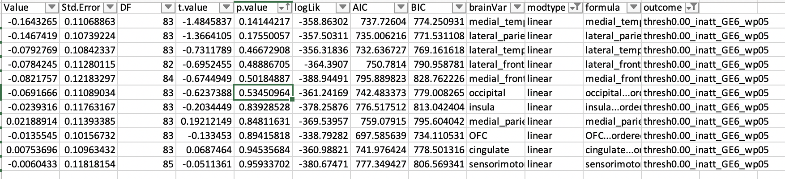

# 2020-01-31 12:15:44

I'll take the same approach used in 072, but I'll use the pre-defined regions
Philip established by hand.

```r
setwd('~/data/baseline_prediction/prs_start/')
clin_long = read.csv('long_clin_01062020_lt16.csv')
clin_long$SX_total = clin_long$SX_inatt + clin_long$SX_hi

winsorize = function(x, cut = 0.01){
  cut_point_top <- quantile(x, 1 - cut, na.rm = T)
  cut_point_bottom <- quantile(x, cut, na.rm = T)
  i = which(x >= cut_point_top) 
  x[i] = cut_point_top
  j = which(x <= cut_point_bottom) 
  x[j] = cut_point_bottom
  return(x)
}

df = data.frame(MRN=unique(clin_long$MRN))
for (r in 1:nrow(df)) {
    subj_data = clin_long[clin_long$MRN==df$MRN[r], ]
    for (sx in c('inatt', 'hi', 'total')) {
        fit = lm(as.formula(sprintf('SX_%s ~ age', sx)), data=subj_data)
        df[r, sprintf('slope_%s', sx)] = fit$coefficients['age']
        base_row = which.min(subj_data$age)
        df[r, sprintf('base_%s', sx)] = subj_data[base_row, sprintf('SX_%s', sx)]
        last_row = which.max(subj_data$age)
        df[r, sprintf('last_%s', sx)] = subj_data[last_row, sprintf('SX_%s', sx)]
        df[r, 'base_age'] = subj_data[base_row, 'age']
        df[r, 'last_age'] = subj_data[last_row, 'age']
        df[r, 'sex'] = subj_data[last_row, 'sex']
    }
}
for (min_sx in c(0, 3, 4, 6)) {
    idx = df$base_inatt>=min_sx | df$base_hi>=min_sx
    for (sx in c('inatt', 'hi', 'total')) {
        df[, sprintf('slope_%s_GE%d_wp05', sx, min_sx)] = NA
        junk = winsorize(df[idx, sprintf('slope_%s', sx)], cut=.05)
        df[idx, sprintf('slope_%s_GE%d_wp05', sx, min_sx)] = junk
    }
}

demo = read.csv('prs_demo.csv')
# just to get FAMID, sex already there
df = merge(df, subset(demo, select=-sex), by='MRN')

# selecting best kid in family
df$bestInFamily = F
nvisits = table(clin_long$MRN)
df = merge(df, as.matrix(nvisits),
                 by.x='MRN', by.y=0)
colnames(df)[ncol(df)] = 'nvisits'
for (f in unique(df$FAMID)) {
    fam_rows = which(df$FAMID == f)
    fam_data = df[fam_rows,]
    if (nrow(fam_data) == 1) {
        df[fam_rows,]$bestInFamily = T
    } else {
        stotal = sort(fam_data$slope_total, index.return=T, decreasing=T)
        # if there's a tie
        if (stotal$x[1] == stotal$x[2]) {
            # print(sprintf('Tie in slope for %d', f))
            svisits = sort(fam_data$nvisits, index.return=T, decreasing=T)
            if (svisits$x[1] == svisits$x[2]) {
                print(sprintf('Tie in number of visits for %d', f))
                print(fam_data[fam_data$nvisits==svisits$x[1], ]$MRN)
            } else {
                df[fam_rows[svisits$ix[1]], ]$bestInFamily = T
            }
        } else {
            df[fam_rows[stotal$ix[1]], ]$bestInFamily = T
        }
    }
}

df[df$MRN==4585574, ]$bestInFamily = T
df[df$MRN==4925051, ]$bestInFamily = T
df[df$MRN==7079035, ]$bestInFamily = T
df[df$MRN==7378993, ]$bestInFamily = T
# chosen because of overall best MPRAGE QC
df[df$MRN==4640378, ]$bestInFamily = T
# chosen because of overall best MPRAGE QC
df[df$MRN==7218965, ]$bestInFamily = T
```

At this point we have just the df of everyone with prs (393 subjects), and the
selections for best in family. Now, let's merge in the anatomical data.

```r
qc = read.csv('~/data/baseline_prediction/prs_start/prs_and_mprage_qc.csv')
brain_meta = merge(df, qc, by='MRN', all.x=F, all.y=F)

# out of the 1849 scans scored, 1400 are in our prs set

# restrict based on QC
qc_vars = c("mprage_score", "ext_avg", "int_avg")
brain_meta = brain_meta[brain_meta$"age_at_scan" < 18, ]
na_scores_idx = is.na(brain_meta$mprage_score) | is.na(brain_meta$ext_avg) |
                is.na(brain_meta$int_avg)
brain_meta = brain_meta[!na_scores_idx, ]
# down to 1290 after removing adults and anyone without a score

qtile=.95
library(solitude)
iso <- isolationForest$new()
iso$fit(brain_meta[, qc_vars])
scores_if = as.matrix(iso$scores)[,3]
library(dbscan)
# here I set the number of neighbors to a percentage of the total data
scores_lof = lof(brain_meta[, qc_vars], k = round(.5 * nrow(brain_meta)))
thresh_lof = quantile(scores_lof, qtile)
thresh_if = quantile(scores_if, qtile)
idx = scores_lof < thresh_lof & scores_if < thresh_if

# 1198 after OD on qc_vars
all_brain_data = read.table('~/data/baseline_prediction/merged_rois.txt', header=T)
x = duplicated(all_brain_data$lh.aparc.area)
brain_data = merge(brain_meta[idx,], all_brain_data[!x, ], by.x='maskid',
                   by.y='lh.aparc.area', all.x=F, all.y=F)
```

Now we need to start massaging, which will affect future OD QC:

```r
rois = read.csv('~/data/baseline_prediction/REGIONAL_ANALYSES_FREESURFER.csv')
# brain_vars = colnames(brain_data)[grepl(colnames(brain_data), pattern="_thickness$")]
# brain_vars = colnames(brain_data)[grepl(colnames(brain_data), pattern="_area$")]
# brain_vars = c(colnames(brain_data)[grepl(colnames(brain_data), pattern="_volume$")],
#                colnames(brain_data)[c(256:287, 295:321)])
brain_vars = colnames(brain_data)[grepl(colnames(brain_data), pattern="_volume$")]
# part = 'subloar'
part = 'lobar'
# part = 'ROI_theory_driven'
new_brain_vars = c()
for (roi in unique(rois[, part])) {
    labels = rois[which(rois[, part]==roi), 'region']
    to_avg = c()
    for (l in labels) {
        to_avg = c(to_avg,
                   brain_vars[grepl(brain_vars, pattern=sprintf("^%s", l))])
    }
    # only use variable if it's selected initially and defined
    if (length(to_avg) > 0 && sum(is.na(brain_data[, to_avg])) == 0 &&
        nchar(roi) > 0) {
        if (length(to_avg) == 1) {
            brain_data[, roi] = brain_data[, to_avg]
        } else {
            brain_data[, roi] = rowMeans(brain_data[, to_avg])
        }
        new_brain_vars = c(new_brain_vars, roi)
    }
}
brain_vars = new_brain_vars
```

Time to continue cleaning the data, and run the models:

```r
iso <- isolationForest$new()
iso$fit(brain_data[, brain_vars])
scores_if = as.matrix(iso$scores)[,3]
scores_lof = lof(brain_data[, brain_vars], k = round(.5 * nrow(brain_data)))

thresh_lof = quantile(scores_lof, qtile)
thresh_if = quantile(scores_if, qtile)
idx = scores_lof < thresh_lof & scores_if < thresh_if

clean_brain_data = brain_data[idx, ]

keep_me = c()
for (s in unique(clean_brain_data$MRN)) {
    subj_rows = which(clean_brain_data$MRN == s)
    subj_data = clean_brain_data[subj_rows, ]
    min_subj_row = which.min(subj_data$age_at_scan)
    if (abs(subj_data[min_subj_row, 'base_age'] -
            subj_data[min_subj_row, 'age_at_scan'])<1) {
        keep_me = c(keep_me, subj_rows[min_subj_row])
    }
}
data = clean_brain_data[keep_me, ]
```

Let's run our linear model and see what we get:

```r
library(nlme)
library(MASS)

hold = c()
covars = c(qc_vars, 'age_at_scan')
out_fname = '~/data/baseline_prediction/prs_start/univar_lobarCorticalVolume_4groupOrdered_stepAIClme.csv'
for (sx in c('inatt', 'hi')) {
    min_sx = 6
    if (sx == 'inatt') {
        thresh = 0
    } else if (sx == 'hi') {
        thresh = -.5
    }
    phen_slope = sprintf('slope_%s_GE%d_wp05', sx, min_sx)
    phen = sprintf('thresh%.2f_%s_GE%d_wp05', abs(thresh), sx, min_sx)
    data[, phen] = 'notGE6adhd'
    my_nvs = which(is.na(data[, phen_slope]))
    idx = data[my_nvs, 'base_inatt'] <= 2 & data[my_nvs, 'base_hi'] <= 2
    data[my_nvs[idx], phen] = 'nv012'
    data[which(data[, phen_slope] < thresh), phen] = 'imp'
    data[which(data[, phen_slope] >= thresh), phen] = 'nonimp'
    data[, phen] = factor(data[, phen], ordered=F)
    data[, phen] = relevel(data[, phen], ref='nv012')
    use_me = T

    this_data = data[use_me, c(phen, 'FAMID', brain_vars, covars)]
    this_data[, 3:ncol(this_data)] = scale(this_data[, 3:ncol(this_data)])
    this_data$sex = data[use_me, 'sex']
    tmp_covars = c(covars, 'sex')
    this_data$ordered = factor(this_data[, phen],
                           levels=c('nv012', 'notGE6adhd', 'imp', 'nonimp'),
                           ordered=T)
    phen_res = c()
    for (bv in brain_vars) {
        fm_str = paste(bv, " ~ ordered +",
                           paste(tmp_covars, collapse='+'),
                           sep="")
        fit = try(lme(as.formula(fm_str), ~1|FAMID, data=this_data, method='ML'))
        if (length(fit)>1) {
            step=try(stepAIC(fit, direction='both', trace=F,
                        scope = list(lower = ~ ordered)))
            if (length(step) > 1) {
                temp = c(summary(step)$tTable['ordered.L', ],
                            summary(step)$logLik, summary(step)$AIC, summary(step)$BIC,
                            bv, 'linear')
                phen_res = rbind(phen_res, temp)
                rownames(phen_res)[nrow(phen_res)] = fm_str
                temp = c(summary(step)$tTable['ordered.Q', ],
                            summary(step)$logLik, summary(step)$AIC, summary(step)$BIC,
                            bv, 'quadratic')
                phen_res = rbind(phen_res, temp)
                rownames(phen_res)[nrow(phen_res)] = fm_str
                temp = c(summary(step)$tTable['ordered.C', ],
                            summary(step)$logLik, summary(step)$AIC, summary(step)$BIC,
                            bv, 'cubic')
                phen_res = rbind(phen_res, temp)
                rownames(phen_res)[nrow(phen_res)] = fm_str
            } else {
                # fit worked but broke stepping
                temp = c(summary(fit)$tTable['ordered.L', ],
                            summary(fit)$logLik, summary(fit)$AIC, summary(fit)$BIC,
                            bv, 'linear')
                phen_res = rbind(phen_res, temp)
                rownames(phen_res)[nrow(phen_res)] = fm_str
                temp = c(summary(fit)$tTable['ordered.Q', ],
                            summary(fit)$logLik, summary(fit)$AIC, summary(fit)$BIC,
                            bv, 'quadratic')
                phen_res = rbind(phen_res, temp)
                rownames(phen_res)[nrow(phen_res)] = fm_str
                temp = c(summary(fit)$tTable['ordered.C', ],
                            summary(fit)$logLik, summary(fit)$AIC, summary(fit)$BIC,
                            bv, 'cubic')
                phen_res = rbind(phen_res, temp)
                rownames(phen_res)[nrow(phen_res)] = fm_str
            }
        } else {
            # fit broke
            temp = rep(NA, 10)
            phen_res = rbind(phen_res, temp)
            rownames(phen_res)[nrow(phen_res)] = fm_str
        }
    }
    phen_res = data.frame(phen_res)
    phen_res$formula = rownames(phen_res)
    phen_res$outcome = phen
    hold = rbind(hold, phen_res)
}
colnames(hold)[6:10] = c('logLik', 'AIC', 'BIC', 'brainVar', 'modtype')
write.csv(hold, file=out_fname, row.names=F)
```

## thickness


There's certainly something there. And it's nice that it's OFC and cingulate.
Let's see if we have better chances of survival in other partitions.


Things also look promising in the theory-driven partitioning. 


Not as clear in the sublobaer partition, but at least it's pointing in the right
directions.

## area


Area didn't do well, even in the lobar partitioning.


Also disappointing in sublobar.


Reinforcing its saga of being useless, nothing good in the theory driven
collapsing either...

## volume

This is where the high hopes live, based on the results using the original
Freesurfer parcellation.


These results were quite surprising...


Hum, I wonder if there is anything to do with the subcortical measures? I can
try running only cortical volume?


## cortical only volume




... it's all crap. Oh well, at least we have some results with thickness. I do
wonder if things would survive if I did a FDR across all predictors. But let's
do the clinical stuff first.


# TODO
* Can we do QC using mriqc parameters?