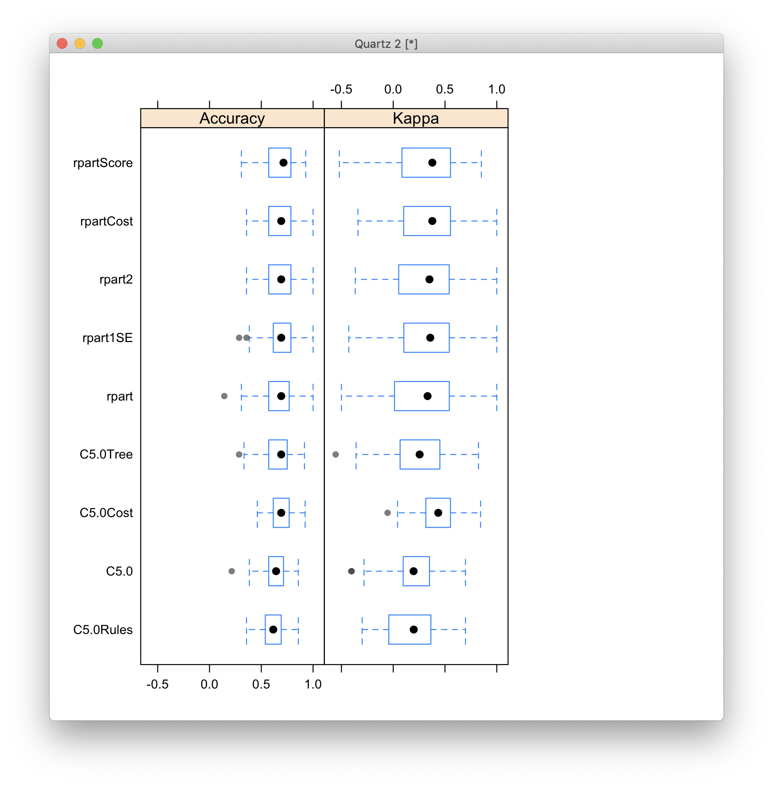

# 2020-02-05 14:33:09

Let's give it another try for ML in baseline prediction. Now that I have a set
of data I'm working with (see 076), it should be easier to find a nicer model.

I'll try not to residualize or impute anything. At least not at first.

```r
data = readRDS('~/data/baseline_prediction/prs_start/complete_massaged_data_02032020.rds')
data$externalizing = as.factor(data$externalizing)
min_sx = 6
for (sx in c('inatt', 'hi')) {
    if (sx == 'inatt') {
        thresh = 0
    } else if (sx == 'hi') {
        thresh = -.5
    }
    phen_slope = sprintf('slope_%s_GE%d_wp05', sx, min_sx)
    phen = sprintf('thresh%.2f_%s_GE%d_wp05', abs(thresh), sx, min_sx)
    data[, phen] = 'notGE6adhd'
    my_nvs = which(is.na(data[, phen_slope]))
    idx = data[my_nvs, 'base_inatt'] <= 2 & data[my_nvs, 'base_hi'] <= 2
    data[my_nvs[idx], phen] = 'nv012'
    data[which(data[, phen_slope] < thresh), phen] = 'imp'
    data[which(data[, phen_slope] >= thresh), phen] = 'nonimp'
    data[, phen] = factor(data[, phen], ordered=F)
    data[, phen] = relevel(data[, phen], ref='nv012')
    ophen = sprintf('ORDthresh%.2f_%s_GE%d_wp05', abs(thresh), sx, min_sx)
    data[, ophen] = factor(data[, phen],
                         levels=c('nv012', 'notGE6adhd', 'imp', 'nonimp'),
                         ordered=T)
}
```

Just for kicks I'll start with the clinical group first. If anything, it'll take
less time to train:

```r
phen = 'thresh0.00_inatt_GE6_wp05' # NVs don't change across SX
adhd = data[, phen] == 'nonimp' | data[, phen] == 'imp'
data2 = data[adhd, ]
data2[, phen] = factor(data2[, phen], ordered=F)
data2[, phen] = relevel(data2[, phen], ref='imp')
training = data2[data2$bestInFamily, ]
testing = data2[!data2$bestInFamily, ]
```

```r
set.seed(42)
fitControl <- trainControl(## 10-fold CV
                           method = "repeatedcv",
                           number = 10,
                           ## repeated ten times
                           repeats = 10,
                           classProbs=T)

var_names = colnames(data)[grepl(colnames(data), pattern='ADHD')]
svmFit <- train(x = training[, var_names], y=training[, phen], 
                 method = "svmRadial", 
                 trControl = fitControl, 
                 preProc = c("center", "scale"),
                 tuneLength = 8,
                 metric = "ROC")
rdaFit <- train(x = training[, var_names], y=training[, phen], 
                 method = "rda", 
                 trControl = fitControl, 
                 preProc = c("center", "scale"),
                 tuneLength = 8,
                 metric = "ROC")
gmbFit <- train(x = training[, var_names], y=training[, phen], 
                 method = "gbm", 
                 trControl = fitControl, 
                 preProc = c("center", "scale"),
                 tuneLength = 8,
                 metric = "ROC")
resamps <- resamples(list(GBM = gmbFit,
                          SVM = svmFit,
                          RDA = rdaFit))
summary(resamps)

theme1 <- trellis.par.get()
theme1$plot.symbol$col = rgb(.2, .2, .2, .4)
theme1$plot.symbol$pch = 16
theme1$plot.line$col = rgb(1, 0, 0, .7)
theme1$plot.line$lwd <- 2
trellis.par.set(theme1)
bwplot(resamps, layout = c(3, 1))

trellis.par.set(caretTheme())
dotplot(resamps, metric = "Accuracy")
```

# 2020-02-06 09:09:41

OK, so let's play with methods that can handle NAs, which is one of the main
reasons to do this anyways:

```r
library(caret)

my_cols = c(38:49, 86:123, 125, 128:138)
phen = 'thresh0.00_inatt_GE6_wp05'
var_names = c(colnames(data)[my_cols], 'base_age', 'sex', 'base_inatt')
phen = 'thresh0.50_hi_GE6_wp05'
var_names = c(colnames(data)[my_cols], 'base_age', 'sex', 'base_hi')
models = c('AdaBoost.M1', 'AdaBag', 'ada', 'C5.0', 'rpart', 'rpart1SE',
           'rpart2', 'rpartScore', 'C5.0Cost', 'rpartCost', 'C5.0Rules',
           'C5.0Tree')
models = c('C5.0', 'rpart', 'rpart1SE',
           'rpart2', 'rpartScore', 'C5.0Cost', 'rpartCost', 'C5.0Rules',
           'C5.0Tree')

adhd = data[, phen] == 'nonimp' | data[, phen] == 'imp'
data2 = data[adhd, ]
data2[, phen] = factor(data2[, phen], ordered=F)
data2[, phen] = relevel(data2[, phen], ref='imp')
training = data2[data2$bestInFamily, ]
testing = data2[!data2$bestInFamily, ]
set.seed(42)
fitControl <- trainControl(method = "repeatedcv",
                           number = 10,
                           repeats = 10,
                           classProbs=T)
for (m in models) {
    print(m)
    model_str = sprintf('fit_%s <- train(x = training[, var_names],
                                         y=training[, phen],
                                         method = "%s",
                                         trControl = fitControl,
                                         tuneLength = 10,
                                         metric = "AUC")', m, m)
    eval(parse(text=model_str))
}
```

Note that it might be better to train within-modality classifiers first just so
we can deal with the covariates properly, instead of using PC covariates with
brain predictors, for example. If we go that route, then we'd have to use
stacked/voting classifiers on top of everything, especially one that takes into
consideration NAs.

# 2020-02-07 10:43:25

AdaBoost and AdaBag took a whole night and still weren't finished. I'll not play
with those for now, until I can actually optimize them.

```r
fits_str = sapply(models, function(m) sprintf('%s = fit_%s', m, m))
rs_str = paste('resamps <- resamples(list(',
               paste(fits_str, collapse=','),
               '))', sep="")
eval(parse(text=rs_str))
summary(resamps)

theme1 <- trellis.par.get()
theme1$plot.symbol$col = rgb(.2, .2, .2, .4)
theme1$plot.symbol$pch = 16
theme1$plot.line$col = rgb(1, 0, 0, .7)
theme1$plot.line$lwd <- 2
trellis.par.set(theme1)
bwplot(resamps, layout = c(3, 1))
```



The results haven't been overwhelming. But I think it's a better approach to do
a per-domain classifier first, and then promote those classifiers later. So, the
approach will be:

 * split data into train and test
 * within train, remove any entries with NAs and try the best possible
   classifier there. Make sure that when predicting new data is is NAs, we get
   NA probabilities. 
* train a classifier on top of those that combines the probabilities of the
  different modalities. Maybe weighted average, or even anoter stack.
* use the test data

A few questions arise, such as whether we should do it only for the ADHDs, or do
the 4 group classification. Let's do 4 groups for now, but it shouldn't be too
hard to change everything for binary later.

I'm going to do this with randomforests for now because they're quick, but we
could potentially have different classifiers per domain? Maybe not, too hard to
explain why we did it that way. But at least try other models across domains to
see what we get.

```r
phen = 'thresh0.00_inatt_GE6_wp05'
# phen = 'thresh0.50_hi_GE6_wp05'
model = 'rf'
sx = 'inatt'
adhd = data[, phen] == 'nonimp' | data[, phen] == 'imp'
data2 = data[adhd, ]
data2[, phen] = factor(data2[, phen], ordered=F)
data2[, phen] = relevel(data2[, phen], ref='imp')
training = data2[data2$bestInFamily, ]
testing = data2[!data2$bestInFamily, ]

set.seed(42)
fitControl <- trainControl(method = "repeatedcv",
                           number = 10,
                           repeats = 10,
                           classProbs=T,
                           summaryFunction=twoClassSummary
                           )

# dti
var_names = colnames(data)[107:121]
keep_me = !is.na(training[var_names[1]])
this_data = training[keep_me, ]
dti_fit <- train(x = this_data[, var_names], y=this_data[, phen],
                 method = model, trControl = fitControl, tuneLength = 10,
                 metric='ROC')
dti_preds = data.frame(imp=rep(NA, nrow(training)), nonimp=rep(NA, nrow(training)))
preds = predict(dti_fit, type='prob')
dti_preds[keep_me, ] = preds

# anat
var_names = colnames(data)[96:106]
keep_me = !is.na(training[var_names[1]])
this_data = training[keep_me, ]
anat_fit <- train(x = this_data[, var_names], y=this_data[, phen],
                 method = model, trControl = fitControl, tuneLength = 10,
                 metric='ROC')
anat_preds = data.frame(imp=rep(NA, nrow(training)), nonimp=rep(NA, nrow(training)))
preds = predict(anat_fit, type='prob')
anat_preds[keep_me, ] = preds

# genomics
var_names = c(colnames(data)[38:49], colnames(data)[86:95])
keep_me = !is.na(training[var_names[1]])
this_data = training[keep_me, ]
dna_fit <- train(x = this_data[, var_names], y=this_data[, phen],
                 method = model, trControl = fitControl, tuneLength = 10,
                 metric='ROC')
dna_preds = data.frame(imp=rep(NA, nrow(training)), nonimp=rep(NA, nrow(training)))
preds = predict(dna_fit, type='prob')
dna_preds[keep_me, ] = preds

# neuropsych
var_names = c('FSIQ', "VMI.beery", "DS.wisc", "SSB.wisc", "SSF.wisc", "DS.wj",
              "VM.wj")
# I'll impute within neuropsych, so I don't have to train a classifier for each test
this_data = training[, var_names]
numNAvars = rowSums(is.na(this_data))
# but first remove anyone that only has one or no neuropsych
keep_me = numNAvars < 5
this_data = this_data[keep_me, ]
impute = preProcess(this_data, method = "bagImpute")
this_data <- predict(impute, this_data)
neuro_fit <- train(x = this_data[, var_names], y=training[keep_me, phen],
                 method = model, trControl = fitControl, tuneLength = 10,
                 metric='ROC')
neuro_preds = data.frame(imp=rep(NA, nrow(training)), nonimp=rep(NA, nrow(training)))
preds = predict(neuro_fit, type='prob')
neuro_preds[keep_me, ] = preds

# demo
var_names = c('base_age', 'sex', 'SES')
keep_me = !is.na(training[var_names[1]])
this_data = training[keep_me, ]
demo_fit <- train(x = this_data[, var_names], y=this_data[, phen],
                 method = model, trControl = fitControl, tuneLength = 10,
                 metric='ROC')
demo_preds = data.frame(imp=rep(NA, nrow(training)), nonimp=rep(NA, nrow(training)))
preds = predict(demo_fit, type='prob')
demo_preds[keep_me, ] = preds

# clinics
var_names = c('internalizing', 'externalizing', sprintf('base_%s', sx))
keep_me = !is.na(training[var_names[1]])
this_data = training[keep_me, ]
clin_fit <- train(x = this_data[, var_names], y=this_data[, phen],
                 method = model, trControl = fitControl, tuneLength = 10,
                 metric='ROC')
clin_preds = data.frame(imp=rep(NA, nrow(training)), nonimp=rep(NA, nrow(training)))
preds = predict(clin_fit, type='prob')
clin_preds[keep_me, ] = preds

# demo
var_names = c('base_age')
keep_me = !is.na(training[var_names[1]])
this_data = training[keep_me, ]
demo_fit <- train(x = this_data[, var_names], y=this_data[, phen],
                 method = model, trControl = fitControl, tuneLength = 10,
                 metric='ROC')
demo_preds = data.frame(imp=rep(NA, nrow(training)), nonimp=rep(NA, nrow(training)))
preds = predict(demo_fit, type='prob')
demo_preds[keep_me, ] = preds

# ensemble
prob_data = cbind(dti_preds[, 1], anat_preds[, 1], dna_preds[, 1],
                  neuro_preds[, 1], demo_preds[, 1], clin_preds[, 1])
colnames(prob_data) = c('dti', 'anat', 'dna', 'neuro', 'demo', 'clin')
ens_fit <- train(x = prob_data, y=training[, phen],
                 method = 'rpart2', trControl = fitControl, tuneLength = 10,
                 metric='ROC')
```

Now that I have an ensemble classifier, let's see how well it does on the test
data:

```r
for (dom in colnames(prob_data)) {
    print(dom)
    eval(parse(text=sprintf('keep_me = !is.na(testing[, colnames(%s_fit$trainingData)[1]])', dom)))
    this_data = testing[keep_me, ]
    eval(parse(text=sprintf('%s_test_preds = data.frame(imp=rep(NA, nrow(testing)), nonimp=rep(NA, nrow(testing)))', dom)))
    eval(parse(text=sprintf('preds = predict(%s_fit, type="prob", newdata=this_data)', dom)))
    eval(parse(text=sprintf('%s_test_preds[keep_me, ] = preds', dom)))
}
```

That almost worked, but neuropsych is still breaking. Also, I don't want to just
impute that one. Let's then modularize this to break up neuropsych...

```r
phen = 'thresh0.00_inatt_GE6_wp05'
# phen = 'thresh0.50_hi_GE6_wp05'
model = 'rf'
sx = 'inatt'
adhd = data[, phen] == 'nonimp' | data[, phen] == 'imp'
data2 = data[adhd, ]
data2[, phen] = factor(data2[, phen], ordered=F)
data2[, phen] = relevel(data2[, phen], ref='imp')
training = data2[data2$bestInFamily, ]
testing = data2[!data2$bestInFamily, ]

set.seed(42)
fitControl <- trainControl(method = "repeatedcv",
                           number = 10,
                           repeats = 10,
                           classProbs=T,
                           summaryFunction=twoClassSummary
                           )

domains = list(iq_vmi = c('FSIQ', "VMI.beery"),
               wisc = c("SSB.wisc", "SSF.wisc", 'DSF.wisc', 'DSB.wisc'),
               wj = c("DS.wj", "VM.wj"),
               demo = c('base_age', 'sex', 'SES'),
               clin = c('internalizing', 'externalizing', sprintf('base_%s', sx)),
               gen = c(colnames(data)[38:49], colnames(data)[86:95]),
               dti = colnames(data)[107:121],
               anat = colnames(data)[96:106]
               )

for (dom in names(domains)) {
    print(sprintf('Training %s on %s (sx=%s)', dom, phen, sx))
    var_names = domains[[dom]]
    numNAvars = rowSums(is.na(training[, var_names]))
    keep_me = numNAvars == 0
    this_data = training[keep_me, ]
    eval(parse(text=sprintf('%s_fit <- train(x = this_data[, var_names],
                                             y=this_data[, phen],
                                             method = model,
                                             trControl = fitControl,
                                             tuneLength = 10, metric="ROC")',
                            dom)))
    eval(parse(text=sprintf('%s_preds = data.frame(imp=rep(NA, nrow(training)),
                                                   nonimp=rep(NA, nrow(training)))',
                            dom)))
    eval(parse(text=sprintf('preds = predict(%s_fit, type="prob")', dom)))
    eval(parse(text=sprintf('%s_preds[keep_me, ] = preds', dom)))
}
# ensemble
preds_str = sapply(names(domains), function(d) sprintf('%s_preds[, 1]', d))
cbind_str = paste('prob_data = cbind(', paste(preds_str, collapse=','), ')',
                  sep="")
eval(parse(text=cbind_str))
colnames(prob_data) = names(domains)
ens_fit <- train(x = prob_data, y=training[, phen],
                 method = 'rpart2', trControl = fitControl, tuneLength = 10,
                 metric='ROC')
```

Now we can do the testing again:

```r
library(pROC)
for (dom in names(domains)) {
    print(dom)
    eval(parse(text=sprintf('var_names = colnames(%s_fit$trainingData)', dom)))
    # ignore .outcome
    numNAvars = rowSums(is.na(testing[, var_names[1:(length(var_names)-1)]]))
    keep_me = numNAvars == 0
    this_data = testing[keep_me, ]
    eval(parse(text=sprintf('%s_test_preds = data.frame(imp=rep(NA, nrow(testing)), nonimp=rep(NA, nrow(testing)))', dom)))
    eval(parse(text=sprintf('preds = predict(%s_fit, type="prob", newdata=this_data)', dom)))
    eval(parse(text=sprintf('%s_test_preds[keep_me, ] = preds', dom)))
}
preds_str = sapply(names(domains), function(d) sprintf('%s_test_preds[, 1]', d))
cbind_str = paste('prob_test_data = cbind(', paste(preds_str, collapse=','), ')',
                  sep="")
eval(parse(text=cbind_str))
colnames(prob_test_data) = names(domains)
preds = predict(ens_fit, newdata=prob_test_data)
confusionMatrix(data = preds, reference = testing[, phen])
```

Before we start tuning this so we're not overfitting the training set, let's
play with the entire dataset to integrate all 4 groups:

```r
phen = 'thresh0.00_inatt_GE6_wp05'
# phen = 'thresh0.50_hi_GE6_wp05'
model = 'rf'
sx = 'inatt'
training = data[data$bestInFamily, ]
testing = data[!data$bestInFamily, ]

set.seed(42)
fitControl <- trainControl(method = "repeatedcv",
                           number = 10,
                           repeats = 10,
                           classProbs=T,
                           summaryFunction=multiClassSummary
                           )

domains = list(iq_vmi = c('FSIQ', "VMI.beery"),
               wisc = c("SSB.wisc", "SSF.wisc", 'DSF.wisc', 'DSB.wisc'),
               wj = c("DS.wj", "VM.wj"),
               demo = c('base_age', 'sex', 'SES'),
               clin = c('internalizing', 'externalizing', sprintf('base_%s', sx)),
               gen = c(colnames(data)[38:49], colnames(data)[86:95]),
               dti = colnames(data)[107:121],
               anat = colnames(data)[96:106]
               )

for (dom in names(domains)) {
    print(sprintf('Training %s on %s (sx=%s)', dom, phen, sx))
    var_names = domains[[dom]]
    numNAvars = rowSums(is.na(training[, var_names]))
    keep_me = numNAvars == 0
    this_data = training[keep_me, ]
    eval(parse(text=sprintf('%s_fit <- train(x = this_data[, var_names],
                                             y=this_data[, phen],
                                             method = model,
                                             trControl = fitControl,
                                             tuneLength = 10, metric="AUC")',
                            dom)))
    eval(parse(text=sprintf('%s_preds = data.frame(nv012=rep(NA, nrow(training)),
                                                   imp=rep(NA, nrow(training)),
                                                   nonimp=rep(NA, nrow(training)),
                                                   notGE6adhd=rep(NA, nrow(training)))',
                            dom)))
    eval(parse(text=sprintf('preds = predict(%s_fit, type="prob")', dom)))
    eval(parse(text=sprintf('%s_preds[keep_me, ] = preds', dom)))
}
# ensemble
preds_str = sapply(names(domains), function(d) sprintf('%s_preds', d))
cbind_str = paste('prob_data = cbind(', paste(preds_str, collapse=','), ')',
                  sep="")
eval(parse(text=cbind_str))
prob_header = c()
for (dom in names(domains)) {
    for (g in colnames(preds)) {
        prob_header = c(prob_header, sprintf('%s_%s', dom, g))
    }
}
colnames(prob_data) = prob_header
ens_fit <- train(x = prob_data, y=training[, phen],
                 method = 'rpart2', trControl = fitControl, tuneLength = 10,
                 metric='AUC')
```

Then we modify the code for testing as well to take into account all 4 groups:

```r
for (dom in names(domains)) {
    print(dom)
    eval(parse(text=sprintf('var_names = colnames(%s_fit$trainingData)', dom)))
    # ignore .outcome
    numNAvars = rowSums(is.na(testing[, var_names[1:(length(var_names)-1)]]))
    keep_me = numNAvars == 0
    this_data = testing[keep_me, ]
    eval(parse(text=sprintf('%s_test_preds = data.frame(nv012=rep(NA, nrow(testing)),
                                                   imp=rep(NA, nrow(testing)),
                                                   nonimp=rep(NA, nrow(testing)),
                                                   notGE6adhd=rep(NA, nrow(testing)))', dom)))
    eval(parse(text=sprintf('preds = predict(%s_fit, type="prob", newdata=this_data)', dom)))
    eval(parse(text=sprintf('%s_test_preds[keep_me, ] = preds', dom)))
}
preds_str = sapply(names(domains), function(d) sprintf('%s_test_preds', d))
cbind_str = paste('prob_test_data = cbind(', paste(preds_str, collapse=','), ')',
                  sep="")
eval(parse(text=cbind_str))
colnames(prob_test_data) = prob_header
preds = predict(ens_fit, newdata=prob_test_data, type='prob')
multiclass.roc(testing[, phen], preds)
```

OK, so this code is now working. I can certainly play with kinds of metrics I'll
be evaluating, such as AUC or other, but at least training and predictions are
happening. Now, it's just a matter of tunning it.

## tunning the 4 group model

```r
library(caret)
library(pROC)
data = readRDS('~/data/baseline_prediction/prs_start/complete_massaged_data_02032020.rds')
data$externalizing = as.factor(data$externalizing)
phen = 'thresh0.00_inatt_GE6_wp05'
# phen = 'thresh0.50_hi_GE6_wp05'
model = 'lda'
sx = 'inatt'

min_sx = 6
for (sx in c('inatt', 'hi')) {
    if (sx == 'inatt') {
        thresh = 0
    } else if (sx == 'hi') {
        thresh = -.5
    }
    phen_slope = sprintf('slope_%s_GE%d_wp05', sx, min_sx)
    phen = sprintf('thresh%.2f_%s_GE%d_wp05', abs(thresh), sx, min_sx)
    data[, phen] = 'notGE6adhd'
    my_nvs = which(is.na(data[, phen_slope]))
    idx = data[my_nvs, 'base_inatt'] <= 2 & data[my_nvs, 'base_hi'] <= 2
    data[my_nvs[idx], phen] = 'nv012'
    data[which(data[, phen_slope] < thresh), phen] = 'imp'
    data[which(data[, phen_slope] >= thresh), phen] = 'nonimp'
    data[, phen] = factor(data[, phen], ordered=F)
    data[, phen] = relevel(data[, phen], ref='nv012')
    ophen = sprintf('ORDthresh%.2f_%s_GE%d_wp05', abs(thresh), sx, min_sx)
    data[, ophen] = factor(data[, phen],
                         levels=c('nv012', 'notGE6adhd', 'imp', 'nonimp'),
                         ordered=T)
}
domains = list(iq_vmi = c('FSIQ', "VMI.beery"),
               wisc = c("SSB.wisc", "SSF.wisc", 'DSF.wisc', 'DSB.wisc'),
               wj = c("DS.wj", "VM.wj"),
               demo = c('base_age', 'sex', 'SES'),
               clin = c('internalizing', 'externalizing', sprintf('base_%s', sx)),
               gen = c(colnames(data)[38:49], colnames(data)[86:95]),
               dti = colnames(data)[107:121],
               anat = colnames(data)[96:106]
               )
set.seed(42)
fitControl <- trainControl(method = "repeatedcv",
                           number = 10,
                           repeats = 10,
                           classProbs=T,
                           summaryFunction=multiClassSummary
                           )
training = data[data$bestInFamily, ]
testing = data[!data$bestInFamily, ]
for (dom in names(domains)) {
    print(sprintf('Training %s on %s (sx=%s, model=%s)', dom, phen, sx, model))
    var_names = domains[[dom]]
    numNAvars = rowSums(is.na(training[, var_names]))
    keep_me = numNAvars == 0
    this_data = training[keep_me, var_names]
    scale_me = c()
    for (v in colnames(this_data)) {
        if (!is.factor(this_data[, v])) {
            scale_me = c(scale_me, v)
        } else {
            this_data[, v] = as.numeric(this_data[, v])
        }
    }
    this_data[, scale_me] = scale(this_data[, scale_me])
    eval(parse(text=sprintf('%s_fit <- train(x = this_data,
                                             y=training[keep_me, phen],
                                             method = model,
                                             trControl = fitControl,
                                             tuneLength = 10, metric="AUC")',
                            dom)))
    eval(parse(text=sprintf('%s_preds = data.frame(nv012=rep(NA, nrow(training)),
                                                   imp=rep(NA, nrow(training)),
                                                   nonimp=rep(NA, nrow(training)),
                                                   notGE6adhd=rep(NA, nrow(training)))',
                            dom)))
    eval(parse(text=sprintf('preds = predict(%s_fit, type="prob")', dom)))
    eval(parse(text=sprintf('%s_preds[keep_me, ] = preds', dom)))
}
# ensemble
preds_str = sapply(names(domains), function(d) sprintf('%s_preds', d))
cbind_str = paste('prob_data = cbind(', paste(preds_str, collapse=','), ')',
                  sep="")
eval(parse(text=cbind_str))
prob_header = c()
for (dom in names(domains)) {
    for (g in colnames(preds)) {
        prob_header = c(prob_header, sprintf('%s_%s', dom, g))
    }
}
colnames(prob_data) = prob_header
ens_fit <- train(x = prob_data, y=training[, phen],
                 method = 'rpart2', trControl = fitControl, tuneLength = 10,
                 metric='AUC')
print(ens_fit)
```

And let's see how we do in test data:

```r
for (dom in names(domains)) {
    print(dom)
    eval(parse(text=sprintf('var_names = colnames(%s_fit$trainingData)', dom)))
    # remove .outcome
    var_names = var_names[1:(length(var_names)-1)]
    numNAvars = rowSums(is.na(testing[, var_names]))
    keep_me = numNAvars == 0
    this_data = testing[keep_me, var_names]
    scale_me = c()
    for (v in colnames(this_data)) {
        if (!is.factor(this_data[, v])) {
            scale_me = c(scale_me, v)
        } else {
            this_data[, v] = as.numeric(this_data[, v])
        }
    }
    this_data[, scale_me] = scale(this_data[, scale_me])
    eval(parse(text=sprintf('%s_test_preds = data.frame(nv012=rep(NA, nrow(testing)),
                                                   imp=rep(NA, nrow(testing)),
                                                   nonimp=rep(NA, nrow(testing)),
                                                   notGE6adhd=rep(NA, nrow(testing)))', dom)))
    eval(parse(text=sprintf('preds = predict(%s_fit, type="prob", newdata=this_data)', dom)))
    eval(parse(text=sprintf('%s_test_preds[keep_me, ] = preds', dom)))
}
preds_str = sapply(names(domains), function(d) sprintf('%s_test_preds', d))
cbind_str = paste('prob_test_data = cbind(', paste(preds_str, collapse=','), ')',
                  sep="")
eval(parse(text=cbind_str))
colnames(prob_test_data) = prob_header
preds = predict(ens_fit, newdata=prob_test_data, type='prob')
multiclass.roc(testing[, phen], preds)
```

This wasn't terrible... .77 ROC for the 4 group classification inattention. But
that's average ROC over all groups, so it can be a bit misleading. And we have
.62 for HI.

Let's add medication status, then we can go back to tuning the best model and
using just the clinical groups.

# 2020-02-12 08:43:14

```r
library(caret)
library(pROC)
data0 = readRDS('~/data/baseline_prediction/prs_start/complete_massaged_data_02032020.rds')
meds = read.csv('~/data/baseline_prediction/prs_start/med_at_base.csv')
data = merge(data0, meds, by='MRN')
data$externalizing = as.factor(data$externalizing)

min_sx = 6
for (sx in c('inatt', 'hi')) {
    if (sx == 'inatt') {
        thresh = 0
    } else if (sx == 'hi') {
        thresh = -.5
    }
    phen_slope = sprintf('slope_%s_GE%d_wp05', sx, min_sx)
    phen = sprintf('thresh%.2f_%s_GE%d_wp05', abs(thresh), sx, min_sx)
    data[, phen] = 'notGE6adhd'
    my_nvs = which(is.na(data[, phen_slope]))
    idx = data[my_nvs, 'base_inatt'] <= 2 & data[my_nvs, 'base_hi'] <= 2
    data[my_nvs[idx], phen] = 'nv012'
    data[which(data[, phen_slope] < thresh), phen] = 'imp'
    data[which(data[, phen_slope] >= thresh), phen] = 'nonimp'
    data[, phen] = factor(data[, phen], ordered=F)
    data[, phen] = relevel(data[, phen], ref='nv012')
    ophen = sprintf('ORDthresh%.2f_%s_GE%d_wp05', abs(thresh), sx, min_sx)
    data[, ophen] = factor(data[, phen],
                         levels=c('nv012', 'notGE6adhd', 'imp', 'nonimp'),
                         ordered=T)
}

phen = 'thresh0.00_inatt_GE6_wp05'
# phen = 'thresh0.50_hi_GE6_wp05'
model = 'lda'
my_sx = 'inatt'

domains = list(iq_vmi = c('FSIQ', "VMI.beery"),
               wisc = c("SSB.wisc", "SSF.wisc", 'DSF.wisc', 'DSB.wisc'),
               wj = c("DS.wj", "VM.wj"),
               demo = c('base_age', 'sex', 'SES'),
               clin = c('internalizing', 'externalizing',
                        'medication_status_at_observation',
                        sprintf('base_%s', my_sx)),
               gen = c(colnames(data)[38:49], colnames(data)[86:95]),
               dti = colnames(data)[107:121],
               anat = colnames(data)[96:106]
               )
set.seed(42)
fitControl <- trainControl(method = "repeatedcv",
                           number = 10,
                           repeats = 10,
                           classProbs=T,
                           summaryFunction=multiClassSummary
                           )
training = data[data$bestInFamily, ]
testing = data[!data$bestInFamily, ]
for (dom in names(domains)) {
    print(sprintf('Training %s on %s (sx=%s, model=%s)', dom, phen, my_sx, model))
    var_names = domains[[dom]]
    numNAvars = rowSums(is.na(training[, var_names]))
    keep_me = numNAvars == 0
    this_data = training[keep_me, var_names]
    scale_me = c()
    for (v in colnames(this_data)) {
        if (!is.factor(this_data[, v])) {
            scale_me = c(scale_me, v)
        } else {
            this_data[, v] = as.numeric(this_data[, v])
        }
    }
    this_data[, scale_me] = scale(this_data[, scale_me])
    eval(parse(text=sprintf('%s_fit <- train(x = this_data,
                                             y=training[keep_me, phen],
                                             method = model,
                                             trControl = fitControl,
                                             tuneLength = 10, metric="AUC")',
                            dom)))
    eval(parse(text=sprintf('%s_preds = data.frame(nv012=rep(NA, nrow(training)),
                                                   imp=rep(NA, nrow(training)),
                                                   nonimp=rep(NA, nrow(training)),
                                                   notGE6adhd=rep(NA, nrow(training)))',
                            dom)))
    eval(parse(text=sprintf('preds = predict(%s_fit, type="prob")', dom)))
    eval(parse(text=sprintf('%s_preds[keep_me, ] = preds', dom)))
}
# ensemble training
preds_str = sapply(names(domains), function(d) sprintf('%s_preds', d))
cbind_str = paste('prob_data = cbind(', paste(preds_str, collapse=','), ')',
                  sep="")
eval(parse(text=cbind_str))
prob_header = c()
for (dom in names(domains)) {
    for (g in colnames(preds)) {
        prob_header = c(prob_header, sprintf('%s_%s', dom, g))
    }
}
colnames(prob_data) = prob_header
ens_fit <- train(x = prob_data, y=training[, phen],
                 method = 'rpart2', trControl = fitControl, tuneLength = 10,
                 metric='AUC')
print(ens_fit)

# testing
for (dom in names(domains)) {
    print(dom)
    eval(parse(text=sprintf('var_names = colnames(%s_fit$trainingData)', dom)))
    # remove .outcome
    var_names = var_names[1:(length(var_names)-1)]
    numNAvars = rowSums(is.na(testing[, var_names]))
    keep_me = numNAvars == 0
    this_data = testing[keep_me, var_names]
    scale_me = c()
    for (v in colnames(this_data)) {
        if (!is.factor(this_data[, v])) {
            scale_me = c(scale_me, v)
        } else {
            this_data[, v] = as.numeric(this_data[, v])
        }
    }
    this_data[, scale_me] = scale(this_data[, scale_me])
    eval(parse(text=sprintf('%s_test_preds = data.frame(nv012=rep(NA, nrow(testing)),
                                                   imp=rep(NA, nrow(testing)),
                                                   nonimp=rep(NA, nrow(testing)),
                                                   notGE6adhd=rep(NA, nrow(testing)))', dom)))
    eval(parse(text=sprintf('preds = predict(%s_fit, type="prob", newdata=this_data)', dom)))
    eval(parse(text=sprintf('%s_test_preds[keep_me, ] = preds', dom)))
}
preds_str = sapply(names(domains), function(d) sprintf('%s_test_preds', d))
cbind_str = paste('prob_test_data = cbind(', paste(preds_str, collapse=','), ')',
                  sep="")
eval(parse(text=cbind_str))
colnames(prob_test_data) = prob_header
preds = predict(ens_fit, newdata=prob_test_data, type='prob')
multiclass.roc(testing[, phen], preds)
```

We're up to .839 AUC for the 4-group situation in inatt, and for .793 HI. In inatt,
that was actually pretty similar to our training AUC as well (.888), so that looks
nice. For HI we got training AUC .825 as well, so maybe some tiny overfit there.

The inattention variable importance:

```
> varImp(ens_fit)
rpart2 variable importance

  only 20 most important variables shown (out of 32)

                Overall
clin_imp        100.000
clin_nv012       98.642
clin_nonimp      84.223
clin_notGE6adhd  49.439
demo_imp         23.181
dti_nonimp       18.512
demo_nonimp      16.147
demo_nv012        9.357
gen_imp           8.934
anat_nonimp       8.226
dti_notGE6adhd    8.010
demo_notGE6adhd   6.844
anat_nv012        6.525
anat_imp          5.876
dti_imp           5.568
gen_nonimp        5.184
wj_nonimp         4.661
gen_nv012         2.794
iq_vmi_imp        2.544
iq_vmi_nv012      0.000
```

and HI:

```
> varImp(ens_fit)
rpart2 variable importance

  only 20 most important variables shown (out of 32)

                Overall
clin_imp        100.000
clin_nv012       99.632
clin_nonimp      89.524
clin_notGE6adhd  63.224
gen_nonimp       42.015
demo_imp         18.382
dti_imp          15.472
gen_nv012        12.533
demo_nv012       11.633
demo_notGE6adhd  11.068
dti_notGE6adhd    6.936
anat_nonimp       6.814
gen_notGE6adhd    5.936
gen_imp           5.551
demo_nonimp       5.199
wj_nv012          4.206
wj_nonimp         4.206
wj_notGE6adhd     3.957
iq_vmi_nv012      0.000
wisc_notGE6adhd   0.000
```

But Philip brought up a good point that because of the class distributions, we
should likely not include any of the clinical metrics in the 4-group
discrimination. So, let's see what we get there:

```r
library(caret)
library(pROC)
data0 = readRDS('~/data/baseline_prediction/prs_start/complete_massaged_data_02032020.rds')
meds = read.csv('~/data/baseline_prediction/prs_start/med_at_base.csv')
data = merge(data0, meds, by='MRN')
data$externalizing = as.factor(data$externalizing)

min_sx = 6
for (sx in c('inatt', 'hi')) {
    if (sx == 'inatt') {
        thresh = 0
    } else if (sx == 'hi') {
        thresh = -.5
    }
    phen_slope = sprintf('slope_%s_GE%d_wp05', sx, min_sx)
    phen = sprintf('thresh%.2f_%s_GE%d_wp05', abs(thresh), sx, min_sx)
    data[, phen] = 'notGE6adhd'
    my_nvs = which(is.na(data[, phen_slope]))
    idx = data[my_nvs, 'base_inatt'] <= 2 & data[my_nvs, 'base_hi'] <= 2
    data[my_nvs[idx], phen] = 'nv012'
    data[which(data[, phen_slope] < thresh), phen] = 'imp'
    data[which(data[, phen_slope] >= thresh), phen] = 'nonimp'
    data[, phen] = factor(data[, phen], ordered=F)
    data[, phen] = relevel(data[, phen], ref='nv012')
    ophen = sprintf('ORDthresh%.2f_%s_GE%d_wp05', abs(thresh), sx, min_sx)
    data[, ophen] = factor(data[, phen],
                         levels=c('nv012', 'notGE6adhd', 'imp', 'nonimp'),
                         ordered=T)
}

phen = 'thresh0.00_inatt_GE6_wp05'
# phen = 'thresh0.50_hi_GE6_wp05'
model = 'lda'
my_sx = 'inatt'

domains = list(iq_vmi = c('FSIQ', "VMI.beery"),
               wisc = c("SSB.wisc", "SSF.wisc", 'DSF.wisc', 'DSB.wisc'),
               wj = c("DS.wj", "VM.wj"),
               demo = c('base_age', 'sex', 'SES'),
               gen = c(colnames(data)[38:49], colnames(data)[86:95]),
               dti = colnames(data)[107:121],
               anat = colnames(data)[96:106]
               )
set.seed(42)
fitControl <- trainControl(method = "repeatedcv",
                           number = 10,
                           repeats = 10,
                           classProbs=T,
                           summaryFunction=multiClassSummary
                           )
training = data[data$bestInFamily, ]
testing = data[!data$bestInFamily, ]
for (dom in names(domains)) {
    print(sprintf('Training %s on %s (sx=%s, model=%s)', dom, phen, my_sx, model))
    var_names = domains[[dom]]
    numNAvars = rowSums(is.na(training[, var_names]))
    keep_me = numNAvars == 0
    this_data = training[keep_me, var_names]
    scale_me = c()
    for (v in colnames(this_data)) {
        if (!is.factor(this_data[, v])) {
            scale_me = c(scale_me, v)
        } else {
            this_data[, v] = as.numeric(this_data[, v])
        }
    }
    this_data[, scale_me] = scale(this_data[, scale_me])
    eval(parse(text=sprintf('%s_fit <- train(x = this_data,
                                             y=training[keep_me, phen],
                                             method = model,
                                             trControl = fitControl,
                                             tuneLength = 10, metric="AUC")',
                            dom)))
    eval(parse(text=sprintf('%s_preds = data.frame(nv012=rep(NA, nrow(training)),
                                                   imp=rep(NA, nrow(training)),
                                                   nonimp=rep(NA, nrow(training)),
                                                   notGE6adhd=rep(NA, nrow(training)))',
                            dom)))
    eval(parse(text=sprintf('preds = predict(%s_fit, type="prob")', dom)))
    eval(parse(text=sprintf('%s_preds[keep_me, ] = preds', dom)))
}
# ensemble training
preds_str = sapply(names(domains), function(d) sprintf('%s_preds', d))
cbind_str = paste('prob_data = cbind(', paste(preds_str, collapse=','), ')',
                  sep="")
eval(parse(text=cbind_str))
prob_header = c()
for (dom in names(domains)) {
    for (g in colnames(preds)) {
        prob_header = c(prob_header, sprintf('%s_%s', dom, g))
    }
}
colnames(prob_data) = prob_header
ens_fit <- train(x = prob_data, y=training[, phen],
                 method = 'rpart2', trControl = fitControl, tuneLength = 10,
                 metric='AUC')
print(ens_fit)

# testing
for (dom in names(domains)) {
    print(dom)
    eval(parse(text=sprintf('var_names = colnames(%s_fit$trainingData)', dom)))
    # remove .outcome
    var_names = var_names[1:(length(var_names)-1)]
    numNAvars = rowSums(is.na(testing[, var_names]))
    keep_me = numNAvars == 0
    this_data = testing[keep_me, var_names]
    scale_me = c()
    for (v in colnames(this_data)) {
        if (!is.factor(this_data[, v])) {
            scale_me = c(scale_me, v)
        } else {
            this_data[, v] = as.numeric(this_data[, v])
        }
    }
    this_data[, scale_me] = scale(this_data[, scale_me])
    eval(parse(text=sprintf('%s_test_preds = data.frame(nv012=rep(NA, nrow(testing)),
                                                   imp=rep(NA, nrow(testing)),
                                                   nonimp=rep(NA, nrow(testing)),
                                                   notGE6adhd=rep(NA, nrow(testing)))', dom)))
    eval(parse(text=sprintf('preds = predict(%s_fit, type="prob", newdata=this_data)', dom)))
    eval(parse(text=sprintf('%s_test_preds[keep_me, ] = preds', dom)))
}
preds_str = sapply(names(domains), function(d) sprintf('%s_test_preds', d))
cbind_str = paste('prob_test_data = cbind(', paste(preds_str, collapse=','), ')',
                  sep="")
eval(parse(text=cbind_str))
colnames(prob_test_data) = prob_header
preds = predict(ens_fit, newdata=prob_test_data, type='prob')
multiclass.roc(testing[, phen], preds)
```

As expected, without the clinical domain we are down to .59 AUC in inatt
training, and .479 in testing. In HI we are down to in .566 training and .516 in
testing. So, that's quite close to chance. We can of course still tune the
classifiers, but at least this is where we're starting.

And let's see where we are in the 2 clinical group model, but here it's fine to
go with the clinical domain as well.

```r
library(caret)
library(pROC)
data0 = readRDS('~/data/baseline_prediction/prs_start/complete_massaged_data_02032020.rds')
meds = read.csv('~/data/baseline_prediction/prs_start/med_at_base.csv')
data = merge(data0, meds, by='MRN')
data$externalizing = as.factor(data$externalizing)

min_sx = 6
for (sx in c('inatt', 'hi')) {
    if (sx == 'inatt') {
        thresh = 0
    } else if (sx == 'hi') {
        thresh = -.5
    }
    phen_slope = sprintf('slope_%s_GE%d_wp05', sx, min_sx)
    phen = sprintf('thresh%.2f_%s_GE%d_wp05', abs(thresh), sx, min_sx)
    data[, phen] = 'notGE6adhd'
    my_nvs = which(is.na(data[, phen_slope]))
    idx = data[my_nvs, 'base_inatt'] <= 2 & data[my_nvs, 'base_hi'] <= 2
    data[my_nvs[idx], phen] = 'nv012'
    data[which(data[, phen_slope] < thresh), phen] = 'imp'
    data[which(data[, phen_slope] >= thresh), phen] = 'nonimp'
    data[, phen] = factor(data[, phen], ordered=F)
    data[, phen] = relevel(data[, phen], ref='nv012')
    ophen = sprintf('ORDthresh%.2f_%s_GE%d_wp05', abs(thresh), sx, min_sx)
    data[, ophen] = factor(data[, phen],
                         levels=c('nv012', 'notGE6adhd', 'imp', 'nonimp'),
                         ordered=T)
}

phen = 'thresh0.00_inatt_GE6_wp05'
# phen = 'thresh0.50_hi_GE6_wp05'
model = 'lda'
my_sx = 'inatt'

domains = list(iq_vmi = c('FSIQ', "VMI.beery"),
               wisc = c("SSB.wisc", "SSF.wisc", 'DSF.wisc', 'DSB.wisc'),
               wj = c("DS.wj", "VM.wj"),
               demo = c('base_age', 'sex', 'SES'),
               clin = c('internalizing', 'externalizing',
                        'medication_status_at_observation',
                        sprintf('base_%s', my_sx)),
               gen = c(colnames(data)[38:49], colnames(data)[86:95]),
               dti = colnames(data)[107:121],
               anat = colnames(data)[96:106]
               )
set.seed(42)
fitControl <- trainControl(method = "repeatedcv",
                           number = 10,
                           repeats = 10,
                           classProbs=T,
                           summaryFunction=twoClassSummary
                           )

adhd = data[, phen] == 'nonimp' | data[, phen] == 'imp'
data2 = data[adhd, ]
data2[, phen] = factor(data2[, phen], ordered=F)
data2[, phen] = relevel(data2[, phen], ref='imp')
training = data2[data2$bestInFamily, ]
testing = data2[!data2$bestInFamily, ]
for (dom in names(domains)) {
    print(sprintf('Training %s on %s (sx=%s, model=%s)', dom, phen, my_sx, model))
    var_names = domains[[dom]]
    numNAvars = rowSums(is.na(training[, var_names]))
    keep_me = numNAvars == 0
    this_data = training[keep_me, var_names]
    scale_me = c()
    for (v in colnames(this_data)) {
        if (!is.factor(this_data[, v])) {
            scale_me = c(scale_me, v)
        } else {
            this_data[, v] = as.numeric(this_data[, v])
        }
    }
    this_data[, scale_me] = scale(this_data[, scale_me])
    eval(parse(text=sprintf('%s_fit <- train(x = this_data,
                                             y=training[keep_me, phen],
                                             method = model,
                                             trControl = fitControl,
                                             tuneLength = 10, metric="ROC")',
                            dom)))
    eval(parse(text=sprintf('%s_preds = data.frame(imp=rep(NA, nrow(training)),
                                                   nonimp=rep(NA, nrow(training)))',
                            dom)))
    eval(parse(text=sprintf('preds = predict(%s_fit, type="prob")', dom)))
    eval(parse(text=sprintf('%s_preds[keep_me, ] = preds', dom)))
}
# ensemble training
preds_str = sapply(names(domains), function(d) sprintf('%s_preds', d))
cbind_str = paste('prob_data = cbind(', paste(preds_str, collapse=','), ')',
                  sep="")
eval(parse(text=cbind_str))
prob_header = c()
for (dom in names(domains)) {
    for (g in colnames(preds)) {
        prob_header = c(prob_header, sprintf('%s_%s', dom, g))
    }
}
colnames(prob_data) = prob_header
ens_fit <- train(x = prob_data, y=training[, phen],
                 method = 'rpart2', trControl = fitControl, tuneLength = 10,
                 metric='AUC')
print(ens_fit)

# testing
for (dom in names(domains)) {
    print(dom)
    eval(parse(text=sprintf('var_names = colnames(%s_fit$trainingData)', dom)))
    # remove .outcome
    var_names = var_names[1:(length(var_names)-1)]
    numNAvars = rowSums(is.na(testing[, var_names]))
    keep_me = numNAvars == 0
    this_data = testing[keep_me, var_names]
    scale_me = c()
    for (v in colnames(this_data)) {
        if (!is.factor(this_data[, v])) {
            scale_me = c(scale_me, v)
        } else {
            this_data[, v] = as.numeric(this_data[, v])
        }
    }
    this_data[, scale_me] = scale(this_data[, scale_me])
    eval(parse(text=sprintf('%s_test_preds = data.frame(imp=rep(NA, nrow(testing)),
                                                   nonimp=rep(NA, nrow(testing)))', dom)))
    eval(parse(text=sprintf('preds = predict(%s_fit, type="prob", newdata=this_data)', dom)))
    eval(parse(text=sprintf('%s_test_preds[keep_me, ] = preds', dom)))
}
preds_str = sapply(names(domains), function(d) sprintf('%s_test_preds', d))
cbind_str = paste('prob_test_data = cbind(', paste(preds_str, collapse=','), ')',
                  sep="")
eval(parse(text=cbind_str))
colnames(prob_test_data) = prob_header
preds_class = predict(ens_fit, newdata=prob_test_data)
preds_probs = predict(ens_fit, newdata=prob_test_data, type='prob')
dat = cbind(data.frame(obs = testing[, phen],
                 pred = preds_class), preds_probs)
twoClassSummary(dat, lev=colnames(preds_probs))
```

Training ROC for inatt was .786, and testing .616. For hi, we got .742 in
training and .558 in testing.

Philip also suggested I could try the 3 group classification and keep (maybe not
all) variables in the clinical domain.

Now that I'll try to best tune these situations, let's put the chunks of code
above in scripts so we can modulatize the classifiers. Then, we can run
something like this:

```bash
Rscript ~/research_code/baseline_prediction/stacked_2group.R inatt lda rpart2
```

In the 2 group classification, keeping lda constant, the best training result I
got was using C5.0 as ensemble classifier (.852 AUC). Just note that these were the
only classifiers that handle missig data that worked:

C5.0
rpart
rpart1SE
rpart2
C5.0Rules
C5.0Tree

But testing ROC there was only .596. Our best test ROC was .653 using C5.0Tree,
which got .76 in training. If we look at HI instead, we also see C5.0 with best
training ROC (.758), but testing at .655. C5.0Tree got the same testing ROC, but
only .739 in training. C5.0Tree is looking a bit better overall then, but
regular C5.0 might also be a good alternative.

Let's play with the main classifier now. I'll first try some classifiers that
include implicit feature selection:

inatt
model, train_ROC, test_ROC
bagEarthGCV, .975, .610
LogitBoost, .974, .583
C5.0, .912, .613
rpart, .843, .589
rpart1SE, .845, .607
cforest, .875, .673
ctree, .804, .589
glmStepAIC, .756, .632
glmnet, .709, .641
LMT, .796, .637
ctree2, .801, .592
earth, .82, .64
gcvEarth, .798, .650
pam, .707, .730
parRF, .992, .5
ranger, .989, .5
Rborist, .992, .5
rf, .991, .5
PART, .846, .673
C5.0Rules, .818, .659
C5.0Tree, .818, .659
OneR, .779, .637
sdwd, .715, .641
sparseLDA, .707, .717
gbm, .931, .546
wsrf, .991, .485
J48, .850, .641
rotationForest, .954, .648
RRFglobal, .988, .532
bagEarth, .889, .629
ORSpls, .992, .5
ORFridge, .992, .476
extraTrees, 1, .547
evtree, .773, .603


Many models in the caret list wouldn't run, or didn't calculate probabilities,
so I just ignored those. Also, a few took over 2h to run, so I skipped them as well.

There's considerable overfit here, so I wonder if I could do better if
cross-validating the ensemble classifier as well.

I think the issue is coming from the decision trees. Basically, it's nice to use
them to deal with the NAs, but some cut-offs might not make sense at all given
that their input data is all probabilities. It's much easier to understand the
ensemble if we can do some sort of weighted or majority voting. But for that
we'll need to deal with NAs. For that, I could try imputation, but I could also
just set the probabilities to .5, or the class ratio...

So, I implemented the bagImpute for probabilities in
stacked_2group_linearEnsemble.R, so let's see if that helps anything. I'll start
with glmStepAIC as my ensemble model, but of course we can play with that too.

A few models were about to finish running when I started testing this, which
means they took a long time, but eventually finished. So, worth trying in the
future:

ordinalNet
RRF
JRip

## glmStepAIC ensembles

So, let's run some tests using the linear ensemble and the classifiers from
above. Note that I'm doing bagImpute on the NAs, which seems like a reasonable
approach for now. The predictor is made all in the training set.

inatt
model, train_ROC_C5.0Tree, test_ROC_C5.0Tree, train_ROC_linear, test_ROC_linear
bagEarthGCV, .975, .610, 0.9667827, 0.4764808
LogitBoost, .974, .583, .966, .648
C5.0, .912, .613, 0.9593899, 0.5801394
rpart, .843, .589, 0.8820179, 0.6463415
rpart1SE, .845, .607, 0.9630357, 0.6794425
cforest, .875, .673, 0.9460417, 0.6263066
ctree, .804, .589, 0.8921488, 0.6141115
glmStepAIC, .756, .632, 0.8333274, 0.6620209
glmnet, .709, .641, 0.8334762, 0.6689895
LMT, .796, .637, 0.861994, 0.7003484
ctree2, .801, .592, 0.9162292, 0.6271777
earth, .82, .64, 0.8299821, 0.6358885
gcvEarth, .798, .650, 0.8506399, 0.5923345
pam, .707, .730, 0.7709643, 0.6689895
parRF, .992, .5, 1, 0.6350174
ranger, .989, .5, 1, 0.6202091
Rborist, .992, .5, 1, 0.5252613
rf, .991, .5, 1, 0.6445993
PART, .846, .673, 0.9556175, 0.5783972
C5.0Rules, .818, .659, 0.927744, 0.6750871
C5.0Tree, .818, .659, 0.9346399, 0.6541812
OneR, .779, .637, 0.8901548, 0.5818815
sdwd, .715, .641, 0.8071071, 0.6689895
sparseLDA, .707, .717, 0.8128929, 0.7003484
gbm, .931, .546, 0.9741696, 0.5505226
wsrf, .991, .485
J48, .850, .641
rotationForest, .954, .648
RRFglobal, .988, .532

bagEarth, .889, .629
ORSpls, .992, .5
ORFridge, .992, .476
extraTrees, 1, .547
evtree, .773, .603

I'm actually not sure this is the best approach, as the imputation makes us
trust the predictors more, not less. I think a more fair approach would be the
class ratio... but I'm getting different values now that I have the seed fixed
for C5.0Tree, so it's not a good comparison either. At least, now that the seed
is fixed, my values are not changing anymore.

So, I have a classifier and an ensemble dimension... maybe I can just script
that out? Testing multiple missing value ensembles across the different
classifiers we have so far, and then some of the linear ensembles as well? We
can save train and test ROC.

# 2020-02-13 08:58:28

Then, we can leave it running something like this:

```bash
cd ~/data/baseline_prediction/prs_start
my_script=~/research_code/baseline_prediction/stacked_2group.R;
for clf in `cat clf1.txt`; do
    for ens in `cat ens1.txt`; do
        for sx in inatt hi; do
            Rscript $my_script $sx $clf $ens ~/tmp/missing.csv;
        done;
    done;
done
```

And also:

```bash
cd ~/data/baseline_prediction/prs_start
my_script=~/research_code/baseline_prediction/stacked_2group_linearEnsemble.R;
for clf in `cat clf1.txt`; do
    for ens in `cat ens2.txt`; do
        for sx in inatt hi; do
            Rscript $my_script $sx $clf $ens ~/tmp/class_probs.csv;
        done;
    done;
done
```

And let's start some SVMs and other linear classifiers as well, because they
likely on't overfit and weren't selected in our previous lists:

```bash
cd ~/data/baseline_prediction/prs_start
my_script=~/research_code/baseline_prediction/stacked_2group.R;
for sx in inatt hi; do
    for clf in `cat linear_clf.txt`; do
        for ens in `cat ens1.txt`; do
            Rscript $my_script $sx $clf $ens ~/tmp/missing.csv;
        done;
    done;
done
```

```bash
cd ~/data/baseline_prediction/prs_start
my_script=~/research_code/baseline_prediction/stacked_2group_linearEnsemble.R;
for sx in inatt hi; do
    for clf in `cat linear_clf.txt`; do
        for ens in `cat ens2.txt`; do
            Rscript $my_script $sx $clf $ens ~/tmp/class_probs.csv;
        done;
    done;
done
```

I looked at some of those intermediate results in R, and C5.0Tree is
significantly better than most other ensembles. So, let's stick with that for
missing data. That might not be true for the imputation with class probabilities
though.

```bash
cd ~/data/baseline_prediction/prs_start
my_script=~/research_code/baseline_prediction/stacked_2group.R;
for sx in inatt hi; do
    for clf in `cat clf1.txt`; do
        Rscript $my_script $sx $clf C5.0Tree ~/tmp/missing.csv;
    done;
done
```

```bash
cd ~/data/baseline_prediction/prs_start
my_script=~/research_code/baseline_prediction/stacked_2group_linearEnsemble.R;
for sx in inatt hi; do
    for clf in `cat clf1.txt`; do
        for ens in `cat ens2.txt`; do
            Rscript $my_script $sx $clf $ens ~/tmp/class_probs.csv;
        done;
    done;
done
```

```bash
cd ~/data/baseline_prediction/prs_start
my_script=~/research_code/baseline_prediction/stacked_2group.R;
for sx in inatt hi; do
    for clf in `cat linear_clf.txt`; do
        Rscript $my_script $sx $clf C5.0Tree ~/tmp/missing.csv;
    done;
done
```

```bash
cd ~/data/baseline_prediction/prs_start
my_script=~/research_code/baseline_prediction/stacked_2group_linearEnsemble.R;
for sx in inatt hi; do
    for clf in `cat linear_clf.txt`; do
        for ens in `cat ens2.txt`; do
            Rscript $my_script $sx $clf $ens ~/tmp/class_probs.csv;
        done;
    done;
done
```

# 2020-02-14 10:09:04

Our best results for were:

```
inatt stepLDA C5.0Tree 0.897962 0.741289
hi glmStepAIC C5.0Tree 0.856618 0.719577
```

and they're better than the class probability imputations. If we stick to a
single classifier, then this is best:

```
inatt stepLDA C5.0Tree 0.897962 0.741289
hi stepLDA C5.0Tree 0.740196 0.696429
```

The issue is that although the distribution in the ensemble makes sense, the
brain image seems to be carried away by the Qc variables, at least as strongly
as the actual brain variables:

```
> varImp(ens_fit)
C5.0Tree variable importance

       Overall
clin    100.00
gen      40.60
demo     34.59
anat     17.29
wisc      5.26
dti       0.00
wj        0.00
iq_vmi    0.00
> varImp(clin_fit)
ROC curve variable importance

                                 Importance
base_inatt                          100.000
externalizing                         1.290
medication_status_at_observation      1.207
internalizing                         0.000
> varImp(anat_fit)
ROC curve variable importance

             Importance
mprage_score    100.000
occipital        99.533
ext_avg          82.710
cingulate        82.243
temporal         79.439
insula           72.897
parietal         66.822
frontal          42.523
OFC              27.103
sensorimotor      7.009
int_avg           0.000
> varImp(dti_fit)
ROC curve variable importance

            Importance
meanX.rot      100.000
CIN_fa          96.753
meanZ.trans     79.221
UNC_fa          73.052
ATR_fa          72.078
CC_fa           72.078
IFO_fa          59.740
ILF_fa          54.545
CST_fa          40.260
meanZ.rot       37.013
meanY.trans     31.818
meanX.trans      9.740
meanY.rot        9.091
goodVolumes      1.299
SLF_fa           0.000
```

So, what now? One option is to check for correlation. If QC is correlated with
the brain metric, then we think about residualizing. Otherwise, just drop it
completely? Yep, right off the bat mprage_score is correlated to cingulate.

Let's then re-run out tests, but with the residualized data this time:

```bash
cd ~/data/baseline_prediction/prs_start
my_script=~/research_code/baseline_prediction/stacked_2group.R;
for sx in inatt hi; do
    for clf in `cat linear_clf.txt`; do
        Rscript $my_script $sx $clf C5.0Tree ~/tmp/resids_missing.csv;
    done;
done

cd ~/data/baseline_prediction/prs_start
my_script=~/research_code/baseline_prediction/stacked_2group.R;
for sx in inatt hi; do
    for clf in `cat clf1.txt`; do
        Rscript $my_script $sx $clf C5.0Tree ~/tmp/resids_missing.csv;
    done;
done

cd ~/data/baseline_prediction/prs_start
my_script=~/research_code/baseline_prediction/stacked_2group_linearEnsemble.R;
for sx in inatt hi; do
    for clf in `cat linear_clf.txt`; do
        for ens in `cat ens2.txt`; do
            Rscript $my_script $sx $clf $ens ~/tmp/resids_class_probs.csv;
        done;
    done;
done

cd ~/data/baseline_prediction/prs_start
my_script=~/research_code/baseline_prediction/stacked_2group_linearEnsemble.R;
for sx in inatt hi; do
    for clf in `cat clf1.txt`; do
        for ens in `cat ens2.txt`; do
            Rscript $my_script $sx $clf $ens ~/tmp/resids_class_probs.csv;
        done;
    done;
done
```

And for the 3 groups we do something similar:

```bash
cd ~/data/baseline_prediction/prs_start
my_script=~/research_code/baseline_prediction/stacked_3group.R;
for sx in inatt hi; do
    for clf in `cat multi_clf.txt`; do
        Rscript $my_script $sx $clf C5.0Tree ~/tmp/resids_3class_missing.csv;
    done;
done

cd ~/data/baseline_prediction/prs_start
my_script=~/research_code/baseline_prediction/stacked_3group_linearEnsemble.R;
for sx in inatt hi; do
    for clf in `cat multi_clf.txt`; do
        for ens in `cat ens2.txt`; do
            Rscript $my_script $sx $clf $ens ~/tmp/resids_3class_class_probs.csv;
        done;
    done;
done
```

Still need the linearEnsemble option!!!


# TODO
* tune best classifier for 3 group model
