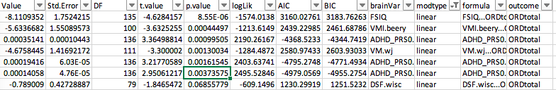

# 2020-02-19 15:51:03

After going over summary of results with Philip, a few more things to try:

* covary age and sex in everything
* try WNH only for PRS univariate. Is it better?
* check the difference between clinicals, make sure the minimal difference is reasonable
* add sex as a possible univariate, but then try excluding and including it for FDR
* do univariate selection for 2-class, 3-class and 4 class individually
* remove externalizing, internalizing and med rates for 4 groups univariate,
  possibly even 3 groups FDR
* try adding base_hi and base_inatt together
* show proportion of variance for the 2 group models with base_sx included
* code medication to have 2 groups only, combining none and nostim

Alright, let's get going then.

# 2020-02-20 10:05:24

First, checking that we have decent difference between clinical points:

```
> sort(data0$last_age - data0$base_age)
  [1]  0.10  0.25  0.90  0.98  1.00  1.00  1.01  1.03  1.03  1.06  1.10  1.12
 [13]  1.13  1.13  1.13  1.15  1.15  1.16  1.19  1.19  1.23  1.23  1.25  1.26
 [25]  1.31  1.33  1.34  1.36  1.36  1.40  1.43  1.46  1.47  1.48  1.48  1.51
 [37]  1.53  1.67  1.71  1.71  1.74  1.80  1.81  1.85  1.86  1.86  1.90  1.90
 [49]  1.91  1.92  1.95  1.95  1.99  2.00  2.07  2.09  2.14  2.15  2.20  2.20
 [61]  2.21  2.24  2.28  2.30  2.35  2.47  2.56  2.58  2.71  2.72  2.73  2.76
 [73]  2.76  2.77  2.80  2.81  2.83  2.83  2.91  2.95  2.96  2.96  2.97  2.97
 [85]  2.97  2.97  2.97  2.99  3.02  3.03  3.03  3.03  3.10  3.10  3.12  3.12
 [97]  3.14  3.17  3.18  3.19  3.19  3.20  3.22  3.24  3.24  3.27  3.28  3.41
```

Yes, that's concerning. But we could try just going ahead and removing the
first 4 subjects to force at least one year age difference. We could even force
more, say 3 years and keep only 305 subjects.

I'll residualize within domain following those constraints, and go from there.
Also, I'll residualize using stepAIC, including age and sex, and then I don't
need to include it in the final model anymore.

```r
setwd('~/data/baseline_prediction/prs_start/')
clin_long = read.csv('long_clin_01062020_lt16.csv')
clin_long$SX_total = clin_long$SX_inatt + clin_long$SX_hi

winsorize = function(x, cut = 0.01){
  cut_point_top <- quantile(x, 1 - cut, na.rm = T)
  cut_point_bottom <- quantile(x, cut, na.rm = T)
  i = which(x >= cut_point_top) 
  x[i] = cut_point_top
  j = which(x <= cut_point_bottom) 
  x[j] = cut_point_bottom
  return(x)
}

df = data.frame(MRN=unique(clin_long$MRN))
for (r in 1:nrow(df)) {
    subj_data = clin_long[clin_long$MRN==df$MRN[r], ]
    for (sx in c('inatt', 'hi', 'total')) {
        fit = lm(as.formula(sprintf('SX_%s ~ age', sx)), data=subj_data)
        df[r, sprintf('slope_%s', sx)] = fit$coefficients['age']
        base_row = which.min(subj_data$age)
        df[r, sprintf('base_%s', sx)] = subj_data[base_row, sprintf('SX_%s', sx)]
        last_row = which.max(subj_data$age)
        df[r, sprintf('last_%s', sx)] = subj_data[last_row, sprintf('SX_%s', sx)]
        df[r, 'base_age'] = subj_data[base_row, 'age']
        df[r, 'base_DOA'] = subj_data[base_row, 'DOA']
        df[r, 'last_age'] = subj_data[last_row, 'age']
        df[r, 'sex'] = subj_data[last_row, 'sex']
    }
}
for (min_sx in c(0, 3, 4, 6)) {
    idx = df$base_inatt>=min_sx | df$base_hi>=min_sx
    for (sx in c('inatt', 'hi', 'total')) {
        df[, sprintf('slope_%s_GE%d_wp05', sx, min_sx)] = NA
        junk = winsorize(df[idx, sprintf('slope_%s', sx)], cut=.05)
        df[idx, sprintf('slope_%s_GE%d_wp05', sx, min_sx)] = junk
    }
}

demo = read.csv('prs_demo.csv')
# just to get FAMID, sex already there
df = merge(df, subset(demo, select=-sex), by='MRN')

# cut kids if not enough time between clinical assessments
min_clin = 1
keep_me = which((df$last_age - df$base_age) >= min_clin)
df = df[keep_me, ]

# selecting best kid in family
df$bestInFamily = F
nvisits = table(clin_long$MRN)
df = merge(df, as.matrix(nvisits),
                 by.x='MRN', by.y=0)
colnames(df)[ncol(df)] = 'nvisits'
for (f in unique(df$FAMID)) {
    fam_rows = which(df$FAMID == f)
    fam_data = df[fam_rows,]
    if (nrow(fam_data) == 1) {
        df[fam_rows,]$bestInFamily = T
    } else {
        stotal = sort(fam_data$slope_total, index.return=T, decreasing=T)
        # if there's a tie
        if (stotal$x[1] == stotal$x[2]) {
            # print(sprintf('Tie in slope for %d', f))
            svisits = sort(fam_data$nvisits, index.return=T, decreasing=T)
            if (svisits$x[1] == svisits$x[2]) {
                print(sprintf('Tie in number of visits for %d', f))
                print(fam_data[fam_data$nvisits==svisits$x[1], ]$MRN)
            } else {
                df[fam_rows[svisits$ix[1]], ]$bestInFamily = T
            }
        } else {
            df[fam_rows[stotal$ix[1]], ]$bestInFamily = T
        }
    }
}

df[df$MRN==4585574, ]$bestInFamily = T
df[df$MRN==4925051, ]$bestInFamily = T
df[df$MRN==7079035, ]$bestInFamily = T
df[df$MRN==7378993, ]$bestInFamily = T
# chosen because of overall best MPRAGE QC
df[df$MRN==4640378, ]$bestInFamily = T
# chosen because of overall best MPRAGE QC
df[df$MRN==7218965, ]$bestInFamily = T

min_sx = 6
for (sx in c('inatt', 'hi')) {
    if (sx == 'inatt') {
        thresh = 0
    } else if (sx == 'hi') {
        thresh = -.5
    }
    phen_slope = sprintf('slope_%s_GE%d_wp05', sx, min_sx)
    phen = sprintf('thresh%.2f_%s_GE%d_wp05', abs(thresh), sx, min_sx)
    df[, phen] = 'notGE6adhd'
    my_nvs = which(is.na(df[, phen_slope]))
    idx = df[my_nvs, 'base_inatt'] <= 2 & df[my_nvs, 'base_hi'] <= 2
    df[my_nvs[idx], phen] = 'nv012'
    df[which(df[, phen_slope] < thresh), phen] = 'imp'
    df[which(df[, phen_slope] >= thresh), phen] = 'nonimp'
    df[, phen] = factor(df[, phen], ordered=F)
    df[, phen] = relevel(df[, phen], ref='nv012')
    ophen = sprintf('ORDthresh%.2f_%s_GE%d_wp05', abs(thresh), sx, min_sx)
    df[, ophen] = factor(df[, phen],
                         levels=c('nv012', 'notGE6adhd', 'imp', 'nonimp'),
                         ordered=T)
}
prs = read.csv('/Volumes/NCR/reference/merged_NCR_1KG_PRS_12192019.csv')
data = merge(df, prs, by='MRN', all.x=F, all.y=F)
library(nlme)
library(MASS)
qc_vars = sapply(1:10, function(x) sprintf('PC%02d', x))
# I'll remove all PCs from both ADHD and ADHDeur!
brain_vars = colnames(data)[grepl(colnames(data), pattern='^ADHD')]
for (bv in brain_vars) {
    fm_str = paste(bv, " ~ sex + base_age + ", paste(qc_vars, collapse='+'), sep="")
    fit = lme(as.formula(fm_str), data, ~1|FAMID, method='ML')
    step = stepAIC(fit, direction='both', trace=F)
    data[, bv] = residuals(step)
}
# removing PC variables and PRS for other disorders
data = data[, 1:65]

# anatomical
qc = read.csv('~/data/baseline_prediction/prs_start/prs_and_mprage_qc.csv')
brain_meta = merge(df, qc, by='MRN', all.x=F, all.y=F)
qc_vars = c("mprage_score", "ext_avg", "int_avg")
brain_meta = brain_meta[brain_meta$"age_at_scan" < 18, ]
na_scores_idx = is.na(brain_meta$mprage_score) | is.na(brain_meta$ext_avg) |
                is.na(brain_meta$int_avg)
brain_meta = brain_meta[!na_scores_idx, ]
qtile=.95
library(solitude)
iso <- isolationForest$new()
iso$fit(brain_meta[, qc_vars])
scores_if = as.matrix(iso$scores)[,3]
library(dbscan)
scores_lof = lof(brain_meta[, qc_vars], k = round(.5 * nrow(brain_meta)))
thresh_lof = quantile(scores_lof, qtile)
thresh_if = quantile(scores_if, qtile)
idx = scores_lof < thresh_lof & scores_if < thresh_if
all_brain_data = read.table('~/data/baseline_prediction/merged_rois.txt', header=T)
x = duplicated(all_brain_data$lh.aparc.area)
brain_data = merge(brain_meta[idx,], all_brain_data[!x, ], by.x='maskid',
                   by.y='lh.aparc.area', all.x=F, all.y=F)
rois = read.csv('~/data/baseline_prediction/REGIONAL_ANALYSES_FREESURFER.csv')
brain_vars = colnames(brain_data)[grepl(colnames(brain_data), pattern="_thickness$")]
part = 'lobar'
new_brain_vars = c()
for (roi in unique(rois[, part])) {
    labels = rois[which(rois[, part]==roi), 'region']
    to_avg = c()
    for (l in labels) {
        to_avg = c(to_avg,
                   brain_vars[grepl(brain_vars, pattern=sprintf("^%s", l))])
    }
    # only use variable if it's selected initially and defined
    if (length(to_avg) > 0 && sum(is.na(brain_data[, to_avg])) == 0 &&
        nchar(roi) > 0) {
        if (length(to_avg) == 1) {
            brain_data[, roi] = brain_data[, to_avg]
        } else {
            brain_data[, roi] = rowMeans(brain_data[, to_avg])
        }
        new_brain_vars = c(new_brain_vars, roi)
    }
}
brain_vars = new_brain_vars
iso <- isolationForest$new()
iso$fit(brain_data[, brain_vars])
scores_if = as.matrix(iso$scores)[,3]
scores_lof = lof(brain_data[, brain_vars], k = round(.5 * nrow(brain_data)))
thresh_lof = quantile(scores_lof, qtile)
thresh_if = quantile(scores_if, qtile)
idx = scores_lof < thresh_lof & scores_if < thresh_if
clean_brain_data = brain_data[idx, ]
keep_me = c()
for (s in unique(clean_brain_data$MRN)) {
    subj_rows = which(clean_brain_data$MRN == s)
    subj_data = clean_brain_data[subj_rows, ]
    min_subj_row = which.min(subj_data$age_at_scan)
    if (abs(subj_data[min_subj_row, 'base_age'] -
            subj_data[min_subj_row, 'age_at_scan'])<1) {
        keep_me = c(keep_me, subj_rows[min_subj_row])
    }
}
anat_data = clean_brain_data[keep_me, ]
res_anat_data = merge(data[, c('MRN', 'FAMID', 'sex')],
                      anat_data[, c('MRN', 'age_at_scan', qc_vars, brain_vars)], by='MRN',
                      all.x=F, all.y=F)
for (bv in brain_vars) {
    fm_str = paste(bv, " ~ sex + age_at_scan + ", paste(qc_vars, collapse='+'), sep="")
    fit = lme(as.formula(fm_str), res_anat_data, ~1|FAMID, method='ML')
    step = stepAIC(fit, direction='both', trace=F)
    res_anat_data[, bv] = residuals(step)
}
data = merge(data, res_anat_data[, c('MRN', brain_vars)], by='MRN',
             all.x=T, all.y=F)

# DTI
qc = read.csv('/Volumes/Shaw/MasterQC/master_qc_20190314.csv')
brain_demo = read.csv('~/data/heritability_change/ready_1020.csv')
m = merge(brain_demo, qc, by.y='Mask.ID', by.x='Mask.ID...Scan', all.x=F)
brain_meta = merge(m, df, by.x="Medical.Record...MRN...Subjects", by.y='MRN',
                   all.x=F, all.y=F)
colnames(brain_meta)[1] = 'MRN'
qc_vars = c("meanX.trans", "meanY.trans", "meanZ.trans",
            "meanX.rot", "meanY.rot", "meanZ.rot",
            "goodVolumes")
brain_meta = brain_meta[brain_meta$"age_at_scan...Scan...Subjects" < 18, ]
brain_meta = brain_meta[brain_meta$"goodVolumes" <= 61, ]
brain_meta = brain_meta[brain_meta$"numVolumes" < 80, ]
qtile=.95
library(solitude)
iso <- isolationForest$new()
iso$fit(brain_meta[, qc_vars])
scores_if = as.matrix(iso$scores)[,3]
library(dbscan)
scores_lof = lof(brain_meta[, qc_vars], k = round(.5 * nrow(brain_meta)))
thresh_lof = quantile(scores_lof, qtile)
thresh_if = quantile(scores_if, qtile)
idx = scores_lof < thresh_lof & scores_if < thresh_if
all_brain_data = read.csv('~/data/heritability_change/jhu_tracts_1020.csv')
x = duplicated(all_brain_data$id)
brain_data = merge(brain_meta[idx,], all_brain_data[!x, ], by.x='Mask.ID...Scan',
                   by.y='id')
all_brain_data = read.csv('~/data/baseline_prediction/jhu_tracts_mode.csv')
x = duplicated(all_brain_data$id)
brain_data = merge(brain_data, all_brain_data[!x, ], by.x='Mask.ID...Scan',
                   by.y='id')
for (p in c('fa', 'ad', 'rd', 'mode')) {
    brain_data[, sprintf('ATR_%s', p)] = rowMeans(brain_data[, c(sprintf('%s_1', p),
                                                                 sprintf('%s_2', p))])
    brain_data[, sprintf('CST_%s', p)] = rowMeans(brain_data[, c(sprintf('%s_3', p),
                                                                 sprintf('%s_4', p))])
    brain_data[, sprintf('CIN_%s', p)] = rowMeans(brain_data[, c(sprintf('%s_5', p),
                                                                 sprintf('%s_6', p),
                                                                 sprintf('%s_7', p),
                                                                 sprintf('%s_8', p))])
    brain_data[, sprintf('CC_%s', p)] = rowMeans(brain_data[, c(sprintf('%s_9', p),
                                                                 sprintf('%s_10', p))])
    brain_data[, sprintf('IFO_%s', p)] = rowMeans(brain_data[, c(sprintf('%s_11', p),
                                                                 sprintf('%s_12', p))])
    brain_data[, sprintf('ILF_%s', p)] = rowMeans(brain_data[, c(sprintf('%s_13', p),
                                                                 sprintf('%s_14', p))])
    brain_data[, sprintf('SLF_%s', p)] = rowMeans(brain_data[, c(sprintf('%s_15', p),
                                                                 sprintf('%s_16', p),
                                                                 sprintf('%s_19', p),
                                                                 sprintf('%s_20', p))])
    brain_data[, sprintf('UNC_%s', p)] = rowMeans(brain_data[, c(sprintf('%s_17', p),
                                                                 sprintf('%s_18', p))])
}
brain_vars = colnames(brain_data)[grepl(colnames(brain_data), pattern="_fa$") &
                                  !grepl(colnames(brain_data), pattern="^mean")]
iso <- isolationForest$new()
iso$fit(brain_data[, brain_vars])
scores_if = as.matrix(iso$scores)[,3]
scores_lof = lof(brain_data[, brain_vars], k = round(.5 * nrow(brain_data)))
thresh_lof = quantile(scores_lof, qtile)
thresh_if = quantile(scores_if, qtile)
idx = scores_lof < thresh_lof & scores_if < thresh_if
clean_brain_data = brain_data[idx, ]
keep_me = c()
for (s in unique(clean_brain_data$MRN)) {
    subj_rows = which(clean_brain_data$MRN == s)
    subj_data = clean_brain_data[subj_rows, ]
    min_subj_row = which.min(subj_data$age_at_scan...Scan...Subjects)
    if (abs(subj_data[min_subj_row, 'base_age'] -
            subj_data[min_subj_row, 'age_at_scan...Scan...Subjects'])<1) {
        keep_me = c(keep_me, subj_rows[min_subj_row])
    }
}
dti_data = clean_brain_data[keep_me, ]
res_dti_data = merge(data[, c('MRN', 'FAMID', 'sex')],
                     dti_data[, c('MRN', 'age_at_scan...Scan...Subjects',
                                  qc_vars, brain_vars)], by='MRN',
                     all.x=F, all.y=F)
for (bv in brain_vars) {
    fm_str = paste(bv, " ~ sex + age_at_scan...Scan...Subjects + ", paste(qc_vars, collapse='+'), sep="")
    fit = lme(as.formula(fm_str), res_dti_data, ~1|FAMID, method='ML')
    step = stepAIC(fit, direction='both', trace=F)
    res_dti_data[, bv] = residuals(step)
}
data = merge(data, res_dti_data[, c('MRN', brain_vars)], by='MRN',
             all.x=T, all.y=F)

# other variables
iq = read.csv('~/data/baseline_prediction/basics.csv')
neuropsych = merge(df, iq, by='MRN')
library(gdata)
source('~/research_code/lab_mgmt/merge_on_closest_date.R')
beery = read.xls('~/data/baseline_prediction/prs_start/Subjects_Beery_clean.xlsx')
colnames(beery) = c('MRN', 'DOA.beery', 'VMI.beery')
neuropsych = mergeOnClosestDate(neuropsych, beery, unique(df$MRN), x.date='base_DOA',
                                y.date='DOA.beery')
colnames(neuropsych)[ncol(neuropsych)] = 'dateDiff.beery'
wisc = read.xls('~/data/baseline_prediction/prs_start/Subjects_WISC_clean.xlsx')
colnames(wisc) = c('MRN', 'DOA.wisc', 'DS.wisc', 'DSB.wisc', 'DSF.wisc', 'SS.wisc',
                   'SSB.wisc', 'SSF.wisc')
neuropsych = mergeOnClosestDate(neuropsych, wisc, unique(df$MRN),
                                x.date='base_DOA', y.date='DOA.wisc')
colnames(neuropsych)[ncol(neuropsych)] = 'dateDiff.wisc'
wj = read.xls('~/data/baseline_prediction/prs_start/Subjects_Woodcock_Johnson_clean.xlsx')
colnames(wj) = c('MRN', 'DOA.wj', 'PS.wj', 'DS.wj', 'VM.wj')
neuropsych = mergeOnClosestDate(neuropsych, wj, unique(df$MRN),
                                x.date='base_DOA', y.date='DOA.wj')
colnames(neuropsych)[ncol(neuropsych)] = 'dateDiff.wj'
for (suf in c('.beery', '.wisc', '.wj')) {
    doa_col = sprintf('DOA%s', suf)
    date_diff = abs(as.Date(neuropsych[, 'base_DOA'], tryFormats='%m/%d/%Y') -
                    as.Date(neuropsych[, doa_col], tryFormats='%m/%d/%Y'))
    mycols = colnames(neuropsych)[grepl(colnames(neuropsych), pattern=sprintf('%s$', suf))]
    idx = which(date_diff > 365)
    neuropsych[idx, mycols] = NA
}
# note that I'm not covarying IQ, SES, externalizing or internalizing for age and sex!
brain_vars = c('VMI.beery' , "SSB.wisc", "SSF.wisc", 'DSF.wisc', 'DSB.wisc',
               "DS.wj", "VM.wj")
other_vars = c('FSIQ', 'SES', 'externalizing', 'internalizing')
res_psych_data = merge(data[, c('MRN', 'FAMID', 'sex', 'base_age')],
                       neuropsych[, c('MRN', brain_vars, other_vars)], by='MRN',
                       all.x=F, all.y=F)
for (bv in brain_vars) {
    idx = !is.na(res_psych_data[, bv])
    fm_str = paste(bv, " ~ sex + base_age", sep="")
    fit = lme(as.formula(fm_str), res_psych_data[idx, ], ~1|FAMID, method='ML')
    step = stepAIC(fit, direction='both', trace=F)
    res_psych_data[idx, bv] = residuals(step)
}
data = merge(data, res_psych_data[, c('MRN', brain_vars, other_vars)],
             by='MRN', all.x=T, all.y=F)

# add medication as well
meds = read.csv('~/data/baseline_prediction/prs_start/med_at_base.csv')
idx = meds$medication_status_at_observation=='nonstim'
meds[idx, ]$medication_status_at_observation = 'none'
meds$medication_status_at_observation = factor(meds$medication_status_at_observation)
data = merge(data, meds, by='MRN')

data$externalizing = as.factor(data$externalizing)
data$internalizing = as.factor(data$internalizing)

out_fname = sprintf('~/data/baseline_prediction/prs_start/complete_massagedResids_clinDiffGE%d_02202020.rds',
                    min_clin)
saveRDS(data, file=out_fname, compress=T)
```

I ran the above for min_clin = 2 and 3 just in case. Now, let's re-run the
univariate analysis in the 4 groups to see what's still there:

```r
library(nlme)
library(MASS)

data = readRDS('~/data/baseline_prediction/prs_start/complete_massagedResids_clinDiffGE1_02202020.rds')

brain_vars = colnames(data)[c(42:53, 66:90)]
hold = c()
min_sx = 6
out_fname = '~/data/baseline_prediction/prs_start/univar_allResidClinDiff1_4groupOrdered.csv'
for (sx in c('inatt', 'hi')) {   
    if (sx == 'inatt') {
        thresh = 0
    } else if (sx == 'hi') {
        thresh = -.5
    }
    phen = sprintf('ORDthresh%.2f_%s_GE%d_wp05', abs(thresh), sx, min_sx)

    phen_res = c()
    for (bv in brain_vars) {
        use_me = !is.na(data[, bv])
        this_data = data[use_me, c(phen, 'FAMID', brain_vars)]
        fm_str = paste(bv, sprintf(" ~ %s", phen), sep="")
        fit = try(lme(as.formula(fm_str), ~1|FAMID, data=this_data, method='ML'))
        if (length(fit)>1) {
            temp = c(summary(fit)$tTable[sprintf('%s.L', phen), ],
                        summary(fit)$logLik, summary(fit)$AIC, summary(fit)$BIC,
                        bv, 'linear')
            phen_res = rbind(phen_res, temp)
            rownames(phen_res)[nrow(phen_res)] = fm_str
            temp = c(summary(fit)$tTable[sprintf('%s.Q', phen), ],
                        summary(fit)$logLik, summary(fit)$AIC, summary(fit)$BIC,
                        bv, 'quadratic')
            phen_res = rbind(phen_res, temp)
            rownames(phen_res)[nrow(phen_res)] = fm_str
            temp = c(summary(fit)$tTable[sprintf('%s.C', phen), ],
                        summary(fit)$logLik, summary(fit)$AIC, summary(fit)$BIC,
                        bv, 'cubic')
            phen_res = rbind(phen_res, temp)
            rownames(phen_res)[nrow(phen_res)] = fm_str
        } else {
            # fit broke
            temp = rep(NA, 10)
            phen_res = rbind(phen_res, temp)
            rownames(phen_res)[nrow(phen_res)] = fm_str
        }
    }
    phen_res = data.frame(phen_res)
    phen_res$formula = rownames(phen_res)
    phen_res$outcome = phen
    hold = rbind(hold, phen_res)
}
colnames(hold)[6:10] = c('logLik', 'AIC', 'BIC', 'brainVar', 'modtype')
write.csv(hold, file=out_fname, row.names=F)
```

Then, let's run the 3 and 2 group comparison as well. I tried adding
comorbidities and medication here, but the model doesn't work with factor ~
ordered, so I'll leave to test them in the big model instead.

```r
library(nlme)
library(MASS)

data = readRDS('~/data/baseline_prediction/prs_start/complete_massagedResids_clinDiffGE1_02202020.rds')

brain_vars = colnames(data)[c(42:53, 66:90)]
hold = c()
min_sx = 6
out_fname = '~/data/baseline_prediction/prs_start/univar_allResidClinDiff1_3groupOrdered.csv'
for (sx in c('inatt', 'hi')) {
    if (sx == 'inatt') {
        thresh = 0
    } else if (sx == 'hi') {
        thresh = -.5
    }
    phen = sprintf('ORDthresh%.2f_%s_GE%d_wp05', abs(thresh), sx, min_sx)

    adhd = data[, phen] != 'nv012'
    data2 = data[adhd, ]
    data2[, phen] = factor(data2[, phen],
                           levels=c('notGE6adhd', 'imp', 'nonimp'),
                           ordered=T)

    phen_res = c()
    for (bv in brain_vars) {
        use_me = !is.na(data2[, bv])
        this_data = data2[use_me, c(phen, 'FAMID', brain_vars)]
        fm_str = paste(bv, sprintf(" ~ %s", phen), sep="")
        fit = try(lme(as.formula(fm_str), ~1|FAMID, data=this_data, method='ML'))
        if (length(fit)>1) {
            temp = c(summary(fit)$tTable[sprintf('%s.L', phen), ],
                        summary(fit)$logLik, summary(fit)$AIC, summary(fit)$BIC,
                        bv, 'linear')
            phen_res = rbind(phen_res, temp)
            rownames(phen_res)[nrow(phen_res)] = fm_str
            temp = c(summary(fit)$tTable[sprintf('%s.Q', phen), ],
                        summary(fit)$logLik, summary(fit)$AIC, summary(fit)$BIC,
                        bv, 'quadratic')
            phen_res = rbind(phen_res, temp)
            rownames(phen_res)[nrow(phen_res)] = fm_str
        } else {
            # fit broke
            temp = rep(NA, 10)
            phen_res = rbind(phen_res, temp)
            rownames(phen_res)[nrow(phen_res)] = fm_str
        }
    }
    phen_res = data.frame(phen_res)
    phen_res$formula = rownames(phen_res)
    phen_res$outcome = phen
    hold = rbind(hold, phen_res)
}
colnames(hold)[6:10] = c('logLik', 'AIC', 'BIC', 'brainVar', 'modtype')
write.csv(hold, file=out_fname, row.names=F)
```

```r
library(nlme)
library(MASS)

data = readRDS('~/data/baseline_prediction/prs_start/complete_massagedResids_clinDiffGE1_02202020.rds')

brain_vars = colnames(data)[c(42:53, 66:90)]
hold = c()
min_sx = 6
out_fname = '~/data/baseline_prediction/prs_start/univar_allResidClinDiff1_2groupOrdered.csv'
for (sx in c('inatt', 'hi')) {
    if (sx == 'inatt') {
        thresh = 0
    } else if (sx == 'hi') {
        thresh = -.5
    }
    phen = sprintf('ORDthresh%.2f_%s_GE%d_wp05', abs(thresh), sx, min_sx)

    adhd = data[, phen] == 'nonimp' | data[, phen] == 'imp'
    data2 = data[adhd, ]
    data2[, phen] = factor(data2[, phen],
                           levels=c('imp', 'nonimp'),
                           ordered=T)

    phen_res = c()
    for (bv in brain_vars) {
        use_me = !is.na(data2[, bv])
        this_data = data2[use_me, c(phen, 'FAMID', brain_vars)]
        fm_str = paste(bv, sprintf(" ~ %s", phen), sep="")
        fit = try(lme(as.formula(fm_str), ~1|FAMID, data=this_data, method='ML'))
        if (length(fit)>1) {
            temp = c(summary(fit)$tTable[sprintf('%s.L', phen), ],
                        summary(fit)$logLik, summary(fit)$AIC, summary(fit)$BIC,
                        bv, 'linear')
            phen_res = rbind(phen_res, temp)
            rownames(phen_res)[nrow(phen_res)] = fm_str
        } else {
            # fit broke
            temp = rep(NA, 10)
            phen_res = rbind(phen_res, temp)
            rownames(phen_res)[nrow(phen_res)] = fm_str
        }
    }
    phen_res = data.frame(phen_res)
    phen_res$formula = rownames(phen_res)
    phen_res$outcome = phen
    hold = rbind(hold, phen_res)
}
colnames(hold)[6:10] = c('logLik', 'AIC', 'BIC', 'brainVar', 'modtype')
write.csv(hold, file=out_fname, row.names=F)
```

# 2020-02-21 13:11:03

We should keep the 1 year limit in the clinics, but make sure that the year of
neuroimage and neuropsych is not the same as FU. Let's check that.

I did check and the two subjects with anatomical that would be the closest are
within the error margin of their recorrent visits. In other words, the
difference between last_age and age_at scan was < 1, but not < .9. And looking
at the ages, it made sense. We did go from 286 to 282 subjects with scans,
meaning that all 4 subjects we removed because of not enough time between
clinicals actually had an mprage scan.

For DTI we only lost 1 (from 180 to 179). And the two subjects that were < 1
were in the same situation as anatomical, so we can keep them.

The issue here then is how to keep our results, as PRS is not surviving FDR in
the 4-group logistic regression. It's the very next predictor when using either
.05 or .1 Q, in either inatt or HI, but it's not getting there anymore.

Also, I couldn't get anything in the 2 and 3 group comparison. Likely don't have
enough data to estimate the model. Maybe another reason to not make it mixed?

We could try going the lm route, or trying total symptoms. Let's see what we
get:

```r
data = readRDS('~/data/baseline_prediction/prs_start/complete_massagedResids_clinDiffGE1_02202020.rds')

brain_vars = colnames(data)[c(42:53, 66:90)]
hold = c()
min_sx = 6
out_fname = '~/data/baseline_prediction/prs_start/univar_allResidClinDiff1_4groupOrdered_lm.csv'
for (sx in c('inatt', 'hi')) {   
    if (sx == 'inatt') {
        thresh = 0
    } else if (sx == 'hi') {
        thresh = -.5
    }
    phen = sprintf('ORDthresh%.2f_%s_GE%d_wp05', abs(thresh), sx, min_sx)

    phen_res = c()
    for (bv in brain_vars) {
        use_me = !is.na(data[, bv])
        this_data = data[use_me, c(phen, 'FAMID', brain_vars)]
        fm_str = paste(bv, sprintf(" ~ %s", phen), sep="")
        fit = lm(as.formula(fm_str), data=this_data)
        temp = c(summary(fit)$coefficients[sprintf('%s.L', phen), ], bv)
        phen_res = rbind(phen_res, temp)
        rownames(phen_res)[nrow(phen_res)] = fm_str
    }
    phen_res = data.frame(phen_res)
    phen_res$formula = rownames(phen_res)
    phen_res$outcome = phen
    hold = rbind(hold, phen_res)
}
colnames(hold)[5] = 'brainVar'
write.csv(hold, file=out_fname, row.names=F)
```

Nope, still the exact same issue as before... well, good to know lm and lme are
not that different. Still, doesn't solve our problems. What if we do it in total
symptoms? I'll mark it to be improving in total just based on whether it
improves in inatt or HI:

# 2020-02-24 09:14:04

```r
library(nlme)
library(MASS)

data = readRDS('~/data/baseline_prediction/prs_start/complete_massagedResids_clinDiffGE1_02202020.rds')

brain_vars = colnames(data)[c(42:53, 66:90)]
hold = c()
min_sx = 6
out_fname = '~/data/baseline_prediction/prs_start/univar_allResidClinDiff1_4groupOrdered_total.csv'

data$ORDtotal = data$ORDthresh0.00_inatt_GE6_wp05
inatt_imp = data$ORDthresh0.00_inatt_GE6_wp05 == 'imp'
hi_imp = data$ORDthresh0.50_hi_GE6_wp05 == 'imp'
data[inatt_imp | hi_imp, 'ORDtotal'] = 'imp'

sx = 'total'
phen = 'ORDtotal'

phen_res = c()
for (bv in brain_vars) {
    use_me = !is.na(data[, bv])
    this_data = data[use_me, c(phen, 'FAMID', brain_vars)]
    fm_str = paste(bv, sprintf(" ~ %s", phen), sep="")
    fit = try(lme(as.formula(fm_str), ~1|FAMID, data=this_data, method='ML'))
    if (length(fit)>1) {
        temp = c(summary(fit)$tTable[sprintf('%s.L', phen), ],
                    summary(fit)$logLik, summary(fit)$AIC, summary(fit)$BIC,
                    bv, 'linear')
        phen_res = rbind(phen_res, temp)
        rownames(phen_res)[nrow(phen_res)] = fm_str
        temp = c(summary(fit)$tTable[sprintf('%s.Q', phen), ],
                    summary(fit)$logLik, summary(fit)$AIC, summary(fit)$BIC,
                    bv, 'quadratic')
        phen_res = rbind(phen_res, temp)
        rownames(phen_res)[nrow(phen_res)] = fm_str
        temp = c(summary(fit)$tTable[sprintf('%s.C', phen), ],
                    summary(fit)$logLik, summary(fit)$AIC, summary(fit)$BIC,
                    bv, 'cubic')
        phen_res = rbind(phen_res, temp)
        rownames(phen_res)[nrow(phen_res)] = fm_str
    } else {
        # fit broke
        temp = rep(NA, 10)
        phen_res = rbind(phen_res, temp)
        rownames(phen_res)[nrow(phen_res)] = fm_str
    }
}
phen_res = data.frame(phen_res)
phen_res$formula = rownames(phen_res)
phen_res$outcome = phen
hold = rbind(hold, phen_res)

colnames(hold)[6:10] = c('logLik', 'AIC', 'BIC', 'brainVar', 'modtype')
write.csv(hold, file=out_fname, row.names=F)
```



Even though we might get some PRS, no brain would survive... let's see what else
we can do. It looks like we can have better results if we include all variables
together, for inatt and hi (but only the best PRS, like before):

```
> ps[p2<.1,c('brainVar', 'outcome')]
           brainVar                      outcome
1              FSIQ ORDthresh0.00_inatt_GE6_wp05
2         VMI.beery ORDthresh0.00_inatt_GE6_wp05
3             VM.wj ORDthresh0.00_inatt_GE6_wp05
4  ADHD_PRS0.000500 ORDthresh0.00_inatt_GE6_wp05
36        VMI.beery    ORDthresh0.50_hi_GE6_wp05
37             FSIQ    ORDthresh0.50_hi_GE6_wp05
38            VM.wj    ORDthresh0.50_hi_GE6_wp05
39           IFO_fa    ORDthresh0.50_hi_GE6_wp05
40           CST_fa    ORDthresh0.50_hi_GE6_wp05
41 ADHD_PRS0.001000    ORDthresh0.50_hi_GE6_wp05
42           ATR_fa    ORDthresh0.50_hi_GE6_wp05
43              OFC    ORDthresh0.50_hi_GE6_wp05
```

That's a decent approach, but let's see if defining a better threshold for total
might actually work better. I'll try .25, .33, and .5:

```r
library(nlme)
library(MASS)

data = readRDS('~/data/baseline_prediction/prs_start/complete_massagedResids_clinDiffGE1_02202020.rds')

brain_vars = colnames(data)[c(42:53, 66:90)]

min_sx = 6
sx = 'total'
for (thresh in c(.25, .33, .5)) {
    phen_slope = sprintf('slope_%s_GE%d_wp05', sx, min_sx)
    phen = sprintf('thresh%.2f_%s_GE%d_wp05', abs(thresh), sx, min_sx)
    data[, phen] = 'notGE6adhd'
    my_nvs = which(is.na(data[, phen_slope]))
    idx = data[my_nvs, 'base_inatt'] <= 2 & data[my_nvs, 'base_hi'] <= 2
    data[my_nvs[idx], phen] = 'nv012'
    data[which(data[, phen_slope] < thresh), phen] = 'imp'
    data[which(data[, phen_slope] >= thresh), phen] = 'nonimp'
    data[, phen] = factor(data[, phen], ordered=F)
    data[, phen] = relevel(data[, phen], ref='nv012')
    ophen = sprintf('ORDthresh%.2f_%s_GE%d_wp05', abs(thresh), sx, min_sx)
    data[, ophen] = factor(data[, phen],
                         levels=c('nv012', 'notGE6adhd', 'imp', 'nonimp'),
                         ordered=T)
}

hold = c()
out_fname = '~/data/baseline_prediction/prs_start/univar_allResidClinDiff1_4groupOrdered_totalThresh.csv'

for (thresh in c(.25, .33, .5)) {
    phen = sprintf('ORDthresh%.2f_%s_GE%d_wp05', abs(thresh), sx, min_sx)
    phen_res = c()
    for (bv in brain_vars) {
        use_me = !is.na(data[, bv])
        this_data = data[use_me, c(phen, 'FAMID', brain_vars)]
        fm_str = paste(bv, sprintf(" ~ %s", phen), sep="")
        fit = try(lme(as.formula(fm_str), ~1|FAMID, data=this_data, method='ML'))
        if (length(fit)>1) {
            temp = c(summary(fit)$tTable[sprintf('%s.L', phen), ],
                        summary(fit)$logLik, summary(fit)$AIC, summary(fit)$BIC,
                        bv, 'linear')
            phen_res = rbind(phen_res, temp)
            rownames(phen_res)[nrow(phen_res)] = fm_str
            temp = c(summary(fit)$tTable[sprintf('%s.Q', phen), ],
                        summary(fit)$logLik, summary(fit)$AIC, summary(fit)$BIC,
                        bv, 'quadratic')
            phen_res = rbind(phen_res, temp)
            rownames(phen_res)[nrow(phen_res)] = fm_str
            temp = c(summary(fit)$tTable[sprintf('%s.C', phen), ],
                        summary(fit)$logLik, summary(fit)$AIC, summary(fit)$BIC,
                        bv, 'cubic')
            phen_res = rbind(phen_res, temp)
            rownames(phen_res)[nrow(phen_res)] = fm_str
        } else {
            # fit broke
            temp = rep(NA, 10)
            phen_res = rbind(phen_res, temp)
            rownames(phen_res)[nrow(phen_res)] = fm_str
        }
    }
    phen_res = data.frame(phen_res)
    phen_res$formula = rownames(phen_res)
    phen_res$outcome = phen
    hold = rbind(hold, phen_res)
}

colnames(hold)[6:10] = c('logLik', 'AIC', 'BIC', 'brainVar', 'modtype')
write.csv(hold, file=out_fname, row.names=F)
```

.25 did best overall, then .5, but none of them included a brain variable even
at Q < .1, so I think I'll stick to the results per SX above.

I'll work on the data descriptives again, prior to re-evaluating the big model:

```
> data0 = readRDS('~/data/baseline_prediction/prs_start/complete_massagedResids_clinDiffGE1_02202020.rds')
> idx=!is.na(data0[, 'FSIQ'])
> sum(idx)
[1] 386
> table(data0[idx,]$thresh0.00_inatt_GE6_wp05)

     nv012        imp     nonimp notGE6adhd 
       155        114         72         45 
> table(data0[idx,]$thresh0.50_hi_GE6_wp05)

     nv012        imp     nonimp notGE6adhd 
       155         75        111         45 
> idx=!is.na(data0[, 'VMI.beery'])
> sum(idx)
[1] 312
> table(data0[idx,]$thresh0.00_inatt_GE6_wp05)

     nv012        imp     nonimp notGE6adhd 
       123         91         60         38 
> table(data0[idx,]$thresh0.50_hi_GE6_wp05)

     nv012        imp     nonimp notGE6adhd 
       123         60         91         38 
> idx=!is.na(data0[, 'SSB.wisc'])
> sum(idx)
[1] 241
> table(data0[idx,]$thresh0.00_inatt_GE6_wp05)

     nv012        imp     nonimp notGE6adhd 
        89         74         41         37 
> table(data0[idx,]$thresh0.50_hi_GE6_wp05)

     nv012        imp     nonimp notGE6adhd 
        89         49         66         37 
> idx=!is.na(data0[, 'DS.wj'])
> sum(idx)
[1] 335
> table(data0[idx,]$thresh0.00_inatt_GE6_wp05)

     nv012        imp     nonimp notGE6adhd 
       135        102         56         42 
> table(data0[idx,]$thresh0.50_hi_GE6_wp05)

     nv012        imp     nonimp notGE6adhd 
       135         66         92         42 
> idx=!is.na(data0[, 'CC_fa'])
> sum(idx)
[1] 179
> table(data0[idx,]$thresh0.00_inatt_GE6_wp05)

     nv012        imp     nonimp notGE6adhd 
        73         49         31         26 
> table(data0[idx,]$thresh0.50_hi_GE6_wp05)

     nv012        imp     nonimp notGE6adhd 
        73         33         47         26 
> idx=!is.na(data0[, 'parietal'])
> sum(idx)
[1] 282
> table(data0[idx,]$thresh0.00_inatt_GE6_wp05)

     nv012        imp     nonimp notGE6adhd 
       124         78         45         35 
> table(data0[idx,]$thresh0.50_hi_GE6_wp05)

     nv012        imp     nonimp notGE6adhd 
       124         53         70         35 
```

So, no great changes. Let's continue...

At this point, we have already removed age and sex from every domain. Let's run
the big models for all possible groups:

```r
library(caret)
data = readRDS('~/data/baseline_prediction/prs_start/complete_massagedResids_clinDiffGE1_02202020.rds')
data$externalizing = as.factor(data$externalizing)

set.seed(42)
base_vars = c(colnames(data)[42:53], colnames(data)[74:81])
# anatomical
imp_vars = colnames(data)[66:73]
test = preProcess(data[, c(base_vars, imp_vars)], method = "bagImpute")
data[, c(base_vars, imp_vars)] <- predict(test, data[, c(base_vars, imp_vars)])
# beery, FSIQ, SES
imp_vars = c(colnames(data)[82], 'FSIQ', 'SES')
test = preProcess(data[, c(base_vars, imp_vars)], method = "bagImpute")
data[, c(base_vars, imp_vars)] <- predict(test, data[, c(base_vars, imp_vars)])
# wj
imp_vars = colnames(data)[87:88]
test = preProcess(data[, c(base_vars, imp_vars)], method = "bagImpute")
data[, c(base_vars, imp_vars)] <- predict(test, data[, c(base_vars, imp_vars)])
# wisc
imp_vars = colnames(data)[83:86]
test = preProcess(data[, c(base_vars, imp_vars)], method = "bagImpute")
data[, c(base_vars, imp_vars)] <- predict(test, data[, c(base_vars, imp_vars)])
```

```r
library(nnet)
library(pROC)

hi_vars = c('VMI.beery', 'FSIQ', 'VM.wj', 'IFO_fa', 'CST_fa',
            'ADHD_PRS0.001000', 'ATR_fa', 'OFC')
inatt_vars = c('FSIQ', 'VMI.beery', 'VM.wj',
               'ADHD_PRS0.000500')
covars = c('base_age', 'sex')
min_sx = 6

for (sx in c('inatt', 'hi')) {
    set.seed(42)
    if (sx == 'inatt') {
        thresh = 0
    } else if (sx == 'hi') {
        thresh = -.5
    }
    phen = sprintf('thresh%.2f_%s_GE%d_wp05', abs(thresh), sx, min_sx)
    eval(parse(text=sprintf('this_data = data[, c(phen, %s_vars, covars)]', sx)))

    scale_me = c()
    for (v in colnames(this_data)) {
        if (!is.factor(this_data[, v])) {
            scale_me = c(scale_me, v)
        }
    }
    this_data[, scale_me] = scale(this_data[, scale_me])

    eval(parse(text=sprintf('predictors_str=paste(%s_vars, collapse="+")', sx)))
    fm_str = paste(phen, " ~ ", predictors_str, ' + ',
               paste(covars, collapse='+'),
               sep="")
    fit = multinom(as.formula(fm_str), data=this_data, maxit=2000)
    preds = predict(fit, type='prob')
    print(sx)
    print(varImp(fit))
    print(multiclass.roc(this_data[, phen], preds))
}
```

```[1] "inatt"
                   Overall
FSIQ             0.7202945
VMI.beery        0.7291959
VM.wj            1.2683058
ADHD_PRS0.000500 0.5230646
base_age         1.1259660
sexMale          1.6162441
Multi-class area under the curve: 0.6748

[1] "hi"
                   Overall
VMI.beery        0.6218178
FSIQ             0.7530228
VM.wj            1.1535166
IFO_fa           0.5700479
CST_fa           0.5163395
ADHD_PRS0.001000 0.4819661
ATR_fa           0.3725260
OFC              0.5520842
base_age         0.8095592
sexMale          1.5286176
Multi-class area under the curve: 0.6719
```

Results are not impressive. But since I have already removed age and sex within
domain, how does the model perform if I don't use those covariates?

```r
for (sx in c('inatt', 'hi')) {
    set.seed(42)
    if (sx == 'inatt') {
        thresh = 0
    } else if (sx == 'hi') {
        thresh = -.5
    }
    phen = sprintf('thresh%.2f_%s_GE%d_wp05', abs(thresh), sx, min_sx)
    eval(parse(text=sprintf('this_data = data[, c(phen, %s_vars, covars)]', sx)))

    scale_me = c()
    for (v in colnames(this_data)) {
        if (!is.factor(this_data[, v])) {
            scale_me = c(scale_me, v)
        }
    }
    this_data[, scale_me] = scale(this_data[, scale_me])

    eval(parse(text=sprintf('predictors_str=paste(%s_vars, collapse="+")', sx)))
    fm_str = paste(phen, " ~ ", predictors_str, sep="")
    fit = multinom(as.formula(fm_str), data=this_data, maxit=2000)
    preds = predict(fit, type='prob')
    print(sx)
    print(varImp(fit))
    print(multiclass.roc(this_data[, phen], preds))
}
```

```
[1] "inatt"
                   Overall
FSIQ             0.7668251
VMI.beery        0.6310876
VM.wj            1.1767705
ADHD_PRS0.000500 0.4498268
Multi-class area under the curve: 0.6417

[1] "hi"
                   Overall
VMI.beery        0.5263482
FSIQ             0.7849392
VM.wj            1.1261404
IFO_fa           0.5583678
CST_fa           0.5051897
ADHD_PRS0.001000 0.4199229
ATR_fa           0.3926108
OFC              0.5459563
Multi-class area under the curve: 0.6571
```

We take a small hit. Of course, adding the clinical variables will offset
everything in the 4-group comparison, but let's see how it goes anyways,
including both base_sx as Philip had suggested:

```r
hi_vars = c('VMI.beery', 'FSIQ', 'VM.wj', 'IFO_fa', 'CST_fa',
            'ADHD_PRS0.001000', 'ATR_fa', 'OFC')
inatt_vars = c('FSIQ', 'VMI.beery', 'VM.wj',
               'ADHD_PRS0.000500')
covars = c('base_age', 'sex', 'externalizing', 'internalizing',
           'medication_status_at_observation', 'base_inatt', 'base_hi')
min_sx = 6

for (sx in c('inatt', 'hi')) {
    set.seed(42)
    if (sx == 'inatt') {
        thresh = 0
    } else if (sx == 'hi') {
        thresh = -.5
    }
    phen = sprintf('thresh%.2f_%s_GE%d_wp05', abs(thresh), sx, min_sx)
    eval(parse(text=sprintf('this_data = data[, c(phen, %s_vars, covars)]',
                            sx)))

    scale_me = c()
    for (v in colnames(this_data)) {
        if (!is.factor(this_data[, v])) {
            scale_me = c(scale_me, v)
        }
    }
    this_data[, scale_me] = scale(this_data[, scale_me])

    eval(parse(text=sprintf('predictors_str=paste(%s_vars, collapse="+")', sx)))
    fm_str = paste(phen, " ~ ", predictors_str, ' + ', 
               paste(covars, collapse='+'),
               sep="")
    fit = multinom(as.formula(fm_str), data=this_data, maxit=2000)
    preds = predict(fit, type='prob')
    print(sx)
    print(varImp(fit))
    print(multiclass.roc(this_data[, phen], preds))
}
```

```
[1] "inatt"
                                        Overall
FSIQ                                  41.982794
VMI.beery                              3.578685
VM.wj                                 81.447472
ADHD_PRS0.000500                      43.894476
base_age                              75.004177
sexMale                              268.721519
externalizing1                       387.633135
internalizing1                       661.230632
medication_status_at_observationstim 266.648934
base_inatt                           763.886003
base_hi                              604.436176
Multi-class area under the curve: 0.9404

[1] "hi"
                                        Overall
VMI.beery                             60.808914
FSIQ                                   5.487375
VM.wj                                 14.009715
IFO_fa                                51.110941
CST_fa                                 3.580805
ADHD_PRS0.001000                     102.269757
ATR_fa                                67.143582
OFC                                   51.124880
base_age                             106.437983
sexMale                              194.399110
externalizing1                       153.551182
internalizing1                       815.631843
medication_status_at_observationstim 200.047641
base_inatt                           641.697137
base_hi                              605.877102
Multi-class area under the curve: 0.9485
```

Adding the clinical variables is almost unfair, given how the groups are defined
on them. But it gives us an idea of how things play out in the 4-group case.
Let's start removign groups and check the variable contributions.

```r
hi_vars = c('VMI.beery', 'FSIQ', 'VM.wj', 'IFO_fa', 'CST_fa',
            'ADHD_PRS0.001000', 'ATR_fa', 'OFC')
inatt_vars = c('FSIQ', 'VMI.beery', 'VM.wj',
               'ADHD_PRS0.000500')
# covars = c('base_age', 'sex', 'externalizing', 'internalizing',
#            'medication_status_at_observation', 'base_inatt', 'base_hi')
covars = c('base_age', 'sex')
min_sx = 6

for (sx in c('inatt', 'hi')) {
    set.seed(42)
    if (sx == 'inatt') {
        thresh = 0
    } else if (sx == 'hi') {
        thresh = -.5
    }
    phen = sprintf('thresh%.2f_%s_GE%d_wp05', abs(thresh), sx, min_sx)
    eval(parse(text=sprintf('this_data = data[, c(phen, %s_vars, covars)]',
                            sx)))

    this_data = this_data[this_data[, phen] != 'nv012',]
    this_data[, phen] = factor(this_data[, phen], ordered=F)
    this_data[, phen] = relevel(this_data[, phen], ref='notGE6adhd')

    scale_me = c()
    for (v in colnames(this_data)) {
        if (!is.factor(this_data[, v])) {
            scale_me = c(scale_me, v)
        }
    }
    this_data[, scale_me] = scale(this_data[, scale_me])

    eval(parse(text=sprintf('predictors_str=paste(%s_vars, collapse="+")', sx)))
    fm_str = paste(phen, " ~ ", predictors_str, ' + ', 
               paste(covars, collapse='+'),
               sep="")
    fit = multinom(as.formula(fm_str), data=this_data, maxit=2000)
    preds = predict(fit, type='prob')
    print(sx)
    print(varImp(fit))
    print(multiclass.roc(this_data[, phen], preds))
}
```

```
[1] "inatt"
                    Overall
FSIQ             0.74308377
VMI.beery        0.50205321
VM.wj            0.09042903
ADHD_PRS0.000500 0.44625015
base_age         0.73738052
sexMale          0.31167702
Multi-class area under the curve: 0.6711

[1] "hi"
                   Overall
VMI.beery        0.4223979
FSIQ             0.7085519
VM.wj            0.1774528
IFO_fa           0.4794401
CST_fa           0.5468075
ADHD_PRS0.001000 0.4705216
ATR_fa           0.2503641
OFC              0.1618881
base_age         0.2792004
sexMale          0.4574787
Multi-class area under the curve: 0.6687
```

Results in 3 group analysis weren't that different than 4-group, without
clinicals.

```
[1] "inatt"
                                       Overall
FSIQ                                 0.8298191
VMI.beery                            0.1827814
VM.wj                                0.4307779
ADHD_PRS0.000500                     0.7593407
base_age                             0.5604268
sexMale                              0.3612244
externalizing1                       1.1293731
internalizing1                       1.2733140
medication_status_at_observationstim 1.1717559
base_inatt                           5.0131163
base_hi                              4.4278342
Multi-class area under the curve: 0.8808

[1] "hi"
                                       Overall
VMI.beery                            1.2465686
FSIQ                                 1.3111484
VM.wj                                0.1714609
IFO_fa                               0.7547630
CST_fa                               0.5800093
ADHD_PRS0.001000                     0.7842605
ATR_fa                               1.3417393
OFC                                  0.6085251
base_age                             0.5490014
sexMale                              0.7308607
externalizing1                       3.8110658
internalizing1                       2.2393427
medication_status_at_observationstim 1.9101648
base_inatt                           5.5138883
base_hi                              6.5466645
Multi-class area under the curve: 0.8971
```

Results in 3-group classification are still quite decent. The variable
contribution ratio is still quite disproportional though!

Let's play with the 2-group results:

```r
hi_vars = c('VMI.beery', 'FSIQ', 'VM.wj', 'IFO_fa', 'CST_fa',
            'ADHD_PRS0.001000', 'ATR_fa', 'OFC')
inatt_vars = c('FSIQ', 'VMI.beery', 'VM.wj',
               'ADHD_PRS0.000500')
# covars = c('base_age', 'sex', 'externalizing', 'internalizing',
#            'medication_status_at_observation', 'base_inatt', 'base_hi')
covars = c('base_age', 'sex')
min_sx = 6

for (sx in c('inatt', 'hi')) {
    set.seed(42)
    if (sx == 'inatt') {
        thresh = 0
    } else if (sx == 'hi') {
        thresh = -.5
    }
    phen = sprintf('thresh%.2f_%s_GE%d_wp05', abs(thresh), sx, min_sx)
    eval(parse(text=sprintf('this_data = data[, c(phen, %s_vars, covars)]',
                            sx)))

    this_data = this_data[this_data[, phen] != 'nv012',]
    this_data = this_data[this_data[, phen] != 'notGE6adhd',]
    this_data[, phen] = factor(this_data[, phen], ordered=F)
    this_data[, phen] = relevel(this_data[, phen], ref='nonimp')

    scale_me = c()
    for (v in colnames(this_data)) {
        if (!is.factor(this_data[, v])) {
            scale_me = c(scale_me, v)
        }
    }
    this_data[, scale_me] = scale(this_data[, scale_me])

    eval(parse(text=sprintf('predictors_str=paste(%s_vars, collapse="+")', sx)))
    fm_str = paste(phen, " ~ ", predictors_str, ' + ', 
               paste(covars, collapse='+'),
               sep="")
    fit = multinom(as.formula(fm_str), data=this_data, maxit=2000)
    preds = predict(fit, type='prob')
    print(sx)
    print(varImp(fit))
    print(multiclass.roc(this_data[, phen], preds))
}
```

```
[1] "inatt"
                   Overall
FSIQ             0.3448425
VMI.beery        0.1183606
VM.wj            0.1405499
ADHD_PRS0.000500 0.1915836
base_age         0.7591428
sexMale          0.2967667
Multi-class area under the curve: 0.7187

[1] "hi"
                    Overall
VMI.beery        0.23957522
FSIQ             0.09309914
VM.wj            0.14226124
IFO_fa           0.07215796
CST_fa           0.57775107
ADHD_PRS0.001000 0.23489728
ATR_fa           0.13699991
OFC              0.12243041
base_age         0.25246825
sexMale          0.34083300
Multi-class area under the curve: 0.7059
```

The 2-class results actually go a little over .7, which is nice to see. 

```
[1] "inatt"
                                        Overall
FSIQ                                 0.39183744
VMI.beery                            0.05199274
VM.wj                                0.43267531
ADHD_PRS0.000500                     0.19136429
base_age                             0.51344091
sexMale                              0.33444265
externalizing1                       0.15260005
internalizing1                       1.25503158
medication_status_at_observationstim 0.79584536
base_inatt                           1.20098822
base_hi                              0.01580077
Multi-class area under the curve: 0.8216

[1] "hi"
                                        Overall
VMI.beery                            0.68759308
FSIQ                                 0.02644463
VM.wj                                0.16887468
IFO_fa                               0.15639033
CST_fa                               0.49915548
ADHD_PRS0.001000                     0.32403480
ATR_fa                               0.05469934
OFC                                  0.05350514
base_age                             0.51261043
sexMale                              0.70984814
externalizing1                       1.09603122
internalizing1                       2.11730148
medication_status_at_observationstim 0.68840197
base_inatt                           0.26609419
base_hi                              2.12790071
Multi-class area under the curve: 0.8391
```

So, using the clinical domain it wasn't so bad for the 2-class case. Yes, it's
all training data, but there's something there.

## ML

Let's re-run our ML models with this new dataset:

```bash
cd ~/data/baseline_prediction/prs_start
my_script=~/research_code/baseline_prediction/stacked_2group.R;
for sx in inatt hi; do
    for clf in `cat linear_clf.txt`; do
        Rscript $my_script $sx $clf C5.0Tree ~/tmp/resids390_missing.csv;
    done;
done

cd ~/data/baseline_prediction/prs_start
my_script=~/research_code/baseline_prediction/stacked_2group.R;
for sx in inatt hi; do
    for clf in `cat clf1.txt`; do
        Rscript $my_script $sx $clf C5.0Tree ~/tmp/resids390_missing.csv;
    done;
done

cd ~/data/baseline_prediction/prs_start
my_script=~/research_code/baseline_prediction/stacked_2group_linearEnsemble.R;
for sx in inatt hi; do
    for clf in `cat linear_clf.txt`; do
        for ens in `cat ens2.txt`; do
            Rscript $my_script $sx $clf $ens ~/tmp/resids390_class_probs.csv;
        done;
    done;
done

cd ~/data/baseline_prediction/prs_start
my_script=~/research_code/baseline_prediction/stacked_2group_linearEnsemble.R;
for sx in inatt hi; do
    for clf in `cat clf1.txt`; do
        for ens in `cat ens2.txt`; do
            Rscript $my_script $sx $clf $ens ~/tmp/resids390_class_probs.csv;
        done;
    done;
done
```

## WNH analysis

Let's make a quick comparison, even within univariate results only, of whether
using WNH only data helps the results.

Note that the ADHDeur PRS has already been residualized like the all population
results, so it's just a matter of picking the WNH subjects only.


 # TODO
 * evaluate big models
 * see how ML models change with these new values for the same variables
 * check if results stable with bigger clinical delta threshold. Say, 2 or 3
   years? (RDS files are already created)