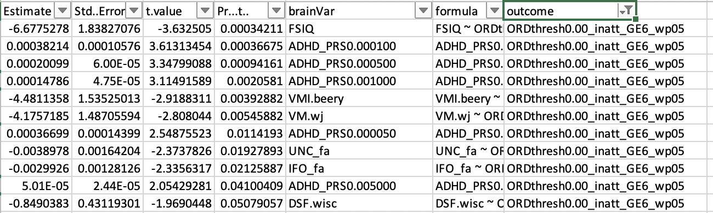

# 2020-02-27 14:24:50

A few more things to do for the baseline prediction paper:

* for the int + ext--- are the same individuals showing both?  Or are they
  unique? It might be better just to combine into 'comorbid' (and yes/no for
  either int or ext).
* trying the same analysis for 2 years out and even 3 year out
* run the 3 and 4 group versions for ML
  * with and without comorbidities and medication
* run the univariate removing the sibs
* voxel-level analysis

## Univariate in best in Family only

That's just doing the univariate analysis and models using the training set.

```r
library(nlme)
library(MASS)

data = readRDS('~/data/baseline_prediction/prs_start/complete_massagedResids_clinDiffGE1_02202020.rds')

brain_vars = colnames(data)[c(42:53, 66:90)]
hold = c()
min_sx = 6
out_fname = '~/data/baseline_prediction/prs_start/univar_allResidClinDiff1_4groupOrdered_BIF.csv'
for (sx in c('inatt', 'hi')) {
    if (sx == 'inatt') {
        thresh = 0
    } else if (sx == 'hi') {
        thresh = -.5
    }
    phen = sprintf('ORDthresh%.2f_%s_GE%d_wp05', abs(thresh), sx, min_sx)

    phen_res = c()
    for (bv in brain_vars) {
        use_me = !is.na(data[, bv]) & data$bestInFamily
        this_data = data[use_me, c(phen, 'FAMID', brain_vars)]
        fm_str = paste(bv, sprintf(" ~ %s", phen), sep="")
        fit = lm(as.formula(fm_str), data=this_data)
        temp = c(summary(fit)$coefficients[sprintf('%s.L', phen), ], bv)
        phen_res = rbind(phen_res, temp)
        rownames(phen_res)[nrow(phen_res)] = fm_str
    }
    phen_res = data.frame(phen_res)
    phen_res$formula = rownames(phen_res)
    phen_res$outcome = phen
    hold = rbind(hold, phen_res)
}
colnames(hold)[5] = 'brainVar'
write.csv(hold, file=out_fname, row.names=F)
```




We still have a good amount of good results. Also note that since we don't have
the family constraint anymore, it's all run using lm instead of lme. Now, let's
see if any of that survives FDR:

```
> ps[p2<.1,c('brainVar', 'outcome')]
           brainVar                      outcome
1              FSIQ ORDthresh0.00_inatt_GE6_wp05
2  ADHD_PRS0.000100 ORDthresh0.00_inatt_GE6_wp05
3         VMI.beery ORDthresh0.00_inatt_GE6_wp05
4             VM.wj ORDthresh0.00_inatt_GE6_wp05
5            UNC_fa ORDthresh0.00_inatt_GE6_wp05
6            IFO_fa ORDthresh0.00_inatt_GE6_wp05
27        VMI.beery    ORDthresh0.50_hi_GE6_wp05
28             FSIQ    ORDthresh0.50_hi_GE6_wp05
29 ADHD_PRS0.001000    ORDthresh0.50_hi_GE6_wp05
30            VM.wj    ORDthresh0.50_hi_GE6_wp05
31           IFO_fa    ORDthresh0.50_hi_GE6_wp05
32           CST_fa    ORDthresh0.50_hi_GE6_wp05
33           UNC_fa    ORDthresh0.50_hi_GE6_wp05
34              OFC    ORDthresh0.50_hi_GE6_wp05
35            CC_fa    ORDthresh0.50_hi_GE6_wp05
36           ILF_fa    ORDthresh0.50_hi_GE6_wp05
> ps[p2<.05,c('brainVar', 'outcome')]
           brainVar                      outcome
1              FSIQ ORDthresh0.00_inatt_GE6_wp05
2  ADHD_PRS0.000100 ORDthresh0.00_inatt_GE6_wp05
3         VMI.beery ORDthresh0.00_inatt_GE6_wp05
4             VM.wj ORDthresh0.00_inatt_GE6_wp05
27        VMI.beery    ORDthresh0.50_hi_GE6_wp05
28             FSIQ    ORDthresh0.50_hi_GE6_wp05
29 ADHD_PRS0.001000    ORDthresh0.50_hi_GE6_wp05
30            VM.wj    ORDthresh0.50_hi_GE6_wp05
31           IFO_fa    ORDthresh0.50_hi_GE6_wp05
32           CST_fa    ORDthresh0.50_hi_GE6_wp05
33           UNC_fa    ORDthresh0.50_hi_GE6_wp05
34              OFC    ORDthresh0.50_hi_GE6_wp05
```

Interestingly, our results seem even a bit better than when using lme and
everyone in the famlies. I'll keep the Q < .1 threshold just so we can try more
variables in the overall model.

Let's present the data descriptives when looking at a single person per family:

```
> data0 = readRDS('~/data/baseline_prediction/prs_start/complete_massagedResids_clinDiffGE1_02202020.rds')
> idx=!is.na(data0[, 'FSIQ']) & data$bestInFamily
> sum(idx)
[1] 248
> table(data0[idx,]$thresh0.00_inatt_GE6_wp05)

     nv012        imp     nonimp notGE6adhd 
        90         74         58         26 
> table(data0[idx,]$thresh0.50_hi_GE6_wp05)

     nv012        imp     nonimp notGE6adhd 
        90         48         84         26 
> idx=!is.na(data0[, 'VMI.beery']) & data$bestInFamily
> sum(idx)
[1] 198
> table(data0[idx,]$thresh0.00_inatt_GE6_wp05)

     nv012        imp     nonimp notGE6adhd 
        73         54         49         22 
> table(data0[idx,]$thresh0.50_hi_GE6_wp05)

     nv012        imp     nonimp notGE6adhd 
        73         35         68         22 
> idx=!is.na(data0[, 'SSB.wisc']) & data$bestInFamily
> sum(idx)
[1] 147
> table(data0[idx,]$thresh0.00_inatt_GE6_wp05)

     nv012        imp     nonimp notGE6adhd 
        54         40         33         20 
> table(data0[idx,]$thresh0.50_hi_GE6_wp05)

     nv012        imp     nonimp notGE6adhd 
        54         27         46         20 
> idx=!is.na(data0[, 'DS.wj']) & data$bestInFamily
> sum(idx)
[1] 209
> table(data0[idx,]$thresh0.00_inatt_GE6_wp05)

     nv012        imp     nonimp notGE6adhd 
        77         64         45         23 
> table(data0[idx,]$thresh0.50_hi_GE6_wp05)

     nv012        imp     nonimp notGE6adhd 
        77         40         69         23 
> idx=!is.na(data0[, 'CC_fa']) & data$bestInFamily
> sum(idx)
[1] 118
> table(data0[idx,]$thresh0.00_inatt_GE6_wp05)

     nv012        imp     nonimp notGE6adhd 
        48         29         27         14 
> table(data0[idx,]$thresh0.50_hi_GE6_wp05)

     nv012        imp     nonimp notGE6adhd 
        48         19         37         14 
> idx=!is.na(data0[, 'parietal']) & data$bestInFamily
> sum(idx)
[1] 179
> table(data0[idx,]$thresh0.00_inatt_GE6_wp05)

     nv012        imp     nonimp notGE6adhd 
        74         48         36         21 
> table(data0[idx,]$thresh0.50_hi_GE6_wp05)

     nv012        imp     nonimp notGE6adhd 
        74         32         52         21 
```

Now we'll go ahead and train the big model for all possible group comparisons:

```r
library(caret)
data = readRDS('~/data/baseline_prediction/prs_start/complete_massagedResids_clinDiffGE1_02202020.rds')
data$externalizing = as.factor(data$externalizing)

set.seed(42)
base_vars = c(colnames(data)[42:53], colnames(data)[74:81])
# anatomical
imp_vars = colnames(data)[66:73]
test = preProcess(data[, c(base_vars, imp_vars)], method = "bagImpute")
data[, c(base_vars, imp_vars)] <- predict(test, data[, c(base_vars, imp_vars)])
# beery, FSIQ, SES
imp_vars = c(colnames(data)[82], 'FSIQ', 'SES')
test = preProcess(data[, c(base_vars, imp_vars)], method = "bagImpute")
data[, c(base_vars, imp_vars)] <- predict(test, data[, c(base_vars, imp_vars)])
# wj
imp_vars = colnames(data)[87:88]
test = preProcess(data[, c(base_vars, imp_vars)], method = "bagImpute")
data[, c(base_vars, imp_vars)] <- predict(test, data[, c(base_vars, imp_vars)])
# wisc
imp_vars = colnames(data)[83:86]
test = preProcess(data[, c(base_vars, imp_vars)], method = "bagImpute")
data[, c(base_vars, imp_vars)] <- predict(test, data[, c(base_vars, imp_vars)])
```

Note that the imputations were done using the entire dataset! I just followed
the same reasoning for the residualization procedures...

But if we're training and testing in separate sets, it makes sense to output the
AUC ROC for testing as well...

```r
library(nnet)
library(pROC)

hi_vars = c('VMI.beery', 'FSIQ', 'ADHD_PRS0.001000', 'VM.wj', 'IFO_fa',
            'CST_fa', 'UNC_fa', 'OFC', 'CC_fa', 'ILF_fa')
inatt_vars = c('FSIQ', 'ADHD_PRS0.000100', 'VMI.beery', 'VM.wj', 'UNC_fa',
               'IFO_fa')
covars = c('base_age', 'sex')
min_sx = 6

for (sx in c('inatt', 'hi')) {
    set.seed(42)
    if (sx == 'inatt') {
        thresh = 0
    } else if (sx == 'hi') {
        thresh = -.5
    }
    phen = sprintf('thresh%.2f_%s_GE%d_wp05', abs(thresh), sx, min_sx)
    eval(parse(text=sprintf('this_data = data[, c(phen, %s_vars, covars)]', sx)))

    scale_me = c()
    for (v in colnames(this_data)) {
        if (!is.factor(this_data[, v])) {
            scale_me = c(scale_me, v)
        }
    }
    this_data[, scale_me] = scale(this_data[, scale_me])
    train_data = this_data[data$bestInFamily, ]
    test_data = this_data[!data$bestInFamily, ]

    eval(parse(text=sprintf('predictors_str=paste(%s_vars, collapse="+")', sx)))
    fm_str = paste(phen, " ~ ", predictors_str, ' + ',
               paste(covars, collapse='+'),
               sep="")
    fit = multinom(as.formula(fm_str), data=train_data, maxit=2000)
    preds = predict(fit, type='prob')
    print(sx)
    print(varImp(fit))
    print('Training')
    print(multiclass.roc(train_data[, phen], preds))
    print('Testing')
    preds = predict(fit, type='prob', newdata=test_data)
    print(multiclass.roc(test_data[, phen], preds))
}
```

```[1] "inatt"
                   Overall
FSIQ             0.8661166
ADHD_PRS0.000100 0.7494406
VMI.beery        1.6304760
VM.wj            0.9524172
UNC_fa           0.5696269
IFO_fa           1.2104161
base_age         1.1636690
sexMale          1.7552965
[1] "Training"
Multi-class area under the curve: 0.7111
[1] "Testing"
Multi-class area under the curve: 0.5301

[1] "hi"
                   Overall
VMI.beery        1.6343695
FSIQ             0.5204622
ADHD_PRS0.001000 0.8102923
VM.wj            0.8112167
IFO_fa           1.0163820
CST_fa           0.6932160
UNC_fa           0.6574942
OFC              0.9627663
CC_fa            0.1377622
ILF_fa           0.5279737
base_age         0.8057607
sexMale          1.8939000
[1] "Training"
Multi-class area under the curve: 0.6982
[1] "Testing"
Multi-class area under the curve: 0.5226

```

Small but noticeable improvement compared to results using everyone, at least in
the training set results, like before.

But since I have already removed age and sex within domain, how does the model
perform if I don't use those covariates?

```r
for (sx in c('inatt', 'hi')) {
    set.seed(42)
    if (sx == 'inatt') {
        thresh = 0
    } else if (sx == 'hi') {
        thresh = -.5
    }
    phen = sprintf('thresh%.2f_%s_GE%d_wp05', abs(thresh), sx, min_sx)
    eval(parse(text=sprintf('this_data = data[, c(phen, %s_vars, covars)]', sx)))

    scale_me = c()
    for (v in colnames(this_data)) {
        if (!is.factor(this_data[, v])) {
            scale_me = c(scale_me, v)
        }
    }
    this_data[, scale_me] = scale(this_data[, scale_me])

    train_data = this_data[data$bestInFamily, ]
    test_data = this_data[!data$bestInFamily, ]

    eval(parse(text=sprintf('predictors_str=paste(%s_vars, collapse="+")', sx)))
    fm_str = paste(phen, " ~ ", predictors_str, sep="")
    fit = multinom(as.formula(fm_str), data=train_data, maxit=2000)
    preds = predict(fit, type='prob')
    print(sx)
    print(varImp(fit))
    print('Training')
    print(multiclass.roc(train_data[, phen], preds))
    print('Testing')
    preds = predict(fit, type='prob', newdata=test_data)
    print(multiclass.roc(test_data[, phen], preds))
}
```

```
[1] "inatt"
                   Overall
FSIQ             0.8319002
ADHD_PRS0.000100 0.7059755
VMI.beery        1.5491612
VM.wj            0.8610355
UNC_fa           0.6025873
IFO_fa           1.2221270
[1] "Training"
Multi-class area under the curve: 0.6846
[1] "Testing"
Multi-class area under the curve: 0.5059

[1] "hi"
                   Overall
VMI.beery        1.4974878
FSIQ             0.5865770
ADHD_PRS0.001000 0.7431735
VM.wj            0.7825820
IFO_fa           1.0440286
CST_fa           0.6721878
UNC_fa           0.7656707
OFC              0.9550509
CC_fa            0.1336807
ILF_fa           0.5499039
[1] "Training"
Multi-class area under the curve: 0.6843
[1] "Testing"
Multi-class area under the curve: 0.5182
```

We take a small hit. Of course, adding the clinical variables will offset
everything in the 4-group comparison, but let's see how it goes anyways,
including both base_sx as Philip had suggested:

```r
hi_vars = c('VMI.beery', 'FSIQ', 'ADHD_PRS0.001000', 'VM.wj', 'IFO_fa',
            'CST_fa', 'UNC_fa', 'OFC', 'CC_fa', 'ILF_fa')
inatt_vars = c('FSIQ', 'ADHD_PRS0.000100', 'VMI.beery', 'VM.wj', 'UNC_fa',
               'IFO_fa')
covars = c('base_age', 'sex', 'externalizing', 'internalizing',
           'medication_status_at_observation', 'base_inatt', 'base_hi')
min_sx = 6

for (sx in c('inatt', 'hi')) {
    set.seed(42)
    if (sx == 'inatt') {
        thresh = 0
    } else if (sx == 'hi') {
        thresh = -.5
    }
    phen = sprintf('thresh%.2f_%s_GE%d_wp05', abs(thresh), sx, min_sx)
    eval(parse(text=sprintf('this_data = data[, c(phen, %s_vars, covars)]',
                            sx)))

    scale_me = c()
    for (v in colnames(this_data)) {
        if (!is.factor(this_data[, v])) {
            scale_me = c(scale_me, v)
        }
    }
    this_data[, scale_me] = scale(this_data[, scale_me])

    train_data = this_data[data$bestInFamily, ]
    test_data = this_data[!data$bestInFamily, ]

    eval(parse(text=sprintf('predictors_str=paste(%s_vars, collapse="+")', sx)))
    fm_str = paste(phen, " ~ ", predictors_str, ' + ', 
               paste(covars, collapse='+'),
               sep="")
    fit = multinom(as.formula(fm_str), data=train_data, maxit=2000)
    preds = predict(fit, type='prob')
    print(sx)
    print(varImp(fit))
    print('Training')
    print(multiclass.roc(train_data[, phen], preds))
    print('Testing')
    preds = predict(fit, type='prob', newdata=test_data)
    print(multiclass.roc(test_data[, phen], preds))
}
```

```
[1] "inatt"
                                        Overall
FSIQ                                  17.227368
ADHD_PRS0.000100                      12.532115
VMI.beery                             18.094597
VM.wj                                  1.103405
UNC_fa                                28.570874
IFO_fa                                47.701066
base_age                              25.507012
sexMale                               90.698817
externalizing1                        30.863702
internalizing1                        46.538386
medication_status_at_observationstim  46.181243
base_inatt                           226.760541
base_hi                              190.141250
[1] "Training"
Multi-class area under the curve: 0.9488
[1] "Testing"
Multi-class area under the curve: 0.8854

[1] "hi"
                                         Overall
VMI.beery                             35.4281302
FSIQ                                   2.0781309
ADHD_PRS0.001000                       0.8614264
VM.wj                                  6.5712259
IFO_fa                                54.1014977
CST_fa                                38.5799032
UNC_fa                                 8.7553706
OFC                                   45.1392635
CC_fa                                 25.4474924
ILF_fa                                15.0652262
base_age                              31.4485195
sexMale                               73.0388339
externalizing1                        23.7040197
internalizing1                       130.1031611
medication_status_at_observationstim  17.3718465
base_inatt                           233.5769811
base_hi                              183.6550184
[1] "Training"
Multi-class area under the curve: 0.9592
[1] "Testing"
Multi-class area under the curve: 0.8985
```

Adding the clinical variables is almost unfair, given how the groups are defined
on them. But it gives us an idea of how things play out in the 4-group case.

Does it make a difference if we combine the comorbidity variable?

```r
data$comorbidity = as.factor(data$internalizing==1 | data$externalizing==1)
hi_vars = c('VMI.beery', 'FSIQ', 'ADHD_PRS0.001000', 'VM.wj', 'IFO_fa',
            'CST_fa', 'UNC_fa', 'OFC', 'CC_fa', 'ILF_fa')
inatt_vars = c('FSIQ', 'ADHD_PRS0.000100', 'VMI.beery', 'VM.wj', 'UNC_fa',
               'IFO_fa')
covars = c('base_age', 'sex', 'comorbidity',
           'medication_status_at_observation', 'base_inatt', 'base_hi')
min_sx = 6

for (sx in c('inatt', 'hi')) {
    set.seed(42)
    if (sx == 'inatt') {
        thresh = 0
    } else if (sx == 'hi') {
        thresh = -.5
    }
    phen = sprintf('thresh%.2f_%s_GE%d_wp05', abs(thresh), sx, min_sx)
    eval(parse(text=sprintf('this_data = data[, c(phen, %s_vars, covars)]',
                            sx)))

    scale_me = c()
    for (v in colnames(this_data)) {
        if (!is.factor(this_data[, v])) {
            scale_me = c(scale_me, v)
        }
    }
    this_data[, scale_me] = scale(this_data[, scale_me])

    train_data = this_data[data$bestInFamily, ]
    test_data = this_data[!data$bestInFamily, ]

    eval(parse(text=sprintf('predictors_str=paste(%s_vars, collapse="+")', sx)))
    fm_str = paste(phen, " ~ ", predictors_str, ' + ', 
               paste(covars, collapse='+'),
               sep="")
    fit = multinom(as.formula(fm_str), data=train_data, maxit=2000)
    preds = predict(fit, type='prob')
    print(sx)
    print(varImp(fit))
    print('Training')
    print(multiclass.roc(train_data[, phen], preds))
    print('Testing')
    preds = predict(fit, type='prob', newdata=test_data)
    print(multiclass.roc(test_data[, phen], preds))
}
```

```
[1] "inatt"
                                        Overall
FSIQ                                  18.624754
ADHD_PRS0.000100                      12.443666
VMI.beery                             18.032993
VM.wj                                  2.414744
UNC_fa                                27.593640
IFO_fa                                45.725567
base_age                              23.258661
sexMale                               86.539284
comorbidityTRUE                        5.855328
medication_status_at_observationstim  44.727938
base_inatt                           223.025598
base_hi                              187.097349
[1] "Training"
Multi-class area under the curve: 0.9478
[1] "Testing"
Multi-class area under the curve: 0.8822

[1] "hi"
                                        Overall
VMI.beery                             26.333547
FSIQ                                   4.974848
ADHD_PRS0.001000                       4.693119
VM.wj                                  6.884322
IFO_fa                                42.157449
CST_fa                                30.606890
UNC_fa                                15.523014
OFC                                   42.258845
CC_fa                                  8.996761
ILF_fa                                12.374705
base_age                              18.508738
sexMale                               55.139186
comorbidityTRUE                       11.148041
medication_status_at_observationstim  14.666384
base_inatt                           215.107091
base_hi                              159.219788
[1] "Training"
Multi-class area under the curve: 0.9578
[1] "Testing"
Multi-class area under the curve: 0.8952
```

There wasn't much to improve, so that's not really that impressive. If anything,
we take a small hit in the test set results. Maybe the
differences will be more evident in comparing fewer groups. For reference,
there's actually 0 overlap:

```r
> table(data$internalizing, data$externalizing)
   
      0   1
  0 349  28
  1  12   0
```

Let's start removing groups and check the variable contributions.

```r
hi_vars = c('VMI.beery', 'FSIQ', 'ADHD_PRS0.001000', 'VM.wj', 'IFO_fa',
            'CST_fa', 'UNC_fa', 'OFC', 'CC_fa', 'ILF_fa')
inatt_vars = c('FSIQ', 'ADHD_PRS0.000100', 'VMI.beery', 'VM.wj', 'UNC_fa',
               'IFO_fa')
covars = c('base_age', 'sex', 'externalizing', 'internalizing',
           'medication_status_at_observation', 'base_inatt', 'base_hi')
min_sx = 6
# covars = c('base_age', 'sex')

for (sx in c('inatt', 'hi')) {
    set.seed(42)
    if (sx == 'inatt') {
        thresh = 0
    } else if (sx == 'hi') {
        thresh = -.5
    }
    phen = sprintf('thresh%.2f_%s_GE%d_wp05', abs(thresh), sx, min_sx)
    eval(parse(text=sprintf('this_data = data[, c(phen, %s_vars, covars)]',
                            sx)))

    idx = this_data[, phen] != 'nv012'
    this_data = this_data[idx,]
    this_data[, phen] = factor(this_data[, phen], ordered=F)
    this_data[, phen] = relevel(this_data[, phen], ref='notGE6adhd')

    scale_me = c()
    for (v in colnames(this_data)) {
        if (!is.factor(this_data[, v])) {
            scale_me = c(scale_me, v)
        }
    }
    this_data[, scale_me] = scale(this_data[, scale_me])

    train_data = this_data[data[idx,]$bestInFamily, ]
    test_data = this_data[!data[idx,]$bestInFamily, ]

    eval(parse(text=sprintf('predictors_str=paste(%s_vars, collapse="+")', sx)))
    fm_str = paste(phen, " ~ ", predictors_str, ' + ', 
               paste(covars, collapse='+'),
               sep="")
    fit = multinom(as.formula(fm_str), data=train_data, maxit=2000)
    preds = predict(fit, type='prob')
    print(sx)
    print(varImp(fit))
    print('Training')
    print(multiclass.roc(train_data[, phen], preds))
    print('Testing')
    preds = predict(fit, type='prob', newdata=test_data)
    print(multiclass.roc(test_data[, phen], preds))
}
```

```
[[1] "inatt"
                   Overall
FSIQ             1.0768356
ADHD_PRS0.000100 0.8667716
VMI.beery        0.4359439
VM.wj            0.2792780
UNC_fa           0.8218467
IFO_fa           0.5250947
base_age         0.9417881
sexMale          0.3852942
[1] "Training"
Multi-class area under the curve: 0.7392
[1] "Testing"
Multi-class area under the curve: 0.5109

[1] "hi"
                   Overall
VMI.beery        0.1404841
FSIQ             1.0228249
ADHD_PRS0.001000 0.6710404
VM.wj            0.2208487
IFO_fa           0.5711292
CST_fa           0.7304572
UNC_fa           0.7985272
OFC              0.5075290
CC_fa            0.0730118
ILF_fa           0.5797099
base_age         0.5113388
sexMale          0.4421615
[1] "Training"
Multi-class area under the curve: 0.6958
[1] "Testing"
Multi-class area under the curve: 0.5183
```

Results in 3 group analysis weren't that different than 4-group, without
clinicals.

```
[1] "inatt"
                                       Overall
FSIQ                                 0.6868885
ADHD_PRS0.000100                     1.5650928
VMI.beery                            0.5379229
VM.wj                                0.4644654
UNC_fa                               0.7814856
IFO_fa                               0.9637408
base_age                             0.7573264
sexMale                              0.6771235
externalizing1                       1.8957754
internalizing1                       1.4033370
medication_status_at_observationstim 3.7130767
base_inatt                           5.8763050
base_hi                              4.3437574
[1] "Training"
Multi-class area under the curve: 0.8976
[1] "Testing"
Multi-class area under the curve: 0.8078

[1] "hi"
                                        Overall
VMI.beery                             1.2887049
FSIQ                                  1.0296494
ADHD_PRS0.001000                      0.8184494
VM.wj                                 0.4382107
IFO_fa                                1.7124033
CST_fa                                1.0789335
UNC_fa                                1.4343952
OFC                                   0.6655781
CC_fa                                 0.2112530
ILF_fa                                1.0723956
base_age                              0.4561639
sexMale                               1.5665522
externalizing1                        2.7853488
internalizing1                       18.4188042
medication_status_at_observationstim  3.8598643
base_inatt                            5.7487234
base_hi                               6.8719414
[1] "Training"
Multi-class area under the curve: 0.9185
[1] "Testing"
Multi-class area under the curve: 0.8236
```

Results in 3-group classification are still quite decent. The variable
contribution ratio is still somewhat disproportional though! Do we now see a
difference in using the combined comorbidity variable?

```
[1] "inatt"
                                       Overall
FSIQ                                 0.5947653
ADHD_PRS0.000100                     1.5312364
VMI.beery                            0.5906524
VM.wj                                0.4826210
UNC_fa                               0.8339495
IFO_fa                               0.9421010
base_age                             0.8039787
sexMale                              0.5065841
comorbidityTRUE                      0.9944452
medication_status_at_observationstim 3.5703493
base_inatt                           5.7319199
base_hi                              4.1511415
[1] "Training"
Multi-class area under the curve: 0.8956
[1] "Testing"
Multi-class area under the curve: 0.8035

[1] "hi"
                                       Overall
VMI.beery                            1.4778218
FSIQ                                 0.9725729
ADHD_PRS0.001000                     0.9859269
VM.wj                                0.3691108
IFO_fa                               1.6997321
CST_fa                               1.0762583
UNC_fa                               1.3810073
OFC                                  0.6553627
CC_fa                                0.5341171
ILF_fa                               0.9821676
base_age                             0.5410291
sexMale                              1.3127386
comorbidityTRUE                      2.6682452
medication_status_at_observationstim 3.8043715
base_inatt                           5.7791101
base_hi                              6.7324242
[1] "Training"
Multi-class area under the curve: 0.9157
[1] "Testing"
Multi-class area under the curve: 0.832
```

Not really... maybe in the 2 group comparison? Let's run the regular stuff
first.

```r
hi_vars = c('VMI.beery', 'FSIQ', 'ADHD_PRS0.001000', 'VM.wj', 'IFO_fa',
            'CST_fa', 'UNC_fa', 'OFC', 'CC_fa', 'ILF_fa')
inatt_vars = c('FSIQ', 'ADHD_PRS0.000100', 'VMI.beery', 'VM.wj', 'UNC_fa',
               'IFO_fa')
covars = c('base_age', 'sex', 'externalizing', 'internalizing',
           'medication_status_at_observation', 'base_inatt', 'base_hi')
min_sx = 6
# covars = c('base_age', 'sex')

for (sx in c('inatt', 'hi')) {
    set.seed(42)
    if (sx == 'inatt') {
        thresh = 0
    } else if (sx == 'hi') {
        thresh = -.5
    }
    phen = sprintf('thresh%.2f_%s_GE%d_wp05', abs(thresh), sx, min_sx)
    eval(parse(text=sprintf('this_data = data[, c(phen, %s_vars, covars)]',
                            sx)))

    idx = this_data[, phen] != 'nv012' & this_data[, phen] != 'notGE6adhd'
    this_data = this_data[idx,]
    this_data[, phen] = factor(this_data[, phen], ordered=F)
    this_data[, phen] = relevel(this_data[, phen], ref='nonimp')

    scale_me = c()
    for (v in colnames(this_data)) {
        if (!is.factor(this_data[, v])) {
            scale_me = c(scale_me, v)
        }
    }
    this_data[, scale_me] = scale(this_data[, scale_me])

    train_data = this_data[data[idx,]$bestInFamily, ]
    test_data = this_data[!data[idx,]$bestInFamily, ]

    eval(parse(text=sprintf('predictors_str=paste(%s_vars, collapse="+")', sx)))
    fm_str = paste(phen, " ~ ", predictors_str, ' + ', 
               paste(covars, collapse='+'),
               sep="")
    fit = multinom(as.formula(fm_str), data=train_data, maxit=2000)
    preds = predict(fit, type='prob')
    print(sx)
    print(varImp(fit))
    print('Training')
    print(multiclass.roc(train_data[, phen], preds))
    print('Testing')
    preds = predict(fit, type='prob', newdata=test_data)
    print(multiclass.roc(test_data[, phen], preds))
}
```

```
[1] "inatt"
                   Overall
FSIQ             0.3578007
ADHD_PRS0.000100 0.5209038
VMI.beery        0.4005843
VM.wj            0.1820265
UNC_fa           0.3470803
IFO_fa           0.3957306
base_age         0.8786626
sexMale          0.1646199
[1] "Training"
Multi-class area under the curve: 0.7906
[1] "Testing"
Multi-class area under the curve: 0.6036

[1] "hi"
                    Overall
VMI.beery        0.08629695
FSIQ             0.05164196
ADHD_PRS0.001000 0.30464203
VM.wj            0.22393342
IFO_fa           0.50942498
CST_fa           0.79182581
UNC_fa           0.87734909
OFC              0.63884747
CC_fa            0.06512419
ILF_fa           0.39507463
base_age         0.51838329
sexMale          0.28964318
[1] "Training"
Multi-class area under the curve: 0.7731
[1] "Testing"
Multi-class area under the curve: 0.5473
```

The 2-class results actually go close to .8 in the training set, even without
the clinical domain. Not so great in the test set, though. 

```
[1] "inatt"
                                       Overall
FSIQ                                 0.3993820
ADHD_PRS0.000100                     0.6029834
VMI.beery                            0.3318604
VM.wj                                0.4530517
UNC_fa                               0.5065334
IFO_fa                               0.4680162
base_age                             0.6736117
sexMale                              0.3294400
externalizing1                       0.7231593
internalizing1                       1.0901696
medication_status_at_observationstim 0.8278131
base_inatt                           1.4724141
base_hi                              0.1250815
[1] "Training"
Multi-class area under the curve: 0.8736
[1] "Testing"
Multi-class area under the curve: 0.7054

[1] "hi"
                                         Overall
VMI.beery                             0.72865519
FSIQ                                  0.18599083
ADHD_PRS0.001000                      0.52314867
VM.wj                                 0.10705836
IFO_fa                                1.28123056
CST_fa                                0.93607418
UNC_fa                                1.30572231
OFC                                   0.67480859
CC_fa                                 0.17604005
ILF_fa                                0.47076809
base_age                              0.01307683
sexMale                               0.20511508
externalizing1                        2.40921801
internalizing1                       13.26577391
medication_status_at_observationstim  0.46798592
base_inatt                            0.46978568
base_hi                               2.47853920
[1] "Training"
Multi-class area under the curve: 0.8827
[1] "Testing"
Multi-class area under the curve: 0.7641
```

So, using the clinical domain it wasn't so bad for the 2-class case. Even the
test data is not so poor. Is it better if using the combined comorbidity
variable?

```
[1] "inatt"
                                       Overall
FSIQ                                 0.4198420
ADHD_PRS0.000100                     0.5732467
VMI.beery                            0.3295058
VM.wj                                0.4586694
UNC_fa                               0.5087190
IFO_fa                               0.4554974
base_age                             0.7022477
sexMale                              0.3746987
comorbidityTRUE                      0.5960459
medication_status_at_observationstim 0.7999782
base_inatt                           1.4439887
base_hi                              0.1022036
[1] "Training"
Multi-class area under the curve: 0.8703
[1] "Testing"
Multi-class area under the curve: 0.6929

[1] "hi"
                                         Overall
VMI.beery                            0.749188627
FSIQ                                 0.195550923
ADHD_PRS0.001000                     0.525987726
VM.wj                                0.116573170
IFO_fa                               1.290089471
CST_fa                               0.945963604
UNC_fa                               1.309552343
OFC                                  0.680313067
CC_fa                                0.183000335
ILF_fa                               0.469806953
base_age                             0.007645677
sexMale                              0.216729691
comorbidityTRUE                      2.505366306
medication_status_at_observationstim 0.481250085
base_inatt                           0.490572630
base_hi                              2.496504760
[1] "Training"
Multi-class area under the curve: 0.8822
[1] "Testing"
Multi-class area under the curve: 0.7737
```

Only slightly better...

## Results using 2 or 3 years off

```r
library(nlme)
library(MASS)

data = readRDS('~/data/baseline_prediction/prs_start/complete_massagedResids_clinDiffGE3_02202020.rds')

brain_vars = colnames(data)[c(42:53, 66:90)]
hold = c()
min_sx = 6
out_fname = '~/data/baseline_prediction/prs_start/univar_allResidClinDiff3_4groupOrdered_BIF.csv'
for (sx in c('inatt', 'hi')) {
    if (sx == 'inatt') {
        thresh = 0
    } else if (sx == 'hi') {
        thresh = -.5
    }
    phen = sprintf('ORDthresh%.2f_%s_GE%d_wp05', abs(thresh), sx, min_sx)

    phen_res = c()
    for (bv in brain_vars) {
        use_me = !is.na(data[, bv]) & data$bestInFamily
        this_data = data[use_me, c(phen, 'FAMID', brain_vars)]
        fm_str = paste(bv, sprintf(" ~ %s", phen), sep="")
        fit = lm(as.formula(fm_str), data=this_data)
        temp = c(summary(fit)$coefficients[sprintf('%s.L', phen), ], bv)
        phen_res = rbind(phen_res, temp)
        rownames(phen_res)[nrow(phen_res)] = fm_str
    }
    phen_res = data.frame(phen_res)
    phen_res$formula = rownames(phen_res)
    phen_res$outcome = phen
    hold = rbind(hold, phen_res)
}
colnames(hold)[5] = 'brainVar'
write.csv(hold, file=out_fname, row.names=F)
```

First, 2 years clinical difference, univariate analysis:


Then, 3 years clinical difference:


Results are quite consistent. I wonder if they would even survive FDR,
considering that we'd be losing some numbers. For example, here are the group
splits for the genomic domain, which is the biggest one by design:

```r
> data = readRDS('~/data/baseline_prediction/prs_start/complete_massagedResids_clinDiffGE2_02202020.rds')
> dim(data)
[1] 340  93
> summary(data$ORDthresh0.00_inatt_GE6_wp05)
     nv012 notGE6adhd        imp     nonimp 
       132         39        104         65 
> summary(data$ORDthresh0.50_hi_GE6_wp05)
     nv012 notGE6adhd        imp     nonimp 
       132         39         71         98 
> data = readRDS('~/data/baseline_prediction/prs_start/complete_massagedResids_clinDiffGE3_02202020.rds')
> dim(data)
[1] 305  93
> summary(data$ORDthresh0.00_inatt_GE6_wp05)
     nv012 notGE6adhd        imp     nonimp 
       119         36         93         57 
> summary(data$ORDthresh0.50_hi_GE6_wp05)
     nv012 notGE6adhd        imp     nonimp 
       119         36         64         86 
```

Let's then check what FDR gives us (clinDiff2 comes first):

```
> ps[p2<.1, c('brainVar', 'outcome')]
           brainVar                      outcome
1              FSIQ ORDthresh0.00_inatt_GE6_wp05
2             VM.wj ORDthresh0.00_inatt_GE6_wp05
3  ADHD_PRS0.000100 ORDthresh0.00_inatt_GE6_wp05
4               OFC ORDthresh0.00_inatt_GE6_wp05
5         VMI.beery ORDthresh0.00_inatt_GE6_wp05
6          DSF.wisc ORDthresh0.00_inatt_GE6_wp05
7            ILF_fa ORDthresh0.00_inatt_GE6_wp05
8            ATR_fa ORDthresh0.00_inatt_GE6_wp05
9               SES ORDthresh0.00_inatt_GE6_wp05
27              OFC    ORDthresh0.50_hi_GE6_wp05
28            VM.wj    ORDthresh0.50_hi_GE6_wp05
29             FSIQ    ORDthresh0.50_hi_GE6_wp05
30        VMI.beery    ORDthresh0.50_hi_GE6_wp05
31 ADHD_PRS0.000500    ORDthresh0.50_hi_GE6_wp05
32         DSF.wisc    ORDthresh0.50_hi_GE6_wp05
33           ATR_fa    ORDthresh0.50_hi_GE6_wp05
34           ILF_fa    ORDthresh0.50_hi_GE6_wp05
35           CST_fa    ORDthresh0.50_hi_GE6_wp05
36           IFO_fa    ORDthresh0.50_hi_GE6_wp05
37            DS.wj    ORDthresh0.50_hi_GE6_wp05
> ps[p2<.05, c('brainVar', 'outcome')]
           brainVar                      outcome
1              FSIQ ORDthresh0.00_inatt_GE6_wp05
2             VM.wj ORDthresh0.00_inatt_GE6_wp05
3  ADHD_PRS0.000100 ORDthresh0.00_inatt_GE6_wp05
4               OFC ORDthresh0.00_inatt_GE6_wp05
27              OFC    ORDthresh0.50_hi_GE6_wp05
28            VM.wj    ORDthresh0.50_hi_GE6_wp05
29             FSIQ    ORDthresh0.50_hi_GE6_wp05
30        VMI.beery    ORDthresh0.50_hi_GE6_wp05
> ps = read.csv('~/tmp/Book1.csv')
> p2 = p.adjust(ps$Pr...t.., method='fdr')
> ps[p2<.1, c('brainVar', 'outcome')]
           brainVar                      outcome
1              FSIQ ORDthresh0.00_inatt_GE6_wp05
2  ADHD_PRS0.000500 ORDthresh0.00_inatt_GE6_wp05
3          DSF.wisc ORDthresh0.00_inatt_GE6_wp05
4             VM.wj ORDthresh0.00_inatt_GE6_wp05
5               OFC ORDthresh0.00_inatt_GE6_wp05
6            IFO_fa ORDthresh0.00_inatt_GE6_wp05
7            CST_fa ORDthresh0.00_inatt_GE6_wp05
8            insula ORDthresh0.00_inatt_GE6_wp05
27             FSIQ    ORDthresh0.50_hi_GE6_wp05
28           IFO_fa    ORDthresh0.50_hi_GE6_wp05
29           CST_fa    ORDthresh0.50_hi_GE6_wp05
30            VM.wj    ORDthresh0.50_hi_GE6_wp05
31              OFC    ORDthresh0.50_hi_GE6_wp05
32 ADHD_PRS0.000500    ORDthresh0.50_hi_GE6_wp05
33         DSF.wisc    ORDthresh0.50_hi_GE6_wp05
34           ILF_fa    ORDthresh0.50_hi_GE6_wp05
35           ATR_fa    ORDthresh0.50_hi_GE6_wp05
> ps[p2<.05, c('brainVar', 'outcome')]
           brainVar                      outcome
1              FSIQ ORDthresh0.00_inatt_GE6_wp05
2  ADHD_PRS0.000500 ORDthresh0.00_inatt_GE6_wp05
3          DSF.wisc ORDthresh0.00_inatt_GE6_wp05
4             VM.wj ORDthresh0.00_inatt_GE6_wp05
27             FSIQ    ORDthresh0.50_hi_GE6_wp05
28           IFO_fa    ORDthresh0.50_hi_GE6_wp05
29           CST_fa    ORDthresh0.50_hi_GE6_wp05
30            VM.wj    ORDthresh0.50_hi_GE6_wp05
31              OFC    ORDthresh0.50_hi_GE6_wp05
32 ADHD_PRS0.000500    ORDthresh0.50_hi_GE6_wp05
33         DSF.wisc    ORDthresh0.50_hi_GE6_wp05
34           ILF_fa    ORDthresh0.50_hi_GE6_wp05
```

Well, some results might actually be a bit better than the 1year diff results,
even though the overall N is not as impressive. How to decide? Maybe based on ML
results? Or big model for 2 class?

# 2020-02-28 08:41:14

Let's run the ML experiments and then we can decide whether to go big model for
the other two clinical thresholds as well.

Because now I have all kinds of different variables to play with, let's create a
table to store all these results
(data/baseline_prediction/prs_start/train_test.xlsx).

I'll start with hdda results just to see how it goes, using the non-imputed
classes, and see how that goes.

```bash
cd ~/data/baseline_prediction/prs_start
my_script=~/research_code/baseline_prediction/stacked_2group.R;
for sx in inatt hi; do
    for cd in 1 2 3; do
        for cm in "T F" "T T" "F F"; do
            for imp in T F; do
                Rscript $my_script $sx hdda C5.0Tree $cd $cm $imp ~/tmp/resids_2group.csv;
            done;
        done;
    done;
done

cd ~/data/baseline_prediction/prs_start
my_script=~/research_code/baseline_prediction/stacked_3group.R;
for sx in inatt hi; do
    for cd in 1 2 3; do
        for cm in "T F" "T T" "F F"; do
            for imp in T F; do
                Rscript $my_script $sx hdda C5.0Tree $cd $cm $imp ~/tmp/resids_3group.csv;
            done;
        done;
    done;
done

cd ~/data/baseline_prediction/prs_start
my_script=~/research_code/baseline_prediction/stacked_4group.R;
for sx in inatt hi; do
    for cd in 1 2 3; do
        for cm in "T F" "T T" "F F"; do
            for imp in T F; do
                Rscript $my_script $sx hdda C5.0Tree $cd $cm $imp ~/tmp/resids_4group.csv;
            done;
        done;
    done;
done
```

Instead of trying all kinds of different classifiers, which will take forever,
let's start with the ones that had the best results in the past, and go from
there:

best classifiers:
hdda
rda
stepLDA
glmStepAIC
dwdLinear
bayesglm
earth
LogitBoost
kernelpls
cforest

best ensemblers:
rpart
glm
glmStepAIC
rpart2
C5.0Tree

Maybe there's a better way to split this using parallel?

```bash
g=4
cd ~/data/baseline_prediction/prs_start
my_script=~/research_code/baseline_prediction/stacked_${g}group.R;
out_file=swarm.${g}group
for clf in hdda rda stepLDA glmStepAIC dwdLinear bayesglm earth LogitBoost \
    kernelpls cforest; do
    for ens in rpart glm glmStepAIC rpart2 C5.0Tree; do
        for sx in inatt hi; do
            for cd in 1 2 3; do
                for cm in "T F" "T T" "F F"; do
                    for imp in T F; do
                        echo "Rscript $my_script $sx $clf $ens $cd $cm $imp ~/tmp/resids_${g}group.csv;" >> $out_file;
                    done;
                done;
            done;
        done
    done;
done

swarm -g 10 -t 1 --job-name group${g} --time 15:00 -f $out_file \
    -m R --partition quick --logdir trash
```

Instead of checking what's the best combination of parameters manually, let's
just brute-force it. The score will be the average of the test_AUC among the
three group comparisons. We will ignore NAs for now, but I'll also try it taking
them into consideration to see if there are errors for me to re-run:

```r
params = c()
scores = c()
res = read.csv('~/tmp/res.csv')
for (clf in unique(res$model)) {
    for (ens in unique(res$ensemble)) {
        for (cd in unique(res$clin_diff)) {
            for (uc in unique(res$use_clinical)) {
                for (um in unique(res$use_meds)) {
                    idx = (res$model == clf & res$ensemble == ens &
                           res$clin_diff == cd & res$use_clinical == uc &
                           res$use_meds == um)
                    pos = which(idx)
                    if (length(pos) > 0) {
                        my_str = paste(c(clf, ens, cd, uc, um), collapse='_')
                        params = c(params, my_str)
                        scores = c(scores, mean(res[pos, 'test_AUC']))
                    }
                }
            }
        }
    }
}
print(params[which.max(scores)])
```

Interesting that after all this work, hdda_C5.0Tree_1_TRUE_FALSE is still the
best :)

Forgot impute_vote...

```r
params = c()
scores = c()
res = read.csv('~/tmp/res.csv')
for (clf in unique(res$model)) {
    for (ens in unique(res$ensemble)) {
        for (cd in unique(res$clin_diff)) {
            for (uc in unique(res$use_clinical)) {
                for (um in unique(res$use_meds)) {
                    for (iv in unique(res$impute_vote)) {
                        idx = (res$model == clf & res$ensemble == ens &
                               res$clin_diff == cd & res$use_clinical == uc &
                               res$use_meds == um & res$impute_vote == iv)
                        pos = which(idx)
                        if (length(pos) > 0) {
                            my_str = paste(c(clf, ens, cd, iv, uc, um), collapse='_')
                            params = c(params, my_str)
                            scores = c(scores, mean(res[pos, 'test_AUC']))
                        }
                    }
                }
            }
        }
    }
}
print(params[which.max(scores)])
```

Still similar, but apparently we choose to impute the voting...

"hdda_C5.0Tree_1_TRUE_TRUE_FALSE"

If I select based on just the 2-class discrimination, then I go with:

```r
params = c()
scores = c()
res = read.csv('~/tmp/res.csv')
for (clf in unique(res$model)) {
    for (ens in unique(res$ensemble)) {
        for (cd in unique(res$clin_diff)) {
            for (uc in unique(res$use_clinical)) {
                for (um in unique(res$use_meds)) {
                    for (iv in unique(res$impute_vote)) {
                        idx = (res$model == clf & res$ensemble == ens &
                               res$clin_diff == cd & res$use_clinical == uc &
                               res$use_meds == um & res$impute_vote == iv &
                               res$num_groups == 2)
                        pos = which(idx)
                        if (length(pos) > 0) {
                            my_str = paste(c(clf, ens, cd, iv, uc, um), collapse='_')
                            params = c(params, my_str)
                            scores = c(scores, mean(res[pos, 'test_AUC']))
                        }
                    }
                }
            }
        }
    }
}
print(params[which.max(scores)])
```

The results for earth_glm_1_FALSE_TRUE_TRUE didn't run all the way for hi... 

## Back to big model

Let's also check whether the big model performs better or worse in the other
clinDiff datasets. I'll put the results in a new tab of the compilation file.

I'm not going to re-copy the code, just the variables that will change for the 2
and 3 clinDiff datasets:

```r
# clinDiff2
hi_vars = c('OFC', 'VM.wj', 'FSIQ', 'VMI.beery', 'ADHD_PRS0.000500',
            'DSF.wisc', 'ATR_fa', 'ILF_fa', 'CST_fa', 'IFO_fa', 'DS.wj')
inatt_vars = c('FSIQ', 'VM.wj', 'ADHD_PRS0.000100', 'OFC', 'VMI.beery',
               'DSF.wisc', 'ILF_fa', 'ATR_fa', 'SES')

# clinDiff3
hi_vars = c('FSIQ', 'IFO_fa', 'CST_fa', 'VM.wj', 'OFC', 'ADHD_PRS0.000500',
            'DSF.wisc', 'ILF_fa', 'ATR_fa')
inatt_vars = c('FSIQ', 'ADHD_PRS0.000500', 'DSF.wisc', 'VM.wj', 'OFC',
               'IFO_fa', 'CST_fa', 'insula')

covars = c('base_age', 'sex', 'externalizing', 'internalizing',
           'medication_status_at_observation', 'base_inatt', 'base_hi')
covars = c('base_age', 'sex', 'comorbidity',
           'medication_status_at_observation', 'base_inatt', 'base_hi')
covars = c('base_age', 'sex')
min_sx = 6

data$comorbidity = as.factor(data$internalizing==1 | data$externalizing==1)
```

Here's a picture summarizing the results, in case I screw up the table...


# TODO
