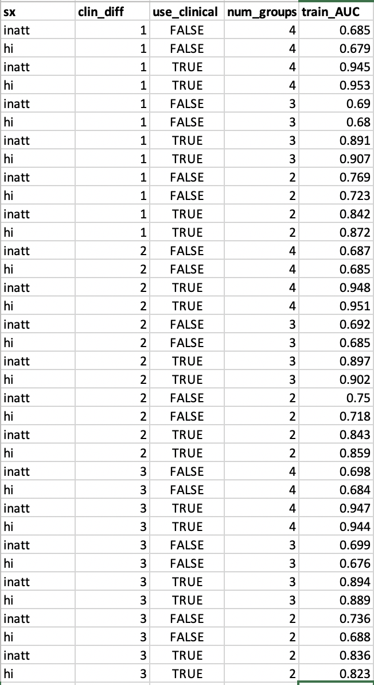
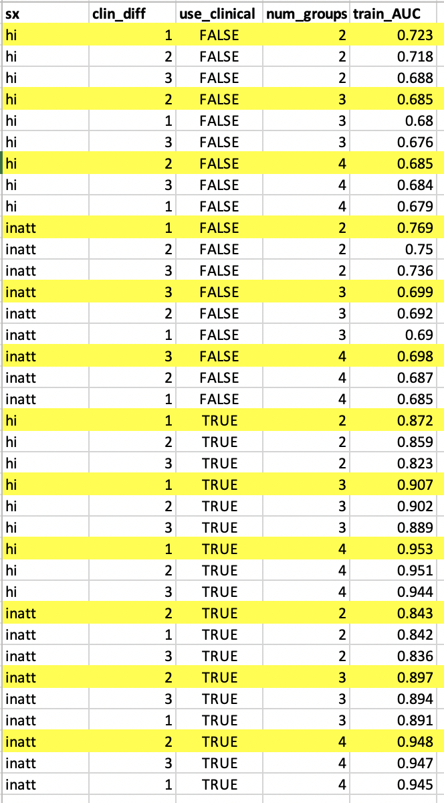

# 2020-03-02 10:11:52

Let's compile all the results here, but making sure that I select the best
clinDiff using the entire dataset.

First, let's ressurrect the clinDiff 1 results for comparison:

```r
> data = readRDS('~/data/baseline_prediction/prs_start/complete_massagedResids_clinDiffGE1_02202020.rds')
> dim(data)
[1] 389  93
> summary(data$ORDthresh0.00_inatt_GE6_wp05)
     nv012 notGE6adhd        imp     nonimp 
       157         45        115         72 
> summary(data$ORDthresh0.50_hi_GE6_wp05)
     nv012 notGE6adhd        imp     nonimp 
       157         45         76        111 
> data = readRDS('~/data/baseline_prediction/prs_start/complete_massagedResids_clinDiffGE2_02202020.rds')
> dim(data)
[1] 340  93
> summary(data$ORDthresh0.00_inatt_GE6_wp05)
     nv012 notGE6adhd        imp     nonimp 
       132         39        104         65 
> summary(data$ORDthresh0.50_hi_GE6_wp05)
     nv012 notGE6adhd        imp     nonimp 
       132         39         71         98 
> data = readRDS('~/data/baseline_prediction/prs_start/complete_massagedResids_clinDiffGE3_02202020.rds')
> dim(data)
[1] 305  93
> summary(data$ORDthresh0.00_inatt_GE6_wp05)
     nv012 notGE6adhd        imp     nonimp 
       119         36         93         57 
> summary(data$ORDthresh0.50_hi_GE6_wp05)
     nv012 notGE6adhd        imp     nonimp 
       119         36         64         86 
```

```r
library(nlme)
library(MASS)

for (cd in 1:3) {
    data = readRDS(sprintf('~/data/baseline_prediction/prs_start/complete_massagedResids_clinDiffGE%d_02202020.rds', cd))

    brain_vars = colnames(data)[c(42:53, 66:90)]
    hold = c()
    min_sx = 6
    out_fname = sprintf('~/data/baseline_prediction/prs_start/univar_allResidClinDiff%d_4groupOrdered_lme.csv', cd)
    for (sx in c('inatt', 'hi')) {
        if (sx == 'inatt') {
            thresh = 0
        } else if (sx == 'hi') {
            thresh = -.5
        }
        phen = sprintf('ORDthresh%.2f_%s_GE%d_wp05', abs(thresh), sx, min_sx)

        phen_res = c()
        for (bv in brain_vars) {
            use_me = !is.na(data[, bv]) & data$bestInFamily
            this_data = data[use_me, c(phen, 'FAMID', brain_vars)]
            fm_str = paste(bv, sprintf(" ~ %s", phen), sep="")
            fit = try(lme(as.formula(fm_str), ~1|FAMID, data=this_data, method='ML'))
            if (length(fit)>1) {
                temp = c(summary(fit)$tTable[sprintf('%s.L', phen), ],
                            summary(fit)$logLik, summary(fit)$AIC, summary(fit)$BIC,
                            bv, 'linear')
                phen_res = rbind(phen_res, temp)
                rownames(phen_res)[nrow(phen_res)] = fm_str
                temp = c(summary(fit)$tTable[sprintf('%s.Q', phen), ],
                            summary(fit)$logLik, summary(fit)$AIC, summary(fit)$BIC,
                            bv, 'quadratic')
                phen_res = rbind(phen_res, temp)
                rownames(phen_res)[nrow(phen_res)] = fm_str
                temp = c(summary(fit)$tTable[sprintf('%s.C', phen), ],
                            summary(fit)$logLik, summary(fit)$AIC, summary(fit)$BIC,
                            bv, 'cubic')
                phen_res = rbind(phen_res, temp)
                rownames(phen_res)[nrow(phen_res)] = fm_str
            } else {
                # fit broke
                temp = rep(NA, 10)
                phen_res = rbind(phen_res, temp)
                rownames(phen_res)[nrow(phen_res)] = fm_str
            }
        }
        phen_res = data.frame(phen_res)
        phen_res$formula = rownames(phen_res)
        phen_res$outcome = phen
        hold = rbind(hold, phen_res)
    }
    colnames(hold)[6:10] = c('logLik', 'AIC', 'BIC', 'brainVar', 'modtype')
    write.csv(hold, file=out_fname, row.names=F)
}
```

We can actually do the univariate filtering all within R:

```r
cd = 1
res = read.csv(sprintf('~/data/baseline_prediction/prs_start/univar_allResidClinDiff%d_4groupOrdered_lme.csv', cd))
res = res[res$modtype=='linear',]
# keep only top PRS
prs_rows = which(grepl(res$brainVar, pattern='^ADHD') &
                 grepl(res$outcome, pattern='_inatt_'))
inatt_best = prs_rows[which.min(res[prs_rows, 'p.value'])]
prs_rows = which(grepl(res$brainVar, pattern='^ADHD') &
                 grepl(res$outcome, pattern='_hi_'))
hi_best = prs_rows[which.min(res[prs_rows, 'p.value'])]
res_clean = rbind(res[!grepl(res$brainVar, pattern='^ADHD'),],
                  res[inatt_best, ], res[hi_best, ])
p2 = p.adjust(res_clean$p.value, method='fdr')
print(res_clean[p2<.05,c('brainVar', 'outcome')])
print(res_clean[p2<.1,c('brainVar', 'outcome')])
```

So, for comparisons:

```r
# cd == 1
> print(res_clean[p2<.05,c('brainVar', 'outcome')])
            brainVar                      outcome
85         VMI.beery ORDthresh0.00_inatt_GE6_wp05
103            VM.wj ORDthresh0.00_inatt_GE6_wp05
106             FSIQ ORDthresh0.00_inatt_GE6_wp05
166              OFC    ORDthresh0.50_hi_GE6_wp05
175           CST_fa    ORDthresh0.50_hi_GE6_wp05
184           IFO_fa    ORDthresh0.50_hi_GE6_wp05
193           UNC_fa    ORDthresh0.50_hi_GE6_wp05
196        VMI.beery    ORDthresh0.50_hi_GE6_wp05
214            VM.wj    ORDthresh0.50_hi_GE6_wp05
217             FSIQ    ORDthresh0.50_hi_GE6_wp05
1   ADHD_PRS0.000100 ORDthresh0.00_inatt_GE6_wp05
115 ADHD_PRS0.001000    ORDthresh0.50_hi_GE6_wp05
> print(res_clean[p2<.1,c('brainVar', 'outcome')])
            brainVar                      outcome
73            IFO_fa ORDthresh0.00_inatt_GE6_wp05
82            UNC_fa ORDthresh0.00_inatt_GE6_wp05
85         VMI.beery ORDthresh0.00_inatt_GE6_wp05
103            VM.wj ORDthresh0.00_inatt_GE6_wp05
106             FSIQ ORDthresh0.00_inatt_GE6_wp05
166              OFC    ORDthresh0.50_hi_GE6_wp05
175           CST_fa    ORDthresh0.50_hi_GE6_wp05
181            CC_fa    ORDthresh0.50_hi_GE6_wp05
184           IFO_fa    ORDthresh0.50_hi_GE6_wp05
187           ILF_fa    ORDthresh0.50_hi_GE6_wp05
193           UNC_fa    ORDthresh0.50_hi_GE6_wp05
196        VMI.beery    ORDthresh0.50_hi_GE6_wp05
214            VM.wj    ORDthresh0.50_hi_GE6_wp05
217             FSIQ    ORDthresh0.50_hi_GE6_wp05
1   ADHD_PRS0.000100 ORDthresh0.00_inatt_GE6_wp05
115 ADHD_PRS0.001000    ORDthresh0.50_hi_GE6_wp05

# cd == 2
> print(res_clean[p2<.05,c('brainVar', 'outcome')])
            brainVar                      outcome
55               OFC ORDthresh0.00_inatt_GE6_wp05
103            VM.wj ORDthresh0.00_inatt_GE6_wp05
106             FSIQ ORDthresh0.00_inatt_GE6_wp05
166              OFC    ORDthresh0.50_hi_GE6_wp05
196        VMI.beery    ORDthresh0.50_hi_GE6_wp05
214            VM.wj    ORDthresh0.50_hi_GE6_wp05
217             FSIQ    ORDthresh0.50_hi_GE6_wp05
1   ADHD_PRS0.000100 ORDthresh0.00_inatt_GE6_wp05
> print(res_clean[p2<.1,c('brainVar', 'outcome')])
            brainVar                      outcome
55               OFC ORDthresh0.00_inatt_GE6_wp05
61            ATR_fa ORDthresh0.00_inatt_GE6_wp05
76            ILF_fa ORDthresh0.00_inatt_GE6_wp05
85         VMI.beery ORDthresh0.00_inatt_GE6_wp05
94          DSF.wisc ORDthresh0.00_inatt_GE6_wp05
103            VM.wj ORDthresh0.00_inatt_GE6_wp05
106             FSIQ ORDthresh0.00_inatt_GE6_wp05
109              SES ORDthresh0.00_inatt_GE6_wp05
166              OFC    ORDthresh0.50_hi_GE6_wp05
172           ATR_fa    ORDthresh0.50_hi_GE6_wp05
175           CST_fa    ORDthresh0.50_hi_GE6_wp05
184           IFO_fa    ORDthresh0.50_hi_GE6_wp05
187           ILF_fa    ORDthresh0.50_hi_GE6_wp05
196        VMI.beery    ORDthresh0.50_hi_GE6_wp05
205         DSF.wisc    ORDthresh0.50_hi_GE6_wp05
211            DS.wj    ORDthresh0.50_hi_GE6_wp05
214            VM.wj    ORDthresh0.50_hi_GE6_wp05
217             FSIQ    ORDthresh0.50_hi_GE6_wp05
1   ADHD_PRS0.000100 ORDthresh0.00_inatt_GE6_wp05
127 ADHD_PRS0.000500    ORDthresh0.50_hi_GE6_wp05

# cd == 3
> print(res_clean[p2<.05,c('brainVar', 'outcome')])
            brainVar                      outcome
94          DSF.wisc ORDthresh0.00_inatt_GE6_wp05
103            VM.wj ORDthresh0.00_inatt_GE6_wp05
106             FSIQ ORDthresh0.00_inatt_GE6_wp05
166              OFC    ORDthresh0.50_hi_GE6_wp05
175           CST_fa    ORDthresh0.50_hi_GE6_wp05
184           IFO_fa    ORDthresh0.50_hi_GE6_wp05
187           ILF_fa    ORDthresh0.50_hi_GE6_wp05
205         DSF.wisc    ORDthresh0.50_hi_GE6_wp05
214            VM.wj    ORDthresh0.50_hi_GE6_wp05
217             FSIQ    ORDthresh0.50_hi_GE6_wp05
16  ADHD_PRS0.000500 ORDthresh0.00_inatt_GE6_wp05
127 ADHD_PRS0.000500    ORDthresh0.50_hi_GE6_wp05
> print(res_clean[p2<.1,c('brainVar', 'outcome')])
            brainVar                      outcome
46            insula ORDthresh0.00_inatt_GE6_wp05
55               OFC ORDthresh0.00_inatt_GE6_wp05
64            CST_fa ORDthresh0.00_inatt_GE6_wp05
73            IFO_fa ORDthresh0.00_inatt_GE6_wp05
94          DSF.wisc ORDthresh0.00_inatt_GE6_wp05
103            VM.wj ORDthresh0.00_inatt_GE6_wp05
106             FSIQ ORDthresh0.00_inatt_GE6_wp05
166              OFC    ORDthresh0.50_hi_GE6_wp05
172           ATR_fa    ORDthresh0.50_hi_GE6_wp05
175           CST_fa    ORDthresh0.50_hi_GE6_wp05
184           IFO_fa    ORDthresh0.50_hi_GE6_wp05
187           ILF_fa    ORDthresh0.50_hi_GE6_wp05
205         DSF.wisc    ORDthresh0.50_hi_GE6_wp05
214            VM.wj    ORDthresh0.50_hi_GE6_wp05
217             FSIQ    ORDthresh0.50_hi_GE6_wp05
16  ADHD_PRS0.000500 ORDthresh0.00_inatt_GE6_wp05
127 ADHD_PRS0.000500    ORDthresh0.50_hi_GE6_wp05
```

Then, the idea was to run the models with variables chosen at q < .1. Also, from
previous analysis I noticed I had to add age and sex, and not split
comorbitidites. We know that the clinical variables make a huge difference, so
let's run all group comparisons with and without them. The main thing that will
be changing is the variable selection:

```r
library(caret)
library(nnet)
library(pROC)

data = readRDS('~/data/baseline_prediction/prs_start/complete_massagedResids_clinDiffGE1_02202020.rds')

set.seed(42)
base_vars = c(colnames(data)[42:53], colnames(data)[74:81])
# anatomical
imp_vars = colnames(data)[66:73]
test = preProcess(data[, c(base_vars, imp_vars)], method = "bagImpute")
data[, c(base_vars, imp_vars)] <- predict(test, data[, c(base_vars, imp_vars)])
# beery, FSIQ, SES
imp_vars = c(colnames(data)[82], 'FSIQ', 'SES')
test = preProcess(data[, c(base_vars, imp_vars)], method = "bagImpute")
data[, c(base_vars, imp_vars)] <- predict(test, data[, c(base_vars, imp_vars)])
# wj
imp_vars = colnames(data)[87:88]
test = preProcess(data[, c(base_vars, imp_vars)], method = "bagImpute")
data[, c(base_vars, imp_vars)] <- predict(test, data[, c(base_vars, imp_vars)])
# wisc
imp_vars = colnames(data)[83:86]
test = preProcess(data[, c(base_vars, imp_vars)], method = "bagImpute")
data[, c(base_vars, imp_vars)] <- predict(test, data[, c(base_vars, imp_vars)])

# clinDiff1
inatt_vars = c('IFO_fa', 'UNC_fa', 'VMI.beery', 'VM.wj', 'FSIQ',
               'ADHD_PRS0.000100')
hi_vars = c('OFC', 'CST_fa', 'CC_fa', 'IFO_fa', 'ILF_fa', 'UNC_fa', 'VMI.beery',
            'VM.wj', 'FSIQ', 'ADHD_PRS0.001000')

# clinDiff2
inatt_vars = c('OFC', 'ATR_fa', 'ILF_fa', 'VMI.beery', 'DSF.wisc', 'VM.wj',
               'FSIQ', 'SES', 'ADHD_PRS0.000100')
hi_vars = c('OFC', 'ATR_fa', 'CST_fa', 'IFO_fa', 'ILF_fa', 'VMI.beery',
            'DSF.wisc', 'DS.wj', 'VM.wj', 'FSIQ', 'ADHD_PRS0.000500')

# clinDiff3
inatt_vars = c('insula', 'ADHD_PRS0.000500', 'OFC', 'CST_fa', 'IFO_fa',
               'DSF.wisc', 'VM.wj', 'FSIQ')
hi_vars = c('OFC', 'ATR_fa', 'CST_fa', 'IFO_fa', 'ILF_fa', 'DSF.wisc', 'VM.wj',
            'FSIQ', 'ADHD_PRS0.000500')


covars = c('base_age', 'sex', 'externalizing', 'internalizing',
           'medication_status_at_observation', 'base_inatt', 'base_hi')
covars = c('base_age', 'sex')
min_sx = 6
```

```r
# 4 classes
for (sx in c('inatt', 'hi')) {
    set.seed(42)
    if (sx == 'inatt') {
        thresh = 0
    } else if (sx == 'hi') {
        thresh = -.5
    }
    phen = sprintf('thresh%.2f_%s_GE%d_wp05', abs(thresh), sx, min_sx)
    eval(parse(text=sprintf('this_data = data[, c(phen, %s_vars, covars)]',
                            sx)))

    scale_me = c()
    for (v in colnames(this_data)) {
        if (!is.factor(this_data[, v])) {
            scale_me = c(scale_me, v)
        }
    }
    this_data[, scale_me] = scale(this_data[, scale_me])

    eval(parse(text=sprintf('predictors_str=paste(%s_vars, collapse="+")', sx)))
    fm_str = paste(phen, " ~ ", predictors_str, ' + ', 
               paste(covars, collapse='+'),
               sep="")
    fit = multinom(as.formula(fm_str), data=this_data, maxit=2000)
    preds = predict(fit, type='prob')
    print(sx)
    print(varImp(fit))
    print(multiclass.roc(this_data[, phen], preds))
}

# 3 classes
for (sx in c('inatt', 'hi')) {
    set.seed(42)
    if (sx == 'inatt') {
        thresh = 0
    } else if (sx == 'hi') {
        thresh = -.5
    }
    phen = sprintf('thresh%.2f_%s_GE%d_wp05', abs(thresh), sx, min_sx)
    eval(parse(text=sprintf('this_data = data[, c(phen, %s_vars, covars)]',
                            sx)))

    this_data = this_data[this_data[, phen] != 'nv012',]
    this_data[, phen] = factor(this_data[, phen], ordered=F)
    this_data[, phen] = relevel(this_data[, phen], ref='notGE6adhd')

    scale_me = c()
    for (v in colnames(this_data)) {
        if (!is.factor(this_data[, v])) {
            scale_me = c(scale_me, v)
        }
    }
    this_data[, scale_me] = scale(this_data[, scale_me])

    eval(parse(text=sprintf('predictors_str=paste(%s_vars, collapse="+")', sx)))
    fm_str = paste(phen, " ~ ", predictors_str, ' + ', 
               paste(covars, collapse='+'),
               sep="")
    fit = multinom(as.formula(fm_str), data=this_data, maxit=2000)
    preds = predict(fit, type='prob')
    print(sx)
    print(varImp(fit))
    print(multiclass.roc(this_data[, phen], preds))
}

# 2 classes
for (sx in c('inatt', 'hi')) {
    set.seed(42)
    if (sx == 'inatt') {
        thresh = 0
    } else if (sx == 'hi') {
        thresh = -.5
    }
    phen = sprintf('thresh%.2f_%s_GE%d_wp05', abs(thresh), sx, min_sx)
    eval(parse(text=sprintf('this_data = data[, c(phen, %s_vars, covars)]',
                            sx)))

    this_data = this_data[this_data[, phen] != 'nv012',]
    this_data = this_data[this_data[, phen] != 'notGE6adhd',]
    this_data[, phen] = factor(this_data[, phen], ordered=F)
    this_data[, phen] = relevel(this_data[, phen], ref='nonimp')

    scale_me = c()
    for (v in colnames(this_data)) {
        if (!is.factor(this_data[, v])) {
            scale_me = c(scale_me, v)
        }
    }
    this_data[, scale_me] = scale(this_data[, scale_me])

    eval(parse(text=sprintf('predictors_str=paste(%s_vars, collapse="+")', sx)))
    fm_str = paste(phen, " ~ ", predictors_str, ' + ', 
               paste(covars, collapse='+'),
               sep="")
    fit = multinom(as.formula(fm_str), data=this_data, maxit=2000)
    preds = predict(fit, type='prob')
    print(sx)
    print(varImp(fit))
    print(multiclass.roc(this_data[, phen], preds))
}
```

I added all results to train_test LME_ALL tab. Here's a screenshot:



The differences are not big. Here's another version, sorted. Maybe 1 or 2 would
work.



Maybe ML gives more insights into whih ones. If we go with clinDiff==1, here are
the contributions of each variable:

```
[1] "inatt"
                                         Overall
IFO_fa                                75.7053680
UNC_fa                                59.9445835
VMI.beery                             65.7161756
VM.wj                                 13.1223378
FSIQ                                  52.6413184
ADHD_PRS0.000100                       0.5704803
base_age                              55.4415623
sexMale                               67.5649133
externalizing1                       139.9371560
internalizing1                       631.2107322
medication_status_at_observationstim 193.8561408
base_inatt                           437.1860273
base_hi                              393.1334893
Data: multivariate predictor preds with 4 levels of this_data[, phen]: nv012, imp, nonimp, notGE6adhd.
Multi-class area under the curve: 0.9454

[1] "hi"
                                        Overall
OFC                                   29.462975
CST_fa                                17.434384
CC_fa                                  3.858269
IFO_fa                                63.516862
ILF_fa                                19.570635
UNC_fa                                44.746868
VMI.beery                             49.576464
VM.wj                                 13.009583
FSIQ                                  31.893642
ADHD_PRS0.001000                      29.436595
base_age                              29.450562
sexMale                               82.263319
externalizing1                        58.921436
internalizing1                       368.983448
medication_status_at_observationstim  42.392164
base_inatt                           296.454394
base_hi                              277.310798
Data: multivariate predictor preds with 4 levels of this_data[, phen]: nv012, imp, nonimp, notGE6adhd.
Multi-class area under the curve: 0.9533


[1] "inatt"
                                       Overall
IFO_fa                               1.4966679
UNC_fa                               0.6440768
VMI.beery                            0.4228328
VM.wj                                0.4781496
FSIQ                                 0.7930880
ADHD_PRS0.000100                     0.4821890
base_age                             0.5802629
sexMale                              0.3304749
externalizing1                       2.2151651
internalizing1                       1.5777566
medication_status_at_observationstim 1.4999499
base_inatt                           5.2293254
base_hi                              4.7403279
Data: multivariate predictor preds with 3 levels of this_data[, phen]: notGE6adhd, imp, nonimp.
Multi-class area under the curve: 0.8907

[1] "hi"
                                       Overall
OFC                                  0.4783663
CST_fa                               0.5319688
CC_fa                                0.3130414
IFO_fa                               1.9707787
ILF_fa                               0.3936569
UNC_fa                               1.1842739
VMI.beery                            0.9789731
VM.wj                                0.2504287
FSIQ                                 0.9375638
ADHD_PRS0.001000                     0.6877822
base_age                             0.6434002
sexMale                              0.7594654
externalizing1                       3.5233365
internalizing1                       2.6472485
medication_status_at_observationstim 2.2690119
base_inatt                           5.3309678
base_hi                              6.8621310
Data: multivariate predictor preds with 3 levels of this_data[, phen]: notGE6adhd, imp, nonimp.
Multi-class area under the curve: 0.9067


[1] "inatt"
                                        Overall
IFO_fa                               0.37146092
UNC_fa                               0.25598623
VMI.beery                            0.08878067
VM.wj                                0.46628583
FSIQ                                 0.41501390
ADHD_PRS0.000100                     0.53228218
base_age                             0.54059521
sexMale                              0.28988021
externalizing1                       0.28785964
internalizing1                       1.26742652
medication_status_at_observationstim 0.80500852
base_inatt                           1.23772210
base_hi                              0.06202522
Setting direction: controls < cases
Data: preds with 2 levels of this_data[, phen]: nonimp, imp.

[1] "hi"
                                       Overall
OFC                                  0.1229842
CST_fa                               0.4609854
CC_fa                                0.2744442
IFO_fa                               0.7295882
ILF_fa                               0.3805019
UNC_fa                               0.7929277
VMI.beery                            0.6611759
VM.wj                                0.2666438
FSIQ                                 0.1409523
ADHD_PRS0.001000                     0.4621640
base_age                             0.5466582
sexMale                              0.7551246
externalizing1                       1.5657802
internalizing1                       2.3169683
medication_status_at_observationstim 0.8999150
base_inatt                           0.1969074
base_hi                              2.5143761
Setting direction: controls < cases
Data: preds with 2 levels of this_data[, phen]: nonimp, imp.
Multi-class area under the curve: 0.8716
```

And if we don't use the clinical domain:

```
[1] "inatt"
                   Overall
IFO_fa           0.6829227
UNC_fa           0.2647011
VMI.beery        0.6948735
VM.wj            1.2666172
FSIQ             0.8552811
ADHD_PRS0.000100 0.6298790
base_age         1.1374913
sexMale          1.5917150
Data: multivariate predictor preds with 4 levels of this_data[, phen]: nv012, imp, nonimp, notGE6adhd.
Multi-class area under the curve: 0.6848

[1] "hi"
                    Overall
OFC              0.58508657
CST_fa           0.43207077
CC_fa            0.09260991
IFO_fa           0.67649631
ILF_fa           0.16302414
UNC_fa           0.51258398
VMI.beery        0.65846671
VM.wj            1.14252045
FSIQ             0.71523628
ADHD_PRS0.001000 0.48556539
base_age         0.81986712
sexMale          1.57380050


[1] "inatt"
                   Overall
IFO_fa           0.4682864
UNC_fa           0.2660998
VMI.beery        0.3810377
VM.wj            0.1057299
FSIQ             0.8436247
ADHD_PRS0.000100 0.4510131
base_age         0.7388499
sexMale          0.4726987
Data: multivariate predictor preds with 3 levels of this_data[, phen]: notGE6adhd, imp, nonimp.
Multi-class area under the curve: 0.6896

[1] "hi"
                   Overall
OFC              0.1933074
CST_fa           0.4616831
CC_fa            0.1227933
IFO_fa           0.4996117
ILF_fa           0.1173996
UNC_fa           0.5010214
VMI.beery        0.4363984
VM.wj            0.1471938
FSIQ             0.6982328
ADHD_PRS0.001000 0.4751326
base_age         0.3306130
sexMale          0.4353532
Data: multivariate predictor preds with 3 levels of this_data[, phen]: notGE6adhd, imp, nonimp.
Multi-class area under the curve: 0.679


[1] "inatt"
                   Overall
IFO_fa           0.3416926
UNC_fa           0.2414527
VMI.beery        0.1515415
VM.wj            0.1759343
FSIQ             0.3597020
ADHD_PRS0.000100 0.4917663
base_age         0.7655367
sexMale          0.2504422
Data: preds with 2 levels of this_data[, phen]: nonimp, imp.
Multi-class area under the curve: 0.7692

[1] "hi"
                    Overall
OFC              0.19594798
CST_fa           0.50263533
CC_fa            0.05928952
IFO_fa           0.21977808
ILF_fa           0.15399407
UNC_fa           0.55797072
VMI.beery        0.19939816
VM.wj            0.13294306
FSIQ             0.04903175
ADHD_PRS0.001000 0.29982972
base_age         0.31310265
sexMale          0.28550616
Data: preds with 2 levels of this_data[, phen]: nonimp, imp.
Multi-class area under the curve: 0.7232
```

## ML

At this point I have already run the ML pipeline for al 3 clinDiffs. So, I just
need to investiogate the variable contribution in the best one. Let's select
based on the 2-class result:

```r
library(gdata)

params = c()
scores = c()
res = read.xls('~/data/baseline_prediction/prs_start/train_test.xlsx',
               'ml_raw')
idx = res$use_clinical==T & res$use_meds==T & res$num_groups==2
res = res[idx, ]
for (clf in unique(res$model)) {
    for (ens in unique(res$ensemble)) {
        for (cd in unique(res$clin_diff)) {
            for (iv in unique(res$impute_vote)) {
                idx = (res$model == clf & res$ensemble == ens &
                       res$clin_diff == cd & res$impute_vote == iv)
                pos = which(idx)
                my_str = paste(c(clf, ens, cd, iv), collapse='_')
                if (length(pos) == 2) {
                    params = c(params, my_str)
                    scores = c(scores, mean(res[pos, 'test_AUC']))
                } else {
                    print(sprintf('Missing entries for %s', my_str))
                }
            }
        }
    }
}
print(params[which.max(scores)])
```

We get: "kernelpls_C5.0Tree_1_TRUE"

```
> res[res$model=='kernelpls' & res$ensemble=='C5.0Tree' & res$clin_diff==1 & res$impute_vote==T, ]
        sx     model ensemble impute_vote clin_diff use_clinical use_meds
694     hi kernelpls C5.0Tree        TRUE         1         TRUE     TRUE
1913 inatt kernelpls C5.0Tree        TRUE         1         TRUE     TRUE
     num_groups train_AUC test_AUC
694           2  0.812925 0.681756
1913          2  0.951379 0.749107
```

So, variable contributions are:

```
[1] "Training iq_vmi on thresh0.00_inatt_GE6_wp05 (sx=inatt, model=kernelpls)"
[1] "Training on 103 participants"
[1] "Training wisc on thresh0.00_inatt_GE6_wp05 (sx=inatt, model=kernelpls)"
[1] "Training on 72 participants"
[1] "Training wj on thresh0.00_inatt_GE6_wp05 (sx=inatt, model=kernelpls)"
[1] "Training on 106 participants"
[1] "Training demo on thresh0.00_inatt_GE6_wp05 (sx=inatt, model=kernelpls)"
[1] "Training on 133 participants"
[1] "Training gen on thresh0.00_inatt_GE6_wp05 (sx=inatt, model=kernelpls)"
[1] "Training on 133 participants"
[1] "Training dti on thresh0.00_inatt_GE6_wp05 (sx=inatt, model=kernelpls)"
[1] "Training on 56 participants"
[1] "Training anat on thresh0.00_inatt_GE6_wp05 (sx=inatt, model=kernelpls)"
[1] "Training on 84 participants"
[1] "Training clin on thresh0.00_inatt_GE6_wp05 (sx=inatt, model=kernelpls)"
[1] "Training on 133 participants"
[1] "iq_vmi"
[1] "Testing on 48 participants"
kernelpls variable importance

          Overall
VMI.beery     100
FSIQ            0
[1] "wisc"
[1] "Testing on 42 participants"
kernelpls variable importance

         Overall
SSB.wisc 100.000
DSB.wisc  32.275
SSF.wisc   7.458
DSF.wisc   0.000
[1] "wj"
[1] "Testing on 49 participants"
kernelpls variable importance

      Overall
VM.wj     100
DS.wj       0
[1] "demo"
[1] "Testing on 54 participants"
kernelpls variable importance

         Overall
base_age  100.00
SES        50.88
sex         0.00
[1] "gen"
[1] "Testing on 54 participants"
kernelpls variable importance

                 Overall
ADHD_PRS0.000100 100.000
ADHD_PRS0.000050  82.128
ADHD_PRS0.000500  63.251
ADHD_PRS0.001000  37.160
ADHD_PRS0.050000  20.155
ADHD_PRS0.200000  10.495
ADHD_PRS0.100000   7.974
ADHD_PRS0.500000   6.850
ADHD_PRS0.005000   6.388
ADHD_PRS0.300000   6.005
ADHD_PRS0.010000   3.762
ADHD_PRS0.400000   0.000
[1] "dti"
[1] "Testing on 24 participants"
kernelpls variable importance

       Overall
CIN_fa 100.000
CST_fa  73.513
IFO_fa  62.856
SLF_fa  34.610
ATR_fa  21.773
UNC_fa  20.315
ILF_fa   5.659
CC_fa    0.000
[1] "anat"
[1] "Testing on 39 participants"
kernelpls variable importance

             Overall
insula       100.000
frontal       77.689
OFC           75.049
temporal      55.794
sensorimotor  43.055
occipital      8.546
parietal       5.143
cingulate      0.000
[1] "clin"
[1] "Testing on 54 participants"
kernelpls variable importance

                                  Overall
base_inatt                       100.0000
base_hi                           39.2072
medication_status_at_observation   2.6315
externalizing                      0.9896
internalizing                      0.0000
      ROC      Sens      Spec
0.7491071 0.7857143 0.6500000
C5.0Tree variable importance

       Overall
clin    100.00
gen     100.00
wj       39.10
anat     33.83
wisc     26.32
demo      0.00
iq_vmi    0.00
dti       0.00
[1] "inatt,kernelpls,C5.0Tree,TRUE,1,TRUE,TRUE,2,0.951379,0.749107"


[1] "Training iq_vmi on thresh0.50_hi_GE6_wp05 (sx=hi, model=kernelpls)"
[1] "Training on 103 participants"
[1] "Training wisc on thresh0.50_hi_GE6_wp05 (sx=hi, model=kernelpls)"
[1] "Training on 72 participants"
[1] "Training wj on thresh0.50_hi_GE6_wp05 (sx=hi, model=kernelpls)"
[1] "Training on 106 participants"
[1] "Training demo on thresh0.50_hi_GE6_wp05 (sx=hi, model=kernelpls)"
[1] "Training on 133 participants"
[1] "Training gen on thresh0.50_hi_GE6_wp05 (sx=hi, model=kernelpls)"
[1] "Training on 133 participants"
[1] "Training dti on thresh0.50_hi_GE6_wp05 (sx=hi, model=kernelpls)"
[1] "Training on 56 participants"
[1] "Training anat on thresh0.50_hi_GE6_wp05 (sx=hi, model=kernelpls)"
[1] "Training on 84 participants"
[1] "Training clin on thresh0.50_hi_GE6_wp05 (sx=hi, model=kernelpls)"
[1] "Training on 133 participants"
[1] "iq_vmi"
[1] "Testing on 48 participants"
kernelpls variable importance

          Overall
FSIQ          100
VMI.beery       0
[1] "wisc"
[1] "Testing on 42 participants"
kernelpls variable importance

         Overall
DSB.wisc  100.00
DSF.wisc   67.48
SSF.wisc   58.72
SSB.wisc    0.00
[1] "wj"
[1] "Testing on 49 participants"
kernelpls variable importance

      Overall
VM.wj     100
DS.wj       0
[1] "demo"
[1] "Testing on 54 participants"
kernelpls variable importance

         Overall
base_age  100.00
sex        29.87
SES         0.00
[1] "gen"
[1] "Testing on 54 participants"
kernelpls variable importance

                  Overall
ADHD_PRS0.000100 100.0000
ADHD_PRS0.000500  74.8868
ADHD_PRS0.001000  60.2716
ADHD_PRS0.000050  54.8709
ADHD_PRS0.010000  48.1394
ADHD_PRS0.005000  35.3804
ADHD_PRS0.500000   4.2322
ADHD_PRS0.100000   3.2010
ADHD_PRS0.050000   1.1850
ADHD_PRS0.400000   0.6007
ADHD_PRS0.200000   0.3639
ADHD_PRS0.300000   0.0000
[1] "dti"
[1] "Testing on 24 participants"
kernelpls variable importance

       Overall
CST_fa  100.00
UNC_fa   45.70
CC_fa    31.69
IFO_fa   29.57
ILF_fa   18.87
CIN_fa   17.48
ATR_fa   13.59
SLF_fa    0.00
[1] "anat"
[1] "Testing on 39 participants"
kernelpls variable importance

             Overall
OFC           100.00
insula         43.91
cingulate      43.28
parietal       39.41
sensorimotor   22.25
frontal        21.40
temporal       15.34
occipital       0.00
[1] "clin"
[1] "Testing on 54 participants"
kernelpls variable importance

                                  Overall
base_hi                          100.0000
base_inatt                         6.3011
internalizing                      0.6826
externalizing                      0.4709
medication_status_at_observation   0.0000
      ROC      Sens      Spec
0.6817558 0.8518519 0.3703704
C5.0Tree variable importance

       Overall
clin    100.00
gen      75.94
demo      0.00
anat      0.00
wj        0.00
dti       0.00
wisc      0.00
iq_vmi    0.00
[1] "hi,kernelpls,C5.0Tree,TRUE,1,TRUE,TRUE,2,0.812925,0.681756"
```

And if we don't use the clinical variables, we get .50 and .53 AUC ROC, so I'm
not sure if we should even look at those variable contributions.

For some weird reason varImp is breaking if I use it in anything bigger than
2-class. That's annoying, as the model derived varImp makes more sense to me
than the ROC-curve approach. Let me see if I can fix it.

OK, running a modified version of varImp that takes into consideration the
ncomps.

For the 3 group comparison, we get:

```
inatt
[1] "iq_vmi" 
          notGE6adhd        imp     nonimp
FSIQ      0.05495508 0.09030029 0.14525537
VMI.beery 0.03652921 0.06002354 0.09655276
[1] "wisc"
         notGE6adhd        imp      nonimp
SSB.wisc 0.05973289 0.07742093 0.017688040
SSF.wisc 0.03458948 0.04483208 0.010242600
DSF.wisc 0.02656936 0.03443706 0.007867691
DSB.wisc 0.01056271 0.01369053 0.003127819
[1] "wj"
       notGE6adhd          imp      nonimp
DS.wj 0.006767738 0.0008296801 0.007597418
VM.wj 0.027751303 0.0034021271 0.031153430
[1] "demo"
          notGE6adhd         imp      nonimp
base_age 0.030458841 0.118238802 0.148738636
sex      0.005738994 0.007340562 0.008793537
SES      0.043336839 0.066979112 0.081270444
[1] "gen"
                   notGE6adhd         imp      nonimp
ADHD_PRS0.000100 0.0193667850 0.019384121 0.038291382
ADHD_PRS0.001000 0.0088941881 0.007004919 0.017077736
ADHD_PRS0.010000 0.0028497268 0.005496809 0.006341878
ADHD_PRS0.100000 0.0006386168 0.004392663 0.002266818
ADHD_PRS0.000050 0.0158921199 0.015367052 0.031277109
ADHD_PRS0.000500 0.0129425528 0.010209689 0.024855376
ADHD_PRS0.005000 0.0036699892 0.006565519 0.008029945
ADHD_PRS0.050000 0.0025275366 0.007629624 0.006361718
ADHD_PRS0.500000 0.0002614111 0.004194852 0.001569103
ADHD_PRS0.400000 0.0015708353 0.003945736 0.003740785
ADHD_PRS0.300000 0.0004948347 0.003999894 0.001915960
ADHD_PRS0.200000 0.0012266525 0.005135669 0.003470782
[1] "dti"
        notGE6adhd        imp      nonimp
ATR_fa 0.019902699 0.02935326 0.009717505
CST_fa 0.033771553 0.04971237 0.015976413
CIN_fa 0.034513548 0.05799995 0.055064142
CC_fa  0.008162547 0.01433522 0.016350256
IFO_fa 0.027961032 0.04130150 0.013993889
ILF_fa 0.011825541 0.01969349 0.017901574
SLF_fa 0.022964069 0.03335481 0.008447910
UNC_fa 0.005374466 0.01180539 0.023506581
[1] "anat"
               notGE6adhd         imp     nonimp
frontal      0.0209584694 0.045196777 0.02973226
parietal     0.0048584739 0.016353893 0.01431568
cingulate    0.0056041199 0.014904860 0.01151188
insula       0.0161744523 0.052546861 0.04526206
temporal     0.0125331421 0.024101781 0.01408396
occipital    0.0007659581 0.009503686 0.01100507
OFC          0.0185000193 0.038721970 0.02476268
sensorimotor 0.0099213366 0.037222926 0.03406803
[1] "clin"
                                  notGE6adhd          imp      nonimp
base_inatt                       0.089496120 2.794953e-01 0.094986075
base_hi                          0.072362888 2.183507e-02 0.046153526
internalizing                    0.001299834 2.569351e-03 0.001155883
externalizing                    0.002446070 4.959712e-05 0.001456761
medication_status_at_observation 0.004325565 7.949347e-03 0.003756318
               logLoss                    AUC                  prAUC
             1.0059015              0.7764220              0.3673100
              Accuracy                  Kappa                Mean_F1
             0.6575342              0.4598994              0.6500692
      Mean_Sensitivity       Mean_Specificity    Mean_Pos_Pred_Value
             0.6590226              0.8270749              0.6875347
   Mean_Neg_Pred_Value         Mean_Precision            Mean_Recall
             0.8139740              0.6875347              0.6590226
   Mean_Detection_Rate Mean_Balanced_Accuracy
             0.2191781              0.7430487
C5.0Tree variable importance

                  Overall
clin_imp           100.00
clin_notGE6adhd     69.18
gen_imp             62.26
wj_imp              30.82
anat_notGE6adhd     24.53
demo_imp            20.75
iq_vmi_notGE6adhd   10.06
anat_imp             0.00
gen_notGE6adhd       0.00
wisc_imp             0.00
iq_vmi_imp           0.00
wisc_notGE6adhd      0.00
dti_notGE6adhd       0.00
demo_notGE6adhd      0.00
wj_notGE6adhd        0.00
dti_imp              0.00
[1] "inatt,kernelpls,C5.0Tree,TRUE,1,TRUE,TRUE,3,0.958927,0.776422"


hi
[1] "iq_vmi" 
          notGE6adhd         imp     nonimp
FSIQ      0.05955871 0.010826019 0.07038472
VMI.beery 0.03283957 0.005969266 0.03880883
[1] "wisc"
         notGE6adhd        imp     nonimp
SSB.wisc 0.02872648 0.03092227 0.02529338
SSF.wisc 0.03394553 0.02128290 0.02735755
DSF.wisc 0.01948823 0.06886723 0.02430606
DSB.wisc 0.02015062 0.07611821 0.02582032
[1] "wj"
      notGE6adhd        imp     nonimp
DS.wj 0.01351956 0.01859755 0.03211711
VM.wj 0.01801890 0.02478687 0.04280577
[1] "demo"
          notGE6adhd        imp     nonimp
base_age 0.012464872 0.04821213 0.07655413
sex      0.007913909 0.01612786 0.02485022
SES      0.049423440 0.02167675 0.02554189
[1] "gen"
                  notGE6adhd          imp      nonimp
ADHD_PRS0.000100 0.012340052 0.0065815411 0.018921593
ADHD_PRS0.001000 0.009965888 0.0053152856 0.015281174
ADHD_PRS0.010000 0.007734440 0.0041251476 0.011859588
ADHD_PRS0.100000 0.002089091 0.0011142126 0.003203304
ADHD_PRS0.000050 0.008303947 0.0044288928 0.012732840
ADHD_PRS0.000500 0.010298108 0.0054924743 0.015790582
ADHD_PRS0.005000 0.007754506 0.0041358495 0.011890355
ADHD_PRS0.050000 0.001647024 0.0008784368 0.002525461
ADHD_PRS0.500000 0.003379304 0.0018023447 0.005181649
ADHD_PRS0.400000 0.003379236 0.0018023085 0.005181544
ADHD_PRS0.300000 0.002919903 0.0015573242 0.004477227
ADHD_PRS0.200000 0.001480629 0.0007896902 0.002270319
[1] "dti"
        notGE6adhd         imp     nonimp
ATR_fa 0.005316480 0.007621185 0.01293766
CST_fa 0.029051889 0.041645939 0.07069783
CIN_fa 0.006250577 0.008960214 0.01521079
CC_fa  0.021439651 0.030733782 0.05217343
IFO_fa 0.014290695 0.020485739 0.03477643
ILF_fa 0.020660480 0.029616838 0.05027732
SLF_fa 0.009535429 0.013669055 0.02320448
UNC_fa 0.021375120 0.030641276 0.05201640
[1] "anat"
              notGE6adhd         imp      nonimp
frontal      0.007712195 0.012729830 0.020442025
parietal     0.010054133 0.016595456 0.026649589
cingulate    0.010598558 0.017494091 0.028092650
insula       0.007885880 0.013016516 0.020902396
temporal     0.004774688 0.007881149 0.012655837
occipital    0.002585611 0.004267837 0.006853448
OFC          0.016450546 0.027153444 0.043603990
sensorimotor 0.006784263 0.011198175 0.017982438
[1] "clin"
                                  notGE6adhd          imp       nonimp
base_inatt                       0.079456523 0.0919572718 0.1041024718
base_hi                          0.121215616 0.2198454866 0.0421665573
internalizing                    0.003125926 0.0060257117 0.0005649928
externalizing                    0.001264242 0.0002522491 0.0034317701
medication_status_at_observation 0.003073780 0.0055053067 0.0011711938
               logLoss                    AUC                  prAUC
             1.2958951              0.7681159              0.4560873
              Accuracy                  Kappa                Mean_F1
             0.5616438              0.3173583              0.5700799
      Mean_Sensitivity       Mean_Specificity    Mean_Pos_Pred_Value
             0.5477583              0.7681159              0.6880081
   Mean_Neg_Pred_Value         Mean_Precision            Mean_Recall
             0.7682071              0.6880081              0.5477583
   Mean_Detection_Rate Mean_Balanced_Accuracy
             0.1872146              0.6579371
C5.0Tree variable importance

                  Overall
clin_notGE6adhd    100.00
clin_imp           100.00
anat_imp            53.46
demo_imp            46.54
gen_notGE6adhd      37.74
demo_notGE6adhd     26.42
wisc_notGE6adhd     10.06
wj_imp               0.00
wj_notGE6adhd        0.00
iq_vmi_imp           0.00
gen_imp              0.00
dti_imp              0.00
anat_notGE6adhd      0.00
dti_notGE6adhd       0.00
iq_vmi_notGE6adhd    0.00
wisc_imp             0.00
[1] "hi,kernelpls,C5.0Tree,TRUE,1,TRUE,TRUE,3,0.958261,0.768116"
```

And finally, the 4-group contrast:

```
inatt
[1] "iq_vmi" 
               nv012        imp     nonimp  notGE6adhd
FSIQ      0.05262108 0.03691393 0.02161526 0.005908111
VMI.beery 0.09229781 0.06474734 0.03791334 0.010362876
[1] "wisc"
              nv012        imp      nonimp  notGE6adhd
SSB.wisc 0.03628698 0.03389178 0.012675030 0.010279824
SSF.wisc 0.03044407 0.02843454 0.010634102 0.008624571
DSF.wisc 0.04982600 0.04653713 0.017404206 0.014115326
DSB.wisc 0.01473349 0.01376097 0.005146401 0.004173884
[1] "wj"
           nv012        imp     nonimp  notGE6adhd
DS.wj 0.03294211 0.01544671 0.01899164 0.001496243
VM.wj 0.06552253 0.03072383 0.03777476 0.002976058
[1] "demo"
               nv012         imp     nonimp notGE6adhd
base_age 0.032218098 0.062474484 0.11093737 0.01524411
sex      0.007824426 0.008616825 0.01530190 0.01276958
SES      0.023553980 0.031801000 0.05647147 0.03033288
[1] "gen"
                       nv012         imp      nonimp   notGE6adhd
ADHD_PRS0.000100 0.015531616 0.007604329 0.018409581 0.0052295257
ADHD_PRS0.001000 0.012575749 0.002789450 0.012677123 0.0044817056
ADHD_PRS0.010000 0.006681253 0.001753879 0.006915065 0.0023610671
ADHD_PRS0.100000 0.002523379 0.004131907 0.004907954 0.0006368218
ADHD_PRS0.000050 0.010859322 0.004862461 0.012570850 0.0036897329
ADHD_PRS0.000500 0.014160426 0.004895019 0.015435494 0.0049175748
ADHD_PRS0.005000 0.007844138 0.001543857 0.007777605 0.0028098741
ADHD_PRS0.050000 0.003590699 0.004148075 0.005837890 0.0010333959
ADHD_PRS0.500000 0.002372295 0.004151569 0.004790845 0.0005790720
ADHD_PRS0.400000 0.002635759 0.003541447 0.004613949 0.0007220845
ADHD_PRS0.300000 0.003112111 0.003450481 0.004964005 0.0009062917
ADHD_PRS0.200000 0.001687979 0.004607444 0.004503192 0.0002905523
[1] "dti"
             nv012        imp      nonimp   notGE6adhd
ATR_fa 0.029571033 0.01873293 0.012849252 0.0020111465
CST_fa 0.036673320 0.02323215 0.015935348 0.0024941779
CIN_fa 0.012084911 0.00765566 0.005251155 0.0008219032
CC_fa  0.030754861 0.01948287 0.013363650 0.0020916594
IFO_fa 0.047350453 0.02999600 0.020574793 0.0032203372
ILF_fa 0.026927815 0.01705848 0.011700716 0.0018313794
SLF_fa 0.002811209 0.00178087 0.001221531 0.0001911923
UNC_fa 0.034868896 0.02208907 0.015151287 0.0023714578
[1] "anat"
                   nv012         imp       nonimp   notGE6adhd
frontal      0.014752572 0.014296745 0.0017672487 0.0013114215
parietal     0.002534912 0.002456588 0.0003036636 0.0002253396
cingulate    0.022102370 0.021419448 0.0026476998 0.0019647775
insula       0.002133680 0.002067753 0.0002555990 0.0001896722
temporal     0.010424162 0.010102075 0.0012487372 0.0009266499
occipital    0.002332141 0.002260083 0.0002793732 0.0002073144
OFC          0.048294706 0.046802489 0.0057853473 0.0042931303
sensorimotor 0.010289110 0.009971195 0.0012325590 0.0009146445
[1] "clin"
                                        nv012          imp       nonimp
base_inatt                       0.2538919662 0.1648256798 0.1149676523
base_hi                          0.2199388398 0.1501435430 0.1096895635
internalizing                    0.0008994192 0.0005026085 0.0002957609
externalizing                    0.0133348810 0.0090349948 0.0065569148
medication_status_at_observation 0.0397347669 0.0202066969 0.0103257942
                                   notGE6adhd
base_inatt                       1.302825e-02
base_hi                          1.342228e-02
internalizing                    2.255781e-05
externalizing                    7.939967e-04
medication_status_at_observation 4.167314e-04
               logLoss                    AUC                  prAUC
             0.8918930              0.8891765              0.2283900
              Accuracy                  Kappa                Mean_F1
             0.7625899              0.6490973              0.6494330
      Mean_Sensitivity       Mean_Specificity    Mean_Pos_Pred_Value
             0.6604309              0.9272803              0.6640088
   Mean_Neg_Pred_Value         Mean_Precision            Mean_Recall
             0.9210443              0.6640088              0.6604309
   Mean_Detection_Rate Mean_Balanced_Accuracy
             0.1906475              0.7938556
C5.0Tree variable importance

  only 20 most important variables shown (out of 24)

              Overall
clin_nv012      100.0
clin_imp         63.6
wj_nonimp        39.2
gen_nonimp       37.6
clin_nonimp      24.4
iq_vmi_imp       24.0
anat_nonimp      23.2
demo_nv012       11.2
demo_imp          0.0
gen_nv012         0.0
iq_vmi_nonimp     0.0
wisc_imp          0.0
wisc_nonimp       0.0
gen_imp           0.0
dti_imp           0.0
anat_nv012        0.0
iq_vmi_nv012      0.0
dti_nv012         0.0
wj_nv012          0.0
wisc_nv012        0.0
[1] "inatt,kernelpls,C5.0Tree,TRUE,1,TRUE,TRUE,4,0.988714,0.889177"


[1] "iq_vmi" 
               nv012        imp     nonimp  notGE6adhd
FSIQ      0.05946793 0.01273550 0.05460758 0.007875149
VMI.beery 0.08364833 0.01791391 0.07681170 0.011077283
[1] "wisc"
              nv012         imp     nonimp  notGE6adhd
SSB.wisc 0.02987605 0.012943869 0.02481471 0.007882537
SSF.wisc 0.03139169 0.013600525 0.02607359 0.008282426
DSF.wisc 0.04685057 0.020298124 0.03891357 0.012361119
DSB.wisc 0.02269539 0.009832833 0.01885054 0.005987982
[1] "wj"
           nv012          imp     nonimp  notGE6adhd
DS.wj 0.03521724 0.0006802003 0.03611161 0.001574566
VM.wj 0.06251928 0.0012075231 0.06410700 0.002795243
[1] "demo"
               nv012         imp      nonimp notGE6adhd
base_age 0.052676143 0.050425628 0.005998824 0.00528229
sex      0.013880707 0.013130420 0.026226808 0.02259513
SES      0.004764539 0.004322059 0.037988367 0.03269268
[1] "gen"
                       nv012          imp      nonimp   notGE6adhd
ADHD_PRS0.000100 0.013889648 7.284744e-04 0.017625296 0.0044641225
ADHD_PRS0.001000 0.013925786 7.303698e-04 0.017671154 0.0044757375
ADHD_PRS0.010000 0.009018216 4.729810e-04 0.011443682 0.0028984478
ADHD_PRS0.100000 0.002753826 1.444307e-04 0.003494473 0.0008850777
ADHD_PRS0.000050 0.008837111 4.634826e-04 0.011213870 0.0028402411
ADHD_PRS0.000500 0.014147653 7.420061e-04 0.017952692 0.0045470453
ADHD_PRS0.005000 0.009907855 5.196402e-04 0.012572592 0.0031843772
ADHD_PRS0.050000 0.004325878 2.268806e-04 0.005489332 0.0013903340
ADHD_PRS0.500000 0.002659105 1.394628e-04 0.003374276 0.0008546343
ADHD_PRS0.400000 0.002520090 1.321719e-04 0.003197873 0.0008099551
ADHD_PRS0.300000 0.003271548 1.715838e-04 0.004151437 0.0010514731
ADHD_PRS0.200000 0.001693537 8.882145e-05 0.002149018 0.0005443017
[1] "dti"
            nv012          imp      nonimp   notGE6adhd
ATR_fa 0.02196502 0.0023115257 0.025931545 0.0016550015
CST_fa 0.04067588 0.0042805944 0.048021282 0.0030648114
CIN_fa 0.01447157 0.0015229396 0.017084896 0.0010903912
CC_fa  0.03398083 0.0035760300 0.040117218 0.0025603588
IFO_fa 0.03987063 0.0041958528 0.047070618 0.0030041383
ILF_fa 0.02897047 0.0030487560 0.034202066 0.0021828422
SLF_fa 0.00508302 0.0005349202 0.006000931 0.0003829911
UNC_fa 0.03652322 0.0038435826 0.043118722 0.0027519206
[1] "anat"
                   nv012         imp      nonimp   notGE6adhd
frontal      0.009776570 0.002887115 0.013777649 0.0011139636
parietal     0.009244062 0.002729861 0.013027211 0.0010532885
cingulate    0.020735229 0.006123313 0.029221159 0.0023626171
insula       0.012608419 0.003723387 0.017768437 0.0014366306
temporal     0.007214572 0.002130533 0.010167149 0.0008220440
occipital    0.003678195 0.001086206 0.005183502 0.0004191015
OFC          0.038849568 0.011472652 0.054748824 0.0044266042
sensorimotor 0.009520066 0.002811367 0.013416170 0.0010847370
[1] "clin"
                                        nv012         imp      nonimp
base_inatt                       0.2475060299 0.114757537 0.131526900
base_hi                          0.2258366880 0.107009007 0.124066770
internalizing                    0.0007884881 0.001347824 0.002151871
externalizing                    0.0137673690 0.006740176 0.007945673
medication_status_at_observation 0.0397962422 0.016312820 0.017374585
                                   notGE6adhd
base_inatt                       0.0119799529
base_hi                          0.0124499579
internalizing                    0.0006872091
externalizing                    0.0009021836
medication_status_at_observation 0.0005128809
               logLoss                    AUC                  prAUC
             1.0636021              0.8616005              0.2631953
              Accuracy                  Kappa                Mean_F1
             0.7050360              0.5710199              0.6005966
      Mean_Sensitivity       Mean_Specificity    Mean_Pos_Pred_Value
             0.6009436              0.9092262              0.6237179
   Mean_Neg_Pred_Value         Mean_Precision            Mean_Recall
             0.9044392              0.6237179              0.6009436
   Mean_Detection_Rate Mean_Balanced_Accuracy
             0.1762590              0.7550849
C5.0Tree variable importance

  only 20 most important variables shown (out of 24)

             Overall
clin_nv012     100.0
clin_imp        56.4
dti_imp         34.8
demo_nv012      32.0
anat_nv012      28.8
demo_imp        24.4
clin_nonimp     24.4
wj_imp          16.8
iq_vmi_nv012     6.8
wj_nonimp        6.4
wisc_nv012       6.4
wisc_nonimp      3.6
dti_nv012        3.6
gen_imp          2.8
iq_vmi_imp       0.0
demo_nonimp      0.0
wj_nv012         0.0
gen_nonimp       0.0
wisc_imp         0.0
anat_imp         0.0
[1] "hi,kernelpls,C5.0Tree,TRUE,1,TRUE,TRUE,4,0.995936,0.861600"
```

