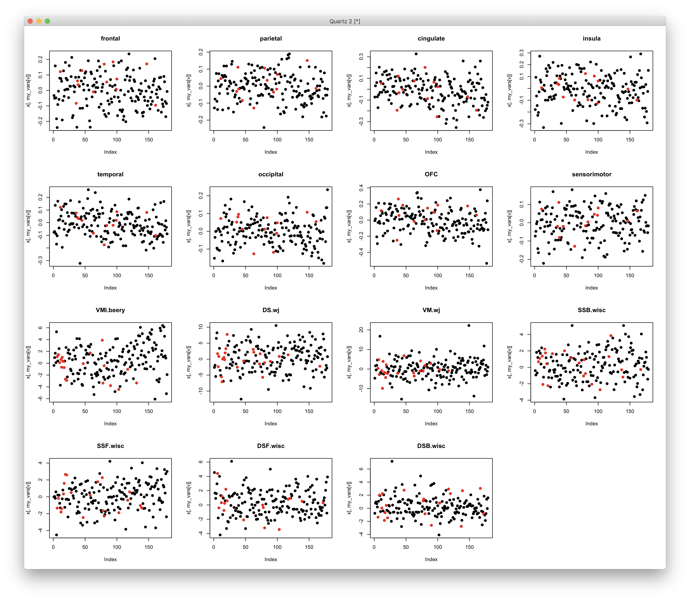

# 2020-03-03 12:16:36

We were losing a lot of data because we used the standardized version of the
neuropsych. Let's re-create the data files using the raw one instead... I also
had to increase the time difference between baseline and DOA for neuropsych to
18 months to get as much data as possible. But now we have it all in raw space,
other than IQ.

```r
setwd('~/data/baseline_prediction/prs_start/')
clin_long = read.csv('long_clin_01062020_lt16.csv')
clin_long$SX_total = clin_long$SX_inatt + clin_long$SX_hi

winsorize = function(x, cut = 0.01){
  cut_point_top <- quantile(x, 1 - cut, na.rm = T)
  cut_point_bottom <- quantile(x, cut, na.rm = T)
  i = which(x >= cut_point_top) 
  x[i] = cut_point_top
  j = which(x <= cut_point_bottom) 
  x[j] = cut_point_bottom
  return(x)
}

df = data.frame(MRN=unique(clin_long$MRN))
for (r in 1:nrow(df)) {
    subj_data = clin_long[clin_long$MRN==df$MRN[r], ]
    for (sx in c('inatt', 'hi', 'total')) {
        fit = lm(as.formula(sprintf('SX_%s ~ age', sx)), data=subj_data)
        df[r, sprintf('slope_%s', sx)] = fit$coefficients['age']
        base_row = which.min(subj_data$age)
        df[r, sprintf('base_%s', sx)] = subj_data[base_row, sprintf('SX_%s', sx)]
        last_row = which.max(subj_data$age)
        df[r, sprintf('last_%s', sx)] = subj_data[last_row, sprintf('SX_%s', sx)]
        df[r, 'base_age'] = subj_data[base_row, 'age']
        df[r, 'base_DOA'] = subj_data[base_row, 'DOA']
        df[r, 'last_age'] = subj_data[last_row, 'age']
        df[r, 'sex'] = subj_data[last_row, 'sex']
    }
}
for (min_sx in c(0, 3, 4, 6)) {
    idx = df$base_inatt>=min_sx | df$base_hi>=min_sx
    for (sx in c('inatt', 'hi', 'total')) {
        df[, sprintf('slope_%s_GE%d_wp05', sx, min_sx)] = NA
        junk = winsorize(df[idx, sprintf('slope_%s', sx)], cut=.05)
        df[idx, sprintf('slope_%s_GE%d_wp05', sx, min_sx)] = junk
    }
}

demo = read.csv('prs_demo.csv')
# just to get FAMID, sex already there
df = merge(df, subset(demo, select=-sex), by='MRN')

# cut kids if not enough time between clinical assessments
min_clin = 1
keep_me = which((df$last_age - df$base_age) >= min_clin)
df = df[keep_me, ]

# selecting best kid in family
df$bestInFamily = F
nvisits = table(clin_long$MRN)
df = merge(df, as.matrix(nvisits),
                 by.x='MRN', by.y=0)
colnames(df)[ncol(df)] = 'nvisits'
for (f in unique(df$FAMID)) {
    fam_rows = which(df$FAMID == f)
    fam_data = df[fam_rows,]
    if (nrow(fam_data) == 1) {
        df[fam_rows,]$bestInFamily = T
    } else {
        stotal = sort(fam_data$slope_total, index.return=T, decreasing=T)
        # if there's a tie
        if (stotal$x[1] == stotal$x[2]) {
            # print(sprintf('Tie in slope for %d', f))
            svisits = sort(fam_data$nvisits, index.return=T, decreasing=T)
            if (svisits$x[1] == svisits$x[2]) {
                print(sprintf('Tie in number of visits for %d', f))
                print(fam_data[fam_data$nvisits==svisits$x[1], ]$MRN)
            } else {
                df[fam_rows[svisits$ix[1]], ]$bestInFamily = T
            }
        } else {
            df[fam_rows[stotal$ix[1]], ]$bestInFamily = T
        }
    }
}

df[df$MRN==4585574, ]$bestInFamily = T
df[df$MRN==4925051, ]$bestInFamily = T
df[df$MRN==7079035, ]$bestInFamily = T
df[df$MRN==7378993, ]$bestInFamily = T
# chosen because of overall best MPRAGE QC
df[df$MRN==4640378, ]$bestInFamily = T
# chosen because of overall best MPRAGE QC
df[df$MRN==7218965, ]$bestInFamily = T

min_sx = 6
for (sx in c('inatt', 'hi')) {
    if (sx == 'inatt') {
        thresh = 0
    } else if (sx == 'hi') {
        thresh = -.5
    }
    phen_slope = sprintf('slope_%s_GE%d_wp05', sx, min_sx)
    phen = sprintf('thresh%.2f_%s_GE%d_wp05', abs(thresh), sx, min_sx)
    df[, phen] = 'notGE6adhd'
    my_nvs = which(is.na(df[, phen_slope]))
    idx = df[my_nvs, 'base_inatt'] <= 2 & df[my_nvs, 'base_hi'] <= 2
    df[my_nvs[idx], phen] = 'nv012'
    df[which(df[, phen_slope] < thresh), phen] = 'imp'
    df[which(df[, phen_slope] >= thresh), phen] = 'nonimp'
    df[, phen] = factor(df[, phen], ordered=F)
    df[, phen] = relevel(df[, phen], ref='nv012')
    ophen = sprintf('ORDthresh%.2f_%s_GE%d_wp05', abs(thresh), sx, min_sx)
    df[, ophen] = factor(df[, phen],
                         levels=c('nv012', 'notGE6adhd', 'imp', 'nonimp'),
                         ordered=T)
}
prs = read.csv('/Volumes/NCR/reference/merged_NCR_1KG_PRS_12192019.csv')
data = merge(df, prs, by='MRN', all.x=F, all.y=F)
library(nlme)
library(MASS)
qc_vars = sapply(1:10, function(x) sprintf('PC%02d', x))
# I'll remove all PCs from both ADHD and ADHDeur!
brain_vars = colnames(data)[grepl(colnames(data), pattern='^ADHD')]
for (bv in brain_vars) {
    fm_str = paste(bv, " ~ sex + base_age + ", paste(qc_vars, collapse='+'), sep="")
    fit = lme(as.formula(fm_str), data, ~1|FAMID, method='ML')
    step = stepAIC(fit, direction='both', trace=F)
    data[, bv] = residuals(step)
}
# removing PC variables and PRS for other disorders
data = data[, 1:65]

# anatomical
qc = read.csv('~/data/baseline_prediction/prs_start/prs_and_mprage_qc.csv')
brain_meta = merge(df, qc, by='MRN', all.x=F, all.y=F)
qc_vars = c("mprage_score", "ext_avg", "int_avg")
brain_meta = brain_meta[brain_meta$"age_at_scan" < 18, ]
na_scores_idx = is.na(brain_meta$mprage_score) | is.na(brain_meta$ext_avg) |
                is.na(brain_meta$int_avg)
brain_meta = brain_meta[!na_scores_idx, ]
qtile=.95
library(solitude)
iso <- isolationForest$new()
iso$fit(brain_meta[, qc_vars])
scores_if = as.matrix(iso$scores)[,3]
library(dbscan)
scores_lof = lof(brain_meta[, qc_vars], k = round(.5 * nrow(brain_meta)))
thresh_lof = quantile(scores_lof, qtile)
thresh_if = quantile(scores_if, qtile)
idx = scores_lof < thresh_lof & scores_if < thresh_if
all_brain_data = read.table('~/data/baseline_prediction/merged_rois.txt', header=T)
x = duplicated(all_brain_data$lh.aparc.area)
brain_data = merge(brain_meta[idx,], all_brain_data[!x, ], by.x='maskid',
                   by.y='lh.aparc.area', all.x=F, all.y=F)
rois = read.csv('~/data/baseline_prediction/REGIONAL_ANALYSES_FREESURFER.csv')
brain_vars = colnames(brain_data)[grepl(colnames(brain_data), pattern="_thickness$")]
part = 'lobar'
new_brain_vars = c()
for (roi in unique(rois[, part])) {
    labels = rois[which(rois[, part]==roi), 'region']
    to_avg = c()
    for (l in labels) {
        to_avg = c(to_avg,
                   brain_vars[grepl(brain_vars, pattern=sprintf("^%s", l))])
    }
    # only use variable if it's selected initially and defined
    if (length(to_avg) > 0 && sum(is.na(brain_data[, to_avg])) == 0 &&
        nchar(roi) > 0) {
        if (length(to_avg) == 1) {
            brain_data[, roi] = brain_data[, to_avg]
        } else {
            brain_data[, roi] = rowMeans(brain_data[, to_avg])
        }
        new_brain_vars = c(new_brain_vars, roi)
    }
}
brain_vars = new_brain_vars
iso <- isolationForest$new()
iso$fit(brain_data[, brain_vars])
scores_if = as.matrix(iso$scores)[,3]
scores_lof = lof(brain_data[, brain_vars], k = round(.5 * nrow(brain_data)))
thresh_lof = quantile(scores_lof, qtile)
thresh_if = quantile(scores_if, qtile)
idx = scores_lof < thresh_lof & scores_if < thresh_if
clean_brain_data = brain_data[idx, ]
keep_me = c()
for (s in unique(clean_brain_data$MRN)) {
    subj_rows = which(clean_brain_data$MRN == s)
    subj_data = clean_brain_data[subj_rows, ]
    min_subj_row = which.min(subj_data$age_at_scan)
    if (abs(subj_data[min_subj_row, 'base_age'] -
            subj_data[min_subj_row, 'age_at_scan'])<1) {
        keep_me = c(keep_me, subj_rows[min_subj_row])
    }
}
anat_data = clean_brain_data[keep_me, ]
res_anat_data = merge(data[, c('MRN', 'FAMID', 'sex')],
                      anat_data[, c('MRN', 'age_at_scan', qc_vars, brain_vars)], by='MRN',
                      all.x=F, all.y=F)
for (bv in brain_vars) {
    fm_str = paste(bv, " ~ sex + age_at_scan + ", paste(qc_vars, collapse='+'), sep="")
    fit = lme(as.formula(fm_str), res_anat_data, ~1|FAMID, method='ML')
    step = stepAIC(fit, direction='both', trace=F)
    res_anat_data[, bv] = residuals(step)
}
data = merge(data, res_anat_data[, c('MRN', brain_vars)], by='MRN',
             all.x=T, all.y=F)

# DTI
qc = read.csv('/Volumes/Shaw/MasterQC/master_qc_20190314.csv')
brain_demo = read.csv('~/data/heritability_change/ready_1020.csv')
m = merge(brain_demo, qc, by.y='Mask.ID', by.x='Mask.ID...Scan', all.x=F)
brain_meta = merge(m, df, by.x="Medical.Record...MRN...Subjects", by.y='MRN',
                   all.x=F, all.y=F)
colnames(brain_meta)[1] = 'MRN'
qc_vars = c("meanX.trans", "meanY.trans", "meanZ.trans",
            "meanX.rot", "meanY.rot", "meanZ.rot",
            "goodVolumes")
brain_meta = brain_meta[brain_meta$"age_at_scan...Scan...Subjects" < 18, ]
brain_meta = brain_meta[brain_meta$"goodVolumes" <= 61, ]
brain_meta = brain_meta[brain_meta$"numVolumes" < 80, ]
qtile=.95
library(solitude)
iso <- isolationForest$new()
iso$fit(brain_meta[, qc_vars])
scores_if = as.matrix(iso$scores)[,3]
library(dbscan)
scores_lof = lof(brain_meta[, qc_vars], k = round(.5 * nrow(brain_meta)))
thresh_lof = quantile(scores_lof, qtile)
thresh_if = quantile(scores_if, qtile)
idx = scores_lof < thresh_lof & scores_if < thresh_if
all_brain_data = read.csv('~/data/heritability_change/jhu_tracts_1020.csv')
x = duplicated(all_brain_data$id)
brain_data = merge(brain_meta[idx,], all_brain_data[!x, ], by.x='Mask.ID...Scan',
                   by.y='id')
all_brain_data = read.csv('~/data/baseline_prediction/jhu_tracts_mode.csv')
x = duplicated(all_brain_data$id)
brain_data = merge(brain_data, all_brain_data[!x, ], by.x='Mask.ID...Scan',
                   by.y='id')
for (p in c('fa', 'ad', 'rd', 'mode')) {
    brain_data[, sprintf('ATR_%s', p)] = rowMeans(brain_data[, c(sprintf('%s_1', p),
                                                                 sprintf('%s_2', p))])
    brain_data[, sprintf('CST_%s', p)] = rowMeans(brain_data[, c(sprintf('%s_3', p),
                                                                 sprintf('%s_4', p))])
    brain_data[, sprintf('CIN_%s', p)] = rowMeans(brain_data[, c(sprintf('%s_5', p),
                                                                 sprintf('%s_6', p),
                                                                 sprintf('%s_7', p),
                                                                 sprintf('%s_8', p))])
    brain_data[, sprintf('CC_%s', p)] = rowMeans(brain_data[, c(sprintf('%s_9', p),
                                                                 sprintf('%s_10', p))])
    brain_data[, sprintf('IFO_%s', p)] = rowMeans(brain_data[, c(sprintf('%s_11', p),
                                                                 sprintf('%s_12', p))])
    brain_data[, sprintf('ILF_%s', p)] = rowMeans(brain_data[, c(sprintf('%s_13', p),
                                                                 sprintf('%s_14', p))])
    brain_data[, sprintf('SLF_%s', p)] = rowMeans(brain_data[, c(sprintf('%s_15', p),
                                                                 sprintf('%s_16', p),
                                                                 sprintf('%s_19', p),
                                                                 sprintf('%s_20', p))])
    brain_data[, sprintf('UNC_%s', p)] = rowMeans(brain_data[, c(sprintf('%s_17', p),
                                                                 sprintf('%s_18', p))])
}
brain_vars = colnames(brain_data)[grepl(colnames(brain_data), pattern="_fa$") &
                                  !grepl(colnames(brain_data), pattern="^mean")]
iso <- isolationForest$new()
iso$fit(brain_data[, brain_vars])
scores_if = as.matrix(iso$scores)[,3]
scores_lof = lof(brain_data[, brain_vars], k = round(.5 * nrow(brain_data)))
thresh_lof = quantile(scores_lof, qtile)
thresh_if = quantile(scores_if, qtile)
idx = scores_lof < thresh_lof & scores_if < thresh_if
clean_brain_data = brain_data[idx, ]
keep_me = c()
for (s in unique(clean_brain_data$MRN)) {
    subj_rows = which(clean_brain_data$MRN == s)
    subj_data = clean_brain_data[subj_rows, ]
    min_subj_row = which.min(subj_data$age_at_scan...Scan...Subjects)
    if (abs(subj_data[min_subj_row, 'base_age'] -
            subj_data[min_subj_row, 'age_at_scan...Scan...Subjects'])<1) {
        keep_me = c(keep_me, subj_rows[min_subj_row])
    }
}
dti_data = clean_brain_data[keep_me, ]
res_dti_data = merge(data[, c('MRN', 'FAMID', 'sex')],
                     dti_data[, c('MRN', 'age_at_scan...Scan...Subjects',
                                  qc_vars, brain_vars)], by='MRN',
                     all.x=F, all.y=F)
for (bv in brain_vars) {
    fm_str = paste(bv, " ~ sex + age_at_scan...Scan...Subjects + ", paste(qc_vars, collapse='+'), sep="")
    fit = lme(as.formula(fm_str), res_dti_data, ~1|FAMID, method='ML')
    step = stepAIC(fit, direction='both', trace=F)
    res_dti_data[, bv] = residuals(step)
}
data = merge(data, res_dti_data[, c('MRN', brain_vars)], by='MRN',
             all.x=T, all.y=F)

# other variables
iq = read.csv('~/data/baseline_prediction/basics.csv')
neuropsych = merge(df, iq, by='MRN')
library(gdata)
source('~/research_code/lab_mgmt/merge_on_closest_date.R')
beery = read.xls('~/data/baseline_prediction/prs_start/Subjects_Beery_raw.xlsx')
colnames(beery) = c('MRN', 'DOA.beery', 'VMI.beery')
neuropsych = mergeOnClosestDate(neuropsych, beery, unique(df$MRN), x.date='base_DOA',
                                y.date='DOA.beery')
colnames(neuropsych)[ncol(neuropsych)] = 'dateDiff.beery'
wisc = read.xls('~/data/baseline_prediction/prs_start/Subjects_WISC_raw.xlsx')
colnames(wisc) = c('MRN', 'DOA.wisc', 'DSB.wisc', 'DSF.wisc', 'SSB.wisc', 'SSF.wisc')
neuropsych = mergeOnClosestDate(neuropsych, wisc, unique(df$MRN),
                                x.date='base_DOA', y.date='DOA.wisc')
colnames(neuropsych)[ncol(neuropsych)] = 'dateDiff.wisc'
wj = read.xls('~/data/baseline_prediction/prs_start/Subjects_Woodcock_Johnson_raw.xlsx')
colnames(wj) = c('MRN', 'DOA.wj', 'DS.wj', 'VM.wj')
neuropsych = mergeOnClosestDate(neuropsych, wj, unique(df$MRN),
                                x.date='base_DOA', y.date='DOA.wj')
colnames(neuropsych)[ncol(neuropsych)] = 'dateDiff.wj'
for (suf in c('.beery', '.wisc', '.wj')) {
    doa_col = sprintf('DOA%s', suf)
    date_diff = abs(as.Date(neuropsych[, 'base_DOA'], tryFormats='%m/%d/%Y') -
                    as.Date(neuropsych[, doa_col], tryFormats='%m/%d/%Y'))
    mycols = colnames(neuropsych)[grepl(colnames(neuropsych), pattern=sprintf('%s$', suf))]
    # DOA needs to be within 18 months from base_DOA
    idx = which(date_diff > 547)
    neuropsych[idx, mycols] = NA
    # also make sure that DOA is before FU
    idx = which(date_diff >= (neuropsych$last_age - neuropsych$base_age) * 365.25)
    neuropsych[idx, mycols] = NA
}
# note that I'm not covarying IQ, SES, externalizing or internalizing for age and sex!
brain_vars = c('VMI.beery' , "SSB.wisc", "SSF.wisc", 'DSF.wisc', 'DSB.wisc',
               "DS.wj", "VM.wj")
other_vars = c('FSIQ', 'SES', 'externalizing', 'internalizing')
res_psych_data = merge(data[, c('MRN', 'FAMID', 'sex', 'base_age')],
                       neuropsych[, c('MRN', brain_vars, other_vars)], by='MRN',
                       all.x=F, all.y=F)
for (bv in brain_vars) {
    idx = !is.na(res_psych_data[, bv])
    fm_str = paste(bv, " ~ sex + base_age", sep="")
    fit = lme(as.formula(fm_str), res_psych_data[idx, ], ~1|FAMID, method='ML')
    step = stepAIC(fit, direction='both', trace=F)
    res_psych_data[idx, bv] = residuals(step)
}
data = merge(data, res_psych_data[, c('MRN', brain_vars, other_vars)],
             by='MRN', all.x=T, all.y=F)

# add medication as well
meds = read.csv('~/data/baseline_prediction/prs_start/med_at_base.csv')
idx = meds$medication_status_at_observation=='nonstim'
meds[idx, ]$medication_status_at_observation = 'none'
meds$medication_status_at_observation = factor(meds$medication_status_at_observation)
data = merge(data, meds, by='MRN')

data$externalizing = as.factor(data$externalizing)
data$internalizing = as.factor(data$internalizing)

out_fname = sprintf('~/data/baseline_prediction/prs_start/complete_massagedRawNeuropsychResids_clinDiffGE%d_03032020.rds',
                    min_clin)
saveRDS(data, file=out_fname, compress=T)
```

We got some better coverage in WISC, but other domains went up in missingness,
likely because only the standardized scores were entered for those days. Sam
couldn't find other raw scores, so let's evaluate what we have:

```r
> data = data[!is.na(data$CC_fa), ]
> imp_vars = colnames(data)[66:73]
> print(sprintf('Anatomy: %s', max(colSums(is.na(data[, imp_vars])))/nrow(data)))
[1] "Anatomy: 0.0726256983240224"
> for (iv in c(colnames(data)[82], 'FSIQ', 'SES')) { print(sprintf('%s: %s', iv, sum(is.na(data[, iv]))/nrow(data))) }
[1] "VMI.beery: 0.111731843575419"
[1] "FSIQ: 0"
[1] "SES: 0"
> imp_vars = colnames(data)[87:88]
> print(sprintf('WJ: %s', max(colSums(is.na(data[, imp_vars])))/nrow(data)))
[1] "WJ: 0.128491620111732"
> imp_vars = colnames(data)[83:86]
> print(sprintf('WISC: %s', max(colSums(is.na(data[, imp_vars])))/nrow(data)))
[1] "WISC: 0.122905027932961"

```

Let's see how the results change:

```r
library(nlme)
library(MASS)

for (cd in 1:1) {
    data = readRDS(sprintf('~/data/baseline_prediction/prs_start/complete_massagedRawNeuropsychResids_clinDiffGE%d_03032020.rds', cd))

    brain_vars = colnames(data)[c(42:53, 66:90)]
    hold = c()
    min_sx = 6
    out_fname = sprintf('~/data/baseline_prediction/prs_start/univar_allResidRawNeuropsychClinDiff%d_4groupOrdered_lme.csv', cd)
    for (sx in c('inatt', 'hi')) {
        if (sx == 'inatt') {
            thresh = 0
        } else if (sx == 'hi') {
            thresh = -.5
        }
        phen = sprintf('ORDthresh%.2f_%s_GE%d_wp05', abs(thresh), sx, min_sx)

        phen_res = c()
        for (bv in brain_vars) {
            use_me = !is.na(data[, bv]) & data$bestInFamily
            this_data = data[use_me, c(phen, 'FAMID', brain_vars)]
            fm_str = paste(bv, sprintf(" ~ %s", phen), sep="")
            fit = try(lme(as.formula(fm_str), ~1|FAMID, data=this_data, method='ML'))
            if (length(fit)>1) {
                temp = c(summary(fit)$tTable[sprintf('%s.L', phen), ],
                            summary(fit)$logLik, summary(fit)$AIC, summary(fit)$BIC,
                            bv, 'linear')
                phen_res = rbind(phen_res, temp)
                rownames(phen_res)[nrow(phen_res)] = fm_str
                temp = c(summary(fit)$tTable[sprintf('%s.Q', phen), ],
                            summary(fit)$logLik, summary(fit)$AIC, summary(fit)$BIC,
                            bv, 'quadratic')
                phen_res = rbind(phen_res, temp)
                rownames(phen_res)[nrow(phen_res)] = fm_str
                temp = c(summary(fit)$tTable[sprintf('%s.C', phen), ],
                            summary(fit)$logLik, summary(fit)$AIC, summary(fit)$BIC,
                            bv, 'cubic')
                phen_res = rbind(phen_res, temp)
                rownames(phen_res)[nrow(phen_res)] = fm_str
            } else {
                # fit broke
                temp = rep(NA, 10)
                phen_res = rbind(phen_res, temp)
                rownames(phen_res)[nrow(phen_res)] = fm_str
            }
        }
        phen_res = data.frame(phen_res)
        phen_res$formula = rownames(phen_res)
        phen_res$outcome = phen
        hold = rbind(hold, phen_res)
    }
    colnames(hold)[6:10] = c('logLik', 'AIC', 'BIC', 'brainVar', 'modtype')
    write.csv(hold, file=out_fname, row.names=F)
}
```

And the variable filtering:

```r
cd = 1
res = read.csv(sprintf('~/data/baseline_prediction/prs_start/univar_allResidRawNeuropsychClinDiff%d_4groupOrdered_lme.csv', cd))
res = res[res$modtype=='linear',]
# keep only top PRS
prs_rows = which(grepl(res$brainVar, pattern='^ADHD') &
                 grepl(res$outcome, pattern='_inatt_'))
inatt_best = prs_rows[which.min(res[prs_rows, 'p.value'])]
prs_rows = which(grepl(res$brainVar, pattern='^ADHD') &
                 grepl(res$outcome, pattern='_hi_'))
hi_best = prs_rows[which.min(res[prs_rows, 'p.value'])]
res_clean = rbind(res[!grepl(res$brainVar, pattern='^ADHD'),],
                  res[inatt_best, ], res[hi_best, ])
p2 = p.adjust(res_clean$p.value, method='fdr')
print(res_clean[p2<.05,c('brainVar', 'outcome')])
print(res_clean[p2<.1,c('brainVar', 'outcome')])
```

Yep, it still looks fine. Here are the variables I got:

```
> print(res_clean[p2<.05,c('brainVar', 'outcome')])
            brainVar                      outcome
85         VMI.beery ORDthresh0.00_inatt_GE6_wp05
94          DSF.wisc ORDthresh0.00_inatt_GE6_wp05
106             FSIQ ORDthresh0.00_inatt_GE6_wp05
166              OFC    ORDthresh0.50_hi_GE6_wp05
175           CST_fa    ORDthresh0.50_hi_GE6_wp05
184           IFO_fa    ORDthresh0.50_hi_GE6_wp05
193           UNC_fa    ORDthresh0.50_hi_GE6_wp05
196        VMI.beery    ORDthresh0.50_hi_GE6_wp05
205         DSF.wisc    ORDthresh0.50_hi_GE6_wp05
217             FSIQ    ORDthresh0.50_hi_GE6_wp05
1   ADHD_PRS0.000100 ORDthresh0.00_inatt_GE6_wp05
115 ADHD_PRS0.001000    ORDthresh0.50_hi_GE6_wp05
> print(res_clean[p2<.1,c('brainVar', 'outcome')])
            brainVar                      outcome
73            IFO_fa ORDthresh0.00_inatt_GE6_wp05
82            UNC_fa ORDthresh0.00_inatt_GE6_wp05
85         VMI.beery ORDthresh0.00_inatt_GE6_wp05
94          DSF.wisc ORDthresh0.00_inatt_GE6_wp05
106             FSIQ ORDthresh0.00_inatt_GE6_wp05
166              OFC    ORDthresh0.50_hi_GE6_wp05
175           CST_fa    ORDthresh0.50_hi_GE6_wp05
181            CC_fa    ORDthresh0.50_hi_GE6_wp05
184           IFO_fa    ORDthresh0.50_hi_GE6_wp05
187           ILF_fa    ORDthresh0.50_hi_GE6_wp05
193           UNC_fa    ORDthresh0.50_hi_GE6_wp05
196        VMI.beery    ORDthresh0.50_hi_GE6_wp05
205         DSF.wisc    ORDthresh0.50_hi_GE6_wp05
214            VM.wj    ORDthresh0.50_hi_GE6_wp05
217             FSIQ    ORDthresh0.50_hi_GE6_wp05
1   ADHD_PRS0.000100 ORDthresh0.00_inatt_GE6_wp05
115 ADHD_PRS0.001000    ORDthresh0.50_hi_GE6_wp05
```

Let's set up the code for IRMI imputation, instead of using random forests:

```r
library(VIM)
data = readRDS('~/data/baseline_prediction/prs_start/complete_massagedRawNeuropsychResids_clinDiffGE1_03032020.rds')

set.seed(42)
data = data[!is.na(data$CC_fa), ]
my_vars = c(colnames(data)[42:53], # PRS
            colnames(data)[74:81], # DTI
            'FSIQ', 'SES', # these don't usually need imputation
            colnames(data)[66:73], # anatomical
            'VMI.beery',
            colnames(data)[87:88], # WJ
            colnames(data)[83:86] #WISC
)

x = irmi(data[, my_vars])
# let's plot all variables to make sure the imputed values are within the range
par(mfrow=c(4,4))
for (v in 23:length(my_vars)) {
    plot(x[, my_vars[v]], pch=19, main=my_vars[v])
    xvar = sprintf('%s_imp', my_vars[v])
    # highlight imputed points in red
    points(which(x[, xvar]), x[x[, xvar], my_vars[v]], col='red', pch=19)
}

data[, my_vars] = x[, 1:length(my_vars)]

saveRDS(data,
        file='~/data/baseline_prediction/prs_start/complete_massagedResidsIRMI_clinDiffGE1_03032020.rds',
        compress=T)
```



We have some outliers in these (residualized) variables, but nothing that would
be worth throwing away even more data...

Before I start re-running the big model, I'll fire up the ML models (see note
084).

```r
library(caret)
library(nnet)
library(pROC)

data = readRDS('~/data/baseline_prediction/prs_start/complete_massagedResidsIRMI_clinDiffGE1_03032020.rds')

# clinDiff1
inatt_vars = c('IFO_fa', 'UNC_fa', 'VMI.beery', 'DSF.wisc', 'FSIQ',
               'ADHD_PRS0.000100')
hi_vars = c('OFC', 'CST_fa', 'CC_fa', 'IFO_fa', 'ILF_fa', 'UNC_fa', 'VMI.beery',
            'DSF.wisc', 'FSIQ', 'ADHD_PRS0.001000')

# clinDiff2

# clinDiff3


covars = c('base_age', 'sex', 'externalizing', 'internalizing',
           'medication_status_at_observation', 'base_inatt', 'base_hi')
covars = c('base_age', 'sex')
min_sx = 6
```

```r
# 4 classes
for (sx in c('inatt', 'hi')) {
    set.seed(42)
    if (sx == 'inatt') {
        thresh = 0
    } else if (sx == 'hi') {
        thresh = -.5
    }
    phen = sprintf('thresh%.2f_%s_GE%d_wp05', abs(thresh), sx, min_sx)
    eval(parse(text=sprintf('this_data = data[, c(phen, %s_vars, covars)]',
                            sx)))

    scale_me = c()
    for (v in colnames(this_data)) {
        if (!is.factor(this_data[, v])) {
            scale_me = c(scale_me, v)
        }
    }
    this_data[, scale_me] = scale(this_data[, scale_me])

    eval(parse(text=sprintf('predictors_str=paste(%s_vars, collapse="+")', sx)))
    fm_str = paste(phen, " ~ ", predictors_str, ' + ', 
               paste(covars, collapse='+'),
               sep="")
    fit = multinom(as.formula(fm_str), data=this_data, maxit=2000)
    preds = predict(fit, type='prob')
    print(sx)
    print(varImp(fit))
    print(multiclass.roc(this_data[, phen], preds))
}

# 3 classes
for (sx in c('inatt', 'hi')) {
    set.seed(42)
    if (sx == 'inatt') {
        thresh = 0
    } else if (sx == 'hi') {
        thresh = -.5
    }
    phen = sprintf('thresh%.2f_%s_GE%d_wp05', abs(thresh), sx, min_sx)
    eval(parse(text=sprintf('this_data = data[, c(phen, %s_vars, covars)]',
                            sx)))

    this_data = this_data[this_data[, phen] != 'nv012',]
    this_data[, phen] = factor(this_data[, phen], ordered=F)
    this_data[, phen] = relevel(this_data[, phen], ref='notGE6adhd')

    scale_me = c()
    for (v in colnames(this_data)) {
        if (!is.factor(this_data[, v])) {
            scale_me = c(scale_me, v)
        }
    }
    this_data[, scale_me] = scale(this_data[, scale_me])

    eval(parse(text=sprintf('predictors_str=paste(%s_vars, collapse="+")', sx)))
    fm_str = paste(phen, " ~ ", predictors_str, ' + ', 
               paste(covars, collapse='+'),
               sep="")
    fit = multinom(as.formula(fm_str), data=this_data, maxit=2000)
    preds = predict(fit, type='prob')
    print(sx)
    print(varImp(fit))
    print(multiclass.roc(this_data[, phen], preds))
}

# 2 classes
for (sx in c('inatt', 'hi')) {
    set.seed(42)
    if (sx == 'inatt') {
        thresh = 0
    } else if (sx == 'hi') {
        thresh = -.5
    }
    phen = sprintf('thresh%.2f_%s_GE%d_wp05', abs(thresh), sx, min_sx)
    eval(parse(text=sprintf('this_data = data[, c(phen, %s_vars, covars)]',
                            sx)))

    this_data = this_data[this_data[, phen] != 'nv012',]
    this_data = this_data[this_data[, phen] != 'notGE6adhd',]
    this_data[, phen] = factor(this_data[, phen], ordered=F)
    this_data[, phen] = relevel(this_data[, phen], ref='nonimp')

    scale_me = c()
    for (v in colnames(this_data)) {
        if (!is.factor(this_data[, v])) {
            scale_me = c(scale_me, v)
        }
    }
    this_data[, scale_me] = scale(this_data[, scale_me])

    eval(parse(text=sprintf('predictors_str=paste(%s_vars, collapse="+")', sx)))
    fm_str = paste(phen, " ~ ", predictors_str, ' + ', 
               paste(covars, collapse='+'),
               sep="")
    fit = multinom(as.formula(fm_str), data=this_data, maxit=2000)
    preds = predict(fit, type='prob')
    print(sx)
    print(varImp(fit))
    print(multiclass.roc(this_data[, phen], preds))
}
```

First, clinDiffGE1 wihout clinical domain:

```
[1] "inatt"
                   Overall
IFO_fa           1.1337538
UNC_fa           0.3940763
VMI.beery        1.0360779
DSF.wisc         0.1168736
FSIQ             1.2978501
ADHD_PRS0.000100 0.6781986
base_age         1.1955356
sexMale          1.2814979
Data: multivariate predictor preds with 4 levels of this_data[, phen]: nv012, imp, nonimp, notGE6adhd.
Multi-class area under the curve: 0.6964

[1] "hi"
                    Overall
OFC              0.72389936
CST_fa           0.62942813
CC_fa            0.28022108
IFO_fa           1.25574645
ILF_fa           0.22960373
UNC_fa           0.66451554
VMI.beery        0.93530507
DSF.wisc         0.07030009
FSIQ             1.20628212
ADHD_PRS0.001000 0.70031188
base_age         0.87811277
sexMale          1.35437171
Data: multivariate predictor preds with 4 levels of this_data[, phen]: nv012, imp, nonimp, notGE6adhd.
Multi-class area under the curve: 0.7284


[1] "inatt"
                   Overall
IFO_fa           0.8503082
UNC_fa           0.7125218
VMI.beery        0.5631733
DSF.wisc         0.2089559
FSIQ             1.7388800
ADHD_PRS0.000100 0.9146793
base_age         0.7108348
sexMale          1.0493940
Data: multivariate predictor preds with 3 levels of this_data[, phen]: notGE6adhd, imp, nonimp.
Multi-class area under the curve: 0.7358

[1] "hi"
                    Overall
OFC              0.66628463
CST_fa           0.78506272
CC_fa            0.27514823
IFO_fa           0.76643673
ILF_fa           0.04709866
UNC_fa           0.90772943
VMI.beery        0.45920649
DSF.wisc         0.43234822
FSIQ             1.96750528
ADHD_PRS0.001000 1.61446224
base_age         0.80411039
sexMale          1.38273742
Data: multivariate predictor preds with 3 levels of this_data[, phen]: notGE6adhd, imp, nonimp.
Multi-class area under the curve: 0.7982


[1] "inatt"
                     Overall
IFO_fa           0.442189432
UNC_fa           0.293236665
VMI.beery        0.045715237
DSF.wisc         0.001245774
FSIQ             0.019557007
ADHD_PRS0.000100 0.529331866
base_age         0.730540955
sexMale          0.552679768
Setting direction: controls < cases
Data: preds with 2 levels of this_data[, phen]: nonimp, imp.
Multi-class area under the curve: 0.7393

[1] "hi"
                    Overall
OFC              0.23860387
CST_fa           0.81452296
CC_fa            0.22688228
IFO_fa           0.10094873
ILF_fa           0.08964611
UNC_fa           0.65425803
VMI.beery        0.23479709
DSF.wisc         0.14643882
FSIQ             0.36601095
ADHD_PRS0.001000 0.30093194
base_age         0.59404671
sexMale          0.96995271
Data: preds with 2 levels of this_data[, phen]: nonimp, imp.
Multi-class area under the curve: 0.8117
```

And now we sprinle in the clinical variables, which as usual gzump the ratios... 

```
[1] "inatt"
                                        Overall
IFO_fa                                66.518709
UNC_fa                                34.762076
VMI.beery                             23.088234
DSF.wisc                               4.614194
FSIQ                                   7.079450
ADHD_PRS0.000100                       1.289066
base_age                              47.240272
sexMale                              115.088028
externalizing1                        36.862635
internalizing1                        96.319235
medication_status_at_observationstim   3.252187
base_inatt                           266.617513
base_hi                              183.509358
Data: multivariate predictor preds with 4 levels of this_data[, phen]: nv012, imp, nonimp, notGE6adhd.
Multi-class area under the curve: 0.9558

[1] "hi"
                                         Overall
OFC                                    0.7770739
CST_fa                                31.1930282
CC_fa                                 12.3315902
IFO_fa                                36.7535875
ILF_fa                                24.9823351
UNC_fa                                14.9358350
VMI.beery                              4.4785714
DSF.wisc                               3.0513940
FSIQ                                   3.2466573
ADHD_PRS0.001000                      25.8751095
base_age                               6.9396762
sexMale                               38.5372708
externalizing1                        19.4212078
internalizing1                        84.2936715
medication_status_at_observationstim  10.9294356
base_inatt                           172.9297429
base_hi                              121.2113825
Data: multivariate predictor preds with 4 levels of this_data[, phen]: nv012, imp, nonimp, notGE6adhd.
Multi-class area under the curve: 0.9859


[1] "inatt"
                                        Overall
IFO_fa                                2.9740322
UNC_fa                                1.4660097
VMI.beery                             0.2095025
DSF.wisc                              0.8774142
FSIQ                                  0.4895357
ADHD_PRS0.000100                      0.7994475
base_age                              0.8463906
sexMale                               1.2893157
externalizing1                        1.4032423
internalizing1                       14.7597995
medication_status_at_observationstim  1.6367453
base_inatt                            8.5831474
base_hi                               5.4119909
Data: multivariate predictor preds with 3 levels of this_data[, phen]: notGE6adhd, imp, nonimp.
Multi-class area under the curve: 0.9116

[1] "hi"
                                        Overall
OFC                                   0.8566864
CST_fa                                1.4784913
CC_fa                                 4.0054928
IFO_fa                                6.9904869
ILF_fa                                2.2509926
UNC_fa                                3.6655881
VMI.beery                             0.9426344
DSF.wisc                              4.5307499
FSIQ                                  1.4234256
ADHD_PRS0.001000                      3.9161127
base_age                              1.6021491
sexMale                               4.0080317
externalizing1                        3.6487981
internalizing1                       15.2477529
medication_status_at_observationstim 12.1800076
base_inatt                           20.9884223
base_hi                              18.3958847
Data: multivariate predictor preds with 3 levels of this_data[, phen]: notGE6adhd, imp, nonimp.
Multi-class area under the curve: 0.9718


[1] "inatt"
                                       Overall
IFO_fa                               0.6092381
UNC_fa                               0.4611497
VMI.beery                            0.1668313
DSF.wisc                             0.3109822
FSIQ                                 0.4890851
ADHD_PRS0.000100                     0.8476052
base_age                             0.4528113
sexMale                              1.4494731
externalizing1                       0.1455927
internalizing1                       9.8522255
medication_status_at_observationstim 1.6792748
base_inatt                           2.2081249
base_hi                              0.0446106
Setting direction: controls < cases
Data: preds with 2 levels of this_data[, phen]: nonimp, imp.
Multi-class area under the curve: 0.8973

[1] "hi"
                                        Overall
OFC                                   0.2564494
CST_fa                                1.2389472
CC_fa                                 1.5299926
IFO_fa                                1.7492764
ILF_fa                                0.7578988
UNC_fa                                1.7753722
VMI.beery                             0.2810949
DSF.wisc                              0.9005752
FSIQ                                  1.1988716
ADHD_PRS0.001000                      0.6037666
base_age                              1.3446113
sexMale                               3.5685796
externalizing1                        3.5439395
internalizing1                       11.1344614
medication_status_at_observationstim  6.9375882
base_inatt                            1.3559531
base_hi                               5.9487498
Setting direction: controls < cases
Data: preds with 2 levels of this_data[, phen]: nonimp, imp.
Multi-class area under the curve: 0.9555
```

# 2020-03-04 08:56:01

Let's check the ML results running last night. It looks like we have great
results now, certainly because of the imputation procedure, which takes into
account the entire dataset. We do have a smaller dataset, though.

```r
params = c()
scores = c()
res = read.csv('~/tmp/resids_2group_impStack.csv', header=F)
colnames(res) = c('sx', 'model', 'ensemble', 'clin_diff', 'use_clinical',
                  'use_meds', 'num_groups', 'train_AUC', 'test_AUC')
for (clf in unique(res$model)) {
    for (ens in unique(res$ensemble)) {
        for (cd in unique(res$clin_diff)) {
            for (uc in unique(res$use_clinical)) {
                for (um in unique(res$use_meds)) {
                    idx = (res$model == clf & res$ensemble == ens &
                            res$clin_diff == 1 & res$use_clinical == uc &
                            res$use_meds == um)
                    pos = which(idx)
                    if (length(pos) == 2) {
                        my_str = paste(c(clf, ens, cd, uc, um), collapse='_')
                        params = c(params, my_str)
                        scores = c(scores, mean(res[pos, 'test_AUC']))
                    }
                }
            }
        }
    }
}
print(params[which.max(scores)])
```

In the stacked classifier, my best combination is
"glmStepAIC_glmStepAIC_3_TRUE_TRUE", which shows:

```
> res[res$model=='glmStepAIC' & res$ensemble=='glmStepAIC' & res$clin_diff==3 & res$use_clinical==T & res$use_meds==T,]
       sx      model   ensemble clin_diff use_clinical use_meds num_groups
222    hi glmStepAIC glmStepAIC         3         TRUE     TRUE          2
315 inatt glmStepAIC glmStepAIC         3         TRUE     TRUE          2
    train_AUC test_AUC
222  0.993464 0.844444
315  0.798551 0.916667
```

If we restrict it to only the ones with clin_diff==1, we get
stepLDA_C5.0Tree_1_TRUE_FALSE, which shows:

```
> res[res$model=='stepLDA' & res$ensemble=='C5.0Tree' & res$clin_diff==1 & res$use_clinical==T & res$use_meds==F,]
       sx   model ensemble clin_diff use_clinical use_meds num_groups train_AUC
365    hi stepLDA C5.0Tree         1         TRUE    FALSE          2  0.950213
395 inatt stepLDA C5.0Tree         1         TRUE    FALSE          2  0.989144
    test_AUC
365 0.671429
395 0.850000
```

Let's look at the case where we allow interactions:

```r
params = c()
scores = c()
res = read.csv('~/tmp/resids_2group_impInter.csv', header=F)
colnames(res) = c('sx', 'model', 'clin_diff', 'use_clinical',
                  'use_meds', 'num_groups', 'train_AUC', 'test_AUC')
for (clf in unique(res$model)) {
    for (cd in unique(res$clin_diff)) {
        for (uc in unique(res$use_clinical)) {
            for (um in unique(res$use_meds)) {
                idx = (res$model == clf &
                        res$clin_diff == 1 & res$use_clinical == uc &
                        res$use_meds == um)
                pos = which(idx)
                if (length(pos) == 2) {
                    my_str = paste(c(clf, cd, uc, um), collapse='_')
                    params = c(params, my_str)
                    scores = c(scores, mean(res[pos, 'test_AUC']))
                }
            }
        }
    }
}
print(params[which.max(scores)])
```

Here we get "glmnet_3_1_TRUE":

```
> res[res$model=='glmnet' & res$clin_diff==3 & res$use_clinical==1 & res$use_meds==T,]
       sx  model clin_diff use_clinical use_meds num_groups train_AUC test_AUC
378 inatt glmnet         3            1     TRUE          2  0.805797 0.791667
380    hi glmnet         3            1     TRUE          2  0.895425 0.933333
```

And if we restrict it to clinDiff==1, we do get "cforest_1_1_FALSE":

```
> res[res$model=='cforest' & res$clin_diff==1 & res$use_clinical==1 & res$use_meds==F,]
       sx   model clin_diff use_clinical use_meds num_groups train_AUC test_AUC
115    hi cforest         1            1    FALSE          2  0.988620 0.728571
117 inatt cforest         1            1    FALSE          2  0.978289 0.912500
```

The clin_diff==1 results for interactive model are better than stacked, but the
overall best results (clin_diff==3 in both cases) are somewhat of a toss.
Sligthly better for the stacked model on average, and also nice to show both
above .8.

So, it's intriguing that clinDiff==3 shows the best results. I should also check:

 * how the variable importance looks like for these 4 options
 * maybe use the 2-group non-clinical results to help decide?
 * their results for 3 and 4 groups
 * recap the numbers for clin_diff 1, 2, 3
 * run big model for clin_diff 2 and 3

Here we go...

## Results for all group differences

```r
res = read.csv('~/tmp/resids_3group_impStack.csv', header=F)
colnames(res) = c('sx', 'model', 'ensemble', 'clin_diff', 'use_clinical',
                  'use_meds', 'num_groups', 'train_AUC', 'test_AUC')
res[res$model=='glmStepAIC' & res$ensemble=='glmStepAIC' & res$clin_diff==3 & res$use_clinical==T & res$use_meds==T,]
res[res$model=='stepLDA' & res$ensemble=='C5.0Tree' & res$clin_diff==1 & res$use_clinical==T & res$use_meds==F,]
res = read.csv('~/tmp/resids_4group_impStack.csv', header=F)
colnames(res) = c('sx', 'model', 'ensemble', 'clin_diff', 'use_clinical',
                  'use_meds', 'num_groups', 'train_AUC', 'test_AUC')
res[res$model=='glmStepAIC' & res$ensemble=='glmStepAIC' & res$clin_diff==3 & res$use_clinical==T & res$use_meds==T,]
res[res$model=='stepLDA' & res$ensemble=='C5.0Tree' & res$clin_diff==1 & res$use_clinical==T & res$use_meds==F,]
```

glmstepAIC didn't run for 3 or 4 group stacked, but stepLDA did:

```
      sx   model ensemble clin_diff use_clinical use_meds num_groups train_AUC
73    hi stepLDA C5.0Tree         1         TRUE    FALSE          3  0.957323
76 inatt stepLDA C5.0Tree         1         TRUE    FALSE          3  0.935012
   test_AUC
73 0.873876
76 0.914034

       sx   model ensemble clin_diff use_clinical use_meds num_groups train_AUC
89  inatt stepLDA C5.0Tree         1         TRUE    FALSE          4  0.976449
103    hi stepLDA C5.0Tree         1         TRUE    FALSE          4  0.980712
```

```r
res = read.csv('~/tmp/resids_3group_impInter.csv', header=F)
colnames(res) = c('sx', 'model', 'clin_diff', 'use_clinical',
                  'use_meds', 'num_groups', 'train_AUC', 'test_AUC')
res[res$model=='glmnet' & res$clin_diff==3 & res$use_clinical==1 & res$use_meds==T,]
res[res$model=='cforest' & res$clin_diff==1 & res$use_clinical==1 & res$use_meds==F,]
res = read.csv('~/tmp/resids_4group_impInter.csv', header=F)
colnames(res) = c('sx', 'model', 'clin_diff', 'use_clinical',
                  'use_meds', 'num_groups', 'train_AUC', 'test_AUC')
res[res$model=='glmnet' & res$clin_diff==3 & res$use_clinical==1 & res$use_meds==T,]
res[res$model=='cforest' & res$clin_diff==1 & res$use_clinical==1 & res$use_meds==F,]
```

The conditional forest model seems to be a bit better in the 3 and 4 group
models:

```
       sx  model clin_diff use_clinical use_meds num_groups train_AUC test_AUC
370 inatt glmnet         3            1     TRUE          3  0.779958 0.818813
378    hi glmnet         3            1     TRUE          3  0.999272 0.797438

       sx   model clin_diff use_clinical use_meds num_groups train_AUC test_AUC
305    hi cforest         1            1    FALSE          3  0.997188 0.915085
330 inatt cforest         1            1    FALSE          3  0.988938 0.929167

       sx  model clin_diff use_clinical use_meds num_groups train_AUC test_AUC
139 inatt glmnet         3            1     TRUE          4  0.942069 0.936911
259    hi glmnet         3            1     TRUE          4  0.999585 0.898935

      sx   model clin_diff use_clinical use_meds num_groups train_AUC test_AUC
98 inatt cforest         1            1    FALSE          4  0.996633 0.964996
99    hi cforest         1            1    FALSE          4  0.996718 0.963622
```

Seems like cforest does best, even better that it's in clinDiff==1. Why didn't
glmStepAIC run? It's a 2-class only classifier :( Let's pick the second best:

```r
params = c()
scores = c()
res = read.csv('~/tmp/resids_2group_impStack.csv', header=F)
colnames(res) = c('sx', 'model', 'ensemble', 'clin_diff', 'use_clinical',
                  'use_meds', 'num_groups', 'train_AUC', 'test_AUC')
for (clf in unique(res$model)) {
    for (ens in unique(res$ensemble)) {
        for (cd in unique(res$clin_diff)) {
            for (uc in unique(res$use_clinical)) {
                for (um in unique(res$use_meds)) {
                    idx = (res$model == clf & res$ensemble == ens &
                            res$clin_diff == cd & res$use_clinical == uc &
                            res$use_meds == um)
                    pos = which(idx)
                    if (length(pos) == 2) {
                        my_str = paste(c(clf, ens, cd, uc, um), collapse='_')
                        params = c(params, my_str)
                        scores = c(scores, mean(res[pos, 'test_AUC']))
                    }
                }
            }
        }
    }
}
a = sort(scores, decreasing=T, index.return=T)
print(params[a$ix[2]])
```

And now we get "bayesglm_C5.0Tree_3_TRUE_TRUE":

```
> res[res$model=='bayesglm' & res$ensemble=='C5.0Tree' & res$clin_diff==3 & res$use_clinical==T & res$use_meds==T,]
       sx    model ensemble clin_diff use_clinical use_meds num_groups
469 inatt bayesglm C5.0Tree         3         TRUE     TRUE          2
474    hi bayesglm C5.0Tree         3         TRUE     TRUE          2
    train_AUC test_AUC
469  0.917391 0.958333
474  1.000000 0.800000
```

Maybe a bit overfitty? Have to check the variable weights... but how does it
perform now in the 3 and 4 class cases?

```r
res = read.csv('~/tmp/resids_3group_impStack.csv', header=F)
colnames(res) = c('sx', 'model', 'ensemble', 'clin_diff', 'use_clinical',
                  'use_meds', 'num_groups', 'train_AUC', 'test_AUC')
res[res$model=='bayesglm' & res$ensemble=='C5.0Tree' & res$clin_diff==3 & res$use_clinical==T & res$use_meds==T,]
res[res$model=='stepLDA' & res$ensemble=='C5.0Tree' & res$clin_diff==1 & res$use_clinical==T & res$use_meds==F,]
res = read.csv('~/tmp/resids_4group_impStack.csv', header=F)
colnames(res) = c('sx', 'model', 'ensemble', 'clin_diff', 'use_clinical',
                  'use_meds', 'num_groups', 'train_AUC', 'test_AUC')
res[res$model=='bayesglm' & res$ensemble=='C5.0Tree' & res$clin_diff==3 & res$use_clinical==T & res$use_meds==T,]
res[res$model=='stepLDA' & res$ensemble=='C5.0Tree' & res$clin_diff==1 & res$use_clinical==T & res$use_meds==F,]
```

bayesglm didn't run either!!!

