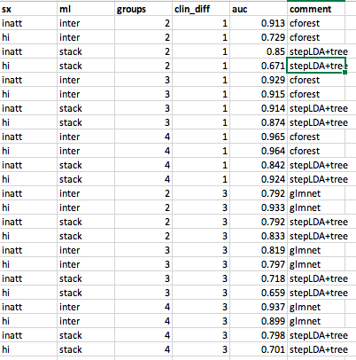

# 2020-03-05 13:28:33

The idea here is that internalizing and externalizing were driving the results
too much. What happens if we remove all subjects that had those? Just so we can
focus a bit more on ADHD. Do PRS results still hold? Do we need different
thresholds for the groups?

```r
min_clin = 1

setwd('~/data/baseline_prediction/prs_start/')
clin_long = read.csv('long_clin_01062020_lt16.csv')
clin_long$SX_total = clin_long$SX_inatt + clin_long$SX_hi

winsorize = function(x, cut = 0.01){
  cut_point_top <- quantile(x, 1 - cut, na.rm = T)
  cut_point_bottom <- quantile(x, cut, na.rm = T)
  i = which(x >= cut_point_top) 
  x[i] = cut_point_top
  j = which(x <= cut_point_bottom) 
  x[j] = cut_point_bottom
  return(x)
}

df = data.frame(MRN=unique(clin_long$MRN))
for (r in 1:nrow(df)) {
    subj_data = clin_long[clin_long$MRN==df$MRN[r], ]
    for (sx in c('inatt', 'hi', 'total')) {
        fit = lm(as.formula(sprintf('SX_%s ~ age', sx)), data=subj_data)
        df[r, sprintf('slope_%s', sx)] = fit$coefficients['age']
        base_row = which.min(subj_data$age)
        df[r, sprintf('base_%s', sx)] = subj_data[base_row, sprintf('SX_%s', sx)]
        last_row = which.max(subj_data$age)
        df[r, sprintf('last_%s', sx)] = subj_data[last_row, sprintf('SX_%s', sx)]
        df[r, 'base_age'] = subj_data[base_row, 'age']
        df[r, 'base_DOA'] = subj_data[base_row, 'DOA']
        df[r, 'last_age'] = subj_data[last_row, 'age']
        df[r, 'sex'] = subj_data[last_row, 'sex']
    }
}
for (min_sx in c(0, 3, 4, 6)) {
    idx = df$base_inatt>=min_sx | df$base_hi>=min_sx
    for (sx in c('inatt', 'hi', 'total')) {
        df[, sprintf('slope_%s_GE%d_wp05', sx, min_sx)] = NA
        junk = winsorize(df[idx, sprintf('slope_%s', sx)], cut=.05)
        df[idx, sprintf('slope_%s_GE%d_wp05', sx, min_sx)] = junk
    }
}

demo = read.csv('prs_demo.csv')
# just to get FAMID, sex already there
df = merge(df, subset(demo, select=-sex), by='MRN')

# cut kids if not enough time between clinical assessments
keep_me = which((df$last_age - df$base_age) >= min_clin)
df = df[keep_me, ]
```

Before we select the best kid in each family, let's remove kids with
comorbidities:

```r
library(gdata)
como = read.xls('~/data/baseline_prediction/prs_start/baseline_with_comorbidity_added_ps_edits_03052020.xlsx')
rm_me = como$internalizing_ps_check_UPDATED==1 | como$externalizing_ps_check_UPDATED==1
df = df[!rm_me, ]
```

Now we can go on with selecting best in family:

```r
# selecting best kid in family
df$bestInFamily = F
nvisits = table(clin_long$MRN)
df = merge(df, as.matrix(nvisits),
                 by.x='MRN', by.y=0)
colnames(df)[ncol(df)] = 'nvisits'
for (f in unique(df$FAMID)) {
    fam_rows = which(df$FAMID == f)
    fam_data = df[fam_rows,]
    if (nrow(fam_data) == 1) {
        df[fam_rows,]$bestInFamily = T
    } else {
        stotal = sort(fam_data$slope_total, index.return=T, decreasing=T)
        # if there's a tie
        if (stotal$x[1] == stotal$x[2]) {
            # print(sprintf('Tie in slope for %d', f))
            svisits = sort(fam_data$nvisits, index.return=T, decreasing=T)
            if (svisits$x[1] == svisits$x[2]) {
                print(sprintf('Tie in number of visits for %d', f))
                print(fam_data[fam_data$nvisits==svisits$x[1], ]$MRN)
            } else {
                df[fam_rows[svisits$ix[1]], ]$bestInFamily = T
            }
        } else {
            df[fam_rows[stotal$ix[1]], ]$bestInFamily = T
        }
    }
}

df[df$MRN==4585574, ]$bestInFamily = T
df[df$MRN==4925051, ]$bestInFamily = T
df[df$MRN==7079035, ]$bestInFamily = T
df[df$MRN==7378993, ]$bestInFamily = T
# chosen because of overall best MPRAGE QC
df[df$MRN==4640378, ]$bestInFamily = T
# chosen because of overall best MPRAGE QC
df[df$MRN==7218965, ]$bestInFamily = T
```

Let's check if our thresholds from before still make sense:

```r
min_sx = 6
for (sx in c('inatt', 'hi')) {
    if (sx == 'inatt') {
        thresh = 0
    } else if (sx == 'hi') {
        thresh = -.5
    }
    phen_slope = sprintf('slope_%s_GE%d_wp05', sx, min_sx)
    phen = sprintf('thresh%.2f_%s_GE%d_wp05', abs(thresh), sx, min_sx)
    df[, phen] = 'notGE6adhd'
    my_nvs = which(is.na(df[, phen_slope]))
    idx = df[my_nvs, 'base_inatt'] <= 2 & df[my_nvs, 'base_hi'] <= 2
    df[my_nvs[idx], phen] = 'nv012'
    df[which(df[, phen_slope] < thresh), phen] = 'imp'
    df[which(df[, phen_slope] >= thresh), phen] = 'nonimp'
    df[, phen] = factor(df[, phen], ordered=F)
    df[, phen] = relevel(df[, phen], ref='nv012')
    ophen = sprintf('ORDthresh%.2f_%s_GE%d_wp05', abs(thresh), sx, min_sx)
    df[, ophen] = factor(df[, phen],
                         levels=c('nv012', 'notGE6adhd', 'imp', 'nonimp'),
                         ordered=T)
}
```

What are the current ratios?

```r
> table(df$ORDthresh0.00_inatt_GE6_wp05)

     nv012 notGE6adhd        imp     nonimp 
       148         44        104         67 
> table(df$ORDthresh0.50_hi_GE6_wp05)

     nv012 notGE6adhd        imp     nonimp 
       148         44         69        102 
```

The ratios are almost inverted... but similar to what we had before. 

Let's make some plots:

```r
par(mfrow=c(3,2))
for (ge in c(3,4,6)) {
    plot(sort(df[, sprintf('slope_inatt_GE%d_wp05', ge)]), pch=19,
         main=sprintf('inatt GE%d', ge))
    abline(h=0, col='red')
    plot(sort(df[, sprintf('slope_hi_GE%d_wp05', ge)]), pch=19,
         main=sprintf('hi GE%d', ge))
    abline(h=-0.5, col='red')
}
```


Values make sense based on medians and the plots... but it might raise eye brows
clinically? Let's continue running our analysis and see where we get:

```r
prs = read.csv('/Volumes/NCR/reference/merged_NCR_1KG_PRS_12192019.csv')
data = merge(df, prs, by='MRN', all.x=F, all.y=F)
library(nlme)
library(MASS)
qc_vars = sapply(1:10, function(x) sprintf('PC%02d', x))
# I'll remove all PCs from both ADHD and ADHDeur!
brain_vars = colnames(data)[grepl(colnames(data), pattern='^ADHD')]
for (bv in brain_vars) {
    fm_str = paste(bv, " ~ sex + base_age + ", paste(qc_vars, collapse='+'), sep="")
    fit = lme(as.formula(fm_str), data, ~1|FAMID, method='ML')
    step = stepAIC(fit, direction='both', trace=F)
    data[, bv] = residuals(step)
}
# removing PC variables and PRS for other disorders
data = data[, 1:65]

# anatomical
qc = read.csv('~/data/baseline_prediction/prs_start/prs_and_mprage_qc.csv')
brain_meta = merge(df, qc, by='MRN', all.x=F, all.y=F)
qc_vars = c("mprage_score", "ext_avg", "int_avg")
brain_meta = brain_meta[brain_meta$"age_at_scan" < 18, ]
na_scores_idx = is.na(brain_meta$mprage_score) | is.na(brain_meta$ext_avg) |
                is.na(brain_meta$int_avg)
brain_meta = brain_meta[!na_scores_idx, ]
qtile=.95
library(solitude)
iso <- isolationForest$new()
iso$fit(brain_meta[, qc_vars])
scores_if = as.matrix(iso$scores)[,3]
library(dbscan)
scores_lof = lof(brain_meta[, qc_vars], k = round(.5 * nrow(brain_meta)))
thresh_lof = quantile(scores_lof, qtile)
thresh_if = quantile(scores_if, qtile)
idx = scores_lof < thresh_lof & scores_if < thresh_if
all_brain_data = read.table('~/data/baseline_prediction/merged_rois.txt', header=T)
x = duplicated(all_brain_data$lh.aparc.area)
brain_data = merge(brain_meta[idx,], all_brain_data[!x, ], by.x='maskid',
                   by.y='lh.aparc.area', all.x=F, all.y=F)
rois = read.csv('~/data/baseline_prediction/REGIONAL_ANALYSES_FREESURFER.csv')
brain_vars = colnames(brain_data)[grepl(colnames(brain_data), pattern="_thickness$")]
part = 'lobar'
new_brain_vars = c()
for (roi in unique(rois[, part])) {
    labels = rois[which(rois[, part]==roi), 'region']
    to_avg = c()
    for (l in labels) {
        to_avg = c(to_avg,
                   brain_vars[grepl(brain_vars, pattern=sprintf("^%s", l))])
    }
    # only use variable if it's selected initially and defined
    if (length(to_avg) > 0 && sum(is.na(brain_data[, to_avg])) == 0 &&
        nchar(roi) > 0) {
        if (length(to_avg) == 1) {
            brain_data[, roi] = brain_data[, to_avg]
        } else {
            brain_data[, roi] = rowMeans(brain_data[, to_avg])
        }
        new_brain_vars = c(new_brain_vars, roi)
    }
}
brain_vars = new_brain_vars
iso <- isolationForest$new()
iso$fit(brain_data[, brain_vars])
scores_if = as.matrix(iso$scores)[,3]
scores_lof = lof(brain_data[, brain_vars], k = round(.5 * nrow(brain_data)))
thresh_lof = quantile(scores_lof, qtile)
thresh_if = quantile(scores_if, qtile)
idx = scores_lof < thresh_lof & scores_if < thresh_if
clean_brain_data = brain_data[idx, ]
keep_me = c()
for (s in unique(clean_brain_data$MRN)) {
    subj_rows = which(clean_brain_data$MRN == s)
    subj_data = clean_brain_data[subj_rows, ]
    min_subj_row = which.min(subj_data$age_at_scan)
    if (abs(subj_data[min_subj_row, 'base_age'] -
            subj_data[min_subj_row, 'age_at_scan'])<1) {
        keep_me = c(keep_me, subj_rows[min_subj_row])
    }
}
anat_data = clean_brain_data[keep_me, ]
res_anat_data = merge(data[, c('MRN', 'FAMID', 'sex')],
                      anat_data[, c('MRN', 'age_at_scan', qc_vars, brain_vars)], by='MRN',
                      all.x=F, all.y=F)
for (bv in brain_vars) {
    fm_str = paste(bv, " ~ sex + age_at_scan + ", paste(qc_vars, collapse='+'), sep="")
    fit = lme(as.formula(fm_str), res_anat_data, ~1|FAMID, method='ML')
    step = stepAIC(fit, direction='both', trace=F)
    res_anat_data[, bv] = residuals(step)
}
data = merge(data, res_anat_data[, c('MRN', brain_vars)], by='MRN',
             all.x=T, all.y=F)

# DTI
qc = read.csv('/Volumes/Shaw/MasterQC/master_qc_20190314.csv')
brain_demo = read.csv('~/data/heritability_change/ready_1020.csv')
m = merge(brain_demo, qc, by.y='Mask.ID', by.x='Mask.ID...Scan', all.x=F)
brain_meta = merge(m, df, by.x="Medical.Record...MRN...Subjects", by.y='MRN',
                   all.x=F, all.y=F)
colnames(brain_meta)[1] = 'MRN'
qc_vars = c("meanX.trans", "meanY.trans", "meanZ.trans",
            "meanX.rot", "meanY.rot", "meanZ.rot",
            "goodVolumes")
brain_meta = brain_meta[brain_meta$"age_at_scan...Scan...Subjects" < 18, ]
brain_meta = brain_meta[brain_meta$"goodVolumes" <= 61, ]
brain_meta = brain_meta[brain_meta$"numVolumes" < 80, ]
qtile=.95
library(solitude)
iso <- isolationForest$new()
iso$fit(brain_meta[, qc_vars])
scores_if = as.matrix(iso$scores)[,3]
library(dbscan)
scores_lof = lof(brain_meta[, qc_vars], k = round(.5 * nrow(brain_meta)))
thresh_lof = quantile(scores_lof, qtile)
thresh_if = quantile(scores_if, qtile)
idx = scores_lof < thresh_lof & scores_if < thresh_if
all_brain_data = read.csv('~/data/heritability_change/jhu_tracts_1020.csv')
x = duplicated(all_brain_data$id)
brain_data = merge(brain_meta[idx,], all_brain_data[!x, ], by.x='Mask.ID...Scan',
                   by.y='id')
all_brain_data = read.csv('~/data/baseline_prediction/jhu_tracts_mode.csv')
x = duplicated(all_brain_data$id)
brain_data = merge(brain_data, all_brain_data[!x, ], by.x='Mask.ID...Scan',
                   by.y='id')
for (p in c('fa', 'ad', 'rd', 'mode')) {
    brain_data[, sprintf('ATR_%s', p)] = rowMeans(brain_data[, c(sprintf('%s_1', p),
                                                                 sprintf('%s_2', p))])
    brain_data[, sprintf('CST_%s', p)] = rowMeans(brain_data[, c(sprintf('%s_3', p),
                                                                 sprintf('%s_4', p))])
    brain_data[, sprintf('CIN_%s', p)] = rowMeans(brain_data[, c(sprintf('%s_5', p),
                                                                 sprintf('%s_6', p),
                                                                 sprintf('%s_7', p),
                                                                 sprintf('%s_8', p))])
    brain_data[, sprintf('CC_%s', p)] = rowMeans(brain_data[, c(sprintf('%s_9', p),
                                                                 sprintf('%s_10', p))])
    brain_data[, sprintf('IFO_%s', p)] = rowMeans(brain_data[, c(sprintf('%s_11', p),
                                                                 sprintf('%s_12', p))])
    brain_data[, sprintf('ILF_%s', p)] = rowMeans(brain_data[, c(sprintf('%s_13', p),
                                                                 sprintf('%s_14', p))])
    brain_data[, sprintf('SLF_%s', p)] = rowMeans(brain_data[, c(sprintf('%s_15', p),
                                                                 sprintf('%s_16', p),
                                                                 sprintf('%s_19', p),
                                                                 sprintf('%s_20', p))])
    brain_data[, sprintf('UNC_%s', p)] = rowMeans(brain_data[, c(sprintf('%s_17', p),
                                                                 sprintf('%s_18', p))])
}
brain_vars = colnames(brain_data)[grepl(colnames(brain_data), pattern="_fa$") &
                                  !grepl(colnames(brain_data), pattern="^mean")]
iso <- isolationForest$new()
iso$fit(brain_data[, brain_vars])
scores_if = as.matrix(iso$scores)[,3]
scores_lof = lof(brain_data[, brain_vars], k = round(.5 * nrow(brain_data)))
thresh_lof = quantile(scores_lof, qtile)
thresh_if = quantile(scores_if, qtile)
idx = scores_lof < thresh_lof & scores_if < thresh_if
clean_brain_data = brain_data[idx, ]
keep_me = c()
for (s in unique(clean_brain_data$MRN)) {
    subj_rows = which(clean_brain_data$MRN == s)
    subj_data = clean_brain_data[subj_rows, ]
    min_subj_row = which.min(subj_data$age_at_scan...Scan...Subjects)
    if (abs(subj_data[min_subj_row, 'base_age'] -
            subj_data[min_subj_row, 'age_at_scan...Scan...Subjects'])<1) {
        keep_me = c(keep_me, subj_rows[min_subj_row])
    }
}
dti_data = clean_brain_data[keep_me, ]
res_dti_data = merge(data[, c('MRN', 'FAMID', 'sex')],
                     dti_data[, c('MRN', 'age_at_scan...Scan...Subjects',
                                  qc_vars, brain_vars)], by='MRN',
                     all.x=F, all.y=F)
for (bv in brain_vars) {
    fm_str = paste(bv, " ~ sex + age_at_scan...Scan...Subjects + ", paste(qc_vars, collapse='+'), sep="")
    fit = lme(as.formula(fm_str), res_dti_data, ~1|FAMID, method='ML')
    step = stepAIC(fit, direction='both', trace=F)
    res_dti_data[, bv] = residuals(step)
}
data = merge(data, res_dti_data[, c('MRN', brain_vars)], by='MRN',
             all.x=T, all.y=F)

# other variables
iq = read.csv('~/data/baseline_prediction/basics.csv')
neuropsych = merge(df, iq, by='MRN')
library(gdata)
source('~/research_code/lab_mgmt/merge_on_closest_date.R')
beery = read.xls('~/data/baseline_prediction/prs_start/Subjects_Beery_raw.xlsx')
colnames(beery) = c('MRN', 'DOA.beery', 'VMI.beery')
neuropsych = mergeOnClosestDate(neuropsych, beery, unique(df$MRN), x.date='base_DOA',
                                y.date='DOA.beery')
colnames(neuropsych)[ncol(neuropsych)] = 'dateDiff.beery'
wisc = read.xls('~/data/baseline_prediction/prs_start/Subjects_WISC_raw.xlsx')
colnames(wisc) = c('MRN', 'DOA.wisc', 'DSB.wisc', 'DSF.wisc', 'SSB.wisc', 'SSF.wisc')
neuropsych = mergeOnClosestDate(neuropsych, wisc, unique(df$MRN),
                                x.date='base_DOA', y.date='DOA.wisc')
colnames(neuropsych)[ncol(neuropsych)] = 'dateDiff.wisc'
wj = read.xls('~/data/baseline_prediction/prs_start/Subjects_Woodcock_Johnson_raw.xlsx')
colnames(wj) = c('MRN', 'DOA.wj', 'DS.wj', 'VM.wj')
neuropsych = mergeOnClosestDate(neuropsych, wj, unique(df$MRN),
                                x.date='base_DOA', y.date='DOA.wj')
colnames(neuropsych)[ncol(neuropsych)] = 'dateDiff.wj'
for (suf in c('.beery', '.wisc', '.wj')) {
    doa_col = sprintf('DOA%s', suf)
    date_diff = abs(as.Date(neuropsych[, 'base_DOA'], tryFormats='%m/%d/%Y') -
                    as.Date(neuropsych[, doa_col], tryFormats='%m/%d/%Y'))
    mycols = colnames(neuropsych)[grepl(colnames(neuropsych), pattern=sprintf('%s$', suf))]
    # DOA needs to be within 18 months from base_DOA
    idx = which(date_diff > 547)
    neuropsych[idx, mycols] = NA
    # also make sure that DOA is before FU
    idx = which(date_diff >= (neuropsych$last_age - neuropsych$base_age) * 365.25)
    neuropsych[idx, mycols] = NA
}
# note that I'm not covarying IQ, SES, externalizing or internalizing for age and sex!
brain_vars = c('VMI.beery' , "SSB.wisc", "SSF.wisc", 'DSF.wisc', 'DSB.wisc',
               "DS.wj", "VM.wj")
other_vars = c('FSIQ', 'SES', 'externalizing', 'internalizing')
res_psych_data = merge(data[, c('MRN', 'FAMID', 'sex', 'base_age')],
                       neuropsych[, c('MRN', brain_vars, other_vars)], by='MRN',
                       all.x=F, all.y=F)
for (bv in brain_vars) {
    idx = !is.na(res_psych_data[, bv])
    fm_str = paste(bv, " ~ sex + base_age", sep="")
    fit = lme(as.formula(fm_str), res_psych_data[idx, ], ~1|FAMID, method='ML')
    step = stepAIC(fit, direction='both', trace=F)
    res_psych_data[idx, bv] = residuals(step)
}
data = merge(data, res_psych_data[, c('MRN', brain_vars, other_vars)],
             by='MRN', all.x=T, all.y=F)

# add medication as well
meds = read.csv('~/data/baseline_prediction/prs_start/med_at_base.csv')
idx = meds$medication_status_at_observation=='nonstim'
meds[idx, ]$medication_status_at_observation = 'none'
meds$medication_status_at_observation = factor(meds$medication_status_at_observation)
data = merge(data, meds, by='MRN')

data$externalizing = NULL
data$internalizing = NULL

out_fname = sprintf('~/data/baseline_prediction/prs_start/complete_massagedRawNeuropsychResidsNoComorbid_clinDiffGE%d_03032020.rds',
                    min_clin)
saveRDS(data, file=out_fname, compress=T)
```

And let's double-check the data missing rates:

```r
data = data[!is.na(data$CC_fa), ]
imp_vars = colnames(data)[66:73]
print(sprintf('Anatomy: %s', max(colSums(is.na(data[, imp_vars])))/nrow(data)))
for (iv in c(colnames(data)[82], 'FSIQ', 'SES')) {
    print(sprintf('%s: %s', iv, sum(is.na(data[, iv]))/nrow(data)))
}
imp_vars = colnames(data)[87:88]
print(sprintf('WJ: %s', max(colSums(is.na(data[, imp_vars])))/nrow(data)))
imp_vars = colnames(data)[83:86]
print(sprintf('WISC: %s', max(colSums(is.na(data[, imp_vars])))/nrow(data)))
```

```
[1] "Anatomy: 0.0628571428571429"
[1] "VMI.beery: 0.102857142857143"
[1] "FSIQ: 0"
[1] "SES: 0"
[1] "DS.wj" "VM.wj"
[1] "WJ: 0.12"
[1] "WISC: 0.114285714285714"
```

Do the univariate results change at all?

```r
library(nlme)
library(MASS)

for (cd in 1:1) {
    data = readRDS(sprintf('~/data/baseline_prediction/prs_start/complete_massagedRawNeuropsychResidsNoComorbid_clinDiffGE%d_03032020.rds', cd))

    brain_vars = colnames(data)[c(42:53, 66:90)]
    hold = c()
    min_sx = 6
    out_fname = sprintf('~/data/baseline_prediction/prs_start/univar_allResidRawNeuropsychNoComorbidClinDiff%d_4groupOrdered_lme.csv', cd)
    for (sx in c('inatt', 'hi')) {
        if (sx == 'inatt') {
            thresh = 0
        } else if (sx == 'hi') {
            thresh = -.5
        }
        phen = sprintf('ORDthresh%.2f_%s_GE%d_wp05', abs(thresh), sx, min_sx)

        phen_res = c()
        for (bv in brain_vars) {
            use_me = !is.na(data[, bv]) & data$bestInFamily
            this_data = data[use_me, c(phen, 'FAMID', brain_vars)]
            fm_str = paste(bv, sprintf(" ~ %s", phen), sep="")
            fit = try(lme(as.formula(fm_str), ~1|FAMID, data=this_data, method='ML'))
            if (length(fit)>1) {
                temp = c(summary(fit)$tTable[sprintf('%s.L', phen), ],
                            summary(fit)$logLik, summary(fit)$AIC, summary(fit)$BIC,
                            bv, 'linear')
                phen_res = rbind(phen_res, temp)
                rownames(phen_res)[nrow(phen_res)] = fm_str
                temp = c(summary(fit)$tTable[sprintf('%s.Q', phen), ],
                            summary(fit)$logLik, summary(fit)$AIC, summary(fit)$BIC,
                            bv, 'quadratic')
                phen_res = rbind(phen_res, temp)
                rownames(phen_res)[nrow(phen_res)] = fm_str
                temp = c(summary(fit)$tTable[sprintf('%s.C', phen), ],
                            summary(fit)$logLik, summary(fit)$AIC, summary(fit)$BIC,
                            bv, 'cubic')
                phen_res = rbind(phen_res, temp)
                rownames(phen_res)[nrow(phen_res)] = fm_str
            } else {
                # fit broke
                temp = rep(NA, 10)
                phen_res = rbind(phen_res, temp)
                rownames(phen_res)[nrow(phen_res)] = fm_str
            }
        }
        phen_res = data.frame(phen_res)
        phen_res$formula = rownames(phen_res)
        phen_res$outcome = phen
        hold = rbind(hold, phen_res)
    }
    colnames(hold)[6:10] = c('logLik', 'AIC', 'BIC', 'brainVar', 'modtype')
    write.csv(hold, file=out_fname, row.names=F)
}
```

And the variable filtering:

```r
cd = 1
res = read.csv(sprintf('~/data/baseline_prediction/prs_start/univar_allResidRawNeuropsychNoComorbidClinDiff%d_4groupOrdered_lme.csv', cd))
res = res[res$modtype=='linear',]
# keep only top PRS
prs_rows = which(grepl(res$brainVar, pattern='^ADHD') &
                 grepl(res$outcome, pattern='_inatt_'))
inatt_best = prs_rows[which.min(res[prs_rows, 'p.value'])]
prs_rows = which(grepl(res$brainVar, pattern='^ADHD') &
                 grepl(res$outcome, pattern='_hi_'))
hi_best = prs_rows[which.min(res[prs_rows, 'p.value'])]
res_clean = rbind(res[!grepl(res$brainVar, pattern='^ADHD'),],
                  res[inatt_best, ], res[hi_best, ])
p2 = p.adjust(res_clean$p.value, method='fdr')
print(res_clean[p2<.05,c('brainVar', 'outcome')])
print(res_clean[p2<.1,c('brainVar', 'outcome')])
```

Yep, it still looks fine. Here are the variables I got:

```
> print(res_clean[p2<.05,c('brainVar', 'outcome')])
            brainVar                      outcome
85         VMI.beery ORDthresh0.00_inatt_GE6_wp05
106             FSIQ ORDthresh0.00_inatt_GE6_wp05
166              OFC    ORDthresh0.50_hi_GE6_wp05
196        VMI.beery    ORDthresh0.50_hi_GE6_wp05
217             FSIQ    ORDthresh0.50_hi_GE6_wp05
1   ADHD_PRS0.000100 ORDthresh0.00_inatt_GE6_wp05
115 ADHD_PRS0.001000    ORDthresh0.50_hi_GE6_wp05
> print(res_clean[p2<.1,c('brainVar', 'outcome')])
            brainVar                      outcome
55               OFC ORDthresh0.00_inatt_GE6_wp05
67            CIN_fa ORDthresh0.00_inatt_GE6_wp05
85         VMI.beery ORDthresh0.00_inatt_GE6_wp05
94          DSF.wisc ORDthresh0.00_inatt_GE6_wp05
106             FSIQ ORDthresh0.00_inatt_GE6_wp05
166              OFC    ORDthresh0.50_hi_GE6_wp05
175           CST_fa    ORDthresh0.50_hi_GE6_wp05
196        VMI.beery    ORDthresh0.50_hi_GE6_wp05
205         DSF.wisc    ORDthresh0.50_hi_GE6_wp05
214            VM.wj    ORDthresh0.50_hi_GE6_wp05
217             FSIQ    ORDthresh0.50_hi_GE6_wp05
1   ADHD_PRS0.000100 ORDthresh0.00_inatt_GE6_wp05
115 ADHD_PRS0.001000    ORDthresh0.50_hi_GE6_wp05
```

Looks good, but the clinical group split is indeed worrisome, after showing it
to Philip. So, let's do median then:

```r
for (min_sx in c(3, 4, 6)) {
    for (sx in c('inatt', 'hi')) {
        phen_slope = sprintf('slope_%s_GE%d_wp05', sx, min_sx)
        thresh = median(data[, phen_slope], na.rm=T)
        phen = sprintf('threshMED_%s_GE%d_wp05', sx, min_sx)
        data[, phen] = 'notGE6adhd'
        my_nvs = which(is.na(data[, phen_slope]))
        idx = data[my_nvs, 'base_inatt'] <= 2 & data[my_nvs, 'base_hi'] <= 2
        data[my_nvs[idx], phen] = 'nv012'
        data[which(data[, phen_slope] < thresh), phen] = 'imp'
        data[which(data[, phen_slope] >= thresh), phen] = 'nonimp'
        data[, phen] = factor(data[, phen], ordered=F)
        data[, phen] = relevel(data[, phen], ref='nv012')
        ophen = sprintf('ORDthreshMED_%s_GE%d_wp05', sx, min_sx)
        data[, ophen] = factor(data[, phen],
                            levels=c('nv012', 'notGE6adhd', 'imp', 'nonimp'),
                            ordered=T)
    }
}
```

And how do the univariate results look now?

```r
brain_vars = colnames(data)[c(42:53, 66:90)]
hold = c()
min_sx = 6
cd = 1
out_fname = sprintf('~/data/baseline_prediction/prs_start/univar_medianClinDiff%d_4groupOrdered_lme.csv', cd)
for (sx in c('inatt', 'hi')) {
    phen = sprintf('ORDthreshMED_%s_GE%d_wp05', sx, min_sx)

    phen_res = c()
    for (bv in brain_vars) {
        use_me = !is.na(data[, bv]) & data$bestInFamily
        this_data = data[use_me, c(phen, 'FAMID', brain_vars)]
        fm_str = paste(bv, sprintf(" ~ %s", phen), sep="")
        fit = try(lme(as.formula(fm_str), ~1|FAMID, data=this_data, method='ML'))
        if (length(fit)>1) {
            temp = c(summary(fit)$tTable[sprintf('%s.L', phen), ],
                        summary(fit)$logLik, summary(fit)$AIC, summary(fit)$BIC,
                        bv, 'linear')
            phen_res = rbind(phen_res, temp)
            rownames(phen_res)[nrow(phen_res)] = fm_str
            temp = c(summary(fit)$tTable[sprintf('%s.Q', phen), ],
                        summary(fit)$logLik, summary(fit)$AIC, summary(fit)$BIC,
                        bv, 'quadratic')
            phen_res = rbind(phen_res, temp)
            rownames(phen_res)[nrow(phen_res)] = fm_str
            temp = c(summary(fit)$tTable[sprintf('%s.C', phen), ],
                        summary(fit)$logLik, summary(fit)$AIC, summary(fit)$BIC,
                        bv, 'cubic')
            phen_res = rbind(phen_res, temp)
            rownames(phen_res)[nrow(phen_res)] = fm_str
        } else {
            # fit broke
            temp = rep(NA, 10)
            phen_res = rbind(phen_res, temp)
            rownames(phen_res)[nrow(phen_res)] = fm_str
        }
    }
    phen_res = data.frame(phen_res)
    phen_res$formula = rownames(phen_res)
    phen_res$outcome = phen
    hold = rbind(hold, phen_res)
}
colnames(hold)[6:10] = c('logLik', 'AIC', 'BIC', 'brainVar', 'modtype')
write.csv(hold, file=out_fname, row.names=F)
```

And re-checking FDR:

```r
cd = 1
res = read.csv(sprintf('~/data/baseline_prediction/prs_start/univar_medianClinDiff%d_4groupOrdered_lme.csv', cd))
res = res[res$modtype=='linear',]
# keep only top PRS
prs_rows = which(grepl(res$brainVar, pattern='^ADHD') &
                 grepl(res$outcome, pattern='_inatt_'))
inatt_best = prs_rows[which.min(res[prs_rows, 'p.value'])]
prs_rows = which(grepl(res$brainVar, pattern='^ADHD') &
                 grepl(res$outcome, pattern='_hi_'))
hi_best = prs_rows[which.min(res[prs_rows, 'p.value'])]
res_clean = rbind(res[!grepl(res$brainVar, pattern='^ADHD'),],
                  res[inatt_best, ], res[hi_best, ])
p2 = p.adjust(res_clean$p.value, method='fdr')
print(res_clean[p2<.05,c('brainVar', 'outcome')])
print(res_clean[p2<.1,c('brainVar', 'outcome')])
```

```
> print(res_clean[p2<.05,c('brainVar', 'outcome')])
            brainVar                     outcome
85         VMI.beery ORDthreshMED_inatt_GE6_wp05
106             FSIQ ORDthreshMED_inatt_GE6_wp05
166              OFC    ORDthreshMED_hi_GE6_wp05
175           CST_fa    ORDthreshMED_hi_GE6_wp05
196        VMI.beery    ORDthreshMED_hi_GE6_wp05
217             FSIQ    ORDthreshMED_hi_GE6_wp05
1   ADHD_PRS0.000100 ORDthreshMED_inatt_GE6_wp05
127 ADHD_PRS0.000500    ORDthreshMED_hi_GE6_wp05
> print(res_clean[p2<.1,c('brainVar', 'outcome')])
            brainVar                     outcome
55               OFC ORDthreshMED_inatt_GE6_wp05
85         VMI.beery ORDthreshMED_inatt_GE6_wp05
106             FSIQ ORDthreshMED_inatt_GE6_wp05
166              OFC    ORDthreshMED_hi_GE6_wp05
175           CST_fa    ORDthreshMED_hi_GE6_wp05
196        VMI.beery    ORDthreshMED_hi_GE6_wp05
217             FSIQ    ORDthreshMED_hi_GE6_wp05
1   ADHD_PRS0.000100 ORDthreshMED_inatt_GE6_wp05
127 ADHD_PRS0.000500    ORDthreshMED_hi_GE6_wp05
```

Yep, still there. Fewer variables, but that's not necessarily bad. Let's
re-create the data file for the rest of the analysis then, but adding some
additional safe checks on the dates so that there's less running over base and
last clinical DOA:

```r
min_clin = 1

setwd('~/data/baseline_prediction/prs_start/')
clin_long = read.csv('long_clin_01062020_lt16.csv')
clin_long$SX_total = clin_long$SX_inatt + clin_long$SX_hi

winsorize = function(x, cut = 0.01){
  cut_point_top <- quantile(x, 1 - cut, na.rm = T)
  cut_point_bottom <- quantile(x, cut, na.rm = T)
  i = which(x >= cut_point_top) 
  x[i] = cut_point_top
  j = which(x <= cut_point_bottom) 
  x[j] = cut_point_bottom
  return(x)
}

df = data.frame(MRN=unique(clin_long$MRN))
for (r in 1:nrow(df)) {
    subj_data = clin_long[clin_long$MRN==df$MRN[r], ]
    for (sx in c('inatt', 'hi', 'total')) {
        fit = lm(as.formula(sprintf('SX_%s ~ age', sx)), data=subj_data)
        df[r, sprintf('slope_%s', sx)] = fit$coefficients['age']
        base_row = which.min(subj_data$age)
        df[r, sprintf('base_%s', sx)] = subj_data[base_row, sprintf('SX_%s', sx)]
        last_row = which.max(subj_data$age)
        df[r, sprintf('last_%s', sx)] = subj_data[last_row, sprintf('SX_%s', sx)]
        df[r, 'base_age'] = subj_data[base_row, 'age']
        df[r, 'base_DOA'] = subj_data[base_row, 'DOA']
        df[r, 'last_age'] = subj_data[last_row, 'age']
        df[r, 'last_DOA'] = subj_data[last_row, 'DOA']
        df[r, 'sex'] = subj_data[last_row, 'sex']
    }
}
for (min_sx in c(0, 3, 4, 6)) {
    idx = df$base_inatt>=min_sx | df$base_hi>=min_sx
    for (sx in c('inatt', 'hi', 'total')) {
        df[, sprintf('slope_%s_GE%d_wp05', sx, min_sx)] = NA
        junk = winsorize(df[idx, sprintf('slope_%s', sx)], cut=.05)
        df[idx, sprintf('slope_%s_GE%d_wp05', sx, min_sx)] = junk
    }
}

demo = read.csv('prs_demo.csv')
# just to get FAMID, sex already there
df = merge(df, subset(demo, select=-sex), by='MRN')

# cut kids if not enough time between clinical assessments
keep_me = which((df$last_age - df$base_age) >= min_clin)
df = df[keep_me, ]

library(gdata)
como = read.xls('~/data/baseline_prediction/prs_start/baseline_with_comorbidity_added_ps_edits_03052020.xlsx')
rm_me = como$internalizing_ps_check_UPDATED==1 | como$externalizing_ps_check_UPDATED==1
df = df[!rm_me, ]

# selecting best kid in family
df$bestInFamily = F
nvisits = table(clin_long$MRN)
df = merge(df, as.matrix(nvisits), by.x='MRN', by.y=0)
colnames(df)[ncol(df)] = 'nvisits'
for (f in unique(df$FAMID)) {
    fam_rows = which(df$FAMID == f)
    fam_data = df[fam_rows,]
    if (nrow(fam_data) == 1) {
        df[fam_rows,]$bestInFamily = T
    } else {
        stotal = sort(fam_data$slope_total, index.return=T, decreasing=T)
        # if there's a tie
        if (stotal$x[1] == stotal$x[2]) {
            # print(sprintf('Tie in slope for %d', f))
            svisits = sort(fam_data$nvisits, index.return=T, decreasing=T)
            if (svisits$x[1] == svisits$x[2]) {
                print(sprintf('Tie in number of visits for %d', f))
                print(fam_data[fam_data$nvisits==svisits$x[1], ]$MRN)
            } else {
                df[fam_rows[svisits$ix[1]], ]$bestInFamily = T
            }
        } else {
            df[fam_rows[stotal$ix[1]], ]$bestInFamily = T
        }
    }
}

df[df$MRN==4585574, ]$bestInFamily = T
df[df$MRN==4925051, ]$bestInFamily = T
df[df$MRN==7079035, ]$bestInFamily = T
df[df$MRN==7378993, ]$bestInFamily = T
# chosen because of overall best MPRAGE QC
df[df$MRN==4640378, ]$bestInFamily = T
# chosen because of overall best MPRAGE QC
df[df$MRN==7218965, ]$bestInFamily = T

for (min_sx in c(3, 4, 6)) {
    for (sx in c('inatt', 'hi')) {
        phen_slope = sprintf('slope_%s_GE%d_wp05', sx, min_sx)
        thresh = median(df[, phen_slope], na.rm=T)
        phen = sprintf('threshMED_%s_GE%d_wp05', sx, min_sx)
        df[, phen] = 'notGE6adhd'
        my_nvs = which(is.na(df[, phen_slope]))
        idx = df[my_nvs, 'base_inatt'] <= 2 & df[my_nvs, 'base_hi'] <= 2
        df[my_nvs[idx], phen] = 'nv012'
        df[which(df[, phen_slope] < thresh), phen] = 'imp'
        df[which(df[, phen_slope] >= thresh), phen] = 'nonimp'
        df[, phen] = factor(df[, phen], ordered=F)
        df[, phen] = relevel(df[, phen], ref='nv012')
        ophen = sprintf('ORDthreshMED_%s_GE%d_wp05', sx, min_sx)
        df[, ophen] = factor(df[, phen],
                            levels=c('nv012', 'notGE6adhd', 'imp', 'nonimp'),
                            ordered=T)
    }
}

prs = read.csv('/Volumes/NCR/reference/merged_NCR_1KG_PRS_12192019.csv')
data = merge(df, prs, by='MRN', all.x=F, all.y=F)
library(nlme)
library(MASS)
qc_vars = sapply(1:10, function(x) sprintf('PC%02d', x))
# I'll remove all PCs from both ADHD and ADHDeur!
brain_vars = colnames(data)[grepl(colnames(data), pattern='^ADHD')]
for (bv in brain_vars) {
    fm_str = paste(bv, " ~ sex + base_age + ", paste(qc_vars, collapse='+'), sep="")
    fit = lme(as.formula(fm_str), data, ~1|FAMID, method='ML')
    step = stepAIC(fit, direction='both', trace=F)
    data[, bv] = residuals(step)
}
# removing PC variables and PRS for other disorders
data = data[, 1:74]

# anatomical
qc = read.csv('~/data/baseline_prediction/prs_start/prs_and_mprage_qc.csv')
brain_meta = merge(df, qc, by='MRN', all.x=F, all.y=F)
qc_vars = c("mprage_score", "ext_avg", "int_avg")
brain_meta = brain_meta[brain_meta$"age_at_scan" < 18, ]
na_scores_idx = is.na(brain_meta$mprage_score) | is.na(brain_meta$ext_avg) |
                is.na(brain_meta$int_avg)
brain_meta = brain_meta[!na_scores_idx, ]
qtile=.95
library(solitude)
iso <- isolationForest$new()
iso$fit(brain_meta[, qc_vars])
scores_if = as.matrix(iso$scores)[,3]
library(dbscan)
scores_lof = lof(brain_meta[, qc_vars], k = round(.5 * nrow(brain_meta)))
thresh_lof = quantile(scores_lof, qtile)
thresh_if = quantile(scores_if, qtile)
idx = scores_lof < thresh_lof & scores_if < thresh_if
all_brain_data = read.table('~/data/baseline_prediction/merged_rois.txt', header=T)
x = duplicated(all_brain_data$lh.aparc.area)
brain_data = merge(brain_meta[idx,], all_brain_data[!x, ], by.x='maskid',
                   by.y='lh.aparc.area', all.x=F, all.y=F)
rois = read.csv('~/data/baseline_prediction/REGIONAL_ANALYSES_FREESURFER.csv')
brain_vars = colnames(brain_data)[grepl(colnames(brain_data), pattern="_thickness$")]
part = 'lobar'
new_brain_vars = c()
for (roi in unique(rois[, part])) {
    labels = rois[which(rois[, part]==roi), 'region']
    to_avg = c()
    for (l in labels) {
        to_avg = c(to_avg,
                   brain_vars[grepl(brain_vars, pattern=sprintf("^%s", l))])
    }
    # only use variable if it's selected initially and defined
    if (length(to_avg) > 0 && sum(is.na(brain_data[, to_avg])) == 0 &&
        nchar(roi) > 0) {
        if (length(to_avg) == 1) {
            brain_data[, roi] = brain_data[, to_avg]
        } else {
            brain_data[, roi] = rowMeans(brain_data[, to_avg])
        }
        new_brain_vars = c(new_brain_vars, roi)
    }
}
brain_vars = new_brain_vars
iso <- isolationForest$new()
iso$fit(brain_data[, brain_vars])
scores_if = as.matrix(iso$scores)[,3]
scores_lof = lof(brain_data[, brain_vars], k = round(.5 * nrow(brain_data)))
thresh_lof = quantile(scores_lof, qtile)
thresh_if = quantile(scores_if, qtile)
idx = scores_lof < thresh_lof & scores_if < thresh_if
clean_brain_data = brain_data[idx, ]
keep_me = c()
for (s in unique(clean_brain_data$MRN)) {
    subj_rows = which(clean_brain_data$MRN == s)
    subj_data = clean_brain_data[subj_rows, ]
    min_subj_row = which.min(subj_data$age_at_scan)
    # within one year from baseline and one or more year from follow-up
    if (abs(subj_data[min_subj_row, 'base_age'] -
            subj_data[min_subj_row, 'age_at_scan'])<1 &&
        subj_data[min_subj_row, 'last_age'] -
        subj_data[min_subj_row, 'age_at_scan'] >= 1 ) {
        keep_me = c(keep_me, subj_rows[min_subj_row])
    }
}
anat_data = clean_brain_data[keep_me, ]
res_anat_data = merge(data[, c('MRN', 'FAMID', 'sex')],
                      anat_data[, c('MRN', 'age_at_scan', qc_vars, brain_vars)], by='MRN',
                      all.x=F, all.y=F)
for (bv in brain_vars) {
    fm_str = paste(bv, " ~ sex + age_at_scan + ", paste(qc_vars, collapse='+'), sep="")
    fit = lme(as.formula(fm_str), res_anat_data, ~1|FAMID, method='ML')
    step = stepAIC(fit, direction='both', trace=F)
    res_anat_data[, bv] = residuals(step)
}
data = merge(data, res_anat_data[, c('MRN', brain_vars)], by='MRN',
             all.x=T, all.y=F)

# DTI
qc = read.csv('/Volumes/Shaw/MasterQC/master_qc_20190314.csv')
brain_demo = read.csv('~/data/heritability_change/ready_1020.csv')
m = merge(brain_demo, qc, by.y='Mask.ID', by.x='Mask.ID...Scan', all.x=F)
brain_meta = merge(m, df, by.x="Medical.Record...MRN...Subjects", by.y='MRN',
                   all.x=F, all.y=F)
colnames(brain_meta)[1] = 'MRN'
# switched to using the norm Qc variables because lme model to residualize wasn't converging
qc_vars = c("norm.trans", "norm.rot", "goodVolumes")
brain_meta = brain_meta[brain_meta$"age_at_scan...Scan...Subjects" < 18, ]
brain_meta = brain_meta[brain_meta$"goodVolumes" <= 61, ]
brain_meta = brain_meta[brain_meta$"numVolumes" < 80, ]
qtile=.95
iso <- isolationForest$new()
iso$fit(brain_meta[, qc_vars])
scores_if = as.matrix(iso$scores)[,3]
scores_lof = lof(brain_meta[, qc_vars], k = round(.5 * nrow(brain_meta)))
thresh_lof = quantile(scores_lof, qtile)
thresh_if = quantile(scores_if, qtile)
idx = scores_lof < thresh_lof & scores_if < thresh_if
all_brain_data = read.csv('~/data/heritability_change/jhu_tracts_1020.csv')
x = duplicated(all_brain_data$id)
brain_data = merge(brain_meta[idx,], all_brain_data[!x, ], by.x='Mask.ID...Scan',
                   by.y='id')
all_brain_data = read.csv('~/data/baseline_prediction/jhu_tracts_mode.csv')
x = duplicated(all_brain_data$id)
brain_data = merge(brain_data, all_brain_data[!x, ], by.x='Mask.ID...Scan',
                   by.y='id')
for (p in c('fa', 'ad', 'rd', 'mode')) {
    brain_data[, sprintf('ATR_%s', p)] = rowMeans(brain_data[, c(sprintf('%s_1', p),
                                                                 sprintf('%s_2', p))])
    brain_data[, sprintf('CST_%s', p)] = rowMeans(brain_data[, c(sprintf('%s_3', p),
                                                                 sprintf('%s_4', p))])
    brain_data[, sprintf('CIN_%s', p)] = rowMeans(brain_data[, c(sprintf('%s_5', p),
                                                                 sprintf('%s_6', p),
                                                                 sprintf('%s_7', p),
                                                                 sprintf('%s_8', p))])
    brain_data[, sprintf('CC_%s', p)] = rowMeans(brain_data[, c(sprintf('%s_9', p),
                                                                 sprintf('%s_10', p))])
    brain_data[, sprintf('IFO_%s', p)] = rowMeans(brain_data[, c(sprintf('%s_11', p),
                                                                 sprintf('%s_12', p))])
    brain_data[, sprintf('ILF_%s', p)] = rowMeans(brain_data[, c(sprintf('%s_13', p),
                                                                 sprintf('%s_14', p))])
    brain_data[, sprintf('SLF_%s', p)] = rowMeans(brain_data[, c(sprintf('%s_15', p),
                                                                 sprintf('%s_16', p),
                                                                 sprintf('%s_19', p),
                                                                 sprintf('%s_20', p))])
    brain_data[, sprintf('UNC_%s', p)] = rowMeans(brain_data[, c(sprintf('%s_17', p),
                                                                 sprintf('%s_18', p))])
}
brain_vars = colnames(brain_data)[grepl(colnames(brain_data), pattern="_fa$") &
                                  !grepl(colnames(brain_data), pattern="^mean")]
iso <- isolationForest$new()
iso$fit(brain_data[, brain_vars])
scores_if = as.matrix(iso$scores)[,3]
scores_lof = lof(brain_data[, brain_vars], k = round(.5 * nrow(brain_data)))
thresh_lof = quantile(scores_lof, qtile)
thresh_if = quantile(scores_if, qtile)
idx = scores_lof < thresh_lof & scores_if < thresh_if
clean_brain_data = brain_data[idx, ]
keep_me = c()
for (s in unique(clean_brain_data$MRN)) {
    subj_rows = which(clean_brain_data$MRN == s)
    subj_data = clean_brain_data[subj_rows, ]
    min_subj_row = which.min(subj_data$age_at_scan...Scan...Subjects)
    if (abs(subj_data[min_subj_row, 'base_age'] -
            subj_data[min_subj_row, 'age_at_scan...Scan...Subjects'])<1 &&
        subj_data[min_subj_row, 'last_age'] -
        subj_data[min_subj_row, 'age_at_scan...Scan...Subjects'] >= 1) {
        keep_me = c(keep_me, subj_rows[min_subj_row])
    }
}
dti_data = clean_brain_data[keep_me, ]
res_dti_data = merge(data[, c('MRN', 'FAMID', 'sex')],
                     dti_data[, c('MRN', 'age_at_scan...Scan...Subjects',
                                  qc_vars, brain_vars)], by='MRN',
                     all.x=F, all.y=F)
for (bv in brain_vars) {
    fm_str = paste(bv, " ~ sex + age_at_scan...Scan...Subjects + ", paste(qc_vars, collapse='+'), sep="")
    fit = lme(as.formula(fm_str), res_dti_data, ~1|FAMID, method='ML')
    step = stepAIC(fit, direction='both', trace=F)
    res_dti_data[, bv] = residuals(step)
}
data = merge(data, res_dti_data[, c('MRN', brain_vars)], by='MRN',
             all.x=T, all.y=F)

# other variables
iq = read.csv('~/data/baseline_prediction/basics.csv')
neuropsych = merge(df, iq, by='MRN')
library(gdata)
source('~/research_code/lab_mgmt/merge_on_closest_date.R')
beery = read.xls('~/data/baseline_prediction/prs_start/Subjects_Beery_raw.xlsx')
colnames(beery) = c('MRN', 'DOA.beery', 'VMI.beery')
neuropsych = mergeOnClosestDate(neuropsych, beery, unique(df$MRN), x.date='base_DOA',
                                y.date='DOA.beery')
colnames(neuropsych)[ncol(neuropsych)] = 'dateDiff.beery'
wisc = read.xls('~/data/baseline_prediction/prs_start/Subjects_WISC_raw.xlsx')
colnames(wisc) = c('MRN', 'DOA.wisc', 'DSB.wisc', 'DSF.wisc', 'SSB.wisc', 'SSF.wisc')
neuropsych = mergeOnClosestDate(neuropsych, wisc, unique(df$MRN),
                                x.date='base_DOA', y.date='DOA.wisc')
colnames(neuropsych)[ncol(neuropsych)] = 'dateDiff.wisc'
wj = read.xls('~/data/baseline_prediction/prs_start/Subjects_Woodcock_Johnson_raw.xlsx')
colnames(wj) = c('MRN', 'DOA.wj', 'DS.wj', 'VM.wj')
neuropsych = mergeOnClosestDate(neuropsych, wj, unique(df$MRN),
                                x.date='base_DOA', y.date='DOA.wj')
colnames(neuropsych)[ncol(neuropsych)] = 'dateDiff.wj'
for (suf in c('.beery', '.wisc', '.wj')) {
    doa_col = sprintf('DOA%s', suf)
    date_diff = abs(as.Date(neuropsych[, 'base_DOA'], tryFormats='%m/%d/%Y') -
                    as.Date(neuropsych[, doa_col], tryFormats='%m/%d/%Y'))
    mycols = colnames(neuropsych)[grepl(colnames(neuropsych), pattern=sprintf('%s$', suf))]
    # DOA needs to be within 18 months from base_DOA
    idx = which(date_diff > 547)
    neuropsych[idx, mycols] = NA
    # also make sure that DOA is before FU
    date_diff = as.Date(neuropsych[, 'last_DOA'], tryFormats='%m/%d/%y') -
                as.Date(neuropsych[, doa_col], tryFormats='%m/%d/%Y')
    idx = which(date_diff < 365)
    neuropsych[idx, mycols] = NA
}
# note that I'm not covarying IQ, SES, externalizing or internalizing for age and sex!
brain_vars = c('VMI.beery' , "SSB.wisc", "SSF.wisc", 'DSF.wisc', 'DSB.wisc',
               "DS.wj", "VM.wj")
other_vars = c('FSIQ', 'SES')
res_psych_data = merge(data[, c('MRN', 'FAMID', 'sex', 'base_age')],
                       neuropsych[, c('MRN', brain_vars, other_vars)], by='MRN',
                       all.x=F, all.y=F)
for (bv in brain_vars) {
    idx = !is.na(res_psych_data[, bv])
    fm_str = paste(bv, " ~ sex + base_age", sep="")
    fit = lme(as.formula(fm_str), res_psych_data[idx, ], ~1|FAMID, method='ML')
    step = stepAIC(fit, direction='both', trace=F)
    res_psych_data[idx, bv] = residuals(step)
}
data = merge(data, res_psych_data[, c('MRN', brain_vars, other_vars)],
             by='MRN', all.x=T, all.y=F)

# add medication as well
meds = read.csv('~/data/baseline_prediction/prs_start/med_at_base.csv')
idx = meds$medication_status_at_observation=='nonstim'
meds[idx, ]$medication_status_at_observation = 'none'
meds$medication_status_at_observation = factor(meds$medication_status_at_observation)
data = merge(data, meds, by='MRN')

out_fname = sprintf('~/data/baseline_prediction/prs_start/complete_massagedRawNeuropsychResidsNoComorbidities_clinDiffGE%d_03052020.rds',
                    min_clin)
saveRDS(data, file=out_fname, compress=T)
```

It'd be nice to have a plot showing, for each subject, the age of each
assessment. Or, if anything, have a script that checks that for every
assessment, it's always at baseline or before FU!

```r
> summary(anat_data$age_at_scan - anat_data$base_age)
     Min.   1st Qu.    Median      Mean   3rd Qu.      Max. 
-0.110910 -0.001561  0.001656  0.069276  0.004723  0.994162 
> summary(anat_data$last_age - anat_data$age_at_scan)
   Min. 1st Qu.  Median    Mean 3rd Qu.    Max. 
  1.001   3.123   4.247   4.479   5.715  10.036 
> dates = round(cbind(anat_data$base_age, anat_data$age_at_scan, anat_data$last_age), 2)
> diffs = sort(dates[,3]-dates[,2], index.return=T)
> dates[diffs$ix[1:10], ]
       [,1]  [,2]  [,3]
 [1,]  6.46  6.46  7.46
 [2,]  5.57  5.79  6.80
 [3,]  6.46  6.53  7.56
 [4,]  9.72  9.72 10.75
 [5,]  5.57  5.58  6.63
 [6,]  9.26  9.26 10.38
 [7,] 14.06 14.06 15.19
 [8,] 10.22 10.22 11.37
 [9,] 12.21 12.21 13.36
[10,]  7.54  7.54  8.70
> diffs = sort(dates[,2]-dates[,1], index.return=T)
> dates[diffs$ix[1:10], ]
      [,1] [,2]  [,3]
 [1,] 4.45 4.34 12.28
 [2,] 7.64 7.53 15.15
 [3,] 9.12 9.02 10.38
 [4,] 8.59 8.50 17.83
 [5,] 6.16 6.08 15.50
 [6,] 7.83 7.78 17.82
 [7,] 6.40 6.37  9.58
 [8,] 4.77 4.76  9.14
 [9,] 6.61 6.61 11.58
[10,] 4.89 4.89 13.95
```

We seem to be fine for anatomicals. Some discrepancy on how the age was
calculated, but no more than .15 year difference.

```r
> summary(dti_data$age_at_scan - dti_data$base_age)
    Min.  1st Qu.   Median     Mean  3rd Qu.     Max. 
-0.07000  0.00000  0.00000  0.09767  0.00000  0.99000 
> summary(dti_data$last_age - dti_data$age_at_scan)
   Min. 1st Qu.  Median    Mean 3rd Qu.    Max. 
  1.000   3.445   4.515   4.566   5.973   9.190 
> dates = round(cbind(dti_data$base_age, dti_data$age_at_scan, dti_data$last_age), 2)
> diffs = sort(dates[,3]-dates[,2], index.return=T)
> dates[diffs$ix[1:10], ]
       [,1]  [,2]  [,3]
 [1,]  6.56  6.56  7.56
 [2,] 14.06 14.06 15.19
 [3,] 10.22 10.22 11.37
 [4,]  7.54  7.54  8.70
 [5,] 13.92 13.92 15.23
 [6,] 10.80 10.80 12.16
 [7,]  8.19  8.19  9.55
 [8,] 11.95 11.95 13.42
 [9,]  6.11  6.11  7.59
[10,]  8.11  8.34  9.82
> diffs = sort(dates[,2]-dates[,1], index.return=T)
> dates[diffs$ix[1:10], ]
      [,1] [,2]  [,3]
 [1,] 4.21 4.14  6.11
 [2,] 5.14 5.14 14.33
 [3,] 7.53 7.53 13.21
 [4,] 7.53 7.53 15.46
 [5,] 8.22 8.22 15.39
 [6,] 6.68 6.68 11.94
 [7,] 7.87 7.87 15.70
 [8,] 9.02 9.02 15.48
 [9,] 5.77 5.77 12.16
[10,] 5.46 5.46 12.80
```

Same thing here... 

```r
for (suf in c('beery', 'wj', 'wisc')) {
    doa_col = sprintf('DOA.%s', suf)
    base_date_diff = as.numeric(as.Date(neuropsych[, doa_col], tryFormats='%m/%d/%Y') -
                                as.Date(neuropsych[, 'base_DOA'], tryFormats='%m/%d/%Y'))
    last_date_diff = as.numeric(as.Date(neuropsych[, 'last_DOA'], tryFormats='%m/%d/%y') -
                                as.Date(neuropsych[, doa_col], tryFormats='%m/%d/%Y'))
    print(sprintf('DOA - baseline in days (%s)', suf))
    print(summary(base_date_diff))
    print(sprintf('FU - DOA in days (%s)', suf))
    print(summary(last_date_diff))
}
```

```
[1] "DOA - baseline in days (beery)"
   Min. 1st Qu.  Median    Mean 3rd Qu.    Max.    NA's 
-371.00    0.00    0.00   16.91    0.00  490.00      45 
[1] "FU - DOA in days (beery)"
   Min. 1st Qu.  Median    Mean 3rd Qu.    Max.    NA's 
    371    1123    1645    1679    2254    3614      45 
[1] "DOA - baseline in days (wj)"
   Min. 1st Qu.  Median    Mean 3rd Qu.    Max.    NA's 
 -63.00    0.00    0.00   15.16    0.00  479.00      33 
[1] "FU - DOA in days (wj)"
   Min. 1st Qu.  Median    Mean 3rd Qu.    Max.    NA's 
    371    1110    1624    1658    2216    3614      33 
[1] "DOA - baseline in days (wisc)"
   Min. 1st Qu.  Median    Mean 3rd Qu.    Max.    NA's 
 -39.00    0.00    0.00   31.36    0.00  511.00      55 
[1] "FU - DOA in days (wisc)"
   Min. 1st Qu.  Median    Mean 3rd Qu.    Max.    NA's 
    378    1132    1638    1660    2182    3614      55 
```

Those numbers are in units of days. There is something funky about beery
though... well, not really. All we're saying is that neuropsych needs to be
within 18 months from clinical DOA, and that's still true.

Let's keep on going then.

# 2020-03-06 09:34:10

Checking univariate results:

```r
data = readRDS('~/data/baseline_prediction/prs_start/complete_massagedRawNeuropsychResidsNoComorbidities_clinDiffGE1_03052020.rds')
brain_vars = colnames(data)[c(51:62, 75:99)]
hold = c()
min_sx = 6
cd = 1
out_fname = sprintf('~/data/baseline_prediction/prs_start/univar_medianClinDiff%d_4groupOrdered_lme.csv', cd)
for (sx in c('inatt', 'hi')) {
    phen = sprintf('ORDthreshMED_%s_GE%d_wp05', sx, min_sx)

    phen_res = c()
    for (bv in brain_vars) {
        use_me = !is.na(data[, bv])
        this_data = data[use_me, c(phen, 'FAMID', brain_vars)]
        fm_str = paste(bv, sprintf(" ~ %s", phen), sep="")
        fit = try(lme(as.formula(fm_str), ~1|FAMID, data=this_data, method='ML'))
        if (length(fit)>1) {
            temp = c(summary(fit)$tTable[sprintf('%s.L', phen), ],
                        summary(fit)$logLik, summary(fit)$AIC, summary(fit)$BIC,
                        bv, 'linear')
            phen_res = rbind(phen_res, temp)
            rownames(phen_res)[nrow(phen_res)] = fm_str
            temp = c(summary(fit)$tTable[sprintf('%s.Q', phen), ],
                        summary(fit)$logLik, summary(fit)$AIC, summary(fit)$BIC,
                        bv, 'quadratic')
            phen_res = rbind(phen_res, temp)
            rownames(phen_res)[nrow(phen_res)] = fm_str
            temp = c(summary(fit)$tTable[sprintf('%s.C', phen), ],
                        summary(fit)$logLik, summary(fit)$AIC, summary(fit)$BIC,
                        bv, 'cubic')
            phen_res = rbind(phen_res, temp)
            rownames(phen_res)[nrow(phen_res)] = fm_str
        } else {
            # fit broke
            temp = rep(NA, 10)
            phen_res = rbind(phen_res, temp)
            rownames(phen_res)[nrow(phen_res)] = fm_str
        }
    }
    phen_res = data.frame(phen_res)
    phen_res$formula = rownames(phen_res)
    phen_res$outcome = phen
    hold = rbind(hold, phen_res)
}
colnames(hold)[6:10] = c('logLik', 'AIC', 'BIC', 'brainVar', 'modtype')
write.csv(hold, file=out_fname, row.names=F)
```

And as usual, we check FDR:

```r
cd = 1
res = read.csv(sprintf('~/data/baseline_prediction/prs_start/univar_medianClinDiff%d_4groupOrdered_lme.csv', cd))
res = res[res$modtype=='linear',]
# keep only top PRS
prs_rows = which(grepl(res$brainVar, pattern='^ADHD') &
                 grepl(res$outcome, pattern='_inatt_'))
inatt_best = prs_rows[which.min(res[prs_rows, 'p.value'])]
prs_rows = which(grepl(res$brainVar, pattern='^ADHD') &
                 grepl(res$outcome, pattern='_hi_'))
hi_best = prs_rows[which.min(res[prs_rows, 'p.value'])]
res_clean = rbind(res[!grepl(res$brainVar, pattern='^ADHD'),],
                  res[inatt_best, ], res[hi_best, ])
p2 = p.adjust(res_clean$p.value, method='fdr')
print(res_clean[p2<.05,c('brainVar', 'outcome')])
print(res_clean[p2<.1,c('brainVar', 'outcome')])
```

```
> print(res_clean[p2<.05,c('brainVar', 'outcome')])
     brainVar                     outcome
85  VMI.beery ORDthreshMED_inatt_GE6_wp05
106      FSIQ ORDthreshMED_inatt_GE6_wp05
196 VMI.beery    ORDthreshMED_hi_GE6_wp05
217      FSIQ    ORDthreshMED_hi_GE6_wp05
> print(res_clean[p2<.1,c('brainVar', 'outcome')])
            brainVar                     outcome
55               OFC ORDthreshMED_inatt_GE6_wp05
61            ATR_fa ORDthreshMED_inatt_GE6_wp05
85         VMI.beery ORDthreshMED_inatt_GE6_wp05
103            VM.wj ORDthreshMED_inatt_GE6_wp05
106             FSIQ ORDthreshMED_inatt_GE6_wp05
166              OFC    ORDthreshMED_hi_GE6_wp05
172           ATR_fa    ORDthreshMED_hi_GE6_wp05
175           CST_fa    ORDthreshMED_hi_GE6_wp05
184           IFO_fa    ORDthreshMED_hi_GE6_wp05
196        VMI.beery    ORDthreshMED_hi_GE6_wp05
214            VM.wj    ORDthreshMED_hi_GE6_wp05
217             FSIQ    ORDthreshMED_hi_GE6_wp05
4   ADHD_PRS0.001000 ORDthreshMED_inatt_GE6_wp05
115 ADHD_PRS0.001000    ORDthreshMED_hi_GE6_wp05
```

And run IRMI imputation, instead of using random forests:

```r
library(VIM)
data = readRDS('~/df/baseline_prediction/prs_start/complete_massagedRawNeuropsychResidsNoComorbidities_clinDiffGE1_03052020.rds')

set.seed(42)
data = data[!is.na(data$CC_fa), ]
my_vars = c(colnames(data)[51:62], # PRS
            colnames(data)[83:90], # DTI
            'FSIQ', 'SES', # these don't usually need imputation
            colnames(data)[75:82], # anatomical
            'VMI.beery',
            colnames(data)[96:97], # WJ
            colnames(data)[92:95] #WISC
)

imp_vars = colnames(data)[75:82]
print(sprintf('Anatomy: %s', max(colSums(is.na(data[, imp_vars])))/nrow(data)))
for (iv in c('VMI.beery', 'FSIQ', 'SES')) {
    print(sprintf('%s: %s', iv, sum(is.na(data[, iv]))/nrow(data)))
}
imp_vars = colnames(data)[96:97]
print(sprintf('WJ: %s', max(colSums(is.na(data[, imp_vars])))/nrow(data)))
imp_vars = colnames(data)[92:95]
print(sprintf('WISC: %s', max(colSums(is.na(data[, imp_vars])))/nrow(data)))


x = irmi(data[, my_vars])
# let's plot all variables to make sure the imputed values are within the range
par(mfrow=c(4,4))
for (v in 23:length(my_vars)) {
    plot(x[, my_vars[v]], pch=19, main=my_vars[v])
    xvar = sprintf('%s_imp', my_vars[v])
    # highlight imputed points in red
    points(which(x[, xvar]), x[x[, xvar], my_vars[v]], col='red', pch=19)
}

data[, my_vars] = x[, 1:length(my_vars)]

saveRDS(data,
        file='~/data/baseline_prediction/prs_start/complete_massagedRawNeuropsychResidsNoComorbiditiesIRMI_clinDiffGE1_03062020.rds',
        compress=T)
```

```
[1] "Anatomy: 0.0697674418604651"
[1] "VMI.beery: 0.122093023255814"
[1] "FSIQ: 0"
[1] "SES: 0"
[1] "WJ: 0.127906976744186"
[1] "WISC: 0.127906976744186"
```


We have some outliers in these (residualized) variables, could they be driving
results? What happens if we plot all variables? In particular, could the OFC
results be driven by that oulier? Let's plot the entire dataset, the same data
used for univariate analysis:

```r
data = readRDS('~/data/baseline_prediction/prs_start/complete_massagedRawNeuropsychResidsNoComorbidities_clinDiffGE1_03052020.rds')

brain_vars = colnames(data)[c(51:62, 75:99)]

par(mfrow=c(5,8))
for (v in brain_vars) {
    plot(data[, v], pch=19, main=v)
}
```


If we were to winsorize them, just like we did for slopes, how would it look?

```r
data = readRDS('~/data/baseline_prediction/prs_start/complete_massagedRawNeuropsychResidsNoComorbidities_clinDiffGE1_03052020.rds')

brain_vars = colnames(data)[c(51:62, 75:99)]

par(mfrow=c(5,8))
for (v in brain_vars) {
    plot(data[, v], pch=19, main=v)
    idx = which(!is.na(data[, v]))
    junk = winsorize(data[idx, v], cut=.01)
    changed = which(junk != data[idx, v])
    points(idx[changed], data[idx[changed], v], col='red', pch=19)
}
```


It's a different cut-off then what I used for slopes... but let's see what it
does to the univariate results:

```r
data = readRDS('~/data/baseline_prediction/prs_start/complete_massagedRawNeuropsychResidsNoComorbidities_clinDiffGE1_03052020.rds')
brain_vars = colnames(data)[c(51:62, 75:99)]
hold = c()
min_sx = 6
cd = 1
out_fname = sprintf('~/data/baseline_prediction/prs_start/univar_medianClinDiff%d_4groupOrdered_lme_windsor.csv', cd)
for (sx in c('inatt', 'hi')) {
    phen = sprintf('ORDthreshMED_%s_GE%d_wp05', sx, min_sx)

    phen_res = c()
    for (bv in brain_vars) {
        use_me = !is.na(data[, bv])
        this_data = data[use_me, c(phen, 'FAMID', brain_vars)]
        this_data[, bv] = winsorize(this_data[, bv], cut=.01)
        fm_str = paste(bv, sprintf(" ~ %s", phen), sep="")
        fit = try(lme(as.formula(fm_str), ~1|FAMID, data=this_data, method='ML'))
        if (length(fit)>1) {
            temp = c(summary(fit)$tTable[sprintf('%s.L', phen), ],
                        summary(fit)$logLik, summary(fit)$AIC, summary(fit)$BIC,
                        bv, 'linear')
            phen_res = rbind(phen_res, temp)
            rownames(phen_res)[nrow(phen_res)] = fm_str
            temp = c(summary(fit)$tTable[sprintf('%s.Q', phen), ],
                        summary(fit)$logLik, summary(fit)$AIC, summary(fit)$BIC,
                        bv, 'quadratic')
            phen_res = rbind(phen_res, temp)
            rownames(phen_res)[nrow(phen_res)] = fm_str
            temp = c(summary(fit)$tTable[sprintf('%s.C', phen), ],
                        summary(fit)$logLik, summary(fit)$AIC, summary(fit)$BIC,
                        bv, 'cubic')
            phen_res = rbind(phen_res, temp)
            rownames(phen_res)[nrow(phen_res)] = fm_str
        } else {
            # fit broke
            temp = rep(NA, 10)
            phen_res = rbind(phen_res, temp)
            rownames(phen_res)[nrow(phen_res)] = fm_str
        }
    }
    phen_res = data.frame(phen_res)
    phen_res$formula = rownames(phen_res)
    phen_res$outcome = phen
    hold = rbind(hold, phen_res)
}
colnames(hold)[6:10] = c('logLik', 'AIC', 'BIC', 'brainVar', 'modtype')
write.csv(hold, file=out_fname, row.names=F)
```

How does it affect FDR?

```r
cd = 1
res = read.csv(sprintf('~/data/baseline_prediction/prs_start/univar_medianClinDiff%d_4groupOrdered_lme_windsor.csv', cd))
res = res[res$modtype=='linear',]
# keep only top PRS
prs_rows = which(grepl(res$brainVar, pattern='^ADHD') &
                 grepl(res$outcome, pattern='_inatt_'))
inatt_best = prs_rows[which.min(res[prs_rows, 'p.value'])]
prs_rows = which(grepl(res$brainVar, pattern='^ADHD') &
                 grepl(res$outcome, pattern='_hi_'))
hi_best = prs_rows[which.min(res[prs_rows, 'p.value'])]
res_clean = rbind(res[!grepl(res$brainVar, pattern='^ADHD'),],
                  res[inatt_best, ], res[hi_best, ])
p2 = p.adjust(res_clean$p.value, method='fdr')
print(res_clean[p2<.05,c('brainVar', 'outcome', 'p.value')])
print(res_clean[p2<.1,c('brainVar', 'outcome', 'p.value')])
```

```
> print(res_clean[p2<.05,c('brainVar', 'outcome', 'p.value')])
     brainVar                     outcome      p.value
85  VMI.beery ORDthreshMED_inatt_GE6_wp05 5.724110e-05
106      FSIQ ORDthreshMED_inatt_GE6_wp05 2.403473e-05
166       OFC    ORDthreshMED_hi_GE6_wp05 3.464857e-03
196 VMI.beery    ORDthreshMED_hi_GE6_wp05 1.984023e-05
217      FSIQ    ORDthreshMED_hi_GE6_wp05 5.809955e-05
> print(res_clean[p2<.1,c('brainVar', 'outcome', 'p.value')])
            brainVar                     outcome      p.value
55               OFC ORDthreshMED_inatt_GE6_wp05 1.064964e-02
61            ATR_fa ORDthreshMED_inatt_GE6_wp05 2.078491e-02
85         VMI.beery ORDthreshMED_inatt_GE6_wp05 5.724110e-05
94          DSF.wisc ORDthreshMED_inatt_GE6_wp05 2.660160e-02
103            VM.wj ORDthreshMED_inatt_GE6_wp05 2.628244e-02
106             FSIQ ORDthreshMED_inatt_GE6_wp05 2.403473e-05
166              OFC    ORDthreshMED_hi_GE6_wp05 3.464857e-03
172           ATR_fa    ORDthreshMED_hi_GE6_wp05 1.560683e-02
175           CST_fa    ORDthreshMED_hi_GE6_wp05 1.699166e-02
184           IFO_fa    ORDthreshMED_hi_GE6_wp05 8.400598e-03
196        VMI.beery    ORDthreshMED_hi_GE6_wp05 1.984023e-05
214            VM.wj    ORDthreshMED_hi_GE6_wp05 1.172718e-02
217             FSIQ    ORDthreshMED_hi_GE6_wp05 5.809955e-05
4   ADHD_PRS0.001000 ORDthreshMED_inatt_GE6_wp05 1.350316e-02
115 ADHD_PRS0.001000    ORDthreshMED_hi_GE6_wp05 1.201843e-02
```

Results look a bit more balanced now, and it's somewhat nice that the same PRS
threshold works for both SX. However, it only works in q < .1!

Let's create a winsorized version of the data and redo the imputation:

```r
data = readRDS('~/data/baseline_prediction/prs_start/complete_massagedRawNeuropsychResidsNoComorbidities_clinDiffGE1_03052020.rds')
brain_vars = colnames(data)[c(51:62, 75:99)]
for (bv in brain_vars) {
    use_me = !is.na(data[, bv])
    data[use_me, bv] = winsorize(data[use_me, bv], cut=.01)
}
saveRDS(data,
        file='~/data/baseline_prediction/prs_start/complete_massagedRawNeuropsychResidsNoComorbiditiesWinsor_clinDiffGE1_03062020.rds',
        compress=T)
```

And let's replot the data to see that we're in good shape. Anything outside the
mean +- 3SD interval?

```r
data = readRDS('~/data/baseline_prediction/prs_start/complete_massagedRawNeuropsychResidsNoComorbiditiesWinsor_clinDiffGE1_03052020.rds')

brain_vars = colnames(data)[c(51:62, 75:99)]

par(mfrow=c(5,8))
for (v in brain_vars) {
    plot(data[, v], pch=19, main=v)
    m = mean(data[, v], na.rm=T)
    s = sd(data[, v], na.rm=T)
    abline(h=m + 3*s, col='red')
    abline(h=m - 3*s, col='red')
}
```


Much more well-behaved. Only DSB and SES show some points that could be
considered outliers, but that's not enough to mess around with.

```r
library(VIM)
data = readRDS('~/data/baseline_prediction/prs_start/complete_massagedRawNeuropsychResidsNoComorbiditiesWinsor_clinDiffGE1_03062020.rds')

set.seed(42)
data = data[!is.na(data$CC_fa), ]
my_vars = c(colnames(data)[51:62], # PRS
            colnames(data)[83:90], # DTI
            'FSIQ', 'SES', # these don't usually need imputation
            colnames(data)[75:82], # anatomical
            'VMI.beery',
            colnames(data)[96:97], # WJ
            colnames(data)[92:95] #WISC
)

imp_vars = colnames(data)[75:82]
print(sprintf('Anatomy: %s', max(colSums(is.na(data[, imp_vars])))/nrow(data)))
for (iv in c('VMI.beery', 'FSIQ', 'SES')) {
    print(sprintf('%s: %s', iv, sum(is.na(data[, iv]))/nrow(data)))
}
imp_vars = colnames(data)[96:97]
print(sprintf('WJ: %s', max(colSums(is.na(data[, imp_vars])))/nrow(data)))
imp_vars = colnames(data)[92:95]
print(sprintf('WISC: %s', max(colSums(is.na(data[, imp_vars])))/nrow(data)))


x = irmi(data[, my_vars])
# let's plot all variables to make sure the imputed values are within the range
par(mfrow=c(4,4))
for (v in 23:length(my_vars)) {
    plot(x[, my_vars[v]], pch=19, main=my_vars[v])
    xvar = sprintf('%s_imp', my_vars[v])
    # highlight imputed points in red
    points(which(x[, xvar]), x[x[, xvar], my_vars[v]], col='red', pch=19)
}

data[, my_vars] = x[, 1:length(my_vars)]

saveRDS(data,
        file='~/data/baseline_prediction/prs_start/complete_massagedRawNeuropsychResidsNoComorbiditiesWinsorIRMI_clinDiffGE1_03062020.rds',
        compress=T)
```


Imputation seems fine. There's somewhat of an outlier in the temporal cortex,
but maybe it wouldn't be outlier if taking the entire dataset.

```
> dim(data)
[1] 172 100
> table(data$ORDthreshMED_inatt_GE6_wp05)

     nv012 notGE6adhd        imp     nonimp 
        68         26         38         40 
> table(data$ORDthreshMED_hi_GE6_wp05)

     nv012 notGE6adhd        imp     nonimp 
        68         26         36         42 
```

Now, time for the big model:

```r
library(caret)
library(nnet)
library(pROC)

data = readRDS('~/data/baseline_prediction/prs_start/complete_massagedRawNeuropsychResidsNoComorbiditiesWinsorIRMI_clinDiffGE1_03062020.rds')

# clinDiff1
inatt_vars = c('OFC', 'ATR_fa', 'VMI.beery', 'DSF.wisc', 'VM.wj', 'FSIQ',
               'ADHD_PRS0.001000')
hi_vars = c('OFC', 'ATR_fa', 'CST_fa', 'IFO_fa', 'VMI.beery', 'VM.wj', 'FSIQ',
            'ADHD_PRS0.001000')

# clinDiff2

# clinDiff3


covars = c('base_age', 'sex',
           'medication_status_at_observation', 'base_inatt', 'base_hi')
covars = c('base_age', 'sex')
min_sx = 6
```

```r
# 4 classes
for (sx in c('inatt', 'hi')) {
    set.seed(42)
    phen = sprintf('threshMED_%s_GE%d_wp05', sx, min_sx)
    eval(parse(text=sprintf('this_data = data[, c(phen, %s_vars, covars)]',
                            sx)))

    scale_me = c()
    for (v in colnames(this_data)) {
        if (!is.factor(this_data[, v])) {
            scale_me = c(scale_me, v)
        }
    }
    this_data[, scale_me] = scale(this_data[, scale_me])

    eval(parse(text=sprintf('predictors_str=paste(%s_vars, collapse="+")', sx)))
    fm_str = paste(phen, " ~ ", predictors_str, ' + ', 
               paste(covars, collapse='+'),
               sep="")
    fit = multinom(as.formula(fm_str), data=this_data, maxit=2000)
    preds = predict(fit, type='prob')
    print(sx)
    print(varImp(fit))
    print(multiclass.roc(this_data[, phen], preds))
}

# 3 classes
for (sx in c('inatt', 'hi')) {
    set.seed(42)
    phen = sprintf('threshMED_%s_GE%d_wp05', sx, min_sx)
    eval(parse(text=sprintf('this_data = data[, c(phen, %s_vars, covars)]',
                            sx)))

    this_data = this_data[this_data[, phen] != 'nv012',]
    this_data[, phen] = factor(this_data[, phen], ordered=F)
    this_data[, phen] = relevel(this_data[, phen], ref='notGE6adhd')

    scale_me = c()
    for (v in colnames(this_data)) {
        if (!is.factor(this_data[, v])) {
            scale_me = c(scale_me, v)
        }
    }
    this_data[, scale_me] = scale(this_data[, scale_me])

    eval(parse(text=sprintf('predictors_str=paste(%s_vars, collapse="+")', sx)))
    fm_str = paste(phen, " ~ ", predictors_str, ' + ', 
               paste(covars, collapse='+'),
               sep="")
    fit = multinom(as.formula(fm_str), data=this_data, maxit=2000)
    preds = predict(fit, type='prob')
    print(sx)
    print(varImp(fit))
    print(multiclass.roc(this_data[, phen], preds))
}

# 2 classes
for (sx in c('inatt', 'hi')) {
    set.seed(42)
    phen = sprintf('threshMED_%s_GE%d_wp05', sx, min_sx)
    eval(parse(text=sprintf('this_data = data[, c(phen, %s_vars, covars)]',
                            sx)))

    this_data = this_data[this_data[, phen] != 'nv012',]
    this_data = this_data[this_data[, phen] != 'notGE6adhd',]
    this_data[, phen] = factor(this_data[, phen], ordered=F)
    this_data[, phen] = relevel(this_data[, phen], ref='nonimp')

    scale_me = c()
    for (v in colnames(this_data)) {
        if (!is.factor(this_data[, v])) {
            scale_me = c(scale_me, v)
        }
    }
    this_data[, scale_me] = scale(this_data[, scale_me])

    eval(parse(text=sprintf('predictors_str=paste(%s_vars, collapse="+")', sx)))
    fm_str = paste(phen, " ~ ", predictors_str, ' + ', 
               paste(covars, collapse='+'),
               sep="")
    fit = multinom(as.formula(fm_str), data=this_data, maxit=2000)
    preds = predict(fit, type='prob')
    print(sx)
    print(varImp(fit))
    print(multiclass.roc(this_data[, phen], preds))
}
```

First, clinDiffGE1 wihout clinical domain:

```
[1] "inatt"
                   Overall
OFC              0.8060871
ATR_fa           0.7079529
VMI.beery        0.6929847
DSF.wisc         0.3731622
VM.wj            1.7652685
FSIQ             0.9425196
ADHD_PRS0.001000 0.5173079
base_age         1.1344135
sexMale          1.3048063
Data: multivariate predictor preds with 4 levels of this_data[, phen]: nv012, imp, nonimp, notGE6adhd.
Multi-class area under the curve: 0.7288

[1] "hi"
                   Overall
OFC              0.7194207
ATR_fa           0.4437181
CST_fa           0.7057723
IFO_fa           0.8508287
VMI.beery        0.6014777
VM.wj            1.8095752
FSIQ             1.1583544
ADHD_PRS0.001000 0.6479086
base_age         0.9204040
sexMale          1.0373158
Data: multivariate predictor preds with 4 levels of this_data[, phen]: nv012, imp, nonimp, notGE6adhd.
Multi-class area under the curve: 0.7506


[1] "inatt"
                   Overall
OFC              0.6727792
ATR_fa           0.6919007
VMI.beery        0.7693628
DSF.wisc         0.5183162
VM.wj            1.0209427
FSIQ             1.9612588
ADHD_PRS0.001000 1.1125947
base_age         0.9755496
sexMale          0.9681470
Data: multivariate predictor preds with 3 levels of this_data[, phen]: notGE6adhd, imp, nonimp.
Multi-class area under the curve: 0.757

[1] "hi"
                   Overall
OFC              0.5251595
ATR_fa           0.4063076
CST_fa           0.8536637
IFO_fa           0.9022815
VMI.beery        0.6986213
VM.wj            1.0997982
FSIQ             2.2513560
ADHD_PRS0.001000 1.4203341
base_age         0.7551648
sexMale          1.1017703
Data: multivariate predictor preds with 3 levels of this_data[, phen]: notGE6adhd, imp, nonimp.
Multi-class area under the curve: 0.7823


[[1] "inatt"
                    Overall
OFC              0.02921628
ATR_fa           0.02969024
VMI.beery        0.10595755
DSF.wisc         0.19126440
VM.wj            0.05549173
FSIQ             0.49615842
ADHD_PRS0.001000 0.12178788
base_age         0.76047196
sexMale          0.97135751
Data: preds with 2 levels of this_data[, phen]: nonimp, imp.
Multi-class area under the curve: 0.7355

[1] "hi"
                    Overall
OFC              0.46418587
ATR_fa           0.23631403
CST_fa           0.90550377
IFO_fa           0.07483577
VMI.beery        0.12755094
VM.wj            0.06473750
FSIQ             0.64652534
ADHD_PRS0.001000 0.20901665
base_age         0.40536608
sexMale          0.90149153
Data: preds with 2 levels of this_data[, phen]: nonimp, imp.
Multi-class area under the curve: 0.7751
```

And now we sprinkle in the clinical variables, which as usual gzump the ratios... 

```
[1] "inatt"
                                       Overall
OFC                                   55.81772
ATR_fa                                51.09362
VMI.beery                             26.61533
DSF.wisc                              87.25288
VM.wj                                 11.37386
FSIQ                                  67.94515
ADHD_PRS0.001000                     145.86457
base_age                             160.73030
sexMale                              139.65123
medication_status_at_observationstim  87.30891
base_inatt                           745.67947
base_hi                              512.19436
Data: multivariate predictor preds with 4 levels of this_data[, phen]: nv012, imp, nonimp, notGE6adhd.
Multi-class area under the curve: 0.968

[1] "hi"
                                       Overall
OFC                                   15.38553
ATR_fa                                39.24080
CST_fa                                18.91692
IFO_fa                                21.66437
VMI.beery                             30.01697
VM.wj                                 34.90371
FSIQ                                  30.24326
ADHD_PRS0.001000                      36.50770
base_age                              30.04870
sexMale                               42.62176
medication_status_at_observationstim  32.61810
base_inatt                           269.08676
base_hi                              196.37039
Data: multivariate predictor preds with 4 levels of this_data[, phen]: nv012, imp, nonimp, notGE6adhd.
Multi-class area under the curve: 0.9732


[1] "inatt"
                                        Overall
OFC                                   0.8058600
ATR_fa                                3.8584815
VMI.beery                             0.5301668
DSF.wisc                              1.5980869
VM.wj                                 1.2307827
FSIQ                                  1.5021518
ADHD_PRS0.001000                      2.1324584
base_age                              0.9225739
sexMale                               2.0699869
medication_status_at_observationstim  1.2995558
base_inatt                           12.5417367
base_hi                               9.5866172
Data: multivariate predictor preds with 3 levels of this_data[, phen]: notGE6adhd, imp, nonimp.
Multi-class area under the curve: 0.9361

[1] "hi"
                                       Overall
OFC                                  0.7433969
ATR_fa                               2.2785339
CST_fa                               0.8633166
IFO_fa                               2.0892571
VMI.beery                            0.4425482
VM.wj                                1.0852571
FSIQ                                 2.0884231
ADHD_PRS0.001000                     3.2072404
base_age                             2.1304853
sexMale                              1.5794547
medication_status_at_observationstim 2.1629514
base_inatt                           9.2151566
base_hi                              9.6355862
Data: multivariate predictor preds with 3 levels of this_data[, phen]: notGE6adhd, imp, nonimp.
Multi-class area under the curve: 0.9465


[1] "inatt"
                                        Overall
OFC                                  0.05978971
ATR_fa                               0.37280405
VMI.beery                            0.25067433
DSF.wisc                             0.02816081
VM.wj                                0.17554436
FSIQ                                 0.11618025
ADHD_PRS0.001000                     0.44852120
base_age                             0.11510250
sexMale                              1.78859057
medication_status_at_observationstim 1.07833547
base_inatt                           1.84898753
base_hi                              0.72184322
Setting direction: controls < cases
Data: preds with 2 levels of this_data[, phen]: nonimp, imp.
Multi-class area under the curve: 0.8776

[1] "hi"
                                        Overall
OFC                                  0.44821118
ATR_fa                               0.01673110
CST_fa                               0.82767337
IFO_fa                               0.01565778
VMI.beery                            0.03663199
VM.wj                                0.30113434
FSIQ                                 0.94477614
ADHD_PRS0.001000                     0.18036436
base_age                             0.60348582
sexMale                              1.43486448
medication_status_at_observationstim 2.12097766
base_inatt                           0.44336487
base_hi                              2.27112868
Data: preds with 2 levels of this_data[, phen]: nonimp, imp.
Multi-class area under the curve: 0.8942
```

<!-- # 2020-03-04 08:56:01

Let's check the ML results running last night. It looks like we have great
results now, certainly because of the imputation procedure, which takes into
account the entire dataset. We do have a smaller dataset, though.

```r
params = c()
scores = c()
res = read.csv('~/tmp/resids_2group_impStack.csv', header=F)
colnames(res) = c('sx', 'model', 'ensemble', 'clin_diff', 'use_clinical',
                  'use_meds', 'num_groups', 'train_AUC', 'test_AUC')
for (clf in unique(res$model)) {
    for (ens in unique(res$ensemble)) {
        for (cd in unique(res$clin_diff)) {
            for (uc in unique(res$use_clinical)) {
                for (um in unique(res$use_meds)) {
                    idx = (res$model == clf & res$ensemble == ens &
                            res$clin_diff == 1 & res$use_clinical == uc &
                            res$use_meds == um)
                    pos = which(idx)
                    if (length(pos) == 2) {
                        my_str = paste(c(clf, ens, cd, uc, um), collapse='_')
                        params = c(params, my_str)
                        scores = c(scores, mean(res[pos, 'test_AUC']))
                    }
                }
            }
        }
    }
}
print(params[which.max(scores)])
```

In the stacked classifier, my best combination is
"glmStepAIC_glmStepAIC_3_TRUE_TRUE", which shows:

```
> res[res$model=='glmStepAIC' & res$ensemble=='glmStepAIC' & res$clin_diff==3 & res$use_clinical==T & res$use_meds==T,]
       sx      model   ensemble clin_diff use_clinical use_meds num_groups
222    hi glmStepAIC glmStepAIC         3         TRUE     TRUE          2
315 inatt glmStepAIC glmStepAIC         3         TRUE     TRUE          2
    train_AUC test_AUC
222  0.993464 0.844444
315  0.798551 0.916667
```

If we restrict it to only the ones with clin_diff==1, we get
stepLDA_C5.0Tree_1_TRUE_FALSE, which shows:

```
> res[res$model=='stepLDA' & res$ensemble=='C5.0Tree' & res$clin_diff==1 & res$use_clinical==T & res$use_meds==F,]
       sx   model ensemble clin_diff use_clinical use_meds num_groups train_AUC
365    hi stepLDA C5.0Tree         1         TRUE    FALSE          2  0.950213
395 inatt stepLDA C5.0Tree         1         TRUE    FALSE          2  0.989144
    test_AUC
365 0.671429
395 0.850000
```

Let's look at the case where we allow interactions:

```r
params = c()
scores = c()
res = read.csv('~/tmp/resids_2group_impInter.csv', header=F)
colnames(res) = c('sx', 'model', 'clin_diff', 'use_clinical',
                  'use_meds', 'num_groups', 'train_AUC', 'test_AUC')
for (clf in unique(res$model)) {
    for (cd in unique(res$clin_diff)) {
        for (uc in unique(res$use_clinical)) {
            for (um in unique(res$use_meds)) {
                idx = (res$model == clf &
                        res$clin_diff == 1 & res$use_clinical == uc &
                        res$use_meds == um)
                pos = which(idx)
                if (length(pos) == 2) {
                    my_str = paste(c(clf, cd, uc, um), collapse='_')
                    params = c(params, my_str)
                    scores = c(scores, mean(res[pos, 'test_AUC']))
                }
            }
        }
    }
}
print(params[which.max(scores)])
```

Here we get "glmnet_3_1_TRUE":

```
> res[res$model=='glmnet' & res$clin_diff==3 & res$use_clinical==1 & res$use_meds==T,]
       sx  model clin_diff use_clinical use_meds num_groups train_AUC test_AUC
378 inatt glmnet         3            1     TRUE          2  0.805797 0.791667
380    hi glmnet         3            1     TRUE          2  0.895425 0.933333
```

And if we restrict it to clinDiff==1, we do get "cforest_1_1_FALSE":

```
> res[res$model=='cforest' & res$clin_diff==1 & res$use_clinical==1 & res$use_meds==F,]
       sx   model clin_diff use_clinical use_meds num_groups train_AUC test_AUC
115    hi cforest         1            1    FALSE          2  0.988620 0.728571
117 inatt cforest         1            1    FALSE          2  0.978289 0.912500
```

The clin_diff==1 results for interactive model are better than stacked, but the
overall best results (clin_diff==3 in both cases) are somewhat of a toss.
Sligthly better for the stacked model on average, and also nice to show both
above .8.

So, it's intriguing that clinDiff==3 shows the best results. I should also check:

 * how the variable importance looks like for these 4 options
 * maybe use the 2-group non-clinical results to help decide?
 * their results for 3 and 4 groups
 * recap the numbers for clin_diff 1, 2, 3
 * run big model for clin_diff 2 and 3

Here we go...

## Results for all group differences

```r
res = read.csv('~/tmp/resids_3group_impStack.csv', header=F)
colnames(res) = c('sx', 'model', 'ensemble', 'clin_diff', 'use_clinical',
                  'use_meds', 'num_groups', 'train_AUC', 'test_AUC')
res[res$model=='glmStepAIC' & res$ensemble=='glmStepAIC' & res$clin_diff==3 & res$use_clinical==T & res$use_meds==T,]
res[res$model=='stepLDA' & res$ensemble=='C5.0Tree' & res$clin_diff==1 & res$use_clinical==T & res$use_meds==F,]
res = read.csv('~/tmp/resids_4group_impStack.csv', header=F)
colnames(res) = c('sx', 'model', 'ensemble', 'clin_diff', 'use_clinical',
                  'use_meds', 'num_groups', 'train_AUC', 'test_AUC')
res[res$model=='glmStepAIC' & res$ensemble=='glmStepAIC' & res$clin_diff==3 & res$use_clinical==T & res$use_meds==T,]
res[res$model=='stepLDA' & res$ensemble=='C5.0Tree' & res$clin_diff==1 & res$use_clinical==T & res$use_meds==F,]
```

glmstepAIC didn't run for 3 or 4 group stacked, but stepLDA did:

```
      sx   model ensemble clin_diff use_clinical use_meds num_groups train_AUC
73    hi stepLDA C5.0Tree         1         TRUE    FALSE          3  0.957323
76 inatt stepLDA C5.0Tree         1         TRUE    FALSE          3  0.935012
   test_AUC
73 0.873876
76 0.914034

       sx   model ensemble clin_diff use_clinical use_meds num_groups train_AUC
89  inatt stepLDA C5.0Tree         1         TRUE    FALSE          4  0.976449
103    hi stepLDA C5.0Tree         1         TRUE    FALSE          4  0.980712
    test_AUC
89  0.841908
103 0.923763
```

```r
res = read.csv('~/tmp/resids_3group_impInter.csv', header=F)
colnames(res) = c('sx', 'model', 'clin_diff', 'use_clinical',
                  'use_meds', 'num_groups', 'train_AUC', 'test_AUC')
res[res$model=='glmnet' & res$clin_diff==3 & res$use_clinical==1 & res$use_meds==T,]
res[res$model=='cforest' & res$clin_diff==1 & res$use_clinical==1 & res$use_meds==F,]
res = read.csv('~/tmp/resids_4group_impInter.csv', header=F)
colnames(res) = c('sx', 'model', 'clin_diff', 'use_clinical',
                  'use_meds', 'num_groups', 'train_AUC', 'test_AUC')
res[res$model=='glmnet' & res$clin_diff==3 & res$use_clinical==1 & res$use_meds==T,]
res[res$model=='cforest' & res$clin_diff==1 & res$use_clinical==1 & res$use_meds==F,]
```

The conditional forest model seems to be a bit better in the 3 and 4 group
models:

```
       sx  model clin_diff use_clinical use_meds num_groups train_AUC test_AUC
370 inatt glmnet         3            1     TRUE          3  0.779958 0.818813
378    hi glmnet         3            1     TRUE          3  0.999272 0.797438

       sx   model clin_diff use_clinical use_meds num_groups train_AUC test_AUC
305    hi cforest         1            1    FALSE          3  0.997188 0.915085
330 inatt cforest         1            1    FALSE          3  0.988938 0.929167

       sx  model clin_diff use_clinical use_meds num_groups train_AUC test_AUC
139 inatt glmnet         3            1     TRUE          4  0.942069 0.936911
259    hi glmnet         3            1     TRUE          4  0.999585 0.898935

      sx   model clin_diff use_clinical use_meds num_groups train_AUC test_AUC
98 inatt cforest         1            1    FALSE          4  0.996633 0.964996
99    hi cforest         1            1    FALSE          4  0.996718 0.963622
```

Seems like cforest does best, even better that it's in clinDiff==1. Why didn't
glmStepAIC run? It's a 2-class only classifier :( Let's pick the second best:

```r
params = c()
scores = c()
res = read.csv('~/tmp/resids_2group_impStack.csv', header=F)
colnames(res) = c('sx', 'model', 'ensemble', 'clin_diff', 'use_clinical',
                  'use_meds', 'num_groups', 'train_AUC', 'test_AUC')
for (clf in unique(res$model)) {
    for (ens in unique(res$ensemble)) {
        for (cd in unique(res$clin_diff)) {
            for (uc in unique(res$use_clinical)) {
                for (um in unique(res$use_meds)) {
                    idx = (res$model == clf & res$ensemble == ens &
                            res$clin_diff == cd & res$use_clinical == uc &
                            res$use_meds == um)
                    pos = which(idx)
                    if (length(pos) == 2) {
                        my_str = paste(c(clf, ens, cd, uc, um), collapse='_')
                        params = c(params, my_str)
                        scores = c(scores, mean(res[pos, 'test_AUC']))
                    }
                }
            }
        }
    }
}
a = sort(scores, decreasing=T, index.return=T)
print(params[a$ix[2]])
```

And now we get "bayesglm_C5.0Tree_3_TRUE_TRUE":

```
> res[res$model=='bayesglm' & res$ensemble=='C5.0Tree' & res$clin_diff==3 & res$use_clinical==T & res$use_meds==T,]
       sx    model ensemble clin_diff use_clinical use_meds num_groups
469 inatt bayesglm C5.0Tree         3         TRUE     TRUE          2
474    hi bayesglm C5.0Tree         3         TRUE     TRUE          2
    train_AUC test_AUC
469  0.917391 0.958333
474  1.000000 0.800000
```

Maybe a bit overfitty? Have to check the variable weights... but how does it
perform now in the 3 and 4 class cases?

```r
res = read.csv('~/tmp/resids_3group_impStack.csv', header=F)
colnames(res) = c('sx', 'model', 'ensemble', 'clin_diff', 'use_clinical',
                  'use_meds', 'num_groups', 'train_AUC', 'test_AUC')
res[res$model=='bayesglm' & res$ensemble=='C5.0Tree' & res$clin_diff==3 & res$use_clinical==T & res$use_meds==T,]
res[res$model=='stepLDA' & res$ensemble=='C5.0Tree' & res$clin_diff==1 & res$use_clinical==T & res$use_meds==F,]
res = read.csv('~/tmp/resids_4group_impStack.csv', header=F)
colnames(res) = c('sx', 'model', 'ensemble', 'clin_diff', 'use_clinical',
                  'use_meds', 'num_groups', 'train_AUC', 'test_AUC')
res[res$model=='bayesglm' & res$ensemble=='C5.0Tree' & res$clin_diff==3 & res$use_clinical==T & res$use_meds==T,]
res[res$model=='stepLDA' & res$ensemble=='C5.0Tree' & res$clin_diff==1 & res$use_clinical==T & res$use_meds==F,]
```

bayesglm didn't run either!!! Something wrong with the caret code? Let's move on
to 3rd option, which is "hdda_glm_3_TRUE_FALSE":

```
> res[res$model=='hdda' & res$ensemble=='glm' & res$clin_diff==3 & res$use_clinical==T & res$use_meds==F,]
      sx model ensemble clin_diff use_clinical use_meds num_groups train_AUC
61 inatt  hdda      glm         3         TRUE    FALSE          2  0.982609
63    hi  hdda      glm         3         TRUE    FALSE          2  0.959150
   test_AUC
61 0.916667
63 0.800000
```

```r
res = read.csv('~/tmp/resids_3group_impStack.csv', header=F)
colnames(res) = c('sx', 'model', 'ensemble', 'clin_diff', 'use_clinical',
                  'use_meds', 'num_groups', 'train_AUC', 'test_AUC')
res[res$model=='hdda' & res$ensemble=='glm' & res$clin_diff==3 & res$use_clinical==T & res$use_meds==T,]
res[res$model=='stepLDA' & res$ensemble=='C5.0Tree' & res$clin_diff==1 & res$use_clinical==T & res$use_meds==F,]
res = read.csv('~/tmp/resids_4group_impStack.csv', header=F)
colnames(res) = c('sx', 'model', 'ensemble', 'clin_diff', 'use_clinical',
                  'use_meds', 'num_groups', 'train_AUC', 'test_AUC')
res[res$model=='hdda' & res$ensemble=='glm' & res$clin_diff==3 & res$use_clinical==T & res$use_meds==T,]
res[res$model=='stepLDA' & res$ensemble=='C5.0Tree' & res$clin_diff==1 & res$use_clinical==T & res$use_meds==F,]
```

Still nothing? Why didn't it run this time? I'll have to go into the code to
figure out that one... nope... glm is 2-class only, as the warning messages
say... let's try something different then? The first successful one is
eigth-place: stepLDA_C5.0Tree_3_TRUE_FALSE

```
       sx   model ensemble clin_diff use_clinical use_meds num_groups train_AUC
371    hi stepLDA C5.0Tree         3         TRUE    FALSE          2  0.845588
374 inatt stepLDA C5.0Tree         3         TRUE    FALSE          2  0.979710
    test_AUC
371 0.833333
374 0.791667
```

which is slightly better than the clinDiff==1 result, using the same parameters.

```r
res = read.csv('~/tmp/resids_3group_impStack.csv', header=F)
colnames(res) = c('sx', 'model', 'ensemble', 'clin_diff', 'use_clinical',
                  'use_meds', 'num_groups', 'train_AUC', 'test_AUC')
res[res$model=='stepLDA' & res$ensemble=='C5.0Tree' & res$clin_diff==3 & res$use_clinical==T & res$use_meds==F,]
res[res$model=='stepLDA' & res$ensemble=='C5.0Tree' & res$clin_diff==1 & res$use_clinical==T & res$use_meds==F,]
res = read.csv('~/tmp/resids_4group_impStack.csv', header=F)
colnames(res) = c('sx', 'model', 'ensemble', 'clin_diff', 'use_clinical',
                  'use_meds', 'num_groups', 'train_AUC', 'test_AUC')
res[res$model=='stepLDA' & res$ensemble=='C5.0Tree' & res$clin_diff==3 & res$use_clinical==T & res$use_meds==F,]
res[res$model=='stepLDA' & res$ensemble=='C5.0Tree' & res$clin_diff==1 & res$use_clinical==T & res$use_meds==F,]
```

```
      sx   model ensemble clin_diff use_clinical use_meds num_groups train_AUC
75    hi stepLDA C5.0Tree         3         TRUE    FALSE          3  0.858292
85 inatt stepLDA C5.0Tree         3         TRUE    FALSE          3  0.928040
   test_AUC
75 0.659303
85 0.717526
      sx   model ensemble clin_diff use_clinical use_meds num_groups train_AUC
73    hi stepLDA C5.0Tree         1         TRUE    FALSE          3  0.957323
76 inatt stepLDA C5.0Tree         1         TRUE    FALSE          3  0.935012
   test_AUC
73 0.873876
76 0.914034

       sx   model ensemble clin_diff use_clinical use_meds num_groups train_AUC
96  inatt stepLDA C5.0Tree         3         TRUE    FALSE          4  0.990834
126    hi stepLDA C5.0Tree         3         TRUE    FALSE          4  0.942668
    test_AUC
96  0.797930
126 0.701498
       sx   model ensemble clin_diff use_clinical use_meds num_groups train_AUC
89  inatt stepLDA C5.0Tree         1         TRUE    FALSE          4  0.976449
103    hi stepLDA C5.0Tree         1         TRUE    FALSE          4  0.980712
    test_AUC
89  0.841908
103 0.923763
```

Organizing the results (ml_compile.xlsx):



So, questions are:

* interactive or stacked?
* clinDiff1 or 3?

Philip said he'd prefer to go with clinDiff==1. That gives us a very powerful
cforest model in the interactive pipeline. But what are the results without the
clinical domain? And what are the variable splits?

For inatt:

```
   ROC   Sens   Spec 
0.9125 1.0000 0.8000 
cforest variable importance

  only 20 most important variables shown (out of 41)

                 Overall
base_inatt       100.000
ADHD_PRS0.000100  18.325
SSF.wisc          12.216
base_age          11.183
ADHD_PRS0.000500  10.019
base_hi            8.296
CIN_fa             7.405
SSB.wisc           6.418
ADHD_PRS0.100000   5.496
parietal           5.314
ADHD_PRS0.400000   4.740
UNC_fa             4.722
IFO_fa             4.424
ADHD_PRS0.500000   4.290
ADHD_PRS0.010000   4.062
ADHD_PRS0.300000   3.993
CC_fa              3.759
frontal            3.528
ADHD_PRS0.050000   3.393
OFC                3.193
```

And hi:

```
[1] "Training on 56 participants"
[1] "Testing on 24 participants"

      ROC      Sens      Spec 
0.7285714 0.9000000 0.3571429 
cforest variable importance

  only 20 most important variables shown (out of 41)

                 Overall
base_hi          100.000
CST_fa            73.385
ADHD_PRS0.010000  11.304
VMI.beery          9.080
DSB.wisc           8.542
ILF_fa             8.089
base_age           7.807
UNC_fa             7.418
DSF.wisc           6.955
ADHD_PRS0.000100   6.753
DS.wj              6.723
ADHD_PRS0.000500   6.347
ADHD_PRS0.400000   6.182
SES                6.165
ADHD_PRS0.300000   6.030
ADHD_PRS0.200000   6.030
CIN_fa             5.904
frontal            5.894
IFO_fa             5.772
ATR_fa             5.705
```

As one would expect, without the clinical variables the results are quite bad.
For inatt:

```
[1] "Training on 56 participants"
   ROC   Sens   Spec 
0.5375 0.2500 0.7000 
cforest variable importance

  only 20 most important variables shown (out of 39)

                 Overall
base_age          100.00
CIN_fa             57.47
SSF.wisc           47.55
ADHD_PRS0.000100   35.03
ADHD_PRS0.000500   33.49
frontal            22.46
CST_fa             19.52
ADHD_PRS0.100000   18.45
ADHD_PRS0.200000   18.11
sensorimotor       18.06
DSB.wisc           17.80
ADHD_PRS0.500000   16.62
UNC_fa             16.17
ATR_fa             15.99
ADHD_PRS0.001000   15.68
ADHD_PRS0.300000   15.67
SES                15.52
ADHD_PRS0.000050   14.87
ADHD_PRS0.010000   14.87
insula             14.85
[1] "Testing on 24 participants"
```

And hi:

```
      ROC      Sens      Spec 
0.5000000 0.7000000 0.2142857 
cforest variable importance

  only 20 most important variables shown (out of 39)

                 Overall
CST_fa           100.000
UNC_fa             9.989
ADHD_PRS0.010000   9.140
DSB.wisc           6.994
base_age           6.454
DS.wj              5.302
temporal           4.607
occipital          3.731
ADHD_PRS0.000100   3.709
ATR_fa             3.669
CC_fa              3.614
ADHD_PRS0.001000   3.558
SSB.wisc           3.519
insula             3.500
ADHD_PRS0.300000   3.357
ADHD_PRS0.400000   3.357
ADHD_PRS0.200000   3.357
IFO_fa             3.196
SES                3.167
CIN_fa             3.002
```

If that's what we want, we could pick the best ML models that maximize the
results without the clinical variables...

Just for kicks, let's do variable importance in the 3 and 4-class cases as well.
Inatt first:

```
[1] "Training on 70 participants"
               logLoss                    AUC                  prAUC 
             0.3731340              0.9291667              0.6820267 
              Accuracy                  Kappa                Mean_F1 
             0.8611111              0.7500000              0.7212544 
      Mean_Sensitivity       Mean_Specificity    Mean_Pos_Pred_Value 
             0.7166667              0.9166667              0.7301587 
   Mean_Neg_Pred_Value         Mean_Precision            Mean_Recall 
             0.9252525              0.7301587              0.7166667 
   Mean_Detection_Rate Mean_Balanced_Accuracy 
             0.2870370              0.8166667 
cforest variable importance

  only 20 most important variables shown (out of 41)

                  Overall
base_inatt       100.0000
base_hi           60.8103
SSF.wisc           2.5509
ADHD_PRS0.000100   1.6969
base_age           1.5739
ADHD_PRS0.010000   1.2044
ADHD_PRS0.000500   1.2008
ADHD_PRS0.500000   1.1648
ADHD_PRS0.000050   1.1582
ADHD_PRS0.300000   1.0604
VM.wj              1.0359
ADHD_PRS0.400000   1.0328
ADHD_PRS0.100000   1.0276
VMI.beery          0.9816
SLF_fa             0.9536
occipital          0.9213
DSB.wisc           0.9211
FSIQ               0.8097
ADHD_PRS0.200000   0.8000
CIN_fa             0.7984
[1] "Testing on 36 participants"
```

And inatt 4-class:

```
[1] "Training on 118 participants"
               logLoss                    AUC                  prAUC 
             0.4409928              0.9649956              0.7421892 
              Accuracy                  Kappa                Mean_F1 
             0.9180328              0.8791122              0.8342285 
      Mean_Sensitivity       Mean_Specificity    Mean_Pos_Pred_Value 
             0.8291667              0.9720885              0.8403846 
   Mean_Neg_Pred_Value         Mean_Precision            Mean_Recall 
             0.9740329              0.8403846              0.8291667 
   Mean_Detection_Rate Mean_Balanced_Accuracy 
             0.2295082              0.9006276 
cforest variable importance

  only 20 most important variables shown (out of 41)

                  Overall
base_inatt       100.0000
base_hi           20.2996
SSF.wisc           1.3483
base_age           0.8122
ADHD_PRS0.000100   0.8028
ADHD_PRS0.010000   0.7836
VM.wj              0.5743
ADHD_PRS0.000050   0.5133
ADHD_PRS0.500000   0.4959
UNC_fa             0.4611
ADHD_PRS0.100000   0.4604
CC_fa              0.4515
ADHD_PRS0.200000   0.4003
DSF.wisc           0.3936
FSIQ               0.3854
ADHD_PRS0.400000   0.3589
insula             0.3584
occipital          0.3345
ADHD_PRS0.300000   0.3339
DSB.wisc           0.3124
[1] "Testing on 61 participants"
```

Then hi:

```
[1] "Training on 70 participants"
               logLoss                    AUC                  prAUC 
             0.5360230              0.9150849              0.7450429 
              Accuracy                  Kappa                Mean_F1 
             0.7500000              0.6334842              0.7460317 
      Mean_Sensitivity       Mean_Specificity    Mean_Pos_Pred_Value 
             0.7761905              0.8822844              0.7955182 
   Mean_Neg_Pred_Value         Mean_Precision            Mean_Recall 
             0.8905021              0.7955182              0.7761905 
   Mean_Detection_Rate Mean_Balanced_Accuracy 
             0.2500000              0.8292374 
cforest variable importance

  only 20 most important variables shown (out of 41)

                  Overall
base_inatt       100.0000
base_hi           83.3991
CST_fa             8.1801
ADHD_PRS0.010000   1.7778
cingulate          1.7569
DSB.wisc           1.7276
base_age           1.3748
ATR_fa             1.3378
CC_fa              1.2462
parietal           1.1727
DS.wj              1.0032
DSF.wisc           0.9609
CIN_fa             0.9503
ADHD_PRS0.400000   0.9128
ILF_fa             0.9023
UNC_fa             0.8774
ADHD_PRS0.500000   0.8759
ADHD_PRS0.000100   0.8740
ADHD_PRS0.100000   0.8740
ADHD_PRS0.300000   0.8535
[1] "Testing on 36 participants"
```

And hi 4-class:

```
               logLoss                    AUC                  prAUC 
             0.5265217              0.9636215              0.7914761 
              Accuracy                  Kappa                Mean_F1 
             0.8524590              0.7941507              0.8163963 
      Mean_Sensitivity       Mean_Specificity    Mean_Pos_Pred_Value 
             0.8291667              0.9534227              0.8497596 
   Mean_Neg_Pred_Value         Mean_Precision            Mean_Recall 
             0.9564256              0.8497596              0.8291667 
   Mean_Detection_Rate Mean_Balanced_Accuracy 
             0.2131148              0.8912947 
cforest variable importance

  only 20 most important variables shown (out of 41)

                  Overall
base_inatt       100.0000
base_hi           25.2572
CST_fa             3.5948
UNC_fa             0.8284
occipital          0.4158
cingulate          0.4033
ADHD_PRS0.300000   0.3453
ADHD_PRS0.000100   0.2937
ATR_fa             0.2926
VM.wj              0.2870
ADHD_PRS0.100000   0.2842
DS.wj              0.2705
IFO_fa             0.2699
ADHD_PRS0.000050   0.2673
insula             0.2672
ADHD_PRS0.005000   0.2610
ADHD_PRS0.400000   0.2528
ADHD_PRS0.200000   0.2528
SLF_fa             0.2480
frontal            0.2475
[1] "Testing on 61 participants"
```

Makes perfect sense that it's heavily based on base_sx! Is it worth it getting
variable distributions without the clinical domain, if the results were not
optimized for that? -->