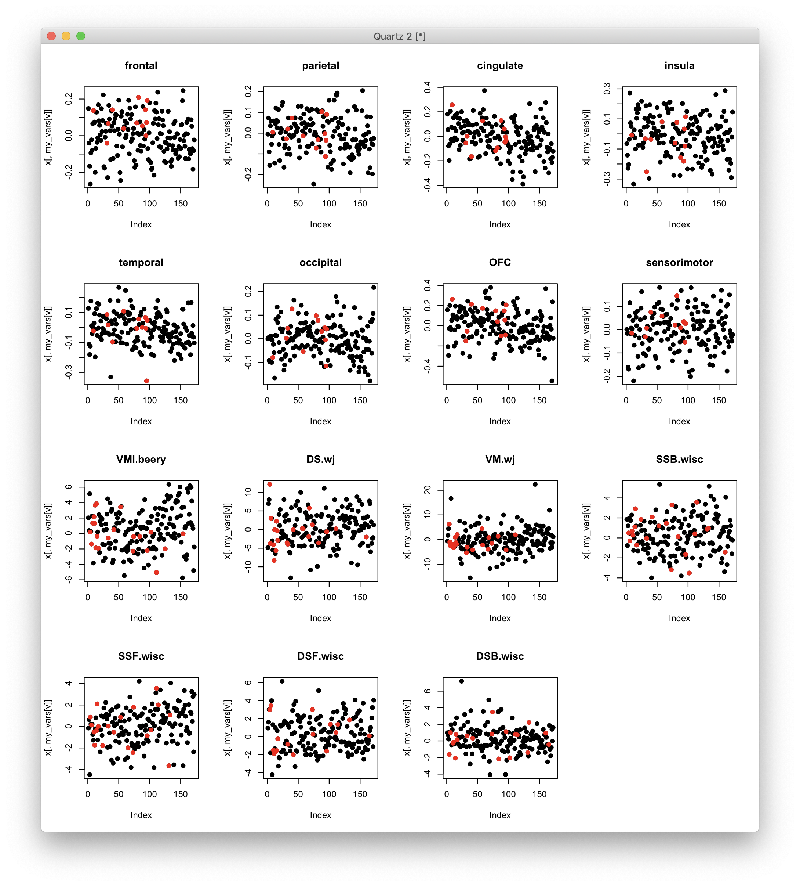

# 2020-03-05 13:28:33

The idea here is that internalizing and externalizing were driving the results
too much. What happens if we remove all subjects that had those? Just so we can
focus a bit more on ADHD. Do PRS results still hold? Do we need different
thresholds for the groups?

```r
min_clin = 1

setwd('~/data/baseline_prediction/prs_start/')
clin_long = read.csv('long_clin_01062020_lt16.csv')
clin_long$SX_total = clin_long$SX_inatt + clin_long$SX_hi

winsorize = function(x, cut = 0.01){
  cut_point_top <- quantile(x, 1 - cut, na.rm = T)
  cut_point_bottom <- quantile(x, cut, na.rm = T)
  i = which(x >= cut_point_top) 
  x[i] = cut_point_top
  j = which(x <= cut_point_bottom) 
  x[j] = cut_point_bottom
  return(x)
}

df = data.frame(MRN=unique(clin_long$MRN))
for (r in 1:nrow(df)) {
    subj_data = clin_long[clin_long$MRN==df$MRN[r], ]
    for (sx in c('inatt', 'hi', 'total')) {
        fit = lm(as.formula(sprintf('SX_%s ~ age', sx)), data=subj_data)
        df[r, sprintf('slope_%s', sx)] = fit$coefficients['age']
        base_row = which.min(subj_data$age)
        df[r, sprintf('base_%s', sx)] = subj_data[base_row, sprintf('SX_%s', sx)]
        last_row = which.max(subj_data$age)
        df[r, sprintf('last_%s', sx)] = subj_data[last_row, sprintf('SX_%s', sx)]
        df[r, 'base_age'] = subj_data[base_row, 'age']
        df[r, 'base_DOA'] = subj_data[base_row, 'DOA']
        df[r, 'last_age'] = subj_data[last_row, 'age']
        df[r, 'sex'] = subj_data[last_row, 'sex']
    }
}
for (min_sx in c(0, 3, 4, 6)) {
    idx = df$base_inatt>=min_sx | df$base_hi>=min_sx
    for (sx in c('inatt', 'hi', 'total')) {
        df[, sprintf('slope_%s_GE%d_wp05', sx, min_sx)] = NA
        junk = winsorize(df[idx, sprintf('slope_%s', sx)], cut=.05)
        df[idx, sprintf('slope_%s_GE%d_wp05', sx, min_sx)] = junk
    }
}

demo = read.csv('prs_demo.csv')
# just to get FAMID, sex already there
df = merge(df, subset(demo, select=-sex), by='MRN')

# cut kids if not enough time between clinical assessments
keep_me = which((df$last_age - df$base_age) >= min_clin)
df = df[keep_me, ]
```

Before we select the best kid in each family, let's remove kids with
comorbidities:

```r
library(gdata)
como = read.xls('~/data/baseline_prediction/prs_start/baseline_with_comorbidity_added_ps_edits_03052020.xlsx')
rm_me = como$internalizing_ps_check_UPDATED==1 | como$externalizing_ps_check_UPDATED==1
df = df[!rm_me, ]
```

Now we can go on with selecting best in family:

```r
# selecting best kid in family
df$bestInFamily = F
nvisits = table(clin_long$MRN)
df = merge(df, as.matrix(nvisits),
                 by.x='MRN', by.y=0)
colnames(df)[ncol(df)] = 'nvisits'
for (f in unique(df$FAMID)) {
    fam_rows = which(df$FAMID == f)
    fam_data = df[fam_rows,]
    if (nrow(fam_data) == 1) {
        df[fam_rows,]$bestInFamily = T
    } else {
        stotal = sort(fam_data$slope_total, index.return=T, decreasing=T)
        # if there's a tie
        if (stotal$x[1] == stotal$x[2]) {
            # print(sprintf('Tie in slope for %d', f))
            svisits = sort(fam_data$nvisits, index.return=T, decreasing=T)
            if (svisits$x[1] == svisits$x[2]) {
                print(sprintf('Tie in number of visits for %d', f))
                print(fam_data[fam_data$nvisits==svisits$x[1], ]$MRN)
            } else {
                df[fam_rows[svisits$ix[1]], ]$bestInFamily = T
            }
        } else {
            df[fam_rows[stotal$ix[1]], ]$bestInFamily = T
        }
    }
}

df[df$MRN==4585574, ]$bestInFamily = T
df[df$MRN==4925051, ]$bestInFamily = T
df[df$MRN==7079035, ]$bestInFamily = T
df[df$MRN==7378993, ]$bestInFamily = T
# chosen because of overall best MPRAGE QC
df[df$MRN==4640378, ]$bestInFamily = T
# chosen because of overall best MPRAGE QC
df[df$MRN==7218965, ]$bestInFamily = T
```

Let's check if our thresholds from before still make sense:

```r
min_sx = 6
for (sx in c('inatt', 'hi')) {
    if (sx == 'inatt') {
        thresh = 0
    } else if (sx == 'hi') {
        thresh = -.5
    }
    phen_slope = sprintf('slope_%s_GE%d_wp05', sx, min_sx)
    phen = sprintf('thresh%.2f_%s_GE%d_wp05', abs(thresh), sx, min_sx)
    df[, phen] = 'notGE6adhd'
    my_nvs = which(is.na(df[, phen_slope]))
    idx = df[my_nvs, 'base_inatt'] <= 2 & df[my_nvs, 'base_hi'] <= 2
    df[my_nvs[idx], phen] = 'nv012'
    df[which(df[, phen_slope] < thresh), phen] = 'imp'
    df[which(df[, phen_slope] >= thresh), phen] = 'nonimp'
    df[, phen] = factor(df[, phen], ordered=F)
    df[, phen] = relevel(df[, phen], ref='nv012')
    ophen = sprintf('ORDthresh%.2f_%s_GE%d_wp05', abs(thresh), sx, min_sx)
    df[, ophen] = factor(df[, phen],
                         levels=c('nv012', 'notGE6adhd', 'imp', 'nonimp'),
                         ordered=T)
}
```

What are the current ratios?

```r
> table(df$ORDthresh0.00_inatt_GE6_wp05)

     nv012 notGE6adhd        imp     nonimp 
       148         44        104         67 
> table(df$ORDthresh0.50_hi_GE6_wp05)

     nv012 notGE6adhd        imp     nonimp 
       148         44         69        102 
```

The ratios are almost inverted... but similar to what we had before. 

Let's make some plots:

```r
par(mfrow=c(3,2))
for (ge in c(3,4,6)) {
    plot(sort(df[, sprintf('slope_inatt_GE%d_wp05', ge)]), pch=19,
         main=sprintf('inatt GE%d', ge))
    abline(h=0, col='red')
    plot(sort(df[, sprintf('slope_hi_GE%d_wp05', ge)]), pch=19,
         main=sprintf('hi GE%d', ge))
    abline(h=-0.5, col='red')
}
```


Values make sense based on medians and the plots... but it might raise eye brows
clinically? Let's continue running our analysis and see where we get:

```r
prs = read.csv('/Volumes/NCR/reference/merged_NCR_1KG_PRS_12192019.csv')
data = merge(df, prs, by='MRN', all.x=F, all.y=F)
library(nlme)
library(MASS)
qc_vars = sapply(1:10, function(x) sprintf('PC%02d', x))
# I'll remove all PCs from both ADHD and ADHDeur!
brain_vars = colnames(data)[grepl(colnames(data), pattern='^ADHD')]
for (bv in brain_vars) {
    fm_str = paste(bv, " ~ sex + base_age + ", paste(qc_vars, collapse='+'), sep="")
    fit = lme(as.formula(fm_str), data, ~1|FAMID, method='ML')
    step = stepAIC(fit, direction='both', trace=F)
    data[, bv] = residuals(step)
}
# removing PC variables and PRS for other disorders
data = data[, 1:65]

# anatomical
qc = read.csv('~/data/baseline_prediction/prs_start/prs_and_mprage_qc.csv')
brain_meta = merge(df, qc, by='MRN', all.x=F, all.y=F)
qc_vars = c("mprage_score", "ext_avg", "int_avg")
brain_meta = brain_meta[brain_meta$"age_at_scan" < 18, ]
na_scores_idx = is.na(brain_meta$mprage_score) | is.na(brain_meta$ext_avg) |
                is.na(brain_meta$int_avg)
brain_meta = brain_meta[!na_scores_idx, ]
qtile=.95
library(solitude)
iso <- isolationForest$new()
iso$fit(brain_meta[, qc_vars])
scores_if = as.matrix(iso$scores)[,3]
library(dbscan)
scores_lof = lof(brain_meta[, qc_vars], k = round(.5 * nrow(brain_meta)))
thresh_lof = quantile(scores_lof, qtile)
thresh_if = quantile(scores_if, qtile)
idx = scores_lof < thresh_lof & scores_if < thresh_if
all_brain_data = read.table('~/data/baseline_prediction/merged_rois.txt', header=T)
x = duplicated(all_brain_data$lh.aparc.area)
brain_data = merge(brain_meta[idx,], all_brain_data[!x, ], by.x='maskid',
                   by.y='lh.aparc.area', all.x=F, all.y=F)
rois = read.csv('~/data/baseline_prediction/REGIONAL_ANALYSES_FREESURFER.csv')
brain_vars = colnames(brain_data)[grepl(colnames(brain_data), pattern="_thickness$")]
part = 'lobar'
new_brain_vars = c()
for (roi in unique(rois[, part])) {
    labels = rois[which(rois[, part]==roi), 'region']
    to_avg = c()
    for (l in labels) {
        to_avg = c(to_avg,
                   brain_vars[grepl(brain_vars, pattern=sprintf("^%s", l))])
    }
    # only use variable if it's selected initially and defined
    if (length(to_avg) > 0 && sum(is.na(brain_data[, to_avg])) == 0 &&
        nchar(roi) > 0) {
        if (length(to_avg) == 1) {
            brain_data[, roi] = brain_data[, to_avg]
        } else {
            brain_data[, roi] = rowMeans(brain_data[, to_avg])
        }
        new_brain_vars = c(new_brain_vars, roi)
    }
}
brain_vars = new_brain_vars
iso <- isolationForest$new()
iso$fit(brain_data[, brain_vars])
scores_if = as.matrix(iso$scores)[,3]
scores_lof = lof(brain_data[, brain_vars], k = round(.5 * nrow(brain_data)))
thresh_lof = quantile(scores_lof, qtile)
thresh_if = quantile(scores_if, qtile)
idx = scores_lof < thresh_lof & scores_if < thresh_if
clean_brain_data = brain_data[idx, ]
keep_me = c()
for (s in unique(clean_brain_data$MRN)) {
    subj_rows = which(clean_brain_data$MRN == s)
    subj_data = clean_brain_data[subj_rows, ]
    min_subj_row = which.min(subj_data$age_at_scan)
    if (abs(subj_data[min_subj_row, 'base_age'] -
            subj_data[min_subj_row, 'age_at_scan'])<1) {
        keep_me = c(keep_me, subj_rows[min_subj_row])
    }
}
anat_data = clean_brain_data[keep_me, ]
res_anat_data = merge(data[, c('MRN', 'FAMID', 'sex')],
                      anat_data[, c('MRN', 'age_at_scan', qc_vars, brain_vars)], by='MRN',
                      all.x=F, all.y=F)
for (bv in brain_vars) {
    fm_str = paste(bv, " ~ sex + age_at_scan + ", paste(qc_vars, collapse='+'), sep="")
    fit = lme(as.formula(fm_str), res_anat_data, ~1|FAMID, method='ML')
    step = stepAIC(fit, direction='both', trace=F)
    res_anat_data[, bv] = residuals(step)
}
data = merge(data, res_anat_data[, c('MRN', brain_vars)], by='MRN',
             all.x=T, all.y=F)

# DTI
qc = read.csv('/Volumes/Shaw/MasterQC/master_qc_20190314.csv')
brain_demo = read.csv('~/data/heritability_change/ready_1020.csv')
m = merge(brain_demo, qc, by.y='Mask.ID', by.x='Mask.ID...Scan', all.x=F)
brain_meta = merge(m, df, by.x="Medical.Record...MRN...Subjects", by.y='MRN',
                   all.x=F, all.y=F)
colnames(brain_meta)[1] = 'MRN'
qc_vars = c("meanX.trans", "meanY.trans", "meanZ.trans",
            "meanX.rot", "meanY.rot", "meanZ.rot",
            "goodVolumes")
brain_meta = brain_meta[brain_meta$"age_at_scan...Scan...Subjects" < 18, ]
brain_meta = brain_meta[brain_meta$"goodVolumes" <= 61, ]
brain_meta = brain_meta[brain_meta$"numVolumes" < 80, ]
qtile=.95
library(solitude)
iso <- isolationForest$new()
iso$fit(brain_meta[, qc_vars])
scores_if = as.matrix(iso$scores)[,3]
library(dbscan)
scores_lof = lof(brain_meta[, qc_vars], k = round(.5 * nrow(brain_meta)))
thresh_lof = quantile(scores_lof, qtile)
thresh_if = quantile(scores_if, qtile)
idx = scores_lof < thresh_lof & scores_if < thresh_if
all_brain_data = read.csv('~/data/heritability_change/jhu_tracts_1020.csv')
x = duplicated(all_brain_data$id)
brain_data = merge(brain_meta[idx,], all_brain_data[!x, ], by.x='Mask.ID...Scan',
                   by.y='id')
all_brain_data = read.csv('~/data/baseline_prediction/jhu_tracts_mode.csv')
x = duplicated(all_brain_data$id)
brain_data = merge(brain_data, all_brain_data[!x, ], by.x='Mask.ID...Scan',
                   by.y='id')
for (p in c('fa', 'ad', 'rd', 'mode')) {
    brain_data[, sprintf('ATR_%s', p)] = rowMeans(brain_data[, c(sprintf('%s_1', p),
                                                                 sprintf('%s_2', p))])
    brain_data[, sprintf('CST_%s', p)] = rowMeans(brain_data[, c(sprintf('%s_3', p),
                                                                 sprintf('%s_4', p))])
    brain_data[, sprintf('CIN_%s', p)] = rowMeans(brain_data[, c(sprintf('%s_5', p),
                                                                 sprintf('%s_6', p),
                                                                 sprintf('%s_7', p),
                                                                 sprintf('%s_8', p))])
    brain_data[, sprintf('CC_%s', p)] = rowMeans(brain_data[, c(sprintf('%s_9', p),
                                                                 sprintf('%s_10', p))])
    brain_data[, sprintf('IFO_%s', p)] = rowMeans(brain_data[, c(sprintf('%s_11', p),
                                                                 sprintf('%s_12', p))])
    brain_data[, sprintf('ILF_%s', p)] = rowMeans(brain_data[, c(sprintf('%s_13', p),
                                                                 sprintf('%s_14', p))])
    brain_data[, sprintf('SLF_%s', p)] = rowMeans(brain_data[, c(sprintf('%s_15', p),
                                                                 sprintf('%s_16', p),
                                                                 sprintf('%s_19', p),
                                                                 sprintf('%s_20', p))])
    brain_data[, sprintf('UNC_%s', p)] = rowMeans(brain_data[, c(sprintf('%s_17', p),
                                                                 sprintf('%s_18', p))])
}
brain_vars = colnames(brain_data)[grepl(colnames(brain_data), pattern="_fa$") &
                                  !grepl(colnames(brain_data), pattern="^mean")]
iso <- isolationForest$new()
iso$fit(brain_data[, brain_vars])
scores_if = as.matrix(iso$scores)[,3]
scores_lof = lof(brain_data[, brain_vars], k = round(.5 * nrow(brain_data)))
thresh_lof = quantile(scores_lof, qtile)
thresh_if = quantile(scores_if, qtile)
idx = scores_lof < thresh_lof & scores_if < thresh_if
clean_brain_data = brain_data[idx, ]
keep_me = c()
for (s in unique(clean_brain_data$MRN)) {
    subj_rows = which(clean_brain_data$MRN == s)
    subj_data = clean_brain_data[subj_rows, ]
    min_subj_row = which.min(subj_data$age_at_scan...Scan...Subjects)
    if (abs(subj_data[min_subj_row, 'base_age'] -
            subj_data[min_subj_row, 'age_at_scan...Scan...Subjects'])<1) {
        keep_me = c(keep_me, subj_rows[min_subj_row])
    }
}
dti_data = clean_brain_data[keep_me, ]
res_dti_data = merge(data[, c('MRN', 'FAMID', 'sex')],
                     dti_data[, c('MRN', 'age_at_scan...Scan...Subjects',
                                  qc_vars, brain_vars)], by='MRN',
                     all.x=F, all.y=F)
for (bv in brain_vars) {
    fm_str = paste(bv, " ~ sex + age_at_scan...Scan...Subjects + ", paste(qc_vars, collapse='+'), sep="")
    fit = lme(as.formula(fm_str), res_dti_data, ~1|FAMID, method='ML')
    step = stepAIC(fit, direction='both', trace=F)
    res_dti_data[, bv] = residuals(step)
}
data = merge(data, res_dti_data[, c('MRN', brain_vars)], by='MRN',
             all.x=T, all.y=F)

# other variables
iq = read.csv('~/data/baseline_prediction/basics.csv')
neuropsych = merge(df, iq, by='MRN')
library(gdata)
source('~/research_code/lab_mgmt/merge_on_closest_date.R')
beery = read.xls('~/data/baseline_prediction/prs_start/Subjects_Beery_raw.xlsx')
colnames(beery) = c('MRN', 'DOA.beery', 'VMI.beery')
neuropsych = mergeOnClosestDate(neuropsych, beery, unique(df$MRN), x.date='base_DOA',
                                y.date='DOA.beery')
colnames(neuropsych)[ncol(neuropsych)] = 'dateDiff.beery'
wisc = read.xls('~/data/baseline_prediction/prs_start/Subjects_WISC_raw.xlsx')
colnames(wisc) = c('MRN', 'DOA.wisc', 'DSB.wisc', 'DSF.wisc', 'SSB.wisc', 'SSF.wisc')
neuropsych = mergeOnClosestDate(neuropsych, wisc, unique(df$MRN),
                                x.date='base_DOA', y.date='DOA.wisc')
colnames(neuropsych)[ncol(neuropsych)] = 'dateDiff.wisc'
wj = read.xls('~/data/baseline_prediction/prs_start/Subjects_Woodcock_Johnson_raw.xlsx')
colnames(wj) = c('MRN', 'DOA.wj', 'DS.wj', 'VM.wj')
neuropsych = mergeOnClosestDate(neuropsych, wj, unique(df$MRN),
                                x.date='base_DOA', y.date='DOA.wj')
colnames(neuropsych)[ncol(neuropsych)] = 'dateDiff.wj'
for (suf in c('.beery', '.wisc', '.wj')) {
    doa_col = sprintf('DOA%s', suf)
    date_diff = abs(as.Date(neuropsych[, 'base_DOA'], tryFormats='%m/%d/%Y') -
                    as.Date(neuropsych[, doa_col], tryFormats='%m/%d/%Y'))
    mycols = colnames(neuropsych)[grepl(colnames(neuropsych), pattern=sprintf('%s$', suf))]
    # DOA needs to be within 18 months from base_DOA
    idx = which(date_diff > 547)
    neuropsych[idx, mycols] = NA
    # also make sure that DOA is before FU
    idx = which(date_diff >= (neuropsych$last_age - neuropsych$base_age) * 365.25)
    neuropsych[idx, mycols] = NA
}
# note that I'm not covarying IQ, SES, externalizing or internalizing for age and sex!
brain_vars = c('VMI.beery' , "SSB.wisc", "SSF.wisc", 'DSF.wisc', 'DSB.wisc',
               "DS.wj", "VM.wj")
other_vars = c('FSIQ', 'SES', 'externalizing', 'internalizing')
res_psych_data = merge(data[, c('MRN', 'FAMID', 'sex', 'base_age')],
                       neuropsych[, c('MRN', brain_vars, other_vars)], by='MRN',
                       all.x=F, all.y=F)
for (bv in brain_vars) {
    idx = !is.na(res_psych_data[, bv])
    fm_str = paste(bv, " ~ sex + base_age", sep="")
    fit = lme(as.formula(fm_str), res_psych_data[idx, ], ~1|FAMID, method='ML')
    step = stepAIC(fit, direction='both', trace=F)
    res_psych_data[idx, bv] = residuals(step)
}
data = merge(data, res_psych_data[, c('MRN', brain_vars, other_vars)],
             by='MRN', all.x=T, all.y=F)

# add medication as well
meds = read.csv('~/data/baseline_prediction/prs_start/med_at_base.csv')
idx = meds$medication_status_at_observation=='nonstim'
meds[idx, ]$medication_status_at_observation = 'none'
meds$medication_status_at_observation = factor(meds$medication_status_at_observation)
data = merge(data, meds, by='MRN')

data$externalizing = NULL
data$internalizing = NULL

out_fname = sprintf('~/data/baseline_prediction/prs_start/complete_massagedRawNeuropsychResidsNoComorbid_clinDiffGE%d_03032020.rds',
                    min_clin)
saveRDS(data, file=out_fname, compress=T)
```

And let's double-check the data missing rates:

```r
data = data[!is.na(data$CC_fa), ]
imp_vars = colnames(data)[66:73]
print(sprintf('Anatomy: %s', max(colSums(is.na(data[, imp_vars])))/nrow(data)))
for (iv in c(colnames(data)[82], 'FSIQ', 'SES')) {
    print(sprintf('%s: %s', iv, sum(is.na(data[, iv]))/nrow(data)))
}
imp_vars = colnames(data)[87:88]
print(sprintf('WJ: %s', max(colSums(is.na(data[, imp_vars])))/nrow(data)))
imp_vars = colnames(data)[83:86]
print(sprintf('WISC: %s', max(colSums(is.na(data[, imp_vars])))/nrow(data)))
```

```
[1] "Anatomy: 0.0628571428571429"
[1] "VMI.beery: 0.102857142857143"
[1] "FSIQ: 0"
[1] "SES: 0"
[1] "DS.wj" "VM.wj"
[1] "WJ: 0.12"
[1] "WISC: 0.114285714285714"
```

Do the univariate results change at all?

```r
library(nlme)
library(MASS)

for (cd in 1:1) {
    data = readRDS(sprintf('~/data/baseline_prediction/prs_start/complete_massagedRawNeuropsychResidsNoComorbid_clinDiffGE%d_03032020.rds', cd))

    brain_vars = colnames(data)[c(42:53, 66:90)]
    hold = c()
    min_sx = 6
    out_fname = sprintf('~/data/baseline_prediction/prs_start/univar_allResidRawNeuropsychNoComorbidClinDiff%d_4groupOrdered_lme.csv', cd)
    for (sx in c('inatt', 'hi')) {
        if (sx == 'inatt') {
            thresh = 0
        } else if (sx == 'hi') {
            thresh = -.5
        }
        phen = sprintf('ORDthresh%.2f_%s_GE%d_wp05', abs(thresh), sx, min_sx)

        phen_res = c()
        for (bv in brain_vars) {
            use_me = !is.na(data[, bv]) & data$bestInFamily
            this_data = data[use_me, c(phen, 'FAMID', brain_vars)]
            fm_str = paste(bv, sprintf(" ~ %s", phen), sep="")
            fit = try(lme(as.formula(fm_str), ~1|FAMID, data=this_data, method='ML'))
            if (length(fit)>1) {
                temp = c(summary(fit)$tTable[sprintf('%s.L', phen), ],
                            summary(fit)$logLik, summary(fit)$AIC, summary(fit)$BIC,
                            bv, 'linear')
                phen_res = rbind(phen_res, temp)
                rownames(phen_res)[nrow(phen_res)] = fm_str
                temp = c(summary(fit)$tTable[sprintf('%s.Q', phen), ],
                            summary(fit)$logLik, summary(fit)$AIC, summary(fit)$BIC,
                            bv, 'quadratic')
                phen_res = rbind(phen_res, temp)
                rownames(phen_res)[nrow(phen_res)] = fm_str
                temp = c(summary(fit)$tTable[sprintf('%s.C', phen), ],
                            summary(fit)$logLik, summary(fit)$AIC, summary(fit)$BIC,
                            bv, 'cubic')
                phen_res = rbind(phen_res, temp)
                rownames(phen_res)[nrow(phen_res)] = fm_str
            } else {
                # fit broke
                temp = rep(NA, 10)
                phen_res = rbind(phen_res, temp)
                rownames(phen_res)[nrow(phen_res)] = fm_str
            }
        }
        phen_res = data.frame(phen_res)
        phen_res$formula = rownames(phen_res)
        phen_res$outcome = phen
        hold = rbind(hold, phen_res)
    }
    colnames(hold)[6:10] = c('logLik', 'AIC', 'BIC', 'brainVar', 'modtype')
    write.csv(hold, file=out_fname, row.names=F)
}
```

And the variable filtering:

```r
cd = 1
res = read.csv(sprintf('~/data/baseline_prediction/prs_start/univar_allResidRawNeuropsychNoComorbidClinDiff%d_4groupOrdered_lme.csv', cd))
res = res[res$modtype=='linear',]
# keep only top PRS
prs_rows = which(grepl(res$brainVar, pattern='^ADHD') &
                 grepl(res$outcome, pattern='_inatt_'))
inatt_best = prs_rows[which.min(res[prs_rows, 'p.value'])]
prs_rows = which(grepl(res$brainVar, pattern='^ADHD') &
                 grepl(res$outcome, pattern='_hi_'))
hi_best = prs_rows[which.min(res[prs_rows, 'p.value'])]
res_clean = rbind(res[!grepl(res$brainVar, pattern='^ADHD'),],
                  res[inatt_best, ], res[hi_best, ])
p2 = p.adjust(res_clean$p.value, method='fdr')
print(res_clean[p2<.05,c('brainVar', 'outcome')])
print(res_clean[p2<.1,c('brainVar', 'outcome')])
```

Yep, it still looks fine. Here are the variables I got:

```
> print(res_clean[p2<.05,c('brainVar', 'outcome')])
            brainVar                      outcome
85         VMI.beery ORDthresh0.00_inatt_GE6_wp05
106             FSIQ ORDthresh0.00_inatt_GE6_wp05
166              OFC    ORDthresh0.50_hi_GE6_wp05
196        VMI.beery    ORDthresh0.50_hi_GE6_wp05
217             FSIQ    ORDthresh0.50_hi_GE6_wp05
1   ADHD_PRS0.000100 ORDthresh0.00_inatt_GE6_wp05
115 ADHD_PRS0.001000    ORDthresh0.50_hi_GE6_wp05
> print(res_clean[p2<.1,c('brainVar', 'outcome')])
            brainVar                      outcome
55               OFC ORDthresh0.00_inatt_GE6_wp05
67            CIN_fa ORDthresh0.00_inatt_GE6_wp05
85         VMI.beery ORDthresh0.00_inatt_GE6_wp05
94          DSF.wisc ORDthresh0.00_inatt_GE6_wp05
106             FSIQ ORDthresh0.00_inatt_GE6_wp05
166              OFC    ORDthresh0.50_hi_GE6_wp05
175           CST_fa    ORDthresh0.50_hi_GE6_wp05
196        VMI.beery    ORDthresh0.50_hi_GE6_wp05
205         DSF.wisc    ORDthresh0.50_hi_GE6_wp05
214            VM.wj    ORDthresh0.50_hi_GE6_wp05
217             FSIQ    ORDthresh0.50_hi_GE6_wp05
1   ADHD_PRS0.000100 ORDthresh0.00_inatt_GE6_wp05
115 ADHD_PRS0.001000    ORDthresh0.50_hi_GE6_wp05
```

Looks good, but the clinical group split is indeed worrisome, after showing it
to Philip. So, let's do median then:

```r
for (min_sx in c(3, 4, 6)) {
    for (sx in c('inatt', 'hi')) {
        phen_slope = sprintf('slope_%s_GE%d_wp05', sx, min_sx)
        thresh = median(data[, phen_slope], na.rm=T)
        phen = sprintf('threshMED_%s_GE%d_wp05', sx, min_sx)
        data[, phen] = 'notGE6adhd'
        my_nvs = which(is.na(data[, phen_slope]))
        idx = data[my_nvs, 'base_inatt'] <= 2 & data[my_nvs, 'base_hi'] <= 2
        data[my_nvs[idx], phen] = 'nv012'
        data[which(data[, phen_slope] < thresh), phen] = 'imp'
        data[which(data[, phen_slope] >= thresh), phen] = 'nonimp'
        data[, phen] = factor(data[, phen], ordered=F)
        data[, phen] = relevel(data[, phen], ref='nv012')
        ophen = sprintf('ORDthreshMED_%s_GE%d_wp05', sx, min_sx)
        data[, ophen] = factor(data[, phen],
                            levels=c('nv012', 'notGE6adhd', 'imp', 'nonimp'),
                            ordered=T)
    }
}
```

And how do the univariate results look now?

```r
brain_vars = colnames(data)[c(42:53, 66:90)]
hold = c()
min_sx = 6
cd = 1
out_fname = sprintf('~/data/baseline_prediction/prs_start/univar_medianClinDiff%d_4groupOrdered_lme.csv', cd)
for (sx in c('inatt', 'hi')) {
    phen = sprintf('ORDthreshMED_%s_GE%d_wp05', sx, min_sx)

    phen_res = c()
    for (bv in brain_vars) {
        use_me = !is.na(data[, bv]) & data$bestInFamily
        this_data = data[use_me, c(phen, 'FAMID', brain_vars)]
        fm_str = paste(bv, sprintf(" ~ %s", phen), sep="")
        fit = try(lme(as.formula(fm_str), ~1|FAMID, data=this_data, method='ML'))
        if (length(fit)>1) {
            temp = c(summary(fit)$tTable[sprintf('%s.L', phen), ],
                        summary(fit)$logLik, summary(fit)$AIC, summary(fit)$BIC,
                        bv, 'linear')
            phen_res = rbind(phen_res, temp)
            rownames(phen_res)[nrow(phen_res)] = fm_str
            temp = c(summary(fit)$tTable[sprintf('%s.Q', phen), ],
                        summary(fit)$logLik, summary(fit)$AIC, summary(fit)$BIC,
                        bv, 'quadratic')
            phen_res = rbind(phen_res, temp)
            rownames(phen_res)[nrow(phen_res)] = fm_str
            temp = c(summary(fit)$tTable[sprintf('%s.C', phen), ],
                        summary(fit)$logLik, summary(fit)$AIC, summary(fit)$BIC,
                        bv, 'cubic')
            phen_res = rbind(phen_res, temp)
            rownames(phen_res)[nrow(phen_res)] = fm_str
        } else {
            # fit broke
            temp = rep(NA, 10)
            phen_res = rbind(phen_res, temp)
            rownames(phen_res)[nrow(phen_res)] = fm_str
        }
    }
    phen_res = data.frame(phen_res)
    phen_res$formula = rownames(phen_res)
    phen_res$outcome = phen
    hold = rbind(hold, phen_res)
}
colnames(hold)[6:10] = c('logLik', 'AIC', 'BIC', 'brainVar', 'modtype')
write.csv(hold, file=out_fname, row.names=F)
```

And re-checking FDR:

```r
cd = 1
res = read.csv(sprintf('~/data/baseline_prediction/prs_start/univar_medianClinDiff%d_4groupOrdered_lme.csv', cd))
res = res[res$modtype=='linear',]
# keep only top PRS
prs_rows = which(grepl(res$brainVar, pattern='^ADHD') &
                 grepl(res$outcome, pattern='_inatt_'))
inatt_best = prs_rows[which.min(res[prs_rows, 'p.value'])]
prs_rows = which(grepl(res$brainVar, pattern='^ADHD') &
                 grepl(res$outcome, pattern='_hi_'))
hi_best = prs_rows[which.min(res[prs_rows, 'p.value'])]
res_clean = rbind(res[!grepl(res$brainVar, pattern='^ADHD'),],
                  res[inatt_best, ], res[hi_best, ])
p2 = p.adjust(res_clean$p.value, method='fdr')
print(res_clean[p2<.05,c('brainVar', 'outcome')])
print(res_clean[p2<.1,c('brainVar', 'outcome')])
```

```
> print(res_clean[p2<.05,c('brainVar', 'outcome')])
            brainVar                     outcome
85         VMI.beery ORDthreshMED_inatt_GE6_wp05
106             FSIQ ORDthreshMED_inatt_GE6_wp05
166              OFC    ORDthreshMED_hi_GE6_wp05
175           CST_fa    ORDthreshMED_hi_GE6_wp05
196        VMI.beery    ORDthreshMED_hi_GE6_wp05
217             FSIQ    ORDthreshMED_hi_GE6_wp05
1   ADHD_PRS0.000100 ORDthreshMED_inatt_GE6_wp05
127 ADHD_PRS0.000500    ORDthreshMED_hi_GE6_wp05
> print(res_clean[p2<.1,c('brainVar', 'outcome')])
            brainVar                     outcome
55               OFC ORDthreshMED_inatt_GE6_wp05
85         VMI.beery ORDthreshMED_inatt_GE6_wp05
106             FSIQ ORDthreshMED_inatt_GE6_wp05
166              OFC    ORDthreshMED_hi_GE6_wp05
175           CST_fa    ORDthreshMED_hi_GE6_wp05
196        VMI.beery    ORDthreshMED_hi_GE6_wp05
217             FSIQ    ORDthreshMED_hi_GE6_wp05
1   ADHD_PRS0.000100 ORDthreshMED_inatt_GE6_wp05
127 ADHD_PRS0.000500    ORDthreshMED_hi_GE6_wp05
```

Yep, still there. Fewer variables, but that's not necessarily bad. Let's
re-create the data file for the rest of the analysis then, but adding some
additional safe checks on the dates so that there's less running over base and
last clinical DOA:

```r
min_clin = 1

setwd('~/data/baseline_prediction/prs_start/')
clin_long = read.csv('long_clin_01062020_lt16.csv')
clin_long$SX_total = clin_long$SX_inatt + clin_long$SX_hi

winsorize = function(x, cut = 0.01){
  cut_point_top <- quantile(x, 1 - cut, na.rm = T)
  cut_point_bottom <- quantile(x, cut, na.rm = T)
  i = which(x >= cut_point_top) 
  x[i] = cut_point_top
  j = which(x <= cut_point_bottom) 
  x[j] = cut_point_bottom
  return(x)
}

df = data.frame(MRN=unique(clin_long$MRN))
for (r in 1:nrow(df)) {
    subj_data = clin_long[clin_long$MRN==df$MRN[r], ]
    for (sx in c('inatt', 'hi', 'total')) {
        fit = lm(as.formula(sprintf('SX_%s ~ age', sx)), data=subj_data)
        df[r, sprintf('slope_%s', sx)] = fit$coefficients['age']
        base_row = which.min(subj_data$age)
        df[r, sprintf('base_%s', sx)] = subj_data[base_row, sprintf('SX_%s', sx)]
        last_row = which.max(subj_data$age)
        df[r, sprintf('last_%s', sx)] = subj_data[last_row, sprintf('SX_%s', sx)]
        df[r, 'base_age'] = subj_data[base_row, 'age']
        df[r, 'base_DOA'] = subj_data[base_row, 'DOA']
        df[r, 'last_age'] = subj_data[last_row, 'age']
        df[r, 'last_DOA'] = subj_data[last_row, 'DOA']
        df[r, 'sex'] = subj_data[last_row, 'sex']
    }
}
for (min_sx in c(0, 3, 4, 6)) {
    idx = df$base_inatt>=min_sx | df$base_hi>=min_sx
    for (sx in c('inatt', 'hi', 'total')) {
        df[, sprintf('slope_%s_GE%d_wp05', sx, min_sx)] = NA
        junk = winsorize(df[idx, sprintf('slope_%s', sx)], cut=.05)
        df[idx, sprintf('slope_%s_GE%d_wp05', sx, min_sx)] = junk
    }
}

demo = read.csv('prs_demo.csv')
# just to get FAMID, sex already there
df = merge(df, subset(demo, select=-sex), by='MRN')

# cut kids if not enough time between clinical assessments
keep_me = which((df$last_age - df$base_age) >= min_clin)
df = df[keep_me, ]

library(gdata)
como = read.xls('~/data/baseline_prediction/prs_start/baseline_with_comorbidity_added_ps_edits_03052020.xlsx')
rm_me = como$internalizing_ps_check_UPDATED==1 | como$externalizing_ps_check_UPDATED==1
df = df[!rm_me, ]

# selecting best kid in family
df$bestInFamily = F
nvisits = table(clin_long$MRN)
df = merge(df, as.matrix(nvisits), by.x='MRN', by.y=0)
colnames(df)[ncol(df)] = 'nvisits'
for (f in unique(df$FAMID)) {
    fam_rows = which(df$FAMID == f)
    fam_data = df[fam_rows,]
    if (nrow(fam_data) == 1) {
        df[fam_rows,]$bestInFamily = T
    } else {
        stotal = sort(fam_data$slope_total, index.return=T, decreasing=T)
        # if there's a tie
        if (stotal$x[1] == stotal$x[2]) {
            # print(sprintf('Tie in slope for %d', f))
            svisits = sort(fam_data$nvisits, index.return=T, decreasing=T)
            if (svisits$x[1] == svisits$x[2]) {
                print(sprintf('Tie in number of visits for %d', f))
                print(fam_data[fam_data$nvisits==svisits$x[1], ]$MRN)
            } else {
                df[fam_rows[svisits$ix[1]], ]$bestInFamily = T
            }
        } else {
            df[fam_rows[stotal$ix[1]], ]$bestInFamily = T
        }
    }
}

df[df$MRN==4585574, ]$bestInFamily = T
df[df$MRN==4925051, ]$bestInFamily = T
df[df$MRN==7079035, ]$bestInFamily = T
df[df$MRN==7378993, ]$bestInFamily = T
# chosen because of overall best MPRAGE QC
df[df$MRN==4640378, ]$bestInFamily = T
# chosen because of overall best MPRAGE QC
df[df$MRN==7218965, ]$bestInFamily = T

for (min_sx in c(3, 4, 6)) {
    for (sx in c('inatt', 'hi')) {
        phen_slope = sprintf('slope_%s_GE%d_wp05', sx, min_sx)
        thresh = median(df[, phen_slope], na.rm=T)
        phen = sprintf('threshMED_%s_GE%d_wp05', sx, min_sx)
        df[, phen] = 'notGE6adhd'
        my_nvs = which(is.na(df[, phen_slope]))
        idx = df[my_nvs, 'base_inatt'] <= 2 & df[my_nvs, 'base_hi'] <= 2
        df[my_nvs[idx], phen] = 'nv012'
        df[which(df[, phen_slope] < thresh), phen] = 'imp'
        df[which(df[, phen_slope] >= thresh), phen] = 'nonimp'
        df[, phen] = factor(df[, phen], ordered=F)
        df[, phen] = relevel(df[, phen], ref='nv012')
        ophen = sprintf('ORDthreshMED_%s_GE%d_wp05', sx, min_sx)
        df[, ophen] = factor(df[, phen],
                            levels=c('nv012', 'notGE6adhd', 'imp', 'nonimp'),
                            ordered=T)
    }
}

prs = read.csv('/Volumes/NCR/reference/merged_NCR_1KG_PRS_12192019.csv')
data = merge(df, prs, by='MRN', all.x=F, all.y=F)
library(nlme)
library(MASS)
qc_vars = sapply(1:10, function(x) sprintf('PC%02d', x))
# I'll remove all PCs from both ADHD and ADHDeur!
brain_vars = colnames(data)[grepl(colnames(data), pattern='^ADHD')]
for (bv in brain_vars) {
    fm_str = paste(bv, " ~ sex + base_age + ", paste(qc_vars, collapse='+'), sep="")
    fit = lme(as.formula(fm_str), data, ~1|FAMID, method='ML')
    step = stepAIC(fit, direction='both', trace=F)
    data[, bv] = residuals(step)
}
# removing PC variables and PRS for other disorders
data = data[, 1:74]

# anatomical
qc = read.csv('~/data/baseline_prediction/prs_start/prs_and_mprage_qc.csv')
brain_meta = merge(df, qc, by='MRN', all.x=F, all.y=F)
qc_vars = c("mprage_score", "ext_avg", "int_avg")
brain_meta = brain_meta[brain_meta$"age_at_scan" < 18, ]
na_scores_idx = is.na(brain_meta$mprage_score) | is.na(brain_meta$ext_avg) |
                is.na(brain_meta$int_avg)
brain_meta = brain_meta[!na_scores_idx, ]
qtile=.95
library(solitude)
iso <- isolationForest$new()
iso$fit(brain_meta[, qc_vars])
scores_if = as.matrix(iso$scores)[,3]
library(dbscan)
scores_lof = lof(brain_meta[, qc_vars], k = round(.5 * nrow(brain_meta)))
thresh_lof = quantile(scores_lof, qtile)
thresh_if = quantile(scores_if, qtile)
idx = scores_lof < thresh_lof & scores_if < thresh_if
all_brain_data = read.table('~/data/baseline_prediction/merged_rois.txt', header=T)
x = duplicated(all_brain_data$lh.aparc.area)
brain_data = merge(brain_meta[idx,], all_brain_data[!x, ], by.x='maskid',
                   by.y='lh.aparc.area', all.x=F, all.y=F)
rois = read.csv('~/data/baseline_prediction/REGIONAL_ANALYSES_FREESURFER.csv')
brain_vars = colnames(brain_data)[grepl(colnames(brain_data), pattern="_thickness$")]
part = 'lobar'
new_brain_vars = c()
for (roi in unique(rois[, part])) {
    labels = rois[which(rois[, part]==roi), 'region']
    to_avg = c()
    for (l in labels) {
        to_avg = c(to_avg,
                   brain_vars[grepl(brain_vars, pattern=sprintf("^%s", l))])
    }
    # only use variable if it's selected initially and defined
    if (length(to_avg) > 0 && sum(is.na(brain_data[, to_avg])) == 0 &&
        nchar(roi) > 0) {
        if (length(to_avg) == 1) {
            brain_data[, roi] = brain_data[, to_avg]
        } else {
            brain_data[, roi] = rowMeans(brain_data[, to_avg])
        }
        new_brain_vars = c(new_brain_vars, roi)
    }
}
brain_vars = new_brain_vars
iso <- isolationForest$new()
iso$fit(brain_data[, brain_vars])
scores_if = as.matrix(iso$scores)[,3]
scores_lof = lof(brain_data[, brain_vars], k = round(.5 * nrow(brain_data)))
thresh_lof = quantile(scores_lof, qtile)
thresh_if = quantile(scores_if, qtile)
idx = scores_lof < thresh_lof & scores_if < thresh_if
clean_brain_data = brain_data[idx, ]
keep_me = c()
for (s in unique(clean_brain_data$MRN)) {
    subj_rows = which(clean_brain_data$MRN == s)
    subj_data = clean_brain_data[subj_rows, ]
    min_subj_row = which.min(subj_data$age_at_scan)
    # within one year from baseline and one or more year from follow-up
    if (abs(subj_data[min_subj_row, 'base_age'] -
            subj_data[min_subj_row, 'age_at_scan'])<1 &&
        subj_data[min_subj_row, 'last_age'] -
        subj_data[min_subj_row, 'age_at_scan'] >= 1 ) {
        keep_me = c(keep_me, subj_rows[min_subj_row])
    }
}
anat_data = clean_brain_data[keep_me, ]
res_anat_data = merge(data[, c('MRN', 'FAMID', 'sex')],
                      anat_data[, c('MRN', 'age_at_scan', qc_vars, brain_vars)], by='MRN',
                      all.x=F, all.y=F)
for (bv in brain_vars) {
    fm_str = paste(bv, " ~ sex + age_at_scan + ", paste(qc_vars, collapse='+'), sep="")
    fit = lme(as.formula(fm_str), res_anat_data, ~1|FAMID, method='ML')
    step = stepAIC(fit, direction='both', trace=F)
    res_anat_data[, bv] = residuals(step)
}
data = merge(data, res_anat_data[, c('MRN', brain_vars)], by='MRN',
             all.x=T, all.y=F)

# DTI
qc = read.csv('/Volumes/Shaw/MasterQC/master_qc_20190314.csv')
brain_demo = read.csv('~/data/heritability_change/ready_1020.csv')
m = merge(brain_demo, qc, by.y='Mask.ID', by.x='Mask.ID...Scan', all.x=F)
brain_meta = merge(m, df, by.x="Medical.Record...MRN...Subjects", by.y='MRN',
                   all.x=F, all.y=F)
colnames(brain_meta)[1] = 'MRN'
# switched to using the norm Qc variables because lme model to residualize wasn't converging
qc_vars = c("norm.trans", "norm.rot", "goodVolumes")
brain_meta = brain_meta[brain_meta$"age_at_scan...Scan...Subjects" < 18, ]
brain_meta = brain_meta[brain_meta$"goodVolumes" <= 61, ]
brain_meta = brain_meta[brain_meta$"numVolumes" < 80, ]
qtile=.95
iso <- isolationForest$new()
iso$fit(brain_meta[, qc_vars])
scores_if = as.matrix(iso$scores)[,3]
scores_lof = lof(brain_meta[, qc_vars], k = round(.5 * nrow(brain_meta)))
thresh_lof = quantile(scores_lof, qtile)
thresh_if = quantile(scores_if, qtile)
idx = scores_lof < thresh_lof & scores_if < thresh_if
all_brain_data = read.csv('~/data/heritability_change/jhu_tracts_1020.csv')
x = duplicated(all_brain_data$id)
brain_data = merge(brain_meta[idx,], all_brain_data[!x, ], by.x='Mask.ID...Scan',
                   by.y='id')
all_brain_data = read.csv('~/data/baseline_prediction/jhu_tracts_mode.csv')
x = duplicated(all_brain_data$id)
brain_data = merge(brain_data, all_brain_data[!x, ], by.x='Mask.ID...Scan',
                   by.y='id')
for (p in c('fa', 'ad', 'rd', 'mode')) {
    brain_data[, sprintf('ATR_%s', p)] = rowMeans(brain_data[, c(sprintf('%s_1', p),
                                                                 sprintf('%s_2', p))])
    brain_data[, sprintf('CST_%s', p)] = rowMeans(brain_data[, c(sprintf('%s_3', p),
                                                                 sprintf('%s_4', p))])
    brain_data[, sprintf('CIN_%s', p)] = rowMeans(brain_data[, c(sprintf('%s_5', p),
                                                                 sprintf('%s_6', p),
                                                                 sprintf('%s_7', p),
                                                                 sprintf('%s_8', p))])
    brain_data[, sprintf('CC_%s', p)] = rowMeans(brain_data[, c(sprintf('%s_9', p),
                                                                 sprintf('%s_10', p))])
    brain_data[, sprintf('IFO_%s', p)] = rowMeans(brain_data[, c(sprintf('%s_11', p),
                                                                 sprintf('%s_12', p))])
    brain_data[, sprintf('ILF_%s', p)] = rowMeans(brain_data[, c(sprintf('%s_13', p),
                                                                 sprintf('%s_14', p))])
    brain_data[, sprintf('SLF_%s', p)] = rowMeans(brain_data[, c(sprintf('%s_15', p),
                                                                 sprintf('%s_16', p),
                                                                 sprintf('%s_19', p),
                                                                 sprintf('%s_20', p))])
    brain_data[, sprintf('UNC_%s', p)] = rowMeans(brain_data[, c(sprintf('%s_17', p),
                                                                 sprintf('%s_18', p))])
}
brain_vars = colnames(brain_data)[grepl(colnames(brain_data), pattern="_fa$") &
                                  !grepl(colnames(brain_data), pattern="^mean")]
iso <- isolationForest$new()
iso$fit(brain_data[, brain_vars])
scores_if = as.matrix(iso$scores)[,3]
scores_lof = lof(brain_data[, brain_vars], k = round(.5 * nrow(brain_data)))
thresh_lof = quantile(scores_lof, qtile)
thresh_if = quantile(scores_if, qtile)
idx = scores_lof < thresh_lof & scores_if < thresh_if
clean_brain_data = brain_data[idx, ]
keep_me = c()
for (s in unique(clean_brain_data$MRN)) {
    subj_rows = which(clean_brain_data$MRN == s)
    subj_data = clean_brain_data[subj_rows, ]
    min_subj_row = which.min(subj_data$age_at_scan...Scan...Subjects)
    if (abs(subj_data[min_subj_row, 'base_age'] -
            subj_data[min_subj_row, 'age_at_scan...Scan...Subjects'])<1 &&
        subj_data[min_subj_row, 'last_age'] -
        subj_data[min_subj_row, 'age_at_scan...Scan...Subjects'] >= 1) {
        keep_me = c(keep_me, subj_rows[min_subj_row])
    }
}
dti_data = clean_brain_data[keep_me, ]
res_dti_data = merge(data[, c('MRN', 'FAMID', 'sex')],
                     dti_data[, c('MRN', 'age_at_scan...Scan...Subjects',
                                  qc_vars, brain_vars)], by='MRN',
                     all.x=F, all.y=F)
for (bv in brain_vars) {
    fm_str = paste(bv, " ~ sex + age_at_scan...Scan...Subjects + ", paste(qc_vars, collapse='+'), sep="")
    fit = lme(as.formula(fm_str), res_dti_data, ~1|FAMID, method='ML')
    step = stepAIC(fit, direction='both', trace=F)
    res_dti_data[, bv] = residuals(step)
}
data = merge(data, res_dti_data[, c('MRN', brain_vars)], by='MRN',
             all.x=T, all.y=F)

# other variables
iq = read.csv('~/data/baseline_prediction/basics.csv')
neuropsych = merge(df, iq, by='MRN')
library(gdata)
source('~/research_code/lab_mgmt/merge_on_closest_date.R')
beery = read.xls('~/data/baseline_prediction/prs_start/Subjects_Beery_raw.xlsx')
colnames(beery) = c('MRN', 'DOA.beery', 'VMI.beery')
neuropsych = mergeOnClosestDate(neuropsych, beery, unique(df$MRN), x.date='base_DOA',
                                y.date='DOA.beery')
colnames(neuropsych)[ncol(neuropsych)] = 'dateDiff.beery'
wisc = read.xls('~/data/baseline_prediction/prs_start/Subjects_WISC_raw.xlsx')
colnames(wisc) = c('MRN', 'DOA.wisc', 'DSB.wisc', 'DSF.wisc', 'SSB.wisc', 'SSF.wisc')
neuropsych = mergeOnClosestDate(neuropsych, wisc, unique(df$MRN),
                                x.date='base_DOA', y.date='DOA.wisc')
colnames(neuropsych)[ncol(neuropsych)] = 'dateDiff.wisc'
wj = read.xls('~/data/baseline_prediction/prs_start/Subjects_Woodcock_Johnson_raw.xlsx')
colnames(wj) = c('MRN', 'DOA.wj', 'DS.wj', 'VM.wj')
neuropsych = mergeOnClosestDate(neuropsych, wj, unique(df$MRN),
                                x.date='base_DOA', y.date='DOA.wj')
colnames(neuropsych)[ncol(neuropsych)] = 'dateDiff.wj'
for (suf in c('.beery', '.wisc', '.wj')) {
    doa_col = sprintf('DOA%s', suf)
    date_diff = abs(as.Date(neuropsych[, 'base_DOA'], tryFormats='%m/%d/%Y') -
                    as.Date(neuropsych[, doa_col], tryFormats='%m/%d/%Y'))
    mycols = colnames(neuropsych)[grepl(colnames(neuropsych), pattern=sprintf('%s$', suf))]
    # DOA needs to be within 18 months from base_DOA
    idx = which(date_diff > 547)
    neuropsych[idx, mycols] = NA
    # also make sure that DOA is before FU
    date_diff = as.Date(neuropsych[, 'last_DOA'], tryFormats='%m/%d/%y') -
                as.Date(neuropsych[, doa_col], tryFormats='%m/%d/%Y')
    idx = which(date_diff < 365)
    neuropsych[idx, mycols] = NA
}
# note that I'm not covarying IQ, SES, externalizing or internalizing for age and sex!
brain_vars = c('VMI.beery' , "SSB.wisc", "SSF.wisc", 'DSF.wisc', 'DSB.wisc',
               "DS.wj", "VM.wj")
other_vars = c('FSIQ', 'SES')
res_psych_data = merge(data[, c('MRN', 'FAMID', 'sex', 'base_age')],
                       neuropsych[, c('MRN', brain_vars, other_vars)], by='MRN',
                       all.x=F, all.y=F)
for (bv in brain_vars) {
    idx = !is.na(res_psych_data[, bv])
    fm_str = paste(bv, " ~ sex + base_age", sep="")
    fit = lme(as.formula(fm_str), res_psych_data[idx, ], ~1|FAMID, method='ML')
    step = stepAIC(fit, direction='both', trace=F)
    res_psych_data[idx, bv] = residuals(step)
}
data = merge(data, res_psych_data[, c('MRN', brain_vars, other_vars)],
             by='MRN', all.x=T, all.y=F)

# add medication as well
meds = read.csv('~/data/baseline_prediction/prs_start/med_at_base.csv')
idx = meds$medication_status_at_observation=='nonstim'
meds[idx, ]$medication_status_at_observation = 'none'
meds$medication_status_at_observation = factor(meds$medication_status_at_observation)
data = merge(data, meds, by='MRN')

out_fname = sprintf('~/data/baseline_prediction/prs_start/complete_massagedRawNeuropsychResidsNoComorbidities_clinDiffGE%d_03052020.rds',
                    min_clin)
saveRDS(data, file=out_fname, compress=T)
```

It'd be nice to have a plot showing, for each subject, the age of each
assessment. Or, if anything, have a script that checks that for every
assessment, it's always at baseline or before FU!

```r
> summary(anat_data$age_at_scan - anat_data$base_age)
     Min.   1st Qu.    Median      Mean   3rd Qu.      Max. 
-0.110910 -0.001561  0.001656  0.069276  0.004723  0.994162 
> summary(anat_data$last_age - anat_data$age_at_scan)
   Min. 1st Qu.  Median    Mean 3rd Qu.    Max. 
  1.001   3.123   4.247   4.479   5.715  10.036 
> dates = round(cbind(anat_data$base_age, anat_data$age_at_scan, anat_data$last_age), 2)
> diffs = sort(dates[,3]-dates[,2], index.return=T)
> dates[diffs$ix[1:10], ]
       [,1]  [,2]  [,3]
 [1,]  6.46  6.46  7.46
 [2,]  5.57  5.79  6.80
 [3,]  6.46  6.53  7.56
 [4,]  9.72  9.72 10.75
 [5,]  5.57  5.58  6.63
 [6,]  9.26  9.26 10.38
 [7,] 14.06 14.06 15.19
 [8,] 10.22 10.22 11.37
 [9,] 12.21 12.21 13.36
[10,]  7.54  7.54  8.70
> diffs = sort(dates[,2]-dates[,1], index.return=T)
> dates[diffs$ix[1:10], ]
      [,1] [,2]  [,3]
 [1,] 4.45 4.34 12.28
 [2,] 7.64 7.53 15.15
 [3,] 9.12 9.02 10.38
 [4,] 8.59 8.50 17.83
 [5,] 6.16 6.08 15.50
 [6,] 7.83 7.78 17.82
 [7,] 6.40 6.37  9.58
 [8,] 4.77 4.76  9.14
 [9,] 6.61 6.61 11.58
[10,] 4.89 4.89 13.95
```

We seem to be fine for anatomicals. Some discrepancy on how the age was
calculated, but no more than .15 year difference.

```r
> summary(dti_data$age_at_scan - dti_data$base_age)
    Min.  1st Qu.   Median     Mean  3rd Qu.     Max. 
-0.07000  0.00000  0.00000  0.09767  0.00000  0.99000 
> summary(dti_data$last_age - dti_data$age_at_scan)
   Min. 1st Qu.  Median    Mean 3rd Qu.    Max. 
  1.000   3.445   4.515   4.566   5.973   9.190 
> dates = round(cbind(dti_data$base_age, dti_data$age_at_scan, dti_data$last_age), 2)
> diffs = sort(dates[,3]-dates[,2], index.return=T)
> dates[diffs$ix[1:10], ]
       [,1]  [,2]  [,3]
 [1,]  6.56  6.56  7.56
 [2,] 14.06 14.06 15.19
 [3,] 10.22 10.22 11.37
 [4,]  7.54  7.54  8.70
 [5,] 13.92 13.92 15.23
 [6,] 10.80 10.80 12.16
 [7,]  8.19  8.19  9.55
 [8,] 11.95 11.95 13.42
 [9,]  6.11  6.11  7.59
[10,]  8.11  8.34  9.82
> diffs = sort(dates[,2]-dates[,1], index.return=T)
> dates[diffs$ix[1:10], ]
      [,1] [,2]  [,3]
 [1,] 4.21 4.14  6.11
 [2,] 5.14 5.14 14.33
 [3,] 7.53 7.53 13.21
 [4,] 7.53 7.53 15.46
 [5,] 8.22 8.22 15.39
 [6,] 6.68 6.68 11.94
 [7,] 7.87 7.87 15.70
 [8,] 9.02 9.02 15.48
 [9,] 5.77 5.77 12.16
[10,] 5.46 5.46 12.80
```

Same thing here... 

```r
for (suf in c('beery', 'wj', 'wisc')) {
    doa_col = sprintf('DOA.%s', suf)
    base_date_diff = as.numeric(as.Date(neuropsych[, doa_col], tryFormats='%m/%d/%Y') -
                                as.Date(neuropsych[, 'base_DOA'], tryFormats='%m/%d/%Y'))
    last_date_diff = as.numeric(as.Date(neuropsych[, 'last_DOA'], tryFormats='%m/%d/%y') -
                                as.Date(neuropsych[, doa_col], tryFormats='%m/%d/%Y'))
    print(sprintf('DOA - baseline in days (%s)', suf))
    print(summary(base_date_diff))
    print(sprintf('FU - DOA in days (%s)', suf))
    print(summary(last_date_diff))
}
```

```
[1] "DOA - baseline in days (beery)"
   Min. 1st Qu.  Median    Mean 3rd Qu.    Max.    NA's 
-371.00    0.00    0.00   16.91    0.00  490.00      45 
[1] "FU - DOA in days (beery)"
   Min. 1st Qu.  Median    Mean 3rd Qu.    Max.    NA's 
    371    1123    1645    1679    2254    3614      45 
[1] "DOA - baseline in days (wj)"
   Min. 1st Qu.  Median    Mean 3rd Qu.    Max.    NA's 
 -63.00    0.00    0.00   15.16    0.00  479.00      33 
[1] "FU - DOA in days (wj)"
   Min. 1st Qu.  Median    Mean 3rd Qu.    Max.    NA's 
    371    1110    1624    1658    2216    3614      33 
[1] "DOA - baseline in days (wisc)"
   Min. 1st Qu.  Median    Mean 3rd Qu.    Max.    NA's 
 -39.00    0.00    0.00   31.36    0.00  511.00      55 
[1] "FU - DOA in days (wisc)"
   Min. 1st Qu.  Median    Mean 3rd Qu.    Max.    NA's 
    378    1132    1638    1660    2182    3614      55 
```

Those numbers are in units of days. There is something funky about beery
though... well, not really. All we're saying is that neuropsych needs to be
within 18 months from clinical DOA, and that's still true.

Let's keep on going then.

# 2020-03-06 09:34:10

Checking univariate results:

```r
data = readRDS('~/data/baseline_prediction/prs_start/complete_massagedRawNeuropsychResidsNoComorbidities_clinDiffGE1_03052020.rds')
brain_vars = colnames(data)[c(51:62, 75:99)]
hold = c()
min_sx = 6
cd = 1
out_fname = sprintf('~/data/baseline_prediction/prs_start/univar_medianClinDiff%d_4groupOrdered_lme.csv', cd)
for (sx in c('inatt', 'hi')) {
    phen = sprintf('ORDthreshMED_%s_GE%d_wp05', sx, min_sx)

    phen_res = c()
    for (bv in brain_vars) {
        use_me = !is.na(data[, bv])
        this_data = data[use_me, c(phen, 'FAMID', brain_vars)]
        fm_str = paste(bv, sprintf(" ~ %s", phen), sep="")
        fit = try(lme(as.formula(fm_str), ~1|FAMID, data=this_data, method='ML'))
        if (length(fit)>1) {
            temp = c(summary(fit)$tTable[sprintf('%s.L', phen), ],
                        summary(fit)$logLik, summary(fit)$AIC, summary(fit)$BIC,
                        bv, 'linear')
            phen_res = rbind(phen_res, temp)
            rownames(phen_res)[nrow(phen_res)] = fm_str
            temp = c(summary(fit)$tTable[sprintf('%s.Q', phen), ],
                        summary(fit)$logLik, summary(fit)$AIC, summary(fit)$BIC,
                        bv, 'quadratic')
            phen_res = rbind(phen_res, temp)
            rownames(phen_res)[nrow(phen_res)] = fm_str
            temp = c(summary(fit)$tTable[sprintf('%s.C', phen), ],
                        summary(fit)$logLik, summary(fit)$AIC, summary(fit)$BIC,
                        bv, 'cubic')
            phen_res = rbind(phen_res, temp)
            rownames(phen_res)[nrow(phen_res)] = fm_str
        } else {
            # fit broke
            temp = rep(NA, 10)
            phen_res = rbind(phen_res, temp)
            rownames(phen_res)[nrow(phen_res)] = fm_str
        }
    }
    phen_res = data.frame(phen_res)
    phen_res$formula = rownames(phen_res)
    phen_res$outcome = phen
    hold = rbind(hold, phen_res)
}
colnames(hold)[6:10] = c('logLik', 'AIC', 'BIC', 'brainVar', 'modtype')
write.csv(hold, file=out_fname, row.names=F)
```

And as usual, we check FDR:

```r
cd = 1
res = read.csv(sprintf('~/data/baseline_prediction/prs_start/univar_medianClinDiff%d_4groupOrdered_lme.csv', cd))
res = res[res$modtype=='linear',]
# keep only top PRS
prs_rows = which(grepl(res$brainVar, pattern='^ADHD') &
                 grepl(res$outcome, pattern='_inatt_'))
inatt_best = prs_rows[which.min(res[prs_rows, 'p.value'])]
prs_rows = which(grepl(res$brainVar, pattern='^ADHD') &
                 grepl(res$outcome, pattern='_hi_'))
hi_best = prs_rows[which.min(res[prs_rows, 'p.value'])]
res_clean = rbind(res[!grepl(res$brainVar, pattern='^ADHD'),],
                  res[inatt_best, ], res[hi_best, ])
p2 = p.adjust(res_clean$p.value, method='fdr')
print(res_clean[p2<.05,c('brainVar', 'outcome')])
print(res_clean[p2<.1,c('brainVar', 'outcome')])
```

```
> print(res_clean[p2<.05,c('brainVar', 'outcome')])
     brainVar                     outcome
85  VMI.beery ORDthreshMED_inatt_GE6_wp05
106      FSIQ ORDthreshMED_inatt_GE6_wp05
196 VMI.beery    ORDthreshMED_hi_GE6_wp05
217      FSIQ    ORDthreshMED_hi_GE6_wp05
> print(res_clean[p2<.1,c('brainVar', 'outcome')])
            brainVar                     outcome
55               OFC ORDthreshMED_inatt_GE6_wp05
61            ATR_fa ORDthreshMED_inatt_GE6_wp05
85         VMI.beery ORDthreshMED_inatt_GE6_wp05
103            VM.wj ORDthreshMED_inatt_GE6_wp05
106             FSIQ ORDthreshMED_inatt_GE6_wp05
166              OFC    ORDthreshMED_hi_GE6_wp05
172           ATR_fa    ORDthreshMED_hi_GE6_wp05
175           CST_fa    ORDthreshMED_hi_GE6_wp05
184           IFO_fa    ORDthreshMED_hi_GE6_wp05
196        VMI.beery    ORDthreshMED_hi_GE6_wp05
214            VM.wj    ORDthreshMED_hi_GE6_wp05
217             FSIQ    ORDthreshMED_hi_GE6_wp05
4   ADHD_PRS0.001000 ORDthreshMED_inatt_GE6_wp05
115 ADHD_PRS0.001000    ORDthreshMED_hi_GE6_wp05
```

And run IRMI imputation, instead of using random forests:

```r
library(VIM)
data = readRDS('~/df/baseline_prediction/prs_start/complete_massagedRawNeuropsychResidsNoComorbidities_clinDiffGE1_03052020.rds')

set.seed(42)
data = data[!is.na(data$CC_fa), ]
my_vars = c(colnames(data)[51:62], # PRS
            colnames(data)[83:90], # DTI
            'FSIQ', 'SES', # these don't usually need imputation
            colnames(data)[75:82], # anatomical
            'VMI.beery',
            colnames(data)[96:97], # WJ
            colnames(data)[92:95] #WISC
)

imp_vars = colnames(data)[75:82]
print(sprintf('Anatomy: %s', max(colSums(is.na(data[, imp_vars])))/nrow(data)))
for (iv in c('VMI.beery', 'FSIQ', 'SES')) {
    print(sprintf('%s: %s', iv, sum(is.na(data[, iv]))/nrow(data)))
}
imp_vars = colnames(data)[96:97]
print(sprintf('WJ: %s', max(colSums(is.na(data[, imp_vars])))/nrow(data)))
imp_vars = colnames(data)[92:95]
print(sprintf('WISC: %s', max(colSums(is.na(data[, imp_vars])))/nrow(data)))


x = irmi(data[, my_vars])
# let's plot all variables to make sure the imputed values are within the range
par(mfrow=c(4,4))
for (v in 23:length(my_vars)) {
    plot(x[, my_vars[v]], pch=19, main=my_vars[v])
    xvar = sprintf('%s_imp', my_vars[v])
    # highlight imputed points in red
    points(which(x[, xvar]), x[x[, xvar], my_vars[v]], col='red', pch=19)
}

data[, my_vars] = x[, 1:length(my_vars)]

saveRDS(data,
        file='~/data/baseline_prediction/prs_start/complete_massagedRawNeuropsychResidsNoComorbiditiesIRMI_clinDiffGE1_03062020.rds',
        compress=T)
```

```
[1] "Anatomy: 0.0697674418604651"
[1] "VMI.beery: 0.122093023255814"
[1] "FSIQ: 0"
[1] "SES: 0"
[1] "WJ: 0.127906976744186"
[1] "WISC: 0.127906976744186"
```



We have some outliers in these (residualized) variables, could they be driving
results? What happens if we plot all variables? In particular, could the OFC
results be driven by that oulier? Let's plot the entire dataset, the same data
used for univariate analysis:

```r
data = readRDS('~/data/baseline_prediction/prs_start/complete_massagedRawNeuropsychResidsNoComorbidities_clinDiffGE1_03052020.rds')

brain_vars = colnames(data)[c(51:62, 75:99)]

par(mfrow=c(5,8))
for (v in brain_vars) {
    plot(data[, v], pch=19, main=v)
}
```


If we were to winsorize them, just like we did for slopes, how would it look?

```r
data = readRDS('~/data/baseline_prediction/prs_start/complete_massagedRawNeuropsychResidsNoComorbidities_clinDiffGE1_03052020.rds')

brain_vars = colnames(data)[c(51:62, 75:99)]

par(mfrow=c(5,8))
for (v in brain_vars) {
    plot(data[, v], pch=19, main=v)
    idx = which(!is.na(data[, v]))
    junk = winsorize(data[idx, v], cut=.01)
    changed = which(junk != data[idx, v])
    points(idx[changed], data[idx[changed], v], col='red', pch=19)
}
```


It's a different cut-off then what I used for slopes... but let's see what it
does to the univariate results:

```r
data = readRDS('~/data/baseline_prediction/prs_start/complete_massagedRawNeuropsychResidsNoComorbidities_clinDiffGE1_03052020.rds')
brain_vars = colnames(data)[c(51:62, 75:99)]
hold = c()
min_sx = 6
cd = 1
out_fname = sprintf('~/data/baseline_prediction/prs_start/univar_medianClinDiff%d_4groupOrdered_lme_windsor.csv', cd)
for (sx in c('inatt', 'hi')) {
    phen = sprintf('ORDthreshMED_%s_GE%d_wp05', sx, min_sx)

    phen_res = c()
    for (bv in brain_vars) {
        use_me = !is.na(data[, bv])
        this_data = data[use_me, c(phen, 'FAMID', brain_vars)]
        this_data[, bv] = winsorize(this_data[, bv], cut=.01)
        fm_str = paste(bv, sprintf(" ~ %s", phen), sep="")
        fit = try(lme(as.formula(fm_str), ~1|FAMID, data=this_data, method='ML'))
        if (length(fit)>1) {
            temp = c(summary(fit)$tTable[sprintf('%s.L', phen), ],
                        summary(fit)$logLik, summary(fit)$AIC, summary(fit)$BIC,
                        bv, 'linear')
            phen_res = rbind(phen_res, temp)
            rownames(phen_res)[nrow(phen_res)] = fm_str
            temp = c(summary(fit)$tTable[sprintf('%s.Q', phen), ],
                        summary(fit)$logLik, summary(fit)$AIC, summary(fit)$BIC,
                        bv, 'quadratic')
            phen_res = rbind(phen_res, temp)
            rownames(phen_res)[nrow(phen_res)] = fm_str
            temp = c(summary(fit)$tTable[sprintf('%s.C', phen), ],
                        summary(fit)$logLik, summary(fit)$AIC, summary(fit)$BIC,
                        bv, 'cubic')
            phen_res = rbind(phen_res, temp)
            rownames(phen_res)[nrow(phen_res)] = fm_str
        } else {
            # fit broke
            temp = rep(NA, 10)
            phen_res = rbind(phen_res, temp)
            rownames(phen_res)[nrow(phen_res)] = fm_str
        }
    }
    phen_res = data.frame(phen_res)
    phen_res$formula = rownames(phen_res)
    phen_res$outcome = phen
    hold = rbind(hold, phen_res)
}
colnames(hold)[6:10] = c('logLik', 'AIC', 'BIC', 'brainVar', 'modtype')
write.csv(hold, file=out_fname, row.names=F)
```

How does it affect FDR?

```r
cd = 1
res = read.csv(sprintf('~/data/baseline_prediction/prs_start/univar_medianClinDiff%d_4groupOrdered_lme_windsor.csv', cd))
res = res[res$modtype=='linear',]
# keep only top PRS
prs_rows = which(grepl(res$brainVar, pattern='^ADHD') &
                 grepl(res$outcome, pattern='_inatt_'))
inatt_best = prs_rows[which.min(res[prs_rows, 'p.value'])]
prs_rows = which(grepl(res$brainVar, pattern='^ADHD') &
                 grepl(res$outcome, pattern='_hi_'))
hi_best = prs_rows[which.min(res[prs_rows, 'p.value'])]
res_clean = rbind(res[!grepl(res$brainVar, pattern='^ADHD'),],
                  res[inatt_best, ], res[hi_best, ])
p2 = p.adjust(res_clean$p.value, method='fdr')
print(res_clean[p2<.05,c('brainVar', 'outcome', 'p.value')])
print(res_clean[p2<.1,c('brainVar', 'outcome', 'p.value')])
```

```
> print(res_clean[p2<.05,c('brainVar', 'outcome', 'p.value')])
     brainVar                     outcome      p.value
85  VMI.beery ORDthreshMED_inatt_GE6_wp05 5.724110e-05
106      FSIQ ORDthreshMED_inatt_GE6_wp05 2.403473e-05
166       OFC    ORDthreshMED_hi_GE6_wp05 3.464857e-03
196 VMI.beery    ORDthreshMED_hi_GE6_wp05 1.984023e-05
217      FSIQ    ORDthreshMED_hi_GE6_wp05 5.809955e-05
> print(res_clean[p2<.1,c('brainVar', 'outcome', 'p.value')])
            brainVar                     outcome      p.value
55               OFC ORDthreshMED_inatt_GE6_wp05 1.064964e-02
61            ATR_fa ORDthreshMED_inatt_GE6_wp05 2.078491e-02
85         VMI.beery ORDthreshMED_inatt_GE6_wp05 5.724110e-05
94          DSF.wisc ORDthreshMED_inatt_GE6_wp05 2.660160e-02
103            VM.wj ORDthreshMED_inatt_GE6_wp05 2.628244e-02
106             FSIQ ORDthreshMED_inatt_GE6_wp05 2.403473e-05
166              OFC    ORDthreshMED_hi_GE6_wp05 3.464857e-03
172           ATR_fa    ORDthreshMED_hi_GE6_wp05 1.560683e-02
175           CST_fa    ORDthreshMED_hi_GE6_wp05 1.699166e-02
184           IFO_fa    ORDthreshMED_hi_GE6_wp05 8.400598e-03
196        VMI.beery    ORDthreshMED_hi_GE6_wp05 1.984023e-05
214            VM.wj    ORDthreshMED_hi_GE6_wp05 1.172718e-02
217             FSIQ    ORDthreshMED_hi_GE6_wp05 5.809955e-05
4   ADHD_PRS0.001000 ORDthreshMED_inatt_GE6_wp05 1.350316e-02
115 ADHD_PRS0.001000    ORDthreshMED_hi_GE6_wp05 1.201843e-02
```

Results look a bit more balanced now, and it's somewhat nice that the same PRS
threshold works for both SX. However, it only works in q < .1!

Let's create a winsorized version of the data and redo the imputation:

```r
data = readRDS('~/data/baseline_prediction/prs_start/complete_massagedRawNeuropsychResidsNoComorbidities_clinDiffGE1_03052020.rds')
brain_vars = colnames(data)[c(51:62, 75:99)]
for (bv in brain_vars) {
    use_me = !is.na(data[, bv])
    data[use_me, bv] = winsorize(data[use_me, bv], cut=.01)
}
saveRDS(data,
        file='~/data/baseline_prediction/prs_start/complete_massagedRawNeuropsychResidsNoComorbiditiesWinsor_clinDiffGE1_03062020.rds',
        compress=T)
```

And let's replot the data to see that we're in good shape. Anything outside the
mean +- 3SD interval?

```r
data = readRDS('~/data/baseline_prediction/prs_start/complete_massagedRawNeuropsychResidsNoComorbiditiesWinsor_clinDiffGE1_03052020.rds')

brain_vars = colnames(data)[c(51:62, 75:99)]

par(mfrow=c(5,8))
for (v in brain_vars) {
    plot(data[, v], pch=19, main=v)
    m = mean(data[, v], na.rm=T)
    s = sd(data[, v], na.rm=T)
    abline(h=m + 3*s, col='red')
    abline(h=m - 3*s, col='red')
}
```


Much more well-behaved. Only DSB and SES show some points that could be
considered outliers, but that's not enough to mess around with.

```r
library(VIM)
data = readRDS('~/data/baseline_prediction/prs_start/complete_massagedRawNeuropsychResidsNoComorbiditiesWinsor_clinDiffGE1_03062020.rds')

set.seed(42)
data = data[!is.na(data$CC_fa), ]
my_vars = c(colnames(data)[51:62], # PRS
            colnames(data)[83:90], # DTI
            'FSIQ', 'SES', # these don't usually need imputation
            colnames(data)[75:82], # anatomical
            'VMI.beery',
            colnames(data)[96:97], # WJ
            colnames(data)[92:95] #WISC
)

imp_vars = colnames(data)[75:82]
print(sprintf('Anatomy: %s', max(colSums(is.na(data[, imp_vars])))/nrow(data)))
for (iv in c('VMI.beery', 'FSIQ', 'SES')) {
    print(sprintf('%s: %s', iv, sum(is.na(data[, iv]))/nrow(data)))
}
imp_vars = colnames(data)[96:97]
print(sprintf('WJ: %s', max(colSums(is.na(data[, imp_vars])))/nrow(data)))
imp_vars = colnames(data)[92:95]
print(sprintf('WISC: %s', max(colSums(is.na(data[, imp_vars])))/nrow(data)))


x = irmi(data[, my_vars])
# let's plot all variables to make sure the imputed values are within the range
par(mfrow=c(4,4))
for (v in 23:length(my_vars)) {
    plot(x[, my_vars[v]], pch=19, main=my_vars[v])
    xvar = sprintf('%s_imp', my_vars[v])
    # highlight imputed points in red
    points(which(x[, xvar]), x[x[, xvar], my_vars[v]], col='red', pch=19)
}

data[, my_vars] = x[, 1:length(my_vars)]

saveRDS(data,
        file='~/data/baseline_prediction/prs_start/complete_massagedRawNeuropsychResidsNoComorbiditiesWinsorIRMI_clinDiffGE1_03062020.rds',
        compress=T)
```


Imputation seems fine. There's somewhat of an outlier in the temporal cortex,
but maybe it wouldn't be outlier if taking the entire dataset.

```
> dim(data)
[1] 172 100
> table(data$ORDthreshMED_inatt_GE6_wp05)

     nv012 notGE6adhd        imp     nonimp 
        68         26         38         40 
> table(data$ORDthreshMED_hi_GE6_wp05)

     nv012 notGE6adhd        imp     nonimp 
        68         26         36         42 
```

Now, time for the big model:

```r
library(caret)
library(nnet)
library(pROC)

data = readRDS('~/data/baseline_prediction/prs_start/complete_massagedRawNeuropsychResidsNoComorbiditiesWinsorIRMI_clinDiffGE1_03062020.rds')

# clinDiff1
inatt_vars = c('OFC', 'ATR_fa', 'VMI.beery', 'DSF.wisc', 'VM.wj', 'FSIQ',
               'ADHD_PRS0.001000')
hi_vars = c('OFC', 'ATR_fa', 'CST_fa', 'IFO_fa', 'VMI.beery', 'VM.wj', 'FSIQ',
            'ADHD_PRS0.001000')

# clinDiff2

# clinDiff3


covars = c('base_age', 'sex',
           'medication_status_at_observation', 'base_inatt', 'base_hi')
covars = c('base_age', 'sex')
min_sx = 6
```

```r
# 4 classes
for (sx in c('inatt', 'hi')) {
    set.seed(42)
    phen = sprintf('threshMED_%s_GE%d_wp05', sx, min_sx)
    eval(parse(text=sprintf('this_data = data[, c(phen, %s_vars, covars)]',
                            sx)))

    scale_me = c()
    for (v in colnames(this_data)) {
        if (!is.factor(this_data[, v])) {
            scale_me = c(scale_me, v)
        }
    }
    this_data[, scale_me] = scale(this_data[, scale_me])

    eval(parse(text=sprintf('predictors_str=paste(%s_vars, collapse="+")', sx)))
    fm_str = paste(phen, " ~ ", predictors_str, ' + ', 
               paste(covars, collapse='+'),
               sep="")
    fit = multinom(as.formula(fm_str), data=this_data, maxit=2000)
    preds = predict(fit, type='prob')
    print(sx)
    print(varImp(fit))
    print(multiclass.roc(this_data[, phen], preds))
}

# 3 classes
for (sx in c('inatt', 'hi')) {
    set.seed(42)
    phen = sprintf('threshMED_%s_GE%d_wp05', sx, min_sx)
    eval(parse(text=sprintf('this_data = data[, c(phen, %s_vars, covars)]',
                            sx)))

    this_data = this_data[this_data[, phen] != 'nv012',]
    this_data[, phen] = factor(this_data[, phen], ordered=F)
    this_data[, phen] = relevel(this_data[, phen], ref='notGE6adhd')

    scale_me = c()
    for (v in colnames(this_data)) {
        if (!is.factor(this_data[, v])) {
            scale_me = c(scale_me, v)
        }
    }
    this_data[, scale_me] = scale(this_data[, scale_me])

    eval(parse(text=sprintf('predictors_str=paste(%s_vars, collapse="+")', sx)))
    fm_str = paste(phen, " ~ ", predictors_str, ' + ', 
               paste(covars, collapse='+'),
               sep="")
    fit = multinom(as.formula(fm_str), data=this_data, maxit=2000)
    preds = predict(fit, type='prob')
    print(sx)
    print(varImp(fit))
    print(multiclass.roc(this_data[, phen], preds))
}

# 2 classes
for (sx in c('inatt', 'hi')) {
    set.seed(42)
    phen = sprintf('threshMED_%s_GE%d_wp05', sx, min_sx)
    eval(parse(text=sprintf('this_data = data[, c(phen, %s_vars, covars)]',
                            sx)))

    this_data = this_data[this_data[, phen] != 'nv012',]
    this_data = this_data[this_data[, phen] != 'notGE6adhd',]
    this_data[, phen] = factor(this_data[, phen], ordered=F)
    this_data[, phen] = relevel(this_data[, phen], ref='nonimp')

    scale_me = c()
    for (v in colnames(this_data)) {
        if (!is.factor(this_data[, v])) {
            scale_me = c(scale_me, v)
        }
    }
    this_data[, scale_me] = scale(this_data[, scale_me])

    eval(parse(text=sprintf('predictors_str=paste(%s_vars, collapse="+")', sx)))
    fm_str = paste(phen, " ~ ", predictors_str, ' + ', 
               paste(covars, collapse='+'),
               sep="")
    fit = multinom(as.formula(fm_str), data=this_data, maxit=2000)
    preds = predict(fit, type='prob')
    print(sx)
    print(varImp(fit))
    print(multiclass.roc(this_data[, phen], preds))
}
```

First, clinDiffGE1 wihout clinical domain:

```
[1] "inatt"
                   Overall
OFC              0.8060871
ATR_fa           0.7079529
VMI.beery        0.6929847
DSF.wisc         0.3731622
VM.wj            1.7652685
FSIQ             0.9425196
ADHD_PRS0.001000 0.5173079
base_age         1.1344135
sexMale          1.3048063
Data: multivariate predictor preds with 4 levels of this_data[, phen]: nv012, imp, nonimp, notGE6adhd.
Multi-class area under the curve: 0.7288

[1] "hi"
                   Overall
OFC              0.7194207
ATR_fa           0.4437181
CST_fa           0.7057723
IFO_fa           0.8508287
VMI.beery        0.6014777
VM.wj            1.8095752
FSIQ             1.1583544
ADHD_PRS0.001000 0.6479086
base_age         0.9204040
sexMale          1.0373158
Data: multivariate predictor preds with 4 levels of this_data[, phen]: nv012, imp, nonimp, notGE6adhd.
Multi-class area under the curve: 0.7506


[1] "inatt"
                   Overall
OFC              0.6727792
ATR_fa           0.6919007
VMI.beery        0.7693628
DSF.wisc         0.5183162
VM.wj            1.0209427
FSIQ             1.9612588
ADHD_PRS0.001000 1.1125947
base_age         0.9755496
sexMale          0.9681470
Data: multivariate predictor preds with 3 levels of this_data[, phen]: notGE6adhd, imp, nonimp.
Multi-class area under the curve: 0.757

[1] "hi"
                   Overall
OFC              0.5251595
ATR_fa           0.4063076
CST_fa           0.8536637
IFO_fa           0.9022815
VMI.beery        0.6986213
VM.wj            1.0997982
FSIQ             2.2513560
ADHD_PRS0.001000 1.4203341
base_age         0.7551648
sexMale          1.1017703
Data: multivariate predictor preds with 3 levels of this_data[, phen]: notGE6adhd, imp, nonimp.
Multi-class area under the curve: 0.7823


[[1] "inatt"
                    Overall
OFC              0.02921628
ATR_fa           0.02969024
VMI.beery        0.10595755
DSF.wisc         0.19126440
VM.wj            0.05549173
FSIQ             0.49615842
ADHD_PRS0.001000 0.12178788
base_age         0.76047196
sexMale          0.97135751
Data: preds with 2 levels of this_data[, phen]: nonimp, imp.
Multi-class area under the curve: 0.7355

[1] "hi"
                    Overall
OFC              0.46418587
ATR_fa           0.23631403
CST_fa           0.90550377
IFO_fa           0.07483577
VMI.beery        0.12755094
VM.wj            0.06473750
FSIQ             0.64652534
ADHD_PRS0.001000 0.20901665
base_age         0.40536608
sexMale          0.90149153
Data: preds with 2 levels of this_data[, phen]: nonimp, imp.
Multi-class area under the curve: 0.7751
```

And now we sprinkle in the clinical variables, which as usual gzump the ratios... 

```
[1] "inatt"
                                       Overall
OFC                                   55.81772
ATR_fa                                51.09362
VMI.beery                             26.61533
DSF.wisc                              87.25288
VM.wj                                 11.37386
FSIQ                                  67.94515
ADHD_PRS0.001000                     145.86457
base_age                             160.73030
sexMale                              139.65123
medication_status_at_observationstim  87.30891
base_inatt                           745.67947
base_hi                              512.19436
Data: multivariate predictor preds with 4 levels of this_data[, phen]: nv012, imp, nonimp, notGE6adhd.
Multi-class area under the curve: 0.968

[1] "hi"
                                       Overall
OFC                                   15.38553
ATR_fa                                39.24080
CST_fa                                18.91692
IFO_fa                                21.66437
VMI.beery                             30.01697
VM.wj                                 34.90371
FSIQ                                  30.24326
ADHD_PRS0.001000                      36.50770
base_age                              30.04870
sexMale                               42.62176
medication_status_at_observationstim  32.61810
base_inatt                           269.08676
base_hi                              196.37039
Data: multivariate predictor preds with 4 levels of this_data[, phen]: nv012, imp, nonimp, notGE6adhd.
Multi-class area under the curve: 0.9732


[1] "inatt"
                                        Overall
OFC                                   0.8058600
ATR_fa                                3.8584815
VMI.beery                             0.5301668
DSF.wisc                              1.5980869
VM.wj                                 1.2307827
FSIQ                                  1.5021518
ADHD_PRS0.001000                      2.1324584
base_age                              0.9225739
sexMale                               2.0699869
medication_status_at_observationstim  1.2995558
base_inatt                           12.5417367
base_hi                               9.5866172
Data: multivariate predictor preds with 3 levels of this_data[, phen]: notGE6adhd, imp, nonimp.
Multi-class area under the curve: 0.9361

[1] "hi"
                                       Overall
OFC                                  0.7433969
ATR_fa                               2.2785339
CST_fa                               0.8633166
IFO_fa                               2.0892571
VMI.beery                            0.4425482
VM.wj                                1.0852571
FSIQ                                 2.0884231
ADHD_PRS0.001000                     3.2072404
base_age                             2.1304853
sexMale                              1.5794547
medication_status_at_observationstim 2.1629514
base_inatt                           9.2151566
base_hi                              9.6355862
Data: multivariate predictor preds with 3 levels of this_data[, phen]: notGE6adhd, imp, nonimp.
Multi-class area under the curve: 0.9465


[1] "inatt"
                                        Overall
OFC                                  0.05978971
ATR_fa                               0.37280405
VMI.beery                            0.25067433
DSF.wisc                             0.02816081
VM.wj                                0.17554436
FSIQ                                 0.11618025
ADHD_PRS0.001000                     0.44852120
base_age                             0.11510250
sexMale                              1.78859057
medication_status_at_observationstim 1.07833547
base_inatt                           1.84898753
base_hi                              0.72184322
Setting direction: controls < cases
Data: preds with 2 levels of this_data[, phen]: nonimp, imp.
Multi-class area under the curve: 0.8776

[1] "hi"
                                        Overall
OFC                                  0.44821118
ATR_fa                               0.01673110
CST_fa                               0.82767337
IFO_fa                               0.01565778
VMI.beery                            0.03663199
VM.wj                                0.30113434
FSIQ                                 0.94477614
ADHD_PRS0.001000                     0.18036436
base_age                             0.60348582
sexMale                              1.43486448
medication_status_at_observationstim 2.12097766
base_inatt                           0.44336487
base_hi                              2.27112868
Data: preds with 2 levels of this_data[, phen]: nonimp, imp.
Multi-class area under the curve: 0.8942
```

Philip asked me to run age and sex in the univariate model (but maybe not
include in the FDR calculations?):

```r
> data = readRDS('~/data/baseline_prediction/prs_start/complete_massagedRawNeuropsychResidsNoComorbiditiesWinsor_clinDiffGE1_03062020.rds')
> library(nlme)
> fit = lme(base_age ~ ORDthreshMED_inatt_GE6_wp05, ~1|FAMID, data=data, method='ML')
> summary(fit)
Linear mixed-effects model fit by maximum likelihood
 Data: data 
       AIC     BIC    logLik
  1701.443 1724.81 -844.7217

Random effects:
 Formula: ~1 | FAMID
        (Intercept) Residual
StdDev:    1.528227 2.049273

Fixed effects: base_age ~ ORDthreshMED_inatt_GE6_wp05 
                                  Value Std.Error  DF  t-value p-value
(Intercept)                    8.150570 0.1622710 231 50.22814  0.0000
ORDthreshMED_inatt_GE6_wp05.L -0.829698 0.2584180 128 -3.21068  0.0017
ORDthreshMED_inatt_GE6_wp05.Q -0.307352 0.2785283 128 -1.10349  0.2719
ORDthreshMED_inatt_GE6_wp05.C -0.642585 0.3135930 128 -2.04910  0.0425
 Correlation: 
                              (Intr) ORDMED__GE6_05.L ORDMED__GE6_05.Q
ORDthreshMED_inatt_GE6_wp05.L  0.012                                  
ORDthreshMED_inatt_GE6_wp05.Q -0.254  0.191                           
ORDthreshMED_inatt_GE6_wp05.C  0.251 -0.155           -0.191          

Standardized Within-Group Residuals:
       Min         Q1        Med         Q3        Max 
-1.8683816 -0.6504512 -0.1065494  0.4371723  2.6161356 

Number of Observations: 363
> fit = lme(base_age ~ ORDthreshMED_hi_GE6_wp05, ~1|FAMID, data=data, method='ML')
> summary(fit)
Linear mixed-effects model fit by maximum likelihood
 Data: data 
       AIC      BIC    logLik
  1710.713 1734.079 -849.3563

Random effects:
 Formula: ~1 | FAMID
        (Intercept) Residual
StdDev:    1.616042 2.039701

Fixed effects: base_age ~ ORDthreshMED_hi_GE6_wp05 
                               Value Std.Error  DF  t-value p-value
(Intercept)                 8.154884 0.1659242 231 49.14825  0.0000
ORDthreshMED_hi_GE6_wp05.L -0.455481 0.2600521 128 -1.75150  0.0823
ORDthreshMED_hi_GE6_wp05.Q  0.526506 0.2818846 128  1.86781  0.0641
ORDthreshMED_hi_GE6_wp05.C  0.155325 0.3149560 128  0.49317  0.6227
 Correlation: 
                           (Intr) ORDMED__GE6_05.L ORDMED__GE6_05.Q
ORDthreshMED_hi_GE6_wp05.L  0.016                                  
ORDthreshMED_hi_GE6_wp05.Q -0.235  0.174                           
ORDthreshMED_hi_GE6_wp05.C  0.259 -0.170           -0.191          

Standardized Within-Group Residuals:
        Min          Q1         Med          Q3         Max 
-1.88279619 -0.63337492 -0.09674651  0.45413481  2.62276576 

Number of Observations: 363
Number of Groups: 232 
> 
```

## Trying to recover PRS at q < .05

If I don't winsorize the data, does it come back?

```r
data = readRDS('~/data/baseline_prediction/prs_start/complete_massagedRawNeuropsychResidsNoComorbidities_clinDiffGE1_03052020.rds')
brain_vars = colnames(data)[c(51:62, 75:99)]
hold = c()
min_sx = 6
cd = 1
out_fname = sprintf('~/data/baseline_prediction/prs_start/univar_medianClinDiff%d_4groupOrdered_lme.csv', cd)
for (sx in c('inatt', 'hi')) {
    phen = sprintf('ORDthreshMED_%s_GE%d_wp05', sx, min_sx)

    phen_res = c()
    for (bv in brain_vars) {
        use_me = !is.na(data[, bv])
        this_data = data[use_me, c(phen, 'FAMID', brain_vars)]
        fm_str = paste(bv, sprintf(" ~ %s", phen), sep="")
        fit = try(lme(as.formula(fm_str), ~1|FAMID, data=this_data, method='ML'))
        if (length(fit)>1) {
            temp = c(summary(fit)$tTable[sprintf('%s.L', phen), ],
                        summary(fit)$logLik, summary(fit)$AIC, summary(fit)$BIC,
                        bv, 'linear')
            phen_res = rbind(phen_res, temp)
            rownames(phen_res)[nrow(phen_res)] = fm_str
            temp = c(summary(fit)$tTable[sprintf('%s.Q', phen), ],
                        summary(fit)$logLik, summary(fit)$AIC, summary(fit)$BIC,
                        bv, 'quadratic')
            phen_res = rbind(phen_res, temp)
            rownames(phen_res)[nrow(phen_res)] = fm_str
            temp = c(summary(fit)$tTable[sprintf('%s.C', phen), ],
                        summary(fit)$logLik, summary(fit)$AIC, summary(fit)$BIC,
                        bv, 'cubic')
            phen_res = rbind(phen_res, temp)
            rownames(phen_res)[nrow(phen_res)] = fm_str
        } else {
            # fit broke
            temp = rep(NA, 10)
            phen_res = rbind(phen_res, temp)
            rownames(phen_res)[nrow(phen_res)] = fm_str
        }
    }
    phen_res = data.frame(phen_res)
    phen_res$formula = rownames(phen_res)
    phen_res$outcome = phen
    hold = rbind(hold, phen_res)
}
colnames(hold)[6:10] = c('logLik', 'AIC', 'BIC', 'brainVar', 'modtype')
write.csv(hold, file=out_fname, row.names=F)
```

```r
cd = 1
res = read.csv(sprintf('~/data/baseline_prediction/prs_start/univar_medianClinDiff%d_4groupOrdered_lme.csv', cd))
res = res[res$modtype=='linear',]
# keep only top PRS
prs_rows = which(grepl(res$brainVar, pattern='^ADHD') &
                 grepl(res$outcome, pattern='_inatt_'))
inatt_best = prs_rows[which.min(res[prs_rows, 'p.value'])]
prs_rows = which(grepl(res$brainVar, pattern='^ADHD') &
                 grepl(res$outcome, pattern='_hi_'))
hi_best = prs_rows[which.min(res[prs_rows, 'p.value'])]
res_clean = rbind(res[!grepl(res$brainVar, pattern='^ADHD'),],
                  res[inatt_best, ], res[hi_best, ])
p2 = p.adjust(res_clean$p.value, method='fdr')
print(res_clean[p2<.05,c('brainVar', 'outcome', 'p.value')])
print(res_clean[p2<.1,c('brainVar', 'outcome', 'p.value')])
```

```
> print(res_clean[p2<.05,c('brainVar', 'outcome', 'p.value')])
     brainVar                     outcome      p.value
85  VMI.beery ORDthreshMED_inatt_GE6_wp05 7.612470e-05
106      FSIQ ORDthreshMED_inatt_GE6_wp05 2.742290e-05
196 VMI.beery    ORDthreshMED_hi_GE6_wp05 3.203363e-05
217      FSIQ    ORDthreshMED_hi_GE6_wp05 7.202085e-05
> print(res_clean[p2<.1,c('brainVar', 'outcome', 'p.value')])
            brainVar                     outcome      p.value
55               OFC ORDthreshMED_inatt_GE6_wp05 1.753025e-02
61            ATR_fa ORDthreshMED_inatt_GE6_wp05 1.883257e-02
85         VMI.beery ORDthreshMED_inatt_GE6_wp05 7.612470e-05
103            VM.wj ORDthreshMED_inatt_GE6_wp05 1.895115e-02
106             FSIQ ORDthreshMED_inatt_GE6_wp05 2.742290e-05
166              OFC    ORDthreshMED_hi_GE6_wp05 5.084918e-03
172           ATR_fa    ORDthreshMED_hi_GE6_wp05 1.156659e-02
175           CST_fa    ORDthreshMED_hi_GE6_wp05 1.799196e-02
184           IFO_fa    ORDthreshMED_hi_GE6_wp05 9.187611e-03
196        VMI.beery    ORDthreshMED_hi_GE6_wp05 3.203363e-05
214            VM.wj    ORDthreshMED_hi_GE6_wp05 7.848631e-03
217             FSIQ    ORDthreshMED_hi_GE6_wp05 7.202085e-05
4   ADHD_PRS0.001000 ORDthreshMED_inatt_GE6_wp05 1.255169e-02
115 ADHD_PRS0.001000    ORDthreshMED_hi_GE6_wp05 1.119771e-02
```

Nope... let's not clean the imaging as much then...

```r
min_clin = 1

setwd('~/data/baseline_prediction/prs_start/')
clin_long = read.csv('long_clin_01062020_lt16.csv')
clin_long$SX_total = clin_long$SX_inatt + clin_long$SX_hi

winsorize = function(x, cut = 0.01){
  cut_point_top <- quantile(x, 1 - cut, na.rm = T)
  cut_point_bottom <- quantile(x, cut, na.rm = T)
  i = which(x >= cut_point_top) 
  x[i] = cut_point_top
  j = which(x <= cut_point_bottom) 
  x[j] = cut_point_bottom
  return(x)
}

df = data.frame(MRN=unique(clin_long$MRN))
for (r in 1:nrow(df)) {
    subj_data = clin_long[clin_long$MRN==df$MRN[r], ]
    for (sx in c('inatt', 'hi', 'total')) {
        fit = lm(as.formula(sprintf('SX_%s ~ age', sx)), data=subj_data)
        df[r, sprintf('slope_%s', sx)] = fit$coefficients['age']
        base_row = which.min(subj_data$age)
        df[r, sprintf('base_%s', sx)] = subj_data[base_row, sprintf('SX_%s', sx)]
        last_row = which.max(subj_data$age)
        df[r, sprintf('last_%s', sx)] = subj_data[last_row, sprintf('SX_%s', sx)]
        df[r, 'base_age'] = subj_data[base_row, 'age']
        df[r, 'base_DOA'] = subj_data[base_row, 'DOA']
        df[r, 'last_age'] = subj_data[last_row, 'age']
        df[r, 'last_DOA'] = subj_data[last_row, 'DOA']
        df[r, 'sex'] = subj_data[last_row, 'sex']
    }
}
for (min_sx in c(0, 3, 4, 6)) {
    idx = df$base_inatt>=min_sx | df$base_hi>=min_sx
    for (sx in c('inatt', 'hi', 'total')) {
        df[, sprintf('slope_%s_GE%d_wp05', sx, min_sx)] = NA
        junk = winsorize(df[idx, sprintf('slope_%s', sx)], cut=.05)
        df[idx, sprintf('slope_%s_GE%d_wp05', sx, min_sx)] = junk
    }
}

demo = read.csv('prs_demo.csv')
# just to get FAMID, sex already there
df = merge(df, subset(demo, select=-sex), by='MRN')

# cut kids if not enough time between clinical assessments
keep_me = which((df$last_age - df$base_age) >= min_clin)
df = df[keep_me, ]

library(gdata)
como = read.xls('~/data/baseline_prediction/prs_start/baseline_with_comorbidity_added_ps_edits_03052020.xlsx')
rm_me = como$internalizing_ps_check_UPDATED==1 | como$externalizing_ps_check_UPDATED==1
df = df[!rm_me, ]

# selecting best kid in family
df$bestInFamily = F
nvisits = table(clin_long$MRN)
df = merge(df, as.matrix(nvisits), by.x='MRN', by.y=0)
colnames(df)[ncol(df)] = 'nvisits'
for (f in unique(df$FAMID)) {
    fam_rows = which(df$FAMID == f)
    fam_data = df[fam_rows,]
    if (nrow(fam_data) == 1) {
        df[fam_rows,]$bestInFamily = T
    } else {
        stotal = sort(fam_data$slope_total, index.return=T, decreasing=T)
        # if there's a tie
        if (stotal$x[1] == stotal$x[2]) {
            # print(sprintf('Tie in slope for %d', f))
            svisits = sort(fam_data$nvisits, index.return=T, decreasing=T)
            if (svisits$x[1] == svisits$x[2]) {
                print(sprintf('Tie in number of visits for %d', f))
                print(fam_data[fam_data$nvisits==svisits$x[1], ]$MRN)
            } else {
                df[fam_rows[svisits$ix[1]], ]$bestInFamily = T
            }
        } else {
            df[fam_rows[stotal$ix[1]], ]$bestInFamily = T
        }
    }
}

df[df$MRN==4585574, ]$bestInFamily = T
df[df$MRN==4925051, ]$bestInFamily = T
df[df$MRN==7079035, ]$bestInFamily = T
df[df$MRN==7378993, ]$bestInFamily = T
# chosen because of overall best MPRAGE QC
df[df$MRN==4640378, ]$bestInFamily = T
# chosen because of overall best MPRAGE QC
df[df$MRN==7218965, ]$bestInFamily = T

for (min_sx in c(3, 4, 6)) {
    for (sx in c('inatt', 'hi')) {
        phen_slope = sprintf('slope_%s_GE%d_wp05', sx, min_sx)
        thresh = median(df[, phen_slope], na.rm=T)
        phen = sprintf('threshMED_%s_GE%d_wp05', sx, min_sx)
        df[, phen] = 'notGE6adhd'
        my_nvs = which(is.na(df[, phen_slope]))
        idx = df[my_nvs, 'base_inatt'] <= 2 & df[my_nvs, 'base_hi'] <= 2
        df[my_nvs[idx], phen] = 'nv012'
        df[which(df[, phen_slope] < thresh), phen] = 'imp'
        df[which(df[, phen_slope] >= thresh), phen] = 'nonimp'
        df[, phen] = factor(df[, phen], ordered=F)
        df[, phen] = relevel(df[, phen], ref='nv012')
        ophen = sprintf('ORDthreshMED_%s_GE%d_wp05', sx, min_sx)
        df[, ophen] = factor(df[, phen],
                            levels=c('nv012', 'notGE6adhd', 'imp', 'nonimp'),
                            ordered=T)
    }
}

prs = read.csv('/Volumes/NCR/reference/merged_NCR_1KG_PRS_12192019.csv')
data = merge(df, prs, by='MRN', all.x=F, all.y=F)
library(nlme)
library(MASS)
qc_vars = sapply(1:10, function(x) sprintf('PC%02d', x))
# I'll remove all PCs from both ADHD and ADHDeur!
brain_vars = colnames(data)[grepl(colnames(data), pattern='^ADHD')]
for (bv in brain_vars) {
    fm_str = paste(bv, " ~ sex + base_age + ", paste(qc_vars, collapse='+'), sep="")
    fit = lme(as.formula(fm_str), data, ~1|FAMID, method='ML')
    step = stepAIC(fit, direction='both', trace=F)
    data[, bv] = residuals(step)
}
# removing PC variables and PRS for other disorders
data = data[, 1:74]

# anatomical
qc = read.csv('~/data/baseline_prediction/prs_start/prs_and_mprage_qc.csv')
brain_meta = merge(df, qc, by='MRN', all.x=F, all.y=F)
qc_vars = c("mprage_score", "ext_avg", "int_avg")
brain_meta = brain_meta[brain_meta$"age_at_scan" < 18, ]
na_scores_idx = is.na(brain_meta$mprage_score) | is.na(brain_meta$ext_avg) |
                is.na(brain_meta$int_avg)
brain_meta = brain_meta[!na_scores_idx, ]
qtile=.95
library(solitude)
iso <- isolationForest$new()
iso$fit(brain_meta[, qc_vars])
scores_if = as.matrix(iso$scores)[,3]
library(dbscan)
scores_lof = lof(brain_meta[, qc_vars], k = round(.5 * nrow(brain_meta)))
thresh_lof = quantile(scores_lof, qtile)
thresh_if = quantile(scores_if, qtile)
idx = scores_lof < thresh_lof & scores_if < thresh_if
all_brain_data = read.table('~/data/baseline_prediction/merged_rois.txt', header=T)
x = duplicated(all_brain_data$lh.aparc.area)
brain_data = merge(brain_meta[idx,], all_brain_data[!x, ], by.x='maskid',
                   by.y='lh.aparc.area', all.x=F, all.y=F)
rois = read.csv('~/data/baseline_prediction/REGIONAL_ANALYSES_FREESURFER.csv')
brain_vars = colnames(brain_data)[grepl(colnames(brain_data), pattern="_thickness$")]
part = 'lobar'
new_brain_vars = c()
for (roi in unique(rois[, part])) {
    labels = rois[which(rois[, part]==roi), 'region']
    to_avg = c()
    for (l in labels) {
        to_avg = c(to_avg,
                   brain_vars[grepl(brain_vars, pattern=sprintf("^%s", l))])
    }
    # only use variable if it's selected initially and defined
    if (length(to_avg) > 0 && sum(is.na(brain_data[, to_avg])) == 0 &&
        nchar(roi) > 0) {
        if (length(to_avg) == 1) {
            brain_data[, roi] = brain_data[, to_avg]
        } else {
            brain_data[, roi] = rowMeans(brain_data[, to_avg])
        }
        new_brain_vars = c(new_brain_vars, roi)
    }
}
brain_vars = new_brain_vars
iso <- isolationForest$new()
iso$fit(brain_data[, brain_vars])
scores_if = as.matrix(iso$scores)[,3]
scores_lof = lof(brain_data[, brain_vars], k = round(.5 * nrow(brain_data)))
thresh_lof = quantile(scores_lof, qtile)
thresh_if = quantile(scores_if, qtile)
idx = scores_lof < thresh_lof & scores_if < thresh_if
clean_brain_data = brain_data[idx, ]
keep_me = c()
for (s in unique(clean_brain_data$MRN)) {
    subj_rows = which(clean_brain_data$MRN == s)
    subj_data = clean_brain_data[subj_rows, ]
    min_subj_row = which.min(subj_data$age_at_scan)
    # within one year from baseline and one or more year from follow-up
    if (abs(subj_data[min_subj_row, 'base_age'] -
            subj_data[min_subj_row, 'age_at_scan'])<1) {
        keep_me = c(keep_me, subj_rows[min_subj_row])
    }
}
anat_data = clean_brain_data[keep_me, ]
res_anat_data = merge(data[, c('MRN', 'FAMID', 'sex')],
                      anat_data[, c('MRN', 'age_at_scan', qc_vars, brain_vars)], by='MRN',
                      all.x=F, all.y=F)
for (bv in brain_vars) {
    fm_str = paste(bv, " ~ sex + age_at_scan + ", paste(qc_vars, collapse='+'), sep="")
    fit = lme(as.formula(fm_str), res_anat_data, ~1|FAMID, method='ML')
    step = stepAIC(fit, direction='both', trace=F)
    res_anat_data[, bv] = residuals(step)
}
data = merge(data, res_anat_data[, c('MRN', brain_vars)], by='MRN',
             all.x=T, all.y=F)

# DTI
qc = read.csv('/Volumes/Shaw/MasterQC/master_qc_20190314.csv')
brain_demo = read.csv('~/data/heritability_change/ready_1020.csv')
m = merge(brain_demo, qc, by.y='Mask.ID', by.x='Mask.ID...Scan', all.x=F)
brain_meta = merge(m, df, by.x="Medical.Record...MRN...Subjects", by.y='MRN',
                   all.x=F, all.y=F)
colnames(brain_meta)[1] = 'MRN'
# switched to using the norm Qc variables because lme model to residualize wasn't converging
qc_vars = c("norm.trans", "norm.rot", "goodVolumes")
brain_meta = brain_meta[brain_meta$"age_at_scan...Scan...Subjects" < 18, ]
brain_meta = brain_meta[brain_meta$"goodVolumes" <= 61, ]
brain_meta = brain_meta[brain_meta$"numVolumes" < 80, ]
qtile=.95
iso <- isolationForest$new()
iso$fit(brain_meta[, qc_vars])
scores_if = as.matrix(iso$scores)[,3]
scores_lof = lof(brain_meta[, qc_vars], k = round(.5 * nrow(brain_meta)))
thresh_lof = quantile(scores_lof, qtile)
thresh_if = quantile(scores_if, qtile)
idx = scores_lof < thresh_lof & scores_if < thresh_if
all_brain_data = read.csv('~/data/heritability_change/jhu_tracts_1020.csv')
x = duplicated(all_brain_data$id)
brain_data = merge(brain_meta[idx,], all_brain_data[!x, ], by.x='Mask.ID...Scan',
                   by.y='id')
all_brain_data = read.csv('~/data/baseline_prediction/jhu_tracts_mode.csv')
x = duplicated(all_brain_data$id)
brain_data = merge(brain_data, all_brain_data[!x, ], by.x='Mask.ID...Scan',
                   by.y='id')
for (p in c('fa', 'ad', 'rd', 'mode')) {
    brain_data[, sprintf('ATR_%s', p)] = rowMeans(brain_data[, c(sprintf('%s_1', p),
                                                                 sprintf('%s_2', p))])
    brain_data[, sprintf('CST_%s', p)] = rowMeans(brain_data[, c(sprintf('%s_3', p),
                                                                 sprintf('%s_4', p))])
    brain_data[, sprintf('CIN_%s', p)] = rowMeans(brain_data[, c(sprintf('%s_5', p),
                                                                 sprintf('%s_6', p),
                                                                 sprintf('%s_7', p),
                                                                 sprintf('%s_8', p))])
    brain_data[, sprintf('CC_%s', p)] = rowMeans(brain_data[, c(sprintf('%s_9', p),
                                                                 sprintf('%s_10', p))])
    brain_data[, sprintf('IFO_%s', p)] = rowMeans(brain_data[, c(sprintf('%s_11', p),
                                                                 sprintf('%s_12', p))])
    brain_data[, sprintf('ILF_%s', p)] = rowMeans(brain_data[, c(sprintf('%s_13', p),
                                                                 sprintf('%s_14', p))])
    brain_data[, sprintf('SLF_%s', p)] = rowMeans(brain_data[, c(sprintf('%s_15', p),
                                                                 sprintf('%s_16', p),
                                                                 sprintf('%s_19', p),
                                                                 sprintf('%s_20', p))])
    brain_data[, sprintf('UNC_%s', p)] = rowMeans(brain_data[, c(sprintf('%s_17', p),
                                                                 sprintf('%s_18', p))])
}
brain_vars = colnames(brain_data)[grepl(colnames(brain_data), pattern="_fa$") &
                                  !grepl(colnames(brain_data), pattern="^mean")]
iso <- isolationForest$new()
iso$fit(brain_data[, brain_vars])
scores_if = as.matrix(iso$scores)[,3]
scores_lof = lof(brain_data[, brain_vars], k = round(.5 * nrow(brain_data)))
thresh_lof = quantile(scores_lof, qtile)
thresh_if = quantile(scores_if, qtile)
idx = scores_lof < thresh_lof & scores_if < thresh_if
clean_brain_data = brain_data[idx, ]
keep_me = c()
for (s in unique(clean_brain_data$MRN)) {
    subj_rows = which(clean_brain_data$MRN == s)
    subj_data = clean_brain_data[subj_rows, ]
    min_subj_row = which.min(subj_data$age_at_scan...Scan...Subjects)
    if (abs(subj_data[min_subj_row, 'base_age'] -
            subj_data[min_subj_row, 'age_at_scan...Scan...Subjects'])<1) {
        keep_me = c(keep_me, subj_rows[min_subj_row])
    }
}
dti_data = clean_brain_data[keep_me, ]
res_dti_data = merge(data[, c('MRN', 'FAMID', 'sex')],
                     dti_data[, c('MRN', 'age_at_scan...Scan...Subjects',
                                  qc_vars, brain_vars)], by='MRN',
                     all.x=F, all.y=F)
for (bv in brain_vars) {
    fm_str = paste(bv, " ~ sex + age_at_scan...Scan...Subjects + ", paste(qc_vars, collapse='+'), sep="")
    fit = lme(as.formula(fm_str), res_dti_data, ~1|FAMID, method='ML')
    step = stepAIC(fit, direction='both', trace=F)
    res_dti_data[, bv] = residuals(step)
}
data = merge(data, res_dti_data[, c('MRN', brain_vars)], by='MRN',
             all.x=T, all.y=F)

# other variables
iq = read.csv('~/data/baseline_prediction/basics.csv')
neuropsych = merge(df, iq, by='MRN')
library(gdata)
source('~/research_code/lab_mgmt/merge_on_closest_date.R')
beery = read.xls('~/data/baseline_prediction/prs_start/Subjects_Beery_raw.xlsx')
colnames(beery) = c('MRN', 'DOA.beery', 'VMI.beery')
neuropsych = mergeOnClosestDate(neuropsych, beery, unique(df$MRN), x.date='base_DOA',
                                y.date='DOA.beery')
colnames(neuropsych)[ncol(neuropsych)] = 'dateDiff.beery'
wisc = read.xls('~/data/baseline_prediction/prs_start/Subjects_WISC_raw.xlsx')
colnames(wisc) = c('MRN', 'DOA.wisc', 'DSB.wisc', 'DSF.wisc', 'SSB.wisc', 'SSF.wisc')
neuropsych = mergeOnClosestDate(neuropsych, wisc, unique(df$MRN),
                                x.date='base_DOA', y.date='DOA.wisc')
colnames(neuropsych)[ncol(neuropsych)] = 'dateDiff.wisc'
wj = read.xls('~/data/baseline_prediction/prs_start/Subjects_Woodcock_Johnson_raw.xlsx')
colnames(wj) = c('MRN', 'DOA.wj', 'DS.wj', 'VM.wj')
neuropsych = mergeOnClosestDate(neuropsych, wj, unique(df$MRN),
                                x.date='base_DOA', y.date='DOA.wj')
colnames(neuropsych)[ncol(neuropsych)] = 'dateDiff.wj'
for (suf in c('.beery', '.wisc', '.wj')) {
    doa_col = sprintf('DOA%s', suf)
    date_diff = abs(as.Date(neuropsych[, 'base_DOA'], tryFormats='%m/%d/%Y') -
                    as.Date(neuropsych[, doa_col], tryFormats='%m/%d/%Y'))
    mycols = colnames(neuropsych)[grepl(colnames(neuropsych), pattern=sprintf('%s$', suf))]
    # DOA needs to be within 18 months from base_DOA
    idx = which(date_diff > 547)
    neuropsych[idx, mycols] = NA
    # also make sure that DOA is before FU
    date_diff = as.Date(neuropsych[, 'last_DOA'], tryFormats='%m/%d/%y') -
                as.Date(neuropsych[, doa_col], tryFormats='%m/%d/%Y')
    idx = which(date_diff < 180)
    neuropsych[idx, mycols] = NA
}
# note that I'm not covarying IQ, SES, externalizing or internalizing for age and sex!
brain_vars = c('VMI.beery' , "SSB.wisc", "SSF.wisc", 'DSF.wisc', 'DSB.wisc',
               "DS.wj", "VM.wj")
other_vars = c('FSIQ', 'SES')
res_psych_data = merge(data[, c('MRN', 'FAMID', 'sex', 'base_age')],
                       neuropsych[, c('MRN', brain_vars, other_vars)], by='MRN',
                       all.x=F, all.y=F)
for (bv in brain_vars) {
    idx = !is.na(res_psych_data[, bv])
    fm_str = paste(bv, " ~ sex + base_age", sep="")
    fit = lme(as.formula(fm_str), res_psych_data[idx, ], ~1|FAMID, method='ML')
    step = stepAIC(fit, direction='both', trace=F)
    res_psych_data[idx, bv] = residuals(step)
}
data = merge(data, res_psych_data[, c('MRN', brain_vars, other_vars)],
             by='MRN', all.x=T, all.y=F)

# add medication as well
meds = read.csv('~/data/baseline_prediction/prs_start/med_at_base.csv')
idx = meds$medication_status_at_observation=='nonstim'
meds[idx, ]$medication_status_at_observation = 'none'
meds$medication_status_at_observation = factor(meds$medication_status_at_observation)
data = merge(data, meds, by='MRN')

out_fname = sprintf('~/data/baseline_prediction/prs_start/complete_massagedRawNeuropsychResidsNoComorbidities_clinDiffGE%d_03062020.rds',
                    min_clin)
saveRDS(data, file=out_fname, compress=T)
```

And we try univariate again:

```r
data = readRDS('~/data/baseline_prediction/prs_start/complete_massagedRawNeuropsychResidsNoComorbidities_clinDiffGE1_03062020.rds')
brain_vars = colnames(data)[c(51:62, 75:99)]
hold = c()
min_sx = 6
cd = 1
out_fname = sprintf('~/data/baseline_prediction/prs_start/univar_medianClinDiff%d_4groupOrdered_lme.csv', cd)
for (sx in c('inatt', 'hi')) {
    phen = sprintf('ORDthreshMED_%s_GE%d_wp05', sx, min_sx)

    phen_res = c()
    for (bv in brain_vars) {
        use_me = !is.na(data[, bv]) #& data$bestInFamily
        this_data = data[use_me, c(phen, 'FAMID', brain_vars)]
        fm_str = paste(bv, sprintf(" ~ %s", phen), sep="")
        fit = try(lme(as.formula(fm_str), ~1|FAMID, data=this_data, method='ML'))
        if (length(fit)>1) {
            temp = c(summary(fit)$tTable[sprintf('%s.L', phen), ],
                        summary(fit)$logLik, summary(fit)$AIC, summary(fit)$BIC,
                        bv, 'linear')
            phen_res = rbind(phen_res, temp)
            rownames(phen_res)[nrow(phen_res)] = fm_str
            temp = c(summary(fit)$tTable[sprintf('%s.Q', phen), ],
                        summary(fit)$logLik, summary(fit)$AIC, summary(fit)$BIC,
                        bv, 'quadratic')
            phen_res = rbind(phen_res, temp)
            rownames(phen_res)[nrow(phen_res)] = fm_str
            temp = c(summary(fit)$tTable[sprintf('%s.C', phen), ],
                        summary(fit)$logLik, summary(fit)$AIC, summary(fit)$BIC,
                        bv, 'cubic')
            phen_res = rbind(phen_res, temp)
            rownames(phen_res)[nrow(phen_res)] = fm_str
        } else {
            # fit broke
            temp = rep(NA, 10)
            phen_res = rbind(phen_res, temp)
            rownames(phen_res)[nrow(phen_res)] = fm_str
        }
    }
    phen_res = data.frame(phen_res)
    phen_res$formula = rownames(phen_res)
    phen_res$outcome = phen
    hold = rbind(hold, phen_res)
}
colnames(hold)[6:10] = c('logLik', 'AIC', 'BIC', 'brainVar', 'modtype')
write.csv(hold, file=out_fname, row.names=F)
```

```r
cd = 1
res = read.csv(sprintf('~/data/baseline_prediction/prs_start/univar_medianClinDiff%d_4groupOrdered_lme.csv', cd))
res = res[res$modtype=='linear',]
# keep only top PRS
prs_rows = which(grepl(res$brainVar, pattern='^ADHD') &
                 grepl(res$outcome, pattern='_inatt_'))
inatt_best = prs_rows[which.min(res[prs_rows, 'p.value'])]
prs_rows = which(grepl(res$brainVar, pattern='^ADHD') &
                 grepl(res$outcome, pattern='_hi_'))
hi_best = prs_rows[which.min(res[prs_rows, 'p.value'])]
res_clean = rbind(res[!grepl(res$brainVar, pattern='^ADHD'),],
                  res[inatt_best, ], res[hi_best, ])
p2 = p.adjust(res_clean$p.value, method='fdr')
print(res_clean[p2<.05,c('brainVar', 'outcome', 'p.value')])
print(res_clean[p2<.1,c('brainVar', 'outcome', 'p.value')])
```

It works if I do best in family... what if I do lm?

```r
library(nlme)
library(MASS)

data = readRDS('~/data/baseline_prediction/prs_start/complete_massagedRawNeuropsychResidsNoComorbidities_clinDiffGE1_03062020.rds')

brain_vars = colnames(data)[c(51:62, 75:99)]
hold = c()
min_sx = 6
out_fname = '~/data/baseline_prediction/prs_start/univar_MED_4groupOrdered_lm.csv'
for (sx in c('inatt', 'hi')) {
    phen = sprintf('ORDthreshMED_%s_GE%d_wp05', sx, min_sx)

    phen_res = c()
    for (bv in brain_vars) {
        use_me = !is.na(data[, bv]) #& data$bestInFamily
        this_data = data[use_me, c(phen, 'FAMID', brain_vars)]
        fm_str = paste(bv, sprintf(" ~ %s", phen), sep="")
        fit = lm(as.formula(fm_str), data=this_data)
        temp = c(summary(fit)$coefficients[sprintf('%s.L', phen), ], bv)
        phen_res = rbind(phen_res, temp)
        rownames(phen_res)[nrow(phen_res)] = fm_str
    }
    phen_res = data.frame(phen_res)
    phen_res$formula = rownames(phen_res)
    phen_res$outcome = phen
    hold = rbind(hold, phen_res)
}
colnames(hold)[5] = 'brainVar'
write.csv(hold, file=out_fname, row.names=F)
```

```r
res = read.csv('~/data/baseline_prediction/prs_start/univar_MED_4groupOrdered_BIF.csv')
# keep only top PRS
prs_rows = which(grepl(res$brainVar, pattern='^ADHD') &
                 grepl(res$outcome, pattern='_inatt_'))
inatt_best = prs_rows[which.min(res[prs_rows, 'Pr...t..'])]
prs_rows = which(grepl(res$brainVar, pattern='^ADHD') &
                 grepl(res$outcome, pattern='_hi_'))
hi_best = prs_rows[which.min(res[prs_rows, 'Pr...t..'])]
res_clean = rbind(res[!grepl(res$brainVar, pattern='^ADHD'),],
                  res[inatt_best, ], res[hi_best, ])
p2 = p.adjust(res_clean[, 'Pr...t..'], method='fdr')
print(res_clean[p2<.05,c('brainVar', 'outcome', 'Pr...t..')])
print(res_clean[p2<.1,c('brainVar', 'outcome', 'Pr...t..')])
```

Yes, we get PRS back when I use bestInFamily and not, if running LM. What if I
do FDR within SX?

```r
res = read.csv('~/data/baseline_prediction/prs_start/univar_medianClinDiff1_4groupOrdered_lme.csv')
res = res[res$modtype=='linear',]
# keep only top PRS
prs_rows = which(grepl(res$brainVar, pattern='^ADHD') &
                 grepl(res$outcome, pattern='_inatt_'))
inatt_best = prs_rows[which.min(res[prs_rows, 'p.value'])]
prs_rows = which(grepl(res$brainVar, pattern='^ADHD') &
                 grepl(res$outcome, pattern='_hi_'))
hi_best = prs_rows[which.min(res[prs_rows, 'p.value'])]
res_inatt = rbind(res[!grepl(res$brainVar, pattern='^ADHD') & grepl(res$outcome, pattern='_inatt_'),],
                  res[inatt_best, ])
p2_inatt = p.adjust(res_inatt[, 'p.value'], method='fdr')
res_hi = rbind(res[!grepl(res$brainVar, pattern='^ADHD') & grepl(res$outcome, pattern='_hi_'),],
                  res[hi_best, ])
p2_hi = p.adjust(res_hi[, 'p.value'], method='fdr')
print(res_inatt[p2_inatt<.05,c('brainVar', 'outcome', 'p.value')])
print(res_hi[p2_hi<.05,c('brainVar', 'outcome', 'p.value')])
print(res_inatt[p2_inatt<.1,c('brainVar', 'outcome', 'p.value')])
print(res_hi[p2_hi<.1,c('brainVar', 'outcome', 'p.value')])
```

```
> print(res_inatt[p2_inatt<.05,c('brainVar', 'outcome', 'p.value')])
     brainVar                     outcome      p.value
85  VMI.beery ORDthreshMED_inatt_GE6_wp05 6.364996e-05
106      FSIQ ORDthreshMED_inatt_GE6_wp05 2.742290e-05
> print(res_hi[p2_hi<.05,c('brainVar', 'outcome', 'p.value')])
            brainVar                  outcome      p.value
166              OFC ORDthreshMED_hi_GE6_wp05 3.670474e-03
172           ATR_fa ORDthreshMED_hi_GE6_wp05 6.308342e-03
175           CST_fa ORDthreshMED_hi_GE6_wp05 1.142843e-02
184           IFO_fa ORDthreshMED_hi_GE6_wp05 8.076652e-03
196        VMI.beery ORDthreshMED_hi_GE6_wp05 2.243446e-05
214            VM.wj ORDthreshMED_hi_GE6_wp05 7.631343e-03
217             FSIQ ORDthreshMED_hi_GE6_wp05 7.202085e-05
115 ADHD_PRS0.001000 ORDthreshMED_hi_GE6_wp05 1.119771e-02
> print(res_inatt[p2_inatt<.1,c('brainVar', 'outcome', 'p.value')])
            brainVar                     outcome      p.value
55               OFC ORDthreshMED_inatt_GE6_wp05 1.315436e-02
61            ATR_fa ORDthreshMED_inatt_GE6_wp05 1.348709e-02
70             CC_fa ORDthreshMED_inatt_GE6_wp05 2.003963e-02
85         VMI.beery ORDthreshMED_inatt_GE6_wp05 6.364996e-05
103            VM.wj ORDthreshMED_inatt_GE6_wp05 1.930910e-02
106             FSIQ ORDthreshMED_inatt_GE6_wp05 2.742290e-05
4   ADHD_PRS0.001000 ORDthreshMED_inatt_GE6_wp05 1.255169e-02
> print(res_hi[p2_hi<.1,c('brainVar', 'outcome', 'p.value')])
            brainVar                  outcome      p.value
160         temporal ORDthreshMED_hi_GE6_wp05 3.950353e-02
166              OFC ORDthreshMED_hi_GE6_wp05 3.670474e-03
172           ATR_fa ORDthreshMED_hi_GE6_wp05 6.308342e-03
175           CST_fa ORDthreshMED_hi_GE6_wp05 1.142843e-02
181            CC_fa ORDthreshMED_hi_GE6_wp05 3.820180e-02
184           IFO_fa ORDthreshMED_hi_GE6_wp05 8.076652e-03
196        VMI.beery ORDthreshMED_hi_GE6_wp05 2.243446e-05
205         DSF.wisc ORDthreshMED_hi_GE6_wp05 3.831798e-02
214            VM.wj ORDthreshMED_hi_GE6_wp05 7.631343e-03
217             FSIQ ORDthreshMED_hi_GE6_wp05 7.202085e-05
115 ADHD_PRS0.001000 ORDthreshMED_hi_GE6_wp05 1.119771e-02
```

OK, so it looks like we're going with this dataset then. Let's choose the
variables at q < .1. But first, let's do boxplots of the 4 groups for the
standardized residuals of each variable:

```r
data = readRDS('~/data/baseline_prediction/prs_start/complete_massagedRawNeuropsychResidsNoComorbidities_clinDiffGE1_03062020.rds')
brain_vars = colnames(data)[c(51:62, 75:99)]
min_sx = 6
for (sx in c('inatt', 'hi')) {
    dev.new()
    par(mfrow=c(5, 8))
    phen = sprintf('ORDthreshMED_%s_GE%d_wp05', sx, min_sx)
    for (bv in brain_vars) {
        use_me = !is.na(data[, bv])
        this_data = data[use_me, c(phen, 'FAMID', brain_vars)]
        this_data[, bv] = scale(this_data[, bv])
        fm_str = sprintf("this_data$%s ~ this_data$%s", bv, phen)
        boxplot(as.formula(fm_str), xlab='', ylab='Std. residuals', main=bv, las=2)
    }
}
```

inatt:


hi:


Looking at those plots, especially neuropsych, made me a bit worried that some
of the data have outliers... let's make the same plot, but on the
un-residualized data:

```r
min_clin = 1

setwd('~/data/baseline_prediction/prs_start/')
clin_long = read.csv('long_clin_01062020_lt16.csv')
clin_long$SX_total = clin_long$SX_inatt + clin_long$SX_hi

winsorize = function(x, cut = 0.01){
  cut_point_top <- quantile(x, 1 - cut, na.rm = T)
  cut_point_bottom <- quantile(x, cut, na.rm = T)
  i = which(x >= cut_point_top) 
  x[i] = cut_point_top
  j = which(x <= cut_point_bottom) 
  x[j] = cut_point_bottom
  return(x)
}

df = data.frame(MRN=unique(clin_long$MRN))
for (r in 1:nrow(df)) {
    subj_data = clin_long[clin_long$MRN==df$MRN[r], ]
    for (sx in c('inatt', 'hi', 'total')) {
        fit = lm(as.formula(sprintf('SX_%s ~ age', sx)), data=subj_data)
        df[r, sprintf('slope_%s', sx)] = fit$coefficients['age']
        base_row = which.min(subj_data$age)
        df[r, sprintf('base_%s', sx)] = subj_data[base_row, sprintf('SX_%s', sx)]
        last_row = which.max(subj_data$age)
        df[r, sprintf('last_%s', sx)] = subj_data[last_row, sprintf('SX_%s', sx)]
        df[r, 'base_age'] = subj_data[base_row, 'age']
        df[r, 'base_DOA'] = subj_data[base_row, 'DOA']
        df[r, 'last_age'] = subj_data[last_row, 'age']
        df[r, 'last_DOA'] = subj_data[last_row, 'DOA']
        df[r, 'sex'] = subj_data[last_row, 'sex']
    }
}
for (min_sx in c(0, 3, 4, 6)) {
    idx = df$base_inatt>=min_sx | df$base_hi>=min_sx
    for (sx in c('inatt', 'hi', 'total')) {
        df[, sprintf('slope_%s_GE%d_wp05', sx, min_sx)] = NA
        junk = winsorize(df[idx, sprintf('slope_%s', sx)], cut=.05)
        df[idx, sprintf('slope_%s_GE%d_wp05', sx, min_sx)] = junk
    }
}

demo = read.csv('prs_demo.csv')
# just to get FAMID, sex already there
df = merge(df, subset(demo, select=-sex), by='MRN')

# cut kids if not enough time between clinical assessments
keep_me = which((df$last_age - df$base_age) >= min_clin)
df = df[keep_me, ]

library(gdata)
como = read.xls('~/data/baseline_prediction/prs_start/baseline_with_comorbidity_added_ps_edits_03052020.xlsx')
rm_me = como$internalizing_ps_check_UPDATED==1 | como$externalizing_ps_check_UPDATED==1
df = df[!rm_me, ]

# selecting best kid in family
df$bestInFamily = F
nvisits = table(clin_long$MRN)
df = merge(df, as.matrix(nvisits), by.x='MRN', by.y=0)
colnames(df)[ncol(df)] = 'nvisits'
for (f in unique(df$FAMID)) {
    fam_rows = which(df$FAMID == f)
    fam_data = df[fam_rows,]
    if (nrow(fam_data) == 1) {
        df[fam_rows,]$bestInFamily = T
    } else {
        stotal = sort(fam_data$slope_total, index.return=T, decreasing=T)
        # if there's a tie
        if (stotal$x[1] == stotal$x[2]) {
            # print(sprintf('Tie in slope for %d', f))
            svisits = sort(fam_data$nvisits, index.return=T, decreasing=T)
            if (svisits$x[1] == svisits$x[2]) {
                print(sprintf('Tie in number of visits for %d', f))
                print(fam_data[fam_data$nvisits==svisits$x[1], ]$MRN)
            } else {
                df[fam_rows[svisits$ix[1]], ]$bestInFamily = T
            }
        } else {
            df[fam_rows[stotal$ix[1]], ]$bestInFamily = T
        }
    }
}

df[df$MRN==4585574, ]$bestInFamily = T
df[df$MRN==4925051, ]$bestInFamily = T
df[df$MRN==7079035, ]$bestInFamily = T
df[df$MRN==7378993, ]$bestInFamily = T
# chosen because of overall best MPRAGE QC
df[df$MRN==4640378, ]$bestInFamily = T
# chosen because of overall best MPRAGE QC
df[df$MRN==7218965, ]$bestInFamily = T

for (min_sx in c(3, 4, 6)) {
    for (sx in c('inatt', 'hi')) {
        phen_slope = sprintf('slope_%s_GE%d_wp05', sx, min_sx)
        thresh = median(df[, phen_slope], na.rm=T)
        phen = sprintf('threshMED_%s_GE%d_wp05', sx, min_sx)
        df[, phen] = 'notGE6adhd'
        my_nvs = which(is.na(df[, phen_slope]))
        idx = df[my_nvs, 'base_inatt'] <= 2 & df[my_nvs, 'base_hi'] <= 2
        df[my_nvs[idx], phen] = 'nv012'
        df[which(df[, phen_slope] < thresh), phen] = 'imp'
        df[which(df[, phen_slope] >= thresh), phen] = 'nonimp'
        df[, phen] = factor(df[, phen], ordered=F)
        df[, phen] = relevel(df[, phen], ref='nv012')
        ophen = sprintf('ORDthreshMED_%s_GE%d_wp05', sx, min_sx)
        df[, ophen] = factor(df[, phen],
                            levels=c('nv012', 'notGE6adhd', 'imp', 'nonimp'),
                            ordered=T)
    }
}

prs = read.csv('/Volumes/NCR/reference/merged_NCR_1KG_PRS_12192019.csv')
data = merge(df, prs, by='MRN', all.x=F, all.y=F)
library(nlme)
library(MASS)
qc_vars = sapply(1:10, function(x) sprintf('PC%02d', x))
# I'll remove all PCs from both ADHD and ADHDeur!
brain_vars = colnames(data)[grepl(colnames(data), pattern='^ADHD')]
for (bv in brain_vars) {
    data[, bv] = scale(data[, bv])
}
# removing PC variables and PRS for other disorders
data = data[, 1:74]

# anatomical
qc = read.csv('~/data/baseline_prediction/prs_start/prs_and_mprage_qc.csv')
brain_meta = merge(df, qc, by='MRN', all.x=F, all.y=F)
qc_vars = c("mprage_score", "ext_avg", "int_avg")
brain_meta = brain_meta[brain_meta$"age_at_scan" < 18, ]
na_scores_idx = is.na(brain_meta$mprage_score) | is.na(brain_meta$ext_avg) |
                is.na(brain_meta$int_avg)
brain_meta = brain_meta[!na_scores_idx, ]
qtile=.95
library(solitude)
iso <- isolationForest$new()
iso$fit(brain_meta[, qc_vars])
scores_if = as.matrix(iso$scores)[,3]
library(dbscan)
scores_lof = lof(brain_meta[, qc_vars], k = round(.5 * nrow(brain_meta)))
thresh_lof = quantile(scores_lof, qtile)
thresh_if = quantile(scores_if, qtile)
idx = scores_lof < thresh_lof & scores_if < thresh_if
all_brain_data = read.table('~/data/baseline_prediction/merged_rois.txt', header=T)
x = duplicated(all_brain_data$lh.aparc.area)
brain_data = merge(brain_meta[idx,], all_brain_data[!x, ], by.x='maskid',
                   by.y='lh.aparc.area', all.x=F, all.y=F)
rois = read.csv('~/data/baseline_prediction/REGIONAL_ANALYSES_FREESURFER.csv')
brain_vars = colnames(brain_data)[grepl(colnames(brain_data), pattern="_thickness$")]
part = 'lobar'
new_brain_vars = c()
for (roi in unique(rois[, part])) {
    labels = rois[which(rois[, part]==roi), 'region']
    to_avg = c()
    for (l in labels) {
        to_avg = c(to_avg,
                   brain_vars[grepl(brain_vars, pattern=sprintf("^%s", l))])
    }
    # only use variable if it's selected initially and defined
    if (length(to_avg) > 0 && sum(is.na(brain_data[, to_avg])) == 0 &&
        nchar(roi) > 0) {
        if (length(to_avg) == 1) {
            brain_data[, roi] = brain_data[, to_avg]
        } else {
            brain_data[, roi] = rowMeans(brain_data[, to_avg])
        }
        new_brain_vars = c(new_brain_vars, roi)
    }
}
brain_vars = new_brain_vars
iso <- isolationForest$new()
iso$fit(brain_data[, brain_vars])
scores_if = as.matrix(iso$scores)[,3]
scores_lof = lof(brain_data[, brain_vars], k = round(.5 * nrow(brain_data)))
thresh_lof = quantile(scores_lof, qtile)
thresh_if = quantile(scores_if, qtile)
idx = scores_lof < thresh_lof & scores_if < thresh_if
clean_brain_data = brain_data[idx, ]
keep_me = c()
for (s in unique(clean_brain_data$MRN)) {
    subj_rows = which(clean_brain_data$MRN == s)
    subj_data = clean_brain_data[subj_rows, ]
    min_subj_row = which.min(subj_data$age_at_scan)
    # within one year from baseline and one or more year from follow-up
    if (abs(subj_data[min_subj_row, 'base_age'] -
            subj_data[min_subj_row, 'age_at_scan'])<1) {
        keep_me = c(keep_me, subj_rows[min_subj_row])
    }
}
anat_data = clean_brain_data[keep_me, ]
res_anat_data = merge(data[, c('MRN', 'FAMID', 'sex')],
                      anat_data[, c('MRN', 'age_at_scan', qc_vars, brain_vars)], by='MRN',
                      all.x=F, all.y=F)
for (bv in brain_vars) {
    res_anat_data[, bv] = scale(res_anat_data[, bv])
}
data = merge(data, res_anat_data[, c('MRN', brain_vars)], by='MRN',
             all.x=T, all.y=F)

# DTI
qc = read.csv('/Volumes/Shaw/MasterQC/master_qc_20190314.csv')
brain_demo = read.csv('~/data/heritability_change/ready_1020.csv')
m = merge(brain_demo, qc, by.y='Mask.ID', by.x='Mask.ID...Scan', all.x=F)
brain_meta = merge(m, df, by.x="Medical.Record...MRN...Subjects", by.y='MRN',
                   all.x=F, all.y=F)
colnames(brain_meta)[1] = 'MRN'
# switched to using the norm Qc variables because lme model to residualize wasn't converging
qc_vars = c("norm.trans", "norm.rot", "goodVolumes")
brain_meta = brain_meta[brain_meta$"age_at_scan...Scan...Subjects" < 18, ]
brain_meta = brain_meta[brain_meta$"goodVolumes" <= 61, ]
brain_meta = brain_meta[brain_meta$"numVolumes" < 80, ]
qtile=.95
iso <- isolationForest$new()
iso$fit(brain_meta[, qc_vars])
scores_if = as.matrix(iso$scores)[,3]
scores_lof = lof(brain_meta[, qc_vars], k = round(.5 * nrow(brain_meta)))
thresh_lof = quantile(scores_lof, qtile)
thresh_if = quantile(scores_if, qtile)
idx = scores_lof < thresh_lof & scores_if < thresh_if
all_brain_data = read.csv('~/data/heritability_change/jhu_tracts_1020.csv')
x = duplicated(all_brain_data$id)
brain_data = merge(brain_meta[idx,], all_brain_data[!x, ], by.x='Mask.ID...Scan',
                   by.y='id')
all_brain_data = read.csv('~/data/baseline_prediction/jhu_tracts_mode.csv')
x = duplicated(all_brain_data$id)
brain_data = merge(brain_data, all_brain_data[!x, ], by.x='Mask.ID...Scan',
                   by.y='id')
for (p in c('fa', 'ad', 'rd', 'mode')) {
    brain_data[, sprintf('ATR_%s', p)] = rowMeans(brain_data[, c(sprintf('%s_1', p),
                                                                 sprintf('%s_2', p))])
    brain_data[, sprintf('CST_%s', p)] = rowMeans(brain_data[, c(sprintf('%s_3', p),
                                                                 sprintf('%s_4', p))])
    brain_data[, sprintf('CIN_%s', p)] = rowMeans(brain_data[, c(sprintf('%s_5', p),
                                                                 sprintf('%s_6', p),
                                                                 sprintf('%s_7', p),
                                                                 sprintf('%s_8', p))])
    brain_data[, sprintf('CC_%s', p)] = rowMeans(brain_data[, c(sprintf('%s_9', p),
                                                                 sprintf('%s_10', p))])
    brain_data[, sprintf('IFO_%s', p)] = rowMeans(brain_data[, c(sprintf('%s_11', p),
                                                                 sprintf('%s_12', p))])
    brain_data[, sprintf('ILF_%s', p)] = rowMeans(brain_data[, c(sprintf('%s_13', p),
                                                                 sprintf('%s_14', p))])
    brain_data[, sprintf('SLF_%s', p)] = rowMeans(brain_data[, c(sprintf('%s_15', p),
                                                                 sprintf('%s_16', p),
                                                                 sprintf('%s_19', p),
                                                                 sprintf('%s_20', p))])
    brain_data[, sprintf('UNC_%s', p)] = rowMeans(brain_data[, c(sprintf('%s_17', p),
                                                                 sprintf('%s_18', p))])
}
brain_vars = colnames(brain_data)[grepl(colnames(brain_data), pattern="_fa$") &
                                  !grepl(colnames(brain_data), pattern="^mean")]
iso <- isolationForest$new()
iso$fit(brain_data[, brain_vars])
scores_if = as.matrix(iso$scores)[,3]
scores_lof = lof(brain_data[, brain_vars], k = round(.5 * nrow(brain_data)))
thresh_lof = quantile(scores_lof, qtile)
thresh_if = quantile(scores_if, qtile)
idx = scores_lof < thresh_lof & scores_if < thresh_if
clean_brain_data = brain_data[idx, ]
keep_me = c()
for (s in unique(clean_brain_data$MRN)) {
    subj_rows = which(clean_brain_data$MRN == s)
    subj_data = clean_brain_data[subj_rows, ]
    min_subj_row = which.min(subj_data$age_at_scan...Scan...Subjects)
    if (abs(subj_data[min_subj_row, 'base_age'] -
            subj_data[min_subj_row, 'age_at_scan...Scan...Subjects'])<1) {
        keep_me = c(keep_me, subj_rows[min_subj_row])
    }
}
dti_data = clean_brain_data[keep_me, ]
res_dti_data = merge(data[, c('MRN', 'FAMID', 'sex')],
                     dti_data[, c('MRN', 'age_at_scan...Scan...Subjects',
                                  qc_vars, brain_vars)], by='MRN',
                     all.x=F, all.y=F)
for (bv in brain_vars) {
    res_dti_data[, bv] = scale(res_dti_data[, bv])
}
data = merge(data, res_dti_data[, c('MRN', brain_vars)], by='MRN',
             all.x=T, all.y=F)

# other variables
iq = read.csv('~/data/baseline_prediction/basics.csv')
neuropsych = merge(df, iq, by='MRN')
library(gdata)
source('~/research_code/lab_mgmt/merge_on_closest_date.R')
beery = read.xls('~/data/baseline_prediction/prs_start/Subjects_Beery_raw.xlsx')
colnames(beery) = c('MRN', 'DOA.beery', 'VMI.beery')
neuropsych = mergeOnClosestDate(neuropsych, beery, unique(df$MRN), x.date='base_DOA',
                                y.date='DOA.beery')
colnames(neuropsych)[ncol(neuropsych)] = 'dateDiff.beery'
wisc = read.xls('~/data/baseline_prediction/prs_start/Subjects_WISC_raw.xlsx')
colnames(wisc) = c('MRN', 'DOA.wisc', 'DSB.wisc', 'DSF.wisc', 'SSB.wisc', 'SSF.wisc')
neuropsych = mergeOnClosestDate(neuropsych, wisc, unique(df$MRN),
                                x.date='base_DOA', y.date='DOA.wisc')
colnames(neuropsych)[ncol(neuropsych)] = 'dateDiff.wisc'
wj = read.xls('~/data/baseline_prediction/prs_start/Subjects_Woodcock_Johnson_raw.xlsx')
colnames(wj) = c('MRN', 'DOA.wj', 'DS.wj', 'VM.wj')
neuropsych = mergeOnClosestDate(neuropsych, wj, unique(df$MRN),
                                x.date='base_DOA', y.date='DOA.wj')
colnames(neuropsych)[ncol(neuropsych)] = 'dateDiff.wj'
for (suf in c('.beery', '.wisc', '.wj')) {
    doa_col = sprintf('DOA%s', suf)
    date_diff = abs(as.Date(neuropsych[, 'base_DOA'], tryFormats='%m/%d/%Y') -
                    as.Date(neuropsych[, doa_col], tryFormats='%m/%d/%Y'))
    mycols = colnames(neuropsych)[grepl(colnames(neuropsych), pattern=sprintf('%s$', suf))]
    # DOA needs to be within 18 months from base_DOA
    idx = which(date_diff > 547)
    neuropsych[idx, mycols] = NA
    # also make sure that DOA is before FU
    date_diff = as.Date(neuropsych[, 'last_DOA'], tryFormats='%m/%d/%y') -
                as.Date(neuropsych[, doa_col], tryFormats='%m/%d/%Y')
    idx = which(date_diff < 180)
    neuropsych[idx, mycols] = NA
}
# note that I'm not covarying IQ, SES, externalizing or internalizing for age and sex!
brain_vars = c('VMI.beery' , "SSB.wisc", "SSF.wisc", 'DSF.wisc', 'DSB.wisc',
               "DS.wj", "VM.wj")
other_vars = c('FSIQ', 'SES')
res_psych_data = merge(data[, c('MRN', 'FAMID', 'sex', 'base_age')],
                       neuropsych[, c('MRN', brain_vars, other_vars)], by='MRN',
                       all.x=F, all.y=F)
for (bv in brain_vars) {
    idx = !is.na(res_psych_data[, bv])
    res_psych_data[idx, bv] = scale(res_psych_data[idx, bv])
}
data = merge(data, res_psych_data[, c('MRN', brain_vars, other_vars)],
             by='MRN', all.x=T, all.y=F)
```

Let's plot the scaled data without residualization:

```r
brain_vars = colnames(data)[c(51:62, 75:99)]
min_sx = 6
for (sx in c('inatt', 'hi')) {
    dev.new()
    par(mfrow=c(5, 8))
    phen = sprintf('ORDthreshMED_%s_GE%d_wp05', sx, min_sx)
    for (bv in brain_vars) {
        use_me = !is.na(data[, bv])
        this_data = data[use_me, c(phen, 'FAMID', brain_vars)]
        this_data[, bv] = scale(this_data[, bv])
        fm_str = sprintf("this_data$%s ~ this_data$%s", bv, phen)
        boxplot(as.formula(fm_str), xlab='', ylab='Z', main=bv, las=2)
    }
}
```

inatt:


hi:


A few in the 3 range... nothing too worrisome. Let's then check again on age and
sex:

```r
data = readRDS('~/data/baseline_prediction/prs_start/complete_massagedRawNeuropsychResidsNoComorbidities_clinDiffGE1_03062020.rds')
library(nlme)
fit = lme(base_age ~ ORDthreshMED_inatt_GE6_wp05, ~1|FAMID, data=data, method='ML')
print(summary(fit))
fit = lme(base_age ~ ORDthreshMED_hi_GE6_wp05, ~1|FAMID, data=data, method='ML')
print(summary(fit))
data$sex = as.numeric(data$sex)
fit = lme(sex ~ ORDthreshMED_inatt_GE6_wp05, ~1|FAMID, data=data, method='ML')
print(summary(fit))
fit = lme(sex ~ ORDthreshMED_hi_GE6_wp05, ~1|FAMID, data=data, method='ML')
print(summary(fit))
```

```
Linear mixed-effects model fit by maximum likelihood
 Data: data
       AIC     BIC    logLik
  1701.443 1724.81 -844.7217

Random effects:
 Formula: ~1 | FAMID
        (Intercept) Residual
StdDev:    1.528227 2.049273

Fixed effects: base_age ~ ORDthreshMED_inatt_GE6_wp05
                                  Value Std.Error  DF  t-value p-value
(Intercept)                    8.150570 0.1622710 231 50.22814  0.0000
ORDthreshMED_inatt_GE6_wp05.L -0.829698 0.2584180 128 -3.21068  0.0017
ORDthreshMED_inatt_GE6_wp05.Q -0.307352 0.2785283 128 -1.10349  0.2719
ORDthreshMED_inatt_GE6_wp05.C -0.642585 0.3135930 128 -2.04910  0.0425
 Correlation:
                              (Intr) ORDMED__GE6_05.L ORDMED__GE6_05.Q
ORDthreshMED_inatt_GE6_wp05.L  0.012
ORDthreshMED_inatt_GE6_wp05.Q -0.254  0.191
ORDthreshMED_inatt_GE6_wp05.C  0.251 -0.155           -0.191

Standardized Within-Group Residuals:
       Min         Q1        Med         Q3        Max
-1.8683816 -0.6504512 -0.1065494  0.4371723  2.6161356

Number of Observations: 363
Number of Groups: 232
> fit = lme(base_age ~ ORDthreshMED_hi_GE6_wp05, ~1|FAMID, data=data, method='ML')
> print(summary(fit))
Linear mixed-effects model fit by maximum likelihood
 Data: data
       AIC      BIC    logLik
  1710.713 1734.079 -849.3563

Random effects:
 Formula: ~1 | FAMID
        (Intercept) Residual
StdDev:    1.616042 2.039701

Fixed effects: base_age ~ ORDthreshMED_hi_GE6_wp05
                               Value Std.Error  DF  t-value p-value
(Intercept)                 8.154884 0.1659242 231 49.14825  0.0000
ORDthreshMED_hi_GE6_wp05.L -0.455481 0.2600521 128 -1.75150  0.0823
ORDthreshMED_hi_GE6_wp05.Q  0.526506 0.2818846 128  1.86781  0.0641
ORDthreshMED_hi_GE6_wp05.C  0.155325 0.3149560 128  0.49317  0.6227
 Correlation:
                           (Intr) ORDMED__GE6_05.L ORDMED__GE6_05.Q
ORDthreshMED_hi_GE6_wp05.L  0.016
ORDthreshMED_hi_GE6_wp05.Q -0.235  0.174
ORDthreshMED_hi_GE6_wp05.C  0.259 -0.170           -0.191

Standardized Within-Group Residuals:
        Min          Q1         Med          Q3         Max
-1.88279619 -0.63337492 -0.09674651  0.45413481  2.62276576

Number of Observations: 363
Number of Groups: 232
> data$sex = as.numeric(data$sex)
> fit = lme(sex ~ ORDthreshMED_inatt_GE6_wp05, ~1|FAMID, data=data, method='ML')
> print(summary(fit))
Linear mixed-effects model fit by maximum likelihood
 Data: data
       AIC      BIC    logLik
  487.5871 510.9536 -237.7936

Random effects:
 Formula: ~1 | FAMID
        (Intercept)  Residual
StdDev:   0.1740924 0.4345492

Fixed effects: sex ~ ORDthreshMED_inatt_GE6_wp05
                                   Value  Std.Error  DF  t-value p-value
(Intercept)                    1.6899796 0.02841907 231 59.46640  0.0000
ORDthreshMED_inatt_GE6_wp05.L  0.0576252 0.04770105 128  1.20805  0.2293
ORDthreshMED_inatt_GE6_wp05.Q -0.0232624 0.05351740 128 -0.43467  0.6645
ORDthreshMED_inatt_GE6_wp05.C  0.0817242 0.05992280 128  1.36382  0.1750
 Correlation:
                              (Intr) ORDMED__GE6_05.L ORDMED__GE6_05.Q
ORDthreshMED_inatt_GE6_wp05.L  0.026
ORDthreshMED_inatt_GE6_wp05.Q -0.287  0.224
ORDthreshMED_inatt_GE6_wp05.C  0.274 -0.175           -0.208

Standardized Within-Group Residuals:
       Min         Q1        Med         Q3        Max
-1.8917450 -1.2145627  0.5249332  0.6748546  1.1370697

Number of Observations: 363
Number of Groups: 232
> fit = lme(sex ~ ORDthreshMED_hi_GE6_wp05, ~1|FAMID, data=data, method='ML')
> print(summary(fit))
Linear mixed-effects model fit by maximum likelihood
 Data: data
       AIC      BIC    logLik
  488.6809 512.0473 -238.3405

Random effects:
 Formula: ~1 | FAMID
        (Intercept)  Residual
StdDev:   0.1769852 0.4342835

Fixed effects: sex ~ ORDthreshMED_hi_GE6_wp05
                                Value  Std.Error  DF  t-value p-value
(Intercept)                 1.6900357 0.02850329 231 59.29266  0.0000
ORDthreshMED_hi_GE6_wp05.L  0.0379635 0.04771689 128  0.79560  0.4277
ORDthreshMED_hi_GE6_wp05.Q -0.0668608 0.05361966 128 -1.24695  0.2147
ORDthreshMED_hi_GE6_wp05.C  0.0412105 0.05993999 128  0.68753  0.4930
 Correlation:
                           (Intr) ORDMED__GE6_05.L ORDMED__GE6_05.Q
ORDthreshMED_hi_GE6_wp05.L  0.030
ORDthreshMED_hi_GE6_wp05.Q -0.277  0.220
ORDthreshMED_hi_GE6_wp05.C  0.281 -0.179           -0.208

Standardized Within-Group Residuals:
       Min         Q1        Med         Q3        Max
-1.8379333 -1.2129382  0.5838930  0.6535026  1.1458855

Number of Observations: 363
Number of Groups: 232
```

OK, let's run the big model then, but first need to impute:

```r
library(VIM)
data = readRDS('~/data/baseline_prediction/prs_start/complete_massagedRawNeuropsychResidsNoComorbidities_clinDiffGE1_03062020.rds')

set.seed(42)
data = data[!is.na(data$CC_fa), ]
my_vars = c(colnames(data)[51:62], # PRS
            colnames(data)[83:90], # DTI
            'FSIQ', 'SES', # these don't usually need imputation
            colnames(data)[75:82], # anatomical
            'VMI.beery',
            colnames(data)[96:97], # WJ
            colnames(data)[92:95] #WISC
)

imp_vars = colnames(data)[75:82]
print(sprintf('Anatomy: %s', max(colSums(is.na(data[, imp_vars])))/nrow(data)))
for (iv in c('VMI.beery', 'FSIQ', 'SES')) {
    print(sprintf('%s: %s', iv, sum(is.na(data[, iv]))/nrow(data)))
}
imp_vars = colnames(data)[96:97]
print(sprintf('WJ: %s', max(colSums(is.na(data[, imp_vars])))/nrow(data)))
imp_vars = colnames(data)[92:95]
print(sprintf('WISC: %s', max(colSums(is.na(data[, imp_vars])))/nrow(data)))

x = irmi(data[, my_vars])
# let's plot all variables to make sure the imputed values are within the range
par(mfrow=c(4,4))
for (v in 23:length(my_vars)) {
    plot(x[, my_vars[v]], pch=19, main=my_vars[v])
    xvar = sprintf('%s_imp', my_vars[v])
    # highlight imputed points in red
    points(which(x[, xvar]), x[x[, xvar], my_vars[v]], col='red', pch=19)
}

data[, my_vars] = x[, 1:length(my_vars)]

saveRDS(data,
        file='~/data/baseline_prediction/prs_start/complete_massagedRawNeuropsychResidsNoComorbiditiesIRMI_clinDiffGE1_03062020.rds',
        compress=T)
```

```
[1] "Anatomy: 0.0685714285714286"
[1] "VMI.beery: 0.108571428571429"
[1] "FSIQ: 0"
[1] "SES: 0"
[1] "WJ: 0.12"
[1] "WISC: 0.12"
```


Doesn't look like imputation is going haywire...

```r
library(caret)
library(nnet)
library(pROC)

data = readRDS('~/data/baseline_prediction/prs_start/complete_massagedRawNeuropsychResidsNoComorbiditiesIRMI_clinDiffGE1_03062020.rds')

# clinDiff1
inatt_vars = c('OFC', 'ATR_fa', 'CC_fa', 'VMI.beery', 'VM.wj', 'FSIQ',
               'ADHD_PRS0.001000')
hi_vars = c('temporal', 'OFC', 'ATR_fa', 'CST_fa', 'CC_fa', 'IFO_fa',
            'VMI.beery', 'DSF.wisc', 'VM.wj', 'FSIQ', 'ADHD_PRS0.001000')

covars = c('base_age', 'sex')
min_sx = 6

# 4 classes
for (sx in c('inatt', 'hi')) {
    set.seed(42)
    phen = sprintf('threshMED_%s_GE%d_wp05', sx, min_sx)
    eval(parse(text=sprintf('this_data = data[, c(phen, %s_vars, covars)]',
                            sx)))

    scale_me = c()
    for (v in colnames(this_data)) {
        if (!is.factor(this_data[, v])) {
            scale_me = c(scale_me, v)
        }
    }
    this_data[, scale_me] = scale(this_data[, scale_me])

    eval(parse(text=sprintf('predictors_str=paste(%s_vars, collapse="+")', sx)))
    fm_str = paste(phen, " ~ ", predictors_str, ' + ', 
               paste(covars, collapse='+'),
               sep="")
    fit = multinom(as.formula(fm_str), data=this_data, maxit=2000)
    preds = predict(fit, type='prob')
    print(sx)
    print(varImp(fit))
    print(multiclass.roc(this_data[, phen], preds))
}

# 3 classes
for (sx in c('inatt', 'hi')) {
    set.seed(42)
    phen = sprintf('threshMED_%s_GE%d_wp05', sx, min_sx)
    eval(parse(text=sprintf('this_data = data[, c(phen, %s_vars, covars)]',
                            sx)))

    this_data = this_data[this_data[, phen] != 'nv012',]
    this_data[, phen] = factor(this_data[, phen], ordered=F)
    this_data[, phen] = relevel(this_data[, phen], ref='notGE6adhd')

    scale_me = c()
    for (v in colnames(this_data)) {
        if (!is.factor(this_data[, v])) {
            scale_me = c(scale_me, v)
        }
    }
    this_data[, scale_me] = scale(this_data[, scale_me])

    eval(parse(text=sprintf('predictors_str=paste(%s_vars, collapse="+")', sx)))
    fm_str = paste(phen, " ~ ", predictors_str, ' + ', 
               paste(covars, collapse='+'),
               sep="")
    fit = multinom(as.formula(fm_str), data=this_data, maxit=2000)
    preds = predict(fit, type='prob')
    print(sx)
    print(varImp(fit))
    print(multiclass.roc(this_data[, phen], preds))
}

# 2 classes
for (sx in c('inatt', 'hi')) {
    set.seed(42)
    phen = sprintf('threshMED_%s_GE%d_wp05', sx, min_sx)
    eval(parse(text=sprintf('this_data = data[, c(phen, %s_vars, covars)]',
                            sx)))

    this_data = this_data[this_data[, phen] != 'nv012',]
    this_data = this_data[this_data[, phen] != 'notGE6adhd',]
    this_data[, phen] = factor(this_data[, phen], ordered=F)
    this_data[, phen] = relevel(this_data[, phen], ref='nonimp')

    scale_me = c()
    for (v in colnames(this_data)) {
        if (!is.factor(this_data[, v])) {
            scale_me = c(scale_me, v)
        }
    }
    this_data[, scale_me] = scale(this_data[, scale_me])

    eval(parse(text=sprintf('predictors_str=paste(%s_vars, collapse="+")', sx)))
    fm_str = paste(phen, " ~ ", predictors_str, ' + ', 
               paste(covars, collapse='+'),
               sep="")
    fit = multinom(as.formula(fm_str), data=this_data, maxit=2000)
    preds = predict(fit, type='prob')
    print(sx)
    print(varImp(fit))
    print(multiclass.roc(this_data[, phen], preds))
}

covars = c('base_age', 'sex',
           'medication_status_at_observation', 'base_inatt', 'base_hi')

# repeat 2 classes!
```

And we get:

```
[1] "inatt"
                   Overall
OFC              0.8380721
ATR_fa           0.8298528
CC_fa            0.7184770
VMI.beery        0.8511725
VM.wj            1.7669226
FSIQ             1.1197554
ADHD_PRS0.001000 0.5447635
base_age         1.1798605
sexMale          1.4624568
Data: multivariate predictor preds with 4 levels of this_data[, phen]: nv012, imp, nonimp, notGE6adhd.
Multi-class area under the curve: 0.7452

[1] "hi"
                   Overall
temporal         0.2332895
OFC              0.6790279
ATR_fa           0.6628475
CST_fa           0.7570056
CC_fa            0.2357279
IFO_fa           0.7715790
VMI.beery        0.8690181
DSF.wisc         0.4557694
VM.wj            1.8625845
FSIQ             1.1496571
ADHD_PRS0.001000 0.6668079
base_age         0.9954813
sexMale          1.1283044
Data: multivariate predictor preds with 4 levels of this_data[, phen]: nv012, imp, nonimp, notGE6adhd.
Multi-class area under the curve: 0.7538


[1] "inatt"
                   Overall
OFC              0.5743564
ATR_fa           0.8482229
CC_fa            0.7080919
VMI.beery        0.7550406
VM.wj            1.0112112
FSIQ             2.3241082
ADHD_PRS0.001000 1.1025843
base_age         0.9679196
sexMale          1.3875096
Data: multivariate predictor preds with 3 levels of this_data[, phen]: notGE6adhd, imp, nonimp.
Multi-class area under the curve: 0.7724

[1] "hi"
                   Overall
temporal         0.2955474
OFC              0.3928819
ATR_fa           0.4720412
CST_fa           0.8733479
CC_fa            0.2587034
IFO_fa           0.8290358
VMI.beery        0.7129455
DSF.wisc         0.8003642
VM.wj            1.1410577
FSIQ             2.3951794
ADHD_PRS0.001000 1.6271297
base_age         0.8442220
sexMale          1.3167800
Data: multivariate predictor preds with 3 levels of this_data[, phen]: notGE6adhd, imp, nonimp.
Multi-class area under the curve: 0.7963


[1] "inatt"
                    Overall
OFC              0.15850555
ATR_fa           0.34580006
CC_fa            0.68132574
VMI.beery        0.23440871
VM.wj            0.01724855
FSIQ             0.60596963
ADHD_PRS0.001000 0.19628471
base_age         0.80789191
sexMale          1.16669458
Setting direction: controls < cases
Data: preds with 2 levels of this_data[, phen]: nonimp, imp.
Multi-class area under the curve: 0.7567

[1] "hi"
                    Overall
temporal         0.06305110
OFC              0.47466949
ATR_fa           0.27203179
CST_fa           0.89523095
CC_fa            0.17349343
IFO_fa           0.03575471
VMI.beery        0.03373752
DSF.wisc         0.11859909
VM.wj            0.02581705
FSIQ             0.66679329
ADHD_PRS0.001000 0.17852309
base_age         0.43977763
sexMale          0.99033758
Setting direction: controls < cases
Data: preds with 2 levels of this_data[, phen]: nonimp, imp.
Multi-class area under the curve: 0.7844
```

And by adding the clinical variables to the 2 group model:

```
[1] "inatt"
                                         Overall
OFC                                  0.005542593
ATR_fa                               0.843016810
CC_fa                                0.937488853
VMI.beery                            0.510761933
VM.wj                                0.134823243
FSIQ                                 0.264274980
ADHD_PRS0.001000                     0.551634922
base_age                             0.252456664
sexMale                              2.309591925
medication_status_at_observationstim 1.001481822
base_inatt                           2.015765522
base_hi                              0.742644362
Data: preds with 2 levels of this_data[, phen]: nonimp, imp.
Multi-class area under the curve: 0.8992

[1] "hi"
                                         Overall
temporal                             0.006710089
OFC                                  0.437729254
ATR_fa                               0.270488865
CST_fa                               0.906381376
CC_fa                                0.367765581
IFO_fa                               0.183525128
VMI.beery                            0.064342915
DSF.wisc                             0.675518142
VM.wj                                0.427835059
FSIQ                                 1.034875494
ADHD_PRS0.001000                     0.178301136
base_age                             0.489936775
sexMale                              1.593329176
medication_status_at_observationstim 2.670969987
base_inatt                           0.692163224
base_hi                              2.504571024
Data: preds with 2 levels of this_data[, phen]: nonimp, imp.
Multi-class area under the curve: 0.9073
```

I should also check on the proportion on psychostimulants, and how it changes
per group:

```r
meds = read.csv('~/data/baseline_prediction/prs_start/prop_meds_from_pat.csv')
df = merge(data, meds, by='MRN')
fit = lme(med_proportion ~ ORDthreshMED_inatt_GE6_wp05, ~1|FAMID, data=df, method='ML')
print(summary(fit))
fit = lme(med_proportion ~ ORDthreshMED_hi_GE6_wp05, ~1|FAMID, data=df, method='ML')
print(summary(fit))
```

```
Linear mixed-effects model fit by maximum likelihood
 Data: df 
       AIC      BIC    logLik
  98.56145 117.5502 -43.28073

Random effects:
 Formula: ~1 | FAMID
        (Intercept)  Residual
StdDev:  0.06994041 0.3019926

Fixed effects: med_proportion ~ ORDthreshMED_inatt_GE6_wp05 
                                   Value  Std.Error  DF   t-value p-value
(Intercept)                    0.3440983 0.02553085 131 13.477747  0.0000
ORDthreshMED_inatt_GE6_wp05.L  0.4116347 0.04539601  40  9.067640  0.0000
ORDthreshMED_inatt_GE6_wp05.Q -0.1262529 0.05043483  40 -2.503288  0.0165
ORDthreshMED_inatt_GE6_wp05.C -0.0417217 0.05520481  40 -0.755763  0.4542
 Correlation: 
                              (Intr) ORDMED__GE6_05.L ORDMED__GE6_05.Q
ORDthreshMED_inatt_GE6_wp05.L  0.084                                  
ORDthreshMED_inatt_GE6_wp05.Q -0.252  0.197                           
ORDthreshMED_inatt_GE6_wp05.C  0.179 -0.157           -0.102          

Standardized Within-Group Residuals:
        Min          Q1         Med          Q3         Max 
-1.78911839 -0.58039602 -0.04237039  0.51545465  2.24018981 

Number of Observations: 175
Number of Groups: 132 

Linear mixed-effects model fit by maximum likelihood
 Data: df 
       AIC      BIC    logLik
  97.69366 116.6824 -42.84683

Random effects:
 Formula: ~1 | FAMID
         (Intercept)  Residual
StdDev: 0.0001036049 0.3090972

Fixed effects: med_proportion ~ ORDthreshMED_hi_GE6_wp05 
                                Value  Std.Error  DF   t-value p-value
(Intercept)                 0.3430667 0.02515950 131 13.635672  0.0000
ORDthreshMED_hi_GE6_wp05.L  0.4215721 0.04468019  40  9.435323  0.0000
ORDthreshMED_hi_GE6_wp05.Q -0.1039233 0.05031900  40 -2.065290  0.0454
ORDthreshMED_hi_GE6_wp05.C -0.0170108 0.05538667  40 -0.307129  0.7603
 Correlation: 
                           (Intr) ORDMED__GE6_05.L ORDMED__GE6_05.Q
ORDthreshMED_hi_GE6_wp05.L  0.083                                  
ORDthreshMED_hi_GE6_wp05.Q -0.264  0.195                           
ORDthreshMED_hi_GE6_wp05.C  0.172 -0.162           -0.097          

Standardized Within-Group Residuals:
        Min          Q1         Med          Q3         Max 
-1.84440505 -0.66483440 -0.03917728  0.56453193  2.29911244 

Number of Observations: 175
Number of Groups: 132 
```

Yep, highly significant... but that's expected, and NVs should be taking
stimulants to begin with. But is it significant just in the 2 clinical groups?

```r
adhd = df$ORDthreshMED_inatt_GE6_wp05 != 'nv012' & df$ORDthreshMED_inatt_GE6_wp05 != 'notGE6adhd'
df2 = df[adhd, ]
fit = lme(med_proportion ~ ORDthreshMED_inatt_GE6_wp05, ~1|FAMID, data=df2, method='ML')
print(summary(fit))
fit = lme(med_proportion ~ ORDthreshMED_hi_GE6_wp05, ~1|FAMID, data=df2, method='ML')
print(summary(fit))
```

```
Linear mixed-effects model fit by maximum likelihood
 Data: df2 
       AIC      BIC    logLik
  84.22582 93.70361 -38.11291

Random effects:
 Formula: ~1 | FAMID
         (Intercept)  Residual
StdDev: 4.764103e-05 0.3919987

Fixed effects: med_proportion ~ ORDthreshMED_inatt_GE6_wp05 
                                  Value  Std.Error DF   t-value p-value
(Intercept)                   0.5371691 0.04470465 67 12.015956  0.0000
ORDthreshMED_inatt_GE6_wp05.L 0.0160180 0.06322192 10  0.253361  0.8051
 Correlation: 
                              (Intr)
ORDthreshMED_inatt_GE6_wp05.L -0.038

Standardized Within-Group Residuals:
       Min         Q1        Med         Q3        Max 
-1.3992277 -1.3104303  0.2277441  1.1096936  1.2095890 

Number of Observations: 79
Number of Groups: 68 

Linear mixed-effects model fit by maximum likelihood
 Data: df2 
       AIC      BIC    logLik
  83.67329 93.15108 -37.83665

Random effects:
 Formula: ~1 | FAMID
         (Intercept)  Residual
StdDev: 4.439482e-05 0.3906303

Fixed effects: med_proportion ~ ORDthreshMED_hi_GE6_wp05 
                               Value  Std.Error DF   t-value p-value
(Intercept)                0.5354032 0.04460589 67 12.002971  0.0000
ORDthreshMED_hi_GE6_wp05.L 0.0490693 0.06308225 10  0.777862  0.4547
 Correlation: 
                           (Intr)
ORDthreshMED_hi_GE6_wp05.L -0.063

Standardized Within-Group Residuals:
       Min         Q1        Med         Q3        Max 
-1.4594372 -1.2817897  0.2317848  1.0571037  1.2781754 

Number of Observations: 79
Number of Groups: 68 
```

Not significant anymore.

* Try ordinal (clmm2) model: why didn't I keep that after the univariate selection?

# 2020-03-09 08:48:23

Philip suggested a few other analysis over the weekend. Let's tackle them.

First, running the big model with medication. That only affects the 2-group
case:

```r
library(caret)
library(nnet)
library(pROC)

data = readRDS('~/data/baseline_prediction/prs_start/complete_massagedRawNeuropsychResidsNoComorbiditiesIRMI_clinDiffGE1_03062020.rds')

# clinDiff1
inatt_vars = c('OFC', 'ATR_fa', 'CC_fa', 'VMI.beery', 'VM.wj', 'FSIQ',
               'ADHD_PRS0.001000')
hi_vars = c('temporal', 'OFC', 'ATR_fa', 'CST_fa', 'CC_fa', 'IFO_fa',
            'VMI.beery', 'DSF.wisc', 'VM.wj', 'FSIQ', 'ADHD_PRS0.001000')

covars = c('base_age', 'sex', 'base_inatt', 'base_hi')
min_sx = 6
# 2 classes
for (sx in c('inatt', 'hi')) {
    set.seed(42)
    phen = sprintf('threshMED_%s_GE%d_wp05', sx, min_sx)
    eval(parse(text=sprintf('this_data = data[, c(phen, %s_vars, covars)]',
                            sx)))

    this_data = this_data[this_data[, phen] != 'nv012',]
    this_data = this_data[this_data[, phen] != 'notGE6adhd',]
    this_data[, phen] = factor(this_data[, phen], ordered=F)
    this_data[, phen] = relevel(this_data[, phen], ref='nonimp')

    scale_me = c()
    for (v in colnames(this_data)) {
        if (!is.factor(this_data[, v])) {
            scale_me = c(scale_me, v)
        }
    }
    this_data[, scale_me] = scale(this_data[, scale_me])

    eval(parse(text=sprintf('predictors_str=paste(%s_vars, collapse="+")', sx)))
    fm_str = paste(phen, " ~ ", predictors_str, ' + ', 
               paste(covars, collapse='+'),
               sep="")
    fit = multinom(as.formula(fm_str), data=this_data, maxit=2000)
    preds = predict(fit, type='prob')
    print(sx)
    print(varImp(fit))
    print(multiclass.roc(this_data[, phen], preds))
}
```

And the variable weights are:

```
[1] "inatt"
                    Overall
OFC              0.02846646
ATR_fa           0.89789305
CC_fa            0.96559927
VMI.beery        0.57989666
VM.wj            0.18971287
FSIQ             0.41851081
ADHD_PRS0.001000 0.55382858
base_age         0.12215532
sexMale          2.36828489
base_inatt       1.95852774
base_hi          0.78801482
Setting direction: controls < cases
Data: preds with 2 levels of this_data[, phen]: nonimp, imp.
Multi-class area under the curve: 0.8986

[1] "hi"
                   Overall
temporal         0.1450540
OFC              0.5368086
ATR_fa           0.2205730
CST_fa           0.6328485
CC_fa            0.3393535
IFO_fa           0.1862839
VMI.beery        0.0371179
DSF.wisc         0.1610379
VM.wj            0.1820555
FSIQ             1.1116885
ADHD_PRS0.001000 0.1825929
base_age         0.4132071
sexMale          1.5972278
base_inatt       0.2797876
base_hi          2.0507050
Data: preds with 2 levels of this_data[, phen]: nonimp, imp.
Multi-class area under the curve: 0.8739
```

Philip also asked to see the results of adding age and sex to the FDR:

```r
library(nlme)
data = readRDS('~/data/baseline_prediction/prs_start/complete_massagedRawNeuropsychResidsNoComorbidities_clinDiffGE1_03062020.rds')
data$sex = as.numeric(data$sex)
brain_vars = c(colnames(data)[c(51:62, 75:99)], 'base_age', 'sex')
hold = c()
min_sx = 6
cd = 1
out_fname = sprintf('~/data/baseline_prediction/prs_start/univar_medianClinDiff%d_4groupOrdered_lmeAgeAndSex.csv', cd)
for (sx in c('inatt', 'hi')) {
    phen = sprintf('ORDthreshMED_%s_GE%d_wp05', sx, min_sx)

    phen_res = c()
    for (bv in brain_vars) {
        use_me = !is.na(data[, bv]) #& data$bestInFamily
        this_data = data[use_me, c(phen, 'FAMID', brain_vars)]
        fm_str = paste(bv, sprintf(" ~ %s", phen), sep="")
        fit = try(lme(as.formula(fm_str), ~1|FAMID, data=this_data, method='ML'))
        if (length(fit)>1) {
            temp = c(summary(fit)$tTable[sprintf('%s.L', phen), ],
                        summary(fit)$logLik, summary(fit)$AIC, summary(fit)$BIC,
                        bv, 'linear')
            phen_res = rbind(phen_res, temp)
            rownames(phen_res)[nrow(phen_res)] = fm_str
            temp = c(summary(fit)$tTable[sprintf('%s.Q', phen), ],
                        summary(fit)$logLik, summary(fit)$AIC, summary(fit)$BIC,
                        bv, 'quadratic')
            phen_res = rbind(phen_res, temp)
            rownames(phen_res)[nrow(phen_res)] = fm_str
            temp = c(summary(fit)$tTable[sprintf('%s.C', phen), ],
                        summary(fit)$logLik, summary(fit)$AIC, summary(fit)$BIC,
                        bv, 'cubic')
            phen_res = rbind(phen_res, temp)
            rownames(phen_res)[nrow(phen_res)] = fm_str
        } else {
            # fit broke
            temp = rep(NA, 10)
            phen_res = rbind(phen_res, temp)
            rownames(phen_res)[nrow(phen_res)] = fm_str
        }
    }
    phen_res = data.frame(phen_res)
    phen_res$formula = rownames(phen_res)
    phen_res$outcome = phen
    hold = rbind(hold, phen_res)
}
colnames(hold)[6:10] = c('logLik', 'AIC', 'BIC', 'brainVar', 'modtype')
write.csv(hold, file=out_fname, row.names=F)
```

Let's see if that changes our FDR results:

```r
res = read.csv('~/data/baseline_prediction/prs_start/univar_medianClinDiff1_4groupOrdered_lmeAgeAndSex.csv')
res = res[res$modtype=='linear',]
# keep only top PRS
prs_rows = which(grepl(res$brainVar, pattern='^ADHD') &
                 grepl(res$outcome, pattern='_inatt_'))
inatt_best = prs_rows[which.min(res[prs_rows, 'p.value'])]
prs_rows = which(grepl(res$brainVar, pattern='^ADHD') &
                 grepl(res$outcome, pattern='_hi_'))
hi_best = prs_rows[which.min(res[prs_rows, 'p.value'])]
res_inatt = rbind(res[!grepl(res$brainVar, pattern='^ADHD') & grepl(res$outcome, pattern='_inatt_'),],
                  res[inatt_best, ])
p2_inatt = p.adjust(res_inatt[, 'p.value'], method='fdr')
res_hi = rbind(res[!grepl(res$brainVar, pattern='^ADHD') & grepl(res$outcome, pattern='_hi_'),],
                  res[hi_best, ])
p2_hi = p.adjust(res_hi[, 'p.value'], method='fdr')
print(res_inatt[p2_inatt<.05,c('brainVar', 'outcome', 'p.value')])
print(res_hi[p2_hi<.05,c('brainVar', 'outcome', 'p.value')])
print(res_inatt[p2_inatt<.1,c('brainVar', 'outcome', 'p.value')])
print(res_hi[p2_hi<.1,c('brainVar', 'outcome', 'p.value')])
```

```
> print(res_inatt[p2_inatt<.05,c('brainVar', 'outcome', 'p.value')])
     brainVar                     outcome      p.value
85  VMI.beery ORDthreshMED_inatt_GE6_wp05 6.364996e-05
106      FSIQ ORDthreshMED_inatt_GE6_wp05 2.742290e-05
112  base_age ORDthreshMED_inatt_GE6_wp05 1.674481e-03
> print(res_hi[p2_hi<.05,c('brainVar', 'outcome', 'p.value')])
            brainVar                  outcome      p.value
172              OFC ORDthreshMED_hi_GE6_wp05 3.670474e-03
178           ATR_fa ORDthreshMED_hi_GE6_wp05 6.308342e-03
181           CST_fa ORDthreshMED_hi_GE6_wp05 1.142843e-02
190           IFO_fa ORDthreshMED_hi_GE6_wp05 8.076652e-03
202        VMI.beery ORDthreshMED_hi_GE6_wp05 2.243446e-05
220            VM.wj ORDthreshMED_hi_GE6_wp05 7.631343e-03
223             FSIQ ORDthreshMED_hi_GE6_wp05 7.202085e-05
121 ADHD_PRS0.001000 ORDthreshMED_hi_GE6_wp05 1.119771e-02
> print(res_inatt[p2_inatt<.1,c('brainVar', 'outcome', 'p.value')])
            brainVar                     outcome      p.value
55               OFC ORDthreshMED_inatt_GE6_wp05 1.315436e-02
61            ATR_fa ORDthreshMED_inatt_GE6_wp05 1.348709e-02
70             CC_fa ORDthreshMED_inatt_GE6_wp05 2.003963e-02
85         VMI.beery ORDthreshMED_inatt_GE6_wp05 6.364996e-05
103            VM.wj ORDthreshMED_inatt_GE6_wp05 1.930910e-02
106             FSIQ ORDthreshMED_inatt_GE6_wp05 2.742290e-05
112         base_age ORDthreshMED_inatt_GE6_wp05 1.674481e-03
4   ADHD_PRS0.001000 ORDthreshMED_inatt_GE6_wp05 1.255169e-02
> print(res_hi[p2_hi<.1,c('brainVar', 'outcome', 'p.value')])
            brainVar                  outcome      p.value
172              OFC ORDthreshMED_hi_GE6_wp05 3.670474e-03
178           ATR_fa ORDthreshMED_hi_GE6_wp05 6.308342e-03
181           CST_fa ORDthreshMED_hi_GE6_wp05 1.142843e-02
190           IFO_fa ORDthreshMED_hi_GE6_wp05 8.076652e-03
202        VMI.beery ORDthreshMED_hi_GE6_wp05 2.243446e-05
220            VM.wj ORDthreshMED_hi_GE6_wp05 7.631343e-03
223             FSIQ ORDthreshMED_hi_GE6_wp05 7.202085e-05
121 ADHD_PRS0.001000 ORDthreshMED_hi_GE6_wp05 1.119771e-02
```

This variable selection might look nicer too, as sex had big weights in the
2-class model and won't be there anymore. We also lost temporal from hi, which
loked a bit funky too.

So, let's re-run the big-models then:

```r
library(caret)
library(nnet)
library(pROC)

data = readRDS('~/data/baseline_prediction/prs_start/complete_massagedRawNeuropsychResidsNoComorbiditiesIRMI_clinDiffGE1_03062020.rds')

# clinDiff1
inatt_vars = c('OFC', 'ATR_fa', 'CC_fa', 'VMI.beery', 'VM.wj', 'FSIQ', 'base_age', 
               'ADHD_PRS0.001000')
hi_vars = c('OFC', 'ATR_fa', 'CST_fa', 'IFO_fa',
            'VMI.beery', 'VM.wj', 'FSIQ', 'ADHD_PRS0.001000')

covars = c()
min_sx = 6

# 4 classes
for (sx in c('inatt', 'hi')) {
    set.seed(42)
    phen = sprintf('threshMED_%s_GE%d_wp05', sx, min_sx)
    eval(parse(text=sprintf('this_data = data[, c(phen, %s_vars, covars)]',
                            sx)))

    scale_me = c()
    for (v in colnames(this_data)) {
        if (!is.factor(this_data[, v])) {
            scale_me = c(scale_me, v)
        }
    }
    this_data[, scale_me] = scale(this_data[, scale_me])

    eval(parse(text=sprintf('predictors_str=paste(%s_vars, collapse="+")', sx)))
    if (length(covars) > 0) {
        fm_str = paste(phen, " ~ ", predictors_str, ' + ', 
               paste(covars, collapse='+'),
               sep="")
    } else {
        fm_str = paste(phen, " ~ ", predictors_str, sep="")
    }

    fit = multinom(as.formula(fm_str), data=this_data, maxit=2000)
    preds = predict(fit, type='prob')
    print(sx)
    print(varImp(fit))
    print(multiclass.roc(this_data[, phen], preds))
}

# 3 classes
for (sx in c('inatt', 'hi')) {
    set.seed(42)
    phen = sprintf('threshMED_%s_GE%d_wp05', sx, min_sx)
    eval(parse(text=sprintf('this_data = data[, c(phen, %s_vars, covars)]',
                            sx)))

    this_data = this_data[this_data[, phen] != 'nv012',]
    this_data[, phen] = factor(this_data[, phen], ordered=F)
    this_data[, phen] = relevel(this_data[, phen], ref='notGE6adhd')

    scale_me = c()
    for (v in colnames(this_data)) {
        if (!is.factor(this_data[, v])) {
            scale_me = c(scale_me, v)
        }
    }
    this_data[, scale_me] = scale(this_data[, scale_me])

    eval(parse(text=sprintf('predictors_str=paste(%s_vars, collapse="+")', sx)))
    if (length(covars) > 0) {
        fm_str = paste(phen, " ~ ", predictors_str, ' + ', 
               paste(covars, collapse='+'),
               sep="")
    } else {
        fm_str = paste(phen, " ~ ", predictors_str, sep="")
    }
    fit = multinom(as.formula(fm_str), data=this_data, maxit=2000)
    preds = predict(fit, type='prob')
    print(sx)
    print(varImp(fit))
    print(multiclass.roc(this_data[, phen], preds))
}

# 2 classes
for (sx in c('inatt', 'hi')) {
    set.seed(42)
    phen = sprintf('threshMED_%s_GE%d_wp05', sx, min_sx)
    eval(parse(text=sprintf('this_data = data[, c(phen, %s_vars, covars)]',
                            sx)))

    this_data = this_data[this_data[, phen] != 'nv012',]
    this_data = this_data[this_data[, phen] != 'notGE6adhd',]
    this_data[, phen] = factor(this_data[, phen], ordered=F)
    this_data[, phen] = relevel(this_data[, phen], ref='nonimp')

    scale_me = c()
    for (v in colnames(this_data)) {
        if (!is.factor(this_data[, v])) {
            scale_me = c(scale_me, v)
        }
    }
    this_data[, scale_me] = scale(this_data[, scale_me])

    eval(parse(text=sprintf('predictors_str=paste(%s_vars, collapse="+")', sx)))
    if (length(covars) > 0) {
        fm_str = paste(phen, " ~ ", predictors_str, ' + ', 
               paste(covars, collapse='+'),
               sep="")
    } else {
        fm_str = paste(phen, " ~ ", predictors_str, sep="")
    }
    fit = multinom(as.formula(fm_str), data=this_data, maxit=2000)
    preds = predict(fit, type='prob')
    print(sx)
    print(varImp(fit))
    print(multiclass.roc(this_data[, phen], preds))
}

covars = c('base_inatt', 'base_hi')

# repeat 2 classes!
```

And these are the new weights:

```
[1] "inatt"
                   Overall
OFC              0.8367455
ATR_fa           0.8195108
CC_fa            0.6742910
VMI.beery        0.8237748
VM.wj            1.8142522
FSIQ             1.0345247
base_age         1.2131446
ADHD_PRS0.001000 0.5876132
Data: multivariate predictor preds with 4 levels of this_data[, phen]: nv012, imp, nonimp, notGE6adhd.
Multi-class area under the curve: 0.734

[1] "hi"
                   Overall
OFC              0.7987530
ATR_fa           0.5377048
CST_fa           0.7324253
IFO_fa           0.8339179
VMI.beery        0.9524689
VM.wj            1.8213355
FSIQ             1.0785322
ADHD_PRS0.001000 0.7009769
Data: multivariate predictor preds with 4 levels of this_data[, phen]: nv012, imp, nonimp, notGE6adhd.
Multi-class area under the curve: 0.7244


[1] "inatt"
                   Overall
OFC              0.6499210
ATR_fa           0.7808217
CC_fa            0.6369187
VMI.beery        0.6483071
VM.wj            1.0741005
FSIQ             2.1332369
base_age         1.0379867
ADHD_PRS0.001000 1.0960322
Data: multivariate predictor preds with 3 levels of this_data[, phen]: notGE6adhd, imp, nonimp.
Multi-class area under the curve: 0.7599

[1] "hi"
                   Overall
OFC              0.6165721
ATR_fa           0.5419530
CST_fa           0.7750120
IFO_fa           0.9976900
VMI.beery        0.5432081
VM.wj            0.9974110
FSIQ             1.9307809
ADHD_PRS0.001000 1.4039214
Data: multivariate predictor preds with 3 levels of this_data[, phen]: notGE6adhd, imp, nonimp.
Multi-class area under the curve: 0.7534


[1] "inatt"
                    Overall
OFC              0.30150387
ATR_fa           0.24065790
CC_fa            0.58822510
VMI.beery        0.07100498
VM.wj            0.04721154
FSIQ             0.45019041
base_age         0.81722046
ADHD_PRS0.001000 0.17706220
Data: preds with 2 levels of this_data[, phen]: nonimp, imp.
Multi-class area under the curve: 0.7349

[1] "hi"
                    Overall
OFC              0.40404437
ATR_fa           0.15883720
CST_fa           0.82841940
IFO_fa           0.08032946
VMI.beery        0.08718376
VM.wj            0.06586944
FSIQ             0.61603773
ADHD_PRS0.001000 0.20064926
Data: preds with 2 levels of this_data[, phen]: nonimp, imp.
Multi-class area under the curve: 0.74
```

And we add in base_sx for the clinical domain:

```
[1] "inatt"
                   Overall
OFC              0.2226160
ATR_fa           0.5727578
CC_fa            0.6268315
VMI.beery        0.0765019
VM.wj            0.1496885
FSIQ             0.2279085
base_age         0.1872046
ADHD_PRS0.001000 0.4410067
base_inatt       1.4675412
base_hi          0.7176022
Data: preds with 2 levels of this_data[, phen]: nonimp, imp.
Multi-class area under the curve: 0.8582

[1] "hi"
                     Overall
OFC              0.305137722
ATR_fa           0.115171477
CST_fa           0.619097177
IFO_fa           0.003244446
VMI.beery        0.227187475
VM.wj            0.127799922
FSIQ             0.768889097
ADHD_PRS0.001000 0.109051519
base_inatt       0.332364391
base_hi          1.493837846
Setting direction: controls < cases
Data: preds with 2 levels of this_data[, phen]: nonimp, imp.
Multi-class area under the curve: 0.834
```