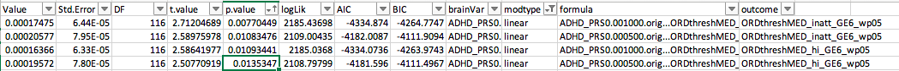

# 2020-03-11 14:44:34

Philip redefined some subjects that had emergent ADHD as a separate group. So,
the new analysis:

* check that univariate results hold for PRS if we hold all covariates in
* re-run everything, starting at univariate, for unordered 5 groups
* re-run everything, starting at univariate, for ordered 5 groups: nv012, subthreshold, emergent, improvers, persisters

First, grab the file Philip sent, add the 10 PCs and original PRS, and send it back to him:

```r
data = read.xls('~/data/baseline_prediction/prs_start/FINAL_DATA_03112020.xlsx')
prs = read.csv('/Volumes/NCR/reference/merged_NCR_1KG_PRS_12192019.csv')
data2 = merge(data, prs, al.x=T, all.y=F, suffixes=c('.resid', '.orig'), by='MRN')
saveRDS(data2, file='~/data/baseline_prediction/prs_start/complete_massagedRawNeuropsychResidsNoComorbiditiesWithPRSOrig_clinDiffGE1_03112020.rds')
```

Now, let's re-run the univariate analysis with the original PRS:

```r
data = readRDS('~/data/baseline_prediction/prs_start/complete_massagedRawNeuropsychResidsNoComorbiditiesWithPRSOrig_clinDiffGE1_03112020.rds')
brain_vars = colnames(data)[179:190]
hold = c()
min_sx = 6
out_fname = '~/data/baseline_prediction/prs_start/univar_PRSOrig_4groupOrdered_lme.csv'
qc_vars = sapply(1:10, function(x) sprintf('PC%02d', x))
for (sx in c('inatt', 'hi')) {
    phen = sprintf('ORDthreshMED_%s_GE%d_wp05', sx, min_sx)
    data[, phen] = factor(data[, phen],
                          levels=c('nv012', 'notGE6adhd', 'imp', 'nonimp'),
                          ordered=T)

    phen_res = c()
    for (bv in brain_vars) {
        use_me = !is.na(data[, bv])
        this_data = data[use_me, c(phen, 'FAMID', 'sex.x', 'base_age',
                         brain_vars, qc_vars)]
        fm_str = paste(bv, sprintf(" ~ %s + sex.x + base_age + ", phen),
                       paste(qc_vars, collapse='+'), sep="")
        fit = try(lme(as.formula(fm_str), ~1|FAMID, data=this_data, method='ML'))
        if (length(fit)>1) {
            temp = c(summary(fit)$tTable[sprintf('%s.L', phen), ],
                        summary(fit)$logLik, summary(fit)$AIC, summary(fit)$BIC,
                        bv, 'linear')
            phen_res = rbind(phen_res, temp)
            rownames(phen_res)[nrow(phen_res)] = fm_str
            temp = c(summary(fit)$tTable[sprintf('%s.Q', phen), ],
                        summary(fit)$logLik, summary(fit)$AIC, summary(fit)$BIC,
                        bv, 'quadratic')
            phen_res = rbind(phen_res, temp)
            rownames(phen_res)[nrow(phen_res)] = fm_str
            temp = c(summary(fit)$tTable[sprintf('%s.C', phen), ],
                        summary(fit)$logLik, summary(fit)$AIC, summary(fit)$BIC,
                        bv, 'cubic')
            phen_res = rbind(phen_res, temp)
            rownames(phen_res)[nrow(phen_res)] = fm_str
        } else {
            # fit broke
            temp = rep(NA, 10)
            phen_res = rbind(phen_res, temp)
            rownames(phen_res)[nrow(phen_res)] = fm_str
        }
    }
    phen_res = data.frame(phen_res)
    phen_res$formula = rownames(phen_res)
    phen_res$outcome = phen
    hold = rbind(hold, phen_res)
}
colnames(hold)[6:10] = c('logLik', 'AIC', 'BIC', 'brainVar', 'modtype')
write.csv(hold, file=out_fname, row.names=F)
```

PRS001 still looks significant for for SX:



# Univariate ordered for 5 groups

```r
data = readRDS('~/data/baseline_prediction/prs_start/complete_massagedRawNeuropsychResidsNoComorbiditiesWithPRSOrig_clinDiffGE1_03112020.rds')
brain_vars = colnames(data)[c(43:54, 67:91)]
hold = c()
min_sx = 6
cd = 1
out_fname = sprintf('~/data/baseline_prediction/prs_start/univar_medianClinDiff%d_5groupOrdered_lme.csv', cd)
for (sx in c('inatt', 'hi')) {
    phen = sprintf('ORDthreshMED_%s_GE%d_wp05_emerge_included', sx, min_sx)

    data[, phen] = factor(data[, phen],
                          levels=c('nv012', 'notGE6adhd', 'emerge', 'imp', 'nonimp'),
                          ordered=T)
    phen_res = c()
    for (bv in brain_vars) {
        use_me = !is.na(data[, bv]) #& data$bestInFamily
        this_data = data[use_me, c(phen, 'FAMID', brain_vars)]
        fm_str = paste(bv, sprintf(" ~ %s", phen), sep="")
        fit = try(lme(as.formula(fm_str), ~1|FAMID, data=this_data, method='ML'))
        if (length(fit)>1) {
            temp = c(summary(fit)$tTable[sprintf('%s.L', phen), ],
                        summary(fit)$logLik, summary(fit)$AIC, summary(fit)$BIC,
                        bv, 'linear')
            phen_res = rbind(phen_res, temp)
            rownames(phen_res)[nrow(phen_res)] = fm_str
            temp = c(summary(fit)$tTable[sprintf('%s.Q', phen), ],
                        summary(fit)$logLik, summary(fit)$AIC, summary(fit)$BIC,
                        bv, 'quadratic')
            phen_res = rbind(phen_res, temp)
            rownames(phen_res)[nrow(phen_res)] = fm_str
            temp = c(summary(fit)$tTable[sprintf('%s.C', phen), ],
                        summary(fit)$logLik, summary(fit)$AIC, summary(fit)$BIC,
                        bv, 'cubic')
            phen_res = rbind(phen_res, temp)
            rownames(phen_res)[nrow(phen_res)] = fm_str
        } else {
            # fit broke
            temp = rep(NA, 10)
            phen_res = rbind(phen_res, temp)
            rownames(phen_res)[nrow(phen_res)] = fm_str
        }
    }
    phen_res = data.frame(phen_res)
    phen_res$formula = rownames(phen_res)
    phen_res$outcome = phen
    hold = rbind(hold, phen_res)
}
colnames(hold)[6:10] = c('logLik', 'AIC', 'BIC', 'brainVar', 'modtype')
write.csv(hold, file=out_fname, row.names=F)
```

Let's also spit out our nominal results:

```r
cd = 1
res = read.csv(sprintf('~/data/baseline_prediction/prs_start/univar_medianClinDiff%d_5groupOrdered_lme.csv', cd))
res = res[res$modtype=='linear', ]
res = res[!is.na(res$p.value), ]
print(res[res$p.value<.05, c('brainVar', 'outcome', 'p.value')])

# keep only top PRS
prs_rows = which(grepl(res$brainVar, pattern='^ADHD') &
                 grepl(res$outcome, pattern='_inatt_'))
inatt_best = prs_rows[which.min(res[prs_rows, 'p.value'])]
prs_rows = which(grepl(res$brainVar, pattern='^ADHD') &
                 grepl(res$outcome, pattern='_hi_'))
hi_best = prs_rows[which.min(res[prs_rows, 'p.value'])]
res_clean = rbind(res[!grepl(res$brainVar, pattern='^ADHD'),],
                  res[inatt_best, ], res[hi_best, ])
p2 = p.adjust(res_clean$p.value, method='fdr')
print(res_clean[p2<.05,c('brainVar', 'outcome', 'p.value')])
print(res_clean[p2<.1,c('brainVar', 'outcome', 'p.value')])
```

Nominal results:

```
> print(res[res$p.value<.05, c('brainVar', 'outcome', 'p.value')])
                  brainVar                                     outcome
4   ADHD_PRS0.001000.resid ORDthreshMED_inatt_GE6_wp05_emerge_included
16  ADHD_PRS0.000500.resid ORDthreshMED_inatt_GE6_wp05_emerge_included
55                     OFC ORDthreshMED_inatt_GE6_wp05_emerge_included
62                  CST_fa ORDthreshMED_inatt_GE6_wp05_emerge_included
68                   CC_fa ORDthreshMED_inatt_GE6_wp05_emerge_included
71                  IFO_fa ORDthreshMED_inatt_GE6_wp05_emerge_included
83               VMI.beery ORDthreshMED_inatt_GE6_wp05_emerge_included
86                SSB.wisc ORDthreshMED_inatt_GE6_wp05_emerge_included
92                DSF.wisc ORDthreshMED_inatt_GE6_wp05_emerge_included
101                  VM.wj ORDthreshMED_inatt_GE6_wp05_emerge_included
104                   FSIQ ORDthreshMED_inatt_GE6_wp05_emerge_included
113 ADHD_PRS0.001000.resid    ORDthreshMED_hi_GE6_wp05_emerge_included
125 ADHD_PRS0.000500.resid    ORDthreshMED_hi_GE6_wp05_emerge_included
164                    OFC    ORDthreshMED_hi_GE6_wp05_emerge_included
170                 ATR_fa    ORDthreshMED_hi_GE6_wp05_emerge_included
173                 CST_fa    ORDthreshMED_hi_GE6_wp05_emerge_included
179                  CC_fa    ORDthreshMED_hi_GE6_wp05_emerge_included
182                 IFO_fa    ORDthreshMED_hi_GE6_wp05_emerge_included
194              VMI.beery    ORDthreshMED_hi_GE6_wp05_emerge_included
203               DSF.wisc    ORDthreshMED_hi_GE6_wp05_emerge_included
212                  VM.wj    ORDthreshMED_hi_GE6_wp05_emerge_included
215                   FSIQ    ORDthreshMED_hi_GE6_wp05_emerge_included
```

Only VMI and FSIQ survive Q < .05, but the usual variables are there at q < .1:

```> print(res_clean[p2<.05,c('brainVar', 'outcome', 'p.value')])
     brainVar                                     outcome      p.value
83  VMI.beery ORDthreshMED_inatt_GE6_wp05_emerge_included 4.241717e-06
104      FSIQ ORDthreshMED_inatt_GE6_wp05_emerge_included 2.004029e-05
194 VMI.beery    ORDthreshMED_hi_GE6_wp05_emerge_included 1.175554e-05
215      FSIQ    ORDthreshMED_hi_GE6_wp05_emerge_included 2.467595e-04
> print(res_clean[p2<.1,c('brainVar', 'outcome', 'p.value')])
                  brainVar                                     outcome
62                  CST_fa ORDthreshMED_inatt_GE6_wp05_emerge_included
68                   CC_fa ORDthreshMED_inatt_GE6_wp05_emerge_included
71                  IFO_fa ORDthreshMED_inatt_GE6_wp05_emerge_included
83               VMI.beery ORDthreshMED_inatt_GE6_wp05_emerge_included
86                SSB.wisc ORDthreshMED_inatt_GE6_wp05_emerge_included
92                DSF.wisc ORDthreshMED_inatt_GE6_wp05_emerge_included
101                  VM.wj ORDthreshMED_inatt_GE6_wp05_emerge_included
104                   FSIQ ORDthreshMED_inatt_GE6_wp05_emerge_included
164                    OFC    ORDthreshMED_hi_GE6_wp05_emerge_included
170                 ATR_fa    ORDthreshMED_hi_GE6_wp05_emerge_included
173                 CST_fa    ORDthreshMED_hi_GE6_wp05_emerge_included
179                  CC_fa    ORDthreshMED_hi_GE6_wp05_emerge_included
182                 IFO_fa    ORDthreshMED_hi_GE6_wp05_emerge_included
194              VMI.beery    ORDthreshMED_hi_GE6_wp05_emerge_included
203               DSF.wisc    ORDthreshMED_hi_GE6_wp05_emerge_included
215                   FSIQ    ORDthreshMED_hi_GE6_wp05_emerge_included
16  ADHD_PRS0.000500.resid ORDthreshMED_inatt_GE6_wp05_emerge_included
113 ADHD_PRS0.001000.resid    ORDthreshMED_hi_GE6_wp05_emerge_included
```
