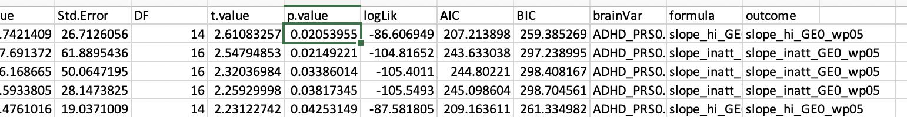
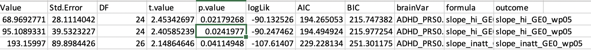
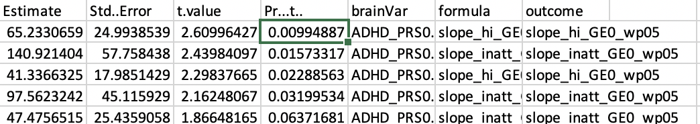
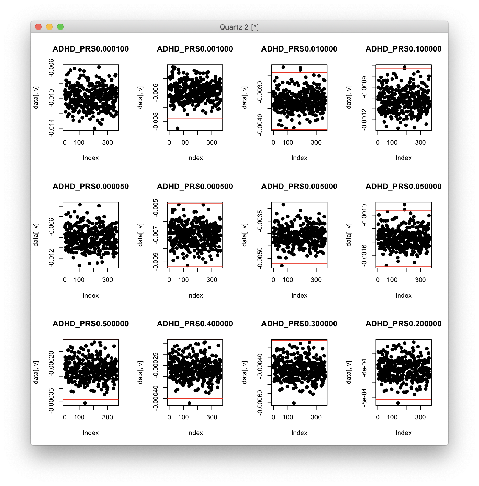
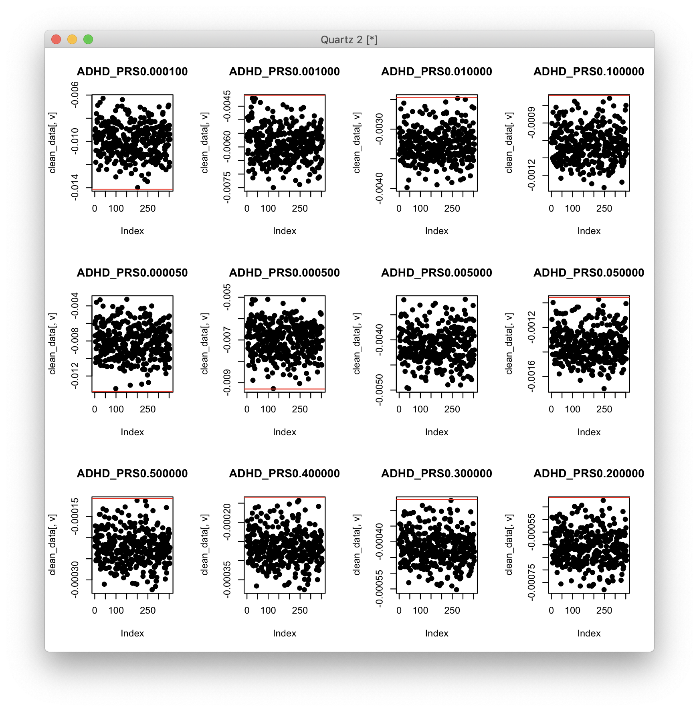
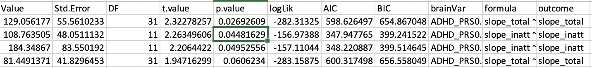

# 2020-03-12 09:54:40

Let's gert p-values from multinom. The idea came from:

https://stats.stackexchange.com/questions/63222/getting-p-values-for-multinom-in-r-nnet-package/125509

```r
library(caret)
library(nnet)
library(pROC)

data = readRDS('~/data/baseline_prediction/prs_start/complete_massagedRawNeuropsychResidsNoComorbiditiesIRMI_clinDiffGE1_03062020.rds')

# clinDiff1
inatt_vars = c('OFC', 'ATR_fa', 'CC_fa', 'VMI.beery', 'VM.wj', 'FSIQ',
               'ADHD_PRS0.001000')
hi_vars = c('temporal', 'OFC', 'ATR_fa', 'CST_fa', 'CC_fa', 'IFO_fa',
            'VMI.beery', 'DSF.wisc', 'VM.wj', 'FSIQ', 'ADHD_PRS0.001000')

covars = c('base_age', 'sex')
min_sx = 6
sx = 'hi'

# removing the loop because we'll need different contrasts for the p-values
# 4 classes

set.seed(42)
phen = sprintf('threshMED_%s_GE%d_wp05', sx, min_sx)
eval(parse(text=sprintf('this_data = data[, c(phen, %s_vars, covars)]',
                        sx)))

scale_me = c()
for (v in colnames(this_data)) {
    if (!is.factor(this_data[, v])) {
        scale_me = c(scale_me, v)
    }
}
this_data[, scale_me] = scale(this_data[, scale_me])

eval(parse(text=sprintf('predictors_str=paste(%s_vars, collapse="+")', sx)))
fm_str = paste(phen, " ~ ", predictors_str, ' + ', 
            paste(covars, collapse='+'),
            sep="")
fit = multinom(as.formula(fm_str), data=this_data, maxit=2000)
preds = predict(fit, type='prob')
print(sx)
print(varImp(fit))
print(multiclass.roc(this_data[, phen], preds))

library(afex)
set_sum_contrasts() # use sum coding, necessary to make type III LR tests valid
library(car)
Anova(fit ,type="III")
```

For inatt:

```
Analysis of Deviance Table (Type III tests)

Response: threshMED_inatt_GE6_wp05
                 LR Chisq Df Pr(>Chisq)  
OFC                6.6960  3    0.08225 .
ATR_fa             4.4253  3    0.21906  
CC_fa              5.3299  3    0.14917  
VMI.beery          3.7331  3    0.29177  
VM.wj             10.7387  3    0.01323 *
FSIQ               9.4270  3    0.02412 *
ADHD_PRS0.001000   2.9722  3    0.39594  
base_age          10.8909  3    0.01233 *
sex                4.4971  3    0.21255  
---
Signif. codes:  0 ‘***’ 0.001 ‘**’ 0.01 ‘*’ 0.05 ‘.’ 0.1 ‘ ’ 1
```

And hi:

```
Analysis of Deviance Table (Type III tests)

Response: threshMED_hi_GE6_wp05
                 LR Chisq Df Pr(>Chisq)   
temporal           0.4909  3   0.920886   
OFC                4.1855  3   0.242119   
ATR_fa             2.5093  3   0.473614   
CST_fa             5.6175  3   0.131775   
CC_fa              0.3561  3   0.949149   
IFO_fa             2.9899  3   0.393188   
VMI.beery          3.9741  3   0.264279   
DSF.wisc           1.3273  3   0.722673   
VM.wj             11.7548  3   0.008272 **
FSIQ              10.1524  3   0.017314 * 
ADHD_PRS0.001000   3.2275  3   0.357858   
base_age           7.1117  3   0.068421 . 
sex                2.6212  3   0.453789   
---
Signif. codes:  0 ‘***’ 0.001 ‘**’ 0.01 ‘*’ 0.05 ‘.’ 0.1 ‘ ’ 1
```

# 2020-03-12 10:31:43

Philip asked for analysis using within-sx defined groups. 

```r
winsorize = function(x, cut = 0.01){
  cut_point_top <- quantile(x, 1 - cut, na.rm = T)
  cut_point_bottom <- quantile(x, cut, na.rm = T)
  i = which(x >= cut_point_top) 
  x[i] = cut_point_top
  j = which(x <= cut_point_bottom) 
  x[j] = cut_point_bottom
  return(x)
}

data = readRDS('~/data/baseline_prediction/prs_start/complete_massagedRawNeuropsychResidsNoComorbidities_clinDiffGE1_03062020.rds')
min_sx = 6
for (sx in c('inatt', 'hi')) {
    idx = data[, sprintf('base_%s', sx)] >= min_sx
    data[, sprintf('WithinSX_slope_%s_GE%d_wp05', sx, min_sx)] = NA
    junk = winsorize(data[idx, sprintf('slope_%s', sx)], cut=.05)
    data[idx, sprintf('WithinSX_slope_%s_GE%d_wp05', sx, min_sx)] = junk

    phen_slope = sprintf('WithinSX_slope_%s_GE%d_wp05', sx, min_sx)
    thresh = median(data[, phen_slope], na.rm=T)
    phen = sprintf('WithinSX_threshMED_%s_GE%d_wp05', sx, min_sx)
    data[, phen] = 'notGE6adhd'
    my_nvs = which(is.na(data[, phen_slope]))
    idx = data[my_nvs, 'base_inatt'] <= 2 & data[my_nvs, 'base_hi'] <= 2
    data[my_nvs[idx], phen] = 'nv012'
    data[which(data[, phen_slope] < thresh), phen] = 'imp'
    data[which(data[, phen_slope] >= thresh), phen] = 'nonimp'
    data[, phen] = factor(data[, phen], ordered=F)
    data[, phen] = relevel(data[, phen], ref='nv012')
    ophen = sprintf('WithinSX_ORDthreshMED_%s_GE%d_wp05', sx, min_sx)
    data[, ophen] = factor(data[, phen],
                        levels=c('nv012', 'notGE6adhd', 'imp', 'nonimp'),
                        ordered=T)
}
```

And here are the new numbers:

```
> summary(data$ORDthreshMED_inatt_GE6_wp05)
     nv012 notGE6adhd        imp     nonimp 
       148         44         85         86 
> summary(data$WithinSX_ORDthreshMED_inatt_GE6_wp05)
     nv012 notGE6adhd        imp     nonimp 
       148         88         63         64 
> summary(data$ORDthreshMED_hi_GE6_wp05)
     nv012 notGE6adhd        imp     nonimp 
       148         44         85         86 
> summary(data$WithinSX_ORDthreshMED_hi_GE6_wp05)
     nv012 notGE6adhd        imp     nonimp 
       148        103         56         56 
```

Basically, lots of numbers in the 2 clinical groups are lost to the notGE6adhd
category, which makes sense because they're not greater or equal to 6 sx in the
specific sx. Now, we go into the univariate analysis:

```r
library(nlme)
brain_vars = colnames(data)[c(51:62, 75:99)]
hold = c()
min_sx = 6
out_fname = '~/data/baseline_prediction/prs_start/univar_withinSXDiff_4groupOrdered_lme.csv'
for (sx in c('inatt', 'hi')) {
    phen = sprintf('WithinSX_ORDthreshMED_%s_GE%d_wp05', sx, min_sx)

    phen_res = c()
    for (bv in brain_vars) {
        use_me = !is.na(data[, bv]) #& data$bestInFamily
        this_data = data[use_me, c(phen, 'FAMID', brain_vars)]
        fm_str = paste(bv, sprintf(" ~ %s", phen), sep="")
        fit = try(lme(as.formula(fm_str), ~1|FAMID, data=this_data, method='ML'))
        if (length(fit)>1) {
            temp = c(summary(fit)$tTable[sprintf('%s.L', phen), ],
                        summary(fit)$logLik, summary(fit)$AIC, summary(fit)$BIC,
                        bv, 'linear')
            phen_res = rbind(phen_res, temp)
            rownames(phen_res)[nrow(phen_res)] = fm_str
            temp = c(summary(fit)$tTable[sprintf('%s.Q', phen), ],
                        summary(fit)$logLik, summary(fit)$AIC, summary(fit)$BIC,
                        bv, 'quadratic')
            phen_res = rbind(phen_res, temp)
            rownames(phen_res)[nrow(phen_res)] = fm_str
            temp = c(summary(fit)$tTable[sprintf('%s.C', phen), ],
                        summary(fit)$logLik, summary(fit)$AIC, summary(fit)$BIC,
                        bv, 'cubic')
            phen_res = rbind(phen_res, temp)
            rownames(phen_res)[nrow(phen_res)] = fm_str
        } else {
            # fit broke
            temp = rep(NA, 10)
            phen_res = rbind(phen_res, temp)
            rownames(phen_res)[nrow(phen_res)] = fm_str
        }
    }
    phen_res = data.frame(phen_res)
    phen_res$formula = rownames(phen_res)
    phen_res$outcome = phen
    hold = rbind(hold, phen_res)
}
colnames(hold)[6:10] = c('logLik', 'AIC', 'BIC', 'brainVar', 'modtype')
write.csv(hold, file=out_fname, row.names=F)
```

And check the p-values:

```r
res = read.csv('~/data/baseline_prediction/prs_start/univar_withinSXDiff_4groupOrdered_lme.csv')
res = res[res$modtype=='linear', ]
res = res[!is.na(res$p.value), ]
print(res[res$p.value<.05, c('brainVar', 'outcome', 'p.value')])

# keep only top PRS
prs_rows = which(grepl(res$brainVar, pattern='^ADHD') &
                 grepl(res$outcome, pattern='_inatt_'))
inatt_best = prs_rows[which.min(res[prs_rows, 'p.value'])]
prs_rows = which(grepl(res$brainVar, pattern='^ADHD') &
                 grepl(res$outcome, pattern='_hi_'))
hi_best = prs_rows[which.min(res[prs_rows, 'p.value'])]
res_clean = rbind(res[!grepl(res$brainVar, pattern='^ADHD'),],
                  res[inatt_best, ], res[hi_best, ])
p2 = p.adjust(res_clean$p.value, method='fdr')
print(res_clean[p2<.05,c('brainVar', 'outcome', 'p.value')])
print(res_clean[p2<.1,c('brainVar', 'outcome', 'p.value')])
```

```
> print(res[res$p.value<.05, c('brainVar', 'outcome', 'p.value')])
            brainVar                              outcome      p.value
55               OFC WithinSX_ORDthreshMED_inatt_GE6_wp05 1.554708e-02
61            ATR_fa WithinSX_ORDthreshMED_inatt_GE6_wp05 4.494781e-02
70             CC_fa WithinSX_ORDthreshMED_inatt_GE6_wp05 4.743345e-02
85         VMI.beery WithinSX_ORDthreshMED_inatt_GE6_wp05 7.066820e-03
100            DS.wj WithinSX_ORDthreshMED_inatt_GE6_wp05 3.420819e-02
103            VM.wj WithinSX_ORDthreshMED_inatt_GE6_wp05 3.603206e-04
106             FSIQ WithinSX_ORDthreshMED_inatt_GE6_wp05 7.436820e-03
112 ADHD_PRS0.000100    WithinSX_ORDthreshMED_hi_GE6_wp05 1.835396e-02
115 ADHD_PRS0.001000    WithinSX_ORDthreshMED_hi_GE6_wp05 3.225880e-02
127 ADHD_PRS0.000500    WithinSX_ORDthreshMED_hi_GE6_wp05 9.492870e-03
181            CC_fa    WithinSX_ORDthreshMED_hi_GE6_wp05 3.797798e-02
196        VMI.beery    WithinSX_ORDthreshMED_hi_GE6_wp05 2.432689e-06
217             FSIQ    WithinSX_ORDthreshMED_hi_GE6_wp05 1.468426e-03
> p2 = p.adjust(res_clean$p.value, method='fdr')
> print(res_clean[p2<.05,c('brainVar', 'outcome', 'p.value')])
     brainVar                              outcome      p.value
103     VM.wj WithinSX_ORDthreshMED_inatt_GE6_wp05 3.603206e-04
196 VMI.beery    WithinSX_ORDthreshMED_hi_GE6_wp05 2.432689e-06
217      FSIQ    WithinSX_ORDthreshMED_hi_GE6_wp05 1.468426e-03
> print(res_clean[p2<.1,c('brainVar', 'outcome', 'p.value')])
            brainVar                              outcome      p.value
85         VMI.beery WithinSX_ORDthreshMED_inatt_GE6_wp05 7.066820e-03
103            VM.wj WithinSX_ORDthreshMED_inatt_GE6_wp05 3.603206e-04
106             FSIQ WithinSX_ORDthreshMED_inatt_GE6_wp05 7.436820e-03
196        VMI.beery    WithinSX_ORDthreshMED_hi_GE6_wp05 2.432689e-06
217             FSIQ    WithinSX_ORDthreshMED_hi_GE6_wp05 1.468426e-03
127 ADHD_PRS0.000500    WithinSX_ORDthreshMED_hi_GE6_wp05 9.492870e-03
```

No PRS significant for inatt, even nominally. Let me try to play with the GE
threshold to see if results come back, as the class ratios will change too.

```r
winsorize = function(x, cut = 0.01){
  cut_point_top <- quantile(x, 1 - cut, na.rm = T)
  cut_point_bottom <- quantile(x, cut, na.rm = T)
  i = which(x >= cut_point_top) 
  x[i] = cut_point_top
  j = which(x <= cut_point_bottom) 
  x[j] = cut_point_bottom
  return(x)
}

data = readRDS('~/data/baseline_prediction/prs_start/complete_massagedRawNeuropsychResidsNoComorbidities_clinDiffGE1_03062020.rds')
for (min_sx in 4:6) {
    for (sx in c('inatt', 'hi')) {
        idx = data[, sprintf('base_%s', sx)] >= min_sx
        data[, sprintf('WithinSX_slope_%s_GE%d_wp05', sx, min_sx)] = NA
        junk = winsorize(data[idx, sprintf('slope_%s', sx)], cut=.05)
        data[idx, sprintf('WithinSX_slope_%s_GE%d_wp05', sx, min_sx)] = junk

        phen_slope = sprintf('WithinSX_slope_%s_GE%d_wp05', sx, min_sx)
        thresh = median(data[, phen_slope], na.rm=T)
        phen = sprintf('WithinSX_threshMED_%s_GE%d_wp05', sx, min_sx)
        data[, phen] = 'subclin'
        my_nvs = which(is.na(data[, phen_slope]))
        idx = data[my_nvs, 'base_inatt'] <= 2 & data[my_nvs, 'base_hi'] <= 2
        data[my_nvs[idx], phen] = 'nv012'
        data[which(data[, phen_slope] < thresh), phen] = 'imp'
        data[which(data[, phen_slope] >= thresh), phen] = 'nonimp'
        data[, phen] = factor(data[, phen], ordered=F)
        data[, phen] = relevel(data[, phen], ref='nv012')
        ophen = sprintf('WithinSX_ORDthreshMED_%s_GE%d_wp05', sx, min_sx)
        data[, ophen] = factor(data[, phen],
                            levels=c('nv012', 'subclin', 'imp', 'nonimp'),
                            ordered=T)
    }
}
```

```r
library(nlme)
brain_vars = colnames(data)[c(51:62, 75:99)]
for (min_sx in 4:6) {
    hold = c()
    out_fname = sprintf('~/data/baseline_prediction/prs_start/univar_withinSXGE%d_4groupOrdered_lme.csv', min_sx)
    for (sx in c('inatt', 'hi')) {
        phen = sprintf('WithinSX_ORDthreshMED_%s_GE%d_wp05', sx, min_sx)

        phen_res = c()
        for (bv in brain_vars) {
            use_me = !is.na(data[, bv]) #& data$bestInFamily
            this_data = data[use_me, c(phen, 'FAMID', brain_vars)]
            fm_str = paste(bv, sprintf(" ~ %s", phen), sep="")
            fit = try(lme(as.formula(fm_str), ~1|FAMID, data=this_data, method='ML'))
            if (length(fit)>1) {
                temp = c(summary(fit)$tTable[sprintf('%s.L', phen), ],
                            summary(fit)$logLik, summary(fit)$AIC, summary(fit)$BIC,
                            bv, 'linear')
                phen_res = rbind(phen_res, temp)
                rownames(phen_res)[nrow(phen_res)] = fm_str
                temp = c(summary(fit)$tTable[sprintf('%s.Q', phen), ],
                            summary(fit)$logLik, summary(fit)$AIC, summary(fit)$BIC,
                            bv, 'quadratic')
                phen_res = rbind(phen_res, temp)
                rownames(phen_res)[nrow(phen_res)] = fm_str
                temp = c(summary(fit)$tTable[sprintf('%s.C', phen), ],
                            summary(fit)$logLik, summary(fit)$AIC, summary(fit)$BIC,
                            bv, 'cubic')
                phen_res = rbind(phen_res, temp)
                rownames(phen_res)[nrow(phen_res)] = fm_str
            } else {
                # fit broke
                temp = rep(NA, 10)
                phen_res = rbind(phen_res, temp)
                rownames(phen_res)[nrow(phen_res)] = fm_str
            }
        }
        phen_res = data.frame(phen_res)
        phen_res$formula = rownames(phen_res)
        phen_res$outcome = phen
        hold = rbind(hold, phen_res)
    }
    colnames(hold)[6:10] = c('logLik', 'AIC', 'BIC', 'brainVar', 'modtype')
    write.csv(hold, file=out_fname, row.names=F)
}
```

Nothing is coming up for inatt... need to thing of different solution.

# Different ideas

What if we go back to the idea of just looking at symptomatic kids, defined at
within sx baseline, and run the regression to slope? Then, we can compare the
NVs to that just to see where they belong. This would be a way to distinguish
NVs that don't change much from non-improvers. Let's start with PRS forcing the
covariates, as Philip suggested in the past. Then we can find the best threshold
based on PRS results and go from there.

```r
library(nlme)
data = readRDS('~/data/baseline_prediction/prs_start/complete_massagedRawNeuropsychResidsNoComorbiditiesWithPRSOrig_clinDiffGE1_03112020.rds')
data = data[data$NSB.resid!=11360,]
brain_vars = colnames(data)[179:190]
qc_vars = sapply(1:10, function(x) sprintf('PC%02d', x))
for (min_sx in 0:6) {
    hold = c()
    out_fname = sprintf('~/data/baseline_prediction/prs_start/univar_slopes_PRSOrig_GE%d_lme.csv', min_sx)
    for (sx in c('inatt', 'hi')) {
        phen = sprintf('slope_%s_GE0_wp05', sx)
        base_sx = sprintf('base_%s', sx)
        phen_res = c()
        for (bv in brain_vars) {
            use_me = !is.na(data[, bv]) & data[, base_sx] > min_sx
            this_data = data[use_me, c(phen, 'FAMID', 'sex.x', 'base_age',
                             brain_vars, qc_vars, base_sx)]
            fm_str = paste(phen, sprintf(" ~ %s + sex.x + base_age + ", bv),
                           paste(c(base_sx, qc_vars), collapse='+'), sep="")
            fit = try(lme(as.formula(fm_str), ~1|FAMID, data=this_data, method='ML'))
            if (length(fit)>1) {
                temp = c(summary(fit)$tTable[sprintf('%s', bv), ],
                            summary(fit)$logLik, summary(fit)$AIC, summary(fit)$BIC,
                            bv)
                phen_res = rbind(phen_res, temp)
                rownames(phen_res)[nrow(phen_res)] = fm_str
            } else {
                # fit broke
                temp = rep(NA, 9)
                phen_res = rbind(phen_res, temp)
                rownames(phen_res)[nrow(phen_res)] = fm_str
            }
        }
        phen_res = data.frame(phen_res)
        phen_res$formula = rownames(phen_res)
        phen_res$outcome = phen
        hold = rbind(hold, phen_res)
    }
    colnames(hold)[6:9] = c('logLik', 'AIC', 'BIC', 'brainVar')
    write.csv(hold, file=out_fname, row.names=F)
}

```

Results weren't great, with GE3 doing best, which included results for both
inatt and hi:



Do the results improve if we use lm, or the residualized PRS?

```r
library(nlme)
data = readRDS('~/data/baseline_prediction/prs_start/complete_massagedRawNeuropsychResidsNoComorbiditiesWithPRSOrig_clinDiffGE1_03112020.rds')
data = data[data$NSB.resid!=11360,]
brain_vars = colnames(data)[43:54]
for (min_sx in 0:6) {
    hold = c()
    out_fname = sprintf('~/data/baseline_prediction/prs_start/univar_slopes_PRSresid_GE%d_lme.csv', min_sx)
    for (sx in c('inatt', 'hi')) {
        phen = sprintf('slope_%s_GE0_wp05', sx)
        base_sx = sprintf('base_%s', sx)
        phen_res = c()
        for (bv in brain_vars) {
            use_me = !is.na(data[, bv]) & data[, base_sx] > min_sx
            this_data = data[use_me, c(phen, 'FAMID', 'sex.x', 'base_age',
                             brain_vars, base_sx)]
            fm_str = paste(phen, sprintf(" ~ %s + sex.x + base_age + %s", bv,
                           base_sx), sep="")
            fit = try(lme(as.formula(fm_str), ~1|FAMID, data=this_data, method='ML'))
            if (length(fit)>1) {
                temp = c(summary(fit)$tTable[sprintf('%s', bv), ],
                            summary(fit)$logLik, summary(fit)$AIC, summary(fit)$BIC,
                            bv)
                phen_res = rbind(phen_res, temp)
                rownames(phen_res)[nrow(phen_res)] = fm_str
            } else {
                # fit broke
                temp = rep(NA, 9)
                phen_res = rbind(phen_res, temp)
                rownames(phen_res)[nrow(phen_res)] = fm_str
            }
        }
        phen_res = data.frame(phen_res)
        phen_res$formula = rownames(phen_res)
        phen_res$outcome = phen
        hold = rbind(hold, phen_res)
    }
    colnames(hold)[6:9] = c('logLik', 'AIC', 'BIC', 'brainVar')
    write.csv(hold, file=out_fname, row.names=F)
}
```

Not much there either:



Let's look into lm, either using everyone or just one per family. Note that the
sample I removed was the only one in their family, so no issues there. They
don't have brain data either, so also something not to worry about.

```r
data = readRDS('~/data/baseline_prediction/prs_start/complete_massagedRawNeuropsychResidsNoComorbiditiesWithPRSOrig_clinDiffGE1_03112020.rds')
data = data[data$NSB.resid!=11360,]
brain_vars = colnames(data)[179:190]
for (min_sx in 0:6) {
    hold = c()
    out_fname = sprintf('~/data/baseline_prediction/prs_start/univar_slopes_PRSorig_GE%d_lmBIF.csv', min_sx)
    for (sx in c('inatt', 'hi')) {
        phen = sprintf('slope_%s_GE0_wp05', sx)
        base_sx = sprintf('base_%s', sx)
        phen_res = c()
        for (bv in brain_vars) {
            use_me = !is.na(data[, bv]) & data[, base_sx] > min_sx & data$bestInFamily
            this_data = data[use_me, c(phen, 'FAMID', 'sex.x', 'base_age',
                             brain_vars, base_sx)]
            fm_str = paste(phen, sprintf(" ~ %s + sex.x + base_age + %s", bv,
                           base_sx), sep="")
            fit = lm(as.formula(fm_str), data=this_data)
            temp = c(summary(fit)$coefficients[sprintf('%s', bv), ], bv)
            phen_res = rbind(phen_res, temp)
            rownames(phen_res)[nrow(phen_res)] = fm_str
        }
        phen_res = data.frame(phen_res)
        phen_res$formula = rownames(phen_res)
        phen_res$outcome = phen
        hold = rbind(hold, phen_res)
    }
    colnames(hold)[5] = 'brainVar'
    write.csv(hold, file=out_fname, row.names=F)
}
```

Now we do get some results in GE both SX, in the entire dataset:



We lose a lot of power by doing best in family only... barely a couple are
significant, and only for HI.

What if we go back to the begining?

```r
min_clin = 1

setwd('~/data/baseline_prediction/prs_start/')
clin_long = read.csv('long_clin_01062020_lt16.csv')
clin_long$SX_total = clin_long$SX_inatt + clin_long$SX_hi

winsorize = function(x, cut = 0.01){
  cut_point_top <- quantile(x, 1 - cut, na.rm = T)
  cut_point_bottom <- quantile(x, cut, na.rm = T)
  i = which(x >= cut_point_top) 
  x[i] = cut_point_top
  j = which(x <= cut_point_bottom) 
  x[j] = cut_point_bottom
  return(x)
}

df = data.frame(MRN=unique(clin_long$MRN))
for (r in 1:nrow(df)) {
    subj_data = clin_long[clin_long$MRN==df$MRN[r], ]
    for (sx in c('inatt', 'hi', 'total')) {
        fit = lm(as.formula(sprintf('SX_%s ~ age', sx)), data=subj_data)
        df[r, sprintf('slope_%s', sx)] = fit$coefficients['age']
        base_row = which.min(subj_data$age)
        df[r, sprintf('base_%s', sx)] = subj_data[base_row, sprintf('SX_%s', sx)]
        last_row = which.max(subj_data$age)
        df[r, sprintf('last_%s', sx)] = subj_data[last_row, sprintf('SX_%s', sx)]
        df[r, 'base_age'] = subj_data[base_row, 'age']
        df[r, 'base_DOA'] = subj_data[base_row, 'DOA']
        df[r, 'last_age'] = subj_data[last_row, 'age']
        df[r, 'last_DOA'] = subj_data[last_row, 'DOA']
        df[r, 'sex'] = subj_data[last_row, 'sex']
    }
}

demo = read.csv('prs_demo.csv')
# just to get FAMID, sex already there
df = merge(df, subset(demo, select=-sex), by='MRN')

# cut kids if not enough time between clinical assessments
keep_me = which((df$last_age - df$base_age) >= min_clin)
df = df[keep_me, ]

library(gdata)
como = read.xls('~/data/baseline_prediction/prs_start/baseline_with_comorbidity_added_ps_edits_03052020.xlsx')
rm_me = como$internalizing_ps_check_UPDATED==1 | como$externalizing_ps_check_UPDATED==1
df = df[!rm_me, ]

# selecting best kid in family
df$bestInFamily = F
nvisits = table(clin_long$MRN)
df = merge(df, as.matrix(nvisits), by.x='MRN', by.y=0)
colnames(df)[ncol(df)] = 'nvisits'
for (f in unique(df$FAMID)) {
    fam_rows = which(df$FAMID == f)
    fam_data = df[fam_rows,]
    if (nrow(fam_data) == 1) {
        df[fam_rows,]$bestInFamily = T
    } else {
        stotal = sort(fam_data$slope_total, index.return=T, decreasing=T)
        # if there's a tie
        if (stotal$x[1] == stotal$x[2]) {
            # print(sprintf('Tie in slope for %d', f))
            svisits = sort(fam_data$nvisits, index.return=T, decreasing=T)
            if (svisits$x[1] == svisits$x[2]) {
                print(sprintf('Tie in number of visits for %d', f))
                print(fam_data[fam_data$nvisits==svisits$x[1], ]$MRN)
            } else {
                df[fam_rows[svisits$ix[1]], ]$bestInFamily = T
            }
        } else {
            df[fam_rows[stotal$ix[1]], ]$bestInFamily = T
        }
    }
}

df[df$MRN==4585574, ]$bestInFamily = T
df[df$MRN==4925051, ]$bestInFamily = T
df[df$MRN==7079035, ]$bestInFamily = T
df[df$MRN==7378993, ]$bestInFamily = T
# chosen because of overall best MPRAGE QC
df[df$MRN==4640378, ]$bestInFamily = T
# chosen because of overall best MPRAGE QC
df[df$MRN==7218965, ]$bestInFamily = T

prs = read.csv('/Volumes/NCR/reference/merged_NCR_1KG_PRS_12192019.csv')
prs = prs[prs$NSB != 11360, ]
data = merge(df, prs, by='MRN', all.x=F, all.y=F)

saveRDS(data, file='~/data/baseline_prediction/prs_start/prs_only.rds')
```

OK, let's do some analysis on PRS only:

```r
par(mfrow=c(3,4))
phen_vars = colnames(data)[grepl(colnames(data), pattern="^ADHD_")]
for (v in phen_vars) {
    plot(data[, v], pch=19, main=v)
    m = mean(data[, v], na.rm=T)
    s = sd(data[, v], na.rm=T)
    abline(h=m + 3*s, col='red')
    abline(h=m - 3*s, col='red')
}
```



There's a dot consistently showing as an outlier... let's get rid of it. 

```r
clean_data = data[-142, ]
par(mfrow=c(3,4))
phen_vars = colnames(clean_data)[grepl(colnames(clean_data), pattern="^ADHD_")]
for (v in phen_vars) {
    plot(clean_data[, v], pch=19, main=v)
    m = mean(clean_data[, v], na.rm=T)
    s = sd(clean_data[, v], na.rm=T)
    abline(h=m + 3*s, col='red')
    abline(h=m - 3*s, col='red')
}
```

We still have a few outliers... if we do this iteratively until the data is all
clean, how many subjects do we have left?

```r
imdirty = T
clean_data = data
phen_vars = colnames(clean_data)[grepl(colnames(clean_data), pattern="^ADHD_")]
print(sprintf('Subjects left: %d', nrow(clean_data)))
while (imdirty) {
    rm_subjs = c()
    for (v in phen_vars) {
        m = mean(clean_data[, v], na.rm=T)
        s = sd(clean_data[, v], na.rm=T)
        bad_subjs = which(clean_data[, v] >= (m + 3*s) |
                          clean_data[, v] <= (m - 3*s))
        rm_subjs = c(bad_subjs, rm_subjs)
    }
    rm_subjs = unique(rm_subjs)
    clean_data = clean_data[-rm_subjs, ]
    imdirty = length(bad_subjs) > 0
    print(sprintf('Subjects left: %d', nrow(clean_data)))
}
```

OK, now we're down to 354 subjects, but supposedly no outliers:

```r
par(mfrow=c(3,4))
phen_vars = colnames(clean_data)[grepl(colnames(clean_data), pattern="^ADHD_")]
for (v in phen_vars) {
    plot(clean_data[, v], pch=19, main=v)
    m = mean(clean_data[, v], na.rm=T)
    s = sd(clean_data[, v], na.rm=T)
    abline(h=m + 3*s, col='red')
    abline(h=m - 3*s, col='red')
}
```



What happens if we run our lme now?

```r
library(nlme)
data = clean_data
brain_vars = phen_vars
qc_vars = sapply(1:10, function(x) sprintf('PC%02d', x))
for (min_sx in 0:6) {
    hold = c()
    out_fname = sprintf('~/data/baseline_prediction/prs_start/univar_slopesNoOut_PRSOrig_GE%d_lme.csv', min_sx)
    for (sx in c('inatt', 'hi', 'total')) {
        phen = sprintf('slope_%s', sx)
        base_sx = sprintf('base_%s', sx)
        phen_res = c()
        for (bv in brain_vars) {
            use_me = !is.na(data[, bv]) & data[, base_sx] > min_sx
            this_data = data[use_me, c(phen, 'FAMID', 'sex', 'base_age',
                             brain_vars, qc_vars, base_sx)]
            fm_str = paste(phen, sprintf(" ~ %s + sex + base_age + ", bv),
                           paste(c(base_sx, qc_vars), collapse='+'), sep="")
            fit = try(lme(as.formula(fm_str), ~1|FAMID, data=this_data, method='ML'))
            if (length(fit)>1) {
                temp = c(summary(fit)$tTable[sprintf('%s', bv), ],
                            summary(fit)$logLik, summary(fit)$AIC, summary(fit)$BIC,
                            bv)
                phen_res = rbind(phen_res, temp)
                rownames(phen_res)[nrow(phen_res)] = fm_str
            } else {
                # fit broke
                temp = rep(NA, 9)
                phen_res = rbind(phen_res, temp)
                rownames(phen_res)[nrow(phen_res)] = fm_str
            }
        }
        phen_res = data.frame(phen_res)
        phen_res$formula = rownames(phen_res)
        phen_res$outcome = phen
        hold = rbind(hold, phen_res)
    }
    colnames(hold)[6:9] = c('logLik', 'AIC', 'BIC', 'brainVar')
    write.csv(hold, file=out_fname, row.names=F)
}
```

I added total, but it's not doing much...



OK, let's go back to the ordinal model then.

```r
min_sx = 6
for (sx in c('inatt', 'hi')) {
    my_adhds = data[, sprintf('base_%s', sx)] >= min_sx
    data[, sprintf('withinSX_slope_%s_GE%d', sx, min_sx)] = NA
    phen_slope = sprintf('slope_%s', sx)
    thresh = median(data[my_adhds, phen_slope], na.rm=T)
    phen = sprintf('withinSX_threshMED_%s_GE%d', sx, min_sx)
    data[, phen] = 'subclin'
    my_nvs = which(!my_adhds)
    idx = data[my_nvs, 'base_inatt'] <= 2 & data[my_nvs, 'base_hi'] <= 2
    data[my_nvs[idx], phen] = 'nv012'
    idx = data[my_adhds, phen_slope] < thresh
    data[my_adhds[idx], phen] = 'imp'
    idx = data[my_adhds, phen_slope] >= thresh
    data[my_adhds[idx], phen] = 'nonimp'
    data[, phen] = factor(data[, phen], ordered=F)
    data[, phen] = relevel(data[, phen], ref='nv012')
    ophen = sprintf('withinSX_ORDthreshMED_%s_GE%d', sx, min_sx)
    data[, ophen] = factor(data[, phen],
                        levels=c('nv012', 'subclin', 'imp', 'nonimp'),
                        ordered=T)
}
```

Now we can run univariate again, except that it's the multinomial regression
we've been using for the big model, because the target is the category... but
then I run into the same issue that multinom doesn't take a random term.

Another option is to conduct the exact same analysis as before, but do it on
total sysmptoms. If the 2 clinical groups were defined based on ADHD yes/no,
regardless of which SX, then we could define improvers/non-improvers the same
way.

Then, the inatt/sx analysis is more of a robustness check.

* Maybe try old way to do QC, to get a different neuroimaging dataset, after
  determining the best target from PRS?
